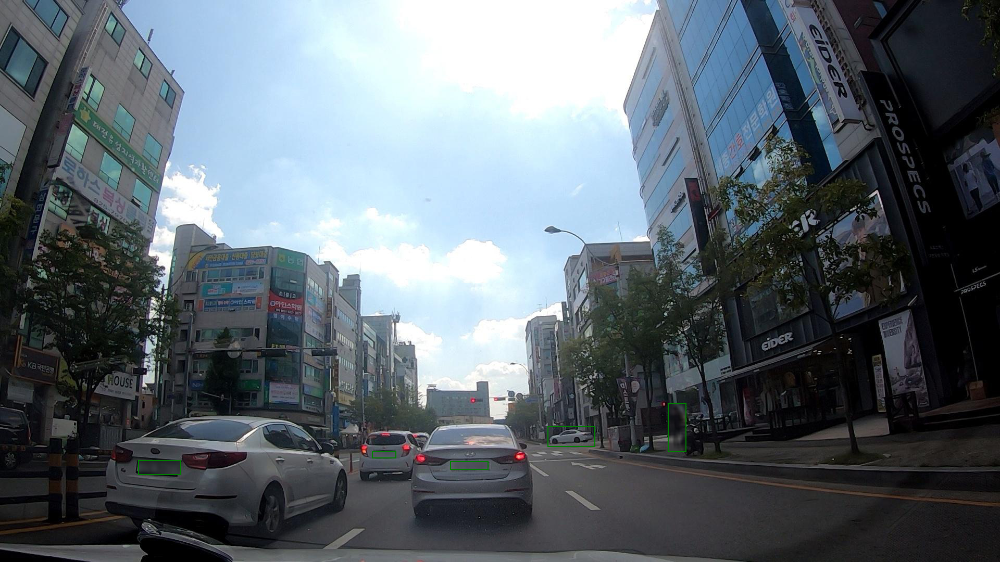

# [컴퓨터비전] JSON으로 구성된 Image Detection Feature 전처리


```python
import json
import pandas as pd
from PIL import Image, ImageDraw
```


```python
#JSON 파일이 저장된 경로 지정
json_dir = "./Data/DataSet/DataSet.json"
```


```python
#JSON 저장 경로 지정 후 contents 변수에 json load & read
with open(json_dir, 'r') as j:
     contents = json.loads(j.read())
```


```python
print(json.dumps(contents))
```

    IOPub data rate exceeded.
    The notebook server will temporarily stop sending output
    to the client in order to avoid crashing it.
    To change this limit, set the config variable
    `--NotebookApp.iopub_data_rate_limit`.
    
    Current values:
    NotebookApp.iopub_data_rate_limit=1000000.0 (bytes/sec)
    NotebookApp.rate_limit_window=3.0 (secs)
    
    


```python
# JSON tags 의 구성 요소 체크
contents["tags"]
```


    [{'id': 1, 'name': 'car', 'color': '#5db300'},
     {'id': 2, 'name': 'bus', 'color': '#e81123'},
     {'id': 3, 'name': 'small_truck', 'color': '#6917aa'},
     {'id': 4, 'name': 'large_truck', 'color': '#015cda'},
     {'id': 5, 'name': 'bike', 'color': '#4894fe'},
     {'id': 6, 'name': 'person', 'color': '#6b849c'},
     {'id': 7, 'name': 'cone', 'color': '#70c400'},
     {'id': 8, 'name': 'speed_bump', 'color': '#f7929a'},
     {'id': 9, 'name': 'pothole', 'color': '#257ffe'},
     {'id': 10, 'name': 'crack', 'color': '#ddabe9'},
     {'id': 11, 'name': 'manhole', 'color': '#ff8c00'},
     {'id': 12, 'name': 'face', 'color': '#386300'},
     {'id': 13, 'name': 'license_plate', 'color': '#b40e1b'}]


```python
# JSON assets 의 구성 요소 체크
contents["assets"]
```


    [{'image': {'id': 1,
       'name': '1.jpg',
       'path': './images/1_1000/1.jpg',
       'format': 'JPEG',
       'timestamp': None,
       'predicted_by_api': False,
       'record_time': '2019-10-31 13:00:00',
       'latitude': None,
       'longitude': None,
       'assetTags': None,
       'countRegions': 5,
       'parentRealName': None,
       'size': {'width': 1920, 'height': 1080}},
      'region': [{'id': 0,
        'type': 'RECTANGLE',
        'tags': [6],
        'points': None,
        'boundingBox': {'left': 1282.6728837876617,
         'top': 774.4942975725446,
         'width': 34.9741750358678,
         'height': 94.28121263153707}},
       {'id': 1,
        'type': 'RECTANGLE',
        'tags': [1],
        'points': None,
        'boundingBox': {'left': 1051.5873161764705,
         'top': 819.188137755102,
         'width': 90.98565279770446,
         'height': 38.95922104193244}},
       {'id': 2,
        'type': 'RECTANGLE',
        'tags': [13],
        'points': None,
        'boundingBox': {'left': 864.6842479066995,
         'top': 886.8978723404259,
         'width': 73.26790520334839,
         'height': 15.706382978723013}},
       {'id': 3,
        'type': 'RECTANGLE',
        'tags': [13],
        'points': None,
        'boundingBox': {'left': 265.717740729666,
         'top': 884.1404255319153,
         'width': 81.53584778708046,
         'height': 28.57446808510599}},
       {'id': 4,
        'type': 'RECTANGLE',
        'tags': [13],
        'points': None,
        'boundingBox': {'left': 714.6363636363636,
         'top': 867.4234042553192,
         'width': 45.40195125598086,
         'height': 12.64262799202129}}]},
     {'image': {'id': 2,
       'name': '2.jpg',
       'path': './images/1_1000/2.jpg',
       'format': 'JPEG',
       'timestamp': None,
       'predicted_by_api': False,
       'record_time': '2019-10-31 13:00:00',
       'latitude': None,
       'longitude': None,
       'assetTags': None,
       'countRegions': 4,
       'parentRealName': None,
       'size': {'width': 1920, 'height': 1080}},
      'region': [{'id': 0,
        'type': 'RECTANGLE',
        'tags': [5],
        'points': None,
        'boundingBox': {'left': 1267.0631276901004,
         'top': 753.6779523577009,
         'width': 135.67248027259689,
         'height': 236.102096869021}},
       {'id': 1,
        'type': 'RECTANGLE',
        'tags': [13],
        'points': None,
        'boundingBox': {'left': 864.6842479066995,
         'top': 886.8978723404259,
         'width': 73.26790520334839,
         'height': 15.706382978723013}},
       {'id': 2,
        'type': 'RECTANGLE',
        'tags': [13],
        'points': None,
        'boundingBox': {'left': 265.717740729666,
         'top': 884.1404255319153,
         'width': 81.53584778708046,
         'height': 28.57446808510599}},
       {'id': 3,
        'type': 'RECTANGLE',
        'tags': [13],
        'points': None,
        'boundingBox': {'left': 714.6363636363636,
         'top': 867.4234042553192,
         'width': 45.40195125598086,
         'height': 12.64262799202129}}]},
     {'image': {'id': 3,
       'name': '3.jpg',
       'path': './images/1_1000/3.jpg',
       'format': 'JPEG',
       'timestamp': None,
       'predicted_by_api': False,
       'record_time': '2019-10-31 13:00:00',
       'latitude': None,
       'longitude': None,
       'assetTags': None,
       'countRegions': 4,
       'parentRealName': None,
       'size': {'width': 1920, 'height': 1080}},
      'region': [{'id': 0,
        'type': 'RECTANGLE',
        'tags': [5],
        'points': None,
        'boundingBox': {'left': 1074.2367288378766,
         'top': 795.0044829699456,
         'width': 78.13055954088964,
         'height': 133.46490478515648}},
       {'id': 1,
        'type': 'RECTANGLE',
        'tags': [13],
        'points': None,
        'boundingBox': {'left': 864.6842479066995,
         'top': 886.8978723404259,
         'width': 73.26790520334839,
         'height': 15.706382978723013}},
       {'id': 2,
        'type': 'RECTANGLE',
        'tags': [13],
        'points': None,
        'boundingBox': {'left': 265.717740729666,
         'top': 884.1404255319153,
         'width': 81.53584778708046,
         'height': 28.57446808510599}},
       {'id': 3,
        'type': 'RECTANGLE',
        'tags': [13],
        'points': None,
        'boundingBox': {'left': 714.6363636363636,
         'top': 867.4234042553192,
         'width': 45.40195125598086,
         'height': 12.64262799202129}}]},
     {'image': {'id': 4,
       'name': '4.jpg',
       'path': './images/1_1000/4.jpg',
       'format': 'JPEG',
       'timestamp': None,
       'predicted_by_api': False,
       'record_time': '2019-10-31 13:00:00',
       'latitude': None,
       'longitude': None,
       'assetTags': None,
       'countRegions': 4,
       'parentRealName': None,
       'size': {'width': 1920, 'height': 1080}},
      'region': [{'id': 0,
        'type': 'RECTANGLE',
        'tags': [5],
        'points': None,
        'boundingBox': {'left': 1001.6972740315639,
         'top': 808.0816326530612,
         'width': 49.66571018651371,
         'height': 95.59183673469374}},
       {'id': 1,
        'type': 'RECTANGLE',
        'tags': [13],
        'points': None,
        'boundingBox': {'left': 864.6842479066995,
         'top': 886.8978723404259,
         'width': 73.26790520334839,
         'height': 15.706382978723013}},
       {'id': 2,
        'type': 'RECTANGLE',
        'tags': [13],
        'points': None,
        'boundingBox': {'left': 265.717740729666,
         'top': 884.1404255319153,
         'width': 81.53584778708046,
         'height': 28.57446808510599}},
       {'id': 3,
        'type': 'RECTANGLE',
        'tags': [13],
        'points': None,
        'boundingBox': {'left': 714.6363636363636,
         'top': 867.4234042553192,
         'width': 45.40195125598086,
         'height': 12.64262799202129}}]},
     {'image': {'id': 5,
       'name': '5.jpg',
       'path': './images/1_1000/5.jpg',
       'format': 'JPEG',
       'timestamp': None,
       'predicted_by_api': False,
       'record_time': '2019-10-31 13:00:00',
       'latitude': None,
       'longitude': None,
       'assetTags': None,
       'countRegions': 5,
       'parentRealName': None,
       'size': {'width': 1920, 'height': 1080}},
      'region': [{'id': 0,
        'type': 'RECTANGLE',
        'tags': [1],
        'points': None,
        'boundingBox': {'left': 1250.535150645624,
         'top': 718.1677295918367,
         'width': 669.4648493543759,
         'height': 361.83227040816325}},
       {'id': 1,
        'type': 'RECTANGLE',
        'tags': [13],
        'points': None,
        'boundingBox': {'left': 864.6842479066995,
         'top': 886.8978723404259,
         'width': 73.26790520334839,
         'height': 15.706382978723013}},
       {'id': 2,
        'type': 'RECTANGLE',
        'tags': [13],
        'points': None,
        'boundingBox': {'left': 265.717740729666,
         'top': 884.1404255319153,
         'width': 81.53584778708046,
         'height': 28.57446808510599}},
       {'id': 3,
        'type': 'RECTANGLE',
        'tags': [13],
        'points': None,
        'boundingBox': {'left': 1841.2202452153113,
         'top': 846.4553191489362,
         'width': 78.77975478468875,
         'height': 48.92982463430849}},
       {'id': 4,
        'type': 'RECTANGLE',
        'tags': [13],
        'points': None,
        'boundingBox': {'left': 714.6363636363636,
         'top': 867.4234042553192,
         'width': 45.40195125598086,
         'height': 12.64262799202129}}]},
     {'image': {'id': 6,
       'name': '6.jpg',
       'path': './images/1_1000/6.jpg',
       'format': 'JPEG',
       'timestamp': None,
       'predicted_by_api': False,
       'record_time': '2019-10-31 13:00:00',
       'latitude': None,
       'longitude': None,
       'assetTags': None,
       'countRegions': 5,
       'parentRealName': None,
       'size': {'width': 1920, 'height': 1080}},
      'region': [{'id': 0,
        'type': 'RECTANGLE',
        'tags': [1],
        'points': None,
        'boundingBox': {'left': 1084.0311603299856,
         'top': 801.4330543985172,
         'width': 220.76080523672886,
         'height': 140.59189278738836}},
       {'id': 1,
        'type': 'RECTANGLE',
        'tags': [13],
        'points': None,
        'boundingBox': {'left': 1203.0574910287087,
         'top': 851.9702127659574,
         'width': 59.181743421052715,
         'height': 21.355356549202384}},
       {'id': 2,
        'type': 'RECTANGLE',
        'tags': [13],
        'points': None,
        'boundingBox': {'left': 864.6842479066995,
         'top': 886.8978723404259,
         'width': 73.26790520334839,
         'height': 15.706382978723013}},
       {'id': 3,
        'type': 'RECTANGLE',
        'tags': [13],
        'points': None,
        'boundingBox': {'left': 265.717740729666,
         'top': 884.1404255319153,
         'width': 81.53584778708046,
         'height': 28.57446808510599}},
       {'id': 4,
        'type': 'RECTANGLE',
        'tags': [13],
        'points': None,
        'boundingBox': {'left': 714.6363636363636,
         'top': 867.4234042553192,
         'width': 45.40195125598086,
         'height': 12.64262799202129}}]},
     {'image': {'id': 7,
       'name': '7.jpg',
       'path': './images/1_1000/7.jpg',
       'format': 'JPEG',
       'timestamp': None,
       'predicted_by_api': False,
       'record_time': '2019-10-31 13:00:00',
       'latitude': None,
       'longitude': None,
       'assetTags': None,
       'countRegions': 4,
       'parentRealName': None,
       'size': {'width': 1920, 'height': 1080}},
      'region': [{'id': 0,
        'type': 'RECTANGLE',
        'tags': [1],
        'points': None,
        'boundingBox': {'left': 1040.5686648134863,
         'top': 813.0657261439733,
         'width': 133.83592629124814,
         'height': 92.22452716438136}},
       {'id': 1,
        'type': 'RECTANGLE',
        'tags': [13],
        'points': None,
        'boundingBox': {'left': 864.6842479066995,
         'top': 886.8978723404259,
         'width': 73.26790520334839,
         'height': 15.706382978723013}},
       {'id': 2,
        'type': 'RECTANGLE',
        'tags': [13],
        'points': None,
        'boundingBox': {'left': 265.717740729666,
         'top': 884.1404255319153,
         'width': 81.53584778708046,
         'height': 28.57446808510599}},
       {'id': 3,
        'type': 'RECTANGLE',
        'tags': [13],
        'points': None,
        'boundingBox': {'left': 714.6363636363636,
         'top': 867.4234042553192,
         'width': 45.40195125598086,
         'height': 12.64262799202129}}]},
     {'image': {'id': 8,
       'name': '8.jpg',
       'path': './images/1_1000/8.jpg',
       'format': 'JPEG',
       'timestamp': None,
       'predicted_by_api': False,
       'record_time': '2019-10-31 13:00:00',
       'latitude': None,
       'longitude': None,
       'assetTags': None,
       'countRegions': 4,
       'parentRealName': None,
       'size': {'width': 1920, 'height': 1080}},
      'region': [{'id': 0,
        'type': 'RECTANGLE',
        'tags': [1],
        'points': None,
        'boundingBox': {'left': 1029.550013450502,
         'top': 817.9636666434152,
         'width': 109.96218167144912,
         'height': 77.53059356066649}},
       {'id': 1,
        'type': 'RECTANGLE',
        'tags': [13],
        'points': None,
        'boundingBox': {'left': 864.6842479066995,
         'top': 886.8978723404259,
         'width': 73.26790520334839,
         'height': 15.706382978723013}},
       {'id': 2,
        'type': 'RECTANGLE',
        'tags': [13],
        'points': None,
        'boundingBox': {'left': 265.717740729666,
         'top': 884.1404255319153,
         'width': 81.53584778708046,
         'height': 28.57446808510599}},
       {'id': 3,
        'type': 'RECTANGLE',
        'tags': [13],
        'points': None,
        'boundingBox': {'left': 714.6363636363636,
         'top': 867.4234042553192,
         'width': 45.40195125598086,
         'height': 12.64262799202129}}]},
     {'image': {'id': 11,
       'name': '11.jpg',
       'path': './images/1_1000/11.jpg',
       'format': 'JPEG',
       'timestamp': None,
       'predicted_by_api': False,
       'record_time': '2019-10-31 13:00:00',
       'latitude': None,
       'longitude': None,
       'assetTags': None,
       'countRegions': 4,
       'parentRealName': None,
       'size': {'width': 1920, 'height': 1080}},
      'region': [{'id': 0,
        'type': 'RECTANGLE',
        'tags': [1],
        'points': None,
        'boundingBox': {'left': 1263.3902439024391,
         'top': 560.2085459183673,
         'width': 656.6097560975609,
         'height': 519.7914540816327}},
       {'id': 1,
        'type': 'RECTANGLE',
        'tags': [13],
        'points': None,
        'boundingBox': {'left': 864.6842479066995,
         'top': 886.8978723404259,
         'width': 73.26790520334839,
         'height': 15.706382978723013}},
       {'id': 2,
        'type': 'RECTANGLE',
        'tags': [13],
        'points': None,
        'boundingBox': {'left': 265.717740729666,
         'top': 884.1404255319153,
         'width': 81.53584778708046,
         'height': 28.57446808510599}},
       {'id': 3,
        'type': 'RECTANGLE',
        'tags': [13],
        'points': None,
        'boundingBox': {'left': 714.6363636363636,
         'top': 867.4234042553192,
         'width': 45.40195125598086,
         'height': 12.64262799202129}}]},
     {'image': {'id': 12,
       'name': '12.jpg',
       'path': './images/1_1000/12.jpg',
       'format': 'JPEG',
       'timestamp': None,
       'predicted_by_api': False,
       'record_time': '2019-10-31 13:00:00',
       'latitude': None,
       'longitude': None,
       'assetTags': None,
       'countRegions': 5,
       'parentRealName': None,
       'size': {'width': 1920, 'height': 1080}},
      'region': [{'id': 0,
        'type': 'RECTANGLE',
        'tags': [1],
        'points': None,
        'boundingBox': {'left': 1109.1291248206599,
         'top': 745.71875,
         'width': 299.1158088235293,
         'height': 229.3674216757015}},
       {'id': 1,
        'type': 'RECTANGLE',
        'tags': [13],
        'points': None,
        'boundingBox': {'left': 864.6842479066995,
         'top': 886.8978723404259,
         'width': 73.26790520334839,
         'height': 15.706382978723013}},
       {'id': 2,
        'type': 'RECTANGLE',
        'tags': [13],
        'points': None,
        'boundingBox': {'left': 265.717740729666,
         'top': 884.1404255319153,
         'width': 81.53584778708046,
         'height': 28.57446808510599}},
       {'id': 3,
        'type': 'RECTANGLE',
        'tags': [13],
        'points': None,
        'boundingBox': {'left': 1287.5742374401914,
         'top': 832.6680851063829,
         'width': 55.50710227272725,
         'height': 32.07872340425547}},
       {'id': 4,
        'type': 'RECTANGLE',
        'tags': [13],
        'points': None,
        'boundingBox': {'left': 714.6363636363636,
         'top': 867.4234042553192,
         'width': 45.40195125598086,
         'height': 12.64262799202129}}]},
     {'image': {'id': 13,
       'name': '13.jpg',
       'path': './images/1_1000/13.jpg',
       'format': 'JPEG',
       'timestamp': None,
       'predicted_by_api': False,
       'record_time': '2019-10-31 13:00:00',
       'latitude': None,
       'longitude': None,
       'assetTags': None,
       'countRegions': 5,
       'parentRealName': None,
       'size': {'width': 1920, 'height': 1080}},
      'region': [{'id': 0,
        'type': 'RECTANGLE',
        'tags': [1],
        'points': None,
        'boundingBox': {'left': 1066.890961262554,
         'top': 772.6575628786671,
         'width': 193.21428891678624,
         'height': 160.79591836734687}},
       {'id': 1,
        'type': 'RECTANGLE',
        'tags': [13],
        'points': None,
        'boundingBox': {'left': 864.6842479066995,
         'top': 886.8978723404259,
         'width': 73.26790520334839,
         'height': 15.706382978723013}},
       {'id': 2,
        'type': 'RECTANGLE',
        'tags': [13],
        'points': None,
        'boundingBox': {'left': 265.717740729666,
         'top': 884.1404255319153,
         'width': 81.53584778708046,
         'height': 28.57446808510599}},
       {'id': 3,
        'type': 'RECTANGLE',
        'tags': [13],
        'points': None,
        'boundingBox': {'left': 1172.4354440789473,
         'top': 838.1829787234043,
         'width': 37.746411483253496,
         'height': 17.372340425532002}},
       {'id': 4,
        'type': 'RECTANGLE',
        'tags': [13],
        'points': None,
        'boundingBox': {'left': 714.6363636363636,
         'top': 867.4234042553192,
         'width': 45.40195125598086,
         'height': 12.64262799202129}}]},
     {'image': {'id': 14,
       'name': '14.jpg',
       'path': './images/1_1000/14.jpg',
       'format': 'JPEG',
       'timestamp': None,
       'predicted_by_api': False,
       'record_time': '2019-10-31 13:00:00',
       'latitude': None,
       'longitude': None,
       'assetTags': None,
       'countRegions': 5,
       'parentRealName': None,
       'size': {'width': 1920, 'height': 1080}},
      'region': [{'id': 0,
        'type': 'RECTANGLE',
        'tags': [1],
        'points': None,
        'boundingBox': {'left': 1049.1387643472024,
         'top': 785.5147057358099,
         'width': 163.831106527977,
         'height': 137.5305748764349}},
       {'id': 1,
        'type': 'RECTANGLE',
        'tags': [13],
        'points': None,
        'boundingBox': {'left': 864.6842479066995,
         'top': 886.8978723404259,
         'width': 73.26790520334839,
         'height': 15.706382978723013}},
       {'id': 2,
        'type': 'RECTANGLE',
        'tags': [13],
        'points': None,
        'boundingBox': {'left': 265.717740729666,
         'top': 884.1404255319153,
         'width': 81.53584778708046,
         'height': 28.57446808510599}},
       {'id': 3,
        'type': 'RECTANGLE',
        'tags': [13],
        'points': None,
        'boundingBox': {'left': 714.6363636363636,
         'top': 867.4234042553192,
         'width': 45.40195125598086,
         'height': 12.64262799202129}},
       {'id': 4,
        'type': 'RECTANGLE',
        'tags': [13],
        'points': None,
        'boundingBox': {'left': 1133.851712021531,
         'top': 837.263829787234,
         'width': 35.29668809808618,
         'height': 17.06603224734056}}]},
     {'image': {'id': 15,
       'name': '15.jpg',
       'path': './images/1_1000/15.jpg',
       'format': 'JPEG',
       'timestamp': None,
       'predicted_by_api': False,
       'record_time': '2019-10-31 13:00:00',
       'latitude': None,
       'longitude': None,
       'assetTags': None,
       'countRegions': 7,
       'parentRealName': None,
       'size': {'width': 1920, 'height': 1080}},
      'region': [{'id': 0,
        'type': 'RECTANGLE',
        'tags': [1],
        'points': None,
        'boundingBox': {'left': 1045.465880559541,
         'top': 787.9636479591837,
         'width': 155.26111908177904,
         'height': 131.40816326530614}},
       {'id': 1,
        'type': 'RECTANGLE',
        'tags': [1],
        'points': None,
        'boundingBox': {'left': 1212.5820928981348,
         'top': 623.8820526745855,
         'width': 707.4179071018652,
         'height': 456.11794732541455}},
       {'id': 2,
        'type': 'RECTANGLE',
        'tags': [13],
        'points': None,
        'boundingBox': {'left': 864.6842479066995,
         'top': 886.8978723404259,
         'width': 73.26790520334839,
         'height': 15.706382978723013}},
       {'id': 3,
        'type': 'RECTANGLE',
        'tags': [13],
        'points': None,
        'boundingBox': {'left': 265.717740729666,
         'top': 884.1404255319153,
         'width': 81.53584778708046,
         'height': 28.57446808510599}},
       {'id': 4,
        'type': 'RECTANGLE',
        'tags': [13],
        'points': None,
        'boundingBox': {'left': 1773.239383971292,
         'top': 788.5489361702128,
         'width': 105.11475777511964,
         'height': 60.878760804521335}},
       {'id': 5,
        'type': 'RECTANGLE',
        'tags': [13],
        'points': None,
        'boundingBox': {'left': 714.6363636363636,
         'top': 866.6765957446809,
         'width': 45.40195125598086,
         'height': 13.389436502659692}},
       {'id': 6,
        'type': 'RECTANGLE',
        'tags': [13],
        'points': None,
        'boundingBox': {'left': 1128.9521531100481,
         'top': 835.4255319148937,
         'width': 32.23444976076553,
         'height': 21.968085106383}}]},
     {'image': {'id': 16,
       'name': '16.jpg',
       'path': './images/1_1000/16.jpg',
       'format': 'JPEG',
       'timestamp': None,
       'predicted_by_api': False,
       'record_time': '2019-10-31 13:00:00',
       'latitude': None,
       'longitude': None,
       'assetTags': None,
       'countRegions': 6,
       'parentRealName': None,
       'size': {'width': 1920, 'height': 1080}},
      'region': [{'id': 0,
        'type': 'RECTANGLE',
        'tags': [1],
        'points': None,
        'boundingBox': {'left': 1121.984218077475,
         'top': 712.045317980708,
         'width': 428.2788513271164,
         'height': 299.1632279376595}},
       {'id': 1,
        'type': 'RECTANGLE',
        'tags': [13],
        'points': None,
        'boundingBox': {'left': 1395.3636363636367,
         'top': 830.8297872340426,
         'width': 78.16746411483246,
         'height': 29.62769697473402}},
       {'id': 2,
        'type': 'RECTANGLE',
        'tags': [13],
        'points': None,
        'boundingBox': {'left': 864.6842479066995,
         'top': 886.8978723404259,
         'width': 73.26790520334839,
         'height': 15.706382978723013}},
       {'id': 3,
        'type': 'RECTANGLE',
        'tags': [13],
        'points': None,
        'boundingBox': {'left': 265.717740729666,
         'top': 884.1404255319153,
         'width': 81.53584778708046,
         'height': 28.57446808510599}},
       {'id': 4,
        'type': 'RECTANGLE',
        'tags': [13],
        'points': None,
        'boundingBox': {'left': 714.6363636363636,
         'top': 866.6765957446809,
         'width': 45.40195125598086,
         'height': 13.389436502659692}},
       {'id': 5,
        'type': 'RECTANGLE',
        'tags': [13],
        'points': None,
        'boundingBox': {'left': 1128.9521531100484,
         'top': 835.4255319148937,
         'width': 24.885167464114375,
         'height': 21.968085106383}}]},
     {'image': {'id': 17,
       'name': '17.jpg',
       'path': './images/1_1000/17.jpg',
       'format': 'JPEG',
       'timestamp': None,
       'predicted_by_api': False,
       'record_time': '2019-10-31 13:00:00',
       'latitude': None,
       'longitude': None,
       'assetTags': None,
       'countRegions': 5,
       'parentRealName': None,
       'size': {'width': 1920, 'height': 1080}},
      'region': [{'id': 0,
        'type': 'RECTANGLE',
        'tags': [1],
        'points': None,
        'boundingBox': {'left': 1099.028694404591,
         'top': 724.5102040816325,
         'width': 363.6972740315639,
         'height': 267.4126275510205}},
       {'id': 1,
        'type': 'RECTANGLE',
        'tags': [13],
        'points': None,
        'boundingBox': {'left': 864.6842479066995,
         'top': 886.8978723404259,
         'width': 73.26790520334839,
         'height': 15.706382978723013}},
       {'id': 2,
        'type': 'RECTANGLE',
        'tags': [13],
        'points': None,
        'boundingBox': {'left': 265.717740729666,
         'top': 884.1404255319153,
         'width': 81.53584778708046,
         'height': 28.57446808510599}},
       {'id': 3,
        'type': 'RECTANGLE',
        'tags': [13],
        'points': None,
        'boundingBox': {'left': 1315.134046052632,
         'top': 832.6680851063829,
         'width': 72.65550239234449,
         'height': 25.951101230053155}},
       {'id': 4,
        'type': 'RECTANGLE',
        'tags': [13],
        'points': None,
        'boundingBox': {'left': 714.6363636363636,
         'top': 866.6765957446809,
         'width': 45.40195125598086,
         'height': 13.389436502659692}}]},
     {'image': {'id': 18,
       'name': '18.jpg',
       'path': './images/1_1000/18.jpg',
       'format': 'JPEG',
       'timestamp': None,
       'predicted_by_api': False,
       'record_time': '2019-10-31 13:00:00',
       'latitude': None,
       'longitude': None,
       'assetTags': None,
       'countRegions': 7,
       'parentRealName': None,
       'size': {'width': 1920, 'height': 1080}},
      'region': [{'id': 0,
        'type': 'RECTANGLE',
        'tags': [1],
        'points': None,
        'boundingBox': {'left': 1099.028694404591,
         'top': 725.4285714285714,
         'width': 363.6972740315639,
         'height': 266.49426020408157}},
       {'id': 1,
        'type': 'RECTANGLE',
        'tags': [5],
        'points': None,
        'boundingBox': {'left': 514.7341171987088,
         'top': 762.249362244898,
         'width': 196.88711666068866,
         'height': 288.7551394092794}},
       {'id': 2,
        'type': 'RECTANGLE',
        'tags': [13],
        'points': None,
        'boundingBox': {'left': 1305.3349282296654,
         'top': 836.3446808510638,
         'width': 72.04309958133967,
         'height': 25.95110123005327}},
       {'id': 3,
        'type': 'RECTANGLE',
        'tags': [13],
        'points': None,
        'boundingBox': {'left': 552.9521531100479,
         'top': 978.3341173537234,
         'width': 51.52631578947364,
         'height': 27.961627327127644}},
       {'id': 4,
        'type': 'RECTANGLE',
        'tags': [13],
        'points': None,
        'boundingBox': {'left': 864.6842479066995,
         'top': 886.8978723404259,
         'width': 73.26790520334839,
         'height': 15.706382978723013}},
       {'id': 5,
        'type': 'RECTANGLE',
        'tags': [13],
        'points': None,
        'boundingBox': {'left': 265.717740729666,
         'top': 884.1404255319153,
         'width': 81.53584778708046,
         'height': 28.57446808510599}},
       {'id': 6,
        'type': 'RECTANGLE',
        'tags': [13],
        'points': None,
        'boundingBox': {'left': 714.6363636363636,
         'top': 866.6765957446809,
         'width': 45.40195125598086,
         'height': 13.389436502659692}}]},
     {'image': {'id': 19,
       'name': '19.jpg',
       'path': './images/1_1000/19.jpg',
       'format': 'JPEG',
       'timestamp': None,
       'predicted_by_api': False,
       'record_time': '2019-10-31 13:00:00',
       'latitude': None,
       'longitude': None,
       'assetTags': None,
       'countRegions': 5,
       'parentRealName': None,
       'size': {'width': 1920, 'height': 1080}},
      'region': [{'id': 0,
        'type': 'RECTANGLE',
        'tags': [5],
        'points': None,
        'boundingBox': {'left': 695.3175887733142,
         'top': 792.8616445113202,
         'width': 93.4342046269727,
         'height': 186.51020408163265}},
       {'id': 1,
        'type': 'RECTANGLE',
        'tags': [1],
        'points': None,
        'boundingBox': {'left': 1099.3348054160688,
         'top': 728.5759302256059,
         'width': 347.4754079985653,
         'height': 257.530649613361}},
       {'id': 2,
        'type': 'RECTANGLE',
        'tags': [13],
        'points': None,
        'boundingBox': {'left': 864.6842479066995,
         'top': 886.8978723404259,
         'width': 73.26790520334839,
         'height': 15.706382978723013}},
       {'id': 3,
        'type': 'RECTANGLE',
        'tags': [13],
        'points': None,
        'boundingBox': {'left': 265.717740729666,
         'top': 884.1404255319153,
         'width': 81.53584778708046,
         'height': 28.57446808510599}},
       {'id': 4,
        'type': 'RECTANGLE',
        'tags': [13],
        'points': None,
        'boundingBox': {'left': 1308.3971665669856,
         'top': 840.0212765957447,
         'width': 68.36845843301444,
         'height': 20.436207613032025}}]},
     {'image': {'id': 20,
       'name': '20.jpg',
       'path': './images/1_1000/20.jpg',
       'format': 'JPEG',
       'timestamp': None,
       'predicted_by_api': False,
       'record_time': '2019-10-31 13:00:00',
       'latitude': None,
       'longitude': None,
       'assetTags': None,
       'countRegions': 4,
       'parentRealName': None,
       'size': {'width': 1920, 'height': 1080}},
      'region': [{'id': 0,
        'type': 'RECTANGLE',
        'tags': [5],
        'points': None,
        'boundingBox': {'left': 681.2381635581062,
         'top': 807.5555220623406,
         'width': 100.16786226685792,
         'height': 144.87751365194515}},
       {'id': 1,
        'type': 'RECTANGLE',
        'tags': [13],
        'points': None,
        'boundingBox': {'left': 864.6842479066995,
         'top': 886.8978723404259,
         'width': 73.26790520334839,
         'height': 15.706382978723013}},
       {'id': 2,
        'type': 'RECTANGLE',
        'tags': [13],
        'points': None,
        'boundingBox': {'left': 265.717740729666,
         'top': 884.1404255319153,
         'width': 81.53584778708046,
         'height': 28.57446808510599}},
       {'id': 3,
        'type': 'RECTANGLE',
        'tags': [13],
        'points': None,
        'boundingBox': {'left': 1302.8852048444976,
         'top': 836.7851811835106,
         'width': 76.94254635167454,
         'height': 26.123329454787267}}]},
     {'image': {'id': 22,
       'name': '22.jpg',
       'path': './images/1_1000/22.jpg',
       'format': 'JPEG',
       'timestamp': None,
       'predicted_by_api': False,
       'record_time': '2019-10-31 13:00:00',
       'latitude': None,
       'longitude': None,
       'assetTags': None,
       'countRegions': 5,
       'parentRealName': None,
       'size': {'width': 1920, 'height': 1080}},
      'region': [{'id': 0,
        'type': 'RECTANGLE',
        'tags': [1],
        'points': None,
        'boundingBox': {'left': 1095.3558106169296,
         'top': 737.7596036949936,
         'width': 335.23242467718796,
         'height': 245.8118248764349}},
       {'id': 1,
        'type': 'RECTANGLE',
        'tags': [13],
        'points': None,
        'boundingBox': {'left': 864.6842479066995,
         'top': 886.8978723404259,
         'width': 73.26790520334839,
         'height': 15.706382978723013}},
       {'id': 2,
        'type': 'RECTANGLE',
        'tags': [13],
        'points': None,
        'boundingBox': {'left': 265.717740729666,
         'top': 884.1404255319153,
         'width': 81.53584778708046,
         'height': 28.57446808510599}},
       {'id': 3,
        'type': 'RECTANGLE',
        'tags': [13],
        'points': None,
        'boundingBox': {'left': 1296.148325358852,
         'top': 840.9404255319149,
         'width': 75.10533791866033,
         'height': 18.904330119680935}},
       {'id': 4,
        'type': 'RECTANGLE',
        'tags': [13],
        'points': None,
        'boundingBox': {'left': 714.6363636363636,
         'top': 866.6765957446809,
         'width': 45.40195125598086,
         'height': 13.389436502659692}}]},
     {'image': {'id': 23,
       'name': '23.jpg',
       'path': './images/1_1000/23.jpg',
       'format': 'JPEG',
       'timestamp': None,
       'predicted_by_api': False,
       'record_time': '2019-10-31 13:00:00',
       'latitude': None,
       'longitude': None,
       'assetTags': None,
       'countRegions': 5,
       'parentRealName': None,
       'size': {'width': 1920, 'height': 1080}},
      'region': [{'id': 0,
        'type': 'RECTANGLE',
        'tags': [1],
        'points': None,
        'boundingBox': {'left': 1082.5007173601148,
         'top': 748.3877551020408,
         'width': 315.9497847919656,
         'height': 225.0816326530612}},
       {'id': 1,
        'type': 'RECTANGLE',
        'tags': [13],
        'points': None,
        'boundingBox': {'left': 864.6842479066995,
         'top': 886.8978723404259,
         'width': 73.26790520334839,
         'height': 15.706382978723013}},
       {'id': 2,
        'type': 'RECTANGLE',
        'tags': [13],
        'points': None,
        'boundingBox': {'left': 265.717740729666,
         'top': 884.1404255319153,
         'width': 81.53584778708046,
         'height': 28.57446808510599}},
       {'id': 3,
        'type': 'RECTANGLE',
        'tags': [13],
        'points': None,
        'boundingBox': {'left': 1255.7272727272732,
         'top': 840.0212765957448,
         'width': 75.10533791866033,
         'height': 18.904330119680935}},
       {'id': 4,
        'type': 'RECTANGLE',
        'tags': [13],
        'points': None,
        'boundingBox': {'left': 714.6363636363636,
         'top': 866.6765957446809,
         'width': 45.40195125598086,
         'height': 13.389436502659692}}]},
     {'image': {'id': 25,
       'name': '25.jpg',
       'path': './images/1_1000/25.jpg',
       'format': 'JPEG',
       'timestamp': None,
       'predicted_by_api': False,
       'record_time': '2019-10-31 13:00:00',
       'latitude': None,
       'longitude': None,
       'assetTags': None,
       'countRegions': 8,
       'parentRealName': None,
       'size': {'width': 1920, 'height': 1080}},
      'region': [{'id': 0,
        'type': 'RECTANGLE',
        'tags': [1],
        'points': None,
        'boundingBox': {'left': 1054.035868005739,
         'top': 775.9387755102039,
         'width': 216.78192252510735,
         'height': 171.8163265306125}},
       {'id': 1,
        'type': 'RECTANGLE',
        'tags': [1],
        'points': None,
        'boundingBox': {'left': 793.261119081779,
         'top': 809.392256756218,
         'width': 234.2281205164993,
         'height': 191.6281514070473}},
       {'id': 2,
        'type': 'RECTANGLE',
        'tags': [1],
        'points': None,
        'boundingBox': {'left': 146.83357245337163,
         'top': 787.6575441944354,
         'width': 517.0401721664275,
         'height': 263.8730680504626}},
       {'id': 3,
        'type': 'RECTANGLE',
        'tags': [1],
        'points': None,
        'boundingBox': {'left': 685.5232133249641,
         'top': 822.8616071428571,
         'width': 133.2238723995696,
         'height': 103.85714285714289}},
       {'id': 4,
        'type': 'RECTANGLE',
        'tags': [13],
        'points': None,
        'boundingBox': {'left': 864.6842479066995,
         'top': 886.8978723404259,
         'width': 73.26790520334839,
         'height': 15.706382978723013}},
       {'id': 5,
        'type': 'RECTANGLE',
        'tags': [13],
        'points': None,
        'boundingBox': {'left': 217.94740580143636,
         'top': 891.493617021277,
         'width': 81.53584778708048,
         'height': 28.57446808510599}},
       {'id': 6,
        'type': 'RECTANGLE',
        'tags': [13],
        'points': None,
        'boundingBox': {'left': 1162.0239234449766,
         'top': 846.4553191489365,
         'width': 54.28229665071717,
         'height': 15.70638297872324}},
       {'id': 7,
        'type': 'RECTANGLE',
        'tags': [13],
        'points': None,
        'boundingBox': {'left': 714.6363636363636,
         'top': 866.6765957446809,
         'width': 45.40195125598086,
         'height': 13.389436502659692}}]},
     {'image': {'id': 26,
       'name': '26.jpg',
       'path': './images/1_1000/26.jpg',
       'format': 'JPEG',
       'timestamp': None,
       'predicted_by_api': False,
       'record_time': '2019-10-31 13:00:00',
       'latitude': None,
       'longitude': None,
       'assetTags': None,
       'countRegions': 10,
       'parentRealName': None,
       'size': {'width': 1920, 'height': 1080}},
      'region': [{'id': 0,
        'type': 'RECTANGLE',
        'tags': [1],
        'points': None,
        'boundingBox': {'left': 1035.6714490674321,
         'top': 794.3061224489791,
         'width': 163.52510760401674,
         'height': 136.00000000000045}},
       {'id': 1,
        'type': 'RECTANGLE',
        'tags': [1],
        'points': None,
        'boundingBox': {'left': 820.8077474892395,
         'top': 815.4285714285714,
         'width': 188.31707317073165,
         'height': 169.0612244897959}},
       {'id': 2,
        'type': 'RECTANGLE',
        'tags': [1],
        'points': None,
        'boundingBox': {'left': 55.0114777618365,
         'top': 788.575911541374,
         'width': 586.8249641319942,
         'height': 263.8730680504626}},
       {'id': 3,
        'type': 'RECTANGLE',
        'tags': [1],
        'points': None,
        'boundingBox': {'left': 685.5232133249641,
         'top': 822.8616071428571,
         'width': 133.2238723995696,
         'height': 103.85714285714289}},
       {'id': 4,
        'type': 'RECTANGLE',
        'tags': [1],
        'points': None,
        'boundingBox': {'left': 1204.011993364419,
         'top': 647.7596036949936,
         'width': 698.8480317431852,
         'height': 432.24039630500636}},
       {'id': 5,
        'type': 'RECTANGLE',
        'tags': [13],
        'points': None,
        'boundingBox': {'left': 876.6268316387572,
         'top': 879.5446808510642,
         'width': 65.91862290669746,
         'height': 15.706382978723013}},
       {'id': 6,
        'type': 'RECTANGLE',
        'tags': [13],
        'points': None,
        'boundingBox': {'left': 123.32539623205835,
         'top': 889.6553191489365,
         'width': 89.80379037081246,
         'height': 44.19999999999959}},
       {'id': 7,
        'type': 'RECTANGLE',
        'tags': [13],
        'points': None,
        'boundingBox': {'left': 1707.708133971292,
         'top': 851.0510638297874,
         'width': 113.68906997607723,
         'height': 46.957446808510554}},
       {'id': 8,
        'type': 'RECTANGLE',
        'tags': [13],
        'points': None,
        'boundingBox': {'left': 714.6363636363636,
         'top': 866.6765957446809,
         'width': 45.40195125598086,
         'height': 13.389436502659692}},
       {'id': 9,
        'type': 'RECTANGLE',
        'tags': [13],
        'points': None,
        'boundingBox': {'left': 1114.1483253588517,
         'top': 850.0212765957447,
         'width': 45.401951255980975,
         'height': 13.389436502659692}}]},
     {'image': {'id': 27,
       'name': '27.jpg',
       'path': './images/1_1000/27.jpg',
       'format': 'JPEG',
       'timestamp': None,
       'predicted_by_api': False,
       'record_time': '2019-10-31 13:00:00',
       'latitude': None,
       'longitude': None,
       'assetTags': None,
       'countRegions': 8,
       'parentRealName': None,
       'size': {'width': 1920, 'height': 1080}},
      'region': [{'id': 0,
        'type': 'RECTANGLE',
        'tags': [1],
        'points': None,
        'boundingBox': {'left': 1027.407460545194,
         'top': 800.7346938775503,
         'width': 129.5509325681487,
         'height': 118.55102040816394}},
       {'id': 1,
        'type': 'RECTANGLE',
        'tags': [1],
        'points': None,
        'boundingBox': {'left': 834.58106169297,
         'top': 821.8571428571425,
         'width': 176.38020086083202,
         'height': 151.6122448979595}},
       {'id': 2,
        'type': 'RECTANGLE',
        'tags': [1],
        'points': None,
        'boundingBox': {'left': -1.0,
         'top': 745.4126462352514,
         'width': 568.4605451936873,
         'height': 310.70980274434044}},
       {'id': 3,
        'type': 'RECTANGLE',
        'tags': [1],
        'points': None,
        'boundingBox': {'left': 676.6470588235294,
         'top': 828.2857142857143,
         'width': 145.16068866571015,
         'height': 113.9591836734694}},
       {'id': 4,
        'type': 'RECTANGLE',
        'tags': [1],
        'points': None,
        'boundingBox': {'left': 1159.6312769010042,
         'top': 696.9591836734694,
         'width': 526.2223816355811,
         'height': 358.7710085499043}},
       {'id': 5,
        'type': 'RECTANGLE',
        'tags': [13],
        'points': None,
        'boundingBox': {'left': 1517.5454545454545,
         'top': 863.9191489361706,
         'width': 87.35406698564611,
         'height': 39.60425531914848}},
       {'id': 6,
        'type': 'RECTANGLE',
        'tags': [13],
        'points': None,
        'boundingBox': {'left': 886.4258373205747,
         'top': 884.140425531915,
         'width': 55.20095693779854,
         'height': 16.625531914893486}},
       {'id': 7,
        'type': 'RECTANGLE',
        'tags': [13],
        'points': None,
        'boundingBox': {'left': 712.799043062201,
         'top': 879.5446808510641,
         'width': 45.40195125598086,
         'height': 13.389436502659692}}]},
     {'image': {'id': 28,
       'name': '28.jpg',
       'path': './images/1_1000/28.jpg',
       'format': 'JPEG',
       'timestamp': None,
       'predicted_by_api': False,
       'record_time': '2019-10-31 13:00:00',
       'latitude': None,
       'longitude': None,
       'assetTags': None,
       'countRegions': 16,
       'parentRealName': None,
       'size': {'width': 1920, 'height': 1080}},
      'region': [{'id': 0,
        'type': 'RECTANGLE',
        'tags': [1],
        'points': None,
        'boundingBox': {'left': 905.2797079100145,
         'top': 794.2289337919175,
         'width': 325.4895228592162,
         'height': 166.2966466036113}},
       {'id': 1,
        'type': 'RECTANGLE',
        'tags': [1],
        'points': None,
        'boundingBox': {'left': 1064.1186048621191,
         'top': 769.465429015746,
         'width': 326.10885341074027,
         'height': 186.72656921754094}},
       {'id': 2,
        'type': 'RECTANGLE',
        'tags': [1],
        'points': None,
        'boundingBox': {'left': 1289.2177068214808,
         'top': 723.3336199484094,
         'width': 324.8704190856313,
         'height': 244.0019724379299}},
       {'id': 3,
        'type': 'RECTANGLE',
        'tags': [1],
        'points': None,
        'boundingBox': {'left': 1542.4930605950653,
         'top': 705.6992880246399,
         'width': 377.50693940493466,
         'height': 286.3998091378709}},
       {'id': 4,
        'type': 'RECTANGLE',
        'tags': [3],
        'points': None,
        'boundingBox': {'left': -1.0,
         'top': 486.5419363479419,
         'width': 129.18577648766328,
         'height': 547.9550541937608}},
       {'id': 5,
        'type': 'RECTANGLE',
        'tags': [1],
        'points': None,
        'boundingBox': {'left': 122.54136429608128,
         'top': 805.37252794497,
         'width': 138.16499228955018,
         'height': 174.96392428659726}},
       {'id': 6,
        'type': 'RECTANGLE',
        'tags': [1],
        'points': None,
        'boundingBox': {'left': 302.744557329463,
         'top': 813.4206981708138,
         'width': 101.31930333817127,
         'height': 85.81511438292671}},
       {'id': 7,
        'type': 'RECTANGLE',
        'tags': [1],
        'points': None,
        'boundingBox': {'left': 520.0826035930306,
         'top': 829.7981122816942,
         'width': 89.55349691582,
         'height': 72.1951470805567}},
       {'id': 8,
        'type': 'RECTANGLE',
        'tags': [1],
        'points': None,
        'boundingBox': {'left': 611.7528007075472,
         'top': 829.5169819432502,
         'width': 121.75477367561689,
         'height': 60.432502149613015}},
       {'id': 9,
        'type': 'RECTANGLE',
        'tags': [1],
        'points': None,
        'boundingBox': {'left': 710.8336130261248,
         'top': 826.4216146952924,
         'width': 122.37393414368648,
         'height': 60.43250214961313}},
       {'id': 10,
        'type': 'RECTANGLE',
        'tags': [1],
        'points': None,
        'boundingBox': {'left': 798.1485622278666,
         'top': 815.2780205422401,
         'width': 105.65405025399116,
         'height': 72.1951470805567}},
       {'id': 11,
        'type': 'RECTANGLE',
        'tags': [1],
        'points': None,
        'boundingBox': {'left': 238.96130601415095,
         'top': 809.7061667864629,
         'width': 54.875209769593624,
         'height': 85.81511438292671}},
       {'id': 12,
        'type': 'RECTANGLE',
        'tags': [13],
        'points': None,
        'boundingBox': {'left': 1641.8708507775125,
         'top': 909.3978910405586,
         'width': 136.65546501196127,
         'height': 49.40852933843098}},
       {'id': 13,
        'type': 'RECTANGLE',
        'tags': [13],
        'points': None,
        'boundingBox': {'left': 1320.9521531100481,
         'top': 902.0446995511968,
         'width': 78.16746411483223,
         'height': 30.8914706615692}},
       {'id': 14,
        'type': 'RECTANGLE',
        'tags': [13],
        'points': None,
        'boundingBox': {'left': 1080.263157894737,
         'top': 908.9574468085107,
         'width': 50.60765550239216,
         'height': 38.51276595744707}},
       {'id': 15,
        'type': 'RECTANGLE',
        'tags': [13],
        'points': None,
        'boundingBox': {'left': 911.8421800239238,
         'top': 895.9170212765957,
         'width': 47.23915968899507,
         'height': 27.827659574468044}}]},
     {'image': {'id': 29,
       'name': '29.jpg',
       'path': './images/1_1000/29.jpg',
       'format': 'JPEG',
       'timestamp': None,
       'predicted_by_api': False,
       'record_time': '2019-10-31 13:00:00',
       'latitude': None,
       'longitude': None,
       'assetTags': None,
       'countRegions': 15,
       'parentRealName': None,
       'size': {'width': 1920, 'height': 1080}},
      'region': [{'id': 0,
        'type': 'RECTANGLE',
        'tags': [1],
        'points': None,
        'boundingBox': {'left': 518.3929353710995,
         'top': 802.3361702127661,
         'width': 113.94789756331897,
         'height': 99.34893617021271}},
       {'id': 1,
        'type': 'RECTANGLE',
        'tags': [1],
        'points': None,
        'boundingBox': {'left': 385.9411201531834,
         'top': 806.012765957447,
         'width': 125.99760651029192,
         'height': 103.9446808510636}},
       {'id': 2,
        'type': 'RECTANGLE',
        'tags': [1],
        'points': None,
        'boundingBox': {'left': 769.8343255055008,
         'top': 813.0923001778424,
         'width': 106.068020114413,
         'height': 81.23961471577456}},
       {'id': 3,
        'type': 'RECTANGLE',
        'tags': [1],
        'points': None,
        'boundingBox': {'left': 871.7041045558386,
         'top': 802.6066000868436,
         'width': 142.0632482445444,
         'height': 85.29127225358195}},
       {'id': 4,
        'type': 'RECTANGLE',
        'tags': [1],
        'points': None,
        'boundingBox': {'left': 1001.4185990290075,
         'top': 799.5787234042554,
         'width': 130.91265994657897,
         'height': 76.37021276595749}},
       {'id': 5,
        'type': 'RECTANGLE',
        'tags': [1],
        'points': None,
        'boundingBox': {'left': 1083.7234749959325,
         'top': 779.6763352149375,
         'width': 135.9222885272843,
         'height': 83.40451584889229}},
       {'id': 6,
        'type': 'RECTANGLE',
        'tags': [1],
        'points': None,
        'boundingBox': {'left': 1190.1536620392533,
         'top': 772.9234042553192,
         'width': 124.15940641455268,
         'height': 81.88510638297885}},
       {'id': 7,
        'type': 'RECTANGLE',
        'tags': [1],
        'points': None,
        'boundingBox': {'left': 12.676400191479315,
         'top': 786.7106382978725,
         'width': 392.6467209190999,
         'height': 265.71489361702106}},
       {'id': 8,
        'type': 'RECTANGLE',
        'tags': [6],
        'points': None,
        'boundingBox': {'left': 339.06701771182384,
         'top': 794.245763380984,
         'width': 38.07040599569177,
         'height': 69.75423661901596}},
       {'id': 9,
        'type': 'RECTANGLE',
        'tags': [1],
        'points': None,
        'boundingBox': {'left': 1348.0469657111757,
         'top': 703.2229148753224,
         'width': 342.2095201378811,
         'height': 250.4927668878977}},
       {'id': 10,
        'type': 'RECTANGLE',
        'tags': [1],
        'points': None,
        'boundingBox': {'left': 1683.6831912191583,
         'top': 633.8850334869411,
         'width': 236.3168087808417,
         'height': 317.35421844771065}},
       {'id': 11,
        'type': 'RECTANGLE',
        'tags': [1],
        'points': None,
        'boundingBox': {'left': 1284.5732946298983,
         'top': 767.2985812553742,
         'width': 73.45283018867917,
         'height': 46.812591526493975}},
       {'id': 12,
        'type': 'RECTANGLE',
        'tags': [13],
        'points': None,
        'boundingBox': {'left': -1.0,
         'top': 877.5340425531916,
         'width': 91.64116701555024,
         'height': 54.92342295545211}},
       {'id': 13,
        'type': 'RECTANGLE',
        'tags': [13],
        'points': None,
        'boundingBox': {'left': 1768.9522278708134,
         'top': 863.4404442320479,
         'width': 84.90423145933005,
         'height': 61.05104512965431}},
       {'id': 14,
        'type': 'RECTANGLE',
        'tags': [13],
        'points': None,
        'boundingBox': {'left': 1373.6220469497607,
         'top': 885.1936544215425,
         'width': 84.29182864832546,
         'height': 38.3786860039894}}]},
     {'image': {'id': 30,
       'name': '30.jpg',
       'path': './images/1_1000/30.jpg',
       'format': 'JPEG',
       'timestamp': None,
       'predicted_by_api': False,
       'record_time': '2019-10-31 13:00:00',
       'latitude': None,
       'longitude': None,
       'assetTags': None,
       'countRegions': 18,
       'parentRealName': None,
       'size': {'width': 1920, 'height': 1080}},
      'region': [{'id': 0,
        'type': 'RECTANGLE',
        'tags': [6],
        'points': None,
        'boundingBox': {'left': 272.58546628171376,
         'top': 772.1861889128992,
         'width': 55.533250807802744,
         'height': 155.23508768284557}},
       {'id': 1,
        'type': 'RECTANGLE',
        'tags': [1],
        'points': None,
        'boundingBox': {'left': 584.5681388177245,
         'top': 795.9021276595745,
         'width': 162.66020010041825,
         'height': 108.14171398591861}},
       {'id': 2,
        'type': 'RECTANGLE',
        'tags': [1],
        'points': None,
        'boundingBox': {'left': 268.29631402584977,
         'top': 811.5276595744681,
         'width': 168.27620871230243,
         'height': 105.91272253582292}},
       {'id': 3,
        'type': 'RECTANGLE',
        'tags': [1],
        'points': None,
        'boundingBox': {'left': 128.59310674964098,
         'top': 805.0936170212766,
         'width': 160.00430828147438,
         'height': 105.69902447639652}},
       {'id': 4,
        'type': 'RECTANGLE',
        'tags': [1],
        'points': None,
        'boundingBox': {'left': 918.7285332604071,
         'top': 783.6795342203953,
         'width': 134.56012159837735,
         'height': 112.49067854556222}},
       {'id': 5,
        'type': 'RECTANGLE',
        'tags': [1],
        'points': None,
        'boundingBox': {'left': 1050.9286138904479,
         'top': 771.3555362570561,
         'width': 187.09915059016475,
         'height': 102.75510204081627}},
       {'id': 6,
        'type': 'RECTANGLE',
        'tags': [1],
        'points': None,
        'boundingBox': {'left': 1195.3487091295337,
         'top': 756.1394560614723,
         'width': 180.5440625315482,
         'height': 94.0733098959746}},
       {'id': 7,
        'type': 'RECTANGLE',
        'tags': [1],
        'points': None,
        'boundingBox': {'left': 1302.4692863889427,
         'top': 730.961441597916,
         'width': 162.5761899155093,
         'height': 93.5151541467651}},
       {'id': 8,
        'type': 'RECTANGLE',
        'tags': [1],
        'points': None,
        'boundingBox': {'left': 1420.847774054572,
         'top': 716.8553191489362,
         'width': 157.24700813786467,
         'height': 93.83404255319135}},
       {'id': 9,
        'type': 'RECTANGLE',
        'tags': [1],
        'points': None,
        'boundingBox': {'left': -1.0,
         'top': 751.7829787234042,
         'width': 312.57491622786023,
         'height': 309.8340425531918}},
       {'id': 10,
        'type': 'RECTANGLE',
        'tags': [1],
        'points': None,
        'boundingBox': {'left': 432.7051220679752,
         'top': 802.336170212766,
         'width': 168.27620871230255,
         'height': 113.1552757273123}},
       {'id': 11,
        'type': 'RECTANGLE',
        'tags': [11],
        'points': None,
        'boundingBox': {'left': 843.3541364296082,
         'top': 920.5230008598453,
         'width': 79.02612481857761,
         'height': 18.334555365971596}},
       {'id': 12,
        'type': 'RECTANGLE',
        'tags': [13],
        'points': None,
        'boundingBox': {'left': 459.8612627093303,
         'top': 874.776595744681,
         'width': 49.99519662081332,
         'height': 26.736170212765956}},
       {'id': 13,
        'type': 'RECTANGLE',
        'tags': [13],
        'points': None,
        'boundingBox': {'left': 632.8755980861245,
         'top': 854.2489548703459,
         'width': 54.89481160287107,
         'height': 21.221276595744712}},
       {'id': 14,
        'type': 'RECTANGLE',
        'tags': [13],
        'points': None,
        'boundingBox': {'left': 978.2918660287081,
         'top': 846.2829787234043,
         'width': 49.99525269138769,
         'height': 16.319167636303177}},
       {'id': 15,
        'type': 'RECTANGLE',
        'tags': [13],
        'points': None,
        'boundingBox': {'left': 1164.6746411483255,
         'top': 824.1127659574471,
         'width': 49.995252691387805,
         'height': 18.746808510638175}},
       {'id': 16,
        'type': 'RECTANGLE',
        'tags': [13],
        'points': None,
        'boundingBox': {'left': 1316.2535885167465,
         'top': 804.8106382978726,
         'width': 49.995252691387805,
         'height': 17.82765957446793}},
       {'id': 17,
        'type': 'RECTANGLE',
        'tags': [13],
        'points': None,
        'boundingBox': {'left': 1421.0861244019138,
         'top': 784.7,
         'width': 51.52631578947398,
         'height': 22.446845910904244}}]},
     {'image': {'id': 31,
       'name': '31.jpg',
       'path': './images/1_1000/31.jpg',
       'format': 'JPEG',
       'timestamp': None,
       'predicted_by_api': False,
       'record_time': '2019-10-31 13:00:00',
       'latitude': None,
       'longitude': None,
       'assetTags': None,
       'countRegions': 19,
       'parentRealName': None,
       'size': {'width': 1920, 'height': 1080}},
      'region': [{'id': 0,
        'type': 'RECTANGLE',
        'tags': [1],
        'points': None,
        'boundingBox': {'left': 533.0985361370158,
         'top': 783.6779710419324,
         'width': 190.15351506456238,
         'height': 146.1020408163265}},
       {'id': 1,
        'type': 'RECTANGLE',
        'tags': [1],
        'points': None,
        'boundingBox': {'left': 1405.4084917503592,
         'top': 704.3061224489796,
         'width': 222.59724713055903,
         'height': 109.75960369499353}},
       {'id': 2,
        'type': 'RECTANGLE',
        'tags': [1],
        'points': None,
        'boundingBox': {'left': 308.73671613212065,
         'top': 784.8723404255319,
         'width': 236.89132783005272,
         'height': 143.48719062092937}},
       {'id': 3,
        'type': 'RECTANGLE',
        'tags': [1],
        'points': None,
        'boundingBox': {'left': 106.00426698240183,
         'top': 783.8789076334284,
         'width': 242.3346511602502,
         'height': 142.42862748126595}},
       {'id': 4,
        'type': 'RECTANGLE',
        'tags': [1],
        'points': None,
        'boundingBox': {'left': 950.7869344092819,
         'top': 778.0540023055019,
         'width': 180.3590835724533,
         'height': 129.1459976944982}},
       {'id': 5,
        'type': 'RECTANGLE',
        'tags': [1],
        'points': None,
        'boundingBox': {'left': 1110.5600164754167,
         'top': 755.6193660442902,
         'width': 256.57142216642706,
         'height': 124.92531480677349}},
       {'id': 6,
        'type': 'RECTANGLE',
        'tags': [1],
        'points': None,
        'boundingBox': {'left': 1303.6924142516,
         'top': 736.7266901040255,
         'width': 234.2281205164993,
         'height': 111.64777798108105}},
       {'id': 7,
        'type': 'RECTANGLE',
        'tags': [1],
        'points': None,
        'boundingBox': {'left': 1543.0403242706382,
         'top': 690.1991855318217,
         'width': 205.45727223816357,
         'height': 104.46940643933351}},
       {'id': 8,
        'type': 'RECTANGLE',
        'tags': [6],
        'points': None,
        'boundingBox': {'left': 7.884638470859263,
         'top': 747.0628033577127,
         'width': 37.76401593914552,
         'height': 178.08932430186167}},
       {'id': 9,
        'type': 'RECTANGLE',
        'tags': [6],
        'points': None,
        'boundingBox': {'left': 37.90857804272379,
         'top': 743.6925718916225,
         'width': 55.839626839995205,
         'height': 181.89040683178177}},
       {'id': 10,
        'type': 'RECTANGLE',
        'tags': [5],
        'points': None,
        'boundingBox': {'left': 37.90857804272379,
         'top': 743.6925718916225,
         'width': 55.839626839995205,
         'height': 181.89040683178177}},
       {'id': 11,
        'type': 'RECTANGLE',
        'tags': [11],
        'points': None,
        'boundingBox': {'left': 841.4963715529753,
         'top': 962.0020102240971,
         'width': 121.13549981857761,
         'height': 30.097086938413554}},
       {'id': 12,
        'type': 'RECTANGLE',
        'tags': [13],
        'points': None,
        'boundingBox': {'left': 126.38757849880383,
         'top': 867.4234042553193,
         'width': 72.65550239234452,
         'height': 23.05957446808509}},
       {'id': 13,
        'type': 'RECTANGLE',
        'tags': [13],
        'points': None,
        'boundingBox': {'left': 323.5933388157895,
         'top': 880.5979097406916,
         'width': 82.45450807416267,
         'height': 25.682941323138152}},
       {'id': 14,
        'type': 'RECTANGLE',
        'tags': [13],
        'points': None,
        'boundingBox': {'left': 563.3636737440191,
         'top': 859.4574842087768,
         'width': 82.45450807416262,
         'height': 25.682941323138152}},
       {'id': 15,
        'type': 'RECTANGLE',
        'tags': [13],
        'points': None,
        'boundingBox': {'left': 1022.693817284689,
         'top': 853.0234416555853,
         'width': 82.45450807416273,
         'height': 25.682941323138152}},
       {'id': 16,
        'type': 'RECTANGLE',
        'tags': [13],
        'points': None,
        'boundingBox': {'left': 1262.4641522129186,
         'top': 821.7723778257981,
         'width': 82.45450807416273,
         'height': 25.682941323138152}},
       {'id': 17,
        'type': 'RECTANGLE',
        'tags': [13],
        'points': None,
        'boundingBox': {'left': 1449.870850777512,
         'top': 794.1979097406917,
         'width': 82.45450807416273,
         'height': 25.682941323138152}},
       {'id': 18,
        'type': 'RECTANGLE',
        'tags': [13],
        'points': None,
        'boundingBox': {'left': 1550.9234823564593,
         'top': 773.976633144947,
         'width': 82.45450807416273,
         'height': 25.682941323138152}}]},
     {'image': {'id': 32,
       'name': '32.jpg',
       'path': './images/1_1000/32.jpg',
       'format': 'JPEG',
       'timestamp': None,
       'predicted_by_api': False,
       'record_time': '2019-10-31 13:00:00',
       'latitude': None,
       'longitude': None,
       'assetTags': None,
       'countRegions': 13,
       'parentRealName': None,
       'size': {'width': 1920, 'height': 1080}},
      'region': [{'id': 0,
        'type': 'RECTANGLE',
        'tags': [1],
        'points': None,
        'boundingBox': {'left': 659.9343427430474,
         'top': 816.7673327440601,
         'width': 218.72530302047585,
         'height': 178.67096512828027}},
       {'id': 1,
        'type': 'RECTANGLE',
        'tags': [1],
        'points': None,
        'boundingBox': {'left': 1406.3275917982294,
         'top': 764.9699522362137,
         'width': 222.59724713055925,
         'height': 128.44281372123316}},
       {'id': 2,
        'type': 'RECTANGLE',
        'tags': [1],
        'points': None,
        'boundingBox': {'left': 71.6089037817138,
         'top': 772.9234042553195,
         'width': 307.0603159406414,
         'height': 212.40425531914866}},
       {'id': 3,
        'type': 'RECTANGLE',
        'tags': [1],
        'points': None,
        'boundingBox': {'left': 863.4724298616517,
         'top': 814.8199597523104,
         'width': 324.00483198612267,
         'height': 160.39706152428528}},
       {'id': 4,
        'type': 'RECTANGLE',
        'tags': [1],
        'points': None,
        'boundingBox': {'left': 1092.178015518021,
         'top': 808.9300043421626,
         'width': 304.8540572440661,
         'height': 141.46999565783733}},
       {'id': 5,
        'type': 'RECTANGLE',
        'tags': [1],
        'points': None,
        'boundingBox': {'left': 1231.0835104698863,
         'top': 777.1692432955149,
         'width': 274.4023679408365,
         'height': 142.89884181086802}},
       {'id': 6,
        'type': 'RECTANGLE',
        'tags': [1],
        'points': None,
        'boundingBox': {'left': 1695.6109322170253,
         'top': 731.5608876594818,
         'width': 158.21386433634984,
         'height': 78.20932510647572}},
       {'id': 7,
        'type': 'RECTANGLE',
        'tags': [1],
        'points': None,
        'boundingBox': {'left': -1.0,
         'top': 743.0797872340427,
         'width': 140.7032072762087,
         'height': 217.91914893617025}},
       {'id': 8,
        'type': 'RECTANGLE',
        'tags': [13],
        'points': None,
        'boundingBox': {'left': 110.46415221291866,
         'top': 878.7596118683513,
         'width': 82.45450807416267,
         'height': 25.682941323138152}},
       {'id': 9,
        'type': 'RECTANGLE',
        'tags': [13],
        'points': None,
        'boundingBox': {'left': 753.5263531698565,
         'top': 925.6362076130321,
         'width': 82.45450807416273,
         'height': 25.682941323138152}},
       {'id': 10,
        'type': 'RECTANGLE',
        'tags': [13],
        'points': None,
        'boundingBox': {'left': 1080.5694153708134,
         'top': 905.4149310172875,
         'width': 82.45450807416273,
         'height': 34.87443068484026}},
       {'id': 11,
        'type': 'RECTANGLE',
        'tags': [13],
        'points': None,
        'boundingBox': {'left': 1313.9091282894738,
         'top': 876.9213139960109,
         'width': 82.45450807416273,
         'height': 25.682941323138152}},
       {'id': 12,
        'type': 'RECTANGLE',
        'tags': [13],
        'points': None,
        'boundingBox': {'left': 1429.6603244617224,
         'top': 858.5383352726066,
         'width': 82.45450807416273,
         'height': 25.682941323138152}}]},
     {'image': {'id': 33,
       'name': '33.jpg',
       'path': './images/1_1000/33.jpg',
       'format': 'JPEG',
       'timestamp': None,
       'predicted_by_api': False,
       'record_time': '2019-10-31 13:00:00',
       'latitude': None,
       'longitude': None,
       'assetTags': None,
       'countRegions': 12,
       'parentRealName': None,
       'size': {'width': 1920, 'height': 1080}},
      'region': [{'id': 0,
        'type': 'RECTANGLE',
        'tags': [1],
        'points': None,
        'boundingBox': {'left': 271.1550224941246,
         'top': 813.0907369993793,
         'width': 386.92061178064813,
         'height': 247.60713534104616}},
       {'id': 1,
        'type': 'RECTANGLE',
        'tags': [1],
        'points': None,
        'boundingBox': {'left': 1525.8105980213036,
         'top': 784.8723404255319,
         'width': 193.82559154308137,
         'height': 86.48085106382996}},
       {'id': 2,
        'type': 'RECTANGLE',
        'tags': [1],
        'points': None,
        'boundingBox': {'left': 563.8458142560988,
         'top': 840.5561299650764,
         'width': 400.2901359593152,
         'height': 199.0013168434342}},
       {'id': 3,
        'type': 'RECTANGLE',
        'tags': [1],
        'points': None,
        'boundingBox': {'left': 779.6839992422914,
         'top': 821.7980894485456,
         'width': 314.9641577706335,
         'height': 179.15510204081602}},
       {'id': 4,
        'type': 'RECTANGLE',
        'tags': [1],
        'points': None,
        'boundingBox': {'left': 987.0325514600287,
         'top': 831.3990305295576,
         'width': 262.9435136428916,
         'height': 142.89884181086813}},
       {'id': 5,
        'type': 'RECTANGLE',
        'tags': [1],
        'points': None,
        'boundingBox': {'left': -1.0,
         'top': 772.0042553191489,
         'width': 215.15031115366205,
         'height': 275.394680851064}},
       {'id': 6,
        'type': 'RECTANGLE',
        'tags': [1],
        'points': None,
        'boundingBox': {'left': 1184.026365785065,
         'top': 847.5564577792555,
         'width': 97.1991009454282,
         'height': 51.37120179521264}},
       {'id': 7,
        'type': 'RECTANGLE',
        'tags': [13],
        'points': None,
        'boundingBox': {'left': -1.0,
         'top': 942.1808884640957,
         'width': 129.61244019138755,
         'height': 34.08936170212769}},
       {'id': 8,
        'type': 'RECTANGLE',
        'tags': [13],
        'points': None,
        'boundingBox': {'left': 494.77035361842104,
         'top': 972.5128033577128,
         'width': 108.78945499401914,
         'height': 34.08936170212769}},
       {'id': 9,
        'type': 'RECTANGLE',
        'tags': [13],
        'points': None,
        'boundingBox': {'left': 846.6172435705741,
         'top': 957.8064203789894,
         'width': 108.78945499401914,
         'height': 34.08936170212769}},
       {'id': 10,
        'type': 'RECTANGLE',
        'tags': [13],
        'points': None,
        'boundingBox': {'left': 1019.325377541866,
         'top': 939.4234416555853,
         'width': 87.6602683911484,
         'height': 34.08936170212769}},
       {'id': 11,
        'type': 'RECTANGLE',
        'tags': [13],
        'points': None,
        'boundingBox': {'left': 1173.660305771531,
         'top': 910.0106756981385,
         'width': 87.66026839114829,
         'height': 34.08936170212769}}]},
     {'image': {'id': 34,
       'name': '34.jpg',
       'path': './images/1_1000/34.jpg',
       'format': 'JPEG',
       'timestamp': None,
       'predicted_by_api': False,
       'record_time': '2019-10-31 13:00:00',
       'latitude': None,
       'longitude': None,
       'assetTags': None,
       'countRegions': 7,
       'parentRealName': None,
       'size': {'width': 1920, 'height': 1080}},
      'region': [{'id': 0,
        'type': 'RECTANGLE',
        'tags': [1],
        'points': None,
        'boundingBox': {'left': 1.1445761279320248,
         'top': 751.9649123171542,
         'width': 379.6692477710627,
         'height': 287.77452418550536}},
       {'id': 1,
        'type': 'RECTANGLE',
        'tags': [1],
        'points': None,
        'boundingBox': {'left': 536.6735280038296,
         'top': 863.0,
         'width': 103.0201053135471,
         'height': 54.31063829787229}},
       {'id': 2,
        'type': 'RECTANGLE',
        'tags': [1],
        'points': None,
        'boundingBox': {'left': 1355.1752221457646,
         'top': 790.3872340425531,
         'width': 223.83866009454186,
         'height': 92.91489361702122}},
       {'id': 3,
        'type': 'RECTANGLE',
        'tags': [1],
        'points': None,
        'boundingBox': {'left': 277.8798655157971,
         'top': 807.5053565492022,
         'width': 354.5471704463859,
         'height': 240.32443068484042}},
       {'id': 4,
        'type': 'RECTANGLE',
        'tags': [7],
        'points': None,
        'boundingBox': {'left': 1637.9792970630717,
         'top': 809.4527345422197,
         'width': 21.95337325469427,
         'height': 42.3013322386023}},
       {'id': 5,
        'type': 'RECTANGLE',
        'tags': [13],
        'points': None,
        'boundingBox': {'left': 272.4545641447368,
         'top': 967.9170586768619,
         'width': 87.66026839114835,
         'height': 34.08936170212769}},
       {'id': 6,
        'type': 'RECTANGLE',
        'tags': [13],
        'points': None,
        'boundingBox': {'left': 551.7272914174641,
         'top': 950.4532288896279,
         'width': 87.66026839114829,
         'height': 34.08936170212769}}]},
     {'image': {'id': 35,
       'name': '35.jpg',
       'path': './images/1_1000/35.jpg',
       'format': 'JPEG',
       'timestamp': None,
       'predicted_by_api': False,
       'record_time': '2019-10-31 13:00:00',
       'latitude': None,
       'longitude': None,
       'assetTags': None,
       'countRegions': 4,
       'parentRealName': None,
       'size': {'width': 1920, 'height': 1080}},
      'region': [{'id': 0,
        'type': 'RECTANGLE',
        'tags': [6],
        'points': None,
        'boundingBox': {'left': 74.97895598970801,
         'top': 784.7479097406916,
         'width': 34.3939497067975,
         'height': 103.94468085106382}},
       {'id': 1,
        'type': 'RECTANGLE',
        'tags': [1],
        'points': None,
        'boundingBox': {'left': 103.4710574736716,
         'top': 818.1436357214096,
         'width': 115.27475391933942,
         'height': 74.53197099401598}},
       {'id': 2,
        'type': 'RECTANGLE',
        'tags': [1],
        'points': None,
        'boundingBox': {'left': 1510.6132868597417,
         'top': 748.2883165724734,
         'width': 232.00040390138815,
         'height': 99.16700257646278}},
       {'id': 3,
        'type': 'RECTANGLE',
        'tags': [7],
        'points': None,
        'boundingBox': {'left': 1438.923041044776,
         'top': 832.8774297008775,
         'width': 27.49972165382769,
         'height': 44.76704803884843}}]},
     {'image': {'id': 36,
       'name': '36.jpg',
       'path': './images/1_1000/36.jpg',
       'format': 'JPEG',
       'timestamp': None,
       'predicted_by_api': False,
       'record_time': '2019-10-31 13:00:00',
       'latitude': None,
       'longitude': None,
       'assetTags': None,
       'countRegions': 2,
       'parentRealName': None,
       'size': {'width': 1920, 'height': 1080}},
      'region': [{'id': 0,
        'type': 'RECTANGLE',
        'tags': [1],
        'points': None,
        'boundingBox': {'left': -1.0,
         'top': 786.8925718916223,
         'width': 139.7841072283389,
         'height': 101.49359832114362}},
       {'id': 1,
        'type': 'RECTANGLE',
        'tags': [7],
        'points': None,
        'boundingBox': {'left': 1502.3991709797785,
         'top': 819.3157106164384,
         'width': 33.66253159605208,
         'height': 65.10962666550734}}]},
     {'image': {'id': 37,
       'name': '37.jpg',
       'path': './images/1_1000/37.jpg',
       'format': 'JPEG',
       'timestamp': None,
       'predicted_by_api': False,
       'record_time': '2019-10-31 13:00:00',
       'latitude': None,
       'longitude': None,
       'assetTags': None,
       'countRegions': 2,
       'parentRealName': None,
       'size': {'width': 1920, 'height': 1080}},
      'region': [{'id': 0,
        'type': 'RECTANGLE',
        'tags': [1],
        'points': None,
        'boundingBox': {'left': -1.0,
         'top': 773.3910907066032,
         'width': 142.4347616754935,
         'height': 132.9177705947667}},
       {'id': 1,
        'type': 'RECTANGLE',
        'tags': [7],
        'points': None,
        'boundingBox': {'left': 1705.7695293692825,
         'top': 801.439017099877,
         'width': 55.23191502166583,
         'height': 94.08221059302764}}]},
     {'image': {'id': 38,
       'name': '38.jpg',
       'path': './images/1_1000/38.jpg',
       'format': 'JPEG',
       'timestamp': None,
       'predicted_by_api': False,
       'record_time': '2019-10-31 13:00:00',
       'latitude': None,
       'longitude': None,
       'assetTags': None,
       'countRegions': 2,
       'parentRealName': None,
       'size': {'width': 1920, 'height': 1080}},
      'region': [{'id': 0,
        'type': 'RECTANGLE',
        'tags': [1],
        'points': None,
        'boundingBox': {'left': -1.0,
         'top': 759.1881564393335,
         'width': 134.14203730272598,
         'height': 185.2857329699458}},
       {'id': 1,
        'type': 'RECTANGLE',
        'tags': [13],
        'points': None,
        'boundingBox': {'left': 23.49762634569378,
         'top': 876.0021650598406,
         'width': 87.66026839114832,
         'height': 34.08936170212769}}]},
     {'image': {'id': 39,
       'name': '39.jpg',
       'path': './images/1_1000/39.jpg',
       'format': 'JPEG',
       'timestamp': None,
       'predicted_by_api': False,
       'record_time': '2019-10-31 13:00:00',
       'latitude': None,
       'longitude': None,
       'assetTags': None,
       'countRegions': 1,
       'parentRealName': None,
       'size': {'width': 1920, 'height': 1080}},
      'region': [{'id': 0,
        'type': 'RECTANGLE',
        'tags': [1],
        'points': None,
        'boundingBox': {'left': 198.36448678984112,
         'top': 826.712970890411,
         'width': 39.825228695233506,
         'height': 36.75349990635698}}]},
     {'image': {'id': 40,
       'name': '40.jpg',
       'path': './images/1_1000/40.jpg',
       'format': 'JPEG',
       'timestamp': None,
       'predicted_by_api': False,
       'record_time': '2019-10-31 13:00:00',
       'latitude': None,
       'longitude': None,
       'assetTags': None,
       'countRegions': 3,
       'parentRealName': None,
       'size': {'width': 1920, 'height': 1080}},
      'region': [{'id': 0,
        'type': 'RECTANGLE',
        'tags': [1],
        'points': None,
        'boundingBox': {'left': 555.1868267031776,
         'top': 843.9733201118365,
         'width': 36.12758786711606,
         'height': 28.739726027397296}},
       {'id': 1,
        'type': 'RECTANGLE',
        'tags': [5],
        'points': None,
        'boundingBox': {'left': 84.35388518596534,
         'top': 778.6307791095891,
         'width': 53.38323566141068,
         'height': 137.7048373287671}},
       {'id': 2,
        'type': 'RECTANGLE',
        'tags': [12],
        'points': None,
        'boundingBox': {'left': 102.80861244019141,
         'top': 779.1851063829787,
         'width': 29.784698340310996,
         'height': 32.2510638297872}}]},
     {'image': {'id': 41,
       'name': '41.jpg',
       'path': './images/1_1000/41.jpg',
       'format': 'JPEG',
       'timestamp': None,
       'predicted_by_api': False,
       'record_time': '2019-10-31 13:00:00',
       'latitude': None,
       'longitude': None,
       'assetTags': None,
       'countRegions': 1,
       'parentRealName': None,
       'size': {'width': 1920, 'height': 1080}},
      'region': [{'id': 0,
        'type': 'RECTANGLE',
        'tags': [1],
        'points': None,
        'boundingBox': {'left': 757.9407799711122,
         'top': 835.9595462328767,
         'width': 38.59275698122292,
         'height': 32.43835616438355}}]},
     {'image': {'id': 42,
       'name': '42.jpg',
       'path': './images/1_1000/42.jpg',
       'format': 'JPEG',
       'timestamp': None,
       'predicted_by_api': False,
       'record_time': '2019-10-31 13:00:00',
       'latitude': None,
       'longitude': None,
       'assetTags': None,
       'countRegions': 1,
       'parentRealName': None,
       'size': {'width': 1920, 'height': 1080}},
      'region': [{'id': 0,
        'type': 'RECTANGLE',
        'tags': [1],
        'points': None,
        'boundingBox': {'left': 823.5739046701974,
         'top': 826.712970890411,
         'width': 38.59275698122292,
         'height': 32.43835616438355}}]},
     {'image': {'id': 43,
       'name': '43.jpg',
       'path': './images/1_1000/43.jpg',
       'format': 'JPEG',
       'timestamp': None,
       'predicted_by_api': False,
       'record_time': '2019-10-31 13:00:00',
       'latitude': None,
       'longitude': None,
       'assetTags': None,
       'countRegions': 5,
       'parentRealName': None,
       'size': {'width': 1920, 'height': 1080}},
      'region': [{'id': 0,
        'type': 'RECTANGLE',
        'tags': [1],
        'points': None,
        'boundingBox': {'left': 858.7014925373135,
         'top': 824.2472550901648,
         'width': 34.89511615310539,
         'height': 29.356126759150243}},
       {'id': 1,
        'type': 'RECTANGLE',
        'tags': [7],
        'points': None,
        'boundingBox': {'left': 513.8964853153586,
         'top': 859.8561643835617,
         'width': 17.63938372652865,
         'height': 29.500717372110557}},
       {'id': 2,
        'type': 'RECTANGLE',
        'tags': [7],
        'points': None,
        'boundingBox': {'left': 541.4602792489167,
         'top': 855.0616438356166,
         'width': 17.63938372652865,
         'height': 29.500717372110557}},
       {'id': 3,
        'type': 'RECTANGLE',
        'tags': [7],
        'points': None,
        'boundingBox': {'left': 581.2099181511795,
         'top': 855.0616438356166,
         'width': 17.63938372652865,
         'height': 29.500717372110557}},
       {'id': 4,
        'type': 'RECTANGLE',
        'tags': [7],
        'points': None,
        'boundingBox': {'left': 629.2792489167066,
         'top': 854.13698630137,
         'width': 17.63938372652865,
         'height': 29.500717372110557}}]},
     {'image': {'id': 44,
       'name': '44.jpg',
       'path': './images/1_1000/44.jpg',
       'format': 'JPEG',
       'timestamp': None,
       'predicted_by_api': False,
       'record_time': '2019-10-31 13:00:00',
       'latitude': None,
       'longitude': None,
       'assetTags': None,
       'countRegions': 5,
       'parentRealName': None,
       'size': {'width': 1920, 'height': 1080}},
      'region': [{'id': 0,
        'type': 'RECTANGLE',
        'tags': [7],
        'points': None,
        'boundingBox': {'left': 392.4906302660087,
         'top': 868.0144160022475,
         'width': 17.947501655031317,
         'height': 40.92394016213609}},
       {'id': 1,
        'type': 'RECTANGLE',
        'tags': [7],
        'points': None,
        'boundingBox': {'left': 446.7227145522388,
         'top': 862.466470796768,
         'width': 19.488204140587413,
         'height': 38.602702101616046}},
       {'id': 2,
        'type': 'RECTANGLE',
        'tags': [7],
        'points': None,
        'boundingBox': {'left': 498.1815117958594,
         'top': 860.6171557282748,
         'width': 24.726547454260924,
         'height': 42.91773297035536}},
       {'id': 3,
        'type': 'RECTANGLE',
        'tags': [7],
        'points': None,
        'boundingBox': {'left': 565.6634569090033,
         'top': 857.5349263230415,
         'width': 19.488204140587413,
         'height': 38.602702101616046}},
       {'id': 4,
        'type': 'RECTANGLE',
        'tags': [1],
        'points': None,
        'boundingBox': {'left': 862.3991333654309,
         'top': 828.8705427613977,
         'width': 34.89511615310539,
         'height': 29.356126759150243}}]},
     {'image': {'id': 45,
       'name': '45.jpg',
       'path': './images/1_1000/45.jpg',
       'format': 'JPEG',
       'timestamp': None,
       'predicted_by_api': False,
       'record_time': '2019-10-31 13:00:00',
       'latitude': None,
       'longitude': None,
       'assetTags': None,
       'countRegions': 5,
       'parentRealName': None,
       'size': {'width': 1920, 'height': 1080}},
      'region': [{'id': 0,
        'type': 'RECTANGLE',
        'tags': [7],
        'points': None,
        'boundingBox': {'left': 129.9581314696678,
         'top': 857.8431831255351,
         'width': 29.964834346413085,
         'height': 70.51298125802657}},
       {'id': 1,
        'type': 'RECTANGLE',
        'tags': [7],
        'points': None,
        'boundingBox': {'left': 258.75926817525277,
         'top': 855.0692105227956,
         'width': 28.732306210881063,
         'height': 55.718460710081104}},
       {'id': 2,
        'type': 'RECTANGLE',
        'tags': [7],
        'points': None,
        'boundingBox': {'left': 340.10736639383725,
         'top': 856.9185255912887,
         'width': 24.726547454260924,
         'height': 54.79380317583468}},
       {'id': 3,
        'type': 'RECTANGLE',
        'tags': [7],
        'points': None,
        'boundingBox': {'left': 437.17043813192106,
         'top': 860.3088989257812,
         'width': 24.11025517573421,
         'height': 48.6294572386023}},
       {'id': 4,
        'type': 'RECTANGLE',
        'tags': [1],
        'points': None,
        'boundingBox': {'left': 856.8526721232547,
         'top': 828.8705427613977,
         'width': 34.89511615310539,
         'height': 29.356126759150243}}]},
     {'image': {'id': 46,
       'name': '46.jpg',
       'path': './images/1_1000/46.jpg',
       'format': 'JPEG',
       'timestamp': None,
       'predicted_by_api': False,
       'record_time': '2019-10-31 13:00:00',
       'latitude': None,
       'longitude': None,
       'assetTags': None,
       'countRegions': 3,
       'parentRealName': None,
       'size': {'width': 1920, 'height': 1080}},
      'region': [{'id': 0,
        'type': 'RECTANGLE',
        'tags': [7],
        'points': None,
        'boundingBox': {'left': 15.331251692645644,
         'top': 839.6581763698631,
         'width': 39.825242800613864,
         'height': 86.68500675567213}},
       {'id': 1,
        'type': 'RECTANGLE',
        'tags': [7],
        'points': None,
        'boundingBox': {'left': 183.5739234773712,
         'top': 850.7540667808221,
         'width': 36.435705795618674,
         'height': 73.1232876712329}},
       {'id': 2,
        'type': 'RECTANGLE',
        'tags': [7],
        'points': None,
        'boundingBox': {'left': 403.2754066110977,
         'top': 845.2061215753425,
         'width': 31.813682971232538,
         'height': 65.10962666550734}}]},
     {'image': {'id': 47,
       'name': '47.jpg',
       'path': './images/1_1000/47.jpg',
       'format': 'JPEG',
       'timestamp': None,
       'predicted_by_api': False,
       'record_time': '2019-10-31 13:00:00',
       'latitude': None,
       'longitude': None,
       'assetTags': None,
       'countRegions': 11,
       'parentRealName': None,
       'size': {'width': 1920, 'height': 1080}},
      'region': [{'id': 0,
        'type': 'RECTANGLE',
        'tags': [5],
        'points': None,
        'boundingBox': {'left': 69.56332187349543,
         'top': 811.9184503424658,
         'width': 115.62686567164181,
         'height': 102.71232876712327}},
       {'id': 1,
        'type': 'RECTANGLE',
        'tags': [7],
        'points': None,
        'boundingBox': {'left': 83.1213288396726,
         'top': 856.6102687887951,
         'width': 42.90660545558498,
         'height': 86.6848938824379}},
       {'id': 2,
        'type': 'RECTANGLE',
        'tags': [7],
        'points': None,
        'boundingBox': {'left': 229.4862876895763,
         'top': 843.3568065068494,
         'width': 31.813682971232566,
         'height': 65.10962666550722}},
       {'id': 3,
        'type': 'RECTANGLE',
        'tags': [7],
        'points': None,
        'boundingBox': {'left': 262.5965428653106,
         'top': 845.9595462328768,
         'width': 31.813682971232538,
         'height': 65.10962666550722}},
       {'id': 4,
        'type': 'RECTANGLE',
        'tags': [7],
        'points': None,
        'boundingBox': {'left': 208.22485292790083,
         'top': 848.9047517123288,
         'width': 31.813682971232538,
         'height': 65.10962666550722}},
       {'id': 5,
        'type': 'RECTANGLE',
        'tags': [7],
        'points': None,
        'boundingBox': {'left': 176.6263936115792,
         'top': 847.80886130137,
         'width': 31.813682971232566,
         'height': 69.45141267123267}},
       {'id': 6,
        'type': 'RECTANGLE',
        'tags': [7],
        'points': None,
        'boundingBox': {'left': 294.9509001113385,
         'top': 849.6581763698632,
         'width': 31.813682971232538,
         'height': 59.280179794520336}},
       {'id': 7,
        'type': 'RECTANGLE',
        'tags': [5],
        'points': None,
        'boundingBox': {'left': 252.25951831066448,
         'top': 829.1444777397269,
         'width': 123.80692367296581,
         'height': 86.26648116438275}},
       {'id': 8,
        'type': 'RECTANGLE',
        'tags': [1],
        'points': None,
        'boundingBox': {'left': 831.8935965334617,
         'top': 829.7952002956442,
         'width': 34.89511615310539,
         'height': 29.356126759150243}},
       {'id': 9,
        'type': 'RECTANGLE',
        'tags': [7],
        'points': None,
        'boundingBox': {'left': 512.897675304878,
         'top': 849.1882124920281,
         'width': 15.691535150645677,
         'height': 35.89795918367349}},
       {'id': 10,
        'type': 'RECTANGLE',
        'tags': [7],
        'points': None,
        'boundingBox': {'left': 384.9589087159254,
         'top': 851.0249471859056,
         'width': 21.812970767575337,
         'height': 46.306047712053555}}]},
     {'image': {'id': 48,
       'name': '48.jpg',
       'path': './images/1_1000/48.jpg',
       'format': 'JPEG',
       'timestamp': None,
       'predicted_by_api': False,
       'record_time': '2019-10-31 13:00:00',
       'latitude': None,
       'longitude': None,
       'assetTags': None,
       'countRegions': 17,
       'parentRealName': None,
       'size': {'width': 1920, 'height': 1080}},
      'region': [{'id': 0,
        'type': 'RECTANGLE',
        'tags': [7],
        'points': None,
        'boundingBox': {'left': -1.0,
         'top': 834.7267447693707,
         'width': 22.261434761675492,
         'height': 82.98626374545165}},
       {'id': 1,
        'type': 'RECTANGLE',
        'tags': [7],
        'points': None,
        'boundingBox': {'left': 27.65671641791045,
         'top': 827.9458852271513,
         'width': 39.20896462746751,
         'height': 88.53420895093109}},
       {'id': 2,
        'type': 'RECTANGLE',
        'tags': [7],
        'points': None,
        'boundingBox': {'left': 62.78430428502648,
         'top': 830.2671232876712,
         'width': 33.66250338529129,
         'height': 85.59657015865798}},
       {'id': 3,
        'type': 'RECTANGLE',
        'tags': [7],
        'points': None,
        'boundingBox': {'left': 94.21425132402503,
         'top': 832.8774297008775,
         'width': 34.278767453057284,
         'height': 81.13694867695847}},
       {'id': 4,
        'type': 'RECTANGLE',
        'tags': [7],
        'points': None,
        'boundingBox': {'left': 286.49157438613383,
         'top': 840.2746899748502,
         'width': 30.581126624939827,
         'height': 58.32876712328766}},
       {'id': 5,
        'type': 'RECTANGLE',
        'tags': [7],
        'points': None,
        'boundingBox': {'left': 311.14253204742414,
         'top': 845.8226351803296,
         'width': 24.418373104236878,
         'height': 52.16430831282105}},
       {'id': 6,
        'type': 'RECTANGLE',
        'tags': [7],
        'points': None,
        'boundingBox': {'left': 329.63073618801155,
         'top': 847.6719502488228,
         'width': 23.8021372472316,
         'height': 48.465678175834796}},
       {'id': 7,
        'type': 'RECTANGLE',
        'tags': [7],
        'points': None,
        'boundingBox': {'left': 255.0616273471353,
         'top': 842.7404057750963,
         'width': 28.732306210881063,
         'height': 60.79448292353379}},
       {'id': 8,
        'type': 'RECTANGLE',
        'tags': [7],
        'points': None,
        'boundingBox': {'left': 143.51613843584497,
         'top': 837.80886130137,
         'width': 23.80210903647088,
         'height': 71.27397260273972}},
       {'id': 9,
        'type': 'RECTANGLE',
        'tags': [7],
        'points': None,
        'boundingBox': {'left': 192.34136713107847,
         'top': 836.7129708904112,
         'width': 33.21472338408762,
         'height': 71.27397260273972}},
       {'id': 10,
        'type': 'RECTANGLE',
        'tags': [5],
        'points': None,
        'boundingBox': {'left': 59.70295573543572,
         'top': 801.439017099877,
         'width': 111.3129325649976,
         'height': 116.27399141494539}},
       {'id': 11,
        'type': 'RECTANGLE',
        'tags': [5],
        'points': None,
        'boundingBox': {'left': 147.21377926396244,
         'top': 809.4527345422197,
         'width': 117.47571429646123,
         'height': 99.63009936188996}},
       {'id': 12,
        'type': 'RECTANGLE',
        'tags': [5],
        'points': None,
        'boundingBox': {'left': 309.29371163336543,
         'top': 822.3979400216717,
         'width': 72.48770386976406,
         'height': 80.52054794520552}},
       {'id': 13,
        'type': 'RECTANGLE',
        'tags': [5],
        'points': None,
        'boundingBox': {'left': 398.03709150818486,
         'top': 825.480169426905,
         'width': 70.02264759870002,
         'height': 63.26019872377992}},
       {'id': 14,
        'type': 'RECTANGLE',
        'tags': [5],
        'points': None,
        'boundingBox': {'left': 348.4270582571016,
         'top': 834.8904109589041,
         'width': 80.19115987602311,
         'height': 57.40410958904124}},
       {'id': 15,
        'type': 'RECTANGLE',
        'tags': [1],
        'points': None,
        'boundingBox': {'left': 818.3356177780453,
         'top': 829.1787995638913,
         'width': 34.895003310062634,
         'height': 28.739726027397296}},
       {'id': 16,
        'type': 'RECTANGLE',
        'tags': [8],
        'points': None,
        'boundingBox': {'left': 623.6963549139168,
         'top': 874.2040816326531,
         'width': 296.05503497130553,
         'height': 19.147396165497298}}]},
     {'image': {'id': 49,
       'name': '49.jpg',
       'path': './images/1_1000/49.jpg',
       'format': 'JPEG',
       'timestamp': None,
       'predicted_by_api': False,
       'record_time': '2019-10-31 13:00:00',
       'latitude': None,
       'longitude': None,
       'assetTags': None,
       'countRegions': 7,
       'parentRealName': None,
       'size': {'width': 1920, 'height': 1080}},
      'region': [{'id': 0,
        'type': 'RECTANGLE',
        'tags': [5],
        'points': None,
        'boundingBox': {'left': 42.44727973038036,
         'top': 799.5897020313838,
         'width': 102.68512277323063,
         'height': 110.72604620946595}},
       {'id': 1,
        'type': 'RECTANGLE',
        'tags': [7],
        'points': None,
        'boundingBox': {'left': 6.703427795498315,
         'top': 831.6445153641374,
         'width': 39.2089646274675,
         'height': 84.83557881394484}},
       {'id': 2,
        'type': 'RECTANGLE',
        'tags': [7],
        'points': None,
        'boundingBox': {'left': 49.2262973188493,
         'top': 834.7267447693707,
         'width': 39.82522869523351,
         'height': 79.28763360846528}},
       {'id': 3,
        'type': 'RECTANGLE',
        'tags': [5],
        'points': None,
        'boundingBox': {'left': 239.65479996689936,
         'top': 829.7952002956442,
         'width': 82.3481264293452,
         'height': 72.50688693947984}},
       {'id': 4,
        'type': 'RECTANGLE',
        'tags': [1],
        'points': None,
        'boundingBox': {'left': 849.7655648170438,
         'top': 831.0281146323845,
         'width': 29.96489076793455,
         'height': 27.50681169065706}},
       {'id': 5,
        'type': 'RECTANGLE',
        'tags': [8],
        'points': None,
        'boundingBox': {'left': 569.2152080344333,
         'top': 896.9433145328444,
         'width': 403.180774748924,
         'height': 18.7550273038903}},
       {'id': 6,
        'type': 'RECTANGLE',
        'tags': [7],
        'points': None,
        'boundingBox': {'left': 569.2152080344333,
         'top': 896.9433145328444,
         'width': 403.180774748924,
         'height': 18.7550273038903}}]},
     {'image': {'id': 50,
       'name': '50.jpg',
       'path': './images/1_1000/50.jpg',
       'format': 'JPEG',
       'timestamp': None,
       'predicted_by_api': False,
       'record_time': '2019-10-31 13:00:00',
       'latitude': None,
       'longitude': None,
       'assetTags': None,
       'countRegions': 2,
       'parentRealName': None,
       'size': {'width': 1920, 'height': 1080}},
      'region': [{'id': 0,
        'type': 'RECTANGLE',
        'tags': [1],
        'points': None,
        'boundingBox': {'left': 900.3256304426706,
         'top': 825.1833997810082,
         'width': 34.43976777939042,
         'height': 28.239934604739915}},
       {'id': 1,
        'type': 'RECTANGLE',
        'tags': [8],
        'points': None,
        'boundingBox': {'left': 463.31374417144906,
         'top': 909.188137755102,
         'width': 589.8856819404591,
         'height': 38.347013512436206}}]},
     {'image': {'id': 51,
       'name': '51.jpg',
       'path': './images/1_1000/51.jpg',
       'format': 'JPEG',
       'timestamp': None,
       'predicted_by_api': False,
       'record_time': '2019-10-31 13:00:00',
       'latitude': None,
       'longitude': None,
       'assetTags': None,
       'countRegions': 5,
       'parentRealName': None,
       'size': {'width': 1920, 'height': 1080}},
      'region': [{'id': 0,
        'type': 'RECTANGLE',
        'tags': [1],
        'points': None,
        'boundingBox': {'left': 927.2632211538463,
         'top': 821.4688683966575,
         'width': 34.43976777939042,
         'height': 28.239934604739915}},
       {'id': 1,
        'type': 'RECTANGLE',
        'tags': [6],
        'points': None,
        'boundingBox': {'left': 757.2777349419449,
         'top': 817.1352295551645,
         'width': 18.958431603773533,
         'height': 51.765281145878134}},
       {'id': 2,
        'type': 'RECTANGLE',
        'tags': [6],
        'points': None,
        'boundingBox': {'left': 775.8553837082728,
         'top': 817.7543370123066,
         'width': 23.293178519593653,
         'height': 50.52712291084481}},
       {'id': 3,
        'type': 'RECTANGLE',
        'tags': [6],
        'points': None,
        'boundingBox': {'left': 821.6802884615385,
         'top': 816.5161220980224,
         'width': 13.385023584905639,
         'height': 35.668997373441584}},
       {'id': 4,
        'type': 'RECTANGLE',
        'tags': [8],
        'points': None,
        'boundingBox': {'left': 68.47873699784792,
         'top': 952.0453553491709,
         'width': 1142.0425820480632,
         'height': 104.46935038663901}}]},
     {'image': {'id': 52,
       'name': '52.jpg',
       'path': './images/1_1000/52.jpg',
       'format': 'JPEG',
       'timestamp': None,
       'predicted_by_api': False,
       'record_time': '2019-10-31 13:00:00',
       'latitude': None,
       'longitude': None,
       'assetTags': None,
       'countRegions': 6,
       'parentRealName': None,
       'size': {'width': 1920, 'height': 1080}},
      'region': [{'id': 0,
        'type': 'RECTANGLE',
        'tags': [5],
        'points': None,
        'boundingBox': {'left': 1335.697159364468,
         'top': 804.2054794520548,
         'width': 174.78911892152155,
         'height': 196.27397260273983}},
       {'id': 1,
        'type': 'RECTANGLE',
        'tags': [5],
        'points': None,
        'boundingBox': {'left': 1217.2041405873856,
         'top': 817.1506849315068,
         'width': 156.46942705825722,
         'height': 133.39726027397262}},
       {'id': 2,
        'type': 'RECTANGLE',
        'tags': [6],
        'points': None,
        'boundingBox': {'left': 730.2084737602311,
         'top': 808.2198202054794,
         'width': 21.337024554646177,
         'height': 64.49322593375427}},
       {'id': 3,
        'type': 'RECTANGLE',
        'tags': [6],
        'points': None,
        'boundingBox': {'left': 749.3130266008666,
         'top': 814.5479452054797,
         'width': 28.115957510832914,
         'height': 54.15821399427443}},
       {'id': 4,
        'type': 'RECTANGLE',
        'tags': [1],
        'points': None,
        'boundingBox': {'left': 929.2648426215695,
         'top': 819.3157106164384,
         'width': 33.66253159605196,
         'height': 28.123325295644236}},
       {'id': 5,
        'type': 'RECTANGLE',
        'tags': [11],
        'points': None,
        'boundingBox': {'left': 864.408880624093,
         'top': 897.6167617758491,
         'width': 38.15529753265605,
         'height': 9.667277682985855}}]},
     {'image': {'id': 53,
       'name': '53.jpg',
       'path': './images/1_1000/53.jpg',
       'format': 'JPEG',
       'timestamp': None,
       'predicted_by_api': False,
       'record_time': '2019-10-31 13:00:00',
       'latitude': None,
       'longitude': None,
       'assetTags': None,
       'countRegions': 6,
       'parentRealName': None,
       'size': {'width': 1920, 'height': 1080}},
      'region': [{'id': 0,
        'type': 'RECTANGLE',
        'tags': [6],
        'points': None,
        'boundingBox': {'left': 679.6740867236399,
         'top': 802.671875,
         'width': 28.73230621088112,
         'height': 73.1232876712329}},
       {'id': 1,
        'type': 'RECTANGLE',
        'tags': [6],
        'points': None,
        'boundingBox': {'left': 707.0982185844969,
         'top': 804.3767123287671,
         'width': 30.88930097496393,
         'height': 73.26776541095899}},
       {'id': 2,
        'type': 'RECTANGLE',
        'tags': [5],
        'points': None,
        'boundingBox': {'left': 3.0057869673808373,
         'top': 790.343126688918,
         'width': 112.54548891129032,
         'height': 136.00005643661711}},
       {'id': 3,
        'type': 'RECTANGLE',
        'tags': [5],
        'points': None,
        'boundingBox': {'left': 1520.4106884930186,
         'top': 763.3568253190552,
         'width': 229.0212596292729,
         'height': 277.8075582425887}},
       {'id': 4,
        'type': 'RECTANGLE',
        'tags': [1],
        'points': None,
        'boundingBox': {'left': 911.3928743379875,
         'top': 814.692422945206,
         'width': 48.1449205584978,
         'height': 28.123325295644236}},
       {'id': 5,
        'type': 'RECTANGLE',
        'tags': [11],
        'points': None,
        'boundingBox': {'left': 827.5414051291248,
         'top': 923.2698077766263,
         'width': 60.3782505380201,
         'height': 10.183673469387713}}]},
     {'image': {'id': 54,
       'name': '54.jpg',
       'path': './images/1_1000/54.jpg',
       'format': 'JPEG',
       'timestamp': None,
       'predicted_by_api': False,
       'record_time': '2019-10-31 13:00:00',
       'latitude': None,
       'longitude': None,
       'assetTags': None,
       'countRegions': 7,
       'parentRealName': None,
       'size': {'width': 1920, 'height': 1080}},
      'region': [{'id': 0,
        'type': 'RECTANGLE',
        'tags': [5],
        'points': None,
        'boundingBox': {'left': 1397.6326432354358,
         'top': 797.9041095890411,
         'width': 241.34665382763592,
         'height': 213.67123287671234}},
       {'id': 1,
        'type': 'RECTANGLE',
        'tags': [5],
        'points': None,
        'boundingBox': {'left': 1596.38083774675,
         'top': 772.9383561643835,
         'width': 281.096292729899,
         'height': 301.513698630137}},
       {'id': 2,
        'type': 'RECTANGLE',
        'tags': [6],
        'points': None,
        'boundingBox': {'left': 620.2036591237362,
         'top': 810.5144160022478,
         'width': 43.522869523351005,
         'height': 93.80065249090308}},
       {'id': 3,
        'type': 'RECTANGLE',
        'tags': [6],
        'points': None,
        'boundingBox': {'left': 581.3784304285026,
         'top': 806.2260273972603,
         'width': 37.807896003851624,
         'height': 94.21917808219177}},
       {'id': 4,
        'type': 'RECTANGLE',
        'tags': [1],
        'points': None,
        'boundingBox': {'left': 857.7770823302841,
         'top': 832.260916095891,
         'width': 64.78430428502645,
         'height': 30.444563356163712}},
       {'id': 5,
        'type': 'RECTANGLE',
        'tags': [6],
        'points': None,
        'boundingBox': {'left': 798.6148290804044,
         'top': 823.0143407534247,
         'width': 20.104552840635506,
         'height': 42.30144511183653}},
       {'id': 6,
        'type': 'RECTANGLE',
        'tags': [11],
        'points': None,
        'boundingBox': {'left': 717.9670014347203,
         'top': 1013.8820153061225,
         'width': 114.24728748206599,
         'height': 26.102078184789548}}]},
     {'image': {'id': 55,
       'name': '55.jpg',
       'path': './images/1_1000/55.jpg',
       'format': 'JPEG',
       'timestamp': None,
       'predicted_by_api': False,
       'record_time': '2019-10-31 13:00:00',
       'latitude': None,
       'longitude': None,
       'assetTags': None,
       'countRegions': 8,
       'parentRealName': None,
       'size': {'width': 1920, 'height': 1080}},
      'region': [{'id': 0,
        'type': 'RECTANGLE',
        'tags': [6],
        'points': None,
        'boundingBox': {'left': 413.13002282920945,
         'top': 795.7529470427609,
         'width': 56.46461242176218,
         'height': 140.95818673747817}},
       {'id': 1,
        'type': 'RECTANGLE',
        'tags': [6],
        'points': None,
        'boundingBox': {'left': 361.36880115551276,
         'top': 787.732876712329,
         'width': 49.069330765527184,
         'height': 150.794520547945}},
       {'id': 2,
        'type': 'RECTANGLE',
        'tags': [6],
        'points': None,
        'boundingBox': {'left': 781.3592094968704,
         'top': 826.096570158658,
         'width': 19.488204140587413,
         'height': 48.46579104906891}},
       {'id': 3,
        'type': 'RECTANGLE',
        'tags': [5],
        'points': None,
        'boundingBox': {'left': -1.0,
         'top': 815.0006797476992,
         'width': 93.74916684220028,
         'height': 126.13702392578125}},
       {'id': 4,
        'type': 'RECTANGLE',
        'tags': [1],
        'points': None,
        'boundingBox': {'left': 799.3826667862267,
         'top': 846.7391581632653,
         'width': 64.66324426111908,
         'height': 23.653135961415842}},
       {'id': 5,
        'type': 'RECTANGLE',
        'tags': [5],
        'points': None,
        'boundingBox': {'left': 562.481606438307,
         'top': 843.0656887755102,
         'width': 78.74272552008608,
         'height': 56.714360451211746}},
       {'id': 6,
        'type': 'RECTANGLE',
        'tags': [12],
        'points': None,
        'boundingBox': {'left': 376.2631765849283,
         'top': 795.7297872340425,
         'width': 22.435388008373195,
         'height': 18.157465508643668}},
       {'id': 7,
        'type': 'RECTANGLE',
        'tags': [12],
        'points': None,
        'boundingBox': {'left': 424.033511513158,
         'top': 806.7595744680851,
         'width': 22.435388008373195,
         'height': 18.157465508643668}}]},
     {'image': {'id': 56,
       'name': '56.jpg',
       'path': './images/1_1000/56.jpg',
       'format': 'JPEG',
       'timestamp': None,
       'predicted_by_api': False,
       'record_time': '2019-10-31 13:00:00',
       'latitude': None,
       'longitude': None,
       'assetTags': None,
       'countRegions': 3,
       'parentRealName': None,
       'size': {'width': 1920, 'height': 1080}},
      'region': [{'id': 0,
        'type': 'RECTANGLE',
        'tags': [5],
        'points': None,
        'boundingBox': {'left': 1541.6721232546945,
         'top': 799.7534246575344,
         'width': 241.34665382763592,
         'height': 249.7328767123288}},
       {'id': 1,
        'type': 'RECTANGLE',
        'tags': [6],
        'points': None,
        'boundingBox': {'left': 740.068924530573,
         'top': 817.4663955479452,
         'width': 22.569496268656735,
         'height': 58.32876712328766}},
       {'id': 2,
        'type': 'RECTANGLE',
        'tags': [5],
        'points': None,
        'boundingBox': {'left': 340.27213728479194,
         'top': 825.922869001116,
         'width': 113.63512150286942,
         'height': 84.26526875398599}}]},
     {'image': {'id': 57,
       'name': '57.jpg',
       'path': './images/1_1000/57.jpg',
       'format': 'JPEG',
       'timestamp': None,
       'predicted_by_api': False,
       'record_time': '2019-10-31 13:00:00',
       'latitude': None,
       'longitude': None,
       'assetTags': None,
       'countRegions': 4,
       'parentRealName': None,
       'size': {'width': 1920, 'height': 1080}},
      'region': [{'id': 0,
        'type': 'RECTANGLE',
        'tags': [5],
        'points': None,
        'boundingBox': {'left': 1656.4675012036591,
         'top': 785.8835616438358,
         'width': 233.9513721714011,
         'height': 281.1712328767122}},
       {'id': 1,
        'type': 'RECTANGLE',
        'tags': [5],
        'points': None,
        'boundingBox': {'left': 1443.3765798025997,
         'top': 789.582191780822,
         'width': 258.46261133846906,
         'height': 230.3150684931511}},
       {'id': 2,
        'type': 'RECTANGLE',
        'tags': [6],
        'points': None,
        'boundingBox': {'left': 667.348579682234,
         'top': 802.671875,
         'width': 31.19741890346654,
         'height': 70.04117113923371}},
       {'id': 3,
        'type': 'RECTANGLE',
        'tags': [11],
        'points': None,
        'boundingBox': {'left': 888.5598240203193,
         'top': 896.3785468615649,
         'width': 35.67820210449929,
         'height': 14.000859845227865}}]},
     {'image': {'id': 58,
       'name': '58.jpg',
       'path': './images/1_1000/58.jpg',
       'format': 'JPEG',
       'timestamp': None,
       'predicted_by_api': False,
       'record_time': '2019-10-31 13:00:00',
       'latitude': None,
       'longitude': None,
       'assetTags': None,
       'countRegions': 4,
       'parentRealName': None,
       'size': {'width': 1920, 'height': 1080}},
      'region': [{'id': 0,
        'type': 'RECTANGLE',
        'tags': [5],
        'points': None,
        'boundingBox': {'left': 561.3495802238806,
         'top': 789.726669520548,
         'width': 52.458797243620666,
         'height': 97.9445633561644}},
       {'id': 1,
        'type': 'RECTANGLE',
        'tags': [5],
        'points': None,
        'boundingBox': {'left': 41.21475159484834,
         'top': 786.0280393835617,
         'width': 121.78959098158401,
         'height': 103.32884237211044}},
       {'id': 2,
        'type': 'RECTANGLE',
        'tags': [11],
        'points': None,
        'boundingBox': {'left': 816.1069938316401,
         'top': 990.4800463846195,
         'width': 106.70505781828808,
         'height': 26.152606676605046}},
       {'id': 3,
        'type': 'RECTANGLE',
        'tags': [8],
        'points': None,
        'boundingBox': {'left': 717.9670014347203,
         'top': 871.8412363480548,
         'width': 270.34484845767577,
         'height': 16.306085080516596}}]},
     {'image': {'id': 59,
       'name': '59.jpg',
       'path': './images/1_1000/59.jpg',
       'format': 'JPEG',
       'timestamp': None,
       'predicted_by_api': False,
       'record_time': '2019-10-31 13:00:00',
       'latitude': None,
       'longitude': None,
       'assetTags': None,
       'countRegions': 9,
       'parentRealName': None,
       'size': {'width': 1920, 'height': 1080}},
      'region': [{'id': 0,
        'type': 'RECTANGLE',
        'tags': [7],
        'points': None,
        'boundingBox': {'left': 986.5782754573904,
         'top': 851.3705803858091,
         'width': 25.034665382763592,
         'height': 35.52047269638274}},
       {'id': 1,
        'type': 'RECTANGLE',
        'tags': [7],
        'points': None,
        'boundingBox': {'left': 970.5551275878671,
         'top': 851.3705803858091,
         'width': 16.40691201251809,
         'height': 33.05475689613661}},
       {'id': 2,
        'type': 'RECTANGLE',
        'tags': [7],
        'points': None,
        'boundingBox': {'left': 920.0207405512758,
         'top': 848.9047517123288,
         'width': 15.790563312469885,
         'height': 33.054869769370725}},
       {'id': 3,
        'type': 'RECTANGLE',
        'tags': [7],
        'points': None,
        'boundingBox': {'left': 901.5325364106885,
         'top': 848.2883509805758,
         'width': 14.557978755416457,
         'height': 36.75338703312286}},
       {'id': 4,
        'type': 'RECTANGLE',
        'tags': [7],
        'points': None,
        'boundingBox': {'left': 839.9052268897448,
         'top': 856.3020119863014,
         'width': 16.40679916947522,
         'height': 25.657609495398106}},
       {'id': 5,
        'type': 'RECTANGLE',
        'tags': [7],
        'points': None,
        'boundingBox': {'left': 825.1146635772749,
         'top': 855.0692105227954,
         'width': 12.709158341357693,
         'height': 27.50681169065706}},
       {'id': 6,
        'type': 'RECTANGLE',
        'tags': [6],
        'points': None,
        'boundingBox': {'left': 338.43569539096126,
         'top': 775.1065051020408,
         'width': 56.09325681492106,
         'height': 151.61224489795916}},
       {'id': 7,
        'type': 'RECTANGLE',
        'tags': [8],
        'points': None,
        'boundingBox': {'left': 604.7197699964132,
         'top': 901.8411989795918,
         'width': 433.1760110294118,
         'height': 24.26534349091196}},
       {'id': 8,
        'type': 'RECTANGLE',
        'tags': [5],
        'points': None,
        'boundingBox': {'left': 168.25873722202294,
         'top': 786.1269132653061,
         'width': 81.80344332855094,
         'height': 119.16334004304849}}]},
     {'image': {'id': 60,
       'name': '60.jpg',
       'path': './images/1_1000/60.jpg',
       'format': 'JPEG',
       'timestamp': None,
       'predicted_by_api': False,
       'record_time': '2019-10-31 13:00:00',
       'latitude': None,
       'longitude': None,
       'assetTags': None,
       'countRegions': 6,
       'parentRealName': None,
       'size': {'width': 1920, 'height': 1080}},
      'region': [{'id': 0,
        'type': 'RECTANGLE',
        'tags': [7],
        'points': None,
        'boundingBox': {'left': 785.6730861819932,
         'top': 851.3705803858091,
         'width': 20.104552840635506,
         'height': 37.986301369862986}},
       {'id': 1,
        'type': 'RECTANGLE',
        'tags': [7],
        'points': None,
        'boundingBox': {'left': 806.0101107366394,
         'top': 849.6849315068494,
         'width': 22.261434761675446,
         'height': 42.75406678082197}},
       {'id': 2,
        'type': 'RECTANGLE',
        'tags': [7],
        'points': None,
        'boundingBox': {'left': 889.8233780693307,
         'top': 851.9869811175621,
         'width': 22.569496268656735,
         'height': 40.452017170109116}},
       {'id': 3,
        'type': 'RECTANGLE',
        'tags': [7],
        'points': None,
        'boundingBox': {'left': 915.7068638661531,
         'top': 851.9869811175621,
         'width': 21.9532604116514,
         'height': 43.53424657534242}},
       {'id': 4,
        'type': 'RECTANGLE',
        'tags': [7],
        'points': None,
        'boundingBox': {'left': 985.9620396003852,
         'top': 847.6719502488228,
         'width': 25.34272688974488,
         'height': 47.849277444081736}},
       {'id': 5,
        'type': 'RECTANGLE',
        'tags': [7],
        'points': None,
        'boundingBox': {'left': 1011.8455253972074,
         'top': 854.4526969178082,
         'width': 37.360059581126734,
         'height': 49.08219178082197}}]},
     {'image': {'id': 61,
       'name': '61.jpg',
       'path': './images/1_1000/61.jpg',
       'format': 'JPEG',
       'timestamp': None,
       'predicted_by_api': False,
       'record_time': '2019-10-31 13:00:00',
       'latitude': None,
       'longitude': None,
       'assetTags': None,
       'countRegions': 8,
       'parentRealName': None,
       'size': {'width': 1920, 'height': 1080}},
      'region': [{'id': 0,
        'type': 'RECTANGLE',
        'tags': [7],
        'points': None,
        'boundingBox': {'left': 741.9177449446316,
         'top': 845.8226351803296,
         'width': 26.26713709677415,
         'height': 55.862938449807416}},
       {'id': 1,
        'type': 'RECTANGLE',
        'tags': [7],
        'points': None,
        'boundingBox': {'left': 767.801230741454,
         'top': 850.1376660490689,
         'width': 35.511239167067856,
         'height': 55.86305132304153}},
       {'id': 2,
        'type': 'RECTANGLE',
        'tags': [7],
        'points': None,
        'boundingBox': {'left': 879.3466914419836,
         'top': 851.3705803858091,
         'width': 27.499721653827578,
         'height': 54.01362338131423}},
       {'id': 3,
        'type': 'RECTANGLE',
        'tags': [7],
        'points': None,
        'boundingBox': {'left': 911.3928743379875,
         'top': 856.3020119863014,
         'width': 32.429947038998534,
         'height': 53.3973355227954}},
       {'id': 4,
        'type': 'RECTANGLE',
        'tags': [7],
        'points': None,
        'boundingBox': {'left': 1069.7751940900337,
         'top': 860.6171557282748,
         'width': 40.44146455223881,
         'height': 74.35608913473891}},
       {'id': 5,
        'type': 'RECTANGLE',
        'tags': [7],
        'points': None,
        'boundingBox': {'left': 1051.2869899494463,
         'top': 853.2198954543022,
         'width': 31.19736248194522,
         'height': 69.42465753424653}},
       {'id': 6,
        'type': 'RECTANGLE',
        'tags': [7],
        'points': None,
        'boundingBox': {'left': 1013.6943458112662,
         'top': 854.4526969178082,
         'width': 34.89500331006252,
         'height': 62.64391086526109}},
       {'id': 7,
        'type': 'RECTANGLE',
        'tags': [13],
        'points': None,
        'boundingBox': {'left': 34.52154979066986,
         'top': 835.5596118683511,
         'width': 34.07177033492824,
         'height': 16.931952293883}}]},
     {'image': {'id': 62,
       'name': '62.jpg',
       'path': './images/1_1000/62.jpg',
       'format': 'JPEG',
       'timestamp': None,
       'predicted_by_api': False,
       'record_time': '2019-10-31 13:00:00',
       'latitude': None,
       'longitude': None,
       'assetTags': None,
       'countRegions': 7,
       'parentRealName': None,
       'size': {'width': 1920, 'height': 1080}},
      'region': [{'id': 0,
        'type': 'RECTANGLE',
        'tags': [7],
        'points': None,
        'boundingBox': {'left': 1138.7977852672122,
         'top': 872.3294468709868,
         'width': 52.15073573663949,
         'height': 99.01369863013701}},
       {'id': 1,
        'type': 'RECTANGLE',
        'tags': [7],
        'points': None,
        'boundingBox': {'left': 1187.4834647327878,
         'top': 879.7267071449594,
         'width': 55.2320278647087,
         'height': 105.1780445673694}},
       {'id': 2,
        'type': 'RECTANGLE',
        'tags': [7],
        'points': None,
        'boundingBox': {'left': 1080.868116574386,
         'top': 873.5623612077269,
         'width': 52.76697159364471,
         'height': 78.05471927172516}},
       {'id': 3,
        'type': 'RECTANGLE',
        'tags': [7],
        'points': None,
        'boundingBox': {'left': 937.2763601348098,
         'top': 869.2472174657535,
         'width': 42.90663366634567,
         'height': 73.73980127622008}},
       {'id': 4,
        'type': 'RECTANGLE',
        'tags': [7],
        'points': None,
        'boundingBox': {'left': 887.9745576552721,
         'top': 869.2472174657535,
         'width': 42.29028496629758,
         'height': 67.57534246575347}},
       {'id': 5,
        'type': 'RECTANGLE',
        'tags': [7],
        'points': None,
        'boundingBox': {'left': 751.7780828719307,
         'top': 869.2472174657535,
         'width': 43.522869523351005,
         'height': 58.94528072827484}},
       {'id': 6,
        'type': 'RECTANGLE',
        'tags': [7],
        'points': None,
        'boundingBox': {'left': 724.0457766610496,
         'top': 867.2534246575343,
         'width': 29.96489076793455,
         'height': 61.55547426824717}}]},
     {'image': {'id': 63,
       'name': '63.jpg',
       'path': './images/1_1000/63.jpg',
       'format': 'JPEG',
       'timestamp': None,
       'predicted_by_api': False,
       'record_time': '2019-10-31 13:00:00',
       'latitude': None,
       'longitude': None,
       'assetTags': None,
       'countRegions': 7,
       'parentRealName': None,
       'size': {'width': 1920, 'height': 1080}},
      'region': [{'id': 0,
        'type': 'RECTANGLE',
        'tags': [7],
        'points': None,
        'boundingBox': {'left': 1727.3390256379394,
         'top': 850.754066780822,
         'width': 131.03377768415976,
         'height': 216.75346228194564}},
       {'id': 1,
        'type': 'RECTANGLE',
        'tags': [7],
        'points': None,
        'boundingBox': {'left': 1576.351987542128,
         'top': 840.2746899748502,
         'width': 101.45253821617712,
         'height': 189.6301369863013}},
       {'id': 2,
        'type': 'RECTANGLE',
        'tags': [7],
        'points': None,
        'boundingBox': {'left': 1446.9345585580163,
         'top': 855.6856112545483,
         'width': 77.41787283341364,
         'height': 147.71229114271193}},
       {'id': 3,
        'type': 'RECTANGLE',
        'tags': [7],
        'points': None,
        'boundingBox': {'left': 1189.9485210038517,
         'top': 860.6171557282748,
         'width': 57.697196978815555,
         'height': 120.58896584706758}},
       {'id': 4,
        'type': 'RECTANGLE',
        'tags': [7],
        'points': None,
        'boundingBox': {'left': 1106.1353665142033,
         'top': 870.4801318024936,
         'width': 55.84826372171392,
         'height': 102.71232876712327}},
       {'id': 5,
        'type': 'RECTANGLE',
        'tags': [7],
        'points': None,
        'boundingBox': {'left': 903.9975926817525,
         'top': 874.17876193948,
         'width': 48.45309490852185,
         'height': 82.36986301369859}},
       {'id': 6,
        'type': 'RECTANGLE',
        'tags': [7],
        'points': None,
        'boundingBox': {'left': 862.7073077154549,
         'top': 872.3294468709868,
         'width': 44.13910538035623,
         'height': 81.75346228194564}}]},
     {'image': {'id': 64,
       'name': '64.jpg',
       'path': './images/1_1000/64.jpg',
       'format': 'JPEG',
       'timestamp': None,
       'predicted_by_api': False,
       'record_time': '2019-10-31 13:00:00',
       'latitude': None,
       'longitude': None,
       'assetTags': None,
       'countRegions': 3,
       'parentRealName': None,
       'size': {'width': 1920, 'height': 1080}},
      'region': [{'id': 0,
        'type': 'RECTANGLE',
        'tags': [7],
        'points': None,
        'boundingBox': {'left': 1420.4348369041886,
         'top': 879.1103064132063,
         'width': 78.65045739046695,
         'height': 123.67119525230089}},
       {'id': 1,
        'type': 'RECTANGLE',
        'tags': [7],
        'points': None,
        'boundingBox': {'left': 1511.6432730500721,
         'top': 867.2534246575343,
         'width': 84.81315448964847,
         'height': 141.07602221345246}},
       {'id': 2,
        'type': 'RECTANGLE',
        'tags': [11],
        'points': None,
        'boundingBox': {'left': 82.55810616929699,
         'top': 962.4534438775511,
         'width': 84.86418915889527,
         'height': 23.653135961415842}}]},
     {'image': {'id': 65,
       'name': '65.jpg',
       'path': './images/1_1000/65.jpg',
       'format': 'JPEG',
       'timestamp': None,
       'predicted_by_api': False,
       'record_time': '2019-10-31 13:00:00',
       'latitude': None,
       'longitude': None,
       'assetTags': None,
       'countRegions': 2,
       'parentRealName': None,
       'size': {'width': 1920, 'height': 1080}},
      'region': [{'id': 0,
        'type': 'RECTANGLE',
        'tags': [1],
        'points': None,
        'boundingBox': {'left': 389.4092817164179,
         'top': 837.1924605696169,
         'width': 36.12758786711606,
         'height': 35.520585569616856}},
       {'id': 1,
        'type': 'RECTANGLE',
        'tags': [8],
        'points': None,
        'boundingBox': {'left': 190.90817790530846,
         'top': 905.4285714285714,
         'width': 386.6527977044476,
         'height': 29.86164451132015}}]},
     {'image': {'id': 66,
       'name': '66.jpg',
       'path': './images/1_1000/66.jpg',
       'format': 'JPEG',
       'timestamp': None,
       'predicted_by_api': False,
       'record_time': '2019-10-31 13:00:00',
       'latitude': None,
       'longitude': None,
       'assetTags': None,
       'countRegions': 4,
       'parentRealName': None,
       'size': {'width': 1920, 'height': 1080}},
      'region': [{'id': 0,
        'type': 'RECTANGLE',
        'tags': [1],
        'points': None,
        'boundingBox': {'left': 693.848357757583,
         'top': 840.2746899748502,
         'width': 37.97646470269615,
         'height': 26.273897353916936}},
       {'id': 1,
        'type': 'RECTANGLE',
        'tags': [7],
        'points': None,
        'boundingBox': {'left': 647.0115551275878,
         'top': 864.9321865970142,
         'width': 20.10449641911407,
         'height': 44.15064730709548}},
       {'id': 2,
        'type': 'RECTANGLE',
        'tags': [7],
        'points': None,
        'boundingBox': {'left': 651.6336061627347,
         'top': 864.3157858652613,
         'width': 25.95907558979286,
         'height': 37.986301369862986}},
       {'id': 3,
        'type': 'RECTANGLE',
        'tags': [8],
        'points': None,
        'boundingBox': {'left': 321.90771834648496,
         'top': 925.71875,
         'width': 578.2549206420374,
         'height': 48.14289451132015}}]},
     {'image': {'id': 67,
       'name': '67.jpg',
       'path': './images/1_1000/67.jpg',
       'format': 'JPEG',
       'timestamp': None,
       'predicted_by_api': False,
       'record_time': '2019-10-31 13:00:00',
       'latitude': None,
       'longitude': None,
       'assetTags': None,
       'countRegions': 3,
       'parentRealName': None,
       'size': {'width': 1920, 'height': 1080}},
      'region': [{'id': 0,
        'type': 'RECTANGLE',
        'tags': [1],
        'points': None,
        'boundingBox': {'left': 820.8006740491093,
         'top': 837.8088613013699,
         'width': 26.883485796822356,
         'height': 28.123325295644236}},
       {'id': 1,
        'type': 'RECTANGLE',
        'tags': [7],
        'points': None,
        'boundingBox': {'left': 723.4294843825229,
         'top': 879.1103064132063,
         'width': 29.348598489407777,
         'height': 56.47945205479448}},
       {'id': 2,
        'type': 'RECTANGLE',
        'tags': [7],
        'points': None,
        'boundingBox': {'left': 743.1502166586423,
         'top': 871.0965325342468,
         'width': 28.73230621088112,
         'height': 47.849390317315965}}]},
     {'image': {'id': 68,
       'name': '68.jpg',
       'path': './images/1_1000/68.jpg',
       'format': 'JPEG',
       'timestamp': None,
       'predicted_by_api': False,
       'record_time': '2019-10-31 13:00:00',
       'latitude': None,
       'longitude': None,
       'assetTags': None,
       'countRegions': 5,
       'parentRealName': None,
       'size': {'width': 1920, 'height': 1080}},
      'region': [{'id': 0,
        'type': 'RECTANGLE',
        'tags': [7],
        'points': None,
        'boundingBox': {'left': 626.0582947159364,
         'top': 905.6171181038635,
         'width': 65.09242221352918,
         'height': 116.27393497832838}},
       {'id': 1,
        'type': 'RECTANGLE',
        'tags': [7],
        'points': None,
        'boundingBox': {'left': 706.7901006559943,
         'top': 885.2746523504388,
         'width': 46.60421807294176,
         'height': 83.60277735043883}},
       {'id': 2,
        'type': 'RECTANGLE',
        'tags': [1],
        'points': None,
        'boundingBox': {'left': 863.3235435724603,
         'top': 829.1787995638913,
         'width': 30.58112662493977,
         'height': 26.273897353916936}},
       {'id': 3,
        'type': 'RECTANGLE',
        'tags': [1],
        'points': None,
        'boundingBox': {'left': 618.0467207811747,
         'top': 818.0828527163153,
         'width': 75.56910884087631,
         'height': 34.287727669493734}},
       {'id': 4,
        'type': 'RECTANGLE',
        'tags': [11],
        'points': None,
        'boundingBox': {'left': 770.2820890783745,
         'top': 914.3321530054278,
         'width': 51.77886883164001,
         'height': 15.858125537403225}}]},
     {'image': {'id': 69,
       'name': '69.jpg',
       'path': './images/1_1000/69.jpg',
       'format': 'JPEG',
       'timestamp': None,
       'predicted_by_api': False,
       'record_time': '2019-10-31 13:00:00',
       'latitude': None,
       'longitude': None,
       'assetTags': None,
       'countRegions': 3,
       'parentRealName': None,
       'size': {'width': 1920, 'height': 1080}},
      'region': [{'id': 0,
        'type': 'RECTANGLE',
        'tags': [1],
        'points': None,
        'boundingBox': {'left': 862.7073077154549,
         'top': 831.6445153641374,
         'width': 37.97640828117471,
         'height': 27.50681169065706}},
       {'id': 1,
        'type': 'RECTANGLE',
        'tags': [2],
        'points': None,
        'boundingBox': {'left': 618.0467207811747,
         'top': 825.480169426905,
         'width': 85.42944676817524,
         'height': 33.05475689613661}},
       {'id': 2,
        'type': 'RECTANGLE',
        'tags': [11],
        'points': None,
        'boundingBox': {'left': 593.1751519412192,
         'top': 1035.6734737747206,
         'width': 128.5665026306241,
         'height': 14.000859845227751}}]},
     {'image': {'id': 70,
       'name': '70.jpg',
       'path': './images/1_1000/70.jpg',
       'format': 'JPEG',
       'timestamp': None,
       'predicted_by_api': False,
       'record_time': '2019-10-31 13:00:00',
       'latitude': None,
       'longitude': None,
       'assetTags': None,
       'countRegions': 2,
       'parentRealName': None,
       'size': {'width': 1920, 'height': 1080}},
      'region': [{'id': 0,
        'type': 'RECTANGLE',
        'tags': [1],
        'points': None,
        'boundingBox': {'left': 836.2075860616274,
         'top': 840.2746899748502,
         'width': 47.836746208473755,
         'height': 23.808181553670806}},
       {'id': 1,
        'type': 'RECTANGLE',
        'tags': [2],
        'points': None,
        'boundingBox': {'left': 602.6398651901782,
         'top': 829.7952002956442,
         'width': 90.3596721533462,
         'height': 37.986301369862986}}]},
     {'image': {'id': 71,
       'name': '71.jpg',
       'path': './images/1_1000/71.jpg',
       'format': 'JPEG',
       'timestamp': None,
       'predicted_by_api': False,
       'record_time': '2019-10-31 13:00:00',
       'latitude': None,
       'longitude': None,
       'assetTags': None,
       'countRegions': 2,
       'parentRealName': None,
       'size': {'width': 1920, 'height': 1080}},
      'region': [{'id': 0,
        'type': 'RECTANGLE',
        'tags': [1],
        'points': None,
        'boundingBox': {'left': 780.126624939817,
         'top': 842.1240050433433,
         'width': 53.383320293692805,
         'height': 26.273897353916936}},
       {'id': 1,
        'type': 'RECTANGLE',
        'tags': [2],
        'points': None,
        'boundingBox': {'left': 574.2913231222917,
         'top': 821.1650256849315,
         'width': 98.98748194511313,
         'height': 43.53424657534242}}]},
     {'image': {'id': 72,
       'name': '72.jpg',
       'path': './images/1_1000/72.jpg',
       'format': 'JPEG',
       'timestamp': None,
       'predicted_by_api': False,
       'record_time': '2019-10-31 13:00:00',
       'latitude': None,
       'longitude': None,
       'assetTags': None,
       'countRegions': 2,
       'parentRealName': None,
       'size': {'width': 1920, 'height': 1080}},
      'region': [{'id': 0,
        'type': 'RECTANGLE',
        'tags': [1],
        'points': None,
        'boundingBox': {'left': 721.5806639684641,
         'top': 837.1924605696169,
         'width': 44.755397658883,
         'height': 30.589041095890366}},
       {'id': 1,
        'type': 'RECTANGLE',
        'tags': [2],
        'points': None,
        'boundingBox': {'left': 526.8382282137699,
         'top': 816.8499948161923,
         'width': 110.0804044294656,
         'height': 47.849277444081736}}]},
     {'image': {'id': 73,
       'name': '73.jpg',
       'path': './images/1_1000/73.jpg',
       'format': 'JPEG',
       'timestamp': None,
       'predicted_by_api': False,
       'record_time': '2019-10-31 13:00:00',
       'latitude': None,
       'longitude': None,
       'assetTags': None,
       'countRegions': 4,
       'parentRealName': None,
       'size': {'width': 1920, 'height': 1080}},
      'region': [{'id': 0,
        'type': 'RECTANGLE',
        'tags': [2],
        'points': None,
        'boundingBox': {'left': 452.8854116514203,
         'top': 805.1376472368632,
         'width': 124.25473188493015,
         'height': 55.24659415467147}},
       {'id': 1,
        'type': 'RECTANGLE',
        'tags': [1],
        'points': None,
        'boundingBox': {'left': 668.2729898892634,
         'top': 837.5007173721104,
         'width': 42.29034138781901,
         'height': 29.972527490903303}},
       {'id': 2,
        'type': 'RECTANGLE',
        'tags': [3],
        'points': None,
        'boundingBox': {'left': 768.4174665984593,
         'top': 829.7952002956442,
         'width': 25.650901239768928,
         'height': 22.5753800901648}},
       {'id': 3,
        'type': 'RECTANGLE',
        'tags': [3],
        'points': None,
        'boundingBox': {'left': 387.56046130235916,
         'top': 813.767765410959,
         'width': 63.859894077997126,
         'height': 44.1507601803296}}]},
     {'image': {'id': 74,
       'name': '74.jpg',
       'path': './images/1_1000/74.jpg',
       'format': 'JPEG',
       'timestamp': None,
       'predicted_by_api': False,
       'record_time': '2019-10-31 13:00:00',
       'latitude': None,
       'longitude': None,
       'assetTags': None,
       'countRegions': 8,
       'parentRealName': None,
       'size': {'width': 1920, 'height': 1080}},
      'region': [{'id': 0,
        'type': 'RECTANGLE',
        'tags': [2],
        'points': None,
        'boundingBox': {'left': 372.7698979898893,
         'top': 781.0965513464523,
         'width': 127.33602401299953,
         'height': 78.67128931332945}},
       {'id': 1,
        'type': 'RECTANGLE',
        'tags': [1],
        'points': None,
        'boundingBox': {'left': 642.0813861639384,
         'top': 827.9458852271512,
         'width': 49.685623044053955,
         'height': 33.67127050112367}},
       {'id': 2,
        'type': 'RECTANGLE',
        'tags': [3],
        'points': None,
        'boundingBox': {'left': 748.0804420438132,
         'top': 824.8636558219179,
         'width': 33.04618289600387,
         'height': 27.50692456389129}},
       {'id': 3,
        'type': 'RECTANGLE',
        'tags': [3],
        'points': None,
        'boundingBox': {'left': 286.49157438613383,
         'top': 803.2883321683701,
         'width': 71.25517573423207,
         'height': 46.61641954395873}},
       {'id': 4,
        'type': 'RECTANGLE',
        'tags': [6],
        'points': None,
        'boundingBox': {'left': 55.66182873730044,
         'top': 752.1309303290252,
         'width': 32.58200290275762,
         'height': 31.3353585319486}},
       {'id': 5,
        'type': 'RECTANGLE',
        'tags': [6],
        'points': None,
        'boundingBox': {'left': 81.67053701015965,
         'top': 764.5126827171109,
         'width': 31.96275739296081,
         'height': 35.049889916299435}},
       {'id': 6,
        'type': 'RECTANGLE',
        'tags': [6],
        'points': None,
        'boundingBox': {'left': 106.44075426342526,
         'top': 782.4662888609738,
         'width': 35.059013289187234,
         'height': 38.14531384350812}},
       {'id': 7,
        'type': 'RECTANGLE',
        'tags': [8],
        'points': None,
        'boundingBox': {'left': 587.5796269727404,
         'top': 876.7392329001914,
         'width': 253.20476147776185,
         'height': 17.530612244897952}}]},
     {'image': {'id': 75,
       'name': '75.jpg',
       'path': './images/1_1000/75.jpg',
       'format': 'JPEG',
       'timestamp': None,
       'predicted_by_api': False,
       'record_time': '2019-10-31 13:00:00',
       'latitude': None,
       'longitude': None,
       'assetTags': None,
       'countRegions': 5,
       'parentRealName': None,
       'size': {'width': 1920, 'height': 1080}},
      'region': [{'id': 0,
        'type': 'RECTANGLE',
        'tags': [2],
        'points': None,
        'boundingBox': {'left': 301.8984299771305,
         'top': 781.0965513464523,
         'width': 140.89405918993737,
         'height': 89.00618837957518}},
       {'id': 1,
        'type': 'RECTANGLE',
        'tags': [1],
        'points': None,
        'boundingBox': {'left': 675.3601536169956,
         'top': 829.1787995638913,
         'width': 62.011130085459854,
         'height': 36.136986301369916}},
       {'id': 2,
        'type': 'RECTANGLE',
        'tags': [3],
        'points': None,
        'boundingBox': {'left': 752.0862572219547,
         'top': 824.5555118926584,
         'width': 38.284469788156,
         'height': 32.43835616438355}},
       {'id': 3,
        'type': 'RECTANGLE',
        'tags': [3],
        'points': None,
        'boundingBox': {'left': 211.30622968825227,
         'top': 803.9047893367402,
         'width': 75.56910884087628,
         'height': 57.712366391534715}},
       {'id': 4,
        'type': 'RECTANGLE',
        'tags': [8],
        'points': None,
        'boundingBox': {'left': 414.0358680057389,
         'top': 907.3514030612245,
         'width': 417.56631097560984,
         'height': 33.0567602040818}}]},
     {'image': {'id': 76,
       'name': '76.jpg',
       'path': './images/1_1000/76.jpg',
       'format': 'JPEG',
       'timestamp': None,
       'predicted_by_api': False,
       'record_time': '2019-10-31 13:00:00',
       'latitude': None,
       'longitude': None,
       'assetTags': None,
       'countRegions': 3,
       'parentRealName': None,
       'size': {'width': 1920, 'height': 1080}},
      'region': [{'id': 0,
        'type': 'RECTANGLE',
        'tags': [3],
        'points': None,
        'boundingBox': {'left': 243.35244079501686,
         'top': 818.0828527163153,
         'width': 73.7202602160568,
         'height': 57.095909223164654}},
       {'id': 1,
        'type': 'RECTANGLE',
        'tags': [2],
        'points': None,
        'boundingBox': {'left': 348.1189403285989,
         'top': 779.4109589041096,
         'width': 137.19641836181995,
         'height': 107.48009417808225}},
       {'id': 2,
        'type': 'RECTANGLE',
        'tags': [1],
        'points': None,
        'boundingBox': {'left': 844.2191035748676,
         'top': 824.8636558219179,
         'width': 50.91815117958595,
         'height': 34.28767123287673}}]},
     {'image': {'id': 77,
       'name': '77.jpg',
       'path': './images/1_1000/77.jpg',
       'format': 'JPEG',
       'timestamp': None,
       'predicted_by_api': False,
       'record_time': '2019-10-31 13:00:00',
       'latitude': None,
       'longitude': None,
       'assetTags': None,
       'countRegions': 5,
       'parentRealName': None,
       'size': {'width': 1920, 'height': 1080}},
      'region': [{'id': 0,
        'type': 'RECTANGLE',
        'tags': [3],
        'points': None,
        'boundingBox': {'left': 343.18877136494945,
         'top': 817.4663955479452,
         'width': 73.10399614829083,
         'height': 65.10962666550722}},
       {'id': 1,
        'type': 'RECTANGLE',
        'tags': [2],
        'points': None,
        'boundingBox': {'left': 461.5132778647087,
         'top': 771.8499760039865,
         'width': 122.40585504935007,
         'height': 127.36988182590437}},
       {'id': 2,
        'type': 'RECTANGLE',
        'tags': [3],
        'points': None,
        'boundingBox': {'left': 1029.1011449807415,
         'top': 808.8362773738496,
         'width': 52.76697159364471,
         'height': 40.45207360672623}},
       {'id': 3,
        'type': 'RECTANGLE',
        'tags': [1],
        'points': None,
        'boundingBox': {'left': 1079.6355320173327,
         'top': 814.5479452054794,
         'width': 48.45309490852196,
         'height': 31.041775638110153}},
       {'id': 4,
        'type': 'RECTANGLE',
        'tags': [11],
        'points': None,
        'boundingBox': {'left': 593.1751519412192,
         'top': 975.6219208472163,
         'width': 83.9801455914369,
         'height': 24.52540322038908}}]},
     {'image': {'id': 78,
       'name': '78.jpg',
       'path': './images/1_1000/78.jpg',
       'format': 'JPEG',
       'timestamp': None,
       'predicted_by_api': False,
       'record_time': '2019-10-31 13:00:00',
       'latitude': None,
       'longitude': None,
       'assetTags': None,
       'countRegions': 5,
       'parentRealName': None,
       'size': {'width': 1920, 'height': 1080}},
      'region': [{'id': 0,
        'type': 'RECTANGLE',
        'tags': [2],
        'points': None,
        'boundingBox': {'left': 463.6702162072701,
         'top': 739.17876193948,
         'width': 137.8127106403466,
         'height': 164.35612675915036}},
       {'id': 1,
        'type': 'RECTANGLE',
        'tags': [3],
        'points': None,
        'boundingBox': {'left': 340.72365867236397,
         'top': 806.9869623053564,
         'width': 78.65045739046701,
         'height': 75.58905990809615}},
       {'id': 2,
        'type': 'RECTANGLE',
        'tags': [3],
        'points': None,
        'boundingBox': {'left': 1115.995704441502,
         'top': 795.8910718943976,
         'width': 68.17377076311982,
         'height': 44.1507037437126}},
       {'id': 3,
        'type': 'RECTANGLE',
        'tags': [1],
        'points': None,
        'boundingBox': {'left': 1232.4713905272026,
         'top': 790.9595838572882,
         'width': 42.29028496629758,
         'height': 33.67127050112367}},
       {'id': 4,
        'type': 'RECTANGLE',
        'tags': [1],
        'points': None,
        'boundingBox': {'left': 1340.935559099663,
         'top': 775.5486061409729,
         'width': 63.85989407799707,
         'height': 24.424638722040868}}]},
     {'image': {'id': 79,
       'name': '79.jpg',
       'path': './images/1_1000/79.jpg',
       'format': 'JPEG',
       'timestamp': None,
       'predicted_by_api': False,
       'record_time': '2019-10-31 13:00:00',
       'latitude': None,
       'longitude': None,
       'assetTags': None,
       'countRegions': 7,
       'parentRealName': None,
       'size': {'width': 1920, 'height': 1080}},
      'region': [{'id': 0,
        'type': 'RECTANGLE',
        'tags': [2],
        'points': None,
        'boundingBox': {'left': 269.8521906596052,
         'top': 683.0828527163153,
         'width': 219.16080885893115,
         'height': 243.26033040921982}},
       {'id': 1,
        'type': 'RECTANGLE',
        'tags': [1],
        'points': None,
        'boundingBox': {'left': 154.6090609201974,
         'top': 810.0691352739726,
         'width': 37.97640828117477,
         'height': 31.821955432630602}},
       {'id': 2,
        'type': 'RECTANGLE',
        'tags': [3],
        'points': None,
        'boundingBox': {'left': 1142.4954260953298,
         'top': 791.5759845890411,
         'width': 87.27832360375533,
         'height': 67.57534246575347}},
       {'id': 3,
        'type': 'RECTANGLE',
        'tags': [1],
        'points': None,
        'boundingBox': {'left': 1319.3659499879634,
         'top': 793.4252996575343,
         'width': 36.12758786711606,
         'height': 29.97264036413742}},
       {'id': 4,
        'type': 'RECTANGLE',
        'tags': [1],
        'points': None,
        'boundingBox': {'left': 1405.0279248916706,
         'top': 783.5623235833156,
         'width': 61.39483780693308,
         'height': 21.342465753424676}},
       {'id': 5,
        'type': 'RECTANGLE',
        'tags': [13],
        'points': None,
        'boundingBox': {'left': 333.0861430921053,
         'top': 867.4234042553192,
         'width': 63.468899521531114,
         'height': 29.187252742686155}},
       {'id': 6,
        'type': 'RECTANGLE',
        'tags': [13],
        'points': None,
        'boundingBox': {'left': 238.77033492822966,
         'top': 842.4957446808511,
         'width': 32.741645484449805,
         'height': 22.423404255319156}}]},
     {'image': {'id': 80,
       'name': '80.jpg',
       'path': './images/1_1000/80.jpg',
       'format': 'JPEG',
       'timestamp': None,
       'predicted_by_api': False,
       'record_time': '2019-10-31 13:00:00',
       'latitude': None,
       'longitude': None,
       'assetTags': None,
       'countRegions': 11,
       'parentRealName': None,
       'size': {'width': 1920, 'height': 1080}},
      'region': [{'id': 0,
        'type': 'RECTANGLE',
        'tags': [2],
        'points': None,
        'boundingBox': {'left': -1.0,
         'top': 611.5978451808362,
         'width': 170.3662407021045,
         'height': 297.5434599701741}},
       {'id': 1,
        'type': 'RECTANGLE',
        'tags': [3],
        'points': None,
        'boundingBox': {'left': 979.5903029753266,
         'top': 806.6107428592541,
         'width': 164.4833091436866,
         'height': 95.72055030094589}},
       {'id': 2,
        'type': 'RECTANGLE',
        'tags': [1],
        'points': None,
        'boundingBox': {'left': 1263.828329100145,
         'top': 814.0398056279557,
         'width': 43.72859216255438,
         'height': 30.716251074806564}},
       {'id': 3,
        'type': 'RECTANGLE',
        'tags': [1],
        'points': None,
        'boundingBox': {'left': 1336.9003764513789,
         'top': 805.991635402112,
         'width': 70.35651759796815,
         'height': 23.287244985355755}},
       {'id': 4,
        'type': 'RECTANGLE',
        'tags': [1],
        'points': None,
        'boundingBox': {'left': 464.3701015965167,
         'top': 831.9934117718186,
         'width': 34.43976777939042,
         'height': 27.620770468346905}},
       {'id': 5,
        'type': 'RECTANGLE',
        'tags': [1],
        'points': None,
        'boundingBox': {'left': 391.298054245283,
         'top': 826.4216146952924,
         'width': 31.34345518867923,
         'height': 28.85898538263109}},
       {'id': 6,
        'type': 'RECTANGLE',
        'tags': [1],
        'points': None,
        'boundingBox': {'left': 582.0285626814224,
         'top': 833.850677463994,
         'width': 31.343511883163956,
         'height': 27.00171969045573}},
       {'id': 7,
        'type': 'RECTANGLE',
        'tags': [1],
        'points': None,
        'boundingBox': {'left': 545.4925390058055,
         'top': 835.0887790197764,
         'width': 27.008708272859167,
         'height': 26.38266891256444}},
       {'id': 8,
        'type': 'RECTANGLE',
        'tags': [1],
        'points': None,
        'boundingBox': {'left': 647.6696072206096,
         'top': 839.4224745405203,
         'width': 27.008708272859167,
         'height': 25.763504776171544}},
       {'id': 9,
        'type': 'RECTANGLE',
        'tags': [1],
        'points': None,
        'boundingBox': {'left': 762.8510295718432,
         'top': 837.5652088483448,
         'width': 28.247255986937603,
         'height': 28.85898538263109}},
       {'id': 10,
        'type': 'RECTANGLE',
        'tags': [1],
        'points': None,
        'boundingBox': {'left': 357.8582864658926,
         'top': 826.4216146952924,
         'width': 30.724238026124794,
         'height': 27.620770468346905}}]},
     {'image': {'id': 81,
       'name': '81.jpg',
       'path': './images/1_1000/81.jpg',
       'format': 'JPEG',
       'timestamp': None,
       'predicted_by_api': False,
       'record_time': '2019-10-31 13:00:00',
       'latitude': None,
       'longitude': None,
       'assetTags': None,
       'countRegions': 13,
       'parentRealName': None,
       'size': {'width': 1920, 'height': 1080}},
      'region': [{'id': 0,
        'type': 'RECTANGLE',
        'tags': [3],
        'points': None,
        'boundingBox': {'left': 382.009229862119,
         'top': 773.799011177988,
         'width': 430.7629036647314,
         'height': 185.48846766175836}},
       {'id': 1,
        'type': 'RECTANGLE',
        'tags': [1],
        'points': None,
        'boundingBox': {'left': 1089.8176478592163,
         'top': 821.4688683966574,
         'width': 40.632279571843355,
         'height': 30.716251074806564}},
       {'id': 2,
        'type': 'RECTANGLE',
        'tags': [1],
        'points': None,
        'boundingBox': {'left': 307.0793609397678,
         'top': 820.8497609395152,
         'width': 31.962729045718447,
         'height': 26.38261223331358}},
       {'id': 3,
        'type': 'RECTANGLE',
        'tags': [1],
        'points': None,
        'boundingBox': {'left': 175.7973002086357,
         'top': 808.4680085514295,
         'width': 40.013062409288835,
         'height': 31.95446598909075}},
       {'id': 4,
        'type': 'RECTANGLE',
        'tags': [1],
        'points': None,
        'boundingBox': {'left': 87.86310549709725,
         'top': 800.4198383255858,
         'width': 35.05901328918722,
         'height': 33.192624224124074}},
       {'id': 5,
        'type': 'RECTANGLE',
        'tags': [1],
        'points': None,
        'boundingBox': {'left': 43.27674845791002,
         'top': 795.4671487062017,
         'width': 40.01306240928882,
         'height': 31.33530185269774}},
       {'id': 6,
        'type': 'RECTANGLE',
        'tags': [1],
        'points': None,
        'boundingBox': {'left': 347.95018822568943,
         'top': 821.4688683966574,
         'width': 33.82049392235126,
         'height': 27.00171969045573}},
       {'id': 7,
        'type': 'RECTANGLE',
        'tags': [1],
        'points': None,
        'boundingBox': {'left': 1164.7474600870828,
         'top': 809.7061667864629,
         'width': 69.11808327285917,
         'height': 31.95440930983989}},
       {'id': 8,
        'type': 'RECTANGLE',
        'tags': [1],
        'points': None,
        'boundingBox': {'left': 1279.309665275762,
         'top': 800.4198383255858,
         'width': 31.962785740203117,
         'height': 25.144510677531116}},
       {'id': 9,
        'type': 'RECTANGLE',
        'tags': [1],
        'points': None,
        'boundingBox': {'left': 1240.9158200290276,
         'top': 807.8489010942874,
         'width': 33.820550616836044,
         'height': 22.04903007107157}},
       {'id': 10,
        'type': 'RECTANGLE',
        'tags': [1],
        'points': None,
        'boundingBox': {'left': 951.1044992743106,
         'top': 827.6597162510749,
         'width': 48.06345246734395,
         'height': 32.573516766981925}},
       {'id': 11,
        'type': 'RECTANGLE',
        'tags': [11],
        'points': None,
        'boundingBox': {'left': 1010.5529753265603,
         'top': 910.617621621077,
         'width': 57.352276850507906,
         'height': 13.381809067336576}},
       {'id': 12,
        'type': 'RECTANGLE',
        'tags': [8],
        'points': None,
        'boundingBox': {'left': 807.3405442969871,
         'top': 881.0249098174427,
         'width': 420.32086172883794,
         'height': 36.424069774394184}}]},
     {'image': {'id': 82,
       'name': '82.jpg',
       'path': './images/1_1000/82.jpg',
       'format': 'JPEG',
       'timestamp': None,
       'predicted_by_api': False,
       'record_time': '2019-10-31 13:00:00',
       'latitude': None,
       'longitude': None,
       'assetTags': None,
       'countRegions': 6,
       'parentRealName': None,
       'size': {'width': 1920, 'height': 1080}},
      'region': [{'id': 0,
        'type': 'RECTANGLE',
        'tags': [1],
        'points': None,
        'boundingBox': {'left': 839.0193895137882,
         'top': 835.0887790197764,
         'width': 68.49875272133522,
         'height': 34.4307824591574}},
       {'id': 1,
        'type': 'RECTANGLE',
        'tags': [1],
        'points': None,
        'boundingBox': {'left': 957.9163416182874,
         'top': 834.4697282418853,
         'width': 33.820550616836044,
         'height': 30.097200296915275}},
       {'id': 2,
        'type': 'RECTANGLE',
        'tags': [1],
        'points': None,
        'boundingBox': {'left': 1037.1810141509434,
         'top': 826.4216146952924,
         'width': 79.02612481857773,
         'height': 30.097086938413554}},
       {'id': 3,
        'type': 'RECTANGLE',
        'tags': [1],
        'points': None,
        'boundingBox': {'left': 1165.9860078011611,
         'top': 813.4206981708137,
         'width': 36.29753265602312,
         'height': 27.620827147597765}},
       {'id': 4,
        'type': 'RECTANGLE',
        'tags': [1],
        'points': None,
        'boundingBox': {'left': 1118.9226687227867,
         'top': 819.6116027044819,
         'width': 31.962672351233778,
         'height': 23.287188306104895}},
       {'id': 5,
        'type': 'RECTANGLE',
        'tags': [8],
        'points': None,
        'boundingBox': {'left': 386.18318463055954,
         'top': 939.1882124920281,
         'width': 834.1324538199426,
         'height': 62.83665995695151}}]},
     {'image': {'id': 83,
       'name': '83.jpg',
       'path': './images/1_1000/83.jpg',
       'format': 'JPEG',
       'timestamp': None,
       'predicted_by_api': False,
       'record_time': '2019-10-31 13:00:00',
       'latitude': None,
       'longitude': None,
       'assetTags': None,
       'countRegions': 8,
       'parentRealName': None,
       'size': {'width': 1920, 'height': 1080}},
      'region': [{'id': 0,
        'type': 'RECTANGLE',
        'tags': [1],
        'points': None,
        'boundingBox': {'left': 95.91341051342526,
         'top': 811.5634324786382,
         'width': 46.20560254898403,
         'height': 38.14537052275898}},
       {'id': 1,
        'type': 'RECTANGLE',
        'tags': [1],
        'points': None,
        'boundingBox': {'left': 198.70972423802613,
         'top': 822.7070833109416,
         'width': 54.87518142235123,
         'height': 33.81161832276439}},
       {'id': 2,
        'type': 'RECTANGLE',
        'tags': [1],
        'points': None,
        'boundingBox': {'left': 40.79970972423803,
         'top': 807.8489010942874,
         'width': 43.10934665275762,
         'height': 36.907155608474795}},
       {'id': 3,
        'type': 'RECTANGLE',
        'tags': [1],
        'points': None,
        'boundingBox': {'left': 816.1069938316401,
         'top': 834.4697282418853,
         'width': 76.54902939042086,
         'height': 34.4307824591574}},
       {'id': 4,
        'type': 'RECTANGLE',
        'tags': [1],
        'points': None,
        'boundingBox': {'left': 987.6405796444122,
         'top': 822.0879191745486,
         'width': 85.21863661103055,
         'height': 31.95446598909075}},
       {'id': 5,
        'type': 'RECTANGLE',
        'tags': [1],
        'points': None,
        'boundingBox': {'left': 1126.9729453918724,
         'top': 810.3252742436049,
         'width': 40.01306240928875,
         'height': 31.95446598909075}},
       {'id': 6,
        'type': 'RECTANGLE',
        'tags': [1],
        'points': None,
        'boundingBox': {'left': 1078.6710585994194,
         'top': 819.6116027044819,
         'width': 29.485690312046472,
         'height': 25.763504776171544}},
       {'id': 7,
        'type': 'RECTANGLE',
        'tags': [1],
        'points': None,
        'boundingBox': {'left': 897.8486484034834,
         'top': 831.9934117718186,
         'width': 32.58200290275761,
         'height': 31.33530185269774}}]},
     {'image': {'id': 84,
       'name': '84.jpg',
       'path': './images/1_1000/84.jpg',
       'format': 'JPEG',
       'timestamp': None,
       'predicted_by_api': False,
       'record_time': '2019-10-31 13:00:00',
       'latitude': None,
       'longitude': None,
       'assetTags': None,
       'countRegions': 4,
       'parentRealName': None,
       'size': {'width': 1920, 'height': 1080}},
      'region': [{'id': 0,
        'type': 'RECTANGLE',
        'tags': [1],
        'points': None,
        'boundingBox': {'left': 852.6429608127721,
         'top': 820.8497609395152,
         'width': 60.44847605224959,
         'height': 38.76442130065027}},
       {'id': 1,
        'type': 'RECTANGLE',
        'tags': [1],
        'points': None,
        'boundingBox': {'left': 989.498344521045,
         'top': 817.7543370123066,
         'width': 103.79628537735857,
         'height': 32.573516766981925}},
       {'id': 2,
        'type': 'RECTANGLE',
        'tags': [1],
        'points': None,
        'boundingBox': {'left': 1141.8350644049347,
         'top': 797.324414398377,
         'width': 52.398199383163956,
         'height': 35.668997373441584}},
       {'id': 3,
        'type': 'RECTANGLE',
        'tags': [8],
        'points': None,
        'boundingBox': {'left': 740.6165261836443,
         'top': 861.4330357142858,
         'width': 228.7187948350072,
         'height': 21.204081632653015}}]},
     {'image': {'id': 85,
       'name': '85.jpg',
       'path': './images/1_1000/85.jpg',
       'format': 'JPEG',
       'timestamp': None,
       'predicted_by_api': False,
       'record_time': '2019-10-31 13:00:00',
       'latitude': None,
       'longitude': None,
       'assetTags': None,
       'countRegions': 5,
       'parentRealName': None,
       'size': {'width': 1920, 'height': 1080}},
      'region': [{'id': 0,
        'type': 'RECTANGLE',
        'tags': [1],
        'points': None,
        'boundingBox': {'left': 1001.2641509433962,
         'top': 817.1352295551645,
         'width': 124.85102957184324,
         'height': 42.478952685001104}},
       {'id': 1,
        'type': 'RECTANGLE',
        'tags': [1],
        'points': None,
        'boundingBox': {'left': 1183.9444394049347,
         'top': 796.705306941235,
         'width': 62.925458091436894,
         'height': 41.859901907109816}},
       {'id': 2,
        'type': 'RECTANGLE',
        'tags': [1],
        'points': None,
        'boundingBox': {'left': 1119.2322206095791,
         'top': 810.0156921754085,
         'width': 34.43976777939042,
         'height': 30.716251074806564}},
       {'id': 3,
        'type': 'RECTANGLE',
        'tags': [1],
        'points': None,
        'boundingBox': {'left': 884.8442942670537,
         'top': 828.8979311653591,
         'width': 51.15965166908563,
         'height': 38.14531384350812}},
       {'id': 4,
        'type': 'RECTANGLE',
        'tags': [8],
        'points': None,
        'boundingBox': {'left': 675.7288378766141,
         'top': 882.8616445113202,
         'width': 315.6437858680058,
         'height': 25.48975854990431}}]},
     {'image': {'id': 86,
       'name': '86.jpg',
       'path': './images/1_1000/86.jpg',
       'format': 'JPEG',
       'timestamp': None,
       'predicted_by_api': False,
       'record_time': '2019-10-31 13:00:00',
       'latitude': None,
       'longitude': None,
       'assetTags': None,
       'countRegions': 5,
       'parentRealName': None,
       'size': {'width': 1920, 'height': 1080}},
      'region': [{'id': 0,
        'type': 'RECTANGLE',
        'tags': [1],
        'points': None,
        'boundingBox': {'left': 904.6603773584906,
         'top': 822.7070833109416,
         'width': 47.444121915820006,
         'height': 39.383415399290584}},
       {'id': 1,
        'type': 'RECTANGLE',
        'tags': [1],
        'points': None,
        'boundingBox': {'left': 1034.0847015602324,
         'top': 807.8489010942874,
         'width': 153.9559370464442,
         'height': 46.812534847243114}},
       {'id': 2,
        'type': 'RECTANGLE',
        'tags': [1],
        'points': None,
        'boundingBox': {'left': 1212.4301297169811,
         'top': 796.705306941235,
         'width': 53.63663370827294,
         'height': 37.526206386366084}},
       {'id': 3,
        'type': 'RECTANGLE',
        'tags': [1],
        'points': None,
        'boundingBox': {'left': 1252.0624092888245,
         'top': 783.085339638865,
         'width': 78.40690765602312,
         'height': 51.765337825128995}},
       {'id': 4,
        'type': 'RECTANGLE',
        'tags': [8],
        'points': None,
        'boundingBox': {'left': 539.8321377331421,
         'top': 899.9183673469388,
         'width': 508.47018472022967,
         'height': 40.88205267458545}}]},
     {'image': {'id': 87,
       'name': '87.jpg',
       'path': './images/1_1000/87.jpg',
       'format': 'JPEG',
       'timestamp': None,
       'predicted_by_api': False,
       'record_time': '2019-10-31 13:00:00',
       'latitude': None,
       'longitude': None,
       'assetTags': None,
       'countRegions': 5,
       'parentRealName': None,
       'size': {'width': 1920, 'height': 1080}},
      'region': [{'id': 0,
        'type': 'RECTANGLE',
        'tags': [1],
        'points': None,
        'boundingBox': {'left': 925.7151215529753,
         'top': 817.1352295551645,
         'width': 46.20557420174168,
         'height': 43.09800346289228}},
       {'id': 1,
        'type': 'RECTANGLE',
        'tags': [1],
        'points': None,
        'boundingBox': {'left': 1092.9139604499276,
         'top': 797.324414398377,
         'width': 196.68452920899858,
         'height': 68.48061569620597}},
       {'id': 2,
        'type': 'RECTANGLE',
        'tags': [1],
        'points': None,
        'boundingBox': {'left': 1351.1432783018868,
         'top': 772.5608529429546,
         'width': 101.93852050072564,
         'height': 59.194343914579804}},
       {'id': 3,
        'type': 'RECTANGLE',
        'tags': [1],
        'points': None,
        'boundingBox': {'left': 1288.598489658926,
         'top': 785.5617127881825,
         'width': 78.40690765602312,
         'height': 46.812534847243114}},
       {'id': 4,
        'type': 'RECTANGLE',
        'tags': [8],
        'points': None,
        'boundingBox': {'left': 148.05787638988522,
         'top': 941.0249471859056,
         'width': 1046.547575546987,
         'height': 133.85710548867974}}]},
     {'image': {'id': 88,
       'name': '88.jpg',
       'path': './images/1_1000/88.jpg',
       'format': 'JPEG',
       'timestamp': None,
       'predicted_by_api': False,
       'record_time': '2019-10-31 13:00:00',
       'latitude': None,
       'longitude': None,
       'assetTags': None,
       'countRegions': 4,
       'parentRealName': None,
       'size': {'width': 1920, 'height': 1080}},
      'region': [{'id': 0,
        'type': 'RECTANGLE',
        'tags': [1],
        'points': None,
        'boundingBox': {'left': 1149.266123911466,
         'top': 802.2771040177612,
         'width': 253.0368060595065,
         'height': 83.33879791286006}},
       {'id': 1,
        'type': 'RECTANGLE',
        'tags': [1],
        'points': None,
        'boundingBox': {'left': 1451.462581640058,
         'top': 761.4172587899022,
         'width': 138.47460087082732,
         'height': 76.52878592204968}},
       {'id': 2,
        'type': 'RECTANGLE',
        'tags': [1],
        'points': None,
        'boundingBox': {'left': 1359.1935549709724,
         'top': 780.6090231687984,
         'width': 96.36522587082732,
         'height': 53.00343938091146}},
       {'id': 3,
        'type': 'RECTANGLE',
        'tags': [1],
        'points': None,
        'boundingBox': {'left': 930.0498684687954,
         'top': 816.5161220980224,
         'width': 53.636633708272825,
         'height': 48.05080644077816}}]},
     {'image': {'id': 89,
       'name': '89.jpg',
       'path': './images/1_1000/89.jpg',
       'format': 'JPEG',
       'timestamp': None,
       'predicted_by_api': False,
       'record_time': '2019-10-31 13:00:00',
       'latitude': None,
       'longitude': None,
       'assetTags': None,
       'countRegions': 3,
       'parentRealName': None,
       'size': {'width': 1920, 'height': 1080}},
      'region': [{'id': 0,
        'type': 'RECTANGLE',
        'tags': [1],
        'points': None,
        'boundingBox': {'left': 926.3343387155297,
         'top': 816.5161220980224,
         'width': 46.82490475326563,
         'height': 43.09806014214314}},
       {'id': 1,
        'type': 'RECTANGLE',
        'tags': [1],
        'points': None,
        'boundingBox': {'left': 1229.1500136066763,
         'top': 776.2753843273055,
         'width': 345.3057193396228,
         'height': 126.67495961078566}},
       {'id': 2,
        'type': 'RECTANGLE',
        'tags': [1],
        'points': None,
        'boundingBox': {'left': 1567.8824383164006,
         'top': 724.8910524035362,
         'width': 196.0653120464442,
         'height': 103.76866384753873}}]},
     {'image': {'id': 90,
       'name': '90.jpg',
       'path': './images/1_1000/90.jpg',
       'format': 'JPEG',
       'timestamp': None,
       'predicted_by_api': False,
       'record_time': '2019-10-31 13:00:00',
       'latitude': None,
       'longitude': None,
       'assetTags': None,
       'countRegions': 4,
       'parentRealName': None,
       'size': {'width': 1920, 'height': 1080}},
      'region': [{'id': 0,
        'type': 'RECTANGLE',
        'tags': [1],
        'points': None,
        'boundingBox': {'left': 917.0455143323658,
         'top': 819.6116027044819,
         'width': 51.77886883164001,
         'height': 47.431642304385264}},
       {'id': 1,
        'type': 'RECTANGLE',
        'tags': [1],
        'points': None,
        'boundingBox': {'left': 1465.0861529390422,
         'top': 713.1283507933416,
         'width': 454.913847060958,
         'height': 251.11176098653812}},
       {'id': 2,
        'type': 'RECTANGLE',
        'tags': [13],
        'points': None,
        'boundingBox': {'left': 1475.5933388157898,
         'top': 844.1383165724735,
         'width': 85.51674641148315,
         'height': 31.63827917220749}},
       {'id': 3,
        'type': 'RECTANGLE',
        'tags': [13],
        'points': None,
        'boundingBox': {'left': 1361.6794632177036,
         'top': 828.5127846575799,
         'width': 52.13871860047834,
         'height': 31.63827917220749}}]},
     {'image': {'id': 91,
       'name': '91.jpg',
       'path': './images/1_1000/91.jpg',
       'format': 'JPEG',
       'timestamp': None,
       'predicted_by_api': False,
       'record_time': '2019-10-31 13:00:00',
       'latitude': None,
       'longitude': None,
       'assetTags': None,
       'countRegions': 4,
       'parentRealName': None,
       'size': {'width': 1920, 'height': 1080}},
      'region': [{'id': 0,
        'type': 'RECTANGLE',
        'tags': [1],
        'points': None,
        'boundingBox': {'left': 913.3299845791003,
         'top': 827.0406654731837,
         'width': 47.13445664005792,
         'height': 44.955325834318614}},
       {'id': 1,
        'type': 'RECTANGLE',
        'tags': [1],
        'points': None,
        'boundingBox': {'left': 885.4635114296082,
         'top': 831.9934117718186,
         'width': 27.62792543541366,
         'height': 30.716251074806564}},
       {'id': 2,
        'type': 'RECTANGLE',
        'tags': [13],
        'points': None,
        'boundingBox': {'left': 1834.4832535885168,
         'top': 790.8276782746011,
         'width': 85.51674641148315,
         'height': 31.63827917220749}},
       {'id': 3,
        'type': 'RECTANGLE',
        'tags': [13],
        'points': None,
        'boundingBox': {'left': 1489.3732431220099,
         'top': 873.5510825299203,
         'width': 85.51674641148315,
         'height': 31.63827917220749}}]},
     {'image': {'id': 92,
       'name': '92.jpg',
       'path': './images/1_1000/92.jpg',
       'format': 'JPEG',
       'timestamp': None,
       'predicted_by_api': False,
       'record_time': '2019-10-31 13:00:00',
       'latitude': None,
       'longitude': None,
       'assetTags': None,
       'countRegions': 4,
       'parentRealName': None,
       'size': {'width': 1920, 'height': 1080}},
      'region': [{'id': 0,
        'type': 'RECTANGLE',
        'tags': [1],
        'points': None,
        'boundingBox': {'left': 869.3628447024673,
         'top': 836.3269939340606,
         'width': 31.34356857764874,
         'height': 32.573516766981925}},
       {'id': 1,
        'type': 'RECTANGLE',
        'tags': [1],
        'points': None,
        'boundingBox': {'left': 907.1374727866473,
         'top': 826.4216146952924,
         'width': 46.82479136429606,
         'height': 49.288907996560624}},
       {'id': 2,
        'type': 'RECTANGLE',
        'tags': [13],
        'points': None,
        'boundingBox': {'left': 1576.645970394737,
         'top': 814.7255506150267,
         'width': 85.51674641148315,
         'height': 31.63827917220749}},
       {'id': 3,
        'type': 'RECTANGLE',
        'tags': [13],
        'points': None,
        'boundingBox': {'left': 1302.8852048444978,
         'top': 833.1085293384309,
         'width': 85.51674641148315,
         'height': 31.63827917220749}}]},
     {'image': {'id': 93,
       'name': '93.jpg',
       'path': './images/1_1000/93.jpg',
       'format': 'JPEG',
       'timestamp': None,
       'predicted_by_api': False,
       'record_time': '2019-10-31 13:00:00',
       'latitude': None,
       'longitude': None,
       'assetTags': None,
       'countRegions': 4,
       'parentRealName': None,
       'size': {'width': 1920, 'height': 1080}},
      'region': [{'id': 0,
        'type': 'RECTANGLE',
        'tags': [1],
        'points': None,
        'boundingBox': {'left': 897.8486484034834,
         'top': 825.1833997810082,
         'width': 48.682556240928875,
         'height': 49.9079587744518}},
       {'id': 1,
        'type': 'RECTANGLE',
        'tags': [1],
        'points': None,
        'boundingBox': {'left': 837.1616246371553,
         'top': 830.1361460796431,
         'width': 48.0633390783745,
         'height': 41.24068109146606}},
       {'id': 2,
        'type': 'RECTANGLE',
        'tags': [13],
        'points': None,
        'boundingBox': {'left': 1607.8804201555026,
         'top': 875.3893804022607,
         'width': 85.51674641148315,
         'height': 31.63827917220749}},
       {'id': 3,
        'type': 'RECTANGLE',
        'tags': [13],
        'points': None,
        'boundingBox': {'left': 1390.157932117225,
         'top': 864.3595931682182,
         'width': 85.51674641148315,
         'height': 31.63827917220749}}]},
     {'image': {'id': 94,
       'name': '94.jpg',
       'path': './images/1_1000/94.jpg',
       'format': 'JPEG',
       'timestamp': None,
       'predicted_by_api': False,
       'record_time': '2019-10-31 13:00:00',
       'latitude': None,
       'longitude': None,
       'assetTags': None,
       'countRegions': 6,
       'parentRealName': None,
       'size': {'width': 1920, 'height': 1080}},
      'region': [{'id': 0,
        'type': 'RECTANGLE',
        'tags': [1],
        'points': None,
        'boundingBox': {'left': 787.0019729680697,
         'top': 833.850677463994,
         'width': 63.54478864296084,
         'height': 52.38427524451845}},
       {'id': 1,
        'type': 'RECTANGLE',
        'tags': [1],
        'points': None,
        'boundingBox': {'left': 894.7523358127721,
         'top': 834.4697282418853,
         'width': 56.732946298984075,
         'height': 45.57437661220979}},
       {'id': 2,
        'type': 'RECTANGLE',
        'tags': [1],
        'points': None,
        'boundingBox': {'left': 1086.721335268505,
         'top': 796.705306941235,
         'width': 157.05224963715523,
         'height': 91.3869114594529}},
       {'id': 3,
        'type': 'RECTANGLE',
        'tags': [1],
        'points': None,
        'boundingBox': {'left': -1.0,
         'top': 776.2656921754085,
         'width': 123.30287327648766,
         'height': 87.68207222699937}},
       {'id': 4,
        'type': 'RECTANGLE',
        'tags': [13],
        'points': None,
        'boundingBox': {'left': 1642.7895110645936,
         'top': 824.836188912899,
         'width': 85.51674641148315,
         'height': 31.63827917220749}},
       {'id': 5,
        'type': 'RECTANGLE',
        'tags': [13],
        'points': None,
        'boundingBox': {'left': 1422.311042165072,
         'top': 833.1085293384309,
         'width': 85.51674641148315,
         'height': 31.63827917220749}}]},
     {'image': {'id': 95,
       'name': '95.jpg',
       'path': './images/1_1000/95.jpg',
       'format': 'JPEG',
       'timestamp': None,
       'predicted_by_api': False,
       'record_time': '2019-10-31 13:00:00',
       'latitude': None,
       'longitude': None,
       'assetTags': None,
       'countRegions': 6,
       'parentRealName': None,
       'size': {'width': 1920, 'height': 1080}},
      'region': [{'id': 0,
        'type': 'RECTANGLE',
        'tags': [1],
        'points': None,
        'boundingBox': {'left': 578.622641509434,
         'top': 815.2779638629893,
         'width': 185.5380533381715,
         'height': 137.81855376383817}},
       {'id': 1,
        'type': 'RECTANGLE',
        'tags': [1],
        'points': None,
        'boundingBox': {'left': 752.3236574746009,
         'top': 831.3742476354256,
         'width': 91.41126179245282,
         'height': 67.86156491831468}},
       {'id': 2,
        'type': 'RECTANGLE',
        'tags': [1],
        'points': None,
        'boundingBox': {'left': 897.2293178519594,
         'top': 822.0879191745486,
         'width': 61.687023766328025,
         'height': 55.47986920947983}},
       {'id': 3,
        'type': 'RECTANGLE',
        'tags': [1],
        'points': None,
        'boundingBox': {'left': 1294.7910014513789,
         'top': 709.4138194089911,
         'width': 453.36574746008773,
         'height': 229.43398798567796}},
       {'id': 4,
        'type': 'RECTANGLE',
        'tags': [13],
        'points': None,
        'boundingBox': {'left': 599.1914249401916,
         'top': 897.4489548703458,
         'width': 85.51674641148327,
         'height': 31.63827917220749}},
       {'id': 5,
        'type': 'RECTANGLE',
        'tags': [13],
        'points': None,
        'boundingBox': {'left': 1292.779941686603,
         'top': 822.0787421043884,
         'width': 85.51674641148315,
         'height': 31.63827917220749}}]},
     {'image': {'id': 96,
       'name': '96.jpg',
       'path': './images/1_1000/96.jpg',
       'format': 'JPEG',
       'timestamp': None,
       'predicted_by_api': False,
       'record_time': '2019-10-31 13:00:00',
       'latitude': None,
       'longitude': None,
       'assetTags': None,
       'countRegions': 4,
       'parentRealName': None,
       'size': {'width': 1920, 'height': 1080}},
      'region': [{'id': 0,
        'type': 'RECTANGLE',
        'tags': [1],
        'points': None,
        'boundingBox': {'left': 60.61587785740203,
         'top': 792.9907755568842,
         'width': 553.9946877267779,
         'height': 251.7309251229309}},
       {'id': 1,
        'type': 'RECTANGLE',
        'tags': [1],
        'points': None,
        'boundingBox': {'left': 894.7523358127721,
         'top': 814.658856405847,
         'width': 67.26031839622647,
         'height': 70.95704552477423}},
       {'id': 2,
        'type': 'RECTANGLE',
        'tags': [1],
        'points': None,
        'boundingBox': {'left': 1213.6686774310595,
         'top': 772.5608529429546,
         'width': 335.3976777939042,
         'height': 130.3894909951365}},
       {'id': 3,
        'type': 'RECTANGLE',
        'tags': [13],
        'points': None,
        'boundingBox': {'left': 92.09094647129207,
         'top': 971.9000187001329,
         'width': 85.51674641148325,
         'height': 31.63827917220749}}]},
     {'image': {'id': 97,
       'name': '97.jpg',
       'path': './images/1_1000/97.jpg',
       'format': 'JPEG',
       'timestamp': None,
       'predicted_by_api': False,
       'record_time': '2019-10-31 13:00:00',
       'latitude': None,
       'longitude': None,
       'assetTags': None,
       'countRegions': 3,
       'parentRealName': None,
       'size': {'width': 1920, 'height': 1080}},
      'region': [{'id': 0,
        'type': 'RECTANGLE',
        'tags': [1],
        'points': None,
        'boundingBox': {'left': 885.4635114296082,
         'top': 818.3733877901977,
         'width': 73.45283018867929,
         'height': 66.00429922613932}},
       {'id': 1,
        'type': 'RECTANGLE',
        'tags': [1],
        'points': None,
        'boundingBox': {'left': 1412.759071117562,
         'top': 713.7474582504839,
         'width': 501.35808236574803,
         'height': 236.87274290627704}},
       {'id': 2,
        'type': 'RECTANGLE',
        'tags': [13],
        'points': None,
        'boundingBox': {'left': 1423.2297024521533,
         'top': 822.9978910405586,
         'width': 85.51674641148315,
         'height': 31.63827917220749}}]},
     {'image': {'id': 98,
       'name': '98.jpg',
       'path': './images/1_1000/98.jpg',
       'format': 'JPEG',
       'timestamp': None,
       'predicted_by_api': False,
       'record_time': '2019-10-31 13:00:00',
       'latitude': None,
       'longitude': None,
       'assetTags': None,
       'countRegions': 5,
       'parentRealName': None,
       'size': {'width': 1920, 'height': 1080}},
      'region': [{'id': 0,
        'type': 'RECTANGLE',
        'tags': [1],
        'points': None,
        'boundingBox': {'left': 878.6516690856314,
         'top': 814.658856405847,
         'width': 91.41126179245282,
         'height': 85.19612028428628}},
       {'id': 1,
        'type': 'RECTANGLE',
        'tags': [1],
        'points': None,
        'boundingBox': {'left': 1424.2153256531205,
         'top': 672.2685055654827,
         'width': 495.78467434687946,
         'height': 278.9707463691692}},
       {'id': 2,
        'type': 'RECTANGLE',
        'tags': [11],
        'points': None,
        'boundingBox': {'left': 767.1857764876632,
         'top': 940.9529234737747,
         'width': 61.06780660377353,
         'height': 18.953606143862885}},
       {'id': 3,
        'type': 'RECTANGLE',
        'tags': [8],
        'points': None,
        'boundingBox': {'left': 533.4045911047345,
         'top': 901.8411989795918,
         'width': 522.2434989239597,
         'height': 35.28575165417726}},
       {'id': 4,
        'type': 'RECTANGLE',
        'tags': [13],
        'points': None,
        'boundingBox': {'left': 1440.6842479066988,
         'top': 807.372359125665,
         'width': 85.51674641148315,
         'height': 31.63827917220749}}]},
     {'image': {'id': 99,
       'name': '99.jpg',
       'path': './images/1_1000/99.jpg',
       'format': 'JPEG',
       'timestamp': None,
       'predicted_by_api': False,
       'record_time': '2019-10-31 13:00:00',
       'latitude': None,
       'longitude': None,
       'assetTags': None,
       'countRegions': 5,
       'parentRealName': None,
       'size': {'width': 1920, 'height': 1080}},
      'region': [{'id': 0,
        'type': 'RECTANGLE',
        'tags': [1],
        'points': None,
        'boundingBox': {'left': 880.5094339622642,
         'top': 814.0398056279557,
         'width': 90.1727140783745,
         'height': 85.19600692578456}},
       {'id': 1,
        'type': 'RECTANGLE',
        'tags': [1],
        'points': None,
        'boundingBox': {'left': 845.8312318577649,
         'top': 826.4216146952924,
         'width': 43.72859216255438,
         'height': 34.4307824591574}},
       {'id': 2,
        'type': 'RECTANGLE',
        'tags': [8],
        'points': None,
        'boundingBox': {'left': -1.0,
         'top': 969.7142857142858,
         'width': 1289.2639885222382,
         'height': 92.83673469387759}},
       {'id': 3,
        'type': 'RECTANGLE',
        'tags': [13],
        'points': None,
        'boundingBox': {'left': 1629.9282670454547,
         'top': 798.1808697639628,
         'width': 85.51674641148315,
         'height': 31.63827917220749}},
       {'id': 4,
        'type': 'RECTANGLE',
        'tags': [13],
        'points': None,
        'boundingBox': {'left': 1385.5646306818185,
         'top': 879.9851250831118,
         'width': 85.51674641148315,
         'height': 31.63827917220749}}]},
     {'image': {'id': 100,
       'name': '100.jpg',
       'path': './images/1_1000/100.jpg',
       'format': 'JPEG',
       'timestamp': None,
       'predicted_by_api': False,
       'record_time': '2019-10-31 13:00:00',
       'latitude': None,
       'longitude': None,
       'assetTags': None,
       'countRegions': 5,
       'parentRealName': None,
       'size': {'width': 1920, 'height': 1080}},
      'region': [{'id': 0,
        'type': 'RECTANGLE',
        'tags': [1],
        'points': None,
        'boundingBox': {'left': 888.5598240203193,
         'top': 810.9443250214962,
         'width': 86.45718432510887,
         'height': 82.10063967782673}},
       {'id': 1,
        'type': 'RECTANGLE',
        'tags': [1],
        'points': None,
        'boundingBox': {'left': 1068.763017053701,
         'top': 788.6571367153913,
         'width': 124.23169902031941,
         'height': 74.67157690912506}},
       {'id': 2,
        'type': 'RECTANGLE',
        'tags': [1],
        'points': None,
        'boundingBox': {'left': 804.3410740203193,
         'top': 820.2306534823732,
         'width': 53.01741654571845,
         'height': 36.28804815133276}},
       {'id': 3,
        'type': 'RECTANGLE',
        'tags': [13],
        'points': None,
        'boundingBox': {'left': 1593.1818555622012,
         'top': 829.43193359375,
         'width': 85.51674641148315,
         'height': 31.63827917220749}},
       {'id': 4,
        'type': 'RECTANGLE',
        'tags': [13],
        'points': None,
        'boundingBox': {'left': 1352.4928603468902,
         'top': 822.9978910405586,
         'width': 85.51674641148315,
         'height': 31.63827917220749}}]},
     {'image': {'id': 101,
       'name': '101.jpg',
       'path': './images/1_1000/101.jpg',
       'format': 'JPEG',
       'timestamp': None,
       'predicted_by_api': False,
       'record_time': '2019-10-31 13:00:00',
       'latitude': None,
       'longitude': None,
       'assetTags': None,
       'countRegions': 5,
       'parentRealName': None,
       'size': {'width': 1920, 'height': 1080}},
      'region': [{'id': 0,
        'type': 'RECTANGLE',
        'tags': [1],
        'points': None,
        'boundingBox': {'left': 1135.642552612482,
         'top': 774.4181186351301,
         'width': 242.5094339622642,
         'height': 109.34051760331579}},
       {'id': 1,
        'type': 'RECTANGLE',
        'tags': [1],
        'points': None,
        'boundingBox': {'left': 888.5598240203193,
         'top': 816.5161220980224,
         'width': 92.0304789550072,
         'height': 79.62432320776009}},
       {'id': 2,
        'type': 'RECTANGLE',
        'tags': [1],
        'points': None,
        'boundingBox': {'left': 757.8969521044993,
         'top': 828.2788803874678,
         'width': 51.15965166908563,
         'height': 30.716251074806564}},
       {'id': 3,
        'type': 'RECTANGLE',
        'tags': [13],
        'points': None,
        'boundingBox': {'left': 1585.8325732655505,
         'top': 807.3723591256651,
         'width': 85.51674641148315,
         'height': 31.81061959773922}},
       {'id': 4,
        'type': 'RECTANGLE',
        'tags': [13],
        'points': None,
        'boundingBox': {'left': 1412.2057790071772,
         'top': 816.5638484873671,
         'width': 85.51674641148315,
         'height': 31.63827917220749}}]},
     {'image': {'id': 102,
       'name': '102.jpg',
       'path': './images/1_1000/102.jpg',
       'format': 'JPEG',
       'timestamp': None,
       'predicted_by_api': False,
       'record_time': '2019-10-31 13:00:00',
       'latitude': None,
       'longitude': None,
       'assetTags': None,
       'countRegions': 2,
       'parentRealName': None,
       'size': {'width': 1920, 'height': 1080}},
      'region': [{'id': 0,
        'type': 'RECTANGLE',
        'tags': [1],
        'points': None,
        'boundingBox': {'left': 878.6516690856314,
         'top': 822.7070833109416,
         'width': 90.1727140783745,
         'height': 82.10052631932501}},
       {'id': 1,
        'type': 'RECTANGLE',
        'tags': [1],
        'points': None,
        'boundingBox': {'left': 1283.644412191582,
         'top': 710.0329268661329,
         'width': 434.47854680696673,
         'height': 219.53830089880694}}]},
     {'image': {'id': 103,
       'name': '103.jpg',
       'path': './images/1_1000/103.jpg',
       'format': 'JPEG',
       'timestamp': None,
       'predicted_by_api': False,
       'record_time': '2019-10-31 13:00:00',
       'latitude': None,
       'longitude': None,
       'assetTags': None,
       'countRegions': 4,
       'parentRealName': None,
       'size': {'width': 1920, 'height': 1080}},
      'region': [{'id': 0,
        'type': 'RECTANGLE',
        'tags': [1],
        'points': None,
        'boundingBox': {'left': 842.1157021044994,
         'top': 818.99249524734,
         'width': 95.12667815674877,
         'height': 82.71974713496888}},
       {'id': 1,
        'type': 'RECTANGLE',
        'tags': [5],
        'points': None,
        'boundingBox': {'left': 534.9651669085631,
         'top': 830.1361460796431,
         'width': 56.732946298984075,
         'height': 48.66974386016773}},
       {'id': 2,
        'type': 'RECTANGLE',
        'tags': [1],
        'points': None,
        'boundingBox': {'left': 1259.7173601147776,
         'top': 748.780011858259,
         'width': 280.13916786226696,
         'height': 156.7301922233737}},
       {'id': 3,
        'type': 'RECTANGLE',
        'tags': [13],
        'points': None,
        'boundingBox': {'left': 1550.9234823564595,
         'top': 805.5340612533247,
         'width': 85.51674641148315,
         'height': 28.134023853058352}}]},
     {'image': {'id': 104,
       'name': '104.jpg',
       'path': './images/1_1000/104.jpg',
       'format': 'JPEG',
       'timestamp': None,
       'predicted_by_api': False,
       'record_time': '2019-10-31 13:00:00',
       'latitude': None,
       'longitude': None,
       'assetTags': None,
       'countRegions': 4,
       'parentRealName': None,
       'size': {'width': 1920, 'height': 1080}},
      'region': [{'id': 0,
        'type': 'RECTANGLE',
        'tags': [5],
        'points': None,
        'boundingBox': {'left': 404.92162554426704,
         'top': 827.0406654731836,
         'width': 67.87953555878084,
         'height': 59.19428723532894}},
       {'id': 1,
        'type': 'RECTANGLE',
        'tags': [1],
        'points': None,
        'boundingBox': {'left': 776.4746008708273,
         'top': 820.8497609395152,
         'width': 109.98891055878084,
         'height': 87.67238007510207}},
       {'id': 2,
        'type': 'RECTANGLE',
        'tags': [13],
        'points': None,
        'boundingBox': {'left': 1661.1627168062203,
         'top': 777.040444232048,
         'width': 85.51674641148315,
         'height': 31.63827917220749}},
       {'id': 3,
        'type': 'RECTANGLE',
        'tags': [13],
        'points': None,
        'boundingBox': {'left': 1385.5646306818185,
         'top': 800.9383165724735,
         'width': 85.51674641148315,
         'height': 31.63827917220749}}]},
     {'image': {'id': 105,
       'name': '105.jpg',
       'path': './images/1_1000/105.jpg',
       'format': 'JPEG',
       'timestamp': None,
       'predicted_by_api': False,
       'record_time': '2019-10-31 13:00:00',
       'latitude': None,
       'longitude': None,
       'assetTags': None,
       'countRegions': 7,
       'parentRealName': None,
       'size': {'width': 1920, 'height': 1080}},
      'region': [{'id': 0,
        'type': 'RECTANGLE',
        'tags': [5],
        'points': None,
        'boundingBox': {'left': 175.7973002086357,
         'top': 817.7543370123066,
         'width': 81.50313520500725,
         'height': 80.86242476354255}},
       {'id': 1,
        'type': 'RECTANGLE',
        'tags': [1],
        'points': None,
        'boundingBox': {'left': 1428.5500725689405,
         'top': 633.2659260297991,
         'width': 455.5332910014515,
         'height': 300.01983311949164}},
       {'id': 2,
        'type': 'RECTANGLE',
        'tags': [6],
        'points': None,
        'boundingBox': {'left': 991.3561093976779,
         'top': 790.5144024075666,
         'width': 38.77451469521054,
         'height': 108.10235936828246}},
       {'id': 3,
        'type': 'RECTANGLE',
        'tags': [1],
        'points': None,
        'boundingBox': {'left': 697.7661406025825,
         'top': 819.188137755102,
         'width': 111.18651362984224,
         'height': 95.89799655213653}},
       {'id': 4,
        'type': 'RECTANGLE',
        'tags': [8],
        'points': None,
        'boundingBox': {'left': 441.5824964131994,
         'top': 900.0044642857142,
         'width': 472.96556671449065,
         'height': 36.73022959183686}},
       {'id': 5,
        'type': 'RECTANGLE',
        'tags': [5],
        'points': None,
        'boundingBox': {'left': 90.82209469153516,
         'top': 794.6983792051977,
         'width': 61.2965275286944,
         'height': 103.85714285714289}},
       {'id': 6,
        'type': 'RECTANGLE',
        'tags': [13],
        'points': None,
        'boundingBox': {'left': 1834.4832535885168,
         'top': 756.8191676363033,
         'width': 85.51674641148315,
         'height': 31.63827917220749}}]},
     {'image': {'id': 106,
       'name': '106.jpg',
       'path': './images/1_1000/106.jpg',
       'format': 'JPEG',
       'timestamp': None,
       'predicted_by_api': False,
       'record_time': '2019-10-31 13:00:00',
       'latitude': None,
       'longitude': None,
       'assetTags': None,
       'countRegions': 7,
       'parentRealName': None,
       'size': {'width': 1920, 'height': 1080}},
      'region': [{'id': 0,
        'type': 'RECTANGLE',
        'tags': [6],
        'points': None,
        'boundingBox': {'left': 1286.7407247822932,
         'top': 729.8437420229203,
         'width': 77.78757710449918,
         'height': 202.82285298997738}},
       {'id': 1,
        'type': 'RECTANGLE',
        'tags': [1],
        'points': None,
        'boundingBox': {'left': 726.3149492017417,
         'top': 818.3733877901977,
         'width': 114.9429880261248,
         'height': 96.95876521522996}},
       {'id': 2,
        'type': 'RECTANGLE',
        'tags': [1],
        'points': None,
        'boundingBox': {'left': 676.7745713896953,
         'top': 830.445614789338,
         'width': 35.678258798984075,
         'height': 30.097200296915275}},
       {'id': 3,
        'type': 'RECTANGLE',
        'tags': [8],
        'points': None,
        'boundingBox': {'left': 134.59064517575322,
         'top': 945.9228316326531,
         'width': 1045.935493633429,
         'height': 101.40820063376907}},
       {'id': 4,
        'type': 'RECTANGLE',
        'tags': [13],
        'points': None,
        'boundingBox': {'left': 1671.267979964115,
         'top': 789.908529338431,
         'width': 85.51674641148315,
         'height': 31.63827917220749}},
       {'id': 5,
        'type': 'RECTANGLE',
        'tags': [13],
        'points': None,
        'boundingBox': {'left': 1400.2631952751196,
         'top': 823.9170960771277,
         'width': 45.70809659090901,
         'height': 26.123329454787267}},
       {'id': 6,
        'type': 'RECTANGLE',
        'tags': [12],
        'points': None,
        'boundingBox': {'left': 1296.760840311005,
         'top': 735.2382978723405,
         'width': 27.947293660287187,
         'height': 29.627696974734135}}]},
     {'image': {'id': 107,
       'name': '107.jpg',
       'path': './images/1_1000/107.jpg',
       'format': 'JPEG',
       'timestamp': None,
       'predicted_by_api': False,
       'record_time': '2019-10-31 13:00:00',
       'latitude': None,
       'longitude': None,
       'assetTags': None,
       'countRegions': 2,
       'parentRealName': None,
       'size': {'width': 1920, 'height': 1080}},
      'region': [{'id': 0,
        'type': 'RECTANGLE',
        'tags': [1],
        'points': None,
        'boundingBox': {'left': 793.1944847605225,
         'top': 815.8970713201312,
         'width': 110.60812772133522,
         'height': 90.14875322441958}},
       {'id': 1,
        'type': 'RECTANGLE',
        'tags': [1],
        'points': None,
        'boundingBox': {'left': 736.2231041364296,
         'top': 825.1833997810082,
         'width': 52.3980859941945,
         'height': 34.4307824591574}}]},
     {'image': {'id': 108,
       'name': '108.jpg',
       'path': './images/1_1000/108.jpg',
       'format': 'JPEG',
       'timestamp': None,
       'predicted_by_api': False,
       'record_time': '2019-10-31 13:00:00',
       'latitude': None,
       'longitude': None,
       'assetTags': None,
       'countRegions': 5,
       'parentRealName': None,
       'size': {'width': 1920, 'height': 1080}},
      'region': [{'id': 0,
        'type': 'RECTANGLE',
        'tags': [1],
        'points': None,
        'boundingBox': {'left': 815.4876632801162,
         'top': 818.3733877901977,
         'width': 95.12679154571845,
         'height': 84.57695614789338}},
       {'id': 1,
        'type': 'RECTANGLE',
        'tags': [1],
        'points': None,
        'boundingBox': {'left': 766.5665593251089,
         'top': 825.1833997810082,
         'width': 51.15965166908563,
         'height': 38.76436462139941}},
       {'id': 2,
        'type': 'RECTANGLE',
        'tags': [1],
        'points': None,
        'boundingBox': {'left': 907.1374727866473,
         'top': 822.7070833109416,
         'width': 51.15965166908563,
         'height': 27.00171969045573}},
       {'id': 3,
        'type': 'RECTANGLE',
        'tags': [1],
        'points': None,
        'boundingBox': {'left': -1.0,
         'top': 781.5376560148862,
         'width': 243.43831640058062,
         'height': 95.72055030094589}},
       {'id': 4,
        'type': 'RECTANGLE',
        'tags': [11],
        'points': None,
        'boundingBox': {'left': 716.4069076560232,
         'top': 898.2358125537404,
         'width': 49.30188679245282,
         'height': 8.42906276870167}}]},
     {'image': {'id': 109,
       'name': '109.jpg',
       'path': './images/1_1000/109.jpg',
       'format': 'JPEG',
       'timestamp': None,
       'predicted_by_api': False,
       'record_time': '2019-10-31 13:00:00',
       'latitude': None,
       'longitude': None,
       'assetTags': None,
       'countRegions': 5,
       'parentRealName': None,
       'size': {'width': 1920, 'height': 1080}},
      'region': [{'id': 0,
        'type': 'RECTANGLE',
        'tags': [11],
        'points': None,
        'boundingBox': {'left': 682.657474600871,
         'top': 947.7629354645852,
         'width': 77.1683599419448,
         'height': 16.477176315294514}},
       {'id': 1,
        'type': 'RECTANGLE',
        'tags': [1],
        'points': None,
        'boundingBox': {'left': 851.4045264876632,
         'top': 818.3733877901977,
         'width': 92.0304789550072,
         'height': 91.38696813870376}},
       {'id': 2,
        'type': 'RECTANGLE',
        'tags': [1],
        'points': None,
        'boundingBox': {'left': 775.8553837082728,
         'top': 823.3261340888328,
         'width': 72.8336130261248,
         'height': 58.575236457437654}},
       {'id': 3,
        'type': 'RECTANGLE',
        'tags': [1],
        'points': None,
        'boundingBox': {'left': 991.9753265602322,
         'top': 827.6597162510749,
         'width': 51.15965166908552,
         'height': 31.33541521119946}},
       {'id': 4,
        'type': 'RECTANGLE',
        'tags': [1],
        'points': None,
        'boundingBox': {'left': -1.0,
         'top': 786.7998710232158,
         'width': 40.322699337808416,
         'height': 96.95876521523007}}]},
     {'image': {'id': 110,
       'name': '110.jpg',
       'path': './images/1_1000/110.jpg',
       'format': 'JPEG',
       'timestamp': None,
       'predicted_by_api': False,
       'record_time': '2019-10-31 13:00:00',
       'latitude': None,
       'longitude': None,
       'assetTags': None,
       'countRegions': 4,
       'parentRealName': None,
       'size': {'width': 1920, 'height': 1080}},
      'region': [{'id': 0,
        'type': 'RECTANGLE',
        'tags': [1],
        'points': None,
        'boundingBox': {'left': 709.9047305878086,
         'top': 818.0638624012523,
         'width': 124.2316990203193,
         'height': 87.67238007510207}},
       {'id': 1,
        'type': 'RECTANGLE',
        'tags': [1],
        'points': None,
        'boundingBox': {'left': 887.9404934687954,
         'top': 817.1352295551645,
         'width': 88.93427975326563,
         'height': 82.71974713496877}},
       {'id': 2,
        'type': 'RECTANGLE',
        'tags': [1],
        'points': None,
        'boundingBox': {'left': 1057.6164277939042,
         'top': 817.7543370123066,
         'width': 53.01741654571833,
         'height': 34.4307824591574}},
       {'id': 3,
        'type': 'RECTANGLE',
        'tags': [1],
        'points': None,
        'boundingBox': {'left': 1013.6492879172714,
         'top': 823.945184866724,
         'width': 49.9211039550072,
         'height': 28.85898538263109}}]},
     {'image': {'id': 111,
       'name': '111.jpg',
       'path': './images/1_1000/111.jpg',
       'format': 'JPEG',
       'timestamp': None,
       'predicted_by_api': False,
       'record_time': '2019-10-31 13:00:00',
       'latitude': None,
       'longitude': None,
       'assetTags': None,
       'countRegions': 6,
       'parentRealName': None,
       'size': {'width': 1920, 'height': 1080}},
      'region': [{'id': 0,
        'type': 'RECTANGLE',
        'tags': [1],
        'points': None,
        'boundingBox': {'left': 905.898925072569,
         'top': 820.8497609395152,
         'width': 105.65405025399127,
         'height': 82.10058299857587}},
       {'id': 1,
        'type': 'RECTANGLE',
        'tags': [1],
        'points': None,
        'boundingBox': {'left': 165.2699564586357,
         'top': 784.9426053310405,
         'width': 484.6381417815675,
         'height': 265.9699432031922}},
       {'id': 2,
        'type': 'RECTANGLE',
        'tags': [1],
        'points': None,
        'boundingBox': {'left': 1086.721335268505,
         'top': 818.3733877901977,
         'width': 62.30624092888252,
         'height': 39.383528757792305}},
       {'id': 3,
        'type': 'RECTANGLE',
        'tags': [1],
        'points': None,
        'boundingBox': {'left': 1164.1282429245284,
         'top': 811.5634324786382,
         'width': 88.31494920174168,
         'height': 33.81167500201525}},
       {'id': 4,
        'type': 'RECTANGLE',
        'tags': [1],
        'points': None,
        'boundingBox': {'left': 1282.4059778664732,
         'top': 802.8962114749033,
         'width': 35.67820210449918,
         'height': 22.04897339182071}},
       {'id': 5,
        'type': 'RECTANGLE',
        'tags': [13],
        'points': None,
        'boundingBox': {'left': 211.51678379186623,
         'top': 972.8191676363032,
         'width': 85.51674641148324,
         'height': 31.63827917220749}}]},
     {'image': {'id': 112,
       'name': '112.jpg',
       'path': './images/1_1000/112.jpg',
       'format': 'JPEG',
       'timestamp': None,
       'predicted_by_api': False,
       'record_time': '2019-10-31 13:00:00',
       'latitude': None,
       'longitude': None,
       'assetTags': None,
       'countRegions': 3,
       'parentRealName': None,
       'size': {'width': 1920, 'height': 1080}},
      'region': [{'id': 0,
        'type': 'RECTANGLE',
        'tags': [1],
        'points': None,
        'boundingBox': {'left': 944.9119874818578,
         'top': 817.1352295551645,
         'width': 122.37393414368648,
         'height': 88.29154421149508}},
       {'id': 1,
        'type': 'RECTANGLE',
        'tags': [1],
        'points': None,
        'boundingBox': {'left': 1103.4412191582003,
         'top': 814.658856405847,
         'width': 70.35663098693749,
         'height': 50.52712291084481}},
       {'id': 2,
        'type': 'RECTANGLE',
        'tags': [1],
        'points': None,
        'boundingBox': {'left': 1382.1059506531205,
         'top': 789.2762441725333,
         'width': 100.08086901306251,
         'height': 41.859901907109816}}]},
     {'image': {'id': 113,
       'name': '113.jpg',
       'path': './images/1_1000/113.jpg',
       'format': 'JPEG',
       'timestamp': None,
       'predicted_by_api': False,
       'record_time': '2019-10-31 13:00:00',
       'latitude': None,
       'longitude': None,
       'assetTags': None,
       'countRegions': 3,
       'parentRealName': None,
       'size': {'width': 1920, 'height': 1080}},
      'region': [{'id': 0,
        'type': 'RECTANGLE',
        'tags': [1],
        'points': None,
        'boundingBox': {'left': 996.3101868650218,
         'top': 807.8489010942874,
         'width': 141.5708000725689,
         'height': 109.95956838120696}},
       {'id': 1,
        'type': 'RECTANGLE',
        'tags': [1],
        'points': None,
        'boundingBox': {'left': 1117.6841210087082,
         'top': 812.1825399357804,
         'width': 85.21863661103043,
         'height': 56.098919987371005}},
       {'id': 2,
        'type': 'RECTANGLE',
        'tags': [1],
        'points': None,
        'boundingBox': {'left': 1676.252131712627,
         'top': 743.4637093252902,
         'width': 122.99315130624086,
         'height': 46.812534847243114}}]},
     {'image': {'id': 114,
       'name': '114.jpg',
       'path': './images/1_1000/114.jpg',
       'format': 'JPEG',
       'timestamp': None,
       'predicted_by_api': False,
       'record_time': '2019-10-31 13:00:00',
       'latitude': None,
       'longitude': None,
       'assetTags': None,
       'countRegions': 5,
       'parentRealName': None,
       'size': {'width': 1920, 'height': 1080}},
      'region': [{'id': 0,
        'type': 'RECTANGLE',
        'tags': [1],
        'points': None,
        'boundingBox': {'left': 970.920695754717,
         'top': 794.8480412490595,
         'width': 176.8684461175618,
         'height': 157.6294255998764}},
       {'id': 1,
        'type': 'RECTANGLE',
        'tags': [1],
        'points': None,
        'boundingBox': {'left': 1120.7804335994194,
         'top': 806.6107428592541,
         'width': 55.49439858490564,
         'height': 77.766944157083}},
       {'id': 2,
        'type': 'RECTANGLE',
        'tags': [1],
        'points': None,
        'boundingBox': {'left': 1747.4665275761974,
         'top': 721.1765210191853,
         'width': 93.26891328011607,
         'height': 48.66980053941859}},
       {'id': 3,
        'type': 'RECTANGLE',
        'tags': [8],
        'points': None,
        'boundingBox': {'left': 645.4275466284074,
         'top': 887.7596410634566,
         'width': 614.6777035509327,
         'height': 67.12244897959192}},
       {'id': 4,
        'type': 'RECTANGLE',
        'tags': [13],
        'points': None,
        'boundingBox': {'left': 1005.2392718301439,
         'top': 861.6021463597075,
         'width': 85.51674641148315,
         'height': 31.63827917220749}}]},
     {'image': {'id': 115,
       'name': '115.jpg',
       'path': './images/1_1000/115.jpg',
       'format': 'JPEG',
       'timestamp': None,
       'predicted_by_api': False,
       'record_time': '2019-10-31 13:00:00',
       'latitude': None,
       'longitude': None,
       'assetTags': None,
       'countRegions': 4,
       'parentRealName': None,
       'size': {'width': 1920, 'height': 1080}},
      'region': [{'id': 0,
        'type': 'RECTANGLE',
        'tags': [1],
        'points': None,
        'boundingBox': {'left': 839.0193895137882,
         'top': 778.1326500194809,
         'width': 246.84418087808422,
         'height': 212.72834558724742}},
       {'id': 1,
        'type': 'RECTANGLE',
        'tags': [1],
        'points': None,
        'boundingBox': {'left': 1320.1804925616839,
         'top': 788.6571367153914,
         'width': 127.94722877358481,
         'height': 46.1935407486028}},
       {'id': 2,
        'type': 'RECTANGLE',
        'tags': [8],
        'points': None,
        'boundingBox': {'left': 259.46869395624105,
         'top': 925.1065424705039,
         'width': 1034.9168422704447,
         'height': 122.83669732541466}},
       {'id': 3,
        'type': 'RECTANGLE',
        'tags': [13],
        'points': None,
        'boundingBox': {'left': 912.7608403110049,
         'top': 858.538307222407,
         'width': 87.35406698564589,
         'height': 32.2510638297872}}]},
     {'image': {'id': 116,
       'name': '116.jpg',
       'path': './images/1_1000/116.jpg',
       'format': 'JPEG',
       'timestamp': None,
       'predicted_by_api': False,
       'record_time': '2019-10-31 13:00:00',
       'latitude': None,
       'longitude': None,
       'assetTags': None,
       'countRegions': 6,
       'parentRealName': None,
       'size': {'width': 1920, 'height': 1080}},
      'region': [{'id': 0,
        'type': 'RECTANGLE',
        'tags': [1],
        'points': None,
        'boundingBox': {'left': 1137.5003174891147,
         'top': 807.8489010942874,
         'width': 125.47024673439773,
         'height': 46.812534847243114}},
       {'id': 1,
        'type': 'RECTANGLE',
        'tags': [1],
        'points': None,
        'boundingBox': {'left': 735.6037735849058,
         'top': 762.0363662470444,
         'width': 315.5815947024672,
         'height': 287.0189165950129}},
       {'id': 2,
        'type': 'RECTANGLE',
        'tags': [1],
        'points': None,
        'boundingBox': {'left': 1700.4030751088535,
         'top': 739.7491779409394,
         'width': 93.26891328011607,
         'height': 49.9079587744518}},
       {'id': 3,
        'type': 'RECTANGLE',
        'tags': [1],
        'points': None,
        'boundingBox': {'left': 1351.1432783018868,
         'top': 792.9907755568842,
         'width': 52.39808599419439,
         'height': 26.38261223331358}},
       {'id': 4,
        'type': 'RECTANGLE',
        'tags': [8],
        'points': None,
        'boundingBox': {'left': -1.0,
         'top': 949.5102040816327,
         'width': 1340.6843615494981,
         'height': 129.3514777981503}},
       {'id': 5,
        'type': 'RECTANGLE',
        'tags': [13],
        'points': None,
        'boundingBox': {'left': 837.4306967703351,
         'top': 876.9212859458112,
         'width': 87.35406698564589,
         'height': 32.2510638297872}}]},
     {'image': {'id': 117,
       'name': '117.jpg',
       'path': './images/1_1000/117.jpg',
       'format': 'JPEG',
       'timestamp': None,
       'predicted_by_api': False,
       'record_time': '2019-10-31 13:00:00',
       'latitude': None,
       'longitude': None,
       'assetTags': None,
       'countRegions': 5,
       'parentRealName': None,
       'size': {'width': 1920, 'height': 1080}},
      'region': [{'id': 0,
        'type': 'RECTANGLE',
        'tags': [1],
        'points': None,
        'boundingBox': {'left': 1294.7910014513795,
         'top': 793.9194084029722,
         'width': 140.33236574746002,
         'height': 52.06511438292637}},
       {'id': 1,
        'type': 'RECTANGLE',
        'tags': [1],
        'points': None,
        'boundingBox': {'left': 1001.2641509433962,
         'top': 817.7543370123066,
         'width': 92.64980950653114,
         'height': 45.57437661220979}},
       {'id': 2,
        'type': 'RECTANGLE',
        'tags': [1],
        'points': None,
        'boundingBox': {'left': 704.6410445391872,
         'top': 769.4654290157459,
         'width': 332.30142189767787,
         'height': 282.6853344327708}},
       {'id': 3,
        'type': 'RECTANGLE',
        'tags': [1],
        'points': None,
        'boundingBox': {'left': 472.4204349600871,
         'top': 815.277963862989,
         'width': 159.52928837082726,
         'height': 59.194343914579804}},
       {'id': 4,
        'type': 'RECTANGLE',
        'tags': [13],
        'points': None,
        'boundingBox': {'left': 814.4641895933015,
         'top': 885.193626371343,
         'width': 87.35406698564589,
         'height': 32.2510638297872}}]},
     {'image': {'id': 118,
       'name': '118.jpg',
       'path': './images/1_1000/118.jpg',
       'format': 'JPEG',
       'timestamp': None,
       'predicted_by_api': False,
       'record_time': '2019-10-31 13:00:00',
       'latitude': None,
       'longitude': None,
       'assetTags': None,
       'countRegions': 5,
       'parentRealName': None,
       'size': {'width': 1920, 'height': 1080}},
      'region': [{'id': 0,
        'type': 'RECTANGLE',
        'tags': [1],
        'points': None,
        'boundingBox': {'left': 1133.784787735849,
         'top': 805.37252794497,
         'width': 153.9559370464442,
         'height': 53.00343938091146}},
       {'id': 1,
        'type': 'RECTANGLE',
        'tags': [1],
        'points': None,
        'boundingBox': {'left': 708.975848149492,
         'top': 768.8463215586039,
         'width': 322.3933236574745,
         'height': 286.39980913787076}},
       {'id': 2,
        'type': 'RECTANGLE',
        'tags': [1],
        'points': None,
        'boundingBox': {'left': 1634.142756712627,
         'top': 750.5831900257955,
         'width': 92.64969611756169,
         'height': 37.526263065616945}},
       {'id': 3,
        'type': 'RECTANGLE',
        'tags': [1],
        'points': None,
        'boundingBox': {'left': 1331.946298984035,
         'top': 793.6098830140262,
         'width': 47.444121915820006,
         'height': 36.28804815133276}},
       {'id': 4,
        'type': 'RECTANGLE',
        'tags': [13],
        'points': None,
        'boundingBox': {'left': 812.6268690191389,
         'top': 892.5468178607048,
         'width': 87.35406698564589,
         'height': 32.2510638297872}}]},
     {'image': {'id': 119,
       'name': '119.jpg',
       'path': './images/1_1000/119.jpg',
       'format': 'JPEG',
       'timestamp': None,
       'predicted_by_api': False,
       'record_time': '2019-10-31 13:00:00',
       'latitude': None,
       'longitude': None,
       'assetTags': None,
       'countRegions': 5,
       'parentRealName': None,
       'size': {'width': 1920, 'height': 1080}},
      'region': [{'id': 0,
        'type': 'RECTANGLE',
        'tags': [1],
        'points': None,
        'boundingBox': {'left': 721.6705370101597,
         'top': 769.7652622527945,
         'width': 309.698634796807,
         'height': 285.4808684436804}},
       {'id': 1,
        'type': 'RECTANGLE',
        'tags': [1],
        'points': None,
        'boundingBox': {'left': 1001.8834814949201,
         'top': 818.9924952473399,
         'width': 141.5708000725689,
         'height': 56.098863308120144}},
       {'id': 2,
        'type': 'RECTANGLE',
        'tags': [1],
        'points': None,
        'boundingBox': {'left': 1335.9714940130627,
         'top': 787.1094530914124,
         'width': 118.03918722786648,
         'height': 47.431642304385264}},
       {'id': 3,
        'type': 'RECTANGLE',
        'tags': [1],
        'points': None,
        'boundingBox': {'left': 634.66525308418,
         'top': 830.7551968575344,
         'width': 119.2777349419448,
         'height': 43.09806014214314}},
       {'id': 4,
        'type': 'RECTANGLE',
        'tags': [13],
        'points': None,
        'boundingBox': {'left': 825.4881130382777,
         'top': 887.0319242436835,
         'width': 87.35406698564589,
         'height': 32.2510638297872}}]},
     {'image': {'id': 120,
       'name': '120.jpg',
       'path': './images/1_1000/120.jpg',
       'format': 'JPEG',
       'timestamp': None,
       'predicted_by_api': False,
       'record_time': '2019-10-31 13:00:00',
       'latitude': None,
       'longitude': None,
       'assetTags': None,
       'countRegions': 4,
       'parentRealName': None,
       'size': {'width': 1920, 'height': 1080}},
      'region': [{'id': 0,
        'type': 'RECTANGLE',
        'tags': [1],
        'points': None,
        'boundingBox': {'left': 756.0391872278665,
         'top': 787.4092863284609,
         'width': 275.32998457910026,
         'height': 239.65864144454008}},
       {'id': 1,
        'type': 'RECTANGLE',
        'tags': [1],
        'points': None,
        'boundingBox': {'left': 1209.953147677794,
         'top': 797.9434651762685,
         'width': 182.44162735849045,
         'height': 63.527982756072674}},
       {'id': 2,
        'type': 'RECTANGLE',
        'tags': [1],
        'points': None,
        'boundingBox': {'left': 479.2322206095791,
         'top': 828.8979311653591,
         'width': 100.08081231857767,
         'height': 43.71711092003443}},
       {'id': 3,
        'type': 'RECTANGLE',
        'tags': [13],
        'points': None,
        'boundingBox': {'left': 842.0239982057418,
         'top': 885.193626371343,
         'width': 87.35406698564589,
         'height': 32.2510638297872}}]},
     {'image': {'id': 121,
       'name': '121.jpg',
       'path': './images/1_1000/121.jpg',
       'format': 'JPEG',
       'timestamp': None,
       'predicted_by_api': False,
       'record_time': '2019-10-31 13:00:00',
       'latitude': None,
       'longitude': None,
       'assetTags': None,
       'countRegions': 6,
       'parentRealName': None,
       'size': {'width': 1920, 'height': 1080}},
      'region': [{'id': 0,
        'type': 'RECTANGLE',
        'tags': [1],
        'points': None,
        'boundingBox': {'left': 566.5471698113207,
         'top': 827.0406654731836,
         'width': 144.04789550072576,
         'height': 48.669857218669335}},
       {'id': 1,
        'type': 'RECTANGLE',
        'tags': [1],
        'points': None,
        'boundingBox': {'left': 790.7175027213353,
         'top': 797.324414398377,
         'width': 262.94484760522494,
         'height': 210.8710232158212}},
       {'id': 2,
        'type': 'RECTANGLE',
        'tags': [1],
        'points': None,
        'boundingBox': {'left': 1021.0803474238027,
         'top': 811.5634324786382,
         'width': 134.7590711175618,
         'height': 62.908875298930525}},
       {'id': 3,
        'type': 'RECTANGLE',
        'tags': [1],
        'points': None,
        'boundingBox': {'left': 1251.133526850508,
         'top': 798.5528804815135,
         'width': 128.25689404934678,
         'height': 57.346770374301514}},
       {'id': 4,
        'type': 'RECTANGLE',
        'tags': [1],
        'points': None,
        'boundingBox': {'left': 1437.8388969521045,
         'top': 778.751757476623,
         'width': 183.0609579100144,
         'height': 63.527982756072674}},
       {'id': 5,
        'type': 'RECTANGLE',
        'tags': [13],
        'points': None,
        'boundingBox': {'left': 861.3158642344499,
         'top': 886.1127753075133,
         'width': 87.35406698564589,
         'height': 32.2510638297872}}]},
     {'image': {'id': 122,
       'name': '122.jpg',
       'path': './images/1_1000/122.jpg',
       'format': 'JPEG',
       'timestamp': None,
       'predicted_by_api': False,
       'record_time': '2019-10-31 13:00:00',
       'latitude': None,
       'longitude': None,
       'assetTags': None,
       'countRegions': 5,
       'parentRealName': None,
       'size': {'width': 1920, 'height': 1080}},
      'region': [{'id': 0,
        'type': 'RECTANGLE',
        'tags': [1],
        'points': None,
        'boundingBox': {'left': 851.7140783744558,
         'top': 807.8392089423904,
         'width': 253.96568849782307,
         'height': 209.33297506448878}},
       {'id': 1,
        'type': 'RECTANGLE',
        'tags': [1],
        'points': None,
        'boundingBox': {'left': 1130.688475145138,
         'top': 813.4206981708137,
         'width': 131.66275852685044,
         'height': 54.86076175233768}},
       {'id': 2,
        'type': 'RECTANGLE',
        'tags': [1],
        'points': None,
        'boundingBox': {'left': 378.29370010885344,
         'top': 825.1833997810082,
         'width': 132.28203238388966,
         'height': 51.765224466627274}},
       {'id': 3,
        'type': 'RECTANGLE',
        'tags': [1],
        'points': None,
        'boundingBox': {'left': 1636.6197387518143,
         'top': 752.7500377861672,
         'width': 175.01079462989833,
         'height': 69.71883061049016}},
       {'id': 4,
        'type': 'RECTANGLE',
        'tags': [13],
        'points': None,
        'boundingBox': {'left': 911.8421800239236,
         'top': 898.061711477726,
         'width': 87.35406698564589,
         'height': 32.2510638297872}}]},
     {'image': {'id': 123,
       'name': '123.jpg',
       'path': './images/1_1000/123.jpg',
       'format': 'JPEG',
       'timestamp': None,
       'predicted_by_api': False,
       'record_time': '2019-10-31 13:00:00',
       'latitude': None,
       'longitude': None,
       'assetTags': None,
       'countRegions': 6,
       'parentRealName': None,
       'size': {'width': 1920, 'height': 1080}},
      'region': [{'id': 0,
        'type': 'RECTANGLE',
        'tags': [1],
        'points': None,
        'boundingBox': {'left': 965.9666182873731,
         'top': 826.4216146952924,
         'width': 243.12876451378804,
         'height': 176.2020258423796}},
       {'id': 1,
        'type': 'RECTANGLE',
        'tags': [1],
        'points': None,
        'boundingBox': {'left': 634.0459792271408,
         'top': 843.137005924871,
         'width': 202.2578805333817,
         'height': 118.00773860705078}},
       {'id': 2,
        'type': 'RECTANGLE',
        'tags': [1],
        'points': None,
        'boundingBox': {'left': 1802.5801433236575,
         'top': 727.9864763307448,
         'width': 117.41985667634253,
         'height': 74.05246945198303}},
       {'id': 3,
        'type': 'RECTANGLE',
        'tags': [6],
        'points': None,
        'boundingBox': {'left': 852.6429608127721,
         'top': 848.7088030013973,
         'width': 20.19697931785197,
         'height': 41.859845227858955}},
       {'id': 4,
        'type': 'RECTANGLE',
        'tags': [13],
        'points': None,
        'boundingBox': {'left': 1013.8134718899522,
         'top': 905.4149029670878,
         'width': 87.354066985646,
         'height': 32.2510638297872}},
       {'id': 5,
        'type': 'RECTANGLE',
        'tags': [13],
        'points': None,
        'boundingBox': {'left': 641.7560556220097,
         'top': 906.334051903258,
         'width': 87.35406698564589,
         'height': 32.2510638297872}}]},
     {'image': {'id': 124,
       'name': '124.jpg',
       'path': './images/1_1000/124.jpg',
       'format': 'JPEG',
       'timestamp': None,
       'predicted_by_api': False,
       'record_time': '2019-10-31 13:00:00',
       'latitude': None,
       'longitude': None,
       'assetTags': None,
       'countRegions': 7,
       'parentRealName': None,
       'size': {'width': 1920, 'height': 1080}},
      'region': [{'id': 0,
        'type': 'RECTANGLE',
        'tags': [1],
        'points': None,
        'boundingBox': {'left': 1139.3580823657476,
         'top': 783.7044470960071,
         'width': 231.36284470246733,
         'height': 176.82113329952165}},
       {'id': 1,
        'type': 'RECTANGLE',
        'tags': [1],
        'points': None,
        'boundingBox': {'left': 937.4809279753266,
         'top': 814.0398056279557,
         'width': 122.3739341436866,
         'height': 99.43508168529661}},
       {'id': 2,
        'type': 'RECTANGLE',
        'tags': [1],
        'points': None,
        'boundingBox': {'left': -0.6903630714804063,
         'top': 747.178240709641,
         'width': 491.4499557783019,
         'height': 309.3061049011177}},
       {'id': 3,
        'type': 'RECTANGLE',
        'tags': [11],
        'points': None,
        'boundingBox': {'left': 894.1331186502177,
         'top': 931.6665950128977,
         'width': 64.78322296806971,
         'height': 17.09634045168741}},
       {'id': 4,
        'type': 'RECTANGLE',
        'tags': [6],
        'points': None,
        'boundingBox': {'left': 848.9274310595066,
         'top': 814.658856405847,
         'width': 28.247255986937603,
         'height': 46.812591526493975}},
       {'id': 5,
        'type': 'RECTANGLE',
        'tags': [13],
        'points': None,
        'boundingBox': {'left': 1173.6603618421052,
         'top': 861.2957540309176,
         'width': 87.35406698564589,
         'height': 32.2510638297872}},
       {'id': 6,
        'type': 'RECTANGLE',
        'tags': [13],
        'points': None,
        'boundingBox': {'left': 981.9665071770335,
         'top': 862.0808510638298,
         'width': 29.784726375598098,
         'height': 14.308585438829937}}]},
     {'image': {'id': 125,
       'name': '125.jpg',
       'path': './images/1_1000/125.jpg',
       'format': 'JPEG',
       'timestamp': None,
       'predicted_by_api': False,
       'record_time': '2019-10-31 13:00:00',
       'latitude': None,
       'longitude': None,
       'assetTags': None,
       'countRegions': 6,
       'parentRealName': None,
       'size': {'width': 1920, 'height': 1080}},
      'region': [{'id': 0,
        'type': 'RECTANGLE',
        'tags': [1],
        'points': None,
        'boundingBox': {'left': 1398.2066173802614,
         'top': 756.4645691705181,
         'width': 240.0324519230769,
         'height': 171.8684436801376}},
       {'id': 1,
        'type': 'RECTANGLE',
        'tags': [1],
        'points': None,
        'boundingBox': {'left': 903.4219430333817,
         'top': 816.5161220980224,
         'width': 119.27762155297535,
         'height': 99.43508168529661}},
       {'id': 2,
        'type': 'RECTANGLE',
        'tags': [11],
        'points': None,
        'boundingBox': {'left': 790.7175027213353,
         'top': 990.4800463846195,
         'width': 111.22734488388971,
         'height': 32.573516766981925}},
       {'id': 3,
        'type': 'RECTANGLE',
        'tags': [6],
        'points': None,
        'boundingBox': {'left': 821.6802884615385,
         'top': 817.7543370123066,
         'width': 25.770160558780844,
         'height': 48.05069308227644}},
       {'id': 4,
        'type': 'RECTANGLE',
        'tags': [13],
        'points': None,
        'boundingBox': {'left': 1431.8039025119617,
         'top': 835.5595838181516,
         'width': 87.35406698564589,
         'height': 32.2510638297872}},
       {'id': 5,
        'type': 'RECTANGLE',
        'tags': [13],
        'points': None,
        'boundingBox': {'left': 950.7320574162679,
         'top': 860.2425531914894,
         'width': 29.784726375598098,
         'height': 17.98518118351069}}]},
     {'image': {'id': 126,
       'name': '126.jpg',
       'path': './images/1_1000/126.jpg',
       'format': 'JPEG',
       'timestamp': None,
       'predicted_by_api': False,
       'record_time': '2019-10-31 13:00:00',
       'latitude': None,
       'longitude': None,
       'assetTags': None,
       'countRegions': 7,
       'parentRealName': None,
       'size': {'width': 1920, 'height': 1080}},
      'region': [{'id': 0,
        'type': 'RECTANGLE',
        'tags': [1],
        'points': None,
        'boundingBox': {'left': 1595.1296943033383,
         'top': 734.1773808644132,
         'width': 237.55535649492026,
         'height': 178.67845567094798}},
       {'id': 1,
        'type': 'RECTANGLE',
        'tags': [1],
        'points': None,
        'boundingBox': {'left': 648.2888243831641,
         'top': 822.7070833109416,
         'width': 119.89695210449929,
         'height': 97.57781599312125}},
       {'id': 2,
        'type': 'RECTANGLE',
        'tags': [1],
        'points': None,
        'boundingBox': {'left': 769.66287191582,
         'top': 830.1361460796431,
         'width': 62.3062409288824,
         'height': 44.336161697925604}},
       {'id': 3,
        'type': 'RECTANGLE',
        'tags': [1],
        'points': None,
        'boundingBox': {'left': 1147.4083590348332,
         'top': 818.9924952473399,
         'width': 78.40690765602312,
         'height': 30.716307754057425}},
       {'id': 4,
        'type': 'RECTANGLE',
        'tags': [6],
        'points': None,
        'boundingBox': {'left': 617.3260953374456,
         'top': 820.8497609395152,
         'width': 22.0546875,
         'height': 51.765281145878134}},
       {'id': 5,
        'type': 'RECTANGLE',
        'tags': [13],
        'points': None,
        'boundingBox': {'left': 1621.966581937799,
         'top': 817.1766050947473,
         'width': 87.35406698564589,
         'height': 32.2510638297872}},
       {'id': 6,
        'type': 'RECTANGLE',
        'tags': [13],
        'points': None,
        'boundingBox': {'left': 694.4258373205741,
         'top': 860.6830535239365,
         'width': 34.990430622009626,
         'height': 18.94247839095715}}]},
     {'image': {'id': 127,
       'name': '127.jpg',
       'path': './images/1_1000/127.jpg',
       'format': 'JPEG',
       'timestamp': None,
       'predicted_by_api': False,
       'record_time': '2019-10-31 13:00:00',
       'latitude': None,
       'longitude': None,
       'assetTags': None,
       'countRegions': 7,
       'parentRealName': None,
       'size': {'width': 1920, 'height': 1080}},
      'region': [{'id': 0,
        'type': 'RECTANGLE',
        'tags': [1],
        'points': None,
        'boundingBox': {'left': 108.29851914005806,
         'top': 785.5617127881825,
         'width': 135.9975621371553,
         'height': 99.43513836454747}},
       {'id': 1,
        'type': 'RECTANGLE',
        'tags': [1],
        'points': None,
        'boundingBox': {'left': 741.796398766328,
         'top': 828.8979311653591,
         'width': 82.1223240203193,
         'height': 43.09806014214314}},
       {'id': 2,
        'type': 'RECTANGLE',
        'tags': [1],
        'points': None,
        'boundingBox': {'left': 1556.735849056604,
         'top': 750.2736646368497,
         'width': 228.26664550072564,
         'height': 174.3448168294551}},
       {'id': 3,
        'type': 'RECTANGLE',
        'tags': [1],
        'points': None,
        'boundingBox': {'left': 1762.3286465892597,
         'top': 737.891912248764,
         'width': 118.65829100145129,
         'height': 79.00515907136719}},
       {'id': 4,
        'type': 'RECTANGLE',
        'tags': [1],
        'points': None,
        'boundingBox': {'left': 354.14275671262703,
         'top': 817.7543370123066,
         'width': 72.83355633164007,
         'height': 46.19342739010108}},
       {'id': 5,
        'type': 'RECTANGLE',
        'tags': [13],
        'points': None,
        'boundingBox': {'left': 1600.8373953349285,
         'top': 825.4489455202793,
         'width': 64.69370514354068,
         'height': 24.76382043716751}},
       {'id': 6,
        'type': 'RECTANGLE',
        'tags': [13],
        'points': None,
        'boundingBox': {'left': 142.311004784689,
         'top': 828.0723404255319,
         'width': 29.784726375598098,
         'height': 14.308585438829937}}]},
     {'image': {'id': 128,
       'name': '128.jpg',
       'path': './images/1_1000/128.jpg',
       'format': 'JPEG',
       'timestamp': None,
       'predicted_by_api': False,
       'record_time': '2019-10-31 13:00:00',
       'latitude': None,
       'longitude': None,
       'assetTags': None,
       'countRegions': 3,
       'parentRealName': None,
       'size': {'width': 1920, 'height': 1080}},
      'region': [{'id': 0,
        'type': 'RECTANGLE',
        'tags': [1],
        'points': None,
        'boundingBox': {'left': 1322.657474600871,
         'top': 796.705306941235,
         'width': 181.82252358490564,
         'height': 147.7240463611081}},
       {'id': 1,
        'type': 'RECTANGLE',
        'tags': [1],
        'points': None,
        'boundingBox': {'left': 138.02275716618288,
         'top': 799.1816800905525,
         'width': 85.21866495827288,
         'height': 55.47975585097811}},
       {'id': 2,
        'type': 'RECTANGLE',
        'tags': [13],
        'points': None,
        'boundingBox': {'left': 1359.2297398325363,
         'top': 856.5659574468085,
         'width': 64.69370514354068,
         'height': 25.81702127659571}}]},
     {'image': {'id': 129,
       'name': '129.jpg',
       'path': './images/1_1000/129.jpg',
       'format': 'JPEG',
       'timestamp': None,
       'predicted_by_api': False,
       'record_time': '2019-10-31 13:00:00',
       'latitude': None,
       'longitude': None,
       'assetTags': None,
       'countRegions': 4,
       'parentRealName': None,
       'size': {'width': 1920, 'height': 1080}},
      'region': [{'id': 0,
        'type': 'RECTANGLE',
        'tags': [1],
        'points': None,
        'boundingBox': {'left': 1087.9598829825834,
         'top': 828.2788803874678,
         'width': 155.8137019230769,
         'height': 133.4849149223453}},
       {'id': 1,
        'type': 'RECTANGLE',
        'tags': [1],
        'points': None,
        'boundingBox': {'left': 967.2051660014514,
         'top': 831.3742476354256,
         'width': 131.66275852685055,
         'height': 93.86328460877041}},
       {'id': 2,
        'type': 'RECTANGLE',
        'tags': [13],
        'points': None,
        'boundingBox': {'left': 1136.913950358852,
         'top': 884.1404255319148,
         'width': 43.870776016746504,
         'height': 22.2745054853724}},
       {'id': 3,
        'type': 'RECTANGLE',
        'tags': [13],
        'points': None,
        'boundingBox': {'left': 1007.688995215311,
         'top': 873.1106382978724,
         'width': 29.784726375597984,
         'height': 14.308585438829937}}]},
     {'image': {'id': 130,
       'name': '130.jpg',
       'path': './images/1_1000/130.jpg',
       'format': 'JPEG',
       'timestamp': None,
       'predicted_by_api': False,
       'record_time': '2019-10-31 13:00:00',
       'latitude': None,
       'longitude': None,
       'assetTags': None,
       'countRegions': 4,
       'parentRealName': None,
       'size': {'width': 1920, 'height': 1080}},
      'region': [{'id': 0,
        'type': 'RECTANGLE',
        'tags': [1],
        'points': None,
        'boundingBox': {'left': 957.9163416182874,
         'top': 812.1825399357804,
         'width': 155.81370192307702,
         'height': 148.96220459614142}},
       {'id': 1,
        'type': 'RECTANGLE',
        'tags': [1],
        'points': None,
        'boundingBox': {'left': 697.8292588896952,
         'top': 818.9924952473399,
         'width': 207.83111846879535,
         'height': 139.67581945601353}},
       {'id': 2,
        'type': 'RECTANGLE',
        'tags': [13],
        'points': None,
        'boundingBox': {'left': 1019.3254336124402,
         'top': 870.3531914893617,
         'width': 39.58373205741634,
         'height': 21.355356549202156}},
       {'id': 3,
        'type': 'RECTANGLE',
        'tags': [13],
        'points': None,
        'boundingBox': {'left': 739.4401913875599,
         'top': 873.1106382978724,
         'width': 56.73213217703346,
         'height': 16.759611868351044}}]},
     {'image': {'id': 131,
       'name': '131.jpg',
       'path': './images/1_1000/131.jpg',
       'format': 'JPEG',
       'timestamp': None,
       'predicted_by_api': False,
       'record_time': '2019-10-31 13:00:00',
       'latitude': None,
       'longitude': None,
       'assetTags': None,
       'countRegions': 6,
       'parentRealName': None,
       'size': {'width': 1920, 'height': 1080}},
      'region': [{'id': 0,
        'type': 'RECTANGLE',
        'tags': [1],
        'points': None,
        'boundingBox': {'left': 861.9317851959362,
         'top': 810.325274243605,
         'width': 172.53369920174157,
         'height': 160.7248495270852}},
       {'id': 1,
        'type': 'RECTANGLE',
        'tags': [1],
        'points': None,
        'boundingBox': {'left': 178.27431059506532,
         'top': 769.4654290157459,
         'width': 556.4716981132076,
         'height': 282.6853344327708}},
       {'id': 2,
        'type': 'RECTANGLE',
        'tags': [1],
        'points': None,
        'boundingBox': {'left': 667.4857470065313,
         'top': 799.1816800905525,
         'width': 160.1485055333817,
         'height': 143.39040751961522}},
       {'id': 3,
        'type': 'RECTANGLE',
        'tags': [13],
        'points': None,
        'boundingBox': {'left': 268.16746411483257,
         'top': 889.6553191489363,
         'width': 107.87085077751209,
         'height': 28.402127659574603}},
       {'id': 4,
        'type': 'RECTANGLE',
        'tags': [13],
        'points': None,
        'boundingBox': {'left': 931.1340460526316,
         'top': 880.4638297872341,
         'width': 43.25837320574158,
         'height': 15.534042553191512}},
       {'id': 5,
        'type': 'RECTANGLE',
        'tags': [13],
        'points': None,
        'boundingBox': {'left': 688.6076741925839,
         'top': 865.7574468085106,
         'width': 49.38279380980862,
         'height': 14.921313996010667}}]},
     {'image': {'id': 132,
       'name': '132.jpg',
       'path': './images/1_1000/132.jpg',
       'format': 'JPEG',
       'timestamp': None,
       'predicted_by_api': False,
       'record_time': '2019-10-31 13:00:00',
       'latitude': None,
       'longitude': None,
       'assetTags': None,
       'countRegions': 4,
       'parentRealName': None,
       'size': {'width': 1920, 'height': 1080}},
      'region': [{'id': 0,
        'type': 'RECTANGLE',
        'tags': [1],
        'points': None,
        'boundingBox': {'left': 791.9560504354137,
         'top': 809.0870593293207,
         'width': 175.62989840348325,
         'height': 160.10579874919392}},
       {'id': 1,
        'type': 'RECTANGLE',
        'tags': [1],
        'points': None,
        'boundingBox': {'left': 333.7073430696662,
         'top': 766.9890558664284,
         'width': 370.0759365928882,
         'height': 269.0653671304009}},
       {'id': 2,
        'type': 'RECTANGLE',
        'tags': [13],
        'points': None,
        'boundingBox': {'left': 402.5981235047847,
         'top': 879.3723404255319,
         'width': 87.96646979665064,
         'height': 28.74680851063829}},
       {'id': 3,
        'type': 'RECTANGLE',
        'tags': [13],
        'points': None,
        'boundingBox': {'left': 860.7033492822969,
         'top': 878.6255319148936,
         'width': 35.90909090909088,
         'height': 24.725531914893736}}]},
     {'image': {'id': 133,
       'name': '133.jpg',
       'path': './images/1_1000/133.jpg',
       'format': 'JPEG',
       'timestamp': None,
       'predicted_by_api': False,
       'record_time': '2019-10-31 13:00:00',
       'latitude': None,
       'longitude': None,
       'assetTags': None,
       'countRegions': 5,
       'parentRealName': None,
       'size': {'width': 1920, 'height': 1080}},
      'region': [{'id': 0,
        'type': 'RECTANGLE',
        'tags': [1],
        'points': None,
        'boundingBox': {'left': 782.6672260522497,
         'top': 800.4198383255858,
         'width': 173.1528029753266,
         'height': 161.34395698422725}},
       {'id': 1,
        'type': 'RECTANGLE',
        'tags': [1],
        'points': None,
        'boundingBox': {'left': 409.25642915457183,
         'top': 802.8962114749033,
         'width': 290.8113207547169,
         'height': 181.15477214101463}},
       {'id': 2,
        'type': 'RECTANGLE',
        'tags': [1],
        'points': None,
        'boundingBox': {'left': -1.0,
         'top': 630.7895528804816,
         'width': 393.298054245283,
         'height': 399.6930730398217}},
       {'id': 3,
        'type': 'RECTANGLE',
        'tags': [13],
        'points': None,
        'boundingBox': {'left': 844.7799790669858,
         'top': 871.2723404255319,
         'width': 43.25837320574158,
         'height': 23.500074800532047}},
       {'id': 4,
        'type': 'RECTANGLE',
        'tags': [13],
        'points': None,
        'boundingBox': {'left': 457.71774072966514,
         'top': 929.9255319148937,
         'width': 72.04304351076564,
         'height': 21.39361702127644}}]},
     {'image': {'id': 134,
       'name': '134.jpg',
       'path': './images/1_1000/134.jpg',
       'format': 'JPEG',
       'timestamp': None,
       'predicted_by_api': False,
       'record_time': '2019-10-31 13:00:00',
       'latitude': None,
       'longitude': None,
       'assetTags': None,
       'countRegions': 6,
       'parentRealName': None,
       'size': {'width': 1920, 'height': 1080}},
      'region': [{'id': 0,
        'type': 'RECTANGLE',
        'tags': [1],
        'points': None,
        'boundingBox': {'left': 773.9976188316401,
         'top': 810.3252742436049,
         'width': 181.2031930333817,
         'height': 166.91569738150258}},
       {'id': 1,
        'type': 'RECTANGLE',
        'tags': [1],
        'points': None,
        'boundingBox': {'left': 438.9806671806967,
         'top': 813.4206981708137,
         'width': 271.6143981313498,
         'height': 163.2012226764026}},
       {'id': 2,
        'type': 'RECTANGLE',
        'tags': [1],
        'points': None,
        'boundingBox': {'left': -1.0,
         'top': 719.31925532701,
         'width': 471.94339622641513,
         'height': 322.30696474634567}},
       {'id': 3,
        'type': 'RECTANGLE',
        'tags': [1],
        'points': None,
        'boundingBox': {'left': 326.5858921444122,
         'top': 824.5546001719691,
         'width': 100.70002948113205,
         'height': 38.15500599540542}},
       {'id': 4,
        'type': 'RECTANGLE',
        'tags': [13],
        'points': None,
        'boundingBox': {'left': 838.961759868421,
         'top': 883.2212765957447,
         'width': 49.38273773923447,
         'height': 20.436207613032025}},
       {'id': 5,
        'type': 'RECTANGLE',
        'tags': [13],
        'points': None,
        'boundingBox': {'left': 489.5645933014354,
         'top': 875.868085106383,
         'width': 48.770334928229715,
         'height': 23.80638297872349}}]},
     {'image': {'id': 135,
       'name': '135.jpg',
       'path': './images/1_1000/135.jpg',
       'format': 'JPEG',
       'timestamp': None,
       'predicted_by_api': False,
       'record_time': '2019-10-31 13:00:00',
       'latitude': None,
       'longitude': None,
       'assetTags': None,
       'countRegions': 5,
       'parentRealName': None,
       'size': {'width': 1920, 'height': 1080}},
      'region': [{'id': 0,
        'type': 'RECTANGLE',
        'tags': [1],
        'points': None,
        'boundingBox': {'left': 669.9627857402032,
         'top': 801.0389457827279,
         'width': 218.35849056603774,
         'height': 192.9174170719583}},
       {'id': 1,
        'type': 'RECTANGLE',
        'tags': [1],
        'points': None,
        'boundingBox': {'left': 391.298054245283,
         'top': 800.4198383255858,
         'width': 240.65166908563134,
         'height': 150.81941360906603}},
       {'id': 2,
        'type': 'RECTANGLE',
        'tags': [1],
        'points': None,
        'boundingBox': {'left': -1.0,
         'top': 734.7964316423044,
         'width': 444.69619693396226,
         'height': 318.5924333619947}},
       {'id': 3,
        'type': 'RECTANGLE',
        'tags': [13],
        'points': None,
        'boundingBox': {'left': 430.15793211722496,
         'top': 903.2702127659576,
         'width': 59.79425837320571,
         'height': 24.151063829787176}},
       {'id': 4,
        'type': 'RECTANGLE',
        'tags': [13],
        'points': None,
        'boundingBox': {'left': 742.5024297248804,
         'top': 883.3553565492023,
         'width': 56.73202003588517,
         'height': 25.682941323138152}}]},
     {'image': {'id': 136,
       'name': '136.jpg',
       'path': './images/1_1000/136.jpg',
       'format': 'JPEG',
       'timestamp': None,
       'predicted_by_api': False,
       'record_time': '2019-10-31 13:00:00',
       'latitude': None,
       'longitude': None,
       'assetTags': None,
       'countRegions': 2,
       'parentRealName': None,
       'size': {'width': 1920, 'height': 1080}},
      'region': [{'id': 0,
        'type': 'RECTANGLE',
        'tags': [1],
        'points': None,
        'boundingBox': {'left': -1.0,
         'top': 749.0355064018164,
         'width': 445.3154707910015,
         'height': 300.63882721813195}},
       {'id': 1,
        'type': 'RECTANGLE',
        'tags': [13],
        'points': None,
        'boundingBox': {'left': 60.55023923444976,
         'top': 891.4936170212766,
         'width': 78.77992299641151,
         'height': 48.31709607712787}}]},
     {'image': {'id': 137,
       'name': '137.jpg',
       'path': './images/1_1000/137.jpg',
       'format': 'JPEG',
       'timestamp': None,
       'predicted_by_api': False,
       'record_time': '2019-10-31 13:00:00',
       'latitude': None,
       'longitude': None,
       'assetTags': None,
       'countRegions': 1,
       'parentRealName': None,
       'size': {'width': 1920, 'height': 1080}},
      'region': [{'id': 0,
        'type': 'RECTANGLE',
        'tags': [1],
        'points': None,
        'boundingBox': {'left': 73.62023199383164,
         'top': 774.4181186351301,
         'width': 289.572801387881,
         'height': 121.10316253425947}}]},
     {'image': {'id': 138,
       'name': '138.jpg',
       'path': './images/1_1000/138.jpg',
       'format': 'JPEG',
       'timestamp': None,
       'predicted_by_api': False,
       'record_time': '2019-10-31 13:00:00',
       'latitude': None,
       'longitude': None,
       'assetTags': None,
       'countRegions': 1,
       'parentRealName': None,
       'size': {'width': 1920, 'height': 1080}},
      'region': [{'id': 0,
        'type': 'RECTANGLE',
        'tags': [1],
        'points': None,
        'boundingBox': {'left': 848.9274310595066,
         'top': 812.1825399357804,
         'width': 262.32563044267056,
         'height': 108.72141014617364}}]},
     {'image': {'id': 139,
       'name': '139.jpg',
       'path': './images/1_1000/139.jpg',
       'format': 'JPEG',
       'timestamp': None,
       'predicted_by_api': False,
       'record_time': '2019-10-31 13:00:00',
       'latitude': None,
       'longitude': None,
       'assetTags': None,
       'countRegions': 2,
       'parentRealName': None,
       'size': {'width': 1920, 'height': 1080}},
      'region': [{'id': 0,
        'type': 'RECTANGLE',
        'tags': [1],
        'points': None,
        'boundingBox': {'left': -1.0,
         'top': 719.9383061049012,
         'width': 467.2989840348331,
         'height': 262.2554118188415}},
       {'id': 1,
        'type': 'RECTANGLE',
        'tags': [1],
        'points': None,
        'boundingBox': {'left': 1299.7450789187228,
         'top': 809.7061667864629,
         'width': 118.03918722786648,
         'height': 67.24245746117265}}]},
     {'image': {'id': 140,
       'name': '140.jpg',
       'path': './images/1_1000/140.jpg',
       'format': 'JPEG',
       'timestamp': None,
       'predicted_by_api': False,
       'record_time': '2019-10-31 13:00:00',
       'latitude': None,
       'longitude': None,
       'assetTags': None,
       'countRegions': 3,
       'parentRealName': None,
       'size': {'width': 1920, 'height': 1080}},
      'region': [{'id': 0,
        'type': 'RECTANGLE',
        'tags': [1],
        'points': None,
        'boundingBox': {'left': 1015.5070527939042,
         'top': 809.7061667864629,
         'width': 197.9230769230769,
         'height': 118.00779528630164}},
       {'id': 1,
        'type': 'RECTANGLE',
        'tags': [1],
        'points': None,
        'boundingBox': {'left': 1296.0295491654572,
         'top': 817.7543370123066,
         'width': 59.20992833817127,
         'height': 52.38438860302017}},
       {'id': 2,
        'type': 'RECTANGLE',
        'tags': [13],
        'points': None,
        'boundingBox': {'left': 1049.0287081339713,
         'top': 895.1702127659574,
         'width': 35.90909090909099,
         'height': 14.308585438829937}}]},
     {'image': {'id': 141,
       'name': '141.jpg',
       'path': './images/1_1000/141.jpg',
       'format': 'JPEG',
       'timestamp': None,
       'predicted_by_api': False,
       'record_time': '2019-10-31 13:00:00',
       'latitude': None,
       'longitude': None,
       'assetTags': None,
       'countRegions': 2,
       'parentRealName': None,
       'size': {'width': 1920, 'height': 1080}},
      'region': [{'id': 0,
        'type': 'RECTANGLE',
        'tags': [1],
        'points': None,
        'boundingBox': {'left': 1031.607719521045,
         'top': 833.850677463994,
         'width': 79.02612481857773,
         'height': 67.86156491831468}},
       {'id': 1,
        'type': 'RECTANGLE',
        'tags': [1],
        'points': None,
        'boundingBox': {'left': 1104.6797668722786,
         'top': 843.7560567027623,
         'width': 44.347809325108756,
         'height': 35.049833237048574}}]},
     {'image': {'id': 142,
       'name': '142.jpg',
       'path': './images/1_1000/142.jpg',
       'format': 'JPEG',
       'timestamp': None,
       'predicted_by_api': False,
       'record_time': '2019-10-31 13:00:00',
       'latitude': None,
       'longitude': None,
       'assetTags': None,
       'countRegions': 2,
       'parentRealName': None,
       'size': {'width': 1920, 'height': 1080}},
      'region': [{'id': 0,
        'type': 'RECTANGLE',
        'tags': [1],
        'points': None,
        'boundingBox': {'left': 962.8704190856314,
         'top': 837.5652088483448,
         'width': 54.25585087082732,
         'height': 45.57437661220979}},
       {'id': 1,
        'type': 'RECTANGLE',
        'tags': [1],
        'points': None,
        'boundingBox': {'left': 1005.9085631349783,
         'top': 837.8746775580397,
         'width': 27.008708272859167,
         'height': 30.097200296915275}}]},
     {'image': {'id': 143,
       'name': '143.jpg',
       'path': './images/1_1000/143.jpg',
       'format': 'JPEG',
       'timestamp': None,
       'predicted_by_api': False,
       'record_time': '2019-10-31 13:00:00',
       'latitude': None,
       'longitude': None,
       'assetTags': None,
       'countRegions': 1,
       'parentRealName': None,
       'size': {'width': 1920, 'height': 1080}},
      'region': [{'id': 0,
        'type': 'RECTANGLE',
        'tags': [1],
        'points': None,
        'boundingBox': {'left': 944.2927703193034,
         'top': 833.850677463994,
         'width': 44.34780932510887,
         'height': 38.14531384350812}}]},
     {'image': {'id': 144,
       'name': '144.jpg',
       'path': './images/1_1000/144.jpg',
       'format': 'JPEG',
       'timestamp': None,
       'predicted_by_api': False,
       'record_time': '2019-10-31 13:00:00',
       'latitude': None,
       'longitude': None,
       'assetTags': None,
       'countRegions': 1,
       'parentRealName': None,
       'size': {'width': 1920, 'height': 1080}},
      'region': [{'id': 0,
        'type': 'RECTANGLE',
        'tags': [1],
        'points': None,
        'boundingBox': {'left': 947.388969521045,
         'top': 835.7079431561694,
         'width': 40.013062409288864,
         'height': 34.4307824591574}}]},
     {'image': {'id': 145,
       'name': '145.jpg',
       'path': './images/1_1000/145.jpg',
       'format': 'JPEG',
       'timestamp': None,
       'predicted_by_api': False,
       'record_time': '2019-10-31 13:00:00',
       'latitude': None,
       'longitude': None,
       'assetTags': None,
       'countRegions': 3,
       'parentRealName': None,
       'size': {'width': 1920, 'height': 1080}},
      'region': [{'id': 0,
        'type': 'RECTANGLE',
        'tags': [11],
        'points': None,
        'boundingBox': {'left': 848.3082138969521,
         'top': 957.6683147033534,
         'width': 111.84667543541366,
         'height': 25.14445399828037}},
       {'id': 1,
        'type': 'RECTANGLE',
        'tags': [11],
        'points': None,
        'boundingBox': {'left': 832.8268777213353,
         'top': 991.7182612989037,
         'width': 121.13538642960816,
         'height': 23.906239083996184}},
       {'id': 2,
        'type': 'RECTANGLE',
        'tags': [1],
        'points': None,
        'boundingBox': {'left': 937.4809279753266,
         'top': 828.8979311653591,
         'width': 35.0589849419448,
         'height': 28.85898538263109}}]},
     {'image': {'id': 146,
       'name': '146.jpg',
       'path': './images/1_1000/146.jpg',
       'format': 'JPEG',
       'timestamp': None,
       'predicted_by_api': False,
       'record_time': '2019-10-31 13:00:00',
       'latitude': None,
       'longitude': None,
       'assetTags': None,
       'countRegions': 3,
       'parentRealName': None,
       'size': {'width': 1920, 'height': 1080}},
      'region': [{'id': 0,
        'type': 'RECTANGLE',
        'tags': [1],
        'points': None,
        'boundingBox': {'left': 918.2840620464441,
         'top': 833.2315133276011,
         'width': 31.962672351233664,
         'height': 25.14445399828037}},
       {'id': 1,
        'type': 'RECTANGLE',
        'tags': [1],
        'points': None,
        'boundingBox': {'left': -1.0,
         'top': 501.40006188534505,
         'width': 589.6018573113207,
         'height': 529.7016148128492}},
       {'id': 2,
        'type': 'RECTANGLE',
        'tags': [5],
        'points': None,
        'boundingBox': {'left': 1204.9990702104499,
         'top': 801.6579965606192,
         'width': 120.51616926705378,
         'height': 92.00601891659505}}]},
     {'image': {'id': 147,
       'name': '147.jpg',
       'path': './images/1_1000/147.jpg',
       'format': 'JPEG',
       'timestamp': None,
       'predicted_by_api': False,
       'record_time': '2019-10-31 13:00:00',
       'latitude': None,
       'longitude': None,
       'assetTags': None,
       'countRegions': 5,
       'parentRealName': None,
       'size': {'width': 1920, 'height': 1080}},
      'region': [{'id': 0,
        'type': 'RECTANGLE',
        'tags': [1],
        'points': None,
        'boundingBox': {'left': 341.7576197387518,
         'top': 712.5092433361995,
         'width': 404.1349782293179,
         'height': 287.0189165950129}},
       {'id': 1,
        'type': 'RECTANGLE',
        'tags': [6],
        'points': None,
        'boundingBox': {'left': 1713.407429245283,
         'top': 694.5556938715876,
         'width': 109.36969339622647,
         'height': 277.73264481338674}},
       {'id': 2,
        'type': 'RECTANGLE',
        'tags': [1],
        'points': None,
        'boundingBox': {'left': 744.8925979680697,
         'top': 827.0406654731836,
         'width': 44.967139876632814,
         'height': 36.28804815133276}},
       {'id': 3,
        'type': 'RECTANGLE',
        'tags': [1],
        'points': None,
        'boundingBox': {'left': 889.7982583454282,
         'top': 826.4216146952924,
         'width': 35.05909833091437,
         'height': 29.47803616052238}},
       {'id': 4,
        'type': 'RECTANGLE',
        'tags': [13],
        'points': None,
        'boundingBox': {'left': 417.2966880980861,
         'top': 877.8404629321808,
         'width': 88.57892867822966,
         'height': 31.197834940159623}}]},
     {'image': {'id': 148,
       'name': '148.jpg',
       'path': './images/1_1000/148.jpg',
       'format': 'JPEG',
       'timestamp': None,
       'predicted_by_api': False,
       'record_time': '2019-10-31 13:00:00',
       'latitude': None,
       'longitude': None,
       'assetTags': None,
       'countRegions': 5,
       'parentRealName': None,
       'size': {'width': 1920, 'height': 1080}},
      'region': [{'id': 0,
        'type': 'RECTANGLE',
        'tags': [1],
        'points': None,
        'boundingBox': {'left': 586.9825834542816,
         'top': 771.3226947079213,
         'width': 218.9778211175617,
         'height': 181.15477214101463}},
       {'id': 1,
        'type': 'RECTANGLE',
        'tags': [1],
        'points': None,
        'boundingBox': {'left': 441.45770591436866,
         'top': 818.9924952473399,
         'width': 144.0478955007257,
         'height': 87.0533292972109}},
       {'id': 2,
        'type': 'RECTANGLE',
        'tags': [1],
        'points': None,
        'boundingBox': {'left': 864.408880624093,
         'top': 839.4224745405203,
         'width': 28.247142597968036,
         'height': 22.668024169711998}},
       {'id': 3,
        'type': 'RECTANGLE',
        'tags': [1],
        'points': None,
        'boundingBox': {'left': 888.5598240203193,
         'top': 831.9934117718186,
         'width': 20.816083091436894,
         'height': 25.763504776171544}},
       {'id': 4,
        'type': 'RECTANGLE',
        'tags': [1],
        'points': None,
        'boundingBox': {'left': 804.9604045718432,
         'top': 835.7079431561694,
         'width': 28.247142597968036,
         'height': 28.239821246238193}}]},
     {'image': {'id': 149,
       'name': '149.jpg',
       'path': './images/1_1000/149.jpg',
       'format': 'JPEG',
       'timestamp': None,
       'predicted_by_api': False,
       'record_time': '2019-10-31 13:00:00',
       'latitude': None,
       'longitude': None,
       'assetTags': None,
       'countRegions': 3,
       'parentRealName': None,
       'size': {'width': 1920, 'height': 1080}},
      'region': [{'id': 0,
        'type': 'RECTANGLE',
        'tags': [1],
        'points': None,
        'boundingBox': {'left': 674.2975326560232,
         'top': 797.9434651762683,
         'width': 153.3367198838897,
         'height': 135.34229397302238}},
       {'id': 1,
        'type': 'RECTANGLE',
        'tags': [1],
        'points': None,
        'boundingBox': {'left': 848.9274310595066,
         'top': 842.5178417884781,
         'width': 29.485803701015925,
         'height': 23.287188306104895}},
       {'id': 2,
        'type': 'RECTANGLE',
        'tags': [1],
        'points': None,
        'boundingBox': {'left': 879.8902167997097,
         'top': 838.1842596262361,
         'width': 25.150943396226467,
         'height': 22.04897339182071}}]},
     {'image': {'id': 150,
       'name': '150.jpg',
       'path': './images/1_1000/150.jpg',
       'format': 'JPEG',
       'timestamp': None,
       'predicted_by_api': False,
       'record_time': '2019-10-31 13:00:00',
       'latitude': None,
       'longitude': None,
       'assetTags': None,
       'countRegions': 5,
       'parentRealName': None,
       'size': {'width': 1920, 'height': 1080}},
      'region': [{'id': 0,
        'type': 'RECTANGLE',
        'tags': [1],
        'points': None,
        'boundingBox': {'left': 552.3043246552977,
         'top': 828.5883490971628,
         'width': 122.99320800072564,
         'height': 74.04277730008573}},
       {'id': 1,
        'type': 'RECTANGLE',
        'tags': [1],
        'points': None,
        'boundingBox': {'left': 479.8514944666183,
         'top': 837.5652088483448,
         'width': 87.07645818214803,
         'height': 57.33702154315347}},
       {'id': 2,
        'type': 'RECTANGLE',
        'tags': [1],
        'points': None,
        'boundingBox': {'left': 719.812772133527,
         'top': 801.3484711716736,
         'width': 122.37404753265605,
         'height': 112.43599820977533}},
       {'id': 3,
        'type': 'RECTANGLE',
        'tags': [1],
        'points': None,
        'boundingBox': {'left': 881.1287645137882,
         'top': 833.850677463994,
         'width': 22.054630805515217,
         'height': 23.287188306104895}},
       {'id': 4,
        'type': 'RECTANGLE',
        'tags': [1],
        'points': None,
        'boundingBox': {'left': 849.5467616110305,
         'top': 835.7079431561694,
         'width': 23.293178519593653,
         'height': 23.287188306104895}}]},
     {'image': {'id': 151,
       'name': '151.jpg',
       'path': './images/1_1000/151.jpg',
       'format': 'JPEG',
       'timestamp': None,
       'predicted_by_api': False,
       'record_time': '2019-10-31 13:00:00',
       'latitude': None,
       'longitude': None,
       'assetTags': None,
       'countRegions': 5,
       'parentRealName': None,
       'size': {'width': 1920, 'height': 1080}},
      'region': [{'id': 0,
        'type': 'RECTANGLE',
        'tags': [1],
        'points': None,
        'boundingBox': {'left': 763.4702467343977,
         'top': 806.6107428592541,
         'width': 102.55785105224959,
         'height': 85.19600692578456}},
       {'id': 1,
        'type': 'RECTANGLE',
        'tags': [1],
        'points': None,
        'boundingBox': {'left': 704.021770682148,
         'top': 828.2788803874678,
         'width': 54.87518142235126,
         'height': 45.57437661220979}},
       {'id': 2,
        'type': 'RECTANGLE',
        'tags': [1],
        'points': None,
        'boundingBox': {'left': 867.5050798258345,
         'top': 835.0887790197764,
         'width': 25.150943396226467,
         'height': 21.429922613929534}},
       {'id': 3,
        'type': 'RECTANGLE',
        'tags': [1],
        'points': None,
        'boundingBox': {'left': 902.1833953193034,
         'top': 830.7551968575344,
         'width': 20.816196480406347,
         'height': 23.906239083996184}},
       {'id': 4,
        'type': 'RECTANGLE',
        'tags': [11],
        'points': None,
        'boundingBox': {'left': 776.4746008708273,
         'top': 982.4319328380267,
         'width': 69.11808327285917,
         'height': 22.04897339182071}}]},
     {'image': {'id': 152,
       'name': '152.jpg',
       'path': './images/1_1000/152.jpg',
       'format': 'JPEG',
       'timestamp': None,
       'predicted_by_api': False,
       'record_time': '2019-10-31 13:00:00',
       'latitude': None,
       'longitude': None,
       'assetTags': None,
       'countRegions': 5,
       'parentRealName': None,
       'size': {'width': 1920, 'height': 1080}},
      'region': [{'id': 0,
        'type': 'RECTANGLE',
        'tags': [1],
        'points': None,
        'boundingBox': {'left': 0.5481421217343978,
         'top': 775.6562768701634,
         'width': 318.058534220791,
         'height': 172.4876078165305}},
       {'id': 1,
        'type': 'RECTANGLE',
        'tags': [1],
        'points': None,
        'boundingBox': {'left': 378.29370010885344,
         'top': 833.2315133276011,
         'width': 119.89695210449929,
         'height': 72.8143112169497}},
       {'id': 2,
        'type': 'RECTANGLE',
        'tags': [1],
        'points': None,
        'boundingBox': {'left': 789.478955007257,
         'top': 809.3966413975173,
         'width': 86.45718432510887,
         'height': 82.10063967782673}},
       {'id': 3,
        'type': 'RECTANGLE',
        'tags': [1],
        'points': None,
        'boundingBox': {'left': 908.9952376632801,
         'top': 831.3742476354256,
         'width': 27.008708272859167,
         'height': 23.287188306104895}},
       {'id': 4,
        'type': 'RECTANGLE',
        'tags': [1],
        'points': None,
        'boundingBox': {'left': 879.8902167997097,
         'top': 828.2788803874678,
         'width': 22.67396135703916,
         'height': 26.38255555406272}}]},
     {'image': {'id': 153,
       'name': '153.jpg',
       'path': './images/1_1000/153.jpg',
       'format': 'JPEG',
       'timestamp': None,
       'predicted_by_api': False,
       'record_time': '2019-10-31 13:00:00',
       'latitude': None,
       'longitude': None,
       'assetTags': None,
       'countRegions': 4,
       'parentRealName': None,
       'size': {'width': 1920, 'height': 1080}},
      'region': [{'id': 0,
        'type': 'RECTANGLE',
        'tags': [1],
        'points': None,
        'boundingBox': {'left': 632.8074882075472,
         'top': 817.1352295551645,
         'width': 105.0348330914369,
         'height': 74.6715202298742}},
       {'id': 1,
        'type': 'RECTANGLE',
        'tags': [1],
        'points': None,
        'boundingBox': {'left': 815.4876632801162,
         'top': 810.3252742436049,
         'width': 72.21439586357042,
         'height': 64.76608431185514}},
       {'id': 2,
        'type': 'RECTANGLE',
        'tags': [1],
        'points': None,
        'boundingBox': {'left': 925.7151215529755,
         'top': 823.9451848667242,
         'width': 18.95831821480408,
         'height': 21.429922613929534}},
       {'id': 3,
        'type': 'RECTANGLE',
        'tags': [1],
        'points': None,
        'boundingBox': {'left': 894.1331186502177,
         'top': 828.8979311653591,
         'width': 21.43541364296084,
         'height': 18.334442007469875}}]},
     {'image': {'id': 154,
       'name': '154.jpg',
       'path': './images/1_1000/154.jpg',
       'format': 'JPEG',
       'timestamp': None,
       'predicted_by_api': False,
       'record_time': '2019-10-31 13:00:00',
       'latitude': None,
       'longitude': None,
       'assetTags': None,
       'countRegions': 3,
       'parentRealName': None,
       'size': {'width': 1920, 'height': 1080}},
      'region': [{'id': 0,
        'type': 'RECTANGLE',
        'tags': [1],
        'points': None,
        'boundingBox': {'left': 839.6386066763425,
         'top': 812.8015907136715,
         'width': 64.78333635703916,
         'height': 62.908931978181386}},
       {'id': 1,
        'type': 'RECTANGLE',
        'tags': [1],
        'points': None,
        'boundingBox': {'left': 936.2423802612482,
         'top': 828.8979311653591,
         'width': 23.293178519593653,
         'height': 20.19170769964535}},
       {'id': 2,
        'type': 'RECTANGLE',
        'tags': [1],
        'points': None,
        'boundingBox': {'left': 910.233671988389,
         'top': 828.8979311653591,
         'width': 17.71988388969521,
         'height': 17.7153912295787}}]},
     {'image': {'id': 155,
       'name': '155.jpg',
       'path': './images/1_1000/155.jpg',
       'format': 'JPEG',
       'timestamp': None,
       'predicted_by_api': False,
       'record_time': '2019-10-31 13:00:00',
       'latitude': None,
       'longitude': None,
       'assetTags': None,
       'countRegions': 3,
       'parentRealName': None,
       'size': {'width': 1920, 'height': 1080}},
      'region': [{'id': 0,
        'type': 'RECTANGLE',
        'tags': [1],
        'points': None,
        'boundingBox': {'left': 848.9274310595066,
         'top': 813.4206981708137,
         'width': 57.35227685050802,
         'height': 55.47981253022897}},
       {'id': 1,
        'type': 'RECTANGLE',
        'tags': [1],
        'points': None,
        'boundingBox': {'left': 930.6690856313498,
         'top': 828.2788803874678,
         'width': 21.43541364296084,
         'height': 20.810758477536524}},
       {'id': 2,
        'type': 'RECTANGLE',
        'tags': [1],
        'points': None,
        'boundingBox': {'left': 904.0411601959362,
         'top': 829.5169819432502,
         'width': 16.48133617561689,
         'height': 17.7153912295787}}]},
     {'image': {'id': 156,
       'name': '156.jpg',
       'path': './images/1_1000/156.jpg',
       'format': 'JPEG',
       'timestamp': None,
       'predicted_by_api': False,
       'record_time': '2019-10-31 13:00:00',
       'latitude': None,
       'longitude': None,
       'assetTags': None,
       'countRegions': 3,
       'parentRealName': None,
       'size': {'width': 1920, 'height': 1080}},
      'region': [{'id': 0,
        'type': 'RECTANGLE',
        'tags': [1],
        'points': None,
        'boundingBox': {'left': 833.4460948838897,
         'top': 831.9934117718186,
         'width': 22.054630805515217,
         'height': 21.429922613929534}},
       {'id': 1,
        'type': 'RECTANGLE',
        'tags': [1],
        'points': None,
        'boundingBox': {'left': 855.1200562409289,
         'top': 818.3733877901977,
         'width': 51.15965166908563,
         'height': 51.146173688735985}},
       {'id': 2,
        'type': 'RECTANGLE',
        'tags': [1],
        'points': None,
        'boundingBox': {'left': 915.8069666182874,
         'top': 829.5169819432502,
         'width': 29.485803701015925,
         'height': 21.429922613929534}}]},
     {'image': {'id': 157,
       'name': '157.jpg',
       'path': './images/1_1000/157.jpg',
       'format': 'JPEG',
       'timestamp': None,
       'predicted_by_api': False,
       'record_time': '2019-10-31 13:00:00',
       'latitude': None,
       'longitude': None,
       'assetTags': None,
       'countRegions': 3,
       'parentRealName': None,
       'size': {'width': 1920, 'height': 1080}},
      'region': [{'id': 0,
        'type': 'RECTANGLE',
        'tags': [1],
        'points': None,
        'boundingBox': {'left': 858.2162554426706,
         'top': 820.8497609395152,
         'width': 48.06345246734395,
         'height': 44.336218377176465}},
       {'id': 1,
        'type': 'RECTANGLE',
        'tags': [1],
        'points': None,
        'boundingBox': {'left': 787.0019729680697,
         'top': 833.2315133276011,
         'width': 37.53608037010156,
         'height': 28.85898538263109}},
       {'id': 2,
        'type': 'RECTANGLE',
        'tags': [1],
        'points': None,
        'boundingBox': {'left': 905.2797079100145,
         'top': 829.5169819432502,
         'width': 23.293178519593653,
         'height': 19.57265692175406}}]},
     {'image': {'id': 158,
       'name': '158.jpg',
       'path': './images/1_1000/158.jpg',
       'format': 'JPEG',
       'timestamp': None,
       'predicted_by_api': False,
       'record_time': '2019-10-31 13:00:00',
       'latitude': None,
       'longitude': None,
       'assetTags': None,
       'countRegions': 5,
       'parentRealName': None,
       'size': {'width': 1920, 'height': 1080}},
      'region': [{'id': 0,
        'type': 'RECTANGLE',
        'tags': [1],
        'points': None,
        'boundingBox': {'left': 863.1703329100145,
         'top': 820.2306534823732,
         'width': 43.109375,
         'height': 46.812591526493975}},
       {'id': 1,
        'type': 'RECTANGLE',
        'tags': [1],
        'points': None,
        'boundingBox': {'left': 668.7242380261248,
         'top': 832.6124625497098,
         'width': 72.8336130261248,
         'height': 48.66985721866945}},
       {'id': 2,
        'type': 'RECTANGLE',
        'tags': [1],
        'points': None,
        'boundingBox': {'left': 734.9845564223513,
         'top': 836.9460447119519,
         'width': 40.63227957184324,
         'height': 32.573516766981925}},
       {'id': 3,
        'type': 'RECTANGLE',
        'tags': [11],
        'points': None,
        'boundingBox': {'left': 915.187749455733,
         'top': 940.9529234737747,
         'width': 94.5074609941945,
         'height': 20.810871836038245}},
       {'id': 4,
        'type': 'RECTANGLE',
        'tags': [11],
        'points': None,
        'boundingBox': {'left': 894.7523358127722,
         'top': 965.7067927773002,
         'width': 118.65840439042097,
         'height': 25.154202829428414}}]},
     {'image': {'id': 159,
       'name': '159.jpg',
       'path': './images/1_1000/159.jpg',
       'format': 'JPEG',
       'timestamp': None,
       'predicted_by_api': False,
       'record_time': '2019-10-31 13:00:00',
       'latitude': None,
       'longitude': None,
       'assetTags': None,
       'countRegions': 3,
       'parentRealName': None,
       'size': {'width': 1920, 'height': 1080}},
      'region': [{'id': 0,
        'type': 'RECTANGLE',
        'tags': [1],
        'points': None,
        'boundingBox': {'left': -1.0,
         'top': 776.8944917844476,
         'width': 146.2152973058781,
         'height': 170.63022876585342}},
       {'id': 1,
        'type': 'RECTANGLE',
        'tags': [1],
        'points': None,
        'boundingBox': {'left': 538.0614794992744,
         'top': 831.9934117718186,
         'width': 95.12673485123366,
         'height': 57.95607232104476}},
       {'id': 2,
        'type': 'RECTANGLE',
        'tags': [1],
        'points': None,
        'boundingBox': {'left': 858.8355859941945,
         'top': 818.9924952473399,
         'width': 46.20557420174168,
         'height': 43.09800346289228}}]},
     {'image': {'id': 160,
       'name': '160.jpg',
       'path': './images/1_1000/160.jpg',
       'format': 'JPEG',
       'timestamp': None,
       'predicted_by_api': False,
       'record_time': '2019-10-31 13:00:00',
       'latitude': None,
       'longitude': None,
       'assetTags': None,
       'countRegions': 1,
       'parentRealName': None,
       'size': {'width': 1920, 'height': 1080}},
      'region': [{'id': 0,
        'type': 'RECTANGLE',
        'tags': [1],
        'points': None,
        'boundingBox': {'left': 846.4504490203193,
         'top': 823.3261340888328,
         'width': 36.916749818577614,
         'height': 37.526263065616945}}]},
     {'image': {'id': 161,
       'name': '161.jpg',
       'path': './images/1_1000/161.jpg',
       'format': 'JPEG',
       'timestamp': None,
       'predicted_by_api': False,
       'record_time': '2019-10-31 13:00:00',
       'latitude': None,
       'longitude': None,
       'assetTags': None,
       'countRegions': 2,
       'parentRealName': None,
       'size': {'width': 1920, 'height': 1080}},
      'region': [{'id': 0,
        'type': 'RECTANGLE',
        'tags': [1],
        'points': None,
        'boundingBox': {'left': 822.9187227866473,
         'top': 824.564349003117,
         'width': 35.678315493468745,
         'height': 39.383415399290584}},
       {'id': 1,
        'type': 'RECTANGLE',
        'tags': [11],
        'points': None,
        'boundingBox': {'left': 1061.3319575471698,
         'top': 1009.6717540842649,
         'width': 114.32365747460085,
         'height': 40.00257953568348}}]},
     {'image': {'id': 162,
       'name': '162.jpg',
       'path': './images/1_1000/162.jpg',
       'format': 'JPEG',
       'timestamp': None,
       'predicted_by_api': False,
       'record_time': '2019-10-31 13:00:00',
       'latitude': None,
       'longitude': None,
       'assetTags': None,
       'countRegions': 1,
       'parentRealName': None,
       'size': {'width': 1920, 'height': 1080}},
      'region': [{'id': 0,
        'type': 'RECTANGLE',
        'tags': [1],
        'points': None,
        'boundingBox': {'left': 803.1026396952104,
         'top': 827.0406654731836,
         'width': 34.43976777939042,
         'height': 42.478896005750244}}]},
     {'image': {'id': 163,
       'name': '163.jpg',
       'path': './images/1_1000/163.jpg',
       'format': 'JPEG',
       'timestamp': None,
       'predicted_by_api': False,
       'record_time': '2019-10-31 13:00:00',
       'latitude': None,
       'longitude': None,
       'assetTags': None,
       'countRegions': 1,
       'parentRealName': None,
       'size': {'width': 1920, 'height': 1080}},
      'region': [{'id': 0,
        'type': 'RECTANGLE',
        'tags': [1],
        'points': None,
        'boundingBox': {'left': 807.4373866110305,
         'top': 826.4216146952924,
         'width': 34.43976777939042,
         'height': 37.52614970711522}}]},
     {'image': {'id': 164,
       'name': '164.jpg',
       'path': './images/1_1000/164.jpg',
       'format': 'JPEG',
       'timestamp': None,
       'predicted_by_api': False,
       'record_time': '2019-10-31 13:00:00',
       'latitude': None,
       'longitude': None,
       'assetTags': None,
       'countRegions': 1,
       'parentRealName': None,
       'size': {'width': 1920, 'height': 1080}},
      'region': [{'id': 0,
        'type': 'RECTANGLE',
        'tags': [1],
        'points': None,
        'boundingBox': {'left': 844.5926841436865,
         'top': 824.564349003117,
         'width': 35.0589849419448,
         'height': 31.954352630589028}}]},
     {'image': {'id': 165,
       'name': '165.jpg',
       'path': './images/1_1000/165.jpg',
       'format': 'JPEG',
       'timestamp': None,
       'predicted_by_api': False,
       'record_time': '2019-10-31 13:00:00',
       'latitude': None,
       'longitude': None,
       'assetTags': None,
       'countRegions': 1,
       'parentRealName': None,
       'size': {'width': 1920, 'height': 1080}},
      'region': [{'id': 0,
        'type': 'RECTANGLE',
        'tags': [1],
        'points': None,
        'boundingBox': {'left': 877.4132347605225,
         'top': 823.3261340888328,
         'width': 34.43976777939042,
         'height': 32.573516766981925}}]},
     {'image': {'id': 166,
       'name': '166.jpg',
       'path': './images/1_1000/166.jpg',
       'format': 'JPEG',
       'timestamp': None,
       'predicted_by_api': False,
       'record_time': '2019-10-31 13:00:00',
       'latitude': None,
       'longitude': None,
       'assetTags': None,
       'countRegions': 3,
       'parentRealName': None,
       'size': {'width': 1920, 'height': 1080}},
      'region': [{'id': 0,
        'type': 'RECTANGLE',
        'tags': [1],
        'points': None,
        'boundingBox': {'left': 889.7982583454282,
         'top': 824.564349003117,
         'width': 31.34356857764874,
         'height': 33.192567544873214}},
       {'id': 1,
        'type': 'RECTANGLE',
        'tags': [3],
        'points': None,
        'boundingBox': {'left': 962.2510885341075,
         'top': 814.0398056279557,
         'width': 38.15529753265605,
         'height': 42.478896005750244}},
       {'id': 2,
        'type': 'RECTANGLE',
        'tags': [1],
        'points': None,
        'boundingBox': {'left': 937.4809279753267,
         'top': 831.9934117718186,
         'width': 22.67396135703916,
         'height': 18.953492785361163}}]},
     {'image': {'id': 167,
       'name': '167.jpg',
       'path': './images/1_1000/167.jpg',
       'format': 'JPEG',
       'timestamp': None,
       'predicted_by_api': False,
       'record_time': '2019-10-31 13:00:00',
       'latitude': None,
       'longitude': None,
       'assetTags': None,
       'countRegions': 2,
       'parentRealName': None,
       'size': {'width': 1920, 'height': 1080}},
      'region': [{'id': 0,
        'type': 'RECTANGLE',
        'tags': [3],
        'points': None,
        'boundingBox': {'left': 970.3014785921625,
         'top': 810.3252742436049,
         'width': 45.58635703918719,
         'height': 49.288907996560624}},
       {'id': 1,
        'type': 'RECTANGLE',
        'tags': [1],
        'points': None,
        'boundingBox': {'left': 891.656023222061,
         'top': 824.564349003117,
         'width': 29.485803701015925,
         'height': 28.85898538263109}}]},
     {'image': {'id': 168,
       'name': '168.jpg',
       'path': './images/1_1000/168.jpg',
       'format': 'JPEG',
       'timestamp': None,
       'predicted_by_api': False,
       'record_time': '2019-10-31 13:00:00',
       'latitude': None,
       'longitude': None,
       'assetTags': None,
       'countRegions': 4,
       'parentRealName': None,
       'size': {'width': 1920, 'height': 1080}},
      'region': [{'id': 0,
        'type': 'RECTANGLE',
        'tags': [1],
        'points': None,
        'boundingBox': {'left': 1146.7891418722786,
         'top': 768.2272141014618,
         'width': 219.5969248911465,
         'height': 161.96306444136928}},
       {'id': 1,
        'type': 'RECTANGLE',
        'tags': [3],
        'points': None,
        'boundingBox': {'left': 978.9709724238027,
         'top': 798.5625726334104,
         'width': 54.87518142235115,
         'height': 67.86162159756555}},
       {'id': 2,
        'type': 'RECTANGLE',
        'tags': [1],
        'points': None,
        'boundingBox': {'left': 887.321276306241,
         'top': 820.8497609395152,
         'width': 31.96278574020323,
         'height': 32.573573446232785}},
       {'id': 3,
        'type': 'RECTANGLE',
        'tags': [1],
        'points': None,
        'boundingBox': {'left': 933.1461810595066,
         'top': 829.5169819432502,
         'width': 25.770160558780844,
         'height': 26.38266891256444}}]},
     {'image': {'id': 169,
       'name': '169.jpg',
       'path': './images/1_1000/169.jpg',
       'format': 'JPEG',
       'timestamp': None,
       'predicted_by_api': False,
       'record_time': '2019-10-31 13:00:00',
       'latitude': None,
       'longitude': None,
       'assetTags': None,
       'countRegions': 4,
       'parentRealName': None,
       'size': {'width': 1920, 'height': 1080}},
      'region': [{'id': 0,
        'type': 'RECTANGLE',
        'tags': [3],
        'points': None,
        'boundingBox': {'left': 1008.6952104499275,
         'top': 781.8471814038317,
         'width': 84.59941944847594,
         'height': 106.86420113324914}},
       {'id': 1,
        'type': 'RECTANGLE',
        'tags': [1],
        'points': None,
        'boundingBox': {'left': 931.2884161828738,
         'top': 827.6597162510749,
         'width': 28.86647314949198,
         'height': 30.097200296915275}},
       {'id': 2,
        'type': 'RECTANGLE',
        'tags': [1],
        'points': None,
        'boundingBox': {'left': 899.7064132801162,
         'top': 825.1833997810082,
         'width': 27.62792543541366,
         'height': 33.81173168126611}},
       {'id': 3,
        'type': 'RECTANGLE',
        'tags': [7],
        'points': None,
        'boundingBox': {'left': 1478.7097242380262,
         'top': 828.2788803874678,
         'width': 46.82490475326563,
         'height': 77.766944157083}}]},
     {'image': {'id': 170,
       'name': '170.jpg',
       'path': './images/1_1000/170.jpg',
       'format': 'JPEG',
       'timestamp': None,
       'predicted_by_api': False,
       'record_time': '2019-10-31 13:00:00',
       'latitude': None,
       'longitude': None,
       'assetTags': None,
       'countRegions': 5,
       'parentRealName': None,
       'size': {'width': 1920, 'height': 1080}},
      'region': [{'id': 0,
        'type': 'RECTANGLE',
        'tags': [3],
        'points': None,
        'boundingBox': {'left': 1099.7256894049347,
         'top': 688.3647893379192,
         'width': 267.898925072569,
         'height': 269.06542380965175}},
       {'id': 1,
        'type': 'RECTANGLE',
        'tags': [1],
        'points': None,
        'boundingBox': {'left': 940.5772405660377,
         'top': 828.2788803874678,
         'width': 28.247142597968036,
         'height': 26.38255555406272}},
       {'id': 2,
        'type': 'RECTANGLE',
        'tags': [1],
        'points': None,
        'boundingBox': {'left': 921.9995917997097,
         'top': 823.945184866724,
         'width': 26.389377721335222,
         'height': 25.763618134673266}},
       {'id': 3,
        'type': 'RECTANGLE',
        'tags': [6],
        'points': None,
        'boundingBox': {'left': 596.2714078374456,
         'top': 820.2306534823732,
         'width': 27.62798212989844,
         'height': 45.57437661220979}},
       {'id': 4,
        'type': 'RECTANGLE',
        'tags': [13],
        'points': None,
        'boundingBox': {'left': 1244.090946471292,
         'top': 884.5809258643617,
         'width': 54.282296650717626,
         'height': 29.053116688829732}}]},
     {'image': {'id': 171,
       'name': '171.jpg',
       'path': './images/1_1000/171.jpg',
       'format': 'JPEG',
       'timestamp': None,
       'predicted_by_api': False,
       'record_time': '2019-10-31 13:00:00',
       'latitude': None,
       'longitude': None,
       'assetTags': None,
       'countRegions': 5,
       'parentRealName': None,
       'size': {'width': 1920, 'height': 1080}},
      'region': [{'id': 0,
        'type': 'RECTANGLE',
        'tags': [1],
        'points': None,
        'boundingBox': {'left': 1375.9134388606676,
         'top': 740.3682287188307,
         'width': 267.27959452104506,
         'height': 106.86414445399828}},
       {'id': 1,
        'type': 'RECTANGLE',
        'tags': [1],
        'points': None,
        'boundingBox': {'left': 1237.819620827286,
         'top': 756.4645691705181,
         'width': 196.0653120464442,
         'height': 97.57781599312125}},
       {'id': 2,
        'type': 'RECTANGLE',
        'tags': [1],
        'points': None,
        'boundingBox': {'left': 948.008300072569,
         'top': 825.8024505588994,
         'width': 31.962672351233664,
         'height': 31.95446598909075}},
       {'id': 3,
        'type': 'RECTANGLE',
        'tags': [6],
        'points': None,
        'boundingBox': {'left': 407.3986642779391,
         'top': 809.0870593293207,
         'width': 30.724238026124794,
         'height': 67.86156491831468}},
       {'id': 4,
        'type': 'RECTANGLE',
        'tags': [13],
        'points': None,
        'boundingBox': {'left': 1619.5167464114834,
         'top': 982.0107130984043,
         'width': 89.80390251196172,
         'height': 67.79145196143622}}]},
     {'image': {'id': 172,
       'name': '172.jpg',
       'path': './images/1_1000/172.jpg',
       'format': 'JPEG',
       'timestamp': None,
       'predicted_by_api': False,
       'record_time': '2019-10-31 13:00:00',
       'latitude': None,
       'longitude': None,
       'assetTags': None,
       'countRegions': 2,
       'parentRealName': None,
       'size': {'width': 1920, 'height': 1080}},
      'region': [{'id': 0,
        'type': 'RECTANGLE',
        'tags': [1],
        'points': None,
        'boundingBox': {'left': 948.6275172351234,
         'top': 823.945184866724,
         'width': 35.678315493468745,
         'height': 30.097200296915275}},
       {'id': 1,
        'type': 'RECTANGLE',
        'tags': [13],
        'points': None,
        'boundingBox': {'left': 1572.6650717703349,
         'top': 801.4170212765957,
         'width': 29.784726375597984,
         'height': 14.308585438829937}}]},
     {'image': {'id': 173,
       'name': '173.jpg',
       'path': './images/1_1000/173.jpg',
       'format': 'JPEG',
       'timestamp': None,
       'predicted_by_api': False,
       'record_time': '2019-10-31 13:00:00',
       'latitude': None,
       'longitude': None,
       'assetTags': None,
       'countRegions': 1,
       'parentRealName': None,
       'size': {'width': 1920, 'height': 1080}},
      'region': [{'id': 0,
        'type': 'RECTANGLE',
        'tags': [1],
        'points': None,
        'boundingBox': {'left': 957.9163416182874,
         'top': 826.4216146952924,
         'width': 35.678315493468745,
         'height': 28.85898538263109}}]},
     {'image': {'id': 174,
       'name': '174.jpg',
       'path': './images/1_1000/174.jpg',
       'format': 'JPEG',
       'timestamp': None,
       'predicted_by_api': False,
       'record_time': '2019-10-31 13:00:00',
       'latitude': None,
       'longitude': None,
       'assetTags': None,
       'countRegions': 3,
       'parentRealName': None,
       'size': {'width': 1920, 'height': 1080}},
      'region': [{'id': 0,
        'type': 'RECTANGLE',
        'tags': [1],
        'points': None,
        'boundingBox': {'left': 951.7238298258345,
         'top': 823.945184866724,
         'width': 40.63227957184324,
         'height': 35.049946595550296}},
       {'id': 1,
        'type': 'RECTANGLE',
        'tags': [3],
        'points': None,
        'boundingBox': {'left': 858.8355859941945,
         'top': 828.2788803874678,
         'width': 33.82043722786648,
         'height': 30.716251074806564}},
       {'id': 2,
        'type': 'RECTANGLE',
        'tags': [1],
        'points': None,
        'boundingBox': {'left': 989.498344521045,
         'top': 815.8970713201312,
         'width': 26.38949111030479,
         'height': 30.716251074806564}}]},
     {'image': {'id': 175,
       'name': '175.jpg',
       'path': './images/1_1000/175.jpg',
       'format': 'JPEG',
       'timestamp': None,
       'predicted_by_api': False,
       'record_time': '2019-10-31 13:00:00',
       'latitude': None,
       'longitude': None,
       'assetTags': None,
       'countRegions': 4,
       'parentRealName': None,
       'size': {'width': 1920, 'height': 1080}},
      'region': [{'id': 0,
        'type': 'RECTANGLE',
        'tags': [1],
        'points': None,
        'boundingBox': {'left': 941.8156748911466,
         'top': 830.1361460796431,
         'width': 41.87082728592168,
         'height': 30.716251074806564}},
       {'id': 1,
        'type': 'RECTANGLE',
        'tags': [3],
        'points': None,
        'boundingBox': {'left': 734.0556739840349,
         'top': 818.99249524734,
         'width': 72.21428247460085,
         'height': 54.241597615944784}},
       {'id': 2,
        'type': 'RECTANGLE',
        'tags': [1],
        'points': None,
        'boundingBox': {'left': 845.211901306241,
         'top': 828.8979311653591,
         'width': 42.49015783744562,
         'height': 29.47803616052238}},
       {'id': 3,
        'type': 'RECTANGLE',
        'tags': [5],
        'points': None,
        'boundingBox': {'left': 1120.1611030478955,
         'top': 815.277963862989,
         'width': 106.8925979680696,
         'height': 80.24331730640051}}]},
     {'image': {'id': 176,
       'name': '176.jpg',
       'path': './images/1_1000/176.jpg',
       'format': 'JPEG',
       'timestamp': None,
       'predicted_by_api': False,
       'record_time': '2019-10-31 13:00:00',
       'latitude': None,
       'longitude': None,
       'assetTags': None,
       'countRegions': 5,
       'parentRealName': None,
       'size': {'width': 1920, 'height': 1080}},
      'region': [{'id': 0,
        'type': 'RECTANGLE',
        'tags': [1],
        'points': None,
        'boundingBox': {'left': 908.9952376632801,
         'top': 828.8979311653591,
         'width': 48.682556240928875,
         'height': 36.28804815133276}},
       {'id': 1,
        'type': 'RECTANGLE',
        'tags': [3],
        'points': None,
        'boundingBox': {'left': 63.306220095693774,
         'top': 757.7027274055514,
         'width': 346.33093520183894,
         'height': 178.67839899169712}},
       {'id': 2,
        'type': 'RECTANGLE',
        'tags': [1],
        'points': None,
        'boundingBox': {'left': 437.12290230406387,
         'top': 820.8497609395152,
         'width': 128.56650263062414,
         'height': 74.6715202298742}},
       {'id': 3,
        'type': 'RECTANGLE',
        'tags': [1],
        'points': None,
        'boundingBox': {'left': 735.6037735849056,
         'top': 827.0406654731836,
         'width': 56.732946298984075,
         'height': 46.19342739010108}},
       {'id': 4,
        'type': 'RECTANGLE',
        'tags': [13],
        'points': None,
        'boundingBox': {'left': 94.54066985645935,
         'top': 871.2723404255319,
         'width': 37.74641148325358,
         'height': 14.308585438829937}}]},
     {'image': {'id': 177,
       'name': '177.jpg',
       'path': './images/1_1000/177.jpg',
       'format': 'JPEG',
       'timestamp': None,
       'predicted_by_api': False,
       'record_time': '2019-10-31 13:00:00',
       'latitude': None,
       'longitude': None,
       'assetTags': None,
       'countRegions': 6,
       'parentRealName': None,
       'size': {'width': 1920, 'height': 1080}},
      'region': [{'id': 0,
        'type': 'RECTANGLE',
        'tags': [1],
        'points': None,
        'boundingBox': {'left': 346.4020319303338,
         'top': 809.0870593293208,
         'width': 194.2075471698114,
         'height': 104.38782798393163}},
       {'id': 1,
        'type': 'RECTANGLE',
        'tags': [1],
        'points': None,
        'boundingBox': {'left': 887.321276306241,
         'top': 826.4216146952924,
         'width': 49.30188679245282,
         'height': 39.383415399290584}},
       {'id': 2,
        'type': 'RECTANGLE',
        'tags': [1],
        'points': None,
        'boundingBox': {'left': 530.6304199927431,
         'top': 830.1361460796431,
         'width': 95.74600870827283,
         'height': 55.47975585097811}},
       {'id': 3,
        'type': 'RECTANGLE',
        'tags': [1],
        'points': None,
        'boundingBox': {'left': 856.9778211175617,
         'top': 828.2788803874678,
         'width': 25.150943396226467,
         'height': 26.38255555406272}},
       {'id': 4,
        'type': 'RECTANGLE',
        'tags': [1],
        'points': None,
        'boundingBox': {'left': 930.6690856313498,
         'top': 821.4688683966574,
         'width': 31.96278574020323,
         'height': 30.097200296915275}},
       {'id': 5,
        'type': 'RECTANGLE',
        'tags': [3],
        'points': None,
        'boundingBox': {'left': 813.6298984034834,
         'top': 824.564349003117,
         'width': 33.820550616836044,
         'height': 33.192567544873214}}]},
     {'image': {'id': 178,
       'name': '178.jpg',
       'path': './images/1_1000/178.jpg',
       'format': 'JPEG',
       'timestamp': None,
       'predicted_by_api': False,
       'record_time': '2019-10-31 13:00:00',
       'latitude': None,
       'longitude': None,
       'assetTags': None,
       'countRegions': 4,
       'parentRealName': None,
       'size': {'width': 1920, 'height': 1080}},
      'region': [{'id': 0,
        'type': 'RECTANGLE',
        'tags': [1],
        'points': None,
        'boundingBox': {'left': 874.9361393323658,
         'top': 825.1833997810082,
         'width': 53.01741654571845,
         'height': 45.57437661220979}},
       {'id': 1,
        'type': 'RECTANGLE',
        'tags': [1],
        'points': None,
        'boundingBox': {'left': 832.8268777213353,
         'top': 830.7551968575344,
         'width': 35.67820210449929,
         'height': 26.38266891256444}},
       {'id': 2,
        'type': 'RECTANGLE',
        'tags': [3],
        'points': None,
        'boundingBox': {'left': 740.5578510522497,
         'top': 824.564349003117,
         'width': 56.732946298984075,
         'height': 44.336161697925604}},
       {'id': 3,
        'type': 'RECTANGLE',
        'tags': [1],
        'points': None,
        'boundingBox': {'left': 924.476573838897,
         'top': 820.8497609395152,
         'width': 36.297532656023236,
         'height': 33.81167500201525}}]},
     {'image': {'id': 179,
       'name': '179.jpg',
       'path': './images/1_1000/179.jpg',
       'format': 'JPEG',
       'timestamp': None,
       'predicted_by_api': False,
       'record_time': '2019-10-31 13:00:00',
       'latitude': None,
       'longitude': None,
       'assetTags': None,
       'countRegions': 6,
       'parentRealName': None,
       'size': {'width': 1920, 'height': 1080}},
      'region': [{'id': 0,
        'type': 'RECTANGLE',
        'tags': [3],
        'points': None,
        'boundingBox': {'left': 529.7015375544271,
         'top': 807.539375705342,
         'width': 127.01834633526823,
         'height': 87.05327261796003}},
       {'id': 1,
        'type': 'RECTANGLE',
        'tags': [3],
        'points': None,
        'boundingBox': {'left': 630.3304494738752,
         'top': 820.2306534823732,
         'width': 64.78327966255438,
         'height': 63.527982756072674}},
       {'id': 2,
        'type': 'RECTANGLE',
        'tags': [1],
        'points': None,
        'boundingBox': {'left': 752.9429880261248,
         'top': 835.0887790197764,
         'width': 43.10926161103043,
         'height': 35.668997373441584}},
       {'id': 3,
        'type': 'RECTANGLE',
        'tags': [1],
        'points': None,
        'boundingBox': {'left': 845.8312318577649,
         'top': 828.8979311653591,
         'width': 62.925458091436894,
         'height': 51.146173688735985}},
       {'id': 4,
        'type': 'RECTANGLE',
        'tags': [1],
        'points': None,
        'boundingBox': {'left': 920.1418269230769,
         'top': 820.8497609395152,
         'width': 43.10926161103043,
         'height': 41.24073777071692}},
       {'id': 5,
        'type': 'RECTANGLE',
        'tags': [1],
        'points': None,
        'boundingBox': {'left': 804.3410740203194,
         'top': 827.3404987102322,
         'width': 41.56127539912927,
         'height': 42.1790627687019}}]},
     {'image': {'id': 180,
       'name': '180.jpg',
       'path': './images/1_1000/180.jpg',
       'format': 'JPEG',
       'timestamp': None,
       'predicted_by_api': False,
       'record_time': '2019-10-31 13:00:00',
       'latitude': None,
       'longitude': None,
       'assetTags': None,
       'countRegions': 5,
       'parentRealName': None,
       'size': {'width': 1920, 'height': 1080}},
      'region': [{'id': 0,
        'type': 'RECTANGLE',
        'tags': [1],
        'points': None,
        'boundingBox': {'left': 817.9647587082728,
         'top': 822.7070833109416,
         'width': 71.59506531204647,
         'height': 62.908818619679664}},
       {'id': 1,
        'type': 'RECTANGLE',
        'tags': [1],
        'points': None,
        'boundingBox': {'left': 920.7610440856314,
         'top': 815.277963862989,
         'width': 49.92110395500731,
         'height': 48.0507497615273}},
       {'id': 2,
        'type': 'RECTANGLE',
        'tags': [1],
        'points': None,
        'boundingBox': {'left': 743.6541636429608,
         'top': 822.7070833109416,
         'width': 65.40244013062409,
         'height': 51.765224466627274}},
       {'id': 3,
        'type': 'RECTANGLE',
        'tags': [1],
        'points': None,
        'boundingBox': {'left': 578.3130329281568,
         'top': 825.1833997810082,
         'width': 88.31494920174168,
         'height': 62.908818619679664}},
       {'id': 4,
        'type': 'RECTANGLE',
        'tags': [5],
        'points': None,
        'boundingBox': {'left': 1163.8185776487664,
         'top': 807.8489010942876,
         'width': 60.758141328012016,
         'height': 80.24331730640051}}]},
     {'image': {'id': 181,
       'name': '181.jpg',
       'path': './images/1_1000/181.jpg',
       'format': 'JPEG',
       'timestamp': None,
       'predicted_by_api': False,
       'record_time': '2019-10-31 13:00:00',
       'latitude': None,
       'longitude': None,
       'assetTags': None,
       'countRegions': 4,
       'parentRealName': None,
       'size': {'width': 1920, 'height': 1080}},
      'region': [{'id': 0,
        'type': 'RECTANGLE',
        'tags': [1],
        'points': None,
        'boundingBox': {'left': 941.1964577285922,
         'top': 810.9443250214962,
         'width': 76.54914277939042,
         'height': 56.717970765262294}},
       {'id': 1,
        'type': 'RECTANGLE',
        'tags': [1],
        'points': None,
        'boundingBox': {'left': 803.1026396952104,
         'top': 820.8497609395152,
         'width': 83.98008889695211,
         'height': 67.86162159756555}},
       {'id': 2,
        'type': 'RECTANGLE',
        'tags': [1],
        'points': None,
        'boundingBox': {'left': 646.4310595065313,
         'top': 813.4206981708137,
         'width': 100.0808690130624,
         'height': 81.4815322206847}},
       {'id': 3,
        'type': 'RECTANGLE',
        'tags': [1],
        'points': None,
        'boundingBox': {'left': 518.8645568759072,
         'top': 811.5634324786382,
         'width': 130.4242675072569,
         'height': 82.71974713496877}}]},
     {'image': {'id': 182,
       'name': '182.jpg',
       'path': './images/1_1000/182.jpg',
       'format': 'JPEG',
       'timestamp': None,
       'predicted_by_api': False,
       'record_time': '2019-10-31 13:00:00',
       'latitude': None,
       'longitude': None,
       'assetTags': None,
       'countRegions': 7,
       'parentRealName': None,
       'size': {'width': 1920, 'height': 1080}},
      'region': [{'id': 0,
        'type': 'RECTANGLE',
        'tags': [6],
        'points': None,
        'boundingBox': {'left': 1185.1828737300436,
         'top': 792.9907755568842,
         'width': 23.29317851959354,
         'height': 67.24245746117265}},
       {'id': 1,
        'type': 'RECTANGLE',
        'tags': [6],
        'points': None,
        'boundingBox': {'left': 1167.2245555152394,
         'top': 796.705306941235,
         'width': 22.054630805515217,
         'height': 67.86162159756555}},
       {'id': 2,
        'type': 'RECTANGLE',
        'tags': [6],
        'points': None,
        'boundingBox': {'left': 1142.454281567489,
         'top': 802.2771040177612,
         'width': 22.054744194484783,
         'height': 65.38519176899717}},
       {'id': 3,
        'type': 'RECTANGLE',
        'tags': [1],
        'points': None,
        'boundingBox': {'left': 983.9250498911466,
         'top': 792.9907755568842,
         'width': 133.52052340348325,
         'height': 74.05246945198303}},
       {'id': 4,
        'type': 'RECTANGLE',
        'tags': [1],
        'points': None,
        'boundingBox': {'left': 787.3116382438318,
         'top': 819.3020206362856,
         'width': 98.84220791001451,
         'height': 72.8143112169497}},
       {'id': 5,
        'type': 'RECTANGLE',
        'tags': [1],
        'points': None,
        'boundingBox': {'left': 147.82296650717703,
         'top': 766.9795719565111,
         'width': 351.63684317947457,
         'height': 214.5856112794229}},
       {'id': 6,
        'type': 'RECTANGLE',
        'tags': [13],
        'points': None,
        'boundingBox': {'left': 190.0813397129187,
         'top': 879.0660322473408,
         'width': 56.11961722488036,
         'height': 16.185031582446527}}]},
     {'image': {'id': 183,
       'name': '183.jpg',
       'path': './images/1_1000/183.jpg',
       'format': 'JPEG',
       'timestamp': None,
       'predicted_by_api': False,
       'record_time': '2019-10-31 13:00:00',
       'latitude': None,
       'longitude': None,
       'assetTags': None,
       'countRegions': 8,
       'parentRealName': None,
       'size': {'width': 1920, 'height': 1080}},
      'region': [{'id': 0,
        'type': 'RECTANGLE',
        'tags': [1],
        'points': None,
        'boundingBox': {'left': 1122.947750362845,
         'top': 765.4413155631986,
         'width': 233.8399401306242,
         'height': 137.81861044308903}},
       {'id': 1,
        'type': 'RECTANGLE',
        'tags': [6],
        'points': None,
        'boundingBox': {'left': 1465.1818181818182,
         'top': 749.9446808510638,
         'width': 70.08360506064969,
         'height': 155.482092915596}},
       {'id': 2,
        'type': 'RECTANGLE',
        'tags': [1],
        'points': None,
        'boundingBox': {'left': 1682.4447568940493,
         'top': 708.7947119518487,
         'width': 140.95146952104506,
         'height': 69.09977983259887}},
       {'id': 3,
        'type': 'RECTANGLE',
        'tags': [1],
        'points': None,
        'boundingBox': {'left': 772.1398539550073,
         'top': 823.945184866724,
         'width': 110.60812772133522,
         'height': 85.81517106217757}},
       {'id': 4,
        'type': 'RECTANGLE',
        'tags': [11],
        'points': None,
        'boundingBox': {'left': 956.677793904209,
         'top': 907.5221410146174,
         'width': 54.87518142235126,
         'height': 8.42906276870167}},
       {'id': 5,
        'type': 'RECTANGLE',
        'tags': [11],
        'points': None,
        'boundingBox': {'left': 959.7741064949201,
         'top': 897.6167617758491,
         'width': 50.540434506531255,
         'height': 10.28632846087703}},
       {'id': 6,
        'type': 'RECTANGLE',
        'tags': [1],
        'points': None,
        'boundingBox': {'left': 655.7198838896953,
         'top': 832.6124625497099,
         'width': 77.78769049346886,
         'height': 51.765224466627274}},
       {'id': 7,
        'type': 'RECTANGLE',
        'tags': [12],
        'points': None,
        'boundingBox': {'left': 1478.043062200957,
         'top': 749.159611868351,
         'width': 31.009644138755903,
         'height': 32.86379238696804}}]},
     {'image': {'id': 184,
       'name': '184.jpg',
       'path': './images/1_1000/184.jpg',
       'format': 'JPEG',
       'timestamp': None,
       'predicted_by_api': False,
       'record_time': '2019-10-31 13:00:00',
       'latitude': None,
       'longitude': None,
       'assetTags': None,
       'countRegions': 9,
       'parentRealName': None,
       'size': {'width': 1920, 'height': 1080}},
      'region': [{'id': 0,
        'type': 'RECTANGLE',
        'tags': [11],
        'points': None,
        'boundingBox': {'left': 731.2690266690856,
         'top': 953.9537833190026,
         'width': 74.07204735123366,
         'height': 25.144453998280255}},
       {'id': 1,
        'type': 'RECTANGLE',
        'tags': [1],
        'points': None,
        'boundingBox': {'left': 753.2525399129174,
         'top': 819.9211847726785,
         'width': 114.32365747460085,
         'height': 93.24412047237752}},
       {'id': 2,
        'type': 'RECTANGLE',
        'tags': [6],
        'points': None,
        'boundingBox': {'left': 1197.2583454281569,
         'top': 798.8720980223561,
         'width': 32.58200290275772,
         'height': 83.33885459211092}},
       {'id': 3,
        'type': 'RECTANGLE',
        'tags': [1],
        'points': None,
        'boundingBox': {'left': 1289.5273720972427,
         'top': 751.8214049400798,
         'width': 281.52249637155296,
         'height': 140.91397769104685}},
       {'id': 4,
        'type': 'RECTANGLE',
        'tags': [4],
        'points': None,
        'boundingBox': {'left': 577.6937590711176,
         'top': 796.705306941235,
         'width': 135.37834497460085,
         'height': 96.33965775808792}},
       {'id': 5,
        'type': 'RECTANGLE',
        'tags': [1],
        'points': None,
        'boundingBox': {'left': -1.0,
         'top': 797.324414398377,
         'width': 78.09724238026125,
         'height': 152.05757184409936}},
       {'id': 6,
        'type': 'RECTANGLE',
        'tags': [1],
        'points': None,
        'boundingBox': {'left': 894.1331186502177,
         'top': 828.2788803874678,
         'width': 27.008708272859167,
         'height': 28.239821246238193}},
       {'id': 7,
        'type': 'RECTANGLE',
        'tags': [11],
        'points': None,
        'boundingBox': {'left': 1613.3923818779904,
         'top': 927.4745054853723,
         'width': 152.8852048444976,
         'height': 35.927659574468066}},
       {'id': 8,
        'type': 'RECTANGLE',
        'tags': [13],
        'points': None,
        'boundingBox': {'left': 1816.11004784689,
         'top': 774.7617021276595,
         'width': 29.784726375597984,
         'height': 17.544680851063845}}]},
     {'image': {'id': 185,
       'name': '185.jpg',
       'path': './images/1_1000/185.jpg',
       'format': 'JPEG',
       'timestamp': None,
       'predicted_by_api': False,
       'record_time': '2019-10-31 13:00:00',
       'latitude': None,
       'longitude': None,
       'assetTags': None,
       'countRegions': 7,
       'parentRealName': None,
       'size': {'width': 1920, 'height': 1080}},
      'region': [{'id': 0,
        'type': 'RECTANGLE',
        'tags': [6],
        'points': None,
        'boundingBox': {'left': 1569.7402031930335,
         'top': 705.8255319148936,
         'width': 89.55349691582023,
         'height': 213.22115247488523}},
       {'id': 1,
        'type': 'RECTANGLE',
        'tags': [1],
        'points': None,
        'boundingBox': {'left': 736.8423212989841,
         'top': 810.3252742436049,
         'width': 122.37393414368648,
         'height': 96.33960107883706}},
       {'id': 2,
        'type': 'RECTANGLE',
        'tags': [1],
        'points': None,
        'boundingBox': {'left': 498.42914323294633,
         'top': 804.1343697099367,
         'width': 164.48330914368648,
         'height': 109.95956838120696}},
       {'id': 3,
        'type': 'RECTANGLE',
        'tags': [1],
        'points': None,
        'boundingBox': {'left': 852.0237436502177,
         'top': 823.945184866724,
         'width': 39.39384524673437,
         'height': 33.192680903374935}},
       {'id': 4,
        'type': 'RECTANGLE',
        'tags': [1],
        'points': None,
        'boundingBox': {'left': 918.2840620464441,
         'top': 822.7070833109416,
         'width': 31.343455188679286,
         'height': 24.52528986188736}},
       {'id': 5,
        'type': 'RECTANGLE',
        'tags': [12],
        'points': None,
        'boundingBox': {'left': 1571.134008672249,
         'top': 702.5893804022606,
         'width': 35.29668809808618,
         'height': 48.18296002327122}},
       {'id': 6,
        'type': 'RECTANGLE',
        'tags': [13],
        'points': None,
        'boundingBox': {'left': 521.7177033492823,
         'top': 877.7063829787234,
         'width': 29.784726375598098,
         'height': 14.308585438829937}}]},
     {'image': {'id': 186,
       'name': '186.jpg',
       'path': './images/1_1000/186.jpg',
       'format': 'JPEG',
       'timestamp': None,
       'predicted_by_api': False,
       'record_time': '2019-10-31 13:00:00',
       'latitude': None,
       'longitude': None,
       'assetTags': None,
       'countRegions': 3,
       'parentRealName': None,
       'size': {'width': 1920, 'height': 1080}},
      'region': [{'id': 0,
        'type': 'RECTANGLE',
        'tags': [1],
        'points': None,
        'boundingBox': {'left': 726.3149492017417,
         'top': 812.8015907136715,
         'width': 127.94734216255438,
         'height': 93.86328460877041}},
       {'id': 1,
        'type': 'RECTANGLE',
        'tags': [1],
        'points': None,
        'boundingBox': {'left': 173.93953533200292,
         'top': 808.4680085514295,
         'width': 260.46783721879535,
         'height': 122.34132076929279}},
       {'id': 2,
        'type': 'RECTANGLE',
        'tags': [1],
        'points': None,
        'boundingBox': {'left': 879.8902167997097,
         'top': 827.6597162510749,
         'width': 33.2012200653121,
         'height': 22.66813752821372}}]},
     {'image': {'id': 187,
       'name': '187.jpg',
       'path': './images/1_1000/187.jpg',
       'format': 'JPEG',
       'timestamp': None,
       'predicted_by_api': False,
       'record_time': '2019-10-31 13:00:00',
       'latitude': None,
       'longitude': None,
       'assetTags': None,
       'countRegions': 5,
       'parentRealName': None,
       'size': {'width': 1920, 'height': 1080}},
      'region': [{'id': 0,
        'type': 'RECTANGLE',
        'tags': [1],
        'points': None,
        'boundingBox': {'left': 434.02664640783746,
         'top': 817.1352295551645,
         'width': 194.20754716981128,
         'height': 103.7687205267896}},
       {'id': 1,
        'type': 'RECTANGLE',
        'tags': [1],
        'points': None,
        'boundingBox': {'left': 715.7876337989841,
         'top': 819.6116027044819,
         'width': 134.75912781204647,
         'height': 99.43508168529661}},
       {'id': 2,
        'type': 'RECTANGLE',
        'tags': [1],
        'points': None,
        'boundingBox': {'left': 944.2927703193034,
         'top': 828.8979311653591,
         'width': 17.71988388969521,
         'height': 17.7153912295787}},
       {'id': 3,
        'type': 'RECTANGLE',
        'tags': [13],
        'points': None,
        'boundingBox': {'left': 463.8421052631579,
         'top': 885.9787234042553,
         'width': 29.784726375598098,
         'height': 14.308585438829937}},
       {'id': 4,
        'type': 'RECTANGLE',
        'tags': [13],
        'points': None,
        'boundingBox': {'left': 744.952153110048,
         'top': 858.8447556515962,
         'width': 39.583732057416114,
         'height': 17.10418051861666}}]},
     {'image': {'id': 188,
       'name': '188.jpg',
       'path': './images/1_1000/188.jpg',
       'format': 'JPEG',
       'timestamp': None,
       'predicted_by_api': False,
       'record_time': '2019-10-31 13:00:00',
       'latitude': None,
       'longitude': None,
       'assetTags': None,
       'countRegions': 4,
       'parentRealName': None,
       'size': {'width': 1920, 'height': 1080}},
      'region': [{'id': 0,
        'type': 'RECTANGLE',
        'tags': [1],
        'points': None,
        'boundingBox': {'left': 703.0928882438317,
         'top': 823.9451848667242,
         'width': 147.7634252539914,
         'height': 114.91237135909284}},
       {'id': 1,
        'type': 'RECTANGLE',
        'tags': [1],
        'points': None,
        'boundingBox': {'left': 610.5143096879535,
         'top': 833.2315133276011,
         'width': 100.08075562409294,
         'height': 55.47986920947983}},
       {'id': 2,
        'type': 'RECTANGLE',
        'tags': [1],
        'points': None,
        'boundingBox': {'left': 910.853002539913,
         'top': 835.0887790197764,
         'width': 26.389377721335222,
         'height': 21.429922613929534}},
       {'id': 3,
        'type': 'RECTANGLE',
        'tags': [13],
        'points': None,
        'boundingBox': {'left': 735.7655502392346,
         'top': 866.1979471409578,
         'width': 39.583732057416114,
         'height': 17.10418051861666}}]},
     {'image': {'id': 189,
       'name': '189.jpg',
       'path': './images/1_1000/189.jpg',
       'format': 'JPEG',
       'timestamp': None,
       'predicted_by_api': False,
       'record_time': '2019-10-31 13:00:00',
       'latitude': None,
       'longitude': None,
       'assetTags': None,
       'countRegions': 5,
       'parentRealName': None,
       'size': {'width': 1920, 'height': 1080}},
      'region': [{'id': 0,
        'type': 'RECTANGLE',
        'tags': [1],
        'points': None,
        'boundingBox': {'left': 681.7285921625547,
         'top': 812.801590713672,
         'width': 157.98113207547146,
         'height': 114.91237135909296}},
       {'id': 1,
        'type': 'RECTANGLE',
        'tags': [1],
        'points': None,
        'boundingBox': {'left': 346.0924233490566,
         'top': 826.4216146952924,
         'width': 158.9100145137881,
         'height': 76.52872924279882}},
       {'id': 2,
        'type': 'RECTANGLE',
        'tags': [6],
        'points': None,
        'boundingBox': {'left': 1108.3952966255442,
         'top': 805.991635402112,
         'width': 23.912395682148144,
         'height': 58.575293136688515}},
       {'id': 3,
        'type': 'RECTANGLE',
        'tags': [1],
        'points': None,
        'boundingBox': {'left': 856.3584905660377,
         'top': 830.7551968575344,
         'width': 31.96278574020323,
         'height': 30.097200296915275}},
       {'id': 4,
        'type': 'RECTANGLE',
        'tags': [13],
        'points': None,
        'boundingBox': {'left': 713.7177033492825,
         'top': 868.0362450132983,
         'width': 39.583732057416114,
         'height': 17.10418051861666}}]},
     {'image': {'id': 190,
       'name': '190.jpg',
       'path': './images/1_1000/190.jpg',
       'format': 'JPEG',
       'timestamp': None,
       'predicted_by_api': False,
       'record_time': '2019-10-31 13:00:00',
       'latitude': None,
       'longitude': None,
       'assetTags': None,
       'countRegions': 7,
       'parentRealName': None,
       'size': {'width': 1920, 'height': 1080}},
      'region': [{'id': 0,
        'type': 'RECTANGLE',
        'tags': [1],
        'points': None,
        'boundingBox': {'left': 645.5021770682149,
         'top': 808.1584264832336,
         'width': 175.62989840348314,
         'height': 133.47527944969863}},
       {'id': 1,
        'type': 'RECTANGLE',
        'tags': [6],
        'points': None,
        'boundingBox': {'left': 1258.2550344702468,
         'top': 781.8471814038317,
         'width': 36.91674981857773,
         'height': 101.29240405672294}},
       {'id': 2,
        'type': 'RECTANGLE',
        'tags': [1],
        'points': None,
        'boundingBox': {'left': 867.8147451015966,
         'top': 833.2315133276012,
         'width': 31.343455188679286,
         'height': 24.52540322038908}},
       {'id': 3,
        'type': 'RECTANGLE',
        'tags': [1],
        'points': None,
        'boundingBox': {'left': 805.5796217343977,
         'top': 833.2315133276011,
         'width': 30.105020863570417,
         'height': 31.95446598909075}},
       {'id': 4,
        'type': 'RECTANGLE',
        'tags': [1],
        'points': None,
        'boundingBox': {'left': 1740.253138450502,
         'top': 622.6575255102041,
         'width': 179.7468615494979,
         'height': 171.48715534085977}},
       {'id': 5,
        'type': 'RECTANGLE',
        'tags': [13],
        'points': None,
        'boundingBox': {'left': 685.2392344497609,
         'top': 868.0362450132983,
         'width': 39.583732057416114,
         'height': 17.10418051861666}},
       {'id': 6,
        'type': 'RECTANGLE',
        'tags': [13],
        'points': None,
        'boundingBox': {'left': 1752.7224880382778,
         'top': 742.1128407579791,
         'width': 39.58373205741623,
         'height': 17.10418051861666}}]},
     {'image': {'id': 191,
       'name': '191.jpg',
       'path': './images/1_1000/191.jpg',
       'format': 'JPEG',
       'timestamp': None,
       'predicted_by_api': False,
       'record_time': '2019-10-31 13:00:00',
       'latitude': None,
       'longitude': None,
       'assetTags': None,
       'countRegions': 6,
       'parentRealName': None,
       'size': {'width': 1920, 'height': 1080}},
      'region': [{'id': 0,
        'type': 'RECTANGLE',
        'tags': [1],
        'points': None,
        'boundingBox': {'left': 599.9869375907112,
         'top': 798.8720980223563,
         'width': 203.49637155297523,
         'height': 152.0479363714528}},
       {'id': 1,
        'type': 'RECTANGLE',
        'tags': [1],
        'points': None,
        'boundingBox': {'left': 251.4383164005807,
         'top': 779.1558469475501,
         'width': 275.2380261248185,
         'height': 155.04879621668044}},
       {'id': 2,
        'type': 'RECTANGLE',
        'tags': [1],
        'points': None,
        'boundingBox': {'left': 510.8142235123369,
         'top': 823.0165520206364,
         'width': 105.03483309143661,
         'height': 72.18551160791048}},
       {'id': 3,
        'type': 'RECTANGLE',
        'tags': [1],
        'points': None,
        'boundingBox': {'left': 775.8553837082728,
         'top': 829.5169819432502,
         'width': 47.444121915820006,
         'height': 31.33541521119946}},
       {'id': 4,
        'type': 'RECTANGLE',
        'tags': [13],
        'points': None,
        'boundingBox': {'left': 281.0287081339715,
         'top': 879.0660322473408,
         'width': 39.58373205741617,
         'height': 17.10418051861666}},
       {'id': 5,
        'type': 'RECTANGLE',
        'tags': [13],
        'points': None,
        'boundingBox': {'left': 645.7368421052633,
         'top': 867.117096077128,
         'width': 39.583732057416114,
         'height': 17.10418051861666}}]},
     {'image': {'id': 192,
       'name': '192.jpg',
       'path': './images/1_1000/192.jpg',
       'format': 'JPEG',
       'timestamp': None,
       'predicted_by_api': False,
       'record_time': '2019-10-31 13:00:00',
       'latitude': None,
       'longitude': None,
       'assetTags': None,
       'countRegions': 5,
       'parentRealName': None,
       'size': {'width': 1920, 'height': 1080}},
      'region': [{'id': 0,
        'type': 'RECTANGLE',
        'tags': [1],
        'points': None,
        'boundingBox': {'left': 553.5428156748912,
         'top': 800.7293637145319,
         'width': 235.07837445573284,
         'height': 153.90520206362805}},
       {'id': 1,
        'type': 'RECTANGLE',
        'tags': [1],
        'points': None,
        'boundingBox': {'left': 456.9390420899855,
         'top': 822.0879191745486,
         'width': 124.85102957184324,
         'height': 83.9579053700021}},
       {'id': 2,
        'type': 'RECTANGLE',
        'tags': [1],
        'points': None,
        'boundingBox': {'left': 951.7238298258345,
         'top': 825.8024505588994,
         'width': 33.2012200653121,
         'height': 23.906352442497905}},
       {'id': 3,
        'type': 'RECTANGLE',
        'tags': [1],
        'points': None,
        'boundingBox': {'left': 906.5181422351234,
         'top': 827.6597162510749,
         'width': 23.293178519593653,
         'height': 18.953606143862885}},
       {'id': 4,
        'type': 'RECTANGLE',
        'tags': [13],
        'points': None,
        'boundingBox': {'left': 610.8277511961725,
         'top': 871.7128407579792,
         'width': 39.583732057416114,
         'height': 17.10418051861666}}]},
     {'image': {'id': 193,
       'name': '193.jpg',
       'path': './images/1_1000/193.jpg',
       'format': 'JPEG',
       'timestamp': None,
       'predicted_by_api': False,
       'record_time': '2019-10-31 13:00:00',
       'latitude': None,
       'longitude': None,
       'assetTags': None,
       'countRegions': 6,
       'parentRealName': None,
       'size': {'width': 1920, 'height': 1080}},
      'region': [{'id': 0,
        'type': 'RECTANGLE',
        'tags': [1],
        'points': None,
        'boundingBox': {'left': 528.4629898403484,
         'top': 797.0148323301811,
         'width': 259.2293178519592,
         'height': 175.26375752364527}},
       {'id': 1,
        'type': 'RECTANGLE',
        'tags': [1],
        'points': None,
        'boundingBox': {'left': 1676.871462264151,
         'top': 641.3140962556428,
         'width': 93.88824383164001,
         'height': 225.72914875322442}},
       {'id': 2,
        'type': 'RECTANGLE',
        'tags': [1],
        'points': None,
        'boundingBox': {'left': 939.3386928519594,
         'top': 820.8497609395152,
         'width': 31.96278574020323,
         'height': 25.763561455422405}},
       {'id': 3,
        'type': 'RECTANGLE',
        'tags': [1],
        'points': None,
        'boundingBox': {'left': 860.6933508708273,
         'top': 823.3261340888328,
         'width': 37.535966981132106,
         'height': 30.097200296915275}},
       {'id': 4,
        'type': 'RECTANGLE',
        'tags': [12],
        'points': None,
        'boundingBox': {'left': 1693.6220843301435,
         'top': 646.0808510638298,
         'width': 36.5216058612441,
         'height': 45.25322888962762}},
       {'id': 5,
        'type': 'RECTANGLE',
        'tags': [13],
        'points': None,
        'boundingBox': {'left': 581.4306220095696,
         'top': 883.6617769281919,
         'width': 44.177033492822716,
         'height': 17.10418051861666}}]},
     {'image': {'id': 194,
       'name': '194.jpg',
       'path': './images/1_1000/194.jpg',
       'format': 'JPEG',
       'timestamp': None,
       'predicted_by_api': False,
       'record_time': '2019-10-31 13:00:00',
       'latitude': None,
       'longitude': None,
       'assetTags': None,
       'countRegions': 5,
       'parentRealName': None,
       'size': {'width': 1920, 'height': 1080}},
      'region': [{'id': 0,
        'type': 'RECTANGLE',
        'tags': [1],
        'points': None,
        'boundingBox': {'left': 505.2409288824384,
         'top': 797.943465176269,
         'width': 282.4513788098692,
         'height': 181.76418744625892}},
       {'id': 1,
        'type': 'RECTANGLE',
        'tags': [1],
        'points': None,
        'boundingBox': {'left': 771.5206367924528,
         'top': 828.2788803874678,
         'width': 55.49439858490564,
         'height': 41.24068109146606}},
       {'id': 2,
        'type': 'RECTANGLE',
        'tags': [1],
        'points': None,
        'boundingBox': {'left': 856.9778211175617,
         'top': 823.945184866724,
         'width': 34.43976777939042,
         'height': 30.097200296915275}},
       {'id': 3,
        'type': 'RECTANGLE',
        'tags': [1],
        'points': None,
        'boundingBox': {'left': 924.476573838897,
         'top': 825.8024505588994,
         'width': 38.77451469521043,
         'height': 27.620883826848626}},
       {'id': 4,
        'type': 'RECTANGLE',
        'tags': [13],
        'points': None,
        'boundingBox': {'left': 553.8708133971294,
         'top': 879.985181183511,
         'width': 64.3875598086122,
         'height': 17.10418051861666}}]},
     {'image': {'id': 195,
       'name': '195.jpg',
       'path': './images/1_1000/195.jpg',
       'format': 'JPEG',
       'timestamp': None,
       'predicted_by_api': False,
       'record_time': '2019-10-31 13:00:00',
       'latitude': None,
       'longitude': None,
       'assetTags': None,
       'countRegions': 6,
       'parentRealName': None,
       'size': {'width': 1920, 'height': 1080}},
      'region': [{'id': 0,
        'type': 'RECTANGLE',
        'tags': [1],
        'points': None,
        'boundingBox': {'left': 440.2191582002904,
         'top': 784.9426053310414,
         'width': 318.677793904209,
         'height': 202.19411006018834}},
       {'id': 1,
        'type': 'RECTANGLE',
        'tags': [1],
        'points': None,
        'boundingBox': {'left': 1254.5395047169811,
         'top': 771.3226947079213,
         'width': 294.52685050798254,
         'height': 108.10235936828246}},
       {'id': 2,
        'type': 'RECTANGLE',
        'tags': [1],
        'points': None,
        'boundingBox': {'left': 891.6560232220611,
         'top': 822.7070833109417,
         'width': 41.87082728592168,
         'height': 37.20693216627251}},
       {'id': 3,
        'type': 'RECTANGLE',
        'tags': [1],
        'points': None,
        'boundingBox': {'left': 748.6081277213353,
         'top': 823.945184866724,
         'width': 56.11372913642958,
         'height': 41.24079444996778}},
       {'id': 4,
        'type': 'RECTANGLE',
        'tags': [1],
        'points': None,
        'boundingBox': {'left': 857.5970382801162,
         'top': 827.0406654731836,
         'width': 33.2012200653121,
         'height': 22.04897339182071}},
       {'id': 5,
        'type': 'RECTANGLE',
        'tags': [13],
        'points': None,
        'boundingBox': {'left': 488.0335302033493,
         'top': 871.7128407579787,
         'width': 76.33014354066984,
         'height': 24.457372007978734}}]},
     {'image': {'id': 196,
       'name': '196.jpg',
       'path': './images/1_1000/196.jpg',
       'format': 'JPEG',
       'timestamp': None,
       'predicted_by_api': False,
       'record_time': '2019-10-31 13:00:00',
       'latitude': None,
       'longitude': None,
       'assetTags': None,
       'countRegions': 5,
       'parentRealName': None,
       'size': {'width': 1920, 'height': 1080}},
      'region': [{'id': 0,
        'type': 'RECTANGLE',
        'tags': [1],
        'points': None,
        'boundingBox': {'left': 388.22218595704214,
         'top': 784.9236375112064,
         'width': 343.7576197387517,
         'height': 232.57423482921922}},
       {'id': 1,
        'type': 'RECTANGLE',
        'tags': [1],
        'points': None,
        'boundingBox': {'left': 869.3628447024673,
         'top': 824.564349003117,
         'width': 46.82490475326563,
         'height': 39.383415399290584}},
       {'id': 2,
        'type': 'RECTANGLE',
        'tags': [1],
        'points': None,
        'boundingBox': {'left': 791.3367198838897,
         'top': 822.0879191745486,
         'width': 42.49015783744562,
         'height': 36.28804815133276}},
       {'id': 3,
        'type': 'RECTANGLE',
        'tags': [11],
        'points': None,
        'boundingBox': {'left': 899.0870827285922,
         'top': 899.4740274680246,
         'width': 73.45283018867929,
         'height': 25.14445399828037}},
       {'id': 4,
        'type': 'RECTANGLE',
        'tags': [13],
        'points': None,
        'boundingBox': {'left': 444.8564967105263,
         'top': 873.5511386303191,
         'width': 76.3301435406699,
         'height': 34.702090259308534}}]},
     {'image': {'id': 197,
       'name': '197.jpg',
       'path': './images/1_1000/197.jpg',
       'format': 'JPEG',
       'timestamp': None,
       'predicted_by_api': False,
       'record_time': '2019-10-31 13:00:00',
       'latitude': None,
       'longitude': None,
       'assetTags': None,
       'countRegions': 4,
       'parentRealName': None,
       'size': {'width': 1920, 'height': 1080}},
      'region': [{'id': 0,
        'type': 'RECTANGLE',
        'tags': [6],
        'points': None,
        'boundingBox': {'left': 1496.0489386792456,
         'top': 650.6004247165199,
         'width': 100.6999727866471,
         'height': 197.2413637615541}},
       {'id': 1,
        'type': 'RECTANGLE',
        'tags': [1],
        'points': None,
        'boundingBox': {'left': 369.00487572568943,
         'top': 781.8471814038317,
         'width': 349.0212490928883,
         'height': 222.63372482601574}},
       {'id': 2,
        'type': 'RECTANGLE',
        'tags': [1],
        'points': None,
        'boundingBox': {'left': 861.3125680333817,
         'top': 825.1833997810082,
         'width': 59.82925888969521,
         'height': 41.859845227858955}},
       {'id': 3,
        'type': 'RECTANGLE',
        'tags': [13],
        'points': None,
        'boundingBox': {'left': 426.48329096889955,
         'top': 868.9553939494681,
         'width': 76.33014354066984,
         'height': 34.702090259308534}}]},
     {'image': {'id': 198,
       'name': '198.jpg',
       'path': './images/1_1000/198.jpg',
       'format': 'JPEG',
       'timestamp': None,
       'predicted_by_api': False,
       'record_time': '2019-10-31 13:00:00',
       'latitude': None,
       'longitude': None,
       'assetTags': None,
       'countRegions': 3,
       'parentRealName': None,
       'size': {'width': 1920, 'height': 1080}},
      'region': [{'id': 0,
        'type': 'RECTANGLE',
        'tags': [1],
        'points': None,
        'boundingBox': {'left': 417.92597968069686,
         'top': 786.7998710232166,
         'width': 315.8911465892596,
         'height': 197.55094582974994}},
       {'id': 1,
        'type': 'RECTANGLE',
        'tags': [1],
        'points': None,
        'boundingBox': {'left': 861.3125680333817,
         'top': 819.6116027044819,
         'width': 56.732946298984075,
         'height': 51.765224466627274}},
       {'id': 2,
        'type': 'RECTANGLE',
        'tags': [13],
        'points': None,
        'boundingBox': {'left': 472.4163053229666,
         'top': 874.4702875664893,
         'width': 76.3301435406699,
         'height': 27.214818816489355}}]},
     {'image': {'id': 199,
       'name': '199.jpg',
       'path': './images/1_1000/199.jpg',
       'format': 'JPEG',
       'timestamp': None,
       'predicted_by_api': False,
       'record_time': '2019-10-31 13:00:00',
       'latitude': None,
       'longitude': None,
       'assetTags': None,
       'countRegions': 4,
       'parentRealName': None,
       'size': {'width': 1920, 'height': 1080}},
      'region': [{'id': 0,
        'type': 'RECTANGLE',
        'tags': [1],
        'points': None,
        'boundingBox': {'left': 470.87227866473165,
         'top': 791.4430352536551,
         'width': 297.3134978229317,
         'height': 179.90692175408356}},
       {'id': 1,
        'type': 'RECTANGLE',
        'tags': [1],
        'points': None,
        'boundingBox': {'left': 863.789550072569,
         'top': 822.7070833109416,
         'width': 59.21004172714083,
         'height': 52.38427524451845}},
       {'id': 2,
        'type': 'RECTANGLE',
        'tags': [1],
        'points': None,
        'boundingBox': {'left': 954.8200290275762,
         'top': 822.0879191745486,
         'width': 29.485803701015925,
         'height': 28.85898538263109}},
       {'id': 3,
        'type': 'RECTANGLE',
        'tags': [13],
        'points': None,
        'boundingBox': {'left': 523.5550239234452,
         'top': 878.1468833111707,
         'width': 64.3875598086122,
         'height': 17.10418051861666}}]},
     {'image': {'id': 200,
       'name': '200.jpg',
       'path': './images/1_1000/200.jpg',
       'format': 'JPEG',
       'timestamp': None,
       'predicted_by_api': False,
       'record_time': '2019-10-31 13:00:00',
       'latitude': None,
       'longitude': None,
       'assetTags': None,
       'countRegions': 4,
       'parentRealName': None,
       'size': {'width': 1920, 'height': 1080}},
      'region': [{'id': 0,
        'type': 'RECTANGLE',
        'tags': [1],
        'points': None,
        'boundingBox': {'left': 555.400580551524,
         'top': 797.0148323301815,
         'width': 279.6647314949204,
         'height': 179.90692175408356}},
       {'id': 1,
        'type': 'RECTANGLE',
        'tags': [1],
        'points': None,
        'boundingBox': {'left': 884.2249637155297,
         'top': 822.7070833109416,
         'width': 67.87953555878084,
         'height': 51.765224466627274}},
       {'id': 2,
        'type': 'RECTANGLE',
        'tags': [1],
        'points': None,
        'boundingBox': {'left': 978.3517552612482,
         'top': 817.7543370123066,
         'width': 36.916749818577614,
         'height': 33.192567544873214}},
       {'id': 3,
        'type': 'RECTANGLE',
        'tags': [13],
        'points': None,
        'boundingBox': {'left': 609.9090909090911,
         'top': 881.8234790558515,
         'width': 64.3875598086122,
         'height': 17.10418051861666}}]},
     {'image': {'id': 201,
       'name': '201.jpg',
       'path': './images/1_1000/201.jpg',
       'format': 'JPEG',
       'timestamp': None,
       'predicted_by_api': False,
       'record_time': '2019-10-31 13:00:00',
       'latitude': None,
       'longitude': None,
       'assetTags': None,
       'countRegions': 4,
       'parentRealName': None,
       'size': {'width': 1920, 'height': 1080}},
      'region': [{'id': 0,
        'type': 'RECTANGLE',
        'tags': [1],
        'points': None,
        'boundingBox': {'left': 661.9124523766328,
         'top': 793.6098830140262,
         'width': 245.60568985849056,
         'height': 184.25025274747418}},
       {'id': 1,
        'type': 'RECTANGLE',
        'tags': [1],
        'points': None,
        'boundingBox': {'left': 922.6188089622642,
         'top': 817.1352295551645,
         'width': 69.11808327285917,
         'height': 56.098863308120144}},
       {'id': 2,
        'type': 'RECTANGLE',
        'tags': [1],
        'points': None,
        'boundingBox': {'left': 1008.0759932873731,
         'top': 810.9443250214962,
         'width': 43.109374999999886,
         'height': 39.383528757792305}},
       {'id': 3,
        'type': 'RECTANGLE',
        'tags': [13],
        'points': None,
        'boundingBox': {'left': 710.9617224880385,
         'top': 874.4702875664898,
         'width': 64.3875598086122,
         'height': 17.10418051861666}}]},
     {'image': {'id': 202,
       'name': '202.jpg',
       'path': './images/1_1000/202.jpg',
       'format': 'JPEG',
       'timestamp': None,
       'predicted_by_api': False,
       'record_time': '2019-10-31 13:00:00',
       'latitude': None,
       'longitude': None,
       'assetTags': None,
       'countRegions': 4,
       'parentRealName': None,
       'size': {'width': 1920, 'height': 1080}},
      'region': [{'id': 0,
        'type': 'RECTANGLE',
        'tags': [1],
        'points': None,
        'boundingBox': {'left': 765.3280116110307,
         'top': 791.752617321851,
         'width': 210.30821389695222,
         'height': 179.59733968588773}},
       {'id': 1,
        'type': 'RECTANGLE',
        'tags': [1],
        'points': None,
        'boundingBox': {'left': 954.8200290275762,
         'top': 818.9924952473399,
         'width': 61.687023766328025,
         'height': 54.86076175233768}},
       {'id': 2,
        'type': 'RECTANGLE',
        'tags': [1],
        'points': None,
        'boundingBox': {'left': 1040.277213352685,
         'top': 808.4680085514295,
         'width': 43.109375,
         'height': 49.9079587744518}},
       {'id': 3,
        'type': 'RECTANGLE',
        'tags': [13],
        'points': None,
        'boundingBox': {'left': 815.6889952153113,
         'top': 879.0660322473408,
         'width': 64.3875598086122,
         'height': 17.10418051861666}}]},
     {'image': {'id': 203,
       'name': '203.jpg',
       'path': './images/1_1000/203.jpg',
       'format': 'JPEG',
       'timestamp': None,
       'predicted_by_api': False,
       'record_time': '2019-10-31 13:00:00',
       'latitude': None,
       'longitude': None,
       'assetTags': None,
       'countRegions': 4,
       'parentRealName': None,
       'size': {'width': 1920, 'height': 1080}},
      'region': [{'id': 0,
        'type': 'RECTANGLE',
        'tags': [1],
        'points': None,
        'boundingBox': {'left': 817.3454281567489,
         'top': 797.9434651762695,
         'width': 191.42089985486257,
         'height': 165.97742906276756}},
       {'id': 1,
        'type': 'RECTANGLE',
        'tags': [1],
        'points': None,
        'boundingBox': {'left': 1045.8505079825834,
         'top': 804.1343697099367,
         'width': 55.494511973875206,
         'height': 59.81339469247098}},
       {'id': 2,
        'type': 'RECTANGLE',
        'tags': [1],
        'points': None,
        'boundingBox': {'left': 966.585948838897,
         'top': 818.9924952473399,
         'width': 51.77886883164001,
         'height': 53.00349606016232}},
       {'id': 3,
        'type': 'RECTANGLE',
        'tags': [13],
        'points': None,
        'boundingBox': {'left': 867.1339712918664,
         'top': 875.38943650266,
         'width': 64.3875598086122,
         'height': 17.10418051861666}}]},
     {'image': {'id': 204,
       'name': '204.jpg',
       'path': './images/1_1000/204.jpg',
       'format': 'JPEG',
       'timestamp': None,
       'predicted_by_api': False,
       'record_time': '2019-10-31 13:00:00',
       'latitude': None,
       'longitude': None,
       'assetTags': None,
       'countRegions': 4,
       'parentRealName': None,
       'size': {'width': 1920, 'height': 1080}},
      'region': [{'id': 0,
        'type': 'RECTANGLE',
        'tags': [1],
        'points': None,
        'boundingBox': {'left': 828.492017416546,
         'top': 802.2674118658641,
         'width': 180.2743105950659,
         'height': 145.866723989682}},
       {'id': 1,
        'type': 'RECTANGLE',
        'tags': [1],
        'points': None,
        'boundingBox': {'left': 1036.5616835994194,
         'top': 805.991635402112,
         'width': 68.49886611030479,
         'height': 59.194343914579804}},
       {'id': 2,
        'type': 'RECTANGLE',
        'tags': [1],
        'points': None,
        'boundingBox': {'left': 1013.030070754717,
         'top': 822.0879191745486,
         'width': 28.247142597968036,
         'height': 30.097200296915275}},
       {'id': 3,
        'type': 'RECTANGLE',
        'tags': [13],
        'points': None,
        'boundingBox': {'left': 879.9952153110052,
         'top': 864.3596492686174,
         'width': 64.3875598086122,
         'height': 17.10418051861666}}]},
     {'image': {'id': 205,
       'name': '205.jpg',
       'path': './images/1_1000/205.jpg',
       'format': 'JPEG',
       'timestamp': None,
       'predicted_by_api': False,
       'record_time': '2019-10-31 13:00:00',
       'latitude': None,
       'longitude': None,
       'assetTags': None,
       'countRegions': 4,
       'parentRealName': None,
       'size': {'width': 1920, 'height': 1080}},
      'region': [{'id': 0,
        'type': 'RECTANGLE',
        'tags': [1],
        'points': None,
        'boundingBox': {'left': 829.4208998548623,
         'top': 807.8392089423904,
         'width': 153.3367198838897,
         'height': 129.1513327601033}},
       {'id': 1,
        'type': 'RECTANGLE',
        'tags': [1],
        'points': None,
        'boundingBox': {'left': 1028.5114069303338,
         'top': 808.4680085514295,
         'width': 84.59941944847606,
         'height': 72.8143112169497}},
       {'id': 2,
        'type': 'RECTANGLE',
        'tags': [1],
        'points': None,
        'boundingBox': {'left': 989.498344521045,
         'top': 827.6597162510749,
         'width': 40.632279571843355,
         'height': 35.049946595550296}},
       {'id': 3,
        'type': 'RECTANGLE',
        'tags': [13],
        'points': None,
        'boundingBox': {'left': 866.215311004785,
         'top': 867.117096077128,
         'width': 64.3875598086122,
         'height': 17.10418051861666}}]},
     {'image': {'id': 206,
       'name': '206.jpg',
       'path': './images/1_1000/206.jpg',
       'format': 'JPEG',
       'timestamp': None,
       'predicted_by_api': False,
       'record_time': '2019-10-31 13:00:00',
       'latitude': None,
       'longitude': None,
       'assetTags': None,
       'countRegions': 5,
       'parentRealName': None,
       'size': {'width': 1920, 'height': 1080}},
      'region': [{'id': 0,
        'type': 'RECTANGLE',
        'tags': [1],
        'points': None,
        'boundingBox': {'left': 985.7828147677794,
         'top': 827.0406654731836,
         'width': 48.06333907837438,
         'height': 40.002579535683594}},
       {'id': 1,
        'type': 'RECTANGLE',
        'tags': [1],
        'points': None,
        'boundingBox': {'left': 1040.277213352685,
         'top': 795.4671487062017,
         'width': 129.8051070391873,
         'height': 105.6259295397141}},
       {'id': 2,
        'type': 'RECTANGLE',
        'tags': [1],
        'points': None,
        'boundingBox': {'left': 843.9734669811321,
         'top': 814.658856405847,
         'width': 121.7547169811321,
         'height': 109.95962506045782}},
       {'id': 3,
        'type': 'RECTANGLE',
        'tags': [13],
        'points': None,
        'boundingBox': {'left': 879.9952153110054,
         'top': 865.2787982047878,
         'width': 39.58373205741577,
         'height': 17.10418051861666}},
       {'id': 4,
        'type': 'RECTANGLE',
        'tags': [13],
        'points': None,
        'boundingBox': {'left': 1106.799043062202,
         'top': 854.1383726728731,
         'width': 34.17703349282215,
         'height': 15.376520944148297}}]},
     {'image': {'id': 207,
       'name': '207.jpg',
       'path': './images/1_1000/207.jpg',
       'format': 'JPEG',
       'timestamp': None,
       'predicted_by_api': False,
       'record_time': '2019-10-31 13:00:00',
       'latitude': None,
       'longitude': None,
       'assetTags': None,
       'countRegions': 5,
       'parentRealName': None,
       'size': {'width': 1920, 'height': 1080}},
      'region': [{'id': 0,
        'type': 'RECTANGLE',
        'tags': [1],
        'points': None,
        'boundingBox': {'left': 859.145137880987,
         'top': 817.4447549441101,
         'width': 106.27338080551522,
         'height': 95.72055030094589}},
       {'id': 1,
        'type': 'RECTANGLE',
        'tags': [1],
        'points': None,
        'boundingBox': {'left': 1006.2182284107403,
         'top': 825.1833997810082,
         'width': 54.87518142235126,
         'height': 50.52712291084481}},
       {'id': 2,
        'type': 'RECTANGLE',
        'tags': [1],
        'points': None,
        'boundingBox': {'left': 1116.4455732946299,
         'top': 757.7027274055514,
         'width': 249.32127630624086,
         'height': 188.58389158896705}},
       {'id': 3,
        'type': 'RECTANGLE',
        'tags': [13],
        'points': None,
        'boundingBox': {'left': 1255.114869916268,
         'top': 857.0064577792555,
         'width': 67.75594348086133,
         'height': 22.619074135638243}},
       {'id': 4,
        'type': 'RECTANGLE',
        'tags': [13],
        'points': None,
        'boundingBox': {'left': 889.1818181818188,
         'top': 857.9256067154262,
         'width': 39.58373205741577,
         'height': 17.10418051861666}}]},
     {'image': {'id': 208,
       'name': '208.jpg',
       'path': './images/1_1000/208.jpg',
       'format': 'JPEG',
       'timestamp': None,
       'predicted_by_api': False,
       'record_time': '2019-10-31 13:00:00',
       'latitude': None,
       'longitude': None,
       'assetTags': None,
       'countRegions': 3,
       'parentRealName': None,
       'size': {'width': 1920, 'height': 1080}},
      'region': [{'id': 0,
        'type': 'RECTANGLE',
        'tags': [1],
        'points': None,
        'boundingBox': {'left': 870.2917271407841,
         'top': 815.2682717110922,
         'width': 97.6037735849053,
         'height': 87.36285468615665}},
       {'id': 1,
        'type': 'RECTANGLE',
        'tags': [1],
        'points': None,
        'boundingBox': {'left': 1027.2728592162555,
         'top': 822.0879191745486,
         'width': 85.83796716255438,
         'height': 67.24251414042351}},
       {'id': 2,
        'type': 'RECTANGLE',
        'tags': [1],
        'points': None,
        'boundingBox': {'left': 1421.1190130624093,
         'top': 495.8282648088189,
         'width': 498.8809869375907,
         'height': 584.1717351911811}}]},
     {'image': {'id': 209,
       'name': '209.jpg',
       'path': './images/1_1000/209.jpg',
       'format': 'JPEG',
       'timestamp': None,
       'predicted_by_api': False,
       'record_time': '2019-10-31 13:00:00',
       'latitude': None,
       'longitude': None,
       'assetTags': None,
       'countRegions': 5,
       'parentRealName': None,
       'size': {'width': 1920, 'height': 1080}},
      'region': [{'id': 0,
        'type': 'RECTANGLE',
        'tags': [1],
        'points': None,
        'boundingBox': {'left': 1071.8592162554428,
         'top': 814.658856405847,
         'width': 149.0019729680696,
         'height': 109.95962506045782}},
       {'id': 1,
        'type': 'RECTANGLE',
        'tags': [1],
        'points': None,
        'boundingBox': {'left': 874.9361393323658,
         'top': 825.8024505588994,
         'width': 80.88388969521043,
         'height': 72.8143112169497}},
       {'id': 2,
        'type': 'RECTANGLE',
        'tags': [6],
        'points': None,
        'boundingBox': {'left': 1234.1040910740203,
         'top': 789.8953516296755,
         'width': 31.962672351233778,
         'height': 79.00515907136719}},
       {'id': 3,
        'type': 'RECTANGLE',
        'tags': [6],
        'points': None,
        'boundingBox': {'left': 1271.2593886066763,
         'top': 767.6081633235706,
         'width': 35.67820210449918,
         'height': 101.29234737747208}},
       {'id': 4,
        'type': 'RECTANGLE',
        'tags': [13],
        'points': None,
        'boundingBox': {'left': 1148.5502766148325,
         'top': 859.7639045877661,
         'width': 34.68417314593307,
         'height': 16.185031582446754}}]},
     {'image': {'id': 210,
       'name': '210.jpg',
       'path': './images/1_1000/210.jpg',
       'format': 'JPEG',
       'timestamp': None,
       'predicted_by_api': False,
       'record_time': '2019-10-31 13:00:00',
       'latitude': None,
       'longitude': None,
       'assetTags': None,
       'countRegions': 5,
       'parentRealName': None,
       'size': {'width': 1920, 'height': 1080}},
      'region': [{'id': 0,
        'type': 'RECTANGLE',
        'tags': [1],
        'points': None,
        'boundingBox': {'left': 1264.4475462626997,
         'top': 746.5591332524989,
         'width': 604.1543677431059,
         'height': 333.4408667475011}},
       {'id': 1,
        'type': 'RECTANGLE',
        'tags': [1],
        'points': None,
        'boundingBox': {'left': 860.6933508708273,
         'top': 818.9924952473399,
         'width': 79.02612481857761,
         'height': 73.43341867409174}},
       {'id': 2,
        'type': 'RECTANGLE',
        'tags': [6],
        'points': None,
        'boundingBox': {'left': 1184.563656567489,
         'top': 795.4671487062017,
         'width': 24.53172623367209,
         'height': 59.19428723532894}},
       {'id': 3,
        'type': 'RECTANGLE',
        'tags': [6],
        'points': None,
        'boundingBox': {'left': 1205.6182873730045,
         'top': 791.7526173218508,
         'width': 28.24725598693749,
         'height': 66.00429922613932}},
       {'id': 4,
        'type': 'RECTANGLE',
        'tags': [13],
        'points': None,
        'boundingBox': {'left': 1706.177070873206,
         'top': 854.2490109707446,
         'width': 76.33014354066995,
         'height': 59.3850315824468}}]},
     {'image': {'id': 211,
       'name': '211.jpg',
       'path': './images/1_1000/211.jpg',
       'format': 'JPEG',
       'timestamp': None,
       'predicted_by_api': False,
       'record_time': '2019-10-31 13:00:00',
       'latitude': None,
       'longitude': None,
       'assetTags': None,
       'countRegions': 4,
       'parentRealName': None,
       'size': {'width': 1920, 'height': 1080}},
      'region': [{'id': 0,
        'type': 'RECTANGLE',
        'tags': [6],
        'points': None,
        'boundingBox': {'left': 1330.088534107402,
         'top': 766.3699484092864,
         'width': 41.2516101233673,
         'height': 86.43422184006874}},
       {'id': 1,
        'type': 'RECTANGLE',
        'tags': [1],
        'points': None,
        'boundingBox': {'left': 858.2162554426706,
         'top': 820.8497609395152,
         'width': 69.11808327285928,
         'height': 67.24245746117265}},
       {'id': 2,
        'type': 'RECTANGLE',
        'tags': [1],
        'points': None,
        'boundingBox': {'left': 926.9535558780842,
         'top': 823.3261340888328,
         'width': 36.91686320754718,
         'height': 41.859845227858955}},
       {'id': 3,
        'type': 'RECTANGLE',
        'tags': [1],
        'points': None,
        'boundingBox': {'left': 957.9163416182876,
         'top': 829.5169819432504,
         'width': 30.105020863570417,
         'height': 25.75386930352522}}]},
     {'image': {'id': 212,
       'name': '212.jpg',
       'path': './images/1_1000/212.jpg',
       'format': 'JPEG',
       'timestamp': None,
       'predicted_by_api': False,
       'record_time': '2019-10-31 13:00:00',
       'latitude': None,
       'longitude': None,
       'assetTags': None,
       'countRegions': 8,
       'parentRealName': None,
       'size': {'width': 1920, 'height': 1080}},
      'region': [{'id': 0,
        'type': 'RECTANGLE',
        'tags': [1],
        'points': None,
        'boundingBox': {'left': 1447.1277213352685,
         'top': 776.2753843273055,
         'width': 79.02612481857773,
         'height': 46.19348406935194}},
       {'id': 1,
        'type': 'RECTANGLE',
        'tags': [3],
        'points': None,
        'boundingBox': {'left': 1544.9700426342526,
         'top': 753.9881960212006,
         'width': 83.98020228592168,
         'height': 49.90801545370266}},
       {'id': 2,
        'type': 'RECTANGLE',
        'tags': [1],
        'points': None,
        'boundingBox': {'left': 855.1200562409289,
         'top': 825.1833997810082,
         'width': 67.87953555878084,
         'height': 61.051552927504304}},
       {'id': 3,
        'type': 'RECTANGLE',
        'tags': [1],
        'points': None,
        'boundingBox': {'left': 930.711731596954,
         'top': 833.5308298966486,
         'width': 38.774628084179994,
         'height': 33.192567544873214}},
       {'id': 4,
        'type': 'RECTANGLE',
        'tags': [6],
        'points': None,
        'boundingBox': {'left': 1886.7988933236575,
         'top': 637.5995648712919,
         'width': 33.20110667634253,
         'height': 232.5391607440348}},
       {'id': 5,
        'type': 'RECTANGLE',
        'tags': [1],
        'points': None,
        'boundingBox': {'left': 1324.5152394775037,
         'top': 788.6571367153913,
         'width': 67.87953555878084,
         'height': 35.668997373441584}},
       {'id': 6,
        'type': 'RECTANGLE',
        'tags': [1],
        'points': None,
        'boundingBox': {'left': 1405.018459724238,
         'top': 788.0380859375,
         'width': 43.72859216255438,
         'height': 29.47803616052238}},
       {'id': 7,
        'type': 'RECTANGLE',
        'tags': [5],
        'points': None,
        'boundingBox': {'left': 1242.5772731348636,
         'top': 796.5351138990753,
         'width': 46.29893741032993,
         'height': 52.428571428571445}}]},
     {'image': {'id': 213,
       'name': '213.jpg',
       'path': './images/1_1000/213.jpg',
       'format': 'JPEG',
       'timestamp': None,
       'predicted_by_api': False,
       'record_time': '2019-10-31 13:00:00',
       'latitude': None,
       'longitude': None,
       'assetTags': None,
       'countRegions': 8,
       'parentRealName': None,
       'size': {'width': 1920, 'height': 1080}},
      'region': [{'id': 0,
        'type': 'RECTANGLE',
        'tags': [1],
        'points': None,
        'boundingBox': {'left': 855.7392734034834,
         'top': 824.564349003117,
         'width': 71.59506531204647,
         'height': 61.67060370539548}},
       {'id': 1,
        'type': 'RECTANGLE',
        'tags': [1],
        'points': None,
        'boundingBox': {'left': 936.8617108127721,
         'top': 831.3742476354256,
         'width': 38.77451469521043,
         'height': 36.28804815133276}},
       {'id': 2,
        'type': 'RECTANGLE',
        'tags': [1],
        'points': None,
        'boundingBox': {'left': 1619.8998548621191,
         'top': 745.9400257953569,
         'width': 120.51628265602312,
         'height': 55.47981253022897}},
       {'id': 3,
        'type': 'RECTANGLE',
        'tags': [3],
        'points': None,
        'boundingBox': {'left': 1722.076923076923,
         'top': 714.985616485517,
         'width': 125.47024673439773,
         'height': 69.30009780019736}},
       {'id': 4,
        'type': 'RECTANGLE',
        'tags': [1],
        'points': None,
        'boundingBox': {'left': 1839.7354408563135,
         'top': 701.9847566402891,
         'width': 75.3105950653121,
         'height': 53.00343938091146}},
       {'id': 5,
        'type': 'RECTANGLE',
        'tags': [1],
        'points': None,
        'boundingBox': {'left': 1517.4452192347258,
         'top': 760.4988914429632,
         'width': 74.74990271649358,
         'height': 45.57437661220979}},
       {'id': 6,
        'type': 'RECTANGLE',
        'tags': [1],
        'points': None,
        'boundingBox': {'left': 1414.9265012699568,
         'top': 773.4797936371453,
         'width': 93.88824383164001,
         'height': 45.89359415305262}},
       {'id': 7,
        'type': 'RECTANGLE',
        'tags': [5],
        'points': None,
        'boundingBox': {'left': 1364.3945480631278,
         'top': 783.0657074597417,
         'width': 53.64470498565288,
         'height': 67.73471256178254}}]},
     {'image': {'id': 214,
       'name': '214.jpg',
       'path': './images/1_1000/214.jpg',
       'format': 'JPEG',
       'timestamp': None,
       'predicted_by_api': False,
       'record_time': '2019-10-31 13:00:00',
       'latitude': None,
       'longitude': None,
       'assetTags': None,
       'countRegions': 3,
       'parentRealName': None,
       'size': {'width': 1920, 'height': 1080}},
      'region': [{'id': 0,
        'type': 'RECTANGLE',
        'tags': [1],
        'points': None,
        'boundingBox': {'left': 868.743627539913,
         'top': 824.564349003117,
         'width': 67.87953555878084,
         'height': 63.52786939757095}},
       {'id': 1,
        'type': 'RECTANGLE',
        'tags': [1],
        'points': None,
        'boundingBox': {'left': 938.7194756894049,
         'top': 832.6124625497098,
         'width': 37.535966981132106,
         'height': 36.28804815133276}},
       {'id': 2,
        'type': 'RECTANGLE',
        'tags': [5],
        'points': None,
        'boundingBox': {'left': 1637.1061692969872,
         'top': 729.8004013372927,
         'width': 79.96700143472003,
         'height': 115.09755784638082}}]},
     {'image': {'id': 215,
       'name': '215.jpg',
       'path': './images/1_1000/215.jpg',
       'format': 'JPEG',
       'timestamp': None,
       'predicted_by_api': False,
       'record_time': '2019-10-31 13:00:00',
       'latitude': None,
       'longitude': None,
       'assetTags': None,
       'countRegions': 3,
       'parentRealName': None,
       'size': {'width': 1920, 'height': 1080}},
      'region': [{'id': 0,
        'type': 'RECTANGLE',
        'tags': [1],
        'points': None,
        'boundingBox': {'left': 889.7982583454282,
         'top': 823.945184866724,
         'width': 66.02177068214803,
         'height': 61.051666286006025}},
       {'id': 1,
        'type': 'RECTANGLE',
        'tags': [1],
        'points': None,
        'boundingBox': {'left': 949.8660649492018,
         'top': 826.4216146952924,
         'width': 40.013062409288864,
         'height': 33.81161832276439}},
       {'id': 2,
        'type': 'RECTANGLE',
        'tags': [11],
        'points': None,
        'boundingBox': {'left': 1107.156748911466,
         'top': 941.5720876101677,
         'width': 80.88388969521043,
         'height': 21.429922613929534}}]},
     {'image': {'id': 216,
       'name': '216.jpg',
       'path': './images/1_1000/216.jpg',
       'format': 'JPEG',
       'timestamp': None,
       'predicted_by_api': False,
       'record_time': '2019-10-31 13:00:00',
       'latitude': None,
       'longitude': None,
       'assetTags': None,
       'countRegions': 4,
       'parentRealName': None,
       'size': {'width': 1920, 'height': 1080}},
      'region': [{'id': 0,
        'type': 'RECTANGLE',
        'tags': [11],
        'points': None,
        'boundingBox': {'left': 913.3299845791001,
         'top': 901.3312931602,
         'width': 58.59071117561689,
         'height': 14.000859845227865}},
       {'id': 1,
        'type': 'RECTANGLE',
        'tags': [11],
        'points': None,
        'boundingBox': {'left': 937.4809279753266,
         'top': 888.3304333149721,
         'width': 53.01741654571845,
         'height': 12.76264493094368}},
       {'id': 2,
        'type': 'RECTANGLE',
        'tags': [1],
        'points': None,
        'boundingBox': {'left': 907.7566899492018,
         'top': 823.3261340888328,
         'width': 67.26031839622635,
         'height': 54.86070507308682}},
       {'id': 3,
        'type': 'RECTANGLE',
        'tags': [1],
        'points': None,
        'boundingBox': {'left': 967.824383164006,
         'top': 822.3975012427454,
         'width': 35.678315493468745,
         'height': 34.4307824591574}}]},
     {'image': {'id': 217,
       'name': '217.jpg',
       'path': './images/1_1000/217.jpg',
       'format': 'JPEG',
       'timestamp': None,
       'predicted_by_api': False,
       'record_time': '2019-10-31 13:00:00',
       'latitude': None,
       'longitude': None,
       'assetTags': None,
       'countRegions': 3,
       'parentRealName': None,
       'size': {'width': 1920, 'height': 1080}},
      'region': [{'id': 0,
        'type': 'RECTANGLE',
        'tags': [11],
        'points': None,
        'boundingBox': {'left': 905.2797079100145,
         'top': 976.2409716251075,
         'width': 145.2863298258345,
         'height': 34.4307824591574}},
       {'id': 1,
        'type': 'RECTANGLE',
        'tags': [1],
        'points': None,
        'boundingBox': {'left': 922.6188089622643,
         'top': 814.0398056279558,
         'width': 67.26031839622635,
         'height': 54.86070507308682}},
       {'id': 2,
        'type': 'RECTANGLE',
        'tags': [1],
        'points': None,
        'boundingBox': {'left': 986.402031930334,
         'top': 815.8970713201315,
         'width': 35.678315493468745,
         'height': 34.4307824591574}}]},
     {'image': {'id': 218,
       'name': '218.jpg',
       'path': './images/1_1000/218.jpg',
       'format': 'JPEG',
       'timestamp': None,
       'predicted_by_api': False,
       'record_time': '2019-10-31 13:00:00',
       'latitude': None,
       'longitude': None,
       'assetTags': None,
       'countRegions': 2,
       'parentRealName': None,
       'size': {'width': 1920, 'height': 1080}},
      'region': [{'id': 0,
        'type': 'RECTANGLE',
        'tags': [1],
        'points': None,
        'boundingBox': {'left': 939.3386928519595,
         'top': 818.6829698583944,
         'width': 67.26031839622635,
         'height': 54.86070507308682}},
       {'id': 1,
        'type': 'RECTANGLE',
        'tags': [1],
        'points': None,
        'boundingBox': {'left': 1003.1219158200292,
         'top': 811.253907089693,
         'width': 35.678315493468745,
         'height': 34.4307824591574}}]},
     {'image': {'id': 219,
       'name': '219.jpg',
       'path': './images/1_1000/219.jpg',
       'format': 'JPEG',
       'timestamp': None,
       'predicted_by_api': False,
       'record_time': '2019-10-31 13:00:00',
       'latitude': None,
       'longitude': None,
       'assetTags': None,
       'countRegions': 3,
       'parentRealName': None,
       'size': {'width': 1920, 'height': 1080}},
      'region': [{'id': 0,
        'type': 'RECTANGLE',
        'tags': [1],
        'points': None,
        'boundingBox': {'left': 958.5408895265423,
         'top': 817.9636666434152,
         'width': 64.05124641319946,
         'height': 57.9388315628986}},
       {'id': 1,
        'type': 'RECTANGLE',
        'tags': [1],
        'points': None,
        'boundingBox': {'left': 1019.1434720229555,
         'top': 820.4126649194834,
         'width': 34.66817611190811,
         'height': 35.89795918367349}},
       {'id': 2,
        'type': 'RECTANGLE',
        'tags': [1],
        'points': None,
        'boundingBox': {'left': 870.3916786226686,
         'top': 821.0248724489796,
         'width': 42.626053622668564,
         'height': 35.28575165417726}}]},
     {'image': {'id': 220,
       'name': '220.jpg',
       'path': './images/1_1000/220.jpg',
       'format': 'JPEG',
       'timestamp': None,
       'predicted_by_api': False,
       'record_time': '2019-10-31 13:00:00',
       'latitude': None,
       'longitude': None,
       'assetTags': None,
       'countRegions': 3,
       'parentRealName': None,
       'size': {'width': 1920, 'height': 1080}},
      'region': [{'id': 0,
        'type': 'RECTANGLE',
        'tags': [1],
        'points': None,
        'boundingBox': {'left': 946.9101282281205,
         'top': 817.3514030612245,
         'width': 64.66335634863697,
         'height': 57.938775510204096}},
       {'id': 1,
        'type': 'RECTANGLE',
        'tags': [1],
        'points': None,
        'boundingBox': {'left': 773.0602582496413,
         'top': 822.8616071428571,
         'width': 57.31758877331424,
         'height': 51.204156369579096}},
       {'id': 2,
        'type': 'RECTANGLE',
        'tags': [1],
        'points': None,
        'boundingBox': {'left': 1006.9006007890961,
         'top': 819.188137755102,
         'width': 34.66806402439022,
         'height': 36.51027881855873}}]},
     {'image': {'id': 221,
       'name': '221.jpg',
       'path': './images/1_1000/221.jpg',
       'format': 'JPEG',
       'timestamp': None,
       'predicted_by_api': False,
       'record_time': '2019-10-31 13:00:00',
       'latitude': None,
       'longitude': None,
       'assetTags': None,
       'countRegions': 3,
       'parentRealName': None,
       'size': {'width': 1920, 'height': 1080}},
      'region': [{'id': 0,
        'type': 'RECTANGLE',
        'tags': [1],
        'points': None,
        'boundingBox': {'left': 466.9866279591105,
         'top': 815.514668367347,
         'width': 158.9340028694404,
         'height': 96.51020408163265}},
       {'id': 1,
        'type': 'RECTANGLE',
        'tags': [1],
        'points': None,
        'boundingBox': {'left': 936.5035868005739,
         'top': 820.4126649194834,
         'width': 63.43902439024396,
         'height': 57.938775510204096}},
       {'id': 2,
        'type': 'RECTANGLE',
        'tags': [1],
        'points': None,
        'boundingBox': {'left': 993.4332855093256,
         'top': 824.6983418367347,
         'width': 34.66817611190811,
         'height': 29.77554757254461}}]},
     {'image': {'id': 222,
       'name': '222.jpg',
       'path': './images/1_1000/222.jpg',
       'format': 'JPEG',
       'timestamp': None,
       'predicted_by_api': False,
       'record_time': '2019-10-31 13:00:00',
       'latitude': None,
       'longitude': None,
       'assetTags': None,
       'countRegions': 4,
       'parentRealName': None,
       'size': {'width': 1920, 'height': 1080}},
      'region': [{'id': 0,
        'type': 'RECTANGLE',
        'tags': [1],
        'points': None,
        'boundingBox': {'left': 936.5035868005739,
         'top': 820.4126649194834,
         'width': 63.43902439024396,
         'height': 57.938775510204096}},
       {'id': 1,
        'type': 'RECTANGLE',
        'tags': [1],
        'points': None,
        'boundingBox': {'left': 987.0057388809182,
         'top': 826.5350765306122,
         'width': 34.668176111908224,
         'height': 29.77554757254461}},
       {'id': 2,
        'type': 'RECTANGLE',
        'tags': [1],
        'points': None,
        'boundingBox': {'left': 405.15976954806314,
         'top': 820.4126649194834,
         'width': 73.23334379483498,
         'height': 38.3469014070472}},
       {'id': 3,
        'type': 'RECTANGLE',
        'tags': [10],
        'points': None,
        'boundingBox': {'left': 925.4849354375897,
         'top': 883.780011858259,
         'width': 36.50461800573885,
         'height': 70.18371083785075}}]},
     {'image': {'id': 223,
       'name': '223.jpg',
       'path': './images/1_1000/223.jpg',
       'format': 'JPEG',
       'timestamp': None,
       'predicted_by_api': False,
       'record_time': '2019-10-31 13:00:00',
       'latitude': None,
       'longitude': None,
       'assetTags': None,
       'countRegions': 7,
       'parentRealName': None,
       'size': {'width': 1920, 'height': 1080}},
      'region': [{'id': 0,
        'type': 'RECTANGLE',
        'tags': [1],
        'points': None,
        'boundingBox': {'left': 929.157819225251,
         'top': 821.3310322664221,
         'width': 63.439024390243844,
         'height': 57.938775510204096}},
       {'id': 1,
        'type': 'RECTANGLE',
        'tags': [1],
        'points': None,
        'boundingBox': {'left': 986.0875179340029,
         'top': 822.8616071428571,
         'width': 34.668176111908224,
         'height': 29.77554757254461}},
       {'id': 2,
        'type': 'RECTANGLE',
        'tags': [6],
        'points': None,
        'boundingBox': {'left': 1223.906743185079,
         'top': 770.8208281847894,
         'width': 104.75896700143471,
         'height': 174.87758838887112}},
       {'id': 3,
        'type': 'RECTANGLE',
        'tags': [1],
        'points': None,
        'boundingBox': {'left': 293.1368140243902,
         'top': 806.3309948979592,
         'width': 105.06502196915352,
         'height': 61.61224489795916}},
       {'id': 4,
        'type': 'RECTANGLE',
        'tags': [1],
        'points': None,
        'boundingBox': {'left': 98.47394525645625,
         'top': 773.882033990354,
         'width': 71.39692992288379,
         'height': 40.79589968311541}},
       {'id': 5,
        'type': 'RECTANGLE',
        'tags': [10],
        'points': None,
        'boundingBox': {'left': 860.5973592180775,
         'top': 948.984093490912,
         'width': 79.96700143472026,
         'height': 103.24493532764666}},
       {'id': 6,
        'type': 'RECTANGLE',
        'tags': [12],
        'points': None,
        'boundingBox': {'left': 1276.5503139952154,
         'top': 779.3574468085106,
         'width': 32.23444976076553,
         'height': 34.529805934175556}}]},
     {'image': {'id': 224,
       'name': '224.jpg',
       'path': './images/1_1000/224.jpg',
       'format': 'JPEG',
       'timestamp': None,
       'predicted_by_api': False,
       'record_time': '2019-10-31 13:00:00',
       'latitude': None,
       'longitude': None,
       'assetTags': None,
       'countRegions': 4,
       'parentRealName': None,
       'size': {'width': 1920, 'height': 1080}},
      'region': [{'id': 0,
        'type': 'RECTANGLE',
        'tags': [1],
        'points': None,
        'boundingBox': {'left': 930.9942611190818,
         'top': 820.4126649194833,
         'width': 68.94835007173606,
         'height': 57.938775510204096}},
       {'id': 1,
        'type': 'RECTANGLE',
        'tags': [1],
        'points': None,
        'boundingBox': {'left': 987.0057388809182,
         'top': 825.6167091836734,
         'width': 34.668176111908224,
         'height': 29.77554757254461}},
       {'id': 2,
        'type': 'RECTANGLE',
        'tags': [1],
        'points': None,
        'boundingBox': {'left': 34.81061692969871,
         'top': 783.0657074597415,
         'width': 116.69583931133428,
         'height': 108.14287582708869}},
       {'id': 3,
        'type': 'RECTANGLE',
        'tags': [1],
        'points': None,
        'boundingBox': {'left': 149.89431828371596,
         'top': 789.1881751235651,
         'width': 71.39692992288377,
         'height': 34.673432019292136}}]},
     {'image': {'id': 225,
       'name': '225.jpg',
       'path': './images/1_1000/225.jpg',
       'format': 'JPEG',
       'timestamp': None,
       'predicted_by_api': False,
       'record_time': '2019-10-31 13:00:00',
       'latitude': None,
       'longitude': None,
       'assetTags': None,
       'countRegions': 2,
       'parentRealName': None,
       'size': {'width': 1920, 'height': 1080}},
      'region': [{'id': 0,
        'type': 'RECTANGLE',
        'tags': [1],
        'points': None,
        'boundingBox': {'left': 929.157819225251,
         'top': 819.4942975725446,
         'width': 67.11190817790532,
         'height': 57.938775510204096}},
       {'id': 1,
        'type': 'RECTANGLE',
        'tags': [1],
        'points': None,
        'boundingBox': {'left': 988.842180774749,
         'top': 826.5350765306122,
         'width': 34.668176111908224,
         'height': 29.77554757254461}}]},
     {'image': {'id': 226,
       'name': '226.jpg',
       'path': './images/1_1000/226.jpg',
       'format': 'JPEG',
       'timestamp': None,
       'predicted_by_api': False,
       'record_time': '2019-10-31 13:00:00',
       'latitude': None,
       'longitude': None,
       'assetTags': None,
       'countRegions': 2,
       'parentRealName': None,
       'size': {'width': 1920, 'height': 1080}},
      'region': [{'id': 0,
        'type': 'RECTANGLE',
        'tags': [1],
        'points': None,
        'boundingBox': {'left': 912.6298421807747,
         'top': 816.7391955317281,
         'width': 69.86657101865137,
         'height': 66.73019222337393}},
       {'id': 1,
        'type': 'RECTANGLE',
        'tags': [1],
        'points': None,
        'boundingBox': {'left': 967.7230989956959,
         'top': 822.8616071428571,
         'width': 46.91104734576754,
         'height': 44.077168367346985}}]},
     {'image': {'id': 227,
       'name': '227.jpg',
       'path': './images/1_1000/227.jpg',
       'format': 'JPEG',
       'timestamp': None,
       'predicted_by_api': False,
       'record_time': '2019-10-31 13:00:00',
       'latitude': None,
       'longitude': None,
       'assetTags': None,
       'countRegions': 2,
       'parentRealName': None,
       'size': {'width': 1920, 'height': 1080}},
      'region': [{'id': 0,
        'type': 'RECTANGLE',
        'tags': [1],
        'points': None,
        'boundingBox': {'left': 953.6437858680057,
         'top': 821.0248724489796,
         'width': 53.644592898134874,
         'height': 45.693952287946445}},
       {'id': 1,
        'type': 'RECTANGLE',
        'tags': [1],
        'points': None,
        'boundingBox': {'left': 881.4103299856528,
         'top': 813.0657261439732,
         'width': 66.1936872309899,
         'height': 63.97509018255755}}]},
     {'image': {'id': 228,
       'name': '228.jpg',
       'path': './images/1_1000/228.jpg',
       'format': 'JPEG',
       'timestamp': None,
       'predicted_by_api': False,
       'record_time': '2019-10-31 13:00:00',
       'latitude': None,
       'longitude': None,
       'assetTags': None,
       'countRegions': 2,
       'parentRealName': None,
       'size': {'width': 1920, 'height': 1080}},
      'region': [{'id': 0,
        'type': 'RECTANGLE',
        'tags': [1],
        'points': None,
        'boundingBox': {'left': 954.5620068149211,
         'top': 820.1065051020408,
         'width': 91.29165172166438,
         'height': 55.09757653061229}},
       {'id': 1,
        'type': 'RECTANGLE',
        'tags': [1],
        'points': None,
        'boundingBox': {'left': 847.4361549497847,
         'top': 820.0204081632653,
         'width': 72.62123385939742,
         'height': 61.61224489795882}}]},
     {'image': {'id': 229,
       'name': '229.jpg',
       'path': './images/1_1000/229.jpg',
       'format': 'JPEG',
       'timestamp': None,
       'predicted_by_api': False,
       'record_time': '2019-10-31 13:00:00',
       'latitude': None,
       'longitude': None,
       'assetTags': None,
       'countRegions': 2,
       'parentRealName': None,
       'size': {'width': 1920, 'height': 1080}},
      'region': [{'id': 0,
        'type': 'RECTANGLE',
        'tags': [1],
        'points': None,
        'boundingBox': {'left': 1004.45193687231,
         'top': 812.7595663265306,
         'width': 154.34289813486362,
         'height': 73.46492346938771}},
       {'id': 1,
        'type': 'RECTANGLE',
        'tags': [1],
        'points': None,
        'boundingBox': {'left': 850.1908177905308,
         'top': 822.7755102040817,
         'width': 72.62123385939742,
         'height': 60.69387755102025}}]},
     {'image': {'id': 230,
       'name': '230.jpg',
       'path': './images/1_1000/230.jpg',
       'format': 'JPEG',
       'timestamp': None,
       'predicted_by_api': False,
       'record_time': '2019-10-31 13:00:00',
       'latitude': None,
       'longitude': None,
       'assetTags': None,
       'countRegions': 4,
       'parentRealName': None,
       'size': {'width': 1920, 'height': 1080}},
      'region': [{'id': 0,
        'type': 'RECTANGLE',
        'tags': [1],
        'points': None,
        'boundingBox': {'left': 1166.0588235294117,
         'top': 784.2901785714286,
         'width': 265.4476327116213,
         'height': 133.24489795918373}},
       {'id': 1,
        'type': 'RECTANGLE',
        'tags': [1],
        'points': None,
        'boundingBox': {'left': 1350.9273448708752,
         'top': 771.4330357142858,
         'width': 196.2749506814921,
         'height': 73.85718022560582}},
       {'id': 2,
        'type': 'RECTANGLE',
        'tags': [1],
        'points': None,
        'boundingBox': {'left': 856.3123654949785,
         'top': 823.4739267777423,
         'width': 70.78479196556668,
         'height': 59.775510204081684}},
       {'id': 3,
        'type': 'RECTANGLE',
        'tags': [13],
        'points': None,
        'boundingBox': {'left': 1181.6220469497607,
         'top': 848.2936170212766,
         'width': 50.60765550239239,
         'height': 14.614893617021266}}]},
     {'image': {'id': 231,
       'name': '231.jpg',
       'path': './images/1_1000/231.jpg',
       'format': 'JPEG',
       'timestamp': None,
       'predicted_by_api': False,
       'record_time': '2019-10-31 13:00:00',
       'latitude': None,
       'longitude': None,
       'assetTags': None,
       'countRegions': 7,
       'parentRealName': None,
       'size': {'width': 1920, 'height': 1080}},
      'region': [{'id': 0,
        'type': 'RECTANGLE',
        'tags': [1],
        'points': None,
        'boundingBox': {'left': -1.0,
         'top': 721.2289914500957,
         'width': 535.4045911047345,
         'height': 328.5509830397002}},
       {'id': 1,
        'type': 'RECTANGLE',
        'tags': [1],
        'points': None,
        'boundingBox': {'left': 844.0693821736012,
         'top': 822.8616071428571,
         'width': 74.45767575322816,
         'height': 53.6530985929528}},
       {'id': 2,
        'type': 'RECTANGLE',
        'tags': [11],
        'points': None,
        'boundingBox': {'left': 1234.6193956241034,
         'top': 917.7596036949936,
         'width': 92.20987266857969,
         'height': 14.469350386639007}},
       {'id': 3,
        'type': 'RECTANGLE',
        'tags': [11],
        'points': None,
        'boundingBox': {'left': 1205.236325322812,
         'top': 906.1269880022321,
         'width': 76.29411764705878,
         'height': 18.7550273038903}},
       {'id': 4,
        'type': 'RECTANGLE',
        'tags': [11],
        'points': None,
        'boundingBox': {'left': 1661.286024928264,
         'top': 906.1269880022321,
         'width': 101.39219422525116,
         'height': 25.48975854990431}},
       {'id': 5,
        'type': 'RECTANGLE',
        'tags': [13],
        'points': None,
        'boundingBox': {'left': 1800.186677631579,
         'top': 758.3511012300531,
         'width': 61.01906399521522,
         'height': 34.702090259308534}},
       {'id': 6,
        'type': 'RECTANGLE',
        'tags': [13],
        'points': None,
        'boundingBox': {'left': -1.0,
         'top': 852.4107130984049,
         'width': 39.58373205741627,
         'height': 41.92120179521203}}]},
     {'image': {'id': 232,
       'name': '232.jpg',
       'path': './images/1_1000/232.jpg',
       'format': 'JPEG',
       'timestamp': None,
       'predicted_by_api': False,
       'record_time': '2019-10-31 13:00:00',
       'latitude': None,
       'longitude': None,
       'assetTags': None,
       'countRegions': 5,
       'parentRealName': None,
       'size': {'width': 1920, 'height': 1080}},
      'region': [{'id': 0,
        'type': 'RECTANGLE',
        'tags': [1],
        'points': None,
        'boundingBox': {'left': 214.16978456779051,
         'top': 760.4126275510205,
         'width': 446.0310762643471,
         'height': 267.9388502471302}},
       {'id': 1,
        'type': 'RECTANGLE',
        'tags': [1],
        'points': None,
        'boundingBox': {'left': 863.6581330703012,
         'top': 819.8004573899873,
         'width': 64.66324426111908,
         'height': 49.3673095703125}},
       {'id': 2,
        'type': 'RECTANGLE',
        'tags': [1],
        'points': None,
        'boundingBox': {'left': 1011.1855945121952,
         'top': 819.188137755102,
         'width': 30.995180236728856,
         'height': 27.938812878667136}},
       {'id': 3,
        'type': 'RECTANGLE',
        'tags': [1],
        'points': None,
        'boundingBox': {'left': 981.1904142754663,
         'top': 819.8004573899873,
         'width': 30.995180236728856,
         'height': 27.326493243781897}},
       {'id': 4,
        'type': 'RECTANGLE',
        'tags': [13],
        'points': None,
        'boundingBox': {'left': 280.11004784689,
         'top': 858.4042553191489,
         'width': 84.90434360047846,
         'height': 32.07872340425547}}]},
     {'image': {'id': 233,
       'name': '233.jpg',
       'path': './images/1_1000/233.jpg',
       'format': 'JPEG',
       'timestamp': None,
       'predicted_by_api': False,
       'record_time': '2019-10-31 13:00:00',
       'latitude': None,
       'longitude': None,
       'assetTags': None,
       'countRegions': 5,
       'parentRealName': None,
       'size': {'width': 1920, 'height': 1080}},
      'region': [{'id': 0,
        'type': 'RECTANGLE',
        'tags': [1],
        'points': None,
        'boundingBox': {'left': 482.29032908895266,
         'top': 783.0657074597417,
         'width': 319.3165575681492,
         'height': 212.22454584861282}},
       {'id': 1,
        'type': 'RECTANGLE',
        'tags': [1],
        'points': None,
        'boundingBox': {'left': 900.3869709469153,
         'top': 818.5759302256059,
         'width': 66.49968615494981,
         'height': 50.59183673469386}},
       {'id': 2,
        'type': 'RECTANGLE',
        'tags': [1],
        'points': None,
        'boundingBox': {'left': 1034.4472291965567,
         'top': 814.9024608378508,
         'width': 39.565279770444704,
         'height': 37.12248634805485}},
       {'id': 3,
        'type': 'RECTANGLE',
        'tags': [1],
        'points': None,
        'boundingBox': {'left': 1016.6949201936873,
         'top': 819.8004573899873,
         'width': 24.261634684361525,
         'height': 27.938700773278015}},
       {'id': 4,
        'type': 'RECTANGLE',
        'tags': [13],
        'points': None,
        'boundingBox': {'left': 537.3349282296651,
         'top': 869.4340425531915,
         'width': 79.08612440191382,
         'height': 24.89787234042558}}]},
     {'image': {'id': 234,
       'name': '234.jpg',
       'path': './images/1_1000/234.jpg',
       'format': 'JPEG',
       'timestamp': None,
       'predicted_by_api': False,
       'record_time': '2019-10-31 13:00:00',
       'latitude': None,
       'longitude': None,
       'assetTags': None,
       'countRegions': 5,
       'parentRealName': None,
       'size': {'width': 1920, 'height': 1080}},
      'region': [{'id': 0,
        'type': 'RECTANGLE',
        'tags': [1],
        'points': None,
        'boundingBox': {'left': 1054.6480900286945,
         'top': 818.5759302256058,
         'width': 39.565279770444704,
         'height': 37.12248634805485}},
       {'id': 1,
        'type': 'RECTANGLE',
        'tags': [1],
        'points': None,
        'boundingBox': {'left': 1034.141118185079,
         'top': 823.4739267777423,
         'width': 24.261634684361525,
         'height': 27.938700773278015}},
       {'id': 2,
        'type': 'RECTANGLE',
        'tags': [1],
        'points': None,
        'boundingBox': {'left': 926.0971574605452,
         'top': 821.0248724489796,
         'width': 62.214692431850835,
         'height': 49.36742167570151}},
       {'id': 3,
        'type': 'RECTANGLE',
        'tags': [1],
        'points': None,
        'boundingBox': {'left': 654.9158671090387,
         'top': 791.0249098174427,
         'width': 228.7187948350072,
         'height': 182.22452716438136}},
       {'id': 4,
        'type': 'RECTANGLE',
        'tags': [13],
        'points': None,
        'boundingBox': {'left': 706.3684210526317,
         'top': 863.0,
         'width': 58.87559808612434,
         'height': 18.46382978723409}}]},
     {'image': {'id': 235,
       'name': '235.jpg',
       'path': './images/1_1000/235.jpg',
       'format': 'JPEG',
       'timestamp': None,
       'predicted_by_api': False,
       'record_time': '2019-10-31 13:00:00',
       'latitude': None,
       'longitude': None,
       'assetTags': None,
       'countRegions': 5,
       'parentRealName': None,
       'size': {'width': 1920, 'height': 1080}},
      'region': [{'id': 0,
        'type': 'RECTANGLE',
        'tags': [1],
        'points': None,
        'boundingBox': {'left': 733.2707025645624,
         'top': 801.4330543985174,
         'width': 184.03202340387372,
         'height': 155.4009881546741}},
       {'id': 1,
        'type': 'RECTANGLE',
        'tags': [1],
        'points': None,
        'boundingBox': {'left': 932.2185930774749,
         'top': 825.3106614716199,
         'width': 55.481146879483504,
         'height': 47.53057487643491}},
       {'id': 2,
        'type': 'RECTANGLE',
        'tags': [1],
        'points': None,
        'boundingBox': {'left': 1055.260199964132,
         'top': 824.6983418367347,
         'width': 60.378250538019984,
         'height': 43.85721759406886}},
       {'id': 3,
        'type': 'RECTANGLE',
        'tags': [1],
        'points': None,
        'boundingBox': {'left': 1036.2836710903873,
         'top': 828.984130859375,
         'width': 42.62594153515056,
         'height': 31.61217016103319}},
       {'id': 4,
        'type': 'RECTANGLE',
        'tags': [13],
        'points': None,
        'boundingBox': {'left': 778.9425837320575,
         'top': 860.2425531914894,
         'width': 58.87559808612434,
         'height': 18.46382978723409}}]},
     {'image': {'id': 236,
       'name': '236.jpg',
       'path': './images/1_1000/236.jpg',
       'format': 'JPEG',
       'timestamp': None,
       'predicted_by_api': False,
       'record_time': '2019-10-31 13:00:00',
       'latitude': None,
       'longitude': None,
       'assetTags': None,
       'countRegions': 4,
       'parentRealName': None,
       'size': {'width': 1920, 'height': 1080}},
      'region': [{'id': 0,
        'type': 'RECTANGLE',
        'tags': [1],
        'points': None,
        'boundingBox': {'left': 785.3023628906868,
         'top': 804.4942602040818,
         'width': 151.58823529411768,
         'height': 136.9183673469388}},
       {'id': 1,
        'type': 'RECTANGLE',
        'tags': [1],
        'points': None,
        'boundingBox': {'left': 934.6671449067431,
         'top': 824.0861343072386,
         'width': 53.644704985652766,
         'height': 46.918367346938794}},
       {'id': 2,
        'type': 'RECTANGLE',
        'tags': [1],
        'points': None,
        'boundingBox': {'left': 1075.4610607962697,
         'top': 819.8004573899873,
         'width': 85.47632711621236,
         'height': 62.83665995695151}},
       {'id': 3,
        'type': 'RECTANGLE',
        'tags': [1],
        'points': None,
        'boundingBox': {'left': 1035.671449067432,
         'top': 822.8616071428571,
         'width': 53.03259505021515,
         'height': 42.6326904296875}}]},
     {'image': {'id': 237,
       'name': '237.jpg',
       'path': './images/1_1000/237.jpg',
       'format': 'JPEG',
       'timestamp': None,
       'predicted_by_api': False,
       'record_time': '2019-10-31 13:00:00',
       'latitude': None,
       'longitude': None,
       'assetTags': None,
       'countRegions': 9,
       'parentRealName': None,
       'size': {'width': 1920, 'height': 1080}},
      'region': [{'id': 0,
        'type': 'RECTANGLE',
        'tags': [5],
        'points': None,
        'boundingBox': {'left': 1732.2951488522237,
         'top': 732.249399613361,
         'width': 108.737849713056,
         'height': 89.16326530612241}},
       {'id': 1,
        'type': 'RECTANGLE',
        'tags': [1],
        'points': None,
        'boundingBox': {'left': 823.2564114060258,
         'top': 806.3309948979592,
         'width': 131.3873744619799,
         'height': 117.93881287866714}},
       {'id': 2,
        'type': 'RECTANGLE',
        'tags': [1],
        'points': None,
        'boundingBox': {'left': 1146.4701847202296,
         'top': 808.1677295918367,
         'width': 158.93400286944052,
         'height': 98.95925841039536}},
       {'id': 3,
        'type': 'RECTANGLE',
        'tags': [1],
        'points': None,
        'boundingBox': {'left': 1061.3816355810616,
         'top': 813.0657261439733,
         'width': 72.0091239239598,
         'height': 67.12244897959181}},
       {'id': 4,
        'type': 'RECTANGLE',
        'tags': [5],
        'points': None,
        'boundingBox': {'left': 936.5035868005739,
         'top': 823.4739267777423,
         'width': 48.135379304160665,
         'height': 42.63257832429849}},
       {'id': 5,
        'type': 'RECTANGLE',
        'tags': [1],
        'points': None,
        'boundingBox': {'left': 801.831218615495,
         'top': 834.4943349410077,
         'width': 35.89239598278334,
         'height': 27.326493243781897}},
       {'id': 6,
        'type': 'RECTANGLE',
        'tags': [1],
        'points': None,
        'boundingBox': {'left': 1024.04068776901,
         'top': 827.7596036949936,
         'width': 29.770960365853625,
         'height': 23.040816326530603}},
       {'id': 7,
        'type': 'RECTANGLE',
        'tags': [13],
        'points': None,
        'boundingBox': {'left': 1236.1292613636365,
         'top': 847.3744680851064,
         'width': 38.97121710526312,
         'height': 19.210638297872492}},
       {'id': 8,
        'type': 'RECTANGLE',
        'tags': [13],
        'points': None,
        'boundingBox': {'left': 856.1100478468906,
         'top': 854.2490109707453,
         'width': 39.58373205741577,
         'height': 17.10418051861666}}]},
     {'image': {'id': 238,
       'name': '238.jpg',
       'path': './images/1_1000/238.jpg',
       'format': 'JPEG',
       'timestamp': None,
       'predicted_by_api': False,
       'record_time': '2019-10-31 13:00:00',
       'latitude': None,
       'longitude': None,
       'assetTags': None,
       'countRegions': 6,
       'parentRealName': None,
       'size': {'width': 1920, 'height': 1080}},
      'region': [{'id': 0,
        'type': 'RECTANGLE',
        'tags': [1],
        'points': None,
        'boundingBox': {'left': 839.7843884505021,
         'top': 810.0044642857143,
         'width': 119.7565010760402,
         'height': 105.69387755102036}},
       {'id': 1,
        'type': 'RECTANGLE',
        'tags': [1],
        'points': None,
        'boundingBox': {'left': 1122.5964401004303,
         'top': 799.5963197046397,
         'width': 144.85457765423234,
         'height': 114.26528743821746}},
       {'id': 2,
        'type': 'RECTANGLE',
        'tags': [3],
        'points': None,
        'boundingBox': {'left': 1005.676268830703,
         'top': 808.7799931740275,
         'width': 42.626053622668564,
         'height': 44.469369070870584}},
       {'id': 3,
        'type': 'RECTANGLE',
        'tags': [1],
        'points': None,
        'boundingBox': {'left': 754.0837293758967,
         'top': 836.3310696348852,
         'width': 49.359599175035896,
         'height': 30.387755102040842}},
       {'id': 4,
        'type': 'RECTANGLE',
        'tags': [13],
        'points': None,
        'boundingBox': {'left': 873.564593301436,
         'top': 850.5724152260644,
         'width': 39.58373205741577,
         'height': 17.10418051861666}},
       {'id': 5,
        'type': 'RECTANGLE',
        'tags': [13],
        'points': None,
        'boundingBox': {'left': 1192.339712918661,
         'top': 872.6319896941495,
         'width': 39.58373205741577,
         'height': 17.10418051861666}}]},
     {'image': {'id': 239,
       'name': '239.jpg',
       'path': './images/1_1000/239.jpg',
       'format': 'JPEG',
       'timestamp': None,
       'predicted_by_api': False,
       'record_time': '2019-10-31 13:00:00',
       'latitude': None,
       'longitude': None,
       'assetTags': None,
       'countRegions': 7,
       'parentRealName': None,
       'size': {'width': 1920, 'height': 1080}},
      'region': [{'id': 0,
        'type': 'RECTANGLE',
        'tags': [1],
        'points': None,
        'boundingBox': {'left': 841.0086083213774,
         'top': 814.9024608378505,
         'width': 113.02295552367275,
         'height': 104.3832534478637}},
       {'id': 1,
        'type': 'RECTANGLE',
        'tags': [1],
        'points': None,
        'boundingBox': {'left': 1192.5868005738882,
         'top': 780.4285714285713,
         'width': 292.9942611190818,
         'height': 174.57142857142856}},
       {'id': 2,
        'type': 'RECTANGLE',
        'tags': [3],
        'points': None,
        'boundingBox': {'left': 1004.45193687231,
         'top': 812.4534625617825,
         'width': 37.11672794117658,
         'height': 44.469369070870584}},
       {'id': 3,
        'type': 'RECTANGLE',
        'tags': [1],
        'points': None,
        'boundingBox': {'left': 1034.4472291965567,
         'top': 827.1473961654974,
         'width': 51.196041068866634,
         'height': 32.83669732541455}},
       {'id': 4,
        'type': 'RECTANGLE',
        'tags': [1],
        'points': None,
        'boundingBox': {'left': 686.1353793041607,
         'top': 836.9432771643814,
         'width': 61.60258249641322,
         'height': 40.18363610092479}},
       {'id': 5,
        'type': 'RECTANGLE',
        'tags': [13],
        'points': None,
        'boundingBox': {'left': 1376.9904306220099,
         'top': 847.3744680851064,
         'width': 59.79425837320582,
         'height': 25.33837267287231}},
       {'id': 6,
        'type': 'RECTANGLE',
        'tags': [13],
        'points': None,
        'boundingBox': {'left': 873.564593301436,
         'top': 857.0064577792559,
         'width': 39.58373205741577,
         'height': 17.10418051861666}}]},
     {'image': {'id': 240,
       'name': '240.jpg',
       'path': './images/1_1000/240.jpg',
       'format': 'JPEG',
       'timestamp': None,
       'predicted_by_api': False,
       'record_time': '2019-10-31 13:00:00',
       'latitude': None,
       'longitude': None,
       'assetTags': None,
       'countRegions': 10,
       'parentRealName': None,
       'size': {'width': 1920, 'height': 1080}},
      'region': [{'id': 0,
        'type': 'RECTANGLE',
        'tags': [6],
        'points': None,
        'boundingBox': {'left': 1222.9885222381636,
         'top': 806.3309948979592,
         'width': 35.280286047345726,
         'height': 75.6939149194834}},
       {'id': 1,
        'type': 'RECTANGLE',
        'tags': [6],
        'points': None,
        'boundingBox': {'left': 1262.7781339670014,
         'top': 800.2085832868304,
         'width': 39.565279770444704,
         'height': 74.46938775510205}},
       {'id': 2,
        'type': 'RECTANGLE',
        'tags': [1],
        'points': None,
        'boundingBox': {'left': 1387.6561827474893,
         'top': 696.1269132653061,
         'width': 532.3438172525107,
         'height': 381.81640126753825}},
       {'id': 3,
        'type': 'RECTANGLE',
        'tags': [3],
        'points': None,
        'boundingBox': {'left': 996.4940593615495,
         'top': 805.718787368463,
         'width': 46.29893741032993,
         'height': 55.48983328683039}},
       {'id': 4,
        'type': 'RECTANGLE',
        'tags': [1],
        'points': None,
        'boundingBox': {'left': 837.9479465566715,
         'top': 811.8411989795918,
         'width': 106.28929788378764,
         'height': 103.24493532764666}},
       {'id': 5,
        'type': 'RECTANGLE',
        'tags': [1],
        'points': None,
        'boundingBox': {'left': 793.261119081779,
         'top': 828.3718112244898,
         'width': 50.58393113342902,
         'height': 52.428571428571445}},
       {'id': 6,
        'type': 'RECTANGLE',
        'tags': [1],
        'points': None,
        'boundingBox': {'left': 567.3787661406026,
         'top': 828.3718112244898,
         'width': 88.5371009684361,
         'height': 57.326567980707864}},
       {'id': 7,
        'type': 'RECTANGLE',
        'tags': [1],
        'points': None,
        'boundingBox': {'left': 654.9158671090387,
         'top': 832.0452806122449,
         'width': 62.214692431850835,
         'height': 47.53068698182403}},
       {'id': 8,
        'type': 'RECTANGLE',
        'tags': [13],
        'points': None,
        'boundingBox': {'left': 863.4593301435414,
         'top': 852.4107130984049,
         'width': 39.58373205741577,
         'height': 17.10418051861666}},
       {'id': 9,
        'type': 'RECTANGLE',
        'tags': [13],
        'points': None,
        'boundingBox': {'left': 1409.1435406698574,
         'top': 832.1894365026603,
         'width': 24.88516746411392,
         'height': 17.10418051861666}}]},
     {'image': {'id': 241,
       'name': '241.jpg',
       'path': './images/1_1000/241.jpg',
       'format': 'JPEG',
       'timestamp': None,
       'predicted_by_api': False,
       'record_time': '2019-10-31 13:00:00',
       'latitude': None,
       'longitude': None,
       'assetTags': None,
       'countRegions': 10,
       'parentRealName': None,
       'size': {'width': 1920, 'height': 1080}},
      'region': [{'id': 0,
        'type': 'RECTANGLE',
        'tags': [6],
        'points': None,
        'boundingBox': {'left': 1516.2071153156385,
         'top': 758.5758928571429,
         'width': 54.86892485652788,
         'height': 152.83677206234051}},
       {'id': 1,
        'type': 'RECTANGLE',
        'tags': [6],
        'points': None,
        'boundingBox': {'left': 1613.5385356886657,
         'top': 735.3106054189254,
         'width': 57.31758877331413,
         'height': 164.46944380779655}},
       {'id': 2,
        'type': 'RECTANGLE',
        'tags': [1],
        'points': None,
        'boundingBox': {'left': 831.2142889167862,
         'top': 808.7799931740275,
         'width': 104.45285598995702,
         'height': 100.79593705157845}},
       {'id': 3,
        'type': 'RECTANGLE',
        'tags': [3],
        'points': None,
        'boundingBox': {'left': 996.4940593615495,
         'top': 803.2697890923948,
         'width': 51.80826309182203,
         'height': 59.77556625677619}},
       {'id': 4,
        'type': 'RECTANGLE',
        'tags': [1],
        'points': None,
        'boundingBox': {'left': 679.4017216642754,
         'top': 823.4739267777423,
         'width': 111.79873565279775,
         'height': 81.20400689572705}},
       {'id': 5,
        'type': 'RECTANGLE',
        'tags': [1],
        'points': None,
        'boundingBox': {'left': 340.8843032639885,
         'top': 821.0248724489796,
         'width': 161.38255469870876,
         'height': 81.81632653061229}},
       {'id': 6,
        'type': 'RECTANGLE',
        'tags': [1],
        'points': None,
        'boundingBox': {'left': 509.22479151721666,
         'top': 829.5963383888712,
         'width': 106.28935392754659,
         'height': 58.55098303970021}},
       {'id': 7,
        'type': 'RECTANGLE',
        'tags': [1],
        'points': None,
        'boundingBox': {'left': 608.3926537840746,
         'top': 830.8208655532526,
         'width': 66.49974219870876,
         'height': 47.53057487643491}},
       {'id': 8,
        'type': 'RECTANGLE',
        'tags': [13],
        'points': None,
        'boundingBox': {'left': 856.1100478468906,
         'top': 852.4107130984049,
         'width': 39.58373205741577,
         'height': 17.10418051861666}},
       {'id': 9,
        'type': 'RECTANGLE',
        'tags': [13],
        'points': None,
        'boundingBox': {'left': 699.0191387559817,
         'top': 872.6319896941496,
         'width': 34.071770334927464,
         'height': 15.265882646275827}}]},
     {'image': {'id': 242,
       'name': '242.jpg',
       'path': './images/1_1000/242.jpg',
       'format': 'JPEG',
       'timestamp': None,
       'predicted_by_api': False,
       'record_time': '2019-10-31 13:00:00',
       'latitude': None,
       'longitude': None,
       'assetTags': None,
       'countRegions': 4,
       'parentRealName': None,
       'size': {'width': 1920, 'height': 1080}},
      'region': [{'id': 0,
        'type': 'RECTANGLE',
        'tags': [3],
        'points': None,
        'boundingBox': {'left': 1015.4705882352941,
         'top': 796.5351138990753,
         'width': 58.54192073170725,
         'height': 76.30612244897964}},
       {'id': 1,
        'type': 'RECTANGLE',
        'tags': [1],
        'points': None,
        'boundingBox': {'left': 846.2119350789096,
         'top': 814.5963010204082,
         'width': 97.10708841463418,
         'height': 87.93885024713006}},
       {'id': 2,
        'type': 'RECTANGLE',
        'tags': [1],
        'points': None,
        'boundingBox': {'left': 279.0573888091822,
         'top': 803.8820526745855,
         'width': 335.84459065638447,
         'height': 193.24493532764666}},
       {'id': 3,
        'type': 'RECTANGLE',
        'tags': [13],
        'points': None,
        'boundingBox': {'left': 310.11963591507185,
         'top': 920.1213139960106,
         'width': 62.856440639952154,
         'height': 32.116983876329755}}]},
     {'image': {'id': 243,
       'name': '243.jpg',
       'path': './images/1_1000/243.jpg',
       'format': 'JPEG',
       'timestamp': None,
       'predicted_by_api': False,
       'record_time': '2019-10-31 13:00:00',
       'latitude': None,
       'longitude': None,
       'assetTags': None,
       'countRegions': 6,
       'parentRealName': None,
       'size': {'width': 1920, 'height': 1080}},
      'region': [{'id': 0,
        'type': 'RECTANGLE',
        'tags': [1],
        'points': None,
        'boundingBox': {'left': 866.7187948350072,
         'top': 820.4126649194834,
         'width': 94.65853658536582,
         'height': 80.59179936623082}},
       {'id': 1,
        'type': 'RECTANGLE',
        'tags': [3],
        'points': None,
        'boundingBox': {'left': 1038.1201129842182,
         'top': 790.4126462352519,
         'width': 76.29411764705878,
         'height': 84.87753233617661}},
       {'id': 2,
        'type': 'RECTANGLE',
        'tags': [1],
        'points': None,
        'boundingBox': {'left': 213.55764661047345,
         'top': 819.8004573899873,
         'width': 195.66284074605454,
         'height': 91.61220752949612}},
       {'id': 3,
        'type': 'RECTANGLE',
        'tags': [1],
        'points': None,
        'boundingBox': {'left': -1.0,
         'top': 786.7391768474969,
         'width': 220.454806312769,
         'height': 136.22000682597252}},
       {'id': 4,
        'type': 'RECTANGLE',
        'tags': [6],
        'points': None,
        'boundingBox': {'left': 1343.5815772955523,
         'top': 781.8412363480548,
         'width': 27.934518472023,
         'height': 62.22445242745539}},
       {'id': 5,
        'type': 'RECTANGLE',
        'tags': [6],
        'points': None,
        'boundingBox': {'left': 1197.8905577474893,
         'top': 800.8207908163265,
         'width': 24.261522596843633,
         'height': 59.16330267458545}}]},
     {'image': {'id': 244,
       'name': '244.jpg',
       'path': './images/1_1000/244.jpg',
       'format': 'JPEG',
       'timestamp': None,
       'predicted_by_api': False,
       'record_time': '2019-10-31 13:00:00',
       'latitude': None,
       'longitude': None,
       'assetTags': None,
       'countRegions': 9,
       'parentRealName': None,
       'size': {'width': 1920, 'height': 1080}},
      'region': [{'id': 0,
        'type': 'RECTANGLE',
        'tags': [6],
        'points': None,
        'boundingBox': {'left': 1625.1692969870876,
         'top': 716.9432584801499,
         'width': 51.80826309182203,
         'height': 161.4081819495376}},
       {'id': 1,
        'type': 'RECTANGLE',
        'tags': [6],
        'points': None,
        'boundingBox': {'left': 38.483500717360116,
         'top': 751.8412176638234,
         'width': 35.892395982783356,
         'height': 111.20413768534752}},
       {'id': 2,
        'type': 'RECTANGLE',
        'tags': [1],
        'points': None,
        'boundingBox': {'left': 883.2467718794835,
         'top': 814.5102040816325,
         'width': 88.23098995695841,
         'height': 76.39221938775484}},
       {'id': 3,
        'type': 'RECTANGLE',
        'tags': [1],
        'points': None,
        'boundingBox': {'left': 817.1348637015782,
         'top': 828.3718112244898,
         'width': 56.09325681492112,
         'height': 37.12248634805485}},
       {'id': 4,
        'type': 'RECTANGLE',
        'tags': [1],
        'points': None,
        'boundingBox': {'left': 147.44573843256813,
         'top': 783.0657074597417,
         'width': 90.98565279770446,
         'height': 49.367365623007004}},
       {'id': 5,
        'type': 'RECTANGLE',
        'tags': [1],
        'points': None,
        'boundingBox': {'left': 330.4777618364419,
         'top': 798.984056122449,
         'width': 70.78479196556668,
         'height': 45.693952287946445}},
       {'id': 6,
        'type': 'RECTANGLE',
        'tags': [1],
        'points': None,
        'boundingBox': {'left': 435.15494978479194,
         'top': 808.7799931740275,
         'width': 64.66335634863702,
         'height': 40.18369215361929}},
       {'id': 7,
        'type': 'RECTANGLE',
        'tags': [1],
        'points': None,
        'boundingBox': {'left': 508.0005156025825,
         'top': 819.1020408163265,
         'width': 59.15397462338592,
         'height': 31.698379205197625}},
       {'id': 8,
        'type': 'RECTANGLE',
        'tags': [3],
        'points': None,
        'boundingBox': {'left': 1060.769525645624,
         'top': 766.7551020408164,
         'width': 108.12573977761826,
         'height': 121.39221938775506}}]},
     {'image': {'id': 245,
       'name': '245.jpg',
       'path': './images/1_1000/245.jpg',
       'format': 'JPEG',
       'timestamp': None,
       'predicted_by_api': False,
       'record_time': '2019-10-31 13:00:00',
       'latitude': None,
       'longitude': None,
       'assetTags': None,
       'countRegions': 8,
       'parentRealName': None,
       'size': {'width': 1920, 'height': 1080}},
      'region': [{'id': 0,
        'type': 'RECTANGLE',
        'tags': [1],
        'points': None,
        'boundingBox': {'left': 891.5107604017218,
         'top': 815.8208281847893,
         'width': 77.2123385939741,
         'height': 74.99549834582297}},
       {'id': 1,
        'type': 'RECTANGLE',
        'tags': [3],
        'points': None,
        'boundingBox': {'left': 1078.5218346484937,
         'top': 739.9024421536193,
         'width': 148.2213504304159,
         'height': 160.0975578463807}},
       {'id': 2,
        'type': 'RECTANGLE',
        'tags': [1],
        'points': None,
        'boundingBox': {'left': 592.4768427187948,
         'top': 829.5963383888712,
         'width': 125.8780487804878,
         'height': 68.9591836734694}},
       {'id': 3,
        'type': 'RECTANGLE',
        'tags': [1],
        'points': None,
        'boundingBox': {'left': 324.3563262195122,
         'top': 809.3922567562181,
         'width': 79.96700143472026,
         'height': 36.51016671316961}},
       {'id': 4,
        'type': 'RECTANGLE',
        'tags': [1],
        'points': None,
        'boundingBox': {'left': 438.2157236370158,
         'top': 813.0657261439733,
         'width': 57.9296987087518,
         'height': 37.73469387755108}},
       {'id': 5,
        'type': 'RECTANGLE',
        'tags': [1],
        'points': None,
        'boundingBox': {'left': 519.9373879124822,
         'top': 820.4126649194832,
         'width': 59.46002959110456,
         'height': 33.44901696029979}},
       {'id': 6,
        'type': 'RECTANGLE',
        'tags': [1],
        'points': None,
        'boundingBox': {'left': 102.75896700143473,
         'top': 785.5147057358099,
         'width': 102.00430416068865,
         'height': 49.97962920519774}},
       {'id': 7,
        'type': 'RECTANGLE',
        'tags': [13],
        'points': None,
        'boundingBox': {'left': 1151.918660287082,
         'top': 862.5213513962772,
         'width': 39.58373205741577,
         'height': 17.10418051861666}}]},
     {'image': {'id': 246,
       'name': '246.jpg',
       'path': './images/1_1000/246.jpg',
       'format': 'JPEG',
       'timestamp': None,
       'predicted_by_api': False,
       'record_time': '2019-10-31 13:00:00',
       'latitude': None,
       'longitude': None,
       'assetTags': None,
       'countRegions': 5,
       'parentRealName': None,
       'size': {'width': 1920, 'height': 1080}},
      'region': [{'id': 0,
        'type': 'RECTANGLE',
        'tags': [3],
        'points': None,
        'boundingBox': {'left': 1106.6805729913917,
         'top': 709.8163265306123,
         'width': 207.90582406743192,
         'height': 221.80042002152425}},
       {'id': 1,
        'type': 'RECTANGLE',
        'tags': [1],
        'points': None,
        'boundingBox': {'left': 888.143987625538,
         'top': 821.0248724489796,
         'width': 70.17268203012907,
         'height': 67.12244897959181}},
       {'id': 2,
        'type': 'RECTANGLE',
        'tags': [1],
        'points': None,
        'boundingBox': {'left': 48.27787616571019,
         'top': 786.1269132653061,
         'width': 105.98324291606886,
         'height': 54.26530612244903}},
       {'id': 3,
        'type': 'RECTANGLE',
        'tags': [1],
        'points': None,
        'boundingBox': {'left': 309.6647910688666,
         'top': 813.0657261439733,
         'width': 75.68195166786228,
         'height': 32.83669732541455}},
       {'id': 4,
        'type': 'RECTANGLE',
        'tags': [13],
        'points': None,
        'boundingBox': {'left': 1218.0622009569383,
         'top': 879.9851811835113,
         'width': 39.58373205741577,
         'height': 17.10418051861666}}]},
     {'image': {'id': 247,
       'name': '247.jpg',
       'path': './images/1_1000/247.jpg',
       'format': 'JPEG',
       'timestamp': None,
       'predicted_by_api': False,
       'record_time': '2019-10-31 13:00:00',
       'latitude': None,
       'longitude': None,
       'assetTags': None,
       'countRegions': 5,
       'parentRealName': None,
       'size': {'width': 1920, 'height': 1080}},
      'region': [{'id': 0,
        'type': 'RECTANGLE',
        'tags': [1],
        'points': None,
        'boundingBox': {'left': 1.1425248834289814,
         'top': 765.9228316326531,
         'width': 99.55572430954089,
         'height': 52.428571428571445}},
       {'id': 1,
        'type': 'RECTANGLE',
        'tags': [1],
        'points': None,
        'boundingBox': {'left': 292.52464804519366,
         'top': 797.7595850107622,
         'width': 74.4576757532281,
         'height': 39.57148462412306}},
       {'id': 2,
        'type': 'RECTANGLE',
        'tags': [1],
        'points': None,
        'boundingBox': {'left': 895.4897552008608,
         'top': 816.1269319495376,
         'width': 67.11190817790532,
         'height': 65.28577033840884}},
       {'id': 3,
        'type': 'RECTANGLE',
        'tags': [3],
        'points': None,
        'boundingBox': {'left': 1132.3907595050216,
         'top': 663.0656887755102,
         'width': 295.44281294835014,
         'height': 294.26534349091196}},
       {'id': 4,
        'type': 'RECTANGLE',
        'tags': [13],
        'points': None,
        'boundingBox': {'left': 1297.9856459330147,
         'top': 889.1766705452129,
         'width': 66.22488038277493,
         'height': 18.023329454787017}}]},
     {'image': {'id': 248,
       'name': '248.jpg',
       'path': './images/1_1000/248.jpg',
       'format': 'JPEG',
       'timestamp': None,
       'predicted_by_api': False,
       'record_time': '2019-10-31 13:00:00',
       'latitude': None,
       'longitude': None,
       'assetTags': None,
       'countRegions': 8,
       'parentRealName': None,
       'size': {'width': 1920, 'height': 1080}},
      'region': [{'id': 0,
        'type': 'RECTANGLE',
        'tags': [1],
        'points': None,
        'boundingBox': {'left': 907.7327385222382,
         'top': 821.6371920838648,
         'width': 59.76614060258248,
         'height': 53.652986487563794}},
       {'id': 1,
        'type': 'RECTANGLE',
        'tags': [1],
        'points': None,
        'boundingBox': {'left': 953.0315638450502,
         'top': 829.2901785714284,
         'width': 28.546628407460503,
         'height': 25.489870655293316}},
       {'id': 2,
        'type': 'RECTANGLE',
        'tags': [3],
        'points': None,
        'boundingBox': {'left': 1203.7058823529412,
         'top': 515.5147057358099,
         'width': 547.3414634146341,
         'height': 513.4489795918369}},
       {'id': 3,
        'type': 'RECTANGLE',
        'tags': [10],
        'points': None,
        'boundingBox': {'left': 659.8130268113343,
         'top': 933.6780084103955,
         'width': 173.0133720408894,
         'height': 126.11790995695151}},
       {'id': 4,
        'type': 'RECTANGLE',
        'tags': [10],
        'points': None,
        'boundingBox': {'left': 846.5179340028694,
         'top': 933.6780084103955,
         'width': 60.990472560975604,
         'height': 93.4489422233737}},
       {'id': 5,
        'type': 'RECTANGLE',
        'tags': [10],
        'points': None,
        'boundingBox': {'left': 921.8120516499282,
         'top': 948.3718859614158,
         'width': 77.5184496054519,
         'height': 109.36734693877554}},
       {'id': 6,
        'type': 'RECTANGLE',
        'tags': [1],
        'points': None,
        'boundingBox': {'left': 272.9359531922525,
         'top': 790.4126462352519,
         'width': 84.25199515781924,
         'height': 46.30610376474806}},
       {'id': 7,
        'type': 'RECTANGLE',
        'tags': [13],
        'points': None,
        'boundingBox': {'left': 1573.5837320574162,
         'top': 912.1553939494681,
         'width': 92.86602870813408,
         'height': 40.08290392287222}}]},
     {'image': {'id': 249,
       'name': '249.jpg',
       'path': './images/1_1000/249.jpg',
       'format': 'JPEG',
       'timestamp': None,
       'predicted_by_api': False,
       'record_time': '2019-10-31 13:00:00',
       'latitude': None,
       'longitude': None,
       'assetTags': None,
       'countRegions': 10,
       'parentRealName': None,
       'size': {'width': 1920, 'height': 1080}},
      'region': [{'id': 0,
        'type': 'RECTANGLE',
        'tags': [10],
        'points': None,
        'boundingBox': {'left': 631.0421224892395,
         'top': 948.9840934909118,
         'width': 180.3591956599713,
         'height': 103.85714285714289}},
       {'id': 1,
        'type': 'RECTANGLE',
        'tags': [10],
        'points': None,
        'boundingBox': {'left': 811.0134280846485,
         'top': 988.1677295918367,
         'width': 92.20998475609758,
         'height': 65.28571428571433}},
       {'id': 2,
        'type': 'RECTANGLE',
        'tags': [10],
        'points': None,
        'boundingBox': {'left': 936.5035868005739,
         'top': 956.9432397959184,
         'width': 117.30806133428973,
         'height': 94.67346938775506}},
       {'id': 3,
        'type': 'RECTANGLE',
        'tags': [1],
        'points': None,
        'boundingBox': {'left': 914.4662840746056,
         'top': 817.3514030612245,
         'width': 62.52080344332842,
         'height': 57.938775510204096}},
       {'id': 4,
        'type': 'RECTANGLE',
        'tags': [1],
        'points': None,
        'boundingBox': {'left': 811.6255380200861,
         'top': 829.5963383888712,
         'width': 47.52326936872305,
         'height': 34.673432019292136}},
       {'id': 5,
        'type': 'RECTANGLE',
        'tags': [1],
        'points': None,
        'boundingBox': {'left': 861.2094691535151,
         'top': 831.4330730827487,
         'width': 40.789611728837826,
         'height': 25.48975854990431}},
       {'id': 6,
        'type': 'RECTANGLE',
        'tags': [1],
        'points': None,
        'boundingBox': {'left': 250.8986224444046,
         'top': 790.4126462352519,
         'width': 89.14923892575322,
         'height': 43.244954011878235}},
       {'id': 7,
        'type': 'RECTANGLE',
        'tags': [1],
        'points': None,
        'boundingBox': {'left': 77.66094646700144,
         'top': 759.1881564393335,
         'width': 124.65374484397417,
         'height': 63.44903564453125}},
       {'id': 8,
        'type': 'RECTANGLE',
        'tags': [11],
        'points': None,
        'boundingBox': {'left': 1218.0914185796269,
         'top': 877.9636479591837,
         'width': 42.01383159971306,
         'height': 10.097576530612287}},
       {'id': 9,
        'type': 'RECTANGLE',
        'tags': [11],
        'points': None,
        'boundingBox': {'left': 1240.1287213055955,
         'top': 883.4738520408164,
         'width': 45.686715387374534,
         'height': 10.795993104272952}}]},
     {'image': {'id': 250,
       'name': '250.jpg',
       'path': './images/1_1000/250.jpg',
       'format': 'JPEG',
       'timestamp': None,
       'predicted_by_api': False,
       'record_time': '2019-10-31 13:00:00',
       'latitude': None,
       'longitude': None,
       'assetTags': None,
       'countRegions': 7,
       'parentRealName': None,
       'size': {'width': 1920, 'height': 1080}},
      'region': [{'id': 0,
        'type': 'RECTANGLE',
        'tags': [1],
        'points': None,
        'boundingBox': {'left': 594.9253945480631,
         'top': 822.8616071428571,
         'width': 119.75661316355809,
         'height': 65.28571428571433}},
       {'id': 1,
        'type': 'RECTANGLE',
        'tags': [1],
        'points': None,
        'boundingBox': {'left': 750.4108455882352,
         'top': 821.6371920838648,
         'width': 73.23334379483504,
         'height': 50.59183673469386}},
       {'id': 2,
        'type': 'RECTANGLE',
        'tags': [1],
        'points': None,
        'boundingBox': {'left': 913.2420642037303,
         'top': 817.3514030612245,
         'width': 57.31747668579624,
         'height': 57.326567980707864}},
       {'id': 3,
        'type': 'RECTANGLE',
        'tags': [2],
        'points': None,
        'boundingBox': {'left': 856.3123654949785,
         'top': 808.7799931740275,
         'width': 40.17738970588232,
         'height': 33.44896090760528}},
       {'id': 4,
        'type': 'RECTANGLE',
        'tags': [11],
        'points': None,
        'boundingBox': {'left': 1731.6829268292686,
         'top': 910.4126649194833,
         'width': 146.07890961262524,
         'height': 35.897959183673606}},
       {'id': 5,
        'type': 'RECTANGLE',
        'tags': [11],
        'points': None,
        'boundingBox': {'left': 1904.92068687231,
         'top': 924.4943349410077,
         'width': 15.079313127690057,
         'height': 27.938700773278015}},
       {'id': 6,
        'type': 'RECTANGLE',
        'tags': [1],
        'points': None,
        'boundingBox': {'left': 212.33334267395983,
         'top': 781.8412363480548,
         'width': 94.04639862804876,
         'height': 54.26530612244903}}]},
     {'image': {'id': 251,
       'name': '251.jpg',
       'path': './images/1_1000/251.jpg',
       'format': 'JPEG',
       'timestamp': None,
       'predicted_by_api': False,
       'record_time': '2019-10-31 13:00:00',
       'latitude': None,
       'longitude': None,
       'assetTags': None,
       'countRegions': 4,
       'parentRealName': None,
       'size': {'width': 1920, 'height': 1080}},
      'region': [{'id': 0,
        'type': 'RECTANGLE',
        'tags': [1],
        'points': None,
        'boundingBox': {'left': 902.8355227761838,
         'top': 816.1269319495375,
         'width': 57.62358769727393,
         'height': 59.16324662189095}},
       {'id': 1,
        'type': 'RECTANGLE',
        'tags': [1],
        'points': None,
        'boundingBox': {'left': 97.86180729913917,
         'top': 783.6779710419324,
         'width': 374.4098704268293,
         'height': 169.9795918367347}},
       {'id': 2,
        'type': 'RECTANGLE',
        'tags': [2],
        'points': None,
        'boundingBox': {'left': 804.8919924677188,
         'top': 802.6575255102041,
         'width': 54.868924856528,
         'height': 45.693952287946445}},
       {'id': 3,
        'type': 'RECTANGLE',
        'tags': [13],
        'points': None,
        'boundingBox': {'left': 122.10047846890015,
         'top': 898.3681599069155,
         'width': 39.583732057415745,
         'height': 17.10418051861666}}]},
     {'image': {'id': 252,
       'name': '252.jpg',
       'path': './images/1_1000/252.jpg',
       'format': 'JPEG',
       'timestamp': None,
       'predicted_by_api': False,
       'record_time': '2019-10-31 13:00:00',
       'latitude': None,
       'longitude': None,
       'assetTags': None,
       'countRegions': 3,
       'parentRealName': None,
       'size': {'width': 1920, 'height': 1080}},
      'region': [{'id': 0,
        'type': 'RECTANGLE',
        'tags': [2],
        'points': None,
        'boundingBox': {'left': 728.9856527977045,
         'top': 786.7391768474969,
         'width': 83.63988522238162,
         'height': 70.79597442004149}},
       {'id': 1,
        'type': 'RECTANGLE',
        'tags': [1],
        'points': None,
        'boundingBox': {'left': 894.2654232424677,
         'top': 807.5555220623406,
         'width': 60.37836262553799,
         'height': 56.10204081632651}},
       {'id': 2,
        'type': 'RECTANGLE',
        'tags': [1],
        'points': None,
        'boundingBox': {'left': 853.2515916427546,
         'top': 817.9636666434152,
         'width': 27.934518472023,
         'height': 27.3265492964764}}]},
     {'image': {'id': 253,
       'name': '253.jpg',
       'path': './images/1_1000/253.jpg',
       'format': 'JPEG',
       'timestamp': None,
       'predicted_by_api': False,
       'record_time': '2019-10-31 13:00:00',
       'latitude': None,
       'longitude': None,
       'assetTags': None,
       'countRegions': 5,
       'parentRealName': None,
       'size': {'width': 1920, 'height': 1080}},
      'region': [{'id': 0,
        'type': 'RECTANGLE',
        'tags': [3],
        'points': None,
        'boundingBox': {'left': 1684.5476596126255,
         'top': 367.3514030612245,
         'width': 235.45234038737453,
         'height': 712.6485969387754}},
       {'id': 1,
        'type': 'RECTANGLE',
        'tags': [2],
        'points': None,
        'boundingBox': {'left': 544.1171875,
         'top': 761.6371547154018,
         'width': 167.50404635939742,
         'height': 114.87755102040819}},
       {'id': 2,
        'type': 'RECTANGLE',
        'tags': [1],
        'points': None,
        'boundingBox': {'left': 883.2467718794835,
         'top': 811.2289914500957,
         'width': 68.33624013629844,
         'height': 66.51024145009569}},
       {'id': 3,
        'type': 'RECTANGLE',
        'tags': [1],
        'points': None,
        'boundingBox': {'left': 792.0368992109038,
         'top': 821.6371920838648,
         'width': 43.23816355810618,
         'height': 40.18363610092479}},
       {'id': 4,
        'type': 'RECTANGLE',
        'tags': [6],
        'points': None,
        'boundingBox': {'left': 1325.2171583572454,
         'top': 767.7595663265306,
         'width': 33.4438441535151,
         'height': 79.36738430723858}}]},
     {'image': {'id': 254,
       'name': '254.jpg',
       'path': './images/1_1000/254.jpg',
       'format': 'JPEG',
       'timestamp': None,
       'predicted_by_api': False,
       'record_time': '2019-10-31 13:00:00',
       'latitude': None,
       'longitude': None,
       'assetTags': None,
       'countRegions': 3,
       'parentRealName': None,
       'size': {'width': 1920, 'height': 1080}},
      'region': [{'id': 0,
        'type': 'RECTANGLE',
        'tags': [1],
        'points': None,
        'boundingBox': {'left': 868.5552367288378,
         'top': 817.9636666434152,
         'width': 67.72413020086083,
         'height': 65.28577033840884}},
       {'id': 1,
        'type': 'RECTANGLE',
        'tags': [1],
        'points': None,
        'boundingBox': {'left': 661.649468705165,
         'top': 819.188137755102,
         'width': 77.51839356169296,
         'height': 63.448979591836746}},
       {'id': 2,
        'type': 'RECTANGLE',
        'tags': [2],
        'points': None,
        'boundingBox': {'left': -1.0,
         'top': 576.1269506337692,
         'width': 384.20421785329984,
         'height': 351.20411900111606}}]},
     {'image': {'id': 255,
       'name': '255.jpg',
       'path': './images/1_1000/255.jpg',
       'format': 'JPEG',
       'timestamp': None,
       'predicted_by_api': False,
       'record_time': '2019-10-31 13:00:00',
       'latitude': None,
       'longitude': None,
       'assetTags': None,
       'countRegions': 7,
       'parentRealName': None,
       'size': {'width': 1920, 'height': 1080}},
      'region': [{'id': 0,
        'type': 'RECTANGLE',
        'tags': [3],
        'points': None,
        'boundingBox': {'left': 1162.9981617647059,
         'top': 397.351421745456,
         'width': 727.6187679340028,
         'height': 682.648578254544}},
       {'id': 1,
        'type': 'RECTANGLE',
        'tags': [1],
        'points': None,
        'boundingBox': {'left': 56.84791965566714,
         'top': 764.6983605209662,
         'width': 311.3586800573888,
         'height': 177.32658666493944}},
       {'id': 2,
        'type': 'RECTANGLE',
        'tags': [1],
        'points': None,
        'boundingBox': {'left': 845.5997130559541,
         'top': 819.4942975725446,
         'width': 82.72166427546631,
         'height': 77.75060038663901}},
       {'id': 3,
        'type': 'RECTANGLE',
        'tags': [2],
        'points': None,
        'boundingBox': {'left': 678.7896117288378,
         'top': 814.9024608378508,
         'width': 73.23334379483504,
         'height': 46.30615981744256}},
       {'id': 4,
        'type': 'RECTANGLE',
        'tags': [1],
        'points': None,
        'boundingBox': {'left': 814.0742019368723,
         'top': 832.6576002471302,
         'width': 36.50450591822096,
         'height': 30.387755102040842}},
       {'id': 5,
        'type': 'RECTANGLE',
        'tags': [13],
        'points': None,
        'boundingBox': {'left': 1646.1578947368423,
         'top': 952.5979471409574,
         'width': 92.86602870813408,
         'height': 40.08290392287222}},
       {'id': 6,
        'type': 'RECTANGLE',
        'tags': [13],
        'points': None,
        'boundingBox': {'left': 71.57416267942646,
         'top': 886.4192237367027,
         'width': 39.583732057415745,
         'height': 17.10418051861666}}]},
     {'image': {'id': 256,
       'name': '256.jpg',
       'path': './images/1_1000/256.jpg',
       'format': 'JPEG',
       'timestamp': None,
       'predicted_by_api': False,
       'record_time': '2019-10-31 13:00:00',
       'latitude': None,
       'longitude': None,
       'assetTags': None,
       'countRegions': 9,
       'parentRealName': None,
       'size': {'width': 1920, 'height': 1080}},
      'region': [{'id': 0,
        'type': 'RECTANGLE',
        'tags': [10],
        'points': None,
        'boundingBox': {'left': 746.1258518651363,
         'top': 925.71875,
         'width': 86.70054698708748,
         'height': 130.7959557358099}},
       {'id': 1,
        'type': 'RECTANGLE',
        'tags': [3],
        'points': None,
        'boundingBox': {'left': 1042.4051067073171,
         'top': 578.5758928571429,
         'width': 410.52654232424675,
         'height': 446.7143230827487}},
       {'id': 2,
        'type': 'RECTANGLE',
        'tags': [1],
        'points': None,
        'boundingBox': {'left': 788.9761253586801,
         'top': 817.9636666434152,
         'width': 84.86421718077474,
         'height': 81.20406294842155}},
       {'id': 3,
        'type': 'RECTANGLE',
        'tags': [2],
        'points': None,
        'boundingBox': {'left': 607.1683778694404,
         'top': 807.5555220623406,
         'width': 81.80344332855088,
         'height': 52.428571428571445}},
       {'id': 4,
        'type': 'RECTANGLE',
        'tags': [1],
        'points': None,
        'boundingBox': {'left': 757.7566131635581,
         'top': 835.71875,
         'width': 35.89239598278334,
         'height': 29.163340043048493}},
       {'id': 5,
        'type': 'RECTANGLE',
        'tags': [1],
        'points': None,
        'boundingBox': {'left': 862.4338011119082,
         'top': 826.5350765306123,
         'width': 33.4438441535151,
         'height': 42.6326904296875}},
       {'id': 6,
        'type': 'RECTANGLE',
        'tags': [6],
        'points': None,
        'boundingBox': {'left': 1005.676268830703,
         'top': 825.3106614716199,
         'width': 17.5279770444763,
         'height': 34.061224489795904}},
       {'id': 7,
        'type': 'RECTANGLE',
        'tags': [13],
        'points': None,
        'boundingBox': {'left': 1275.9377990430623,
         'top': 927.7809258643618,
         'width': 72.65550239234426,
         'height': 25.376520944148865}},
       {'id': 8,
        'type': 'RECTANGLE',
        'tags': [13],
        'points': None,
        'boundingBox': {'left': 808.3397129186609,
         'top': 845.0575216090432,
         'width': 39.58373205741577,
         'height': 17.10418051861666}}]},
     {'image': {'id': 257,
       'name': '257.jpg',
       'path': './images/1_1000/257.jpg',
       'format': 'JPEG',
       'timestamp': None,
       'predicted_by_api': False,
       'record_time': '2019-10-31 13:00:00',
       'latitude': None,
       'longitude': None,
       'assetTags': None,
       'countRegions': 7,
       'parentRealName': None,
       'size': {'width': 1920, 'height': 1080}},
      'region': [{'id': 0,
        'type': 'RECTANGLE',
        'tags': [1],
        'points': None,
        'boundingBox': {'left': 652.4672592360115,
         'top': 811.2289914500957,
         'width': 121.59299901362988,
         'height': 94.06126185825894}},
       {'id': 1,
        'type': 'RECTANGLE',
        'tags': [3],
        'points': None,
        'boundingBox': {'left': 876.5132263271162,
         'top': 631.8411989795918,
         'width': 289.3213773314203,
         'height': 362.22452716438147}},
       {'id': 2,
        'type': 'RECTANGLE',
        'tags': [5],
        'points': None,
        'boundingBox': {'left': 820.195637553802,
         'top': 828.984130859375,
         'width': 40.789611728837826,
         'height': 37.73469387755108}},
       {'id': 3,
        'type': 'RECTANGLE',
        'tags': [1],
        'points': None,
        'boundingBox': {'left': 746.7379618005739,
         'top': 829.5963383888712,
         'width': 56.705366750358735,
         'height': 47.53057487643491}},
       {'id': 4,
        'type': 'RECTANGLE',
        'tags': [10],
        'points': None,
        'boundingBox': {'left': 500.6547480272597,
         'top': 942.8616818797832,
         'width': 154.03678712338598,
         'height': 105.69387755102048}},
       {'id': 5,
        'type': 'RECTANGLE',
        'tags': [13],
        'points': None,
        'boundingBox': {'left': 1001.2583732057418,
         'top': 921.3468833111705,
         'width': 74.49282296650688,
         'height': 22.61907413563813}},
       {'id': 6,
        'type': 'RECTANGLE',
        'tags': [13],
        'points': None,
        'boundingBox': {'left': 683.4019138755988,
         'top': 846.8958194813836,
         'width': 39.58373205741577,
         'height': 17.10418051861666}}]},
     {'image': {'id': 258,
       'name': '258.jpg',
       'path': './images/1_1000/258.jpg',
       'format': 'JPEG',
       'timestamp': None,
       'predicted_by_api': False,
       'record_time': '2019-10-31 13:00:00',
       'latitude': None,
       'longitude': None,
       'assetTags': None,
       'countRegions': 5,
       'parentRealName': None,
       'size': {'width': 1920, 'height': 1080}},
      'region': [{'id': 0,
        'type': 'RECTANGLE',
        'tags': [1],
        'points': None,
        'boundingBox': {'left': 508.0005156025825,
         'top': 808.7799931740275,
         'width': 174.84981393472026,
         'height': 118.55107646085776}},
       {'id': 1,
        'type': 'RECTANGLE',
        'tags': [3],
        'points': None,
        'boundingBox': {'left': 760.817387015782,
         'top': 629.3922567562181,
         'width': 256.8775331779053,
         'height': 370.1836734693877}},
       {'id': 2,
        'type': 'RECTANGLE',
        'tags': [1],
        'points': None,
        'boundingBox': {'left': 666.5466284074605,
         'top': 824.0861343072386,
         'width': 81.80344332855088,
         'height': 68.9591836734694}},
       {'id': 3,
        'type': 'RECTANGLE',
        'tags': [13],
        'points': None,
        'boundingBox': {'left': 856.1100478468902,
         'top': 923.1851811835107,
         'width': 72.65550239234426,
         'height': 24.45737200797862}},
       {'id': 4,
        'type': 'RECTANGLE',
        'tags': [13],
        'points': None,
        'boundingBox': {'left': 549.2775119617231,
         'top': 856.0873088430857,
         'width': 39.58373205741577,
         'height': 17.10418051861666}}]},
     {'image': {'id': 259,
       'name': '259.jpg',
       'path': './images/1_1000/259.jpg',
       'format': 'JPEG',
       'timestamp': None,
       'predicted_by_api': False,
       'record_time': '2019-10-31 13:00:00',
       'latitude': None,
       'longitude': None,
       'assetTags': None,
       'countRegions': 6,
       'parentRealName': None,
       'size': {'width': 1920, 'height': 1080}},
      'region': [{'id': 0,
        'type': 'RECTANGLE',
        'tags': [3],
        'points': None,
        'boundingBox': {'left': 758.3687230989957,
         'top': 592.6575628786671,
         'width': 292.38215118364417,
         'height': 432.63265306122446}},
       {'id': 1,
        'type': 'RECTANGLE',
        'tags': [1],
        'points': None,
        'boundingBox': {'left': 392.9167862266858,
         'top': 797.7595850107622,
         'width': 267.8962405846485,
         'height': 189.5714098871971}},
       {'id': 2,
        'type': 'RECTANGLE',
        'tags': [1],
        'points': None,
        'boundingBox': {'left': 643.8972157460546,
         'top': 822.8616071428571,
         'width': 120.3687230989957,
         'height': 86.7143230827487}},
       {'id': 3,
        'type': 'RECTANGLE',
        'tags': [13],
        'points': None,
        'boundingBox': {'left': 864.3779904306224,
         'top': 933.2958194813832,
         'width': 77.24880382775075,
         'height': 24.457372007978734}},
       {'id': 4,
        'type': 'RECTANGLE',
        'tags': [13],
        'points': None,
        'boundingBox': {'left': 444.55023923445015,
         'top': 871.7128407579788,
         'width': 57.95693779904269,
         'height': 18.942478390957376}},
       {'id': 5,
        'type': 'RECTANGLE',
        'tags': [13],
        'points': None,
        'boundingBox': {'left': 668.7033492822973,
         'top': 864.3596492686177,
         'width': 39.58373205741577,
         'height': 17.10418051861666}}]},
     {'image': {'id': 260,
       'name': '260.jpg',
       'path': './images/1_1000/260.jpg',
       'format': 'JPEG',
       'timestamp': None,
       'predicted_by_api': False,
       'record_time': '2019-10-31 13:00:00',
       'latitude': None,
       'longitude': None,
       'assetTags': None,
       'countRegions': 6,
       'parentRealName': None,
       'size': {'width': 1920, 'height': 1080}},
      'region': [{'id': 0,
        'type': 'RECTANGLE',
        'tags': [3],
        'points': None,
        'boundingBox': {'left': 773.0602582496413,
         'top': 549.188137755102,
         'width': 354.821175573888,
         'height': 501.8163638990753}},
       {'id': 1,
        'type': 'RECTANGLE',
        'tags': [1],
        'points': None,
        'boundingBox': {'left': 169.4830411585366,
         'top': 768.984093490912,
         'width': 447.8675461800574,
         'height': 281.40820063376907}},
       {'id': 2,
        'type': 'RECTANGLE',
        'tags': [1],
        'points': None,
        'boundingBox': {'left': 627.3692387015782,
         'top': 810.616727867905,
         'width': 155.26111908177904,
         'height': 128.3469574597417}},
       {'id': 3,
        'type': 'RECTANGLE',
        'tags': [13],
        'points': None,
        'boundingBox': {'left': 899.8995962918661,
         'top': 943.4064577792553,
         'width': 110.0143166866028,
         'height': 35.487159242021335}},
       {'id': 4,
        'type': 'RECTANGLE',
        'tags': [13],
        'points': None,
        'boundingBox': {'left': 243.3636363636368,
         'top': 884.580925864362,
         'width': 77.24880382775078,
         'height': 24.457372007978734}},
       {'id': 5,
        'type': 'RECTANGLE',
        'tags': [13],
        'points': None,
        'boundingBox': {'left': 662.2727272727279,
         'top': 867.5957446808511,
         'width': 39.58373205741577,
         'height': 14.787234042553564}}]},
     {'image': {'id': 261,
       'name': '261.jpg',
       'path': './images/1_1000/261.jpg',
       'format': 'JPEG',
       'timestamp': None,
       'predicted_by_api': False,
       'record_time': '2019-10-31 13:00:00',
       'latitude': None,
       'longitude': None,
       'assetTags': None,
       'countRegions': 6,
       'parentRealName': None,
       'size': {'width': 1920, 'height': 1080}},
      'region': [{'id': 0,
        'type': 'RECTANGLE',
        'tags': [3],
        'points': None,
        'boundingBox': {'left': 777.3453640602582,
         'top': 524.086115623007,
         'width': 389.10134953371596,
         'height': 528.7551207250477}},
       {'id': 1,
        'type': 'RECTANGLE',
        'tags': [1],
        'points': None,
        'boundingBox': {'left': -1.0,
         'top': 724.2901972556601,
         'width': 564.481606438307,
         'height': 319.97957315250324}},
       {'id': 2,
        'type': 'RECTANGLE',
        'tags': [1],
        'points': None,
        'boundingBox': {'left': 602.2711621233859,
         'top': 809.3922567562181,
         'width': 184.64418938307028,
         'height': 136.30615981744256}},
       {'id': 3,
        'type': 'RECTANGLE',
        'tags': [13],
        'points': None,
        'boundingBox': {'left': 905.7177033492828,
         'top': 962.7085854388303,
         'width': 130.53110047846826,
         'height': 27.2148188164889}},
       {'id': 4,
        'type': 'RECTANGLE',
        'tags': [13],
        'points': None,
        'boundingBox': {'left': 8.186602870813815,
         'top': 881.8234790558513,
         'width': 91.94736842105222,
         'height': 36.40630817819124}},
       {'id': 5,
        'type': 'RECTANGLE',
        'tags': [13],
        'points': None,
        'boundingBox': {'left': 647.5741626794264,
         'top': 870.7936918218091,
         'width': 39.58373205741577,
         'height': 17.10418051861666}}]},
     {'image': {'id': 262,
       'name': '262.jpg',
       'path': './images/1_1000/262.jpg',
       'format': 'JPEG',
       'timestamp': None,
       'predicted_by_api': False,
       'record_time': '2019-10-31 13:00:00',
       'latitude': None,
       'longitude': None,
       'assetTags': None,
       'countRegions': 6,
       'parentRealName': None,
       'size': {'width': 1920, 'height': 1080}},
      'region': [{'id': 0,
        'type': 'RECTANGLE',
        'tags': [1],
        'points': None,
        'boundingBox': {'left': -1.0,
         'top': 735.922869001116,
         'width': 568.1544902259684,
         'height': 315.69384018255744}},
       {'id': 1,
        'type': 'RECTANGLE',
        'tags': [1],
        'points': None,
        'boundingBox': {'left': 605.3319359756098,
         'top': 814.2901972556601,
         'width': 185.8685213414634,
         'height': 138.14283845862565}},
       {'id': 2,
        'type': 'RECTANGLE',
        'tags': [3],
        'points': None,
        'boundingBox': {'left': 786.5275735294117,
         'top': 538.7799931740275,
         'width': 389.7134594691536,
         'height': 511.6123009506538}},
       {'id': 3,
        'type': 'RECTANGLE',
        'tags': [13],
        'points': None,
        'boundingBox': {'left': 916.7416267942591,
         'top': 974.657521609043,
         'width': 118.58851674641085,
         'height': 27.2148188164889}},
       {'id': 4,
        'type': 'RECTANGLE',
        'tags': [13],
        'points': None,
        'boundingBox': {'left': -1.0,
         'top': 884.5809258643621,
         'width': 72.6555023923445,
         'height': 36.40630817819124}},
       {'id': 5,
        'type': 'RECTANGLE',
        'tags': [13],
        'points': None,
        'boundingBox': {'left': 649.4114832535892,
         'top': 875.3894365026601,
         'width': 39.58373205741577,
         'height': 17.10418051861666}}]},
     {'image': {'id': 264,
       'name': '264.jpg',
       'path': './images/1_1000/264.jpg',
       'format': 'JPEG',
       'timestamp': None,
       'predicted_by_api': False,
       'record_time': '2019-10-31 13:00:00',
       'latitude': None,
       'longitude': None,
       'assetTags': None,
       'countRegions': 7,
       'parentRealName': None,
       'size': {'width': 1920, 'height': 1080}},
      'region': [{'id': 0,
        'type': 'RECTANGLE',
        'tags': [6],
        'points': None,
        'boundingBox': {'left': 1265.8389078192251,
         'top': 780.0045016541773,
         'width': 28.546628407460503,
         'height': 61.61224489795916}},
       {'id': 1,
        'type': 'RECTANGLE',
        'tags': [3],
        'points': None,
        'boundingBox': {'left': 776.1210321018651,
         'top': 536.3309948979592,
         'width': 395.2228972381637,
         'height': 516.5102414500956}},
       {'id': 2,
        'type': 'RECTANGLE',
        'tags': [1],
        'points': None,
        'boundingBox': {'left': 604.1076040172167,
         'top': 816.1269319495376,
         'width': 185.8685213414634,
         'height': 132.02042684749688}},
       {'id': 3,
        'type': 'RECTANGLE',
        'tags': [1],
        'points': None,
        'boundingBox': {'left': -1.0,
         'top': 743.2698077766263,
         'width': 580.3974175035868,
         'height': 296.10207818478966}},
       {'id': 4,
        'type': 'RECTANGLE',
        'tags': [13],
        'points': None,
        'boundingBox': {'left': 924.0909090909097,
         'top': 972.8192237367025,
         'width': 106.64593301435343,
         'height': 27.2148188164889}},
       {'id': 5,
        'type': 'RECTANGLE',
        'tags': [13],
        'points': None,
        'boundingBox': {'left': -1.0,
         'top': 885.5000748005323,
         'width': 72.6555023923445,
         'height': 36.40630817819124}},
       {'id': 6,
        'type': 'RECTANGLE',
        'tags': [13],
        'points': None,
        'boundingBox': {'left': 649.4114832535892,
         'top': 875.3894365026601,
         'width': 39.58373205741577,
         'height': 17.10418051861666}}]},
     {'image': {'id': 265,
       'name': '265.jpg',
       'path': './images/1_1000/265.jpg',
       'format': 'JPEG',
       'timestamp': None,
       'predicted_by_api': False,
       'record_time': '2019-10-31 13:00:00',
       'latitude': None,
       'longitude': None,
       'assetTags': None,
       'countRegions': 7,
       'parentRealName': None,
       'size': {'width': 1920, 'height': 1080}},
      'region': [{'id': 0,
        'type': 'RECTANGLE',
        'tags': [6],
        'points': None,
        'boundingBox': {'left': 1234.6193956241034,
         'top': 784.9024421536193,
         'width': 33.44373206599721,
         'height': 58.55103909239472}},
       {'id': 1,
        'type': 'RECTANGLE',
        'tags': [3],
        'points': None,
        'boundingBox': {'left': 777.3453640602582,
         'top': 536.3309948979592,
         'width': 393.38634325681494,
         'height': 508.55109514508933}},
       {'id': 2,
        'type': 'RECTANGLE',
        'tags': [1],
        'points': None,
        'boundingBox': {'left': 600.4347202295552,
         'top': 816.1269319495376,
         'width': 188.31707317073176,
         'height': 128.95916498923793}},
       {'id': 3,
        'type': 'RECTANGLE',
        'tags': [1],
        'points': None,
        'boundingBox': {'left': -1.0,
         'top': 741.4330730827487,
         'width': 576.1124237804878,
         'height': 300.9999626315371}},
       {'id': 4,
        'type': 'RECTANGLE',
        'tags': [13],
        'points': None,
        'boundingBox': {'left': 930.8277885765553,
         'top': 969.6212765957447,
         'width': 97.76558761961724,
         'height': 28.574468085106332}},
       {'id': 5,
        'type': 'RECTANGLE',
        'tags': [13],
        'points': None,
        'boundingBox': {'left': -1.0,
         'top': 885.5000748005323,
         'width': 72.6555023923445,
         'height': 36.40630817819124}},
       {'id': 6,
        'type': 'RECTANGLE',
        'tags': [13],
        'points': None,
        'boundingBox': {'left': 649.4114832535892,
         'top': 875.3894365026601,
         'width': 39.58373205741577,
         'height': 17.10418051861666}}]},
     {'image': {'id': 266,
       'name': '266.jpg',
       'path': './images/1_1000/266.jpg',
       'format': 'JPEG',
       'timestamp': None,
       'predicted_by_api': False,
       'record_time': '2019-10-31 13:00:00',
       'latitude': None,
       'longitude': None,
       'assetTags': None,
       'countRegions': 9,
       'parentRealName': None,
       'size': {'width': 1920, 'height': 1080}},
      'region': [{'id': 0,
        'type': 'RECTANGLE',
        'tags': [3],
        'points': None,
        'boundingBox': {'left': 777.3453640602582,
         'top': 536.3309948979592,
         'width': 393.38634325681494,
         'height': 508.55109514508933}},
       {'id': 1,
        'type': 'RECTANGLE',
        'tags': [1],
        'points': None,
        'boundingBox': {'left': 600.4347202295552,
         'top': 816.1269319495376,
         'width': 188.31707317073176,
         'height': 128.95916498923793}},
       {'id': 2,
        'type': 'RECTANGLE',
        'tags': [1],
        'points': None,
        'boundingBox': {'left': -1.0,
         'top': 739.596338388871,
         'width': 561.1147776183644,
         'height': 300.99996263153696}},
       {'id': 3,
        'type': 'RECTANGLE',
        'tags': [6],
        'points': None,
        'boundingBox': {'left': 544.1171875,
         'top': 826.5350765306123,
         'width': 19.9765849175036,
         'height': 66.51024145009569}},
       {'id': 4,
        'type': 'RECTANGLE',
        'tags': [6],
        'points': None,
        'boundingBox': {'left': 567.3787661406026,
         'top': 835.71875,
         'width': 19.36441893830704,
         'height': 54.26530612244903}},
       {'id': 5,
        'type': 'RECTANGLE',
        'tags': [6],
        'points': None,
        'boundingBox': {'left': 1190.5447901721664,
         'top': 789.8003826530612,
         'width': 33.44373206599721,
         'height': 64.06129922672199}},
       {'id': 6,
        'type': 'RECTANGLE',
        'tags': [13],
        'points': None,
        'boundingBox': {'left': 930.8277885765553,
         'top': 969.6212765957447,
         'width': 97.76558761961724,
         'height': 28.574468085106332}},
       {'id': 7,
        'type': 'RECTANGLE',
        'tags': [13],
        'points': None,
        'boundingBox': {'left': -1.0,
         'top': 885.5000748005323,
         'width': 72.6555023923445,
         'height': 36.40630817819124}},
       {'id': 8,
        'type': 'RECTANGLE',
        'tags': [13],
        'points': None,
        'boundingBox': {'left': 649.4114832535892,
         'top': 875.3894365026601,
         'width': 39.58373205741577,
         'height': 17.10418051861666}}]},
     {'image': {'id': 269,
       'name': '269.jpg',
       'path': './images/1_1000/269.jpg',
       'format': 'JPEG',
       'timestamp': None,
       'predicted_by_api': False,
       'record_time': '2019-10-31 13:00:00',
       'latitude': None,
       'longitude': None,
       'assetTags': None,
       'countRegions': 8,
       'parentRealName': None,
       'size': {'width': 1920, 'height': 1080}},
      'region': [{'id': 0,
        'type': 'RECTANGLE',
        'tags': [3],
        'points': None,
        'boundingBox': {'left': 777.3453640602582,
         'top': 536.3309948979592,
         'width': 393.38634325681494,
         'height': 508.55109514508933}},
       {'id': 1,
        'type': 'RECTANGLE',
        'tags': [1],
        'points': None,
        'boundingBox': {'left': 600.4347202295552,
         'top': 816.1269319495376,
         'width': 188.31707317073176,
         'height': 128.95916498923793}},
       {'id': 2,
        'type': 'RECTANGLE',
        'tags': [1],
        'points': None,
        'boundingBox': {'left': -1.0,
         'top': 741.4330730827487,
         'width': 576.1124237804878,
         'height': 300.9999626315371}},
       {'id': 3,
        'type': 'RECTANGLE',
        'tags': [6],
        'points': None,
        'boundingBox': {'left': 583.6006882173601,
         'top': 835.71875,
         'width': 19.9765849175036,
         'height': 56.10204081632651}},
       {'id': 4,
        'type': 'RECTANGLE',
        'tags': [6],
        'points': None,
        'boundingBox': {'left': 521.9794543579627,
         'top': 837.453443877551,
         'width': 19.9765849175036,
         'height': 56.10204081632651}},
       {'id': 5,
        'type': 'RECTANGLE',
        'tags': [13],
        'points': None,
        'boundingBox': {'left': -1.0,
         'top': 885.5000748005323,
         'width': 72.6555023923445,
         'height': 36.40630817819124}},
       {'id': 6,
        'type': 'RECTANGLE',
        'tags': [13],
        'points': None,
        'boundingBox': {'left': 918.8852048444976,
         'top': 970.9809258643617,
         'width': 117.3635989832535,
         'height': 31.025494514627667}},
       {'id': 7,
        'type': 'RECTANGLE',
        'tags': [13],
        'points': None,
        'boundingBox': {'left': 649.4114832535892,
         'top': 875.3894365026601,
         'width': 39.58373205741577,
         'height': 17.10418051861666}}]},
     {'image': {'id': 270,
       'name': '270.jpg',
       'path': './images/1_1000/270.jpg',
       'format': 'JPEG',
       'timestamp': None,
       'predicted_by_api': False,
       'record_time': '2019-10-31 13:00:00',
       'latitude': None,
       'longitude': None,
       'assetTags': None,
       'countRegions': 7,
       'parentRealName': None,
       'size': {'width': 1920, 'height': 1080}},
      'region': [{'id': 0,
        'type': 'RECTANGLE',
        'tags': [3],
        'points': None,
        'boundingBox': {'left': 777.3453640602582,
         'top': 536.3309948979592,
         'width': 393.38634325681494,
         'height': 508.55109514508933}},
       {'id': 1,
        'type': 'RECTANGLE',
        'tags': [1],
        'points': None,
        'boundingBox': {'left': 600.4347202295552,
         'top': 816.1269319495376,
         'width': 188.31707317073176,
         'height': 128.95916498923793}},
       {'id': 2,
        'type': 'RECTANGLE',
        'tags': [1],
        'points': None,
        'boundingBox': {'left': -1.0,
         'top': 741.4330730827487,
         'width': 576.1124237804878,
         'height': 300.9999626315371}},
       {'id': 3,
        'type': 'RECTANGLE',
        'tags': [6],
        'points': None,
        'boundingBox': {'left': 553.91156294835,
         'top': 829.5963383888712,
         'width': 24.56763360832133,
         'height': 65.89792181521045}},
       {'id': 4,
        'type': 'RECTANGLE',
        'tags': [13],
        'points': None,
        'boundingBox': {'left': -1.0,
         'top': 885.5000748005323,
         'width': 72.6555023923445,
         'height': 36.40630817819124}},
       {'id': 5,
        'type': 'RECTANGLE',
        'tags': [13],
        'points': None,
        'boundingBox': {'left': 918.8852048444976,
         'top': 970.9809258643617,
         'width': 117.3635989832535,
         'height': 31.025494514627667}},
       {'id': 6,
        'type': 'RECTANGLE',
        'tags': [13],
        'points': None,
        'boundingBox': {'left': 649.4114832535892,
         'top': 875.3894365026601,
         'width': 39.58373205741577,
         'height': 17.10418051861666}}]},
     {'image': {'id': 271,
       'name': '271.jpg',
       'path': './images/1_1000/271.jpg',
       'format': 'JPEG',
       'timestamp': None,
       'predicted_by_api': False,
       'record_time': '2019-10-31 13:00:00',
       'latitude': None,
       'longitude': None,
       'assetTags': None,
       'countRegions': 7,
       'parentRealName': None,
       'size': {'width': 1920, 'height': 1080}},
      'region': [{'id': 0,
        'type': 'RECTANGLE',
        'tags': [3],
        'points': None,
        'boundingBox': {'left': 777.3453640602582,
         'top': 536.3309948979592,
         'width': 393.38634325681494,
         'height': 508.55109514508933}},
       {'id': 1,
        'type': 'RECTANGLE',
        'tags': [1],
        'points': None,
        'boundingBox': {'left': 600.4347202295552,
         'top': 816.1269319495376,
         'width': 188.31707317073176,
         'height': 128.95916498923793}},
       {'id': 2,
        'type': 'RECTANGLE',
        'tags': [1],
        'points': None,
        'boundingBox': {'left': -1.0,
         'top': 741.4330730827487,
         'width': 576.1124237804878,
         'height': 300.9999626315371}},
       {'id': 3,
        'type': 'RECTANGLE',
        'tags': [6],
        'points': None,
        'boundingBox': {'left': 539.8321377331422,
         'top': 833.575911541374,
         'width': 25.791965566714225,
         'height': 62.75061907087081}},
       {'id': 4,
        'type': 'RECTANGLE',
        'tags': [13],
        'points': None,
        'boundingBox': {'left': -1.0,
         'top': 885.5000748005323,
         'width': 72.6555023923445,
         'height': 36.40630817819124}},
       {'id': 5,
        'type': 'RECTANGLE',
        'tags': [13],
        'points': None,
        'boundingBox': {'left': 918.8852048444976,
         'top': 970.9809258643617,
         'width': 117.3635989832535,
         'height': 31.025494514627667}},
       {'id': 6,
        'type': 'RECTANGLE',
        'tags': [13],
        'points': None,
        'boundingBox': {'left': 649.4114832535892,
         'top': 875.3894365026601,
         'width': 39.58373205741577,
         'height': 17.10418051861666}}]},
     {'image': {'id': 272,
       'name': '272.jpg',
       'path': './images/1_1000/272.jpg',
       'format': 'JPEG',
       'timestamp': None,
       'predicted_by_api': False,
       'record_time': '2019-10-31 13:00:00',
       'latitude': None,
       'longitude': None,
       'assetTags': None,
       'countRegions': 7,
       'parentRealName': None,
       'size': {'width': 1920, 'height': 1080}},
      'region': [{'id': 0,
        'type': 'RECTANGLE',
        'tags': [3],
        'points': None,
        'boundingBox': {'left': 772.3102416992188,
         'top': 536.9931712150574,
         'width': 393.7177429199219,
         'height': 503.82007694244385}},
       {'id': 1,
        'type': 'RECTANGLE',
        'tags': [1],
        'points': None,
        'boundingBox': {'left': 605.2453990208367,
         'top': 814.669878502281,
         'width': 191.77038290168844,
         'height': 134.00359088547407}},
       {'id': 2,
        'type': 'RECTANGLE',
        'tags': [1],
        'points': None,
        'boundingBox': {'left': -1.0,
         'top': 752.6550712585449,
         'width': 573.7684116363525,
         'height': 296.97309589385986}},
       {'id': 3,
        'type': 'RECTANGLE',
        'tags': [6],
        'points': None,
        'boundingBox': {'left': 511.36728837876615,
         'top': 830.1224489795918,
         'width': 27.934518472023,
         'height': 70.57591154137424}},
       {'id': 4,
        'type': 'RECTANGLE',
        'tags': [13],
        'points': None,
        'boundingBox': {'left': -1.0,
         'top': 885.5000748005323,
         'width': 72.6555023923445,
         'height': 36.40630817819124}},
       {'id': 5,
        'type': 'RECTANGLE',
        'tags': [13],
        'points': None,
        'boundingBox': {'left': 918.8852048444976,
         'top': 970.9809258643617,
         'width': 117.3635989832535,
         'height': 31.025494514627667}},
       {'id': 6,
        'type': 'RECTANGLE',
        'tags': [13],
        'points': None,
        'boundingBox': {'left': 649.4114832535892,
         'top': 875.3894365026601,
         'width': 39.58373205741577,
         'height': 17.10418051861666}}]},
     {'image': {'id': 276,
       'name': '276.jpg',
       'path': './images/1_1000/276.jpg',
       'format': 'JPEG',
       'timestamp': None,
       'predicted_by_api': False,
       'record_time': '2019-10-31 13:00:00',
       'latitude': None,
       'longitude': None,
       'assetTags': None,
       'countRegions': 7,
       'parentRealName': None,
       'size': {'width': 1920, 'height': 1080}},
      'region': [{'id': 0,
        'type': 'RECTANGLE',
        'tags': [3],
        'points': None,
        'boundingBox': {'left': 777.3453640602582,
         'top': 536.3309948979592,
         'width': 393.38634325681494,
         'height': 508.55109514508933}},
       {'id': 1,
        'type': 'RECTANGLE',
        'tags': [1],
        'points': None,
        'boundingBox': {'left': 600.4347202295552,
         'top': 816.1269319495376,
         'width': 188.31707317073176,
         'height': 128.95916498923793}},
       {'id': 2,
        'type': 'RECTANGLE',
        'tags': [1],
        'points': None,
        'boundingBox': {'left': -1.0,
         'top': 741.4330730827487,
         'width': 576.1124237804878,
         'height': 300.9999626315371}},
       {'id': 3,
        'type': 'RECTANGLE',
        'tags': [6],
        'points': None,
        'boundingBox': {'left': 506.4701286764706,
         'top': 837.2493809291294,
         'width': 25.17979958751789,
         'height': 47.138374172911426}},
       {'id': 4,
        'type': 'RECTANGLE',
        'tags': [13],
        'points': None,
        'boundingBox': {'left': -1.0,
         'top': 885.5000748005323,
         'width': 72.6555023923445,
         'height': 36.40630817819124}},
       {'id': 5,
        'type': 'RECTANGLE',
        'tags': [13],
        'points': None,
        'boundingBox': {'left': 918.8852048444976,
         'top': 970.9809258643617,
         'width': 117.3635989832535,
         'height': 31.025494514627667}},
       {'id': 6,
        'type': 'RECTANGLE',
        'tags': [13],
        'points': None,
        'boundingBox': {'left': 649.4114832535892,
         'top': 875.3894365026601,
         'width': 39.58373205741577,
         'height': 17.10418051861666}}]},
     {'image': {'id': 277,
       'name': '277.jpg',
       'path': './images/1_1000/277.jpg',
       'format': 'JPEG',
       'timestamp': None,
       'predicted_by_api': False,
       'record_time': '2019-10-31 13:00:00',
       'latitude': None,
       'longitude': None,
       'assetTags': None,
       'countRegions': 7,
       'parentRealName': None,
       'size': {'width': 1920, 'height': 1080}},
      'region': [{'id': 0,
        'type': 'RECTANGLE',
        'tags': [3],
        'points': None,
        'boundingBox': {'left': 777.3453640602582,
         'top': 536.3309948979592,
         'width': 393.38634325681494,
         'height': 508.55109514508933}},
       {'id': 1,
        'type': 'RECTANGLE',
        'tags': [1],
        'points': None,
        'boundingBox': {'left': 600.4347202295552,
         'top': 816.1269319495376,
         'width': 188.31707317073176,
         'height': 128.95916498923793}},
       {'id': 2,
        'type': 'RECTANGLE',
        'tags': [1],
        'points': None,
        'boundingBox': {'left': -1.0,
         'top': 741.4330730827487,
         'width': 576.1124237804878,
         'height': 300.9999626315371}},
       {'id': 3,
        'type': 'RECTANGLE',
        'tags': [6],
        'points': None,
        'boundingBox': {'left': 524.8345476147776,
         'top': 836.3310135821906,
         'width': 24.26157864060258,
         'height': 47.138374172911426}},
       {'id': 4,
        'type': 'RECTANGLE',
        'tags': [13],
        'points': None,
        'boundingBox': {'left': 921.9474431818184,
         'top': 966.6914893617021,
         'width': 111.85163726076564,
         'height': 39.77659574468089}},
       {'id': 5,
        'type': 'RECTANGLE',
        'tags': [13],
        'points': None,
        'boundingBox': {'left': -1.0,
         'top': 878.1468833111702,
         'width': 75.41148325358851,
         'height': 49.274393284574444}},
       {'id': 6,
        'type': 'RECTANGLE',
        'tags': [13],
        'points': None,
        'boundingBox': {'left': 649.4114832535892,
         'top': 875.3894365026601,
         'width': 39.58373205741577,
         'height': 17.10418051861666}}]},
     {'image': {'id': 278,
       'name': '278.jpg',
       'path': './images/1_1000/278.jpg',
       'format': 'JPEG',
       'timestamp': None,
       'predicted_by_api': False,
       'record_time': '2019-10-31 13:00:00',
       'latitude': None,
       'longitude': None,
       'assetTags': None,
       'countRegions': 10,
       'parentRealName': None,
       'size': {'width': 1920, 'height': 1080}},
      'region': [{'id': 0,
        'type': 'RECTANGLE',
        'tags': [3],
        'points': None,
        'boundingBox': {'left': 777.3453640602582,
         'top': 536.3309948979592,
         'width': 393.38634325681494,
         'height': 508.55109514508933}},
       {'id': 1,
        'type': 'RECTANGLE',
        'tags': [1],
        'points': None,
        'boundingBox': {'left': 600.4347202295552,
         'top': 816.1269319495376,
         'width': 188.31707317073176,
         'height': 128.95916498923793}},
       {'id': 2,
        'type': 'RECTANGLE',
        'tags': [1],
        'points': None,
        'boundingBox': {'left': -1.0,
         'top': 741.4330730827486,
         'width': 560.1965566714491,
         'height': 300.9999626315372}},
       {'id': 3,
        'type': 'RECTANGLE',
        'tags': [6],
        'points': None,
        'boundingBox': {'left': 1186.871906384505,
         'top': 772.6575628786671,
         'width': 29.158738342898232,
         'height': 83.65306122448976}},
       {'id': 4,
        'type': 'RECTANGLE',
        'tags': [6],
        'points': None,
        'boundingBox': {'left': 1205.8484352582495,
         'top': 779.3922380719866,
         'width': 23.64941266140613,
         'height': 72.63270911391896}},
       {'id': 5,
        'type': 'RECTANGLE',
        'tags': [6],
        'points': None,
        'boundingBox': {'left': 572.2759818866571,
         'top': 842.453481246014,
         'width': 18.140086979913917,
         'height': 59.16330267458545}},
       {'id': 6,
        'type': 'RECTANGLE',
        'tags': [6],
        'points': None,
        'boundingBox': {'left': 541.362524659254,
         'top': 836.3310135821906,
         'width': 23.343357693687267,
         'height': 47.138374172911426}},
       {'id': 7,
        'type': 'RECTANGLE',
        'tags': [13],
        'points': None,
        'boundingBox': {'left': -1.0,
         'top': 885.5000748005323,
         'width': 72.6555023923445,
         'height': 36.40630817819124}},
       {'id': 8,
        'type': 'RECTANGLE',
        'tags': [13],
        'points': None,
        'boundingBox': {'left': 918.8852048444976,
         'top': 970.9809258643617,
         'width': 117.3635989832535,
         'height': 31.025494514627667}},
       {'id': 9,
        'type': 'RECTANGLE',
        'tags': [13],
        'points': None,
        'boundingBox': {'left': 649.4114832535892,
         'top': 875.3894365026601,
         'width': 39.58373205741577,
         'height': 17.10418051861666}}]},
     {'image': {'id': 279,
       'name': '279.jpg',
       'path': './images/1_1000/279.jpg',
       'format': 'JPEG',
       'timestamp': None,
       'predicted_by_api': False,
       'record_time': '2019-10-31 13:00:00',
       'latitude': None,
       'longitude': None,
       'assetTags': None,
       'countRegions': 9,
       'parentRealName': None,
       'size': {'width': 1920, 'height': 1080}},
      'region': [{'id': 0,
        'type': 'RECTANGLE',
        'tags': [3],
        'points': None,
        'boundingBox': {'left': 777.3453640602582,
         'top': 536.3309948979592,
         'width': 393.38634325681494,
         'height': 508.55109514508933}},
       {'id': 1,
        'type': 'RECTANGLE',
        'tags': [1],
        'points': None,
        'boundingBox': {'left': 600.4347202295552,
         'top': 816.1269319495376,
         'width': 188.31707317073176,
         'height': 128.95916498923793}},
       {'id': 2,
        'type': 'RECTANGLE',
        'tags': [1],
        'points': None,
        'boundingBox': {'left': -1.0,
         'top': 741.4330730827487,
         'width': 576.1124237804878,
         'height': 300.9999626315371}},
       {'id': 3,
        'type': 'RECTANGLE',
        'tags': [6],
        'points': None,
        'boundingBox': {'left': 1194.2176739598278,
         'top': 787.9636479591837,
         'width': 33.44373206599721,
         'height': 65.28571428571433}},
       {'id': 4,
        'type': 'RECTANGLE',
        'tags': [6],
        'points': None,
        'boundingBox': {'left': 1244.4137150286945,
         'top': 768.984093490912,
         'width': 29.158738342898232,
         'height': 79.36738430723847}},
       {'id': 5,
        'type': 'RECTANGLE',
        'tags': [6],
        'points': None,
        'boundingBox': {'left': 548.7082922345768,
         'top': 838.1677482760682,
         'width': 25.17979958751789,
         'height': 47.138374172911426}},
       {'id': 6,
        'type': 'RECTANGLE',
        'tags': [13],
        'points': None,
        'boundingBox': {'left': -1.0,
         'top': 885.5000748005323,
         'width': 72.6555023923445,
         'height': 36.40630817819124}},
       {'id': 7,
        'type': 'RECTANGLE',
        'tags': [13],
        'points': None,
        'boundingBox': {'left': 918.8852048444976,
         'top': 970.9809258643617,
         'width': 117.3635989832535,
         'height': 31.025494514627667}},
       {'id': 8,
        'type': 'RECTANGLE',
        'tags': [13],
        'points': None,
        'boundingBox': {'left': 649.4114832535892,
         'top': 875.3894365026601,
         'width': 39.58373205741577,
         'height': 17.10418051861666}}]},
     {'image': {'id': 280,
       'name': '280.jpg',
       'path': './images/1_1000/280.jpg',
       'format': 'JPEG',
       'timestamp': None,
       'predicted_by_api': False,
       'record_time': '2019-10-31 13:00:00',
       'latitude': None,
       'longitude': None,
       'assetTags': None,
       'countRegions': 8,
       'parentRealName': None,
       'size': {'width': 1920, 'height': 1080}},
      'region': [{'id': 0,
        'type': 'RECTANGLE',
        'tags': [3],
        'points': None,
        'boundingBox': {'left': 777.3453640602582,
         'top': 536.3309948979592,
         'width': 393.38634325681494,
         'height': 508.55109514508933}},
       {'id': 1,
        'type': 'RECTANGLE',
        'tags': [1],
        'points': None,
        'boundingBox': {'left': 600.4347202295552,
         'top': 816.1269319495376,
         'width': 188.31707317073176,
         'height': 128.95916498923793}},
       {'id': 2,
        'type': 'RECTANGLE',
        'tags': [1],
        'points': None,
        'boundingBox': {'left': -1.0,
         'top': 741.4330730827486,
         'width': 562.0329985652797,
         'height': 300.9999626315372}},
       {'id': 3,
        'type': 'RECTANGLE',
        'tags': [6],
        'points': None,
        'boundingBox': {'left': 1281.754662840746,
         'top': 768.3718299087213,
         'width': 29.158850430416123,
         'height': 73.85712417291131}},
       {'id': 4,
        'type': 'RECTANGLE',
        'tags': [6],
        'points': None,
        'boundingBox': {'left': 1232.7829537302725,
         'top': 781.2289727658642,
         'width': 26.71018651362988,
         'height': 64.06124317402737}},
       {'id': 5,
        'type': 'RECTANGLE',
        'tags': [13],
        'points': None,
        'boundingBox': {'left': -1.0,
         'top': 885.5000748005323,
         'width': 72.6555023923445,
         'height': 36.40630817819124}},
       {'id': 6,
        'type': 'RECTANGLE',
        'tags': [13],
        'points': None,
        'boundingBox': {'left': 918.8852048444976,
         'top': 970.9809258643617,
         'width': 117.3635989832535,
         'height': 31.025494514627667}},
       {'id': 7,
        'type': 'RECTANGLE',
        'tags': [13],
        'points': None,
        'boundingBox': {'left': 649.4114832535892,
         'top': 875.3894365026601,
         'width': 39.58373205741577,
         'height': 17.10418051861666}}]},
     {'image': {'id': 281,
       'name': '281.jpg',
       'path': './images/1_1000/281.jpg',
       'format': 'JPEG',
       'timestamp': None,
       'predicted_by_api': False,
       'record_time': '2019-10-31 13:00:00',
       'latitude': None,
       'longitude': None,
       'assetTags': None,
       'countRegions': 8,
       'parentRealName': None,
       'size': {'width': 1920, 'height': 1080}},
      'region': [{'id': 0,
        'type': 'RECTANGLE',
        'tags': [3],
        'points': None,
        'boundingBox': {'left': 777.3453640602582,
         'top': 536.3309948979592,
         'width': 393.38634325681494,
         'height': 508.55109514508933}},
       {'id': 1,
        'type': 'RECTANGLE',
        'tags': [1],
        'points': None,
        'boundingBox': {'left': 600.4347202295552,
         'top': 816.1269319495376,
         'width': 188.31707317073176,
         'height': 128.95916498923793}},
       {'id': 2,
        'type': 'RECTANGLE',
        'tags': [1],
        'points': None,
        'boundingBox': {'left': -1.0,
         'top': 742.3514404296873,
         'width': 565.7058823529412,
         'height': 300.9999626315371}},
       {'id': 3,
        'type': 'RECTANGLE',
        'tags': [6],
        'points': None,
        'boundingBox': {'left': 1164.8346036585365,
         'top': 785.5147057358099,
         'width': 35.280173959827835,
         'height': 74.99549834582285}},
       {'id': 4,
        'type': 'RECTANGLE',
        'tags': [2],
        'points': None,
        'boundingBox': {'left': 569.2152080344333,
         'top': 803.2697890923948,
         'width': 124.65377286585363,
         'height': 91.0000560526945}},
       {'id': 5,
        'type': 'RECTANGLE',
        'tags': [13],
        'points': None,
        'boundingBox': {'left': -1.0,
         'top': 885.5000748005323,
         'width': 72.6555023923445,
         'height': 36.40630817819124}},
       {'id': 6,
        'type': 'RECTANGLE',
        'tags': [13],
        'points': None,
        'boundingBox': {'left': 918.8852048444976,
         'top': 970.9809258643617,
         'width': 117.3635989832535,
         'height': 31.025494514627667}},
       {'id': 7,
        'type': 'RECTANGLE',
        'tags': [13],
        'points': None,
        'boundingBox': {'left': 649.4114832535892,
         'top': 875.3894365026601,
         'width': 39.58373205741577,
         'height': 17.10418051861666}}]},
     {'image': {'id': 282,
       'name': '282.jpg',
       'path': './images/1_1000/282.jpg',
       'format': 'JPEG',
       'timestamp': None,
       'predicted_by_api': False,
       'record_time': '2019-10-31 13:00:00',
       'latitude': None,
       'longitude': None,
       'assetTags': None,
       'countRegions': 9,
       'parentRealName': None,
       'size': {'width': 1920, 'height': 1080}},
      'region': [{'id': 0,
        'type': 'RECTANGLE',
        'tags': [3],
        'points': None,
        'boundingBox': {'left': 777.3453640602582,
         'top': 536.3309948979592,
         'width': 393.38634325681494,
         'height': 508.55109514508933}},
       {'id': 1,
        'type': 'RECTANGLE',
        'tags': [1],
        'points': None,
        'boundingBox': {'left': 600.4347202295552,
         'top': 816.1269319495376,
         'width': 188.31707317073176,
         'height': 128.95916498923793}},
       {'id': 2,
        'type': 'RECTANGLE',
        'tags': [1],
        'points': None,
        'boundingBox': {'left': -1.0,
         'top': 741.4330730827487,
         'width': 576.1124237804878,
         'height': 300.9999626315371}},
       {'id': 3,
        'type': 'RECTANGLE',
        'tags': [6],
        'points': None,
        'boundingBox': {'left': 1174.3228120516499,
         'top': 783.0657074597416,
         'width': 31.301291248206553,
         'height': 76.30617850167414}},
       {'id': 4,
        'type': 'RECTANGLE',
        'tags': [6],
        'points': None,
        'boundingBox': {'left': 1209.521319045911,
         'top': 783.0657074597417,
         'width': 40.17738970588243,
         'height': 70.79597442004149}},
       {'id': 5,
        'type': 'RECTANGLE',
        'tags': [6],
        'points': None,
        'boundingBox': {'left': 1352.7637867647059,
         'top': 758.5758928571429,
         'width': 22.4251927905309,
         'height': 64.6735067562181}},
       {'id': 6,
        'type': 'RECTANGLE',
        'tags': [13],
        'points': None,
        'boundingBox': {'left': -1.0,
         'top': 885.5000748005323,
         'width': 72.6555023923445,
         'height': 36.40630817819124}},
       {'id': 7,
        'type': 'RECTANGLE',
        'tags': [13],
        'points': None,
        'boundingBox': {'left': 918.8852048444976,
         'top': 970.9809258643617,
         'width': 117.3635989832535,
         'height': 31.025494514627667}},
       {'id': 8,
        'type': 'RECTANGLE',
        'tags': [13],
        'points': None,
        'boundingBox': {'left': 649.4114832535892,
         'top': 875.3894365026601,
         'width': 39.58373205741577,
         'height': 17.10418051861666}}]},
     {'image': {'id': 283,
       'name': '283.jpg',
       'path': './images/1_1000/283.jpg',
       'format': 'JPEG',
       'timestamp': None,
       'predicted_by_api': False,
       'record_time': '2019-10-31 13:00:00',
       'latitude': None,
       'longitude': None,
       'assetTags': None,
       'countRegions': 10,
       'parentRealName': None,
       'size': {'width': 1920, 'height': 1080}},
      'region': [{'id': 0,
        'type': 'RECTANGLE',
        'tags': [3],
        'points': None,
        'boundingBox': {'left': 777.3453640602582,
         'top': 536.3309948979592,
         'width': 393.38634325681494,
         'height': 508.55109514508933}},
       {'id': 1,
        'type': 'RECTANGLE',
        'tags': [1],
        'points': None,
        'boundingBox': {'left': 600.4347202295552,
         'top': 816.1269319495376,
         'width': 188.31707317073176,
         'height': 128.95916498923793}},
       {'id': 2,
        'type': 'RECTANGLE',
        'tags': [1],
        'points': None,
        'boundingBox': {'left': -1.0,
         'top': 741.4330730827487,
         'width': 576.1124237804878,
         'height': 300.9999626315371}},
       {'id': 3,
        'type': 'RECTANGLE',
        'tags': [6],
        'points': None,
        'boundingBox': {'left': 1216.2549766857962,
         'top': 772.0452992964764,
         'width': 32.21951219512198,
         'height': 75.08165133729278}},
       {'id': 4,
        'type': 'RECTANGLE',
        'tags': [6],
        'points': None,
        'boundingBox': {'left': 1176.4653649569584,
         'top': 778.7799744897959,
         'width': 29.770960365853625,
         'height': 75.6939149194834}},
       {'id': 5,
        'type': 'RECTANGLE',
        'tags': [6],
        'points': None,
        'boundingBox': {'left': 1253.5959244978478,
         'top': 774.4942975725446,
         'width': 42.01383159971306,
         'height': 70.79591836734699}},
       {'id': 6,
        'type': 'RECTANGLE',
        'tags': [6],
        'points': None,
        'boundingBox': {'left': 1382.1468570659972,
         'top': 753.6779523577009,
         'width': 26.09807657819215,
         'height': 75.08165133729267}},
       {'id': 7,
        'type': 'RECTANGLE',
        'tags': [13],
        'points': None,
        'boundingBox': {'left': -1.0,
         'top': 885.5000748005323,
         'width': 72.6555023923445,
         'height': 36.40630817819124}},
       {'id': 8,
        'type': 'RECTANGLE',
        'tags': [13],
        'points': None,
        'boundingBox': {'left': 918.8852048444976,
         'top': 970.9809258643617,
         'width': 117.3635989832535,
         'height': 31.025494514627667}},
       {'id': 9,
        'type': 'RECTANGLE',
        'tags': [13],
        'points': None,
        'boundingBox': {'left': 649.4114832535892,
         'top': 875.3894365026601,
         'width': 39.58373205741577,
         'height': 17.10418051861666}}]},
     {'image': {'id': 284,
       'name': '284.jpg',
       'path': './images/1_1000/284.jpg',
       'format': 'JPEG',
       'timestamp': None,
       'predicted_by_api': False,
       'record_time': '2019-10-31 13:00:00',
       'latitude': None,
       'longitude': None,
       'assetTags': None,
       'countRegions': 12,
       'parentRealName': None,
       'size': {'width': 1920, 'height': 1080}},
      'region': [{'id': 0,
        'type': 'RECTANGLE',
        'tags': [3],
        'points': None,
        'boundingBox': {'left': 777.3453640602582,
         'top': 536.3309948979592,
         'width': 393.38634325681494,
         'height': 508.55109514508933}},
       {'id': 1,
        'type': 'RECTANGLE',
        'tags': [1],
        'points': None,
        'boundingBox': {'left': 600.4347202295552,
         'top': 816.1269319495376,
         'width': 188.31707317073176,
         'height': 128.95916498923793}},
       {'id': 2,
        'type': 'RECTANGLE',
        'tags': [1],
        'points': None,
        'boundingBox': {'left': -1.0,
         'top': 741.4330730827487,
         'width': 576.1124237804878,
         'height': 300.9999626315371}},
       {'id': 3,
        'type': 'RECTANGLE',
        'tags': [6],
        'points': None,
        'boundingBox': {'left': 1203.3998834289814,
         'top': 801.4330543985172,
         'width': 20.588638809182157,
         'height': 62.83671600964601}},
       {'id': 4,
        'type': 'RECTANGLE',
        'tags': [6],
        'points': None,
        'boundingBox': {'left': 1821.6685796269728,
         'top': 587.1473587970345,
         'width': 98.33142037302719,
         'height': 275.2856769172513}},
       {'id': 5,
        'type': 'RECTANGLE',
        'tags': [6],
        'points': None,
        'boundingBox': {'left': 1252.9838145624103,
         'top': 767.7595663265306,
         'width': 24.261522596843633,
         'height': 72.02044553172834}},
       {'id': 6,
        'type': 'RECTANGLE',
        'tags': [6],
        'points': None,
        'boundingBox': {'left': 1222.9885222381636,
         'top': 773.882033990354,
         'width': 28.546628407460503,
         'height': 71.4081819495376}},
       {'id': 7,
        'type': 'RECTANGLE',
        'tags': [6],
        'points': None,
        'boundingBox': {'left': 1290.9368723098996,
         'top': 765.9228316326531,
         'width': 21.81308285509317,
         'height': 74.46938775510205}},
       {'id': 8,
        'type': 'RECTANGLE',
        'tags': [2],
        'points': None,
        'boundingBox': {'left': 492.6968144727403,
         'top': 791.9432771643812,
         'width': 165.05549453012912,
         'height': 99.79141671316972}},
       {'id': 9,
        'type': 'RECTANGLE',
        'tags': [13],
        'points': None,
        'boundingBox': {'left': -1.0,
         'top': 885.5000748005323,
         'width': 72.6555023923445,
         'height': 36.40630817819124}},
       {'id': 10,
        'type': 'RECTANGLE',
        'tags': [13],
        'points': None,
        'boundingBox': {'left': 918.8852048444976,
         'top': 970.9809258643617,
         'width': 117.3635989832535,
         'height': 31.025494514627667}},
       {'id': 11,
        'type': 'RECTANGLE',
        'tags': [13],
        'points': None,
        'boundingBox': {'left': 649.4114832535892,
         'top': 875.3894365026601,
         'width': 39.58373205741577,
         'height': 17.10418051861666}}]},
     {'image': {'id': 285,
       'name': '285.jpg',
       'path': './images/1_1000/285.jpg',
       'format': 'JPEG',
       'timestamp': None,
       'predicted_by_api': False,
       'record_time': '2019-10-31 13:00:00',
       'latitude': None,
       'longitude': None,
       'assetTags': None,
       'countRegions': 9,
       'parentRealName': None,
       'size': {'width': 1920, 'height': 1080}},
      'region': [{'id': 0,
        'type': 'RECTANGLE',
        'tags': [3],
        'points': None,
        'boundingBox': {'left': 777.3453640602582,
         'top': 536.3309948979592,
         'width': 393.38634325681494,
         'height': 508.55109514508933}},
       {'id': 1,
        'type': 'RECTANGLE',
        'tags': [1],
        'points': None,
        'boundingBox': {'left': 600.4347202295552,
         'top': 816.1269319495376,
         'width': 188.31707317073176,
         'height': 128.95916498923793}},
       {'id': 2,
        'type': 'RECTANGLE',
        'tags': [1],
        'points': None,
        'boundingBox': {'left': -1.0,
         'top': 741.4330730827487,
         'width': 576.1124237804878,
         'height': 300.9999626315371}},
       {'id': 3,
        'type': 'RECTANGLE',
        'tags': [6],
        'points': None,
        'boundingBox': {'left': 1727.3980451936873,
         'top': 617.1473214285714,
         'width': 111.18651362984224,
         'height': 252.63265306122446}},
       {'id': 4,
        'type': 'RECTANGLE',
        'tags': [1],
        'points': None,
        'boundingBox': {'left': 504.32763181492106,
         'top': 834.494278888313,
         'width': 120.06261208751795,
         'height': 68.9591836734694}},
       {'id': 5,
        'type': 'RECTANGLE',
        'tags': [6],
        'points': None,
        'boundingBox': {'left': 1262.7781339670014,
         'top': 792.2493809291295,
         'width': 23.64941266140613,
         'height': 59.16324662189095}},
       {'id': 6,
        'type': 'RECTANGLE',
        'tags': [13],
        'points': None,
        'boundingBox': {'left': -1.0,
         'top': 885.5000748005323,
         'width': 72.6555023923445,
         'height': 36.40630817819124}},
       {'id': 7,
        'type': 'RECTANGLE',
        'tags': [13],
        'points': None,
        'boundingBox': {'left': 918.8852048444976,
         'top': 970.9809258643617,
         'width': 117.3635989832535,
         'height': 31.025494514627667}},
       {'id': 8,
        'type': 'RECTANGLE',
        'tags': [13],
        'points': None,
        'boundingBox': {'left': 649.4114832535892,
         'top': 875.3894365026601,
         'width': 39.58373205741577,
         'height': 17.10418051861666}}]},
     {'image': {'id': 286,
       'name': '286.jpg',
       'path': './images/1_1000/286.jpg',
       'format': 'JPEG',
       'timestamp': None,
       'predicted_by_api': False,
       'record_time': '2019-10-31 13:00:00',
       'latitude': None,
       'longitude': None,
       'assetTags': None,
       'countRegions': 12,
       'parentRealName': None,
       'size': {'width': 1920, 'height': 1080}},
      'region': [{'id': 0,
        'type': 'RECTANGLE',
        'tags': [3],
        'points': None,
        'boundingBox': {'left': 777.3453640602582,
         'top': 536.3309948979592,
         'width': 393.38634325681494,
         'height': 508.55109514508933}},
       {'id': 1,
        'type': 'RECTANGLE',
        'tags': [1],
        'points': None,
        'boundingBox': {'left': 600.4347202295552,
         'top': 816.1269319495376,
         'width': 188.31707317073176,
         'height': 128.95916498923793}},
       {'id': 2,
        'type': 'RECTANGLE',
        'tags': [1],
        'points': None,
        'boundingBox': {'left': -1.0,
         'top': 741.4330730827487,
         'width': 576.1124237804878,
         'height': 300.9999626315371}},
       {'id': 3,
        'type': 'RECTANGLE',
        'tags': [2],
        'points': None,
        'boundingBox': {'left': 409.4447632711621,
         'top': 779.6122448979592,
         'width': 189.54140512912483,
         'height': 118.94327716438124}},
       {'id': 4,
        'type': 'RECTANGLE',
        'tags': [6],
        'points': None,
        'boundingBox': {'left': 1646.5944897776183,
         'top': 648.3718112244898,
         'width': 93.43420462697281,
         'height': 212.83680943080356}},
       {'id': 5,
        'type': 'RECTANGLE',
        'tags': [6],
        'points': None,
        'boundingBox': {'left': 1156.2645041248206,
         'top': 786.7391768474969,
         'width': 23.64941266140613,
         'height': 67.73471256178254}},
       {'id': 6,
        'type': 'RECTANGLE',
        'tags': [6],
        'points': None,
        'boundingBox': {'left': 1277.469669117647,
         'top': 770.8208281847895,
         'width': 19.364418938306926,
         'height': 63.448979591836746}},
       {'id': 7,
        'type': 'RECTANGLE',
        'tags': [6],
        'points': None,
        'boundingBox': {'left': 1291.549094332855,
         'top': 761.6371547154018,
         'width': 23.64941266140613,
         'height': 71.4081258968431}},
       {'id': 8,
        'type': 'RECTANGLE',
        'tags': [6],
        'points': None,
        'boundingBox': {'left': 1339.908693507891,
         'top': 762.8616258270887,
         'width': 19.976528873744655,
         'height': 39.571428571428555}},
       {'id': 9,
        'type': 'RECTANGLE',
        'tags': [13],
        'points': None,
        'boundingBox': {'left': -1.0,
         'top': 885.5000748005323,
         'width': 72.6555023923445,
         'height': 36.40630817819124}},
       {'id': 10,
        'type': 'RECTANGLE',
        'tags': [13],
        'points': None,
        'boundingBox': {'left': 918.8852048444976,
         'top': 970.9809258643617,
         'width': 117.3635989832535,
         'height': 31.025494514627667}},
       {'id': 11,
        'type': 'RECTANGLE',
        'tags': [13],
        'points': None,
        'boundingBox': {'left': 649.4114832535892,
         'top': 875.3894365026601,
         'width': 39.58373205741577,
         'height': 17.10418051861666}}]},
     {'image': {'id': 287,
       'name': '287.jpg',
       'path': './images/1_1000/287.jpg',
       'format': 'JPEG',
       'timestamp': None,
       'predicted_by_api': False,
       'record_time': '2019-10-31 13:00:00',
       'latitude': None,
       'longitude': None,
       'assetTags': None,
       'countRegions': 10,
       'parentRealName': None,
       'size': {'width': 1920, 'height': 1080}},
      'region': [{'id': 0,
        'type': 'RECTANGLE',
        'tags': [3],
        'points': None,
        'boundingBox': {'left': 777.3453640602582,
         'top': 536.3309948979592,
         'width': 393.38634325681494,
         'height': 508.55109514508933}},
       {'id': 1,
        'type': 'RECTANGLE',
        'tags': [1],
        'points': None,
        'boundingBox': {'left': 600.4347202295552,
         'top': 816.1269319495376,
         'width': 188.31707317073176,
         'height': 128.95916498923793}},
       {'id': 2,
        'type': 'RECTANGLE',
        'tags': [1],
        'points': None,
        'boundingBox': {'left': -1.0,
         'top': 741.4330730827486,
         'width': 560.1965566714491,
         'height': 300.9999626315372}},
       {'id': 3,
        'type': 'RECTANGLE',
        'tags': [6],
        'points': None,
        'boundingBox': {'left': 1173.4045911047347,
         'top': 788.5759115413744,
         'width': 36.50461800573885,
         'height': 67.73471256178254}},
       {'id': 4,
        'type': 'RECTANGLE',
        'tags': [6],
        'points': None,
        'boundingBox': {'left': 1588.4404591104735,
         'top': 667.351421745456,
         'width': 79.96700143472026,
         'height': 195.69393360371487}},
       {'id': 5,
        'type': 'RECTANGLE',
        'tags': [6],
        'points': None,
        'boundingBox': {'left': 1379.6983052367289,
         'top': 771.4330357142858,
         'width': 22.42508070301301,
         'height': 59.16330267458545}},
       {'id': 6,
        'type': 'RECTANGLE',
        'tags': [6],
        'points': None,
        'boundingBox': {'left': 1330.1143741033,
         'top': 764.6983605209662,
         'width': 50.583931133428905,
         'height': 35.19959866270733}},
       {'id': 7,
        'type': 'RECTANGLE',
        'tags': [13],
        'points': None,
        'boundingBox': {'left': -1.0,
         'top': 885.5000748005323,
         'width': 72.6555023923445,
         'height': 36.40630817819124}},
       {'id': 8,
        'type': 'RECTANGLE',
        'tags': [13],
        'points': None,
        'boundingBox': {'left': 918.8852048444976,
         'top': 970.9809258643617,
         'width': 117.3635989832535,
         'height': 31.025494514627667}},
       {'id': 9,
        'type': 'RECTANGLE',
        'tags': [13],
        'points': None,
        'boundingBox': {'left': 649.4114832535892,
         'top': 875.3894365026601,
         'width': 39.58373205741577,
         'height': 17.10418051861666}}]},
     {'image': {'id': 288,
       'name': '288.jpg',
       'path': './images/1_1000/288.jpg',
       'format': 'JPEG',
       'timestamp': None,
       'predicted_by_api': False,
       'record_time': '2019-10-31 13:00:00',
       'latitude': None,
       'longitude': None,
       'assetTags': None,
       'countRegions': 8,
       'parentRealName': None,
       'size': {'width': 1920, 'height': 1080}},
      'region': [{'id': 0,
        'type': 'RECTANGLE',
        'tags': [3],
        'points': None,
        'boundingBox': {'left': 777.3453640602582,
         'top': 536.3309948979592,
         'width': 393.38634325681494,
         'height': 508.55109514508933}},
       {'id': 1,
        'type': 'RECTANGLE',
        'tags': [1],
        'points': None,
        'boundingBox': {'left': 600.4347202295552,
         'top': 816.1269319495376,
         'width': 188.31707317073176,
         'height': 128.95916498923793}},
       {'id': 2,
        'type': 'RECTANGLE',
        'tags': [1],
        'points': None,
        'boundingBox': {'left': -1.0,
         'top': 741.4330730827486,
         'width': 554.6872309899569,
         'height': 300.9999626315372}},
       {'id': 3,
        'type': 'RECTANGLE',
        'tags': [6],
        'points': None,
        'boundingBox': {'left': 1539.46875,
         'top': 690.0045016541773,
         'width': 79.96700143472026,
         'height': 173.65306122448976}},
       {'id': 4,
        'type': 'RECTANGLE',
        'tags': [6],
        'points': None,
        'boundingBox': {'left': 1214.4185347919656,
         'top': 779.3922380719866,
         'width': 26.71018651362988,
         'height': 69.57144725566013}},
       {'id': 5,
        'type': 'RECTANGLE',
        'tags': [13],
        'points': None,
        'boundingBox': {'left': -1.0,
         'top': 885.5000748005323,
         'width': 72.6555023923445,
         'height': 36.40630817819124}},
       {'id': 6,
        'type': 'RECTANGLE',
        'tags': [13],
        'points': None,
        'boundingBox': {'left': 918.8852048444976,
         'top': 970.9809258643617,
         'width': 117.3635989832535,
         'height': 31.025494514627667}},
       {'id': 7,
        'type': 'RECTANGLE',
        'tags': [13],
        'points': None,
        'boundingBox': {'left': 649.4114832535892,
         'top': 875.3894365026601,
         'width': 39.58373205741577,
         'height': 17.10418051861666}}]},
     {'image': {'id': 289,
       'name': '289.jpg',
       'path': './images/1_1000/289.jpg',
       'format': 'JPEG',
       'timestamp': None,
       'predicted_by_api': False,
       'record_time': '2019-10-31 13:00:00',
       'latitude': None,
       'longitude': None,
       'assetTags': None,
       'countRegions': 8,
       'parentRealName': None,
       'size': {'width': 1920, 'height': 1080}},
      'region': [{'id': 0,
        'type': 'RECTANGLE',
        'tags': [3],
        'points': None,
        'boundingBox': {'left': 777.3453640602582,
         'top': 536.3309948979592,
         'width': 393.38634325681494,
         'height': 508.55109514508933}},
       {'id': 1,
        'type': 'RECTANGLE',
        'tags': [1],
        'points': None,
        'boundingBox': {'left': 600.4347202295552,
         'top': 816.1269319495376,
         'width': 188.31707317073176,
         'height': 128.95916498923793}},
       {'id': 2,
        'type': 'RECTANGLE',
        'tags': [1],
        'points': None,
        'boundingBox': {'left': -1.0,
         'top': 741.4330730827487,
         'width': 576.1124237804878,
         'height': 300.9999626315371}},
       {'id': 3,
        'type': 'RECTANGLE',
        'tags': [6],
        'points': None,
        'boundingBox': {'left': 1247.4744888809182,
         'top': 770.2085646025988,
         'width': 32.83162213055948,
         'height': 73.85712417291131}},
       {'id': 4,
        'type': 'RECTANGLE',
        'tags': [6],
        'points': None,
        'boundingBox': {'left': 1481.926829268293,
         'top': 704.0861156230068,
         'width': 76.29411764705833,
         'height': 156.42408845862576}},
       {'id': 5,
        'type': 'RECTANGLE',
        'tags': [13],
        'points': None,
        'boundingBox': {'left': -1.0,
         'top': 885.5000748005323,
         'width': 72.6555023923445,
         'height': 36.40630817819124}},
       {'id': 6,
        'type': 'RECTANGLE',
        'tags': [13],
        'points': None,
        'boundingBox': {'left': 918.8852048444976,
         'top': 970.9809258643617,
         'width': 117.3635989832535,
         'height': 31.025494514627667}},
       {'id': 7,
        'type': 'RECTANGLE',
        'tags': [13],
        'points': None,
        'boundingBox': {'left': 649.4114832535892,
         'top': 875.3894365026601,
         'width': 39.58373205741577,
         'height': 17.10418051861666}}]},
     {'image': {'id': 290,
       'name': '290.jpg',
       'path': './images/1_1000/290.jpg',
       'format': 'JPEG',
       'timestamp': None,
       'predicted_by_api': False,
       'record_time': '2019-10-31 13:00:00',
       'latitude': None,
       'longitude': None,
       'assetTags': None,
       'countRegions': 8,
       'parentRealName': None,
       'size': {'width': 1920, 'height': 1080}},
      'region': [{'id': 0,
        'type': 'RECTANGLE',
        'tags': [3],
        'points': None,
        'boundingBox': {'left': 777.3453640602582,
         'top': 536.3309948979592,
         'width': 393.38634325681494,
         'height': 508.55109514508933}},
       {'id': 1,
        'type': 'RECTANGLE',
        'tags': [1],
        'points': None,
        'boundingBox': {'left': 600.4347202295552,
         'top': 816.1269319495376,
         'width': 188.31707317073176,
         'height': 128.95916498923793}},
       {'id': 2,
        'type': 'RECTANGLE',
        'tags': [1],
        'points': None,
        'boundingBox': {'left': -1.0,
         'top': 741.4330730827487,
         'width': 576.1124237804878,
         'height': 300.9999626315371}},
       {'id': 3,
        'type': 'RECTANGLE',
        'tags': [6],
        'points': None,
        'boundingBox': {'left': 1428.0579044117649,
         'top': 723.9840934909118,
         'width': 59.76614060258248,
         'height': 143.04077895806756}},
       {'id': 4,
        'type': 'RECTANGLE',
        'tags': [1],
        'points': None,
        'boundingBox': {'left': 1216.8670866212337,
         'top': 773.882033990354,
         'width': 196.88717270444772,
         'height': 85.48985197106185}},
       {'id': 5,
        'type': 'RECTANGLE',
        'tags': [13],
        'points': None,
        'boundingBox': {'left': -1.0,
         'top': 885.5000748005323,
         'width': 72.6555023923445,
         'height': 36.40630817819124}},
       {'id': 6,
        'type': 'RECTANGLE',
        'tags': [13],
        'points': None,
        'boundingBox': {'left': 918.8852048444976,
         'top': 970.9809258643617,
         'width': 117.3635989832535,
         'height': 31.025494514627667}},
       {'id': 7,
        'type': 'RECTANGLE',
        'tags': [13],
        'points': None,
        'boundingBox': {'left': 649.4114832535892,
         'top': 875.3894365026601,
         'width': 39.58373205741577,
         'height': 17.10418051861666}}]},
     {'image': {'id': 291,
       'name': '291.jpg',
       'path': './images/1_1000/291.jpg',
       'format': 'JPEG',
       'timestamp': None,
       'predicted_by_api': False,
       'record_time': '2019-10-31 13:00:00',
       'latitude': None,
       'longitude': None,
       'assetTags': None,
       'countRegions': 7,
       'parentRealName': None,
       'size': {'width': 1920, 'height': 1080}},
      'region': [{'id': 0,
        'type': 'RECTANGLE',
        'tags': [3],
        'points': None,
        'boundingBox': {'left': 777.3453640602582,
         'top': 536.3309948979592,
         'width': 393.38634325681494,
         'height': 508.55109514508933}},
       {'id': 1,
        'type': 'RECTANGLE',
        'tags': [1],
        'points': None,
        'boundingBox': {'left': 600.4347202295552,
         'top': 816.1269319495376,
         'width': 188.31707317073176,
         'height': 128.95916498923793}},
       {'id': 2,
        'type': 'RECTANGLE',
        'tags': [1],
        'points': None,
        'boundingBox': {'left': -1.0,
         'top': 741.4330730827487,
         'width': 576.1124237804878,
         'height': 300.9999626315371}},
       {'id': 3,
        'type': 'RECTANGLE',
        'tags': [6],
        'points': None,
        'boundingBox': {'left': 1387.0440728120516,
         'top': 734.0861343072386,
         'width': 48.13526721664266,
         'height': 134.4694251235651}},
       {'id': 4,
        'type': 'RECTANGLE',
        'tags': [13],
        'points': None,
        'boundingBox': {'left': -1.0,
         'top': 885.5000748005323,
         'width': 72.6555023923445,
         'height': 36.40630817819124}},
       {'id': 5,
        'type': 'RECTANGLE',
        'tags': [13],
        'points': None,
        'boundingBox': {'left': 918.8852048444976,
         'top': 970.9809258643617,
         'width': 117.3635989832535,
         'height': 31.025494514627667}},
       {'id': 6,
        'type': 'RECTANGLE',
        'tags': [13],
        'points': None,
        'boundingBox': {'left': 649.4114832535892,
         'top': 875.3894365026601,
         'width': 39.58373205741577,
         'height': 17.10418051861666}}]},
     {'image': {'id': 292,
       'name': '292.jpg',
       'path': './images/1_1000/292.jpg',
       'format': 'JPEG',
       'timestamp': None,
       'predicted_by_api': False,
       'record_time': '2019-10-31 13:00:00',
       'latitude': None,
       'longitude': None,
       'assetTags': None,
       'countRegions': 7,
       'parentRealName': None,
       'size': {'width': 1920, 'height': 1080}},
      'region': [{'id': 0,
        'type': 'RECTANGLE',
        'tags': [3],
        'points': None,
        'boundingBox': {'left': 777.3453640602582,
         'top': 536.3309948979592,
         'width': 393.38634325681494,
         'height': 508.55109514508933}},
       {'id': 1,
        'type': 'RECTANGLE',
        'tags': [1],
        'points': None,
        'boundingBox': {'left': 600.4347202295552,
         'top': 816.1269319495376,
         'width': 188.31707317073176,
         'height': 128.95916498923793}},
       {'id': 2,
        'type': 'RECTANGLE',
        'tags': [1],
        'points': None,
        'boundingBox': {'left': -1.0,
         'top': 741.4330730827487,
         'width': 576.1124237804878,
         'height': 300.9999626315371}},
       {'id': 3,
        'type': 'RECTANGLE',
        'tags': [6],
        'points': None,
        'boundingBox': {'left': 1360.1095543400286,
         'top': 742.6575441944356,
         'width': 43.23816355810618,
         'height': 121.6122262137277}},
       {'id': 4,
        'type': 'RECTANGLE',
        'tags': [13],
        'points': None,
        'boundingBox': {'left': -1.0,
         'top': 885.5000748005323,
         'width': 72.6555023923445,
         'height': 36.40630817819124}},
       {'id': 5,
        'type': 'RECTANGLE',
        'tags': [13],
        'points': None,
        'boundingBox': {'left': 918.8852048444976,
         'top': 970.9809258643617,
         'width': 117.3635989832535,
         'height': 31.025494514627667}},
       {'id': 6,
        'type': 'RECTANGLE',
        'tags': [13],
        'points': None,
        'boundingBox': {'left': 649.4114832535892,
         'top': 875.3894365026601,
         'width': 39.58373205741577,
         'height': 17.10418051861666}}]},
     {'image': {'id': 293,
       'name': '293.jpg',
       'path': './images/1_1000/293.jpg',
       'format': 'JPEG',
       'timestamp': None,
       'predicted_by_api': False,
       'record_time': '2019-10-31 13:00:00',
       'latitude': None,
       'longitude': None,
       'assetTags': None,
       'countRegions': 7,
       'parentRealName': None,
       'size': {'width': 1920, 'height': 1080}},
      'region': [{'id': 0,
        'type': 'RECTANGLE',
        'tags': [3],
        'points': None,
        'boundingBox': {'left': 777.3453640602582,
         'top': 536.3309948979592,
         'width': 393.38634325681494,
         'height': 508.55109514508933}},
       {'id': 1,
        'type': 'RECTANGLE',
        'tags': [1],
        'points': None,
        'boundingBox': {'left': 600.4347202295552,
         'top': 816.1269319495376,
         'width': 188.31707317073176,
         'height': 128.95916498923793}},
       {'id': 2,
        'type': 'RECTANGLE',
        'tags': [1],
        'points': None,
        'boundingBox': {'left': -1.0,
         'top': 741.4330730827487,
         'width': 576.1124237804878,
         'height': 300.9999626315371}},
       {'id': 3,
        'type': 'RECTANGLE',
        'tags': [6],
        'points': None,
        'boundingBox': {'left': 1334.399367826399,
         'top': 756.7391581632653,
         'width': 35.892395982783455,
         'height': 103.24493532764666}},
       {'id': 4,
        'type': 'RECTANGLE',
        'tags': [13],
        'points': None,
        'boundingBox': {'left': -1.0,
         'top': 885.5000748005323,
         'width': 72.6555023923445,
         'height': 36.40630817819124}},
       {'id': 5,
        'type': 'RECTANGLE',
        'tags': [13],
        'points': None,
        'boundingBox': {'left': 918.8852048444976,
         'top': 970.9809258643617,
         'width': 117.3635989832535,
         'height': 31.025494514627667}},
       {'id': 6,
        'type': 'RECTANGLE',
        'tags': [13],
        'points': None,
        'boundingBox': {'left': 649.4114832535892,
         'top': 875.3894365026601,
         'width': 39.58373205741577,
         'height': 17.10418051861666}}]},
     {'image': {'id': 294,
       'name': '294.jpg',
       'path': './images/1_1000/294.jpg',
       'format': 'JPEG',
       'timestamp': None,
       'predicted_by_api': False,
       'record_time': '2019-10-31 13:00:00',
       'latitude': None,
       'longitude': None,
       'assetTags': None,
       'countRegions': 8,
       'parentRealName': None,
       'size': {'width': 1920, 'height': 1080}},
      'region': [{'id': 0,
        'type': 'RECTANGLE',
        'tags': [3],
        'points': None,
        'boundingBox': {'left': 777.3453640602582,
         'top': 536.3309948979592,
         'width': 393.38634325681494,
         'height': 508.55109514508933}},
       {'id': 1,
        'type': 'RECTANGLE',
        'tags': [1],
        'points': None,
        'boundingBox': {'left': 600.4347202295552,
         'top': 816.1269319495376,
         'width': 188.31707317073176,
         'height': 128.95916498923793}},
       {'id': 2,
        'type': 'RECTANGLE',
        'tags': [1],
        'points': None,
        'boundingBox': {'left': -1.0,
         'top': 741.4330730827487,
         'width': 576.1124237804878,
         'height': 300.9999626315371}},
       {'id': 3,
        'type': 'RECTANGLE',
        'tags': [6],
        'points': None,
        'boundingBox': {'left': 1373.2707586083213,
         'top': 757.3514217454559,
         'width': 23.343301649928208,
         'height': 67.12250503228631}},
       {'id': 4,
        'type': 'RECTANGLE',
        'tags': [1],
        'points': None,
        'boundingBox': {'left': 498.51219512195144,
         'top': 838.3877551020408,
         'width': 114.85939741750337,
         'height': 68.12691326530592}},
       {'id': 5,
        'type': 'RECTANGLE',
        'tags': [13],
        'points': None,
        'boundingBox': {'left': -1.0,
         'top': 885.5000748005323,
         'width': 72.6555023923445,
         'height': 36.40630817819124}},
       {'id': 6,
        'type': 'RECTANGLE',
        'tags': [13],
        'points': None,
        'boundingBox': {'left': 918.8852048444976,
         'top': 970.9809258643617,
         'width': 117.3635989832535,
         'height': 31.025494514627667}},
       {'id': 7,
        'type': 'RECTANGLE',
        'tags': [13],
        'points': None,
        'boundingBox': {'left': 649.4114832535892,
         'top': 875.3894365026601,
         'width': 39.58373205741577,
         'height': 17.10418051861666}}]},
     {'image': {'id': 295,
       'name': '295.jpg',
       'path': './images/1_1000/295.jpg',
       'format': 'JPEG',
       'timestamp': None,
       'predicted_by_api': False,
       'record_time': '2019-10-31 13:00:00',
       'latitude': None,
       'longitude': None,
       'assetTags': None,
       'countRegions': 4,
       'parentRealName': None,
       'size': {'width': 1920, 'height': 1080}},
      'region': [{'id': 0,
        'type': 'RECTANGLE',
        'tags': [6],
        'points': None,
        'boundingBox': {'left': 1284.8154366929698,
         'top': 762.249362244898,
         'width': 34.0559540889526,
         'height': 92.22452716438136}},
       {'id': 1,
        'type': 'RECTANGLE',
        'tags': [13],
        'points': None,
        'boundingBox': {'left': -1.0,
         'top': 885.5000748005323,
         'width': 72.6555023923445,
         'height': 36.40630817819124}},
       {'id': 2,
        'type': 'RECTANGLE',
        'tags': [13],
        'points': None,
        'boundingBox': {'left': 918.8852048444976,
         'top': 970.9809258643617,
         'width': 117.3635989832535,
         'height': 31.025494514627667}},
       {'id': 3,
        'type': 'RECTANGLE',
        'tags': [13],
        'points': None,
        'boundingBox': {'left': 649.4114832535892,
         'top': 875.3894365026601,
         'width': 39.58373205741577,
         'height': 17.10418051861666}}]},
     {'image': {'id': 296,
       'name': '296.jpg',
       'path': './images/1_1000/296.jpg',
       'format': 'JPEG',
       'timestamp': None,
       'predicted_by_api': False,
       'record_time': '2019-10-31 13:00:00',
       'latitude': None,
       'longitude': None,
       'assetTags': None,
       'countRegions': 4,
       'parentRealName': None,
       'size': {'width': 1920, 'height': 1080}},
      'region': [{'id': 0,
        'type': 'RECTANGLE',
        'tags': [6],
        'points': None,
        'boundingBox': {'left': 1260.0144288277513,
         'top': 763.2532101894947,
         'width': 39.58373205741623,
         'height': 95.36597614694153}},
       {'id': 1,
        'type': 'RECTANGLE',
        'tags': [13],
        'points': None,
        'boundingBox': {'left': 918.8852048444976,
         'top': 970.9809258643617,
         'width': 117.3635989832535,
         'height': 31.025494514627667}},
       {'id': 2,
        'type': 'RECTANGLE',
        'tags': [13],
        'points': None,
        'boundingBox': {'left': -1.0,
         'top': 876.1979471409578,
         'width': 76.33014354066985,
         'height': 42.031840093084725}},
       {'id': 3,
        'type': 'RECTANGLE',
        'tags': [13],
        'points': None,
        'boundingBox': {'left': 649.4114832535892,
         'top': 875.3894365026601,
         'width': 39.58373205741577,
         'height': 17.10418051861666}}]},
     {'image': {'id': 297,
       'name': '297.jpg',
       'path': './images/1_1000/297.jpg',
       'format': 'JPEG',
       'timestamp': None,
       'predicted_by_api': False,
       'record_time': '2019-10-31 13:00:00',
       'latitude': None,
       'longitude': None,
       'assetTags': None,
       'countRegions': 6,
       'parentRealName': None,
       'size': {'width': 1920, 'height': 1080}},
      'region': [{'id': 0,
        'type': 'RECTANGLE',
        'tags': [6],
        'points': None,
        'boundingBox': {'left': 1238.2922794117646,
         'top': 772.6575628786671,
         'width': 33.44373206599721,
         'height': 83.65306122448976}},
       {'id': 1,
        'type': 'RECTANGLE',
        'tags': [6],
        'points': None,
        'boundingBox': {'left': 1363.1703281922526,
         'top': 773.2697704081631,
         'width': 26.71018651362988,
         'height': 59.68941326530626}},
       {'id': 2,
        'type': 'RECTANGLE',
        'tags': [6],
        'points': None,
        'boundingBox': {'left': 1382.1468570659974,
         'top': 764.6983605209662,
         'width': 25.485854555236756,
         'height': 62.7506190708707}},
       {'id': 3,
        'type': 'RECTANGLE',
        'tags': [13],
        'points': None,
        'boundingBox': {'left': -1.0,
         'top': 885.5000748005323,
         'width': 72.6555023923445,
         'height': 36.40630817819124}},
       {'id': 4,
        'type': 'RECTANGLE',
        'tags': [13],
        'points': None,
        'boundingBox': {'left': 918.8852048444976,
         'top': 970.9809258643617,
         'width': 117.3635989832535,
         'height': 31.025494514627667}},
       {'id': 5,
        'type': 'RECTANGLE',
        'tags': [13],
        'points': None,
        'boundingBox': {'left': 649.4114832535892,
         'top': 875.3894365026601,
         'width': 39.58373205741577,
         'height': 17.10418051861666}}]},
     {'image': {'id': 298,
       'name': '298.jpg',
       'path': './images/1_1000/298.jpg',
       'format': 'JPEG',
       'timestamp': None,
       'predicted_by_api': False,
       'record_time': '2019-10-31 13:00:00',
       'latitude': None,
       'longitude': None,
       'assetTags': None,
       'countRegions': 6,
       'parentRealName': None,
       'size': {'width': 1920, 'height': 1080}},
      'region': [{'id': 0,
        'type': 'RECTANGLE',
        'tags': [6],
        'points': None,
        'boundingBox': {'left': 1219.315638450502,
         'top': 783.6779710419324,
         'width': 34.668176111908224,
         'height': 77.53064961336099}},
       {'id': 1,
        'type': 'RECTANGLE',
        'tags': [6],
        'points': None,
        'boundingBox': {'left': 1335.0114777618364,
         'top': 773.882033990354,
         'width': 23.037302725968402,
         'height': 66.51018539740119}},
       {'id': 2,
        'type': 'RECTANGLE',
        'tags': [6],
        'points': None,
        'boundingBox': {'left': 1353.3758967001434,
         'top': 770.8208281847895,
         'width': 28.546628407460503,
         'height': 62.836772062340515}},
       {'id': 3,
        'type': 'RECTANGLE',
        'tags': [13],
        'points': None,
        'boundingBox': {'left': 13.698564593301436,
         'top': 879.985181183511,
         'width': 78.16746411483254,
         'height': 36.40630817819124}},
       {'id': 4,
        'type': 'RECTANGLE',
        'tags': [13],
        'points': None,
        'boundingBox': {'left': 918.8852048444976,
         'top': 970.9809258643617,
         'width': 117.3635989832535,
         'height': 31.025494514627667}},
       {'id': 5,
        'type': 'RECTANGLE',
        'tags': [13],
        'points': None,
        'boundingBox': {'left': 649.4114832535892,
         'top': 875.3894365026601,
         'width': 39.58373205741577,
         'height': 17.10418051861666}}]},
     {'image': {'id': 299,
       'name': '299.jpg',
       'path': './images/1_1000/299.jpg',
       'format': 'JPEG',
       'timestamp': None,
       'predicted_by_api': False,
       'record_time': '2019-10-31 13:00:00',
       'latitude': None,
       'longitude': None,
       'assetTags': None,
       'countRegions': 5,
       'parentRealName': None,
       'size': {'width': 1920, 'height': 1080}},
      'region': [{'id': 0,
        'type': 'RECTANGLE',
        'tags': [6],
        'points': None,
        'boundingBox': {'left': 1191.7690100430416,
         'top': 789.1881751235651,
         'width': 36.50461800573885,
         'height': 76.91832997847575}},
       {'id': 1,
        'type': 'RECTANGLE',
        'tags': [6],
        'points': None,
        'boundingBox': {'left': 1291.549094332855,
         'top': 780.0045016541773,
         'width': 25.485854555236756,
         'height': 68.9591836734694}},
       {'id': 2,
        'type': 'RECTANGLE',
        'tags': [13],
        'points': None,
        'boundingBox': {'left': 96.377990430622,
         'top': 879.985181183511,
         'width': 89.1913875598086,
         'height': 36.40630817819124}},
       {'id': 3,
        'type': 'RECTANGLE',
        'tags': [13],
        'points': None,
        'boundingBox': {'left': 918.8852048444976,
         'top': 970.9809258643617,
         'width': 117.3635989832535,
         'height': 31.025494514627667}},
       {'id': 4,
        'type': 'RECTANGLE',
        'tags': [13],
        'points': None,
        'boundingBox': {'left': 649.4114832535892,
         'top': 875.3894365026601,
         'width': 39.58373205741577,
         'height': 17.10418051861666}}]},
     {'image': {'id': 300,
       'name': '300.jpg',
       'path': './images/1_1000/300.jpg',
       'format': 'JPEG',
       'timestamp': None,
       'predicted_by_api': False,
       'record_time': '2019-10-31 13:00:00',
       'latitude': None,
       'longitude': None,
       'assetTags': None,
       'countRegions': 7,
       'parentRealName': None,
       'size': {'width': 1920, 'height': 1080}},
      'region': [{'id': 0,
        'type': 'RECTANGLE',
        'tags': [6],
        'points': None,
        'boundingBox': {'left': 1276.8575591822096,
         'top': 783.2857142857143,
         'width': 22.42508070301301,
         'height': 63.22902881855873}},
       {'id': 1,
        'type': 'RECTANGLE',
        'tags': [6],
        'points': None,
        'boundingBox': {'left': 1260.329582137733,
         'top': 786.1269132653061,
         'width': 21.81297076757528,
         'height': 57.938775510204096}},
       {'id': 2,
        'type': 'RECTANGLE',
        'tags': [6],
        'points': None,
        'boundingBox': {'left': 1353.3758967001434,
         'top': 770.2085646025988,
         'width': 21.200860832137778,
         'height': 29.775491519850107}},
       {'id': 3,
        'type': 'RECTANGLE',
        'tags': [6],
        'points': None,
        'boundingBox': {'left': 1167.8952654232426,
         'top': 789.1881751235651,
         'width': 35.892395982783455,
         'height': 72.63265306122446}},
       {'id': 4,
        'type': 'RECTANGLE',
        'tags': [13],
        'points': None,
        'boundingBox': {'left': 155.17224880382778,
         'top': 880.9043301196814,
         'width': 78.16746411483251,
         'height': 36.40630817819124}},
       {'id': 5,
        'type': 'RECTANGLE',
        'tags': [13],
        'points': None,
        'boundingBox': {'left': 918.8852048444976,
         'top': 970.9809258643617,
         'width': 117.3635989832535,
         'height': 31.025494514627667}},
       {'id': 6,
        'type': 'RECTANGLE',
        'tags': [13],
        'points': None,
        'boundingBox': {'left': 649.4114832535892,
         'top': 875.3894365026601,
         'width': 39.58373205741577,
         'height': 17.10418051861666}}]},
     {'image': {'id': 301,
       'name': '301.jpg',
       'path': './images/1_1000/301.jpg',
       'format': 'JPEG',
       'timestamp': None,
       'predicted_by_api': False,
       'record_time': '2019-10-31 13:00:00',
       'latitude': None,
       'longitude': None,
       'assetTags': None,
       'countRegions': 5,
       'parentRealName': None,
       'size': {'width': 1920, 'height': 1080}},
      'region': [{'id': 0,
        'type': 'RECTANGLE',
        'tags': [6],
        'points': None,
        'boundingBox': {'left': 1239.5164992826399,
         'top': 785.5147057358099,
         'width': 23.037302725968402,
         'height': 57.938775510204096}},
       {'id': 1,
        'type': 'RECTANGLE',
        'tags': [6],
        'points': None,
        'boundingBox': {'left': 1226.0492960903873,
         'top': 790.4126462352519,
         'width': 19.976528873744655,
         'height': 57.32651192801336}},
       {'id': 2,
        'type': 'RECTANGLE',
        'tags': [13],
        'points': None,
        'boundingBox': {'left': 158.8468899521531,
         'top': 882.7426279920217,
         'width': 72.65550239234452,
         'height': 36.40630817819124}},
       {'id': 3,
        'type': 'RECTANGLE',
        'tags': [13],
        'points': None,
        'boundingBox': {'left': 918.8852048444976,
         'top': 970.9809258643617,
         'width': 117.3635989832535,
         'height': 31.025494514627667}},
       {'id': 4,
        'type': 'RECTANGLE',
        'tags': [13],
        'points': None,
        'boundingBox': {'left': 649.4114832535892,
         'top': 875.3894365026601,
         'width': 39.58373205741577,
         'height': 17.10418051861666}}]},
     {'image': {'id': 302,
       'name': '302.jpg',
       'path': './images/1_1000/302.jpg',
       'format': 'JPEG',
       'timestamp': None,
       'predicted_by_api': False,
       'record_time': '2019-10-31 13:00:00',
       'latitude': None,
       'longitude': None,
       'assetTags': None,
       'countRegions': 4,
       'parentRealName': None,
       'size': {'width': 1920, 'height': 1080}},
      'region': [{'id': 0,
        'type': 'RECTANGLE',
        'tags': [6],
        'points': None,
        'boundingBox': {'left': 1213.1942028335725,
         'top': 789.1881751235651,
         'width': 27.32229644906738,
         'height': 61.61224489795916}},
       {'id': 1,
        'type': 'RECTANGLE',
        'tags': [13],
        'points': None,
        'boundingBox': {'left': 149.6602870813397,
         'top': 878.1468833111708,
         'width': 87.35406698564591,
         'height': 36.40630817819124}},
       {'id': 2,
        'type': 'RECTANGLE',
        'tags': [13],
        'points': None,
        'boundingBox': {'left': 918.8852048444976,
         'top': 970.9809258643617,
         'width': 117.3635989832535,
         'height': 31.025494514627667}},
       {'id': 3,
        'type': 'RECTANGLE',
        'tags': [13],
        'points': None,
        'boundingBox': {'left': 649.4114832535892,
         'top': 875.3894365026601,
         'width': 39.58373205741577,
         'height': 17.10418051861666}}]},
     {'image': {'id': 303,
       'name': '303.jpg',
       'path': './images/1_1000/303.jpg',
       'format': 'JPEG',
       'timestamp': None,
       'predicted_by_api': False,
       'record_time': '2019-10-31 13:00:00',
       'latitude': None,
       'longitude': None,
       'assetTags': None,
       'countRegions': 4,
       'parentRealName': None,
       'size': {'width': 1920, 'height': 1080}},
      'region': [{'id': 0,
        'type': 'RECTANGLE',
        'tags': [6],
        'points': None,
        'boundingBox': {'left': 1272.5724533715925,
         'top': 776.3310322664222,
         'width': 32.83173421807737,
         'height': 59.16330267458545}},
       {'id': 1,
        'type': 'RECTANGLE',
        'tags': [13],
        'points': None,
        'boundingBox': {'left': 150.57894736842107,
         'top': 876.3085854388302,
         'width': 81.84210526315789,
         'height': 41.92120179521237}},
       {'id': 2,
        'type': 'RECTANGLE',
        'tags': [13],
        'points': None,
        'boundingBox': {'left': 918.8852048444976,
         'top': 970.9809258643617,
         'width': 117.3635989832535,
         'height': 31.025494514627667}},
       {'id': 3,
        'type': 'RECTANGLE',
        'tags': [13],
        'points': None,
        'boundingBox': {'left': 649.4114832535892,
         'top': 875.3894365026601,
         'width': 39.58373205741577,
         'height': 17.10418051861666}}]},
     {'image': {'id': 304,
       'name': '304.jpg',
       'path': './images/1_1000/304.jpg',
       'format': 'JPEG',
       'timestamp': None,
       'predicted_by_api': False,
       'record_time': '2019-10-31 13:00:00',
       'latitude': None,
       'longitude': None,
       'assetTags': None,
       'countRegions': 5,
       'parentRealName': None,
       'size': {'width': 1920, 'height': 1080}},
      'region': [{'id': 0,
        'type': 'RECTANGLE',
        'tags': [6],
        'points': None,
        'boundingBox': {'left': 1247.4744888809182,
         'top': 774.4942975725446,
         'width': 30.995180236728856,
         'height': 68.34697614397328}},
       {'id': 1,
        'type': 'RECTANGLE',
        'tags': [6],
        'points': None,
        'boundingBox': {'left': 1186.2596843615495,
         'top': 787.9636479591837,
         'width': 36.50461800573885,
         'height': 63.448979591836746}},
       {'id': 2,
        'type': 'RECTANGLE',
        'tags': [13],
        'points': None,
        'boundingBox': {'left': 150.57894736842107,
         'top': 876.3085854388302,
         'width': 81.84210526315789,
         'height': 41.92120179521237}},
       {'id': 3,
        'type': 'RECTANGLE',
        'tags': [13],
        'points': None,
        'boundingBox': {'left': 918.8852048444976,
         'top': 970.9809258643617,
         'width': 117.3635989832535,
         'height': 31.025494514627667}},
       {'id': 4,
        'type': 'RECTANGLE',
        'tags': [13],
        'points': None,
        'boundingBox': {'left': 649.4114832535892,
         'top': 875.3894365026601,
         'width': 39.58373205741577,
         'height': 17.10418051861666}}]},
     {'image': {'id': 305,
       'name': '305.jpg',
       'path': './images/1_1000/305.jpg',
       'format': 'JPEG',
       'timestamp': None,
       'predicted_by_api': False,
       'record_time': '2019-10-31 13:00:00',
       'latitude': None,
       'longitude': None,
       'assetTags': None,
       'countRegions': 4,
       'parentRealName': None,
       'size': {'width': 1920, 'height': 1080}},
      'region': [{'id': 0,
        'type': 'RECTANGLE',
        'tags': [6],
        'points': None,
        'boundingBox': {'left': 1220.5399704088952,
         'top': 784.2901785714286,
         'width': 27.934518472023,
         'height': 61.00003736846304}},
       {'id': 1,
        'type': 'RECTANGLE',
        'tags': [13],
        'points': None,
        'boundingBox': {'left': 150.57894736842107,
         'top': 884.1404255319148,
         'width': 81.84210526315789,
         'height': 34.08936170212769}},
       {'id': 2,
        'type': 'RECTANGLE',
        'tags': [13],
        'points': None,
        'boundingBox': {'left': 918.8852048444976,
         'top': 970.9809258643617,
         'width': 117.3635989832535,
         'height': 31.025494514627667}},
       {'id': 3,
        'type': 'RECTANGLE',
        'tags': [13],
        'points': None,
        'boundingBox': {'left': 649.4114832535892,
         'top': 875.3894365026601,
         'width': 39.58373205741577,
         'height': 17.10418051861666}}]},
     {'image': {'id': 306,
       'name': '306.jpg',
       'path': './images/1_1000/306.jpg',
       'format': 'JPEG',
       'timestamp': None,
       'predicted_by_api': False,
       'record_time': '2019-10-31 13:00:00',
       'latitude': None,
       'longitude': None,
       'assetTags': None,
       'countRegions': 4,
       'parentRealName': None,
       'size': {'width': 1920, 'height': 1080}},
      'region': [{'id': 0,
        'type': 'RECTANGLE',
        'tags': [6],
        'points': None,
        'boundingBox': {'left': 1182.586800573888,
         'top': 789.1881751235651,
         'width': 26.71018651362988,
         'height': 65.89792181521045}},
       {'id': 1,
        'type': 'RECTANGLE',
        'tags': [13],
        'points': None,
        'boundingBox': {'left': 150.57894736842107,
         'top': 884.1404255319148,
         'width': 81.84210526315789,
         'height': 34.08936170212769}},
       {'id': 2,
        'type': 'RECTANGLE',
        'tags': [13],
        'points': None,
        'boundingBox': {'left': 918.8852048444976,
         'top': 970.9809258643617,
         'width': 117.3635989832535,
         'height': 31.025494514627667}},
       {'id': 3,
        'type': 'RECTANGLE',
        'tags': [13],
        'points': None,
        'boundingBox': {'left': 649.4114832535892,
         'top': 875.3894365026601,
         'width': 39.58373205741577,
         'height': 17.10418051861666}}]},
     {'image': {'id': 307,
       'name': '307.jpg',
       'path': './images/1_1000/307.jpg',
       'format': 'JPEG',
       'timestamp': None,
       'predicted_by_api': False,
       'record_time': '2019-10-31 13:00:00',
       'latitude': None,
       'longitude': None,
       'assetTags': None,
       'countRegions': 7,
       'parentRealName': None,
       'size': {'width': 1920, 'height': 1080}},
      'region': [{'id': 0,
        'type': 'RECTANGLE',
        'tags': [3],
        'points': None,
        'boundingBox': {'left': 777.3453640602582,
         'top': 536.3309948979592,
         'width': 393.38634325681494,
         'height': 508.55109514508933}},
       {'id': 1,
        'type': 'RECTANGLE',
        'tags': [1],
        'points': None,
        'boundingBox': {'left': 600.4347202295552,
         'top': 816.1269319495376,
         'width': 188.31707317073176,
         'height': 128.95916498923793}},
       {'id': 2,
        'type': 'RECTANGLE',
        'tags': [1],
        'points': None,
        'boundingBox': {'left': 73.37589670014347,
         'top': 748.7800118582587,
         'width': 537.547144010043,
         'height': 300.99996263153696}},
       {'id': 3,
        'type': 'RECTANGLE',
        'tags': [6],
        'points': None,
        'boundingBox': {'left': 1151.9795104017217,
         'top': 797.7595850107622,
         'width': 25.485854555236756,
         'height': 57.9388315628986}},
       {'id': 4,
        'type': 'RECTANGLE',
        'tags': [13],
        'points': None,
        'boundingBox': {'left': 150.57894736842107,
         'top': 884.1404255319148,
         'width': 81.84210526315789,
         'height': 34.08936170212769}},
       {'id': 5,
        'type': 'RECTANGLE',
        'tags': [13],
        'points': None,
        'boundingBox': {'left': 918.8852048444976,
         'top': 970.9809258643617,
         'width': 117.3635989832535,
         'height': 31.025494514627667}},
       {'id': 6,
        'type': 'RECTANGLE',
        'tags': [13],
        'points': None,
        'boundingBox': {'left': 649.4114832535892,
         'top': 875.3894365026601,
         'width': 39.58373205741577,
         'height': 17.10418051861666}}]},
     {'image': {'id': 308,
       'name': '308.jpg',
       'path': './images/1_1000/308.jpg',
       'format': 'JPEG',
       'timestamp': None,
       'predicted_by_api': False,
       'record_time': '2019-10-31 13:00:00',
       'latitude': None,
       'longitude': None,
       'assetTags': None,
       'countRegions': 7,
       'parentRealName': None,
       'size': {'width': 1920, 'height': 1080}},
      'region': [{'id': 0,
        'type': 'RECTANGLE',
        'tags': [3],
        'points': None,
        'boundingBox': {'left': 813.4619799139168,
         'top': 624.4081632653061,
         'width': 281.9756097560976,
         'height': 385.79591836734687}},
       {'id': 1,
        'type': 'RECTANGLE',
        'tags': [1],
        'points': None,
        'boundingBox': {'left': 639.0,
         'top': 820.9387755102041,
         'width': 178.21664275466287,
         'height': 118.63711734693845}},
       {'id': 2,
        'type': 'RECTANGLE',
        'tags': [1],
        'points': None,
        'boundingBox': {'left': 135.81492109038737,
         'top': 764.0,
         'width': 497.1454223457676,
         'height': 284.86160714285666}},
       {'id': 3,
        'type': 'RECTANGLE',
        'tags': [6],
        'points': None,
        'boundingBox': {'left': 1126.8814338235295,
         'top': 806.9432584801499,
         'width': 20.58875089670005,
         'height': 57.32651192801336}},
       {'id': 4,
        'type': 'RECTANGLE',
        'tags': [13],
        'points': None,
        'boundingBox': {'left': 215.8038277511962,
         'top': 885.9787234042553,
         'width': 81.84210526315792,
         'height': 34.08936170212769}},
       {'id': 5,
        'type': 'RECTANGLE',
        'tags': [13],
        'points': None,
        'boundingBox': {'left': 919.8038651315791,
         'top': 934.2149684175533,
         'width': 87.96646979665059,
         'height': 31.810563497340354}},
       {'id': 6,
        'type': 'RECTANGLE',
        'tags': [13],
        'points': None,
        'boundingBox': {'left': 680.6459330143548,
         'top': 876.3085854388304,
         'width': 39.58373205741577,
         'height': 17.10418051861666}}]},
     {'image': {'id': 309,
       'name': '309.jpg',
       'path': './images/1_1000/309.jpg',
       'format': 'JPEG',
       'timestamp': None,
       'predicted_by_api': False,
       'record_time': '2019-10-31 13:00:00',
       'latitude': None,
       'longitude': None,
       'assetTags': None,
       'countRegions': 7,
       'parentRealName': None,
       'size': {'width': 1920, 'height': 1080}},
      'region': [{'id': 0,
        'type': 'RECTANGLE',
        'tags': [3],
        'points': None,
        'boundingBox': {'left': 842.8450502152081,
         'top': 696.1269132653061,
         'width': 201.17216642754659,
         'height': 263.04085369499364}},
       {'id': 1,
        'type': 'RECTANGLE',
        'tags': [6],
        'points': None,
        'boundingBox': {'left': 1115.5566714490674,
         'top': 810.6167278679047,
         'width': 29.46484935437593,
         'height': 57.9388315628986}},
       {'id': 2,
        'type': 'RECTANGLE',
        'tags': [1],
        'points': None,
        'boundingBox': {'left': 684.2989374103299,
         'top': 825.3106614716199,
         'width': 147.9153515064562,
         'height': 108.14281977439418}},
       {'id': 3,
        'type': 'RECTANGLE',
        'tags': [1],
        'points': None,
        'boundingBox': {'left': 229.47345767575322,
         'top': 784.9024421536193,
         'width': 426.44240943328543,
         'height': 256.91838603117037}},
       {'id': 4,
        'type': 'RECTANGLE',
        'tags': [13],
        'points': None,
        'boundingBox': {'left': 293.8899521531101,
         'top': 884.140425531915,
         'width': 81.84210526315786,
         'height': 34.08936170212769}},
       {'id': 5,
        'type': 'RECTANGLE',
        'tags': [13],
        'points': None,
        'boundingBox': {'left': 919.8038651315791,
         'top': 905.7213513962766,
         'width': 58.56934061004779,
         'height': 14.346733710106264}},
       {'id': 6,
        'type': 'RECTANGLE',
        'tags': [13],
        'points': None,
        'boundingBox': {'left': 714.6363636363644,
         'top': 871.7128407579794,
         'width': 39.58373205741577,
         'height': 17.10418051861666}}]},
     {'image': {'id': 310,
       'name': '310.jpg',
       'path': './images/1_1000/310.jpg',
       'format': 'JPEG',
       'timestamp': None,
       'predicted_by_api': False,
       'record_time': '2019-10-31 13:00:00',
       'latitude': None,
       'longitude': None,
       'assetTags': None,
       'countRegions': 6,
       'parentRealName': None,
       'size': {'width': 1920, 'height': 1080}},
      'region': [{'id': 0,
        'type': 'RECTANGLE',
        'tags': [3],
        'points': None,
        'boundingBox': {'left': 868.5552367288378,
         'top': 740.8208095005581,
         'width': 148.5275735294117,
         'height': 193.8571989098374}},
       {'id': 1,
        'type': 'RECTANGLE',
        'tags': [1],
        'points': None,
        'boundingBox': {'left': 721.6398852223816,
         'top': 830.2085459183673,
         'width': 126.49027080344331,
         'height': 95.2857890226403}},
       {'id': 2,
        'type': 'RECTANGLE',
        'tags': [1],
        'points': None,
        'boundingBox': {'left': 296.80969781205164,
         'top': 793.4738520408164,
         'width': 378.69486414992826,
         'height': 238.55109514508922}},
       {'id': 3,
        'type': 'RECTANGLE',
        'tags': [6],
        'points': None,
        'boundingBox': {'left': 1129.3299856527976,
         'top': 808.7799931740275,
         'width': 24.873744619799027,
         'height': 65.28577033840884}},
       {'id': 4,
        'type': 'RECTANGLE',
        'tags': [13],
        'points': None,
        'boundingBox': {'left': 360.03349282296654,
         'top': 887.8170212765957,
         'width': 81.84210526315792,
         'height': 34.08936170212769}},
       {'id': 5,
        'type': 'RECTANGLE',
        'tags': [13],
        'points': None,
        'boundingBox': {'left': 929.6028708133979,
         'top': 888.2575216090431,
         'width': 39.58373205741577,
         'height': 17.10418051861666}}]},
     {'image': {'id': 311,
       'name': '311.jpg',
       'path': './images/1_1000/311.jpg',
       'format': 'JPEG',
       'timestamp': None,
       'predicted_by_api': False,
       'record_time': '2019-10-31 13:00:00',
       'latitude': None,
       'longitude': None,
       'assetTags': None,
       'countRegions': 9,
       'parentRealName': None,
       'size': {'width': 1920, 'height': 1080}},
      'region': [{'id': 0,
        'type': 'RECTANGLE',
        'tags': [1],
        'points': None,
        'boundingBox': {'left': 745.5136298421808,
         'top': 837.5554846938776,
         'width': 108.73796180057388,
         'height': 79.36738430723858}},
       {'id': 1,
        'type': 'RECTANGLE',
        'tags': [3],
        'points': None,
        'boundingBox': {'left': 883.2467718794835,
         'top': 750.6167465521365,
         'width': 131.3873744619799,
         'height': 174.265268753986}},
       {'id': 2,
        'type': 'RECTANGLE',
        'tags': [1],
        'points': None,
        'boundingBox': {'left': 261.9172738073888,
         'top': 794.086115623007,
         'width': 408.077962473099,
         'height': 248.34692009127878}},
       {'id': 3,
        'type': 'RECTANGLE',
        'tags': [6],
        'points': None,
        'boundingBox': {'left': 1147.6944045911048,
         'top': 805.718787368463,
         'width': 27.934518472023,
         'height': 72.02044553172834}},
       {'id': 4,
        'type': 'RECTANGLE',
        'tags': [6],
        'points': None,
        'boundingBox': {'left': 1112.8020086083213,
         'top': 809.3922567562181,
         'width': 22.4251927905309,
         'height': 62.22445242745539}},
       {'id': 5,
        'type': 'RECTANGLE',
        'tags': [6],
        'points': None,
        'boundingBox': {'left': 119.28694404591104,
         'top': 813.6779336734694,
         'width': 24.87374461979914,
         'height': 91.0}},
       {'id': 6,
        'type': 'RECTANGLE',
        'tags': [6],
        'points': None,
        'boundingBox': {'left': 145.60929653873745,
         'top': 810.0044642857143,
         'width': 33.4437881097561,
         'height': 95.2857890226403}},
       {'id': 7,
        'type': 'RECTANGLE',
        'tags': [13],
        'points': None,
        'boundingBox': {'left': 325.1244019138756,
         'top': 896.0893617021278,
         'width': 81.84210526315786,
         'height': 31.331914893616954}},
       {'id': 8,
        'type': 'RECTANGLE',
        'tags': [13],
        'points': None,
        'boundingBox': {'left': 927.7655502392353,
         'top': 885.5000748005325,
         'width': 39.58373205741577,
         'height': 17.10418051861666}}]},
     {'image': {'id': 312,
       'name': '312.jpg',
       'path': './images/1_1000/312.jpg',
       'format': 'JPEG',
       'timestamp': None,
       'predicted_by_api': False,
       'record_time': '2019-10-31 13:00:00',
       'latitude': None,
       'longitude': None,
       'assetTags': None,
       'countRegions': 15,
       'parentRealName': None,
       'size': {'width': 1920, 'height': 1080}},
      'region': [{'id': 0,
        'type': 'RECTANGLE',
        'tags': [3],
        'points': None,
        'boundingBox': {'left': 888.143987625538,
         'top': 759.1881564393335,
         'width': 114.8593974175036,
         'height': 165.08165133729278}},
       {'id': 1,
        'type': 'RECTANGLE',
        'tags': [1],
        'points': None,
        'boundingBox': {'left': 748.5744036944046,
         'top': 832.6576002471302,
         'width': 101.39219422525105,
         'height': 78.14285714285711}},
       {'id': 2,
        'type': 'RECTANGLE',
        'tags': [1],
        'points': None,
        'boundingBox': {'left': 612.6777035509326,
         'top': 846.7391581632653,
         'width': 94.65853658536582,
         'height': 52.428571428571445}},
       {'id': 3,
        'type': 'RECTANGLE',
        'tags': [1],
        'points': None,
        'boundingBox': {'left': 184.1745763091822,
         'top': 773.2697704081633,
         'width': 457.6618655846484,
         'height': 272.22452716438136}},
       {'id': 4,
        'type': 'RECTANGLE',
        'tags': [6],
        'points': None,
        'boundingBox': {'left': 1171.5681492109038,
         'top': 802.6575255102041,
         'width': 35.280286047345726,
         'height': 89.77558494100765}},
       {'id': 5,
        'type': 'RECTANGLE',
        'tags': [6],
        'points': None,
        'boundingBox': {'left': 1127.493543758967,
         'top': 810.0044642857143,
         'width': 26.09807657819215,
         'height': 68.34697614397317}},
       {'id': 6,
        'type': 'RECTANGLE',
        'tags': [6],
        'points': None,
        'boundingBox': {'left': 1198.5026676829268,
         'top': 808.1677295918367,
         'width': 27.934518472023,
         'height': 71.40823800223211}},
       {'id': 7,
        'type': 'RECTANGLE',
        'tags': [6],
        'points': None,
        'boundingBox': {'left': 1530.2865405308464,
         'top': 737.7596036949936,
         'width': 39.565279770444704,
         'height': 106.3060850805166}},
       {'id': 8,
        'type': 'RECTANGLE',
        'tags': [6],
        'points': None,
        'boundingBox': {'left': 1601.2955523672883,
         'top': 730.4126649194834,
         'width': 32.21951219512198,
         'height': 85.48979591836735}},
       {'id': 9,
        'type': 'RECTANGLE',
        'tags': [11],
        'points': None,
        'boundingBox': {'left': 1508.052706339713,
         'top': 955.0489735704787,
         'width': 180.4449013157896,
         'height': 37.15322888962771}},
       {'id': 10,
        'type': 'RECTANGLE',
        'tags': [11],
        'points': None,
        'boundingBox': {'left': 1364.741701555024,
         'top': 931.1511012300532,
         'width': 140.6363636363635,
         'height': 31.638335272606355}},
       {'id': 11,
        'type': 'RECTANGLE',
        'tags': [8],
        'points': None,
        'boundingBox': {'left': 1707.0958433014355,
         'top': 762.6404255319148,
         'width': 212.90415669856452,
         'height': 63.50212765957451}},
       {'id': 12,
        'type': 'RECTANGLE',
        'tags': [13],
        'points': None,
        'boundingBox': {'left': 256.2248803827751,
         'top': 885.0595744680851,
         'width': 81.84210526315786,
         'height': 34.08936170212769}},
       {'id': 13,
        'type': 'RECTANGLE',
        'tags': [13],
        'points': None,
        'boundingBox': {'left': 916.7416267942591,
         'top': 886.4192237367027,
         'width': 39.58373205741577,
         'height': 17.10418051861666}},
       {'id': 14,
        'type': 'RECTANGLE',
        'tags': [12],
        'points': None,
        'boundingBox': {'left': 1534.0813397129186,
         'top': 744.4297872340427,
         'width': 18.454545454546178,
         'height': 21.048936170212755}}]},
     {'image': {'id': 313,
       'name': '313.jpg',
       'path': './images/1_1000/313.jpg',
       'format': 'JPEG',
       'timestamp': None,
       'predicted_by_api': False,
       'record_time': '2019-10-31 13:00:00',
       'latitude': None,
       'longitude': None,
       'assetTags': None,
       'countRegions': 12,
       'parentRealName': None,
       'size': {'width': 1920, 'height': 1080}},
      'region': [{'id': 0,
        'type': 'RECTANGLE',
        'tags': [1],
        'points': None,
        'boundingBox': {'left': 123.57199381276901,
         'top': 752.9795918367347,
         'width': 493.1664275466284,
         'height': 293.1269132653058}},
       {'id': 1,
        'type': 'RECTANGLE',
        'tags': [3],
        'points': None,
        'boundingBox': {'left': 872.8403425394548,
         'top': 757.9636853276467,
         'width': 116.69583931133423,
         'height': 167.530649613361}},
       {'id': 2,
        'type': 'RECTANGLE',
        'tags': [1],
        'points': None,
        'boundingBox': {'left': 749.7987356527977,
         'top': 830.2085459183673,
         'width': 96.49497847919656,
         'height': 77.53064961336099}},
       {'id': 3,
        'type': 'RECTANGLE',
        'tags': [1],
        'points': None,
        'boundingBox': {'left': 702.3572453371593,
         'top': 835.1065424705039,
         'width': 53.950815997130576,
         'height': 46.918367346938794}},
       {'id': 4,
        'type': 'RECTANGLE',
        'tags': [6],
        'points': None,
        'boundingBox': {'left': 1257.2688082855093,
         'top': 800.8207908163265,
         'width': 44.4624955164993,
         'height': 120.38775510204084}},
       {'id': 5,
        'type': 'RECTANGLE',
        'tags': [6],
        'points': None,
        'boundingBox': {'left': 1166.0588235294117,
         'top': 805.718787368463,
         'width': 28.546628407460503,
         'height': 87.32653061224494}},
       {'id': 6,
        'type': 'RECTANGLE',
        'tags': [6],
        'points': None,
        'boundingBox': {'left': 1773.614652123249,
         'top': 690.0029384757145,
         'width': 58.54192073170725,
         'height': 158.34697614397328}},
       {'id': 7,
        'type': 'RECTANGLE',
        'tags': [6],
        'points': None,
        'boundingBox': {'left': 1830.2387912482066,
         'top': 700.3106382978723,
         'width': 57.92969870875186,
         'height': 123.55096884498482}},
       {'id': 8,
        'type': 'RECTANGLE',
        'tags': [11],
        'points': None,
        'boundingBox': {'left': 1480.1866402511964,
         'top': 994.2659574468086,
         'width': 108.7895110645934,
         'height': 29.80003740026598}},
       {'id': 9,
        'type': 'RECTANGLE',
        'tags': [12],
        'points': None,
        'boundingBox': {'left': 1783.3446471291866,
         'top': 699.5255693151596,
         'width': 25.49745813397135,
         'height': 31.025494514627667}},
       {'id': 10,
        'type': 'RECTANGLE',
        'tags': [13],
        'points': None,
        'boundingBox': {'left': 204.77990430622012,
         'top': 869.4340425531915,
         'width': 81.84210526315789,
         'height': 34.08936170212769}},
       {'id': 11,
        'type': 'RECTANGLE',
        'tags': [13],
        'points': None,
        'boundingBox': {'left': 908.473684210527,
         'top': 882.7426279920219,
         'width': 39.58373205741577,
         'height': 17.10418051861666}}]},
     {'image': {'id': 314,
       'name': '314.jpg',
       'path': './images/1_1000/314.jpg',
       'format': 'JPEG',
       'timestamp': None,
       'predicted_by_api': False,
       'record_time': '2019-10-31 13:00:00',
       'latitude': None,
       'longitude': None,
       'assetTags': None,
       'countRegions': 10,
       'parentRealName': None,
       'size': {'width': 1920, 'height': 1080}},
      'region': [{'id': 0,
        'type': 'RECTANGLE',
        'tags': [3],
        'points': None,
        'boundingBox': {'left': 863.0459110473457,
         'top': 757.9636853276465,
         'width': 110.57440369440462,
         'height': 149.77551020408168}},
       {'id': 1,
        'type': 'RECTANGLE',
        'tags': [6],
        'points': None,
        'boundingBox': {'left': 1510.0856796987086,
         'top': 727.3514030612245,
         'width': 90.37343077474884,
         'height': 214.67354412468114}},
       {'id': 2,
        'type': 'RECTANGLE',
        'tags': [6],
        'points': None,
        'boundingBox': {'left': 1408.4691535150646,
         'top': 751.8412176638234,
         'width': 48.74748923959828,
         'height': 147.9388315628986}},
       {'id': 3,
        'type': 'RECTANGLE',
        'tags': [6],
        'points': None,
        'boundingBox': {'left': 1451.931649031564,
         'top': 764.0860969387755,
         'width': 44.4624955164993,
         'height': 135.0816326530612}},
       {'id': 4,
        'type': 'RECTANGLE',
        'tags': [6],
        'points': None,
        'boundingBox': {'left': 1247.4744888809182,
         'top': 778.1677669602998,
         'width': 45.686715387374534,
         'height': 113.0408163265306}},
       {'id': 5,
        'type': 'RECTANGLE',
        'tags': [1],
        'points': None,
        'boundingBox': {'left': 755.9201712697273,
         'top': 814.2901972556601,
         'width': 88.5371009684361,
         'height': 75.6938588667889}},
       {'id': 6,
        'type': 'RECTANGLE',
        'tags': [1],
        'points': None,
        'boundingBox': {'left': 101.53469108680058,
         'top': 741.4330730827487,
         'width': 498.6757532281205,
         'height': 291.204081632653}},
       {'id': 7,
        'type': 'RECTANGLE',
        'tags': [1],
        'points': None,
        'boundingBox': {'left': 705.7240741571019,
         'top': 816.7391955317283,
         'width': 64.66330030487802,
         'height': 65.28571428571433}},
       {'id': 8,
        'type': 'RECTANGLE',
        'tags': [13],
        'points': None,
        'boundingBox': {'left': 178.13875598086128,
         'top': 858.4042553191489,
         'width': 81.84210526315786,
         'height': 34.08936170212769}},
       {'id': 9,
        'type': 'RECTANGLE',
        'tags': [13],
        'points': None,
        'boundingBox': {'left': 897.4497607655511,
         'top': 872.6319896941495,
         'width': 39.58373205741577,
         'height': 14.34673371010581}}]},
     {'image': {'id': 315,
       'name': '315.jpg',
       'path': './images/1_1000/315.jpg',
       'format': 'JPEG',
       'timestamp': None,
       'predicted_by_api': False,
       'record_time': '2019-10-31 13:00:00',
       'latitude': None,
       'longitude': None,
       'assetTags': None,
       'countRegions': 6,
       'parentRealName': None,
       'size': {'width': 1920, 'height': 1080}},
      'region': [{'id': 0,
        'type': 'RECTANGLE',
        'tags': [1],
        'points': None,
        'boundingBox': {'left': 765.1023807388809,
         'top': 820.0204081632653,
         'width': 86.08843705164998,
         'height': 62.00450165417726}},
       {'id': 1,
        'type': 'RECTANGLE',
        'tags': [3],
        'points': None,
        'boundingBox': {'left': 856.3123654949785,
         'top': 758.5758928571429,
         'width': 99.55564024390242,
         'height': 142.42857142857144}},
       {'id': 2,
        'type': 'RECTANGLE',
        'tags': [1],
        'points': None,
        'boundingBox': {'left': 165.81015737087517,
         'top': 765.9228316326531,
         'width': 451.5404299677188,
         'height': 269.1632653061225}},
       {'id': 3,
        'type': 'RECTANGLE',
        'tags': [1],
        'points': None,
        'boundingBox': {'left': 682.4624955164993,
         'top': 830.8208655532526,
         'width': 64.66335634863697,
         'height': 47.53057487643491}},
       {'id': 4,
        'type': 'RECTANGLE',
        'tags': [13],
        'points': None,
        'boundingBox': {'left': 226.82775119617227,
         'top': 872.1914893617021,
         'width': 81.84210526315789,
         'height': 34.08936170212769}},
       {'id': 5,
        'type': 'RECTANGLE',
        'tags': [13],
        'points': None,
        'boundingBox': {'left': 884.5885167464124,
         'top': 866.197947140958,
         'width': 39.58373205741577,
         'height': 14.34673371010581}}]},
     {'image': {'id': 316,
       'name': '316.jpg',
       'path': './images/1_1000/316.jpg',
       'format': 'JPEG',
       'timestamp': None,
       'predicted_by_api': False,
       'record_time': '2019-10-31 13:00:00',
       'latitude': None,
       'longitude': None,
       'assetTags': None,
       'countRegions': 7,
       'parentRealName': None,
       'size': {'width': 1920, 'height': 1080}},
      'region': [{'id': 0,
        'type': 'RECTANGLE',
        'tags': [3],
        'points': None,
        'boundingBox': {'left': 853.8637015781923,
         'top': 757.9636853276467,
         'width': 110.57440369440462,
         'height': 149.77551020408157}},
       {'id': 1,
        'type': 'RECTANGLE',
        'tags': [1],
        'points': None,
        'boundingBox': {'left': 776.7331420373027,
         'top': 822.8616071428571,
         'width': 78.74278156384503,
         'height': 68.9591836734694}},
       {'id': 2,
        'type': 'RECTANGLE',
        'tags': [1],
        'points': None,
        'boundingBox': {'left': 304.1554653873745,
         'top': 783.0657074597417,
         'width': 357.8818373385939,
         'height': 236.71430439851724}},
       {'id': 3,
        'type': 'RECTANGLE',
        'tags': [3],
        'points': None,
        'boundingBox': {'left': 698.9904725609756,
         'top': 816.1269319495376,
         'width': 76.9062275824964,
         'height': 64.06124317402748}},
       {'id': 4,
        'type': 'RECTANGLE',
        'tags': [6],
        'points': None,
        'boundingBox': {'left': 1102.3955792682927,
         'top': 798.984056122449,
         'width': 18.14008697991403,
         'height': 60.38782983896681}},
       {'id': 5,
        'type': 'RECTANGLE',
        'tags': [13],
        'points': None,
        'boundingBox': {'left': 354.5215311004785,
         'top': 870.3531914893617,
         'width': 81.84210526315786,
         'height': 34.08936170212769}},
       {'id': 6,
        'type': 'RECTANGLE',
        'tags': [13],
        'points': None,
        'boundingBox': {'left': 890.1004784689005,
         'top': 873.5511386303198,
         'width': 39.58373205741577,
         'height': 14.34673371010581}}]},
     {'image': {'id': 317,
       'name': '317.jpg',
       'path': './images/1_1000/317.jpg',
       'format': 'JPEG',
       'timestamp': None,
       'predicted_by_api': False,
       'record_time': '2019-10-31 13:00:00',
       'latitude': None,
       'longitude': None,
       'assetTags': None,
       'countRegions': 9,
       'parentRealName': None,
       'size': {'width': 1920, 'height': 1080}},
      'region': [{'id': 0,
        'type': 'RECTANGLE',
        'tags': [3],
        'points': None,
        'boundingBox': {'left': 861.2094691535152,
         'top': 755.7346938775511,
         'width': 110.57440369440462,
         'height': 153.8412363480544}},
       {'id': 1,
        'type': 'RECTANGLE',
        'tags': [1],
        'points': None,
        'boundingBox': {'left': 790.2004573170732,
         'top': 824.6983418367347,
         'width': 70.78479196556668,
         'height': 62.836772062340515}},
       {'id': 2,
        'type': 'RECTANGLE',
        'tags': [1],
        'points': None,
        'boundingBox': {'left': 438.2157236370158,
         'top': 794.6983792051977,
         'width': 270.9569583931134,
         'height': 187.12241161112877}},
       {'id': 3,
        'type': 'RECTANGLE',
        'tags': [1],
        'points': None,
        'boundingBox': {'left': 687.9718211979914,
         'top': 834.4943349410077,
         'width': 53.644704985652766,
         'height': 45.69384018255744}},
       {'id': 4,
        'type': 'RECTANGLE',
        'tags': [6],
        'points': None,
        'boundingBox': {'left': 296.80969781205164,
         'top': 819.188137755102,
         'width': 18.140086979913917,
         'height': 64.6735067562181}},
       {'id': 5,
        'type': 'RECTANGLE',
        'tags': [6],
        'points': None,
        'boundingBox': {'left': 310.8890669835007,
         'top': 825.3106614716199,
         'width': 24.26157864060258,
         'height': 59.163190569196445}},
       {'id': 6,
        'type': 'RECTANGLE',
        'tags': [6],
        'points': None,
        'boundingBox': {'left': 1186.871906384505,
         'top': 780.6167091836735,
         'width': 25.485854555236756,
         'height': 59.16330267458545}},
       {'id': 7,
        'type': 'RECTANGLE',
        'tags': [13],
        'points': None,
        'boundingBox': {'left': 486.8086124401914,
         'top': 867.5957446808511,
         'width': 65.30622009569379,
         'height': 22.140425531914843}},
       {'id': 8,
        'type': 'RECTANGLE',
        'tags': [13],
        'points': None,
        'boundingBox': {'left': 892.8564593301445,
         'top': 873.5511386303198,
         'width': 39.58373205741577,
         'height': 14.34673371010581}}]},
     {'image': {'id': 318,
       'name': '318.jpg',
       'path': './images/1_1000/318.jpg',
       'format': 'JPEG',
       'timestamp': None,
       'predicted_by_api': False,
       'record_time': '2019-10-31 13:00:00',
       'latitude': None,
       'longitude': None,
       'assetTags': None,
       'countRegions': 11,
       'parentRealName': None,
       'size': {'width': 1920, 'height': 1080}},
      'region': [{'id': 0,
        'type': 'RECTANGLE',
        'tags': [6],
        'points': None,
        'boundingBox': {'left': 1410.3055954088952,
         'top': 723.2893617021276,
         'width': 62.21480451936873,
         'height': 138.53146648266193}},
       {'id': 1,
        'type': 'RECTANGLE',
        'tags': [3],
        'points': None,
        'boundingBox': {'left': 864.8823529411766,
         'top': 741.4330730827484,
         'width': 116.08372937589718,
         'height': 168.66896773357803}},
       {'id': 2,
        'type': 'RECTANGLE',
        'tags': [1],
        'points': None,
        'boundingBox': {'left': 802.4433285509325,
         'top': 827.7596036949936,
         'width': 62.82691445480634,
         'height': 54.26530612244903}},
       {'id': 3,
        'type': 'RECTANGLE',
        'tags': [1],
        'points': None,
        'boundingBox': {'left': 533.7107021162124,
         'top': 798.984056122449,
         'width': 214.63936961979914,
         'height': 149.16330267458545}},
       {'id': 4,
        'type': 'RECTANGLE',
        'tags': [1],
        'points': None,
        'boundingBox': {'left': 424.13629842180774,
         'top': 828.984130859375,
         'width': 120.3687230989957,
         'height': 76.30612244897964}},
       {'id': 5,
        'type': 'RECTANGLE',
        'tags': [6],
        'points': None,
        'boundingBox': {'left': 77.66094646700144,
         'top': 801.4330543985172,
         'width': 27.934462428263984,
         'height': 81.20406294842155}},
       {'id': 6,
        'type': 'RECTANGLE',
        'tags': [6],
        'points': None,
        'boundingBox': {'left': 100.92252510760402,
         'top': 804.4942602040817,
         'width': 28.546628407460545,
         'height': 83.65306122448976}},
       {'id': 7,
        'type': 'RECTANGLE',
        'tags': [6],
        'points': None,
        'boundingBox': {'left': 217.23053039813487,
         'top': 797.7595850107622,
         'width': 31.60734621592539,
         'height': 77.53059356066649}},
       {'id': 8,
        'type': 'RECTANGLE',
        'tags': [1],
        'points': None,
        'boundingBox': {'left': 748.5744036944046,
         'top': 835.1065424705039,
         'width': 45.07460545193692,
         'height': 32.83669732541455}},
       {'id': 9,
        'type': 'RECTANGLE',
        'tags': [13],
        'points': None,
        'boundingBox': {'left': 901.1244019138767,
         'top': 870.7936918218091,
         'width': 39.58373205741577,
         'height': 15.26588264627594}},
       {'id': 10,
        'type': 'RECTANGLE',
        'tags': [13],
        'points': None,
        'boundingBox': {'left': 585.1052631578957,
         'top': 858.8447556515964,
         'width': 39.58373205741577,
         'height': 14.34673371010581}}]},
     {'image': {'id': 319,
       'name': '319.jpg',
       'path': './images/1_1000/319.jpg',
       'format': 'JPEG',
       'timestamp': None,
       'predicted_by_api': False,
       'record_time': '2019-10-31 13:00:00',
       'latitude': None,
       'longitude': None,
       'assetTags': None,
       'countRegions': 5,
       'parentRealName': None,
       'size': {'width': 1920, 'height': 1080}},
      'region': [{'id': 0,
        'type': 'RECTANGLE',
        'tags': [3],
        'points': None,
        'boundingBox': {'left': 863.0459110473457,
         'top': 732.2493996133609,
         'width': 133.22381635581064,
         'height': 190.70978406010852}},
       {'id': 1,
        'type': 'RECTANGLE',
        'tags': [1],
        'points': None,
        'boundingBox': {'left': 588.1917929519369,
         'top': 809.6983605209662,
         'width': 185.25635536226685,
         'height': 136.22000682597263}},
       {'id': 2,
        'type': 'RECTANGLE',
        'tags': [1],
        'points': None,
        'boundingBox': {'left': 811.6255380200862,
         'top': 824.6122448979592,
         'width': 60.990472560975604,
         'height': 58.94323979591809}},
       {'id': 3,
        'type': 'RECTANGLE',
        'tags': [13],
        'points': None,
        'boundingBox': {'left': 632.8755980861255,
         'top': 862.5213513962772,
         'width': 39.58373205741577,
         'height': 13.427584773935564}},
       {'id': 4,
        'type': 'RECTANGLE',
        'tags': [13],
        'points': None,
        'boundingBox': {'left': 913.9856459330153,
         'top': 877.2277343750006,
         'width': 39.58373205741577,
         'height': 14.34673371010581}}]},
     {'image': {'id': 320,
       'name': '320.jpg',
       'path': './images/1_1000/320.jpg',
       'format': 'JPEG',
       'timestamp': None,
       'predicted_by_api': False,
       'record_time': '2019-10-31 13:00:00',
       'latitude': None,
       'longitude': None,
       'assetTags': None,
       'countRegions': 8,
       'parentRealName': None,
       'size': {'width': 1920, 'height': 1080}},
      'region': [{'id': 0,
        'type': 'RECTANGLE',
        'tags': [1],
        'points': None,
        'boundingBox': {'left': 523.9163266678622,
         'top': 823.4739267777423,
         'width': 102.00430416068866,
         'height': 69.57139120296551}},
       {'id': 1,
        'type': 'RECTANGLE',
        'tags': [1],
        'points': None,
        'boundingBox': {'left': 83.17027214849354,
         'top': 816.7391955317283,
         'width': 300.34002869440457,
         'height': 120.38775510204084}},
       {'id': 2,
        'type': 'RECTANGLE',
        'tags': [1],
        'points': None,
        'boundingBox': {'left': 623.0841889347203,
         'top': 809.3922567562181,
         'width': 157.09761701936873,
         'height': 116.10207818478955}},
       {'id': 3,
        'type': 'RECTANGLE',
        'tags': [1],
        'points': None,
        'boundingBox': {'left': 812.2377600430416,
         'top': 821.6371920838648,
         'width': 52.42037302725964,
         'height': 53.652986487563794}},
       {'id': 4,
        'type': 'RECTANGLE',
        'tags': [3],
        'points': None,
        'boundingBox': {'left': 857.5365853658536,
         'top': 724.9024608378508,
         'width': 144.85468974175035,
         'height': 205.4897585499043}},
       {'id': 5,
        'type': 'RECTANGLE',
        'tags': [13],
        'points': None,
        'boundingBox': {'left': 99.13397129186697,
         'top': 894.6915641622346,
         'width': 39.583732057415745,
         'height': 14.34673371010581}},
       {'id': 6,
        'type': 'RECTANGLE',
        'tags': [13],
        'points': None,
        'boundingBox': {'left': 907.4497607655511,
         'top': 882.6319896941495,
         'width': 39.58373205741577,
         'height': 14.34673371010581}},
       {'id': 7,
        'type': 'RECTANGLE',
        'tags': [13],
        'points': None,
        'boundingBox': {'left': 655.8421052631589,
         'top': 855.6468085106383,
         'width': 39.58373205741577,
         'height': 14.787234042553223}}]},
     {'image': {'id': 321,
       'name': '321.jpg',
       'path': './images/1_1000/321.jpg',
       'format': 'JPEG',
       'timestamp': None,
       'predicted_by_api': False,
       'record_time': '2019-10-31 13:00:00',
       'latitude': None,
       'longitude': None,
       'assetTags': None,
       'countRegions': 6,
       'parentRealName': None,
       'size': {'width': 1920, 'height': 1080}},
      'region': [{'id': 0,
        'type': 'RECTANGLE',
        'tags': [3],
        'points': None,
        'boundingBox': {'left': 841.0086083213773,
         'top': 698.5759115413744,
         'width': 174.8498699784792,
         'height': 239.7755662567762}},
       {'id': 1,
        'type': 'RECTANGLE',
        'tags': [1],
        'points': None,
        'boundingBox': {'left': 656.1401430236729,
         'top': 807.5555220623406,
         'width': 146.07896565638453,
         'height': 106.91840471540183}},
       {'id': 2,
        'type': 'RECTANGLE',
        'tags': [1],
        'points': None,
        'boundingBox': {'left': 217.23053039813487,
         'top': 806.9432584801499,
         'width': 302.17647058823525,
         'height': 147.9388315628986}},
       {'id': 3,
        'type': 'RECTANGLE',
        'tags': [13],
        'points': None,
        'boundingBox': {'left': 913.9856459330153,
         'top': 884.5809258643624,
         'width': 39.58373205741577,
         'height': 14.34673371010581}},
       {'id': 4,
        'type': 'RECTANGLE',
        'tags': [13],
        'points': None,
        'boundingBox': {'left': 247.03827751196278,
         'top': 900.6851063829788,
         'width': 39.583732057415745,
         'height': 21.221276595744598}},
       {'id': 5,
        'type': 'RECTANGLE',
        'tags': [13],
        'points': None,
        'boundingBox': {'left': 687.995215311006,
         'top': 848.2936170212766,
         'width': 39.58373205741577,
         'height': 12.948936170212619}}]},
     {'image': {'id': 322,
       'name': '322.jpg',
       'path': './images/1_1000/322.jpg',
       'format': 'JPEG',
       'timestamp': None,
       'predicted_by_api': False,
       'record_time': '2019-10-31 13:00:00',
       'latitude': None,
       'longitude': None,
       'assetTags': None,
       'countRegions': 4,
       'parentRealName': None,
       'size': {'width': 1920, 'height': 1080}},
      'region': [{'id': 0,
        'type': 'RECTANGLE',
        'tags': [1],
        'points': None,
        'boundingBox': {'left': 706.9483500717361,
         'top': 811.2289914500957,
         'width': 112.41084558823525,
         'height': 85.48979591836735}},
       {'id': 1,
        'type': 'RECTANGLE',
        'tags': [3],
        'points': None,
        'boundingBox': {'left': 834.8871727044476,
         'top': 678.3718299087213,
         'width': 191.3778470229555,
         'height': 274.06120580556444}},
       {'id': 2,
        'type': 'RECTANGLE',
        'tags': [1],
        'points': None,
        'boundingBox': {'left': 638.3878900645624,
         'top': 824.0861343072386,
         'width': 73.8455097740316,
         'height': 51.20404426419009}},
       {'id': 3,
        'type': 'RECTANGLE',
        'tags': [13],
        'points': None,
        'boundingBox': {'left': 906.6363636363648,
         'top': 891.4936170212766,
         'width': 56.11961722487922,
         'height': 17.54468085106396}}]},
     {'image': {'id': 323,
       'name': '323.jpg',
       'path': './images/1_1000/323.jpg',
       'format': 'JPEG',
       'timestamp': None,
       'predicted_by_api': False,
       'record_time': '2019-10-31 13:00:00',
       'latitude': None,
       'longitude': None,
       'assetTags': None,
       'countRegions': 5,
       'parentRealName': None,
       'size': {'width': 1920, 'height': 1080}},
      'region': [{'id': 0,
        'type': 'RECTANGLE',
        'tags': [1],
        'points': None,
        'boundingBox': {'left': 751.0229555236729,
         'top': 820.4126649194834,
         'width': 81.19133339311338,
         'height': 68.9591836734694}},
       {'id': 1,
        'type': 'RECTANGLE',
        'tags': [3],
        'points': None,
        'boundingBox': {'left': 826.9292951936873,
         'top': 660.6167465521365,
         'width': 217.700143472023,
         'height': 309.57142857142856}},
       {'id': 2,
        'type': 'RECTANGLE',
        'tags': [1],
        'points': None,
        'boundingBox': {'left': 384.9589087159254,
         'top': 815.514668367347,
         'width': 166.27977044476324,
         'height': 92.83673469387759}},
       {'id': 3,
        'type': 'RECTANGLE',
        'tags': [13],
        'points': None,
        'boundingBox': {'left': 909.3923444976089,
         'top': 906.2,
         'width': 56.11961722487922,
         'height': 17.54468085106396}},
       {'id': 4,
        'type': 'RECTANGLE',
        'tags': [13],
        'points': None,
        'boundingBox': {'left': 405.0478468899533,
         'top': 870.3531914893618,
         'width': 26.722488038276367,
         'height': 17.54468085106396}}]},
     {'image': {'id': 324,
       'name': '324.jpg',
       'path': './images/1_1000/324.jpg',
       'format': 'JPEG',
       'timestamp': None,
       'predicted_by_api': False,
       'record_time': '2019-10-31 13:00:00',
       'latitude': None,
       'longitude': None,
       'assetTags': None,
       'countRegions': 3,
       'parentRealName': None,
       'size': {'width': 1920, 'height': 1080}},
      'region': [{'id': 0,
        'type': 'RECTANGLE',
        'tags': [3],
        'points': None,
        'boundingBox': {'left': 811.0134280846485,
         'top': 635.514668367347,
         'width': 262.38685885939753,
         'height': 358.5510577766263}},
       {'id': 1,
        'type': 'RECTANGLE',
        'tags': [1],
        'points': None,
        'boundingBox': {'left': 729.9038737446198,
         'top': 835.1065424705039,
         'width': 41.09572274031564,
         'height': 29.77554757254461}},
       {'id': 2,
        'type': 'RECTANGLE',
        'tags': [13],
        'points': None,
        'boundingBox': {'left': 909.392344497609,
         'top': 924.5829787234044,
         'width': 67.14354066985516,
         'height': 17.54468085106396}}]},
     {'image': {'id': 325,
       'name': '325.jpg',
       'path': './images/1_1000/325.jpg',
       'format': 'JPEG',
       'timestamp': None,
       'predicted_by_api': False,
       'record_time': '2019-10-31 13:00:00',
       'latitude': None,
       'longitude': None,
       'assetTags': None,
       'countRegions': 4,
       'parentRealName': None,
       'size': {'width': 1920, 'height': 1080}},
      'region': [{'id': 0,
        'type': 'RECTANGLE',
        'tags': [3],
        'points': None,
        'boundingBox': {'left': 804.8919924677188,
         'top': 629.3922567562181,
         'width': 269.73262643472015,
         'height': 373.2449353276468}},
       {'id': 1,
        'type': 'RECTANGLE',
        'tags': [1],
        'points': None,
        'boundingBox': {'left': 664.7101865136299,
         'top': 836.3310696348852,
         'width': 58.541864687948305,
         'height': 40.795843630420904}},
       {'id': 2,
        'type': 'RECTANGLE',
        'tags': [3],
        'points': None,
        'boundingBox': {'left': 767.5509325681492,
         'top': 814.2901972556601,
         'width': 44.4624955164993,
         'height': 47.530630929129416}},
       {'id': 3,
        'type': 'RECTANGLE',
        'tags': [13],
        'points': None,
        'boundingBox': {'left': 909.392344497609,
         'top': 924.5829787234044,
         'width': 67.14354066985516,
         'height': 17.54468085106396}}]},
     {'image': {'id': 326,
       'name': '326.jpg',
       'path': './images/1_1000/326.jpg',
       'format': 'JPEG',
       'timestamp': None,
       'predicted_by_api': False,
       'record_time': '2019-10-31 13:00:00',
       'latitude': None,
       'longitude': None,
       'assetTags': None,
       'countRegions': 6,
       'parentRealName': None,
       'size': {'width': 1920, 'height': 1080}},
      'region': [{'id': 0,
        'type': 'RECTANGLE',
        'tags': [3],
        'points': None,
        'boundingBox': {'left': 814.0742019368723,
         'top': 643.4738707250478,
         'width': 253.20464939024384,
         'height': 352.428590112803}},
       {'id': 1,
        'type': 'RECTANGLE',
        'tags': [3],
        'points': None,
        'boundingBox': {'left': 388.0196265243902,
         'top': 655.1065424705039,
         'width': 334.6202586979914,
         'height': 329.16330267458545}},
       {'id': 2,
        'type': 'RECTANGLE',
        'tags': [3],
        'points': None,
        'boundingBox': {'left': 722.8642171807747,
         'top': 811.8411989795918,
         'width': 57.31758877331424,
         'height': 60.38782983896681}},
       {'id': 3,
        'type': 'RECTANGLE',
        'tags': [3],
        'points': None,
        'boundingBox': {'left': 258.2443900197274,
         'top': 777.555503378109,
         'width': 97.10711643651365,
         'height': 75.08165133729267}},
       {'id': 4,
        'type': 'RECTANGLE',
        'tags': [13],
        'points': None,
        'boundingBox': {'left': 909.392344497609,
         'top': 924.5829787234044,
         'width': 67.14354066985516,
         'height': 17.54468085106396}},
       {'id': 5,
        'type': 'RECTANGLE',
        'tags': [13],
        'points': None,
        'boundingBox': {'left': 456.38755980861396,
         'top': 908.8468085106384,
         'width': 67.14354066985533,
         'height': 26.846808510638198}}]},
     {'image': {'id': 327,
       'name': '327.jpg',
       'path': './images/1_1000/327.jpg',
       'format': 'JPEG',
       'timestamp': None,
       'predicted_by_api': False,
       'record_time': '2019-10-31 13:00:00',
       'latitude': None,
       'longitude': None,
       'assetTags': None,
       'countRegions': 6,
       'parentRealName': None,
       'size': {'width': 1920, 'height': 1080}},
      'region': [{'id': 0,
        'type': 'RECTANGLE',
        'tags': [3],
        'points': None,
        'boundingBox': {'left': 820.195637553802,
         'top': 653.2698077766263,
         'width': 241.57388809182203,
         'height': 329.16330267458545}},
       {'id': 1,
        'type': 'RECTANGLE',
        'tags': [3],
        'points': None,
        'boundingBox': {'left': 618.7991391678622,
         'top': 738.9840748066805,
         'width': 176.68631187230994,
         'height': 187.1224676638234}},
       {'id': 2,
        'type': 'RECTANGLE',
        'tags': [1],
        'points': None,
        'boundingBox': {'left': 124.18413177008608,
         'top': 820.4126649194834,
         'width': 246.4710758159971,
         'height': 103.85714285714289}},
       {'id': 3,
        'type': 'RECTANGLE',
        'tags': [13],
        'points': None,
        'boundingBox': {'left': 911.2296650717717,
         'top': 916.3106382978725,
         'width': 67.14354066985527,
         'height': 17.54468085106396}},
       {'id': 4,
        'type': 'RECTANGLE',
        'tags': [13],
        'points': None,
        'boundingBox': {'left': 666.8660287081357,
         'top': 882.302127659575,
         'width': 43.2583732057401,
         'height': 24.897872340425124}},
       {'id': 5,
        'type': 'RECTANGLE',
        'tags': [13],
        'points': None,
        'boundingBox': {'left': 143.22966507177173,
         'top': 880.4638297872342,
         'width': 25.803827751194802,
         'height': 17.54468085106396}}]},
     {'image': {'id': 328,
       'name': '328.jpg',
       'path': './images/1_1000/328.jpg',
       'format': 'JPEG',
       'timestamp': None,
       'predicted_by_api': False,
       'record_time': '2019-10-31 13:00:00',
       'latitude': None,
       'longitude': None,
       'assetTags': None,
       'countRegions': 4,
       'parentRealName': None,
       'size': {'width': 1920, 'height': 1080}},
      'region': [{'id': 0,
        'type': 'RECTANGLE',
        'tags': [3],
        'points': None,
        'boundingBox': {'left': 826.3170731707316,
         'top': 657.5554846938776,
         'width': 227.49457496413197,
         'height': 319.97962920519774}},
       {'id': 1,
        'type': 'RECTANGLE',
        'tags': [3],
        'points': None,
        'boundingBox': {'left': 715.5184496054519,
         'top': 767.7595663265306,
         'width': 113.02295552367286,
         'height': 135.69395228794644}},
       {'id': 2,
        'type': 'RECTANGLE',
        'tags': [3],
        'points': None,
        'boundingBox': {'left': 528.2013764347203,
         'top': 792.2493809291295,
         'width': 120.3687230989957,
         'height': 104.46940643933351}},
       {'id': 3,
        'type': 'RECTANGLE',
        'tags': [13],
        'points': None,
        'boundingBox': {'left': 904.7990430622024,
         'top': 913.5531914893619,
         'width': 67.14354066985527,
         'height': 17.54468085106396}}]},
     {'image': {'id': 329,
       'name': '329.jpg',
       'path': './images/1_1000/329.jpg',
       'format': 'JPEG',
       'timestamp': None,
       'predicted_by_api': False,
       'record_time': '2019-10-31 13:00:00',
       'latitude': None,
       'longitude': None,
       'assetTags': None,
       'countRegions': 5,
       'parentRealName': None,
       'size': {'width': 1920, 'height': 1080}},
      'region': [{'id': 0,
        'type': 'RECTANGLE',
        'tags': [3],
        'points': None,
        'boundingBox': {'left': 829.3778470229555,
         'top': 664.2902159398916,
         'width': 221.98513719512187,
         'height': 319.3673095703125}},
       {'id': 1,
        'type': 'RECTANGLE',
        'tags': [1],
        'points': None,
        'boundingBox': {'left': 661.649468705165,
         'top': 830.1224489795918,
         'width': 72.62123385939742,
         'height': 64.75960369499364}},
       {'id': 2,
        'type': 'RECTANGLE',
        'tags': [3],
        'points': None,
        'boundingBox': {'left': 243.55285486908178,
         'top': 738.3718112244898,
         'width': 428.27882330523676,
         'height': 266.7143230827487}},
       {'id': 3,
        'type': 'RECTANGLE',
        'tags': [13],
        'points': None,
        'boundingBox': {'left': 317.77511961722627,
         'top': 919.0680851063831,
         'width': 67.14354066985521,
         'height': 17.54468085106396}},
       {'id': 4,
        'type': 'RECTANGLE',
        'tags': [13],
        'points': None,
        'boundingBox': {'left': 906.5311004784703,
         'top': 914.3617021276597,
         'width': 67.14354066985527,
         'height': 17.54468085106396}}]},
     {'image': {'id': 330,
       'name': '330.jpg',
       'path': './images/1_1000/330.jpg',
       'format': 'JPEG',
       'timestamp': None,
       'predicted_by_api': False,
       'record_time': '2019-10-31 13:00:00',
       'latitude': None,
       'longitude': None,
       'assetTags': None,
       'countRegions': 6,
       'parentRealName': None,
       'size': {'width': 1920, 'height': 1080}},
      'region': [{'id': 0,
        'type': 'RECTANGLE',
        'tags': [3],
        'points': None,
        'boundingBox': {'left': 829.3778470229555,
         'top': 664.2902159398916,
         'width': 221.98513719512187,
         'height': 319.3673095703125}},
       {'id': 1,
        'type': 'RECTANGLE',
        'tags': [3],
        'points': None,
        'boundingBox': {'left': 545.0376051477454,
         'top': 775.4118833302521,
         'width': 217.70019951578195,
         'height': 161.4081258968431}},
       {'id': 2,
        'type': 'RECTANGLE',
        'tags': [1],
        'points': None,
        'boundingBox': {'left': 448.62220902080344,
         'top': 824.6983418367347,
         'width': 139.9574179519368,
         'height': 100.79599310427295}},
       {'id': 3,
        'type': 'RECTANGLE',
        'tags': [13],
        'points': None,
        'boundingBox': {'left': 584.1866028708149,
         'top': 889.6553191489364,
         'width': 53.363636363634896,
         'height': 17.54468085106396}},
       {'id': 4,
        'type': 'RECTANGLE',
        'tags': [13],
        'points': None,
        'boundingBox': {'left': 911.124401913877,
         'top': 920.7957446808512,
         'width': 67.14354066985527,
         'height': 17.54468085106396}},
       {'id': 5,
        'type': 'RECTANGLE',
        'tags': [13],
        'points': None,
        'boundingBox': {'left': 462.0047846889966,
         'top': 887.8170212765959,
         'width': 40.50239234449617,
         'height': 17.54468085106396}}]},
     {'image': {'id': 331,
       'name': '331.jpg',
       'path': './images/1_1000/331.jpg',
       'format': 'JPEG',
       'timestamp': None,
       'predicted_by_api': False,
       'record_time': '2019-10-31 13:00:00',
       'latitude': None,
       'longitude': None,
       'assetTags': None,
       'countRegions': 6,
       'parentRealName': None,
       'size': {'width': 1920, 'height': 1080}},
      'region': [{'id': 0,
        'type': 'RECTANGLE',
        'tags': [3],
        'points': None,
        'boundingBox': {'left': 814.68631187231,
         'top': 644.612244897959,
         'width': 252.28642844332853,
         'height': 350.8979591836737}},
       {'id': 1,
        'type': 'RECTANGLE',
        'tags': [1],
        'points': None,
        'boundingBox': {'left': 312.1133428981349,
         'top': 828.3718112244898,
         'width': 193.21428891678624,
         'height': 89.77558494100765}},
       {'id': 2,
        'type': 'RECTANGLE',
        'tags': [1],
        'points': None,
        'boundingBox': {'left': 656.1401430236729,
         'top': 791.6371173469388,
         'width': 147.30318552725964,
         'height': 125.89795918367349}},
       {'id': 3,
        'type': 'RECTANGLE',
        'tags': [13],
        'points': None,
        'boundingBox': {'left': 909.392344497609,
         'top': 924.5829787234044,
         'width': 67.14354066985516,
         'height': 17.54468085106396}},
       {'id': 4,
        'type': 'RECTANGLE',
        'tags': [13],
        'points': None,
        'boundingBox': {'left': 686.0526315789489,
         'top': 876.676595744681,
         'width': 46.11961722487888,
         'height': 17.655319148935973}},
       {'id': 5,
        'type': 'RECTANGLE',
        'tags': [13],
        'points': None,
        'boundingBox': {'left': 327.7751196172265,
         'top': 881.2723404255322,
         'width': 40.60765550239074,
         'height': 23.170212765957217}}]},
     {'image': {'id': 332,
       'name': '332.jpg',
       'path': './images/1_1000/332.jpg',
       'format': 'JPEG',
       'timestamp': None,
       'predicted_by_api': False,
       'record_time': '2019-10-31 13:00:00',
       'latitude': None,
       'longitude': None,
       'assetTags': None,
       'countRegions': 5,
       'parentRealName': None,
       'size': {'width': 1920, 'height': 1080}},
      'region': [{'id': 0,
        'type': 'RECTANGLE',
        'tags': [3],
        'points': None,
        'boundingBox': {'left': 796.321892934003,
         'top': 614.6983792051977,
         'width': 289.9334872668578,
         'height': 399.17917181521045}},
       {'id': 1,
        'type': 'RECTANGLE',
        'tags': [3],
        'points': None,
        'boundingBox': {'left': 715.5184496054519,
         'top': 800.2085832868304,
         'width': 89.14921090387372,
         'height': 100.79588099888394}},
       {'id': 2,
        'type': 'RECTANGLE',
        'tags': [1],
        'points': None,
        'boundingBox': {'left': 108.26829268292683,
         'top': 778.7799744897959,
         'width': 527.4467135939742,
         'height': 261.20411900111617}},
       {'id': 3,
        'type': 'RECTANGLE',
        'tags': [13],
        'points': None,
        'boundingBox': {'left': 904.7990430622012,
         'top': 933.7744680851065,
         'width': 83.67942583732042,
         'height': 24.897872340425465}},
       {'id': 4,
        'type': 'RECTANGLE',
        'tags': [13],
        'points': None,
        'boundingBox': {'left': 168.95215311004785,
         'top': 953.9957446808511,
         'width': 55.81341581937804,
         'height': 46.78510638297871}}]},
     {'image': {'id': 333,
       'name': '333.jpg',
       'path': './images/1_1000/333.jpg',
       'format': 'JPEG',
       'timestamp': None,
       'predicted_by_api': False,
       'record_time': '2019-10-31 13:00:00',
       'latitude': None,
       'longitude': None,
       'assetTags': None,
       'countRegions': 4,
       'parentRealName': None,
       'size': {'width': 1920, 'height': 1080}},
      'region': [{'id': 0,
        'type': 'RECTANGLE',
        'tags': [3],
        'points': None,
        'boundingBox': {'left': 788.9761253586801,
         'top': 599.0861343072386,
         'width': 308.29790620516496,
         'height': 424.8934575294961}},
       {'id': 1,
        'type': 'RECTANGLE',
        'tags': [1],
        'points': None,
        'boundingBox': {'left': 504.32763181492106,
         'top': 809.3922567562181,
         'width': 248.3075457317073,
         'height': 150.3877177335778}},
       {'id': 2,
        'type': 'RECTANGLE',
        'tags': [13],
        'points': None,
        'boundingBox': {'left': 899.287081339713,
         'top': 938.3702127659575,
         'width': 91.94736842105249,
         'height': 24.897872340425465}},
       {'id': 3,
        'type': 'RECTANGLE',
        'tags': [13],
        'points': None,
        'boundingBox': {'left': 551.9282296650722,
         'top': 914.3617021276597,
         'width': 36.933014354066586,
         'height': 17.655319148935973}}]},
     {'image': {'id': 334,
       'name': '334.jpg',
       'path': './images/1_1000/334.jpg',
       'format': 'JPEG',
       'timestamp': None,
       'predicted_by_api': False,
       'record_time': '2019-10-31 13:00:00',
       'latitude': None,
       'longitude': None,
       'assetTags': None,
       'countRegions': 4,
       'parentRealName': None,
       'size': {'width': 1920, 'height': 1080}},
      'region': [{'id': 0,
        'type': 'RECTANGLE',
        'tags': [3],
        'points': None,
        'boundingBox': {'left': 788.9761253586801,
         'top': 599.0861343072386,
         'width': 308.29790620516496,
         'height': 424.8934575294961}},
       {'id': 1,
        'type': 'RECTANGLE',
        'tags': [1],
        'points': None,
        'boundingBox': {'left': 647.570099533716,
         'top': 818.5759302256059,
         'width': 150.36390333572456,
         'height': 103.85714285714289}},
       {'id': 2,
        'type': 'RECTANGLE',
        'tags': [13],
        'points': None,
        'boundingBox': {'left': 899.287081339713,
         'top': 938.3702127659575,
         'width': 91.94736842105249,
         'height': 24.897872340425465}},
       {'id': 3,
        'type': 'RECTANGLE',
        'tags': [13],
        'points': None,
        'boundingBox': {'left': 675.1339712918675,
         'top': 886.8978723404257,
         'width': 39.58373205741486,
         'height': 17.54468085106396}}]},
     {'image': {'id': 335,
       'name': '335.jpg',
       'path': './images/1_1000/335.jpg',
       'format': 'JPEG',
       'timestamp': None,
       'predicted_by_api': False,
       'record_time': '2019-10-31 13:00:00',
       'latitude': None,
       'longitude': None,
       'assetTags': None,
       'countRegions': 3,
       'parentRealName': None,
       'size': {'width': 1920, 'height': 1080}},
      'region': [{'id': 0,
        'type': 'RECTANGLE',
        'tags': [3],
        'points': None,
        'boundingBox': {'left': 788.9761253586801,
         'top': 599.0861343072386,
         'width': 308.29790620516496,
         'height': 424.8934575294961}},
       {'id': 1,
        'type': 'RECTANGLE',
        'tags': [1],
        'points': None,
        'boundingBox': {'left': -1.0,
         'top': 742.0452806122449,
         'width': 534.4863701578192,
         'height': 304.67354412468114}},
       {'id': 2,
        'type': 'RECTANGLE',
        'tags': [13],
        'points': None,
        'boundingBox': {'left': 899.287081339713,
         'top': 938.3702127659575,
         'width': 91.94736842105249,
         'height': 24.897872340425465}}]},
     {'image': {'id': 336,
       'name': '336.jpg',
       'path': './images/1_1000/336.jpg',
       'format': 'JPEG',
       'timestamp': None,
       'predicted_by_api': False,
       'record_time': '2019-10-31 13:00:00',
       'latitude': None,
       'longitude': None,
       'assetTags': None,
       'countRegions': 4,
       'parentRealName': None,
       'size': {'width': 1920, 'height': 1080}},
      'region': [{'id': 0,
        'type': 'RECTANGLE',
        'tags': [3],
        'points': None,
        'boundingBox': {'left': 788.9761253586801,
         'top': 599.0861343072386,
         'width': 308.29790620516496,
         'height': 424.8934575294961}},
       {'id': 1,
        'type': 'RECTANGLE',
        'tags': [1],
        'points': None,
        'boundingBox': {'left': 416.17842091104734,
         'top': 813.6779336734694,
         'width': 302.7885805236729,
         'height': 166.91844208386476}},
       {'id': 2,
        'type': 'RECTANGLE',
        'tags': [13],
        'points': None,
        'boundingBox': {'left': 899.2870813397132,
         'top': 938.3702127659575,
         'width': 91.9473684210526,
         'height': 24.897872340425465}},
       {'id': 3,
        'type': 'RECTANGLE',
        'tags': [13],
        'points': None,
        'boundingBox': {'left': 466.49282296650733,
         'top': 887.7063829787237,
         'width': 69.08612440191371,
         'height': 24.089361702127462}}]},
     {'image': {'id': 337,
       'name': '337.jpg',
       'path': './images/1_1000/337.jpg',
       'format': 'JPEG',
       'timestamp': None,
       'predicted_by_api': False,
       'record_time': '2019-10-31 13:00:00',
       'latitude': None,
       'longitude': None,
       'assetTags': None,
       'countRegions': 4,
       'parentRealName': None,
       'size': {'width': 1920, 'height': 1080}},
      'region': [{'id': 0,
        'type': 'RECTANGLE',
        'tags': [3],
        'points': None,
        'boundingBox': {'left': 788.9761253586801,
         'top': 599.0861343072386,
         'width': 308.29790620516496,
         'height': 424.8934575294961}},
       {'id': 1,
        'type': 'RECTANGLE',
        'tags': [1],
        'points': None,
        'boundingBox': {'left': 601.6590521879483,
         'top': 820.4126649194834,
         'width': 182.80774748923966,
         'height': 119.16322793765949}},
       {'id': 2,
        'type': 'RECTANGLE',
        'tags': [13],
        'points': None,
        'boundingBox': {'left': 638.3875598086127,
         'top': 873.1106382978726,
         'width': 66.22488038277493,
         'height': 14.787234042552996}},
       {'id': 3,
        'type': 'RECTANGLE',
        'tags': [13],
        'points': None,
        'boundingBox': {'left': 900.1004784688998,
         'top': 942.8553191489364,
         'width': 91.94736842105249,
         'height': 24.089361702127462}}]},
     {'image': {'id': 338,
       'name': '338.jpg',
       'path': './images/1_1000/338.jpg',
       'format': 'JPEG',
       'timestamp': None,
       'predicted_by_api': False,
       'record_time': '2019-10-31 13:00:00',
       'latitude': None,
       'longitude': None,
       'assetTags': None,
       'countRegions': 4,
       'parentRealName': None,
       'size': {'width': 1920, 'height': 1080}},
      'region': [{'id': 0,
        'type': 'RECTANGLE',
        'tags': [3],
        'points': None,
        'boundingBox': {'left': 788.9761253586801,
         'top': 599.0861343072386,
         'width': 308.29790620516496,
         'height': 424.8934575294961}},
       {'id': 1,
        'type': 'RECTANGLE',
        'tags': [1],
        'points': None,
        'boundingBox': {'left': 674.5045619619799,
         'top': 827.1473961654974,
         'width': 124.04166293041601,
         'height': 91.61220752949612}},
       {'id': 2,
        'type': 'RECTANGLE',
        'tags': [13],
        'points': None,
        'boundingBox': {'left': 899.287081339713,
         'top': 938.3702127659575,
         'width': 91.94736842105249,
         'height': 24.897872340425465}},
       {'id': 3,
        'type': 'RECTANGLE',
        'tags': [13],
        'points': None,
        'boundingBox': {'left': 707.2870813397144,
         'top': 863.9191489361705,
         'width': 34.99043062200815,
         'height': 17.54468085106396}}]},
     {'image': {'id': 339,
       'name': '339.jpg',
       'path': './images/1_1000/339.jpg',
       'format': 'JPEG',
       'timestamp': None,
       'predicted_by_api': False,
       'record_time': '2019-10-31 13:00:00',
       'latitude': None,
       'longitude': None,
       'assetTags': None,
       'countRegions': 3,
       'parentRealName': None,
       'size': {'width': 1920, 'height': 1080}},
      'region': [{'id': 0,
        'type': 'RECTANGLE',
        'tags': [3],
        'points': None,
        'boundingBox': {'left': 788.9761253586801,
         'top': 599.0861343072386,
         'width': 308.29790620516496,
         'height': 424.8934575294961}},
       {'id': 1,
        'type': 'RECTANGLE',
        'tags': [13],
        'points': None,
        'boundingBox': {'left': 899.287081339713,
         'top': 938.3702127659575,
         'width': 91.94736842105249,
         'height': 24.897872340425465}},
       {'id': 2,
        'type': 'RECTANGLE',
        'tags': [13],
        'points': None,
        'boundingBox': {'left': 737.6028708133987,
         'top': 859.3234042553195,
         'width': 34.99043062200815,
         'height': 17.54468085106396}}]},
     {'image': {'id': 340,
       'name': '340.jpg',
       'path': './images/1_1000/340.jpg',
       'format': 'JPEG',
       'timestamp': None,
       'predicted_by_api': False,
       'record_time': '2019-10-31 13:00:00',
       'latitude': None,
       'longitude': None,
       'assetTags': None,
       'countRegions': 5,
       'parentRealName': None,
       'size': {'width': 1920, 'height': 1080}},
      'region': [{'id': 0,
        'type': 'RECTANGLE',
        'tags': [3],
        'points': None,
        'boundingBox': {'left': 788.9761253586801,
         'top': 599.0861343072386,
         'width': 308.29790620516496,
         'height': 424.8934575294961}},
       {'id': 1,
        'type': 'RECTANGLE',
        'tags': [1],
        'points': None,
        'boundingBox': {'left': 407.60832137733144,
         'top': 773.2697704081633,
         'width': 316.2558958034433,
         'height': 207.3266053491709}},
       {'id': 2,
        'type': 'RECTANGLE',
        'tags': [1],
        'points': None,
        'boundingBox': {'left': 742.4529680774749,
         'top': 828.3718112244898,
         'width': 58.54180864418936,
         'height': 69.79145408163276}},
       {'id': 3,
        'type': 'RECTANGLE',
        'tags': [13],
        'points': None,
        'boundingBox': {'left': 899.287081339713,
         'top': 938.3702127659575,
         'width': 91.94736842105249,
         'height': 24.897872340425465}},
       {'id': 4,
        'type': 'RECTANGLE',
        'tags': [13],
        'points': None,
        'boundingBox': {'left': 460.06220095693806,
         'top': 861.0510638297874,
         'width': 70.00478468899502,
         'height': 22.251063829787086}}]},
     {'image': {'id': 341,
       'name': '341.jpg',
       'path': './images/1_1000/341.jpg',
       'format': 'JPEG',
       'timestamp': None,
       'predicted_by_api': False,
       'record_time': '2019-10-31 13:00:00',
       'latitude': None,
       'longitude': None,
       'assetTags': None,
       'countRegions': 4,
       'parentRealName': None,
       'size': {'width': 1920, 'height': 1080}},
      'region': [{'id': 0,
        'type': 'RECTANGLE',
        'tags': [3],
        'points': None,
        'boundingBox': {'left': 788.9761253586801,
         'top': 599.0861343072386,
         'width': 308.29790620516496,
         'height': 424.8934575294961}},
       {'id': 1,
        'type': 'RECTANGLE',
        'tags': [1],
        'points': None,
        'boundingBox': {'left': 604.1076040172167,
         'top': 800.8207908163265,
         'width': 185.8685213414634,
         'height': 138.14289451132015}},
       {'id': 2,
        'type': 'RECTANGLE',
        'tags': [13],
        'points': None,
        'boundingBox': {'left': 893.1627168062203,
         'top': 939.1170212765959,
         'width': 97.76558761961712,
         'height': 26.9085106382978}},
       {'id': 3,
        'type': 'RECTANGLE',
        'tags': [13],
        'points': None,
        'boundingBox': {'left': 639.6124775717703,
         'top': 852.7170212765957,
         'width': 50.60765550239239,
         'height': 14.959574468085066}}]},
     {'image': {'id': 342,
       'name': '342.jpg',
       'path': './images/1_1000/342.jpg',
       'format': 'JPEG',
       'timestamp': None,
       'predicted_by_api': False,
       'record_time': '2019-10-31 13:00:00',
       'latitude': None,
       'longitude': None,
       'assetTags': None,
       'countRegions': 4,
       'parentRealName': None,
       'size': {'width': 1920, 'height': 1080}},
      'region': [{'id': 0,
        'type': 'RECTANGLE',
        'tags': [3],
        'points': None,
        'boundingBox': {'left': 788.9761253586801,
         'top': 599.0861343072386,
         'width': 308.29790620516496,
         'height': 424.8934575294961}},
       {'id': 1,
        'type': 'RECTANGLE',
        'tags': [1],
        'points': None,
        'boundingBox': {'left': 680.6260536226686,
         'top': 808.1677295918367,
         'width': 120.3687230989957,
         'height': 104.46946249202801}},
       {'id': 2,
        'type': 'RECTANGLE',
        'tags': [13],
        'points': None,
        'boundingBox': {'left': 893.1627168062203,
         'top': 939.1170212765959,
         'width': 97.76558761961712,
         'height': 26.9085106382978}},
       {'id': 3,
        'type': 'RECTANGLE',
        'tags': [13],
        'points': None,
        'boundingBox': {'left': 711.8803827751212,
         'top': 851.9702127659577,
         'width': 34.99043062200815,
         'height': 17.54468085106396}}]},
     {'image': {'id': 343,
       'name': '343.jpg',
       'path': './images/1_1000/343.jpg',
       'format': 'JPEG',
       'timestamp': None,
       'predicted_by_api': False,
       'record_time': '2019-10-31 13:00:00',
       'latitude': None,
       'longitude': None,
       'assetTags': None,
       'countRegions': 4,
       'parentRealName': None,
       'size': {'width': 1920, 'height': 1080}},
      'region': [{'id': 0,
        'type': 'RECTANGLE',
        'tags': [3],
        'points': None,
        'boundingBox': {'left': 788.9761253586801,
         'top': 599.0861343072386,
         'width': 308.29790620516496,
         'height': 424.8934575294961}},
       {'id': 1,
        'type': 'RECTANGLE',
        'tags': [1],
        'points': None,
        'boundingBox': {'left': 732.0464266499282,
         'top': 814.9024608378508,
         'width': 67.72401811334294,
         'height': 85.48979591836735}},
       {'id': 2,
        'type': 'RECTANGLE',
        'tags': [13],
        'points': None,
        'boundingBox': {'left': 899.287081339713,
         'top': 938.3702127659575,
         'width': 91.94736842105249,
         'height': 24.897872340425465}},
       {'id': 3,
        'type': 'RECTANGLE',
        'tags': [13],
        'points': None,
        'boundingBox': {'left': 751.3827751196189,
         'top': 851.0510638297873,
         'width': 34.99043062200815,
         'height': 13.868085106383546}}]},
     {'image': {'id': 344,
       'name': '344.jpg',
       'path': './images/1_1000/344.jpg',
       'format': 'JPEG',
       'timestamp': None,
       'predicted_by_api': False,
       'record_time': '2019-10-31 13:00:00',
       'latitude': None,
       'longitude': None,
       'assetTags': None,
       'countRegions': 3,
       'parentRealName': None,
       'size': {'width': 1920, 'height': 1080}},
      'region': [{'id': 0,
        'type': 'RECTANGLE',
        'tags': [3],
        'points': None,
        'boundingBox': {'left': 801.5251076040172,
         'top': 625.3265306122448,
         'width': 279.22094691535153,
         'height': 378.44897959183686}},
       {'id': 1,
        'type': 'RECTANGLE',
        'tags': [1],
        'points': None,
        'boundingBox': {'left': 771.8360383787661,
         'top': 817.9636666434152,
         'width': 40.17738970588232,
         'height': 71.4081819495376}},
       {'id': 2,
        'type': 'RECTANGLE',
        'tags': [13],
        'points': None,
        'boundingBox': {'left': 908.4736842105267,
         'top': 934.6936170212769,
         'width': 73.5741626794254,
         'height': 24.897872340425238}}]},
     {'image': {'id': 345,
       'name': '345.jpg',
       'path': './images/1_1000/345.jpg',
       'format': 'JPEG',
       'timestamp': None,
       'predicted_by_api': False,
       'record_time': '2019-10-31 13:00:00',
       'latitude': None,
       'longitude': None,
       'assetTags': None,
       'countRegions': 3,
       'parentRealName': None,
       'size': {'width': 1920, 'height': 1080}},
      'region': [{'id': 0,
        'type': 'RECTANGLE',
        'tags': [3],
        'points': None,
        'boundingBox': {'left': 822.6441893830703,
         'top': 655.6326530612243,
         'width': 234.2281205164992,
         'height': 328.8571428571431}},
       {'id': 1,
        'type': 'RECTANGLE',
        'tags': [1],
        'points': None,
        'boundingBox': {'left': 799.3826667862267,
         'top': 819.8004573899873,
         'width': 29.770848278335734,
         'height': 64.06118712133286}},
       {'id': 2,
        'type': 'RECTANGLE',
        'tags': [13],
        'points': None,
        'boundingBox': {'left': 901.1244019138759,
         'top': 912.6340425531915,
         'width': 78.16746411483234,
         'height': 24.897872340425465}}]},
     {'image': {'id': 346,
       'name': '346.jpg',
       'path': './images/1_1000/346.jpg',
       'format': 'JPEG',
       'timestamp': None,
       'predicted_by_api': False,
       'record_time': '2019-10-31 13:00:00',
       'latitude': None,
       'longitude': None,
       'assetTags': None,
       'countRegions': 3,
       'parentRealName': None,
       'size': {'width': 1920, 'height': 1080}},
      'region': [{'id': 0,
        'type': 'RECTANGLE',
        'tags': [3],
        'points': None,
        'boundingBox': {'left': 839.1721664275466,
         'top': 682.265306122449,
         'width': 203.0086083213772,
         'height': 282.9387755102041}},
       {'id': 1,
        'type': 'RECTANGLE',
        'tags': [1],
        'points': None,
        'boundingBox': {'left': 818.3591956599713,
         'top': 822.249399613361,
         'width': 28.546628407460503,
         'height': 56.71424834582274}},
       {'id': 2,
        'type': 'RECTANGLE',
        'tags': [13],
        'points': None,
        'boundingBox': {'left': 912.148325358852,
         'top': 908.9574468085109,
         'width': 58.875598086124114,
         'height': 16.625531914893372}}]},
     {'image': {'id': 347,
       'name': '347.jpg',
       'path': './images/1_1000/347.jpg',
       'format': 'JPEG',
       'timestamp': None,
       'predicted_by_api': False,
       'record_time': '2019-10-31 13:00:00',
       'latitude': None,
       'longitude': None,
       'assetTags': None,
       'countRegions': 5,
       'parentRealName': None,
       'size': {'width': 1920, 'height': 1080}},
      'region': [{'id': 0,
        'type': 'RECTANGLE',
        'tags': [3],
        'points': None,
        'boundingBox': {'left': 856.6183644189383,
         'top': 711.6530612244898,
         'width': 169.9526542324246,
         'height': 241.61224489795916}},
       {'id': 1,
        'type': 'RECTANGLE',
        'tags': [1],
        'points': None,
        'boundingBox': {'left': 320.69141977384066,
         'top': 782.6804651727479,
         'width': 348.6916505274506,
         'height': 213.7481062558236}},
       {'id': 2,
        'type': 'RECTANGLE',
        'tags': [1],
        'points': None,
        'boundingBox': {'left': 826.9292951936873,
         'top': 827.7596036949936,
         'width': 37.72883787661408,
         'height': 51.81636389907521}},
       {'id': 3,
        'type': 'RECTANGLE',
        'tags': [13],
        'points': None,
        'boundingBox': {'left': 373.8133971291868,
         'top': 888.7361702127662,
         'width': 70.81818181818164,
         'height': 24.897872340425465}},
       {'id': 4,
        'type': 'RECTANGLE',
        'tags': [13],
        'points': None,
        'boundingBox': {'left': 914.9043062200974,
         'top': 897.0085106382982,
         'width': 49.68899521530932,
         'height': 17.54468085106396}}]},
     {'image': {'id': 348,
       'name': '348.jpg',
       'path': './images/1_1000/348.jpg',
       'format': 'JPEG',
       'timestamp': None,
       'predicted_by_api': False,
       'record_time': '2019-10-31 13:00:00',
       'latitude': None,
       'longitude': None,
       'assetTags': None,
       'countRegions': 5,
       'parentRealName': None,
       'size': {'width': 1920, 'height': 1080}},
      'region': [{'id': 0,
        'type': 'RECTANGLE',
        'tags': [1],
        'points': None,
        'boundingBox': {'left': 603.531370734895,
         'top': 814.3893242563519,
         'width': 173.28355035549248,
         'height': 123.263736968138}},
       {'id': 1,
        'type': 'RECTANGLE',
        'tags': [1],
        'points': None,
        'boundingBox': {'left': 832.4386208751794,
         'top': 830.8208655532526,
         'width': 42.01383159971306,
         'height': 46.306047712053555}},
       {'id': 2,
        'type': 'RECTANGLE',
        'tags': [3],
        'points': None,
        'boundingBox': {'left': 869.779568687231,
         'top': 734.6983418367347,
         'width': 141.7939158895265,
         'height': 205.48987065529332}},
       {'id': 3,
        'type': 'RECTANGLE',
        'tags': [13],
        'points': None,
        'boundingBox': {'left': 639.3062200956954,
         'top': 873.1106382978727,
         'width': 34.99043062200815,
         'height': 17.54468085106396}},
       {'id': 4,
        'type': 'RECTANGLE',
        'tags': [13],
        'points': None,
        'boundingBox': {'left': 925.9282296650734,
         'top': 893.3319148936173,
         'width': 34.99043062200815,
         'height': 16.62553191489326}}]},
     {'image': {'id': 349,
       'name': '349.jpg',
       'path': './images/1_1000/349.jpg',
       'format': 'JPEG',
       'timestamp': None,
       'predicted_by_api': False,
       'record_time': '2019-10-31 13:00:00',
       'latitude': None,
       'longitude': None,
       'assetTags': None,
       'countRegions': 5,
       'parentRealName': None,
       'size': {'width': 1920, 'height': 1080}},
      'region': [{'id': 0,
        'type': 'RECTANGLE',
        'tags': [3],
        'points': None,
        'boundingBox': {'left': 871.6160105810617,
         'top': 735.6167091836734,
         'width': 141.18169386657098,
         'height': 198.14293187978308}},
       {'id': 1,
        'type': 'RECTANGLE',
        'tags': [1],
        'points': None,
        'boundingBox': {'left': 688.583931133429,
         'top': 821.0248724489796,
         'width': 125.26593884505019,
         'height': 95.2857890226403}},
       {'id': 2,
        'type': 'RECTANGLE',
        'tags': [1],
        'points': None,
        'boundingBox': {'left': 841.6208303443328,
         'top': 829.5963383888712,
         'width': 35.89239598278334,
         'height': 44.46942512356509}},
       {'id': 3,
        'type': 'RECTANGLE',
        'tags': [13],
        'points': None,
        'boundingBox': {'left': 719.229665071772,
         'top': 863.0000000000005,
         'width': 34.99043062200815,
         'height': 17.54468085106396}},
       {'id': 4,
        'type': 'RECTANGLE',
        'tags': [13],
        'points': None,
        'boundingBox': {'left': 924.0909090909109,
         'top': 886.8978723404258,
         'width': 34.99043062200815,
         'height': 16.62553191489326}}]},
     {'image': {'id': 350,
       'name': '350.jpg',
       'path': './images/1_1000/350.jpg',
       'format': 'JPEG',
       'timestamp': None,
       'predicted_by_api': False,
       'record_time': '2019-10-31 13:00:00',
       'latitude': None,
       'longitude': None,
       'assetTags': None,
       'countRegions': 6,
       'parentRealName': None,
       'size': {'width': 1920, 'height': 1080}},
      'region': [{'id': 0,
        'type': 'RECTANGLE',
        'tags': [1],
        'points': None,
        'boundingBox': {'left': 123.57199381276901,
         'top': 785.5147057358099,
         'width': 470.51695884146346,
         'height': 253.85718022560582}},
       {'id': 1,
        'type': 'RECTANGLE',
        'tags': [1],
        'points': None,
        'boundingBox': {'left': 728.9856527977045,
         'top': 824.0861343072386,
         'width': 104.4529680774749,
         'height': 79.36738430723858}},
       {'id': 2,
        'type': 'RECTANGLE',
        'tags': [1],
        'points': None,
        'boundingBox': {'left': 844.6814921090387,
         'top': 828.3718112244898,
         'width': 33.4438441535151,
         'height': 38.95922104193244}},
       {'id': 3,
        'type': 'RECTANGLE',
        'tags': [3],
        'points': None,
        'boundingBox': {'left': 873.4524524748924,
         'top': 734.0861343072386,
         'width': 136.2845902080344,
         'height': 193.8571428571429}},
       {'id': 4,
        'type': 'RECTANGLE',
        'tags': [13],
        'points': None,
        'boundingBox': {'left': 182.7320574162682,
         'top': 965.0255319148936,
         'width': 91.94736842105257,
         'height': 32.2510638297872}},
       {'id': 5,
        'type': 'RECTANGLE',
        'tags': [13],
        'points': None,
        'boundingBox': {'left': 924.090909090911,
         'top': 884.1404255319152,
         'width': 34.99043062200815,
         'height': 17.544680851063504}}]},
     {'image': {'id': 351,
       'name': '351.jpg',
       'path': './images/1_1000/351.jpg',
       'format': 'JPEG',
       'timestamp': None,
       'predicted_by_api': False,
       'record_time': '2019-10-31 13:00:00',
       'latitude': None,
       'longitude': None,
       'assetTags': None,
       'countRegions': 6,
       'parentRealName': None,
       'size': {'width': 1920, 'height': 1080}},
      'region': [{'id': 0,
        'type': 'RECTANGLE',
        'tags': [3],
        'points': None,
        'boundingBox': {'left': 873.4524524748924,
         'top': 734.0861343072386,
         'width': 136.2845902080344,
         'height': 193.8571428571429}},
       {'id': 1,
        'type': 'RECTANGLE',
        'tags': [1],
        'points': None,
        'boundingBox': {'left': 747.7234242848381,
         'top': 825.0642463820317,
         'width': 97.0398468772853,
         'height': 76.7724883118459}},
       {'id': 2,
        'type': 'RECTANGLE',
        'tags': [1],
        'points': None,
        'boundingBox': {'left': 406.07799049497845,
         'top': 807.8616258270886,
         'width': 292.68815010760403,
         'height': 202.34245580556455}},
       {'id': 3,
        'type': 'RECTANGLE',
        'tags': [1],
        'points': None,
        'boundingBox': {'left': 847.436154949785,
         'top': 824.0861343072386,
         'width': 33.4438441535151,
         'height': 43.77100854990431}},
       {'id': 4,
        'type': 'RECTANGLE',
        'tags': [13],
        'points': None,
        'boundingBox': {'left': 458.9426024222491,
         'top': 930.5383726728725,
         'width': 68.36840236244012,
         'height': 24.45737200797862}},
       {'id': 5,
        'type': 'RECTANGLE',
        'tags': [13],
        'points': None,
        'boundingBox': {'left': 923.1722488038296,
         'top': 888.7361702127663,
         'width': 34.99043062200815,
         'height': 16.62553191489326}}]},
     {'image': {'id': 352,
       'name': '352.jpg',
       'path': './images/1_1000/352.jpg',
       'format': 'JPEG',
       'timestamp': None,
       'predicted_by_api': False,
       'record_time': '2019-10-31 13:00:00',
       'latitude': None,
       'longitude': None,
       'assetTags': None,
       'countRegions': 6,
       'parentRealName': None,
       'size': {'width': 1920, 'height': 1080}},
      'region': [{'id': 0,
        'type': 'RECTANGLE',
        'tags': [3],
        'points': None,
        'boundingBox': {'left': 873.4524524748924,
         'top': 734.0861343072386,
         'width': 136.2845902080344,
         'height': 193.8571428571429}},
       {'id': 1,
        'type': 'RECTANGLE',
        'tags': [1],
        'points': None,
        'boundingBox': {'left': 755.0691918601608,
         'top': 818.6356749534605,
         'width': 93.36696308962405,
         'height': 76.77248831184568}},
       {'id': 2,
        'type': 'RECTANGLE',
        'tags': [1],
        'points': None,
        'boundingBox': {'left': 491.4725385581062,
         'top': 819.8004013372927,
         'width': 238.51311423959828,
         'height': 157.73471256178243}},
       {'id': 3,
        'type': 'RECTANGLE',
        'tags': [1],
        'points': None,
        'boundingBox': {'left': 848.3543758967002,
         'top': 822.249399613361,
         'width': 33.4438441535151,
         'height': 40.18363610092479}},
       {'id': 4,
        'type': 'RECTANGLE',
        'tags': [13],
        'points': None,
        'boundingBox': {'left': 539.1722488038281,
         'top': 918.148936170213,
         'width': 57.95693779904275,
         'height': 24.89787234042535}},
       {'id': 5,
        'type': 'RECTANGLE',
        'tags': [13],
        'points': None,
        'boundingBox': {'left': 923.1722488038296,
         'top': 888.7361702127663,
         'width': 34.99043062200815,
         'height': 16.62553191489326}}]},
     {'image': {'id': 353,
       'name': '353.jpg',
       'path': './images/1_1000/353.jpg',
       'format': 'JPEG',
       'timestamp': None,
       'predicted_by_api': False,
       'record_time': '2019-10-31 13:00:00',
       'latitude': None,
       'longitude': None,
       'assetTags': None,
       'countRegions': 6,
       'parentRealName': None,
       'size': {'width': 1920, 'height': 1080}},
      'region': [{'id': 0,
        'type': 'RECTANGLE',
        'tags': [1],
        'points': None,
        'boundingBox': {'left': 754.1509709132453,
         'top': 811.2887361779505,
         'width': 95.20340498345479,
         'height': 74.01738627102918}},
       {'id': 1,
        'type': 'RECTANGLE',
        'tags': [1],
        'points': None,
        'boundingBox': {'left': 504.32763181492106,
         'top': 810.616727867905,
         'width': 228.10662885581058,
         'height': 157.73471256178254}},
       {'id': 2,
        'type': 'RECTANGLE',
        'tags': [3],
        'points': None,
        'boundingBox': {'left': 871.6160105810618,
         'top': 714.8004200215242,
         'width': 148.5274614418937,
         'height': 212.750600386639}},
       {'id': 3,
        'type': 'RECTANGLE',
        'tags': [1],
        'points': None,
        'boundingBox': {'left': 848.9665979196558,
         'top': 814.5963010204082,
         'width': 31.607290172166472,
         'height': 40.18369215361929}},
       {'id': 4,
        'type': 'RECTANGLE',
        'tags': [13],
        'points': None,
        'boundingBox': {'left': 543.4593488337321,
         'top': 908.4787982047874,
         'width': 69.5933201255981,
         'height': 19.861627327127508}},
       {'id': 5,
        'type': 'RECTANGLE',
        'tags': [13],
        'points': None,
        'boundingBox': {'left': 927.7655502392364,
         'top': 878.6255319148936,
         'width': 43.258373205739645,
         'height': 16.62553191489394}}]},
     {'image': {'id': 354,
       'name': '354.jpg',
       'path': './images/1_1000/354.jpg',
       'format': 'JPEG',
       'timestamp': None,
       'predicted_by_api': False,
       'record_time': '2019-10-31 13:00:00',
       'latitude': None,
       'longitude': None,
       'assetTags': None,
       'countRegions': 6,
       'parentRealName': None,
       'size': {'width': 1920, 'height': 1080}},
      'region': [{'id': 0,
        'type': 'RECTANGLE',
        'tags': [1],
        'points': None,
        'boundingBox': {'left': 754.1509709132453,
         'top': 811.2887361779505,
         'width': 95.20340498345479,
         'height': 74.01738627102918}},
       {'id': 1,
        'type': 'RECTANGLE',
        'tags': [1],
        'points': None,
        'boundingBox': {'left': 486.8814338235294,
         'top': 797.7595850107621,
         'width': 233.9220095050215,
         'height': 160.09755784638082}},
       {'id': 2,
        'type': 'RECTANGLE',
        'tags': [1],
        'points': None,
        'boundingBox': {'left': 848.9665979196558,
         'top': 814.5963010204082,
         'width': 31.607290172166472,
         'height': 40.18369215361929}},
       {'id': 3,
        'type': 'RECTANGLE',
        'tags': [3],
        'points': None,
        'boundingBox': {'left': 871.0039006456241,
         'top': 709.5963197046397,
         'width': 153.42467718794842,
         'height': 215.898015236368}},
       {'id': 4,
        'type': 'RECTANGLE',
        'tags': [13],
        'points': None,
        'boundingBox': {'left': 522.6363636363639,
         'top': 904.3617021276597,
         'width': 64.3875598086122,
         'height': 24.897872340425465}},
       {'id': 5,
        'type': 'RECTANGLE',
        'tags': [13],
        'points': None,
        'boundingBox': {'left': 928.6842105263177,
         'top': 872.1914893617021,
         'width': 43.25837320573976,
         'height': 23.059574468085316}}]},
     {'image': {'id': 355,
       'name': '355.jpg',
       'path': './images/1_1000/355.jpg',
       'format': 'JPEG',
       'timestamp': None,
       'predicted_by_api': False,
       'record_time': '2019-10-31 13:00:00',
       'latitude': None,
       'longitude': None,
       'assetTags': None,
       'countRegions': 6,
       'parentRealName': None,
       'size': {'width': 1920, 'height': 1080}},
      'region': [{'id': 0,
        'type': 'RECTANGLE',
        'tags': [1],
        'points': None,
        'boundingBox': {'left': 741.2958776564304,
         'top': 820.4724096473382,
         'width': 102.54917255877751,
         'height': 80.44595769960063}},
       {'id': 1,
        'type': 'RECTANGLE',
        'tags': [1],
        'points': None,
        'boundingBox': {'left': 423.5241884863702,
         'top': 807.8616258270885,
         'width': 271.5690683285508,
         'height': 183.05674151985033}},
       {'id': 2,
        'type': 'RECTANGLE',
        'tags': [1],
        'points': None,
        'boundingBox': {'left': 839.7843884505022,
         'top': 827.4534438775511,
         'width': 36.19839490674303,
         'height': 43.15880102040819}},
       {'id': 3,
        'type': 'RECTANGLE',
        'tags': [3],
        'points': None,
        'boundingBox': {'left': 871.6160105810617,
         'top': 729.8004013372928,
         'width': 142.4060258249641,
         'height': 207.93875682597252}},
       {'id': 4,
        'type': 'RECTANGLE',
        'tags': [13],
        'points': None,
        'boundingBox': {'left': 468.43540669856486,
         'top': 919.9872340425533,
         'width': 69.89952153110028,
         'height': 24.897872340425465}},
       {'id': 5,
        'type': 'RECTANGLE',
        'tags': [13],
        'points': None,
        'boundingBox': {'left': 925.0095693779923,
         'top': 883.2212765957447,
         'width': 43.25837320573976,
         'height': 23.059574468085316}}]},
     {'image': {'id': 356,
       'name': '356.jpg',
       'path': './images/1_1000/356.jpg',
       'format': 'JPEG',
       'timestamp': None,
       'predicted_by_api': False,
       'record_time': '2019-10-31 13:00:00',
       'latitude': None,
       'longitude': None,
       'assetTags': None,
       'countRegions': 6,
       'parentRealName': None,
       'size': {'width': 1920, 'height': 1080}},
      'region': [{'id': 0,
        'type': 'RECTANGLE',
        'tags': [1],
        'points': None,
        'boundingBox': {'left': 722.9314587181235,
         'top': 814.9622055657055,
         'width': 111.73138202793098,
         'height': 84.11942708735569}},
       {'id': 1,
        'type': 'RECTANGLE',
        'tags': [1],
        'points': None,
        'boundingBox': {'left': 345.4754079985653,
         'top': 793.1677482760682,
         'width': 314.7254528335725,
         'height': 205.09755784638082}},
       {'id': 2,
        'type': 'RECTANGLE',
        'tags': [1],
        'points': None,
        'boundingBox': {'left': 831.520399928264,
         'top': 821.9432397959184,
         'width': 50.88993005738871,
         'height': 46.832270408163254}},
       {'id': 3,
        'type': 'RECTANGLE',
        'tags': [3],
        'points': None,
        'boundingBox': {'left': 879.5738880918221,
         'top': 726.7391955317283,
         'width': 142.4060258249641,
         'height': 200.5918741031569}},
       {'id': 4,
        'type': 'RECTANGLE',
        'tags': [13],
        'points': None,
        'boundingBox': {'left': 393.105263157895,
         'top': 922.7446808510639,
         'width': 70.81818181818153,
         'height': 24.897872340425465}},
       {'id': 5,
        'type': 'RECTANGLE',
        'tags': [13],
        'points': None,
        'boundingBox': {'left': 931.4401913875618,
         'top': 881.3829787234042,
         'width': 43.25837320573976,
         'height': 23.059574468085316}}]},
     {'image': {'id': 357,
       'name': '357.jpg',
       'path': './images/1_1000/357.jpg',
       'format': 'JPEG',
       'timestamp': None,
       'predicted_by_api': False,
       'record_time': '2019-10-31 13:00:00',
       'latitude': None,
       'longitude': None,
       'assetTags': None,
       'countRegions': 8,
       'parentRealName': None,
       'size': {'width': 1920, 'height': 1080}},
      'region': [{'id': 0,
        'type': 'RECTANGLE',
        'tags': [1],
        'points': None,
        'boundingBox': {'left': 699.9759350452396,
         'top': 812.207103524889,
         'width': 119.99537055016935,
         'height': 92.38473320980484}},
       {'id': 1,
        'type': 'RECTANGLE',
        'tags': [1],
        'points': None,
        'boundingBox': {'left': 241.71644099713055,
         'top': 786.9591836734693,
         'width': 382.67380290530843,
         'height': 238.857142857143}},
       {'id': 2,
        'type': 'RECTANGLE',
        'tags': [1],
        'points': None,
        'boundingBox': {'left': 823.2564114060259,
         'top': 822.8616071428571,
         'width': 51.80815100430402,
         'height': 48.669005102040956}},
       {'id': 3,
        'type': 'RECTANGLE',
        'tags': [3],
        'points': None,
        'boundingBox': {'left': 909.8751793400287,
         'top': 723.0657261439733,
         'width': 146.997130559541,
         'height': 212.83669732541455}},
       {'id': 4,
        'type': 'RECTANGLE',
        'tags': [1],
        'points': None,
        'boundingBox': {'left': 893.6533133070301,
         'top': 824.0861343072386,
         'width': 20.894749820659968,
         'height': 59.16330267458545}},
       {'id': 5,
        'type': 'RECTANGLE',
        'tags': [13],
        'points': None,
        'boundingBox': {'left': 299.4019138755984,
         'top': 940.2085106382979,
         'width': 75.41148325358824,
         'height': 24.89787234042558}},
       {'id': 6,
        'type': 'RECTANGLE',
        'tags': [13],
        'points': None,
        'boundingBox': {'left': 959.9186602870832,
         'top': 882.3021276595745,
         'width': 43.25837320573976,
         'height': 20.302127659574808}},
       {'id': 7,
        'type': 'RECTANGLE',
        'tags': [13],
        'points': None,
        'boundingBox': {'left': 725.5550239234469,
         'top': 855.5361702127661,
         'width': 43.25837320573976,
         'height': 13.97872340425522}}]},
     {'image': {'id': 358,
       'name': '358.jpg',
       'path': './images/1_1000/358.jpg',
       'format': 'JPEG',
       'timestamp': None,
       'predicted_by_api': False,
       'record_time': '2019-10-31 13:00:00',
       'latitude': None,
       'longitude': None,
       'assetTags': None,
       'countRegions': 8,
       'parentRealName': None,
       'size': {'width': 1920, 'height': 1080}},
      'region': [{'id': 0,
        'type': 'RECTANGLE',
        'tags': [3],
        'points': None,
        'boundingBox': {'left': 960.9895534433285,
         'top': 726.1269319495376,
         'width': 151.58823529411757,
         'height': 212.22454584861282}},
       {'id': 1,
        'type': 'RECTANGLE',
        'tags': [1],
        'points': None,
        'boundingBox': {'left': 889.3683195839311,
         'top': 827.1473961654974,
         'width': 73.84545373027265,
         'height': 59.775510204081684}},
       {'id': 2,
        'type': 'RECTANGLE',
        'tags': [1],
        'points': None,
        'boundingBox': {'left': 817.1348637015782,
         'top': 825.922869001116,
         'width': 56.705478837876626,
         'height': 48.75510204081627}},
       {'id': 3,
        'type': 'RECTANGLE',
        'tags': [1],
        'points': None,
        'boundingBox': {'left': 674.5045619619799,
         'top': 815.514668367347,
         'width': 131.99954044117646,
         'height': 98.34693877551024}},
       {'id': 4,
        'type': 'RECTANGLE',
        'tags': [1],
        'points': None,
        'boundingBox': {'left': 15.22190806581779,
         'top': 772.0452992964764,
         'width': 533.5681632218436,
         'height': 274.06120580556455}},
       {'id': 5,
        'type': 'RECTANGLE',
        'tags': [13],
        'points': None,
        'boundingBox': {'left': 81.6794258373209,
         'top': 974.2170212765957,
         'width': 75.4114832535883,
         'height': 29.493617021276577}},
       {'id': 6,
        'type': 'RECTANGLE',
        'tags': [13],
        'points': None,
        'boundingBox': {'left': 1012.2822966507196,
         'top': 889.6553191489362,
         'width': 43.25837320573976,
         'height': 20.302127659574808}},
       {'id': 7,
        'type': 'RECTANGLE',
        'tags': [13],
        'points': None,
        'boundingBox': {'left': 701.775119617227,
         'top': 864.8382978723405,
         'width': 43.25837320573976,
         'height': 14.78723404255311}}]},
     {'image': {'id': 359,
       'name': '359.jpg',
       'path': './images/1_1000/359.jpg',
       'format': 'JPEG',
       'timestamp': None,
       'predicted_by_api': False,
       'record_time': '2019-10-31 13:00:00',
       'latitude': None,
       'longitude': None,
       'assetTags': None,
       'countRegions': 8,
       'parentRealName': None,
       'size': {'width': 1920, 'height': 1080}},
      'region': [{'id': 0,
        'type': 'RECTANGLE',
        'tags': [1],
        'points': None,
        'boundingBox': {'left': 804.2797704447632,
         'top': 822.3091443412158,
         'width': 63.43902439024396,
         'height': 55.65003933225364}},
       {'id': 1,
        'type': 'RECTANGLE',
        'tags': [1],
        'points': None,
        'boundingBox': {'left': 630.1239015423242,
         'top': 806.9432584801497,
         'width': 161.38255469870876,
         'height': 120.60776192801359}},
       {'id': 2,
        'type': 'RECTANGLE',
        'tags': [1],
        'points': None,
        'boundingBox': {'left': 886.3075457317074,
         'top': 825.3106614716199,
         'width': 75.06978568866566,
         'height': 57.938775510204096}},
       {'id': 3,
        'type': 'RECTANGLE',
        'tags': [3],
        'points': None,
        'boundingBox': {'left': 993.7393965208034,
         'top': 722.1473587970345,
         'width': 160.77044476327114,
         'height': 210.38775510204073}},
       {'id': 4,
        'type': 'RECTANGLE',
        'tags': [2],
        'points': None,
        'boundingBox': {'left': 223.65807702654234,
         'top': 776.0248724489796,
         'width': 179.440918669297,
         'height': 81.81632653061229}},
       {'id': 5,
        'type': 'RECTANGLE',
        'tags': [3],
        'points': None,
        'boundingBox': {'left': 442.5007173601148,
         'top': 827.7596036949936,
         'width': 59.76614060258248,
         'height': 30.387755102040842}},
       {'id': 6,
        'type': 'RECTANGLE',
        'tags': [13],
        'points': None,
        'boundingBox': {'left': 1060.971291866031,
         'top': 877.7063829787234,
         'width': 43.258373205739645,
         'height': 17.544680851063845}},
       {'id': 7,
        'type': 'RECTANGLE',
        'tags': [13],
        'points': None,
        'boundingBox': {'left': 664.0047846889972,
         'top': 866.6765957446809,
         'width': 43.25837320573976,
         'height': 15.595744680851453}}]},
     {'image': {'id': 360,
       'name': '360.jpg',
       'path': './images/1_1000/360.jpg',
       'format': 'JPEG',
       'timestamp': None,
       'predicted_by_api': False,
       'record_time': '2019-10-31 13:00:00',
       'latitude': None,
       'longitude': None,
       'assetTags': None,
       'countRegions': 8,
       'parentRealName': None,
       'size': {'width': 1920, 'height': 1080}},
      'region': [{'id': 0,
        'type': 'RECTANGLE',
        'tags': [1],
        'points': None,
        'boundingBox': {'left': 774.896700143472,
         'top': 824.1458790350931,
         'width': 68.94835007173606,
         'height': 62.996978107763994}},
       {'id': 1,
        'type': 'RECTANGLE',
        'tags': [1],
        'points': None,
        'boundingBox': {'left': 877.1253362625539,
         'top': 828.9841308593749,
         'width': 75.06978568866566,
         'height': 63.668930365114875}},
       {'id': 2,
        'type': 'RECTANGLE',
        'tags': [3],
        'points': None,
        'boundingBox': {'left': 1013.9402573529412,
         'top': 711.1269506337692,
         'width': 171.48298511477765,
         'height': 215.5057024274554}},
       {'id': 3,
        'type': 'RECTANGLE',
        'tags': [1],
        'points': None,
        'boundingBox': {'left': 532.4863701578192,
         'top': 799.8163265306122,
         'width': 221.0669722919656,
         'height': 150.77997448979556}},
       {'id': 4,
        'type': 'RECTANGLE',
        'tags': [3],
        'points': None,
        'boundingBox': {'left': 264.3658536585366,
         'top': 816.1269319495376,
         'width': 70.17268203012912,
         'height': 34.67348807198664}},
       {'id': 5,
        'type': 'RECTANGLE',
        'tags': [2],
        'points': None,
        'boundingBox': {'left': -1.0,
         'top': 735.922869001116,
         'width': 251.67431850789097,
         'height': 122.22448979591843}},
       {'id': 6,
        'type': 'RECTANGLE',
        'tags': [13],
        'points': None,
        'boundingBox': {'left': 578.6746411483258,
         'top': 875.868085106383,
         'width': 55.20095693779865,
         'height': 14.787234042553223}},
       {'id': 7,
        'type': 'RECTANGLE',
        'tags': [13],
        'points': None,
        'boundingBox': {'left': 1088.5311004784708,
         'top': 877.7063829787234,
         'width': 43.258373205739645,
         'height': 20.302127659574808}}]},
     {'image': {'id': 361,
       'name': '361.jpg',
       'path': './images/1_1000/361.jpg',
       'format': 'JPEG',
       'timestamp': None,
       'predicted_by_api': False,
       'record_time': '2019-10-31 13:00:00',
       'latitude': None,
       'longitude': None,
       'assetTags': None,
       'countRegions': 7,
       'parentRealName': None,
       'size': {'width': 1920, 'height': 1080}},
      'region': [{'id': 0,
        'type': 'RECTANGLE',
        'tags': [1],
        'points': None,
        'boundingBox': {'left': 714.2941176470588,
         'top': 820.4724096473382,
         'width': 79.96700143472026,
         'height': 74.01738627102918}},
       {'id': 1,
        'type': 'RECTANGLE',
        'tags': [1],
        'points': None,
        'boundingBox': {'left': 856.9244754304161,
         'top': 826.2290288185587,
         'width': 86.08843705164986,
         'height': 71.9342364875638}},
       {'id': 2,
        'type': 'RECTANGLE',
        'tags': [3],
        'points': None,
        'boundingBox': {'left': 1019.4495830344333,
         'top': 703.780011858259,
         'width': 197.19317162840753,
         'height': 232.03631467235334}},
       {'id': 3,
        'type': 'RECTANGLE',
        'tags': [1],
        'points': None,
        'boundingBox': {'left': 316.7044476327116,
         'top': 775.0204081632653,
         'width': 369.20659971305594,
         'height': 227.0044642857141}},
       {'id': 4,
        'type': 'RECTANGLE',
        'tags': [1],
        'points': None,
        'boundingBox': {'left': 55.623643741033,
         'top': 792.2493809291295,
         'width': 122.81730295014347,
         'height': 49.367365623007004}},
       {'id': 5,
        'type': 'RECTANGLE',
        'tags': [13],
        'points': None,
        'boundingBox': {'left': 377.48803827751226,
         'top': 886.8978723404256,
         'width': 75.41148325358824,
         'height': 24.89787234042558}},
       {'id': 6,
        'type': 'RECTANGLE',
        'tags': [13],
        'points': None,
        'boundingBox': {'left': 1110.5789473684229,
         'top': 879.5446808510638,
         'width': 43.258373205739645,
         'height': 20.302127659574808}}]},
     {'image': {'id': 362,
       'name': '362.jpg',
       'path': './images/1_1000/362.jpg',
       'format': 'JPEG',
       'timestamp': None,
       'predicted_by_api': False,
       'record_time': '2019-10-31 13:00:00',
       'latitude': None,
       'longitude': None,
       'assetTags': None,
       'countRegions': 9,
       'parentRealName': None,
       'size': {'width': 1920, 'height': 1080}},
      'region': [{'id': 0,
        'type': 'RECTANGLE',
        'tags': [1],
        'points': None,
        'boundingBox': {'left': 817.7470857245337,
         'top': 819.8004573899873,
         'width': 94.65853658536582,
         'height': 68.9591836734694}},
       {'id': 1,
        'type': 'RECTANGLE',
        'tags': [3],
        'points': None,
        'boundingBox': {'left': 1025.8771296628408,
         'top': 680.2085646025988,
         'width': 228.7187948350072,
         'height': 253.8571241729113}},
       {'id': 2,
        'type': 'RECTANGLE',
        'tags': [1],
        'points': None,
        'boundingBox': {'left': 1393.777618364419,
         'top': 791.0249098174427,
         'width': 71.3970139885223,
         'height': 34.061224489795904}},
       {'id': 3,
        'type': 'RECTANGLE',
        'tags': [1],
        'points': None,
        'boundingBox': {'left': 569.2152080344333,
         'top': 812.4534625617825,
         'width': 113.02295552367286,
         'height': 79.36732825454396}},
       {'id': 4,
        'type': 'RECTANGLE',
        'tags': [1],
        'points': None,
        'boundingBox': {'left': -1.0,
         'top': 691.2289727658642,
         'width': 592.6404008249641,
         'height': 345.08165133729267}},
       {'id': 5,
        'type': 'RECTANGLE',
        'tags': [1],
        'points': None,
        'boundingBox': {'left': 720.4156093077474,
         'top': 825.3106614716199,
         'width': 51.80820704806308,
         'height': 40.18363610092479}},
       {'id': 6,
        'type': 'RECTANGLE',
        'tags': [1],
        'points': None,
        'boundingBox': {'left': 1269.5117916068866,
         'top': 799.5963197046397,
         'width': 86.08843705164986,
         'height': 31.612226213727695}},
       {'id': 7,
        'type': 'RECTANGLE',
        'tags': [13],
        'points': None,
        'boundingBox': {'left': 1151.0000000000018,
         'top': 871.2723404255319,
         'width': 43.258373205739645,
         'height': 20.302127659574808}},
       {'id': 8,
        'type': 'RECTANGLE',
        'tags': [13],
        'points': None,
        'boundingBox': {'left': -1.0,
         'top': 893.3319148936171,
         'width': 43.25837320573975,
         'height': 35.92765957446795}}]},
     {'image': {'id': 363,
       'name': '363.jpg',
       'path': './images/1_1000/363.jpg',
       'format': 'JPEG',
       'timestamp': None,
       'predicted_by_api': False,
       'record_time': '2019-10-31 13:00:00',
       'latitude': None,
       'longitude': None,
       'assetTags': None,
       'countRegions': 7,
       'parentRealName': None,
       'size': {'width': 1920, 'height': 1080}},
      'region': [{'id': 0,
        'type': 'RECTANGLE',
        'tags': [3],
        'points': None,
        'boundingBox': {'left': 1034.4472291965567,
         'top': 649.5963383888712,
         'width': 277.6905039454807,
         'height': 302.83669732541455}},
       {'id': 1,
        'type': 'RECTANGLE',
        'tags': [1],
        'points': None,
        'boundingBox': {'left': 1471.520399928264,
         'top': 780.6167091836735,
         'width': 76.90622758249651,
         'height': 35.89795918367349}},
       {'id': 2,
        'type': 'RECTANGLE',
        'tags': [1],
        'points': None,
        'boundingBox': {'left': 359.24872220229554,
         'top': 803.8820526745855,
         'width': 123.42944090746056,
         'height': 81.20411900111606}},
       {'id': 3,
        'type': 'RECTANGLE',
        'tags': [1],
        'points': None,
        'boundingBox': {'left': 755.3080613342898,
         'top': 820.4126649194834,
         'width': 83.63988522238162,
         'height': 60.3877177335778}},
       {'id': 4,
        'type': 'RECTANGLE',
        'tags': [1],
        'points': None,
        'boundingBox': {'left': 1339.908693507891,
         'top': 788.5759115413744,
         'width': 88.5371009684361,
         'height': 37.734749930245584}},
       {'id': 5,
        'type': 'RECTANGLE',
        'tags': [1],
        'points': None,
        'boundingBox': {'left': 678.7896117288378,
         'top': 828.984130859375,
         'width': 42.01383159971306,
         'height': 34.673432019292136}},
       {'id': 6,
        'type': 'RECTANGLE',
        'tags': [13],
        'points': None,
        'boundingBox': {'left': 1178.5598086124407,
         'top': 885.9787234042556,
         'width': 67.14354066985584,
         'height': 20.30212765957424}}]},
     {'image': {'id': 364,
       'name': '364.jpg',
       'path': './images/1_1000/364.jpg',
       'format': 'JPEG',
       'timestamp': None,
       'predicted_by_api': False,
       'record_time': '2019-10-31 13:00:00',
       'latitude': None,
       'longitude': None,
       'assetTags': None,
       'countRegions': 7,
       'parentRealName': None,
       'size': {'width': 1920, 'height': 1080}},
      'region': [{'id': 0,
        'type': 'RECTANGLE',
        'tags': [1],
        'points': None,
        'boundingBox': {'left': 1522.328550932568,
         'top': 768.3718299087213,
         'width': 84.25210724533713,
         'height': 42.020426847496765}},
       {'id': 1,
        'type': 'RECTANGLE',
        'tags': [1],
        'points': None,
        'boundingBox': {'left': 1411.5299273672883,
         'top': 780.0045016541773,
         'width': 77.5184496054519,
         'height': 39.571428571428555}},
       {'id': 2,
        'type': 'RECTANGLE',
        'tags': [3],
        'points': None,
        'boundingBox': {'left': 1052.8116481348636,
         'top': 586.7551020408164,
         'width': 368.5943776901004,
         'height': 396.9024234693874}},
       {'id': 3,
        'type': 'RECTANGLE',
        'tags': [1],
        'points': None,
        'boundingBox': {'left': 704.4997982424677,
         'top': 822.249399613361,
         'width': 68.33624013629844,
         'height': 46.918367346938794}},
       {'id': 4,
        'type': 'RECTANGLE',
        'tags': [1],
        'points': None,
        'boundingBox': {'left': 672.0559540889526,
         'top': 828.984130859375,
         'width': 36.5045619619799,
         'height': 30.387755102040842}},
       {'id': 5,
        'type': 'RECTANGLE',
        'tags': [1],
        'points': None,
        'boundingBox': {'left': 192.74461979913917,
         'top': 790.4126462352519,
         'width': 108.12579582137732,
         'height': 74.46944380779655}},
       {'id': 6,
        'type': 'RECTANGLE',
        'tags': [13],
        'points': None,
        'boundingBox': {'left': 1260.3205741626798,
         'top': 897.0085106382979,
         'width': 75.41148325358836,
         'height': 24.89787234042558}}]},
     {'image': {'id': 365,
       'name': '365.jpg',
       'path': './images/1_1000/365.jpg',
       'format': 'JPEG',
       'timestamp': None,
       'predicted_by_api': False,
       'record_time': '2019-10-31 13:00:00',
       'latitude': None,
       'longitude': None,
       'assetTags': None,
       'countRegions': 5,
       'parentRealName': None,
       'size': {'width': 1920, 'height': 1080}},
      'region': [{'id': 0,
        'type': 'RECTANGLE',
        'tags': [1],
        'points': None,
        'boundingBox': {'left': 106.12579582137734,
         'top': 783.0657074597415,
         'width': 103.2285800753228,
         'height': 66.42408845862587}},
       {'id': 1,
        'type': 'RECTANGLE',
        'tags': [1],
        'points': None,
        'boundingBox': {'left': 692.8689809002869,
         'top': 830.2085459183673,
         'width': 51.19609711262558,
         'height': 35.89795918367349}},
       {'id': 2,
        'type': 'RECTANGLE',
        'tags': [3],
        'points': None,
        'boundingBox': {'left': 1085.8676022238164,
         'top': 541.7551020408164,
         'width': 436.2367288378766,
         'height': 464.55555943080356}},
       {'id': 3,
        'type': 'RECTANGLE',
        'tags': [1],
        'points': None,
        'boundingBox': {'left': 1565.1789365136299,
         'top': 763.4738894092793,
         'width': 79.96700143472026,
         'height': 42.02037079480226}},
       {'id': 4,
        'type': 'RECTANGLE',
        'tags': [13],
        'points': None,
        'boundingBox': {'left': 1349.4306220095698,
         'top': 908.0382978723405,
         'width': 75.41148325358836,
         'height': 24.89787234042558}}]},
     {'image': {'id': 366,
       'name': '366.jpg',
       'path': './images/1_1000/366.jpg',
       'format': 'JPEG',
       'timestamp': None,
       'predicted_by_api': False,
       'record_time': '2019-10-31 13:00:00',
       'latitude': None,
       'longitude': None,
       'assetTags': None,
       'countRegions': 5,
       'parentRealName': None,
       'size': {'width': 1920, 'height': 1080}},
      'region': [{'id': 0,
        'type': 'RECTANGLE',
        'tags': [1],
        'points': None,
        'boundingBox': {'left': 692.2568149210904,
         'top': 836.9432771643814,
         'width': 36.5045619619799,
         'height': 32.224489795918316}},
       {'id': 1,
        'type': 'RECTANGLE',
        'tags': [1],
        'points': None,
        'boundingBox': {'left': 40.013887643472046,
         'top': 777.5555033781087,
         'width': 88.53704492467718,
         'height': 60.91388437699334}},
       {'id': 2,
        'type': 'RECTANGLE',
        'tags': [3],
        'points': None,
        'boundingBox': {'left': 1088.6222650645625,
         'top': 551.3310322664222,
         'width': 440.5217225609756,
         'height': 461.40820063376907}},
       {'id': 3,
        'type': 'RECTANGLE',
        'tags': [1],
        'points': None,
        'boundingBox': {'left': 1567.6274883428982,
         'top': 770.8208281847895,
         'width': 83.027775286944,
         'height': 38.959164989237934}},
       {'id': 4,
        'type': 'RECTANGLE',
        'tags': [13],
        'points': None,
        'boundingBox': {'left': 1354.0239234449766,
         'top': 919.9872340425533,
         'width': 75.41148325358836,
         'height': 24.89787234042558}}]},
     {'image': {'id': 367,
       'name': '367.jpg',
       'path': './images/1_1000/367.jpg',
       'format': 'JPEG',
       'timestamp': None,
       'predicted_by_api': False,
       'record_time': '2019-10-31 13:00:00',
       'latitude': None,
       'longitude': None,
       'assetTags': None,
       'countRegions': 4,
       'parentRealName': None,
       'size': {'width': 1920, 'height': 1080}},
      'region': [{'id': 0,
        'type': 'RECTANGLE',
        'tags': [1],
        'points': None,
        'boundingBox': {'left': 699.6025824964132,
         'top': 838.780011858259,
         'width': 35.89239598278334,
         'height': 27.326493243781897}},
       {'id': 1,
        'type': 'RECTANGLE',
        'tags': [3],
        'points': None,
        'boundingBox': {'left': 1087.0918220946915,
         'top': 555.3106054189254,
         'width': 439.9096126255381,
         'height': 461.40814458107457}},
       {'id': 2,
        'type': 'RECTANGLE',
        'tags': [1],
        'points': None,
        'boundingBox': {'left': 1567.0153784074605,
         'top': 772.0452992964764,
         'width': 81.19122130559549,
         'height': 39.571428571428555}},
       {'id': 3,
        'type': 'RECTANGLE',
        'tags': [13],
        'points': None,
        'boundingBox': {'left': 1354.0239234449766,
         'top': 919.9872340425533,
         'width': 75.41148325358836,
         'height': 24.89787234042558}}]},
     {'image': {'id': 368,
       'name': '368.jpg',
       'path': './images/1_1000/368.jpg',
       'format': 'JPEG',
       'timestamp': None,
       'predicted_by_api': False,
       'record_time': '2019-10-31 13:00:00',
       'latitude': None,
       'longitude': None,
       'assetTags': None,
       'countRegions': 6,
       'parentRealName': None,
       'size': {'width': 1920, 'height': 1080}},
      'region': [{'id': 0,
        'type': 'RECTANGLE',
        'tags': [3],
        'points': None,
        'boundingBox': {'left': 1085.2553802008608,
         'top': 558.9840748066805,
         'width': 438.07317073170725,
         'height': 458.959202357701}},
       {'id': 1,
        'type': 'RECTANGLE',
        'tags': [1],
        'points': None,
        'boundingBox': {'left': 1562.7302725968436,
         'top': 769.5963010204082,
         'width': 82.4156653515065,
         'height': 40.79595573580991}},
       {'id': 2,
        'type': 'RECTANGLE',
        'tags': [1],
        'points': None,
        'boundingBox': {'left': 965.2745471664275,
         'top': 824.6983418367347,
         'width': 122.20516499282644,
         'height': 45.693952287946445}},
       {'id': 3,
        'type': 'RECTANGLE',
        'tags': [1],
        'points': None,
        'boundingBox': {'left': 726.5371009684361,
         'top': 836.9432771643814,
         'width': 36.50450591822096,
         'height': 24.87755102040819}},
       {'id': 4,
        'type': 'RECTANGLE',
        'tags': [1],
        'points': None,
        'boundingBox': {'left': 590.0282348457675,
         'top': 831.4330730827487,
         'width': 72.62123385939742,
         'height': 28.551020408163254}},
       {'id': 5,
        'type': 'RECTANGLE',
        'tags': [13],
        'points': None,
        'boundingBox': {'left': 1354.0239234449766,
         'top': 919.9872340425533,
         'width': 75.41148325358836,
         'height': 24.89787234042558}}]},
     {'image': {'id': 369,
       'name': '369.jpg',
       'path': './images/1_1000/369.jpg',
       'format': 'JPEG',
       'timestamp': None,
       'predicted_by_api': False,
       'record_time': '2019-10-31 13:00:00',
       'latitude': None,
       'longitude': None,
       'assetTags': None,
       'countRegions': 5,
       'parentRealName': None,
       'size': {'width': 1920, 'height': 1080}},
      'region': [{'id': 0,
        'type': 'RECTANGLE',
        'tags': [3],
        'points': None,
        'boundingBox': {'left': 1085.2553802008608,
         'top': 558.9840748066805,
         'width': 438.07317073170725,
         'height': 458.959202357701}},
       {'id': 1,
        'type': 'RECTANGLE',
        'tags': [1],
        'points': None,
        'boundingBox': {'left': 1567.0153784074605,
         'top': 772.0452992964764,
         'width': 81.19122130559549,
         'height': 39.571428571428555}},
       {'id': 2,
        'type': 'RECTANGLE',
        'tags': [1],
        'points': None,
        'boundingBox': {'left': 787.1396834648493,
         'top': 831.4330730827487,
         'width': 130.16304250358678,
         'height': 43.24489795918362}},
       {'id': 3,
        'type': 'RECTANGLE',
        'tags': [1],
        'points': None,
        'boundingBox': {'left': 628.5935146162124,
         'top': 833.2698077766263,
         'width': 65.88763226327114,
         'height': 26.714285714285666}},
       {'id': 4,
        'type': 'RECTANGLE',
        'tags': [13],
        'points': None,
        'boundingBox': {'left': 1354.0239234449766,
         'top': 919.9872340425533,
         'width': 75.41148325358836,
         'height': 24.89787234042558}}]},
     {'image': {'id': 370,
       'name': '370.jpg',
       'path': './images/1_1000/370.jpg',
       'format': 'JPEG',
       'timestamp': None,
       'predicted_by_api': False,
       'record_time': '2019-10-31 13:00:00',
       'latitude': None,
       'longitude': None,
       'assetTags': None,
       'countRegions': 4,
       'parentRealName': None,
       'size': {'width': 1920, 'height': 1080}},
      'region': [{'id': 0,
        'type': 'RECTANGLE',
        'tags': [3],
        'points': None,
        'boundingBox': {'left': 1086.1736011477763,
         'top': 555.3106054189254,
         'width': 438.07317073170725,
         'height': 458.95920235770086}},
       {'id': 1,
        'type': 'RECTANGLE',
        'tags': [1],
        'points': None,
        'boundingBox': {'left': 1528.4500986370158,
         'top': 773.8820339903539,
         'width': 81.19122130559549,
         'height': 39.571428571428555}},
       {'id': 2,
        'type': 'RECTANGLE',
        'tags': [1],
        'points': None,
        'boundingBox': {'left': 590.6404008249641,
         'top': 829.5963383888712,
         'width': 131.3873744619799,
         'height': 44.46942512356509}},
       {'id': 3,
        'type': 'RECTANGLE',
        'tags': [13],
        'points': None,
        'boundingBox': {'left': 1343.918660287082,
         'top': 920.9063829787235,
         'width': 75.41148325358836,
         'height': 24.89787234042558}}]},
     {'image': {'id': 371,
       'name': '371.jpg',
       'path': './images/1_1000/371.jpg',
       'format': 'JPEG',
       'timestamp': None,
       'predicted_by_api': False,
       'record_time': '2019-10-31 13:00:00',
       'latitude': None,
       'longitude': None,
       'assetTags': None,
       'countRegions': 8,
       'parentRealName': None,
       'size': {'width': 1920, 'height': 1080}},
      'region': [{'id': 0,
        'type': 'RECTANGLE',
        'tags': [3],
        'points': None,
        'boundingBox': {'left': 1085.2553802008608,
         'top': 558.9840748066805,
         'width': 438.07317073170725,
         'height': 458.959202357701}},
       {'id': 1,
        'type': 'RECTANGLE',
        'tags': [1],
        'points': None,
        'boundingBox': {'left': 1627.6179609038738,
         'top': 754.2902159398916,
         'width': 79.35477941176441,
         'height': 43.77100854990431}},
       {'id': 2,
        'type': 'RECTANGLE',
        'tags': [1],
        'points': None,
        'boundingBox': {'left': 1734.74381276901,
         'top': 721.8411989795918,
         'width': 185.25618723099,
         'height': 121.00007473692608}},
       {'id': 3,
        'type': 'RECTANGLE',
        'tags': [1],
        'points': None,
        'boundingBox': {'left': 782.2424677187948,
         'top': 826.5350765306123,
         'width': 156.48545104017217,
         'height': 54.87762575733416}},
       {'id': 4,
        'type': 'RECTANGLE',
        'tags': [1],
        'points': None,
        'boundingBox': {'left': 408.220487356528,
         'top': 823.4739267777423,
         'width': 116.08367333213778,
         'height': 44.46931301817597}},
       {'id': 5,
        'type': 'RECTANGLE',
        'tags': [1],
        'points': None,
        'boundingBox': {'left': 727.1492109038737,
         'top': 837.5554846938776,
         'width': 39.56527977044482,
         'height': 23.653135961415842}},
       {'id': 6,
        'type': 'RECTANGLE',
        'tags': [13],
        'points': None,
        'boundingBox': {'left': 1340.2440191387566,
         'top': 918.1489361702129,
         'width': 75.41148325358836,
         'height': 24.89787234042558}},
       {'id': 7,
        'type': 'RECTANGLE',
        'tags': [13],
        'points': None,
        'boundingBox': {'left': 1848.263157894737,
         'top': 757.2978723404258,
         'width': 50.60765550239216,
         'height': 22.14042553191473}}]},
     {'image': {'id': 372,
       'name': '372.jpg',
       'path': './images/1_1000/372.jpg',
       'format': 'JPEG',
       'timestamp': None,
       'predicted_by_api': False,
       'record_time': '2019-10-31 13:00:00',
       'latitude': None,
       'longitude': None,
       'assetTags': None,
       'countRegions': 7,
       'parentRealName': None,
       'size': {'width': 1920, 'height': 1080}},
      'region': [{'id': 0,
        'type': 'RECTANGLE',
        'tags': [3],
        'points': None,
        'boundingBox': {'left': 1085.2553802008608,
         'top': 558.9840748066805,
         'width': 438.07317073170725,
         'height': 458.959202357701}},
       {'id': 1,
        'type': 'RECTANGLE',
        'tags': [1],
        'points': None,
        'boundingBox': {'left': 527.5892104555237,
         'top': 824.0861343072386,
         'width': 160.77044476327114,
         'height': 57.938775510204096}},
       {'id': 2,
        'type': 'RECTANGLE',
        'tags': [1],
        'points': None,
        'boundingBox': {'left': 683.6867714311335,
         'top': 831.4330730827487,
         'width': 97.71925439383074,
         'height': 45.69384018255744}},
       {'id': 3,
        'type': 'RECTANGLE',
        'tags': [1],
        'points': None,
        'boundingBox': {'left': 234.37064539992826,
         'top': 807.5555220623406,
         'width': 109.96220969332853,
         'height': 45.69384018255744}},
       {'id': 4,
        'type': 'RECTANGLE',
        'tags': [1],
        'points': None,
        'boundingBox': {'left': 1702.299856527977,
         'top': 744.4942788883131,
         'width': 89.14921090387384,
         'height': 75.08165133729267}},
       {'id': 5,
        'type': 'RECTANGLE',
        'tags': [1],
        'points': None,
        'boundingBox': {'left': 1604.9684361549498,
         'top': 762.8616258270887,
         'width': 73.84567790530855,
         'height': 42.020426847496765}},
       {'id': 6,
        'type': 'RECTANGLE',
        'tags': [13],
        'points': None,
        'boundingBox': {'left': 1344.8373205741634,
         'top': 915.3914893617023,
         'width': 75.41148325358836,
         'height': 24.89787234042558}}]},
     {'image': {'id': 373,
       'name': '373.jpg',
       'path': './images/1_1000/373.jpg',
       'format': 'JPEG',
       'timestamp': None,
       'predicted_by_api': False,
       'record_time': '2019-10-31 13:00:00',
       'latitude': None,
       'longitude': None,
       'assetTags': None,
       'countRegions': 8,
       'parentRealName': None,
       'size': {'width': 1920, 'height': 1080}},
      'region': [{'id': 0,
        'type': 'RECTANGLE',
        'tags': [3],
        'points': None,
        'boundingBox': {'left': 1085.2553802008608,
         'top': 558.9840748066805,
         'width': 438.07317073170725,
         'height': 458.959202357701}},
       {'id': 1,
        'type': 'RECTANGLE',
        'tags': [1],
        'points': None,
        'boundingBox': {'left': 869.1674587517934,
         'top': 816.7391955317283,
         'width': 144.85457765423246,
         'height': 58.55098303970021}},
       {'id': 2,
        'type': 'RECTANGLE',
        'tags': [1],
        'points': None,
        'boundingBox': {'left': 441.2764414454806,
         'top': 825.3106614716199,
         'width': 110.57434765064556,
         'height': 43.85710548867985}},
       {'id': 3,
        'type': 'RECTANGLE',
        'tags': [1],
        'points': None,
        'boundingBox': {'left': 243.55285486908178,
         'top': 810.616727867905,
         'width': 167.5040743812769,
         'height': 58.55103909239483}},
       {'id': 4,
        'type': 'RECTANGLE',
        'tags': [1],
        'points': None,
        'boundingBox': {'left': 90.51603972381635,
         'top': 795.3105867346939,
         'width': 96.49497847919655,
         'height': 40.79595573580991}},
       {'id': 5,
        'type': 'RECTANGLE',
        'tags': [1],
        'points': None,
        'boundingBox': {'left': 1729.8464849354375,
         'top': 745.71875,
         'width': 78.74278156384503,
         'height': 54.26530612244903}},
       {'id': 6,
        'type': 'RECTANGLE',
        'tags': [1],
        'points': None,
        'boundingBox': {'left': 1561.5060527259684,
         'top': 767.7595663265306,
         'width': 81.19122130559549,
         'height': 39.571428571428555}},
       {'id': 7,
        'type': 'RECTANGLE',
        'tags': [13],
        'points': None,
        'boundingBox': {'left': 1348.5119617224886,
         'top': 919.9872340425533,
         'width': 75.41148325358836,
         'height': 24.89787234042558}}]},
     {'image': {'id': 374,
       'name': '374.jpg',
       'path': './images/1_1000/374.jpg',
       'format': 'JPEG',
       'timestamp': None,
       'predicted_by_api': False,
       'record_time': '2019-10-31 13:00:00',
       'latitude': None,
       'longitude': None,
       'assetTags': None,
       'countRegions': 5,
       'parentRealName': None,
       'size': {'width': 1920, 'height': 1080}},
      'region': [{'id': 0,
        'type': 'RECTANGLE',
        'tags': [3],
        'points': None,
        'boundingBox': {'left': 1085.2553802008608,
         'top': 558.9840748066805,
         'width': 438.07317073170725,
         'height': 458.959202357701}},
       {'id': 1,
        'type': 'RECTANGLE',
        'tags': [1],
        'points': None,
        'boundingBox': {'left': 634.715006276901,
         'top': 820.4126649194834,
         'width': 151.58823529411768,
         'height': 61.00003736846304}},
       {'id': 2,
        'type': 'RECTANGLE',
        'tags': [1],
        'points': None,
        'boundingBox': {'left': 241.10427501793401,
         'top': 808.7799931740275,
         'width': 102.61647013988522,
         'height': 46.9184233996333}},
       {'id': 3,
        'type': 'RECTANGLE',
        'tags': [1],
        'points': None,
        'boundingBox': {'left': 1799.6312769010042,
         'top': 727.9636666434152,
         'width': 78.74278156384503,
         'height': 54.877569704639654}},
       {'id': 4,
        'type': 'RECTANGLE',
        'tags': [13],
        'points': None,
        'boundingBox': {'left': 1342.0813397129193,
         'top': 921.8255319148938,
         'width': 75.41148325358836,
         'height': 24.89787234042558}}]},
     {'image': {'id': 375,
       'name': '375.jpg',
       'path': './images/1_1000/375.jpg',
       'format': 'JPEG',
       'timestamp': None,
       'predicted_by_api': False,
       'record_time': '2019-10-31 13:00:00',
       'latitude': None,
       'longitude': None,
       'assetTags': None,
       'countRegions': 6,
       'parentRealName': None,
       'size': {'width': 1920, 'height': 1080}},
      'region': [{'id': 0,
        'type': 'RECTANGLE',
        'tags': [3],
        'points': None,
        'boundingBox': {'left': 1085.2553802008608,
         'top': 558.9840748066805,
         'width': 438.07317073170725,
         'height': 458.959202357701}},
       {'id': 1,
        'type': 'RECTANGLE',
        'tags': [1],
        'points': None,
        'boundingBox': {'left': 801.831218615495,
         'top': 829.5963383888712,
         'width': 137.50881007890962,
         'height': 49.97962920519774}},
       {'id': 2,
        'type': 'RECTANGLE',
        'tags': [1],
        'points': None,
        'boundingBox': {'left': 378.2252510760402,
         'top': 810.6167278679047,
         'width': 156.17934002869436,
         'height': 65.28577033840884}},
       {'id': 3,
        'type': 'RECTANGLE',
        'tags': [1],
        'points': None,
        'boundingBox': {'left': 78.27308442431851,
         'top': 791.6371173469388,
         'width': 89.14921090387375,
         'height': 39.571428571428555}},
       {'id': 4,
        'type': 'RECTANGLE',
        'tags': [2],
        'points': None,
        'boundingBox': {'left': 1606.8048780487804,
         'top': 720.616727867905,
         'width': 136.28470229555228,
         'height': 87.32653061224494}},
       {'id': 5,
        'type': 'RECTANGLE',
        'tags': [13],
        'points': None,
        'boundingBox': {'left': 1344.8373205741636,
         'top': 922.7446808510638,
         'width': 75.41148325358836,
         'height': 23.97872340425556}}]},
     {'image': {'id': 376,
       'name': '376.jpg',
       'path': './images/1_1000/376.jpg',
       'format': 'JPEG',
       'timestamp': None,
       'predicted_by_api': False,
       'record_time': '2019-10-31 13:00:00',
       'latitude': None,
       'longitude': None,
       'assetTags': None,
       'countRegions': 5,
       'parentRealName': None,
       'size': {'width': 1920, 'height': 1080}},
      'region': [{'id': 0,
        'type': 'RECTANGLE',
        'tags': [3],
        'points': None,
        'boundingBox': {'left': 1085.2553802008608,
         'top': 558.9840748066805,
         'width': 438.07317073170725,
         'height': 458.959202357701}},
       {'id': 1,
        'type': 'RECTANGLE',
        'tags': [1],
        'points': None,
        'boundingBox': {'left': 535.5471440100431,
         'top': 827.7596036949936,
         'width': 137.50881007890962,
         'height': 49.97962920519774}},
       {'id': 2,
        'type': 'RECTANGLE',
        'tags': [1],
        'points': None,
        'boundingBox': {'left': 105.81971283177906,
         'top': 787.9636479591837,
         'width': 157.70969893292687,
         'height': 71.40823800223211}},
       {'id': 3,
        'type': 'RECTANGLE',
        'tags': [2],
        'points': None,
        'boundingBox': {'left': 1548.0387374461982,
         'top': 727.3514030612243,
         'width': 179.1348637015783,
         'height': 83.04085369499364}},
       {'id': 4,
        'type': 'RECTANGLE',
        'tags': [13],
        'points': None,
        'boundingBox': {'left': 1339.3253588516752,
         'top': 918.1489361702129,
         'width': 75.41148325358836,
         'height': 24.89787234042558}}]},
     {'image': {'id': 377,
       'name': '377.jpg',
       'path': './images/1_1000/377.jpg',
       'format': 'JPEG',
       'timestamp': None,
       'predicted_by_api': False,
       'record_time': '2019-10-31 13:00:00',
       'latitude': None,
       'longitude': None,
       'assetTags': None,
       'countRegions': 5,
       'parentRealName': None,
       'size': {'width': 1920, 'height': 1080}},
      'region': [{'id': 0,
        'type': 'RECTANGLE',
        'tags': [3],
        'points': None,
        'boundingBox': {'left': 1085.2553802008608,
         'top': 558.9840748066805,
         'width': 438.07317073170725,
         'height': 458.959202357701}},
       {'id': 1,
        'type': 'RECTANGLE',
        'tags': [1],
        'points': None,
        'boundingBox': {'left': 253.95936827474893,
         'top': 810.0044642857143,
         'width': 141.79385984576757,
         'height': 59.16330267458545}},
       {'id': 2,
        'type': 'RECTANGLE',
        'tags': [1],
        'points': None,
        'boundingBox': {'left': 32.362037078550934,
         'top': 789.8003826530612,
         'width': 86.08846507352939,
         'height': 37.73469387755108}},
       {'id': 3,
        'type': 'RECTANGLE',
        'tags': [2],
        'points': None,
        'boundingBox': {'left': 1506.4127959110474,
         'top': 734.0861343072386,
         'width': 158.3217808464849,
         'height': 76.91832997847575}},
       {'id': 4,
        'type': 'RECTANGLE',
        'tags': [13],
        'points': None,
        'boundingBox': {'left': 1343.918660287082,
         'top': 921.8255319148938,
         'width': 75.41148325358836,
         'height': 24.89787234042558}}]},
     {'image': {'id': 378,
       'name': '378.jpg',
       'path': './images/1_1000/378.jpg',
       'format': 'JPEG',
       'timestamp': None,
       'predicted_by_api': False,
       'record_time': '2019-10-31 13:00:00',
       'latitude': None,
       'longitude': None,
       'assetTags': None,
       'countRegions': 3,
       'parentRealName': None,
       'size': {'width': 1920, 'height': 1080}},
      'region': [{'id': 0,
        'type': 'RECTANGLE',
        'tags': [3],
        'points': None,
        'boundingBox': {'left': 1085.2553802008608,
         'top': 558.9840748066805,
         'width': 438.07317073170725,
         'height': 458.959202357701}},
       {'id': 1,
        'type': 'RECTANGLE',
        'tags': [1],
        'points': None,
        'boundingBox': {'left': -1.0,
         'top': 781.8412363480548,
         'width': 125.57199381276901,
         'height': 63.448979591836746}},
       {'id': 2,
        'type': 'RECTANGLE',
        'tags': [13],
        'points': None,
        'boundingBox': {'left': 1339.3253588516752,
         'top': 919.068085106383,
         'width': 75.41148325358836,
         'height': 24.89787234042558}}]},
     {'image': {'id': 379,
       'name': '379.jpg',
       'path': './images/1_1000/379.jpg',
       'format': 'JPEG',
       'timestamp': None,
       'predicted_by_api': False,
       'record_time': '2019-10-31 13:00:00',
       'latitude': None,
       'longitude': None,
       'assetTags': None,
       'countRegions': 3,
       'parentRealName': None,
       'size': {'width': 1920, 'height': 1080}},
      'region': [{'id': 0,
        'type': 'RECTANGLE',
        'tags': [3],
        'points': None,
        'boundingBox': {'left': 1085.2553802008608,
         'top': 558.9840748066805,
         'width': 438.07317073170725,
         'height': 458.959202357701}},
       {'id': 1,
        'type': 'RECTANGLE',
        'tags': [1],
        'points': None,
        'boundingBox': {'left': 829.9899569583931,
         'top': 817.9636666434152,
         'width': 141.181805954089,
         'height': 65.89797786790496}},
       {'id': 2,
        'type': 'RECTANGLE',
        'tags': [13],
        'points': None,
        'boundingBox': {'left': 1339.3253588516752,
         'top': 919.068085106383,
         'width': 75.41148325358836,
         'height': 24.89787234042558}}]},
     {'image': {'id': 380,
       'name': '380.jpg',
       'path': './images/1_1000/380.jpg',
       'format': 'JPEG',
       'timestamp': None,
       'predicted_by_api': False,
       'record_time': '2019-10-31 13:00:00',
       'latitude': None,
       'longitude': None,
       'assetTags': None,
       'countRegions': 4,
       'parentRealName': None,
       'size': {'width': 1920, 'height': 1080}},
      'region': [{'id': 0,
        'type': 'RECTANGLE',
        'tags': [3],
        'points': None,
        'boundingBox': {'left': 1085.2553802008608,
         'top': 558.9840748066805,
         'width': 438.07317073170725,
         'height': 458.959202357701}},
       {'id': 1,
        'type': 'RECTANGLE',
        'tags': [1],
        'points': None,
        'boundingBox': {'left': 640.8364418938307,
         'top': 814.2901972556601,
         'width': 158.3218929340029,
         'height': 85.48985197106185}},
       {'id': 2,
        'type': 'RECTANGLE',
        'tags': [1],
        'points': None,
        'boundingBox': {'left': 1588.4404591104735,
         'top': 768.3718299087213,
         'width': 87.9249910329986,
         'height': 40.18369215361929}},
       {'id': 3,
        'type': 'RECTANGLE',
        'tags': [13],
        'points': None,
        'boundingBox': {'left': 1339.3253588516752,
         'top': 919.068085106383,
         'width': 75.41148325358836,
         'height': 24.89787234042558}}]},
     {'image': {'id': 381,
       'name': '381.jpg',
       'path': './images/1_1000/381.jpg',
       'format': 'JPEG',
       'timestamp': None,
       'predicted_by_api': False,
       'record_time': '2019-10-31 13:00:00',
       'latitude': None,
       'longitude': None,
       'assetTags': None,
       'countRegions': 5,
       'parentRealName': None,
       'size': {'width': 1920, 'height': 1080}},
      'region': [{'id': 0,
        'type': 'RECTANGLE',
        'tags': [3],
        'points': None,
        'boundingBox': {'left': 1085.2553802008608,
         'top': 558.9840748066805,
         'width': 438.07317073170725,
         'height': 458.959202357701}},
       {'id': 1,
        'type': 'RECTANGLE',
        'tags': [2],
        'points': None,
        'boundingBox': {'left': 762.6538289096126,
         'top': 768.9840934909118,
         'width': 330.947318866571,
         'height': 110.81182487643503}},
       {'id': 2,
        'type': 'RECTANGLE',
        'tags': [1],
        'points': None,
        'boundingBox': {'left': 406.38404546269726,
         'top': 808.7799931740275,
         'width': 210.35437589670016,
         'height': 110.5918180504624}},
       {'id': 3,
        'type': 'RECTANGLE',
        'tags': [13],
        'points': None,
        'boundingBox': {'left': 1339.3253588516752,
         'top': 919.068085106383,
         'width': 75.41148325358836,
         'height': 24.89787234042558}},
       {'id': 4,
        'type': 'RECTANGLE',
        'tags': [13],
        'points': None,
        'boundingBox': {'left': 415.9665071770345,
         'top': 878.5148936170215,
         'width': 35.09569377990334,
         'height': 17.655319148935973}}]},
     {'image': {'id': 382,
       'name': '382.jpg',
       'path': './images/1_1000/382.jpg',
       'format': 'JPEG',
       'timestamp': None,
       'predicted_by_api': False,
       'record_time': '2019-10-31 13:00:00',
       'latitude': None,
       'longitude': None,
       'assetTags': None,
       'countRegions': 4,
       'parentRealName': None,
       'size': {'width': 1920, 'height': 1080}},
      'region': [{'id': 0,
        'type': 'RECTANGLE',
        'tags': [3],
        'points': None,
        'boundingBox': {'left': 1085.2553802008608,
         'top': 558.9840748066805,
         'width': 438.07317073170725,
         'height': 458.959202357701}},
       {'id': 1,
        'type': 'RECTANGLE',
        'tags': [2],
        'points': None,
        'boundingBox': {'left': 485.3510468974175,
         'top': 760.4126275510205,
         'width': 358.49400331779054,
         'height': 120.38775510204084}},
       {'id': 2,
        'type': 'RECTANGLE',
        'tags': [1],
        'points': None,
        'boundingBox': {'left': 1000.7790530846485,
         'top': 825.3106614716199,
         'width': 91.59787482066008,
         'height': 40.795843630420904}},
       {'id': 3,
        'type': 'RECTANGLE',
        'tags': [13],
        'points': None,
        'boundingBox': {'left': 1339.3253588516752,
         'top': 919.068085106383,
         'width': 75.41148325358836,
         'height': 24.89787234042558}}]},
     {'image': {'id': 383,
       'name': '383.jpg',
       'path': './images/1_1000/383.jpg',
       'format': 'JPEG',
       'timestamp': None,
       'predicted_by_api': False,
       'record_time': '2019-10-31 13:00:00',
       'latitude': None,
       'longitude': None,
       'assetTags': None,
       'countRegions': 4,
       'parentRealName': None,
       'size': {'width': 1920, 'height': 1080}},
      'region': [{'id': 0,
        'type': 'RECTANGLE',
        'tags': [3],
        'points': None,
        'boundingBox': {'left': 1085.2553802008608,
         'top': 558.9840748066805,
         'width': 438.07317073170725,
         'height': 458.959202357701}},
       {'id': 1,
        'type': 'RECTANGLE',
        'tags': [2],
        'points': None,
        'boundingBox': {'left': 168.56482021162122,
         'top': 739.2901785714284,
         'width': 377.77664320301284,
         'height': 136.83227040816337}},
       {'id': 2,
        'type': 'RECTANGLE',
        'tags': [1],
        'points': None,
        'boundingBox': {'left': 774.896700143472,
         'top': 827.7596036949936,
         'width': 121.59305505738882,
         'height': 46.918367346938794}},
       {'id': 3,
        'type': 'RECTANGLE',
        'tags': [13],
        'points': None,
        'boundingBox': {'left': 1339.3253588516752,
         'top': 919.068085106383,
         'width': 91.94736842105203,
         'height': 24.897872340425693}}]},
     {'image': {'id': 384,
       'name': '384.jpg',
       'path': './images/1_1000/384.jpg',
       'format': 'JPEG',
       'timestamp': None,
       'predicted_by_api': False,
       'record_time': '2019-10-31 13:00:00',
       'latitude': None,
       'longitude': None,
       'assetTags': None,
       'countRegions': 5,
       'parentRealName': None,
       'size': {'width': 1920, 'height': 1080}},
      'region': [{'id': 0,
        'type': 'RECTANGLE',
        'tags': [3],
        'points': None,
        'boundingBox': {'left': 1085.2553802008608,
         'top': 558.9840748066805,
         'width': 438.07317073170725,
         'height': 458.959202357701}},
       {'id': 1,
        'type': 'RECTANGLE',
        'tags': [1],
        'points': None,
        'boundingBox': {'left': 852.945480631277,
         'top': 824.392294124681,
         'width': 141.7939158895265,
         'height': 50.59183673469386}},
       {'id': 2,
        'type': 'RECTANGLE',
        'tags': [1],
        'points': None,
        'boundingBox': {'left': 541.6685796269727,
         'top': 830.8208655532526,
         'width': 119.14444718436152,
         'height': 43.24489795918362}},
       {'id': 3,
        'type': 'RECTANGLE',
        'tags': [2],
        'points': None,
        'boundingBox': {'left': -1.0,
         'top': 704.086115623007,
         'width': 238.20708729375897,
         'height': 150.99998131576854}},
       {'id': 4,
        'type': 'RECTANGLE',
        'tags': [13],
        'points': None,
        'boundingBox': {'left': 1339.3253588516752,
         'top': 919.068085106383,
         'width': 86.43540669856407,
         'height': 24.897872340425693}}]},
     {'image': {'id': 385,
       'name': '385.jpg',
       'path': './images/1_1000/385.jpg',
       'format': 'JPEG',
       'timestamp': None,
       'predicted_by_api': False,
       'record_time': '2019-10-31 13:00:00',
       'latitude': None,
       'longitude': None,
       'assetTags': None,
       'countRegions': 5,
       'parentRealName': None,
       'size': {'width': 1920, 'height': 1080}},
      'region': [{'id': 0,
        'type': 'RECTANGLE',
        'tags': [1],
        'points': None,
        'boundingBox': {'left': 690.4203730272598,
         'top': 828.0657635124361,
         'width': 121.59305505738882,
         'height': 47.53057487643491}},
       {'id': 1,
        'type': 'RECTANGLE',
        'tags': [1],
        'points': None,
        'boundingBox': {'left': 559.4208886298421,
         'top': 825.3106614716199,
         'width': 138.73314203730274,
         'height': 51.20404426419009}},
       {'id': 2,
        'type': 'RECTANGLE',
        'tags': [1],
        'points': None,
        'boundingBox': {'left': 322.5198843256815,
         'top': 817.3514030612245,
         'width': 103.22858007532278,
         'height': 42.24043367346951}},
       {'id': 3,
        'type': 'RECTANGLE',
        'tags': [3],
        'points': None,
        'boundingBox': {'left': 1085.2553802008608,
         'top': 558.9840748066805,
         'width': 438.07317073170725,
         'height': 458.959202357701}},
       {'id': 4,
        'type': 'RECTANGLE',
        'tags': [13],
        'points': None,
        'boundingBox': {'left': 1339.3253588516752,
         'top': 919.068085106383,
         'width': 88.27272727272657,
         'height': 24.897872340425693}}]},
     {'image': {'id': 386,
       'name': '386.jpg',
       'path': './images/1_1000/386.jpg',
       'format': 'JPEG',
       'timestamp': None,
       'predicted_by_api': False,
       'record_time': '2019-10-31 13:00:00',
       'latitude': None,
       'longitude': None,
       'assetTags': None,
       'countRegions': 5,
       'parentRealName': None,
       'size': {'width': 1920, 'height': 1080}},
      'region': [{'id': 0,
        'type': 'RECTANGLE',
        'tags': [3],
        'points': None,
        'boundingBox': {'left': 1085.2553802008608,
         'top': 558.9840748066805,
         'width': 438.07317073170725,
         'height': 458.959202357701}},
       {'id': 1,
        'type': 'RECTANGLE',
        'tags': [1],
        'points': None,
        'boundingBox': {'left': 441.2764414454806,
         'top': 822.249399613361,
         'width': 117.30800529053079,
         'height': 48.75510204081638}},
       {'id': 2,
        'type': 'RECTANGLE',
        'tags': [1],
        'points': None,
        'boundingBox': {'left': 285.1788804698709,
         'top': 811.2289914500957,
         'width': 126.49021475968436,
         'height': 52.428571428571445}},
       {'id': 3,
        'type': 'RECTANGLE',
        'tags': [1],
        'points': None,
        'boundingBox': {'left': 147.44573843256813,
         'top': 797.7595850107622,
         'width': 93.43423264885223,
         'height': 46.30610376474806}},
       {'id': 4,
        'type': 'RECTANGLE',
        'tags': [13],
        'points': None,
        'boundingBox': {'left': 1339.3253588516752,
         'top': 919.068085106383,
         'width': 88.27272727272657,
         'height': 24.897872340425693}}]},
     {'image': {'id': 387,
       'name': '387.jpg',
       'path': './images/1_1000/387.jpg',
       'format': 'JPEG',
       'timestamp': None,
       'predicted_by_api': False,
       'record_time': '2019-10-31 13:00:00',
       'latitude': None,
       'longitude': None,
       'assetTags': None,
       'countRegions': 4,
       'parentRealName': None,
       'size': {'width': 1920, 'height': 1080}},
      'region': [{'id': 0,
        'type': 'RECTANGLE',
        'tags': [3],
        'points': None,
        'boundingBox': {'left': 1085.2553802008608,
         'top': 558.9840748066805,
         'width': 438.07317073170725,
         'height': 458.959202357701}},
       {'id': 1,
        'type': 'RECTANGLE',
        'tags': [1],
        'points': None,
        'boundingBox': {'left': 213.55764661047345,
         'top': 806.2448979591837,
         'width': 112.41078954447636,
         'height': 44.555522062340515}},
       {'id': 2,
        'type': 'RECTANGLE',
        'tags': [1],
        'points': None,
        'boundingBox': {'left': 60.21474847560975,
         'top': 786.9591836734694,
         'width': 111.49256859756096,
         'height': 50.065726143973166}},
       {'id': 3,
        'type': 'RECTANGLE',
        'tags': [13],
        'points': None,
        'boundingBox': {'left': 1339.3253588516752,
         'top': 919.068085106383,
         'width': 88.27272727272657,
         'height': 24.897872340425693}}]},
     {'image': {'id': 388,
       'name': '388.jpg',
       'path': './images/1_1000/388.jpg',
       'format': 'JPEG',
       'timestamp': None,
       'predicted_by_api': False,
       'record_time': '2019-10-31 13:00:00',
       'latitude': None,
       'longitude': None,
       'assetTags': None,
       'countRegions': 3,
       'parentRealName': None,
       'size': {'width': 1920, 'height': 1080}},
      'region': [{'id': 0,
        'type': 'RECTANGLE',
        'tags': [3],
        'points': None,
        'boundingBox': {'left': 1085.2553802008608,
         'top': 558.9840748066805,
         'width': 438.07317073170725,
         'height': 458.959202357701}},
       {'id': 1,
        'type': 'RECTANGLE',
        'tags': [1],
        'points': None,
        'boundingBox': {'left': 33.58634101506456,
         'top': 787.3514404296875,
         'width': 92.2099287123386,
         'height': 41.40816326530614}},
       {'id': 2,
        'type': 'RECTANGLE',
        'tags': [13],
        'points': None,
        'boundingBox': {'left': 1339.3253588516752,
         'top': 919.068085106383,
         'width': 88.27272727272657,
         'height': 24.897872340425693}}]},
     {'image': {'id': 389,
       'name': '389.jpg',
       'path': './images/1_1000/389.jpg',
       'format': 'JPEG',
       'timestamp': None,
       'predicted_by_api': False,
       'record_time': '2019-10-31 13:00:00',
       'latitude': None,
       'longitude': None,
       'assetTags': None,
       'countRegions': 4,
       'parentRealName': None,
       'size': {'width': 1920, 'height': 1080}},
      'region': [{'id': 0,
        'type': 'RECTANGLE',
        'tags': [3],
        'points': None,
        'boundingBox': {'left': 1085.2553802008608,
         'top': 558.9840748066805,
         'width': 438.07317073170725,
         'height': 458.959202357701}},
       {'id': 1,
        'type': 'RECTANGLE',
        'tags': [1],
        'points': None,
        'boundingBox': {'left': 864.2702430057388,
         'top': 823.4739267777423,
         'width': 94.65853658536582,
         'height': 48.75510204081627}},
       {'id': 2,
        'type': 'RECTANGLE',
        'tags': [1],
        'points': None,
        'boundingBox': {'left': 52.56289791068866,
         'top': 795.9228503168846,
         'width': 62.82688643292683,
         'height': 26.102022132095044}},
       {'id': 3,
        'type': 'RECTANGLE',
        'tags': [13],
        'points': None,
        'boundingBox': {'left': 1339.3253588516752,
         'top': 919.068085106383,
         'width': 88.27272727272657,
         'height': 24.897872340425693}}]},
     {'image': {'id': 390,
       'name': '390.jpg',
       'path': './images/1_1000/390.jpg',
       'format': 'JPEG',
       'timestamp': None,
       'predicted_by_api': False,
       'record_time': '2019-10-31 13:00:00',
       'latitude': None,
       'longitude': None,
       'assetTags': None,
       'countRegions': 4,
       'parentRealName': None,
       'size': {'width': 1920, 'height': 1080}},
      'region': [{'id': 0,
        'type': 'RECTANGLE',
        'tags': [3],
        'points': None,
        'boundingBox': {'left': 1085.2553802008608,
         'top': 558.9840748066805,
         'width': 438.07317073170725,
         'height': 458.959202357701}},
       {'id': 1,
        'type': 'RECTANGLE',
        'tags': [1],
        'points': None,
        'boundingBox': {'left': 540.4443037123386,
         'top': 821.6371920838648,
         'width': 93.43426067073176,
         'height': 51.816251793686206}},
       {'id': 2,
        'type': 'RECTANGLE',
        'tags': [1],
        'points': None,
        'boundingBox': {'left': -1.0,
         'top': 790.4126462352519,
         'width': 70.47873699784792,
         'height': 29.16328399035399}},
       {'id': 3,
        'type': 'RECTANGLE',
        'tags': [13],
        'points': None,
        'boundingBox': {'left': 1339.3253588516752,
         'top': 919.068085106383,
         'width': 88.27272727272657,
         'height': 24.897872340425693}}]},
     {'image': {'id': 391,
       'name': '391.jpg',
       'path': './images/1_1000/391.jpg',
       'format': 'JPEG',
       'timestamp': None,
       'predicted_by_api': False,
       'record_time': '2019-10-31 13:00:00',
       'latitude': None,
       'longitude': None,
       'assetTags': None,
       'countRegions': 3,
       'parentRealName': None,
       'size': {'width': 1920, 'height': 1080}},
      'region': [{'id': 0,
        'type': 'RECTANGLE',
        'tags': [3],
        'points': None,
        'boundingBox': {'left': 1085.2553802008608,
         'top': 558.9840748066805,
         'width': 438.07317073170725,
         'height': 458.959202357701}},
       {'id': 1,
        'type': 'RECTANGLE',
        'tags': [1],
        'points': None,
        'boundingBox': {'left': 252.7350643382353,
         'top': 804.4942602040817,
         'width': 82.41558128586797,
         'height': 46.918367346938794}},
       {'id': 2,
        'type': 'RECTANGLE',
        'tags': [13],
        'points': None,
        'boundingBox': {'left': 1339.3253588516752,
         'top': 919.068085106383,
         'width': 88.27272727272657,
         'height': 24.897872340425693}}]},
     {'image': {'id': 392,
       'name': '392.jpg',
       'path': './images/1_1000/392.jpg',
       'format': 'JPEG',
       'timestamp': None,
       'predicted_by_api': False,
       'record_time': '2019-10-31 13:00:00',
       'latitude': None,
       'longitude': None,
       'assetTags': None,
       'countRegions': 3,
       'parentRealName': None,
       'size': {'width': 1920, 'height': 1080}},
      'region': [{'id': 0,
        'type': 'RECTANGLE',
        'tags': [3],
        'points': None,
        'boundingBox': {'left': 1085.2553802008608,
         'top': 558.9840748066805,
         'width': 438.07317073170725,
         'height': 458.959202357701}},
       {'id': 1,
        'type': 'RECTANGLE',
        'tags': [1],
        'points': None,
        'boundingBox': {'left': 33.58634101506456,
         'top': 781.2289727658642,
         'width': 68.94835007173602,
         'height': 45.08168870575571}},
       {'id': 2,
        'type': 'RECTANGLE',
        'tags': [13],
        'points': None,
        'boundingBox': {'left': 1339.3253588516752,
         'top': 919.068085106383,
         'width': 88.27272727272657,
         'height': 24.897872340425693}}]},
     {'image': {'id': 393,
       'name': '393.jpg',
       'path': './images/1_1000/393.jpg',
       'format': 'JPEG',
       'timestamp': None,
       'predicted_by_api': False,
       'record_time': '2019-10-31 13:00:00',
       'latitude': None,
       'longitude': None,
       'assetTags': None,
       'countRegions': 4,
       'parentRealName': None,
       'size': {'width': 1920, 'height': 1080}},
      'region': [{'id': 0,
        'type': 'RECTANGLE',
        'tags': [3],
        'points': None,
        'boundingBox': {'left': 1085.2553802008608,
         'top': 558.9840748066805,
         'width': 438.07317073170725,
         'height': 458.959202357701}},
       {'id': 1,
        'type': 'RECTANGLE',
        'tags': [1],
        'points': None,
        'boundingBox': {'left': 269.8751793400287,
         'top': 817.3514030612245,
         'width': 49.35965521879484,
         'height': 24.26534349091196}},
       {'id': 2,
        'type': 'RECTANGLE',
        'tags': [3],
        'points': None,
        'boundingBox': {'left': 1696.790530846485,
         'top': 704.0861156230069,
         'width': 187.70507532281204,
         'height': 131.40821931800065}},
       {'id': 3,
        'type': 'RECTANGLE',
        'tags': [13],
        'points': None,
        'boundingBox': {'left': 1339.3253588516752,
         'top': 919.068085106383,
         'width': 88.27272727272657,
         'height': 24.897872340425693}}]},
     {'image': {'id': 394,
       'name': '394.jpg',
       'path': './images/1_1000/394.jpg',
       'format': 'JPEG',
       'timestamp': None,
       'predicted_by_api': False,
       'record_time': '2019-10-31 13:00:00',
       'latitude': None,
       'longitude': None,
       'assetTags': None,
       'countRegions': 5,
       'parentRealName': None,
       'size': {'width': 1920, 'height': 1080}},
      'region': [{'id': 0,
        'type': 'RECTANGLE',
        'tags': [3],
        'points': None,
        'boundingBox': {'left': 1085.2553802008608,
         'top': 558.9840748066805,
         'width': 438.07317073170725,
         'height': 458.959202357701}},
       {'id': 1,
        'type': 'RECTANGLE',
        'tags': [1],
        'points': None,
        'boundingBox': {'left': 225.18843593077474,
         'top': 812.4534625617825,
         'width': 51.80823506994261,
         'height': 25.489814602598813}},
       {'id': 2,
        'type': 'RECTANGLE',
        'tags': [1],
        'points': None,
        'boundingBox': {'left': 75.21233859397418,
         'top': 800.2085832868304,
         'width': 64.05119036944046,
         'height': 23.653023856026834}},
       {'id': 3,
        'type': 'RECTANGLE',
        'tags': [3],
        'points': None,
        'boundingBox': {'left': 1660.0616929698708,
         'top': 728.5759302256059,
         'width': 107.51362984218076,
         'height': 94.06126185825894}},
       {'id': 4,
        'type': 'RECTANGLE',
        'tags': [13],
        'points': None,
        'boundingBox': {'left': 1339.3253588516752,
         'top': 919.068085106383,
         'width': 88.27272727272657,
         'height': 24.897872340425693}}]},
     {'image': {'id': 395,
       'name': '395.jpg',
       'path': './images/1_1000/395.jpg',
       'format': 'JPEG',
       'timestamp': None,
       'predicted_by_api': False,
       'record_time': '2019-10-31 13:00:00',
       'latitude': None,
       'longitude': None,
       'assetTags': None,
       'countRegions': 5,
       'parentRealName': None,
       'size': {'width': 1920, 'height': 1080}},
      'region': [{'id': 0,
        'type': 'RECTANGLE',
        'tags': [3],
        'points': None,
        'boundingBox': {'left': 1085.2553802008608,
         'top': 558.9840748066805,
         'width': 438.07317073170725,
         'height': 458.959202357701}},
       {'id': 1,
        'type': 'RECTANGLE',
        'tags': [1],
        'points': None,
        'boundingBox': {'left': 90.51603972381635,
         'top': 791.0249098174427,
         'width': 118.532281205165,
         'height': 48.14289451132015}},
       {'id': 2,
        'type': 'RECTANGLE',
        'tags': [1],
        'points': None,
        'boundingBox': {'left': 23.179827609397417,
         'top': 792.2493809291295,
         'width': 66.80582518830703,
         'height': 30.387811154735346}},
       {'id': 3,
        'type': 'RECTANGLE',
        'tags': [3],
        'points': None,
        'boundingBox': {'left': 1622.1086352223817,
         'top': 740.8208095005581,
         'width': 89.14921090387384,
         'height': 75.08165133729278}},
       {'id': 4,
        'type': 'RECTANGLE',
        'tags': [13],
        'points': None,
        'boundingBox': {'left': 1339.3253588516752,
         'top': 919.068085106383,
         'width': 88.27272727272657,
         'height': 24.897872340425693}}]},
     {'image': {'id': 396,
       'name': '396.jpg',
       'path': './images/1_1000/396.jpg',
       'format': 'JPEG',
       'timestamp': None,
       'predicted_by_api': False,
       'record_time': '2019-10-31 13:00:00',
       'latitude': None,
       'longitude': None,
       'assetTags': None,
       'countRegions': 5,
       'parentRealName': None,
       'size': {'width': 1920, 'height': 1080}},
      'region': [{'id': 0,
        'type': 'RECTANGLE',
        'tags': [3],
        'points': None,
        'boundingBox': {'left': 1085.2553802008608,
         'top': 558.9840748066805,
         'width': 438.07317073170725,
         'height': 458.959202357701}},
       {'id': 1,
        'type': 'RECTANGLE',
        'tags': [1],
        'points': None,
        'boundingBox': {'left': 287.6274883428981,
         'top': 809.3922567562181,
         'width': 109.3500717360115,
         'height': 48.75510204081638}},
       {'id': 2,
        'type': 'RECTANGLE',
        'tags': [3],
        'points': None,
        'boundingBox': {'left': -1.0,
         'top': 773.882033990354,
         'width': 136.59064517575322,
         'height': 60.99998131576854}},
       {'id': 3,
        'type': 'RECTANGLE',
        'tags': [3],
        'points': None,
        'boundingBox': {'left': 1606.192768113343,
         'top': 746.9432771643814,
         'width': 69.56046000717356,
         'height': 67.73465650908804}},
       {'id': 4,
        'type': 'RECTANGLE',
        'tags': [13],
        'points': None,
        'boundingBox': {'left': 1339.3253588516752,
         'top': 919.068085106383,
         'width': 88.27272727272657,
         'height': 24.897872340425693}}]},
     {'image': {'id': 397,
       'name': '397.jpg',
       'path': './images/1_1000/397.jpg',
       'format': 'JPEG',
       'timestamp': None,
       'predicted_by_api': False,
       'record_time': '2019-10-31 13:00:00',
       'latitude': None,
       'longitude': None,
       'assetTags': None,
       'countRegions': 6,
       'parentRealName': None,
       'size': {'width': 1920, 'height': 1080}},
      'region': [{'id': 0,
        'type': 'RECTANGLE',
        'tags': [3],
        'points': None,
        'boundingBox': {'left': 1085.2553802008608,
         'top': 558.9840748066805,
         'width': 438.07317073170725,
         'height': 458.959202357701}},
       {'id': 1,
        'type': 'RECTANGLE',
        'tags': [3],
        'points': None,
        'boundingBox': {'left': 1616.5993095408894,
         'top': 746.3310135821907,
         'width': 71.3970139885223,
         'height': 62.22450848014989}},
       {'id': 2,
        'type': 'RECTANGLE',
        'tags': [1],
        'points': None,
        'boundingBox': {'left': 467.59879393830715,
         'top': 825.3106614716199,
         'width': 95.27064652080333,
         'height': 42.02037079480226}},
       {'id': 3,
        'type': 'RECTANGLE',
        'tags': [3],
        'points': None,
        'boundingBox': {'left': 200.09038737446198,
         'top': 794.086115623007,
         'width': 127.1023807388809,
         'height': 56.71430439851724}},
       {'id': 4,
        'type': 'RECTANGLE',
        'tags': [1],
        'points': None,
        'boundingBox': {'left': -1.0,
         'top': 778.7799744897959,
         'width': 88.2309899569584,
         'height': 48.75510204081638}},
       {'id': 5,
        'type': 'RECTANGLE',
        'tags': [13],
        'points': None,
        'boundingBox': {'left': 1339.3253588516752,
         'top': 919.068085106383,
         'width': 88.27272727272657,
         'height': 24.897872340425693}}]},
     {'image': {'id': 398,
       'name': '398.jpg',
       'path': './images/1_1000/398.jpg',
       'format': 'JPEG',
       'timestamp': None,
       'predicted_by_api': False,
       'record_time': '2019-10-31 13:00:00',
       'latitude': None,
       'longitude': None,
       'assetTags': None,
       'countRegions': 7,
       'parentRealName': None,
       'size': {'width': 1920, 'height': 1080}},
      'region': [{'id': 0,
        'type': 'RECTANGLE',
        'tags': [3],
        'points': None,
        'boundingBox': {'left': 1085.2553802008608,
         'top': 558.9840748066805,
         'width': 438.07317073170725,
         'height': 458.959202357701}},
       {'id': 1,
        'type': 'RECTANGLE',
        'tags': [1],
        'points': None,
        'boundingBox': {'left': -1.0,
         'top': 770.2085646025988,
         'width': 84.55810616929699,
         'height': 56.10209686902101}},
       {'id': 2,
        'type': 'RECTANGLE',
        'tags': [1],
        'points': None,
        'boundingBox': {'left': 168.87087517934003,
         'top': 800.2085832868304,
         'width': 85.47632711621233,
         'height': 45.69384018255744}},
       {'id': 3,
        'type': 'RECTANGLE',
        'tags': [3],
        'points': None,
        'boundingBox': {'left': 419.85130469870876,
         'top': 813.6779336734694,
         'width': 87.9248789454806,
         'height': 51.81636389907521}},
       {'id': 4,
        'type': 'RECTANGLE',
        'tags': [1],
        'points': None,
        'boundingBox': {'left': 594.3132846126256,
         'top': 830.8208655532526,
         'width': 64.05113432568146,
         'height': 34.673432019292136}},
       {'id': 5,
        'type': 'RECTANGLE',
        'tags': [3],
        'points': None,
        'boundingBox': {'left': 1667.4074605451938,
         'top': 742.0452806122449,
         'width': 73.84567790530855,
         'height': 50.59183673469386}},
       {'id': 6,
        'type': 'RECTANGLE',
        'tags': [13],
        'points': None,
        'boundingBox': {'left': 1339.3253588516752,
         'top': 919.068085106383,
         'width': 88.27272727272657,
         'height': 24.897872340425693}}]},
     {'image': {'id': 399,
       'name': '399.jpg',
       'path': './images/1_1000/399.jpg',
       'format': 'JPEG',
       'timestamp': None,
       'predicted_by_api': False,
       'record_time': '2019-10-31 13:00:00',
       'latitude': None,
       'longitude': None,
       'assetTags': None,
       'countRegions': 7,
       'parentRealName': None,
       'size': {'width': 1920, 'height': 1080}},
      'region': [{'id': 0,
        'type': 'RECTANGLE',
        'tags': [3],
        'points': None,
        'boundingBox': {'left': 1085.2553802008608,
         'top': 558.9840748066805,
         'width': 438.07317073170725,
         'height': 458.959202357701}},
       {'id': 1,
        'type': 'RECTANGLE',
        'tags': [1],
        'points': None,
        'boundingBox': {'left': 23.179827609397417,
         'top': 784.2901785714286,
         'width': 131.3873744619799,
         'height': 65.89803392059946}},
       {'id': 2,
        'type': 'RECTANGLE',
        'tags': [1],
        'points': None,
        'boundingBox': {'left': 147.44573843256813,
         'top': 789.8003826530612,
         'width': 124.04160688665712,
         'height': 57.326567980707864}},
       {'id': 3,
        'type': 'RECTANGLE',
        'tags': [1],
        'points': None,
        'boundingBox': {'left': 340.8843032639885,
         'top': 815.514668367347,
         'width': 59.15397462338592,
         'height': 42.02048290019138}},
       {'id': 4,
        'type': 'RECTANGLE',
        'tags': [3],
        'points': None,
        'boundingBox': {'left': 544.7293534791966,
         'top': 823.4739267777423,
         'width': 84.25199515781924,
         'height': 45.69384018255744}},
       {'id': 5,
        'type': 'RECTANGLE',
        'tags': [1],
        'points': None,
        'boundingBox': {'left': 661.0373027259684,
         'top': 838.1678043287628,
         'width': 45.07460545193692,
         'height': 27.326493243781897}},
       {'id': 6,
        'type': 'RECTANGLE',
        'tags': [13],
        'points': None,
        'boundingBox': {'left': 1339.3253588516752,
         'top': 919.068085106383,
         'width': 88.27272727272657,
         'height': 24.897872340425693}}]},
     {'image': {'id': 400,
       'name': '400.jpg',
       'path': './images/1_1000/400.jpg',
       'format': 'JPEG',
       'timestamp': None,
       'predicted_by_api': False,
       'record_time': '2019-10-31 13:00:00',
       'latitude': None,
       'longitude': None,
       'assetTags': None,
       'countRegions': 7,
       'parentRealName': None,
       'size': {'width': 1920, 'height': 1080}},
      'region': [{'id': 0,
        'type': 'RECTANGLE',
        'tags': [3],
        'points': None,
        'boundingBox': {'left': 1085.2553802008608,
         'top': 558.9840748066805,
         'width': 438.07317073170725,
         'height': 458.959202357701}},
       {'id': 1,
        'type': 'RECTANGLE',
        'tags': [3],
        'points': None,
        'boundingBox': {'left': 634.1028402977045,
         'top': 828.984130859375,
         'width': 56.70542279411768,
         'height': 37.73469387755108}},
       {'id': 2,
        'type': 'RECTANGLE',
        'tags': [1],
        'points': None,
        'boundingBox': {'left': 705.1119081779053,
         'top': 836.9432771643814,
         'width': 41.40172166427544,
         'height': 25.48975854990431}},
       {'id': 3,
        'type': 'RECTANGLE',
        'tags': [1],
        'points': None,
        'boundingBox': {'left': 228.24918176111908,
         'top': 805.718787368463,
         'width': 158.93400286944046,
         'height': 70.79591836734699}},
       {'id': 4,
        'type': 'RECTANGLE',
        'tags': [1],
        'points': None,
        'boundingBox': {'left': 483.5146050035868,
         'top': 828.3718112244898,
         'width': 67.11190817790532,
         'height': 36.51027881855873}},
       {'id': 5,
        'type': 'RECTANGLE',
        'tags': [1],
        'points': None,
        'boundingBox': {'left': 343.94502107245336,
         'top': 810.616727867905,
         'width': 116.69583931133428,
         'height': 51.81630784638071}},
       {'id': 6,
        'type': 'RECTANGLE',
        'tags': [13],
        'points': None,
        'boundingBox': {'left': 1339.3253588516752,
         'top': 919.068085106383,
         'width': 88.27272727272657,
         'height': 24.897872340425693}}]},
     {'image': {'id': 401,
       'name': '401.jpg',
       'path': './images/1_1000/401.jpg',
       'format': 'JPEG',
       'timestamp': None,
       'predicted_by_api': False,
       'record_time': '2019-10-31 13:00:00',
       'latitude': None,
       'longitude': None,
       'assetTags': None,
       'countRegions': 9,
       'parentRealName': None,
       'size': {'width': 1920, 'height': 1080}},
      'region': [{'id': 0,
        'type': 'RECTANGLE',
        'tags': [3],
        'points': None,
        'boundingBox': {'left': 1085.2553802008608,
         'top': 558.9840748066805,
         'width': 438.07317073170725,
         'height': 458.959202357701}},
       {'id': 1,
        'type': 'RECTANGLE',
        'tags': [3],
        'points': None,
        'boundingBox': {'left': 686.7474892395983,
         'top': 831.4330730827487,
         'width': 42.013887643472,
         'height': 32.83669732541455}},
       {'id': 2,
        'type': 'RECTANGLE',
        'tags': [1],
        'points': None,
        'boundingBox': {'left': 507.0822946556671,
         'top': 825.6167091836732,
         'width': 179.74697363701574,
         'height': 66.51024145009569}},
       {'id': 3,
        'type': 'RECTANGLE',
        'tags': [1],
        'points': None,
        'boundingBox': {'left': 217.84266835545193,
         'top': 805.718787368463,
         'width': 157.70969893292684,
         'height': 65.28571428571433}},
       {'id': 4,
        'type': 'RECTANGLE',
        'tags': [1],
        'points': None,
        'boundingBox': {'left': 73.37589670014347,
         'top': 783.6779710419324,
         'width': 108.73793377869441,
         'height': 53.04077895806756}},
       {'id': 5,
        'type': 'RECTANGLE',
        'tags': [1],
        'points': None,
        'boundingBox': {'left': 741.8407460545194,
         'top': 835.1065424705039,
         'width': 34.668176111908224,
         'height': 25.48975854990431}},
       {'id': 6,
        'type': 'RECTANGLE',
        'tags': [1],
        'points': None,
        'boundingBox': {'left': 1750.0473457675753,
         'top': 711.4330543985172,
         'width': 169.95265423242472,
         'height': 132.632634376993}},
       {'id': 7,
        'type': 'RECTANGLE',
        'tags': [13],
        'points': None,
        'boundingBox': {'left': 1862.9617224880392,
         'top': 760.9744680851064,
         'width': 37.746411483253496,
         'height': 23.978723404255447}},
       {'id': 8,
        'type': 'RECTANGLE',
        'tags': [13],
        'points': None,
        'boundingBox': {'left': 1345.65071770335,
         'top': 917.1191489361703,
         'width': 88.27272727272657,
         'height': 24.89787234042558}}]},
     {'image': {'id': 402,
       'name': '402.jpg',
       'path': './images/1_1000/402.jpg',
       'format': 'JPEG',
       'timestamp': None,
       'predicted_by_api': False,
       'record_time': '2019-10-31 13:00:00',
       'latitude': None,
       'longitude': None,
       'assetTags': None,
       'countRegions': 11,
       'parentRealName': None,
       'size': {'width': 1920, 'height': 1080}},
      'region': [{'id': 0,
        'type': 'RECTANGLE',
        'tags': [3],
        'points': None,
        'boundingBox': {'left': 1085.2553802008608,
         'top': 558.9840748066805,
         'width': 438.07317073170725,
         'height': 458.959202357701}},
       {'id': 1,
        'type': 'RECTANGLE',
        'tags': [1],
        'points': None,
        'boundingBox': {'left': 1701.6878586800574,
         'top': 740.2085459183673,
         'width': 90.98565279770446,
         'height': 84.87758838887123}},
       {'id': 2,
        'type': 'RECTANGLE',
        'tags': [1],
        'points': None,
        'boundingBox': {'left': 833.0507308106169,
         'top': 825.6167091836729,
         'width': 179.7469736370158,
         'height': 66.51024145009569}},
       {'id': 3,
        'type': 'RECTANGLE',
        'tags': [1],
        'points': None,
        'boundingBox': {'left': 508.000487580703,
         'top': 824.6122448979592,
         'width': 174.23767597740317,
         'height': 61.08613430723835}},
       {'id': 4,
        'type': 'RECTANGLE',
        'tags': [1],
        'points': None,
        'boundingBox': {'left': 274.77239508608324,
         'top': 807.5555220623406,
         'width': 103.84074605451934,
         'height': 49.97962920519774}},
       {'id': 5,
        'type': 'RECTANGLE',
        'tags': [1],
        'points': None,
        'boundingBox': {'left': 13.385466171987087,
         'top': 766.5350952148438,
         'width': 136.89671415441177,
         'height': 81.20406294842155}},
       {'id': 6,
        'type': 'RECTANGLE',
        'tags': [1],
        'points': None,
        'boundingBox': {'left': 180.5016925215208,
         'top': 800.7346938775511,
         'width': 78.13055954088952,
         'height': 42.71878736846293}},
       {'id': 7,
        'type': 'RECTANGLE',
        'tags': [1],
        'points': None,
        'boundingBox': {'left': 388.0196265243902,
         'top': 824.6983418367347,
         'width': 89.14921090387372,
         'height': 35.28575165417726}},
       {'id': 8,
        'type': 'RECTANGLE',
        'tags': [3],
        'points': None,
        'boundingBox': {'left': 725.312769010043,
         'top': 831.4330730827487,
         'width': 37.116727941176464,
         'height': 27.938812878667136}},
       {'id': 9,
        'type': 'RECTANGLE',
        'tags': [1],
        'points': None,
        'boundingBox': {'left': 624.0024098816356,
         'top': 832.6575441944354,
         'width': 60.37830658177904,
         'height': 25.489814602598813}},
       {'id': 10,
        'type': 'RECTANGLE',
        'tags': [13],
        'points': None,
        'boundingBox': {'left': 1339.3253588516752,
         'top': 919.068085106383,
         'width': 88.27272727272657,
         'height': 24.897872340425693}}]},
     {'image': {'id': 403,
       'name': '403.jpg',
       'path': './images/1_1000/403.jpg',
       'format': 'JPEG',
       'timestamp': None,
       'predicted_by_api': False,
       'record_time': '2019-10-31 13:00:00',
       'latitude': None,
       'longitude': None,
       'assetTags': None,
       'countRegions': 10,
       'parentRealName': None,
       'size': {'width': 1920, 'height': 1080}},
      'region': [{'id': 0,
        'type': 'RECTANGLE',
        'tags': [3],
        'points': None,
        'boundingBox': {'left': 1085.2553802008608,
         'top': 558.9840748066805,
         'width': 438.07317073170725,
         'height': 458.959202357701}},
       {'id': 1,
        'type': 'RECTANGLE',
        'tags': [1],
        'points': None,
        'boundingBox': {'left': 1718.8278335724533,
         'top': 745.1065424705039,
         'width': 68.33635222381645,
         'height': 64.6734507035236}},
       {'id': 2,
        'type': 'RECTANGLE',
        'tags': [1],
        'points': None,
        'boundingBox': {'left': 231.30989956958393,
         'top': 793.4738520408164,
         'width': 157.70972695480629,
         'height': 75.6939149194834}},
       {'id': 3,
        'type': 'RECTANGLE',
        'tags': [1],
        'points': None,
        'boundingBox': {'left': 140.09997085724532,
         'top': 800.8207908163265,
         'width': 95.27067454268294,
         'height': 45.693952287946445}},
       {'id': 4,
        'type': 'RECTANGLE',
        'tags': [1],
        'points': None,
        'boundingBox': {'left': 848.3543758967003,
         'top': 822.8616071428571,
         'width': 169.340544296987,
         'height': 60.60778061224505}},
       {'id': 5,
        'type': 'RECTANGLE',
        'tags': [1],
        'points': None,
        'boundingBox': {'left': 672.0559540889526,
         'top': 830.5147057358099,
         'width': 43.23816355810618,
         'height': 36.51016671316961}},
       {'id': 6,
        'type': 'RECTANGLE',
        'tags': [3],
        'points': None,
        'boundingBox': {'left': 755.9201712697273,
         'top': 827.7596036949936,
         'width': 34.66806402439022,
         'height': 32.224489795918316}},
       {'id': 7,
        'type': 'RECTANGLE',
        'tags': [1],
        'points': None,
        'boundingBox': {'left': 454.13153470229554,
         'top': 822.249399613361,
         'width': 87.92493498923955,
         'height': 44.46942512356509}},
       {'id': 8,
        'type': 'RECTANGLE',
        'tags': [13],
        'points': None,
        'boundingBox': {'left': 1339.3253588516752,
         'top': 919.068085106383,
         'width': 88.27272727272657,
         'height': 24.897872340425693}},
       {'id': 9,
        'type': 'RECTANGLE',
        'tags': [13],
        'points': None,
        'boundingBox': {'left': -1.0,
         'top': 842.3000748005319,
         'width': 37.133980636961724,
         'height': 20.60843583776591}}]},
     {'image': {'id': 404,
       'name': '404.jpg',
       'path': './images/1_1000/404.jpg',
       'format': 'JPEG',
       'timestamp': None,
       'predicted_by_api': False,
       'record_time': '2019-10-31 13:00:00',
       'latitude': None,
       'longitude': None,
       'assetTags': None,
       'countRegions': 8,
       'parentRealName': None,
       'size': {'width': 1920, 'height': 1080}},
      'region': [{'id': 0,
        'type': 'RECTANGLE',
        'tags': [3],
        'points': None,
        'boundingBox': {'left': 1085.2553802008608,
         'top': 558.9840748066805,
         'width': 438.07317073170725,
         'height': 458.959202357701}},
       {'id': 1,
        'type': 'RECTANGLE',
        'tags': [1],
        'points': None,
        'boundingBox': {'left': 1759.8417772596842,
         'top': 737.7596036949936,
         'width': 70.78479196556668,
         'height': 58.55098303970021}},
       {'id': 2,
        'type': 'RECTANGLE',
        'tags': [1],
        'points': None,
        'boundingBox': {'left': 507.3883496233859,
         'top': 813.0657261439733,
         'width': 177.29842180774745,
         'height': 71.4081258968431}},
       {'id': 3,
        'type': 'RECTANGLE',
        'tags': [1],
        'points': None,
        'boundingBox': {'left': 327.41704402797706,
         'top': 816.1269319495376,
         'width': 99.55569628766142,
         'height': 43.244954011878235}},
       {'id': 4,
        'type': 'RECTANGLE',
        'tags': [1],
        'points': None,
        'boundingBox': {'left': 453.51936872309903,
         'top': 825.0045016541773,
         'width': 57.9296987087518,
         'height': 34.061224489795904}},
       {'id': 5,
        'type': 'RECTANGLE',
        'tags': [1],
        'points': None,
        'boundingBox': {'left': 706.9483500717361,
         'top': 835.1065424705039,
         'width': 38.341059899569586,
         'height': 28.551020408163254}},
       {'id': 6,
        'type': 'RECTANGLE',
        'tags': [1],
        'points': None,
        'boundingBox': {'left': 98.47394525645625,
         'top': 792.2493809291295,
         'width': 103.53466306492108,
         'height': 47.13837417291131}},
       {'id': 7,
        'type': 'RECTANGLE',
        'tags': [13],
        'points': None,
        'boundingBox': {'left': 1339.3253588516752,
         'top': 919.068085106383,
         'width': 88.27272727272657,
         'height': 24.897872340425693}}]},
     {'image': {'id': 405,
       'name': '405.jpg',
       'path': './images/1_1000/405.jpg',
       'format': 'JPEG',
       'timestamp': None,
       'predicted_by_api': False,
       'record_time': '2019-10-31 13:00:00',
       'latitude': None,
       'longitude': None,
       'assetTags': None,
       'countRegions': 10,
       'parentRealName': None,
       'size': {'width': 1920, 'height': 1080}},
      'region': [{'id': 0,
        'type': 'RECTANGLE',
        'tags': [3],
        'points': None,
        'boundingBox': {'left': 1085.2553802008608,
         'top': 558.9840748066805,
         'width': 438.07317073170725,
         'height': 458.959202357701}},
       {'id': 1,
        'type': 'RECTANGLE',
        'tags': [1],
        'points': None,
        'boundingBox': {'left': 284.5667144906743,
         'top': 811.2289914500957,
         'width': 94.65853658536588,
         'height': 46.30615981744256}},
       {'id': 2,
        'type': 'RECTANGLE',
        'tags': [1],
        'points': None,
        'boundingBox': {'left': 493.9210903873745,
         'top': 831.4330730827487,
         'width': 79.9670014347202,
         'height': 34.673432019292136}},
       {'id': 3,
        'type': 'RECTANGLE',
        'tags': [1],
        'points': None,
        'boundingBox': {'left': 652.4672592360115,
         'top': 833.2698077766263,
         'width': 48.13532326040172,
         'height': 30.387755102040842}},
       {'id': 4,
        'type': 'RECTANGLE',
        'tags': [1],
        'points': None,
        'boundingBox': {'left': 738.1678622668579,
         'top': 833.8820153061224,
         'width': 38.9531698350072,
         'height': 25.489870655293316}},
       {'id': 5,
        'type': 'RECTANGLE',
        'tags': [1],
        'points': None,
        'boundingBox': {'left': 822.6441893830703,
         'top': 814.2901972556601,
         'width': 172.40131814921085,
         'height': 70.09755784638071}},
       {'id': 6,
        'type': 'RECTANGLE',
        'tags': [1],
        'points': None,
        'boundingBox': {'left': 40.31994261119082,
         'top': 772.6575628786671,
         'width': 121.59302703550932,
         'height': 75.08159528459817}},
       {'id': 7,
        'type': 'RECTANGLE',
        'tags': [3],
        'points': None,
        'boundingBox': {'left': 217.84266835545193,
         'top': 786.7391768474969,
         'width': 89.76134886119084,
         'height': 48.755158093510886}},
       {'id': 8,
        'type': 'RECTANGLE',
        'tags': [1],
        'points': None,
        'boundingBox': {'left': 1571.9124820659974,
         'top': 769.5963010204082,
         'width': 96.49497847919656,
         'height': 46.832270408163254}},
       {'id': 9,
        'type': 'RECTANGLE',
        'tags': [13],
        'points': None,
        'boundingBox': {'left': 1339.3253588516752,
         'top': 919.068085106383,
         'width': 88.27272727272657,
         'height': 24.897872340425693}}]},
     {'image': {'id': 406,
       'name': '406.jpg',
       'path': './images/1_1000/406.jpg',
       'format': 'JPEG',
       'timestamp': None,
       'predicted_by_api': False,
       'record_time': '2019-10-31 13:00:00',
       'latitude': None,
       'longitude': None,
       'assetTags': None,
       'countRegions': 9,
       'parentRealName': None,
       'size': {'width': 1920, 'height': 1080}},
      'region': [{'id': 0,
        'type': 'RECTANGLE',
        'tags': [3],
        'points': None,
        'boundingBox': {'left': 1085.2553802008608,
         'top': 558.9840748066805,
         'width': 438.07317073170725,
         'height': 458.959202357701}},
       {'id': 1,
        'type': 'RECTANGLE',
        'tags': [1],
        'points': None,
        'boundingBox': {'left': 309.05262508967,
         'top': 802.9636853276465,
         'width': 134.44809227044476,
         'height': 68.56692691725141}},
       {'id': 2,
        'type': 'RECTANGLE',
        'tags': [1],
        'points': None,
        'boundingBox': {'left': 446.1736011477763,
         'top': 824.0861343072385,
         'width': 85.47632711621219,
         'height': 41.015906509088154}},
       {'id': 3,
        'type': 'RECTANGLE',
        'tags': [1],
        'points': None,
        'boundingBox': {'left': 598.2922233680057,
         'top': 832.9636479591836,
         'width': 62.8268584110474,
         'height': 33.97512755102048}},
       {'id': 4,
        'type': 'RECTANGLE',
        'tags': [1],
        'points': None,
        'boundingBox': {'left': 699.6025824964132,
         'top': 836.3310696348852,
         'width': 38.9531698350072,
         'height': 26.10196607940054}},
       {'id': 5,
        'type': 'RECTANGLE',
        'tags': [1],
        'points': None,
        'boundingBox': {'left': 769.9995964849354,
         'top': 834.4943349410077,
         'width': 24.87374461979914,
         'height': 22.428496691645364}},
       {'id': 6,
        'type': 'RECTANGLE',
        'tags': [1],
        'points': None,
        'boundingBox': {'left': 156.0157819225251,
         'top': 800.2085832868304,
         'width': 125.26593884505019,
         'height': 48.75510204081638}},
       {'id': 7,
        'type': 'RECTANGLE',
        'tags': [1],
        'points': None,
        'boundingBox': {'left': 1585.9919072812052,
         'top': 762.8616258270887,
         'width': 96.49509056671445,
         'height': 44.469369070870584}},
       {'id': 8,
        'type': 'RECTANGLE',
        'tags': [13],
        'points': None,
        'boundingBox': {'left': 1339.3253588516752,
         'top': 919.068085106383,
         'width': 88.27272727272657,
         'height': 24.897872340425693}}]},
     {'image': {'id': 407,
       'name': '407.jpg',
       'path': './images/1_1000/407.jpg',
       'format': 'JPEG',
       'timestamp': None,
       'predicted_by_api': False,
       'record_time': '2019-10-31 13:00:00',
       'latitude': None,
       'longitude': None,
       'assetTags': None,
       'countRegions': 6,
       'parentRealName': None,
       'size': {'width': 1920, 'height': 1080}},
      'region': [{'id': 0,
        'type': 'RECTANGLE',
        'tags': [3],
        'points': None,
        'boundingBox': {'left': 1085.2553802008608,
         'top': 558.9840748066805,
         'width': 438.07317073170725,
         'height': 458.959202357701}},
       {'id': 1,
        'type': 'RECTANGLE',
        'tags': [1],
        'points': None,
        'boundingBox': {'left': 632.8785643830703,
         'top': 816.1269319495376,
         'width': 133.22381635581064,
         'height': 68.34692009127866}},
       {'id': 2,
        'type': 'RECTANGLE',
        'tags': [1],
        'points': None,
        'boundingBox': {'left': 343.94502107245336,
         'top': 815.514668367347,
         'width': 113.02295552367286,
         'height': 47.53068698182403}},
       {'id': 3,
        'type': 'RECTANGLE',
        'tags': [1],
        'points': None,
        'boundingBox': {'left': 11.549024278156384,
         'top': 777.555503378109,
         'width': 149.13964143203012,
         'height': 70.18365478515625}},
       {'id': 4,
        'type': 'RECTANGLE',
        'tags': [1],
        'points': None,
        'boundingBox': {'left': 563.7058823529412,
         'top': 833.2698077766263,
         'width': 66.4997982424677,
         'height': 34.061224489795904}},
       {'id': 5,
        'type': 'RECTANGLE',
        'tags': [13],
        'points': None,
        'boundingBox': {'left': 1339.3253588516752,
         'top': 919.068085106383,
         'width': 88.27272727272657,
         'height': 24.897872340425693}}]},
     {'image': {'id': 408,
       'name': '408.jpg',
       'path': './images/1_1000/408.jpg',
       'format': 'JPEG',
       'timestamp': None,
       'predicted_by_api': False,
       'record_time': '2019-10-31 13:00:00',
       'latitude': None,
       'longitude': None,
       'assetTags': None,
       'countRegions': 10,
       'parentRealName': None,
       'size': {'width': 1920, 'height': 1080}},
      'region': [{'id': 0,
        'type': 'RECTANGLE',
        'tags': [3],
        'points': None,
        'boundingBox': {'left': 1085.2553802008608,
         'top': 558.9840748066805,
         'width': 438.07317073170725,
         'height': 458.959202357701}},
       {'id': 1,
        'type': 'RECTANGLE',
        'tags': [1],
        'points': None,
        'boundingBox': {'left': 500.6547480272597,
         'top': 830.2085459183673,
         'width': 87.92487894548066,
         'height': 35.28575165417726}},
       {'id': 2,
        'type': 'RECTANGLE',
        'tags': [1],
        'points': None,
        'boundingBox': {'left': 269.8751793400287,
         'top': 810.0044642857143,
         'width': 169.3405442969871,
         'height': 64.6735067562181}},
       {'id': 3,
        'type': 'RECTANGLE',
        'tags': [1],
        'points': None,
        'boundingBox': {'left': 129.08131949426112,
         'top': 795.9228503168846,
         'width': 108.12576779949785,
         'height': 45.08168870575571}},
       {'id': 4,
        'type': 'RECTANGLE',
        'tags': [1],
        'points': None,
        'boundingBox': {'left': 702.0511903694404,
         'top': 836.3310696348852,
         'width': 32.83167817431854,
         'height': 24.87755102040819}},
       {'id': 5,
        'type': 'RECTANGLE',
        'tags': [1],
        'points': None,
        'boundingBox': {'left': 640.530386926112,
         'top': 835.1065424705038,
         'width': 48.13532326040172,
         'height': 29.77554757254461}},
       {'id': 6,
        'type': 'RECTANGLE',
        'tags': [1],
        'points': None,
        'boundingBox': {'left': 953.0315638450502,
         'top': 811.8411989795918,
         'width': 122.20516499282644,
         'height': 66.51024145009569}},
       {'id': 7,
        'type': 'RECTANGLE',
        'tags': [1],
        'points': None,
        'boundingBox': {'left': 762.0416068866571,
         'top': 836.9432771643814,
         'width': 24.87374461979914,
         'height': 20.591874103156897}},
       {'id': 8,
        'type': 'RECTANGLE',
        'tags': [1],
        'points': None,
        'boundingBox': {'left': 1546.2022955523673,
         'top': 764.6983605209662,
         'width': 101.39219422525116,
         'height': 50.59183673469386}},
       {'id': 9,
        'type': 'RECTANGLE',
        'tags': [13],
        'points': None,
        'boundingBox': {'left': 1339.3253588516752,
         'top': 919.068085106383,
         'width': 88.27272727272657,
         'height': 24.897872340425693}}]},
     {'image': {'id': 409,
       'name': '409.jpg',
       'path': './images/1_1000/409.jpg',
       'format': 'JPEG',
       'timestamp': None,
       'predicted_by_api': False,
       'record_time': '2019-10-31 13:00:00',
       'latitude': None,
       'longitude': None,
       'assetTags': None,
       'countRegions': 6,
       'parentRealName': None,
       'size': {'width': 1920, 'height': 1080}},
      'region': [{'id': 0,
        'type': 'RECTANGLE',
        'tags': [3],
        'points': None,
        'boundingBox': {'left': 1085.2553802008608,
         'top': 558.9840748066805,
         'width': 438.07317073170725,
         'height': 458.959202357701}},
       {'id': 1,
        'type': 'RECTANGLE',
        'tags': [1],
        'points': None,
        'boundingBox': {'left': 586.9675170373027,
         'top': 827.1473961654974,
         'width': 179.7469736370158,
         'height': 57.938775510204096}},
       {'id': 2,
        'type': 'RECTANGLE',
        'tags': [1],
        'points': None,
        'boundingBox': {'left': 311.50123296269726,
         'top': 814.9024608378508,
         'width': 98.94353030846486,
         'height': 38.95922104193244}},
       {'id': 3,
        'type': 'RECTANGLE',
        'tags': [1],
        'points': None,
        'boundingBox': {'left': 92.35248161764706,
         'top': 791.0249098174427,
         'width': 116.08367333213774,
         'height': 62.836772062340515}},
       {'id': 4,
        'type': 'RECTANGLE',
        'tags': [1],
        'points': None,
        'boundingBox': {'left': -1.0,
         'top': 781.2289727658642,
         'width': 86.39454806312769,
         'height': 45.08168870575571}},
       {'id': 5,
        'type': 'RECTANGLE',
        'tags': [13],
        'points': None,
        'boundingBox': {'left': 1339.3253588516752,
         'top': 919.068085106383,
         'width': 88.27272727272657,
         'height': 24.897872340425693}}]},
     {'image': {'id': 410,
       'name': '410.jpg',
       'path': './images/1_1000/410.jpg',
       'format': 'JPEG',
       'timestamp': None,
       'predicted_by_api': False,
       'record_time': '2019-10-31 13:00:00',
       'latitude': None,
       'longitude': None,
       'assetTags': None,
       'countRegions': 7,
       'parentRealName': None,
       'size': {'width': 1920, 'height': 1080}},
      'region': [{'id': 0,
        'type': 'RECTANGLE',
        'tags': [3],
        'points': None,
        'boundingBox': {'left': 1085.2553802008608,
         'top': 558.9840748066805,
         'width': 438.07317073170725,
         'height': 458.959202357701}},
       {'id': 1,
        'type': 'RECTANGLE',
        'tags': [1],
        'points': None,
        'boundingBox': {'left': 903.4476327116213,
         'top': 823.4739267777423,
         'width': 166.89199246771886,
         'height': 57.938775510204096}},
       {'id': 2,
        'type': 'RECTANGLE',
        'tags': [1],
        'points': None,
        'boundingBox': {'left': 367.20659971305594,
         'top': 816.7391955317283,
         'width': 128.32665665351504,
         'height': 60.3877177335778}},
       {'id': 3,
        'type': 'RECTANGLE',
        'tags': [1],
        'points': None,
        'boundingBox': {'left': 159.6886657101865,
         'top': 800.2085832868304,
         'width': 97.71928241571021,
         'height': 44.46942512356509}},
       {'id': 4,
        'type': 'RECTANGLE',
        'tags': [1],
        'points': None,
        'boundingBox': {'left': -1.0,
         'top': 780.0045016541773,
         'width': 120.67480608859397,
         'height': 60.3877177335778}},
       {'id': 5,
        'type': 'RECTANGLE',
        'tags': [1],
        'points': None,
        'boundingBox': {'left': 659.8130268113343,
         'top': 835.71875,
         'width': 45.07460545193692,
         'height': 27.938812878667136}},
       {'id': 6,
        'type': 'RECTANGLE',
        'tags': [13],
        'points': None,
        'boundingBox': {'left': 1339.3253588516752,
         'top': 919.068085106383,
         'width': 88.27272727272657,
         'height': 24.897872340425693}}]},
     {'image': {'id': 411,
       'name': '411.jpg',
       'path': './images/1_1000/411.jpg',
       'format': 'JPEG',
       'timestamp': None,
       'predicted_by_api': False,
       'record_time': '2019-10-31 13:00:00',
       'latitude': None,
       'longitude': None,
       'assetTags': None,
       'countRegions': 6,
       'parentRealName': None,
       'size': {'width': 1920, 'height': 1080}},
      'region': [{'id': 0,
        'type': 'RECTANGLE',
        'tags': [3],
        'points': None,
        'boundingBox': {'left': 1085.2553802008608,
         'top': 558.9840748066805,
         'width': 438.07317073170725,
         'height': 458.959202357701}},
       {'id': 1,
        'type': 'RECTANGLE',
        'tags': [1],
        'points': None,
        'boundingBox': {'left': 220.2912482065997,
         'top': 808.1677295918367,
         'width': 155.87328506097558,
         'height': 64.06129922672199}},
       {'id': 2,
        'type': 'RECTANGLE',
        'tags': [1],
        'points': None,
        'boundingBox': {'left': 502.4911899210904,
         'top': 829.5963383888712,
         'width': 85.47632711621236,
         'height': 36.51016671316961}},
       {'id': 3,
        'type': 'RECTANGLE',
        'tags': [1],
        'points': None,
        'boundingBox': {'left': 681.2381635581062,
         'top': 827.1473961654974,
         'width': 128.32671269727405,
         'height': 58.55098303970021}},
       {'id': 4,
        'type': 'RECTANGLE',
        'tags': [1],
        'points': None,
        'boundingBox': {'left': 1595.7862266857962,
         'top': 759.8004200215242,
         'width': 74.45767575322816,
         'height': 46.918367346938794}},
       {'id': 5,
        'type': 'RECTANGLE',
        'tags': [13],
        'points': None,
        'boundingBox': {'left': 1339.3253588516752,
         'top': 919.068085106383,
         'width': 88.27272727272657,
         'height': 24.897872340425693}}]},
     {'image': {'id': 412,
       'name': '412.jpg',
       'path': './images/1_1000/412.jpg',
       'format': 'JPEG',
       'timestamp': None,
       'predicted_by_api': False,
       'record_time': '2019-10-31 13:00:00',
       'latitude': None,
       'longitude': None,
       'assetTags': None,
       'countRegions': 7,
       'parentRealName': None,
       'size': {'width': 1920, 'height': 1080}},
      'region': [{'id': 0,
        'type': 'RECTANGLE',
        'tags': [3],
        'points': None,
        'boundingBox': {'left': 1085.2553802008608,
         'top': 558.9840748066805,
         'width': 438.07317073170725,
         'height': 458.959202357701}},
       {'id': 1,
        'type': 'RECTANGLE',
        'tags': [1],
        'points': None,
        'boundingBox': {'left': 145.60929653873745,
         'top': 801.4330543985171,
         'width': 144.8546336979914,
         'height': 63.44903564453125}},
       {'id': 2,
        'type': 'RECTANGLE',
        'tags': [1],
        'points': None,
        'boundingBox': {'left': 495.1454223457676,
         'top': 825.922869001116,
         'width': 166.8918803802008,
         'height': 57.938775510204096}},
       {'id': 3,
        'type': 'RECTANGLE',
        'tags': [1],
        'points': None,
        'boundingBox': {'left': 984.2510760401722,
         'top': 821.0248724489796,
         'width': 108.12585186513638,
         'height': 56.10204081632651}},
       {'id': 4,
        'type': 'RECTANGLE',
        'tags': [1],
        'points': None,
        'boundingBox': {'left': 367.8187656922525,
         'top': 824.0861343072386,
         'width': 108.12579582137732,
         'height': 38.95922104193244}},
       {'id': 5,
        'type': 'RECTANGLE',
        'tags': [1],
        'points': None,
        'boundingBox': {'left': 728.3735428622668,
         'top': 838.780011858259,
         'width': 37.72883787661408,
         'height': 21.816289162149246}},
       {'id': 6,
        'type': 'RECTANGLE',
        'tags': [13],
        'points': None,
        'boundingBox': {'left': 1339.3253588516752,
         'top': 919.068085106383,
         'width': 88.27272727272657,
         'height': 24.897872340425693}}]},
     {'image': {'id': 413,
       'name': '413.jpg',
       'path': './images/1_1000/413.jpg',
       'format': 'JPEG',
       'timestamp': None,
       'predicted_by_api': False,
       'record_time': '2019-10-31 13:00:00',
       'latitude': None,
       'longitude': None,
       'assetTags': None,
       'countRegions': 7,
       'parentRealName': None,
       'size': {'width': 1920, 'height': 1080}},
      'region': [{'id': 0,
        'type': 'RECTANGLE',
        'tags': [3],
        'points': None,
        'boundingBox': {'left': 1085.2553802008608,
         'top': 558.9840748066805,
         'width': 438.07317073170725,
         'height': 458.959202357701}},
       {'id': 1,
        'type': 'RECTANGLE',
        'tags': [1],
        'points': None,
        'boundingBox': {'left': 416.17842091104734,
         'top': 819.1020408163265,
         'width': 160.7704447632712,
         'height': 61.6983418367347}},
       {'id': 2,
        'type': 'RECTANGLE',
        'tags': [1],
        'points': None,
        'boundingBox': {'left': 798.1583348278335,
         'top': 828.3718112244898,
         'width': 164.4433285509325,
         'height': 55.48983328683039}},
       {'id': 3,
        'type': 'RECTANGLE',
        'tags': [1],
        'points': None,
        'boundingBox': {'left': 666.5466284074605,
         'top': 837.5554846938776,
         'width': 44.4624955164993,
         'height': 27.326605349170904}},
       {'id': 4,
        'type': 'RECTANGLE',
        'tags': [1],
        'points': None,
        'boundingBox': {'left': 261.30513585007174,
         'top': 807.5555220623406,
         'width': 116.08367333213772,
         'height': 50.59183673469386}},
       {'id': 5,
        'type': 'RECTANGLE',
        'tags': [1],
        'points': None,
        'boundingBox': {'left': -1.0,
         'top': 764.6983605209662,
         'width': 123.12338593974175,
         'height': 73.85712417291131}},
       {'id': 6,
        'type': 'RECTANGLE',
        'tags': [13],
        'points': None,
        'boundingBox': {'left': 1339.3253588516752,
         'top': 919.068085106383,
         'width': 88.27272727272657,
         'height': 24.897872340425693}}]},
     {'image': {'id': 414,
       'name': '414.jpg',
       'path': './images/1_1000/414.jpg',
       'format': 'JPEG',
       'timestamp': None,
       'predicted_by_api': False,
       'record_time': '2019-10-31 13:00:00',
       'latitude': None,
       'longitude': None,
       'assetTags': None,
       'countRegions': 7,
       'parentRealName': None,
       'size': {'width': 1920, 'height': 1080}},
      'region': [{'id': 0,
        'type': 'RECTANGLE',
        'tags': [3],
        'points': None,
        'boundingBox': {'left': 1085.2553802008608,
         'top': 558.9840748066805,
         'width': 438.07317073170725,
         'height': 458.959202357701}},
       {'id': 1,
        'type': 'RECTANGLE',
        'tags': [1],
        'points': None,
        'boundingBox': {'left': 428.4213481886657,
         'top': 823.4739267777423,
         'width': 92.82209469153514,
         'height': 40.795843630420904}},
       {'id': 2,
        'type': 'RECTANGLE',
        'tags': [1],
        'points': None,
        'boundingBox': {'left': 703.2754662840746,
         'top': 825.922869001116,
         'width': 164.44332855093262,
         'height': 57.938775510204096}},
       {'id': 3,
        'type': 'RECTANGLE',
        'tags': [1],
        'points': None,
        'boundingBox': {'left': 616.9626972740316,
         'top': 834.4943349410077,
         'width': 58.541864687948305,
         'height': 30.387755102040842}},
       {'id': 4,
        'type': 'RECTANGLE',
        'tags': [1],
        'points': None,
        'boundingBox': {'left': 197.6418075233142,
         'top': 786.1269132653061,
         'width': 171.7891241481349,
         'height': 84.265380859375}},
       {'id': 5,
        'type': 'RECTANGLE',
        'tags': [1],
        'points': None,
        'boundingBox': {'left': 37.25922480272597,
         'top': 777.555503378109,
         'width': 111.18651362984217,
         'height': 56.10209686902101}},
       {'id': 6,
        'type': 'RECTANGLE',
        'tags': [13],
        'points': None,
        'boundingBox': {'left': 1339.3253588516752,
         'top': 919.068085106383,
         'width': 88.27272727272657,
         'height': 24.897872340425693}}]},
     {'image': {'id': 415,
       'name': '415.jpg',
       'path': './images/1_1000/415.jpg',
       'format': 'JPEG',
       'timestamp': None,
       'predicted_by_api': False,
       'record_time': '2019-10-31 13:00:00',
       'latitude': None,
       'longitude': None,
       'assetTags': None,
       'countRegions': 5,
       'parentRealName': None,
       'size': {'width': 1920, 'height': 1080}},
      'region': [{'id': 0,
        'type': 'RECTANGLE',
        'tags': [3],
        'points': None,
        'boundingBox': {'left': 1085.2553802008608,
         'top': 558.9840748066805,
         'width': 438.07317073170725,
         'height': 458.959202357701}},
       {'id': 1,
        'type': 'RECTANGLE',
        'tags': [3],
        'points': None,
        'boundingBox': {'left': 358.636556223099,
         'top': 812.4534625617825,
         'width': 106.28935392754664,
         'height': 46.30610376474806}},
       {'id': 2,
        'type': 'RECTANGLE',
        'tags': [1],
        'points': None,
        'boundingBox': {'left': 489.63609666427544,
         'top': 803.2697890923948,
         'width': 185.2562993185079,
         'height': 81.81638258330679}},
       {'id': 3,
        'type': 'RECTANGLE',
        'tags': [1],
        'points': None,
        'boundingBox': {'left': 218.454806312769,
         'top': 797.7595850107622,
         'width': 108.12579582137732,
         'height': 53.040835010762066}},
       {'id': 4,
        'type': 'RECTANGLE',
        'tags': [13],
        'points': None,
        'boundingBox': {'left': 1339.3253588516752,
         'top': 919.068085106383,
         'width': 88.27272727272657,
         'height': 24.897872340425693}}]},
     {'image': {'id': 416,
       'name': '416.jpg',
       'path': './images/1_1000/416.jpg',
       'format': 'JPEG',
       'timestamp': None,
       'predicted_by_api': False,
       'record_time': '2019-10-31 13:00:00',
       'latitude': None,
       'longitude': None,
       'assetTags': None,
       'countRegions': 10,
       'parentRealName': None,
       'size': {'width': 1920, 'height': 1080}},
      'region': [{'id': 0,
        'type': 'RECTANGLE',
        'tags': [3],
        'points': None,
        'boundingBox': {'left': 1088.9282639885225,
         'top': 547.0452992964764,
         'width': 438.07317073170725,
         'height': 467.7506190708706}},
       {'id': 1,
        'type': 'RECTANGLE',
        'tags': [1],
        'points': None,
        'boundingBox': {'left': 64.19368723098995,
         'top': 779.3922380719866,
         'width': 137.50886612266856,
         'height': 75.08165133729267}},
       {'id': 2,
        'type': 'RECTANGLE',
        'tags': [1],
        'points': None,
        'boundingBox': {'left': 806.7284343615495,
         'top': 810.616727867905,
         'width': 177.91053174318506,
         'height': 72.63270911391896}},
       {'id': 3,
        'type': 'RECTANGLE',
        'tags': [1],
        'points': None,
        'boundingBox': {'left': 1603.7442162840746,
         'top': 765.9228316326531,
         'width': 87.31276901004298,
         'height': 42.6326904296875}},
       {'id': 4,
        'type': 'RECTANGLE',
        'tags': [1],
        'points': None,
        'boundingBox': {'left': 630.429956510043,
         'top': 835.1065424705039,
         'width': 53.032539006456204,
         'height': 30.387755102040842}},
       {'id': 5,
        'type': 'RECTANGLE',
        'tags': [1],
        'points': None,
        'boundingBox': {'left': 716.7427255200861,
         'top': 838.780011858259,
         'width': 34.05601013271166,
         'height': 23.653023856026834}},
       {'id': 6,
        'type': 'RECTANGLE',
        'tags': [3],
        'points': None,
        'boundingBox': {'left': 484.73888091822096,
         'top': 821.6371920838648,
         'width': 86.70065907460548,
         'height': 41.40816326530614}},
       {'id': 7,
        'type': 'RECTANGLE',
        'tags': [1],
        'points': None,
        'boundingBox': {'left': 388.0196265243902,
         'top': 817.9636666434152,
         'width': 90.98565279770446,
         'height': 44.469369070870584}},
       {'id': 8,
        'type': 'RECTANGLE',
        'tags': [13],
        'points': None,
        'boundingBox': {'left': 1339.3253588516752,
         'top': 919.068085106383,
         'width': 88.27272727272657,
         'height': 24.897872340425693}},
       {'id': 9,
        'type': 'RECTANGLE',
        'tags': [13],
        'points': None,
        'boundingBox': {'left': 1566.2344497607655,
         'top': 870.4872714428192,
         'width': 38.3589264354066,
         'height': 26.736170212765956}}]},
     {'image': {'id': 417,
       'name': '417.jpg',
       'path': './images/1_1000/417.jpg',
       'format': 'JPEG',
       'timestamp': None,
       'predicted_by_api': False,
       'record_time': '2019-10-31 13:00:00',
       'latitude': None,
       'longitude': None,
       'assetTags': None,
       'countRegions': 6,
       'parentRealName': None,
       'size': {'width': 1920, 'height': 1080}},
      'region': [{'id': 0,
        'type': 'RECTANGLE',
        'tags': [3],
        'points': None,
        'boundingBox': {'left': 1085.2553802008608,
         'top': 558.9840748066805,
         'width': 438.07317073170725,
         'height': 458.959202357701}},
       {'id': 1,
        'type': 'RECTANGLE',
        'tags': [1],
        'points': None,
        'boundingBox': {'left': 519.6312769010043,
         'top': 824.6983418367347,
         'width': 76.29411764705878,
         'height': 40.183748206313794}},
       {'id': 2,
        'type': 'RECTANGLE',
        'tags': [1],
        'points': None,
        'boundingBox': {'left': 679.4017216642754,
         'top': 832.0452806122449,
         'width': 45.68677143113348,
         'height': 29.77554757254461}},
       {'id': 3,
        'type': 'RECTANGLE',
        'tags': [3],
        'points': None,
        'boundingBox': {'left': 586.3553510581062,
         'top': 827.7596036949936,
         'width': 50.58393113342902,
         'height': 34.673432019292136}},
       {'id': 4,
        'type': 'RECTANGLE',
        'tags': [1],
        'points': None,
        'boundingBox': {'left': 329.25348592180774,
         'top': 804.4942602040817,
         'width': 161.99472067790532,
         'height': 72.63265306122446}},
       {'id': 5,
        'type': 'RECTANGLE',
        'tags': [13],
        'points': None,
        'boundingBox': {'left': 1339.3253588516752,
         'top': 919.068085106383,
         'width': 88.27272727272657,
         'height': 24.897872340425693}}]},
     {'image': {'id': 418,
       'name': '418.jpg',
       'path': './images/1_1000/418.jpg',
       'format': 'JPEG',
       'timestamp': None,
       'predicted_by_api': False,
       'record_time': '2019-10-31 13:00:00',
       'latitude': None,
       'longitude': None,
       'assetTags': None,
       'countRegions': 6,
       'parentRealName': None,
       'size': {'width': 1920, 'height': 1080}},
      'region': [{'id': 0,
        'type': 'RECTANGLE',
        'tags': [3],
        'points': None,
        'boundingBox': {'left': 1088.9282639885228,
         'top': 546.1269319495374,
         'width': 446.3371592539452,
         'height': 467.7506190708706}},
       {'id': 1,
        'type': 'RECTANGLE',
        'tags': [1],
        'points': None,
        'boundingBox': {'left': 118.67480608859397,
         'top': 782.4534438775511,
         'width': 159.5461408267575,
         'height': 78.14285714285711}},
       {'id': 2,
        'type': 'RECTANGLE',
        'tags': [1],
        'points': None,
        'boundingBox': {'left': 642.6728837876614,
         'top': 817.3514030612245,
         'width': 168.7284343615495,
         'height': 66.51024145009569}},
       {'id': 3,
        'type': 'RECTANGLE',
        'tags': [1],
        'points': None,
        'boundingBox': {'left': 438.2157236370158,
         'top': 817.9636666434152,
         'width': 103.22858007532284,
         'height': 45.69389623525194}},
       {'id': 4,
        'type': 'RECTANGLE',
        'tags': [1],
        'points': None,
        'boundingBox': {'left': 1660.0616929698708,
         'top': 757.9636853276467,
         'width': 82.4156653515065,
         'height': 38.3469014070472}},
       {'id': 5,
        'type': 'RECTANGLE',
        'tags': [13],
        'points': None,
        'boundingBox': {'left': 1339.3253588516752,
         'top': 919.068085106383,
         'width': 88.27272727272657,
         'height': 24.897872340425693}}]},
     {'image': {'id': 419,
       'name': '419.jpg',
       'path': './images/1_1000/419.jpg',
       'format': 'JPEG',
       'timestamp': None,
       'predicted_by_api': False,
       'record_time': '2019-10-31 13:00:00',
       'latitude': None,
       'longitude': None,
       'assetTags': None,
       'countRegions': 8,
       'parentRealName': None,
       'size': {'width': 1920, 'height': 1080}},
      'region': [{'id': 0,
        'type': 'RECTANGLE',
        'tags': [3],
        'points': None,
        'boundingBox': {'left': 1086.1736011477765,
         'top': 546.1269319495375,
         'width': 450.9282639885221,
         'height': 469.5873537647483}},
       {'id': 1,
        'type': 'RECTANGLE',
        'tags': [1],
        'points': None,
        'boundingBox': {'left': 1532.7350923601148,
         'top': 761.0248911332111,
         'width': 105.06507801291241,
         'height': 53.040835010762066}},
       {'id': 2,
        'type': 'RECTANGLE',
        'tags': [1],
        'points': None,
        'boundingBox': {'left': 403.3233276542324,
         'top': 806.9432584801499,
         'width': 166.2797704447633,
         'height': 73.77102723413589}},
       {'id': 3,
        'type': 'RECTANGLE',
        'tags': [3],
        'points': None,
        'boundingBox': {'left': 557.5844467360115,
         'top': 825.922869001116,
         'width': 79.96700143472026,
         'height': 42.02037079480226}},
       {'id': 4,
        'type': 'RECTANGLE',
        'tags': [1],
        'points': None,
        'boundingBox': {'left': 673.2802860473457,
         'top': 830.8208655532526,
         'width': 46.91104734576754,
         'height': 31.61217016103319}},
       {'id': 5,
        'type': 'RECTANGLE',
        'tags': [1],
        'points': None,
        'boundingBox': {'left': 118.67480608859397,
         'top': 797.1473214285714,
         'width': 119.14441916248207,
         'height': 45.693952287946445}},
       {'id': 6,
        'type': 'RECTANGLE',
        'tags': [1],
        'points': None,
        'boundingBox': {'left': 224.57629797345768,
         'top': 802.6575255102041,
         'width': 98.94358635222383,
         'height': 48.14289451132015}},
       {'id': 7,
        'type': 'RECTANGLE',
        'tags': [13],
        'points': None,
        'boundingBox': {'left': 1339.3253588516752,
         'top': 919.068085106383,
         'width': 88.27272727272657,
         'height': 24.897872340425693}}]},
     {'image': {'id': 420,
       'name': '420.jpg',
       'path': './images/1_1000/420.jpg',
       'format': 'JPEG',
       'timestamp': None,
       'predicted_by_api': False,
       'record_time': '2019-10-31 13:00:00',
       'latitude': None,
       'longitude': None,
       'assetTags': None,
       'countRegions': 9,
       'parentRealName': None,
       'size': {'width': 1920, 'height': 1080}},
      'region': [{'id': 0,
        'type': 'RECTANGLE',
        'tags': [3],
        'points': None,
        'boundingBox': {'left': 1088.9282639885228,
         'top': 544.2901972556601,
         'width': 452.7647058823525,
         'height': 474.17919049944203}},
       {'id': 1,
        'type': 'RECTANGLE',
        'tags': [1],
        'points': None,
        'boundingBox': {'left': 710.6212338593974,
         'top': 814.9024608378506,
         'width': 173.62553802008608,
         'height': 72.63265306122446}},
       {'id': 2,
        'type': 'RECTANGLE',
        'tags': [3],
        'points': None,
        'boundingBox': {'left': 632.8785643830703,
         'top': 826.5350765306123,
         'width': 60.3782505380201,
         'height': 37.73469387755108}},
       {'id': 3,
        'type': 'RECTANGLE',
        'tags': [1],
        'points': None,
        'boundingBox': {'left': 288.23959827833573,
         'top': 811.8411989795917,
         'width': 116.69583931133428,
         'height': 46.30615981744256}},
       {'id': 4,
        'type': 'RECTANGLE',
        'tags': [1],
        'points': None,
        'boundingBox': {'left': 69.09087495516499,
         'top': 787.9636479591837,
         'width': 117.9201432478479,
         'height': 50.59183673469386}},
       {'id': 5,
        'type': 'RECTANGLE',
        'tags': [3],
        'points': None,
        'boundingBox': {'left': 69.09087495516499,
         'top': 787.9636479591837,
         'width': 117.9201432478479,
         'height': 50.59183673469386}},
       {'id': 6,
        'type': 'RECTANGLE',
        'tags': [5],
        'points': None,
        'boundingBox': {'left': 969.5595408895265,
         'top': 807.5555220623406,
         'width': 79.35489149928253,
         'height': 106.91840471540183}},
       {'id': 7,
        'type': 'RECTANGLE',
        'tags': [3],
        'points': None,
        'boundingBox': {'left': 1702.299856527977,
         'top': 688.1677669602998,
         'width': 203.62083034433294,
         'height': 158.9591836734694}},
       {'id': 8,
        'type': 'RECTANGLE',
        'tags': [13],
        'points': None,
        'boundingBox': {'left': 1339.3253588516752,
         'top': 919.068085106383,
         'width': 88.27272727272657,
         'height': 24.897872340425693}}]},
     {'image': {'id': 421,
       'name': '421.jpg',
       'path': './images/1_1000/421.jpg',
       'format': 'JPEG',
       'timestamp': None,
       'predicted_by_api': False,
       'record_time': '2019-10-31 13:00:00',
       'latitude': None,
       'longitude': None,
       'assetTags': None,
       'countRegions': 8,
       'parentRealName': None,
       'size': {'width': 1920, 'height': 1080}},
      'region': [{'id': 0,
        'type': 'RECTANGLE',
        'tags': [3],
        'points': None,
        'boundingBox': {'left': 1088.9282639885228,
         'top': 544.2901972556601,
         'width': 452.7647058823525,
         'height': 474.17919049944203}},
       {'id': 1,
        'type': 'RECTANGLE',
        'tags': [3],
        'points': None,
        'boundingBox': {'left': 684.9110473457675,
         'top': 829.5963383888712,
         'width': 43.85032953730274,
         'height': 34.061224489795904}},
       {'id': 2,
        'type': 'RECTANGLE',
        'tags': [1],
        'points': None,
        'boundingBox': {'left': 448.62220902080344,
         'top': 825.922869001116,
         'width': 91.59781877690102,
         'height': 39.571428571428555}},
       {'id': 3,
        'type': 'RECTANGLE',
        'tags': [1],
        'points': None,
        'boundingBox': {'left': 167.03443328550932,
         'top': 804.4942602040817,
         'width': 164.4433285509326,
         'height': 64.06129922672199}},
       {'id': 4,
        'type': 'RECTANGLE',
        'tags': [2],
        'points': None,
        'boundingBox': {'left': -1.0,
         'top': 731.0248724489795,
         'width': 162.30083168938307,
         'height': 102.85267857142867}},
       {'id': 5,
        'type': 'RECTANGLE',
        'tags': [5],
        'points': None,
        'boundingBox': {'left': 934.0550349713055,
         'top': 806.330994897959,
         'width': 65.8875762195122,
         'height': 103.85714285714289}},
       {'id': 6,
        'type': 'RECTANGLE',
        'tags': [3],
        'points': None,
        'boundingBox': {'left': 1671.080344332855,
         'top': 713.8820526745855,
         'width': 135.67248027259689,
         'height': 116.71428571428567}},
       {'id': 7,
        'type': 'RECTANGLE',
        'tags': [13],
        'points': None,
        'boundingBox': {'left': 1339.3253588516752,
         'top': 919.068085106383,
         'width': 88.27272727272657,
         'height': 24.897872340425693}}]},
     {'image': {'id': 422,
       'name': '422.jpg',
       'path': './images/1_1000/422.jpg',
       'format': 'JPEG',
       'timestamp': None,
       'predicted_by_api': False,
       'record_time': '2019-10-31 13:00:00',
       'latitude': None,
       'longitude': None,
       'assetTags': None,
       'countRegions': 7,
       'parentRealName': None,
       'size': {'width': 1920, 'height': 1080}},
      'region': [{'id': 0,
        'type': 'RECTANGLE',
        'tags': [3],
        'points': None,
        'boundingBox': {'left': 1085.2553802008615,
         'top': 546.1269319495376,
         'width': 452.7647058823525,
         'height': 474.1791904994419}},
       {'id': 1,
        'type': 'RECTANGLE',
        'tags': [1],
        'points': None,
        'boundingBox': {'left': 444.949325233142,
         'top': 819.188137755102,
         'width': 172.40126210545196,
         'height': 65.89803392059946}},
       {'id': 2,
        'type': 'RECTANGLE',
        'tags': [2],
        'points': None,
        'boundingBox': {'left': 78.27308442431851,
         'top': 741.1269132653059,
         'width': 276.1602010850071,
         'height': 110.5918741031569}},
       {'id': 3,
        'type': 'RECTANGLE',
        'tags': [3],
        'points': None,
        'boundingBox': {'left': 1685.159881635581,
         'top': 720.616727867905,
         'width': 84.86410509325674,
         'height': 98.34693877551024}},
       {'id': 4,
        'type': 'RECTANGLE',
        'tags': [3],
        'points': None,
        'boundingBox': {'left': 721.027775286944,
         'top': 829.5963383888712,
         'width': 38.9531698350072,
         'height': 31.6122822664222}},
       {'id': 5,
        'type': 'RECTANGLE',
        'tags': [5],
        'points': None,
        'boundingBox': {'left': 913.2420642037303,
         'top': 806.3309948979592,
         'width': 62.214692431850835,
         'height': 99.5714659398916}},
       {'id': 6,
        'type': 'RECTANGLE',
        'tags': [13],
        'points': None,
        'boundingBox': {'left': 1339.3253588516752,
         'top': 919.068085106383,
         'width': 88.27272727272657,
         'height': 24.897872340425693}}]},
     {'image': {'id': 423,
       'name': '423.jpg',
       'path': './images/1_1000/423.jpg',
       'format': 'JPEG',
       'timestamp': None,
       'predicted_by_api': False,
       'record_time': '2019-10-31 13:00:00',
       'latitude': None,
       'longitude': None,
       'assetTags': None,
       'countRegions': 10,
       'parentRealName': None,
       'size': {'width': 1920, 'height': 1080}},
      'region': [{'id': 0,
        'type': 'RECTANGLE',
        'tags': [3],
        'points': None,
        'boundingBox': {'left': 1088.9282639885228,
         'top': 544.2901972556601,
         'width': 452.7647058823525,
         'height': 474.17919049944203}},
       {'id': 1,
        'type': 'RECTANGLE',
        'tags': [1],
        'points': None,
        'boundingBox': {'left': 752.8593974175036,
         'top': 825.922869001116,
         'width': 166.89199246771875,
         'height': 62.22445242745539}},
       {'id': 2,
        'type': 'RECTANGLE',
        'tags': [1],
        'points': None,
        'boundingBox': {'left': 553.2993969691535,
         'top': 830.8208655532526,
         'width': 76.90628362625534,
         'height': 36.51016671316961}},
       {'id': 3,
        'type': 'RECTANGLE',
        'tags': [2],
        'points': None,
        'boundingBox': {'left': 272.32378721305594,
         'top': 770.2085646025988,
         'width': 242.18605407101865,
         'height': 97.12246766382339}},
       {'id': 4,
        'type': 'RECTANGLE',
        'tags': [1],
        'points': None,
        'boundingBox': {'left': 169.17695816893834,
         'top': 802.6575255102036,
         'width': 152.20037325143468,
         'height': 62.2245645328444}},
       {'id': 5,
        'type': 'RECTANGLE',
        'tags': [1],
        'points': None,
        'boundingBox': {'left': -1.0,
         'top': 778.1677669602998,
         'width': 91.29173578730273,
         'height': 50.59183673469386}},
       {'id': 6,
        'type': 'RECTANGLE',
        'tags': [1],
        'points': None,
        'boundingBox': {'left': 640.8364418938307,
         'top': 834.4943349410077,
         'width': 51.80826309182214,
         'height': 32.224489795918316}},
       {'id': 7,
        'type': 'RECTANGLE',
        'tags': [5],
        'points': None,
        'boundingBox': {'left': 908.038737446198,
         'top': 806.6371547154018,
         'width': 58.541920731707364,
         'height': 99.5714659398916}},
       {'id': 8,
        'type': 'RECTANGLE',
        'tags': [3],
        'points': None,
        'boundingBox': {'left': 1697.4027528694405,
         'top': 724.9024608378508,
         'width': 90.37343077474884,
         'height': 81.20406294842155}},
       {'id': 9,
        'type': 'RECTANGLE',
        'tags': [13],
        'points': None,
        'boundingBox': {'left': 1339.3253588516752,
         'top': 919.068085106383,
         'width': 88.27272727272657,
         'height': 24.897872340425693}}]},
     {'image': {'id': 424,
       'name': '424.jpg',
       'path': './images/1_1000/424.jpg',
       'format': 'JPEG',
       'timestamp': None,
       'predicted_by_api': False,
       'record_time': '2019-10-31 13:00:00',
       'latitude': None,
       'longitude': None,
       'assetTags': None,
       'countRegions': 9,
       'parentRealName': None,
       'size': {'width': 1920, 'height': 1080}},
      'region': [{'id': 0,
        'type': 'RECTANGLE',
        'tags': [3],
        'points': None,
        'boundingBox': {'left': 1088.9282639885228,
         'top': 544.2901972556601,
         'width': 452.7647058823525,
         'height': 474.17919049944203}},
       {'id': 1,
        'type': 'RECTANGLE',
        'tags': [1],
        'points': None,
        'boundingBox': {'left': 1635.2697274031564,
         'top': 747.5554846938776,
         'width': 89.76143292682923,
         'height': 54.17920918367349}},
       {'id': 2,
        'type': 'RECTANGLE',
        'tags': [1],
        'points': None,
        'boundingBox': {'left': 489.0239306850789,
         'top': 822.8616071428571,
         'width': 161.99472067790532,
         'height': 62.836772062340515}},
       {'id': 3,
        'type': 'RECTANGLE',
        'tags': [1],
        'points': None,
        'boundingBox': {'left': 272.9359531922525,
         'top': 813.6779336734694,
         'width': 96.49497847919656,
         'height': 37.73469387755108}},
       {'id': 4,
        'type': 'RECTANGLE',
        'tags': [1],
        'points': None,
        'boundingBox': {'left': 147.44573843256813,
         'top': 801.4330543985172,
         'width': 112.41078954447636,
         'height': 48.14283845862565}},
       {'id': 5,
        'type': 'RECTANGLE',
        'tags': [1],
        'points': None,
        'boundingBox': {'left': 691.6447049856528,
         'top': 838.1678043287628,
         'width': 40.17738970588232,
         'height': 25.48975854990431}},
       {'id': 6,
        'type': 'RECTANGLE',
        'tags': [5],
        'points': None,
        'boundingBox': {'left': 908.038737446198,
         'top': 806.6371547154018,
         'width': 58.541920731707364,
         'height': 99.5714659398916}},
       {'id': 7,
        'type': 'RECTANGLE',
        'tags': [3],
        'points': None,
        'boundingBox': {'left': 1729.234487087518,
         'top': 727.9636666434152,
         'width': 94.04631456241032,
         'height': 76.30612244897964}},
       {'id': 8,
        'type': 'RECTANGLE',
        'tags': [13],
        'points': None,
        'boundingBox': {'left': 1339.3253588516752,
         'top': 919.068085106383,
         'width': 88.27272727272657,
         'height': 24.897872340425693}}]},
     {'image': {'id': 425,
       'name': '425.jpg',
       'path': './images/1_1000/425.jpg',
       'format': 'JPEG',
       'timestamp': None,
       'predicted_by_api': False,
       'record_time': '2019-10-31 13:00:00',
       'latitude': None,
       'longitude': None,
       'assetTags': None,
       'countRegions': 7,
       'parentRealName': None,
       'size': {'width': 1920, 'height': 1080}},
      'region': [{'id': 0,
        'type': 'RECTANGLE',
        'tags': [3],
        'points': None,
        'boundingBox': {'left': 1088.9282639885228,
         'top': 544.2901972556601,
         'width': 452.7647058823525,
         'height': 474.17919049944203}},
       {'id': 1,
        'type': 'RECTANGLE',
        'tags': [1],
        'points': None,
        'boundingBox': {'left': 315.1741167503587,
         'top': 811.8411989795917,
         'width': 82.41555326398856,
         'height': 46.918367346938794}},
       {'id': 2,
        'type': 'RECTANGLE',
        'tags': [2],
        'points': None,
        'boundingBox': {'left': 568.6030980989957,
         'top': 795.9228503168846,
         'width': 131.99948439741752,
         'height': 72.02038947903384}},
       {'id': 3,
        'type': 'RECTANGLE',
        'tags': [1],
        'points': None,
        'boundingBox': {'left': 728.3735428622668,
         'top': 836.9432771643814,
         'width': 37.116727941176464,
         'height': 24.26534349091196}},
       {'id': 4,
        'type': 'RECTANGLE',
        'tags': [5],
        'points': None,
        'boundingBox': {'left': 908.038737446198,
         'top': 806.6371547154018,
         'width': 58.541920731707364,
         'height': 99.5714659398916}},
       {'id': 5,
        'type': 'RECTANGLE',
        'tags': [3],
        'points': None,
        'boundingBox': {'left': 1765.963324964132,
         'top': 714.4942602040817,
         'width': 100.77986011477765,
         'height': 72.63265306122446}},
       {'id': 6,
        'type': 'RECTANGLE',
        'tags': [13],
        'points': None,
        'boundingBox': {'left': 1339.3253588516752,
         'top': 919.068085106383,
         'width': 88.27272727272657,
         'height': 24.897872340425693}}]},
     {'image': {'id': 426,
       'name': '426.jpg',
       'path': './images/1_1000/426.jpg',
       'format': 'JPEG',
       'timestamp': None,
       'predicted_by_api': False,
       'record_time': '2019-10-31 13:00:00',
       'latitude': None,
       'longitude': None,
       'assetTags': None,
       'countRegions': 8,
       'parentRealName': None,
       'size': {'width': 1920, 'height': 1080}},
      'region': [{'id': 0,
        'type': 'RECTANGLE',
        'tags': [3],
        'points': None,
        'boundingBox': {'left': 1088.9282639885228,
         'top': 544.2901972556601,
         'width': 452.7647058823525,
         'height': 474.17919049944203}},
       {'id': 1,
        'type': 'RECTANGLE',
        'tags': [1],
        'points': None,
        'boundingBox': {'left': -1.0,
         'top': 845.514743104273,
         'width': 169.03443328550932,
         'height': 199.36734693877554}},
       {'id': 2,
        'type': 'RECTANGLE',
        'tags': [2],
        'points': None,
        'boundingBox': {'left': 643.8972157460545,
         'top': 810.616727867905,
         'width': 89.14921090387372,
         'height': 57.32651192801336}},
       {'id': 3,
        'type': 'RECTANGLE',
        'tags': [1],
        'points': None,
        'boundingBox': {'left': 236.81922525107603,
         'top': 793.4738520408164,
         'width': 172.40126210545196,
         'height': 77.53064961336099}},
       {'id': 4,
        'type': 'RECTANGLE',
        'tags': [1],
        'points': None,
        'boundingBox': {'left': 463.61979913916787,
         'top': 827.1473961654974,
         'width': 84.86421718077474,
         'height': 41.40816326530614}},
       {'id': 5,
        'type': 'RECTANGLE',
        'tags': [1],
        'points': None,
        'boundingBox': {'left': 528.2013764347203,
         'top': 831.4330730827487,
         'width': 57.317532729555296,
         'height': 29.163227937659485}},
       {'id': 6,
        'type': 'RECTANGLE',
        'tags': [5],
        'points': None,
        'boundingBox': {'left': 908.038737446198,
         'top': 806.6371547154018,
         'width': 61.60258249641322,
         'height': 99.5714659398916}},
       {'id': 7,
        'type': 'RECTANGLE',
        'tags': [13],
        'points': None,
        'boundingBox': {'left': 1339.3253588516752,
         'top': 919.068085106383,
         'width': 88.27272727272657,
         'height': 24.897872340425693}}]},
     {'image': {'id': 428,
       'name': '428.jpg',
       'path': './images/1_1000/428.jpg',
       'format': 'JPEG',
       'timestamp': None,
       'predicted_by_api': False,
       'record_time': '2019-10-31 13:00:00',
       'latitude': None,
       'longitude': None,
       'assetTags': None,
       'countRegions': 7,
       'parentRealName': None,
       'size': {'width': 1920, 'height': 1080}},
      'region': [{'id': 0,
        'type': 'RECTANGLE',
        'tags': [3],
        'points': None,
        'boundingBox': {'left': 1088.9282639885228,
         'top': 544.2901972556601,
         'width': 452.7647058823525,
         'height': 474.17919049944203}},
       {'id': 1,
        'type': 'RECTANGLE',
        'tags': [1],
        'points': None,
        'boundingBox': {'left': 640.8364418938307,
         'top': 833.8820153061224,
         'width': 50.58393113342902,
         'height': 31.6122822664222}},
       {'id': 2,
        'type': 'RECTANGLE',
        'tags': [1],
        'points': None,
        'boundingBox': {'left': 514.7341171987088,
         'top': 832.6576002471302,
         'width': 77.51839356169296,
         'height': 32.83669732541455}},
       {'id': 3,
        'type': 'RECTANGLE',
        'tags': [1],
        'points': None,
        'boundingBox': {'left': 899.7747489239598,
         'top': 814.9024608378508,
         'width': 176.0742019368722,
         'height': 59.775510204081684}},
       {'id': 4,
        'type': 'RECTANGLE',
        'tags': [1],
        'points': None,
        'boundingBox': {'left': 1535.7958662123385,
         'top': 773.1836734693878,
         'width': 102.61641409612616,
         'height': 40.26978909239472}},
       {'id': 5,
        'type': 'RECTANGLE',
        'tags': [5],
        'points': None,
        'boundingBox': {'left': 908.038737446198,
         'top': 806.6371547154018,
         'width': 61.60258249641322,
         'height': 99.5714659398916}},
       {'id': 6,
        'type': 'RECTANGLE',
        'tags': [13],
        'points': None,
        'boundingBox': {'left': 1354.0239234449768,
         'top': 919.9872340425534,
         'width': 88.27272727272657,
         'height': 24.897872340425693}}]},
     {'image': {'id': 429,
       'name': '429.jpg',
       'path': './images/1_1000/429.jpg',
       'format': 'JPEG',
       'timestamp': None,
       'predicted_by_api': False,
       'record_time': '2019-10-31 13:00:00',
       'latitude': None,
       'longitude': None,
       'assetTags': None,
       'countRegions': 6,
       'parentRealName': None,
       'size': {'width': 1920, 'height': 1080}},
      'region': [{'id': 0,
        'type': 'RECTANGLE',
        'tags': [3],
        'points': None,
        'boundingBox': {'left': 1088.9282639885228,
         'top': 544.2901972556601,
         'width': 452.7647058823525,
         'height': 474.17919049944203}},
       {'id': 1,
        'type': 'RECTANGLE',
        'tags': [1],
        'points': None,
        'boundingBox': {'left': 608.3926537840746,
         'top': 836.9432771643814,
         'width': 56.70542279411768,
         'height': 30.387755102040842}},
       {'id': 2,
        'type': 'RECTANGLE',
        'tags': [1],
        'points': None,
        'boundingBox': {'left': 684.9110473457675,
         'top': 836.9432771643814,
         'width': 41.40172166427544,
         'height': 27.326493243781897}},
       {'id': 3,
        'type': 'RECTANGLE',
        'tags': [1],
        'points': None,
        'boundingBox': {'left': 1664.9589087159254,
         'top': 754.2902159398916,
         'width': 79.96711352223815,
         'height': 38.3469014070472}},
       {'id': 4,
        'type': 'RECTANGLE',
        'tags': [5],
        'points': None,
        'boundingBox': {'left': 908.038737446198,
         'top': 806.6371547154018,
         'width': 61.60258249641322,
         'height': 99.5714659398916}},
       {'id': 5,
        'type': 'RECTANGLE',
        'tags': [13],
        'points': None,
        'boundingBox': {'left': 1354.0239234449768,
         'top': 919.9872340425534,
         'width': 88.27272727272657,
         'height': 24.897872340425693}}]},
     {'image': {'id': 430,
       'name': '430.jpg',
       'path': './images/1_1000/430.jpg',
       'format': 'JPEG',
       'timestamp': None,
       'predicted_by_api': False,
       'record_time': '2019-10-31 13:00:00',
       'latitude': None,
       'longitude': None,
       'assetTags': None,
       'countRegions': 5,
       'parentRealName': None,
       'size': {'width': 1920, 'height': 1080}},
      'region': [{'id': 0,
        'type': 'RECTANGLE',
        'tags': [3],
        'points': None,
        'boundingBox': {'left': 1088.9282639885228,
         'top': 544.2901972556601,
         'width': 452.7647058823525,
         'height': 474.17919049944203}},
       {'id': 1,
        'type': 'RECTANGLE',
        'tags': [1],
        'points': None,
        'boundingBox': {'left': 658.5887508967002,
         'top': 838.1678043287628,
         'width': 50.58393113342902,
         'height': 26.714285714285666}},
       {'id': 2,
        'type': 'RECTANGLE',
        'tags': [1],
        'points': None,
        'boundingBox': {'left': 718.8852223816356,
         'top': 838.1678043287628,
         'width': 31.301291248206667,
         'height': 21.816289162149246}},
       {'id': 3,
        'type': 'RECTANGLE',
        'tags': [5],
        'points': None,
        'boundingBox': {'left': 908.038737446198,
         'top': 806.6371547154018,
         'width': 61.60258249641322,
         'height': 99.5714659398916}},
       {'id': 4,
        'type': 'RECTANGLE',
        'tags': [13],
        'points': None,
        'boundingBox': {'left': 1354.0239234449768,
         'top': 919.9872340425534,
         'width': 88.27272727272657,
         'height': 24.897872340425693}}]},
     {'image': {'id': 431,
       'name': '431.jpg',
       'path': './images/1_1000/431.jpg',
       'format': 'JPEG',
       'timestamp': None,
       'predicted_by_api': False,
       'record_time': '2019-10-31 13:00:00',
       'latitude': None,
       'longitude': None,
       'assetTags': None,
       'countRegions': 6,
       'parentRealName': None,
       'size': {'width': 1920, 'height': 1080}},
      'region': [{'id': 0,
        'type': 'RECTANGLE',
        'tags': [3],
        'points': None,
        'boundingBox': {'left': 1088.9282639885228,
         'top': 544.2901972556601,
         'width': 452.7647058823525,
         'height': 474.17919049944203}},
       {'id': 1,
        'type': 'RECTANGLE',
        'tags': [1],
        'points': None,
        'boundingBox': {'left': 696.5418646879483,
         'top': 837.5554846938776,
         'width': 38.34100385581064,
         'height': 25.489870655293316}},
       {'id': 2,
        'type': 'RECTANGLE',
        'tags': [1],
        'points': None,
        'boundingBox': {'left': 749.1865136298421,
         'top': 838.1678043287628,
         'width': 31.607402259684363,
         'height': 24.265231385522952}},
       {'id': 3,
        'type': 'RECTANGLE',
        'tags': [1],
        'points': None,
        'boundingBox': {'left': 1576.8096978120516,
         'top': 759.1881564393335,
         'width': 100.77997220229554,
         'height': 51.81630784638071}},
       {'id': 4,
        'type': 'RECTANGLE',
        'tags': [5],
        'points': None,
        'boundingBox': {'left': 908.038737446198,
         'top': 806.6371547154018,
         'width': 61.60258249641322,
         'height': 99.5714659398916}},
       {'id': 5,
        'type': 'RECTANGLE',
        'tags': [13],
        'points': None,
        'boundingBox': {'left': 1354.0239234449768,
         'top': 919.9872340425534,
         'width': 88.27272727272657,
         'height': 24.897872340425693}}]},
     {'image': {'id': 432,
       'name': '432.jpg',
       'path': './images/1_1000/432.jpg',
       'format': 'JPEG',
       'timestamp': None,
       'predicted_by_api': False,
       'record_time': '2019-10-31 13:00:00',
       'latitude': None,
       'longitude': None,
       'assetTags': None,
       'countRegions': 6,
       'parentRealName': None,
       'size': {'width': 1920, 'height': 1080}},
      'region': [{'id': 0,
        'type': 'RECTANGLE',
        'tags': [3],
        'points': None,
        'boundingBox': {'left': 1088.9282639885228,
         'top': 544.2901972556601,
         'width': 452.7647058823525,
         'height': 474.17919049944203}},
       {'id': 1,
        'type': 'RECTANGLE',
        'tags': [1],
        'points': None,
        'boundingBox': {'left': 727.7613768830703,
         'top': 838.780011858259,
         'width': 32.83167817431854,
         'height': 21.816289162149246}},
       {'id': 2,
        'type': 'RECTANGLE',
        'tags': [1],
        'points': None,
        'boundingBox': {'left': 774.2845902080344,
         'top': 838.1678043287627,
         'width': 42.01383159971306,
         'height': 26.934236487563908}},
       {'id': 3,
        'type': 'RECTANGLE',
        'tags': [5],
        'points': None,
        'boundingBox': {'left': 1000.7790530846485,
         'top': 805.1065237862723,
         'width': 95.27075860832133,
         'height': 107.53066829759246}},
       {'id': 4,
        'type': 'RECTANGLE',
        'tags': [5],
        'points': None,
        'boundingBox': {'left': 908.038737446198,
         'top': 806.6371547154018,
         'width': 61.60258249641322,
         'height': 99.5714659398916}},
       {'id': 5,
        'type': 'RECTANGLE',
        'tags': [13],
        'points': None,
        'boundingBox': {'left': 1354.0239234449768,
         'top': 919.9872340425534,
         'width': 88.27272727272657,
         'height': 24.897872340425693}}]},
     {'image': {'id': 433,
       'name': '433.jpg',
       'path': './images/1_1000/433.jpg',
       'format': 'JPEG',
       'timestamp': None,
       'predicted_by_api': False,
       'record_time': '2019-10-31 13:00:00',
       'latitude': None,
       'longitude': None,
       'assetTags': None,
       'countRegions': 4,
       'parentRealName': None,
       'size': {'width': 1920, 'height': 1080}},
      'region': [{'id': 0,
        'type': 'RECTANGLE',
        'tags': [3],
        'points': None,
        'boundingBox': {'left': 1088.9282639885228,
         'top': 544.2901972556601,
         'width': 452.7647058823525,
         'height': 474.17919049944203}},
       {'id': 1,
        'type': 'RECTANGLE',
        'tags': [5],
        'points': None,
        'boundingBox': {'left': 850.1908177905308,
         'top': 808.1677295918367,
         'width': 105.06507801291252,
         'height': 115.48987065529343}},
       {'id': 2,
        'type': 'RECTANGLE',
        'tags': [5],
        'points': None,
        'boundingBox': {'left': 965.8866571018651,
         'top': 793.4738520408164,
         'width': 110.57440369440462,
         'height': 126.51027881855862}},
       {'id': 3,
        'type': 'RECTANGLE',
        'tags': [13],
        'points': None,
        'boundingBox': {'left': 1354.0239234449768,
         'top': 919.9872340425534,
         'width': 88.27272727272657,
         'height': 24.897872340425693}}]},
     {'image': {'id': 434,
       'name': '434.jpg',
       'path': './images/1_1000/434.jpg',
       'format': 'JPEG',
       'timestamp': None,
       'predicted_by_api': False,
       'record_time': '2019-10-31 13:00:00',
       'latitude': None,
       'longitude': None,
       'assetTags': None,
       'countRegions': 11,
       'parentRealName': None,
       'size': {'width': 1920, 'height': 1080}},
      'region': [{'id': 0,
        'type': 'RECTANGLE',
        'tags': [3],
        'points': None,
        'boundingBox': {'left': 1088.9282639885228,
         'top': 544.2901972556601,
         'width': 452.7647058823525,
         'height': 474.17919049944203}},
       {'id': 1,
        'type': 'RECTANGLE',
        'tags': [6],
        'points': None,
        'boundingBox': {'left': 1023.4285778335725,
         'top': 801.1269506337692,
         'width': 38.95305774748931,
         'height': 103.85714285714289}},
       {'id': 2,
        'type': 'RECTANGLE',
        'tags': [6],
        'points': None,
        'boundingBox': {'left': 1002.0033850430416,
         'top': 794.086115623007,
         'width': 30.383070301291355,
         'height': 109.36740299147004}},
       {'id': 3,
        'type': 'RECTANGLE',
        'tags': [5],
        'points': None,
        'boundingBox': {'left': 676.9531698350072,
         'top': 806.9432584801499,
         'width': 117.92017126972746,
         'height': 121.00001868423146}},
       {'id': 4,
        'type': 'RECTANGLE',
        'tags': [5],
        'points': None,
        'boundingBox': {'left': 793.8733411047345,
         'top': 800.8207908163265,
         'width': 120.3687230989957,
         'height': 134.4694251235651}},
       {'id': 5,
        'type': 'RECTANGLE',
        'tags': [5],
        'points': None,
        'boundingBox': {'left': 908.038737446198,
         'top': 806.6371547154018,
         'width': 61.60258249641322,
         'height': 99.5714659398916}},
       {'id': 6,
        'type': 'RECTANGLE',
        'tags': [13],
        'points': None,
        'boundingBox': {'left': 1354.0239234449768,
         'top': 919.9872340425534,
         'width': 88.27272727272657,
         'height': 24.897872340425693}},
       {'id': 7,
        'type': 'RECTANGLE',
        'tags': [12],
        'points': None,
        'boundingBox': {'left': 722.2919034090909,
         'top': 809.6893617021276,
         'width': 23.66024970095691,
         'height': 20.302127659574467}},
       {'id': 8,
        'type': 'RECTANGLE',
        'tags': [12],
        'points': None,
        'boundingBox': {'left': 820.2822966507179,
         'top': 794.9829787234042,
         'width': 26.110085227272748,
         'height': 32.38514378324476}},
       {'id': 9,
        'type': 'RECTANGLE',
        'tags': [12],
        'points': None,
        'boundingBox': {'left': 1023.0000747607655,
         'top': 808.7702127659575,
         'width': 22.435331937798992,
         'height': 17.37234042553189}},
       {'id': 10,
        'type': 'RECTANGLE',
        'tags': [12],
        'points': None,
        'boundingBox': {'left': 1005.8516746411483,
         'top': 801.4170212765957,
         'width': 21.210526315789366,
         'height': 22.274505485372288}}]},
     {'image': {'id': 435,
       'name': '435.jpg',
       'path': './images/1_1000/435.jpg',
       'format': 'JPEG',
       'timestamp': None,
       'predicted_by_api': False,
       'record_time': '2019-10-31 13:00:00',
       'latitude': None,
       'longitude': None,
       'assetTags': None,
       'countRegions': 10,
       'parentRealName': None,
       'size': {'width': 1920, 'height': 1080}},
      'region': [{'id': 0,
        'type': 'RECTANGLE',
        'tags': [3],
        'points': None,
        'boundingBox': {'left': 1088.9282639885228,
         'top': 544.2901972556601,
         'width': 452.7647058823525,
         'height': 474.17919049944203}},
       {'id': 1,
        'type': 'RECTANGLE',
        'tags': [5],
        'points': None,
        'boundingBox': {'left': 497.9000851865137,
         'top': 806.024891133211,
         'width': 117.92017126972746,
         'height': 125.19959866270733}},
       {'id': 2,
        'type': 'RECTANGLE',
        'tags': [5],
        'points': None,
        'boundingBox': {'left': 572.5820928981349,
         'top': 794.3922193877551,
         'width': 133.52981527977045,
         'height': 148.77104591836746}},
       {'id': 3,
        'type': 'RECTANGLE',
        'tags': [6],
        'points': None,
        'boundingBox': {'left': 721.027775286944,
         'top': 795.0044829699458,
         'width': 42.93205254662837,
         'height': 133.85716154137435}},
       {'id': 4,
        'type': 'RECTANGLE',
        'tags': [6],
        'points': None,
        'boundingBox': {'left': 956.7044476327117,
         'top': 806.9432584801499,
         'width': 40.789611728837826,
         'height': 107.53066829759246}},
       {'id': 5,
        'type': 'RECTANGLE',
        'tags': [6],
        'points': None,
        'boundingBox': {'left': 1020.9799139167862,
         'top': 791.0249098174427,
         'width': 44.4624955164993,
         'height': 120.38775510204084}},
       {'id': 6,
        'type': 'RECTANGLE',
        'tags': [1],
        'points': None,
        'boundingBox': {'left': -1.0,
         'top': 765.3106241031569,
         'width': 211.2725968436155,
         'height': 116.10207818478955}},
       {'id': 7,
        'type': 'RECTANGLE',
        'tags': [13],
        'points': None,
        'boundingBox': {'left': 1354.0239234449768,
         'top': 919.9872340425534,
         'width': 88.27272727272657,
         'height': 24.897872340425693}},
       {'id': 8,
        'type': 'RECTANGLE',
        'tags': [12],
        'points': None,
        'boundingBox': {'left': 727.4976076555029,
         'top': 802.3361702127662,
         'width': 19.373205741626407,
         'height': 23.97872340425522}},
       {'id': 9,
        'type': 'RECTANGLE',
        'tags': [12],
        'points': None,
        'boundingBox': {'left': 612.6650717703352,
         'top': 802.3361702127661,
         'width': 24.885167464114602,
         'height': 23.97872340425522}}]},
     {'image': {'id': 436,
       'name': '436.jpg',
       'path': './images/1_1000/436.jpg',
       'format': 'JPEG',
       'timestamp': None,
       'predicted_by_api': False,
       'record_time': '2019-10-31 13:00:00',
       'latitude': None,
       'longitude': None,
       'assetTags': None,
       'countRegions': 9,
       'parentRealName': None,
       'size': {'width': 1920, 'height': 1080}},
      'region': [{'id': 0,
        'type': 'RECTANGLE',
        'tags': [3],
        'points': None,
        'boundingBox': {'left': 1088.9282639885228,
         'top': 544.2901972556601,
         'width': 452.7647058823525,
         'height': 474.17919049944203}},
       {'id': 1,
        'type': 'RECTANGLE',
        'tags': [5],
        'points': None,
        'boundingBox': {'left': 338.4357514347202,
         'top': 799.9024234693877,
         'width': 143.63024569583928,
         'height': 141.42410714285722}},
       {'id': 2,
        'type': 'RECTANGLE',
        'tags': [6],
        'points': None,
        'boundingBox': {'left': 602.8833281025825,
         'top': 793.4738520408164,
         'width': 42.013887643472,
         'height': 135.69395228794644}},
       {'id': 3,
        'type': 'RECTANGLE',
        'tags': [6],
        'points': None,
        'boundingBox': {'left': 877.7374461979917,
         'top': 809.9183673469388,
         'width': 39.56527977044448,
         'height': 107.92286900111594}},
       {'id': 4,
        'type': 'RECTANGLE',
        'tags': [6],
        'points': None,
        'boundingBox': {'left': 948.4404591104734,
         'top': 794.0861156230069,
         'width': 45.380716463414615,
         'height': 124.67348807198664}},
       {'id': 5,
        'type': 'RECTANGLE',
        'tags': [5],
        'points': None,
        'boundingBox': {'left': 991.596843615495,
         'top': 795.9228503168846,
         'width': 106.90151990674315,
         'height': 132.54653743821746}},
       {'id': 6,
        'type': 'RECTANGLE',
        'tags': [12],
        'points': None,
        'boundingBox': {'left': 611.746411483254,
         'top': 795.9021276595746,
         'width': 21.21052631578914,
         'height': 29.493617021276464}},
       {'id': 7,
        'type': 'RECTANGLE',
        'tags': [12],
        'points': None,
        'boundingBox': {'left': 94.54066985645956,
         'top': 754.5404255319149,
         'width': 26.11008522727272,
         'height': 26.870250166223514}},
       {'id': 8,
        'type': 'RECTANGLE',
        'tags': [12],
        'points': None,
        'boundingBox': {'left': 955.0192135167464,
         'top': 806.931914893617,
         'width': 19.373205741626748,
         'height': 19.21063829787238}}]},
     {'image': {'id': 437,
       'name': '437.jpg',
       'path': './images/1_1000/437.jpg',
       'format': 'JPEG',
       'timestamp': None,
       'predicted_by_api': False,
       'record_time': '2019-10-31 13:00:00',
       'latitude': None,
       'longitude': None,
       'assetTags': None,
       'countRegions': 12,
       'parentRealName': None,
       'size': {'width': 1920, 'height': 1080}},
      'region': [{'id': 0,
        'type': 'RECTANGLE',
        'tags': [3],
        'points': None,
        'boundingBox': {'left': 1088.9282639885228,
         'top': 544.2901972556601,
         'width': 452.7647058823525,
         'height': 474.17919049944203}},
       {'id': 1,
        'type': 'RECTANGLE',
        'tags': [1],
        'points': None,
        'boundingBox': {'left': 1593.3376748565279,
         'top': 765.3106241031569,
         'width': 84.25199515781924,
         'height': 40.18363610092479}},
       {'id': 2,
        'type': 'RECTANGLE',
        'tags': [6],
        'points': None,
        'boundingBox': {'left': 1016.6949201936873,
         'top': 804.4942602040817,
         'width': 42.01383159971306,
         'height': 102.63272779815054}},
       {'id': 3,
        'type': 'RECTANGLE',
        'tags': [5],
        'points': None,
        'boundingBox': {'left': 837.335724533716,
         'top': 803.2697890923948,
         'width': 131.3873744619799,
         'height': 130.7958996831154}},
       {'id': 4,
        'type': 'RECTANGLE',
        'tags': [6],
        'points': None,
        'boundingBox': {'left': 782.2424677187948,
         'top': 807.5555220623406,
         'width': 40.789611728837826,
         'height': 121.6122822664222}},
       {'id': 5,
        'type': 'RECTANGLE',
        'tags': [6],
        'points': None,
        'boundingBox': {'left': 465.7623520444763,
         'top': 794.086115623007,
         'width': 60.99041651721666,
         'height': 135.69389623525194}},
       {'id': 6,
        'type': 'RECTANGLE',
        'tags': [6],
        'points': None,
        'boundingBox': {'left': 226.41273986728837,
         'top': 757.9636853276467,
         'width': 85.47632711621233,
         'height': 212.22448979591843}},
       {'id': 7,
        'type': 'RECTANGLE',
        'tags': [1],
        'points': None,
        'boundingBox': {'left': 605.9440459110474,
         'top': 811.8411989795918,
         'width': 191.3778470229555,
         'height': 84.87758838887112}},
       {'id': 8,
        'type': 'RECTANGLE',
        'tags': [12],
        'points': None,
        'boundingBox': {'left': 266.33014354067006,
         'top': 772.0042553191489,
         'width': 26.110085227272748,
         'height': 24.112803357713005}},
       {'id': 9,
        'type': 'RECTANGLE',
        'tags': [12],
        'points': None,
        'boundingBox': {'left': 820.282296650718,
         'top': 806.931914893617,
         'width': 20.291866028707886,
         'height': 20.436207613032025}},
       {'id': 10,
        'type': 'RECTANGLE',
        'tags': [12],
        'points': None,
        'boundingBox': {'left': 872.5406698564599,
         'top': 806.012765957447,
         'width': 24.07177033492769,
         'height': 22.140425531914843}},
       {'id': 11,
        'type': 'RECTANGLE',
        'tags': [12],
        'points': None,
        'boundingBox': {'left': 904.5885167464122,
         'top': 811.4170212765957,
         'width': 19.58373205741566,
         'height': 16.736170212765956}}]},
     {'image': {'id': 438,
       'name': '438.jpg',
       'path': './images/1_1000/438.jpg',
       'format': 'JPEG',
       'timestamp': None,
       'predicted_by_api': False,
       'record_time': '2019-10-31 13:00:00',
       'latitude': None,
       'longitude': None,
       'assetTags': None,
       'countRegions': 15,
       'parentRealName': None,
       'size': {'width': 1920, 'height': 1080}},
      'region': [{'id': 0,
        'type': 'RECTANGLE',
        'tags': [3],
        'points': None,
        'boundingBox': {'left': 1088.9282639885228,
         'top': 544.2901972556601,
         'width': 452.7647058823525,
         'height': 474.17919049944203}},
       {'id': 1,
        'type': 'RECTANGLE',
        'tags': [6],
        'points': None,
        'boundingBox': {'left': 145.30321354913917,
         'top': 751.5351138990753,
         'width': 90.98565279770446,
         'height': 204.26534349091196}},
       {'id': 2,
        'type': 'RECTANGLE',
        'tags': [6],
        'points': None,
        'boundingBox': {'left': 325.5806021341463,
         'top': 777.5191489361702,
         'width': 86.70060303084648,
         'height': 154.62370820668696}},
       {'id': 3,
        'type': 'RECTANGLE',
        'tags': [6],
        'points': None,
        'boundingBox': {'left': 413.11764705882354,
         'top': 770.2085646025988,
         'width': 113.63512150286942,
         'height': 206.71434176698028}},
       {'id': 4,
        'type': 'RECTANGLE',
        'tags': [6],
        'points': None,
        'boundingBox': {'left': 956.7044476327117,
         'top': 810.0044642857143,
         'width': 34.0559540889526,
         'height': 103.24493532764666}},
       {'id': 5,
        'type': 'RECTANGLE',
        'tags': [6],
        'points': None,
        'boundingBox': {'left': 992.8211755738881,
         'top': 809.3922567562181,
         'width': 38.95316983500709,
         'height': 109.36734693877554}},
       {'id': 6,
        'type': 'RECTANGLE',
        'tags': [6],
        'points': None,
        'boundingBox': {'left': 774.8967001434721,
         'top': 803.2553191489361,
         'width': 64.66335634863708,
         'height': 125.91248517982683}},
       {'id': 7,
        'type': 'RECTANGLE',
        'tags': [5],
        'points': None,
        'boundingBox': {'left': 669.6074022596846,
         'top': 805.0936170212766,
         'width': 141.7939158895266,
         'height': 137.54353769412535}},
       {'id': 8,
        'type': 'RECTANGLE',
        'tags': [12],
        'points': None,
        'boundingBox': {'left': 465.5741626794263,
         'top': 785.7914893617022,
         'width': 21.31578947368382,
         'height': 22.14042553191507}},
       {'id': 9,
        'type': 'RECTANGLE',
        'tags': [12],
        'points': None,
        'boundingBox': {'left': 106.3779904306225,
         'top': 756.3787234042554,
         'width': 21.315789473683836,
         'height': 22.14042553191507}},
       {'id': 10,
        'type': 'RECTANGLE',
        'tags': [12],
        'points': None,
        'boundingBox': {'left': 743.0095693779909,
         'top': 810.608510638298,
         'width': 21.31578947368382,
         'height': 22.14042553191507}},
       {'id': 11,
        'type': 'RECTANGLE',
        'tags': [12],
        'points': None,
        'boundingBox': {'left': 782.9234823564593,
         'top': 806.0127659574468,
         'width': 24.88516746411483,
         'height': 25.64468085106398}},
       {'id': 12,
        'type': 'RECTANGLE',
        'tags': [12],
        'points': None,
        'boundingBox': {'left': 357.88997084330146,
         'top': 783.4744867852394,
         'width': 23.047846889952154,
         'height': 31.63827917220749}},
       {'id': 13,
        'type': 'RECTANGLE',
        'tags': [12],
        'points': None,
        'boundingBox': {'left': 194.67464114832535,
         'top': 776.6000000000001,
         'width': 28.2536072069378,
         'height': 28.708548038563777}},
       {'id': 14,
        'type': 'RECTANGLE',
        'tags': [12],
        'points': None,
        'boundingBox': {'left': -1.0,
         'top': 752.8362076130319,
         'width': 20.598095469497608,
         'height': 34.702090259308534}}]},
     {'image': {'id': 439,
       'name': '439.jpg',
       'path': './images/1_1000/439.jpg',
       'format': 'JPEG',
       'timestamp': None,
       'predicted_by_api': False,
       'record_time': '2019-10-31 13:00:00',
       'latitude': None,
       'longitude': None,
       'assetTags': None,
       'countRegions': 13,
       'parentRealName': None,
       'size': {'width': 1920, 'height': 1080}},
      'region': [{'id': 0,
        'type': 'RECTANGLE',
        'tags': [3],
        'points': None,
        'boundingBox': {'left': 1088.9282639885228,
         'top': 544.2901972556601,
         'width': 452.7647058823525,
         'height': 474.17919049944203}},
       {'id': 1,
        'type': 'RECTANGLE',
        'tags': [6],
        'points': None,
        'boundingBox': {'left': 899.7747489239598,
         'top': 809.9183673469388,
         'width': 40.789611728838054,
         'height': 116.8003826530612}},
       {'id': 2,
        'type': 'RECTANGLE',
        'tags': [6],
        'points': None,
        'boundingBox': {'left': 604.7197699964132,
         'top': 782.4534438775511,
         'width': 95.8828125,
         'height': 190.1836734693877}},
       {'id': 3,
        'type': 'RECTANGLE',
        'tags': [6],
        'points': None,
        'boundingBox': {'left': 274.77239508608324,
         'top': 751.8412176638234,
         'width': 81.19127734935438,
         'height': 238.55103909239472}},
       {'id': 4,
        'type': 'RECTANGLE',
        'tags': [6],
        'points': None,
        'boundingBox': {'left': 198.86611145982783,
         'top': 774.4942975725446,
         'width': 80.57916741391682,
         'height': 152.83677206234051}},
       {'id': 5,
        'type': 'RECTANGLE',
        'tags': [6],
        'points': None,
        'boundingBox': {'left': 121.12338593974175,
         'top': 750.0044829699457,
         'width': 82.4156093077475,
         'height': 212.83675337810894}},
       {'id': 6,
        'type': 'RECTANGLE',
        'tags': [6],
        'points': None,
        'boundingBox': {'left': 676.9531698350072,
         'top': 804.4942602040817,
         'width': 72.62123385939742,
         'height': 130.7959557358099}},
       {'id': 7,
        'type': 'RECTANGLE',
        'tags': [5],
        'points': None,
        'boundingBox': {'left': 502.4911899210904,
         'top': 802.6575255102041,
         'width': 145.46674363342902,
         'height': 142.42857142857144}},
       {'id': 8,
        'type': 'RECTANGLE',
        'tags': [12],
        'points': None,
        'boundingBox': {'left': 344.3110047846895,
         'top': 781.1957446808511,
         'width': 21.31578947368382,
         'height': 22.14042553191507}},
       {'id': 9,
        'type': 'RECTANGLE',
        'tags': [12],
        'points': None,
        'boundingBox': {'left': 165.17224880382824,
         'top': 761.8936170212767,
         'width': 21.31578947368382,
         'height': 22.14042553191507}},
       {'id': 10,
        'type': 'RECTANGLE',
        'tags': [12],
        'points': None,
        'boundingBox': {'left': 580.4066985645939,
         'top': 808.7702127659576,
         'width': 21.31578947368382,
         'height': 22.14042553191507}},
       {'id': 11,
        'type': 'RECTANGLE',
        'tags': [12],
        'points': None,
        'boundingBox': {'left': 227.64114832535935,
         'top': 783.9531914893618,
         'width': 21.31578947368382,
         'height': 22.14042553191507}},
       {'id': 12,
        'type': 'RECTANGLE',
        'tags': [12],
        'points': None,
        'boundingBox': {'left': 316.7511961722493,
         'top': 776.6000000000001,
         'width': 21.31578947368382,
         'height': 22.14042553191507}}]},
     {'image': {'id': 440,
       'name': '440.jpg',
       'path': './images/1_1000/440.jpg',
       'format': 'JPEG',
       'timestamp': None,
       'predicted_by_api': False,
       'record_time': '2019-10-31 13:00:00',
       'latitude': None,
       'longitude': None,
       'assetTags': None,
       'countRegions': 15,
       'parentRealName': None,
       'size': {'width': 1920, 'height': 1080}},
      'region': [{'id': 0,
        'type': 'RECTANGLE',
        'tags': [3],
        'points': None,
        'boundingBox': {'left': 1088.9282639885228,
         'top': 544.2901972556601,
         'width': 452.7647058823525,
         'height': 474.17919049944203}},
       {'id': 1,
        'type': 'RECTANGLE',
        'tags': [6],
        'points': None,
        'boundingBox': {'left': 788.3640154232424,
         'top': 781.2289727658642,
         'width': 54.25681492109038,
         'height': 179.16332135881703}},
       {'id': 2,
        'type': 'RECTANGLE',
        'tags': [6],
        'points': None,
        'boundingBox': {'left': 575.9488656743185,
         'top': 795.9228503168846,
         'width': 56.09325681492112,
         'height': 143.04083501076218}},
       {'id': 3,
        'type': 'RECTANGLE',
        'tags': [6],
        'points': None,
        'boundingBox': {'left': 469.4352358321377,
         'top': 767.7595663265306,
         'width': 105.67718794835008,
         'height': 229.3674216757015}},
       {'id': 4,
        'type': 'RECTANGLE',
        'tags': [6],
        'points': None,
        'boundingBox': {'left': 204.37543714131994,
         'top': 745.1065424705039,
         'width': 105.06502196915352,
         'height': 273.4489422233737}},
       {'id': 5,
        'type': 'RECTANGLE',
        'tags': [6],
        'points': None,
        'boundingBox': {'left': 299.8704156205165,
         'top': 765.3106241031569,
         'width': 87.9249349892396,
         'height': 206.71428571428578}},
       {'id': 6,
        'type': 'RECTANGLE',
        'tags': [6],
        'points': None,
        'boundingBox': {'left': 131.5298993454089,
         'top': 758.5758928571429,
         'width': 53.64467696377332,
         'height': 195.69387755102048}},
       {'id': 7,
        'type': 'RECTANGLE',
        'tags': [6],
        'points': None,
        'boundingBox': {'left': 165.81015737087517,
         'top': 773.2697704081633,
         'width': 91.59779075502155,
         'height': 188.95925841039536}},
       {'id': 8,
        'type': 'RECTANGLE',
        'tags': [12],
        'points': None,
        'boundingBox': {'left': 343.4976076555024,
         'top': 777.5191489361704,
         'width': 19.37320574162692,
         'height': 22.14042553191507}},
       {'id': 9,
        'type': 'RECTANGLE',
        'tags': [12],
        'points': None,
        'boundingBox': {'left': 283.67942583732105,
         'top': 767.408510638298,
         'width': 21.31578947368382,
         'height': 22.14042553191507}},
       {'id': 10,
        'type': 'RECTANGLE',
        'tags': [12],
        'points': None,
        'boundingBox': {'left': 829.3636363636368,
         'top': 815.2042553191491,
         'width': 21.31578947368382,
         'height': 22.14042553191507}},
       {'id': 11,
        'type': 'RECTANGLE',
        'tags': [12],
        'points': None,
        'boundingBox': {'left': 515.1818181818187,
         'top': 785.7914893617022,
         'width': 21.31578947368382,
         'height': 22.14042553191507}},
       {'id': 12,
        'type': 'RECTANGLE',
        'tags': [12],
        'points': None,
        'boundingBox': {'left': 155.98564593301484,
         'top': 776.6000000000001,
         'width': 21.31578947368382,
         'height': 22.14042553191507}},
       {'id': 13,
        'type': 'RECTANGLE',
        'tags': [12],
        'points': None,
        'boundingBox': {'left': 227.64114832535935,
         'top': 787.6297872340426,
         'width': 21.31578947368382,
         'height': 22.14042553191507}},
       {'id': 14,
        'type': 'RECTANGLE',
        'tags': [12],
        'points': None,
        'boundingBox': {'left': 47.58373205741675,
         'top': 775.6808510638299,
         'width': 21.315789473683836,
         'height': 22.14042553191507}}]},
     {'image': {'id': 441,
       'name': '441.jpg',
       'path': './images/1_1000/441.jpg',
       'format': 'JPEG',
       'timestamp': None,
       'predicted_by_api': False,
       'record_time': '2019-10-31 13:00:00',
       'latitude': None,
       'longitude': None,
       'assetTags': None,
       'countRegions': 15,
       'parentRealName': None,
       'size': {'width': 1920, 'height': 1080}},
      'region': [{'id': 0,
        'type': 'RECTANGLE',
        'tags': [3],
        'points': None,
        'boundingBox': {'left': 1088.9282639885228,
         'top': 544.2901972556601,
         'width': 452.7647058823525,
         'height': 474.17919049944203}},
       {'id': 1,
        'type': 'RECTANGLE',
        'tags': [6],
        'points': None,
        'boundingBox': {'left': 936.5035868005739,
         'top': 781.2289727658642,
         'width': 46.29893741032993,
         'height': 169.36732825454396}},
       {'id': 2,
        'type': 'RECTANGLE',
        'tags': [6],
        'points': None,
        'boundingBox': {'left': 241.10427501793401,
         'top': 775.1065051020408,
         'width': 78.74272552008608,
         'height': 187.734731246014}},
       {'id': 3,
        'type': 'RECTANGLE',
        'tags': [6],
        'points': None,
        'boundingBox': {'left': 326.80487804878055,
         'top': 796.8212765957446,
         'width': 49.9718211979914,
         'height': 164.18322505843264}},
       {'id': 4,
        'type': 'RECTANGLE',
        'tags': [6],
        'points': None,
        'boundingBox': {'left': 137.65136298421808,
         'top': 777.555503378109,
         'width': 54.25681492109038,
         'height': 158.9592397261639}},
       {'id': 5,
        'type': 'RECTANGLE',
        'tags': [1],
        'points': None,
        'boundingBox': {'left': 1588.4404591104735,
         'top': 753.6779523577009,
         'width': 101.39230631276905,
         'height': 57.32651192801336}},
       {'id': 6,
        'type': 'RECTANGLE',
        'tags': [6],
        'points': None,
        'boundingBox': {'left': 762.0416068866571,
         'top': 811.8411989795918,
         'width': 36.50461800573885,
         'height': 112.42860879703449}},
       {'id': 7,
        'type': 'RECTANGLE',
        'tags': [6],
        'points': None,
        'boundingBox': {'left': 654.3037011298421,
         'top': 776.3310322664222,
         'width': 103.84080209827835,
         'height': 212.83669732541455}},
       {'id': 8,
        'type': 'RECTANGLE',
        'tags': [6],
        'points': None,
        'boundingBox': {'left': 596.1497265064562,
         'top': 784.2901785714284,
         'width': 87.00665799856529,
         'height': 183.44905432876283}},
       {'id': 9,
        'type': 'RECTANGLE',
        'tags': [6],
        'points': None,
        'boundingBox': {'left': 427.80918220946916,
         'top': 761.6371547154018,
         'width': 98.9435863522238,
         'height': 253.2448605907207}},
       {'id': 10,
        'type': 'RECTANGLE',
        'tags': [13],
        'points': None,
        'boundingBox': {'left': 1355.5550986842109,
         'top': 911.5425531914893,
         'width': 87.35406698564589,
         'height': 34.26170212765953}},
       {'id': 11,
        'type': 'RECTANGLE',
        'tags': [12],
        'points': None,
        'boundingBox': {'left': 485.7846889952158,
         'top': 778.4382978723405,
         'width': 21.31578947368382,
         'height': 22.14042553191507}},
       {'id': 12,
        'type': 'RECTANGLE',
        'tags': [12],
        'points': None,
        'boundingBox': {'left': 636.4449760765556,
         'top': 792.2255319148937,
         'width': 21.31578947368382,
         'height': 22.14042553191507}},
       {'id': 13,
        'type': 'RECTANGLE',
        'tags': [12],
        'points': None,
        'boundingBox': {'left': 762.301435406699,
         'top': 814.2851063829788,
         'width': 21.31578947368382,
         'height': 22.14042553191507}},
       {'id': 14,
        'type': 'RECTANGLE',
        'tags': [12],
        'points': None,
        'boundingBox': {'left': 282.76076555023974,
         'top': 783.9531914893618,
         'width': 21.31578947368382,
         'height': 22.14042553191507}}]},
     {'image': {'id': 442,
       'name': '442.jpg',
       'path': './images/1_1000/442.jpg',
       'format': 'JPEG',
       'timestamp': None,
       'predicted_by_api': False,
       'record_time': '2019-10-31 13:00:00',
       'latitude': None,
       'longitude': None,
       'assetTags': None,
       'countRegions': 15,
       'parentRealName': None,
       'size': {'width': 1920, 'height': 1080}},
      'region': [{'id': 0,
        'type': 'RECTANGLE',
        'tags': [3],
        'points': None,
        'boundingBox': {'left': 1088.9282639885228,
         'top': 544.2901972556601,
         'width': 452.7647058823525,
         'height': 474.17919049944203}},
       {'id': 1,
        'type': 'RECTANGLE',
        'tags': [6],
        'points': None,
        'boundingBox': {'left': 394.7532281205165,
         'top': 783.0657074597417,
         'width': 82.4156093077475,
         'height': 188.34699482820474}},
       {'id': 2,
        'type': 'RECTANGLE',
        'tags': [6],
        'points': None,
        'boundingBox': {'left': 540.7503586800574,
         'top': 795.9228503168846,
         'width': 74.15162078550941,
         'height': 176.7142670300542}},
       {'id': 3,
        'type': 'RECTANGLE',
        'tags': [6],
        'points': None,
        'boundingBox': {'left': 620.635581061693,
         'top': 771.4330357142858,
         'width': 87.3127690100431,
         'height': 229.3674216757015}},
       {'id': 4,
        'type': 'RECTANGLE',
        'tags': [6],
        'points': None,
        'boundingBox': {'left': 735.7193104375897,
         'top': 790.6326530612245,
         'width': 73.84556581779054,
         'height': 169.14732142857144}},
       {'id': 5,
        'type': 'RECTANGLE',
        'tags': [6],
        'points': None,
        'boundingBox': {'left': 805.5041024031564,
         'top': 784.2901785714286,
         'width': 100.77997220229554,
         'height': 187.1225237165179}},
       {'id': 6,
        'type': 'RECTANGLE',
        'tags': [6],
        'points': None,
        'boundingBox': {'left': 695.3175887733142,
         'top': 810.616727867905,
         'width': 41.40172166427544,
         'height': 122.83675337810905}},
       {'id': 7,
        'type': 'RECTANGLE',
        'tags': [6],
        'points': None,
        'boundingBox': {'left': 498.2061401542324,
         'top': 787.3514404296875,
         'width': 48.13532326040166,
         'height': 173.04085369499364}},
       {'id': 8,
        'type': 'RECTANGLE',
        'tags': [6],
        'points': None,
        'boundingBox': {'left': 255.79581016857964,
         'top': 784.2901785714286,
         'width': 39.56527977044476,
         'height': 159.57150330835464}},
       {'id': 9,
        'type': 'RECTANGLE',
        'tags': [6],
        'points': None,
        'boundingBox': {'left': 142.24246771879484,
         'top': 768.9840934909118,
         'width': 71.09087495516499,
         'height': 196.91840471540172}},
       {'id': 10,
        'type': 'RECTANGLE',
        'tags': [13],
        'points': None,
        'boundingBox': {'left': 1355.5550986842109,
         'top': 911.5425531914893,
         'width': 87.35406698564589,
         'height': 34.26170212765953}},
       {'id': 11,
        'type': 'RECTANGLE',
        'tags': [12],
        'points': None,
        'boundingBox': {'left': 101.7846889952158,
         'top': 737.076595744681,
         'width': 21.315789473683836,
         'height': 22.14042553191507}},
       {'id': 12,
        'type': 'RECTANGLE',
        'tags': [12],
        'points': None,
        'boundingBox': {'left': 675.1339712918661,
         'top': 786.7106382978725,
         'width': 18.45454545454561,
         'height': 22.14042553191507}},
       {'id': 13,
        'type': 'RECTANGLE',
        'tags': [12],
        'points': None,
        'boundingBox': {'left': 433.42105263157947,
         'top': 793.144680851064,
         'width': 21.31578947368382,
         'height': 22.14042553191507}},
       {'id': 14,
        'type': 'RECTANGLE',
        'tags': [12],
        'points': None,
        'boundingBox': {'left': 14.511961722488525,
         'top': 763.7319148936172,
         'width': 21.315789473683832,
         'height': 22.14042553191507}}]},
     {'image': {'id': 443,
       'name': '443.jpg',
       'path': './images/1_1000/443.jpg',
       'format': 'JPEG',
       'timestamp': None,
       'predicted_by_api': False,
       'record_time': '2019-10-31 13:00:00',
       'latitude': None,
       'longitude': None,
       'assetTags': None,
       'countRegions': 20,
       'parentRealName': None,
       'size': {'width': 1920, 'height': 1080}},
      'region': [{'id': 0,
        'type': 'RECTANGLE',
        'tags': [3],
        'points': None,
        'boundingBox': {'left': 1088.9282639885228,
         'top': 544.2901972556601,
         'width': 452.7647058823525,
         'height': 474.17919049944203}},
       {'id': 1,
        'type': 'RECTANGLE',
        'tags': [6],
        'points': None,
        'boundingBox': {'left': 560.0329985652797,
         'top': 783.9840748066802,
         'width': 79.6609464670014,
         'height': 189.4853129484219}},
       {'id': 2,
        'type': 'RECTANGLE',
        'tags': [6],
        'points': None,
        'boundingBox': {'left': 709.7030129124821,
         'top': 798.8979591836735,
         'width': 63.13296942252521,
         'height': 172.82079081632605}},
       {'id': 3,
        'type': 'RECTANGLE',
        'tags': [6],
        'points': None,
        'boundingBox': {'left': 784.9971305595409,
         'top': 776.8571428571429,
         'width': 79.96700143472026,
         'height': 208.33106963488478}},
       {'id': 4,
        'type': 'RECTANGLE',
        'tags': [6],
        'points': None,
        'boundingBox': {'left': 853.2515916427546,
         'top': 791.5510204081631,
         'width': 71.3969019010043,
         'height': 156.29017857142867}},
       {'id': 5,
        'type': 'RECTANGLE',
        'tags': [6],
        'points': None,
        'boundingBox': {'left': 926.709267395983,
         'top': 785.1224489795918,
         'width': 86.08843705164975,
         'height': 174.3514777981503}},
       {'id': 6,
        'type': 'RECTANGLE',
        'tags': [6],
        'points': None,
        'boundingBox': {'left': 622.1659679878048,
         'top': 789.188175123565,
         'width': 48.13532326040172,
         'height': 173.04085369499364}},
       {'id': 7,
        'type': 'RECTANGLE',
        'tags': [6],
        'points': None,
        'boundingBox': {'left': 478.0052793220947,
         'top': 809.6893617021276,
         'width': 68.94835007173606,
         'height': 129.8865311550154}},
       {'id': 8,
        'type': 'RECTANGLE',
        'tags': [6],
        'points': None,
        'boundingBox': {'left': 195.19322767216642,
         'top': 773.2697704081633,
         'width': 126.49021475968436,
         'height': 236.71436045121175}},
       {'id': 9,
        'type': 'RECTANGLE',
        'tags': [6],
        'points': None,
        'boundingBox': {'left': 135.2027831330703,
         'top': 773.1836734693878,
         'width': 78.13055954088952,
         'height': 174.35147779815054}},
       {'id': 10,
        'type': 'RECTANGLE',
        'tags': [13],
        'points': None,
        'boundingBox': {'left': 1355.5550986842109,
         'top': 911.5425531914893,
         'width': 87.35406698564589,
         'height': 34.26170212765953}},
       {'id': 11,
        'type': 'RECTANGLE',
        'tags': [12],
        'points': None,
        'boundingBox': {'left': 270.8181818181823,
         'top': 752.7021276595746,
         'width': 21.31578947368382,
         'height': 22.14042553191507}},
       {'id': 12,
        'type': 'RECTANGLE',
        'tags': [12],
        'points': None,
        'boundingBox': {'left': 325.0191387559814,
         'top': 785.7914893617022,
         'width': 21.31578947368382,
         'height': 22.14042553191507}},
       {'id': 13,
        'type': 'RECTANGLE',
        'tags': [12],
        'points': None,
        'boundingBox': {'left': 42.99043062201006,
         'top': 760.9744680851065,
         'width': 21.31578947368383,
         'height': 22.14042553191507}},
       {'id': 14,
        'type': 'RECTANGLE',
        'tags': [12],
        'points': None,
        'boundingBox': {'left': 113.72727272727322,
         'top': 772.9234042553193,
         'width': 21.315789473683836,
         'height': 22.14042553191507}},
       {'id': 15,
        'type': 'RECTANGLE',
        'tags': [12],
        'points': None,
        'boundingBox': {'left': 178.95215311004833,
         'top': 782.1148936170214,
         'width': 21.31578947368382,
         'height': 22.14042553191507}},
       {'id': 16,
        'type': 'RECTANGLE',
        'tags': [12],
        'points': None,
        'boundingBox': {'left': 355.3349282296656,
         'top': 794.0638297872341,
         'width': 21.31578947368382,
         'height': 22.14042553191507}},
       {'id': 17,
        'type': 'RECTANGLE',
        'tags': [12],
        'points': None,
        'boundingBox': {'left': 494.05263157894785,
         'top': 815.2042553191491,
         'width': 19.47846889952109,
         'height': 19.382978723404676}},
       {'id': 18,
        'type': 'RECTANGLE',
        'tags': [12],
        'points': None,
        'boundingBox': {'left': 597.8612440191392,
         'top': 794.9829787234044,
         'width': 21.31578947368382,
         'height': 22.14042553191507}},
       {'id': 19,
        'type': 'RECTANGLE',
        'tags': [12],
        'points': None,
        'boundingBox': {'left': 816.5023923444982,
         'top': 787.6297872340426,
         'width': 21.31578947368382,
         'height': 22.14042553191507}}]},
     {'image': {'id': 444,
       'name': '444.jpg',
       'path': './images/1_1000/444.jpg',
       'format': 'JPEG',
       'timestamp': None,
       'predicted_by_api': False,
       'record_time': '2019-10-31 13:00:00',
       'latitude': None,
       'longitude': None,
       'assetTags': None,
       'countRegions': 24,
       'parentRealName': None,
       'size': {'width': 1920, 'height': 1080}},
      'region': [{'id': 0,
        'type': 'RECTANGLE',
        'tags': [3],
        'points': None,
        'boundingBox': {'left': 1088.9282639885228,
         'top': 544.2901972556601,
         'width': 452.7647058823525,
         'height': 474.17919049944203}},
       {'id': 1,
        'type': 'RECTANGLE',
        'tags': [6],
        'points': None,
        'boundingBox': {'left': 639.6121659791966,
         'top': 805.1065237862723,
         'width': 72.62123385939742,
         'height': 142.42862748126595}},
       {'id': 2,
        'type': 'RECTANGLE',
        'tags': [6],
        'points': None,
        'boundingBox': {'left': 795.0975609756098,
         'top': 787.9636479591837,
         'width': 69.56057209469157,
         'height': 149.16330267458545}},
       {'id': 3,
        'type': 'RECTANGLE',
        'tags': [6],
        'points': None,
        'boundingBox': {'left': 732.0464266499282,
         'top': 789.8003826530612,
         'width': 65.8875762195122,
         'height': 177.93885024713018}},
       {'id': 4,
        'type': 'RECTANGLE',
        'tags': [6],
        'points': None,
        'boundingBox': {'left': 910.1812903515065,
         'top': 784.9024421536193,
         'width': 64.66335634863697,
         'height': 184.06120580556444}},
       {'id': 5,
        'type': 'RECTANGLE',
        'tags': [6],
        'points': None,
        'boundingBox': {'left': 1020.9799139167862,
         'top': 785.5147057358099,
         'width': 75.06989777618355,
         'height': 157.1224489795918}},
       {'id': 6,
        'type': 'RECTANGLE',
        'tags': [6],
        'points': None,
        'boundingBox': {'left': 964.0502152080344,
         'top': 788.795918367347,
         'width': 56.09325681492112,
         'height': 149.55555943080356}},
       {'id': 7,
        'type': 'RECTANGLE',
        'tags': [6],
        'points': None,
        'boundingBox': {'left': 849.5787078550934,
         'top': 797.7404255319149,
         'width': 54.868924856528,
         'height': 154.08040265287502}},
       {'id': 8,
        'type': 'RECTANGLE',
        'tags': [6],
        'points': None,
        'boundingBox': {'left': 540.4443037123386,
         'top': 806.9432584801499,
         'width': 53.032539006456204,
         'height': 128.95916498923793}},
       {'id': 9,
        'type': 'RECTANGLE',
        'tags': [6],
        'points': None,
        'boundingBox': {'left': 473.7202295552367,
         'top': 800.2085832868304,
         'width': 41.4017216642755,
         'height': 144.87751365194515}},
       {'id': 10,
        'type': 'RECTANGLE',
        'tags': [6],
        'points': None,
        'boundingBox': {'left': 401.4868857604017,
         'top': 770.4285714285714,
         'width': 82.4155532639885,
         'height': 237.71882473692597}},
       {'id': 11,
        'type': 'RECTANGLE',
        'tags': [6],
        'points': None,
        'boundingBox': {'left': 260.6929698708752,
         'top': 773.8425531914894,
         'width': 73.84556581779054,
         'height': 182.26395191055178}},
       {'id': 12,
        'type': 'RECTANGLE',
        'tags': [6],
        'points': None,
        'boundingBox': {'left': 173.15592494619798,
         'top': 775.1065051020408,
         'width': 78.13055954088952,
         'height': 182.22452716438136}},
       {'id': 13,
        'type': 'RECTANGLE',
        'tags': [6],
        'points': None,
        'boundingBox': {'left': 124.79626972740316,
         'top': 760.4126275510205,
         'width': 58.54186468794835,
         'height': 215.28575165417726}},
       {'id': 14,
        'type': 'RECTANGLE',
        'tags': [13],
        'points': None,
        'boundingBox': {'left': 1355.5550986842109,
         'top': 911.5425531914893,
         'width': 87.35406698564589,
         'height': 34.26170212765953}},
       {'id': 15,
        'type': 'RECTANGLE',
        'tags': [12],
        'points': None,
        'boundingBox': {'left': 95.35406698564643,
         'top': 740.7531914893618,
         'width': 21.315789473683836,
         'height': 22.14042553191507}},
       {'id': 16,
        'type': 'RECTANGLE',
        'tags': [12],
        'points': None,
        'boundingBox': {'left': 213.86124401913926,
         'top': 783.0340425531916,
         'width': 21.31578947368385,
         'height': 22.14042553191507}},
       {'id': 17,
        'type': 'RECTANGLE',
        'tags': [12],
        'points': None,
        'boundingBox': {'left': 754.9521531100484,
         'top': 799.5787234042555,
         'width': 21.31578947368382,
         'height': 22.14042553191507}},
       {'id': 18,
        'type': 'RECTANGLE',
        'tags': [12],
        'points': None,
        'boundingBox': {'left': 546.4162679425842,
         'top': 814.2851063829788,
         'width': 21.31578947368382,
         'height': 22.14042553191507}},
       {'id': 19,
        'type': 'RECTANGLE',
        'tags': [12],
        'points': None,
        'boundingBox': {'left': 482.11004784689044,
         'top': 810.608510638298,
         'width': 21.31578947368382,
         'height': 22.14042553191507}},
       {'id': 20,
        'type': 'RECTANGLE',
        'tags': [12],
        'points': None,
        'boundingBox': {'left': 251.52631578947427,
         'top': 801.417021276596,
         'width': 24.07177033492775,
         'height': 22.140425531914843}},
       {'id': 21,
        'type': 'RECTANGLE',
        'tags': [12],
        'points': None,
        'boundingBox': {'left': 436.99043062201,
         'top': 761.7829787234043,
         'width': 21.31578947368382,
         'height': 22.14042553191507}},
       {'id': 22,
        'type': 'RECTANGLE',
        'tags': [12],
        'points': None,
        'boundingBox': {'left': 16.244019138756435,
         'top': 770.1659574468085,
         'width': 21.315789473683843,
         'height': 23.978723404255447}},
       {'id': 23,
        'type': 'RECTANGLE',
        'tags': [12],
        'points': None,
        'boundingBox': {'left': 285.41148325358915,
         'top': 785.68085106383,
         'width': 24.07177033492775,
         'height': 22.140425531914843}}]},
     {'image': {'id': 445,
       'name': '445.jpg',
       'path': './images/1_1000/445.jpg',
       'format': 'JPEG',
       'timestamp': None,
       'predicted_by_api': False,
       'record_time': '2019-10-31 13:00:00',
       'latitude': None,
       'longitude': None,
       'assetTags': None,
       'countRegions': 17,
       'parentRealName': None,
       'size': {'width': 1920, 'height': 1080}},
      'region': [{'id': 0,
        'type': 'RECTANGLE',
        'tags': [3],
        'points': None,
        'boundingBox': {'left': 1088.9282639885228,
         'top': 544.2901972556601,
         'width': 452.7647058823525,
         'height': 474.17919049944203}},
       {'id': 1,
        'type': 'RECTANGLE',
        'tags': [6],
        'points': None,
        'boundingBox': {'left': 563.3998273852224,
         'top': 783.0657074597415,
         'width': 72.62123385939742,
         'height': 218.87306805046262}},
       {'id': 2,
        'type': 'RECTANGLE',
        'tags': [6],
        'points': None,
        'boundingBox': {'left': 844.6814921090387,
         'top': 801.739158163265,
         'width': 43.850385581061914,
         'height': 149.16330267458534}},
       {'id': 3,
        'type': 'RECTANGLE',
        'tags': [6],
        'points': None,
        'boundingBox': {'left': 737.5557523314204,
         'top': 800.7346938775511,
         'width': 65.88757621951208,
         'height': 141.29025330835464}},
       {'id': 4,
        'type': 'RECTANGLE',
        'tags': [6],
        'points': None,
        'boundingBox': {'left': 1033.2228972381636,
         'top': 779.6122448979592,
         'width': 64.66335634863708,
         'height': 175.57589285714266}},
       {'id': 5,
        'type': 'RECTANGLE',
        'tags': [6],
        'points': None,
        'boundingBox': {'left': 964.0502152080344,
         'top': 788.795918367347,
         'width': 56.09325681492112,
         'height': 149.55555943080356}},
       {'id': 6,
        'type': 'RECTANGLE',
        'tags': [6],
        'points': None,
        'boundingBox': {'left': 883.5528828909613,
         'top': 786.7391768474968,
         'width': 54.868924856528,
         'height': 167.44449662189106}},
       {'id': 7,
        'type': 'RECTANGLE',
        'tags': [6],
        'points': None,
        'boundingBox': {'left': 287.01532236370156,
         'top': 783.9531914893616,
         'width': 75.68195166786222,
         'height': 183.1737217759445}},
       {'id': 8,
        'type': 'RECTANGLE',
        'tags': [6],
        'points': None,
        'boundingBox': {'left': 229.47345767575322,
         'top': 736.5350765306123,
         'width': 75.68200771162125,
         'height': 266.7143230827487}},
       {'id': 9,
        'type': 'RECTANGLE',
        'tags': [6],
        'points': None,
        'boundingBox': {'left': 463.31374417144906,
         'top': 783.6779710419324,
         'width': 89.14921090387378,
         'height': 189.5714659398916}},
       {'id': 10,
        'type': 'RECTANGLE',
        'tags': [6],
        'points': None,
        'boundingBox': {'left': 377.0009751614061,
         'top': 788.5489361702128,
         'width': 49.359655218794785,
         'height': 171.8433579544685}},
       {'id': 11,
        'type': 'RECTANGLE',
        'tags': [6],
        'points': None,
        'boundingBox': {'left': 157.24008585903874,
         'top': 776.3310322664222,
         'width': 49.35962719691534,
         'height': 153.44897959183675}},
       {'id': 12,
        'type': 'RECTANGLE',
        'tags': [13],
        'points': None,
        'boundingBox': {'left': 1355.5550986842109,
         'top': 911.5425531914893,
         'width': 87.35406698564589,
         'height': 34.26170212765953}},
       {'id': 13,
        'type': 'RECTANGLE',
        'tags': [12],
        'points': None,
        'boundingBox': {'left': 278.27272727272725,
         'top': 748.1063829787236,
         'width': 19.373205741626805,
         'height': 23.978723404255447}},
       {'id': 14,
        'type': 'RECTANGLE',
        'tags': [12],
        'points': None,
        'boundingBox': {'left': 577.6507177033499,
         'top': 769.2468085106385,
         'width': 24.07177033492769,
         'height': 22.140425531914843}},
       {'id': 15,
        'type': 'RECTANGLE',
        'tags': [12],
        'points': None,
        'boundingBox': {'left': 322.26315789473745,
         'top': 791.3063829787236,
         'width': 24.07177033492775,
         'height': 22.140425531914843}},
       {'id': 16,
        'type': 'RECTANGLE',
        'tags': [12],
        'points': None,
        'boundingBox': {'left': 511.50717703349346,
         'top': 796.8212765957448,
         'width': 24.07177033492769,
         'height': 22.140425531914843}}]},
     {'image': {'id': 446,
       'name': '446.jpg',
       'path': './images/1_1000/446.jpg',
       'format': 'JPEG',
       'timestamp': None,
       'predicted_by_api': False,
       'record_time': '2019-10-31 13:00:00',
       'latitude': None,
       'longitude': None,
       'assetTags': None,
       'countRegions': 16,
       'parentRealName': None,
       'size': {'width': 1920, 'height': 1080}},
      'region': [{'id': 0,
        'type': 'RECTANGLE',
        'tags': [3],
        'points': None,
        'boundingBox': {'left': 1088.9282639885228,
         'top': 544.2901972556601,
         'width': 452.7647058823525,
         'height': 474.17919049944203}},
       {'id': 1,
        'type': 'RECTANGLE',
        'tags': [6],
        'points': None,
        'boundingBox': {'left': 359.11483253588517,
         'top': 757.5714285714286,
         'width': 136.7244787984048,
         'height': 236.10204081632662}},
       {'id': 2,
        'type': 'RECTANGLE',
        'tags': [6],
        'points': None,
        'boundingBox': {'left': 947.5222381635581,
         'top': 792.2255319148936,
         'width': 50.58393113342902,
         'height': 147.65652075969138}},
       {'id': 3,
        'type': 'RECTANGLE',
        'tags': [6],
        'points': None,
        'boundingBox': {'left': 820.1956375538022,
         'top': 804.4081632653059,
         'width': 54.86892485652777,
         'height': 132.1065798389668}},
       {'id': 4,
        'type': 'RECTANGLE',
        'tags': [6],
        'points': None,
        'boundingBox': {'left': 1010.8794835007174,
         'top': 782.3673469387755,
         'width': 51.502152080344445,
         'height': 160.79591836734687}},
       {'id': 5,
        'type': 'RECTANGLE',
        'tags': [6],
        'points': None,
        'boundingBox': {'left': 705.1119081779053,
         'top': 795.8208095005575,
         'width': 63.439024390243844,
         'height': 191.4240884586261}},
       {'id': 6,
        'type': 'RECTANGLE',
        'tags': [6],
        'points': None,
        'boundingBox': {'left': 463.31374417144906,
         'top': 793.1446808510639,
         'width': 82.1094982962698,
         'height': 166.5491966999566}},
       {'id': 7,
        'type': 'RECTANGLE',
        'tags': [6],
        'points': None,
        'boundingBox': {'left': 626.1449067431851,
         'top': 789.1881751235651,
         'width': 78.13055954088952,
         'height': 155.89792181521045}},
       {'id': 8,
        'type': 'RECTANGLE',
        'tags': [6],
        'points': None,
        'boundingBox': {'left': 572.8872131417629,
         'top': 794.063829787234,
         'width': 77.51844960545202,
         'height': 184.08974435518905}},
       {'id': 9,
        'type': 'RECTANGLE',
        'tags': [6],
        'points': None,
        'boundingBox': {'left': 129.08131949426112,
         'top': 789.1881751235651,
         'width': 76.29411764705881,
         'height': 145.4898332868304}},
       {'id': 10,
        'type': 'RECTANGLE',
        'tags': [13],
        'points': None,
        'boundingBox': {'left': 1355.5550986842109,
         'top': 911.5425531914893,
         'width': 87.35406698564589,
         'height': 34.26170212765953}},
       {'id': 11,
        'type': 'RECTANGLE',
        'tags': [12],
        'points': None,
        'boundingBox': {'left': 160.6842105263159,
         'top': 794.9829787234045,
         'width': 23.966507177033407,
         'height': 22.140425531914843}},
       {'id': 12,
        'type': 'RECTANGLE',
        'tags': [12],
        'points': None,
        'boundingBox': {'left': 435.2583732057422,
         'top': 772.9234042553194,
         'width': 24.07177033492775,
         'height': 22.140425531914843}},
       {'id': 13,
        'type': 'RECTANGLE',
        'tags': [12],
        'points': None,
        'boundingBox': {'left': 709.9377990430628,
         'top': 777.5191489361704,
         'width': 24.07177033492769,
         'height': 22.140425531914843}},
       {'id': 14,
        'type': 'RECTANGLE',
        'tags': [12],
        'points': None,
        'boundingBox': {'left': 656.655502392345,
         'top': 795.9021276595745,
         'width': 21.315789473683594,
         'height': 20.30212765957458}},
       {'id': 15,
        'type': 'RECTANGLE',
        'tags': [12],
        'points': None,
        'boundingBox': {'left': 961.65071770335,
         'top': 796.8212765957448,
         'width': 24.07177033492769,
         'height': 22.140425531914843}}]},
     {'image': {'id': 447,
       'name': '447.jpg',
       'path': './images/1_1000/447.jpg',
       'format': 'JPEG',
       'timestamp': None,
       'predicted_by_api': False,
       'record_time': '2019-10-31 13:00:00',
       'latitude': None,
       'longitude': None,
       'assetTags': None,
       'countRegions': 19,
       'parentRealName': None,
       'size': {'width': 1920, 'height': 1080}},
      'region': [{'id': 0,
        'type': 'RECTANGLE',
        'tags': [3],
        'points': None,
        'boundingBox': {'left': 1088.9282639885228,
         'top': 544.2901972556601,
         'width': 452.7647058823525,
         'height': 474.17919049944203}},
       {'id': 1,
        'type': 'RECTANGLE',
        'tags': [6],
        'points': None,
        'boundingBox': {'left': 1541.3051918938306,
         'top': 742.6575441944356,
         'width': 60.99036047345771,
         'height': 122.22454584861293}},
       {'id': 2,
        'type': 'RECTANGLE',
        'tags': [6],
        'points': None,
        'boundingBox': {'left': 1040.5686648134863,
         'top': 792.8616445113202,
         'width': 57.92969870875186,
         'height': 134.4694251235651}},
       {'id': 3,
        'type': 'RECTANGLE',
        'tags': [6],
        'points': None,
        'boundingBox': {'left': 903.4476327116213,
         'top': 812.4534625617825,
         'width': 63.43902439024396,
         'height': 114.26528743821746}},
       {'id': 4,
        'type': 'RECTANGLE',
        'tags': [6],
        'points': None,
        'boundingBox': {'left': 821.4199695121952,
         'top': 798.984056122449,
         'width': 72.00901183644191,
         'height': 175.48979591836735}},
       {'id': 5,
        'type': 'RECTANGLE',
        'tags': [6],
        'points': None,
        'boundingBox': {'left': 733.2707025645624,
         'top': 799.5787234042554,
         'width': 57.9297547525108,
         'height': 141.221696617269}},
       {'id': 6,
        'type': 'RECTANGLE',
        'tags': [6],
        'points': None,
        'boundingBox': {'left': 681.2381635581062,
         'top': 793.3877551020408,
         'width': 52.42037302725964,
         'height': 170.06568877551024}},
       {'id': 7,
        'type': 'RECTANGLE',
        'tags': [6],
        'points': None,
        'boundingBox': {'left': 543.5050215208034,
         'top': 768.3718299087213,
         'width': 107.51362984218076,
         'height': 225.0816887057557}},
       {'id': 8,
        'type': 'RECTANGLE',
        'tags': [6],
        'points': None,
        'boundingBox': {'left': 451.07081689383074,
         'top': 794.063829787234,
         'width': 64.05113432568157,
         'height': 181.63454941796363}},
       {'id': 9,
        'type': 'RECTANGLE',
        'tags': [6],
        'points': None,
        'boundingBox': {'left': 270.48734531922526,
         'top': 795.3105867346939,
         'width': 57.9296987087518,
         'height': 139.3674216757015}},
       {'id': 10,
        'type': 'RECTANGLE',
        'tags': [1],
        'points': None,
        'boundingBox': {'left': 1595.4802277618364,
         'top': 761.0248911332109,
         'width': 90.37343077474884,
         'height': 47.13837417291154}},
       {'id': 11,
        'type': 'RECTANGLE',
        'tags': [13],
        'points': None,
        'boundingBox': {'left': 1355.5550986842109,
         'top': 911.5425531914893,
         'width': 87.35406698564589,
         'height': 34.26170212765953}},
       {'id': 12,
        'type': 'RECTANGLE',
        'tags': [12],
        'points': None,
        'boundingBox': {'left': 42.17703349282302,
         'top': 778.4382978723406,
         'width': 22.12918660287091,
         'height': 22.140425531914843}},
       {'id': 13,
        'type': 'RECTANGLE',
        'tags': [12],
        'points': None,
        'boundingBox': {'left': 288.2727272727279,
         'top': 798.6595744680853,
         'width': 24.07177033492775,
         'height': 22.140425531914843}},
       {'id': 14,
        'type': 'RECTANGLE',
        'tags': [12],
        'points': None,
        'boundingBox': {'left': 585.9186602870819,
         'top': 778.4382978723406,
         'width': 24.07177033492769,
         'height': 22.140425531914843}},
       {'id': 15,
        'type': 'RECTANGLE',
        'tags': [12],
        'points': None,
        'boundingBox': {'left': 749.5454545454546,
         'top': 797.7404255319151,
         'width': 18.454545454545382,
         'height': 16.625531914893372}},
       {'id': 16,
        'type': 'RECTANGLE',
        'tags': [12],
        'points': None,
        'boundingBox': {'left': 524.3684210526321,
         'top': 802.3361702127662,
         'width': 24.07177033492769,
         'height': 22.140425531914843}},
       {'id': 17,
        'type': 'RECTANGLE',
        'tags': [12],
        'points': None,
        'boundingBox': {'left': 479.3540669856465,
         'top': 802.3361702127662,
         'width': 24.07177033492775,
         'height': 22.140425531914843}},
       {'id': 18,
        'type': 'RECTANGLE',
        'tags': [12],
        'points': None,
        'boundingBox': {'left': 840.3875598086131,
         'top': 784.8723404255319,
         'width': 20.39712918660223,
         'height': 19.382978723404335}}]},
     {'image': {'id': 448,
       'name': '448.jpg',
       'path': './images/1_1000/448.jpg',
       'format': 'JPEG',
       'timestamp': None,
       'predicted_by_api': False,
       'record_time': '2019-10-31 13:00:00',
       'latitude': None,
       'longitude': None,
       'assetTags': None,
       'countRegions': 13,
       'parentRealName': None,
       'size': {'width': 1920, 'height': 1080}},
      'region': [{'id': 0,
        'type': 'RECTANGLE',
        'tags': [3],
        'points': None,
        'boundingBox': {'left': 1088.9282639885228,
         'top': 544.2901972556601,
         'width': 452.7647058823525,
         'height': 474.17919049944203}},
       {'id': 1,
        'type': 'RECTANGLE',
        'tags': [6],
        'points': None,
        'boundingBox': {'left': 573.5002578012912,
         'top': 795.3105867346939,
         'width': 41.40172166427544,
         'height': 179.1632653061224}},
       {'id': 2,
        'type': 'RECTANGLE',
        'tags': [6],
        'points': None,
        'boundingBox': {'left': 684.2989374103299,
         'top': 772.6575628786671,
         'width': 62.214692431850835,
         'height': 207.3264932437819}},
       {'id': 3,
        'type': 'RECTANGLE',
        'tags': [6],
        'points': None,
        'boundingBox': {'left': 751.6351775466285,
         'top': 800.4978723404255,
         'width': 65.8875762195122,
         'height': 155.60863276161547}},
       {'id': 4,
        'type': 'RECTANGLE',
        'tags': [6],
        'points': None,
        'boundingBox': {'left': 814.68631187231,
         'top': 793.1446808510639,
         'width': 45.68671538737442,
         'height': 140.30880039495037}},
       {'id': 5,
        'type': 'RECTANGLE',
        'tags': [6],
        'points': None,
        'boundingBox': {'left': 930.0760401721665,
         'top': 800.2085832868304,
         'width': 63.439024390243844,
         'height': 160.18371083785075}},
       {'id': 6,
        'type': 'RECTANGLE',
        'tags': [6],
        'points': None,
        'boundingBox': {'left': 1005.676268830703,
         'top': 808.1677295918367,
         'width': 49.359599175035896,
         'height': 108.75513940927931}},
       {'id': 7,
        'type': 'RECTANGLE',
        'tags': [6],
        'points': None,
        'boundingBox': {'left': 193.35678577833573,
         'top': 789.1881751235651,
         'width': 50.58393113342899,
         'height': 143.04077895806756}},
       {'id': 8,
        'type': 'RECTANGLE',
        'tags': [6],
        'points': None,
        'boundingBox': {'left': 1630.0665127331424,
         'top': 733.4,
         'width': 46.29893741032993,
         'height': 120.15552206234054}},
       {'id': 9,
        'type': 'RECTANGLE',
        'tags': [13],
        'points': None,
        'boundingBox': {'left': 1355.5550986842109,
         'top': 911.5425531914893,
         'width': 87.35406698564589,
         'height': 34.26170212765953}},
       {'id': 10,
        'type': 'RECTANGLE',
        'tags': [12],
        'points': None,
        'boundingBox': {'left': 208.45454545454547,
         'top': 791.3063829787234,
         'width': 18.45454545454558,
         'height': 21.221276595744825}},
       {'id': 11,
        'type': 'RECTANGLE',
        'tags': [12],
        'points': None,
        'boundingBox': {'left': 617.1531100478475,
         'top': 801.417021276596,
         'width': 24.07177033492769,
         'height': 22.140425531914843}},
       {'id': 12,
        'type': 'RECTANGLE',
        'tags': [12],
        'points': None,
        'boundingBox': {'left': 714.5311004784695,
         'top': 778.4382978723406,
         'width': 24.07177033492769,
         'height': 22.140425531914843}}]},
     {'image': {'id': 449,
       'name': '449.jpg',
       'path': './images/1_1000/449.jpg',
       'format': 'JPEG',
       'timestamp': None,
       'predicted_by_api': False,
       'record_time': '2019-10-31 13:00:00',
       'latitude': None,
       'longitude': None,
       'assetTags': None,
       'countRegions': 13,
       'parentRealName': None,
       'size': {'width': 1920, 'height': 1080}},
      'region': [{'id': 0,
        'type': 'RECTANGLE',
        'tags': [3],
        'points': None,
        'boundingBox': {'left': 1088.9282639885228,
         'top': 544.2901972556601,
         'width': 452.7647058823525,
         'height': 474.17919049944203}},
       {'id': 1,
        'type': 'RECTANGLE',
        'tags': [6],
        'points': None,
        'boundingBox': {'left': 105.81971283177909,
         'top': 781.195744680851,
         'width': 53.64467696377331,
         'height': 144.29859026015674}},
       {'id': 2,
        'type': 'RECTANGLE',
        'tags': [6],
        'points': None,
        'boundingBox': {'left': 793.8733411047345,
         'top': 778.7799744897959,
         'width': 97.10708841463418,
         'height': 193.24493532764666}},
       {'id': 3,
        'type': 'RECTANGLE',
        'tags': [6],
        'points': None,
        'boundingBox': {'left': 1033.835007173601,
         'top': 792.2493809291295,
         'width': 46.911047345767656,
         'height': 154.06124317402737}},
       {'id': 4,
        'type': 'RECTANGLE',
        'tags': [6],
        'points': None,
        'boundingBox': {'left': 895.4897552008608,
         'top': 793.3877551020408,
         'width': 60.990472560975604,
         'height': 133.33099489795904}},
       {'id': 5,
        'type': 'RECTANGLE',
        'tags': [6],
        'points': None,
        'boundingBox': {'left': 689.1960971126258,
         'top': 801.4170212765957,
         'width': 52.726427994978394,
         'height': 165.7098919887104}},
       {'id': 6,
        'type': 'RECTANGLE',
        'tags': [6],
        'points': None,
        'boundingBox': {'left': 740.0043041606887,
         'top': 794.6983792051977,
         'width': 38.9531698350072,
         'height': 149.16330267458545}},
       {'id': 7,
        'type': 'RECTANGLE',
        'tags': [6],
        'points': None,
        'boundingBox': {'left': 1698.014974892396,
         'top': 728.5759302256059,
         'width': 35.892395982783455,
         'height': 108.75513940927931}},
       {'id': 8,
        'type': 'RECTANGLE',
        'tags': [6],
        'points': None,
        'boundingBox': {'left': 1560.2817207675753,
         'top': 768.984093490912,
         'width': 103.84074605451929,
         'height': 43.85710548867985}},
       {'id': 9,
        'type': 'RECTANGLE',
        'tags': [13],
        'points': None,
        'boundingBox': {'left': 1355.5550986842109,
         'top': 911.5425531914893,
         'width': 87.35406698564589,
         'height': 34.26170212765953}},
       {'id': 10,
        'type': 'RECTANGLE',
        'tags': [12],
        'points': None,
        'boundingBox': {'left': 841.3062200956944,
         'top': 789.4680851063832,
         'width': 24.07177033492769,
         'height': 22.140425531914843}},
       {'id': 11,
        'type': 'RECTANGLE',
        'tags': [12],
        'points': None,
        'boundingBox': {'left': 706.2631578947376,
         'top': 802.3361702127663,
         'width': 24.07177033492769,
         'height': 23.978723404254993}},
       {'id': 12,
        'type': 'RECTANGLE',
        'tags': [12],
        'points': None,
        'boundingBox': {'left': 115.564593301436,
         'top': 787.6297872340427,
         'width': 24.071770334927734,
         'height': 22.140425531914843}}]},
     {'image': {'id': 450,
       'name': '450.jpg',
       'path': './images/1_1000/450.jpg',
       'format': 'JPEG',
       'timestamp': None,
       'predicted_by_api': False,
       'record_time': '2019-10-31 13:00:00',
       'latitude': None,
       'longitude': None,
       'assetTags': None,
       'countRegions': 10,
       'parentRealName': None,
       'size': {'width': 1920, 'height': 1080}},
      'region': [{'id': 0,
        'type': 'RECTANGLE',
        'tags': [3],
        'points': None,
        'boundingBox': {'left': 1088.9282639885228,
         'top': 544.2901972556601,
         'width': 452.7647058823525,
         'height': 474.17919049944203}},
       {'id': 1,
        'type': 'RECTANGLE',
        'tags': [6],
        'points': None,
        'boundingBox': {'left': 1544.978075681492,
         'top': 734.0861343072386,
         'width': 56.705366750358735,
         'height': 135.0816326530612}},
       {'id': 2,
        'type': 'RECTANGLE',
        'tags': [1],
        'points': None,
        'boundingBox': {'left': 226.41273986728837,
         'top': 798.984056122449,
         'width': 223.20946915351507,
         'height': 96.51020408163265}},
       {'id': 3,
        'type': 'RECTANGLE',
        'tags': [1],
        'points': None,
        'boundingBox': {'left': 787.1396834648493,
         'top': 799.5963197046397,
         'width': 41.40172166427544,
         'height': 160.18365478515625}},
       {'id': 4,
        'type': 'RECTANGLE',
        'tags': [1],
        'points': None,
        'boundingBox': {'left': 914.4662840746057,
         'top': 781.2289727658642,
         'width': 96.49497847919633,
         'height': 176.10205950055797}},
       {'id': 5,
        'type': 'RECTANGLE',
        'tags': [6],
        'points': None,
        'boundingBox': {'left': 1760.4539992826399,
         'top': 714.4942602040817,
         'width': 38.34083572453369,
         'height': 106.52614795918362}},
       {'id': 6,
        'type': 'RECTANGLE',
        'tags': [13],
        'points': None,
        'boundingBox': {'left': 1355.5550986842109,
         'top': 911.5425531914893,
         'width': 87.35406698564589,
         'height': 34.26170212765953}},
       {'id': 7,
        'type': 'RECTANGLE',
        'tags': [12],
        'points': None,
        'boundingBox': {'left': 949.7081339712926,
         'top': 783.0340425531917,
         'width': 24.07177033492769,
         'height': 22.140425531914843}},
       {'id': 8,
        'type': 'RECTANGLE',
        'tags': [12],
        'points': None,
        'boundingBox': {'left': 32.07177033492824,
         'top': 776.6000000000004,
         'width': 23.047846889952147,
         'height': 22.140425531914843}},
       {'id': 9,
        'type': 'RECTANGLE',
        'tags': [12],
        'points': None,
        'boundingBox': {'left': 810.0717703349288,
         'top': 805.0936170212768,
         'width': 24.07177033492769,
         'height': 22.140425531914843}}]},
     {'image': {'id': 451,
       'name': '451.jpg',
       'path': './images/1_1000/451.jpg',
       'format': 'JPEG',
       'timestamp': None,
       'predicted_by_api': False,
       'record_time': '2019-10-31 13:00:00',
       'latitude': None,
       'longitude': None,
       'assetTags': None,
       'countRegions': 10,
       'parentRealName': None,
       'size': {'width': 1920, 'height': 1080}},
      'region': [{'id': 0,
        'type': 'RECTANGLE',
        'tags': [3],
        'points': None,
        'boundingBox': {'left': 1088.9282639885228,
         'top': 544.2901972556601,
         'width': 452.7647058823525,
         'height': 474.17919049944203}},
       {'id': 1,
        'type': 'RECTANGLE',
        'tags': [6],
        'points': None,
        'boundingBox': {'left': 890.5925394548063,
         'top': 798.984056122449,
         'width': 35.280286047345726,
         'height': 152.83677206234063}},
       {'id': 2,
        'type': 'RECTANGLE',
        'tags': [6],
        'points': None,
        'boundingBox': {'left': 1022.2042458751794,
         'top': 776.9432397959184,
         'width': 61.602582496413106,
         'height': 169.36738430723847}},
       {'id': 3,
        'type': 'RECTANGLE',
        'tags': [6],
        'points': None,
        'boundingBox': {'left': 848.3543758967002,
         'top': 787.8775510204082,
         'width': 51.196153156384526,
         'height': 160.2698077766263}},
       {'id': 4,
        'type': 'RECTANGLE',
        'tags': [6],
        'points': None,
        'boundingBox': {'left': 1551.7116212338594,
         'top': 744.4942788883131,
         'width': 43.23816355810618,
         'height': 111.81634521484375}},
       {'id': 5,
        'type': 'RECTANGLE',
        'tags': [6],
        'points': None,
        'boundingBox': {'left': 1605.5806581779052,
         'top': 737.7596036949936,
         'width': 59.76614060258248,
         'height': 125.89795918367349}},
       {'id': 6,
        'type': 'RECTANGLE',
        'tags': [6],
        'points': None,
        'boundingBox': {'left': 1817.9956958393113,
         'top': 708.3718485929528,
         'width': 43.8503855810618,
         'height': 102.0204081632653}},
       {'id': 7,
        'type': 'RECTANGLE',
        'tags': [1],
        'points': None,
        'boundingBox': {'left': 491.4725385581062,
         'top': 811.2289914500957,
         'width': 204.84505021520806,
         'height': 86.10200344786358}},
       {'id': 8,
        'type': 'RECTANGLE',
        'tags': [1],
        'points': None,
        'boundingBox': {'left': -1.0,
         'top': 782.4534438775511,
         'width': 183.72596843615494,
         'height': 91.61231963488524}},
       {'id': 9,
        'type': 'RECTANGLE',
        'tags': [13],
        'points': None,
        'boundingBox': {'left': 1355.5550986842109,
         'top': 911.5425531914893,
         'width': 87.35406698564589,
         'height': 34.26170212765953}}]},
     {'image': {'id': 452,
       'name': '452.jpg',
       'path': './images/1_1000/452.jpg',
       'format': 'JPEG',
       'timestamp': None,
       'predicted_by_api': False,
       'record_time': '2019-10-31 13:00:00',
       'latitude': None,
       'longitude': None,
       'assetTags': None,
       'countRegions': 10,
       'parentRealName': None,
       'size': {'width': 1920, 'height': 1080}},
      'region': [{'id': 0,
        'type': 'RECTANGLE',
        'tags': [3],
        'points': None,
        'boundingBox': {'left': 1088.9282639885228,
         'top': 544.2901972556601,
         'width': 452.7647058823525,
         'height': 474.17919049944203}},
       {'id': 1,
        'type': 'RECTANGLE',
        'tags': [6],
        'points': None,
        'boundingBox': {'left': 1684.5476596126255,
         'top': 732.8616071428571,
         'width': 46.911047345767656,
         'height': 119.77554757254461}},
       {'id': 2,
        'type': 'RECTANGLE',
        'tags': [6],
        'points': None,
        'boundingBox': {'left': 1874.3133967001434,
         'top': 696.1269132653061,
         'width': 34.0559540889526,
         'height': 92.83673469387759}},
       {'id': 3,
        'type': 'RECTANGLE',
        'tags': [6],
        'points': None,
        'boundingBox': {'left': 1615.987087517934,
         'top': 737.7596036949936,
         'width': 41.401721664275556,
         'height': 111.20408163265301}},
       {'id': 4,
        'type': 'RECTANGLE',
        'tags': [6],
        'points': None,
        'boundingBox': {'left': 1538.8565279770444,
         'top': 753.0656887755102,
         'width': 45.686827474892425,
         'height': 100.18367346938771}},
       {'id': 5,
        'type': 'RECTANGLE',
        'tags': [6],
        'points': None,
        'boundingBox': {'left': 968.947430954089,
         'top': 794.6983792051977,
         'width': 38.9531698350072,
         'height': 149.77551020408157}},
       {'id': 6,
        'type': 'RECTANGLE',
        'tags': [6],
        'points': None,
        'boundingBox': {'left': 886.9196556671449,
         'top': 801.4330543985172,
         'width': 46.29893741033004,
         'height': 126.51022276586411}},
       {'id': 7,
        'type': 'RECTANGLE',
        'tags': [1],
        'points': None,
        'boundingBox': {'left': 730.8220946915352,
         'top': 816.1269319495376,
         'width': 183.41996951219505,
         'height': 75.6938588667889}},
       {'id': 8,
        'type': 'RECTANGLE',
        'tags': [1],
        'points': None,
        'boundingBox': {'left': 261.9172738073888,
         'top': 810.616727867905,
         'width': 214.02728770624105,
         'height': 77.53059356066649}},
       {'id': 9,
        'type': 'RECTANGLE',
        'tags': [13],
        'points': None,
        'boundingBox': {'left': 1355.5550986842109,
         'top': 911.5425531914893,
         'width': 87.35406698564589,
         'height': 34.26170212765953}}]},
     {'image': {'id': 453,
       'name': '453.jpg',
       'path': './images/1_1000/453.jpg',
       'format': 'JPEG',
       'timestamp': None,
       'predicted_by_api': False,
       'record_time': '2019-10-31 13:00:00',
       'latitude': None,
       'longitude': None,
       'assetTags': None,
       'countRegions': 10,
       'parentRealName': None,
       'size': {'width': 1920, 'height': 1080}},
      'region': [{'id': 0,
        'type': 'RECTANGLE',
        'tags': [3],
        'points': None,
        'boundingBox': {'left': 1088.9282639885228,
         'top': 544.2901972556601,
         'width': 452.7647058823525,
         'height': 474.17919049944203}},
       {'id': 1,
        'type': 'RECTANGLE',
        'tags': [6],
        'points': None,
        'boundingBox': {'left': 1038.1201129842182,
         'top': 794.6983792051977,
         'width': 40.17738970588243,
         'height': 142.42857142857144}},
       {'id': 2,
        'type': 'RECTANGLE',
        'tags': [1],
        'points': None,
        'boundingBox': {'left': 556.3601147776184,
         'top': 821.6371920838648,
         'width': 192.60217898134863,
         'height': 71.4081258968431}},
       {'id': 3,
        'type': 'RECTANGLE',
        'tags': [6],
        'points': None,
        'boundingBox': {'left': 960.9895534433285,
         'top': 802.6575255102041,
         'width': 45.07460545193692,
         'height': 118.55102040816325}},
       {'id': 4,
        'type': 'RECTANGLE',
        'tags': [6],
        'points': None,
        'boundingBox': {'left': 1009.961262553802,
         'top': 792.2493809291295,
         'width': 34.0559540889526,
         'height': 139.367365623007}},
       {'id': 5,
        'type': 'RECTANGLE',
        'tags': [6],
        'points': None,
        'boundingBox': {'left': 1601.2955523672883,
         'top': 745.1065424705039,
         'width': 52.42037302725976,
         'height': 102.0204081632653}},
       {'id': 6,
        'type': 'RECTANGLE',
        'tags': [6],
        'points': None,
        'boundingBox': {'left': 1677.2018920373027,
         'top': 735.922869001116,
         'width': 35.280173959827835,
         'height': 98.95914630500636}},
       {'id': 7,
        'type': 'RECTANGLE',
        'tags': [6],
        'points': None,
        'boundingBox': {'left': 1740.253138450502,
         'top': 720.616727867905,
         'width': 38.34083572453369,
         'height': 116.71434176698017}},
       {'id': 8,
        'type': 'RECTANGLE',
        'tags': [6],
        'points': None,
        'boundingBox': {'left': 1547.4266275107607,
         'top': 746.3310135821907,
         'width': 39.25916875896678,
         'height': 116.71434176698017}},
       {'id': 9,
        'type': 'RECTANGLE',
        'tags': [13],
        'points': None,
        'boundingBox': {'left': 1355.5550986842109,
         'top': 911.5425531914893,
         'width': 87.35406698564589,
         'height': 34.26170212765953}}]},
     {'image': {'id': 454,
       'name': '454.jpg',
       'path': './images/1_1000/454.jpg',
       'format': 'JPEG',
       'timestamp': None,
       'predicted_by_api': False,
       'record_time': '2019-10-31 13:00:00',
       'latitude': None,
       'longitude': None,
       'assetTags': None,
       'countRegions': 10,
       'parentRealName': None,
       'size': {'width': 1920, 'height': 1080}},
      'region': [{'id': 0,
        'type': 'RECTANGLE',
        'tags': [3],
        'points': None,
        'boundingBox': {'left': 1088.9282639885228,
         'top': 544.2901972556601,
         'width': 452.7647058823525,
         'height': 474.17919049944203}},
       {'id': 1,
        'type': 'RECTANGLE',
        'tags': [6],
        'points': None,
        'boundingBox': {'left': 1660.0616929698708,
         'top': 730.4126649194833,
         'width': 40.48350071736013,
         'height': 102.0204081632653}},
       {'id': 2,
        'type': 'RECTANGLE',
        'tags': [6],
        'points': None,
        'boundingBox': {'left': 1728.6222650645625,
         'top': 727.657562878667,
         'width': 35.280173959827835,
         'height': 98.95914630500636}},
       {'id': 3,
        'type': 'RECTANGLE',
        'tags': [6],
        'points': None,
        'boundingBox': {'left': 1786.1641857962697,
         'top': 712.5714285714286,
         'width': 38.34083572453369,
         'height': 118.33106963488501}},
       {'id': 4,
        'type': 'RECTANGLE',
        'tags': [6],
        'points': None,
        'boundingBox': {'left': 1819.832137733142,
         'top': 720.3106241031563,
         'width': 30.383070301291355,
         'height': 91.61220752949623}},
       {'id': 5,
        'type': 'RECTANGLE',
        'tags': [6],
        'points': None,
        'boundingBox': {'left': 1608.0292100071745,
         'top': 744.7142857142858,
         'width': 39.25916875896678,
         'height': 113.73923290019127}},
       {'id': 6,
        'type': 'RECTANGLE',
        'tags': [6],
        'points': None,
        'boundingBox': {'left': 1028.9379035150646,
         'top': 802.6575255102041,
         'width': 49.97170911047351,
         'height': 112.42860879703449}},
       {'id': 7,
        'type': 'RECTANGLE',
        'tags': [1],
        'points': None,
        'boundingBox': {'left': 83.17027214849354,
         'top': 797.1473214285714,
         'width': 221.37302725968436,
         'height': 87.32653061224494}},
       {'id': 8,
        'type': 'RECTANGLE',
        'tags': [1],
        'points': None,
        'boundingBox': {'left': 815.910643830703,
         'top': 825.922869001116,
         'width': 176.68619978479194,
         'height': 59.775510204081684}},
       {'id': 9,
        'type': 'RECTANGLE',
        'tags': [13],
        'points': None,
        'boundingBox': {'left': 1355.5550986842109,
         'top': 911.5425531914893,
         'width': 87.35406698564589,
         'height': 34.26170212765953}}]},
     {'image': {'id': 455,
       'name': '455.jpg',
       'path': './images/1_1000/455.jpg',
       'format': 'JPEG',
       'timestamp': None,
       'predicted_by_api': False,
       'record_time': '2019-10-31 13:00:00',
       'latitude': None,
       'longitude': None,
       'assetTags': None,
       'countRegions': 9,
       'parentRealName': None,
       'size': {'width': 1920, 'height': 1080}},
      'region': [{'id': 0,
        'type': 'RECTANGLE',
        'tags': [3],
        'points': None,
        'boundingBox': {'left': 1088.9282639885228,
         'top': 544.2901972556601,
         'width': 452.7647058823525,
         'height': 474.17919049944203}},
       {'id': 1,
        'type': 'RECTANGLE',
        'tags': [6],
        'points': None,
        'boundingBox': {'left': 1533.959424318508,
         'top': 750.0044829699456,
         'width': 34.36195301291241,
         'height': 116.10202213209504}},
       {'id': 2,
        'type': 'RECTANGLE',
        'tags': [6],
        'points': None,
        'boundingBox': {'left': 1705.054519368723,
         'top': 725.8208281847894,
         'width': 45.074605451936804,
         'height': 102.0204081632653}},
       {'id': 3,
        'type': 'RECTANGLE',
        'tags': [6],
        'points': None,
        'boundingBox': {'left': 1769.3299856527976,
         'top': 718.0816326530612,
         'width': 41.40172166427578,
         'height': 100.26977040816291}},
       {'id': 4,
        'type': 'RECTANGLE',
        'tags': [6],
        'points': None,
        'boundingBox': {'left': 1819.2201398852224,
         'top': 700.4126462352518,
         'width': 38.34083572453369,
         'height': 116.71434176698028}},
       {'id': 5,
        'type': 'RECTANGLE',
        'tags': [6],
        'points': None,
        'boundingBox': {'left': 1867.5796269727402,
         'top': 702.8616445113197,
         'width': 35.892395982783455,
         'height': 91.61220752949612}},
       {'id': 6,
        'type': 'RECTANGLE',
        'tags': [6],
        'points': None,
        'boundingBox': {'left': 1651.7977044476327,
         'top': 741.0408163265304,
         'width': 37.72883787661408,
         'height': 109.14739616549718}},
       {'id': 7,
        'type': 'RECTANGLE',
        'tags': [1],
        'points': None,
        'boundingBox': {'left': 372.71592539454804,
         'top': 816.7391955317283,
         'width': 210.96654187589667,
         'height': 78.75506467235334}},
       {'id': 8,
        'type': 'RECTANGLE',
        'tags': [13],
        'points': None,
        'boundingBox': {'left': 1355.5550986842109,
         'top': 911.5425531914893,
         'width': 87.35406698564589,
         'height': 34.26170212765953}}]},
     {'image': {'id': 456,
       'name': '456.jpg',
       'path': './images/1_1000/456.jpg',
       'format': 'JPEG',
       'timestamp': None,
       'predicted_by_api': False,
       'record_time': '2019-10-31 13:00:00',
       'latitude': None,
       'longitude': None,
       'assetTags': None,
       'countRegions': 11,
       'parentRealName': None,
       'size': {'width': 1920, 'height': 1080}},
      'region': [{'id': 0,
        'type': 'RECTANGLE',
        'tags': [3],
        'points': None,
        'boundingBox': {'left': 1088.9282639885228,
         'top': 544.2901972556601,
         'width': 452.7647058823525,
         'height': 474.17919049944203}},
       {'id': 1,
        'type': 'RECTANGLE',
        'tags': [1],
        'points': None,
        'boundingBox': {'left': 187.23529411764704,
         'top': 803.2697890923948,
         'width': 210.9665418758967,
         'height': 85.48985197106185}},
       {'id': 2,
        'type': 'RECTANGLE',
        'tags': [1],
        'points': None,
        'boundingBox': {'left': 673.8923959827833,
         'top': 826.5350765306123,
         'width': 186.48063127690102,
         'height': 70.18371083785075}},
       {'id': 3,
        'type': 'RECTANGLE',
        'tags': [6],
        'points': None,
        'boundingBox': {'left': 1606.8048780487804,
         'top': 745.1065424705038,
         'width': 39.565279770444704,
         'height': 113.56692691725141}},
       {'id': 4,
        'type': 'RECTANGLE',
        'tags': [6],
        'points': None,
        'boundingBox': {'left': 1699.545193687231,
         'top': 736.8412363480546,
         'width': 45.074605451936804,
         'height': 102.0204081632653}},
       {'id': 5,
        'type': 'RECTANGLE',
        'tags': [6],
        'points': None,
        'boundingBox': {'left': 1758.3113342898134,
         'top': 719.9183673469387,
         'width': 41.40172166427578,
         'height': 100.26977040816291}},
       {'id': 6,
        'type': 'RECTANGLE',
        'tags': [6],
        'points': None,
        'boundingBox': {'left': 1806.3650466284078,
         'top': 717.1632653061224,
         'width': 38.34083572453369,
         'height': 91.69841657366055}},
       {'id': 7,
        'type': 'RECTANGLE',
        'tags': [6],
        'points': None,
        'boundingBox': {'left': 1851.9698708751794,
         'top': 703.3877551020408,
         'width': 34.0559540889526,
         'height': 99.96372269610913}},
       {'id': 8,
        'type': 'RECTANGLE',
        'tags': [6],
        'points': None,
        'boundingBox': {'left': 1571.3003721305595,
         'top': 738.2857142857143,
         'width': 48.74748923959828,
         'height': 123.5351138990751}},
       {'id': 9,
        'type': 'RECTANGLE',
        'tags': [6],
        'points': None,
        'boundingBox': {'left': 1536.4079761477765,
         'top': 763.0816326530612,
         'width': 30.383070301291355,
         'height': 86.49426020408157}},
       {'id': 10,
        'type': 'RECTANGLE',
        'tags': [13],
        'points': None,
        'boundingBox': {'left': 1355.5550986842109,
         'top': 911.5425531914893,
         'width': 87.35406698564589,
         'height': 34.26170212765953}}]},
     {'image': {'id': 457,
       'name': '457.jpg',
       'path': './images/1_1000/457.jpg',
       'format': 'JPEG',
       'timestamp': None,
       'predicted_by_api': False,
       'record_time': '2019-10-31 13:00:00',
       'latitude': None,
       'longitude': None,
       'assetTags': None,
       'countRegions': 13,
       'parentRealName': None,
       'size': {'width': 1920, 'height': 1080}},
      'region': [{'id': 0,
        'type': 'RECTANGLE',
        'tags': [3],
        'points': None,
        'boundingBox': {'left': 1088.9282639885228,
         'top': 544.2901972556601,
         'width': 452.7647058823525,
         'height': 474.17919049944203}},
       {'id': 1,
        'type': 'RECTANGLE',
        'tags': [1],
        'points': None,
        'boundingBox': {'left': 959.1531115494978,
         'top': 821.6371920838648,
         'width': 133.22381635581053,
         'height': 61.61224489795916}},
       {'id': 2,
        'type': 'RECTANGLE',
        'tags': [1],
        'points': None,
        'boundingBox': {'left': 497.59397417503584,
         'top': 823.4739267777423,
         'width': 195.05073081061693,
         'height': 69.57139120296551}},
       {'id': 3,
        'type': 'RECTANGLE',
        'tags': [6],
        'points': None,
        'boundingBox': {'left': 1672.916786226686,
         'top': 735.9228690011159,
         'width': 34.9741750358678,
         'height': 113.56692691725141}},
       {'id': 4,
        'type': 'RECTANGLE',
        'tags': [6],
        'points': None,
        'boundingBox': {'left': 1804.222381635581,
         'top': 710.7346938775511,
         'width': 45.074605451936804,
         'height': 99.65756287866668}},
       {'id': 5,
        'type': 'RECTANGLE',
        'tags': [6],
        'points': None,
        'boundingBox': {'left': 1744.5380200860832,
         'top': 726.3469387755102,
         'width': 41.40172166427578,
         'height': 97.5146683673463}},
       {'id': 6,
        'type': 'RECTANGLE',
        'tags': [6],
        'points': None,
        'boundingBox': {'left': 1642.921605989957,
         'top': 724.5102040816327,
         'width': 48.74748923959828,
         'height': 123.5351138990751}},
       {'id': 7,
        'type': 'RECTANGLE',
        'tags': [6],
        'points': None,
        'boundingBox': {'left': 1532.7350923601152,
         'top': 737.3673469387754,
         'width': 40.17738970588198,
         'height': 129.57142857142867}},
       {'id': 8,
        'type': 'RECTANGLE',
        'tags': [6],
        'points': None,
        'boundingBox': {'left': 1589.052681133429,
         'top': 759.1881564393335,
         'width': 27.93440638450511,
         'height': 84.87753233617661}},
       {'id': 9,
        'type': 'RECTANGLE',
        'tags': [6],
        'points': None,
        'boundingBox': {'left': 1562.118162661406,
         'top': 757.9636853276465,
         'width': 32.21951219512198,
         'height': 91.5261105907208}},
       {'id': 10,
        'type': 'RECTANGLE',
        'tags': [6],
        'points': None,
        'boundingBox': {'left': 1832.6872309899572,
         'top': 706.2289540816325,
         'width': 39.56527977044448,
         'height': 90.38779247050388}},
       {'id': 11,
        'type': 'RECTANGLE',
        'tags': [6],
        'points': None,
        'boundingBox': {'left': 1887.780487804878,
         'top': 691.8412363480548,
         'width': 32.21951219512198,
         'height': 96.51020408163265}},
       {'id': 12,
        'type': 'RECTANGLE',
        'tags': [13],
        'points': None,
        'boundingBox': {'left': 1355.5550986842109,
         'top': 911.5425531914893,
         'width': 87.35406698564589,
         'height': 34.26170212765953}}]},
     {'image': {'id': 458,
       'name': '458.jpg',
       'path': './images/1_1000/458.jpg',
       'format': 'JPEG',
       'timestamp': None,
       'predicted_by_api': False,
       'record_time': '2019-10-31 13:00:00',
       'latitude': None,
       'longitude': None,
       'assetTags': None,
       'countRegions': 11,
       'parentRealName': None,
       'size': {'width': 1920, 'height': 1080}},
      'region': [{'id': 0,
        'type': 'RECTANGLE',
        'tags': [3],
        'points': None,
        'boundingBox': {'left': 1088.9282639885228,
         'top': 544.2901972556601,
         'width': 452.7647058823525,
         'height': 474.17919049944203}},
       {'id': 1,
        'type': 'RECTANGLE',
        'tags': [1],
        'points': None,
        'boundingBox': {'left': 805.5041024031564,
         'top': 825.922869001116,
         'width': 179.7469736370158,
         'height': 62.836772062340515}},
       {'id': 2,
        'type': 'RECTANGLE',
        'tags': [6],
        'points': None,
        'boundingBox': {'left': 1727.0918220946917,
         'top': 734.612244897959,
         'width': 36.810616929698426,
         'height': 104.77551020408157}},
       {'id': 3,
        'type': 'RECTANGLE',
        'tags': [6],
        'points': None,
        'boundingBox': {'left': 1784.0215208034433,
         'top': 718.9999999999998,
         'width': 38.647058823529505,
         'height': 95.98409349091162}},
       {'id': 4,
        'type': 'RECTANGLE',
        'tags': [6],
        'points': None,
        'boundingBox': {'left': 1853.80631276901,
         'top': 706.1428571428571,
         'width': 41.401721664275556,
         'height': 86.49426020408112}},
       {'id': 5,
        'type': 'RECTANGLE',
        'tags': [6],
        'points': None,
        'boundingBox': {'left': 1700.4634146341464,
         'top': 721.7551020408164,
         'width': 43.54427456958388,
         'height': 114.35144042968716}},
       {'id': 6,
        'type': 'RECTANGLE',
        'tags': [6],
        'points': None,
        'boundingBox': {'left': 1675.0593391319946,
         'top': 741.0408163265306,
         'width': 30.383070301291355,
         'height': 80.98405612244869}},
       {'id': 7,
        'type': 'RECTANGLE',
        'tags': [6],
        'points': None,
        'boundingBox': {'left': 1590.2769010043041,
         'top': 730.4126649194834,
         'width': 51.196153156384526,
         'height': 133.85710548867985}},
       {'id': 8,
        'type': 'RECTANGLE',
        'tags': [6],
        'points': None,
        'boundingBox': {'left': 1641.697274031564,
         'top': 753.6779523577009,
         'width': 29.770960365853625,
         'height': 82.42859011280291}},
       {'id': 9,
        'type': 'RECTANGLE',
        'tags': [6],
        'points': None,
        'boundingBox': {'left': 1883.495606169297,
         'top': 695.5147057358099,
         'width': 26.71018651362988,
         'height': 60.3877177335778}},
       {'id': 10,
        'type': 'RECTANGLE',
        'tags': [13],
        'points': None,
        'boundingBox': {'left': 1355.5550986842109,
         'top': 911.5425531914893,
         'width': 87.35406698564589,
         'height': 34.26170212765953}}]},
     {'image': {'id': 459,
       'name': '459.jpg',
       'path': './images/1_1000/459.jpg',
       'format': 'JPEG',
       'timestamp': None,
       'predicted_by_api': False,
       'record_time': '2019-10-31 13:00:00',
       'latitude': None,
       'longitude': None,
       'assetTags': None,
       'countRegions': 8,
       'parentRealName': None,
       'size': {'width': 1920, 'height': 1080}},
      'region': [{'id': 0,
        'type': 'RECTANGLE',
        'tags': [3],
        'points': None,
        'boundingBox': {'left': 1088.9282639885228,
         'top': 544.2901972556601,
         'width': 452.7647058823525,
         'height': 474.17919049944203}},
       {'id': 1,
        'type': 'RECTANGLE',
        'tags': [6],
        'points': None,
        'boundingBox': {'left': 1768.4117647058827,
         'top': 724.5102040816327,
         'width': 34.9741750358678,
         'height': 96.5102040816322}},
       {'id': 2,
        'type': 'RECTANGLE',
        'tags': [6],
        'points': None,
        'boundingBox': {'left': 1709.9517351147783,
         'top': 733.6938775510204,
         'width': 28.240517395981897,
         'height': 78.2289540816322}},
       {'id': 3,
        'type': 'RECTANGLE',
        'tags': [6],
        'points': None,
        'boundingBox': {'left': 1693.1176470588234,
         'top': 747.2493809291294,
         'width': 19.670529949785077,
         'height': 78.36286396882986}},
       {'id': 4,
        'type': 'RECTANGLE',
        'tags': [6],
        'points': None,
        'boundingBox': {'left': 1815.5472560975609,
         'top': 713.8820526745855,
         'width': 35.280173959827835,
         'height': 92.22447111168685}},
       {'id': 5,
        'type': 'RECTANGLE',
        'tags': [6],
        'points': None,
        'boundingBox': {'left': 1640.4730541606887,
         'top': 734.6983418367347,
         'width': 46.911047345767656,
         'height': 117.93881287866714}},
       {'id': 6,
        'type': 'RECTANGLE',
        'tags': [1],
        'points': None,
        'boundingBox': {'left': 244.7771588055954,
         'top': 797.7595850107622,
         'width': 228.1066288558106,
         'height': 98.34699482820474}},
       {'id': 7,
        'type': 'RECTANGLE',
        'tags': [13],
        'points': None,
        'boundingBox': {'left': 1355.5550986842109,
         'top': 911.5425531914893,
         'width': 87.35406698564589,
         'height': 34.26170212765953}}]},
     {'image': {'id': 460,
       'name': '460.jpg',
       'path': './images/1_1000/460.jpg',
       'format': 'JPEG',
       'timestamp': None,
       'predicted_by_api': False,
       'record_time': '2019-10-31 13:00:00',
       'latitude': None,
       'longitude': None,
       'assetTags': None,
       'countRegions': 8,
       'parentRealName': None,
       'size': {'width': 1920, 'height': 1080}},
      'region': [{'id': 0,
        'type': 'RECTANGLE',
        'tags': [3],
        'points': None,
        'boundingBox': {'left': 1088.9282639885228,
         'top': 544.2901972556601,
         'width': 452.7647058823525,
         'height': 474.17919049944203}},
       {'id': 1,
        'type': 'RECTANGLE',
        'tags': [1],
        'points': None,
        'boundingBox': {'left': 572.8880918220947,
         'top': 814.2901972556601,
         'width': 201.7843884505022,
         'height': 83.04079764229914}},
       {'id': 2,
        'type': 'RECTANGLE',
        'tags': [6],
        'points': None,
        'boundingBox': {'left': 1802.3859397417507,
         'top': 718.0816326530611,
         'width': 34.9741750358678,
         'height': 96.5102040816322}},
       {'id': 3,
        'type': 'RECTANGLE',
        'tags': [6],
        'points': None,
        'boundingBox': {'left': 1850.4395399928271,
         'top': 705.2244897959183,
         'width': 30.995180236727947,
         'height': 92.8367346938777}},
       {'id': 4,
        'type': 'RECTANGLE',
        'tags': [6],
        'points': None,
        'boundingBox': {'left': 1688.5265423242467,
         'top': 719.9183673469388,
         'width': 39.56527977044493,
         'height': 119.46938775510182}},
       {'id': 5,
        'type': 'RECTANGLE',
        'tags': [6],
        'points': None,
        'boundingBox': {'left': 1742.089580344333,
         'top': 729.188137755102,
         'width': 25.485742467718865,
         'height': 75.08165133729278}},
       {'id': 6,
        'type': 'RECTANGLE',
        'tags': [6],
        'points': None,
        'boundingBox': {'left': 1559.6696108321378,
         'top': 746.3310135821907,
         'width': 32.83162213055948,
         'height': 97.7346751933195}},
       {'id': 7,
        'type': 'RECTANGLE',
        'tags': [13],
        'points': None,
        'boundingBox': {'left': 1355.5550986842109,
         'top': 911.5425531914893,
         'width': 87.35406698564589,
         'height': 34.26170212765953}}]},
     {'image': {'id': 461,
       'name': '461.jpg',
       'path': './images/1_1000/461.jpg',
       'format': 'JPEG',
       'timestamp': None,
       'predicted_by_api': False,
       'record_time': '2019-10-31 13:00:00',
       'latitude': None,
       'longitude': None,
       'assetTags': None,
       'countRegions': 9,
       'parentRealName': None,
       'size': {'width': 1920, 'height': 1080}},
      'region': [{'id': 0,
        'type': 'RECTANGLE',
        'tags': [3],
        'points': None,
        'boundingBox': {'left': 1088.9282639885228,
         'top': 544.2901972556601,
         'width': 452.7647058823525,
         'height': 474.17919049944203}},
       {'id': 1,
        'type': 'RECTANGLE',
        'tags': [1],
        'points': None,
        'boundingBox': {'left': 869.1674587517934,
         'top': 816.7391955317283,
         'width': 171.78909612625534,
         'height': 69.57139120296551}},
       {'id': 2,
        'type': 'RECTANGLE',
        'tags': [6],
        'points': None,
        'boundingBox': {'left': 1739.0286944045918,
         'top': 715.1065237862716,
         'width': 38.64705882352882,
         'height': 116.93429254025898}},
       {'id': 3,
        'type': 'RECTANGLE',
        'tags': [6],
        'points': None,
        'boundingBox': {'left': 1839.4210007173608,
         'top': 717.2493622448976,
         'width': 27.322184361548807,
         'height': 89.07716836734721}},
       {'id': 4,
        'type': 'RECTANGLE',
        'tags': [6],
        'points': None,
        'boundingBox': {'left': 1526.0014347202296,
         'top': 751.8412176638234,
         'width': 30.383070301291355,
         'height': 106.91834866270722}},
       {'id': 5,
        'type': 'RECTANGLE',
        'tags': [6],
        'points': None,
        'boundingBox': {'left': 1882.8833841463415,
         'top': 699.8003826530612,
         'width': 30.995292324246748,
         'height': 87.93879419443556}},
       {'id': 6,
        'type': 'RECTANGLE',
        'tags': [6],
        'points': None,
        'boundingBox': {'left': 1602.5198843256815,
         'top': 748.3877551020408,
         'width': 36.50450591822096,
         'height': 87.1065798389667}},
       {'id': 7,
        'type': 'RECTANGLE',
        'tags': [6],
        'points': None,
        'boundingBox': {'left': 1561.5060527259684,
         'top': 746.9432771643814,
         'width': 28.546628407460503,
         'height': 107.53061224489795}},
       {'id': 8,
        'type': 'RECTANGLE',
        'tags': [13],
        'points': None,
        'boundingBox': {'left': 1355.5550986842109,
         'top': 911.5425531914893,
         'width': 87.35406698564589,
         'height': 34.26170212765953}}]},
     {'image': {'id': 462,
       'name': '462.jpg',
       'path': './images/1_1000/462.jpg',
       'format': 'JPEG',
       'timestamp': None,
       'predicted_by_api': False,
       'record_time': '2019-10-31 13:00:00',
       'latitude': None,
       'longitude': None,
       'assetTags': None,
       'countRegions': 7,
       'parentRealName': None,
       'size': {'width': 1920, 'height': 1080}},
      'region': [{'id': 0,
        'type': 'RECTANGLE',
        'tags': [3],
        'points': None,
        'boundingBox': {'left': 1088.9282639885228,
         'top': 544.2901972556601,
         'width': 452.7647058823525,
         'height': 474.17919049944203}},
       {'id': 1,
        'type': 'RECTANGLE',
        'tags': [6],
        'points': None,
        'boundingBox': {'left': 1589.3586800573887,
         'top': 751.8412176638233,
         'width': 49.66571018651371,
         'height': 106.91834866270733}},
       {'id': 2,
        'type': 'RECTANGLE',
        'tags': [6],
        'points': None,
        'boundingBox': {'left': 1556.9149479913922,
         'top': 749.6983792051974,
         'width': 43.54416248206576,
         'height': 107.53061224489795}},
       {'id': 3,
        'type': 'RECTANGLE',
        'tags': [6],
        'points': None,
        'boundingBox': {'left': 1781.2668579626973,
         'top': 711.4330543985172,
         'width': 38.95328192252509,
         'height': 109.36740299147004}},
       {'id': 4,
        'type': 'RECTANGLE',
        'tags': [6],
        'points': None,
        'boundingBox': {'left': 1880.4347202295553,
         'top': 702.2493809291295,
         'width': 27.32240853658527,
         'height': 85.48979591836735}},
       {'id': 5,
        'type': 'RECTANGLE',
        'tags': [6],
        'points': None,
        'boundingBox': {'left': 1855.9489777618367,
         'top': 698.2698077766262,
         'width': 34.0559540889526,
         'height': 104.46935038663901}},
       {'id': 6,
        'type': 'RECTANGLE',
        'tags': [13],
        'points': None,
        'boundingBox': {'left': 1355.5550986842109,
         'top': 911.5425531914893,
         'width': 87.35406698564589,
         'height': 34.26170212765953}}]},
     {'image': {'id': 463,
       'name': '463.jpg',
       'path': './images/1_1000/463.jpg',
       'format': 'JPEG',
       'timestamp': None,
       'predicted_by_api': False,
       'record_time': '2019-10-31 13:00:00',
       'latitude': None,
       'longitude': None,
       'assetTags': None,
       'countRegions': 7,
       'parentRealName': None,
       'size': {'width': 1920, 'height': 1080}},
      'region': [{'id': 0,
        'type': 'RECTANGLE',
        'tags': [3],
        'points': None,
        'boundingBox': {'left': 1088.9282639885228,
         'top': 544.2901972556601,
         'width': 452.7647058823525,
         'height': 474.17919049944203}},
       {'id': 1,
        'type': 'RECTANGLE',
        'tags': [1],
        'points': None,
        'boundingBox': {'left': 327.41704402797706,
         'top': 803.2697890923948,
         'width': 214.63942566355814,
         'height': 92.83679074657209}},
       {'id': 2,
        'type': 'RECTANGLE',
        'tags': [6],
        'points': None,
        'boundingBox': {'left': 1619.6599713055957,
         'top': 743.5759115413741,
         'width': 35.89239598278323,
         'height': 106.91834866270733}},
       {'id': 3,
        'type': 'RECTANGLE',
        'tags': [6],
        'points': None,
        'boundingBox': {'left': 1592.1133428981348,
         'top': 748.3877551020408,
         'width': 34.974175035868484,
         'height': 106.08613430723813}},
       {'id': 4,
        'type': 'RECTANGLE',
        'tags': [6],
        'points': None,
        'boundingBox': {'left': 1820.13824874462,
         'top': 704.3922193877551,
         'width': 31.913401183644282,
         'height': 106.52614795918373}},
       {'id': 5,
        'type': 'RECTANGLE',
        'tags': [6],
        'points': None,
        'boundingBox': {'left': 1526.0014347202296,
         'top': 759.1881564393335,
         'width': 32.21951219512198,
         'height': 94.06120580556444}},
       {'id': 6,
        'type': 'RECTANGLE',
        'tags': [13],
        'points': None,
        'boundingBox': {'left': 1355.5550986842109,
         'top': 911.5425531914893,
         'width': 87.35406698564589,
         'height': 34.26170212765953}}]},
     {'image': {'id': 464,
       'name': '464.jpg',
       'path': './images/1_1000/464.jpg',
       'format': 'JPEG',
       'timestamp': None,
       'predicted_by_api': False,
       'record_time': '2019-10-31 13:00:00',
       'latitude': None,
       'longitude': None,
       'assetTags': None,
       'countRegions': 7,
       'parentRealName': None,
       'size': {'width': 1920, 'height': 1080}},
      'region': [{'id': 0,
        'type': 'RECTANGLE',
        'tags': [3],
        'points': None,
        'boundingBox': {'left': 1088.9282639885228,
         'top': 544.2901972556601,
         'width': 452.7647058823525,
         'height': 474.17919049944203}},
       {'id': 1,
        'type': 'RECTANGLE',
        'tags': [1],
        'points': None,
        'boundingBox': {'left': 727.7613768830703,
         'top': 815.514668367347,
         'width': 180.35913961621236,
         'height': 75.6939149194834}},
       {'id': 2,
        'type': 'RECTANGLE',
        'tags': [6],
        'points': None,
        'boundingBox': {'left': 1696.790530846485,
         'top': 734.6122448979589,
         'width': 35.892395982783455,
         'height': 107.5306122448983}},
       {'id': 3,
        'type': 'RECTANGLE',
        'tags': [6],
        'points': None,
        'boundingBox': {'left': 1639.860832137733,
         'top': 742.8775510204082,
         'width': 34.974175035868484,
         'height': 98.34693877551024}},
       {'id': 4,
        'type': 'RECTANGLE',
        'tags': [6],
        'points': None,
        'boundingBox': {'left': 1561.8120516499282,
         'top': 752.4534812460139,
         'width': 41.70783267575325,
         'height': 93.4489422233737}},
       {'id': 5,
        'type': 'RECTANGLE',
        'tags': [6],
        'points': None,
        'boundingBox': {'left': 1854.7245337159254,
         'top': 701.0249098174426,
         'width': 35.28039813486362,
         'height': 98.95914630500636}},
       {'id': 6,
        'type': 'RECTANGLE',
        'tags': [13],
        'points': None,
        'boundingBox': {'left': 1355.5550986842109,
         'top': 911.5425531914893,
         'width': 87.35406698564589,
         'height': 34.26170212765953}}]},
     {'image': {'id': 465,
       'name': '465.jpg',
       'path': './images/1_1000/465.jpg',
       'format': 'JPEG',
       'timestamp': None,
       'predicted_by_api': False,
       'record_time': '2019-10-31 13:00:00',
       'latitude': None,
       'longitude': None,
       'assetTags': None,
       'countRegions': 8,
       'parentRealName': None,
       'size': {'width': 1920, 'height': 1080}},
      'region': [{'id': 0,
        'type': 'RECTANGLE',
        'tags': [3],
        'points': None,
        'boundingBox': {'left': 1088.9282639885228,
         'top': 544.2901972556601,
         'width': 452.7647058823525,
         'height': 474.17919049944203}},
       {'id': 1,
        'type': 'RECTANGLE',
        'tags': [6],
        'points': None,
        'boundingBox': {'left': 1711.482065997131,
         'top': 733.6938775510203,
         'width': 29.464849354375474,
         'height': 98.43303571428544}},
       {'id': 2,
        'type': 'RECTANGLE',
        'tags': [6],
        'points': None,
        'boundingBox': {'left': 1743.007689203731,
         'top': 729.1020408163262,
         'width': 33.74984307747445,
         'height': 102.02040816326542}},
       {'id': 3,
        'type': 'RECTANGLE',
        'tags': [6],
        'points': None,
        'boundingBox': {'left': 1636.187948350072,
         'top': 749.3061224489796,
         'width': 34.974175035868484,
         'height': 84.96368532764632}},
       {'id': 4,
        'type': 'RECTANGLE',
        'tags': [6],
        'points': None,
        'boundingBox': {'left': 1604.0502152080344,
         'top': 747.5554846938776,
         'width': 38.034948888091776,
         'height': 93.66900510204084}},
       {'id': 5,
        'type': 'RECTANGLE',
        'tags': [6],
        'points': None,
        'boundingBox': {'left': 1889.6169296987086,
         'top': 694.9024421536193,
         'width': 27.934630559540892,
         'height': 92.83673469387759}},
       {'id': 6,
        'type': 'RECTANGLE',
        'tags': [1],
        'points': None,
        'boundingBox': {'left': 732.0464266499282,
         'top': 837.5554846938776,
         'width': 34.66806402439022,
         'height': 23.040816326530603}},
       {'id': 7,
        'type': 'RECTANGLE',
        'tags': [13],
        'points': None,
        'boundingBox': {'left': 1355.5550986842109,
         'top': 911.5425531914893,
         'width': 87.35406698564589,
         'height': 34.26170212765953}}]},
     {'image': {'id': 466,
       'name': '466.jpg',
       'path': './images/1_1000/466.jpg',
       'format': 'JPEG',
       'timestamp': None,
       'predicted_by_api': False,
       'record_time': '2019-10-31 13:00:00',
       'latitude': None,
       'longitude': None,
       'assetTags': None,
       'countRegions': 7,
       'parentRealName': None,
       'size': {'width': 1920, 'height': 1080}},
      'region': [{'id': 0,
        'type': 'RECTANGLE',
        'tags': [3],
        'points': None,
        'boundingBox': {'left': 1088.9282639885228,
         'top': 544.2901972556601,
         'width': 452.7647058823525,
         'height': 474.17919049944203}},
       {'id': 1,
        'type': 'RECTANGLE',
        'tags': [6],
        'points': None,
        'boundingBox': {'left': 1744.5380200860832,
         'top': 725.2085646025985,
         'width': 38.95316983500811,
         'height': 97.7346751933195}},
       {'id': 2,
        'type': 'RECTANGLE',
        'tags': [6],
        'points': None,
        'boundingBox': {'left': 1688.5265423242472,
         'top': 741.9591836734694,
         'width': 35.89239598278323,
         'height': 84.65752551020375}},
       {'id': 3,
        'type': 'RECTANGLE',
        'tags': [6],
        'points': None,
        'boundingBox': {'left': 1781.5729689741752,
         'top': 716.2448979591834,
         'width': 31.913401183644055,
         'height': 102.02040816326542}},
       {'id': 4,
        'type': 'RECTANGLE',
        'tags': [6],
        'points': None,
        'boundingBox': {'left': 1642.615494978479,
         'top': 741.0408163265306,
         'width': 34.974175035868484,
         'height': 92.31062410315644}},
       {'id': 5,
        'type': 'RECTANGLE',
        'tags': [6],
        'points': None,
        'boundingBox': {'left': 1876.7618364418938,
         'top': 699.1881751235651,
         'width': 24.261746771879416,
         'height': 64.06118712133286}},
       {'id': 6,
        'type': 'RECTANGLE',
        'tags': [13],
        'points': None,
        'boundingBox': {'left': 1355.5550986842109,
         'top': 911.5425531914893,
         'width': 87.35406698564589,
         'height': 34.26170212765953}}]},
     {'image': {'id': 467,
       'name': '467.jpg',
       'path': './images/1_1000/467.jpg',
       'format': 'JPEG',
       'timestamp': None,
       'predicted_by_api': False,
       'record_time': '2019-10-31 13:00:00',
       'latitude': None,
       'longitude': None,
       'assetTags': None,
       'countRegions': 11,
       'parentRealName': None,
       'size': {'width': 1920, 'height': 1080}},
      'region': [{'id': 0,
        'type': 'RECTANGLE',
        'tags': [3],
        'points': None,
        'boundingBox': {'left': 1088.9282639885228,
         'top': 544.2901972556601,
         'width': 452.7647058823525,
         'height': 474.17919049944203}},
       {'id': 1,
        'type': 'RECTANGLE',
        'tags': [6],
        'points': None,
        'boundingBox': {'left': 1690.3629842180774,
         'top': 746.5510204081633,
         'width': 30.68918131276996,
         'height': 81.90242346938737}},
       {'id': 2,
        'type': 'RECTANGLE',
        'tags': [6],
        'points': None,
        'boundingBox': {'left': 1660.979913916787,
         'top': 747.469387755102,
         'width': 35.89239598278323,
         'height': 85.57589285714255}},
       {'id': 3,
        'type': 'RECTANGLE',
        'tags': [6],
        'points': None,
        'boundingBox': {'left': 1730.1525959469157,
         'top': 730.0204081632653,
         'width': 29.158738342898005,
         'height': 83.65306122448965}},
       {'id': 4,
        'type': 'RECTANGLE',
        'tags': [6],
        'points': None,
        'boundingBox': {'left': 1763.8206599713055,
         'top': 722.6734693877551,
         'width': 29.46484935437593,
         'height': 95.06572614397271}},
       {'id': 5,
        'type': 'RECTANGLE',
        'tags': [6],
        'points': None,
        'boundingBox': {'left': 1786.7761836441894,
         'top': 721.2289914500957,
         'width': 34.97417503586803,
         'height': 95.89794049944203}},
       {'id': 6,
        'type': 'RECTANGLE',
        'tags': [6],
        'points': None,
        'boundingBox': {'left': 1816.771475968436,
         'top': 718.1677295918367,
         'width': 36.19839490674326,
         'height': 92.22452716438136}},
       {'id': 7,
        'type': 'RECTANGLE',
        'tags': [6],
        'points': None,
        'boundingBox': {'left': 1889.004931850789,
         'top': 698.5759115413744,
         'width': 24.873744619799254,
         'height': 61.61224489795916}},
       {'id': 8,
        'type': 'RECTANGLE',
        'tags': [1],
        'points': None,
        'boundingBox': {'left': 1529.674318507891,
         'top': 764.0860969387755,
         'width': 97.10720050215218,
         'height': 54.26530612244903}},
       {'id': 9,
        'type': 'RECTANGLE',
        'tags': [1],
        'points': None,
        'boundingBox': {'left': 751.6351775466284,
         'top': 837.5554846938776,
         'width': 30.995180236728856,
         'height': 21.204081632653015}},
       {'id': 10,
        'type': 'RECTANGLE',
        'tags': [13],
        'points': None,
        'boundingBox': {'left': 1355.5550986842109,
         'top': 911.5425531914893,
         'width': 87.35406698564589,
         'height': 34.26170212765953}}]},
     {'image': {'id': 468,
       'name': '468.jpg',
       'path': './images/1_1000/468.jpg',
       'format': 'JPEG',
       'timestamp': None,
       'predicted_by_api': False,
       'record_time': '2019-10-31 13:00:00',
       'latitude': None,
       'longitude': None,
       'assetTags': None,
       'countRegions': 7,
       'parentRealName': None,
       'size': {'width': 1920, 'height': 1080}},
      'region': [{'id': 0,
        'type': 'RECTANGLE',
        'tags': [3],
        'points': None,
        'boundingBox': {'left': 1088.9282639885228,
         'top': 544.2901972556601,
         'width': 452.7647058823525,
         'height': 474.17919049944203}},
       {'id': 1,
        'type': 'RECTANGLE',
        'tags': [6],
        'points': None,
        'boundingBox': {'left': 1689.7508742826403,
         'top': 741.0408163265305,
         'width': 29.158738342898005,
         'height': 83.65306122448953}},
       {'id': 2,
        'type': 'RECTANGLE',
        'tags': [6],
        'points': None,
        'boundingBox': {'left': 1734.4375896700146,
         'top': 736.4489795918367,
         'width': 29.46484935437593,
         'height': 80.37184859295223}},
       {'id': 3,
        'type': 'RECTANGLE',
        'tags': [6],
        'points': None,
        'boundingBox': {'left': 1773.002869440459,
         'top': 719.9183673469388,
         'width': 26.71018651362988,
         'height': 89.86162582708857}},
       {'id': 4,
        'type': 'RECTANGLE',
        'tags': [6],
        'points': None,
        'boundingBox': {'left': 1796.5706151362988,
         'top': 721.7551020408164,
         'width': 28.85262733142008,
         'height': 88.6371547154015}},
       {'id': 5,
        'type': 'RECTANGLE',
        'tags': [6],
        'points': None,
        'boundingBox': {'left': 1850.4396520803443,
         'top': 710.2085832868304,
         'width': 31.60729017216636,
         'height': 89.77547283561864}},
       {'id': 6,
        'type': 'RECTANGLE',
        'tags': [13],
        'points': None,
        'boundingBox': {'left': 1355.5550986842109,
         'top': 911.5425531914893,
         'width': 87.35406698564589,
         'height': 34.26170212765953}}]},
     {'image': {'id': 469,
       'name': '469.jpg',
       'path': './images/1_1000/469.jpg',
       'format': 'JPEG',
       'timestamp': None,
       'predicted_by_api': False,
       'record_time': '2019-10-31 13:00:00',
       'latitude': None,
       'longitude': None,
       'assetTags': None,
       'countRegions': 7,
       'parentRealName': None,
       'size': {'width': 1920, 'height': 1080}},
      'region': [{'id': 0,
        'type': 'RECTANGLE',
        'tags': [3],
        'points': None,
        'boundingBox': {'left': 1088.9282639885228,
         'top': 544.2901972556601,
         'width': 452.7647058823525,
         'height': 474.17919049944203}},
       {'id': 1,
        'type': 'RECTANGLE',
        'tags': [6],
        'points': None,
        'boundingBox': {'left': 1779.4304160688666,
         'top': 729.188137755102,
         'width': 27.934630559540892,
         'height': 78.75512072504785}},
       {'id': 2,
        'type': 'RECTANGLE',
        'tags': [6],
        'points': None,
        'boundingBox': {'left': 1726.1736011477763,
         'top': 736.5350765306123,
         'width': 34.668176111908224,
         'height': 79.36738430723858}},
       {'id': 3,
        'type': 'RECTANGLE',
        'tags': [6],
        'points': None,
        'boundingBox': {'left': 1803.9163827116215,
         'top': 718.4738894092792,
         'width': 32.52551111908156,
         'height': 86.7142670300542}},
       {'id': 4,
        'type': 'RECTANGLE',
        'tags': [1],
        'points': None,
        'boundingBox': {'left': 337.8235294117647,
         'top': 820.4126649194834,
         'width': 40.17744574964132,
         'height': 26.714285714285666}},
       {'id': 5,
        'type': 'RECTANGLE',
        'tags': [1],
        'points': None,
        'boundingBox': {'left': 290.0760401721664,
         'top': 815.514668367347,
         'width': 30.995236280487802,
         'height': 27.326605349170904}},
       {'id': 6,
        'type': 'RECTANGLE',
        'tags': [13],
        'points': None,
        'boundingBox': {'left': 1355.5550986842109,
         'top': 911.5425531914893,
         'width': 87.35406698564589,
         'height': 34.26170212765953}}]},
     {'image': {'id': 470,
       'name': '470.jpg',
       'path': './images/1_1000/470.jpg',
       'format': 'JPEG',
       'timestamp': None,
       'predicted_by_api': False,
       'record_time': '2019-10-31 13:00:00',
       'latitude': None,
       'longitude': None,
       'assetTags': None,
       'countRegions': 9,
       'parentRealName': None,
       'size': {'width': 1920, 'height': 1080}},
      'region': [{'id': 0,
        'type': 'RECTANGLE',
        'tags': [3],
        'points': None,
        'boundingBox': {'left': 1088.9282639885228,
         'top': 544.2901972556601,
         'width': 452.7647058823525,
         'height': 474.17919049944203}},
       {'id': 1,
        'type': 'RECTANGLE',
        'tags': [6],
        'points': None,
        'boundingBox': {'left': 1770.248206599713,
         'top': 725.514668367347,
         'width': 29.771072453371517,
         'height': 81.20411900111606}},
       {'id': 2,
        'type': 'RECTANGLE',
        'tags': [6],
        'points': None,
        'boundingBox': {'left': 1813.4045911047347,
         'top': 723.0657261439733,
         'width': 31.30129124820678,
         'height': 77.53059356066649}},
       {'id': 3,
        'type': 'RECTANGLE',
        'tags': [6],
        'points': None,
        'boundingBox': {'left': 1856.560975609756,
         'top': 708.984056122449,
         'width': 33.44395624103299,
         'height': 88.5510577766263}},
       {'id': 4,
        'type': 'RECTANGLE',
        'tags': [6],
        'points': None,
        'boundingBox': {'left': 1888.3927098278336,
         'top': 699.8003826530611,
         'width': 23.037302725968402,
         'height': 76.30612244897964}},
       {'id': 5,
        'type': 'RECTANGLE',
        'tags': [1],
        'points': None,
        'boundingBox': {'left': 324.96843615494976,
         'top': 816.7391955317279,
         'width': 44.15638450502155,
         'height': 31.832233039700554}},
       {'id': 6,
        'type': 'RECTANGLE',
        'tags': [1],
        'points': None,
        'boundingBox': {'left': 263.4476327116214,
         'top': 810.004464285714,
         'width': 39.56527977044459,
         'height': 35.81186224489829}},
       {'id': 7,
        'type': 'RECTANGLE',
        'tags': [5],
        'points': None,
        'boundingBox': {'left': 553.2993969691535,
         'top': 819.188137755102,
         'width': 57.929698708751744,
         'height': 54.87762575733416}},
       {'id': 8,
        'type': 'RECTANGLE',
        'tags': [13],
        'points': None,
        'boundingBox': {'left': 1355.5550986842109,
         'top': 911.5425531914893,
         'width': 87.35406698564589,
         'height': 34.26170212765953}}]},
     {'image': {'id': 471,
       'name': '471.jpg',
       'path': './images/1_1000/471.jpg',
       'format': 'JPEG',
       'timestamp': None,
       'predicted_by_api': False,
       'record_time': '2019-10-31 13:00:00',
       'latitude': None,
       'longitude': None,
       'assetTags': None,
       'countRegions': 8,
       'parentRealName': None,
       'size': {'width': 1920, 'height': 1080}},
      'region': [{'id': 0,
        'type': 'RECTANGLE',
        'tags': [3],
        'points': None,
        'boundingBox': {'left': 1088.9282639885228,
         'top': 544.2901972556601,
         'width': 452.7647058823525,
         'height': 474.17919049944203}},
       {'id': 1,
        'type': 'RECTANGLE',
        'tags': [1],
        'points': None,
        'boundingBox': {'left': 313.94978479196556,
         'top': 818.5759302256058,
         'width': 48.74748923959828,
         'height': 36.424069774394184}},
       {'id': 2,
        'type': 'RECTANGLE',
        'tags': [1],
        'points': None,
        'boundingBox': {'left': 248.75609756097566,
         'top': 808.1677295918364,
         'width': 40.48350071736007,
         'height': 39.485331632653356}},
       {'id': 3,
        'type': 'RECTANGLE',
        'tags': [1],
        'points': None,
        'boundingBox': {'left': 199.7843324067432,
         'top': 811.8411989795918,
         'width': 50.58393113342899,
         'height': 26.102078184789548}},
       {'id': 4,
        'type': 'RECTANGLE',
        'tags': [6],
        'points': None,
        'boundingBox': {'left': 1813.7108142037303,
         'top': 719.3922567562181,
         'width': 23.037302725968402,
         'height': 79.36732825454396}},
       {'id': 5,
        'type': 'RECTANGLE',
        'tags': [6],
        'points': None,
        'boundingBox': {'left': 1840.6452205882356,
         'top': 716.9432584801499,
         'width': 30.689069225250933,
         'height': 79.28123131576854}},
       {'id': 6,
        'type': 'RECTANGLE',
        'tags': [5],
        'points': None,
        'boundingBox': {'left': 814.0742019368723,
         'top': 821.0248724489796,
         'width': 63.439024390243844,
         'height': 59.16330267458545}},
       {'id': 7,
        'type': 'RECTANGLE',
        'tags': [13],
        'points': None,
        'boundingBox': {'left': 1355.5550986842109,
         'top': 911.5425531914893,
         'width': 87.35406698564589,
         'height': 34.26170212765953}}]},
     {'image': {'id': 472,
       'name': '472.jpg',
       'path': './images/1_1000/472.jpg',
       'format': 'JPEG',
       'timestamp': None,
       'predicted_by_api': False,
       'record_time': '2019-10-31 13:00:00',
       'latitude': None,
       'longitude': None,
       'assetTags': None,
       'countRegions': 6,
       'parentRealName': None,
       'size': {'width': 1920, 'height': 1080}},
      'region': [{'id': 0,
        'type': 'RECTANGLE',
        'tags': [3],
        'points': None,
        'boundingBox': {'left': 1088.9282639885228,
         'top': 544.2901972556601,
         'width': 452.7647058823525,
         'height': 474.17919049944203}},
       {'id': 1,
        'type': 'RECTANGLE',
        'tags': [1],
        'points': None,
        'boundingBox': {'left': 313.337674856528,
         'top': 819.188137755102,
         'width': 47.52315728120516,
         'height': 38.95922104193244}},
       {'id': 2,
        'type': 'RECTANGLE',
        'tags': [1],
        'points': None,
        'boundingBox': {'left': 214.7819225251076,
         'top': 803.8820526745855,
         'width': 49.35965521879481,
         'height': 46.30615981744256}},
       {'id': 3,
        'type': 'RECTANGLE',
        'tags': [6],
        'points': None,
        'boundingBox': {'left': 1844.9303263988522,
         'top': 711.4330543985172,
         'width': 29.770848278335734,
         'height': 79.36732825454396}},
       {'id': 4,
        'type': 'RECTANGLE',
        'tags': [6],
        'points': None,
        'boundingBox': {'left': 1869.4160688665713,
         'top': 708.8979591836735,
         'width': 23.955523672883373,
         'height': 78.22895408163265}},
       {'id': 5,
        'type': 'RECTANGLE',
        'tags': [13],
        'points': None,
        'boundingBox': {'left': 1355.5550986842109,
         'top': 911.5425531914893,
         'width': 87.35406698564589,
         'height': 34.26170212765953}}]},
     {'image': {'id': 473,
       'name': '473.jpg',
       'path': './images/1_1000/473.jpg',
       'format': 'JPEG',
       'timestamp': None,
       'predicted_by_api': False,
       'record_time': '2019-10-31 13:00:00',
       'latitude': None,
       'longitude': None,
       'assetTags': None,
       'countRegions': 8,
       'parentRealName': None,
       'size': {'width': 1920, 'height': 1080}},
      'region': [{'id': 0,
        'type': 'RECTANGLE',
        'tags': [3],
        'points': None,
        'boundingBox': {'left': 1088.9282639885228,
         'top': 544.2901972556601,
         'width': 452.7647058823525,
         'height': 474.17919049944203}},
       {'id': 1,
        'type': 'RECTANGLE',
        'tags': [1],
        'points': None,
        'boundingBox': {'left': 471.27167772596846,
         'top': 824.0861343072386,
         'width': 84.25199515781918,
         'height': 46.918367346938794}},
       {'id': 2,
        'type': 'RECTANGLE',
        'tags': [1],
        'points': None,
        'boundingBox': {'left': 315.7862266857963,
         'top': 813.0657261439733,
         'width': 54.86898090028694,
         'height': 54.26530612244903}},
       {'id': 3,
        'type': 'RECTANGLE',
        'tags': [1],
        'points': None,
        'boundingBox': {'left': 249.06218055057388,
         'top': 808.1677295918367,
         'width': 43.23819157998565,
         'height': 37.12248634805485}},
       {'id': 4,
        'type': 'RECTANGLE',
        'tags': [1],
        'points': None,
        'boundingBox': {'left': 170.09517911585365,
         'top': 800.2085832868304,
         'width': 61.60258249641319,
         'height': 52.428571428571445}},
       {'id': 5,
        'type': 'RECTANGLE',
        'tags': [6],
        'points': None,
        'boundingBox': {'left': 1875.5376165710186,
         'top': 705.3105867346939,
         'width': 25.485966642754647,
         'height': 77.53064961336099}},
       {'id': 6,
        'type': 'RECTANGLE',
        'tags': [1],
        'points': None,
        'boundingBox': {'left': 1658.8374730989956,
         'top': 759.1881564393335,
         'width': 79.35477941176464,
         'height': 33.44896090760528}},
       {'id': 7,
        'type': 'RECTANGLE',
        'tags': [13],
        'points': None,
        'boundingBox': {'left': 1355.5550986842109,
         'top': 911.5425531914893,
         'width': 87.35406698564589,
         'height': 34.26170212765953}}]},
     {'image': {'id': 474,
       'name': '474.jpg',
       'path': './images/1_1000/474.jpg',
       'format': 'JPEG',
       'timestamp': None,
       'predicted_by_api': False,
       'record_time': '2019-10-31 13:00:00',
       'latitude': None,
       'longitude': None,
       'assetTags': None,
       'countRegions': 10,
       'parentRealName': None,
       'size': {'width': 1920, 'height': 1080}},
      'region': [{'id': 0,
        'type': 'RECTANGLE',
        'tags': [3],
        'points': None,
        'boundingBox': {'left': 1088.9282639885228,
         'top': 544.2901972556601,
         'width': 452.7647058823525,
         'height': 474.17919049944203}},
       {'id': 1,
        'type': 'RECTANGLE',
        'tags': [1],
        'points': None,
        'boundingBox': {'left': 301.0946915351506,
         'top': 815.8208281847892,
         'width': 78.74272552008614,
         'height': 61.21998814174117}},
       {'id': 2,
        'type': 'RECTANGLE',
        'tags': [1],
        'points': None,
        'boundingBox': {'left': 225.18843593077474,
         'top': 798.9840561224489,
         'width': 53.9507319314921,
         'height': 51.424107142857224}},
       {'id': 3,
        'type': 'RECTANGLE',
        'tags': [1],
        'points': None,
        'boundingBox': {'left': 94.80106146879483,
         'top': 792.86164451132,
         'width': 90.67956980810617,
         'height': 74.07713099888406}},
       {'id': 4,
        'type': 'RECTANGLE',
        'tags': [1],
        'points': None,
        'boundingBox': {'left': 276.60883697991403,
         'top': 810.004464285714,
         'width': 35.586284971305474,
         'height': 33.975127551020705}},
       {'id': 5,
        'type': 'RECTANGLE',
        'tags': [1],
        'points': None,
        'boundingBox': {'left': 578.3974175035868,
         'top': 827.3673469387755,
         'width': 122.20516499282644,
         'height': 50.98409349091196}},
       {'id': 6,
        'type': 'RECTANGLE',
        'tags': [1],
        'points': None,
        'boundingBox': {'left': 1589.052681133429,
         'top': 767.7595663265306,
         'width': 83.02766319942612,
         'height': 38.95922104193244}},
       {'id': 7,
        'type': 'RECTANGLE',
        'tags': [6],
        'points': None,
        'boundingBox': {'left': 1875.5376165710186,
         'top': 699.1881751235651,
         'width': 24.261522596843633,
         'height': 73.24486059072069}},
       {'id': 8,
        'type': 'RECTANGLE',
        'tags': [6],
        'points': None,
        'boundingBox': {'left': 1899.4113611908178,
         'top': 700.4126462352519,
         'width': 18.752196915351533,
         'height': 53.6530425402583}},
       {'id': 9,
        'type': 'RECTANGLE',
        'tags': [13],
        'points': None,
        'boundingBox': {'left': 1355.5550986842109,
         'top': 911.5425531914893,
         'width': 87.35406698564589,
         'height': 34.26170212765953}}]},
     {'image': {'id': 475,
       'name': '475.jpg',
       'path': './images/1_1000/475.jpg',
       'format': 'JPEG',
       'timestamp': None,
       'predicted_by_api': False,
       'record_time': '2019-10-31 13:00:00',
       'latitude': None,
       'longitude': None,
       'assetTags': None,
       'countRegions': 7,
       'parentRealName': None,
       'size': {'width': 1920, 'height': 1080}},
      'region': [{'id': 0,
        'type': 'RECTANGLE',
        'tags': [3],
        'points': None,
        'boundingBox': {'left': 1088.9282639885228,
         'top': 544.2901972556601,
         'width': 452.7647058823525,
         'height': 474.17919049944203}},
       {'id': 1,
        'type': 'RECTANGLE',
        'tags': [6],
        'points': None,
        'boundingBox': {'left': 1878.5982783357244,
         'top': 702.8616445113202,
         'width': 20.588862984218167,
         'height': 59.775510204081684}},
       {'id': 2,
        'type': 'RECTANGLE',
        'tags': [1],
        'points': None,
        'boundingBox': {'left': 257.0200860832138,
         'top': 813.984093490912,
         'width': 119.45050215208028,
         'height': 86.93427385602683}},
       {'id': 3,
        'type': 'RECTANGLE',
        'tags': [1],
        'points': None,
        'boundingBox': {'left': 188.4595980541607,
         'top': 798.3718485929527,
         'width': 71.3969299228838,
         'height': 57.546518753986106}},
       {'id': 4,
        'type': 'RECTANGLE',
        'tags': [1],
        'points': None,
        'boundingBox': {'left': 762.347717898135,
         'top': 825.6167091836728,
         'width': 160.46433375179333,
         'height': 56.93431122449044}},
       {'id': 5,
        'type': 'RECTANGLE',
        'tags': [13],
        'points': None,
        'boundingBox': {'left': 1355.5550986842109,
         'top': 911.5425531914893,
         'width': 87.35406698564589,
         'height': 34.26170212765953}},
       {'id': 6,
        'type': 'RECTANGLE',
        'tags': [13],
        'points': None,
        'boundingBox': {'left': 280.7225067284689,
         'top': 876.0021650598404,
         'width': 45.401895185406715,
         'height': 15.57230302526591}}]},
     {'image': {'id': 476,
       'name': '476.jpg',
       'path': './images/1_1000/476.jpg',
       'format': 'JPEG',
       'timestamp': None,
       'predicted_by_api': False,
       'record_time': '2019-10-31 13:00:00',
       'latitude': None,
       'longitude': None,
       'assetTags': None,
       'countRegions': 6,
       'parentRealName': None,
       'size': {'width': 1920, 'height': 1080}},
      'region': [{'id': 0,
        'type': 'RECTANGLE',
        'tags': [3],
        'points': None,
        'boundingBox': {'left': 1088.9282639885228,
         'top': 544.2901972556601,
         'width': 452.7647058823525,
         'height': 474.17919049944203}},
       {'id': 1,
        'type': 'RECTANGLE',
        'tags': [6],
        'points': None,
        'boundingBox': {'left': 1890.84137374462,
         'top': 699.1881751235651,
         'width': 23.037302725968402,
         'height': 59.16324662189095}},
       {'id': 2,
        'type': 'RECTANGLE',
        'tags': [1],
        'points': None,
        'boundingBox': {'left': 70.9273168489957,
         'top': 802.6575255102041,
         'width': 242.18602604913917,
         'height': 137.53068698182392}},
       {'id': 3,
        'type': 'RECTANGLE',
        'tags': [1],
        'points': None,
        'boundingBox': {'left': 305.99190728120516,
         'top': 813.0657261439733,
         'width': 67.72401811334288,
         'height': 62.22445242745539}},
       {'id': 4,
        'type': 'RECTANGLE',
        'tags': [13],
        'points': None,
        'boundingBox': {'left': 1355.5550986842109,
         'top': 911.5425531914893,
         'width': 87.35406698564589,
         'height': 34.26170212765953}},
       {'id': 5,
        'type': 'RECTANGLE',
        'tags': [13],
        'points': None,
        'boundingBox': {'left': 105.25839189593302,
         'top': 902.6574842087766,
         'width': 45.401895185406715,
         'height': 15.57230302526591}}]},
     {'image': {'id': 477,
       'name': '477.jpg',
       'path': './images/1_1000/477.jpg',
       'format': 'JPEG',
       'timestamp': None,
       'predicted_by_api': False,
       'record_time': '2019-10-31 13:00:00',
       'latitude': None,
       'longitude': None,
       'assetTags': None,
       'countRegions': 10,
       'parentRealName': None,
       'size': {'width': 1920, 'height': 1080}},
      'region': [{'id': 0,
        'type': 'RECTANGLE',
        'tags': [3],
        'points': None,
        'boundingBox': {'left': 1088.9282639885228,
         'top': 544.2901972556601,
         'width': 452.7647058823525,
         'height': 474.17919049944203}},
       {'id': 1,
        'type': 'RECTANGLE',
        'tags': [1],
        'points': None,
        'boundingBox': {'left': -1.0,
         'top': 845.514743104273,
         'width': 169.03443328550932,
         'height': 199.36734693877554}},
       {'id': 2,
        'type': 'RECTANGLE',
        'tags': [1],
        'points': None,
        'boundingBox': {'left': 1018.5313620875179,
         'top': 828.3718112244898,
         'width': 73.84556581779043,
         'height': 29.77554757254461}},
       {'id': 3,
        'type': 'RECTANGLE',
        'tags': [1],
        'points': None,
        'boundingBox': {'left': 245.3892967629125,
         'top': 811.2289914500957,
         'width': 114.24725946018648,
         'height': 84.87758838887112}},
       {'id': 4,
        'type': 'RECTANGLE',
        'tags': [1],
        'points': None,
        'boundingBox': {'left': 30.525595184720228,
         'top': 776.3310322664223,
         'width': 130.23995505451424,
         'height': 98.95914630500647}},
       {'id': 5,
        'type': 'RECTANGLE',
        'tags': [1],
        'points': None,
        'boundingBox': {'left': 209.88476282281206,
         'top': 803.2697890923948,
         'width': 56.70539477223818,
         'height': 51.20410031688459}},
       {'id': 6,
        'type': 'RECTANGLE',
        'tags': [1],
        'points': None,
        'boundingBox': {'left': 336.5992534971306,
         'top': 814.9024608378508,
         'width': 53.03253900645626,
         'height': 56.10204081632651}},
       {'id': 7,
        'type': 'RECTANGLE',
        'tags': [6],
        'points': None,
        'boundingBox': {'left': 1898.1871413199426,
         'top': 698.5759115413744,
         'width': 21.81285868005739,
         'height': 60.387773786272305}},
       {'id': 8,
        'type': 'RECTANGLE',
        'tags': [13],
        'points': None,
        'boundingBox': {'left': 1355.5550986842109,
         'top': 911.5425531914893,
         'width': 87.35406698564589,
         'height': 34.26170212765953}},
       {'id': 9,
        'type': 'RECTANGLE',
        'tags': [13],
        'points': None,
        'boundingBox': {'left': 259.5933201255981,
         'top': 868.6489735704787,
         'width': 45.401895185406715,
         'height': 15.57230302526591}}]},
     {'image': {'id': 478,
       'name': '478.jpg',
       'path': './images/1_1000/478.jpg',
       'format': 'JPEG',
       'timestamp': None,
       'predicted_by_api': False,
       'record_time': '2019-10-31 13:00:00',
       'latitude': None,
       'longitude': None,
       'assetTags': None,
       'countRegions': 7,
       'parentRealName': None,
       'size': {'width': 1920, 'height': 1080}},
      'region': [{'id': 0,
        'type': 'RECTANGLE',
        'tags': [3],
        'points': None,
        'boundingBox': {'left': 1088.9282639885228,
         'top': 544.2901972556601,
         'width': 452.7647058823525,
         'height': 474.17919049944203}},
       {'id': 1,
        'type': 'RECTANGLE',
        'tags': [1],
        'points': None,
        'boundingBox': {'left': 290.688206151363,
         'top': 812.4534625617825,
         'width': 93.4342606707317,
         'height': 70.79597442004149}},
       {'id': 2,
        'type': 'RECTANGLE',
        'tags': [1],
        'points': None,
        'boundingBox': {'left': 70.9273168489957,
         'top': 796.5351138990753,
         'width': 201.78430438486373,
         'height': 124.0612244897959}},
       {'id': 3,
        'type': 'RECTANGLE',
        'tags': [6],
        'points': None,
        'boundingBox': {'left': 1896.9626972740316,
         'top': 702.8616445113202,
         'width': 23.037302725968402,
         'height': 53.6530425402583}},
       {'id': 4,
        'type': 'RECTANGLE',
        'tags': [1],
        'points': None,
        'boundingBox': {'left': 957.3166696556672,
         'top': 835.71875,
         'width': 68.94835007173594,
         'height': 24.87755102040819}},
       {'id': 5,
        'type': 'RECTANGLE',
        'tags': [13],
        'points': None,
        'boundingBox': {'left': 1355.5550986842109,
         'top': 911.5425531914893,
         'width': 87.35406698564589,
         'height': 34.26170212765953}},
       {'id': 6,
        'type': 'RECTANGLE',
        'tags': [13],
        'points': None,
        'boundingBox': {'left': 88.7225067284689,
         'top': 877.8404629321808,
         'width': 45.4018951854067,
         'height': 15.57230302526591}}]},
     {'image': {'id': 479,
       'name': '479.jpg',
       'path': './images/1_1000/479.jpg',
       'format': 'JPEG',
       'timestamp': None,
       'predicted_by_api': False,
       'record_time': '2019-10-31 13:00:00',
       'latitude': None,
       'longitude': None,
       'assetTags': None,
       'countRegions': 7,
       'parentRealName': None,
       'size': {'width': 1920, 'height': 1080}},
      'region': [{'id': 0,
        'type': 'RECTANGLE',
        'tags': [3],
        'points': None,
        'boundingBox': {'left': 1088.9282639885228,
         'top': 544.2901972556601,
         'width': 452.7647058823525,
         'height': 474.17919049944203}},
       {'id': 1,
        'type': 'RECTANGLE',
        'tags': [1],
        'points': None,
        'boundingBox': {'left': 209.88476282281206,
         'top': 808.7799931740275,
         'width': 147.91535150645623,
         'height': 98.34699482820474}},
       {'id': 2,
        'type': 'RECTANGLE',
        'tags': [1],
        'points': None,
        'boundingBox': {'left': 51.9507599533716,
         'top': 793.1677482760682,
         'width': 141.18172188845054,
         'height': 94.06120580556444}},
       {'id': 3,
        'type': 'RECTANGLE',
        'tags': [6],
        'points': None,
        'boundingBox': {'left': 1895.1262553802007,
         'top': 701.6371173469388,
         'width': 24.873744619799254,
         'height': 54.26530612244903}},
       {'id': 4,
        'type': 'RECTANGLE',
        'tags': [13],
        'points': None,
        'boundingBox': {'left': 1355.5550986842109,
         'top': 911.5425531914893,
         'width': 87.35406698564589,
         'height': 34.26170212765953}},
       {'id': 5,
        'type': 'RECTANGLE',
        'tags': [13],
        'points': None,
        'boundingBox': {'left': 241.2201143839713,
         'top': 873.2447182513298,
         'width': 45.401895185406715,
         'height': 15.57230302526591}},
       {'id': 6,
        'type': 'RECTANGLE',
        'tags': [13],
        'points': None,
        'boundingBox': {'left': 71.26796127392345,
         'top': 848.4276969747341,
         'width': 45.401895185406715,
         'height': 15.57230302526591}}]},
     {'image': {'id': 480,
       'name': '480.jpg',
       'path': './images/1_1000/480.jpg',
       'format': 'JPEG',
       'timestamp': None,
       'predicted_by_api': False,
       'record_time': '2019-10-31 13:00:00',
       'latitude': None,
       'longitude': None,
       'assetTags': None,
       'countRegions': 3,
       'parentRealName': None,
       'size': {'width': 1920, 'height': 1080}},
      'region': [{'id': 0,
        'type': 'RECTANGLE',
        'tags': [3],
        'points': None,
        'boundingBox': {'left': 1088.9282639885228,
         'top': 544.2901972556601,
         'width': 452.7647058823525,
         'height': 474.17919049944203}},
       {'id': 1,
        'type': 'RECTANGLE',
        'tags': [1],
        'points': None,
        'boundingBox': {'left': 305.3797413020086,
         'top': 804.4942602040817,
         'width': 90.3734868185079,
         'height': 84.87758838887112}},
       {'id': 2,
        'type': 'RECTANGLE',
        'tags': [13],
        'points': None,
        'boundingBox': {'left': 1355.5550986842109,
         'top': 911.5425531914893,
         'width': 87.35406698564589,
         'height': 34.26170212765953}}]},
     {'image': {'id': 481,
       'name': '481.jpg',
       'path': './images/1_1000/481.jpg',
       'format': 'JPEG',
       'timestamp': None,
       'predicted_by_api': False,
       'record_time': '2019-10-31 13:00:00',
       'latitude': None,
       'longitude': None,
       'assetTags': None,
       'countRegions': 5,
       'parentRealName': None,
       'size': {'width': 1920, 'height': 1080}},
      'region': [{'id': 0,
        'type': 'RECTANGLE',
        'tags': [3],
        'points': None,
        'boundingBox': {'left': 1088.9282639885228,
         'top': 544.2901972556601,
         'width': 452.7647058823525,
         'height': 474.17919049944203}},
       {'id': 1,
        'type': 'RECTANGLE',
        'tags': [1],
        'points': None,
        'boundingBox': {'left': 191.52034388450502,
         'top': 797.1473214285714,
         'width': 168.72837831779051,
         'height': 122.83680943080356}},
       {'id': 2,
        'type': 'RECTANGLE',
        'tags': [1],
        'points': None,
        'boundingBox': {'left': 45.829268292682926,
         'top': 794.6983792051977,
         'width': 139.9574459738164,
         'height': 83.65306122448976}},
       {'id': 3,
        'type': 'RECTANGLE',
        'tags': [13],
        'points': None,
        'boundingBox': {'left': 1355.5550986842109,
         'top': 911.5425531914893,
         'width': 87.35406698564589,
         'height': 34.26170212765953}},
       {'id': 4,
        'type': 'RECTANGLE',
        'tags': [13],
        'points': None,
        'boundingBox': {'left': 221.92824835526315,
         'top': 872.3255693151596,
         'width': 45.40189518540669,
         'height': 15.57230302526591}}]},
     {'image': {'id': 482,
       'name': '482.jpg',
       'path': './images/1_1000/482.jpg',
       'format': 'JPEG',
       'timestamp': None,
       'predicted_by_api': False,
       'record_time': '2019-10-31 13:00:00',
       'latitude': None,
       'longitude': None,
       'assetTags': None,
       'countRegions': 4,
       'parentRealName': None,
       'size': {'width': 1920, 'height': 1080}},
      'region': [{'id': 0,
        'type': 'RECTANGLE',
        'tags': [3],
        'points': None,
        'boundingBox': {'left': 1088.9282639885228,
         'top': 544.2901972556601,
         'width': 452.7647058823525,
         'height': 474.17919049944203}},
       {'id': 1,
        'type': 'RECTANGLE',
        'tags': [1],
        'points': None,
        'boundingBox': {'left': 204.37543714131994,
         'top': 793.4738520408164,
         'width': 152.8125112087518,
         'height': 121.6122822664222}},
       {'id': 2,
        'type': 'RECTANGLE',
        'tags': [13],
        'points': None,
        'boundingBox': {'left': 1355.5550986842109,
         'top': 911.5425531914893,
         'width': 87.35406698564589,
         'height': 34.26170212765953}},
       {'id': 3,
        'type': 'RECTANGLE',
        'tags': [13],
        'points': None,
        'boundingBox': {'left': 233.87083208732057,
         'top': 861.2957820811171,
         'width': 45.40189518540669,
         'height': 15.57230302526591}}]},
     {'image': {'id': 483,
       'name': '483.jpg',
       'path': './images/1_1000/483.jpg',
       'format': 'JPEG',
       'timestamp': None,
       'predicted_by_api': False,
       'record_time': '2019-10-31 13:00:00',
       'latitude': None,
       'longitude': None,
       'assetTags': None,
       'countRegions': 4,
       'parentRealName': None,
       'size': {'width': 1920, 'height': 1080}},
      'region': [{'id': 0,
        'type': 'RECTANGLE',
        'tags': [3],
        'points': None,
        'boundingBox': {'left': 1088.9282639885228,
         'top': 544.2901972556601,
         'width': 452.7647058823525,
         'height': 474.17919049944203}},
       {'id': 1,
        'type': 'RECTANGLE',
        'tags': [1],
        'points': None,
        'boundingBox': {'left': 329.25348592180774,
         'top': 816.1269319495376,
         'width': 41.40172166427544,
         'height': 34.06128054249041}},
       {'id': 2,
        'type': 'RECTANGLE',
        'tags': [1],
        'points': None,
        'boundingBox': {'left': 197.33572453371593,
         'top': 803.8820526745853,
         'width': 64.35724533715924,
         'height': 52.428571428571445}},
       {'id': 3,
        'type': 'RECTANGLE',
        'tags': [13],
        'points': None,
        'boundingBox': {'left': 1355.5550986842109,
         'top': 911.5425531914893,
         'width': 87.35406698564589,
         'height': 34.26170212765953}}]},
     {'image': {'id': 484,
       'name': '484.jpg',
       'path': './images/1_1000/484.jpg',
       'format': 'JPEG',
       'timestamp': None,
       'predicted_by_api': False,
       'record_time': '2019-10-31 13:00:00',
       'latitude': None,
       'longitude': None,
       'assetTags': None,
       'countRegions': 5,
       'parentRealName': None,
       'size': {'width': 1920, 'height': 1080}},
      'region': [{'id': 0,
        'type': 'RECTANGLE',
        'tags': [3],
        'points': None,
        'boundingBox': {'left': 1088.9282639885228,
         'top': 544.2901972556601,
         'width': 452.7647058823525,
         'height': 474.17919049944203}},
       {'id': 1,
        'type': 'RECTANGLE',
        'tags': [1],
        'points': None,
        'boundingBox': {'left': 627.9813486370158,
         'top': 835.7187499999999,
         'width': 59.154030667144866,
         'height': 22.428608797034485}},
       {'id': 2,
        'type': 'RECTANGLE',
        'tags': [1],
        'points': None,
        'boundingBox': {'left': 318.23483455882354,
         'top': 813.6779336734694,
         'width': 47.523213324964104,
         'height': 43.85721759406886}},
       {'id': 3,
        'type': 'RECTANGLE',
        'tags': [1],
        'points': None,
        'boundingBox': {'left': 131.5298993454089,
         'top': 799.5963197046397,
         'width': 92.82209469153517,
         'height': 68.34692009127866}},
       {'id': 4,
        'type': 'RECTANGLE',
        'tags': [13],
        'points': None,
        'boundingBox': {'left': 1355.5550986842109,
         'top': 911.5425531914893,
         'width': 87.35406698564589,
         'height': 34.26170212765953}}]},
     {'image': {'id': 485,
       'name': '485.jpg',
       'path': './images/1_1000/485.jpg',
       'format': 'JPEG',
       'timestamp': None,
       'predicted_by_api': False,
       'record_time': '2019-10-31 13:00:00',
       'latitude': None,
       'longitude': None,
       'assetTags': None,
       'countRegions': 6,
       'parentRealName': None,
       'size': {'width': 1920, 'height': 1080}},
      'region': [{'id': 0,
        'type': 'RECTANGLE',
        'tags': [3],
        'points': None,
        'boundingBox': {'left': 1088.9282639885228,
         'top': 544.2901972556601,
         'width': 452.7647058823525,
         'height': 474.17919049944203}},
       {'id': 1,
        'type': 'RECTANGLE',
        'tags': [1],
        'points': None,
        'boundingBox': {'left': 300.48258159971306,
         'top': 811.2289914500957,
         'width': 59.76614060258248,
         'height': 51.81636389907521}},
       {'id': 2,
        'type': 'RECTANGLE',
        'tags': [1],
        'points': None,
        'boundingBox': {'left': -1.0,
         'top': 785.5147057358099,
         'width': 151.58823529411765,
         'height': 94.67346938775506}},
       {'id': 3,
        'type': 'RECTANGLE',
        'tags': [1],
        'points': None,
        'boundingBox': {'left': 761.4294969512196,
         'top': 839.3922193877551,
         'width': 50.58393113342902,
         'height': 24.26534349091196}},
       {'id': 4,
        'type': 'RECTANGLE',
        'tags': [1],
        'points': None,
        'boundingBox': {'left': 673.8923959827833,
         'top': 835.71875,
         'width': 44.4624955164993,
         'height': 24.26534349091196}},
       {'id': 5,
        'type': 'RECTANGLE',
        'tags': [13],
        'points': None,
        'boundingBox': {'left': 1355.5550986842109,
         'top': 911.5425531914893,
         'width': 87.35406698564589,
         'height': 34.26170212765953}}]},
     {'image': {'id': 486,
       'name': '486.jpg',
       'path': './images/1_1000/486.jpg',
       'format': 'JPEG',
       'timestamp': None,
       'predicted_by_api': False,
       'record_time': '2019-10-31 13:00:00',
       'latitude': None,
       'longitude': None,
       'assetTags': None,
       'countRegions': 6,
       'parentRealName': None,
       'size': {'width': 1920, 'height': 1080}},
      'region': [{'id': 0,
        'type': 'RECTANGLE',
        'tags': [3],
        'points': None,
        'boundingBox': {'left': 1088.9282639885228,
         'top': 544.2901972556601,
         'width': 452.7647058823525,
         'height': 474.17919049944203}},
       {'id': 1,
        'type': 'RECTANGLE',
        'tags': [1],
        'points': None,
        'boundingBox': {'left': 259.46869395624105,
         'top': 808.7799931740275,
         'width': 90.3734868185079,
         'height': 68.9592397261639}},
       {'id': 2,
        'type': 'RECTANGLE',
        'tags': [1],
        'points': None,
        'boundingBox': {'left': 343.94502107245336,
         'top': 817.3514030612245,
         'width': 48.13532326040172,
         'height': 43.85721759406886}},
       {'id': 3,
        'type': 'RECTANGLE',
        'tags': [1],
        'points': None,
        'boundingBox': {'left': 754.0837293758967,
         'top': 838.780011858259,
         'width': 42.01383159971306,
         'height': 24.26534349091196}},
       {'id': 4,
        'type': 'RECTANGLE',
        'tags': [1],
        'points': None,
        'boundingBox': {'left': 702.663356348637,
         'top': 836.9432771643814,
         'width': 36.50450591822096,
         'height': 22.428608797034485}},
       {'id': 5,
        'type': 'RECTANGLE',
        'tags': [13],
        'points': None,
        'boundingBox': {'left': 1355.5550986842109,
         'top': 911.5425531914893,
         'width': 87.35406698564589,
         'height': 34.26170212765953}}]},
     {'image': {'id': 487,
       'name': '487.jpg',
       'path': './images/1_1000/487.jpg',
       'format': 'JPEG',
       'timestamp': None,
       'predicted_by_api': False,
       'record_time': '2019-10-31 13:00:00',
       'latitude': None,
       'longitude': None,
       'assetTags': None,
       'countRegions': 6,
       'parentRealName': None,
       'size': {'width': 1920, 'height': 1080}},
      'region': [{'id': 0,
        'type': 'RECTANGLE',
        'tags': [3],
        'points': None,
        'boundingBox': {'left': 1088.9282639885228,
         'top': 544.2901972556601,
         'width': 452.7647058823525,
         'height': 474.17919049944203}},
       {'id': 1,
        'type': 'RECTANGLE',
        'tags': [1],
        'points': None,
        'boundingBox': {'left': 327.41704402797706,
         'top': 814.9024608378508,
         'width': 63.4390243902439,
         'height': 53.04077895806756}},
       {'id': 2,
        'type': 'RECTANGLE',
        'tags': [1],
        'points': None,
        'boundingBox': {'left': 124.79626972740316,
         'top': 803.8820526745855,
         'width': 175.46197991391676,
         'height': 102.0204081632653}},
       {'id': 3,
        'type': 'RECTANGLE',
        'tags': [1],
        'points': None,
        'boundingBox': {'left': 745.8197408536587,
         'top': 836.0249098174426,
         'width': 37.422726865136156,
         'height': 24.26534349091196}},
       {'id': 4,
        'type': 'RECTANGLE',
        'tags': [13],
        'points': None,
        'boundingBox': {'left': 1355.5550986842109,
         'top': 911.5425531914893,
         'width': 87.35406698564589,
         'height': 34.26170212765953}},
       {'id': 5,
        'type': 'RECTANGLE',
        'tags': [13],
        'points': None,
        'boundingBox': {'left': 147.51676510167468,
         'top': 867.5957446808511,
         'width': 41.72725403708131,
         'height': 16.6255319148936}}]},
     {'image': {'id': 488,
       'name': '488.jpg',
       'path': './images/1_1000/488.jpg',
       'format': 'JPEG',
       'timestamp': None,
       'predicted_by_api': False,
       'record_time': '2019-10-31 13:00:00',
       'latitude': None,
       'longitude': None,
       'assetTags': None,
       'countRegions': 3,
       'parentRealName': None,
       'size': {'width': 1920, 'height': 1080}},
      'region': [{'id': 0,
        'type': 'RECTANGLE',
        'tags': [3],
        'points': None,
        'boundingBox': {'left': 1088.9282639885228,
         'top': 544.2901972556601,
         'width': 452.7647058823525,
         'height': 474.17919049944203}},
       {'id': 1,
        'type': 'RECTANGLE',
        'tags': [1],
        'points': None,
        'boundingBox': {'left': 282.73027259684363,
         'top': 808.1677295918367,
         'width': 97.10714445839312,
         'height': 76.91844208386476}},
       {'id': 2,
        'type': 'RECTANGLE',
        'tags': [13],
        'points': None,
        'boundingBox': {'left': 1355.5550986842109,
         'top': 911.5425531914893,
         'width': 87.35406698564589,
         'height': 34.26170212765953}}]},
     {'image': {'id': 489,
       'name': '489.jpg',
       'path': './images/1_1000/489.jpg',
       'format': 'JPEG',
       'timestamp': None,
       'predicted_by_api': False,
       'record_time': '2019-10-31 13:00:00',
       'latitude': None,
       'longitude': None,
       'assetTags': None,
       'countRegions': 5,
       'parentRealName': None,
       'size': {'width': 1920, 'height': 1080}},
      'region': [{'id': 0,
        'type': 'RECTANGLE',
        'tags': [3],
        'points': None,
        'boundingBox': {'left': 1088.9282639885228,
         'top': 544.2901972556601,
         'width': 452.7647058823525,
         'height': 474.17919049944203}},
       {'id': 1,
        'type': 'RECTANGLE',
        'tags': [1],
        'points': None,
        'boundingBox': {'left': 334.76281160329984,
         'top': 802.6575255102041,
         'width': 60.99041651721666,
         'height': 62.2245645328444}},
       {'id': 2,
        'type': 'RECTANGLE',
        'tags': [1],
        'points': None,
        'boundingBox': {'left': 58.68436154949785,
         'top': 795.9228503168846,
         'width': 241.57388809182208,
         'height': 130.7958996831154}},
       {'id': 3,
        'type': 'RECTANGLE',
        'tags': [13],
        'points': None,
        'boundingBox': {'left': 1355.5550986842109,
         'top': 911.5425531914893,
         'width': 87.35406698564589,
         'height': 34.26170212765953}},
       {'id': 4,
        'type': 'RECTANGLE',
        'tags': [13],
        'points': None,
        'boundingBox': {'left': 89.64116701555024,
         'top': 879.6787608045213,
         'width': 45.4018951854067,
         'height': 15.57230302526591}}]},
     {'image': {'id': 490,
       'name': '490.jpg',
       'path': './images/1_1000/490.jpg',
       'format': 'JPEG',
       'timestamp': None,
       'predicted_by_api': False,
       'record_time': '2019-10-31 13:00:00',
       'latitude': None,
       'longitude': None,
       'assetTags': None,
       'countRegions': 4,
       'parentRealName': None,
       'size': {'width': 1920, 'height': 1080}},
      'region': [{'id': 0,
        'type': 'RECTANGLE',
        'tags': [3],
        'points': None,
        'boundingBox': {'left': 1088.9282639885228,
         'top': 544.2901972556601,
         'width': 452.7647058823525,
         'height': 474.17919049944203}},
       {'id': 1,
        'type': 'RECTANGLE',
        'tags': [1],
        'points': None,
        'boundingBox': {'left': 315.7862266857963,
         'top': 794.6983792051977,
         'width': 79.9670014347202,
         'height': 84.26526875398599}},
       {'id': 2,
        'type': 'RECTANGLE',
        'tags': [1],
        'points': None,
        'boundingBox': {'left': 177.44094669117646,
         'top': 803.8820526745855,
         'width': 85.47632711621236,
         'height': 59.16330267458545}},
       {'id': 3,
        'type': 'RECTANGLE',
        'tags': [13],
        'points': None,
        'boundingBox': {'left': 1355.5550986842109,
         'top': 911.5425531914893,
         'width': 87.35406698564589,
         'height': 34.26170212765953}}]},
     {'image': {'id': 491,
       'name': '491.jpg',
       'path': './images/1_1000/491.jpg',
       'format': 'JPEG',
       'timestamp': None,
       'predicted_by_api': False,
       'record_time': '2019-10-31 13:00:00',
       'latitude': None,
       'longitude': None,
       'assetTags': None,
       'countRegions': 6,
       'parentRealName': None,
       'size': {'width': 1920, 'height': 1080}},
      'region': [{'id': 0,
        'type': 'RECTANGLE',
        'tags': [3],
        'points': None,
        'boundingBox': {'left': 1088.9282639885228,
         'top': 544.2901972556601,
         'width': 452.7647058823525,
         'height': 474.17919049944203}},
       {'id': 1,
        'type': 'RECTANGLE',
        'tags': [1],
        'points': None,
        'boundingBox': {'left': 239.87997108142036,
         'top': 781.2289727658642,
         'width': 145.4667716553085,
         'height': 127.12243029536035}},
       {'id': 2,
        'type': 'RECTANGLE',
        'tags': [1],
        'points': None,
        'boundingBox': {'left': 45.829268292682926,
         'top': 794.6983792051977,
         'width': 152.20040127331424,
         'height': 87.32653061224494}},
       {'id': 3,
        'type': 'RECTANGLE',
        'tags': [13],
        'points': None,
        'boundingBox': {'left': 1355.5550986842109,
         'top': 911.5425531914893,
         'width': 87.35406698564589,
         'height': 34.26170212765953}},
       {'id': 4,
        'type': 'RECTANGLE',
        'tags': [13],
        'points': None,
        'boundingBox': {'left': 273.3732244318182,
         'top': 877.7063829787234,
         'width': 38.05261288875596,
         'height': 12.948936170212733}},
       {'id': 5,
        'type': 'RECTANGLE',
        'tags': [13],
        'points': None,
        'boundingBox': {'left': 68.51198041267942,
         'top': 861.2957820811171,
         'width': 39.88993346291866,
         'height': 15.57230302526591}}]},
     {'image': {'id': 492,
       'name': '492.jpg',
       'path': './images/1_1000/492.jpg',
       'format': 'JPEG',
       'timestamp': None,
       'predicted_by_api': False,
       'record_time': '2019-10-31 13:00:00',
       'latitude': None,
       'longitude': None,
       'assetTags': None,
       'countRegions': 3,
       'parentRealName': None,
       'size': {'width': 1920, 'height': 1080}},
      'region': [{'id': 0,
        'type': 'RECTANGLE',
        'tags': [3],
        'points': None,
        'boundingBox': {'left': 1088.9282639885228,
         'top': 544.2901972556601,
         'width': 452.7647058823525,
         'height': 474.17919049944203}},
       {'id': 1,
        'type': 'RECTANGLE',
        'tags': [1],
        'points': None,
        'boundingBox': {'left': 306.60401721664283,
         'top': 813.5918367346939,
         'width': 60.37830658177904,
         'height': 49.45351861447705}},
       {'id': 2,
        'type': 'RECTANGLE',
        'tags': [13],
        'points': None,
        'boundingBox': {'left': 1355.5550986842109,
         'top': 911.5425531914893,
         'width': 87.35406698564589,
         'height': 34.26170212765953}}]},
     {'image': {'id': 493,
       'name': '493.jpg',
       'path': './images/1_1000/493.jpg',
       'format': 'JPEG',
       'timestamp': None,
       'predicted_by_api': False,
       'record_time': '2019-10-31 13:00:00',
       'latitude': None,
       'longitude': None,
       'assetTags': None,
       'countRegions': 3,
       'parentRealName': None,
       'size': {'width': 1920, 'height': 1080}},
      'region': [{'id': 0,
        'type': 'RECTANGLE',
        'tags': [3],
        'points': None,
        'boundingBox': {'left': 1088.9282639885228,
         'top': 544.2901972556601,
         'width': 452.7647058823525,
         'height': 474.17919049944203}},
       {'id': 1,
        'type': 'RECTANGLE',
        'tags': [1],
        'points': None,
        'boundingBox': {'left': 239.2678331241033,
         'top': 808.1677295918367,
         'width': 100.16786226685795,
         'height': 75.08170738998729}},
       {'id': 2,
        'type': 'RECTANGLE',
        'tags': [13],
        'points': None,
        'boundingBox': {'left': 1355.5550986842109,
         'top': 911.5425531914893,
         'width': 87.35406698564589,
         'height': 34.26170212765953}}]},
     {'image': {'id': 494,
       'name': '494.jpg',
       'path': './images/1_1000/494.jpg',
       'format': 'JPEG',
       'timestamp': None,
       'predicted_by_api': False,
       'record_time': '2019-10-31 13:00:00',
       'latitude': None,
       'longitude': None,
       'assetTags': None,
       'countRegions': 4,
       'parentRealName': None,
       'size': {'width': 1920, 'height': 1080}},
      'region': [{'id': 0,
        'type': 'RECTANGLE',
        'tags': [3],
        'points': None,
        'boundingBox': {'left': 1088.9282639885228,
         'top': 544.2901972556601,
         'width': 452.7647058823525,
         'height': 474.17919049944203}},
       {'id': 1,
        'type': 'RECTANGLE',
        'tags': [1],
        'points': None,
        'boundingBox': {'left': 298.0339737266858,
         'top': 811.8411989795918,
         'width': 68.948350071736,
         'height': 56.714360451211746}},
       {'id': 2,
        'type': 'RECTANGLE',
        'tags': [1],
        'points': None,
        'boundingBox': {'left': 253.95936827474893,
         'top': 810.616727867905,
         'width': 47.52321332496413,
         'height': 37.122430295360346}},
       {'id': 3,
        'type': 'RECTANGLE',
        'tags': [13],
        'points': None,
        'boundingBox': {'left': 1355.5550986842109,
         'top': 911.5425531914893,
         'width': 87.35406698564589,
         'height': 34.26170212765953}}]},
     {'image': {'id': 495,
       'name': '495.jpg',
       'path': './images/1_1000/495.jpg',
       'format': 'JPEG',
       'timestamp': None,
       'predicted_by_api': False,
       'record_time': '2019-10-31 13:00:00',
       'latitude': None,
       'longitude': None,
       'assetTags': None,
       'countRegions': 5,
       'parentRealName': None,
       'size': {'width': 1920, 'height': 1080}},
      'region': [{'id': 0,
        'type': 'RECTANGLE',
        'tags': [3],
        'points': None,
        'boundingBox': {'left': 1088.9282639885228,
         'top': 544.2901972556601,
         'width': 452.7647058823525,
         'height': 474.17919049944203}},
       {'id': 1,
        'type': 'RECTANGLE',
        'tags': [1],
        'points': None,
        'boundingBox': {'left': 767.5509325681492,
         'top': 833.8820153061224,
         'width': 64.05124641319946,
         'height': 31.000074736925967}},
       {'id': 2,
        'type': 'RECTANGLE',
        'tags': [1],
        'points': None,
        'boundingBox': {'left': 215.39408850430416,
         'top': 806.9432584801499,
         'width': 119.75655711979911,
         'height': 83.04079764229914}},
       {'id': 3,
        'type': 'RECTANGLE',
        'tags': [1],
        'points': None,
        'boundingBox': {'left': 329.25348592180774,
         'top': 811.8411989795918,
         'width': 38.34100385581064,
         'height': 41.40816326530614}},
       {'id': 4,
        'type': 'RECTANGLE',
        'tags': [13],
        'points': None,
        'boundingBox': {'left': 1355.5550986842109,
         'top': 911.5425531914893,
         'width': 87.35406698564589,
         'height': 34.26170212765953}}]},
     {'image': {'id': 496,
       'name': '496.jpg',
       'path': './images/1_1000/496.jpg',
       'format': 'JPEG',
       'timestamp': None,
       'predicted_by_api': False,
       'record_time': '2019-10-31 13:00:00',
       'latitude': None,
       'longitude': None,
       'assetTags': None,
       'countRegions': 4,
       'parentRealName': None,
       'size': {'width': 1920, 'height': 1080}},
      'region': [{'id': 0,
        'type': 'RECTANGLE',
        'tags': [3],
        'points': None,
        'boundingBox': {'left': 1088.9282639885228,
         'top': 544.2901972556601,
         'width': 452.7647058823525,
         'height': 474.17919049944203}},
       {'id': 1,
        'type': 'RECTANGLE',
        'tags': [1],
        'points': None,
        'boundingBox': {'left': 741.8407460545194,
         'top': 833.2698077766263,
         'width': 61.60258249641322,
         'height': 27.938812878667136}},
       {'id': 2,
        'type': 'RECTANGLE',
        'tags': [1],
        'points': None,
        'boundingBox': {'left': 316.3983926649928,
         'top': 810.0044642857143,
         'width': 51.80820704806314,
         'height': 49.97962920519774}},
       {'id': 3,
        'type': 'RECTANGLE',
        'tags': [13],
        'points': None,
        'boundingBox': {'left': 1355.5550986842109,
         'top': 911.5425531914893,
         'width': 87.35406698564589,
         'height': 34.26170212765953}}]},
     {'image': {'id': 497,
       'name': '497.jpg',
       'path': './images/1_1000/497.jpg',
       'format': 'JPEG',
       'timestamp': None,
       'predicted_by_api': False,
       'record_time': '2019-10-31 13:00:00',
       'latitude': None,
       'longitude': None,
       'assetTags': None,
       'countRegions': 4,
       'parentRealName': None,
       'size': {'width': 1920, 'height': 1080}},
      'region': [{'id': 0,
        'type': 'RECTANGLE',
        'tags': [3],
        'points': None,
        'boundingBox': {'left': 1088.9282639885228,
         'top': 544.2901972556601,
         'width': 452.7647058823525,
         'height': 474.17919049944203}},
       {'id': 1,
        'type': 'RECTANGLE',
        'tags': [1],
        'points': None,
        'boundingBox': {'left': 730.8220946915352,
         'top': 833.2698077766263,
         'width': 45.07460545193692,
         'height': 26.714285714285666}},
       {'id': 2,
        'type': 'RECTANGLE',
        'tags': [1],
        'points': None,
        'boundingBox': {'left': 291.91248206599715,
         'top': 805.718787368463,
         'width': 71.3969579447633,
         'height': 64.6735067562181}},
       {'id': 3,
        'type': 'RECTANGLE',
        'tags': [13],
        'points': None,
        'boundingBox': {'left': 1355.5550986842109,
         'top': 911.5425531914893,
         'width': 87.35406698564589,
         'height': 34.26170212765953}}]},
     {'image': {'id': 498,
       'name': '498.jpg',
       'path': './images/1_1000/498.jpg',
       'format': 'JPEG',
       'timestamp': None,
       'predicted_by_api': False,
       'record_time': '2019-10-31 13:00:00',
       'latitude': None,
       'longitude': None,
       'assetTags': None,
       'countRegions': 5,
       'parentRealName': None,
       'size': {'width': 1920, 'height': 1080}},
      'region': [{'id': 0,
        'type': 'RECTANGLE',
        'tags': [3],
        'points': None,
        'boundingBox': {'left': 1090.1525959469154,
         'top': 551.0248724489796,
         'width': 447.2553802008608,
         'height': 468.1429318797832}},
       {'id': 1,
        'type': 'RECTANGLE',
        'tags': [1],
        'points': None,
        'boundingBox': {'left': 197.6418075233142,
         'top': 797.1473214285714,
         'width': 133.22384437769009,
         'height': 103.24493532764666}},
       {'id': 2,
        'type': 'RECTANGLE',
        'tags': [1],
        'points': None,
        'boundingBox': {'left': 736.3314203730273,
         'top': 834.4943349410077,
         'width': 30.995292324246748,
         'height': 23.040816326530603}},
       {'id': 3,
        'type': 'RECTANGLE',
        'tags': [13],
        'points': None,
        'boundingBox': {'left': 1355.5550986842109,
         'top': 911.5425531914893,
         'width': 87.35406698564589,
         'height': 34.26170212765953}},
       {'id': 4,
        'type': 'RECTANGLE',
        'tags': [13],
        'points': None,
        'boundingBox': {'left': 221.92824835526315,
         'top': 860.2425531914896,
         'width': 37.13395260167462,
         'height': 13.86808510638275}}]},
     {'image': {'id': 499,
       'name': '499.jpg',
       'path': './images/1_1000/499.jpg',
       'format': 'JPEG',
       'timestamp': None,
       'predicted_by_api': False,
       'record_time': '2019-10-31 13:00:00',
       'latitude': None,
       'longitude': None,
       'assetTags': None,
       'countRegions': 3,
       'parentRealName': None,
       'size': {'width': 1920, 'height': 1080}},
      'region': [{'id': 0,
        'type': 'RECTANGLE',
        'tags': [3],
        'points': None,
        'boundingBox': {'left': 1086.1736011477763,
         'top': 546.7391955317283,
         'width': 451.84648493543773,
         'height': 477.93881287866714}},
       {'id': 1,
        'type': 'RECTANGLE',
        'tags': [1],
        'points': None,
        'boundingBox': {'left': 749.1865136298421,
         'top': 833.8820153061224,
         'width': 33.4438441535151,
         'height': 23.653135961415842}},
       {'id': 2,
        'type': 'RECTANGLE',
        'tags': [13],
        'points': None,
        'boundingBox': {'left': 1355.5550986842109,
         'top': 911.5425531914893,
         'width': 87.35406698564589,
         'height': 34.26170212765953}}]},
     {'image': {'id': 500,
       'name': '500.jpg',
       'path': './images/1_1000/500.jpg',
       'format': 'JPEG',
       'timestamp': None,
       'predicted_by_api': False,
       'record_time': '2019-10-31 13:00:00',
       'latitude': None,
       'longitude': None,
       'assetTags': None,
       'countRegions': 4,
       'parentRealName': None,
       'size': {'width': 1920, 'height': 1080}},
      'region': [{'id': 0,
        'type': 'RECTANGLE',
        'tags': [3],
        'points': None,
        'boundingBox': {'left': 1088.9282639885228,
         'top': 544.2901972556601,
         'width': 452.7647058823525,
         'height': 474.17919049944203}},
       {'id': 1,
        'type': 'RECTANGLE',
        'tags': [1],
        'points': None,
        'boundingBox': {'left': 765.7144906743185,
         'top': 833.2698077766263,
         'width': 24.261634684361525,
         'height': 21.816289162149246}},
       {'id': 2,
        'type': 'RECTANGLE',
        'tags': [6],
        'points': None,
        'boundingBox': {'left': 1876.1498385939742,
         'top': 701.6371173469388,
         'width': 37.72883787661408,
         'height': 87.93879419443556}},
       {'id': 3,
        'type': 'RECTANGLE',
        'tags': [13],
        'points': None,
        'boundingBox': {'left': 1350.8565340909097,
         'top': 909.5936170212766,
         'width': 87.35406698564589,
         'height': 34.26170212765953}}]},
     {'image': {'id': 501,
       'name': '501.jpg',
       'path': './images/1_1000/501.jpg',
       'format': 'JPEG',
       'timestamp': None,
       'predicted_by_api': False,
       'record_time': '2019-10-31 13:00:00',
       'latitude': None,
       'longitude': None,
       'assetTags': None,
       'countRegions': 4,
       'parentRealName': None,
       'size': {'width': 1920, 'height': 1080}},
      'region': [{'id': 0,
        'type': 'RECTANGLE',
        'tags': [3],
        'points': None,
        'boundingBox': {'left': 1088.9282639885228,
         'top': 544.2901972556601,
         'width': 452.7647058823525,
         'height': 474.17919049944203}},
       {'id': 1,
        'type': 'RECTANGLE',
        'tags': [6],
        'points': None,
        'boundingBox': {'left': 1815.5472560975609,
         'top': 715.718787368463,
         'width': 42.013719512195166,
         'height': 84.26526875398599}},
       {'id': 2,
        'type': 'RECTANGLE',
        'tags': [13],
        'points': None,
        'boundingBox': {'left': 1350.8565340909097,
         'top': 909.5936170212766,
         'width': 87.35406698564589,
         'height': 34.26170212765953}},
       {'id': 3,
        'type': 'RECTANGLE',
        'tags': [12],
        'points': None,
        'boundingBox': {'left': 1818.559883373206,
         'top': 712.2595744680851,
         'width': 16.311079545454504,
         'height': 20.436207613032025}}]},
     {'image': {'id': 502,
       'name': '502.jpg',
       'path': './images/1_1000/502.jpg',
       'format': 'JPEG',
       'timestamp': None,
       'predicted_by_api': False,
       'record_time': '2019-10-31 13:00:00',
       'latitude': None,
       'longitude': None,
       'assetTags': None,
       'countRegions': 6,
       'parentRealName': None,
       'size': {'width': 1920, 'height': 1080}},
      'region': [{'id': 0,
        'type': 'RECTANGLE',
        'tags': [3],
        'points': None,
        'boundingBox': {'left': 1088.9282639885228,
         'top': 544.2901972556601,
         'width': 452.7647058823525,
         'height': 474.17919049944203}},
       {'id': 1,
        'type': 'RECTANGLE',
        'tags': [1],
        'points': None,
        'boundingBox': {'left': -1.0,
         'top': 845.514743104273,
         'width': 169.03443328550932,
         'height': 199.36734693877554}},
       {'id': 2,
        'type': 'RECTANGLE',
        'tags': [6],
        'points': None,
        'boundingBox': {'left': 1758.0053353658536,
         'top': 723.6779336734694,
         'width': 41.401721664275556,
         'height': 91.0}},
       {'id': 3,
        'type': 'RECTANGLE',
        'tags': [6],
        'points': None,
        'boundingBox': {'left': 1873.0889526542323,
         'top': 696.7391768474969,
         'width': 39.565279770444704,
         'height': 91.0}},
       {'id': 4,
        'type': 'RECTANGLE',
        'tags': [13],
        'points': None,
        'boundingBox': {'left': 1355.5550986842109,
         'top': 911.5425531914893,
         'width': 87.35406698564589,
         'height': 34.26170212765953}},
       {'id': 5,
        'type': 'RECTANGLE',
        'tags': [12],
        'points': None,
        'boundingBox': {'left': 1757.9283044258373,
         'top': 725.1276595744681,
         'width': 16.311079545454504,
         'height': 21.355356549202156}}]},
     {'image': {'id': 503,
       'name': '503.jpg',
       'path': './images/1_1000/503.jpg',
       'format': 'JPEG',
       'timestamp': None,
       'predicted_by_api': False,
       'record_time': '2019-10-31 13:00:00',
       'latitude': None,
       'longitude': None,
       'assetTags': None,
       'countRegions': 6,
       'parentRealName': None,
       'size': {'width': 1920, 'height': 1080}},
      'region': [{'id': 0,
        'type': 'RECTANGLE',
        'tags': [3],
        'points': None,
        'boundingBox': {'left': 1088.9282639885228,
         'top': 539.0,
         'width': 471.1291248206594,
         'height': 479.46938775510205}},
       {'id': 1,
        'type': 'RECTANGLE',
        'tags': [1],
        'points': None,
        'boundingBox': {'left': -1.0,
         'top': 845.5147431042728,
         'width': 141.4878048780488,
         'height': 199.36734693877543}},
       {'id': 2,
        'type': 'RECTANGLE',
        'tags': [6],
        'points': None,
        'boundingBox': {'left': 1702.2980991673137,
         'top': 745.4149910029462,
         'width': 45.686827474892425,
         'height': 81.81638258330679}},
       {'id': 3,
        'type': 'RECTANGLE',
        'tags': [6],
        'points': None,
        'boundingBox': {'left': 1827.7901273314203,
         'top': 715.1065237862723,
         'width': 37.11661585365846,
         'height': 83.65306122448976}},
       {'id': 4,
        'type': 'RECTANGLE',
        'tags': [13],
        'points': None,
        'boundingBox': {'left': 1365.6603618421057,
         'top': 923.4914893617021,
         'width': 87.35406698564589,
         'height': 34.26170212765953}},
       {'id': 5,
        'type': 'RECTANGLE',
        'tags': [12],
        'points': None,
        'boundingBox': {'left': 1711.3827751196172,
         'top': 738.9148936170214,
         'width': 16.92359449760761,
         'height': 21.355356549202156}}]},
     {'image': {'id': 504,
       'name': '504.jpg',
       'path': './images/1_1000/504.jpg',
       'format': 'JPEG',
       'timestamp': None,
       'predicted_by_api': False,
       'record_time': '2019-10-31 13:00:00',
       'latitude': None,
       'longitude': None,
       'assetTags': None,
       'countRegions': 4,
       'parentRealName': None,
       'size': {'width': 1920, 'height': 1080}},
      'region': [{'id': 0,
        'type': 'RECTANGLE',
        'tags': [3],
        'points': None,
        'boundingBox': {'left': 1133.6150914634147,
         'top': 447.16326530612247,
         'width': 626.0024659253945,
         'height': 622.8207908163265}},
       {'id': 1,
        'type': 'RECTANGLE',
        'tags': [6],
        'points': None,
        'boundingBox': {'left': 1839.4210007173606,
         'top': 714.0978723404255,
         'width': 43.850161406026245,
         'height': 92.62091502803753}},
       {'id': 2,
        'type': 'RECTANGLE',
        'tags': [13],
        'points': None,
        'boundingBox': {'left': 1542.043136961723,
         'top': 942.0468085106382,
         'width': 98.68413576554985,
         'height': 42.361702127659555}},
       {'id': 3,
        'type': 'RECTANGLE',
        'tags': [12],
        'points': None,
        'boundingBox': {'left': 1844.2823714114836,
         'top': 716.8553191489361,
         'width': 16.311079545454504,
         'height': 16.75961186835127}}]},
     {'image': {'id': 505,
       'name': '505.jpg',
       'path': './images/1_1000/505.jpg',
       'format': 'JPEG',
       'timestamp': None,
       'predicted_by_api': False,
       'record_time': '2019-10-31 13:00:00',
       'latitude': None,
       'longitude': None,
       'assetTags': None,
       'countRegions': 1,
       'parentRealName': None,
       'size': {'width': 1920, 'height': 1080}},
      'region': [{'id': 0,
        'type': 'RECTANGLE',
        'tags': [3],
        'points': None,
        'boundingBox': {'left': 1433.261119081779,
         'top': 60.61670918367347,
         'width': 486.73888091822096,
         'height': 1019.3832908163263}}]},
     {'image': {'id': 506,
       'name': '506.jpg',
       'path': './images/1_1000/506.jpg',
       'format': 'JPEG',
       'timestamp': None,
       'predicted_by_api': False,
       'record_time': '2019-10-31 13:00:00',
       'latitude': None,
       'longitude': None,
       'assetTags': None,
       'countRegions': 4,
       'parentRealName': None,
       'size': {'width': 1920, 'height': 1080}},
      'region': [{'id': 0,
        'type': 'RECTANGLE',
        'tags': [6],
        'points': None,
        'boundingBox': {'left': 1201.5634415351506,
         'top': 816.7391955317283,
         'width': 21.200860832137778,
         'height': 56.71424834582274}},
       {'id': 1,
        'type': 'RECTANGLE',
        'tags': [6],
        'points': None,
        'boundingBox': {'left': 1227.2736280487804,
         'top': 816.7391955317283,
         'width': 20.588638809182157,
         'height': 46.918367346938794}},
       {'id': 2,
        'type': 'RECTANGLE',
        'tags': [1],
        'points': None,
        'boundingBox': {'left': 1668.0196825681492,
         'top': 751.2289540816327,
         'width': 155.26111908177904,
         'height': 69.57150330835464}},
       {'id': 3,
        'type': 'RECTANGLE',
        'tags': [1],
        'points': None,
        'boundingBox': {'left': 1535.1836441893834,
         'top': 769.5963010204082,
         'width': 137.8149210903871,
         'height': 65.89803392059946}}]},
     {'image': {'id': 507,
       'name': '507.jpg',
       'path': './images/1_1000/507.jpg',
       'format': 'JPEG',
       'timestamp': None,
       'predicted_by_api': False,
       'record_time': '2019-10-31 13:00:00',
       'latitude': None,
       'longitude': None,
       'assetTags': None,
       'countRegions': 6,
       'parentRealName': None,
       'size': {'width': 1920, 'height': 1080}},
      'region': [{'id': 0,
        'type': 'RECTANGLE',
        'tags': [6],
        'points': None,
        'boundingBox': {'left': 1395.3080613342897,
         'top': 784.5963383888712,
         'width': 24.261522596843633,
         'height': 72.24039630500636}},
       {'id': 1,
        'type': 'RECTANGLE',
        'tags': [6],
        'points': None,
        'boundingBox': {'left': 1417.3453640602581,
         'top': 787.3514404296874,
         'width': 20.588638809182157,
         'height': 66.73019222337382}},
       {'id': 2,
        'type': 'RECTANGLE',
        'tags': [2],
        'points': None,
        'boundingBox': {'left': 473.10811961979914,
         'top': 808.7799931740275,
         'width': 120.98083303443332,
         'height': 51.20410031688459}},
       {'id': 3,
        'type': 'RECTANGLE',
        'tags': [1],
        'points': None,
        'boundingBox': {'left': 23.79196556671449,
         'top': 797.1473214285714,
         'width': 100.16786226685797,
         'height': 37.12248634805485}},
       {'id': 4,
        'type': 'RECTANGLE',
        'tags': [6],
        'points': None,
        'boundingBox': {'left': 755.30806133429,
         'top': 825.3106614716199,
         'width': 18.140086979913917,
         'height': 47.13831812021681}},
       {'id': 5,
        'type': 'RECTANGLE',
        'tags': [13],
        'points': None,
        'boundingBox': {'left': 1825.9091656698565,
         'top': 763.2532101894947,
         'width': 23.047846889952098,
         'height': 17.544680851063845}}]},
     {'image': {'id': 508,
       'name': '508.jpg',
       'path': './images/1_1000/508.jpg',
       'format': 'JPEG',
       'timestamp': None,
       'predicted_by_api': False,
       'record_time': '2019-10-31 13:00:00',
       'latitude': None,
       'longitude': None,
       'assetTags': None,
       'countRegions': 8,
       'parentRealName': None,
       'size': {'width': 1920, 'height': 1080}},
      'region': [{'id': 0,
        'type': 'RECTANGLE',
        'tags': [2],
        'points': None,
        'boundingBox': {'left': 419.545193687231,
         'top': 807.5555220623406,
         'width': 153.1186222202295,
         'height': 59.775510204081684}},
       {'id': 1,
        'type': 'RECTANGLE',
        'tags': [6],
        'points': None,
        'boundingBox': {'left': 1734.1315907460548,
         'top': 743.2698077766263,
         'width': 39.87127869440428,
         'height': 96.11794732541455}},
       {'id': 2,
        'type': 'RECTANGLE',
        'tags': [5],
        'points': None,
        'boundingBox': {'left': 1562.118162661406,
         'top': 779.3922380719866,
         'width': 55.481146879483504,
         'height': 59.16324662189095}},
       {'id': 3,
        'type': 'RECTANGLE',
        'tags': [6],
        'points': None,
        'boundingBox': {'left': 1469.0717360114777,
         'top': 778.1677669602998,
         'width': 22.4251927905309,
         'height': 76.30612244897964}},
       {'id': 4,
        'type': 'RECTANGLE',
        'tags': [6],
        'points': None,
        'boundingBox': {'left': 1494.16981258967,
         'top': 776.3310322664222,
         'width': 21.200860832137778,
         'height': 69.57139120296551}},
       {'id': 5,
        'type': 'RECTANGLE',
        'tags': [6],
        'points': None,
        'boundingBox': {'left': 783.7729106886659,
         'top': 828.984130859375,
         'width': 18.140086979913917,
         'height': 47.13831812021681}},
       {'id': 6,
        'type': 'RECTANGLE',
        'tags': [10],
        'points': None,
        'boundingBox': {'left': 1329.1961531563845,
         'top': 973.1678043287628,
         'width': 87.92487894548071,
         'height': 95.89788444674753}},
       {'id': 7,
        'type': 'RECTANGLE',
        'tags': [12],
        'points': None,
        'boundingBox': {'left': 1761.909090909091,
         'top': 729.7234042553191,
         'width': 16.00493421052647,
         'height': 19.21063829787238}}]},
     {'image': {'id': 509,
       'name': '509.jpg',
       'path': './images/1_1000/509.jpg',
       'format': 'JPEG',
       'timestamp': None,
       'predicted_by_api': False,
       'record_time': '2019-10-31 13:00:00',
       'latitude': None,
       'longitude': None,
       'assetTags': None,
       'countRegions': 11,
       'parentRealName': None,
       'size': {'width': 1920, 'height': 1080}},
      'region': [{'id': 0,
        'type': 'RECTANGLE',
        'tags': [2],
        'points': None,
        'boundingBox': {'left': 321.90771834648496,
         'top': 786.7391768474969,
         'width': 182.19558151004304,
         'height': 73.85712417291131}},
       {'id': 1,
        'type': 'RECTANGLE',
        'tags': [6],
        'points': None,
        'boundingBox': {'left': 777.3453640602582,
         'top': 814.2901972556601,
         'width': 23.037302725968402,
         'height': 66.51018539740119}},
       {'id': 2,
        'type': 'RECTANGLE',
        'tags': [6],
        'points': None,
        'boundingBox': {'left': 1778.2061961979914,
         'top': 721.2289914500957,
         'width': 30.995292324246748,
         'height': 105.69387755102036}},
       {'id': 3,
        'type': 'RECTANGLE',
        'tags': [6],
        'points': None,
        'boundingBox': {'left': 1802.692162840746,
         'top': 715.1065237862723,
         'width': 38.95305774748931,
         'height': 101.40814458107468}},
       {'id': 4,
        'type': 'RECTANGLE',
        'tags': [6],
        'points': None,
        'boundingBox': {'left': 1841.2574426111908,
         'top': 707.7595850107622,
         'width': 30.995068149210965,
         'height': 99.57140988719709}},
       {'id': 5,
        'type': 'RECTANGLE',
        'tags': [6],
        'points': None,
        'boundingBox': {'left': 1882.271162123386,
         'top': 700.6326530612245,
         'width': 37.72883787661408,
         'height': 114.04528061224494}},
       {'id': 6,
        'type': 'RECTANGLE',
        'tags': [1],
        'points': None,
        'boundingBox': {'left': 855.0880335365854,
         'top': 824.0861343072386,
         'width': 82.4155532639885,
         'height': 35.89795918367349}},
       {'id': 7,
        'type': 'RECTANGLE',
        'tags': [10],
        'points': None,
        'boundingBox': {'left': 1186.871906384505,
         'top': 942.1632653061225,
         'width': 94.65853658536594,
         'height': 126.81632653061217}},
       {'id': 8,
        'type': 'RECTANGLE',
        'tags': [12],
        'points': None,
        'boundingBox': {'left': 1783.650792464115,
         'top': 722.3702127659575,
         'width': 17.53588516746413,
         'height': 17.372340425532002}},
       {'id': 9,
        'type': 'RECTANGLE',
        'tags': [12],
        'points': None,
        'boundingBox': {'left': 1812.4354066985645,
         'top': 718.6936170212766,
         'width': 15.698564593301398,
         'height': 19.823422955452088}},
       {'id': 10,
        'type': 'RECTANGLE',
        'tags': [12],
        'points': None,
        'boundingBox': {'left': 1842.4450508373209,
         'top': 713.1787234042553,
         'width': 16.923370215311024,
         'height': 19.823422955452088}}]},
     {'image': {'id': 510,
       'name': '510.jpg',
       'path': './images/1_1000/510.jpg',
       'format': 'JPEG',
       'timestamp': None,
       'predicted_by_api': False,
       'record_time': '2019-10-31 13:00:00',
       'latitude': None,
       'longitude': None,
       'assetTags': None,
       'countRegions': 5,
       'parentRealName': None,
       'size': {'width': 1920, 'height': 1080}},
      'region': [{'id': 0,
        'type': 'RECTANGLE',
        'tags': [2],
        'points': None,
        'boundingBox': {'left': 162.74941154053084,
         'top': 756.1269506337692,
         'width': 237.28886634684358,
         'height': 91.0}},
       {'id': 1,
        'type': 'RECTANGLE',
        'tags': [1],
        'points': None,
        'boundingBox': {'left': 490.8603725789096,
         'top': 811.2289914500957,
         'width': 65.88763226327114,
         'height': 35.28575165417726}},
       {'id': 2,
        'type': 'RECTANGLE',
        'tags': [1],
        'points': None,
        'boundingBox': {'left': 841.6208303443328,
         'top': 807.5555220623406,
         'width': 108.737849713056,
         'height': 43.85710548867985}},
       {'id': 3,
        'type': 'RECTANGLE',
        'tags': [6],
        'points': None,
        'boundingBox': {'left': 725.9249349892395,
         'top': 786.1269132653061,
         'width': 29.158794386657064,
         'height': 94.06126185825894}},
       {'id': 4,
        'type': 'RECTANGLE',
        'tags': [1],
        'points': None,
        'boundingBox': {'left': 1527.8378766140602,
         'top': 771.4330357142858,
         'width': 57.92969870875186,
         'height': 35.28575165417726}}]},
     {'image': {'id': 511,
       'name': '511.jpg',
       'path': './images/1_1000/511.jpg',
       'format': 'JPEG',
       'timestamp': None,
       'predicted_by_api': False,
       'record_time': '2019-10-31 13:00:00',
       'latitude': None,
       'longitude': None,
       'assetTags': None,
       'countRegions': 7,
       'parentRealName': None,
       'size': {'width': 1920, 'height': 1080}},
      'region': [{'id': 0,
        'type': 'RECTANGLE',
        'tags': [6],
        'points': None,
        'boundingBox': {'left': 500.6547480272597,
         'top': 758.5758928571429,
         'width': 54.86892485652794,
         'height': 174.87758838887112}},
       {'id': 1,
        'type': 'RECTANGLE',
        'tags': [1],
        'points': None,
        'boundingBox': {'left': 740.0043041606887,
         'top': 808.7799931740275,
         'width': 180.97130559540892,
         'height': 61.61230095065366}},
       {'id': 2,
        'type': 'RECTANGLE',
        'tags': [2],
        'points': None,
        'boundingBox': {'left': -1.0,
         'top': 722.4534625617825,
         'width': 217.70014347202294,
         'height': 121.00001868423146}},
       {'id': 3,
        'type': 'RECTANGLE',
        'tags': [1],
        'points': None,
        'boundingBox': {'left': 1635.575838414634,
         'top': 765.9228316326531,
         'width': 83.027775286944,
         'height': 48.75510204081627}},
       {'id': 4,
        'type': 'RECTANGLE',
        'tags': [9],
        'points': None,
        'boundingBox': {'left': 1361.9459962338594,
         'top': 953.2697704081633,
         'width': 63.43902439024396,
         'height': 77.53064961336088}},
       {'id': 5,
        'type': 'RECTANGLE',
        'tags': [9],
        'points': None,
        'boundingBox': {'left': 987.311849892396,
         'top': 924.4943349410077,
         'width': 89.14921090387372,
         'height': 42.63257832429849}},
       {'id': 6,
        'type': 'RECTANGLE',
        'tags': [12],
        'points': None,
        'boundingBox': {'left': 516.511999102871,
         'top': 769.2468085106383,
         'width': 21.822929126794293,
         'height': 22.580869763962824}}]},
     {'image': {'id': 512,
       'name': '512.jpg',
       'path': './images/1_1000/512.jpg',
       'format': 'JPEG',
       'timestamp': None,
       'predicted_by_api': False,
       'record_time': '2019-10-31 13:00:00',
       'latitude': None,
       'longitude': None,
       'assetTags': None,
       'countRegions': 2,
       'parentRealName': None,
       'size': {'width': 1920, 'height': 1080}},
      'region': [{'id': 0,
        'type': 'RECTANGLE',
        'tags': [1],
        'points': None,
        'boundingBox': {'left': 508.3065705703014,
         'top': 803.5758928571429,
         'width': 228.10662885581058,
         'height': 94.67346938775506}},
       {'id': 1,
        'type': 'RECTANGLE',
        'tags': [1],
        'points': None,
        'boundingBox': {'left': 1689.4447632711622,
         'top': 757.9636853276467,
         'width': 130.77537661406018,
         'height': 64.06118712133286}}]},
     {'image': {'id': 513,
       'name': '513.jpg',
       'path': './images/1_1000/513.jpg',
       'format': 'JPEG',
       'timestamp': None,
       'predicted_by_api': False,
       'record_time': '2019-10-31 13:00:00',
       'latitude': None,
       'longitude': None,
       'assetTags': None,
       'countRegions': 3,
       'parentRealName': None,
       'size': {'width': 1920, 'height': 1080}},
      'region': [{'id': 0,
        'type': 'RECTANGLE',
        'tags': [5],
        'points': None,
        'boundingBox': {'left': 1349.703012912482,
         'top': 812.4534625617825,
         'width': 91.59787482066008,
         'height': 54.26536217514354}},
       {'id': 1,
        'type': 'RECTANGLE',
        'tags': [1],
        'points': None,
        'boundingBox': {'left': 1759.8417772596842,
         'top': 734.6983418367347,
         'width': 160.15822274031575,
         'height': 82.42859011280291}},
       {'id': 2,
        'type': 'RECTANGLE',
        'tags': [13],
        'points': None,
        'boundingBox': {'left': 138.02393279007177,
         'top': 871.7128407579787,
         'width': 59.794258373205736,
         'height': 23.672303025265933}}]},
     {'image': {'id': 514,
       'name': '514.jpg',
       'path': './images/1_1000/514.jpg',
       'format': 'JPEG',
       'timestamp': None,
       'predicted_by_api': False,
       'record_time': '2019-10-31 13:00:00',
       'latitude': None,
       'longitude': None,
       'assetTags': None,
       'countRegions': 3,
       'parentRealName': None,
       'size': {'width': 1920, 'height': 1080}},
      'region': [{'id': 0,
        'type': 'RECTANGLE',
        'tags': [5],
        'points': None,
        'boundingBox': {'left': 1597.6226685796269,
         'top': 773.882033990354,
         'width': 168.7284343615495,
         'height': 110.5918180504624}},
       {'id': 1,
        'type': 'RECTANGLE',
        'tags': [6],
        'points': None,
        'boundingBox': {'left': 1189.932568149211,
         'top': 805.1065237862723,
         'width': 15.079425215207948,
         'height': 37.122430295360346}},
       {'id': 2,
        'type': 'RECTANGLE',
        'tags': [10],
        'points': None,
        'boundingBox': {'left': 1115.862782460545,
         'top': 956.3310322664222,
         'width': 445.4189383070302,
         'height': 121.6122822664222}}]},
     {'image': {'id': 515,
       'name': '515.jpg',
       'path': './images/1_1000/515.jpg',
       'format': 'JPEG',
       'timestamp': None,
       'predicted_by_api': False,
       'record_time': '2019-10-31 13:00:00',
       'latitude': None,
       'longitude': None,
       'assetTags': None,
       'countRegions': 5,
       'parentRealName': None,
       'size': {'width': 1920, 'height': 1080}},
      'region': [{'id': 0,
        'type': 'RECTANGLE',
        'tags': [5],
        'points': None,
        'boundingBox': {'left': 1719.440055595409,
         'top': 743.2698077766263,
         'width': 163.2191086800574,
         'height': 106.3060850805166}},
       {'id': 1,
        'type': 'RECTANGLE',
        'tags': [5],
        'points': None,
        'boundingBox': {'left': 1841.2574426111908,
         'top': 718.7799931740275,
         'width': 78.74255738880925,
         'height': 139.367365623007}},
       {'id': 2,
        'type': 'RECTANGLE',
        'tags': [5],
        'points': None,
        'boundingBox': {'left': 1500.9034702295553,
         'top': 780.0045016541773,
         'width': 103.84074605451929,
         'height': 74.46938775510205}},
       {'id': 3,
        'type': 'RECTANGLE',
        'tags': [5],
        'points': None,
        'boundingBox': {'left': 1466.0110742467718,
         'top': 786.1269132653061,
         'width': 93.12809361549489,
         'height': 65.28571428571433}},
       {'id': 4,
        'type': 'RECTANGLE',
        'tags': [6],
        'points': None,
        'boundingBox': {'left': 1207.0727672166427,
         'top': 799.5963197046397,
         'width': 21.200860832137778,
         'height': 50.59189278738836}}]},
     {'image': {'id': 516,
       'name': '516.jpg',
       'path': './images/1_1000/516.jpg',
       'format': 'JPEG',
       'timestamp': None,
       'predicted_by_api': False,
       'record_time': '2019-10-31 13:00:00',
       'latitude': None,
       'longitude': None,
       'assetTags': None,
       'countRegions': 2,
       'parentRealName': None,
       'size': {'width': 1920, 'height': 1080}},
      'region': [{'id': 0,
        'type': 'RECTANGLE',
        'tags': [6],
        'points': None,
        'boundingBox': {'left': 1316.6470588235295,
         'top': 787.3514404296875,
         'width': 29.158850430416123,
         'height': 75.6939149194834}},
       {'id': 1,
        'type': 'RECTANGLE',
        'tags': [10],
        'points': None,
        'boundingBox': {'left': 1058.3209738163557,
         'top': 931.8412737165179,
         'width': 197.80528156384503,
         'height': 125.19954261001271}}]},
     {'image': {'id': 517,
       'name': '517.jpg',
       'path': './images/1_1000/517.jpg',
       'format': 'JPEG',
       'timestamp': None,
       'predicted_by_api': False,
       'record_time': '2019-10-31 13:00:00',
       'latitude': None,
       'longitude': None,
       'assetTags': None,
       'countRegions': 5,
       'parentRealName': None,
       'size': {'width': 1920, 'height': 1080}},
      'region': [{'id': 0,
        'type': 'RECTANGLE',
        'tags': [6],
        'points': None,
        'boundingBox': {'left': 1660.6739149928264,
         'top': 733.4738707250478,
         'width': 51.196153156384526,
         'height': 122.83675337810905}},
       {'id': 1,
        'type': 'RECTANGLE',
        'tags': [6],
        'points': None,
        'boundingBox': {'left': 1720.569377990431,
         'top': 706.7446808510638,
         'width': 54.2822966507174,
         'height': 133.35744680851064}},
       {'id': 2,
        'type': 'RECTANGLE',
        'tags': [10],
        'points': None,
        'boundingBox': {'left': 1081.5824964131994,
         'top': 961.8412363480548,
         'width': 245.85899390243912,
         'height': 92.83673469387747}},
       {'id': 3,
        'type': 'RECTANGLE',
        'tags': [12],
        'points': None,
        'boundingBox': {'left': 1664.8373579545455,
         'top': 728.9383352726064,
         'width': 26.722600179425854,
         'height': 29.187196642287176}},
       {'id': 4,
        'type': 'RECTANGLE',
        'tags': [12],
        'points': None,
        'boundingBox': {'left': 1727.9186602870814,
         'top': 710.5553565492021,
         'width': 19.37320574162686,
         'height': 26.736170212765956}}]},
     {'image': {'id': 518,
       'name': '518.jpg',
       'path': './images/1_1000/518.jpg',
       'format': 'JPEG',
       'timestamp': None,
       'predicted_by_api': False,
       'record_time': '2019-10-31 13:00:00',
       'latitude': None,
       'longitude': None,
       'assetTags': None,
       'countRegions': 3,
       'parentRealName': None,
       'size': {'width': 1920, 'height': 1080}},
      'region': [{'id': 0,
        'type': 'RECTANGLE',
        'tags': [1],
        'points': None,
        'boundingBox': {'left': 1800.2434989239598,
         'top': 642.8616071428571,
         'width': 119.7565010760402,
         'height': 50.59183673469386}},
       {'id': 1,
        'type': 'RECTANGLE',
        'tags': [1],
        'points': None,
        'boundingBox': {'left': 1691.2812051649928,
         'top': 671.024891133211,
         'width': 104.4529680774749,
         'height': 35.89795918367349}},
       {'id': 2,
        'type': 'RECTANGLE',
        'tags': [1],
        'points': None,
        'boundingBox': {'left': 1639.2487222022955,
         'top': 682.0452992964764,
         'width': 60.990472560975604,
         'height': 42.632634376992996}}]},
     {'image': {'id': 519,
       'name': '519.jpg',
       'path': './images/1_1000/519.jpg',
       'format': 'JPEG',
       'timestamp': None,
       'predicted_by_api': False,
       'record_time': '2019-10-31 13:00:00',
       'latitude': None,
       'longitude': None,
       'assetTags': None,
       'countRegions': 1,
       'parentRealName': None,
       'size': {'width': 1920, 'height': 1080}},
      'region': [{'id': 0,
        'type': 'RECTANGLE',
        'tags': [10],
        'points': None,
        'boundingBox': {'left': 1039.3443328550932,
         'top': 920.8208655532526,
         'width': 303.09469153515056,
         'height': 147.24035893654332}}]},
     {'image': {'id': 520,
       'name': '520.jpg',
       'path': './images/1_1000/520.jpg',
       'format': 'JPEG',
       'timestamp': None,
       'predicted_by_api': False,
       'record_time': '2019-10-31 13:00:00',
       'latitude': None,
       'longitude': None,
       'assetTags': None,
       'countRegions': 1,
       'parentRealName': None,
       'size': {'width': 1920, 'height': 1080}},
      'region': [{'id': 0,
        'type': 'RECTANGLE',
        'tags': [10],
        'points': None,
        'boundingBox': {'left': 1089.5404860114777,
         'top': 961.2290288185587,
         'width': 253.81675932568146,
         'height': 103.85714285714278}}]},
     {'image': {'id': 521,
       'name': '521.jpg',
       'path': './images/1_1000/521.jpg',
       'format': 'JPEG',
       'timestamp': None,
       'predicted_by_api': False,
       'record_time': '2019-10-31 13:00:00',
       'latitude': None,
       'longitude': None,
       'assetTags': None,
       'countRegions': 1,
       'parentRealName': None,
       'size': {'width': 1920, 'height': 1080}},
      'region': [{'id': 0,
        'type': 'RECTANGLE',
        'tags': [6],
        'points': None,
        'boundingBox': {'left': 1365.6188800215211,
         'top': 770.1659574468085,
         'width': 35.280286047345726,
         'height': 77.87936053389933}}]},
     {'image': {'id': 522,
       'name': '522.jpg',
       'path': './images/1_1000/522.jpg',
       'format': 'JPEG',
       'timestamp': None,
       'predicted_by_api': False,
       'record_time': '2019-10-31 13:00:00',
       'latitude': None,
       'longitude': None,
       'assetTags': None,
       'countRegions': 1,
       'parentRealName': None,
       'size': {'width': 1920, 'height': 1080}},
      'region': [{'id': 0,
        'type': 'RECTANGLE',
        'tags': [1],
        'points': None,
        'boundingBox': {'left': 206.8240169924677,
         'top': 876.1269132653061,
         'width': 117.30797726865137,
         'height': 57.326567980707864}}]},
     {'image': {'id': 523,
       'name': '523.jpg',
       'path': './images/1_1000/523.jpg',
       'format': 'JPEG',
       'timestamp': None,
       'predicted_by_api': False,
       'record_time': '2019-10-31 13:00:00',
       'latitude': None,
       'longitude': None,
       'assetTags': None,
       'countRegions': 4,
       'parentRealName': None,
       'size': {'width': 1920, 'height': 1080}},
      'region': [{'id': 0,
        'type': 'RECTANGLE',
        'tags': [1],
        'points': None,
        'boundingBox': {'left': 695.3175887733142,
         'top': 825.3106614716199,
         'width': 83.027775286944,
         'height': 52.428571428571445}},
       {'id': 1,
        'type': 'RECTANGLE',
        'tags': [1],
        'points': None,
        'boundingBox': {'left': 792.6490091463414,
         'top': 819.8004573899873,
         'width': 48.74748923959828,
         'height': 35.285639548788254}},
       {'id': 2,
        'type': 'RECTANGLE',
        'tags': [6],
        'points': None,
        'boundingBox': {'left': 1221.152080344333,
         'top': 794.6983792051977,
         'width': 23.037302725968402,
         'height': 48.75510204081627}},
       {'id': 3,
        'type': 'RECTANGLE',
        'tags': [13],
        'points': None,
        'boundingBox': {'left': 450.3684584330144,
         'top': 899.2873088430852,
         'width': 49.995196620813374,
         'height': 19.995707280585066}}]},
     {'image': {'id': 524,
       'name': '524.jpg',
       'path': './images/1_1000/524.jpg',
       'format': 'JPEG',
       'timestamp': None,
       'predicted_by_api': False,
       'record_time': '2019-10-31 13:00:00',
       'latitude': None,
       'longitude': None,
       'assetTags': None,
       'countRegions': 5,
       'parentRealName': None,
       'size': {'width': 1920, 'height': 1080}},
      'region': [{'id': 0,
        'type': 'RECTANGLE',
        'tags': [1],
        'points': None,
        'boundingBox': {'left': 590.6404008249641,
         'top': 809.3922567562181,
         'width': 131.3873744619799,
         'height': 83.65306122448976}},
       {'id': 1,
        'type': 'RECTANGLE',
        'tags': [1],
        'points': None,
        'boundingBox': {'left': 784.0789096126256,
         'top': 814.2901972556601,
         'width': 57.31758877331424,
         'height': 27.938756825972632}},
       {'id': 2,
        'type': 'RECTANGLE',
        'tags': [1],
        'points': None,
        'boundingBox': {'left': 896.714087159254,
         'top': 826.5350765306123,
         'width': 25.485854555236756,
         'height': 23.040816326530603}},
       {'id': 3,
        'type': 'RECTANGLE',
        'tags': [6],
        'points': None,
        'boundingBox': {'left': 1524.164992826399,
         'top': 738.9840748066805,
         'width': 34.668176111908224,
         'height': 110.5918180504624}},
       {'id': 4,
        'type': 'RECTANGLE',
        'tags': [12],
        'points': None,
        'boundingBox': {'left': 1526.4259120813397,
         'top': 741.672340425532,
         'width': 21.82292912679418,
         'height': 21.355356549202156}}]},
     {'image': {'id': 525,
       'name': '525.jpg',
       'path': './images/1_1000/525.jpg',
       'format': 'JPEG',
       'timestamp': None,
       'predicted_by_api': False,
       'record_time': '2019-10-31 13:00:00',
       'latitude': None,
       'longitude': None,
       'assetTags': None,
       'countRegions': 4,
       'parentRealName': None,
       'size': {'width': 1920, 'height': 1080}},
      'region': [{'id': 0,
        'type': 'RECTANGLE',
        'tags': [1],
        'points': None,
        'boundingBox': {'left': 348.8421807747489,
         'top': 778.1677669602998,
         'width': 255.65331330703015,
         'height': 118.55102040816325}},
       {'id': 1,
        'type': 'RECTANGLE',
        'tags': [1],
        'points': None,
        'boundingBox': {'left': 782.8546897417503,
         'top': 811.2289914500957,
         'width': 66.49968615494981,
         'height': 39.571428571428555}},
       {'id': 2,
        'type': 'RECTANGLE',
        'tags': [1],
        'points': None,
        'boundingBox': {'left': 856.3123654949785,
         'top': 827.1473961654974,
         'width': 43.850273493543796,
         'height': 29.775435467155603}},
       {'id': 3,
        'type': 'RECTANGLE',
        'tags': [1],
        'points': None,
        'boundingBox': {'left': 911.4056223098995,
         'top': 827.1473961654974,
         'width': 25.485854555236756,
         'height': 19.979554468271658}}]},
     {'image': {'id': 526,
       'name': '526.jpg',
       'path': './images/1_1000/526.jpg',
       'format': 'JPEG',
       'timestamp': None,
       'predicted_by_api': False,
       'record_time': '2019-10-31 13:00:00',
       'latitude': None,
       'longitude': None,
       'assetTags': None,
       'countRegions': 3,
       'parentRealName': None,
       'size': {'width': 1920, 'height': 1080}},
      'region': [{'id': 0,
        'type': 'RECTANGLE',
        'tags': [1],
        'points': None,
        'boundingBox': {'left': 793.261119081779,
         'top': 814.2901972556601,
         'width': 73.23345588235293,
         'height': 59.16324662189095}},
       {'id': 1,
        'type': 'RECTANGLE',
        'tags': [1],
        'points': None,
        'boundingBox': {'left': 882.6346619440459,
         'top': 833.2698077766263,
         'width': 43.850273493543796,
         'height': 27.326493243781897}},
       {'id': 2,
        'type': 'RECTANGLE',
        'tags': [1],
        'points': None,
        'boundingBox': {'left': 924.2607155667145,
         'top': 830.2085459183673,
         'width': 31.607290172166472,
         'height': 23.653135961415842}}]},
     {'image': {'id': 527,
       'name': '527.jpg',
       'path': './images/1_1000/527.jpg',
       'format': 'JPEG',
       'timestamp': None,
       'predicted_by_api': False,
       'record_time': '2019-10-31 13:00:00',
       'latitude': None,
       'longitude': None,
       'assetTags': None,
       'countRegions': 2,
       'parentRealName': None,
       'size': {'width': 1920, 'height': 1080}},
      'region': [{'id': 0,
        'type': 'RECTANGLE',
        'tags': [1],
        'points': None,
        'boundingBox': {'left': 826.3170731707316,
         'top': 810.0044642857143,
         'width': 72.0091239239598,
         'height': 61.61224489795916}},
       {'id': 1,
        'type': 'RECTANGLE',
        'tags': [1],
        'points': None,
        'boundingBox': {'left': 926.0971574605452,
         'top': 827.1473961654974,
         'width': 40.17738970588232,
         'height': 30.387755102040842}}]},
     {'image': {'id': 528,
       'name': '528.jpg',
       'path': './images/1_1000/528.jpg',
       'format': 'JPEG',
       'timestamp': None,
       'predicted_by_api': False,
       'record_time': '2019-10-31 13:00:00',
       'latitude': None,
       'longitude': None,
       'assetTags': None,
       'countRegions': 2,
       'parentRealName': None,
       'size': {'width': 1920, 'height': 1080}},
      'region': [{'id': 0,
        'type': 'RECTANGLE',
        'tags': [1],
        'points': None,
        'boundingBox': {'left': 969.5595408895265,
         'top': 832.6576002471302,
         'width': 37.72883787661408,
         'height': 32.224489795918316}},
       {'id': 1,
        'type': 'RECTANGLE',
        'tags': [1],
        'points': None,
        'boundingBox': {'left': 873.4524524748924,
         'top': 819.188137755102,
         'width': 72.0091239239598,
         'height': 59.16330267458545}}]},
     {'image': {'id': 529,
       'name': '529.jpg',
       'path': './images/1_1000/529.jpg',
       'format': 'JPEG',
       'timestamp': None,
       'predicted_by_api': False,
       'record_time': '2019-10-31 13:00:00',
       'latitude': None,
       'longitude': None,
       'assetTags': None,
       'countRegions': 4,
       'parentRealName': None,
       'size': {'width': 1920, 'height': 1080}},
      'region': [{'id': 0,
        'type': 'RECTANGLE',
        'tags': [1],
        'points': None,
        'boundingBox': {'left': 1780.042638091822,
         'top': 726.1269319495376,
         'width': 103.84074605451929,
         'height': 76.91838603117026}},
       {'id': 1,
        'type': 'RECTANGLE',
        'tags': [1],
        'points': None,
        'boundingBox': {'left': 938.3400286944046,
         'top': 815.514668367347,
         'width': 65.27546628407458,
         'height': 57.938775510204096}},
       {'id': 2,
        'type': 'RECTANGLE',
        'tags': [1],
        'points': None,
        'boundingBox': {'left': 1008.7370426829268,
         'top': 827.7596036949936,
         'width': 38.95305774748931,
         'height': 32.83669732541455}},
       {'id': 3,
        'type': 'RECTANGLE',
        'tags': [1],
        'points': None,
        'boundingBox': {'left': 885.0832137733142,
         'top': 833.2698077766263,
         'width': 29.158850430416123,
         'height': 24.26534349091196}}]},
     {'image': {'id': 530,
       'name': '530.jpg',
       'path': './images/1_1000/530.jpg',
       'format': 'JPEG',
       'timestamp': None,
       'predicted_by_api': False,
       'record_time': '2019-10-31 13:00:00',
       'latitude': None,
       'longitude': None,
       'assetTags': None,
       'countRegions': 3,
       'parentRealName': None,
       'size': {'width': 1920, 'height': 1080}},
      'region': [{'id': 0,
        'type': 'RECTANGLE',
        'tags': [1],
        'points': None,
        'boundingBox': {'left': 1012.4099264705882,
         'top': 811.2289914500956,
         'width': 62.21469243185072,
         'height': 62.22445242745539}},
       {'id': 1,
        'type': 'RECTANGLE',
        'tags': [1],
        'points': None,
        'boundingBox': {'left': 728.9856527977045,
         'top': 834.4943349410077,
         'width': 40.789611728837826,
         'height': 23.653023856026834}},
       {'id': 2,
        'type': 'RECTANGLE',
        'tags': [1],
        'points': None,
        'boundingBox': {'left': 803.6676605093256,
         'top': 832.6576002471302,
         'width': 28.546628407460503,
         'height': 21.816289162149246}}]},
     {'image': {'id': 531,
       'name': '531.jpg',
       'path': './images/1_1000/531.jpg',
       'format': 'JPEG',
       'timestamp': None,
       'predicted_by_api': False,
       'record_time': '2019-10-31 13:00:00',
       'latitude': None,
       'longitude': None,
       'assetTags': None,
       'countRegions': 7,
       'parentRealName': None,
       'size': {'width': 1920, 'height': 1080}},
      'region': [{'id': 0,
        'type': 'RECTANGLE',
        'tags': [1],
        'points': None,
        'boundingBox': {'left': 1071.7881770086083,
         'top': 803.8820526745855,
         'width': 60.990472560975604,
         'height': 62.22445242745539}},
       {'id': 1,
        'type': 'RECTANGLE',
        'tags': [1],
        'points': None,
        'boundingBox': {'left': 749.7987356527977,
         'top': 824.6983418367347,
         'width': 38.9530577474892,
         'height': 28.551020408163254}},
       {'id': 2,
        'type': 'RECTANGLE',
        'tags': [1],
        'points': None,
        'boundingBox': {'left': 959.7652214849354,
         'top': 827.1473961654974,
         'width': 24.87374461979914,
         'height': 21.204081632653015}},
       {'id': 3,
        'type': 'RECTANGLE',
        'tags': [1],
        'points': None,
        'boundingBox': {'left': 1014.2463683644189,
         'top': 825.3106614716199,
         'width': 24.873744619799027,
         'height': 20.59176199776789}},
       {'id': 4,
        'type': 'RECTANGLE',
        'tags': [1],
        'points': None,
        'boundingBox': {'left': 914.4662840746055,
         'top': 828.3718112244898,
         'width': 23.037302725968402,
         'height': 19.36734693877554}},
       {'id': 5,
        'type': 'RECTANGLE',
        'tags': [1],
        'points': None,
        'boundingBox': {'left': 845.2937141319943,
         'top': 827.7596036949936,
         'width': 24.87374461979914,
         'height': 21.816289162149246}},
       {'id': 6,
        'type': 'RECTANGLE',
        'tags': [1],
        'points': None,
        'boundingBox': {'left': 139.4878048780488,
         'top': 800.8207908163265,
         'width': 128.32665665351504,
         'height': 40.79595573580991}}]},
     {'image': {'id': 532,
       'name': '532.jpg',
       'path': './images/1_1000/532.jpg',
       'format': 'JPEG',
       'timestamp': None,
       'predicted_by_api': False,
       'record_time': '2019-10-31 13:00:00',
       'latitude': None,
       'longitude': None,
       'assetTags': None,
       'countRegions': 9,
       'parentRealName': None,
       'size': {'width': 1920, 'height': 1080}},
      'region': [{'id': 0,
        'type': 'RECTANGLE',
        'tags': [2],
        'points': None,
        'boundingBox': {'left': 364.75804788378764,
         'top': 773.882033990354,
         'width': 164.44332855093262,
         'height': 84.2653248066805}},
       {'id': 1,
        'type': 'RECTANGLE',
        'tags': [1],
        'points': None,
        'boundingBox': {'left': 582.0703012912483,
         'top': 821.0248724489796,
         'width': 74.45767575322816,
         'height': 43.24489795918373}},
       {'id': 2,
        'type': 'RECTANGLE',
        'tags': [1],
        'points': None,
        'boundingBox': {'left': 688.583931133429,
         'top': 827.1473961654974,
         'width': 44.4624955164993,
         'height': 28.551020408163254}},
       {'id': 3,
        'type': 'RECTANGLE',
        'tags': [1],
        'points': None,
        'boundingBox': {'left': 778.5695839311335,
         'top': 827.7596036949936,
         'width': 41.40172166427544,
         'height': 25.48975854990431}},
       {'id': 4,
        'type': 'RECTANGLE',
        'tags': [1],
        'points': None,
        'boundingBox': {'left': 1107.2926829268292,
         'top': 804.4942602040817,
         'width': 67.1119081779052,
         'height': 56.10204081632651}},
       {'id': 5,
        'type': 'RECTANGLE',
        'tags': [1],
        'points': None,
        'boundingBox': {'left': 1082.194718436155,
         'top': 821.6371920838648,
         'width': 29.770848278335734,
         'height': 24.179134446747526}},
       {'id': 6,
        'type': 'RECTANGLE',
        'tags': [1],
        'points': None,
        'boundingBox': {'left': 1028.325681492109,
         'top': 822.249399613361,
         'width': 27.934518472023,
         'height': 21.816289162149246}},
       {'id': 7,
        'type': 'RECTANGLE',
        'tags': [1],
        'points': None,
        'boundingBox': {'left': 978.7417503586801,
         'top': 824.6983418367347,
         'width': 28.546628407460503,
         'height': 22.428608797034485}},
       {'id': 8,
        'type': 'RECTANGLE',
        'tags': [1],
        'points': None,
        'boundingBox': {'left': 918.1391678622668,
         'top': 827.1473961654974,
         'width': 23.64952474892391,
         'height': 19.979554468271658}}]},
     {'image': {'id': 533,
       'name': '533.jpg',
       'path': './images/1_1000/533.jpg',
       'format': 'JPEG',
       'timestamp': None,
       'predicted_by_api': False,
       'record_time': '2019-10-31 13:00:00',
       'latitude': None,
       'longitude': None,
       'assetTags': None,
       'countRegions': 7,
       'parentRealName': None,
       'size': {'width': 1920, 'height': 1080}},
      'region': [{'id': 0,
        'type': 'RECTANGLE',
        'tags': [1],
        'points': None,
        'boundingBox': {'left': 1144.0215208034433,
         'top': 796.5351138990753,
         'width': 70.78479196556668,
         'height': 60.3877177335778}},
       {'id': 1,
        'type': 'RECTANGLE',
        'tags': [1],
        'points': None,
        'boundingBox': {'left': 598.5982783357246,
         'top': 821.6371920838648,
         'width': 90.98565279770446,
         'height': 49.3673095703125}},
       {'id': 2,
        'type': 'RECTANGLE',
        'tags': [1],
        'points': None,
        'boundingBox': {'left': 500.04258204806314,
         'top': 827.1473961654974,
         'width': 78.13055954088946,
         'height': 38.3469014070472}},
       {'id': 3,
        'type': 'RECTANGLE',
        'tags': [1],
        'points': None,
        'boundingBox': {'left': 738.1678622668579,
         'top': 827.7596036949936,
         'width': 34.0559540889526,
         'height': 27.938812878667136}},
       {'id': 4,
        'type': 'RECTANGLE',
        'tags': [1],
        'points': None,
        'boundingBox': {'left': 772.4481483142038,
         'top': 827.1473961654974,
         'width': 38.340947812051695,
         'height': 28.551020408163254}},
       {'id': 5,
        'type': 'RECTANGLE',
        'tags': [1],
        'points': None,
        'boundingBox': {'left': 1103.6197991391678,
         'top': 815.514668367347,
         'width': 37.11672794117658,
         'height': 27.326605349170904}},
       {'id': 6,
        'type': 'RECTANGLE',
        'tags': [1],
        'points': None,
        'boundingBox': {'left': -1.0,
         'top': 734.0861343072386,
         'width': 555.2993969691535,
         'height': 301.6122822664222}}]},
     {'image': {'id': 534,
       'name': '534.jpg',
       'path': './images/1_1000/534.jpg',
       'format': 'JPEG',
       'timestamp': None,
       'predicted_by_api': False,
       'record_time': '2019-10-31 13:00:00',
       'latitude': None,
       'longitude': None,
       'assetTags': None,
       'countRegions': 6,
       'parentRealName': None,
       'size': {'width': 1920, 'height': 1080}},
      'region': [{'id': 0,
        'type': 'RECTANGLE',
        'tags': [1],
        'points': None,
        'boundingBox': {'left': 402.71116167503584,
         'top': 803.2697890923948,
         'width': 461.3347493723099,
         'height': 254.46944380779655}},
       {'id': 1,
        'type': 'RECTANGLE',
        'tags': [1],
        'points': None,
        'boundingBox': {'left': 1211.3577609397416,
         'top': 793.4738520408164,
         'width': 77.5184496054519,
         'height': 62.2245645328444}},
       {'id': 2,
        'type': 'RECTANGLE',
        'tags': [1],
        'points': None,
        'boundingBox': {'left': 1154.42806223099,
         'top': 814.9024608378508,
         'width': 43.23816355810618,
         'height': 28.551020408163254}},
       {'id': 3,
        'type': 'RECTANGLE',
        'tags': [1],
        'points': None,
        'boundingBox': {'left': 190.90817790530846,
         'top': 807.5555220623406,
         'width': 121.5930550573888,
         'height': 72.02044553172834}},
       {'id': 4,
        'type': 'RECTANGLE',
        'tags': [3],
        'points': None,
        'boundingBox': {'left': 1000.7790530846485,
         'top': 807.5555220623406,
         'width': 30.995292324246748,
         'height': 38.95922104193244}},
       {'id': 5,
        'type': 'RECTANGLE',
        'tags': [13],
        'points': None,
        'boundingBox': {'left': 461.69863935406744,
         'top': 908.7851063829787,
         'width': 116.13868122009518,
         'height': 34.26170212765953}}]},
     {'image': {'id': 535,
       'name': '535.jpg',
       'path': './images/1_1000/535.jpg',
       'format': 'JPEG',
       'timestamp': None,
       'predicted_by_api': False,
       'record_time': '2019-10-31 13:00:00',
       'latitude': None,
       'longitude': None,
       'assetTags': None,
       'countRegions': 9,
       'parentRealName': None,
       'size': {'width': 1920, 'height': 1080}},
      'region': [{'id': 0,
        'type': 'RECTANGLE',
        'tags': [1],
        'points': None,
        'boundingBox': {'left': 834.8871727044476,
         'top': 800.8207908163264,
         'width': 269.73262643472015,
         'height': 214.67354412468103}},
       {'id': 1,
        'type': 'RECTANGLE',
        'tags': [1],
        'points': None,
        'boundingBox': {'left': 271.7116212338594,
         'top': 813.0657261439733,
         'width': 198.11144861908178,
         'height': 84.87758838887112}},
       {'id': 2,
        'type': 'RECTANGLE',
        'tags': [1],
        'points': None,
        'boundingBox': {'left': 1300.7313038020086,
         'top': 779.3922380719866,
         'width': 90.37343077474884,
         'height': 66.51018539740119}},
       {'id': 3,
        'type': 'RECTANGLE',
        'tags': [1],
        'points': None,
        'boundingBox': {'left': 1225.4371861549498,
         'top': 808.1677295918367,
         'width': 48.74748923959828,
         'height': 34.061224489795904}},
       {'id': 4,
        'type': 'RECTANGLE',
        'tags': [1],
        'points': None,
        'boundingBox': {'left': 1144.633742826399,
         'top': 813.6779336734694,
         'width': 34.66806402439033,
         'height': 30.387755102040842}},
       {'id': 5,
        'type': 'RECTANGLE',
        'tags': [1],
        'points': None,
        'boundingBox': {'left': 543.8111325322812,
         'top': 837.86164451132,
         'width': 65.27546628407458,
         'height': 34.061224489795904}},
       {'id': 6,
        'type': 'RECTANGLE',
        'tags': [1],
        'points': None,
        'boundingBox': {'left': 724.7006590746055,
         'top': 838.1678043287628,
         'width': 36.50450591822096,
         'height': 21.816289162149246}},
       {'id': 7,
        'type': 'RECTANGLE',
        'tags': [1],
        'points': None,
        'boundingBox': {'left': 778.5695839311335,
         'top': 834.4943349410077,
         'width': 43.85038558106169,
         'height': 23.040816326530603}},
       {'id': 8,
        'type': 'RECTANGLE',
        'tags': [13],
        'points': None,
        'boundingBox': {'left': 906.3302183014359,
         'top': 885.8063829787234,
         'width': 95.00949461722439,
         'height': 34.26170212765953}}]},
     {'image': {'id': 536,
       'name': '536.jpg',
       'path': './images/1_1000/536.jpg',
       'format': 'JPEG',
       'timestamp': None,
       'predicted_by_api': False,
       'record_time': '2019-10-31 13:00:00',
       'latitude': None,
       'longitude': None,
       'assetTags': None,
       'countRegions': 11,
       'parentRealName': None,
       'size': {'width': 1920, 'height': 1080}},
      'region': [{'id': 0,
        'type': 'RECTANGLE',
        'tags': [1],
        'points': None,
        'boundingBox': {'left': 1158.713055954089,
         'top': 787.9636479591837,
         'width': 271.569180416069,
         'height': 203.0408163265306}},
       {'id': 1,
        'type': 'RECTANGLE',
        'tags': [1],
        'points': None,
        'boundingBox': {'left': 1050.3629842180774,
         'top': 826.5350765306123,
         'width': 35.280286047345726,
         'height': 29.163340043048493}},
       {'id': 2,
        'type': 'RECTANGLE',
        'tags': [1],
        'points': None,
        'boundingBox': {'left': 1425.6093525824965,
         'top': 766.5350952148438,
         'width': 118.53228120516496,
         'height': 79.36732825454396}},
       {'id': 3,
        'type': 'RECTANGLE',
        'tags': [1],
        'points': None,
        'boundingBox': {'left': 706.9483500717361,
         'top': 836.9432771643814,
         'width': 64.05124641319946,
         'height': 37.12248634805485}},
       {'id': 4,
        'type': 'RECTANGLE',
        'tags': [1],
        'points': None,
        'boundingBox': {'left': 646.9579335545194,
         'top': 841.2289540816327,
         'width': 58.541864687948305,
         'height': 39.571428571428555}},
       {'id': 5,
        'type': 'RECTANGLE',
        'tags': [1],
        'points': None,
        'boundingBox': {'left': 220.90341418579627,
         'top': 828.0657635124362,
         'width': 136.8967001434721,
         'height': 61.61224489795916}},
       {'id': 6,
        'type': 'RECTANGLE',
        'tags': [3],
        'points': None,
        'boundingBox': {'left': 1107.9049049497849,
         'top': 798.3718485929528,
         'width': 42.01383159971306,
         'height': 53.04077895806756}},
       {'id': 7,
        'type': 'RECTANGLE',
        'tags': [1],
        'points': None,
        'boundingBox': {'left': 821.4199695121952,
         'top': 835.71875,
         'width': 49.97170911047351,
         'height': 32.836809430803555}},
       {'id': 8,
        'type': 'RECTANGLE',
        'tags': [1],
        'points': None,
        'boundingBox': {'left': 911.4056223098995,
         'top': 833.8820153061224,
         'width': 29.15873834289812,
         'height': 24.26534349091196}},
       {'id': 9,
        'type': 'RECTANGLE',
        'tags': [1],
        'points': None,
        'boundingBox': {'left': 959.7652214849354,
         'top': 832.0452806122449,
         'width': 26.098076578192263,
         'height': 22.428608797034485}},
       {'id': 10,
        'type': 'RECTANGLE',
        'tags': [13],
        'points': None,
        'boundingBox': {'left': 1271.0383522727277,
         'top': 868.3425531914894,
         'width': 90.41619318181779,
         'height': 27.827659574468044}}]},
     {'image': {'id': 537,
       'name': '537.jpg',
       'path': './images/1_1000/537.jpg',
       'format': 'JPEG',
       'timestamp': None,
       'predicted_by_api': False,
       'record_time': '2019-10-31 13:00:00',
       'latitude': None,
       'longitude': None,
       'assetTags': None,
       'countRegions': 11,
       'parentRealName': None,
       'size': {'width': 1920, 'height': 1080}},
      'region': [{'id': 0,
        'type': 'RECTANGLE',
        'tags': [1],
        'points': None,
        'boundingBox': {'left': 1268.2874596484935,
         'top': 816.1269319495376,
         'width': 56.705366750358735,
         'height': 32.83675337810905}},
       {'id': 1,
        'type': 'RECTANGLE',
        'tags': [1],
        'points': None,
        'boundingBox': {'left': 1385.8197408536585,
         'top': 763.4738894092793,
         'width': 341.9660823170732,
         'height': 204.26534349091196}},
       {'id': 2,
        'type': 'RECTANGLE',
        'tags': [3],
        'points': None,
        'boundingBox': {'left': 1140.3486370157818,
         'top': 792.8616445113202,
         'width': 49.3597112625539,
         'height': 66.51024145009569}},
       {'id': 3,
        'type': 'RECTANGLE',
        'tags': [1],
        'points': None,
        'boundingBox': {'left': 1070.5638450502151,
         'top': 827.1473961654974,
         'width': 40.177501793400324,
         'height': 32.83669732541455}},
       {'id': 4,
        'type': 'RECTANGLE',
        'tags': [1],
        'points': None,
        'boundingBox': {'left': 926.0971574605452,
         'top': 832.6576002471302,
         'width': 37.11661585365857,
         'height': 29.775435467155603}},
       {'id': 5,
        'type': 'RECTANGLE',
        'tags': [1],
        'points': None,
        'boundingBox': {'left': 861.2094691535151,
         'top': 832.6576002471302,
         'width': 43.85038558106169,
         'height': 32.224489795918316}},
       {'id': 6,
        'type': 'RECTANGLE',
        'tags': [1],
        'points': None,
        'boundingBox': {'left': 642.6728837876614,
         'top': 835.1065424705039,
         'width': 102.00430416068866,
         'height': 49.3673095703125}},
       {'id': 7,
        'type': 'RECTANGLE',
        'tags': [1],
        'points': None,
        'boundingBox': {'left': 395.9775600789096,
         'top': 829.5963383888712,
         'width': 151.58823529411768,
         'height': 65.89792181521045}},
       {'id': 8,
        'type': 'RECTANGLE',
        'tags': [1],
        'points': None,
        'boundingBox': {'left': 1336.847919655667,
         'top': 806.3309948979592,
         'width': 59.15403066714498,
         'height': 41.40816326530614}},
       {'id': 9,
        'type': 'RECTANGLE',
        'tags': [13],
        'points': None,
        'boundingBox': {'left': 1591.6507924641155,
         'top': 840.7680851063831,
         'width': 78.47360944976026,
         'height': 27.827659574468044}},
       {'id': 10,
        'type': 'RECTANGLE',
        'tags': [13],
        'points': None,
        'boundingBox': {'left': 1709.5454545454545,
         'top': 793.2787608045214,
         'width': 27.641148325358927,
         'height': 14.653154089095551}}]},
     {'image': {'id': 538,
       'name': '538.jpg',
       'path': './images/1_1000/538.jpg',
       'format': 'JPEG',
       'timestamp': None,
       'predicted_by_api': False,
       'record_time': '2019-10-31 13:00:00',
       'latitude': None,
       'longitude': None,
       'assetTags': None,
       'countRegions': 9,
       'parentRealName': None,
       'size': {'width': 1920, 'height': 1080}},
      'region': [{'id': 0,
        'type': 'RECTANGLE',
        'tags': [1],
        'points': None,
        'boundingBox': {'left': 715.5184496054519,
         'top': 827.1473961654974,
         'width': 72.62123385939742,
         'height': 49.3673095703125}},
       {'id': 1,
        'type': 'RECTANGLE',
        'tags': [1],
        'points': None,
        'boundingBox': {'left': 799.9947767216643,
         'top': 825.3106614716199,
         'width': 67.72401811334294,
         'height': 48.14278240593114}},
       {'id': 2,
        'type': 'RECTANGLE',
        'tags': [1],
        'points': None,
        'boundingBox': {'left': 471.27167772596846,
         'top': 821.0248724489796,
         'width': 97.10708841463412,
         'height': 59.775510204081684}},
       {'id': 3,
        'type': 'RECTANGLE',
        'tags': [3],
        'points': None,
        'boundingBox': {'left': 1145.857962697274,
         'top': 776.9432397959184,
         'width': 75.06989777618355,
         'height': 85.48979591836735}},
       {'id': 4,
        'type': 'RECTANGLE',
        'tags': [1],
        'points': None,
        'boundingBox': {'left': 1586.6040172166427,
         'top': 717.5555220623406,
         'width': 333.39598278335734,
         'height': 223.85710548867985}},
       {'id': 5,
        'type': 'RECTANGLE',
        'tags': [1],
        'points': None,
        'boundingBox': {'left': 1489.884818866571,
         'top': 781.8412363480548,
         'width': 128.32660060975604,
         'height': 61.00003736846304}},
       {'id': 6,
        'type': 'RECTANGLE',
        'tags': [1],
        'points': None,
        'boundingBox': {'left': 1391.9411764705883,
         'top': 794.086115623007,
         'width': 81.80344332855088,
         'height': 49.367365623007004}},
       {'id': 7,
        'type': 'RECTANGLE',
        'tags': [1],
        'points': None,
        'boundingBox': {'left': 1310.5256232065997,
         'top': 805.718787368463,
         'width': 74.45767575322816,
         'height': 44.46942512356509}},
       {'id': 8,
        'type': 'RECTANGLE',
        'tags': [1],
        'points': None,
        'boundingBox': {'left': 1052.1994261119082,
         'top': 824.6983418367347,
         'width': 49.9718211979914,
         'height': 38.347013512436206}}]},
     {'image': {'id': 539,
       'name': '539.jpg',
       'path': './images/1_1000/539.jpg',
       'format': 'JPEG',
       'timestamp': None,
       'predicted_by_api': False,
       'record_time': '2019-10-31 13:00:00',
       'latitude': None,
       'longitude': None,
       'assetTags': None,
       'countRegions': 9,
       'parentRealName': None,
       'size': {'width': 1920, 'height': 1080}},
      'region': [{'id': 0,
        'type': 'RECTANGLE',
        'tags': [1],
        'points': None,
        'boundingBox': {'left': 1037.8140019727405,
         'top': 823.7799744897958,
         'width': 66.4997982424677,
         'height': 51.81636389907521}},
       {'id': 1,
        'type': 'RECTANGLE',
        'tags': [1],
        'points': None,
        'boundingBox': {'left': 234.37064539992826,
         'top': 794.6983792051977,
         'width': 283.19991369261123,
         'height': 157.73465650908804}},
       {'id': 2,
        'type': 'RECTANGLE',
        'tags': [3],
        'points': None,
        'boundingBox': {'left': 1178.301806850789,
         'top': 751.8412176638234,
         'width': 128.32660060975604,
         'height': 125.28569560148276}},
       {'id': 3,
        'type': 'RECTANGLE',
        'tags': [1],
        'points': None,
        'boundingBox': {'left': 1396.8383922166427,
         'top': 789.8003826530612,
         'width': 125.26593884505019,
         'height': 64.6735067562181}},
       {'id': 4,
        'type': 'RECTANGLE',
        'tags': [1],
        'points': None,
        'boundingBox': {'left': 1309.9135132711622,
         'top': 787.6575441944354,
         'width': 95.27064652080344,
         'height': 64.06124317402748}},
       {'id': 5,
        'type': 'RECTANGLE',
        'tags': [1],
        'points': None,
        'boundingBox': {'left': 1698.014974892396,
         'top': 733.4738707250478,
         'width': 221.9850251076041,
         'height': 96.51026013432715}},
       {'id': 6,
        'type': 'RECTANGLE',
        'tags': [1],
        'points': None,
        'boundingBox': {'left': 1510.0856796987086,
         'top': 771.4330357142858,
         'width': 122.20516499282644,
         'height': 70.79591836734699}},
       {'id': 7,
        'type': 'RECTANGLE',
        'tags': [1],
        'points': None,
        'boundingBox': {'left': 774.896700143472,
         'top': 833.2698077766263,
         'width': 37.116727941176464,
         'height': 31.6122822664222}},
       {'id': 8,
        'type': 'RECTANGLE',
        'tags': [13],
        'points': None,
        'boundingBox': {'left': 252.4449760765551,
         'top': 888.7596118683512,
         'width': 41.42105263157893,
         'height': 16.602090259308397}}]},
     {'image': {'id': 540,
       'name': '540.jpg',
       'path': './images/1_1000/540.jpg',
       'format': 'JPEG',
       'timestamp': None,
       'predicted_by_api': False,
       'record_time': '2019-10-31 13:00:00',
       'latitude': None,
       'longitude': None,
       'assetTags': None,
       'countRegions': 9,
       'parentRealName': None,
       'size': {'width': 1920, 'height': 1080}},
      'region': [{'id': 0,
        'type': 'RECTANGLE',
        'tags': [1],
        'points': None,
        'boundingBox': {'left': 1047.3023224533715,
         'top': 814.9024608378508,
         'width': 105.06496592539452,
         'height': 79.9795918367347}},
       {'id': 1,
        'type': 'RECTANGLE',
        'tags': [1],
        'points': None,
        'boundingBox': {'left': 1192.3812320659972,
         'top': 805.1065237862723,
         'width': 131.99948439741752,
         'height': 79.36732825454396}},
       {'id': 2,
        'type': 'RECTANGLE',
        'tags': [3],
        'points': None,
        'boundingBox': {'left': 1336.847919655667,
         'top': 632.4534625617825,
         'width': 322.3773314203729,
         'height': 280.18372952208233}},
       {'id': 3,
        'type': 'RECTANGLE',
        'tags': [1],
        'points': None,
        'boundingBox': {'left': 1654.5523672883787,
         'top': 738.3718112244898,
         'width': 238.51322632711617,
         'height': 111.1179846938777}},
       {'id': 4,
        'type': 'RECTANGLE',
        'tags': [1],
        'points': None,
        'boundingBox': {'left': 634.715006276901,
         'top': 834.4943349410077,
         'width': 51.19604106886652,
         'height': 40.18363610092479}},
       {'id': 5,
        'type': 'RECTANGLE',
        'tags': [13],
        'points': None,
        'boundingBox': {'left': 1559.4976824162688,
         'top': 837.0914893617022,
         'width': 46.32049940191314,
         'height': 22.312765957446686}},
       {'id': 6,
        'type': 'RECTANGLE',
        'tags': [13],
        'points': None,
        'boundingBox': {'left': 1096.799043062201,
         'top': 848.4276969747342,
         'width': 33.153110047846894,
         'height': 12.81485621675506}},
       {'id': 7,
        'type': 'RECTANGLE',
        'tags': [13],
        'points': None,
        'boundingBox': {'left': 1841.7272727272727,
         'top': 770.1893991023938,
         'width': 33.153110047846894,
         'height': 12.81485621675506}},
       {'id': 8,
        'type': 'RECTANGLE',
        'tags': [13],
        'points': None,
        'boundingBox': {'left': 1269.5071770334928,
         'top': 830.04471825133,
         'width': 33.153110047846894,
         'height': 12.81485621675506}}]},
     {'image': {'id': 541,
       'name': '541.jpg',
       'path': './images/1_1000/541.jpg',
       'format': 'JPEG',
       'timestamp': None,
       'predicted_by_api': False,
       'record_time': '2019-10-31 13:00:00',
       'latitude': None,
       'longitude': None,
       'assetTags': None,
       'countRegions': 7,
       'parentRealName': None,
       'size': {'width': 1920, 'height': 1080}},
      'region': [{'id': 0,
        'type': 'RECTANGLE',
        'tags': [1],
        'points': None,
        'boundingBox': {'left': 1009.6552636298421,
         'top': 799.9024234693878,
         'width': 83.02766319942623,
         'height': 77.53064961336099}},
       {'id': 1,
        'type': 'RECTANGLE',
        'tags': [1],
        'points': None,
        'boundingBox': {'left': 1120.4538871951222,
         'top': 787.9636479591837,
         'width': 304.6250224175037,
         'height': 187.3424744897959}},
       {'id': 2,
        'type': 'RECTANGLE',
        'tags': [1],
        'points': None,
        'boundingBox': {'left': 1424.0789096126255,
         'top': 745.4126462352518,
         'width': 376.85859038737453,
         'height': 183.05674151985022}},
       {'id': 3,
        'type': 'RECTANGLE',
        'tags': [1],
        'points': None,
        'boundingBox': {'left': 252.7350643382353,
         'top': 813.0657261439733,
         'width': 136.89672816535148,
         'height': 77.53064961336099}},
       {'id': 4,
        'type': 'RECTANGLE',
        'tags': [1],
        'points': None,
        'boundingBox': {'left': 742.4529680774749,
         'top': 830.2085459183673,
         'width': 49.97170911047351,
         'height': 29.77554757254461}},
       {'id': 5,
        'type': 'RECTANGLE',
        'tags': [13],
        'points': None,
        'boundingBox': {'left': 1709.2393092105274,
         'top': 796.6489361702129,
         'width': 46.32049940191314,
         'height': 22.312765957446686}},
       {'id': 6,
        'type': 'RECTANGLE',
        'tags': [13],
        'points': None,
        'boundingBox': {'left': 1311.4594049043076,
         'top': 854.5553191489364,
         'width': 61.01906399521408,
         'height': 22.312765957446686}}]},
     {'image': {'id': 542,
       'name': '542.jpg',
       'path': './images/1_1000/542.jpg',
       'format': 'JPEG',
       'timestamp': None,
       'predicted_by_api': False,
       'record_time': '2019-10-31 13:00:00',
       'latitude': None,
       'longitude': None,
       'assetTags': None,
       'countRegions': 7,
       'parentRealName': None,
       'size': {'width': 1920, 'height': 1080}},
      'region': [{'id': 0,
        'type': 'RECTANGLE',
        'tags': [1],
        'points': None,
        'boundingBox': {'left': 1278.0817790530846,
         'top': 760.4126275510203,
         'width': 226.88235294117658,
         'height': 140.50573979591854}},
       {'id': 1,
        'type': 'RECTANGLE',
        'tags': [1],
        'points': None,
        'boundingBox': {'left': 1038.1201129842182,
         'top': 774.8004013372928,
         'width': 161.07644368723072,
         'height': 135.30163947903384}},
       {'id': 2,
        'type': 'RECTANGLE',
        'tags': [1],
        'points': None,
        'boundingBox': {'left': 795.7097829985653,
         'top': 830.2085459183673,
         'width': 38.340947812051695,
         'height': 27.326605349170904}},
       {'id': 3,
        'type': 'RECTANGLE',
        'tags': [1],
        'points': None,
        'boundingBox': {'left': 547.7900712876614,
         'top': 823.4739267777423,
         'width': 95.8828125,
         'height': 53.652986487563794}},
       {'id': 4,
        'type': 'RECTANGLE',
        'tags': [1],
        'points': None,
        'boundingBox': {'left': 918.7513898852224,
         'top': 825.3106614716199,
         'width': 29.770848278335734,
         'height': 23.040816326530603}},
       {'id': 5,
        'type': 'RECTANGLE',
        'tags': [13],
        'points': None,
        'boundingBox': {'left': 1434.5598833732067,
         'top': 822.385106382979,
         'width': 34.37791566985538,
         'height': 22.312765957446572}},
       {'id': 6,
        'type': 'RECTANGLE',
        'tags': [13],
        'points': None,
        'boundingBox': {'left': 1117.9282296650717,
         'top': 848.4276969747342,
         'width': 33.153110047846894,
         'height': 12.81485621675506}}]},
     {'image': {'id': 543,
       'name': '543.jpg',
       'path': './images/1_1000/543.jpg',
       'format': 'JPEG',
       'timestamp': None,
       'predicted_by_api': False,
       'record_time': '2019-10-31 13:00:00',
       'latitude': None,
       'longitude': None,
       'assetTags': None,
       'countRegions': 5,
       'parentRealName': None,
       'size': {'width': 1920, 'height': 1080}},
      'region': [{'id': 0,
        'type': 'RECTANGLE',
        'tags': [1],
        'points': None,
        'boundingBox': {'left': 1186.2596843615495,
         'top': 605.5147057358099,
         'width': 670.0770713773315,
         'height': 462.0204081632653}},
       {'id': 1,
        'type': 'RECTANGLE',
        'tags': [4],
        'points': None,
        'boundingBox': {'left': 1016.6949201936873,
         'top': 705.2244897959184,
         'width': 207.90582406743192,
         'height': 212.00453902264007}},
       {'id': 2,
        'type': 'RECTANGLE',
        'tags': [1],
        'points': None,
        'boundingBox': {'left': 675.1167279411765,
         'top': 829.5963383888712,
         'width': 85.47632711621236,
         'height': 49.97962920519774}},
       {'id': 3,
        'type': 'RECTANGLE',
        'tags': [1],
        'points': None,
        'boundingBox': {'left': 34.198478972381636,
         'top': 798.3718485929528,
         'width': 187.70493521341467,
         'height': 83.04085369499364}},
       {'id': 4,
        'type': 'RECTANGLE',
        'tags': [13],
        'points': None,
        'boundingBox': {'left': 1657.7943331339725,
         'top': 855.4744680851065,
         'width': 113.38270035885034,
         'height': 59.997872340425374}}]},
     {'image': {'id': 544,
       'name': '544.jpg',
       'path': './images/1_1000/544.jpg',
       'format': 'JPEG',
       'timestamp': None,
       'predicted_by_api': False,
       'record_time': '2019-10-31 13:00:00',
       'latitude': None,
       'longitude': None,
       'assetTags': None,
       'countRegions': 3,
       'parentRealName': None,
       'size': {'width': 1920, 'height': 1080}},
      'region': [{'id': 0,
        'type': 'RECTANGLE',
        'tags': [4],
        'points': None,
        'boundingBox': {'left': 1102.089468256815,
         'top': 414.4942975725446,
         'width': 817.910531743185,
         'height': 665.5057024274554}},
       {'id': 1,
        'type': 'RECTANGLE',
        'tags': [1],
        'points': None,
        'boundingBox': {'left': 62.357245337159256,
         'top': 795.9228503168846,
         'width': 310.13440414275465,
         'height': 131.40821931800065}},
       {'id': 2,
        'type': 'RECTANGLE',
        'tags': [13],
        'points': None,
        'boundingBox': {'left': 76.16746411483254,
         'top': 875.0830161236704,
         'width': 33.153110047846894,
         'height': 12.81485621675506}}]},
     {'image': {'id': 545,
       'name': '545.jpg',
       'path': './images/1_1000/545.jpg',
       'format': 'JPEG',
       'timestamp': None,
       'predicted_by_api': False,
       'record_time': '2019-10-31 13:00:00',
       'latitude': None,
       'longitude': None,
       'assetTags': None,
       'countRegions': 3,
       'parentRealName': None,
       'size': {'width': 1920, 'height': 1080}},
      'region': [{'id': 0,
        'type': 'RECTANGLE',
        'tags': [4],
        'points': None,
        'boundingBox': {'left': 1084.0311603299856,
         'top': 465.3106054189254,
         'width': 768.6327116212337,
         'height': 614.6893945810746}},
       {'id': 1,
        'type': 'RECTANGLE',
        'tags': [1],
        'points': None,
        'boundingBox': {'left': 1019.1434720229555,
         'top': 813.6779336734693,
         'width': 68.33624013629844,
         'height': 64.06129922672199}},
       {'id': 2,
        'type': 'RECTANGLE',
        'tags': [1],
        'points': None,
        'boundingBox': {'left': 918.7513898852224,
         'top': 818.5759302256059,
         'width': 40.789499641319935,
         'height': 47.53057487643491}}]},
     {'image': {'id': 546,
       'name': '546.jpg',
       'path': './images/1_1000/546.jpg',
       'format': 'JPEG',
       'timestamp': None,
       'predicted_by_api': False,
       'record_time': '2019-10-31 13:00:00',
       'latitude': None,
       'longitude': None,
       'assetTags': None,
       'countRegions': 5,
       'parentRealName': None,
       'size': {'width': 1920, 'height': 1080}},
      'region': [{'id': 0,
        'type': 'RECTANGLE',
        'tags': [1],
        'points': None,
        'boundingBox': {'left': 1196.6662257890962,
         'top': 765.3106241031569,
         'width': 408.6901004304161,
         'height': 224.4694251235651}},
       {'id': 1,
        'type': 'RECTANGLE',
        'tags': [1],
        'points': None,
        'boundingBox': {'left': 1063.2180774748924,
         'top': 805.1065237862723,
         'width': 143.0182478479196,
         'height': 103.24487927495215}},
       {'id': 2,
        'type': 'RECTANGLE',
        'tags': [1],
        'points': None,
        'boundingBox': {'left': 907.1205164992826,
         'top': 821.0248724489796,
         'width': 59.154030667144866,
         'height': 49.97962920519774}},
       {'id': 3,
        'type': 'RECTANGLE',
        'tags': [13],
        'points': None,
        'boundingBox': {'left': 1466.7129934210536,
         'top': 849.040425531915,
         'width': 77.55494916267844,
         'height': 30.58510638297855}},
       {'id': 4,
        'type': 'RECTANGLE',
        'tags': [13],
        'points': None,
        'boundingBox': {'left': 1137.22009569378,
         'top': 846.5893991023938,
         'width': 33.153110047846894,
         'height': 12.81485621675506}}]},
     {'image': {'id': 547,
       'name': '547.jpg',
       'path': './images/1_1000/547.jpg',
       'format': 'JPEG',
       'timestamp': None,
       'predicted_by_api': False,
       'record_time': '2019-10-31 13:00:00',
       'latitude': None,
       'longitude': None,
       'assetTags': None,
       'countRegions': 6,
       'parentRealName': None,
       'size': {'width': 1920, 'height': 1080}},
      'region': [{'id': 0,
        'type': 'RECTANGLE',
        'tags': [1],
        'points': None,
        'boundingBox': {'left': 1177.077474892396,
         'top': 766.5350952148438,
         'width': 397.6714490674319,
         'height': 240.3877737862723}},
       {'id': 1,
        'type': 'RECTANGLE',
        'tags': [1],
        'points': None,
        'boundingBox': {'left': 899.1626389885222,
         'top': 814.2901972556601,
         'width': 72.62123385939742,
         'height': 70.18365478515625}},
       {'id': 2,
        'type': 'RECTANGLE',
        'tags': [13],
        'points': None,
        'boundingBox': {'left': 1431.8039025119629,
         'top': 856.3936170212768,
         'width': 77.55494916267844,
         'height': 30.58510638297855}},
       {'id': 3,
        'type': 'RECTANGLE',
        'tags': [13],
        'points': None,
        'boundingBox': {'left': 1635.7464862440202,
         'top': 802.1638297872342,
         'width': 49.99514055023815,
         'height': 22.312765957446572}},
       {'id': 4,
        'type': 'RECTANGLE',
        'tags': [13],
        'points': None,
        'boundingBox': {'left': 1886.846889952153,
         'top': 793.2787608045214,
         'width': 33.153110047846894,
         'height': 16.491451961435928}},
       {'id': 5,
        'type': 'RECTANGLE',
        'tags': [13],
        'points': None,
        'boundingBox': {'left': 1167.5358851674641,
         'top': 873.2447182513301,
         'width': 21.210526315789366,
         'height': 12.81485621675506}}]},
     {'image': {'id': 548,
       'name': '548.jpg',
       'path': './images/1_1000/548.jpg',
       'format': 'JPEG',
       'timestamp': None,
       'predicted_by_api': False,
       'record_time': '2019-10-31 13:00:00',
       'latitude': None,
       'longitude': None,
       'assetTags': None,
       'countRegions': 8,
       'parentRealName': None,
       'size': {'width': 1920, 'height': 1080}},
      'region': [{'id': 0,
        'type': 'RECTANGLE',
        'tags': [1],
        'points': None,
        'boundingBox': {'left': 1178.301806850789,
         'top': 752.453481246014,
         'width': 501.12430505738894,
         'height': 288.1428197743942}},
       {'id': 1,
        'type': 'RECTANGLE',
        'tags': [1],
        'points': None,
        'boundingBox': {'left': 885.6954357962697,
         'top': 806.9432584801499,
         'width': 97.10708841463418,
         'height': 100.18372952208222}},
       {'id': 2,
        'type': 'RECTANGLE',
        'tags': [1],
        'points': None,
        'boundingBox': {'left': 594.3132846126257,
         'top': 828.9841308593749,
         'width': 98.94353030846469,
         'height': 41.62811403858427}},
       {'id': 3,
        'type': 'RECTANGLE',
        'tags': [13],
        'points': None,
        'boundingBox': {'left': 1527.3445723684224,
         'top': 908.785106382979,
         'width': 106.95207834928101,
         'height': 48.048936170212414}},
       {'id': 4,
        'type': 'RECTANGLE',
        'tags': [13],
        'points': None,
        'boundingBox': {'left': 1741.3924192583752,
         'top': 826.0617021276598,
         'width': 61.93772428229522,
         'height': 27.827659574467816}},
       {'id': 5,
        'type': 'RECTANGLE',
        'tags': [13],
        'points': None,
        'boundingBox': {'left': 1152.8373205741627,
         'top': 841.0745054853724,
         'width': 51.83257326555031,
         'height': 21.221276595744712}},
       {'id': 6,
        'type': 'RECTANGLE',
        'tags': [13],
        'points': None,
        'boundingBox': {'left': 916.7416267942584,
         'top': 851.1851437832449,
         'width': 33.153110047846894,
         'height': 12.81485621675506}},
       {'id': 7,
        'type': 'RECTANGLE',
        'tags': [13],
        'points': None,
        'boundingBox': {'left': 1851.019138755981,
         'top': 758.3511012300534,
         'width': 33.153110047846894,
         'height': 12.81485621675506}}]},
     {'image': {'id': 549,
       'name': '549.jpg',
       'path': './images/1_1000/549.jpg',
       'format': 'JPEG',
       'timestamp': None,
       'predicted_by_api': False,
       'record_time': '2019-10-31 13:00:00',
       'latitude': None,
       'longitude': None,
       'assetTags': None,
       'countRegions': 12,
       'parentRealName': None,
       'size': {'width': 1920, 'height': 1080}},
      'region': [{'id': 0,
        'type': 'RECTANGLE',
        'tags': [1],
        'points': None,
        'boundingBox': {'left': 1144.0232781641073,
         'top': 779.08691589647,
         'width': 362.77905308464847,
         'height': 215.8979591836735}},
       {'id': 1,
        'type': 'RECTANGLE',
        'tags': [1],
        'points': None,
        'boundingBox': {'left': 855.0880335365854,
         'top': 807.5555220623406,
         'width': 147.9153515064562,
         'height': 141.81636389907533}},
       {'id': 2,
        'type': 'RECTANGLE',
        'tags': [1],
        'points': None,
        'boundingBox': {'left': 1044.2415486011478,
         'top': 800.8207908163265,
         'width': 135.06025824964127,
         'height': 106.91840471540183}},
       {'id': 3,
        'type': 'RECTANGLE',
        'tags': [1],
        'points': None,
        'boundingBox': {'left': 328.0292100071736,
         'top': 819.188137755102,
         'width': 97.10708841463412,
         'height': 41.40816326530614}},
       {'id': 4,
        'type': 'RECTANGLE',
        'tags': [4],
        'points': None,
        'boundingBox': {'left': 0.5303729151721663,
         'top': 758.5758928571429,
         'width': 168.72836430685078,
         'height': 84.87758838887112}},
       {'id': 5,
        'type': 'RECTANGLE',
        'tags': [1],
        'points': None,
        'boundingBox': {'left': 238.65566714490674,
         'top': 815.514668367347,
         'width': 79.96700143472023,
         'height': 36.51027881855862}},
       {'id': 6,
        'type': 'RECTANGLE',
        'tags': [6],
        'points': None,
        'boundingBox': {'left': 508.6126255380201,
         'top': 824.6983418367347,
         'width': 21.81302681133434,
         'height': 52.428571428571445}},
       {'id': 7,
        'type': 'RECTANGLE',
        'tags': [6],
        'points': None,
        'boundingBox': {'left': 1020.9799139167862,
         'top': 807.5555220623406,
         'width': 23.649524748924023,
         'height': 65.89792181521045}},
       {'id': 8,
        'type': 'RECTANGLE',
        'tags': [13],
        'points': None,
        'boundingBox': {'left': 1365.047846889952,
         'top': 849.2127659574468,
         'width': 72.34935705741623,
         'height': 30.853266289893668}},
       {'id': 9,
        'type': 'RECTANGLE',
        'tags': [13],
        'points': None,
        'boundingBox': {'left': 1685.6602870813397,
         'top': 801.2446808510638,
         'width': 51.8326854066986,
         'height': 26.12344165558511}},
       {'id': 10,
        'type': 'RECTANGLE',
        'tags': [13],
        'points': None,
        'boundingBox': {'left': 902.3493196770335,
         'top': 865.5851063829787,
         'width': 54.89469946172244,
         'height': 20.474468085106423}},
       {'id': 11,
        'type': 'RECTANGLE',
        'tags': [13],
        'points': None,
        'boundingBox': {'left': 1117.0095693779904,
         'top': 844.7511012300535,
         'width': 33.153110047846894,
         'height': 12.81485621675506}}]},
     {'image': {'id': 550,
       'name': '550.jpg',
       'path': './images/1_1000/550.jpg',
       'format': 'JPEG',
       'timestamp': None,
       'predicted_by_api': False,
       'record_time': '2019-10-31 13:00:00',
       'latitude': None,
       'longitude': None,
       'assetTags': None,
       'countRegions': 8,
       'parentRealName': None,
       'size': {'width': 1920, 'height': 1080}},
      'region': [{'id': 0,
        'type': 'RECTANGLE',
        'tags': [1],
        'points': None,
        'boundingBox': {'left': 1265.2266857962697,
         'top': 705.9228503168846,
         'width': 654.7733142037303,
         'height': 374.0771496831154}},
       {'id': 1,
        'type': 'RECTANGLE',
        'tags': [1],
        'points': None,
        'boundingBox': {'left': 1068.1152932209468,
         'top': 786.1269132653061,
         'width': 205.45716015064568,
         'height': 140.59183673469386}},
       {'id': 2,
        'type': 'RECTANGLE',
        'tags': [1],
        'points': None,
        'boundingBox': {'left': 800.6068866571019,
         'top': 785.5147057358099,
         'width': 238.51322632711629,
         'height': 220.1836361009248}},
       {'id': 3,
        'type': 'RECTANGLE',
        'tags': [1],
        'points': None,
        'boundingBox': {'left': 454.7437006814921,
         'top': 821.6371920838648,
         'width': 121.59299901362988,
         'height': 53.652986487563794}},
       {'id': 4,
        'type': 'RECTANGLE',
        'tags': [4],
        'points': None,
        'boundingBox': {'left': -1.0,
         'top': 750.2244897959184,
         'width': 171.48304115853662,
         'height': 91.0}},
       {'id': 5,
        'type': 'RECTANGLE',
        'tags': [6],
        'points': None,
        'boundingBox': {'left': 539.8321377331421,
         'top': 812.4534625617825,
         'width': 22.4251927905309,
         'height': 71.4081819495376}},
       {'id': 6,
        'type': 'RECTANGLE',
        'tags': [13],
        'points': None,
        'boundingBox': {'left': 881.5263905502403,
         'top': 880.2914893617024,
         'width': 77.55494916267844,
         'height': 30.58510638297855}},
       {'id': 7,
        'type': 'RECTANGLE',
        'tags': [13],
        'points': None,
        'boundingBox': {'left': 1175.8038277511962,
         'top': 845.536170212766,
         'width': 50.60765550239239,
         'height': 22.140425531914843}}]},
     {'image': {'id': 551,
       'name': '551.jpg',
       'path': './images/1_1000/551.jpg',
       'format': 'JPEG',
       'timestamp': None,
       'predicted_by_api': False,
       'record_time': '2019-10-31 13:00:00',
       'latitude': None,
       'longitude': None,
       'assetTags': None,
       'countRegions': 8,
       'parentRealName': None,
       'size': {'width': 1920, 'height': 1080}},
      'region': [{'id': 0,
        'type': 'RECTANGLE',
        'tags': [4],
        'points': None,
        'boundingBox': {'left': -1.0,
         'top': 745.71875,
         'width': 222.2912482065997,
         'height': 103.24493532764666}},
       {'id': 1,
        'type': 'RECTANGLE',
        'tags': [1],
        'points': None,
        'boundingBox': {'left': 243.55285486908178,
         'top': 795.9228503168846,
         'width': 108.73793377869441,
         'height': 60.99998131576854}},
       {'id': 2,
        'type': 'RECTANGLE',
        'tags': [6],
        'points': None,
        'boundingBox': {'left': 599.5164992826399,
         'top': 811.8411989795917,
         'width': 33.13773314203729,
         'height': 70.79591836734699}},
       {'id': 3,
        'type': 'RECTANGLE',
        'tags': [1],
        'points': None,
        'boundingBox': {'left': 686.7474892395983,
         'top': 825.9228690011158,
         'width': 110.26829268292681,
         'height': 43.85710548867985}},
       {'id': 4,
        'type': 'RECTANGLE',
        'tags': [1],
        'points': None,
        'boundingBox': {'left': 764.4902708034433,
         'top': 775.1065051020408,
         'width': 293.6063710545193,
         'height': 272.22452716438136}},
       {'id': 5,
        'type': 'RECTANGLE',
        'tags': [1],
        'points': None,
        'boundingBox': {'left': 1080.9703864777618,
         'top': 775.7187686842316,
         'width': 233.61601058106157,
         'height': 166.30617850167414}},
       {'id': 6,
        'type': 'RECTANGLE',
        'tags': [13],
        'points': None,
        'boundingBox': {'left': 1214.0814144736855,
         'top': 849.9595744680853,
         'width': 49.99514055023815,
         'height': 20.474468085106196}},
       {'id': 7,
        'type': 'RECTANGLE',
        'tags': [13],
        'points': None,
        'boundingBox': {'left': 855.8039025119627,
         'top': 897.7553191489363,
         'width': 116.13868122009467,
         'height': 30.58510638297855}}]},
     {'image': {'id': 552,
       'name': '552.jpg',
       'path': './images/1_1000/552.jpg',
       'format': 'JPEG',
       'timestamp': None,
       'predicted_by_api': False,
       'record_time': '2019-10-31 13:00:00',
       'latitude': None,
       'longitude': None,
       'assetTags': None,
       'countRegions': 8,
       'parentRealName': None,
       'size': {'width': 1920, 'height': 1080}},
      'region': [{'id': 0,
        'type': 'RECTANGLE',
        'tags': [6],
        'points': None,
        'boundingBox': {'left': 700.2147484756098,
         'top': 817.9636666434152,
         'width': 32.83167817431854,
         'height': 70.18365478515625}},
       {'id': 1,
        'type': 'RECTANGLE',
        'tags': [1],
        'points': None,
        'boundingBox': {'left': 395.9775600789096,
         'top': 811.2289914500957,
         'width': 136.28453416427544,
         'height': 61.61224489795916}},
       {'id': 2,
        'type': 'RECTANGLE',
        'tags': [4],
        'points': None,
        'boundingBox': {'left': 58.07222359218078,
         'top': 751.8412176638234,
         'width': 251.98040149748925,
         'height': 106.3061411332111}},
       {'id': 3,
        'type': 'RECTANGLE',
        'tags': [1],
        'points': None,
        'boundingBox': {'left': 764.4902708034433,
         'top': 775.1065051020408,
         'width': 293.6063710545193,
         'height': 272.22452716438136}},
       {'id': 4,
        'type': 'RECTANGLE',
        'tags': [1],
        'points': None,
        'boundingBox': {'left': 1079.1339445839312,
         'top': 780.3106054189254,
         'width': 233.6160105810618,
         'height': 166.30617850167414}},
       {'id': 5,
        'type': 'RECTANGLE',
        'tags': [5],
        'points': None,
        'boundingBox': {'left': 1079.1339445839312,
         'top': 780.3106054189254,
         'width': 233.6160105810618,
         'height': 166.30617850167414}},
       {'id': 6,
        'type': 'RECTANGLE',
        'tags': [13],
        'points': None,
        'boundingBox': {'left': 1215.9187350478485,
         'top': 853.6361702127662,
         'width': 49.99514055023815,
         'height': 20.474468085106196}},
       {'id': 7,
        'type': 'RECTANGLE',
        'tags': [13],
        'points': None,
        'boundingBox': {'left': 855.8039025119627,
         'top': 897.7553191489363,
         'width': 116.13868122009467,
         'height': 30.58510638297855}}]},
     {'image': {'id': 553,
       'name': '553.jpg',
       'path': './images/1_1000/553.jpg',
       'format': 'JPEG',
       'timestamp': None,
       'predicted_by_api': False,
       'record_time': '2019-10-31 13:00:00',
       'latitude': None,
       'longitude': None,
       'assetTags': None,
       'countRegions': 6,
       'parentRealName': None,
       'size': {'width': 1920, 'height': 1080}},
      'region': [{'id': 0,
        'type': 'RECTANGLE',
        'tags': [1],
        'points': None,
        'boundingBox': {'left': 619.4113051470588,
         'top': 816.7391955317283,
         'width': 146.07896565638453,
         'height': 65.28571428571433}},
       {'id': 1,
        'type': 'RECTANGLE',
        'tags': [4],
        'points': None,
        'boundingBox': {'left': 127.8570155577475,
         'top': 756.1269506337692,
         'width': 280.1391958841463,
         'height': 118.55102040816325}},
       {'id': 2,
        'type': 'RECTANGLE',
        'tags': [1],
        'points': None,
        'boundingBox': {'left': 1085.2553802008608,
         'top': 787.9636479591837,
         'width': 231.16745875179345,
         'height': 161.4082380022321}},
       {'id': 3,
        'type': 'RECTANGLE',
        'tags': [1],
        'points': None,
        'boundingBox': {'left': 765.1023807388809,
         'top': 784.2901785714286,
         'width': 299.7279187589671,
         'height': 267.93885024713006}},
       {'id': 4,
        'type': 'RECTANGLE',
        'tags': [13],
        'points': None,
        'boundingBox': {'left': 1214.0814144736855,
         'top': 849.9595744680853,
         'width': 49.99514055023815,
         'height': 20.474468085106196}},
       {'id': 5,
        'type': 'RECTANGLE',
        'tags': [13],
        'points': None,
        'boundingBox': {'left': 859.4785436602881,
         'top': 906.0276595744684,
         'width': 107.8707386363626,
         'height': 30.58510638297855}}]},
     {'image': {'id': 554,
       'name': '554.jpg',
       'path': './images/1_1000/554.jpg',
       'format': 'JPEG',
       'timestamp': None,
       'predicted_by_api': False,
       'record_time': '2019-10-31 13:00:00',
       'latitude': None,
       'longitude': None,
       'assetTags': None,
       'countRegions': 6,
       'parentRealName': None,
       'size': {'width': 1920, 'height': 1080}},
      'region': [{'id': 0,
        'type': 'RECTANGLE',
        'tags': [1],
        'points': None,
        'boundingBox': {'left': 764.4902708034433,
         'top': 775.1065051020408,
         'width': 293.6063710545193,
         'height': 272.22452716438136}},
       {'id': 1,
        'type': 'RECTANGLE',
        'tags': [1],
        'points': None,
        'boundingBox': {'left': 1083.725049318508,
         'top': 782.1473401128029,
         'width': 233.6160105810618,
         'height': 166.30617850167414}},
       {'id': 2,
        'type': 'RECTANGLE',
        'tags': [4],
        'points': None,
        'boundingBox': {'left': 205.59971305595408,
         'top': 762.249362244898,
         'width': 317.4801717180775,
         'height': 117.3266053491709}},
       {'id': 3,
        'type': 'RECTANGLE',
        'tags': [6],
        'points': None,
        'boundingBox': {'left': 726.5371009684361,
         'top': 821.6371920838648,
         'width': 46.29893741032993,
         'height': 72.63265306122446}},
       {'id': 4,
        'type': 'RECTANGLE',
        'tags': [13],
        'points': None,
        'boundingBox': {'left': 1217.756055622011,
         'top': 853.6361702127662,
         'width': 49.99514055023815,
         'height': 20.474468085106196}},
       {'id': 5,
        'type': 'RECTANGLE',
        'tags': [13],
        'points': None,
        'boundingBox': {'left': 861.3158642344509,
         'top': 904.1893617021278,
         'width': 105.1147577751185,
         'height': 30.58510638297855}}]},
     {'image': {'id': 555,
       'name': '555.jpg',
       'path': './images/1_1000/555.jpg',
       'format': 'JPEG',
       'timestamp': None,
       'predicted_by_api': False,
       'record_time': '2019-10-31 13:00:00',
       'latitude': None,
       'longitude': None,
       'assetTags': None,
       'countRegions': 7,
       'parentRealName': None,
       'size': {'width': 1920, 'height': 1080}},
      'region': [{'id': 0,
        'type': 'RECTANGLE',
        'tags': [4],
        'points': None,
        'boundingBox': {'left': 297.42180774748925,
         'top': 762.8616258270887,
         'width': 357.2697274031564,
         'height': 124.28123131576854}},
       {'id': 1,
        'type': 'RECTANGLE',
        'tags': [3],
        'points': None,
        'boundingBox': {'left': 190.90817790530846,
         'top': 805.1065237862722,
         'width': 90.37354286226687,
         'height': 58.55103909239483}},
       {'id': 2,
        'type': 'RECTANGLE',
        'tags': [1],
        'points': None,
        'boundingBox': {'left': 107.35007173601147,
         'top': 805.4126275510204,
         'width': 84.25205120157821,
         'height': 42.6326904296875}},
       {'id': 3,
        'type': 'RECTANGLE',
        'tags': [2],
        'points': None,
        'boundingBox': {'left': -1.0,
         'top': 761.6371547154018,
         'width': 153.11862222022955,
         'height': 74.46938775510205}},
       {'id': 4,
        'type': 'RECTANGLE',
        'tags': [6],
        'points': None,
        'boundingBox': {'left': 672.6681200681492,
         'top': 820.4126649194834,
         'width': 41.40172166427544,
         'height': 72.63265306122446}},
       {'id': 5,
        'type': 'RECTANGLE',
        'tags': [13],
        'points': None,
        'boundingBox': {'left': 1214.0814144736855,
         'top': 849.9595744680853,
         'width': 49.99514055023815,
         'height': 20.474468085106196}},
       {'id': 6,
        'type': 'RECTANGLE',
        'tags': [13],
        'points': None,
        'boundingBox': {'left': 855.8039025119627,
         'top': 897.7553191489363,
         'width': 116.13868122009467,
         'height': 30.58510638297855}}]},
     {'image': {'id': 556,
       'name': '556.jpg',
       'path': './images/1_1000/556.jpg',
       'format': 'JPEG',
       'timestamp': None,
       'predicted_by_api': False,
       'record_time': '2019-10-31 13:00:00',
       'latitude': None,
       'longitude': None,
       'assetTags': None,
       'countRegions': 5,
       'parentRealName': None,
       'size': {'width': 1920, 'height': 1080}},
      'region': [{'id': 0,
        'type': 'RECTANGLE',
        'tags': [4],
        'points': None,
        'boundingBox': {'left': 436.0731707317073,
         'top': 761.9432584801499,
         'width': 369.20659971305594,
         'height': 124.28123131576854}},
       {'id': 1,
        'type': 'RECTANGLE',
        'tags': [3],
        'points': None,
        'boundingBox': {'left': 287.32137733142036,
         'top': 808.7799931740273,
         'width': 90.37354286226685,
         'height': 58.55103909239472}},
       {'id': 2,
        'type': 'RECTANGLE',
        'tags': [6],
        'points': None,
        'boundingBox': {'left': 623.0841889347203,
         'top': 822.2493996133609,
         'width': 41.40172166427544,
         'height': 72.63265306122446}},
       {'id': 3,
        'type': 'RECTANGLE',
        'tags': [13],
        'points': None,
        'boundingBox': {'left': 1214.0814144736855,
         'top': 849.9595744680853,
         'width': 49.99514055023815,
         'height': 20.474468085106196}},
       {'id': 4,
        'type': 'RECTANGLE',
        'tags': [13],
        'points': None,
        'boundingBox': {'left': 860.3972039473695,
         'top': 904.1893617021278,
         'width': 116.13868122009467,
         'height': 30.58510638297855}}]},
     {'image': {'id': 557,
       'name': '557.jpg',
       'path': './images/1_1000/557.jpg',
       'format': 'JPEG',
       'timestamp': None,
       'predicted_by_api': False,
       'record_time': '2019-10-31 13:00:00',
       'latitude': None,
       'longitude': None,
       'assetTags': None,
       'countRegions': 6,
       'parentRealName': None,
       'size': {'width': 1920, 'height': 1080}},
      'region': [{'id': 0,
        'type': 'RECTANGLE',
        'tags': [4],
        'points': None,
        'boundingBox': {'left': 583.2946332496413,
         'top': 763.4738894092793,
         'width': 407.465768472023,
         'height': 124.67343201929214}},
       {'id': 1,
        'type': 'RECTANGLE',
        'tags': [3],
        'points': None,
        'boundingBox': {'left': 395.9775600789096,
         'top': 818.5759302256059,
         'width': 108.12573977761838,
         'height': 57.938775510204096}},
       {'id': 2,
        'type': 'RECTANGLE',
        'tags': [4],
        'points': None,
        'boundingBox': {'left': -1.0,
         'top': 735.3106054189254,
         'width': 218.00622646162122,
         'height': 119.7754915198501}},
       {'id': 3,
        'type': 'RECTANGLE',
        'tags': [6],
        'points': None,
        'boundingBox': {'left': 578.091362535868,
         'top': 819.4942975725446,
         'width': 35.28023000358678,
         'height': 72.63265306122446}},
       {'id': 4,
        'type': 'RECTANGLE',
        'tags': [13],
        'points': None,
        'boundingBox': {'left': 1214.0814144736855,
         'top': 849.9595744680853,
         'width': 49.99514055023815,
         'height': 20.474468085106196}},
       {'id': 5,
        'type': 'RECTANGLE',
        'tags': [13],
        'points': None,
        'boundingBox': {'left': 855.8039025119627,
         'top': 897.7553191489363,
         'width': 116.13868122009467,
         'height': 30.58510638297855}}]},
     {'image': {'id': 558,
       'name': '558.jpg',
       'path': './images/1_1000/558.jpg',
       'format': 'JPEG',
       'timestamp': None,
       'predicted_by_api': False,
       'record_time': '2019-10-31 13:00:00',
       'latitude': None,
       'longitude': None,
       'assetTags': None,
       'countRegions': 6,
       'parentRealName': None,
       'size': {'width': 1920, 'height': 1080}},
      'region': [{'id': 0,
        'type': 'RECTANGLE',
        'tags': [4],
        'points': None,
        'boundingBox': {'left': 10.324734352582496,
         'top': 738.3718112244898,
         'width': 305.8493823977762,
         'height': 128.95922104193244}},
       {'id': 1,
        'type': 'RECTANGLE',
        'tags': [3],
        'points': None,
        'boundingBox': {'left': 553.91156294835,
         'top': 821.6371920838648,
         'width': 103.22858007532284,
         'height': 58.55098303970021}},
       {'id': 2,
        'type': 'RECTANGLE',
        'tags': [1],
        'points': None,
        'boundingBox': {'left': 658.5887508967002,
         'top': 828.984130859375,
         'width': 88.5371009684361,
         'height': 46.306047712053555}},
       {'id': 3,
        'type': 'RECTANGLE',
        'tags': [6],
        'points': None,
        'boundingBox': {'left': 534.32281205165,
         'top': 824.0861343072386,
         'width': 22.4251927905309,
         'height': 67.73465650908804}},
       {'id': 4,
        'type': 'RECTANGLE',
        'tags': [13],
        'points': None,
        'boundingBox': {'left': 1215.0000747607671,
         'top': 854.5553191489364,
         'width': 49.99514055023815,
         'height': 20.474468085106196}},
       {'id': 5,
        'type': 'RECTANGLE',
        'tags': [13],
        'points': None,
        'boundingBox': {'left': 855.8039025119627,
         'top': 897.7553191489363,
         'width': 116.13868122009467,
         'height': 30.58510638297855}}]},
     {'image': {'id': 559,
       'name': '559.jpg',
       'path': './images/1_1000/559.jpg',
       'format': 'JPEG',
       'timestamp': None,
       'predicted_by_api': False,
       'record_time': '2019-10-31 13:00:00',
       'latitude': None,
       'longitude': None,
       'assetTags': None,
       'countRegions': 5,
       'parentRealName': None,
       'size': {'width': 1920, 'height': 1080}},
      'region': [{'id': 0,
        'type': 'RECTANGLE',
        'tags': [4],
        'points': None,
        'boundingBox': {'left': 94.80106146879483,
         'top': 739.2901785714283,
         'width': 363.39119104196556,
         'height': 141.42410714285734}},
       {'id': 1,
        'type': 'RECTANGLE',
        'tags': [5],
        'points': None,
        'boundingBox': {'left': 489.63609666427544,
         'top': 821.6371920838648,
         'width': 23.649412661406018,
         'height': 65.28571428571433}},
       {'id': 2,
        'type': 'RECTANGLE',
        'tags': [2],
        'points': None,
        'boundingBox': {'left': -1.0,
         'top': 757.5714285714284,
         'width': 104.45288401183647,
         'height': 76.30612244897975}},
       {'id': 3,
        'type': 'RECTANGLE',
        'tags': [13],
        'points': None,
        'boundingBox': {'left': 1214.0814144736855,
         'top': 849.9595744680853,
         'width': 49.99514055023815,
         'height': 20.474468085106196}},
       {'id': 4,
        'type': 'RECTANGLE',
        'tags': [13],
        'points': None,
        'boundingBox': {'left': 855.8039025119627,
         'top': 897.7553191489363,
         'width': 116.13868122009467,
         'height': 30.58510638297855}}]},
     {'image': {'id': 560,
       'name': '560.jpg',
       'path': './images/1_1000/560.jpg',
       'format': 'JPEG',
       'timestamp': None,
       'predicted_by_api': False,
       'record_time': '2019-10-31 13:00:00',
       'latitude': None,
       'longitude': None,
       'assetTags': None,
       'countRegions': 5,
       'parentRealName': None,
       'size': {'width': 1920, 'height': 1080}},
      'region': [{'id': 0,
        'type': 'RECTANGLE',
        'tags': [4],
        'points': None,
        'boundingBox': {'left': 195.8053656294835,
         'top': 744.7142857142858,
         'width': 433.1759830075324,
         'height': 135.99999999999955}},
       {'id': 1,
        'type': 'RECTANGLE',
        'tags': [1],
        'points': None,
        'boundingBox': {'left': 21.95552367288379,
         'top': 799.5963197046397,
         'width': 94.04639862804878,
         'height': 43.244954011878235}},
       {'id': 2,
        'type': 'RECTANGLE',
        'tags': [6],
        'points': None,
        'boundingBox': {'left': 439.4399995516499,
         'top': 815.4285714285714,
         'width': 37.11667189741752,
         'height': 71.18817512356497}},
       {'id': 3,
        'type': 'RECTANGLE',
        'tags': [13],
        'points': None,
        'boundingBox': {'left': 1214.0814144736855,
         'top': 849.9595744680853,
         'width': 49.99514055023815,
         'height': 20.474468085106196}},
       {'id': 4,
        'type': 'RECTANGLE',
        'tags': [13],
        'points': None,
        'boundingBox': {'left': 855.8039025119627,
         'top': 897.7553191489363,
         'width': 116.13868122009467,
         'height': 30.58510638297855}}]},
     {'image': {'id': 561,
       'name': '561.jpg',
       'path': './images/1_1000/561.jpg',
       'format': 'JPEG',
       'timestamp': None,
       'predicted_by_api': False,
       'record_time': '2019-10-31 13:00:00',
       'latitude': None,
       'longitude': None,
       'assetTags': None,
       'countRegions': 6,
       'parentRealName': None,
       'size': {'width': 1920, 'height': 1080}},
      'region': [{'id': 0,
        'type': 'RECTANGLE',
        'tags': [4],
        'points': None,
        'boundingBox': {'left': 343.63893808285513,
         'top': 751.1428571428571,
         'width': 473.57770467180774,
         'height': 131.40816326530592}},
       {'id': 1,
        'type': 'RECTANGLE',
        'tags': [1],
        'points': None,
        'boundingBox': {'left': 105.20757487446198,
         'top': 805.718787368463,
         'width': 111.79865158715924,
         'height': 50.59183673469386}},
       {'id': 2,
        'type': 'RECTANGLE',
        'tags': [2],
        'points': None,
        'boundingBox': {'left': 53.175035868005736,
         'top': 763.4738894092793,
         'width': 152.81253923063127,
         'height': 76.30612244897964}},
       {'id': 3,
        'type': 'RECTANGLE',
        'tags': [6],
        'points': None,
        'boundingBox': {'left': 398.426111908178,
         'top': 817.265306122449,
         'width': 35.28028604734578,
         'height': 70.26980777662618}},
       {'id': 4,
        'type': 'RECTANGLE',
        'tags': [13],
        'points': None,
        'boundingBox': {'left': 1215.9187350478485,
         'top': 858.2319148936173,
         'width': 49.99514055023815,
         'height': 20.474468085106196}},
       {'id': 5,
        'type': 'RECTANGLE',
        'tags': [13],
        'points': None,
        'boundingBox': {'left': 855.8039025119627,
         'top': 897.7553191489363,
         'width': 116.13868122009467,
         'height': 30.58510638297855}}]},
     {'image': {'id': 562,
       'name': '562.jpg',
       'path': './images/1_1000/562.jpg',
       'format': 'JPEG',
       'timestamp': None,
       'predicted_by_api': False,
       'record_time': '2019-10-31 13:00:00',
       'latitude': None,
       'longitude': None,
       'assetTags': None,
       'countRegions': 7,
       'parentRealName': None,
       'size': {'width': 1920, 'height': 1080}},
      'region': [{'id': 0,
        'type': 'RECTANGLE',
        'tags': [4],
        'points': None,
        'boundingBox': {'left': 523.6102436782639,
         'top': 752.0612244897957,
         'width': 536.0167290620516,
         'height': 131.40816326530592}},
       {'id': 1,
        'type': 'RECTANGLE',
        'tags': [5],
        'points': None,
        'boundingBox': {'left': 363.5337159253945,
         'top': 814.2901972556601,
         'width': 30.995236280487802,
         'height': 67.73471256178254}},
       {'id': 2,
        'type': 'RECTANGLE',
        'tags': [1],
        'points': None,
        'boundingBox': {'left': 221.51555214311335,
         'top': 818.5759302256059,
         'width': 125.8780768023673,
         'height': 48.75510204081627}},
       {'id': 3,
        'type': 'RECTANGLE',
        'tags': [2],
        'points': None,
        'boundingBox': {'left': 118.67480608859397,
         'top': 766.5350952148438,
         'width': 160.77047278515062,
         'height': 76.91838603117026}},
       {'id': 4,
        'type': 'RECTANGLE',
        'tags': [1],
        'points': None,
        'boundingBox': {'left': 30.525595184720228,
         'top': 795.3105867346939,
         'width': 90.98565279770445,
         'height': 51.81636389907521}},
       {'id': 5,
        'type': 'RECTANGLE',
        'tags': [13],
        'points': None,
        'boundingBox': {'left': 1214.0814144736855,
         'top': 849.9595744680853,
         'width': 49.99514055023815,
         'height': 20.474468085106196}},
       {'id': 6,
        'type': 'RECTANGLE',
        'tags': [13],
        'points': None,
        'boundingBox': {'left': 855.8039025119627,
         'top': 897.7553191489363,
         'width': 116.13868122009467,
         'height': 30.58510638297855}}]},
     {'image': {'id': 563,
       'name': '563.jpg',
       'path': './images/1_1000/563.jpg',
       'format': 'JPEG',
       'timestamp': None,
       'predicted_by_api': False,
       'record_time': '2019-10-31 13:00:00',
       'latitude': None,
       'longitude': None,
       'assetTags': None,
       'countRegions': 8,
       'parentRealName': None,
       'size': {'width': 1920, 'height': 1080}},
      'region': [{'id': 0,
        'type': 'RECTANGLE',
        'tags': [4],
        'points': None,
        'boundingBox': {'left': 727.455293893472,
         'top': 738.2857142857142,
         'width': 541.5260547435438,
         'height': 142.42857142857156}},
       {'id': 1,
        'type': 'RECTANGLE',
        'tags': [1],
        'points': None,
        'boundingBox': {'left': 362.3094400107604,
         'top': 826.5350765306123,
         'width': 140.56958393113342,
         'height': 54.26530612244903}},
       {'id': 2,
        'type': 'RECTANGLE',
        'tags': [1],
        'points': None,
        'boundingBox': {'left': 133.06025824964132,
         'top': 806.330994897959,
         'width': 107.81971283177904,
         'height': 49.36742167570151}},
       {'id': 3,
        'type': 'RECTANGLE',
        'tags': [1],
        'points': None,
        'boundingBox': {'left': 23.79196556671449,
         'top': 788.5759115413744,
         'width': 70.17265400824964,
         'height': 41.40821931800065}},
       {'id': 4,
        'type': 'RECTANGLE',
        'tags': [2],
        'points': None,
        'boundingBox': {'left': 188.4595980541607,
         'top': 772.0452992964764,
         'width': 180.97133361728837,
         'height': 85.48985197106185}},
       {'id': 5,
        'type': 'RECTANGLE',
        'tags': [5],
        'points': None,
        'boundingBox': {'left': 327.41704402797706,
         'top': 813.6779336734694,
         'width': 29.77090432209468,
         'height': 66.51024145009569}},
       {'id': 6,
        'type': 'RECTANGLE',
        'tags': [13],
        'points': None,
        'boundingBox': {'left': 1214.0814144736855,
         'top': 849.9595744680853,
         'width': 49.99514055023815,
         'height': 20.474468085106196}},
       {'id': 7,
        'type': 'RECTANGLE',
        'tags': [13],
        'points': None,
        'boundingBox': {'left': 855.8039025119627,
         'top': 897.7553191489363,
         'width': 116.13868122009467,
         'height': 30.58510638297855}}]},
     {'image': {'id': 564,
       'name': '564.jpg',
       'path': './images/1_1000/564.jpg',
       'format': 'JPEG',
       'timestamp': None,
       'predicted_by_api': False,
       'record_time': '2019-10-31 13:00:00',
       'latitude': None,
       'longitude': None,
       'assetTags': None,
       'countRegions': 6,
       'parentRealName': None,
       'size': {'width': 1920, 'height': 1080}},
      'region': [{'id': 0,
        'type': 'RECTANGLE',
        'tags': [1],
        'points': None,
        'boundingBox': {'left': 531.8742602223816,
         'top': 825.922869001116,
         'width': 151.58823529411768,
         'height': 58.55098303970021}},
       {'id': 1,
        'type': 'RECTANGLE',
        'tags': [4],
        'points': None,
        'boundingBox': {'left': 961.6016353568866,
         'top': 728.1836734693874,
         'width': 496.53322834469145,
         'height': 140.5918367346943}},
       {'id': 2,
        'type': 'RECTANGLE',
        'tags': [1],
        'points': None,
        'boundingBox': {'left': 85.00671404232425,
         'top': 790.4126462352519,
         'width': 79.35483545552368,
         'height': 49.367365623007004}},
       {'id': 3,
        'type': 'RECTANGLE',
        'tags': [1],
        'points': None,
        'boundingBox': {'left': 261.30513585007174,
         'top': 815.514668367347,
         'width': 117.92011522596846,
         'height': 53.6530985929528}},
       {'id': 4,
        'type': 'RECTANGLE',
        'tags': [13],
        'points': None,
        'boundingBox': {'left': 1214.0814144736855,
         'top': 849.9595744680853,
         'width': 49.99514055023815,
         'height': 20.474468085106196}},
       {'id': 5,
        'type': 'RECTANGLE',
        'tags': [13],
        'points': None,
        'boundingBox': {'left': 855.8039025119627,
         'top': 897.7553191489363,
         'width': 116.13868122009467,
         'height': 30.58510638297855}}]},
     {'image': {'id': 565,
       'name': '565.jpg',
       'path': './images/1_1000/565.jpg',
       'format': 'JPEG',
       'timestamp': None,
       'predicted_by_api': False,
       'record_time': '2019-10-31 13:00:00',
       'latitude': None,
       'longitude': None,
       'assetTags': None,
       'countRegions': 6,
       'parentRealName': None,
       'size': {'width': 1920, 'height': 1080}},
      'region': [{'id': 0,
        'type': 'RECTANGLE',
        'tags': [1],
        'points': None,
        'boundingBox': {'left': 511.67339939024384,
         'top': 822.2493996133609,
         'width': 151.58823529411768,
         'height': 58.55098303970021}},
       {'id': 1,
        'type': 'RECTANGLE',
        'tags': [1],
        'points': None,
        'boundingBox': {'left': 33.58634101506456,
         'top': 789.4942788883131,
         'width': 79.35483545552367,
         'height': 49.367365623007004}},
       {'id': 2,
        'type': 'RECTANGLE',
        'tags': [1],
        'points': None,
        'boundingBox': {'left': 407.60832137733144,
         'top': 828.9841308593749,
         'width': 128.02060168579624,
         'height': 52.428571428571445}},
       {'id': 3,
        'type': 'RECTANGLE',
        'tags': [1],
        'points': None,
        'boundingBox': {'left': 153.1606886657103,
         'top': 798.5759675940687,
         'width': 94.75896700143463,
         'height': 50.913828324298606}},
       {'id': 4,
        'type': 'RECTANGLE',
        'tags': [13],
        'points': None,
        'boundingBox': {'left': 1214.0814144736855,
         'top': 849.9595744680853,
         'width': 49.99514055023815,
         'height': 20.474468085106196}},
       {'id': 5,
        'type': 'RECTANGLE',
        'tags': [13],
        'points': None,
        'boundingBox': {'left': 855.8039025119627,
         'top': 897.7553191489363,
         'width': 116.13868122009467,
         'height': 30.58510638297855}}]},
     {'image': {'id': 566,
       'name': '566.jpg',
       'path': './images/1_1000/566.jpg',
       'format': 'JPEG',
       'timestamp': None,
       'predicted_by_api': False,
       'record_time': '2019-10-31 13:00:00',
       'latitude': None,
       'longitude': None,
       'assetTags': None,
       'countRegions': 6,
       'parentRealName': None,
       'size': {'width': 1920, 'height': 1080}},
      'region': [{'id': 0,
        'type': 'RECTANGLE',
        'tags': [1],
        'points': None,
        'boundingBox': {'left': 584.2128541965567,
         'top': 825.0045016541771,
         'width': 151.58823529411768,
         'height': 58.55098303970021}},
       {'id': 1,
        'type': 'RECTANGLE',
        'tags': [1],
        'points': None,
        'boundingBox': {'left': 71.23339983859397,
         'top': 799.8163265306123,
         'width': 79.35483545552366,
         'height': 39.571428571428555}},
       {'id': 2,
        'type': 'RECTANGLE',
        'tags': [1],
        'points': None,
        'boundingBox': {'left': 142.14203730272607,
         'top': 807.1632653061224,
         'width': 103.02295552367278,
         'height': 43.24489795918362}},
       {'id': 3,
        'type': 'RECTANGLE',
        'tags': [2],
        'points': None,
        'boundingBox': {'left': 475.55667144906744,
         'top': 793.473852040816,
         'width': 227.80057388809183,
         'height': 75.08170738998729}},
       {'id': 4,
        'type': 'RECTANGLE',
        'tags': [13],
        'points': None,
        'boundingBox': {'left': 1214.0814144736855,
         'top': 849.9595744680853,
         'width': 49.99514055023815,
         'height': 20.474468085106196}},
       {'id': 5,
        'type': 'RECTANGLE',
        'tags': [13],
        'points': None,
        'boundingBox': {'left': 855.8039025119627,
         'top': 897.7553191489363,
         'width': 116.13868122009467,
         'height': 30.58510638297855}}]},
     {'image': {'id': 567,
       'name': '567.jpg',
       'path': './images/1_1000/567.jpg',
       'format': 'JPEG',
       'timestamp': None,
       'predicted_by_api': False,
       'record_time': '2019-10-31 13:00:00',
       'latitude': None,
       'longitude': None,
       'assetTags': None,
       'countRegions': 6,
       'parentRealName': None,
       'size': {'width': 1920, 'height': 1080}},
      'region': [{'id': 0,
        'type': 'RECTANGLE',
        'tags': [1],
        'points': None,
        'boundingBox': {'left': 291.91248206599715,
         'top': 822.7755102040817,
         'width': 112.10473457675755,
         'height': 42.41262755102025}},
       {'id': 1,
        'type': 'RECTANGLE',
        'tags': [1],
        'points': None,
        'boundingBox': {'left': 10.630817342180775,
         'top': 788.795918367347,
         'width': 93.12814965925395,
         'height': 48.75510204081638}},
       {'id': 2,
        'type': 'RECTANGLE',
        'tags': [1],
        'points': None,
        'boundingBox': {'left': 142.14203730272607,
         'top': 807.1632653061224,
         'width': 90.16786226685787,
         'height': 42.32653061224505}},
       {'id': 3,
        'type': 'RECTANGLE',
        'tags': [2],
        'points': None,
        'boundingBox': {'left': 611.4533715925395,
         'top': 793.4738520408164,
         'width': 205.45727223816357,
         'height': 81.20411900111606}},
       {'id': 4,
        'type': 'RECTANGLE',
        'tags': [13],
        'points': None,
        'boundingBox': {'left': 1214.0814144736855,
         'top': 849.9595744680853,
         'width': 49.99514055023815,
         'height': 20.474468085106196}},
       {'id': 5,
        'type': 'RECTANGLE',
        'tags': [13],
        'points': None,
        'boundingBox': {'left': 855.8039025119627,
         'top': 897.7553191489363,
         'width': 116.13868122009467,
         'height': 30.58510638297855}}]},
     {'image': {'id': 568,
       'name': '568.jpg',
       'path': './images/1_1000/568.jpg',
       'format': 'JPEG',
       'timestamp': None,
       'predicted_by_api': False,
       'record_time': '2019-10-31 13:00:00',
       'latitude': None,
       'longitude': None,
       'assetTags': None,
       'countRegions': 5,
       'parentRealName': None,
       'size': {'width': 1920, 'height': 1080}},
      'region': [{'id': 0,
        'type': 'RECTANGLE',
        'tags': [1],
        'points': None,
        'boundingBox': {'left': 486.8814338235294,
         'top': 830.5147057358098,
         'width': 134.75414723816357,
         'height': 51.117947325414775}},
       {'id': 1,
        'type': 'RECTANGLE',
        'tags': [1],
        'points': None,
        'boundingBox': {'left': 116.43185078909623,
         'top': 797.9795918367345,
         'width': 101.18651362984208,
         'height': 55.18367346938794}},
       {'id': 2,
        'type': 'RECTANGLE',
        'tags': [1],
        'points': None,
        'boundingBox': {'left': 228.24918176111908,
         'top': 808.7799931740275,
         'width': 88.53704492467716,
         'height': 44.469369070870584}},
       {'id': 3,
        'type': 'RECTANGLE',
        'tags': [13],
        'points': None,
        'boundingBox': {'left': 1214.0814144736855,
         'top': 849.9595744680853,
         'width': 49.99514055023815,
         'height': 20.474468085106196}},
       {'id': 4,
        'type': 'RECTANGLE',
        'tags': [13],
        'points': None,
        'boundingBox': {'left': 855.8039025119627,
         'top': 897.7553191489363,
         'width': 116.13868122009467,
         'height': 30.58510638297855}}]},
     {'image': {'id': 569,
       'name': '569.jpg',
       'path': './images/1_1000/569.jpg',
       'format': 'JPEG',
       'timestamp': None,
       'predicted_by_api': False,
       'record_time': '2019-10-31 13:00:00',
       'latitude': None,
       'longitude': None,
       'assetTags': None,
       'countRegions': 6,
       'parentRealName': None,
       'size': {'width': 1920, 'height': 1080}},
      'region': [{'id': 0,
        'type': 'RECTANGLE',
        'tags': [1],
        'points': None,
        'boundingBox': {'left': 615.4323663916787,
         'top': 828.2857142857143,
         'width': 118.22617019368715,
         'height': 45.08163265306109}},
       {'id': 1,
        'type': 'RECTANGLE',
        'tags': [1],
        'points': None,
        'boundingBox': {'left': 13.385480182926829,
         'top': 789.7142857142857,
         'width': 79.35483545552367,
         'height': 39.571428571428555}},
       {'id': 2,
        'type': 'RECTANGLE',
        'tags': [1],
        'points': None,
        'boundingBox': {'left': 90.7216642754664,
         'top': 799.8163265306123,
         'width': 90.16786226685784,
         'height': 46.0}},
       {'id': 3,
        'type': 'RECTANGLE',
        'tags': [1],
        'points': None,
        'boundingBox': {'left': 248.45004259325682,
         'top': 809.6983605209662,
         'width': 128.02054564203732,
         'height': 54.485312948421665}},
       {'id': 4,
        'type': 'RECTANGLE',
        'tags': [13],
        'points': None,
        'boundingBox': {'left': 1214.0814144736855,
         'top': 849.9595744680853,
         'width': 49.99514055023815,
         'height': 20.474468085106196}},
       {'id': 5,
        'type': 'RECTANGLE',
        'tags': [13],
        'points': None,
        'boundingBox': {'left': 855.8039025119627,
         'top': 897.7553191489363,
         'width': 116.13868122009467,
         'height': 30.58510638297855}}]},
     {'image': {'id': 570,
       'name': '570.jpg',
       'path': './images/1_1000/570.jpg',
       'format': 'JPEG',
       'timestamp': None,
       'predicted_by_api': False,
       'record_time': '2019-10-31 13:00:00',
       'latitude': None,
       'longitude': None,
       'assetTags': None,
       'countRegions': 5,
       'parentRealName': None,
       'size': {'width': 1920, 'height': 1080}},
      'region': [{'id': 0,
        'type': 'RECTANGLE',
        'tags': [1],
        'points': None,
        'boundingBox': {'left': 425.36063038020086,
         'top': 816.7391955317283,
         'width': 139.95741795193692,
         'height': 60.3877177335778}},
       {'id': 1,
        'type': 'RECTANGLE',
        'tags': [1],
        'points': None,
        'boundingBox': {'left': 82.55810616929699,
         'top': 800.8207908163265,
         'width': 77.51842158357243,
         'height': 38.347013512436206}},
       {'id': 2,
        'type': 'RECTANGLE',
        'tags': [1],
        'points': None,
        'boundingBox': {'left': 235.59494933644189,
         'top': 814.2901972556601,
         'width': 102.61647013988525,
         'height': 43.85716154137435}},
       {'id': 3,
        'type': 'RECTANGLE',
        'tags': [13],
        'points': None,
        'boundingBox': {'left': 1214.0814144736855,
         'top': 849.9595744680853,
         'width': 49.99514055023815,
         'height': 20.474468085106196}},
       {'id': 4,
        'type': 'RECTANGLE',
        'tags': [13],
        'points': None,
        'boundingBox': {'left': 855.8039025119627,
         'top': 897.7553191489363,
         'width': 116.13868122009467,
         'height': 30.58510638297855}}]},
     {'image': {'id': 571,
       'name': '571.jpg',
       'path': './images/1_1000/571.jpg',
       'format': 'JPEG',
       'timestamp': None,
       'predicted_by_api': False,
       'record_time': '2019-10-31 13:00:00',
       'latitude': None,
       'longitude': None,
       'assetTags': None,
       'countRegions': 8,
       'parentRealName': None,
       'size': {'width': 1920, 'height': 1080}},
      'region': [{'id': 0,
        'type': 'RECTANGLE',
        'tags': [1],
        'points': None,
        'boundingBox': {'left': 633.4906743185079,
         'top': 823.4739267777423,
         'width': 145.46679967718796,
         'height': 56.10204081632651}},
       {'id': 1,
        'type': 'RECTANGLE',
        'tags': [1],
        'points': None,
        'boundingBox': {'left': 428.4213481886657,
         'top': 823.4739267777423,
         'width': 127.71449067431848,
         'height': 48.14278240593114}},
       {'id': 2,
        'type': 'RECTANGLE',
        'tags': [1],
        'points': None,
        'boundingBox': {'left': 319.45911047345766,
         'top': 815.514668367347,
         'width': 103.22863611908178,
         'height': 49.36742167570151}},
       {'id': 3,
        'type': 'RECTANGLE',
        'tags': [1],
        'points': None,
        'boundingBox': {'left': 159.6886657101865,
         'top': 808.1677295918367,
         'width': 86.0884930954089,
         'height': 40.79595573580991}},
       {'id': 4,
        'type': 'RECTANGLE',
        'tags': [1],
        'points': None,
        'boundingBox': {'left': 13.385466171987087,
         'top': 791.6371173469388,
         'width': 70.78480597650646,
         'height': 38.95922104193244}},
       {'id': 5,
        'type': 'RECTANGLE',
        'tags': [2],
        'points': None,
        'boundingBox': {'left': 1023.4285778335725,
         'top': 797.1473214285714,
         'width': 86.70054698708759,
         'height': 58.551095145089334}},
       {'id': 6,
        'type': 'RECTANGLE',
        'tags': [13],
        'points': None,
        'boundingBox': {'left': 1214.0814144736855,
         'top': 849.9595744680853,
         'width': 49.99514055023815,
         'height': 20.474468085106196}},
       {'id': 7,
        'type': 'RECTANGLE',
        'tags': [13],
        'points': None,
        'boundingBox': {'left': 855.8039025119627,
         'top': 897.7553191489363,
         'width': 116.13868122009467,
         'height': 30.58510638297855}}]},
     {'image': {'id': 572,
       'name': '572.jpg',
       'path': './images/1_1000/572.jpg',
       'format': 'JPEG',
       'timestamp': None,
       'predicted_by_api': False,
       'record_time': '2019-10-31 13:00:00',
       'latitude': None,
       'longitude': None,
       'assetTags': None,
       'countRegions': 6,
       'parentRealName': None,
       'size': {'width': 1920, 'height': 1080}},
      'region': [{'id': 0,
        'type': 'RECTANGLE',
        'tags': [1],
        'points': None,
        'boundingBox': {'left': 664.7101865136299,
         'top': 824.3922941246807,
         'width': 128.02060168579624,
         'height': 55.40362424266618}},
       {'id': 1,
        'type': 'RECTANGLE',
        'tags': [1],
        'points': None,
        'boundingBox': {'left': 444.949325233142,
         'top': 822.5555594308034,
         'width': 117.92011522596846,
         'height': 48.14278240593114}},
       {'id': 2,
        'type': 'RECTANGLE',
        'tags': [1],
        'points': None,
        'boundingBox': {'left': 71.23338582765423,
         'top': 798.984056122449,
         'width': 84.86417514795552,
         'height': 43.15880102040819}},
       {'id': 3,
        'type': 'RECTANGLE',
        'tags': [2],
        'points': None,
        'boundingBox': {'left': 1063.8302994978478,
         'top': 803.2697890923948,
         'width': 48.13526721664266,
         'height': 49.367365623007004}},
       {'id': 4,
        'type': 'RECTANGLE',
        'tags': [13],
        'points': None,
        'boundingBox': {'left': 1214.0814144736855,
         'top': 849.9595744680853,
         'width': 49.99514055023815,
         'height': 20.474468085106196}},
       {'id': 5,
        'type': 'RECTANGLE',
        'tags': [13],
        'points': None,
        'boundingBox': {'left': 855.8039025119627,
         'top': 897.7553191489363,
         'width': 116.13868122009467,
         'height': 30.58510638297855}}]},
     {'image': {'id': 573,
       'name': '573.jpg',
       'path': './images/1_1000/573.jpg',
       'format': 'JPEG',
       'timestamp': None,
       'predicted_by_api': False,
       'record_time': '2019-10-31 13:00:00',
       'latitude': None,
       'longitude': None,
       'assetTags': None,
       'countRegions': 6,
       'parentRealName': None,
       'size': {'width': 1920, 'height': 1080}},
      'region': [{'id': 0,
        'type': 'RECTANGLE',
        'tags': [1],
        'points': None,
        'boundingBox': {'left': 591.2525107604017,
         'top': 827.3673469387755,
         'width': 115.77761836441891,
         'height': 47.61678392059923}},
       {'id': 1,
        'type': 'RECTANGLE',
        'tags': [1],
        'points': None,
        'boundingBox': {'left': 368.1248206599713,
         'top': 818.2697704081631,
         'width': 108.43185078909613,
         'height': 49.58737244897975}},
       {'id': 2,
        'type': 'RECTANGLE',
        'tags': [1],
        'points': None,
        'boundingBox': {'left': 159.6886657101865,
         'top': 808.1677295918367,
         'width': 86.0884930954089,
         'height': 40.79595573580991}},
       {'id': 3,
        'type': 'RECTANGLE',
        'tags': [1],
        'points': None,
        'boundingBox': {'left': 13.385466171987087,
         'top': 791.6371173469388,
         'width': 70.78480597650646,
         'height': 38.95922104193244}},
       {'id': 4,
        'type': 'RECTANGLE',
        'tags': [13],
        'points': None,
        'boundingBox': {'left': 1214.0814144736855,
         'top': 849.9595744680853,
         'width': 49.99514055023815,
         'height': 20.474468085106196}},
       {'id': 5,
        'type': 'RECTANGLE',
        'tags': [13],
        'points': None,
        'boundingBox': {'left': 855.8039025119627,
         'top': 897.7553191489363,
         'width': 116.13868122009467,
         'height': 30.58510638297855}}]},
     {'image': {'id': 574,
       'name': '574.jpg',
       'path': './images/1_1000/574.jpg',
       'format': 'JPEG',
       'timestamp': None,
       'predicted_by_api': False,
       'record_time': '2019-10-31 13:00:00',
       'latitude': None,
       'longitude': None,
       'assetTags': None,
       'countRegions': 5,
       'parentRealName': None,
       'size': {'width': 1920, 'height': 1080}},
      'region': [{'id': 0,
        'type': 'RECTANGLE',
        'tags': [1],
        'points': None,
        'boundingBox': {'left': 508.6126255380201,
         'top': 831.9591836734694,
         'width': 116.38978434361547,
         'height': 41.49426020408157}},
       {'id': 1,
        'type': 'RECTANGLE',
        'tags': [1],
        'points': None,
        'boundingBox': {'left': 264.36585365853665,
         'top': 813.6779336734692,
         'width': 108.43185078909607,
         'height': 49.58737244897975}},
       {'id': 2,
        'type': 'RECTANGLE',
        'tags': [1],
        'points': None,
        'boundingBox': {'left': 83.47632711621233,
         'top': 795.3105867346937,
         'width': 89.14921090387375,
         'height': 45.91390306122469}},
       {'id': 3,
        'type': 'RECTANGLE',
        'tags': [13],
        'points': None,
        'boundingBox': {'left': 1214.0814144736855,
         'top': 849.9595744680853,
         'width': 49.99514055023815,
         'height': 20.474468085106196}},
       {'id': 4,
        'type': 'RECTANGLE',
        'tags': [13],
        'points': None,
        'boundingBox': {'left': 855.8039025119627,
         'top': 897.7553191489363,
         'width': 116.13868122009467,
         'height': 30.58510638297855}}]},
     {'image': {'id': 575,
       'name': '575.jpg',
       'path': './images/1_1000/575.jpg',
       'format': 'JPEG',
       'timestamp': None,
       'predicted_by_api': False,
       'record_time': '2019-10-31 13:00:00',
       'latitude': None,
       'longitude': None,
       'assetTags': None,
       'countRegions': 5,
       'parentRealName': None,
       'size': {'width': 1920, 'height': 1080}},
      'region': [{'id': 0,
        'type': 'RECTANGLE',
        'tags': [1],
        'points': None,
        'boundingBox': {'left': 395.67144906743187,
         'top': 826.4489795918366,
         'width': 116.38978434361553,
         'height': 41.49426020408157}},
       {'id': 1,
        'type': 'RECTANGLE',
        'tags': [1],
        'points': None,
        'boundingBox': {'left': 102.75896700143473,
         'top': 809.0860969387752,
         'width': 106.59540889526541,
         'height': 45.9139030612248}},
       {'id': 2,
        'type': 'RECTANGLE',
        'tags': [1],
        'points': None,
        'boundingBox': {'left': 662.5676896520804,
         'top': 830.2085459183672,
         'width': 107.81968480989951,
         'height': 44.99553571428578}},
       {'id': 3,
        'type': 'RECTANGLE',
        'tags': [13],
        'points': None,
        'boundingBox': {'left': 1214.0814144736855,
         'top': 849.9595744680853,
         'width': 49.99514055023815,
         'height': 20.474468085106196}},
       {'id': 4,
        'type': 'RECTANGLE',
        'tags': [13],
        'points': None,
        'boundingBox': {'left': 855.8039025119627,
         'top': 897.7553191489363,
         'width': 116.13868122009467,
         'height': 30.58510638297855}}]},
     {'image': {'id': 576,
       'name': '576.jpg',
       'path': './images/1_1000/576.jpg',
       'format': 'JPEG',
       'timestamp': None,
       'predicted_by_api': False,
       'record_time': '2019-10-31 13:00:00',
       'latitude': None,
       'longitude': None,
       'assetTags': None,
       'countRegions': 6,
       'parentRealName': None,
       'size': {'width': 1920, 'height': 1080}},
      'region': [{'id': 0,
        'type': 'RECTANGLE',
        'tags': [1],
        'points': None,
        'boundingBox': {'left': 450.7647058823529,
         'top': 826.4489795918365,
         'width': 145.16068866571015,
         'height': 57.02040816326553}},
       {'id': 1,
        'type': 'RECTANGLE',
        'tags': [3],
        'points': None,
        'boundingBox': {'left': 216.61836441893837,
         'top': 801.739158163265,
         'width': 124.95982783357238,
         'height': 59.6894132653066}},
       {'id': 2,
        'type': 'RECTANGLE',
        'tags': [1],
        'points': None,
        'boundingBox': {'left': 319.45911047345777,
         'top': 813.5918367346939,
         'width': 104.7589670014346,
         'height': 48.75510204081627}},
       {'id': 3,
        'type': 'RECTANGLE',
        'tags': [1],
        'points': None,
        'boundingBox': {'left': 557.5844467360115,
         'top': 830.8208655532526,
         'width': 103.8407460545194,
         'height': 40.18363610092479}},
       {'id': 4,
        'type': 'RECTANGLE',
        'tags': [13],
        'points': None,
        'boundingBox': {'left': 1214.0814144736855,
         'top': 849.9595744680853,
         'width': 49.99514055023815,
         'height': 20.474468085106196}},
       {'id': 5,
        'type': 'RECTANGLE',
        'tags': [13],
        'points': None,
        'boundingBox': {'left': 855.8039025119627,
         'top': 897.7553191489363,
         'width': 116.13868122009467,
         'height': 30.58510638297855}}]},
     {'image': {'id': 577,
       'name': '577.jpg',
       'path': './images/1_1000/577.jpg',
       'format': 'JPEG',
       'timestamp': None,
       'predicted_by_api': False,
       'record_time': '2019-10-31 13:00:00',
       'latitude': None,
       'longitude': None,
       'assetTags': None,
       'countRegions': 5,
       'parentRealName': None,
       'size': {'width': 1920, 'height': 1080}},
      'region': [{'id': 0,
        'type': 'RECTANGLE',
        'tags': [1],
        'points': None,
        'boundingBox': {'left': 702.3572453371594,
         'top': 833.7959183673468,
         'width': 93.43426067073165,
         'height': 41.49426020408157}},
       {'id': 1,
        'type': 'RECTANGLE',
        'tags': [3],
        'points': None,
        'boundingBox': {'left': 406.6901004304161,
         'top': 814.5963010204076,
         'width': 126.79626972740311,
         'height': 56.93431122449033}},
       {'id': 2,
        'type': 'RECTANGLE',
        'tags': [1],
        'points': None,
        'boundingBox': {'left': 101.84074605451937,
         'top': 797.1473214285712,
         'width': 89.14921090387375,
         'height': 45.91390306122469}},
       {'id': 3,
        'type': 'RECTANGLE',
        'tags': [13],
        'points': None,
        'boundingBox': {'left': 1214.0814144736855,
         'top': 849.9595744680853,
         'width': 49.99514055023815,
         'height': 20.474468085106196}},
       {'id': 4,
        'type': 'RECTANGLE',
        'tags': [13],
        'points': None,
        'boundingBox': {'left': 855.8039025119627,
         'top': 897.7553191489363,
         'width': 116.13868122009467,
         'height': 30.58510638297855}}]},
     {'image': {'id': 578,
       'name': '578.jpg',
       'path': './images/1_1000/578.jpg',
       'format': 'JPEG',
       'timestamp': None,
       'predicted_by_api': False,
       'record_time': '2019-10-31 13:00:00',
       'latitude': None,
       'longitude': None,
       'assetTags': None,
       'countRegions': 4,
       'parentRealName': None,
       'size': {'width': 1920, 'height': 1080}},
      'region': [{'id': 0,
        'type': 'RECTANGLE',
        'tags': [3],
        'points': None,
        'boundingBox': {'left': 609.6169296987088,
         'top': 824.6983418367342,
         'width': 134.14203730272595,
         'height': 49.58737244897975}},
       {'id': 1,
        'type': 'RECTANGLE',
        'tags': [1],
        'points': None,
        'boundingBox': {'left': 134.89670014347203,
         'top': 798.9840561224488,
         'width': 89.14921090387375,
         'height': 45.91390306122469}},
       {'id': 2,
        'type': 'RECTANGLE',
        'tags': [13],
        'points': None,
        'boundingBox': {'left': 1214.0814144736855,
         'top': 849.9595744680853,
         'width': 49.99514055023815,
         'height': 20.474468085106196}},
       {'id': 3,
        'type': 'RECTANGLE',
        'tags': [13],
        'points': None,
        'boundingBox': {'left': 855.8039025119627,
         'top': 897.7553191489363,
         'width': 116.13868122009467,
         'height': 30.58510638297855}}]},
     {'image': {'id': 580,
       'name': '580.jpg',
       'path': './images/1_1000/580.jpg',
       'format': 'JPEG',
       'timestamp': None,
       'predicted_by_api': False,
       'record_time': '2019-10-31 13:00:00',
       'latitude': None,
       'longitude': None,
       'assetTags': None,
       'countRegions': 3,
       'parentRealName': None,
       'size': {'width': 1920, 'height': 1080}},
      'region': [{'id': 0,
        'type': 'RECTANGLE',
        'tags': [5],
        'points': None,
        'boundingBox': {'left': 502.4911899210904,
         'top': 816.7391955317283,
         'width': 35.89239598278334,
         'height': 61.00003736846304}},
       {'id': 1,
        'type': 'RECTANGLE',
        'tags': [13],
        'points': None,
        'boundingBox': {'left': 1214.0814144736855,
         'top': 849.9595744680853,
         'width': 49.99514055023815,
         'height': 20.474468085106196}},
       {'id': 2,
        'type': 'RECTANGLE',
        'tags': [13],
        'points': None,
        'boundingBox': {'left': 855.8039025119627,
         'top': 897.7553191489363,
         'width': 116.13868122009467,
         'height': 30.58510638297855}}]},
     {'image': {'id': 581,
       'name': '581.jpg',
       'path': './images/1_1000/581.jpg',
       'format': 'JPEG',
       'timestamp': None,
       'predicted_by_api': False,
       'record_time': '2019-10-31 13:00:00',
       'latitude': None,
       'longitude': None,
       'assetTags': None,
       'countRegions': 3,
       'parentRealName': None,
       'size': {'width': 1920, 'height': 1080}},
      'region': [{'id': 0,
        'type': 'RECTANGLE',
        'tags': [5],
        'points': None,
        'boundingBox': {'left': 239.57388809182208,
         'top': 797.1473214285713,
         'width': 86.39454806312767,
         'height': 98.34693877551024}},
       {'id': 1,
        'type': 'RECTANGLE',
        'tags': [13],
        'points': None,
        'boundingBox': {'left': 1214.0814144736855,
         'top': 849.9595744680853,
         'width': 49.99514055023815,
         'height': 20.474468085106196}},
       {'id': 2,
        'type': 'RECTANGLE',
        'tags': [13],
        'points': None,
        'boundingBox': {'left': 855.8039025119627,
         'top': 897.7553191489363,
         'width': 116.13868122009467,
         'height': 30.58510638297855}}]},
     {'image': {'id': 582,
       'name': '582.jpg',
       'path': './images/1_1000/582.jpg',
       'format': 'JPEG',
       'timestamp': None,
       'predicted_by_api': False,
       'record_time': '2019-10-31 13:00:00',
       'latitude': None,
       'longitude': None,
       'assetTags': None,
       'countRegions': 3,
       'parentRealName': None,
       'size': {'width': 1920, 'height': 1080}},
      'region': [{'id': 0,
        'type': 'RECTANGLE',
        'tags': [1],
        'points': None,
        'boundingBox': {'left': 483.5146050035868,
         'top': 827.7596036949936,
         'width': 104.45291203371596,
         'height': 61.00003736846304}},
       {'id': 1,
        'type': 'RECTANGLE',
        'tags': [13],
        'points': None,
        'boundingBox': {'left': 864.0718450956957,
         'top': 906.0276595744687,
         'width': 100.521456339711,
         'height': 20.474468085106196}},
       {'id': 2,
        'type': 'RECTANGLE',
        'tags': [13],
        'points': None,
        'boundingBox': {'left': 1208.5694527511985,
         'top': 852.7170212765961,
         'width': 61.019063995212946,
         'height': 25.989361702127212}}]},
     {'image': {'id': 583,
       'name': '583.jpg',
       'path': './images/1_1000/583.jpg',
       'format': 'JPEG',
       'timestamp': None,
       'predicted_by_api': False,
       'record_time': '2019-10-31 13:00:00',
       'latitude': None,
       'longitude': None,
       'assetTags': None,
       'countRegions': 4,
       'parentRealName': None,
       'size': {'width': 1920, 'height': 1080}},
      'region': [{'id': 0,
        'type': 'RECTANGLE',
        'tags': [1],
        'points': None,
        'boundingBox': {'left': 255.79581016857964,
         'top': 816.1269319495376,
         'width': 182.19558151004304,
         'height': 87.93879419443556}},
       {'id': 1,
        'type': 'RECTANGLE',
        'tags': [1],
        'points': None,
        'boundingBox': {'left': 624.3084648493543,
         'top': 827.1473961654974,
         'width': 104.45291203371596,
         'height': 68.34686403858416}},
       {'id': 2,
        'type': 'RECTANGLE',
        'tags': [13],
        'points': None,
        'boundingBox': {'left': 864.0718450956957,
         'top': 906.0276595744687,
         'width': 100.521456339711,
         'height': 20.474468085106196}},
       {'id': 3,
        'type': 'RECTANGLE',
        'tags': [13],
        'points': None,
        'boundingBox': {'left': 1208.5694527511985,
         'top': 852.7170212765961,
         'width': 61.019063995212946,
         'height': 25.989361702127212}}]},
     {'image': {'id': 584,
       'name': '584.jpg',
       'path': './images/1_1000/584.jpg',
       'format': 'JPEG',
       'timestamp': None,
       'predicted_by_api': False,
       'record_time': '2019-10-31 13:00:00',
       'latitude': None,
       'longitude': None,
       'assetTags': None,
       'countRegions': 6,
       'parentRealName': None,
       'size': {'width': 1920, 'height': 1080}},
      'region': [{'id': 0,
        'type': 'RECTANGLE',
        'tags': [1],
        'points': None,
        'boundingBox': {'left': 388.6317925035868,
         'top': 817.3514030612245,
         'width': 209.13004393830704,
         'height': 106.91840471540183}},
       {'id': 1,
        'type': 'RECTANGLE',
        'tags': [1],
        'points': None,
        'boundingBox': {'left': 717.9670014347204,
         'top': 828.3718112244898,
         'width': 83.63988522238162,
         'height': 71.62818877551035}},
       {'id': 2,
        'type': 'RECTANGLE',
        'tags': [1],
        'points': None,
        'boundingBox': {'left': -1.0,
         'top': 789.8003826530612,
         'width': 147.60929653873745,
         'height': 93.44905432876271}},
       {'id': 3,
        'type': 'RECTANGLE',
        'tags': [13],
        'points': None,
        'boundingBox': {'left': 864.0718450956957,
         'top': 906.0276595744687,
         'width': 100.521456339711,
         'height': 20.474468085106196}},
       {'id': 4,
        'type': 'RECTANGLE',
        'tags': [13],
        'points': None,
        'boundingBox': {'left': 1208.5694527511985,
         'top': 852.7170212765961,
         'width': 61.019063995212946,
         'height': 25.989361702127212}},
       {'id': 5,
        'type': 'RECTANGLE',
        'tags': [13],
        'points': None,
        'boundingBox': {'left': 414.23444976076564,
         'top': 880.4638297872341,
         'width': 33.153110047846894,
         'height': 21.221276595744598}}]},
     {'image': {'id': 585,
       'name': '585.jpg',
       'path': './images/1_1000/585.jpg',
       'format': 'JPEG',
       'timestamp': None,
       'predicted_by_api': False,
       'record_time': '2019-10-31 13:00:00',
       'latitude': None,
       'longitude': None,
       'assetTags': None,
       'countRegions': 6,
       'parentRealName': None,
       'size': {'width': 1920, 'height': 1080}},
      'region': [{'id': 0,
        'type': 'RECTANGLE',
        'tags': [1],
        'points': None,
        'boundingBox': {'left': 379.44958303443326,
         'top': 806.330994897959,
         'width': 289.01526631994267,
         'height': 179.0771683673472}},
       {'id': 1,
        'type': 'RECTANGLE',
        'tags': [1],
        'points': None,
        'boundingBox': {'left': 119.28694404591104,
         'top': 795.3105867346937,
         'width': 207.59971305595408,
         'height': 104.68941326530637}},
       {'id': 2,
        'type': 'RECTANGLE',
        'tags': [13],
        'points': None,
        'boundingBox': {'left': 864.0718450956957,
         'top': 906.0276595744687,
         'width': 100.521456339711,
         'height': 20.474468085106196}},
       {'id': 3,
        'type': 'RECTANGLE',
        'tags': [13],
        'points': None,
        'boundingBox': {'left': 1208.5694527511985,
         'top': 852.7170212765961,
         'width': 61.019063995212946,
         'height': 25.989361702127212}},
       {'id': 4,
        'type': 'RECTANGLE',
        'tags': [13],
        'points': None,
        'boundingBox': {'left': 421.8899614982059,
         'top': 924.5829787234044,
         'width': 70.51195237739222,
         'height': 26.736170212765842}},
       {'id': 5,
        'type': 'RECTANGLE',
        'tags': [13],
        'points': None,
        'boundingBox': {'left': 300.3205741626795,
         'top': 868.5148936170214,
         'width': 26.72248803827739,
         'height': 14.78723404255311}}]},
     {'image': {'id': 586,
       'name': '586.jpg',
       'path': './images/1_1000/586.jpg',
       'format': 'JPEG',
       'timestamp': None,
       'predicted_by_api': False,
       'record_time': '2019-10-31 13:00:00',
       'latitude': None,
       'longitude': None,
       'assetTags': None,
       'countRegions': 8,
       'parentRealName': None,
       'size': {'width': 1920, 'height': 1080}},
      'region': [{'id': 0,
        'type': 'RECTANGLE',
        'tags': [1],
        'points': None,
        'boundingBox': {'left': 306.9101282281205,
         'top': 814.5963010204077,
         'width': 245.85888181492106,
         'height': 121.22002551020455}},
       {'id': 1,
        'type': 'RECTANGLE',
        'tags': [1],
        'points': None,
        'boundingBox': {'left': 81.63988522238164,
         'top': 801.739158163265,
         'width': 151.58823529411768,
         'height': 86.32206632653094}},
       {'id': 2,
        'type': 'RECTANGLE',
        'tags': [1],
        'points': None,
        'boundingBox': {'left': 654.609756097561,
         'top': 809.6983605209659,
         'width': 145.16068866571015,
         'height': 111.42408845862599}},
       {'id': 3,
        'type': 'RECTANGLE',
        'tags': [1],
        'points': None,
        'boundingBox': {'left': 575.336699695122,
         'top': 836.9432771643814,
         'width': 72.00906788020086,
         'height': 41.40816326530614}},
       {'id': 4,
        'type': 'RECTANGLE',
        'tags': [13],
        'points': None,
        'boundingBox': {'left': 864.0718450956957,
         'top': 906.0276595744687,
         'width': 100.521456339711,
         'height': 20.474468085106196}},
       {'id': 5,
        'type': 'RECTANGLE',
        'tags': [13],
        'points': None,
        'boundingBox': {'left': 1208.5694527511985,
         'top': 852.7170212765961,
         'width': 61.019063995212946,
         'height': 25.989361702127212}},
       {'id': 6,
        'type': 'RECTANGLE',
        'tags': [13],
        'points': None,
        'boundingBox': {'left': 338.9043062200958,
         'top': 887.8170212765958,
         'width': 33.153110047846894,
         'height': 21.221276595744598}},
       {'id': 7,
        'type': 'RECTANGLE',
        'tags': [13],
        'points': None,
        'boundingBox': {'left': 686.9712918660288,
         'top': 875.868085106383,
         'width': 33.153110047846894,
         'height': 15.595744680850999}}]},
     {'image': {'id': 587,
       'name': '587.jpg',
       'path': './images/1_1000/587.jpg',
       'format': 'JPEG',
       'timestamp': None,
       'predicted_by_api': False,
       'record_time': '2019-10-31 13:00:00',
       'latitude': None,
       'longitude': None,
       'assetTags': None,
       'countRegions': 3,
       'parentRealName': None,
       'size': {'width': 1920, 'height': 1080}},
      'region': [{'id': 0,
        'type': 'RECTANGLE',
        'tags': [1],
        'points': None,
        'boundingBox': {'left': 621.2477470408895,
         'top': 817.9636666434152,
         'width': 97.71925439383074,
         'height': 75.08165133729278}},
       {'id': 1,
        'type': 'RECTANGLE',
        'tags': [13],
        'points': None,
        'boundingBox': {'left': 864.0718450956957,
         'top': 906.0276595744687,
         'width': 100.521456339711,
         'height': 20.474468085106196}},
       {'id': 2,
        'type': 'RECTANGLE',
        'tags': [13],
        'points': None,
        'boundingBox': {'left': 1208.5694527511985,
         'top': 852.7170212765961,
         'width': 61.019063995212946,
         'height': 25.989361702127212}}]},
     {'image': {'id': 588,
       'name': '588.jpg',
       'path': './images/1_1000/588.jpg',
       'format': 'JPEG',
       'timestamp': None,
       'predicted_by_api': False,
       'record_time': '2019-10-31 13:00:00',
       'latitude': None,
       'longitude': None,
       'assetTags': None,
       'countRegions': 7,
       'parentRealName': None,
       'size': {'width': 1920, 'height': 1080}},
      'region': [{'id': 0,
        'type': 'RECTANGLE',
        'tags': [1],
        'points': None,
        'boundingBox': {'left': 599.5164992826399,
         'top': 816.7391955317283,
         'width': 169.0344332855094,
         'height': 117.3264932437819}},
       {'id': 1,
        'type': 'RECTANGLE',
        'tags': [1],
        'points': None,
        'boundingBox': {'left': 113.37113298063139,
         'top': 818.1836734693878,
         'width': 195.1511051829267,
         'height': 84.57142857142844}},
       {'id': 2,
        'type': 'RECTANGLE',
        'tags': [1],
        'points': None,
        'boundingBox': {'left': 410.3629842180776,
         'top': 805.3265306122448,
         'width': 184.5437589670014,
         'height': 113.04081632653072}},
       {'id': 3,
        'type': 'RECTANGLE',
        'tags': [13],
        'points': None,
        'boundingBox': {'left': 864.0718450956957,
         'top': 906.0276595744687,
         'width': 100.521456339711,
         'height': 20.474468085106196}},
       {'id': 4,
        'type': 'RECTANGLE',
        'tags': [13],
        'points': None,
        'boundingBox': {'left': 1208.5694527511985,
         'top': 852.7170212765961,
         'width': 61.019063995212946,
         'height': 25.989361702127212}},
       {'id': 5,
        'type': 'RECTANGLE',
        'tags': [13],
        'points': None,
        'boundingBox': {'left': 627.669865804426,
         'top': 888.736170212766,
         'width': 52.138746635765415,
         'height': 18.46382978723409}},
       {'id': 6,
        'type': 'RECTANGLE',
        'tags': [13],
        'points': None,
        'boundingBox': {'left': 441.79425837320593,
         'top': 876.7872340425532,
         'width': 33.15311004784695,
         'height': 18.46382978723409}}]},
     {'image': {'id': 589,
       'name': '589.jpg',
       'path': './images/1_1000/589.jpg',
       'format': 'JPEG',
       'timestamp': None,
       'predicted_by_api': False,
       'record_time': '2019-10-31 13:00:00',
       'latitude': None,
       'longitude': None,
       'assetTags': None,
       'countRegions': 5,
       'parentRealName': None,
       'size': {'width': 1920, 'height': 1080}},
      'region': [{'id': 0,
        'type': 'RECTANGLE',
        'tags': [1],
        'points': None,
        'boundingBox': {'left': 538.5074314024391,
         'top': 824.6122448979592,
         'width': 136.38496458034422,
         'height': 81.81632653061229}},
       {'id': 1,
        'type': 'RECTANGLE',
        'tags': [1],
        'points': None,
        'boundingBox': {'left': 363.127230541607,
         'top': 822.7755102040817,
         'width': 144.64895310258237,
         'height': 75.38775510204073}},
       {'id': 2,
        'type': 'RECTANGLE',
        'tags': [13],
        'points': None,
        'boundingBox': {'left': 864.0718450956957,
         'top': 906.0276595744687,
         'width': 100.521456339711,
         'height': 20.474468085106196}},
       {'id': 3,
        'type': 'RECTANGLE',
        'tags': [13],
        'points': None,
        'boundingBox': {'left': 1208.5694527511985,
         'top': 852.7170212765961,
         'width': 61.019063995212946,
         'height': 25.989361702127212}},
       {'id': 4,
        'type': 'RECTANGLE',
        'tags': [13],
        'points': None,
        'boundingBox': {'left': 553.8708133971293,
         'top': 876.7872340425532,
         'width': 33.153110047846894,
         'height': 12.948936170212733}}]},
     {'image': {'id': 590,
       'name': '590.jpg',
       'path': './images/1_1000/590.jpg',
       'format': 'JPEG',
       'timestamp': None,
       'predicted_by_api': False,
       'record_time': '2019-10-31 13:00:00',
       'latitude': None,
       'longitude': None,
       'assetTags': None,
       'countRegions': 7,
       'parentRealName': None,
       'size': {'width': 1920, 'height': 1080}},
      'region': [{'id': 0,
        'type': 'RECTANGLE',
        'tags': [1],
        'points': None,
        'boundingBox': {'left': 587.1731415889528,
         'top': 817.5555220623404,
         'width': 195.1511051829267,
         'height': 121.93427385602695}},
       {'id': 1,
        'type': 'RECTANGLE',
        'tags': [1],
        'points': None,
        'boundingBox': {'left': 50.013887643472124,
         'top': 796.4330730827487,
         'width': 370.53130604375883,
         'height': 172.44447793765949}},
       {'id': 2,
        'type': 'RECTANGLE',
        'tags': [1],
        'points': None,
        'boundingBox': {'left': 512.897675304878,
         'top': 825.922869001116,
         'width': 101.3921381814921,
         'height': 62.22445242745539}},
       {'id': 3,
        'type': 'RECTANGLE',
        'tags': [13],
        'points': None,
        'boundingBox': {'left': 853.0479216507188,
         'top': 902.3510638297874,
         'width': 116.13868122009467,
         'height': 30.58510638297855}},
       {'id': 4,
        'type': 'RECTANGLE',
        'tags': [13],
        'points': None,
        'boundingBox': {'left': 1212.244093899524,
         'top': 851.7978723404259,
         'width': 61.019063995212946,
         'height': 25.989361702127212}},
       {'id': 5,
        'type': 'RECTANGLE',
        'tags': [13],
        'points': None,
        'boundingBox': {'left': 624.3014540968901,
         'top': 891.9341173537235,
         'width': 52.44497607655501,
         'height': 22.619074135638243}},
       {'id': 6,
        'type': 'RECTANGLE',
        'tags': [13],
        'points': None,
        'boundingBox': {'left': 74.94260242224883,
         'top': 888.2575216090426,
         'width': 53.057406922846894,
         'height': 25.37652094414898}}]},
     {'image': {'id': 591,
       'name': '591.jpg',
       'path': './images/1_1000/591.jpg',
       'format': 'JPEG',
       'timestamp': None,
       'predicted_by_api': False,
       'record_time': '2019-10-31 13:00:00',
       'latitude': None,
       'longitude': None,
       'assetTags': None,
       'countRegions': 8,
       'parentRealName': None,
       'size': {'width': 1920, 'height': 1080}},
      'region': [{'id': 0,
        'type': 'RECTANGLE',
        'tags': [1],
        'points': None,
        'boundingBox': {'left': 222.6394256635583,
         'top': 814.5102040816327,
         'width': 221.77951264347178,
         'height': 102.0204081632653}},
       {'id': 1,
        'type': 'RECTANGLE',
        'tags': [1],
        'points': None,
        'boundingBox': {'left': 495.3510468974177,
         'top': 822.7755102040817,
         'width': 172.1955815100428,
         'height': 95.59183673469386}},
       {'id': 2,
        'type': 'RECTANGLE',
        'tags': [1],
        'points': None,
        'boundingBox': {'left': 693.1750358680057,
         'top': 824.612244897959,
         'width': 111.18651362984224,
         'height': 86.40816326530614}},
       {'id': 3,
        'type': 'RECTANGLE',
        'tags': [13],
        'points': None,
        'boundingBox': {'left': 864.0718450956957,
         'top': 906.0276595744687,
         'width': 100.521456339711,
         'height': 20.474468085106196}},
       {'id': 4,
        'type': 'RECTANGLE',
        'tags': [13],
        'points': None,
        'boundingBox': {'left': 1208.5694527511985,
         'top': 852.7170212765961,
         'width': 61.019063995212946,
         'height': 25.989361702127212}},
       {'id': 5,
        'type': 'RECTANGLE',
        'tags': [13],
        'points': None,
        'boundingBox': {'left': 247.95693779904317,
         'top': 874.0297872340426,
         'width': 33.153110047846866,
         'height': 12.948936170212619}},
       {'id': 6,
        'type': 'RECTANGLE',
        'tags': [13],
        'points': None,
        'boundingBox': {'left': 518.8564593301437,
         'top': 883.1106382978724,
         'width': 33.153110047846894,
         'height': 12.948936170212619}},
       {'id': 7,
        'type': 'RECTANGLE',
        'tags': [13],
        'points': None,
        'boundingBox': {'left': 723.7177033492825,
         'top': 880.3531914893617,
         'width': 33.153110047846894,
         'height': 12.948936170212619}}]},
     {'image': {'id': 592,
       'name': '592.jpg',
       'path': './images/1_1000/592.jpg',
       'format': 'JPEG',
       'timestamp': None,
       'predicted_by_api': False,
       'record_time': '2019-10-31 13:00:00',
       'latitude': None,
       'longitude': None,
       'assetTags': None,
       'countRegions': 4,
       'parentRealName': None,
       'size': {'width': 1920, 'height': 1080}},
      'region': [{'id': 0,
        'type': 'RECTANGLE',
        'tags': [1],
        'points': None,
        'boundingBox': {'left': 138.16309854734598,
         'top': 793.3877551020408,
         'width': 506.42800618723084,
         'height': 248.04081632653072}},
       {'id': 1,
        'type': 'RECTANGLE',
        'tags': [13],
        'points': None,
        'boundingBox': {'left': 864.0718450956957,
         'top': 906.0276595744687,
         'width': 100.521456339711,
         'height': 20.474468085106196}},
       {'id': 2,
        'type': 'RECTANGLE',
        'tags': [13],
        'points': None,
        'boundingBox': {'left': 1208.5694527511985,
         'top': 852.7170212765961,
         'width': 61.019063995212946,
         'height': 25.989361702127212}},
       {'id': 3,
        'type': 'RECTANGLE',
        'tags': [13],
        'points': None,
        'boundingBox': {'left': 169.25838255083735,
         'top': 963.1872340425532,
         'width': 92.86602870813394,
         'height': 35.75531914893622}}]},
     {'image': {'id': 593,
       'name': '593.jpg',
       'path': './images/1_1000/593.jpg',
       'format': 'JPEG',
       'timestamp': None,
       'predicted_by_api': False,
       'record_time': '2019-10-31 13:00:00',
       'latitude': None,
       'longitude': None,
       'assetTags': None,
       'countRegions': 6,
       'parentRealName': None,
       'size': {'width': 1920, 'height': 1080}},
      'region': [{'id': 0,
        'type': 'RECTANGLE',
        'tags': [1],
        'points': None,
        'boundingBox': {'left': -1.0,
         'top': 778.7799744897959,
         'width': 341.0478613701578,
         'height': 204.26534349091196}},
       {'id': 1,
        'type': 'RECTANGLE',
        'tags': [1],
        'points': None,
        'boundingBox': {'left': 314.5619507711621,
         'top': 810.0044642857143,
         'width': 165.05549453012912,
         'height': 95.89799655213653}},
       {'id': 2,
        'type': 'RECTANGLE',
        'tags': [1],
        'points': None,
        'boundingBox': {'left': 628.5935146162124,
         'top': 829.5963383888712,
         'width': 71.39695794476324,
         'height': 51.81636389907521}},
       {'id': 3,
        'type': 'RECTANGLE',
        'tags': [1],
        'points': None,
        'boundingBox': {'left': 703.8876322632711,
         'top': 819.188137755102,
         'width': 72.00906788020086,
         'height': 59.775510204081684}},
       {'id': 4,
        'type': 'RECTANGLE',
        'tags': [13],
        'points': None,
        'boundingBox': {'left': 864.0718450956957,
         'top': 906.0276595744687,
         'width': 100.521456339711,
         'height': 20.474468085106196}},
       {'id': 5,
        'type': 'RECTANGLE',
        'tags': [13],
        'points': None,
        'boundingBox': {'left': 1208.5694527511985,
         'top': 852.7170212765961,
         'width': 61.019063995212946,
         'height': 25.989361702127212}}]},
     {'image': {'id': 594,
       'name': '594.jpg',
       'path': './images/1_1000/594.jpg',
       'format': 'JPEG',
       'timestamp': None,
       'predicted_by_api': False,
       'record_time': '2019-10-31 13:00:00',
       'latitude': None,
       'longitude': None,
       'assetTags': None,
       'countRegions': 4,
       'parentRealName': None,
       'size': {'width': 1920, 'height': 1080}},
      'region': [{'id': 0,
        'type': 'RECTANGLE',
        'tags': [1],
        'points': None,
        'boundingBox': {'left': 59.296527528694405,
         'top': 801.4330543985172,
         'width': 220.1487513450502,
         'height': 92.83679074657209}},
       {'id': 1,
        'type': 'RECTANGLE',
        'tags': [1],
        'points': None,
        'boundingBox': {'left': 566.1544902259684,
         'top': 806.3309948979592,
         'width': 130.16309854734573,
         'height': 95.2857890226403}},
       {'id': 2,
        'type': 'RECTANGLE',
        'tags': [13],
        'points': None,
        'boundingBox': {'left': 864.0718450956957,
         'top': 906.0276595744687,
         'width': 100.521456339711,
         'height': 20.474468085106196}},
       {'id': 3,
        'type': 'RECTANGLE',
        'tags': [13],
        'points': None,
        'boundingBox': {'left': 1208.5694527511985,
         'top': 852.7170212765961,
         'width': 61.019063995212946,
         'height': 25.989361702127212}}]},
     {'image': {'id': 595,
       'name': '595.jpg',
       'path': './images/1_1000/595.jpg',
       'format': 'JPEG',
       'timestamp': None,
       'predicted_by_api': False,
       'record_time': '2019-10-31 13:00:00',
       'latitude': None,
       'longitude': None,
       'assetTags': None,
       'countRegions': 6,
       'parentRealName': None,
       'size': {'width': 1920, 'height': 1080}},
      'region': [{'id': 0,
        'type': 'RECTANGLE',
        'tags': [1],
        'points': None,
        'boundingBox': {'left': 567.9909321197991,
         'top': 806.3309948979592,
         'width': 203.00866436513627,
         'height': 136.30615981744256}},
       {'id': 1,
        'type': 'RECTANGLE',
        'tags': [1],
        'points': None,
        'boundingBox': {'left': 41.54424654770445,
         'top': 748.780011858259,
         'width': 409.30223838773315,
         'height': 210.99996263153696}},
       {'id': 2,
        'type': 'RECTANGLE',
        'tags': [13],
        'points': None,
        'boundingBox': {'left': 864.0718450956957,
         'top': 906.0276595744687,
         'width': 100.521456339711,
         'height': 20.474468085106196}},
       {'id': 3,
        'type': 'RECTANGLE',
        'tags': [13],
        'points': None,
        'boundingBox': {'left': 1208.5694527511985,
         'top': 852.7170212765961,
         'width': 61.019063995212946,
         'height': 25.989361702127212}},
       {'id': 4,
        'type': 'RECTANGLE',
        'tags': [13],
        'points': None,
        'boundingBox': {'left': 71.88039212021536,
         'top': 885.9787234042554,
         'width': 52.1387466357655,
         'height': 25.817021276595597}},
       {'id': 5,
        'type': 'RECTANGLE',
        'tags': [13],
        'points': None,
        'boundingBox': {'left': 601.3349469198565,
         'top': 889.4829787234042,
         'width': 54.28229665071774,
         'height': 24.151063829787176}}]},
     {'image': {'id': 596,
       'name': '596.jpg',
       'path': './images/1_1000/596.jpg',
       'format': 'JPEG',
       'timestamp': None,
       'predicted_by_api': False,
       'record_time': '2019-10-31 13:00:00',
       'latitude': None,
       'longitude': None,
       'assetTags': None,
       'countRegions': 6,
       'parentRealName': None,
       'size': {'width': 1920, 'height': 1080}},
      'region': [{'id': 0,
        'type': 'RECTANGLE',
        'tags': [1],
        'points': None,
        'boundingBox': {'left': 411.89337114418936,
         'top': 821.6371920838648,
         'width': 144.8546336979914,
         'height': 80.59179936623093}},
       {'id': 1,
        'type': 'RECTANGLE',
        'tags': [1],
        'points': None,
        'boundingBox': {'left': 597.3740024210904,
         'top': 824.0861343072386,
         'width': 103.8407460545194,
         'height': 76.30612244897964}},
       {'id': 2,
        'type': 'RECTANGLE',
        'tags': [13],
        'points': None,
        'boundingBox': {'left': 864.0718450956957,
         'top': 906.0276595744687,
         'width': 100.521456339711,
         'height': 20.474468085106196}},
       {'id': 3,
        'type': 'RECTANGLE',
        'tags': [13],
        'points': None,
        'boundingBox': {'left': 1208.5694527511985,
         'top': 852.7170212765961,
         'width': 61.019063995212946,
         'height': 25.989361702127212}},
       {'id': 4,
        'type': 'RECTANGLE',
        'tags': [13],
        'points': None,
        'boundingBox': {'left': 428.01435406698573,
         'top': 868.5148936170214,
         'width': 33.153110047846894,
         'height': 12.948936170212619}},
       {'id': 5,
        'type': 'RECTANGLE',
        'tags': [13],
        'points': None,
        'boundingBox': {'left': 611.7464114832538,
         'top': 874.9489361702127,
         'width': 33.153110047846894,
         'height': 11.11063829787247}}]},
     {'image': {'id': 597,
       'name': '597.jpg',
       'path': './images/1_1000/597.jpg',
       'format': 'JPEG',
       'timestamp': None,
       'predicted_by_api': False,
       'record_time': '2019-10-31 13:00:00',
       'latitude': None,
       'longitude': None,
       'assetTags': None,
       'countRegions': 8,
       'parentRealName': None,
       'size': {'width': 1920, 'height': 1080}},
      'region': [{'id': 0,
        'type': 'RECTANGLE',
        'tags': [1],
        'points': None,
        'boundingBox': {'left': 687.6657101865136,
         'top': 822.249399613361,
         'width': 114.55334244978474,
         'height': 92.44447793765949}},
       {'id': 1,
        'type': 'RECTANGLE',
        'tags': [1],
        'points': None,
        'boundingBox': {'left': 553.2993969691535,
         'top': 830.8208655532526,
         'width': 84.25205120157818,
         'height': 57.32645587531886}},
       {'id': 2,
        'type': 'RECTANGLE',
        'tags': [1],
        'points': None,
        'boundingBox': {'left': -1.0,
         'top': 791.4404629321808,
         'width': 237.4019232206938,
         'height': 140.09790974069153}},
       {'id': 3,
        'type': 'RECTANGLE',
        'tags': [1],
        'points': None,
        'boundingBox': {'left': 174.77034427332535,
         'top': 792.0531914893617,
         'width': 282.7224786931818,
         'height': 164.60851063829784}},
       {'id': 4,
        'type': 'RECTANGLE',
        'tags': [13],
        'points': None,
        'boundingBox': {'left': 864.0718450956957,
         'top': 906.0276595744687,
         'width': 100.521456339711,
         'height': 20.474468085106196}},
       {'id': 5,
        'type': 'RECTANGLE',
        'tags': [13],
        'points': None,
        'boundingBox': {'left': 1208.5694527511985,
         'top': 852.7170212765961,
         'width': 61.019063995212946,
         'height': 25.989361702127212}},
       {'id': 6,
        'type': 'RECTANGLE',
        'tags': [13],
        'points': None,
        'boundingBox': {'left': 194.06221030203358,
         'top': 892.4127659574469,
         'width': 61.325349506578874,
         'height': 25.817021276595597}},
       {'id': 7,
        'type': 'RECTANGLE',
        'tags': [13],
        'points': None,
        'boundingBox': {'left': 716.4736842105265,
         'top': 882.3021276595746,
         'width': 33.153110047846894,
         'height': 12.948936170212619}}]},
     {'image': {'id': 598,
       'name': '598.jpg',
       'path': './images/1_1000/598.jpg',
       'format': 'JPEG',
       'timestamp': None,
       'predicted_by_api': False,
       'record_time': '2019-10-31 13:00:00',
       'latitude': None,
       'longitude': None,
       'assetTags': None,
       'countRegions': 5,
       'parentRealName': None,
       'size': {'width': 1920, 'height': 1080}},
      'region': [{'id': 0,
        'type': 'RECTANGLE',
        'tags': [1],
        'points': None,
        'boundingBox': {'left': 583.6006882173601,
         'top': 825.0045016541773,
         'width': 112.4107895444763,
         'height': 75.91386569276153}},
       {'id': 1,
        'type': 'RECTANGLE',
        'tags': [1],
        'points': None,
        'boundingBox': {'left': 39.09566669655667,
         'top': 785.5147057358099,
         'width': 575.80631276901,
         'height': 262.4285340601084}},
       {'id': 2,
        'type': 'RECTANGLE',
        'tags': [13],
        'points': None,
        'boundingBox': {'left': 864.0718450956957,
         'top': 906.0276595744687,
         'width': 100.521456339711,
         'height': 20.474468085106196}},
       {'id': 3,
        'type': 'RECTANGLE',
        'tags': [13],
        'points': None,
        'boundingBox': {'left': 1208.5694527511985,
         'top': 852.7170212765961,
         'width': 61.019063995212946,
         'height': 25.989361702127212}},
       {'id': 4,
        'type': 'RECTANGLE',
        'tags': [13],
        'points': None,
        'boundingBox': {'left': 76.16746411483254,
         'top': 966.8638297872341,
         'width': 82.14833470394748,
         'height': 35.927659574468066}}]},
     {'image': {'id': 599,
       'name': '599.jpg',
       'path': './images/1_1000/599.jpg',
       'format': 'JPEG',
       'timestamp': None,
       'predicted_by_api': False,
       'record_time': '2019-10-31 13:00:00',
       'latitude': None,
       'longitude': None,
       'assetTags': None,
       'countRegions': 7,
       'parentRealName': None,
       'size': {'width': 1920, 'height': 1080}},
      'region': [{'id': 0,
        'type': 'RECTANGLE',
        'tags': [1],
        'points': None,
        'boundingBox': {'left': 67.25443306133428,
         'top': 800.2085832868304,
         'width': 367.064074829627,
         'height': 174.87758838887112}},
       {'id': 1,
        'type': 'RECTANGLE',
        'tags': [1],
        'points': None,
        'boundingBox': {'left': 630.429956510043,
         'top': 823.4739267777423,
         'width': 159.54616884863708,
         'height': 102.63261569276153}},
       {'id': 2,
        'type': 'RECTANGLE',
        'tags': [1],
        'points': None,
        'boundingBox': {'left': 422.29985652797706,
         'top': 822.249399613361,
         'width': 109.35007173601144,
         'height': 78.75506467235334}},
       {'id': 3,
        'type': 'RECTANGLE',
        'tags': [13],
        'points': None,
        'boundingBox': {'left': 864.0718450956957,
         'top': 906.0276595744687,
         'width': 100.521456339711,
         'height': 20.474468085106196}},
       {'id': 4,
        'type': 'RECTANGLE',
        'tags': [13],
        'points': None,
        'boundingBox': {'left': 1208.5694527511985,
         'top': 852.7170212765961,
         'width': 61.019063995212946,
         'height': 25.989361702127212}},
       {'id': 5,
        'type': 'RECTANGLE',
        'tags': [13],
        'points': None,
        'boundingBox': {'left': 82.90431556519144,
         'top': 897.9276595744681,
         'width': 53.976067209928175,
         'height': 25.81702127659571}},
       {'id': 6,
        'type': 'RECTANGLE',
        'tags': [13],
        'points': None,
        'boundingBox': {'left': 677.8899521531101,
         'top': 893.3319148936171,
         'width': 33.153110047846894,
         'height': 12.948936170212619}}]},
     {'image': {'id': 600,
       'name': '600.jpg',
       'path': './images/1_1000/600.jpg',
       'format': 'JPEG',
       'timestamp': None,
       'predicted_by_api': False,
       'record_time': '2019-10-31 13:00:00',
       'latitude': None,
       'longitude': None,
       'assetTags': None,
       'countRegions': 4,
       'parentRealName': None,
       'size': {'width': 1920, 'height': 1080}},
      'region': [{'id': 0,
        'type': 'RECTANGLE',
        'tags': [1],
        'points': None,
        'boundingBox': {'left': 485.3510468974175,
         'top': 819.8004573899873,
         'width': 166.8919364239598,
         'height': 93.4489422233737}},
       {'id': 1,
        'type': 'RECTANGLE',
        'tags': [13],
        'points': None,
        'boundingBox': {'left': 864.0718450956957,
         'top': 906.0276595744687,
         'width': 100.521456339711,
         'height': 20.474468085106196}},
       {'id': 2,
        'type': 'RECTANGLE',
        'tags': [13],
        'points': None,
        'boundingBox': {'left': 1208.5694527511985,
         'top': 852.7170212765961,
         'width': 61.019063995212946,
         'height': 25.989361702127212}},
       {'id': 3,
        'type': 'RECTANGLE',
        'tags': [13],
        'points': None,
        'boundingBox': {'left': 516.2057416267944,
         'top': 881.3829787234043,
         'width': 33.153110047846894,
         'height': 12.948936170212619}}]},
     {'image': {'id': 601,
       'name': '601.jpg',
       'path': './images/1_1000/601.jpg',
       'format': 'JPEG',
       'timestamp': None,
       'predicted_by_api': False,
       'record_time': '2019-10-31 13:00:00',
       'latitude': None,
       'longitude': None,
       'assetTags': None,
       'countRegions': 6,
       'parentRealName': None,
       'size': {'width': 1920, 'height': 1080}},
      'region': [{'id': 0,
        'type': 'RECTANGLE',
        'tags': [1],
        'points': None,
        'boundingBox': {'left': 314.5619507711621,
         'top': 817.9637226961095,
         'width': 153.7307321556671,
         'height': 90.30158342633945}},
       {'id': 1,
        'type': 'RECTANGLE',
        'tags': [1],
        'points': None,
        'boundingBox': {'left': 474.33239553443326,
         'top': 820.0204081632653,
         'width': 108.73790575681488,
         'height': 63.84123634805485}},
       {'id': 2,
        'type': 'RECTANGLE',
        'tags': [1],
        'points': None,
        'boundingBox': {'left': 656.4461979913917,
         'top': 823.5918367346939,
         'width': 97.41319942611187,
         'height': 63.84123634805485}},
       {'id': 3,
        'type': 'RECTANGLE',
        'tags': [13],
        'points': None,
        'boundingBox': {'left': 864.0718450956957,
         'top': 906.0276595744687,
         'width': 100.521456339711,
         'height': 20.474468085106196}},
       {'id': 4,
        'type': 'RECTANGLE',
        'tags': [13],
        'points': None,
        'boundingBox': {'left': 1208.5694527511985,
         'top': 852.7170212765961,
         'width': 61.019063995212946,
         'height': 25.989361702127212}},
       {'id': 5,
        'type': 'RECTANGLE',
        'tags': [13],
        'points': None,
        'boundingBox': {'left': 326.9617224880384,
         'top': 875.8680851063831,
         'width': 33.153110047846894,
         'height': 12.948936170212619}}]},
     {'image': {'id': 604,
       'name': '604.jpg',
       'path': './images/1_1000/604.jpg',
       'format': 'JPEG',
       'timestamp': None,
       'predicted_by_api': False,
       'record_time': '2019-10-31 13:00:00',
       'latitude': None,
       'longitude': None,
       'assetTags': None,
       'countRegions': 6,
       'parentRealName': None,
       'size': {'width': 1920, 'height': 1080}},
      'region': [{'id': 0,
        'type': 'RECTANGLE',
        'tags': [3],
        'points': None,
        'boundingBox': {'left': 542.8929115853658,
         'top': 769.5963010204082,
         'width': 231.77956868723095,
         'height': 180.38779247050388}},
       {'id': 1,
        'type': 'RECTANGLE',
        'tags': [1],
        'points': None,
        'boundingBox': {'left': 313.94978479196556,
         'top': 824.0861343072386,
         'width': 149.75179340028694,
         'height': 65.89792181521045}},
       {'id': 2,
        'type': 'RECTANGLE',
        'tags': [1],
        'points': None,
        'boundingBox': {'left': -1.0,
         'top': 788.5759115413742,
         'width': 277.3845050215208,
         'height': 139.8934762137278}},
       {'id': 3,
        'type': 'RECTANGLE',
        'tags': [13],
        'points': None,
        'boundingBox': {'left': 586.0239234449762,
         'top': 895.1702127659577,
         'width': 46.01435406698556,
         'height': 12.948936170212619}},
       {'id': 4,
        'type': 'RECTANGLE',
        'tags': [13],
        'points': None,
        'boundingBox': {'left': 864.0718450956957,
         'top': 906.0276595744687,
         'width': 100.521456339711,
         'height': 20.474468085106196}},
       {'id': 5,
        'type': 'RECTANGLE',
        'tags': [13],
        'points': None,
        'boundingBox': {'left': 1208.5694527511985,
         'top': 852.7170212765961,
         'width': 61.019063995212946,
         'height': 25.989361702127212}}]},
     {'image': {'id': 607,
       'name': '607.jpg',
       'path': './images/1_1000/607.jpg',
       'format': 'JPEG',
       'timestamp': None,
       'predicted_by_api': False,
       'record_time': '2019-10-31 13:00:00',
       'latitude': None,
       'longitude': None,
       'assetTags': None,
       'countRegions': 7,
       'parentRealName': None,
       'size': {'width': 1920, 'height': 1080}},
      'region': [{'id': 0,
        'type': 'RECTANGLE',
        'tags': [1],
        'points': None,
        'boundingBox': {'left': 398.426111908178,
         'top': 822.249399613361,
         'width': 137.81492109038732,
         'height': 71.32202895806756}},
       {'id': 1,
        'type': 'RECTANGLE',
        'tags': [1],
        'points': None,
        'boundingBox': {'left': -1.0,
         'top': 783.98407480668,
         'width': 413.2812051649928,
         'height': 201.42408845862576}},
       {'id': 2,
        'type': 'RECTANGLE',
        'tags': [1],
        'points': None,
        'boundingBox': {'left': 659.2008608321378,
         'top': 811.8411989795918,
         'width': 135.67248027259689,
         'height': 108.75513940927931}},
       {'id': 3,
        'type': 'RECTANGLE',
        'tags': [13],
        'points': None,
        'boundingBox': {'left': 864.0718450956957,
         'top': 906.0276595744687,
         'width': 100.521456339711,
         'height': 20.474468085106196}},
       {'id': 4,
        'type': 'RECTANGLE',
        'tags': [13],
        'points': None,
        'boundingBox': {'left': 1208.5694527511985,
         'top': 852.7170212765961,
         'width': 61.019063995212946,
         'height': 25.989361702127212}},
       {'id': 5,
        'type': 'RECTANGLE',
        'tags': [13],
        'points': None,
        'boundingBox': {'left': -1.0,
         'top': 906.0276595744681,
         'width': 30.39712918660287,
         'height': 21.393617021276555}},
       {'id': 6,
        'type': 'RECTANGLE',
        'tags': [13],
        'points': None,
        'boundingBox': {'left': 689.7272727272729,
         'top': 883.8574468085106,
         'width': 45.40195125598086,
         'height': 12.64262799202129}}]},
     {'image': {'id': 608,
       'name': '608.jpg',
       'path': './images/1_1000/608.jpg',
       'format': 'JPEG',
       'timestamp': None,
       'predicted_by_api': False,
       'record_time': '2019-10-31 13:00:00',
       'latitude': None,
       'longitude': None,
       'assetTags': None,
       'countRegions': 3,
       'parentRealName': None,
       'size': {'width': 1920, 'height': 1080}},
      'region': [{'id': 0,
        'type': 'RECTANGLE',
        'tags': [1],
        'points': None,
        'boundingBox': {'left': -1.0,
         'top': 741.4330730827487,
         'width': 574.2759818866571,
         'height': 295.4897585499043}},
       {'id': 1,
        'type': 'RECTANGLE',
        'tags': [13],
        'points': None,
        'boundingBox': {'left': 864.0718450956957,
         'top': 906.0276595744687,
         'width': 100.521456339711,
         'height': 20.474468085106196}},
       {'id': 2,
        'type': 'RECTANGLE',
        'tags': [13],
        'points': None,
        'boundingBox': {'left': 1208.5694527511985,
         'top': 852.7170212765961,
         'width': 61.019063995212946,
         'height': 25.989361702127212}}]},
     {'image': {'id': 609,
       'name': '609.jpg',
       'path': './images/1_1000/609.jpg',
       'format': 'JPEG',
       'timestamp': None,
       'predicted_by_api': False,
       'record_time': '2019-10-31 13:00:00',
       'latitude': None,
       'longitude': None,
       'assetTags': None,
       'countRegions': 6,
       'parentRealName': None,
       'size': {'width': 1920, 'height': 1080}},
      'region': [{'id': 0,
        'type': 'RECTANGLE',
        'tags': [2],
        'points': None,
        'boundingBox': {'left': 459.0286944045911,
         'top': 641.0248724489796,
         'width': 367.06415889526534,
         'height': 301.00007473692597}},
       {'id': 1,
        'type': 'RECTANGLE',
        'tags': [1],
        'points': None,
        'boundingBox': {'left': 59.296527528694405,
         'top': 804.4942602040817,
         'width': 226.2701869619799,
         'height': 90.38779247050388}},
       {'id': 2,
        'type': 'RECTANGLE',
        'tags': [13],
        'points': None,
        'boundingBox': {'left': 864.0718450956957,
         'top': 906.0276595744687,
         'width': 100.521456339711,
         'height': 20.474468085106196}},
       {'id': 3,
        'type': 'RECTANGLE',
        'tags': [13],
        'points': None,
        'boundingBox': {'left': 1208.5694527511985,
         'top': 852.7170212765961,
         'width': 61.019063995212946,
         'height': 25.989361702127212}},
       {'id': 4,
        'type': 'RECTANGLE',
        'tags': [13],
        'points': None,
        'boundingBox': {'left': 566.7320574162679,
         'top': 891.3212765957446,
         'width': 45.40195125598086,
         'height': 25.07021276595742}},
       {'id': 5,
        'type': 'RECTANGLE',
        'tags': [13],
        'points': None,
        'boundingBox': {'left': 60.55023923444976,
         'top': 855.6468085106383,
         'width': 32.23444976076554,
         'height': 15.706382978723354}}]},
     {'image': {'id': 610,
       'name': '610.jpg',
       'path': './images/1_1000/610.jpg',
       'format': 'JPEG',
       'timestamp': None,
       'predicted_by_api': False,
       'record_time': '2019-10-31 13:00:00',
       'latitude': None,
       'longitude': None,
       'assetTags': None,
       'countRegions': 10,
       'parentRealName': None,
       'size': {'width': 1920, 'height': 1080}},
      'region': [{'id': 0,
        'type': 'RECTANGLE',
        'tags': [1],
        'points': None,
        'boundingBox': {'left': 662.2616346843615,
         'top': 807.5555220623406,
         'width': 135.06025824964127,
         'height': 108.14281977439418}},
       {'id': 1,
        'type': 'RECTANGLE',
        'tags': [1],
        'points': None,
        'boundingBox': {'left': 258.8565279770445,
         'top': 811.8411989795918,
         'width': 272.1812903515064,
         'height': 127.73469387755108}},
       {'id': 2,
        'type': 'RECTANGLE',
        'tags': [1],
        'points': None,
        'boundingBox': {'left': 555.7480048421808,
         'top': 830.8208655532526,
         'width': 102.61641409612628,
         'height': 56.10204081632651}},
       {'id': 3,
        'type': 'RECTANGLE',
        'tags': [2],
        'points': None,
        'boundingBox': {'left': -1.0,
         'top': 746.3310135821907,
         'width': 139.65136298421808,
         'height': 116.71434176698017}},
       {'id': 4,
        'type': 'RECTANGLE',
        'tags': [1],
        'points': None,
        'boundingBox': {'left': 1069.33962517934,
         'top': 791.0249098174427,
         'width': 207.9057119799138,
         'height': 142.42857142857144}},
       {'id': 5,
        'type': 'RECTANGLE',
        'tags': [1],
        'points': None,
        'boundingBox': {'left': 1356.4366705523673,
         'top': 653.2698077766263,
         'width': 563.5633294476327,
         'height': 426.7301922233737}},
       {'id': 6,
        'type': 'RECTANGLE',
        'tags': [13],
        'points': None,
        'boundingBox': {'left': 864.0718450956957,
         'top': 906.0276595744687,
         'width': 100.521456339711,
         'height': 20.474468085106196}},
       {'id': 7,
        'type': 'RECTANGLE',
        'tags': [13],
        'points': None,
        'boundingBox': {'left': 277.6602964264356,
         'top': 890.5744680851064,
         'width': 51.220086348684106,
         'height': 21.221276595744598}},
       {'id': 8,
        'type': 'RECTANGLE',
        'tags': [13],
        'points': None,
        'boundingBox': {'left': 1177.2297398325386,
         'top': 857.2021276595749,
         'width': 61.019063995212946,
         'height': 18.746808510637834}},
       {'id': 9,
        'type': 'RECTANGLE',
        'tags': [13],
        'points': None,
        'boundingBox': {'left': 690.7511961722488,
         'top': 882.1297872340425,
         'width': 45.40195125598086,
         'height': 13.121276595744689}}]},
     {'image': {'id': 611,
       'name': '611.jpg',
       'path': './images/1_1000/611.jpg',
       'format': 'JPEG',
       'timestamp': None,
       'predicted_by_api': False,
       'record_time': '2019-10-31 13:00:00',
       'latitude': None,
       'longitude': None,
       'assetTags': None,
       'countRegions': 6,
       'parentRealName': None,
       'size': {'width': 1920, 'height': 1080}},
      'region': [{'id': 0,
        'type': 'RECTANGLE',
        'tags': [1],
        'points': None,
        'boundingBox': {'left': 575.9488656743187,
         'top': 816.3469387755102,
         'width': 164.1372175394547,
         'height': 98.43303571428567}},
       {'id': 1,
        'type': 'RECTANGLE',
        'tags': [1],
        'points': None,
        'boundingBox': {'left': -1.0,
         'top': 729.1881377551018,
         'width': 565.7058823529412,
         'height': 314.9955357142859}},
       {'id': 2,
        'type': 'RECTANGLE',
        'tags': [1],
        'points': None,
        'boundingBox': {'left': 1044.5476596126255,
         'top': 802.5714285714284,
         'width': 157.4035598995697,
         'height': 107.92286900111606}},
       {'id': 3,
        'type': 'RECTANGLE',
        'tags': [1],
        'points': None,
        'boundingBox': {'left': 1327.6657101865137,
         'top': 664.8163265306123,
         'width': 590.4978479196557,
         'height': 415.1836734693877}},
       {'id': 4,
        'type': 'RECTANGLE',
        'tags': [13],
        'points': None,
        'boundingBox': {'left': 867.133971291866,
         'top': 906.9468085106389,
         'width': 98.37799043062205,
         'height': 20.474468085106196}},
       {'id': 5,
        'type': 'RECTANGLE',
        'tags': [13],
        'points': None,
        'boundingBox': {'left': 1119.7655502392345,
         'top': 851.9702127659575,
         'width': 45.401951255980975,
         'height': 15.534042553191512}}]},
     {'image': {'id': 612,
       'name': '612.jpg',
       'path': './images/1_1000/612.jpg',
       'format': 'JPEG',
       'timestamp': None,
       'predicted_by_api': False,
       'record_time': '2019-10-31 13:00:00',
       'latitude': None,
       'longitude': None,
       'assetTags': None,
       'countRegions': 6,
       'parentRealName': None,
       'size': {'width': 1920, 'height': 1080}},
      'region': [{'id': 0,
        'type': 'RECTANGLE',
        'tags': [1],
        'points': None,
        'boundingBox': {'left': 574.1124237804878,
         'top': 818.1836734693878,
         'width': 111.79862356527974,
         'height': 87.41262755102036}},
       {'id': 1,
        'type': 'RECTANGLE',
        'tags': [1],
        'points': None,
        'boundingBox': {'left': 418.6269727403157,
         'top': 810.922831632653,
         'width': 149.75179340028689,
         'height': 93.66900510204096}},
       {'id': 2,
        'type': 'RECTANGLE',
        'tags': [1],
        'points': None,
        'boundingBox': {'left': 1027.1014616212337,
         'top': 805.3265306122449,
         'width': 107.81962876614057,
         'height': 90.08163265306109}},
       {'id': 3,
        'type': 'RECTANGLE',
        'tags': [1],
        'points': None,
        'boundingBox': {'left': 1221.152080344333,
         'top': 737.3673469387755,
         'width': 686.9110473457674,
         'height': 342.63265306122446}},
       {'id': 4,
        'type': 'RECTANGLE',
        'tags': [13],
        'points': None,
        'boundingBox': {'left': 864.0718450956957,
         'top': 906.0276595744687,
         'width': 100.521456339711,
         'height': 20.474468085106196}},
       {'id': 5,
        'type': 'RECTANGLE',
        'tags': [13],
        'points': None,
        'boundingBox': {'left': 1715.6699312200979,
         'top': 849.0404255319153,
         'width': 106.9520783492801,
         'height': 43.4531914893613}}]},
     {'image': {'id': 613,
       'name': '613.jpg',
       'path': './images/1_1000/613.jpg',
       'format': 'JPEG',
       'timestamp': None,
       'predicted_by_api': False,
       'record_time': '2019-10-31 13:00:00',
       'latitude': None,
       'longitude': None,
       'assetTags': None,
       'countRegions': 9,
       'parentRealName': None,
       'size': {'width': 1920, 'height': 1080}},
      'region': [{'id': 0,
        'type': 'RECTANGLE',
        'tags': [3],
        'points': None,
        'boundingBox': {'left': 661.0373027259684,
         'top': 799.5963197046397,
         'width': 120.98094512195121,
         'height': 120.38781115473535}},
       {'id': 1,
        'type': 'RECTANGLE',
        'tags': [1],
        'points': None,
        'boundingBox': {'left': 167.95265423242466,
         'top': 794.6983792051977,
         'width': 296.97325591822096,
         'height': 154.06118712133286}},
       {'id': 2,
        'type': 'RECTANGLE',
        'tags': [1],
        'points': None,
        'boundingBox': {'left': 1121.3721081420374,
         'top': 787.3514404296875,
         'width': 322.3773314203729,
         'height': 202.42860879703449}},
       {'id': 3,
        'type': 'RECTANGLE',
        'tags': [1],
        'points': None,
        'boundingBox': {'left': 1428.0579044117646,
         'top': 750.6167465521365,
         'width': 380.5313620875179,
         'height': 185.2856769172513}},
       {'id': 4,
        'type': 'RECTANGLE',
        'tags': [13],
        'points': None,
        'boundingBox': {'left': 1714.7512709330163,
         'top': 809.6893617021277,
         'width': 60.100403708132035,
         'height': 21.221276595744825}},
       {'id': 5,
        'type': 'RECTANGLE',
        'tags': [13],
        'points': None,
        'boundingBox': {'left': 854.8852422248815,
         'top': 904.1893617021278,
         'width': 116.13868122009467,
         'height': 30.58510638297855}},
       {'id': 6,
        'type': 'RECTANGLE',
        'tags': [13],
        'points': None,
        'boundingBox': {'left': 1315.94744318182,
         'top': 856.2829787234047,
         'width': 68.36834629186433,
         'height': 20.474468085106196}},
       {'id': 7,
        'type': 'RECTANGLE',
        'tags': [13],
        'points': None,
        'boundingBox': {'left': 190.08133971291866,
         'top': 876.7872340425532,
         'width': 45.40195125598086,
         'height': 22.58092586436169}},
       {'id': 8,
        'type': 'RECTANGLE',
        'tags': [13],
        'points': None,
        'boundingBox': {'left': 689.7272727272729,
         'top': 880.4638297872341,
         'width': 32.3397129186601,
         'height': 14.504255319149024}}]},
     {'image': {'id': 614,
       'name': '614.jpg',
       'path': './images/1_1000/614.jpg',
       'format': 'JPEG',
       'timestamp': None,
       'predicted_by_api': False,
       'record_time': '2019-10-31 13:00:00',
       'latitude': None,
       'longitude': None,
       'assetTags': None,
       'countRegions': 7,
       'parentRealName': None,
       'size': {'width': 1920, 'height': 1080}},
      'region': [{'id': 0,
        'type': 'RECTANGLE',
        'tags': [1],
        'points': None,
        'boundingBox': {'left': 470.04734576757534,
         'top': 819.8004573899873,
         'width': 146.07890961262552,
         'height': 93.4489422233737}},
       {'id': 1,
        'type': 'RECTANGLE',
        'tags': [1],
        'points': None,
        'boundingBox': {'left': 1256.3505873385939,
         'top': 786.4330730827485,
         'width': 240.3495561334289,
         'height': 122.75060038663923}},
       {'id': 2,
        'type': 'RECTANGLE',
        'tags': [1],
        'points': None,
        'boundingBox': {'left': 1057.0966418579626,
         'top': 810.922831632653,
         'width': 180.66519458393122,
         'height': 117.54655612244915}},
       {'id': 3,
        'type': 'RECTANGLE',
        'tags': [13],
        'points': None,
        'boundingBox': {'left': 864.0718450956957,
         'top': 906.0276595744687,
         'width': 100.521456339711,
         'height': 20.474468085106196}},
       {'id': 4,
        'type': 'RECTANGLE',
        'tags': [13],
        'points': None,
        'boundingBox': {'left': 1146.1005532296679,
         'top': 849.0404255319154,
         'width': 52.751121411480426,
         'height': 15.878723404254742}},
       {'id': 5,
        'type': 'RECTANGLE',
        'tags': [13],
        'points': None,
        'boundingBox': {'left': 1419.861318779907,
         'top': 830.657446808511,
         'width': 48.15781997607405,
         'height': 16.7978723404251}},
       {'id': 6,
        'type': 'RECTANGLE',
        'tags': [13],
        'points': None,
        'boundingBox': {'left': 488.64593301435406,
         'top': 882.7426279920214,
         'width': 40.50239234449765,
         'height': 12.508435837765774}}]},
     {'image': {'id': 615,
       'name': '615.jpg',
       'path': './images/1_1000/615.jpg',
       'format': 'JPEG',
       'timestamp': None,
       'predicted_by_api': False,
       'record_time': '2019-10-31 13:00:00',
       'latitude': None,
       'longitude': None,
       'assetTags': None,
       'countRegions': 8,
       'parentRealName': None,
       'size': {'width': 1920, 'height': 1080}},
      'region': [{'id': 0,
        'type': 'RECTANGLE',
        'tags': [1],
        'points': None,
        'boundingBox': {'left': 553.6054519368723,
         'top': 815.514668367347,
         'width': 208.82404501434723,
         'height': 122.22448979591832}},
       {'id': 1,
        'type': 'RECTANGLE',
        'tags': [1],
        'points': None,
        'boundingBox': {'left': 1283.5911047345767,
         'top': 690.6167091836735,
         'width': 636.4088952654233,
         'height': 389.3832908163265}},
       {'id': 2,
        'type': 'RECTANGLE',
        'tags': [1],
        'points': None,
        'boundingBox': {'left': 1174.01681312769,
         'top': 805.718787368463,
         'width': 146.6910195480632,
         'height': 79.36738430723847}},
       {'id': 3,
        'type': 'RECTANGLE',
        'tags': [1],
        'points': None,
        'boundingBox': {'left': 1030.7743454088952,
         'top': 814.2901972556601,
         'width': 103.84074605451929,
         'height': 79.36732825454396}},
       {'id': 4,
        'type': 'RECTANGLE',
        'tags': [13],
        'points': None,
        'boundingBox': {'left': 867.133971291866,
         'top': 906.9468085106389,
         'width': 98.37799043062205,
         'height': 20.474468085106196}},
       {'id': 5,
        'type': 'RECTANGLE',
        'tags': [13],
        'points': None,
        'boundingBox': {'left': 596.1291866028708,
         'top': 897.7553191489361,
         'width': 45.40195125598086,
         'height': 12.64262799202129}},
       {'id': 6,
        'type': 'RECTANGLE',
        'tags': [13],
        'points': None,
        'boundingBox': {'left': 1067.4019138755982,
         'top': 841.6872340425532,
         'width': 45.401951255980975,
         'height': 12.64262799202129}},
       {'id': 7,
        'type': 'RECTANGLE',
        'tags': [13],
        'points': None,
        'boundingBox': {'left': 1260.3205741626793,
         'top': 838.1829787234044,
         'width': 34.990430622009626,
         'height': 13.695744680851135}}]},
     {'image': {'id': 616,
       'name': '616.jpg',
       'path': './images/1_1000/616.jpg',
       'format': 'JPEG',
       'timestamp': None,
       'predicted_by_api': False,
       'record_time': '2019-10-31 13:00:00',
       'latitude': None,
       'longitude': None,
       'assetTags': None,
       'countRegions': 12,
       'parentRealName': None,
       'size': {'width': 1920, 'height': 1080}},
      'region': [{'id': 0,
        'type': 'RECTANGLE',
        'tags': [1],
        'points': None,
        'boundingBox': {'left': 460.2530263629842,
         'top': 823.4739267777423,
         'width': 176.07408984935432,
         'height': 93.4489422233737}},
       {'id': 1,
        'type': 'RECTANGLE',
        'tags': [1],
        'points': None,
        'boundingBox': {'left': 699.6025824964132,
         'top': 832.6576002471302,
         'width': 88.5371009684361,
         'height': 50.59183673469386}},
       {'id': 2,
        'type': 'RECTANGLE',
        'tags': [1],
        'points': None,
        'boundingBox': {'left': 46.44143427187948,
         'top': 794.6983792051977,
         'width': 72.00906788020086,
         'height': 68.34697614397317}},
       {'id': 3,
        'type': 'RECTANGLE',
        'tags': [1],
        'points': None,
        'boundingBox': {'left': 1117.699224354376,
         'top': 786.1269132653061,
         'width': 271.5690683285509,
         'height': 170.59191147161994}},
       {'id': 4,
        'type': 'RECTANGLE',
        'tags': [1],
        'points': None,
        'boundingBox': {'left': 1614.1506456241034,
         'top': 746.3310135821907,
         'width': 231.77968077474884,
         'height': 100.79593705157845}},
       {'id': 5,
        'type': 'RECTANGLE',
        'tags': [13],
        'points': None,
        'boundingBox': {'left': 864.0718450956957,
         'top': 906.0276595744687,
         'width': 100.521456339711,
         'height': 20.474468085106196}},
       {'id': 6,
        'type': 'RECTANGLE',
        'tags': [13],
        'points': None,
        'boundingBox': {'left': 1278.3876345693802,
         'top': 888.5638297872345,
         'width': 73.88030801435184,
         'height': 28.746808510637834}},
       {'id': 7,
        'type': 'RECTANGLE',
        'tags': [13],
        'points': None,
        'boundingBox': {'left': 867.133971291866,
         'top': 906.9468085106389,
         'width': 98.37799043062205,
         'height': 20.474468085106196}},
       {'id': 8,
        'type': 'RECTANGLE',
        'tags': [13],
        'points': None,
        'boundingBox': {'left': 487.72727272727286,
         'top': 888.563829787234,
         'width': 27.6411483253587,
         'height': 15.878723404255311}},
       {'id': 9,
        'type': 'RECTANGLE',
        'tags': [13],
        'points': None,
        'boundingBox': {'left': 1390.7703349282297,
         'top': 850.131914893617,
         'width': 34.990430622009626,
         'height': 10.631989694148956}},
       {'id': 10,
        'type': 'RECTANGLE',
        'tags': [13],
        'points': None,
        'boundingBox': {'left': 1545.105263157895,
         'top': 806.7595744680852,
         'width': 38.665071770334634,
         'height': 12.64262799202129}},
       {'id': 11,
        'type': 'RECTANGLE',
        'tags': [13],
        'points': None,
        'boundingBox': {'left': 1799.5741626794263,
         'top': 774.7617021276596,
         'width': 34.071770334927805,
         'height': 16.625531914893486}}]},
     {'image': {'id': 617,
       'name': '617.jpg',
       'path': './images/1_1000/617.jpg',
       'format': 'JPEG',
       'timestamp': None,
       'predicted_by_api': False,
       'record_time': '2019-10-31 13:00:00',
       'latitude': None,
       'longitude': None,
       'assetTags': None,
       'countRegions': 11,
       'parentRealName': None,
       'size': {'width': 1920, 'height': 1080}},
      'region': [{'id': 0,
        'type': 'RECTANGLE',
        'tags': [1],
        'points': None,
        'boundingBox': {'left': 545.9536293938307,
         'top': 827.1473961654974,
         'width': 147.9153515064562,
         'height': 79.9795918367347}},
       {'id': 1,
        'type': 'RECTANGLE',
        'tags': [1],
        'points': None,
        'boundingBox': {'left': 693.1750358680057,
         'top': 831.0408163265306,
         'width': 75.37589670014358,
         'height': 49.759566326530376}},
       {'id': 2,
        'type': 'RECTANGLE',
        'tags': [1],
        'points': None,
        'boundingBox': {'left': 1372.6585365853662,
         'top': 765.8367346938776,
         'width': 326.0502152080344,
         'height': 154.97961052096616}},
       {'id': 3,
        'type': 'RECTANGLE',
        'tags': [3],
        'points': None,
        'boundingBox': {'left': 1601.2955523672883,
         'top': 677.6734693877551,
         'width': 318.70444763271166,
         'height': 201.20408163265313}},
       {'id': 4,
        'type': 'RECTANGLE',
        'tags': [1],
        'points': None,
        'boundingBox': {'left': 1047.9144323888092,
         'top': 810.616727867905,
         'width': 135.672368185079,
         'height': 95.2857329699458}},
       {'id': 5,
        'type': 'RECTANGLE',
        'tags': [3],
        'points': None,
        'boundingBox': {'left': 1158.1009460186513,
         'top': 792.2493809291296,
         'width': 117.30794924677184,
         'height': 81.86125736874271}},
       {'id': 6,
        'type': 'RECTANGLE',
        'tags': [1],
        'points': None,
        'boundingBox': {'left': 1279.3061110114777,
         'top': 790.4126462352519,
         'width': 124.6537168220948,
         'height': 82.42859011280291}},
       {'id': 7,
        'type': 'RECTANGLE',
        'tags': [13],
        'points': None,
        'boundingBox': {'left': 867.133971291866,
         'top': 906.9468085106389,
         'width': 98.37799043062205,
         'height': 20.474468085106196}},
       {'id': 8,
        'type': 'RECTANGLE',
        'tags': [13],
        'points': None,
        'boundingBox': {'left': 1607.8804201555026,
         'top': 814.7255506150266,
         'width': 50.60765550239239,
         'height': 23.538279172207467}},
       {'id': 9,
        'type': 'RECTANGLE',
        'tags': [13],
        'points': None,
        'boundingBox': {'left': 570.4066985645933,
         'top': 880.2914893617022,
         'width': 36.827751196172244,
         'height': 11.282978723404199}},
       {'id': 10,
        'type': 'RECTANGLE',
        'tags': [13],
        'points': None,
        'boundingBox': {'left': 1122.5215311004788,
         'top': 863.9191489361702,
         'width': 34.9904306220094,
         'height': 18.90433011968082}}]},
     {'image': {'id': 618,
       'name': '618.jpg',
       'path': './images/1_1000/618.jpg',
       'format': 'JPEG',
       'timestamp': None,
       'predicted_by_api': False,
       'record_time': '2019-10-31 13:00:00',
       'latitude': None,
       'longitude': None,
       'assetTags': None,
       'countRegions': 9,
       'parentRealName': None,
       'size': {'width': 1920, 'height': 1080}},
      'region': [{'id': 0,
        'type': 'RECTANGLE',
        'tags': [1],
        'points': None,
        'boundingBox': {'left': 20.7312337473099,
         'top': 797.7595850107622,
         'width': 418.48448988970586,
         'height': 180.38773641780938}},
       {'id': 1,
        'type': 'RECTANGLE',
        'tags': [1],
        'points': None,
        'boundingBox': {'left': 452.29509280846486,
         'top': 826.5350765306123,
         'width': 133.83598233500715,
         'height': 72.02044553172834}},
       {'id': 2,
        'type': 'RECTANGLE',
        'tags': [1],
        'points': None,
        'boundingBox': {'left': 585.7431850789096,
         'top': 827.1473961654974,
         'width': 121.59305505738882,
         'height': 70.18359873246175}},
       {'id': 3,
        'type': 'RECTANGLE',
        'tags': [1],
        'points': None,
        'boundingBox': {'left': 1216.2549766857962,
         'top': 750.0044829699455,
         'width': 535.7105900286945,
         'height': 300.6077619280136}},
       {'id': 4,
        'type': 'RECTANGLE',
        'tags': [3],
        'points': None,
        'boundingBox': {'left': 1091.3769279053088,
         'top': 804.4081632653061,
         'width': 89.45520982783341,
         'height': 69.04528061224482}},
       {'id': 5,
        'type': 'RECTANGLE',
        'tags': [1],
        'points': None,
        'boundingBox': {'left': 1024.6527977044477,
         'top': 818.5759302256059,
         'width': 76.9063396700144,
         'height': 61.00003736846304}},
       {'id': 6,
        'type': 'RECTANGLE',
        'tags': [13],
        'points': None,
        'boundingBox': {'left': 867.1339712918661,
         'top': 906.9468085106389,
         'width': 98.37799043062194,
         'height': 22.31276595744623}},
       {'id': 7,
        'type': 'RECTANGLE',
        'tags': [13],
        'points': None,
        'boundingBox': {'left': 1590.9330143540674,
         'top': 859.9595744680857,
         'width': 98.37799043062205,
         'height': 27.019148936169586}},
       {'id': 8,
        'type': 'RECTANGLE',
        'tags': [13],
        'points': None,
        'boundingBox': {'left': 37.58373205741637,
         'top': 899.5936170212772,
         'width': 58.8755980861243,
         'height': 26.90851063829723}}]},
     {'image': {'id': 619,
       'name': '619.jpg',
       'path': './images/1_1000/619.jpg',
       'format': 'JPEG',
       'timestamp': None,
       'predicted_by_api': False,
       'record_time': '2019-10-31 13:00:00',
       'latitude': None,
       'longitude': None,
       'assetTags': None,
       'countRegions': 10,
       'parentRealName': None,
       'size': {'width': 1920, 'height': 1080}},
      'region': [{'id': 0,
        'type': 'RECTANGLE',
        'tags': [1],
        'points': None,
        'boundingBox': {'left': 1073.0125089670014,
         'top': 805.1065237862723,
         'width': 181.58341553084642,
         'height': 117.93875682597252}},
       {'id': 1,
        'type': 'RECTANGLE',
        'tags': [1],
        'points': None,
        'boundingBox': {'left': 1593.9497847919656,
         'top': 711.4330543985172,
         'width': 326.0502152080344,
         'height': 165.08165133729267}},
       {'id': 2,
        'type': 'RECTANGLE',
        'tags': [3],
        'points': None,
        'boundingBox': {'left': 1243.8016050932567,
         'top': 784.2901785714286,
         'width': 128.32660060975604,
         'height': 85.48979591836735}},
       {'id': 3,
        'type': 'RECTANGLE',
        'tags': [1],
        'points': None,
        'boundingBox': {'left': 350.066512733142,
         'top': 813.0657261439733,
         'width': 228.71879483500715,
         'height': 120.99996263153696}},
       {'id': 4,
        'type': 'RECTANGLE',
        'tags': [1],
        'points': None,
        'boundingBox': {'left': 53.175035868005736,
         'top': 797.1473214285714,
         'width': 296.6671449067432,
         'height': 122.83680943080356}},
       {'id': 5,
        'type': 'RECTANGLE',
        'tags': [13],
        'points': None,
        'boundingBox': {'left': 1162.0239234449768,
         'top': 853.8085106382979,
         'width': 54.2822966507174,
         'height': 15.706382978723354}},
       {'id': 6,
        'type': 'RECTANGLE',
        'tags': [13],
        'points': None,
        'boundingBox': {'left': 861.5167464114834,
         'top': 907.7553191489368,
         'width': 98.37799043062205,
         'height': 20.474468085106196}},
       {'id': 7,
        'type': 'RECTANGLE',
        'tags': [13],
        'points': None,
        'boundingBox': {'left': 372.89473684210526,
         'top': 889.4829787234042,
         'width': 45.40195125598086,
         'height': 12.64262799202129}},
       {'id': 8,
        'type': 'RECTANGLE',
        'tags': [13],
        'points': None,
        'boundingBox': {'left': 67.89952153110048,
         'top': 871.1000000000001,
         'width': 41.421052631578945,
         'height': 12.64262799202129}},
       {'id': 9,
        'type': 'RECTANGLE',
        'tags': [13],
        'points': None,
        'boundingBox': {'left': 1871.2296650717703,
         'top': 769.0744680851063,
         'width': 24.27276465311047,
         'height': 20.474468085106423}}]},
     {'image': {'id': 620,
       'name': '620.jpg',
       'path': './images/1_1000/620.jpg',
       'format': 'JPEG',
       'timestamp': None,
       'predicted_by_api': False,
       'record_time': '2019-10-31 13:00:00',
       'latitude': None,
       'longitude': None,
       'assetTags': None,
       'countRegions': 7,
       'parentRealName': None,
       'size': {'width': 1920, 'height': 1080}},
      'region': [{'id': 0,
        'type': 'RECTANGLE',
        'tags': [1],
        'points': None,
        'boundingBox': {'left': 1192.6872309899575,
         'top': 748.3877551020408,
         'width': 604.2711621233855,
         'height': 331.61224489795916}},
       {'id': 1,
        'type': 'RECTANGLE',
        'tags': [1],
        'points': None,
        'boundingBox': {'left': 1030.1621233859398,
         'top': 814.2901972556601,
         'width': 90.98565279770446,
         'height': 75.08165133729267}},
       {'id': 2,
        'type': 'RECTANGLE',
        'tags': [3],
        'points': None,
        'boundingBox': {'left': 1169.1195973816355,
         'top': 796.5351138990753,
         'width': 87.31276901004298,
         'height': 66.7301922233737}},
       {'id': 3,
        'type': 'RECTANGLE',
        'tags': [1],
        'points': None,
        'boundingBox': {'left': 279.6695547883788,
         'top': 819.188137755102,
         'width': 191.37779097919656,
         'height': 93.44905432876271}},
       {'id': 4,
        'type': 'RECTANGLE',
        'tags': [1],
        'points': None,
        'boundingBox': {'left': 652.4672592360115,
         'top': 831.4330730827487,
         'width': 88.53704492467716,
         'height': 57.938775510204096}},
       {'id': 5,
        'type': 'RECTANGLE',
        'tags': [13],
        'points': None,
        'boundingBox': {'left': 864.0718450956957,
         'top': 906.0276595744687,
         'width': 100.521456339711,
         'height': 20.474468085106196}},
       {'id': 6,
        'type': 'RECTANGLE',
        'tags': [13],
        'points': None,
        'boundingBox': {'left': 1624.7225627990456,
         'top': 861.9085106382983,
         'width': 95.00949461722234,
         'height': 41.61489361702081}}]},
     {'image': {'id': 621,
       'name': '621.jpg',
       'path': './images/1_1000/621.jpg',
       'format': 'JPEG',
       'timestamp': None,
       'predicted_by_api': False,
       'record_time': '2019-10-31 13:00:00',
       'latitude': None,
       'longitude': None,
       'assetTags': None,
       'countRegions': 9,
       'parentRealName': None,
       'size': {'width': 1920, 'height': 1080}},
      'region': [{'id': 0,
        'type': 'RECTANGLE',
        'tags': [1],
        'points': None,
        'boundingBox': {'left': 378.837403044297,
         'top': 789.4942788883128,
         'width': 329.11094702743907,
         'height': 198.6689864178096}},
       {'id': 1,
        'type': 'RECTANGLE',
        'tags': [1],
        'points': None,
        'boundingBox': {'left': 697.7661406025825,
         'top': 827.1473961654974,
         'width': 79.96700143472026,
         'height': 57.24035893654343}},
       {'id': 2,
        'type': 'RECTANGLE',
        'tags': [1],
        'points': None,
        'boundingBox': {'left': -1.0,
         'top': 777.5555033781087,
         'width': 274.62984218077474,
         'height': 137.13837417291177}},
       {'id': 3,
        'type': 'RECTANGLE',
        'tags': [1],
        'points': None,
        'boundingBox': {'left': 1050.3629842180776,
         'top': 800.2085832868304,
         'width': 177.29842180774722,
         'height': 121.83223303970021}},
       {'id': 4,
        'type': 'RECTANGLE',
        'tags': [1],
        'points': None,
        'boundingBox': {'left': 1227.2736280487804,
         'top': 796.5351138990753,
         'width': 109.35007173601139,
         'height': 68.9591836734694}},
       {'id': 5,
        'type': 'RECTANGLE',
        'tags': [13],
        'points': None,
        'boundingBox': {'left': 864.0718450956958,
         'top': 906.0276595744687,
         'width': 100.521456339711,
         'height': 25.070212765956853}},
       {'id': 6,
        'type': 'RECTANGLE',
        'tags': [13],
        'points': None,
        'boundingBox': {'left': 1145.1818929425863,
         'top': 851.0510638297874,
         'width': 45.401839114829954,
         'height': 18.46382978723409}},
       {'id': 7,
        'type': 'RECTANGLE',
        'tags': [13],
        'points': None,
        'boundingBox': {'left': 430.77033492822966,
         'top': 912.1553939494681,
         'width': 64.08135840311024,
         'height': 28.133967752659487}},
       {'id': 8,
        'type': 'RECTANGLE',
        'tags': [13],
        'points': None,
        'boundingBox': {'left': -1.0,
         'top': 855.4744680851065,
         'width': 35.90909090909091,
         'height': 12.64262799202129}}]},
     {'image': {'id': 622,
       'name': '622.jpg',
       'path': './images/1_1000/622.jpg',
       'format': 'JPEG',
       'timestamp': None,
       'predicted_by_api': False,
       'record_time': '2019-10-31 13:00:00',
       'latitude': None,
       'longitude': None,
       'assetTags': None,
       'countRegions': 9,
       'parentRealName': None,
       'size': {'width': 1920, 'height': 1080}},
      'region': [{'id': 0,
        'type': 'RECTANGLE',
        'tags': [1],
        'points': None,
        'boundingBox': {'left': 634.715006276901,
         'top': 808.7799931740275,
         'width': 154.64900914634143,
         'height': 106.91834866270722}},
       {'id': 1,
        'type': 'RECTANGLE',
        'tags': [1],
        'points': None,
        'boundingBox': {'left': -1.0,
         'top': 785.5147057358099,
         'width': 370.43093167144906,
         'height': 196.3060850805166}},
       {'id': 2,
        'type': 'RECTANGLE',
        'tags': [1],
        'points': None,
        'boundingBox': {'left': 1297.6705299497849,
         'top': 761.0248911332111,
         'width': 253.81687141319935,
         'height': 152.2245084801499}},
       {'id': 3,
        'type': 'RECTANGLE',
        'tags': [13],
        'points': None,
        'boundingBox': {'left': 864.0718450956957,
         'top': 906.0276595744687,
         'width': 100.521456339711,
         'height': 20.474468085106196}},
       {'id': 4,
        'type': 'RECTANGLE',
        'tags': [13],
        'points': None,
        'boundingBox': {'left': 1470.3876345693807,
         'top': 817.7893617021281,
         'width': 46.32049940191132,
         'height': 18.63617021276559}},
       {'id': 5,
        'type': 'RECTANGLE',
        'tags': [13],
        'points': None,
        'boundingBox': {'left': 676.9712918660289,
         'top': 884.1404255319148,
         'width': 26.722488038277447,
         'height': 14.308585438829823}},
       {'id': 6,
        'type': 'RECTANGLE',
        'tags': [13],
        'points': None,
        'boundingBox': {'left': 1654.4258373205741,
         'top': 791.1340425531915,
         'width': 34.990430622009626,
         'height': 12.64262799202129}},
       {'id': 7,
        'type': 'RECTANGLE',
        'tags': [13],
        'points': None,
        'boundingBox': {'left': -1.0,
         'top': 891.4936170212766,
         'width': 22.129186602870814,
         'height': 17.98518118351069}},
       {'id': 8,
        'type': 'RECTANGLE',
        'tags': [13],
        'points': None,
        'boundingBox': {'left': 363.70813397129194,
         'top': 878.4531914893616,
         'width': 35.90909090909088,
         'height': 12.64262799202129}}]},
     {'image': {'id': 623,
       'name': '623.jpg',
       'path': './images/1_1000/623.jpg',
       'format': 'JPEG',
       'timestamp': None,
       'predicted_by_api': False,
       'record_time': '2019-10-31 13:00:00',
       'latitude': None,
       'longitude': None,
       'assetTags': None,
       'countRegions': 4,
       'parentRealName': None,
       'size': {'width': 1920, 'height': 1080}},
      'region': [{'id': 0,
        'type': 'RECTANGLE',
        'tags': [1],
        'points': None,
        'boundingBox': {'left': 1164.8346036585365,
         'top': 791.6371173469388,
         'width': 133.83592629124814,
         'height': 91.61231963488524}},
       {'id': 1,
        'type': 'RECTANGLE',
        'tags': [1],
        'points': None,
        'boundingBox': {'left': 604.1076040172167,
         'top': 817.9636666434152,
         'width': 112.41084558823525,
         'height': 78.14291319555161}},
       {'id': 2,
        'type': 'RECTANGLE',
        'tags': [1],
        'points': None,
        'boundingBox': {'left': 1292.1612042682927,
         'top': 783.6779710419324,
         'width': 137.50881007890962,
         'height': 87.32653061224494}},
       {'id': 3,
        'type': 'RECTANGLE',
        'tags': [13],
        'points': None,
        'boundingBox': {'left': 867.133971291866,
         'top': 906.9468085106389,
         'width': 98.37799043062205,
         'height': 20.474468085106196}}]},
     {'image': {'id': 624,
       'name': '624.jpg',
       'path': './images/1_1000/624.jpg',
       'format': 'JPEG',
       'timestamp': None,
       'predicted_by_api': False,
       'record_time': '2019-10-31 13:00:00',
       'latitude': None,
       'longitude': None,
       'assetTags': None,
       'countRegions': 7,
       'parentRealName': None,
       'size': {'width': 1920, 'height': 1080}},
      'region': [{'id': 0,
        'type': 'RECTANGLE',
        'tags': [1],
        'points': None,
        'boundingBox': {'left': 544.1171875,
         'top': 812.4534625617825,
         'width': 218.31230945121956,
         'height': 132.54653743821746}},
       {'id': 1,
        'type': 'RECTANGLE',
        'tags': [1],
        'points': None,
        'boundingBox': {'left': 11.549024278156384,
         'top': 788.5759115413744,
         'width': 100.1678762777977,
         'height': 79.36732825454396}},
       {'id': 2,
        'type': 'RECTANGLE',
        'tags': [4],
        'points': None,
        'boundingBox': {'left': 1114.0263405667145,
         'top': 116.94324913803412,
         'width': 805.9736594332855,
         'height': 963.0567508619658}},
       {'id': 3,
        'type': 'RECTANGLE',
        'tags': [13],
        'points': None,
        'boundingBox': {'left': 867.1339712918661,
         'top': 906.9468085106389,
         'width': 98.37799043062194,
         'height': 24.151063829786608}},
       {'id': 4,
        'type': 'RECTANGLE',
        'tags': [13],
        'points': None,
        'boundingBox': {'left': 581.3253588516749,
         'top': 897.6446808510645,
         'width': 54.38755980861231,
         'height': 14.151063829786608}},
       {'id': 5,
        'type': 'RECTANGLE',
        'tags': [13],
        'points': None,
        'boundingBox': {'left': 405.9665071770335,
         'top': 886.7255319148936,
         'width': 45.40195125598086,
         'height': 12.64262799202129}},
       {'id': 6,
        'type': 'RECTANGLE',
        'tags': [13],
        'points': None,
        'boundingBox': {'left': 276.4354066985646,
         'top': 883.968085106383,
         'width': 45.40195125598086,
         'height': 12.64262799202129}}]},
     {'image': {'id': 625,
       'name': '625.jpg',
       'path': './images/1_1000/625.jpg',
       'format': 'JPEG',
       'timestamp': None,
       'predicted_by_api': False,
       'record_time': '2019-10-31 13:00:00',
       'latitude': None,
       'longitude': None,
       'assetTags': None,
       'countRegions': 7,
       'parentRealName': None,
       'size': {'width': 1920, 'height': 1080}},
      'region': [{'id': 0,
        'type': 'RECTANGLE',
        'tags': [1],
        'points': None,
        'boundingBox': {'left': 571.6638159074605,
         'top': 819.8004573899873,
         'width': 168.11626838235293,
         'height': 113.65302385602683}},
       {'id': 1,
        'type': 'RECTANGLE',
        'tags': [1],
        'points': None,
        'boundingBox': {'left': 289.4639302367289,
         'top': 818.5759302256059,
         'width': 119.14439114060252,
         'height': 65.89792181521045}},
       {'id': 2,
        'type': 'RECTANGLE',
        'tags': [4],
        'points': None,
        'boundingBox': {'left': 1030.16212338594,
         'top': 612.8616445113202,
         'width': 460.11047345767565,
         'height': 365.1128235737863}},
       {'id': 3,
        'type': 'RECTANGLE',
        'tags': [1],
        'points': None,
        'boundingBox': {'left': 1566.403156384505,
         'top': 750.6167465521365,
         'width': 185.2564114060258,
         'height': 104.46935038663901}},
       {'id': 4,
        'type': 'RECTANGLE',
        'tags': [13],
        'points': None,
        'boundingBox': {'left': 867.133971291866,
         'top': 906.9468085106389,
         'width': 98.37799043062205,
         'height': 20.474468085106196}},
       {'id': 5,
        'type': 'RECTANGLE',
        'tags': [13],
        'points': None,
        'boundingBox': {'left': 606.2344497607655,
         'top': 894.9978723404255,
         'width': 45.40195125598086,
         'height': 12.64262799202129}},
       {'id': 6,
        'type': 'RECTANGLE',
        'tags': [13],
        'points': None,
        'boundingBox': {'left': 1304.416267942584,
         'top': 828.8191489361703,
         'width': 68.98086124401902,
         'height': 32.42340425531904}}]},
     {'image': {'id': 626,
       'name': '626.jpg',
       'path': './images/1_1000/626.jpg',
       'format': 'JPEG',
       'timestamp': None,
       'predicted_by_api': False,
       'record_time': '2019-10-31 13:00:00',
       'latitude': None,
       'longitude': None,
       'assetTags': None,
       'countRegions': 4,
       'parentRealName': None,
       'size': {'width': 1920, 'height': 1080}},
      'region': [{'id': 0,
        'type': 'RECTANGLE',
        'tags': [1],
        'points': None,
        'boundingBox': {'left': 436.37928174318506,
         'top': 819.188137755102,
         'width': 170.56476416786234,
         'height': 108.14293187978319}},
       {'id': 1,
        'type': 'RECTANGLE',
        'tags': [1],
        'points': None,
        'boundingBox': {'left': 56.84791965566714,
         'top': 805.1065237862723,
         'width': 163.21905263629841,
         'height': 81.20406294842155}},
       {'id': 2,
        'type': 'RECTANGLE',
        'tags': [13],
        'points': None,
        'boundingBox': {'left': 461.0861244019139,
         'top': 884.8872340425531,
         'width': 45.40195125598086,
         'height': 12.64262799202129}},
       {'id': 3,
        'type': 'RECTANGLE',
        'tags': [13],
        'points': None,
        'boundingBox': {'left': 863.4593301435408,
         'top': 909.7042553191491,
         'width': 95.62200956937784,
         'height': 18.63617021276582}}]},
     {'image': {'id': 627,
       'name': '627.jpg',
       'path': './images/1_1000/627.jpg',
       'format': 'JPEG',
       'timestamp': None,
       'predicted_by_api': False,
       'record_time': '2019-10-31 13:00:00',
       'latitude': None,
       'longitude': None,
       'assetTags': None,
       'countRegions': 7,
       'parentRealName': None,
       'size': {'width': 1920, 'height': 1080}},
      'region': [{'id': 0,
        'type': 'RECTANGLE',
        'tags': [1],
        'points': None,
        'boundingBox': {'left': 459.64086038378764,
         'top': 810.616727867905,
         'width': 278.30278201219517,
         'height': 161.4081819495376}},
       {'id': 1,
        'type': 'RECTANGLE',
        'tags': [1],
        'points': None,
        'boundingBox': {'left': 9.712582384325682,
         'top': 789.494278888313,
         'width': 100.1678762777977,
         'height': 79.9796478894292}},
       {'id': 2,
        'type': 'RECTANGLE',
        'tags': [1],
        'points': None,
        'boundingBox': {'left': 223.35199403694403,
         'top': 815.514668367347,
         'width': 142.4060538468436,
         'height': 81.20411900111606}},
       {'id': 3,
        'type': 'RECTANGLE',
        'tags': [4],
        'points': None,
        'boundingBox': {'left': 1031.9985652797704,
         'top': 581.6371547154018,
         'width': 492.9775112752534,
         'height': 411.9628452845982}},
       {'id': 4,
        'type': 'RECTANGLE',
        'tags': [13],
        'points': None,
        'boundingBox': {'left': 503.34449760765574,
         'top': 921.6531914893625,
         'width': 64.3875598086122,
         'height': 14.959574468084384}},
       {'id': 5,
        'type': 'RECTANGLE',
        'tags': [13],
        'points': None,
        'boundingBox': {'left': 866.11004784689,
         'top': 912.3510638297879,
         'width': 98.37799043062205,
         'height': 20.474468085106196}},
       {'id': 6,
        'type': 'RECTANGLE',
        'tags': [13],
        'points': None,
        'boundingBox': {'left': 1322.7894736842109,
         'top': 840.9404255319151,
         'width': 64.3875598086122,
         'height': 36.846808510638084}}]},
     {'image': {'id': 628,
       'name': '628.jpg',
       'path': './images/1_1000/628.jpg',
       'format': 'JPEG',
       'timestamp': None,
       'predicted_by_api': False,
       'record_time': '2019-10-31 13:00:00',
       'latitude': None,
       'longitude': None,
       'assetTags': None,
       'countRegions': 7,
       'parentRealName': None,
       'size': {'width': 1920, 'height': 1080}},
      'region': [{'id': 0,
        'type': 'RECTANGLE',
        'tags': [1],
        'points': None,
        'boundingBox': {'left': 610.8412616571019,
         'top': 821.6371920838648,
         'width': 166.89188038020086,
         'height': 99.57135383450259}},
       {'id': 1,
        'type': 'RECTANGLE',
        'tags': [1],
        'points': None,
        'boundingBox': {'left': 1320.9321646341464,
         'top': 767.7595663265306,
         'width': 325.437993185079,
         'height': 161.4082380022321}},
       {'id': 2,
        'type': 'RECTANGLE',
        'tags': [1],
        'points': None,
        'boundingBox': {'left': 411.89337114418936,
         'top': 821.6371920838648,
         'width': 156.48539499641322,
         'height': 77.53053750797199}},
       {'id': 3,
        'type': 'RECTANGLE',
        'tags': [1],
        'points': None,
        'boundingBox': {'left': 5.427546628407461,
         'top': 789.1881751235651,
         'width': 106.28935392754663,
         'height': 83.04085369499364}},
       {'id': 4,
        'type': 'RECTANGLE',
        'tags': [13],
        'points': None,
        'boundingBox': {'left': 1568.0717703349287,
         'top': 856.3936170212775,
         'width': 52.444976076554894,
         'height': 20.474468085106196}},
       {'id': 5,
        'type': 'RECTANGLE',
        'tags': [13],
        'points': None,
        'boundingBox': {'left': 861.5167464114834,
         'top': 906.8361702127667,
         'width': 98.37799043062205,
         'height': 20.474468085106196}},
       {'id': 6,
        'type': 'RECTANGLE',
        'tags': [13],
        'points': None,
        'boundingBox': {'left': 646.6555023923445,
         'top': 887.6446808510639,
         'width': 45.40195125598086,
         'height': 12.64262799202129}}]},
     {'image': {'id': 629,
       'name': '629.jpg',
       'path': './images/1_1000/629.jpg',
       'format': 'JPEG',
       'timestamp': None,
       'predicted_by_api': False,
       'record_time': '2019-10-31 13:00:00',
       'latitude': None,
       'longitude': None,
       'assetTags': None,
       'countRegions': 5,
       'parentRealName': None,
       'size': {'width': 1920, 'height': 1080}},
      'region': [{'id': 0,
        'type': 'RECTANGLE',
        'tags': [1],
        'points': None,
        'boundingBox': {'left': 1155.0401721664275,
         'top': 682.6575628786671,
         'width': 446.6432702654233,
         'height': 319.97962920519774}},
       {'id': 1,
        'type': 'RECTANGLE',
        'tags': [1],
        'points': None,
        'boundingBox': {'left': 681.8503295373027,
         'top': 812.4534625617825,
         'width': 92.20992871233864,
         'height': 75.60776192801336}},
       {'id': 2,
        'type': 'RECTANGLE',
        'tags': [1],
        'points': None,
        'boundingBox': {'left': 449.84648493543756,
         'top': 827.1473961654974,
         'width': 108.12579582137727,
         'height': 54.87751365194515}},
       {'id': 3,
        'type': 'RECTANGLE',
        'tags': [13],
        'points': None,
        'boundingBox': {'left': 1444.9712918660287,
         'top': 860.9893617021282,
         'width': 78.16746411483246,
         'height': 20.474468085106196}},
       {'id': 4,
        'type': 'RECTANGLE',
        'tags': [13],
        'points': None,
        'boundingBox': {'left': 862.4354066985646,
         'top': 904.078723404256,
         'width': 98.37799043062205,
         'height': 20.474468085106196}}]},
     {'image': {'id': 630,
       'name': '630.jpg',
       'path': './images/1_1000/630.jpg',
       'format': 'JPEG',
       'timestamp': None,
       'predicted_by_api': False,
       'record_time': '2019-10-31 13:00:00',
       'latitude': None,
       'longitude': None,
       'assetTags': None,
       'countRegions': 9,
       'parentRealName': None,
       'size': {'width': 1920, 'height': 1080}},
      'region': [{'id': 0,
        'type': 'RECTANGLE',
        'tags': [1],
        'points': None,
        'boundingBox': {'left': 23.79196556671449,
         'top': 796.5351138990753,
         'width': 236.67672838952657,
         'height': 101.40820063376918}},
       {'id': 1,
        'type': 'RECTANGLE',
        'tags': [1],
        'points': None,
        'boundingBox': {'left': 544.4232424677188,
         'top': 803.4897959183673,
         'width': 154.03684316714498,
         'height': 104.861607142857}},
       {'id': 2,
        'type': 'RECTANGLE',
        'tags': [1],
        'points': None,
        'boundingBox': {'left': 1050.3629842180774,
         'top': 773.882033990354,
         'width': 176.0742019368722,
         'height': 141.2041003168846}},
       {'id': 3,
        'type': 'RECTANGLE',
        'tags': [1],
        'points': None,
        'boundingBox': {'left': 1258.4931402439024,
         'top': 743.2698077766263,
         'width': 248.30743364418936,
         'height': 161.4081258968431}},
       {'id': 4,
        'type': 'RECTANGLE',
        'tags': [1],
        'points': None,
        'boundingBox': {'left': 1554.7723950860832,
         'top': 738.9840748066805,
         'width': 189.54140512912477,
         'height': 103.8571989098374}},
       {'id': 5,
        'type': 'RECTANGLE',
        'tags': [13],
        'points': None,
        'boundingBox': {'left': 867.133971291866,
         'top': 906.9468085106389,
         'width': 98.37799043062205,
         'height': 20.474468085106196}},
       {'id': 6,
        'type': 'RECTANGLE',
        'tags': [13],
        'points': None,
        'boundingBox': {'left': 1141.8133971291866,
         'top': 851.7978723404256,
         'width': 45.401951255980975,
         'height': 12.64262799202129}},
       {'id': 7,
        'type': 'RECTANGLE',
        'tags': [13],
        'points': None,
        'boundingBox': {'left': 1424.7607655502393,
         'top': 829.7382978723405,
         'width': 45.401951255980975,
         'height': 15.878723404255311}},
       {'id': 8,
        'type': 'RECTANGLE',
        'tags': [13],
        'points': None,
        'boundingBox': {'left': 565.8133971291866,
         'top': 873.1106382978725,
         'width': 45.40195125598086,
         'height': 14.308585438829823}}]},
     {'image': {'id': 631,
       'name': '631.jpg',
       'path': './images/1_1000/631.jpg',
       'format': 'JPEG',
       'timestamp': None,
       'predicted_by_api': False,
       'record_time': '2019-10-31 13:00:00',
       'latitude': None,
       'longitude': None,
       'assetTags': None,
       'countRegions': 8,
       'parentRealName': None,
       'size': {'width': 1920, 'height': 1080}},
      'region': [{'id': 0,
        'type': 'RECTANGLE',
        'tags': [1],
        'points': None,
        'boundingBox': {'left': 77.96831945521821,
         'top': 748.780011858259,
         'width': 411.75087428264,
         'height': 220.7959557358099}},
       {'id': 1,
        'type': 'RECTANGLE',
        'tags': [1],
        'points': None,
        'boundingBox': {'left': 608.3926537840746,
         'top': 802.6575255102041,
         'width': 171.17693014705878,
         'height': 127.73469387755108}},
       {'id': 2,
        'type': 'RECTANGLE',
        'tags': [1],
        'points': None,
        'boundingBox': {'left': 1139.7365270803443,
         'top': 788.5759115413744,
         'width': 132.61170642037314,
         'height': 91.61226358219074}},
       {'id': 3,
        'type': 'RECTANGLE',
        'tags': [1],
        'points': None,
        'boundingBox': {'left': 1339.2965835724533,
         'top': 740.8208095005581,
         'width': 317.48011567431854,
         'height': 184.67352544044968}},
       {'id': 4,
        'type': 'RECTANGLE',
        'tags': [13],
        'points': None,
        'boundingBox': {'left': 119.34449760765561,
         'top': 893.1595744680857,
         'width': 49.6889952153109,
         'height': 16.797872340424874}},
       {'id': 5,
        'type': 'RECTANGLE',
        'tags': [13],
        'points': None,
        'boundingBox': {'left': 857.842105263158,
         'top': 910.5127659574475,
         'width': 98.37799043062205,
         'height': 28.857446808509962}},
       {'id': 6,
        'type': 'RECTANGLE',
        'tags': [13],
        'points': None,
        'boundingBox': {'left': 1570.8277511961728,
         'top': 824.2234042553198,
         'width': 33.15311004784667,
         'height': 15.878723404254742}},
       {'id': 7,
        'type': 'RECTANGLE',
        'tags': [13],
        'points': None,
        'boundingBox': {'left': 641.1435406698566,
         'top': 896.0893617021277,
         'width': 45.40195125598086,
         'height': 14.308585438829823}}]},
     {'image': {'id': 632,
       'name': '632.jpg',
       'path': './images/1_1000/632.jpg',
       'format': 'JPEG',
       'timestamp': None,
       'predicted_by_api': False,
       'record_time': '2019-10-31 13:00:00',
       'latitude': None,
       'longitude': None,
       'assetTags': None,
       'countRegions': 11,
       'parentRealName': None,
       'size': {'width': 1920, 'height': 1080}},
      'region': [{'id': 0,
        'type': 'RECTANGLE',
        'tags': [1],
        'points': None,
        'boundingBox': {'left': 481.6781631097561,
         'top': 808.7799931740275,
         'width': 168.11621233859404,
         'height': 105.08161396882974}},
       {'id': 1,
        'type': 'RECTANGLE',
        'tags': [1],
        'points': None,
        'boundingBox': {'left': 651.8550932568149,
         'top': 819.1020408163265,
         'width': 139.95747399569586,
         'height': 102.10650510204073}},
       {'id': 2,
        'type': 'RECTANGLE',
        'tags': [1],
        'points': None,
        'boundingBox': {'left': 1112.8020086083213,
         'top': 787.3514404296875,
         'width': 257.4897552008608,
         'height': 161.4081258968431}},
       {'id': 3,
        'type': 'RECTANGLE',
        'tags': [3],
        'points': None,
        'boundingBox': {'left': 320.6834424318508,
         'top': 782.4534438775511,
         'width': 174.23764795552364,
         'height': 121.6122822664222}},
       {'id': 4,
        'type': 'RECTANGLE',
        'tags': [1],
        'points': None,
        'boundingBox': {'left': 1533.959424318508,
         'top': 754.2902159398916,
         'width': 166.27977044476324,
         'height': 89.16326530612241}},
       {'id': 5,
        'type': 'RECTANGLE',
        'tags': [1],
        'points': None,
        'boundingBox': {'left': 1360.7216642754663,
         'top': 791.6371173469388,
         'width': 147.3032415710186,
         'height': 65.89803392059946}},
       {'id': 6,
        'type': 'RECTANGLE',
        'tags': [13],
        'points': None,
        'boundingBox': {'left': 867.133971291866,
         'top': 906.9468085106389,
         'width': 98.37799043062205,
         'height': 20.474468085106196}},
       {'id': 7,
        'type': 'RECTANGLE',
        'tags': [13],
        'points': None,
        'boundingBox': {'left': 1263.8899521531102,
         'top': 846.1723404255328,
         'width': 51.631578947368325,
         'height': 20.474468085106196}},
       {'id': 8,
        'type': 'RECTANGLE',
        'tags': [13],
        'points': None,
        'boundingBox': {'left': 507.01913875598086,
         'top': 876.7872340425533,
         'width': 45.40195125598086,
         'height': 14.308585438829823}},
       {'id': 9,
        'type': 'RECTANGLE',
        'tags': [13],
        'points': None,
        'boundingBox': {'left': 677.88995215311,
         'top': 889.4829787234042,
         'width': 37.74641148325361,
         'height': 12.64262799202129}},
       {'id': 10,
        'type': 'RECTANGLE',
        'tags': [13],
        'points': None,
        'boundingBox': {'left': 339.8229665071771,
         'top': 867.4234042553193,
         'width': 36.82775119617219,
         'height': 12.64262799202129}}]},
     {'image': {'id': 633,
       'name': '633.jpg',
       'path': './images/1_1000/633.jpg',
       'format': 'JPEG',
       'timestamp': None,
       'predicted_by_api': False,
       'record_time': '2019-10-31 13:00:00',
       'latitude': None,
       'longitude': None,
       'assetTags': None,
       'countRegions': 7,
       'parentRealName': None,
       'size': {'width': 1920, 'height': 1080}},
      'region': [{'id': 0,
        'type': 'RECTANGLE',
        'tags': [1],
        'points': None,
        'boundingBox': {'left': 478.92350026901005,
         'top': 822.5555033781089,
         'width': 125.2658828012913,
         'height': 75.60776192801347}},
       {'id': 1,
        'type': 'RECTANGLE',
        'tags': [1],
        'points': None,
        'boundingBox': {'left': 672.974175035868,
         'top': 820.020408163265,
         'width': 90.98565279770446,
         'height': 70.7959183673471}},
       {'id': 2,
        'type': 'RECTANGLE',
        'tags': [1],
        'points': None,
        'boundingBox': {'left': 1113.7202295552368,
         'top': 782.7596036949932,
         'width': 294.8307030129124,
         'height': 184.28121263153741}},
       {'id': 3,
        'type': 'RECTANGLE',
        'tags': [3],
        'points': None,
        'boundingBox': {'left': 1333.4811468794835,
         'top': 729.1881377551018,
         'width': 323.90766230272607,
         'height': 190.0975765306124}},
       {'id': 4,
        'type': 'RECTANGLE',
        'tags': [13],
        'points': None,
        'boundingBox': {'left': 867.133971291866,
         'top': 906.9468085106389,
         'width': 98.37799043062205,
         'height': 20.474468085106196}},
       {'id': 5,
        'type': 'RECTANGLE',
        'tags': [13],
        'points': None,
        'boundingBox': {'left': 1293.2870813397135,
         'top': 854.4446808510647,
         'width': 58.98086124401857,
         'height': 17.827659574467248}},
       {'id': 6,
        'type': 'RECTANGLE',
        'tags': [13],
        'points': None,
        'boundingBox': {'left': 1556.129186602871,
         'top': 839.8489361702127,
         'width': 45.40195125598075,
         'height': 21.393617021276555}}]},
     {'image': {'id': 634,
       'name': '634.jpg',
       'path': './images/1_1000/634.jpg',
       'format': 'JPEG',
       'timestamp': None,
       'predicted_by_api': False,
       'record_time': '2019-10-31 13:00:00',
       'latitude': None,
       'longitude': None,
       'assetTags': None,
       'countRegions': 8,
       'parentRealName': None,
       'size': {'width': 1920, 'height': 1080}},
      'region': [{'id': 0,
        'type': 'RECTANGLE',
        'tags': [1],
        'points': None,
        'boundingBox': {'left': 523.3041606886657,
         'top': 808.7799931740275,
         'width': 155.26111908177904,
         'height': 98.95920235770086}},
       {'id': 1,
        'type': 'RECTANGLE',
        'tags': [1],
        'points': None,
        'boundingBox': {'left': 148.67001434720228,
         'top': 802.6575255102041,
         'width': 241.5738880918221,
         'height': 115.48987065529332}},
       {'id': 2,
        'type': 'RECTANGLE',
        'tags': [3],
        'points': None,
        'boundingBox': {'left': 1172.792481169297,
         'top': 779.6983418367344,
         'width': 155.87322901721654,
         'height': 107.53061224489795}},
       {'id': 3,
        'type': 'RECTANGLE',
        'tags': [1],
        'points': None,
        'boundingBox': {'left': 1586.6040172166427,
         'top': 713.8820526745855,
         'width': 262.3869709469154,
         'height': 139.97962920519774}},
       {'id': 4,
        'type': 'RECTANGLE',
        'tags': [1],
        'points': None,
        'boundingBox': {'left': 1034.447229196557,
         'top': 811.2289914500957,
         'width': 127.71449067431854,
         'height': 88.5510577766263}},
       {'id': 5,
        'type': 'RECTANGLE',
        'tags': [13],
        'points': None,
        'boundingBox': {'left': 867.133971291866,
         'top': 906.9468085106389,
         'width': 98.37799043062205,
         'height': 20.474468085106196}},
       {'id': 6,
        'type': 'RECTANGLE',
        'tags': [13],
        'points': None,
        'boundingBox': {'left': 159.76555023923444,
         'top': 871.272340425532,
         'width': 45.40195125598086,
         'height': 15.227734374999955}},
       {'id': 7,
        'type': 'RECTANGLE',
        'tags': [13],
        'points': None,
        'boundingBox': {'left': 1097.7177033492826,
         'top': 848.1212765957448,
         'width': 32.2344497607653,
         'height': 11.282978723404199}}]},
     {'image': {'id': 635,
       'name': '635.jpg',
       'path': './images/1_1000/635.jpg',
       'format': 'JPEG',
       'timestamp': None,
       'predicted_by_api': False,
       'record_time': '2019-10-31 13:00:00',
       'latitude': None,
       'longitude': None,
       'assetTags': None,
       'countRegions': 8,
       'parentRealName': None,
       'size': {'width': 1920, 'height': 1080}},
      'region': [{'id': 0,
        'type': 'RECTANGLE',
        'tags': [1],
        'points': None,
        'boundingBox': {'left': 646.3457675753228,
         'top': 819.1020408163265,
         'width': 113.02295552367286,
         'height': 73.94327716438124}},
       {'id': 1,
        'type': 'RECTANGLE',
        'tags': [1],
        'points': None,
        'boundingBox': {'left': 30.21951219512195,
         'top': 756.6530612244898,
         'width': 420.62697274031564,
         'height': 212.22448979591843}},
       {'id': 2,
        'type': 'RECTANGLE',
        'tags': [1],
        'points': None,
        'boundingBox': {'left': 1283.5911047345767,
         'top': 779.6122448979592,
         'width': 254.42898134863708,
         'height': 128.43311045121163}},
       {'id': 3,
        'type': 'RECTANGLE',
        'tags': [3],
        'points': None,
        'boundingBox': {'left': 1096.8862535868009,
         'top': 796.1428571428571,
         'width': 101.39208213773281,
         'height': 75.16780432876237}},
       {'id': 4,
        'type': 'RECTANGLE',
        'tags': [13],
        'points': None,
        'boundingBox': {'left': 867.133971291866,
         'top': 906.9468085106389,
         'width': 98.37799043062205,
         'height': 20.474468085106196}},
       {'id': 5,
        'type': 'RECTANGLE',
        'tags': [13],
        'points': None,
        'boundingBox': {'left': 53.09569377990438,
         'top': 894.8872340425538,
         'width': 49.794258373205665,
         'height': 21.50425531914823}},
       {'id': 6,
        'type': 'RECTANGLE',
        'tags': [13],
        'points': None,
        'boundingBox': {'left': 1462.7320947966507,
         'top': 828.0723404255319,
         'width': 39.58373205741623,
         'height': 14.614893617021266}},
       {'id': 7,
        'type': 'RECTANGLE',
        'tags': [13],
        'points': None,
        'boundingBox': {'left': 1657.1818181818185,
         'top': 794.063829787234,
         'width': 25.803827751195968,
         'height': 17.98518118351069}}]},
     {'image': {'id': 636,
       'name': '636.jpg',
       'path': './images/1_1000/636.jpg',
       'format': 'JPEG',
       'timestamp': None,
       'predicted_by_api': False,
       'record_time': '2019-10-31 13:00:00',
       'latitude': None,
       'longitude': None,
       'assetTags': None,
       'countRegions': 6,
       'parentRealName': None,
       'size': {'width': 1920, 'height': 1080}},
      'region': [{'id': 0,
        'type': 'RECTANGLE',
        'tags': [1],
        'points': None,
        'boundingBox': {'left': 1104.2320211621234,
         'top': 770.2085646025988,
         'width': 242.79810796269726,
         'height': 179.16332135881692}},
       {'id': 1,
        'type': 'RECTANGLE',
        'tags': [1],
        'points': None,
        'boundingBox': {'left': 467.59879393830704,
         'top': 805.1065237862723,
         'width': 188.31707317073176,
         'height': 113.0408723792251}},
       {'id': 2,
        'type': 'RECTANGLE',
        'tags': [1],
        'points': None,
        'boundingBox': {'left': 650.0186513629842,
         'top': 823.4739267777423,
         'width': 72.0091239239598,
         'height': 54.26530612244903}},
       {'id': 3,
        'type': 'RECTANGLE',
        'tags': [13],
        'points': None,
        'boundingBox': {'left': 868.0526315789475,
         'top': 908.7851063829794,
         'width': 98.37799043062205,
         'height': 20.474468085106196}},
       {'id': 4,
        'type': 'RECTANGLE',
        'tags': [13],
        'points': None,
        'boundingBox': {'left': 1249.6029081937802,
         'top': 873.1106382978726,
         'width': 55.81335974880358,
         'height': 14.614893617021266}},
       {'id': 5,
        'type': 'RECTANGLE',
        'tags': [13],
        'points': None,
        'boundingBox': {'left': 495.07655502392345,
         'top': 883.968085106383,
         'width': 45.40195125598086,
         'height': 12.64262799202129}}]},
     {'image': {'id': 637,
       'name': '637.jpg',
       'path': './images/1_1000/637.jpg',
       'format': 'JPEG',
       'timestamp': None,
       'predicted_by_api': False,
       'record_time': '2019-10-31 13:00:00',
       'latitude': None,
       'longitude': None,
       'assetTags': None,
       'countRegions': 6,
       'parentRealName': None,
       'size': {'width': 1920, 'height': 1080}},
      'region': [{'id': 0,
        'type': 'RECTANGLE',
        'tags': [1],
        'points': None,
        'boundingBox': {'left': 558.8087226506456,
         'top': 819.8004573899873,
         'width': 95.8828125,
         'height': 69.57139120296551}},
       {'id': 1,
        'type': 'RECTANGLE',
        'tags': [1],
        'points': None,
        'boundingBox': {'left': 315.7862266857963,
         'top': 806.9432584801499,
         'width': 179.13486370157818,
         'height': 103.24487927495215}},
       {'id': 2,
        'type': 'RECTANGLE',
        'tags': [2],
        'points': None,
        'boundingBox': {'left': 684.9110473457675,
         'top': 764.0860969387755,
         'width': 121.59305505738894,
         'height': 120.38775510204084}},
       {'id': 3,
        'type': 'RECTANGLE',
        'tags': [1],
        'points': None,
        'boundingBox': {'left': 1021.5921359397418,
         'top': 807.5555220623406,
         'width': 103.22852403156378,
         'height': 81.20411900111606}},
       {'id': 4,
        'type': 'RECTANGLE',
        'tags': [1],
        'points': None,
        'boundingBox': {'left': 1163.9163827116213,
         'top': 803.8820526745855,
         'width': 92.20987266857969,
         'height': 61.61224489795916}},
       {'id': 5,
        'type': 'RECTANGLE',
        'tags': [13],
        'points': None,
        'boundingBox': {'left': 868.0526315789475,
         'top': 908.7851063829794,
         'width': 98.37799043062205,
         'height': 20.474468085106196}}]},
     {'image': {'id': 638,
       'name': '638.jpg',
       'path': './images/1_1000/638.jpg',
       'format': 'JPEG',
       'timestamp': None,
       'predicted_by_api': False,
       'record_time': '2019-10-31 13:00:00',
       'latitude': None,
       'longitude': None,
       'assetTags': None,
       'countRegions': 7,
       'parentRealName': None,
       'size': {'width': 1920, 'height': 1080}},
      'region': [{'id': 0,
        'type': 'RECTANGLE',
        'tags': [1],
        'points': None,
        'boundingBox': {'left': 623.0841889347203,
         'top': 805.1065237862723,
         'width': 153.42473323170725,
         'height': 118.55107646085776}},
       {'id': 1,
        'type': 'RECTANGLE',
        'tags': [1],
        'points': None,
        'boundingBox': {'left': 378.2252510760402,
         'top': 810.616727867905,
         'width': 158.93400286944052,
         'height': 94.67352544044957}},
       {'id': 2,
        'type': 'RECTANGLE',
        'tags': [1],
        'points': None,
        'boundingBox': {'left': 1076.0731707317073,
         'top': 802.045317980708,
         'width': 177.29842180774745,
         'height': 117.3264932437819}},
       {'id': 3,
        'type': 'RECTANGLE',
        'tags': [1],
        'points': None,
        'boundingBox': {'left': 1374.8010894906743,
         'top': 763.4738894092793,
         'width': 158.3218929340028,
         'height': 92.22452716438136}},
       {'id': 4,
        'type': 'RECTANGLE',
        'tags': [13],
        'points': None,
        'boundingBox': {'left': 868.0526315789475,
         'top': 908.7851063829794,
         'width': 98.37799043062205,
         'height': 20.474468085106196}},
       {'id': 5,
        'type': 'RECTANGLE',
        'tags': [13],
        'points': None,
        'boundingBox': {'left': 652.1674641148326,
         'top': 889.4829787234042,
         'width': 45.40195125598086,
         'height': 15.878723404255311}},
       {'id': 6,
        'type': 'RECTANGLE',
        'tags': [13],
        'points': None,
        'boundingBox': {'left': 1181.3157894736842,
         'top': 849.040425531915,
         'width': 30.397129186602797,
         'height': 12.64262799202129}}]},
     {'image': {'id': 639,
       'name': '639.jpg',
       'path': './images/1_1000/639.jpg',
       'format': 'JPEG',
       'timestamp': None,
       'predicted_by_api': False,
       'record_time': '2019-10-31 13:00:00',
       'latitude': None,
       'longitude': None,
       'assetTags': None,
       'countRegions': 6,
       'parentRealName': None,
       'size': {'width': 1920, 'height': 1080}},
      'region': [{'id': 0,
        'type': 'RECTANGLE',
        'tags': [2],
        'points': None,
        'boundingBox': {'left': 255.79581016857964,
         'top': 647.1473401128029,
         'width': 440.5217786047345,
         'height': 274.6735254404497}},
       {'id': 1,
        'type': 'RECTANGLE',
        'tags': [3],
        'points': None,
        'boundingBox': {'left': 1116.4748923959828,
         'top': 761.6371547154018,
         'width': 107.51362984218076,
         'height': 115.48975854990431}},
       {'id': 2,
        'type': 'RECTANGLE',
        'tags': [1],
        'points': None,
        'boundingBox': {'left': 1297.670529949785,
         'top': 767.7595663265306,
         'width': 274.1572212463873,
         'height': 153.22766771602255}},
       {'id': 3,
        'type': 'RECTANGLE',
        'tags': [13],
        'points': None,
        'boundingBox': {'left': 868.0526315789475,
         'top': 908.7851063829794,
         'width': 98.37799043062205,
         'height': 20.474468085106196}},
       {'id': 4,
        'type': 'RECTANGLE',
        'tags': [13],
        'points': None,
        'boundingBox': {'left': 338.2919034090914,
         'top': 880.4638297872343,
         'width': 39.27747458133922,
         'height': 27.65531914893586}},
       {'id': 5,
        'type': 'RECTANGLE',
        'tags': [13],
        'points': None,
        'boundingBox': {'left': 1483.555023923445,
         'top': 826.0617021276596,
         'width': 45.401951255980975,
         'height': 12.64262799202129}}]},
     {'image': {'id': 640,
       'name': '640.jpg',
       'path': './images/1_1000/640.jpg',
       'format': 'JPEG',
       'timestamp': None,
       'predicted_by_api': False,
       'record_time': '2019-10-31 13:00:00',
       'latitude': None,
       'longitude': None,
       'assetTags': None,
       'countRegions': 3,
       'parentRealName': None,
       'size': {'width': 1920, 'height': 1080}},
      'region': [{'id': 0,
        'type': 'RECTANGLE',
        'tags': [1],
        'points': None,
        'boundingBox': {'left': 1149.224847560976,
         'top': 803.8820526745855,
         'width': 135.672368185079,
         'height': 78.75506467235334}},
       {'id': 1,
        'type': 'RECTANGLE',
        'tags': [3],
        'points': None,
        'boundingBox': {'left': 1069.33962517934,
         'top': 780.6167091836735,
         'width': 77.51833751793401,
         'height': 88.5510577766263}},
       {'id': 2,
        'type': 'RECTANGLE',
        'tags': [13],
        'points': None,
        'boundingBox': {'left': 868.0526315789475,
         'top': 908.7851063829794,
         'width': 98.37799043062205,
         'height': 20.474468085106196}}]},
     {'image': {'id': 641,
       'name': '641.jpg',
       'path': './images/1_1000/641.jpg',
       'format': 'JPEG',
       'timestamp': None,
       'predicted_by_api': False,
       'record_time': '2019-10-31 13:00:00',
       'latitude': None,
       'longitude': None,
       'assetTags': None,
       'countRegions': 8,
       'parentRealName': None,
       'size': {'width': 1920, 'height': 1080}},
      'region': [{'id': 0,
        'type': 'RECTANGLE',
        'tags': [1],
        'points': None,
        'boundingBox': {'left': 260.0808319135581,
         'top': 797.7595850107622,
         'width': 409.30223838773315,
         'height': 220.1836921536193}},
       {'id': 1,
        'type': 'RECTANGLE',
        'tags': [1],
        'points': None,
        'boundingBox': {'left': 1050.3629842180774,
         'top': 799.5963197046397,
         'width': 177.29842180774745,
         'height': 127.12243029536035}},
       {'id': 2,
        'type': 'RECTANGLE',
        'tags': [1],
        'points': None,
        'boundingBox': {'left': 1376.0254214490674,
         'top': 739.5963383888712,
         'width': 237.90100430416078,
         'height': 143.6530985929528}},
       {'id': 3,
        'type': 'RECTANGLE',
        'tags': [13],
        'points': None,
        'boundingBox': {'left': 868.0526315789475,
         'top': 908.7851063829794,
         'width': 98.37799043062205,
         'height': 20.474468085106196}},
       {'id': 4,
        'type': 'RECTANGLE',
        'tags': [13],
        'points': None,
        'boundingBox': {'left': 303.382812500001,
         'top': 941.1276595744681,
         'width': 77.86120663875494,
         'height': 26.736170212765956}},
       {'id': 5,
        'type': 'RECTANGLE',
        'tags': [13],
        'points': None,
        'boundingBox': {'left': 1147.3253588516748,
         'top': 851.0510638297873,
         'width': 42.033567583732065,
         'height': 17.98518118351069}},
       {'id': 6,
        'type': 'RECTANGLE',
        'tags': [13],
        'points': None,
        'boundingBox': {'left': 1296.148325358852,
         'top': 837.0914893617021,
         'width': 29.47846889952143,
         'height': 12.64262799202129}},
       {'id': 7,
        'type': 'RECTANGLE',
        'tags': [13],
        'points': None,
        'boundingBox': {'left': 1551.5358851674644,
         'top': 815.2042553191492,
         'width': 34.07177033492803,
         'height': 15.227734374999955}}]},
     {'image': {'id': 642,
       'name': '642.jpg',
       'path': './images/1_1000/642.jpg',
       'format': 'JPEG',
       'timestamp': None,
       'predicted_by_api': False,
       'record_time': '2019-10-31 13:00:00',
       'latitude': None,
       'longitude': None,
       'assetTags': None,
       'countRegions': 8,
       'parentRealName': None,
       'size': {'width': 1920, 'height': 1080}},
      'region': [{'id': 0,
        'type': 'RECTANGLE',
        'tags': [2],
        'points': None,
        'boundingBox': {'left': 42.4624674946198,
         'top': 555.0045016541773,
         'width': 626.002381859756,
         'height': 395.28575165417726}},
       {'id': 1,
        'type': 'RECTANGLE',
        'tags': [2],
        'points': None,
        'boundingBox': {'left': 678.4835007173601,
         'top': 766.5350952148435,
         'width': 132.30559540889521,
         'height': 119.68939458107468}},
       {'id': 2,
        'type': 'RECTANGLE',
        'tags': [1],
        'points': None,
        'boundingBox': {'left': 1110.353456779053,
         'top': 800.2085832868304,
         'width': 96.49497847919656,
         'height': 76.91832997847575}},
       {'id': 3,
        'type': 'RECTANGLE',
        'tags': [1],
        'points': None,
        'boundingBox': {'left': 1219.9278604734577,
         'top': 786.7391768474969,
         'width': 124.04160688665706,
         'height': 83.65311727718426}},
       {'id': 4,
        'type': 'RECTANGLE',
        'tags': [1],
        'points': None,
        'boundingBox': {'left': 1406.6327116212337,
         'top': 747.469387755102,
         'width': 294.8307030129124,
         'height': 175.5758928571429}},
       {'id': 5,
        'type': 'RECTANGLE',
        'tags': [13],
        'points': None,
        'boundingBox': {'left': 868.0526315789475,
         'top': 908.7851063829794,
         'width': 98.37799043062205,
         'height': 20.474468085106196}},
       {'id': 6,
        'type': 'RECTANGLE',
        'tags': [13],
        'points': None,
        'boundingBox': {'left': 1614.3110421650722,
         'top': 822.5574468085109,
         'width': 55.81335974880358,
         'height': 14.614893617021266}},
       {'id': 7,
        'type': 'RECTANGLE',
        'tags': [13],
        'points': None,
        'boundingBox': {'left': 105.56459330143542,
         'top': 872.9382978723404,
         'width': 54.28229665071768,
         'height': 44.37234042553189}}]},
     {'image': {'id': 643,
       'name': '643.jpg',
       'path': './images/1_1000/643.jpg',
       'format': 'JPEG',
       'timestamp': None,
       'predicted_by_api': False,
       'record_time': '2019-10-31 13:00:00',
       'latitude': None,
       'longitude': None,
       'assetTags': None,
       'countRegions': 6,
       'parentRealName': None,
       'size': {'width': 1920, 'height': 1080}},
      'region': [{'id': 0,
        'type': 'RECTANGLE',
        'tags': [1],
        'points': None,
        'boundingBox': {'left': 1073.6246189024391,
         'top': 798.3718485929528,
         'width': 215.86370157819238,
         'height': 139.3673095703125}},
       {'id': 1,
        'type': 'RECTANGLE',
        'tags': [3],
        'points': None,
        'boundingBox': {'left': 1424.3850206241034,
         'top': 753.0656887755102,
         'width': 204.23294027977045,
         'height': 104.46946249202801}},
       {'id': 2,
        'type': 'RECTANGLE',
        'tags': [2],
        'points': None,
        'boundingBox': {'left': 560.6451645444763,
         'top': 734.6983418367347,
         'width': 212.80298376972746,
         'height': 161.4082380022321}},
       {'id': 3,
        'type': 'RECTANGLE',
        'tags': [13],
        'points': None,
        'boundingBox': {'left': 868.0526315789475,
         'top': 908.7851063829794,
         'width': 98.37799043062205,
         'height': 20.474468085106196}},
       {'id': 4,
        'type': 'RECTANGLE',
        'tags': [13],
        'points': None,
        'boundingBox': {'left': 1189.8899895334932,
         'top': 858.4042553191492,
         'width': 55.81335974880358,
         'height': 14.614893617021266}},
       {'id': 5,
        'type': 'RECTANGLE',
        'tags': [13],
        'points': None,
        'boundingBox': {'left': 599.8038277511962,
         'top': 867.4234042553192,
         'width': 45.40195125598086,
         'height': 12.64262799202129}}]},
     {'image': {'id': 644,
       'name': '644.jpg',
       'path': './images/1_1000/644.jpg',
       'format': 'JPEG',
       'timestamp': None,
       'predicted_by_api': False,
       'record_time': '2019-10-31 13:00:00',
       'latitude': None,
       'longitude': None,
       'assetTags': None,
       'countRegions': 8,
       'parentRealName': None,
       'size': {'width': 1920, 'height': 1080}},
      'region': [{'id': 0,
        'type': 'RECTANGLE',
        'tags': [1],
        'points': None,
        'boundingBox': {'left': 1273.184675394548,
         'top': 787.3514404296875,
         'width': 217.700143472023,
         'height': 114.26534349091196}},
       {'id': 1,
        'type': 'RECTANGLE',
        'tags': [2],
        'points': None,
        'boundingBox': {'left': 197.02966956599715,
         'top': 624.4942602040817,
         'width': 488.2909045966823,
         'height': 314.4694251235651}},
       {'id': 2,
        'type': 'RECTANGLE',
        'tags': [1],
        'points': None,
        'boundingBox': {'left': 623.0841889347204,
         'top': 807.1632653061224,
         'width': 161.3826107424677,
         'height': 123.22895408163254}},
       {'id': 3,
        'type': 'RECTANGLE',
        'tags': [1],
        'points': None,
        'boundingBox': {'left': 1115.862782460545,
         'top': 810.616727867905,
         'width': 88.5371009684361,
         'height': 65.89797786790496}},
       {'id': 4,
        'type': 'RECTANGLE',
        'tags': [13],
        'points': None,
        'boundingBox': {'left': 868.0526315789475,
         'top': 908.7851063829794,
         'width': 98.37799043062205,
         'height': 20.474468085106196}},
       {'id': 5,
        'type': 'RECTANGLE',
        'tags': [13],
        'points': None,
        'boundingBox': {'left': 274.904343600479,
         'top': 875.8680851063834,
         'width': 42.95211572966463,
         'height': 31.331914893616613}},
       {'id': 6,
        'type': 'RECTANGLE',
        'tags': [13],
        'points': None,
        'boundingBox': {'left': 663.1913875598086,
         'top': 886.7255319148936,
         'width': 45.40195125598086,
         'height': 12.64262799202129}},
       {'id': 7,
        'type': 'RECTANGLE',
        'tags': [13],
        'points': None,
        'boundingBox': {'left': 1419.2488038277513,
         'top': 830.6574468085106,
         'width': 45.401951255980975,
         'height': 12.64262799202129}}]},
     {'image': {'id': 645,
       'name': '645.jpg',
       'path': './images/1_1000/645.jpg',
       'format': 'JPEG',
       'timestamp': None,
       'predicted_by_api': False,
       'record_time': '2019-10-31 13:00:00',
       'latitude': None,
       'longitude': None,
       'assetTags': None,
       'countRegions': 7,
       'parentRealName': None,
       'size': {'width': 1920, 'height': 1080}},
      'region': [{'id': 0,
        'type': 'RECTANGLE',
        'tags': [1],
        'points': None,
        'boundingBox': {'left': 610.8412616571019,
         'top': 822.8616071428571,
         'width': 114.8593974175036,
         'height': 72.02044553172834}},
       {'id': 1,
        'type': 'RECTANGLE',
        'tags': [1],
        'points': None,
        'boundingBox': {'left': 427.80918220946916,
         'top': 807.5555220623406,
         'width': 155.87328506097555,
         'height': 89.77547283561864}},
       {'id': 2,
        'type': 'RECTANGLE',
        'tags': [1],
        'points': None,
        'boundingBox': {'left': 1069.9517351147776,
         'top': 806.3309948979592,
         'width': 174.2376479555237,
         'height': 114.26534349091196}},
       {'id': 3,
        'type': 'RECTANGLE',
        'tags': [1],
        'points': None,
        'boundingBox': {'left': 1381.5347471305595,
         'top': 728.5759302256059,
         'width': 338.2930864418938,
         'height': 197.53061224489795}},
       {'id': 4,
        'type': 'RECTANGLE',
        'tags': [13],
        'points': None,
        'boundingBox': {'left': 864.0718450956957,
         'top': 906.0276595744687,
         'width': 100.521456339711,
         'height': 20.474468085106196}},
       {'id': 5,
        'type': 'RECTANGLE',
        'tags': [13],
        'points': None,
        'boundingBox': {'left': 1635.7464862440218,
         'top': 804.0021276595749,
         'width': 39.88987739234199,
         'height': 25.989361702127212}},
       {'id': 6,
        'type': 'RECTANGLE',
        'tags': [13],
        'points': None,
        'boundingBox': {'left': 1156.511961722488,
         'top': 845.5361702127659,
         'width': 50.60765550239239,
         'height': 16.1468833111702}}]},
     {'image': {'id': 646,
       'name': '646.jpg',
       'path': './images/1_1000/646.jpg',
       'format': 'JPEG',
       'timestamp': None,
       'predicted_by_api': False,
       'record_time': '2019-10-31 13:00:00',
       'latitude': None,
       'longitude': None,
       'assetTags': None,
       'countRegions': 11,
       'parentRealName': None,
       'size': {'width': 1920, 'height': 1080}},
      'region': [{'id': 0,
        'type': 'RECTANGLE',
        'tags': [1],
        'points': None,
        'boundingBox': {'left': 519.0191669655669,
         'top': 816.4330357142854,
         'width': 238.51311423959805,
         'height': 144.17920918367383}},
       {'id': 1,
        'type': 'RECTANGLE',
        'tags': [1],
        'points': None,
        'boundingBox': {'left': 15.527977044476327,
         'top': 769.5102040816327,
         'width': 329.72309899569586,
         'height': 159.87755102040808}},
       {'id': 2,
        'type': 'RECTANGLE',
        'tags': [1],
        'points': None,
        'boundingBox': {'left': 1185.6475744261122,
         'top': 786.0408163265305,
         'width': 152.20034522955484,
         'height': 102.41266491948318}},
       {'id': 3,
        'type': 'RECTANGLE',
        'tags': [1],
        'points': None,
        'boundingBox': {'left': 1387.962293758967,
         'top': 738.2857142857143,
         'width': 239.12522417503578,
         'height': 140.98409349091173}},
       {'id': 4,
        'type': 'RECTANGLE',
        'tags': [1],
        'points': None,
        'boundingBox': {'left': 287.6274883428981,
         'top': 803.8820526745855,
         'width': 258.71397507173594,
         'height': 139.97962920519774}},
       {'id': 5,
        'type': 'RECTANGLE',
        'tags': [13],
        'points': None,
        'boundingBox': {'left': 864.0718450956957,
         'top': 906.0276595744687,
         'width': 100.521456339711,
         'height': 20.474468085106196}},
       {'id': 6,
        'type': 'RECTANGLE',
        'tags': [13],
        'points': None,
        'boundingBox': {'left': 562.1387559808614,
         'top': 903.2702127659578,
         'width': 59.79425837320616,
         'height': 19.555319148935723}},
       {'id': 7,
        'type': 'RECTANGLE',
        'tags': [13],
        'points': None,
        'boundingBox': {'left': 30.23444976076555,
         'top': 866.5042553191489,
         'width': 45.40195125598087,
         'height': 12.64262799202129}},
       {'id': 8,
        'type': 'RECTANGLE',
        'tags': [13],
        'points': None,
        'boundingBox': {'left': 315.9377990430622,
         'top': 894.0787234042554,
         'width': 45.40195125598086,
         'height': 12.64262799202129}},
       {'id': 9,
        'type': 'RECTANGLE',
        'tags': [13],
        'points': None,
        'boundingBox': {'left': 1275.9377990430623,
         'top': 834.3340425531915,
         'width': 25.803827751195968,
         'height': 12.64262799202129}},
       {'id': 10,
        'type': 'RECTANGLE',
        'tags': [13],
        'points': None,
        'boundingBox': {'left': 1559.8038277511962,
         'top': 814.1127659574468,
         'width': 45.401951255980975,
         'height': 12.64262799202129}}]},
     {'image': {'id': 647,
       'name': '647.jpg',
       'path': './images/1_1000/647.jpg',
       'format': 'JPEG',
       'timestamp': None,
       'predicted_by_api': False,
       'record_time': '2019-10-31 13:00:00',
       'latitude': None,
       'longitude': None,
       'assetTags': None,
       'countRegions': 6,
       'parentRealName': None,
       'size': {'width': 1920, 'height': 1080}},
      'region': [{'id': 0,
        'type': 'RECTANGLE',
        'tags': [1],
        'points': None,
        'boundingBox': {'left': 1104.844131097561,
         'top': 804.4081632653061,
         'width': 94.35242557388779,
         'height': 69.87755102040796}},
       {'id': 1,
        'type': 'RECTANGLE',
        'tags': [1],
        'points': None,
        'boundingBox': {'left': 1248.0865988163562,
         'top': 785.1224489795917,
         'width': 238.51311423959783,
         'height': 126.8163265306124}},
       {'id': 2,
        'type': 'RECTANGLE',
        'tags': [1],
        'points': None,
        'boundingBox': {'left': 1555.0785060975613,
         'top': 740.1224489795918,
         'width': 322.6833303443327,
         'height': 140.59183673469386}},
       {'id': 3,
        'type': 'RECTANGLE',
        'tags': [13],
        'points': None,
        'boundingBox': {'left': 864.0718450956957,
         'top': 906.0276595744687,
         'width': 100.521456339711,
         'height': 20.474468085106196}},
       {'id': 4,
        'type': 'RECTANGLE',
        'tags': [13],
        'points': None,
        'boundingBox': {'left': 1407.0000747607678,
         'top': 828.8191489361707,
         'width': 48.15781997607428,
         'height': 15.878723404254742}},
       {'id': 5,
        'type': 'RECTANGLE',
        'tags': [13],
        'points': None,
        'boundingBox': {'left': 1813.3540669856459,
         'top': 782.8617021276596,
         'width': 45.401951255980975,
         'height': 12.64262799202129}}]},
     {'image': {'id': 648,
       'name': '648.jpg',
       'path': './images/1_1000/648.jpg',
       'format': 'JPEG',
       'timestamp': None,
       'predicted_by_api': False,
       'record_time': '2019-10-31 13:00:00',
       'latitude': None,
       'longitude': None,
       'assetTags': None,
       'countRegions': 9,
       'parentRealName': None,
       'size': {'width': 1920, 'height': 1080}},
      'region': [{'id': 0,
        'type': 'RECTANGLE',
        'tags': [1],
        'points': None,
        'boundingBox': {'left': 622.4720229555237,
         'top': 820.9387755102041,
         'width': 158.93400286944052,
         'height': 104.77551020408146}},
       {'id': 1,
        'type': 'RECTANGLE',
        'tags': [1],
        'points': None,
        'boundingBox': {'left': 217.53658536585365,
         'top': 817.265306122449,
         'width': 177.29842180774753,
         'height': 81.81632653061195}},
       {'id': 2,
        'type': 'RECTANGLE',
        'tags': [1],
        'points': None,
        'boundingBox': {'left': 1097.4983635222386,
         'top': 771.3469387755099,
         'width': 251.36820749641288,
         'height': 177.32653061224528}},
       {'id': 3,
        'type': 'RECTANGLE',
        'tags': [1],
        'points': None,
        'boundingBox': {'left': 1533.959424318508,
         'top': 759.4081632653061,
         'width': 138.12092001434712,
         'height': 84.96368532764643}},
       {'id': 4,
        'type': 'RECTANGLE',
        'tags': [1],
        'points': None,
        'boundingBox': {'left': 466.68057299139167,
         'top': 821.8571428571428,
         'width': 129.2448215566714,
         'height': 74.24943698182392}},
       {'id': 5,
        'type': 'RECTANGLE',
        'tags': [3],
        'points': None,
        'boundingBox': {'left': 1670.4682343974175,
         'top': 651.4330730827487,
         'width': 249.53176560258248,
         'height': 199.36734693877554}},
       {'id': 6,
        'type': 'RECTANGLE',
        'tags': [13],
        'points': None,
        'boundingBox': {'left': 864.0718450956957,
         'top': 906.0276595744687,
         'width': 100.521456339711,
         'height': 20.474468085106196}},
       {'id': 7,
        'type': 'RECTANGLE',
        'tags': [13],
        'points': None,
        'boundingBox': {'left': 1229.6986393540692,
         'top': 858.2319148936174,
         'width': 67.4496860047825,
         'height': 19.555319148935723}},
       {'id': 8,
        'type': 'RECTANGLE',
        'tags': [13],
        'points': None,
        'boundingBox': {'left': 654.0047846889952,
         'top': 886.7255319148936,
         'width': 45.40195125598086,
         'height': 12.64262799202129}}]},
     {'image': {'id': 649,
       'name': '649.jpg',
       'path': './images/1_1000/649.jpg',
       'format': 'JPEG',
       'timestamp': None,
       'predicted_by_api': False,
       'record_time': '2019-10-31 13:00:00',
       'latitude': None,
       'longitude': None,
       'assetTags': None,
       'countRegions': 6,
       'parentRealName': None,
       'size': {'width': 1920, 'height': 1080}},
      'region': [{'id': 0,
        'type': 'RECTANGLE',
        'tags': [3],
        'points': None,
        'boundingBox': {'left': 1177.6896969153515,
         'top': 579.8004200215242,
         'width': 490.1056536944045,
         'height': 419.77551020408157}},
       {'id': 1,
        'type': 'RECTANGLE',
        'tags': [4],
        'points': None,
        'boundingBox': {'left': 556.3601147776184,
         'top': 732.249399613361,
         'width': 191.3778470229555,
         'height': 167.530649613361}},
       {'id': 2,
        'type': 'RECTANGLE',
        'tags': [1],
        'points': None,
        'boundingBox': {'left': 1734.74381276901,
         'top': 722.4534625617825,
         'width': 185.25618723099,
         'height': 103.8571989098374}},
       {'id': 3,
        'type': 'RECTANGLE',
        'tags': [13],
        'points': None,
        'boundingBox': {'left': 864.0718450956957,
         'top': 906.0276595744687,
         'width': 100.521456339711,
         'height': 20.474468085106196}},
       {'id': 4,
        'type': 'RECTANGLE',
        'tags': [13],
        'points': None,
        'boundingBox': {'left': 1498.866103468902,
         'top': 892.2404255319154,
         'width': 76.63628887559548,
         'height': 35.18085106382932}},
       {'id': 5,
        'type': 'RECTANGLE',
        'tags': [13],
        'points': None,
        'boundingBox': {'left': 603.4784688995217,
         'top': 840.940425531915,
         'width': 23.96650717703335,
         'height': 20.302127659574353}}]},
     {'image': {'id': 650,
       'name': '650.jpg',
       'path': './images/1_1000/650.jpg',
       'format': 'JPEG',
       'timestamp': None,
       'predicted_by_api': False,
       'record_time': '2019-10-31 13:00:00',
       'latitude': None,
       'longitude': None,
       'assetTags': None,
       'countRegions': 6,
       'parentRealName': None,
       'size': {'width': 1920, 'height': 1080}},
      'region': [{'id': 0,
        'type': 'RECTANGLE',
        'tags': [4],
        'points': None,
        'boundingBox': {'left': 126.63271162123385,
         'top': 587.1473587970345,
         'width': 482.75994216284073,
         'height': 381.204081632653}},
       {'id': 1,
        'type': 'RECTANGLE',
        'tags': [3],
        'points': None,
        'boundingBox': {'left': 1037.5078909612625,
         'top': 757.351421745456,
         'width': 141.181805954089,
         'height': 139.367365623007}},
       {'id': 2,
        'type': 'RECTANGLE',
        'tags': [1],
        'points': None,
        'boundingBox': {'left': 1260.0234711262553,
         'top': 799.5963197046397,
         'width': 127.71449067431854,
         'height': 71.4081819495376}},
       {'id': 3,
        'type': 'RECTANGLE',
        'tags': [1],
        'points': None,
        'boundingBox': {'left': 1471.520399928264,
         'top': 776.9432397959184,
         'width': 104.45285598995702,
         'height': 66.51024145009569}},
       {'id': 4,
        'type': 'RECTANGLE',
        'tags': [13],
        'points': None,
        'boundingBox': {'left': 868.0526315789475,
         'top': 908.7851063829794,
         'width': 98.37799043062205,
         'height': 20.474468085106196}},
       {'id': 5,
        'type': 'RECTANGLE',
        'tags': [13],
        'points': None,
        'boundingBox': {'left': 184.56937799043064,
         'top': 824.2234042553191,
         'width': 45.40195125598089,
         'height': 28.74680851063829}}]},
     {'image': {'id': 651,
       'name': '651.jpg',
       'path': './images/1_1000/651.jpg',
       'format': 'JPEG',
       'timestamp': None,
       'predicted_by_api': False,
       'record_time': '2019-10-31 13:00:00',
       'latitude': None,
       'longitude': None,
       'assetTags': None,
       'countRegions': 5,
       'parentRealName': None,
       'size': {'width': 1920, 'height': 1080}},
      'region': [{'id': 0,
        'type': 'RECTANGLE',
        'tags': [4],
        'points': None,
        'boundingBox': {'left': 391.0803443328551,
         'top': 774.4942975725446,
         'width': 162.60688665710182,
         'height': 106.91840471540183}},
       {'id': 1,
        'type': 'RECTANGLE',
        'tags': [13],
        'points': None,
        'boundingBox': {'left': 868.0526315789475,
         'top': 908.7851063829794,
         'width': 98.37799043062205,
         'height': 20.474468085106196}},
       {'id': 2,
        'type': 'RECTANGLE',
        'tags': [13],
        'points': None,
        'boundingBox': {'left': 1264.3014727870825,
         'top': 855.6468085106383,
         'width': 74.18656549042953,
         'height': 22.140425531914843}},
       {'id': 3,
        'type': 'RECTANGLE',
        'tags': [13],
        'points': None,
        'boundingBox': {'left': 1379.7464114832537,
         'top': 822.3851063829787,
         'width': 45.401951255980975,
         'height': 12.64262799202129}},
       {'id': 4,
        'type': 'RECTANGLE',
        'tags': [13],
        'points': None,
        'boundingBox': {'left': 1491.8229665071772,
         'top': 815.031914893617,
         'width': 35.909090909090764,
         'height': 12.64262799202129}}]},
     {'image': {'id': 652,
       'name': '652.jpg',
       'path': './images/1_1000/652.jpg',
       'format': 'JPEG',
       'timestamp': None,
       'predicted_by_api': False,
       'record_time': '2019-10-31 13:00:00',
       'latitude': None,
       'longitude': None,
       'assetTags': None,
       'countRegions': 6,
       'parentRealName': None,
       'size': {'width': 1920, 'height': 1080}},
      'region': [{'id': 0,
        'type': 'RECTANGLE',
        'tags': [4],
        'points': None,
        'boundingBox': {'left': 31.74989912123386,
         'top': 696.1269132653061,
         'width': 333.3959827833572,
         'height': 201.81640126753825}},
       {'id': 1,
        'type': 'RECTANGLE',
        'tags': [1],
        'points': None,
        'boundingBox': {'left': 1170.3439293400286,
         'top': 756.7391581632653,
         'width': 456.4375896700144,
         'height': 264.265380859375}},
       {'id': 2,
        'type': 'RECTANGLE',
        'tags': [13],
        'points': None,
        'boundingBox': {'left': 860.7033492822969,
         'top': 903.2702127659581,
         'width': 98.37799043062205,
         'height': 20.474468085106196}},
       {'id': 3,
        'type': 'RECTANGLE',
        'tags': [13],
        'points': None,
        'boundingBox': {'left': 1475.59333881579,
         'top': 856.5659574468087,
         'width': 78.77986692583681,
         'height': 24.89787234042535}},
       {'id': 4,
        'type': 'RECTANGLE',
        'tags': [13],
        'points': None,
        'boundingBox': {'left': 65.14354066985648,
         'top': 826.9808510638297,
         'width': 36.82775119617223,
         'height': 25.07021276595742}},
       {'id': 5,
        'type': 'RECTANGLE',
        'tags': [13],
        'points': None,
        'boundingBox': {'left': 1057.2966507177036,
         'top': 847.2021276595744,
         'width': 34.9904306220094,
         'height': 12.64262799202129}}]},
     {'image': {'id': 653,
       'name': '653.jpg',
       'path': './images/1_1000/653.jpg',
       'format': 'JPEG',
       'timestamp': None,
       'predicted_by_api': False,
       'record_time': '2019-10-31 13:00:00',
       'latitude': None,
       'longitude': None,
       'assetTags': None,
       'countRegions': 8,
       'parentRealName': None,
       'size': {'width': 1920, 'height': 1080}},
      'region': [{'id': 0,
        'type': 'RECTANGLE',
        'tags': [1],
        'points': None,
        'boundingBox': {'left': 1028.9379035150646,
         'top': 809.3922567562181,
         'width': 136.89670014347212,
         'height': 95.89799655213642}},
       {'id': 1,
        'type': 'RECTANGLE',
        'tags': [1],
        'points': None,
        'boundingBox': {'left': 1241.9651631994261,
         'top': 780.3106054189253,
         'width': 182.80774748923955,
         'height': 121.00001868423146}},
       {'id': 2,
        'type': 'RECTANGLE',
        'tags': [1],
        'points': None,
        'boundingBox': {'left': 1481.314719332855,
         'top': 753.6779523577009,
         'width': 295.44281294835014,
         'height': 128.95916498923793}},
       {'id': 3,
        'type': 'RECTANGLE',
        'tags': [1],
        'points': None,
        'boundingBox': {'left': 812.2377600430416,
         'top': 795.9228503168846,
         'width': 211.57859576757528,
         'height': 196.3061411332111}},
       {'id': 4,
        'type': 'RECTANGLE',
        'tags': [13],
        'points': None,
        'boundingBox': {'left': 881.8325358851679,
         'top': 880.2914893617028,
         'width': 71.73684210526278,
         'height': 19.555319148935496}},
       {'id': 5,
        'type': 'RECTANGLE',
        'tags': [13],
        'points': None,
        'boundingBox': {'left': 1091.287081339713,
         'top': 847.2021276595744,
         'width': 45.401951255980975,
         'height': 12.64262799202129}},
       {'id': 6,
        'type': 'RECTANGLE',
        'tags': [13],
        'points': None,
        'boundingBox': {'left': 1355.861244019139,
         'top': 855.6468085106383,
         'width': 45.401951255980975,
         'height': 10.631989694148956}},
       {'id': 7,
        'type': 'RECTANGLE',
        'tags': [13],
        'points': None,
        'boundingBox': {'left': 1714.1387559808613,
         'top': 823.304255319149,
         'width': 45.401951255980975,
         'height': 12.64262799202129}}]},
     {'image': {'id': 654,
       'name': '654.jpg',
       'path': './images/1_1000/654.jpg',
       'format': 'JPEG',
       'timestamp': None,
       'predicted_by_api': False,
       'record_time': '2019-10-31 13:00:00',
       'latitude': None,
       'longitude': None,
       'assetTags': None,
       'countRegions': 6,
       'parentRealName': None,
       'size': {'width': 1920, 'height': 1080}},
      'region': [{'id': 0,
        'type': 'RECTANGLE',
        'tags': [1],
        'points': None,
        'boundingBox': {'left': 843.4572722381636,
         'top': 812.4534625617825,
         'width': 146.6910195480632,
         'height': 144.87756970463965}},
       {'id': 1,
        'type': 'RECTANGLE',
        'tags': [1],
        'points': None,
        'boundingBox': {'left': 1317.259280846485,
         'top': 768.3718299087213,
         'width': 246.47099175035873,
         'height': 155.89797786790496}},
       {'id': 2,
        'type': 'RECTANGLE',
        'tags': [1],
        'points': None,
        'boundingBox': {'left': 1143.4094108680058,
         'top': 814.9024608378508,
         'width': 107.51362984218076,
         'height': 73.85718022560593}},
       {'id': 3,
        'type': 'RECTANGLE',
        'tags': [1],
        'points': None,
        'boundingBox': {'left': 995.8819494261119,
         'top': 829.5963383888712,
         'width': 79.96700143472015,
         'height': 57.326567980707864}},
       {'id': 4,
        'type': 'RECTANGLE',
        'tags': [13],
        'points': None,
        'boundingBox': {'left': 890.1004784688998,
         'top': 878.4531914893624,
         'width': 52.44497607655467,
         'height': 13.121276595744007}},
       {'id': 5,
        'type': 'RECTANGLE',
        'tags': [13],
        'points': None,
        'boundingBox': {'left': 1482.9426211124412,
         'top': 863.9191489361702,
         'width': 55.81335974880358,
         'height': 13.868085106382978}}]},
     {'image': {'id': 655,
       'name': '655.jpg',
       'path': './images/1_1000/655.jpg',
       'format': 'JPEG',
       'timestamp': None,
       'predicted_by_api': False,
       'record_time': '2019-10-31 13:00:00',
       'latitude': None,
       'longitude': None,
       'assetTags': None,
       'countRegions': 7,
       'parentRealName': None,
       'size': {'width': 1920, 'height': 1080}},
      'region': [{'id': 0,
        'type': 'RECTANGLE',
        'tags': [1],
        'points': None,
        'boundingBox': {'left': 1108.5170148852224,
         'top': 780.0045016541773,
         'width': 261.7747489239598,
         'height': 198.7551394092793}},
       {'id': 1,
        'type': 'RECTANGLE',
        'tags': [1],
        'points': None,
        'boundingBox': {'left': 1486.2119350789096,
         'top': 768.3718299087213,
         'width': 280.13916786226696,
         'height': 125.898015236368}},
       {'id': 2,
        'type': 'RECTANGLE',
        'tags': [1],
        'points': None,
        'boundingBox': {'left': 837.9479465566715,
         'top': 826.5350765306123,
         'width': 131.99948439741752,
         'height': 124.0612244897959}},
       {'id': 3,
        'type': 'RECTANGLE',
        'tags': [1],
        'points': None,
        'boundingBox': {'left': 720.4156093077474,
         'top': 844.2902159398916,
         'width': 116.08367333213778,
         'height': 70.79591836734699}},
       {'id': 4,
        'type': 'RECTANGLE',
        'tags': [13],
        'points': None,
        'boundingBox': {'left': 877.2392344497609,
         'top': 884.8872340425539,
         'width': 48.77033492822943,
         'height': 15.878723404254629}},
       {'id': 5,
        'type': 'RECTANGLE',
        'tags': [13],
        'points': None,
        'boundingBox': {'left': 1266.1387933612448,
         'top': 864.8382978723408,
         'width': 38.35881429425763,
         'height': 18.46382978723375}},
       {'id': 6,
        'type': 'RECTANGLE',
        'tags': [13],
        'points': None,
        'boundingBox': {'left': 1705.8708133971293,
         'top': 839.8489361702127,
         'width': 45.401951255980975,
         'height': 12.64262799202129}}]},
     {'image': {'id': 656,
       'name': '656.jpg',
       'path': './images/1_1000/656.jpg',
       'format': 'JPEG',
       'timestamp': None,
       'predicted_by_api': False,
       'record_time': '2019-10-31 13:00:00',
       'latitude': None,
       'longitude': None,
       'assetTags': None,
       'countRegions': 6,
       'parentRealName': None,
       'size': {'width': 1920, 'height': 1080}},
      'region': [{'id': 0,
        'type': 'RECTANGLE',
        'tags': [1],
        'points': None,
        'boundingBox': {'left': 784.6911316355811,
         'top': 824.6983418367347,
         'width': 145.46668758967007,
         'height': 128.95922104193244}},
       {'id': 1,
        'type': 'RECTANGLE',
        'tags': [1],
        'points': None,
        'boundingBox': {'left': 1063.8302994978478,
         'top': 805.718787368463,
         'width': 140.56958393113337,
         'height': 111.81628916214925}},
       {'id': 2,
        'type': 'RECTANGLE',
        'tags': [1],
        'points': None,
        'boundingBox': {'left': 1399.286944045911,
         'top': 786.1269132653061,
         'width': 204.84505021520795,
         'height': 97.73473124601401}},
       {'id': 3,
        'type': 'RECTANGLE',
        'tags': [1],
        'points': None,
        'boundingBox': {'left': 590.6404008249641,
         'top': 838.1678043287628,
         'width': 130.77520848278334,
         'height': 73.77097118144127}},
       {'id': 4,
        'type': 'RECTANGLE',
        'tags': [13],
        'points': None,
        'boundingBox': {'left': 836.2057790071775,
         'top': 880.4638297872343,
         'width': 55.81335974880358,
         'height': 14.614893617021266}},
       {'id': 5,
        'type': 'RECTANGLE',
        'tags': [13],
        'points': None,
        'boundingBox': {'left': 1136.301435406699,
         'top': 855.6468085106383,
         'width': 30.397129186602342,
         'height': 11.551138630319201}}]},
     {'image': {'id': 657,
       'name': '657.jpg',
       'path': './images/1_1000/657.jpg',
       'format': 'JPEG',
       'timestamp': None,
       'predicted_by_api': False,
       'record_time': '2019-10-31 13:00:00',
       'latitude': None,
       'longitude': None,
       'assetTags': None,
       'countRegions': 7,
       'parentRealName': None,
       'size': {'width': 1920, 'height': 1080}},
      'region': [{'id': 0,
        'type': 'RECTANGLE',
        'tags': [1],
        'points': None,
        'boundingBox': {'left': 648.1822094691535,
         'top': 815.514668367347,
         'width': 172.70731707317077,
         'height': 146.93431122448976}},
       {'id': 1,
        'type': 'RECTANGLE',
        'tags': [1],
        'points': None,
        'boundingBox': {'left': 1065.054519368723,
         'top': 803.2697890923948,
         'width': 103.22863611908178,
         'height': 89.16332135881703}},
       {'id': 2,
        'type': 'RECTANGLE',
        'tags': [1],
        'points': None,
        'boundingBox': {'left': 1261.5538020086083,
         'top': 747.4693877551019,
         'width': 484.90243902439033,
         'height': 277.82082818478966}},
       {'id': 3,
        'type': 'RECTANGLE',
        'tags': [1],
        'points': None,
        'boundingBox': {'left': 400.2625538020086,
         'top': 832.6576002471302,
         'width': 135.06025824964127,
         'height': 77.53053750797199}},
       {'id': 4,
        'type': 'RECTANGLE',
        'tags': [1],
        'points': None,
        'boundingBox': {'left': 1180.7503586800574,
         'top': 802.045317980708,
         'width': 109.35007173601139,
         'height': 76.91832997847575}},
       {'id': 5,
        'type': 'RECTANGLE',
        'tags': [13],
        'points': None,
        'boundingBox': {'left': 1594.7129186602872,
         'top': 827.9000000000009,
         'width': 91.94736842105294,
         'height': 38.85744680850985}},
       {'id': 6,
        'type': 'RECTANGLE',
        'tags': [13],
        'points': None,
        'boundingBox': {'left': 721.37324312201,
         'top': 881.3829787234046,
         'width': 55.81335974880358,
         'height': 14.614893617021266}}]},
     {'image': {'id': 658,
       'name': '658.jpg',
       'path': './images/1_1000/658.jpg',
       'format': 'JPEG',
       'timestamp': None,
       'predicted_by_api': False,
       'record_time': '2019-10-31 13:00:00',
       'latitude': None,
       'longitude': None,
       'assetTags': None,
       'countRegions': 8,
       'parentRealName': None,
       'size': {'width': 1920, 'height': 1080}},
      'region': [{'id': 0,
        'type': 'RECTANGLE',
        'tags': [1],
        'points': None,
        'boundingBox': {'left': 522.0798847740316,
         'top': 807.5555220623406,
         'width': 198.7235585545194,
         'height': 174.265268753986}},
       {'id': 1,
        'type': 'RECTANGLE',
        'tags': [1],
        'points': None,
        'boundingBox': {'left': 1357.6610025107605,
         'top': 767.1473587970345,
         'width': 255.04109128407458,
         'height': 144.87751365194515}},
       {'id': 2,
        'type': 'RECTANGLE',
        'tags': [1],
        'points': None,
        'boundingBox': {'left': 1590.2769010043041,
         'top': 720.8367346938776,
         'width': 245.8589939024389,
         'height': 148.94323979591832}},
       {'id': 3,
        'type': 'RECTANGLE',
        'tags': [1],
        'points': None,
        'boundingBox': {'left': 250.2864844870875,
         'top': 820.4126649194834,
         'width': 141.18174991033,
         'height': 80.59179936623082}},
       {'id': 4,
        'type': 'RECTANGLE',
        'tags': [1],
        'points': None,
        'boundingBox': {'left': 1205.8484352582495,
         'top': 799.5963197046397,
         'width': 89.76132083931134,
         'height': 68.9592397261639}},
       {'id': 5,
        'type': 'RECTANGLE',
        'tags': [13],
        'points': None,
        'boundingBox': {'left': 606.2344497607658,
         'top': 888.5638297872349,
         'width': 68.98086124401891,
         'height': 16.797872340424647}},
       {'id': 6,
        'type': 'RECTANGLE',
        'tags': [13],
        'points': None,
        'boundingBox': {'left': 1512.3397502990438,
         'top': 817.9617021276596,
         'width': 55.81335974880358,
         'height': 12.776595744681117}},
       {'id': 7,
        'type': 'RECTANGLE',
        'tags': [13],
        'points': None,
        'boundingBox': {'left': 1770.177033492823,
         'top': 805.8404255319149,
         'width': 45.401951255980975,
         'height': 12.64262799202129}}]},
     {'image': {'id': 659,
       'name': '659.jpg',
       'path': './images/1_1000/659.jpg',
       'format': 'JPEG',
       'timestamp': None,
       'predicted_by_api': False,
       'record_time': '2019-10-31 13:00:00',
       'latitude': None,
       'longitude': None,
       'assetTags': None,
       'countRegions': 11,
       'parentRealName': None,
       'size': {'width': 1920, 'height': 1080}},
      'region': [{'id': 0,
        'type': 'RECTANGLE',
        'tags': [1],
        'points': None,
        'boundingBox': {'left': 497.28791920731715,
         'top': 809.3922567562181,
         'width': 198.7235585545194,
         'height': 174.265268753986}},
       {'id': 1,
        'type': 'RECTANGLE',
        'tags': [1],
        'points': None,
        'boundingBox': {'left': 250.2864844870875,
         'top': 820.4126649194832,
         'width': 131.69342942969874,
         'height': 84.17917181521068}},
       {'id': 2,
        'type': 'RECTANGLE',
        'tags': [1],
        'points': None,
        'boundingBox': {'left': 1672.9167862266859,
         'top': 724.2901972556601,
         'width': 179.7470857245337,
         'height': 103.8571989098374}},
       {'id': 3,
        'type': 'RECTANGLE',
        'tags': [1],
        'points': None,
        'boundingBox': {'left': 1518.043557209469,
         'top': 759.1881564393335,
         'width': 73.23334379483504,
         'height': 58.55103909239472}},
       {'id': 4,
        'type': 'RECTANGLE',
        'tags': [4],
        'points': None,
        'boundingBox': {'left': 1239.5164992826399,
         'top': 757.9636853276465,
         'width': 70.78479196556668,
         'height': 85.09753916214936}},
       {'id': 5,
        'type': 'RECTANGLE',
        'tags': [1],
        'points': None,
        'boundingBox': {'left': 1333.1750358680058,
         'top': 783.0657074597417,
         'width': 61.602582496413106,
         'height': 51.81630784638071}},
       {'id': 6,
        'type': 'RECTANGLE',
        'tags': [1],
        'points': None,
        'boundingBox': {'left': 1166.6710455523673,
         'top': 811.2289914500957,
         'width': 64.05113432568146,
         'height': 42.6326904296875}},
       {'id': 7,
        'type': 'RECTANGLE',
        'tags': [1],
        'points': None,
        'boundingBox': {'left': 1068.1152932209468,
         'top': 814.2901972556601,
         'width': 72.0091239239598,
         'height': 51.20410031688459}},
       {'id': 8,
        'type': 'RECTANGLE',
        'tags': [1],
        'points': None,
        'boundingBox': {'left': 952.4194539096126,
         'top': 827.1473961654974,
         'width': 84.25199515781912,
         'height': 49.3673095703125}},
       {'id': 9,
        'type': 'RECTANGLE',
        'tags': [13],
        'points': None,
        'boundingBox': {'left': 585.105263157895,
         'top': 885.8063829787243,
         'width': 61.6315789473681,
         'height': 24.151063829786494}},
       {'id': 10,
        'type': 'RECTANGLE',
        'tags': [13],
        'points': None,
        'boundingBox': {'left': 1785.7942583732058,
         'top': 753.6212765957448,
         'width': 45.401951255980975,
         'height': 14.787234042553337}}]},
     {'image': {'id': 660,
       'name': '660.jpg',
       'path': './images/1_1000/660.jpg',
       'format': 'JPEG',
       'timestamp': None,
       'predicted_by_api': False,
       'record_time': '2019-10-31 13:00:00',
       'latitude': None,
       'longitude': None,
       'assetTags': None,
       'countRegions': 10,
       'parentRealName': None,
       'size': {'width': 1920, 'height': 1080}},
      'region': [{'id': 0,
        'type': 'RECTANGLE',
        'tags': [1],
        'points': None,
        'boundingBox': {'left': 561.5633854913917,
         'top': 809.0,
         'width': 186.78668624461966,
         'height': 168.22895408163242}},
       {'id': 1,
        'type': 'RECTANGLE',
        'tags': [1],
        'points': None,
        'boundingBox': {'left': 369.65520758608324,
         'top': 820.938775510204,
         'width': 107.81968480989951,
         'height': 73.63711734693868}},
       {'id': 2,
        'type': 'RECTANGLE',
        'tags': [1],
        'points': None,
        'boundingBox': {'left': 1339.2965835724533,
         'top': 784.9024421536193,
         'width': 94.65853658536594,
         'height': 66.51018539740119}},
       {'id': 3,
        'type': 'RECTANGLE',
        'tags': [1],
        'points': None,
        'boundingBox': {'left': 1477.029725609756,
         'top': 761.6371547154018,
         'width': 83.02766319942612,
         'height': 67.12244897959181}},
       {'id': 4,
        'type': 'RECTANGLE',
        'tags': [1],
        'points': None,
        'boundingBox': {'left': 1598.2348906025825,
         'top': 745.71875,
         'width': 73.84545373027254,
         'height': 62.836772062340515}},
       {'id': 5,
        'type': 'RECTANGLE',
        'tags': [4],
        'points': None,
        'boundingBox': {'left': 1675.9775600789096,
         'top': 673.4738894092793,
         'width': 91.59776273314196,
         'height': 113.0408163265306}},
       {'id': 6,
        'type': 'RECTANGLE',
        'tags': [1],
        'points': None,
        'boundingBox': {'left': 1789.8370695839312,
         'top': 698.795918367347,
         'width': 81.80344332855088,
         'height': 66.29017857142844}},
       {'id': 7,
        'type': 'RECTANGLE',
        'tags': [1],
        'points': None,
        'boundingBox': {'left': 131.2238163558106,
         'top': 793.4738520408164,
         'width': 98.02536540530846,
         'height': 89.16326530612241}},
       {'id': 8,
        'type': 'RECTANGLE',
        'tags': [1],
        'points': None,
        'boundingBox': {'left': -1.0,
         'top': 786.7391768474969,
         'width': 85.17027214849354,
         'height': 87.93879419443556}},
       {'id': 9,
        'type': 'RECTANGLE',
        'tags': [13],
        'points': None,
        'boundingBox': {'left': 639.3062200956941,
         'top': 887.6446808510645,
         'width': 61.6315789473681,
         'height': 15.878723404254629}}]},
     {'image': {'id': 661,
       'name': '661.jpg',
       'path': './images/1_1000/661.jpg',
       'format': 'JPEG',
       'timestamp': None,
       'predicted_by_api': False,
       'record_time': '2019-10-31 13:00:00',
       'latitude': None,
       'longitude': None,
       'assetTags': None,
       'countRegions': 9,
       'parentRealName': None,
       'size': {'width': 1920, 'height': 1080}},
      'region': [{'id': 0,
        'type': 'RECTANGLE',
        'tags': [1],
        'points': None,
        'boundingBox': {'left': 677.2592248027263,
         'top': 804.4081632653061,
         'width': 183.11380245695807,
         'height': 164.55548469387736}},
       {'id': 1,
        'type': 'RECTANGLE',
        'tags': [1],
        'points': None,
        'boundingBox': {'left': 533.0985361370158,
         'top': 827.3673469387755,
         'width': 86.70060303084642,
         'height': 62.616709183673265}},
       {'id': 2,
        'type': 'RECTANGLE',
        'tags': [1],
        'points': None,
        'boundingBox': {'left': 219.67911024928267,
         'top': 796.8412176638234,
         'width': 138.42705904770443,
         'height': 111.81634521484375}},
       {'id': 3,
        'type': 'RECTANGLE',
        'tags': [1],
        'points': None,
        'boundingBox': {'left': 32.97417503586801,
         'top': 786.7391768474969,
         'width': 158.32186491212337,
         'height': 110.5918180504624}},
       {'id': 4,
        'type': 'RECTANGLE',
        'tags': [5],
        'points': None,
        'boundingBox': {'left': 1817.3836979913917,
         'top': 693.0657074597417,
         'width': 42.013719512195166,
         'height': 91.0}},
       {'id': 5,
        'type': 'RECTANGLE',
        'tags': [11],
        'points': None,
        'boundingBox': {'left': 1032.610787302726,
         'top': 960.0045016541773,
         'width': 107.51362984218076,
         'height': 26.714285714285666}},
       {'id': 6,
        'type': 'RECTANGLE',
        'tags': [13],
        'points': None,
        'boundingBox': {'left': 748.6267942583735,
         'top': 881.2106382978731,
         'width': 60.71291866028673,
         'height': 16.79787234042476}},
       {'id': 7,
        'type': 'RECTANGLE',
        'tags': [13],
        'points': None,
        'boundingBox': {'left': 247.03827751196172,
         'top': 869.2617021276595,
         'width': 45.40195125598086,
         'height': 12.64262799202129}},
       {'id': 8,
        'type': 'RECTANGLE',
        'tags': [13],
        'points': None,
        'boundingBox': {'left': 57.79425837320574,
         'top': 858.404255319149,
         'width': 45.40195125598087,
         'height': 14.308585438829823}}]},
     {'image': {'id': 662,
       'name': '662.jpg',
       'path': './images/1_1000/662.jpg',
       'format': 'JPEG',
       'timestamp': None,
       'predicted_by_api': False,
       'record_time': '2019-10-31 13:00:00',
       'latitude': None,
       'longitude': None,
       'assetTags': None,
       'countRegions': 5,
       'parentRealName': None,
       'size': {'width': 1920, 'height': 1080}},
      'region': [{'id': 0,
        'type': 'RECTANGLE',
        'tags': [1],
        'points': None,
        'boundingBox': {'left': 792.036843167145,
         'top': 807.1632653061224,
         'width': 171.17693014705878,
         'height': 167.31058673469374}},
       {'id': 1,
        'type': 'RECTANGLE',
        'tags': [1],
        'points': None,
        'boundingBox': {'left': 648.79437544835,
         'top': 840.2244897959184,
         'width': 83.02771924318506,
         'height': 61.69834183673447}},
       {'id': 2,
        'type': 'RECTANGLE',
        'tags': [1],
        'points': None,
        'boundingBox': {'left': 42.15638450502152,
         'top': 794.6983792051977,
         'width': 288.09710141678624,
         'height': 174.265268753986}},
       {'id': 3,
        'type': 'RECTANGLE',
        'tags': [13],
        'points': None,
        'boundingBox': {'left': 850.5980861244022,
         'top': 876.614893617022,
         'width': 56.11961722488013,
         'height': 20.474468085106196}},
       {'id': 4,
        'type': 'RECTANGLE',
        'tags': [13],
        'points': None,
        'boundingBox': {'left': 81.06702302631643,
         'top': 904.3617021276601,
         'width': 51.22005831339649,
         'height': 15.7063829787229}}]},
     {'image': {'id': 663,
       'name': '663.jpg',
       'path': './images/1_1000/663.jpg',
       'format': 'JPEG',
       'timestamp': None,
       'predicted_by_api': False,
       'record_time': '2019-10-31 13:00:00',
       'latitude': None,
       'longitude': None,
       'assetTags': None,
       'countRegions': 6,
       'parentRealName': None,
       'size': {'width': 1920, 'height': 1080}},
      'region': [{'id': 0,
        'type': 'RECTANGLE',
        'tags': [1],
        'points': None,
        'boundingBox': {'left': 19.506943821736012,
         'top': 791.0249098174427,
         'width': 322.3773594422525,
         'height': 183.4489422233737}},
       {'id': 1,
        'type': 'RECTANGLE',
        'tags': [1],
        'points': None,
        'boundingBox': {'left': 338.43569539096126,
         'top': 834.4943349410077,
         'width': 179.13486370157824,
         'height': 103.24482322225765}},
       {'id': 2,
        'type': 'RECTANGLE',
        'tags': [1],
        'points': None,
        'boundingBox': {'left': 921.5059966822096,
         'top': 800.7346938775511,
         'width': 178.5226977223815,
         'height': 160.88201530612218}},
       {'id': 3,
        'type': 'RECTANGLE',
        'tags': [1],
        'points': None,
        'boundingBox': {'left': 758.062668131277,
         'top': 830.1224489795918,
         'width': 71.09084693328543,
         'height': 65.37181122448965}},
       {'id': 4,
        'type': 'RECTANGLE',
        'tags': [13],
        'points': None,
        'boundingBox': {'left': 44.32058350777512,
         'top': 904.8022024601065,
         'width': 56.11961722488039,
         'height': 24.45737200797862}},
       {'id': 5,
        'type': 'RECTANGLE',
        'tags': [13],
        'points': None,
        'boundingBox': {'left': 991.4593675239241,
         'top': 869.4340425531916,
         'width': 55.81335974880358,
         'height': 13.695744680851362}}]},
     {'image': {'id': 664,
       'name': '664.jpg',
       'path': './images/1_1000/664.jpg',
       'format': 'JPEG',
       'timestamp': None,
       'predicted_by_api': False,
       'record_time': '2019-10-31 13:00:00',
       'latitude': None,
       'longitude': None,
       'assetTags': None,
       'countRegions': 6,
       'parentRealName': None,
       'size': {'width': 1920, 'height': 1080}},
      'region': [{'id': 0,
        'type': 'RECTANGLE',
        'tags': [1],
        'points': None,
        'boundingBox': {'left': 1018.8374170552368,
         'top': 787.8775510204082,
         'width': 191.37779097919656,
         'height': 160.88201530612218}},
       {'id': 1,
        'type': 'RECTANGLE',
        'tags': [1],
        'points': None,
        'boundingBox': {'left': 828.7656810437591,
         'top': 826.4489795918366,
         'width': 71.09084693328543,
         'height': 65.37181122448965}},
       {'id': 2,
        'type': 'RECTANGLE',
        'tags': [1],
        'points': None,
        'boundingBox': {'left': 371.4916494799139,
         'top': 811.2289914500957,
         'width': 187.09279725609758,
         'height': 120.38775510204084}},
       {'id': 3,
        'type': 'RECTANGLE',
        'tags': [1],
        'points': None,
        'boundingBox': {'left': 555.7480048421808,
         'top': 839.3922193877552,
         'width': 98.3314203730273,
         'height': 68.34697614397328}},
       {'id': 4,
        'type': 'RECTANGLE',
        'tags': [13],
        'points': None,
        'boundingBox': {'left': 1106.2919034090914,
         'top': 860.2425531914897,
         'width': 55.81335974880358,
         'height': 14.614893617021266}},
       {'id': 5,
        'type': 'RECTANGLE',
        'tags': [13],
        'points': None,
        'boundingBox': {'left': 392.18660287081343,
         'top': 892.4127659574468,
         'width': 45.40195125598086,
         'height': 13.868085106382978}}]},
     {'image': {'id': 665,
       'name': '665.jpg',
       'path': './images/1_1000/665.jpg',
       'format': 'JPEG',
       'timestamp': None,
       'predicted_by_api': False,
       'record_time': '2019-10-31 13:00:00',
       'latitude': None,
       'longitude': None,
       'assetTags': None,
       'countRegions': 7,
       'parentRealName': None,
       'size': {'width': 1920, 'height': 1080}},
      'region': [{'id': 0,
        'type': 'RECTANGLE',
        'tags': [1],
        'points': None,
        'boundingBox': {'left': 1086.785767126973,
         'top': 786.9591836734693,
         'width': 204.23288423601116,
         'height': 160.88201530612207}},
       {'id': 1,
        'type': 'RECTANGLE',
        'tags': [1],
        'points': None,
        'boundingBox': {'left': 871.0038446018652,
         'top': 821.8571428571427,
         'width': 71.09084693328543,
         'height': 65.37181122448965}},
       {'id': 2,
        'type': 'RECTANGLE',
        'tags': [1],
        'points': None,
        'boundingBox': {'left': 360.4729981169297,
         'top': 829.5963383888712,
         'width': 206.06932612984212,
         'height': 103.85714285714289}},
       {'id': 3,
        'type': 'RECTANGLE',
        'tags': [1],
        'points': None,
        'boundingBox': {'left': 656.7523090028694,
         'top': 826.5350765306123,
         'width': 79.96700143472026,
         'height': 56.714360451211746}},
       {'id': 4,
        'type': 'RECTANGLE',
        'tags': [1],
        'points': None,
        'boundingBox': {'left': 562.481606438307,
         'top': 832.6576002471302,
         'width': 97.71925439383074,
         'height': 65.89792181521045}},
       {'id': 5,
        'type': 'RECTANGLE',
        'tags': [13],
        'points': None,
        'boundingBox': {'left': 1181.6220469497612,
         'top': 858.4042553191492,
         'width': 55.81335974880358,
         'height': 14.614893617021266}},
       {'id': 6,
        'type': 'RECTANGLE',
        'tags': [13],
        'points': None,
        'boundingBox': {'left': 393.10526315789474,
         'top': 896.836170212766,
         'width': 45.40195125598086,
         'height': 12.64262799202129}}]},
     {'image': {'id': 666,
       'name': '666.jpg',
       'path': './images/1_1000/666.jpg',
       'format': 'JPEG',
       'timestamp': None,
       'predicted_by_api': False,
       'record_time': '2019-10-31 13:00:00',
       'latitude': None,
       'longitude': None,
       'assetTags': None,
       'countRegions': 8,
       'parentRealName': None,
       'size': {'width': 1920, 'height': 1080}},
      'region': [{'id': 0,
        'type': 'RECTANGLE',
        'tags': [1],
        'points': None,
        'boundingBox': {'left': 540.4443037123386,
         'top': 811.8411989795918,
         'width': 136.896700143472,
         'height': 87.32653061224494}},
       {'id': 1,
        'type': 'RECTANGLE',
        'tags': [1],
        'points': None,
        'boundingBox': {'left': 271.7116212338594,
         'top': 814.2901972556601,
         'width': 242.7982200502152,
         'height': 117.3265492964764}},
       {'id': 2,
        'type': 'RECTANGLE',
        'tags': [1],
        'points': None,
        'boundingBox': {'left': 1113.414174587518,
         'top': 786.9591836734692,
         'width': 212.49687275824976,
         'height': 166.30612244897975}},
       {'id': 3,
        'type': 'RECTANGLE',
        'tags': [1],
        'points': None,
        'boundingBox': {'left': 888.450042593257,
         'top': 815.4285714285712,
         'width': 71.09084693328543,
         'height': 65.37181122448953}},
       {'id': 4,
        'type': 'RECTANGLE',
        'tags': [1],
        'points': None,
        'boundingBox': {'left': 1737.1922525107605,
         'top': 710.2085832868304,
         'width': 182.80774748923955,
         'height': 97.95468201929214}},
       {'id': 5,
        'type': 'RECTANGLE',
        'tags': [13],
        'points': None,
        'boundingBox': {'left': 1220.2057790071774,
         'top': 854.7276595744684,
         'width': 55.81335974880358,
         'height': 14.614893617021266}},
       {'id': 6,
        'type': 'RECTANGLE',
        'tags': [13],
        'points': None,
        'boundingBox': {'left': 291.13397129186603,
         'top': 894.0787234042554,
         'width': 45.40195125598086,
         'height': 12.202127659574444}},
       {'id': 7,
        'type': 'RECTANGLE',
        'tags': [13],
        'points': None,
        'boundingBox': {'left': 154.25358851674648,
         'top': 883.6617769281914,
         'width': 45.40195125598089,
         'height': 14.346733710106378}}]},
     {'image': {'id': 667,
       'name': '667.jpg',
       'path': './images/1_1000/667.jpg',
       'format': 'JPEG',
       'timestamp': None,
       'predicted_by_api': False,
       'record_time': '2019-10-31 13:00:00',
       'latitude': None,
       'longitude': None,
       'assetTags': None,
       'countRegions': 6,
       'parentRealName': None,
       'size': {'width': 1920, 'height': 1080}},
      'region': [{'id': 0,
        'type': 'RECTANGLE',
        'tags': [1],
        'points': None,
        'boundingBox': {'left': 162.4428892107666,
         'top': 787.357693143539,
         'width': 323.60166337876626,
         'height': 163.2448605907207}},
       {'id': 1,
        'type': 'RECTANGLE',
        'tags': [1],
        'points': None,
        'boundingBox': {'left': 1121.678163109756,
         'top': 786.0408163265305,
         'width': 227.18840790889521,
         'height': 172.7346938775512}},
       {'id': 2,
        'type': 'RECTANGLE',
        'tags': [1],
        'points': None,
        'boundingBox': {'left': 893.9593682747491,
         'top': 820.0204081632651,
         'width': 71.09084693328543,
         'height': 65.37181122448965}},
       {'id': 3,
        'type': 'RECTANGLE',
        'tags': [4],
        'points': None,
        'boundingBox': {'left': 526.9770444763271,
         'top': 751.2289540816327,
         'width': 171.17698619081784,
         'height': 147.9387755102041}},
       {'id': 4,
        'type': 'RECTANGLE',
        'tags': [13],
        'points': None,
        'boundingBox': {'left': 187.32535885167485,
         'top': 872.019148936171,
         'width': 46.933014354066785,
         'height': 16.79787234042476}},
       {'id': 5,
        'type': 'RECTANGLE',
        'tags': [13],
        'points': None,
        'boundingBox': {'left': 1242.25362589713,
         'top': 854.7276595744685,
         'width': 55.81335974880358,
         'height': 20.302127659574126}}]},
     {'image': {'id': 668,
       'name': '668.jpg',
       'path': './images/1_1000/668.jpg',
       'format': 'JPEG',
       'timestamp': None,
       'predicted_by_api': False,
       'record_time': '2019-10-31 13:00:00',
       'latitude': None,
       'longitude': None,
       'assetTags': None,
       'countRegions': 3,
       'parentRealName': None,
       'size': {'width': 1920, 'height': 1080}},
      'region': [{'id': 0,
        'type': 'RECTANGLE',
        'tags': [1],
        'points': None,
        'boundingBox': {'left': 1129.9421516319942,
         'top': 787.8775510204077,
         'width': 233.61595453730274,
         'height': 179.16326530612287}},
       {'id': 1,
        'type': 'RECTANGLE',
        'tags': [1],
        'points': None,
        'boundingBox': {'left': 896.7140311154952,
         'top': 819.1020408163263,
         'width': 71.09084693328543,
         'height': 65.37181122448965}},
       {'id': 2,
        'type': 'RECTANGLE',
        'tags': [13],
        'points': None,
        'boundingBox': {'left': 1255.1148699162684,
         'top': 863.0000000000003,
         'width': 55.81335974880358,
         'height': 14.614893617021266}}]},
     {'image': {'id': 669,
       'name': '669.jpg',
       'path': './images/1_1000/669.jpg',
       'format': 'JPEG',
       'timestamp': None,
       'predicted_by_api': False,
       'record_time': '2019-10-31 13:00:00',
       'latitude': None,
       'longitude': None,
       'assetTags': None,
       'countRegions': 4,
       'parentRealName': None,
       'size': {'width': 1920, 'height': 1080}},
      'region': [{'id': 0,
        'type': 'RECTANGLE',
        'tags': [1],
        'points': None,
        'boundingBox': {'left': 1141.8790239418938,
         'top': 786.959183673469,
         'width': 243.71638495337152,
         'height': 176.40816326530637}},
       {'id': 1,
        'type': 'RECTANGLE',
        'tags': [1],
        'points': None,
        'boundingBox': {'left': 900.3869149031566,
         'top': 820.9387755102038,
         'width': 71.09084693328543,
         'height': 65.37181122448953}},
       {'id': 2,
        'type': 'RECTANGLE',
        'tags': [4],
        'points': None,
        'boundingBox': {'left': 481.06599713055954,
         'top': 750.0044829699458,
         'width': 201.7843324067432,
         'height': 157.1225050322863}},
       {'id': 3,
        'type': 'RECTANGLE',
        'tags': [13],
        'points': None,
        'boundingBox': {'left': 1278.0813770933019,
         'top': 858.4042553191492,
         'width': 55.81335974880358,
         'height': 14.614893617021266}}]},
     {'image': {'id': 670,
       'name': '670.jpg',
       'path': './images/1_1000/670.jpg',
       'format': 'JPEG',
       'timestamp': None,
       'predicted_by_api': False,
       'record_time': '2019-10-31 13:00:00',
       'latitude': None,
       'longitude': None,
       'assetTags': None,
       'countRegions': 6,
       'parentRealName': None,
       'size': {'width': 1920, 'height': 1080}},
      'region': [{'id': 0,
        'type': 'RECTANGLE',
        'tags': [11],
        'points': None,
        'boundingBox': {'left': 1017.9192521520804,
         'top': 961.8412363480548,
         'width': 134.44803622668587,
         'height': 37.12248634805485}},
       {'id': 1,
        'type': 'RECTANGLE',
        'tags': [1],
        'points': None,
        'boundingBox': {'left': 607.780487804878,
         'top': 822.249399613361,
         'width': 108.12579582137732,
         'height': 78.14285714285711}},
       {'id': 2,
        'type': 'RECTANGLE',
        'tags': [1],
        'points': None,
        'boundingBox': {'left': 1158.4070009863701,
         'top': 783.2857142857141,
         'width': 241.8799430595409,
         'height': 172.7346938775512}},
       {'id': 3,
        'type': 'RECTANGLE',
        'tags': [1],
        'points': None,
        'boundingBox': {'left': 903.1415777439026,
         'top': 821.8571428571425,
         'width': 71.09084693328543,
         'height': 65.37181122448953}},
       {'id': 4,
        'type': 'RECTANGLE',
        'tags': [1],
        'points': None,
        'boundingBox': {'left': 428.4213481886657,
         'top': 821.0248724489796,
         'width': 177.2984218077475,
         'height': 94.06126185825894}},
       {'id': 5,
        'type': 'RECTANGLE',
        'tags': [13],
        'points': None,
        'boundingBox': {'left': 1296.4545828349287,
         'top': 861.1617021276599,
         'width': 55.81335974880358,
         'height': 14.614893617021266}}]},
     {'image': {'id': 671,
       'name': '671.jpg',
       'path': './images/1_1000/671.jpg',
       'format': 'JPEG',
       'timestamp': None,
       'predicted_by_api': False,
       'record_time': '2019-10-31 13:00:00',
       'latitude': None,
       'longitude': None,
       'assetTags': None,
       'countRegions': 6,
       'parentRealName': None,
       'size': {'width': 1920, 'height': 1080}},
      'region': [{'id': 0,
        'type': 'RECTANGLE',
        'tags': [1],
        'points': None,
        'boundingBox': {'left': 193.35678577833573,
         'top': 793.4738520408164,
         'width': 479.69916831061687,
         'height': 245.28571428571422}},
       {'id': 1,
        'type': 'RECTANGLE',
        'tags': [1],
        'points': None,
        'boundingBox': {'left': 902.8355227761837,
         'top': 824.0861343072386,
         'width': 69.56046000717356,
         'height': 68.34697614397328}},
       {'id': 2,
        'type': 'RECTANGLE',
        'tags': [1],
        'points': None,
        'boundingBox': {'left': 1157.4888360832138,
         'top': 786.7391768474969,
         'width': 234.8402304519368,
         'height': 170.59185541892532}},
       {'id': 3,
        'type': 'RECTANGLE',
        'tags': [11],
        'points': None,
        'boundingBox': {'left': 1024.04068776901,
         'top': 962.4534438775511,
         'width': 128.93882263271166,
         'height': 35.89795918367349}},
       {'id': 4,
        'type': 'RECTANGLE',
        'tags': [13],
        'points': None,
        'boundingBox': {'left': 260.8181818181821,
         'top': 898.6744680851073,
         'width': 76.33014354066961,
         'height': 20.474468085106196}},
       {'id': 5,
        'type': 'RECTANGLE',
        'tags': [13],
        'points': None,
        'boundingBox': {'left': 1288.1866402511969,
         'top': 861.16170212766,
         'width': 55.81335974880358,
         'height': 12.948936170212505}}]},
     {'image': {'id': 672,
       'name': '672.jpg',
       'path': './images/1_1000/672.jpg',
       'format': 'JPEG',
       'timestamp': None,
       'predicted_by_api': False,
       'record_time': '2019-10-31 13:00:00',
       'latitude': None,
       'longitude': None,
       'assetTags': None,
       'countRegions': 6,
       'parentRealName': None,
       'size': {'width': 1920, 'height': 1080}},
      'region': [{'id': 0,
        'type': 'RECTANGLE',
        'tags': [1],
        'points': None,
        'boundingBox': {'left': 466.3744619799139,
         'top': 810.0044642857143,
         'width': 283.1999417144906,
         'height': 168.1428571428571}},
       {'id': 1,
        'type': 'RECTANGLE',
        'tags': [1],
        'points': None,
        'boundingBox': {'left': 897.3261970946916,
         'top': 825.3106614716199,
         'width': 72.62123385939742,
         'height': 62.83665995695151}},
       {'id': 2,
        'type': 'RECTANGLE',
        'tags': [1],
        'points': None,
        'boundingBox': {'left': 1134.8393113342897,
         'top': 782.4534438775511,
         'width': 226.88235294117635,
         'height': 174.87758838887112}},
       {'id': 3,
        'type': 'RECTANGLE',
        'tags': [1],
        'points': None,
        'boundingBox': {'left': 17.058349959648492,
         'top': 766.5350952148438,
         'width': 392.1621373968795,
         'height': 190.18372952208233}},
       {'id': 4,
        'type': 'RECTANGLE',
        'tags': [13],
        'points': None,
        'boundingBox': {'left': 518.9617224880387,
         'top': 883.9680851063838,
         'width': 61.631578947367984,
         'height': 14.040425531914025}},
       {'id': 5,
        'type': 'RECTANGLE',
        'tags': [13],
        'points': None,
        'boundingBox': {'left': 1258.7895110645939,
         'top': 863.0000000000003,
         'width': 55.81335974880358,
         'height': 14.614893617021266}}]},
     {'image': {'id': 673,
       'name': '673.jpg',
       'path': './images/1_1000/673.jpg',
       'format': 'JPEG',
       'timestamp': None,
       'predicted_by_api': False,
       'record_time': '2019-10-31 13:00:00',
       'latitude': None,
       'longitude': None,
       'assetTags': None,
       'countRegions': 6,
       'parentRealName': None,
       'size': {'width': 1920, 'height': 1080}},
      'region': [{'id': 0,
        'type': 'RECTANGLE',
        'tags': [1],
        'points': None,
        'boundingBox': {'left': 1114.3323955344333,
         'top': 786.9591836734689,
         'width': 212.49687275824976,
         'height': 159.87755102040842}},
       {'id': 1,
        'type': 'RECTANGLE',
        'tags': [1],
        'points': None,
        'boundingBox': {'left': 893.9593682747491,
         'top': 820.0204081632651,
         'width': 71.09084693328543,
         'height': 65.37181122448965}},
       {'id': 2,
        'type': 'RECTANGLE',
        'tags': [1],
        'points': None,
        'boundingBox': {'left': 590.0282348457675,
         'top': 815.514668367347,
         'width': 196.88711666068866,
         'height': 121.00007473692608}},
       {'id': 3,
        'type': 'RECTANGLE',
        'tags': [1],
        'points': None,
        'boundingBox': {'left': 380.67385894906744,
         'top': 814.2901972556601,
         'width': 212.8029837697274,
         'height': 106.3061411332111}},
       {'id': 4,
        'type': 'RECTANGLE',
        'tags': [13],
        'points': None,
        'boundingBox': {'left': 627.3636363636368,
         'top': 867.4234042553198,
         'width': 48.77033492822932,
         'height': 16.79787234042476}},
       {'id': 5,
        'type': 'RECTANGLE',
        'tags': [13],
        'points': None,
        'boundingBox': {'left': 1222.9617598684217,
         'top': 855.6468085106387,
         'width': 55.81335974880358,
         'height': 15.706382978723013}}]},
     {'image': {'id': 674,
       'name': '674.jpg',
       'path': './images/1_1000/674.jpg',
       'format': 'JPEG',
       'timestamp': None,
       'predicted_by_api': False,
       'record_time': '2019-10-31 13:00:00',
       'latitude': None,
       'longitude': None,
       'assetTags': None,
       'countRegions': 5,
       'parentRealName': None,
       'size': {'width': 1920, 'height': 1080}},
      'region': [{'id': 0,
        'type': 'RECTANGLE',
        'tags': [1],
        'points': None,
        'boundingBox': {'left': 1107.9048489060258,
         'top': 788.7959183673468,
         'width': 200.56000044835014,
         'height': 157.12244897959204}},
       {'id': 1,
        'type': 'RECTANGLE',
        'tags': [1],
        'points': None,
        'boundingBox': {'left': 890.2864844870878,
         'top': 818.1836734693874,
         'width': 83.02771924318483,
         'height': 75.38775510204107}},
       {'id': 2,
        'type': 'RECTANGLE',
        'tags': [1],
        'points': None,
        'boundingBox': {'left': 654.9158671090387,
         'top': 818.5759302256059,
         'width': 161.38255469870876,
         'height': 103.24493532764666}},
       {'id': 3,
        'type': 'RECTANGLE',
        'tags': [1],
        'points': None,
        'boundingBox': {'left': 275.3845050215208,
         'top': 795.9228503168846,
         'width': 247.6953797525108,
         'height': 142.42862748126595}},
       {'id': 4,
        'type': 'RECTANGLE',
        'tags': [13],
        'points': None,
        'boundingBox': {'left': 1206.4258747009578,
         'top': 852.8893617021281,
         'width': 55.81335974880358,
         'height': 15.706382978723013}}]},
     {'image': {'id': 675,
       'name': '675.jpg',
       'path': './images/1_1000/675.jpg',
       'format': 'JPEG',
       'timestamp': None,
       'predicted_by_api': False,
       'record_time': '2019-10-31 13:00:00',
       'latitude': None,
       'longitude': None,
       'assetTags': None,
       'countRegions': 6,
       'parentRealName': None,
       'size': {'width': 1920, 'height': 1080}},
      'region': [{'id': 0,
        'type': 'RECTANGLE',
        'tags': [1],
        'points': None,
        'boundingBox': {'left': 1107.9048489060258,
         'top': 788.7959183673468,
         'width': 186.7866862446199,
         'height': 145.18367346938794}},
       {'id': 1,
        'type': 'RECTANGLE',
        'tags': [1],
        'points': None,
        'boundingBox': {'left': 894.8775892216646,
         'top': 820.020408163265,
         'width': 83.02771924318483,
         'height': 75.38775510204107}},
       {'id': 2,
        'type': 'RECTANGLE',
        'tags': [1],
        'points': None,
        'boundingBox': {'left': 690.7264840387375,
         'top': 816.3469387755102,
         'width': 142.0999148134864,
         'height': 91.9183673469388}},
       {'id': 3,
        'type': 'RECTANGLE',
        'tags': [1],
        'points': None,
        'boundingBox': {'left': 1306.8527394189382,
         'top': 767.1473587970345,
         'width': 262.3868588593973,
         'height': 112.42860879703449}},
       {'id': 4,
        'type': 'RECTANGLE',
        'tags': [1],
        'points': None,
        'boundingBox': {'left': 579.0095834827833,
         'top': 825.3106614716199,
         'width': 117.30800529053079,
         'height': 73.85706812021681}},
       {'id': 5,
        'type': 'RECTANGLE',
        'tags': [13],
        'points': None,
        'boundingBox': {'left': 1195.4019512559817,
         'top': 854.7276595744685,
         'width': 55.81335974880358,
         'height': 15.706382978723013}}]},
     {'image': {'id': 676,
       'name': '676.jpg',
       'path': './images/1_1000/676.jpg',
       'format': 'JPEG',
       'timestamp': None,
       'predicted_by_api': False,
       'record_time': '2019-10-31 13:00:00',
       'latitude': None,
       'longitude': None,
       'assetTags': None,
       'countRegions': 6,
       'parentRealName': None,
       'size': {'width': 1920, 'height': 1080}},
      'region': [{'id': 0,
        'type': 'RECTANGLE',
        'tags': [1],
        'points': None,
        'boundingBox': {'left': 1107.9048489060258,
         'top': 788.7959183673468,
         'width': 181.2773605631278,
         'height': 145.18367346938794}},
       {'id': 1,
        'type': 'RECTANGLE',
        'tags': [1],
        'points': None,
        'boundingBox': {'left': 893.3472022955524,
         'top': 821.8571428571423,
         'width': 89.14921090387395,
         'height': 75.38775510204107}},
       {'id': 2,
        'type': 'RECTANGLE',
        'tags': [1],
        'points': None,
        'boundingBox': {'left': 720.1095543400287,
         'top': 817.6575628786671,
         'width': 120.98083303443332,
         'height': 90.6077432437819}},
       {'id': 3,
        'type': 'RECTANGLE',
        'tags': [1],
        'points': None,
        'boundingBox': {'left': -0.0817790530846485,
         'top': 775.1065051020405,
         'width': 363.69727403156384,
         'height': 201.11798469387782}},
       {'id': 4,
        'type': 'RECTANGLE',
        'tags': [13],
        'points': None,
        'boundingBox': {'left': 1198.1579321172258,
         'top': 851.9702127659579,
         'width': 55.81335974880358,
         'height': 15.706382978723013}},
       {'id': 5,
        'type': 'RECTANGLE',
        'tags': [13],
        'points': None,
        'boundingBox': {'left': 1791.6124775717717,
         'top': 839.1021276595744,
         'width': 65.91862290669724,
         'height': 16.6255319148936}}]},
     {'image': {'id': 677,
       'name': '677.jpg',
       'path': './images/1_1000/677.jpg',
       'format': 'JPEG',
       'timestamp': None,
       'predicted_by_api': False,
       'record_time': '2019-10-31 13:00:00',
       'latitude': None,
       'longitude': None,
       'assetTags': None,
       'countRegions': 5,
       'parentRealName': None,
       'size': {'width': 1920, 'height': 1080}},
      'region': [{'id': 0,
        'type': 'RECTANGLE',
        'tags': [1],
        'points': None,
        'boundingBox': {'left': 1104.2319651183643,
         'top': 799.8163265306122,
         'width': 173.0133720408894,
         'height': 136.0}},
       {'id': 1,
        'type': 'RECTANGLE',
        'tags': [1],
        'points': None,
        'boundingBox': {'left': 893.3472022955525,
         'top': 821.8571428571422,
         'width': 89.14921090387406,
         'height': 82.73469387755165}},
       {'id': 2,
        'type': 'RECTANGLE',
        'tags': [1],
        'points': None,
        'boundingBox': {'left': 722.5581061692969,
         'top': 820.9387755102041,
         'width': 118.53228120516496,
         'height': 87.32653061224494}},
       {'id': 3,
        'type': 'RECTANGLE',
        'tags': [3],
        'points': None,
        'boundingBox': {'left': 373.3280913737446,
         'top': 807.5555220623406,
         'width': 78.74272552008608,
         'height': 58.55098303970021}},
       {'id': 4,
        'type': 'RECTANGLE',
        'tags': [13],
        'points': None,
        'boundingBox': {'left': 1188.6650717703349,
         'top': 859.1510638297872,
         'width': 45.401951255980975,
         'height': 12.64262799202129}}]},
     {'image': {'id': 678,
       'name': '678.jpg',
       'path': './images/1_1000/678.jpg',
       'format': 'JPEG',
       'timestamp': None,
       'predicted_by_api': False,
       'record_time': '2019-10-31 13:00:00',
       'latitude': None,
       'longitude': None,
       'assetTags': None,
       'countRegions': 5,
       'parentRealName': None,
       'size': {'width': 1920, 'height': 1080}},
      'region': [{'id': 0,
        'type': 'RECTANGLE',
        'tags': [1],
        'points': None,
        'boundingBox': {'left': 1100.559081330703,
         'top': 791.551020408163,
         'width': 165.66760446556668,
         'height': 137.83673469387793}},
       {'id': 1,
        'type': 'RECTANGLE',
        'tags': [1],
        'points': None,
        'boundingBox': {'left': 883.2467718794835,
         'top': 818.1836734693878,
         'width': 99.24964131994307,
         'height': 79.06122448979556}},
       {'id': 2,
        'type': 'RECTANGLE',
        'tags': [1],
        'points': None,
        'boundingBox': {'left': 720.1095543400287,
         'top': 817.6575628786671,
         'width': 120.98083303443332,
         'height': 87.85264120296551}},
       {'id': 3,
        'type': 'RECTANGLE',
        'tags': [1],
        'points': None,
        'boundingBox': {'left': 261.9172738073888,
         'top': 813.0657261439733,
         'width': 191.9899849802726,
         'height': 109.97955446827166}},
       {'id': 4,
        'type': 'RECTANGLE',
        'tags': [13],
        'points': None,
        'boundingBox': {'left': 265.4114832535886,
         'top': 878.4531914893616,
         'width': 35.29668809808612,
         'height': 15.878723404255311}}]},
     {'image': {'id': 679,
       'name': '679.jpg',
       'path': './images/1_1000/679.jpg',
       'format': 'JPEG',
       'timestamp': None,
       'predicted_by_api': False,
       'record_time': '2019-10-31 13:00:00',
       'latitude': None,
       'longitude': None,
       'assetTags': None,
       'countRegions': 4,
       'parentRealName': None,
       'size': {'width': 1920, 'height': 1080}},
      'region': [{'id': 0,
        'type': 'RECTANGLE',
        'tags': [1],
        'points': None,
        'boundingBox': {'left': 1087.703988073888,
         'top': 793.3877551020405,
         'width': 152.81251120875186,
         'height': 123.14285714285745}},
       {'id': 1,
        'type': 'RECTANGLE',
        'tags': [1],
        'points': None,
        'boundingBox': {'left': 880.4921090387377,
         'top': 815.4285714285709,
         'width': 97.41319942611176,
         'height': 84.57142857142924}},
       {'id': 2,
        'type': 'RECTANGLE',
        'tags': [1],
        'points': None,
        'boundingBox': {'left': 710.0091239239598,
         'top': 814.9024608378506,
         'width': 126.49015871592542,
         'height': 91.5261105907208}},
       {'id': 3,
        'type': 'RECTANGLE',
        'tags': [13],
        'points': None,
        'boundingBox': {'left': 1157.4306220095693,
         'top': 846.2829787234042,
         'width': 45.401951255980975,
         'height': 12.64262799202129}}]},
     {'image': {'id': 680,
       'name': '680.jpg',
       'path': './images/1_1000/680.jpg',
       'format': 'JPEG',
       'timestamp': None,
       'predicted_by_api': False,
       'record_time': '2019-10-31 13:00:00',
       'latitude': None,
       'longitude': None,
       'assetTags': None,
       'countRegions': 4,
       'parentRealName': None,
       'size': {'width': 1920, 'height': 1080}},
      'region': [{'id': 0,
        'type': 'RECTANGLE',
        'tags': [1],
        'points': None,
        'boundingBox': {'left': 1069.339569135581,
         'top': 799.8163265306121,
         'width': 127.10232469512198,
         'height': 103.85714285714312}},
       {'id': 1,
        'type': 'RECTANGLE',
        'tags': [1],
        'points': None,
        'boundingBox': {'left': 869.4734576757535,
         'top': 816.3469387755094,
         'width': 104.75896700143448,
         'height': 86.40816326530683}},
       {'id': 2,
        'type': 'RECTANGLE',
        'tags': [1],
        'points': None,
        'boundingBox': {'left': 674.1985069942613,
         'top': 816.7391955317283,
         'width': 147.6092404949784,
         'height': 102.54651875398599}},
       {'id': 3,
        'type': 'RECTANGLE',
        'tags': [1],
        'points': None,
        'boundingBox': {'left': 810.4013181492109,
         'top': 822.2493996133608,
         'width': 61.60258249641322,
         'height': 47.53057487643491}}]},
     {'image': {'id': 681,
       'name': '681.jpg',
       'path': './images/1_1000/681.jpg',
       'format': 'JPEG',
       'timestamp': None,
       'predicted_by_api': False,
       'record_time': '2019-10-31 13:00:00',
       'latitude': None,
       'longitude': None,
       'assetTags': None,
       'countRegions': 7,
       'parentRealName': None,
       'size': {'width': 1920, 'height': 1080}},
      'region': [{'id': 0,
        'type': 'RECTANGLE',
        'tags': [1],
        'points': None,
        'boundingBox': {'left': 860.2912482066,
         'top': 820.9387755102033,
         'width': 104.75896700143437,
         'height': 91.0000000000008}},
       {'id': 1,
        'type': 'RECTANGLE',
        'tags': [1],
        'points': None,
        'boundingBox': {'left': 615.4323663916788,
         'top': 818.5759302256059,
         'width': 180.66519458393088,
         'height': 115.40366161112877}},
       {'id': 2,
        'type': 'RECTANGLE',
        'tags': [1],
        'points': None,
        'boundingBox': {'left': 773.6724802725969,
         'top': 825.9228690011158,
         'width': 82.10944225251069,
         'height': 60.3016207948026}},
       {'id': 3,
        'type': 'RECTANGLE',
        'tags': [1],
        'points': None,
        'boundingBox': {'left': 1036.2836710903873,
         'top': 808.1677295918367,
         'width': 109.96218167144912,
         'height': 89.77558494100765}},
       {'id': 4,
        'type': 'RECTANGLE',
        'tags': [11],
        'points': None,
        'boundingBox': {'left': 967.1109890602582,
         'top': 922.6576002471302,
         'width': 92.20998475609747,
         'height': 21.816289162149246}},
       {'id': 5,
        'type': 'RECTANGLE',
        'tags': [1],
        'points': None,
        'boundingBox': {'left': 441.88860742467716,
         'top': 820.4126649194834,
         'width': 108.12573977761838,
         'height': 65.89792181521045}},
       {'id': 6,
        'type': 'RECTANGLE',
        'tags': [13],
        'points': None,
        'boundingBox': {'left': 653.0861244019139,
         'top': 867.4234042553192,
         'width': 45.40195125598086,
         'height': 12.64262799202129}}]},
     {'image': {'id': 682,
       'name': '682.jpg',
       'path': './images/1_1000/682.jpg',
       'format': 'JPEG',
       'timestamp': None,
       'predicted_by_api': False,
       'record_time': '2019-10-31 13:00:00',
       'latitude': None,
       'longitude': None,
       'assetTags': None,
       'countRegions': 8,
       'parentRealName': None,
       'size': {'width': 1920, 'height': 1080}},
      'region': [{'id': 0,
        'type': 'RECTANGLE',
        'tags': [1],
        'points': None,
        'boundingBox': {'left': 854.7819225251079,
         'top': 817.265306122448,
         'width': 114.85939741750326,
         'height': 101.10204081632753}},
       {'id': 1,
        'type': 'RECTANGLE',
        'tags': [1],
        'points': None,
        'boundingBox': {'left': 530.9560392754665,
         'top': 810.3106241031568,
         'width': 237.59489329268263,
         'height': 142.95468201929214}},
       {'id': 2,
        'type': 'RECTANGLE',
        'tags': [1],
        'points': None,
        'boundingBox': {'left': 738.7800842898134,
         'top': 818.5759302256056,
         'width': 99.55564024390242,
         'height': 79.58733508051694}},
       {'id': 3,
        'type': 'RECTANGLE',
        'tags': [1],
        'points': None,
        'boundingBox': {'left': 1017.9192521520804,
         'top': 812.4534625617825,
         'width': 91.59776273314196,
         'height': 78.75512072504785}},
       {'id': 4,
        'type': 'RECTANGLE',
        'tags': [11],
        'points': None,
        'boundingBox': {'left': 993.4332855093256,
         'top': 1002.249399613361,
         'width': 171.78909612625546,
         'height': 45.693840182557324}},
       {'id': 5,
        'type': 'RECTANGLE',
        'tags': [1],
        'points': None,
        'boundingBox': {'left': 342.1085791786227,
         'top': 813.0657261439733,
         'width': 143.63030173959828,
         'height': 75.6939149194834}},
       {'id': 6,
        'type': 'RECTANGLE',
        'tags': [13],
        'points': None,
        'boundingBox': {'left': 572.5502766148336,
         'top': 869.4340425531916,
         'width': 55.81335974880358,
         'height': 20.302127659574467}},
       {'id': 7,
        'type': 'RECTANGLE',
        'tags': [13],
        'points': None,
        'boundingBox': {'left': 887.3444976076555,
         'top': 857.3127659574468,
         'width': 45.40195125598086,
         'height': 12.64262799202129}}]},
     {'image': {'id': 683,
       'name': '683.jpg',
       'path': './images/1_1000/683.jpg',
       'format': 'JPEG',
       'timestamp': None,
       'predicted_by_api': False,
       'record_time': '2019-10-31 13:00:00',
       'latitude': None,
       'longitude': None,
       'assetTags': None,
       'countRegions': 8,
       'parentRealName': None,
       'size': {'width': 1920, 'height': 1080}},
      'region': [{'id': 0,
        'type': 'RECTANGLE',
        'tags': [1],
        'points': None,
        'boundingBox': {'left': 854.7819225251084,
         'top': 817.265306122448,
         'width': 128.6327116212335,
         'height': 110.28571428571536}},
       {'id': 1,
        'type': 'RECTANGLE',
        'tags': [1],
        'points': None,
        'boundingBox': {'left': 418.01486280487825,
         'top': 802.045317980708,
         'width': 322.071220408895,
         'height': 192.546518753986}},
       {'id': 2,
        'type': 'RECTANGLE',
        'tags': [1],
        'points': None,
        'boundingBox': {'left': 698.378362625538,
         'top': 820.4126649194832,
         'width': 128.93871054519366,
         'height': 92.44447793765971}},
       {'id': 3,
        'type': 'RECTANGLE',
        'tags': [1],
        'points': None,
        'boundingBox': {'left': 1013.0220364060258,
         'top': 816.7391955317283,
         'width': 77.5184496054519,
         'height': 66.51024145009569}},
       {'id': 4,
        'type': 'RECTANGLE',
        'tags': [1],
        'points': None,
        'boundingBox': {'left': 253.34720229555236,
         'top': 806.9432584801499,
         'width': 171.17698619081776,
         'height': 90.38773641780926}},
       {'id': 5,
        'type': 'RECTANGLE',
        'tags': [13],
        'points': None,
        'boundingBox': {'left': 479.7655876196182,
         'top': 884.1404255319153,
         'width': 63.16264204545365,
         'height': 15.706382978723013}},
       {'id': 6,
        'type': 'RECTANGLE',
        'tags': [13],
        'points': None,
        'boundingBox': {'left': 895.6124401913876,
         'top': 861.9085106382979,
         'width': 45.40195125598086,
         'height': 12.64262799202129}},
       {'id': 7,
        'type': 'RECTANGLE',
        'tags': [13],
        'points': None,
        'boundingBox': {'left': 716.4736842105264,
         'top': 858.231914893617,
         'width': 45.40195125598086,
         'height': 12.64262799202129}}]},
     {'image': {'id': 684,
       'name': '684.jpg',
       'path': './images/1_1000/684.jpg',
       'format': 'JPEG',
       'timestamp': None,
       'predicted_by_api': False,
       'record_time': '2019-10-31 13:00:00',
       'latitude': None,
       'longitude': None,
       'assetTags': None,
       'countRegions': 8,
       'parentRealName': None,
       'size': {'width': 1920, 'height': 1080}},
      'region': [{'id': 0,
        'type': 'RECTANGLE',
        'tags': [1],
        'points': None,
        'boundingBox': {'left': 140.09997085724532,
         'top': 776.3310322664222,
         'width': 530.507431402439,
         'height': 273.4489422233737}},
       {'id': 1,
        'type': 'RECTANGLE',
        'tags': [1],
        'points': None,
        'boundingBox': {'left': 627.9813486370158,
         'top': 814.9024608378508,
         'width': 175.46197991391682,
         'height': 116.10207818478955}},
       {'id': 2,
        'type': 'RECTANGLE',
        'tags': [1],
        'points': None,
        'boundingBox': {'left': 850.8030398134865,
         'top': 814.9024608378506,
         'width': 142.7120247489238,
         'height': 121.6122822664222}},
       {'id': 3,
        'type': 'RECTANGLE',
        'tags': [1],
        'points': None,
        'boundingBox': {'left': 1013.0220364060258,
         'top': 817.3514030612245,
         'width': 66.4997982424677,
         'height': 59.16330267458545}},
       {'id': 4,
        'type': 'RECTANGLE',
        'tags': [5],
        'points': None,
        'boundingBox': {'left': 1181.362580703013,
         'top': 813.0657261439733,
         'width': 37.11661585365846,
         'height': 56.10204081632651}},
       {'id': 5,
        'type': 'RECTANGLE',
        'tags': [13],
        'points': None,
        'boundingBox': {'left': 208.7608029306233,
         'top': 890.5744680851064,
         'width': 98.9903932416255,
         'height': 38.68510638297869}},
       {'id': 6,
        'type': 'RECTANGLE',
        'tags': [13],
        'points': None,
        'boundingBox': {'left': 661.354066985646,
         'top': 859.1510638297872,
         'width': 45.40195125598086,
         'height': 12.64262799202129}},
       {'id': 7,
        'type': 'RECTANGLE',
        'tags': [13],
        'points': None,
        'boundingBox': {'left': 897.4497607655503,
         'top': 859.1510638297872,
         'width': 45.40195125598086,
         'height': 12.64262799202129}}]},
     {'image': {'id': 685,
       'name': '685.jpg',
       'path': './images/1_1000/685.jpg',
       'format': 'JPEG',
       'timestamp': None,
       'predicted_by_api': False,
       'record_time': '2019-10-31 13:00:00',
       'latitude': None,
       'longitude': None,
       'assetTags': None,
       'countRegions': 7,
       'parentRealName': None,
       'size': {'width': 1920, 'height': 1080}},
      'region': [{'id': 0,
        'type': 'RECTANGLE',
        'tags': [1],
        'points': None,
        'boundingBox': {'left': 499.4304160688666,
         'top': 797.7595850107622,
         'width': 258.1018651362984,
         'height': 162.02038947903384}},
       {'id': 1,
        'type': 'RECTANGLE',
        'tags': [1],
        'points': None,
        'boundingBox': {'left': 830.9081779053084,
         'top': 808.7799931740275,
         'width': 168.42232335007168,
         'height': 138.7551580935109}},
       {'id': 2,
        'type': 'RECTANGLE',
        'tags': [1],
        'points': None,
        'boundingBox': {'left': 1016.6949201936873,
         'top': 813.6779336734694,
         'width': 63.43902439024396,
         'height': 57.326567980707864}},
       {'id': 3,
        'type': 'RECTANGLE',
        'tags': [5],
        'points': None,
        'boundingBox': {'left': 1228.4978479196557,
         'top': 802.045317980708,
         'width': 45.074605451936804,
         'height': 67.73465650908804}},
       {'id': 4,
        'type': 'RECTANGLE',
        'tags': [1],
        'points': None,
        'boundingBox': {'left': 742.4529680774749,
         'top': 815.4285714285714,
         'width': 95.27064652080344,
         'height': 84.96368532764654}},
       {'id': 5,
        'type': 'RECTANGLE',
        'tags': [13],
        'points': None,
        'boundingBox': {'left': 545.9091282894746,
         'top': 865.7574468085111,
         'width': 55.81335974880369,
         'height': 15.706382978723013}},
       {'id': 6,
        'type': 'RECTANGLE',
        'tags': [13],
        'points': None,
        'boundingBox': {'left': 885.8134345095702,
         'top': 860.2425531914897,
         'width': 55.81335974880358,
         'height': 15.706382978723013}}]},
     {'image': {'id': 686,
       'name': '686.jpg',
       'path': './images/1_1000/686.jpg',
       'format': 'JPEG',
       'timestamp': None,
       'predicted_by_api': False,
       'record_time': '2019-10-31 13:00:00',
       'latitude': None,
       'longitude': None,
       'assetTags': None,
       'countRegions': 8,
       'parentRealName': None,
       'size': {'width': 1920, 'height': 1080}},
      'region': [{'id': 0,
        'type': 'RECTANGLE',
        'tags': [1],
        'points': None,
        'boundingBox': {'left': 702.663356348637,
         'top': 816.1269319495376,
         'width': 114.24728748206599,
         'height': 98.95920235770086}},
       {'id': 1,
        'type': 'RECTANGLE',
        'tags': [1],
        'points': None,
        'boundingBox': {'left': 306.6040172166428,
         'top': 793.4738520408164,
         'width': 393.99856527977045,
         'height': 224.4694251235651}},
       {'id': 2,
        'type': 'RECTANGLE',
        'tags': [1],
        'points': None,
        'boundingBox': {'left': 805.1979913916787,
         'top': 805.4126275510204,
         'width': 212.8030398134864,
         'height': 183.44905432876283}},
       {'id': 3,
        'type': 'RECTANGLE',
        'tags': [1],
        'points': None,
        'boundingBox': {'left': 1037.5078909612625,
         'top': 813.6779336734694,
         'width': 67.72413020086083,
         'height': 54.26530612244903}},
       {'id': 4,
        'type': 'RECTANGLE',
        'tags': [5],
        'points': None,
        'boundingBox': {'left': 1274.4088952654233,
         'top': 789.8003826530612,
         'width': 56.093256814921006,
         'height': 86.10211555325259}},
       {'id': 5,
        'type': 'RECTANGLE',
        'tags': [13],
        'points': None,
        'boundingBox': {'left': 880.3014727870822,
         'top': 874.0297872340429,
         'width': 55.81335974880369,
         'height': 15.706382978723013}},
       {'id': 6,
        'type': 'RECTANGLE',
        'tags': [13],
        'points': None,
        'boundingBox': {'left': 372.2823340311013,
         'top': 881.3829787234047,
         'width': 72.34924491626714,
         'height': 18.463829787233635}},
       {'id': 7,
        'type': 'RECTANGLE',
        'tags': [13],
        'points': None,
        'boundingBox': {'left': 732.0909090909091,
         'top': 858.231914893617,
         'width': 45.40195125598086,
         'height': 12.64262799202129}}]},
     {'image': {'id': 687,
       'name': '687.jpg',
       'path': './images/1_1000/687.jpg',
       'format': 'JPEG',
       'timestamp': None,
       'predicted_by_api': False,
       'record_time': '2019-10-31 13:00:00',
       'latitude': None,
       'longitude': None,
       'assetTags': None,
       'countRegions': 9,
       'parentRealName': None,
       'size': {'width': 1920, 'height': 1080}},
      'region': [{'id': 0,
        'type': 'RECTANGLE',
        'tags': [5],
        'points': None,
        'boundingBox': {'left': 1297.364418938307,
         'top': 789.800382653061,
         'width': 61.60258249641333,
         'height': 86.10211555325259}},
       {'id': 1,
        'type': 'RECTANGLE',
        'tags': [1],
        'points': None,
        'boundingBox': {'left': 683.3807164634146,
         'top': 817.0452992964762,
         'width': 135.67236818507888,
         'height': 106.83225172393202}},
       {'id': 2,
        'type': 'RECTANGLE',
        'tags': [1],
        'points': None,
        'boundingBox': {'left': 196.41750358680062,
         'top': 785.2085459183672,
         'width': 479.3931133428981,
         'height': 256.2200255102041}},
       {'id': 3,
        'type': 'RECTANGLE',
        'tags': [1],
        'points': None,
        'boundingBox': {'left': 782.242467718795,
         'top': 802.6575255102038,
         'width': 242.49210903873734,
         'height': 201.1179846938777}},
       {'id': 4,
        'type': 'RECTANGLE',
        'tags': [1],
        'points': None,
        'boundingBox': {'left': 1089.8464849354375,
         'top': 808.1677295918365,
         'width': 74.45767575322816,
         'height': 54.26530612244903}},
       {'id': 5,
        'type': 'RECTANGLE',
        'tags': [1],
        'points': None,
        'boundingBox': {'left': 1004.45193687231,
         'top': 812.6734693877552,
         'width': 93.4343167144907,
         'height': 44.24936224489784}},
       {'id': 6,
        'type': 'RECTANGLE',
        'tags': [13],
        'points': None,
        'boundingBox': {'left': 864.6842479066995,
         'top': 886.8978723404259,
         'width': 73.26790520334839,
         'height': 15.706382978723013}},
       {'id': 7,
        'type': 'RECTANGLE',
        'tags': [13],
        'points': None,
        'boundingBox': {'left': 265.717740729666,
         'top': 884.1404255319153,
         'width': 81.53584778708046,
         'height': 28.57446808510599}},
       {'id': 8,
        'type': 'RECTANGLE',
        'tags': [13],
        'points': None,
        'boundingBox': {'left': 712.799043062201,
         'top': 865.5851063829787,
         'width': 45.40195125598086,
         'height': 12.64262799202129}}]},
     {'image': {'id': 688,
       'name': '688.jpg',
       'path': './images/1_1000/688.jpg',
       'format': 'JPEG',
       'timestamp': None,
       'predicted_by_api': False,
       'record_time': '2019-10-31 13:00:00',
       'latitude': None,
       'longitude': None,
       'assetTags': None,
       'countRegions': 8,
       'parentRealName': None,
       'size': {'width': 1920, 'height': 1080}},
      'region': [{'id': 0,
        'type': 'RECTANGLE',
        'tags': [1],
        'points': None,
        'boundingBox': {'left': 683.3807164634146,
         'top': 817.0452992964761,
         'width': 131.0812634505022,
         'height': 106.83225172393202}},
       {'id': 1,
        'type': 'RECTANGLE',
        'tags': [1],
        'points': None,
        'boundingBox': {'left': 196.41750358680062,
         'top': 785.2085459183672,
         'width': 479.3931133428981,
         'height': 256.2200255102041}},
       {'id': 2,
        'type': 'RECTANGLE',
        'tags': [1],
        'points': None,
        'boundingBox': {'left': 787.751793400287,
         'top': 801.739158163265,
         'width': 242.49210903873734,
         'height': 201.1179846938777}},
       {'id': 3,
        'type': 'RECTANGLE',
        'tags': [5],
        'points': None,
        'boundingBox': {'left': 1296.4461979913922,
         'top': 790.7187499999998,
         'width': 65.27546628407413,
         'height': 93.66900510204107}},
       {'id': 4,
        'type': 'RECTANGLE',
        'tags': [1],
        'points': None,
        'boundingBox': {'left': 1063.2180774748924,
         'top': 813.6779336734694,
         'width': 105.67718794835014,
         'height': 42.6326904296875}},
       {'id': 5,
        'type': 'RECTANGLE',
        'tags': [13],
        'points': None,
        'boundingBox': {'left': 864.6842479066995,
         'top': 886.8978723404259,
         'width': 73.26790520334839,
         'height': 15.706382978723013}},
       {'id': 6,
        'type': 'RECTANGLE',
        'tags': [13],
        'points': None,
        'boundingBox': {'left': 265.717740729666,
         'top': 884.1404255319153,
         'width': 81.53584778708046,
         'height': 28.57446808510599}},
       {'id': 7,
        'type': 'RECTANGLE',
        'tags': [13],
        'points': None,
        'boundingBox': {'left': 714.6363636363636,
         'top': 867.4234042553192,
         'width': 45.40195125598086,
         'height': 12.64262799202129}}]},
     {'image': {'id': 689,
       'name': '689.jpg',
       'path': './images/1_1000/689.jpg',
       'format': 'JPEG',
       'timestamp': None,
       'predicted_by_api': False,
       'record_time': '2019-10-31 13:00:00',
       'latitude': None,
       'longitude': None,
       'assetTags': None,
       'countRegions': 5,
       'parentRealName': None,
       'size': {'width': 1920, 'height': 1080}},
      'region': [{'id': 0,
        'type': 'RECTANGLE',
        'tags': [3],
        'points': None,
        'boundingBox': {'left': 1230.946511836442,
         'top': 688.1677669602998,
         'width': 584.3763002152082,
         'height': 344.46938775510193}},
       {'id': 1,
        'type': 'RECTANGLE',
        'tags': [13],
        'points': None,
        'boundingBox': {'left': 864.6842479066995,
         'top': 886.8978723404259,
         'width': 73.26790520334839,
         'height': 15.706382978723013}},
       {'id': 2,
        'type': 'RECTANGLE',
        'tags': [13],
        'points': None,
        'boundingBox': {'left': 265.717740729666,
         'top': 884.1404255319153,
         'width': 81.53584778708046,
         'height': 28.57446808510599}},
       {'id': 3,
        'type': 'RECTANGLE',
        'tags': [13],
        'points': None,
        'boundingBox': {'left': 1650.0335302033504,
         'top': 905.170212765958,
         'width': 73.26790520334839,
         'height': 49.82553191489319}},
       {'id': 4,
        'type': 'RECTANGLE',
        'tags': [13],
        'points': None,
        'boundingBox': {'left': 714.6363636363636,
         'top': 867.4234042553192,
         'width': 45.40195125598086,
         'height': 12.64262799202129}}]},
     {'image': {'id': 690,
       'name': '690.jpg',
       'path': './images/1_1000/690.jpg',
       'format': 'JPEG',
       'timestamp': None,
       'predicted_by_api': False,
       'record_time': '2019-10-31 13:00:00',
       'latitude': None,
       'longitude': None,
       'assetTags': None,
       'countRegions': 5,
       'parentRealName': None,
       'size': {'width': 1920, 'height': 1080}},
      'region': [{'id': 0,
        'type': 'RECTANGLE',
        'tags': [3],
        'points': None,
        'boundingBox': {'left': 1074.848950860832,
         'top': 775.7187686842316,
         'width': 191.98995695839312,
         'height': 144.87756970463965}},
       {'id': 1,
        'type': 'RECTANGLE',
        'tags': [13],
        'points': None,
        'boundingBox': {'left': 864.6842479066995,
         'top': 886.8978723404259,
         'width': 73.26790520334839,
         'height': 15.706382978723013}},
       {'id': 2,
        'type': 'RECTANGLE',
        'tags': [13],
        'points': None,
        'boundingBox': {'left': 265.717740729666,
         'top': 884.1404255319153,
         'width': 81.53584778708046,
         'height': 28.57446808510599}},
       {'id': 3,
        'type': 'RECTANGLE',
        'tags': [13],
        'points': None,
        'boundingBox': {'left': 714.6363636363636,
         'top': 867.4234042553192,
         'width': 45.40195125598086,
         'height': 12.64262799202129}},
       {'id': 4,
        'type': 'RECTANGLE',
        'tags': [13],
        'points': None,
        'boundingBox': {'left': 1186.7224880382778,
         'top': 875.5851063829789,
         'width': 33.258373205741464,
         'height': 22.423404255319042}}]},
     {'image': {'id': 691,
       'name': '691.jpg',
       'path': './images/1_1000/691.jpg',
       'format': 'JPEG',
       'timestamp': None,
       'predicted_by_api': False,
       'record_time': '2019-10-31 13:00:00',
       'latitude': None,
       'longitude': None,
       'assetTags': None,
       'countRegions': 4,
       'parentRealName': None,
       'size': {'width': 1920, 'height': 1080}},
      'region': [{'id': 0,
        'type': 'RECTANGLE',
        'tags': [3],
        'points': None,
        'boundingBox': {'left': 1028.9379035150646,
         'top': 799.5963197046397,
         'width': 112.41073350071747,
         'height': 95.2857329699458}},
       {'id': 1,
        'type': 'RECTANGLE',
        'tags': [13],
        'points': None,
        'boundingBox': {'left': 864.6842479066995,
         'top': 886.8978723404259,
         'width': 73.26790520334839,
         'height': 15.706382978723013}},
       {'id': 2,
        'type': 'RECTANGLE',
        'tags': [13],
        'points': None,
        'boundingBox': {'left': 265.717740729666,
         'top': 884.1404255319153,
         'width': 81.53584778708046,
         'height': 28.57446808510599}},
       {'id': 3,
        'type': 'RECTANGLE',
        'tags': [13],
        'points': None,
        'boundingBox': {'left': 712.799043062201,
         'top': 863.7468085106384,
         'width': 45.40195125598086,
         'height': 12.64262799202129}}]},
     {'image': {'id': 692,
       'name': '692.jpg',
       'path': './images/1_1000/692.jpg',
       'format': 'JPEG',
       'timestamp': None,
       'predicted_by_api': False,
       'record_time': '2019-10-31 13:00:00',
       'latitude': None,
       'longitude': None,
       'assetTags': None,
       'countRegions': 4,
       'parentRealName': None,
       'size': {'width': 1920, 'height': 1080}},
      'region': [{'id': 0,
        'type': 'RECTANGLE',
        'tags': [3],
        'points': None,
        'boundingBox': {'left': 1031.9985652797704,
         'top': 803.2697890923948,
         'width': 71.3970139885223,
         'height': 78.14291319555161}},
       {'id': 1,
        'type': 'RECTANGLE',
        'tags': [13],
        'points': None,
        'boundingBox': {'left': 864.6842479066995,
         'top': 886.8978723404259,
         'width': 73.26790520334839,
         'height': 15.706382978723013}},
       {'id': 2,
        'type': 'RECTANGLE',
        'tags': [13],
        'points': None,
        'boundingBox': {'left': 265.717740729666,
         'top': 884.1404255319153,
         'width': 81.53584778708046,
         'height': 28.57446808510599}},
       {'id': 3,
        'type': 'RECTANGLE',
        'tags': [13],
        'points': None,
        'boundingBox': {'left': 714.6363636363636,
         'top': 867.4234042553192,
         'width': 45.40195125598086,
         'height': 12.64262799202129}}]},
     {'image': {'id': 693,
       'name': '693.jpg',
       'path': './images/1_1000/693.jpg',
       'format': 'JPEG',
       'timestamp': None,
       'predicted_by_api': False,
       'record_time': '2019-10-31 13:00:00',
       'latitude': None,
       'longitude': None,
       'assetTags': None,
       'countRegions': 4,
       'parentRealName': None,
       'size': {'width': 1920, 'height': 1080}},
      'region': [{'id': 0,
        'type': 'RECTANGLE',
        'tags': [3],
        'points': None,
        'boundingBox': {'left': 1050.975206241033,
         'top': 807.5555220623406,
         'width': 92.82209469153509,
         'height': 62.836772062340515}},
       {'id': 1,
        'type': 'RECTANGLE',
        'tags': [13],
        'points': None,
        'boundingBox': {'left': 864.6842479066995,
         'top': 886.8978723404259,
         'width': 73.26790520334839,
         'height': 15.706382978723013}},
       {'id': 2,
        'type': 'RECTANGLE',
        'tags': [13],
        'points': None,
        'boundingBox': {'left': 265.717740729666,
         'top': 884.1404255319153,
         'width': 81.53584778708046,
         'height': 28.57446808510599}},
       {'id': 3,
        'type': 'RECTANGLE',
        'tags': [13],
        'points': None,
        'boundingBox': {'left': 714.6363636363636,
         'top': 867.4234042553192,
         'width': 45.40195125598086,
         'height': 12.64262799202129}}]},
     {'image': {'id': 694,
       'name': '694.jpg',
       'path': './images/1_1000/694.jpg',
       'format': 'JPEG',
       'timestamp': None,
       'predicted_by_api': False,
       'record_time': '2019-10-31 13:00:00',
       'latitude': None,
       'longitude': None,
       'assetTags': None,
       'countRegions': 3,
       'parentRealName': None,
       'size': {'width': 1920, 'height': 1080}},
      'region': [{'id': 0,
        'type': 'RECTANGLE',
        'tags': [13],
        'points': None,
        'boundingBox': {'left': 864.6842479066995,
         'top': 886.8978723404259,
         'width': 73.26790520334839,
         'height': 15.706382978723013}},
       {'id': 1,
        'type': 'RECTANGLE',
        'tags': [13],
        'points': None,
        'boundingBox': {'left': 265.717740729666,
         'top': 884.1404255319153,
         'width': 81.53584778708046,
         'height': 28.57446808510599}},
       {'id': 2,
        'type': 'RECTANGLE',
        'tags': [13],
        'points': None,
        'boundingBox': {'left': 714.6363636363636,
         'top': 867.4234042553192,
         'width': 45.40195125598086,
         'height': 12.64262799202129}}]},
     {'image': {'id': 695,
       'name': '695.jpg',
       'path': './images/1_1000/695.jpg',
       'format': 'JPEG',
       'timestamp': None,
       'predicted_by_api': False,
       'record_time': '2019-10-31 13:00:00',
       'latitude': None,
       'longitude': None,
       'assetTags': None,
       'countRegions': 4,
       'parentRealName': None,
       'size': {'width': 1920, 'height': 1080}},
      'region': [{'id': 0,
        'type': 'RECTANGLE',
        'tags': [1],
        'points': None,
        'boundingBox': {'left': 1053.4237580703013,
         'top': 816.1269319495376,
         'width': 81.19133339311338,
         'height': 42.020426847496765}},
       {'id': 1,
        'type': 'RECTANGLE',
        'tags': [13],
        'points': None,
        'boundingBox': {'left': 864.6842479066995,
         'top': 886.8978723404259,
         'width': 73.26790520334839,
         'height': 15.706382978723013}},
       {'id': 2,
        'type': 'RECTANGLE',
        'tags': [13],
        'points': None,
        'boundingBox': {'left': 265.717740729666,
         'top': 884.1404255319153,
         'width': 81.53584778708046,
         'height': 28.57446808510599}},
       {'id': 3,
        'type': 'RECTANGLE',
        'tags': [13],
        'points': None,
        'boundingBox': {'left': 714.6363636363636,
         'top': 867.4234042553192,
         'width': 45.40195125598086,
         'height': 12.64262799202129}}]},
     {'image': {'id': 696,
       'name': '696.jpg',
       'path': './images/1_1000/696.jpg',
       'format': 'JPEG',
       'timestamp': None,
       'predicted_by_api': False,
       'record_time': '2019-10-31 13:00:00',
       'latitude': None,
       'longitude': None,
       'assetTags': None,
       'countRegions': 6,
       'parentRealName': None,
       'size': {'width': 1920, 'height': 1080}},
      'region': [{'id': 0,
        'type': 'RECTANGLE',
        'tags': [5],
        'points': None,
        'boundingBox': {'left': 1303.179855631277,
         'top': 752.453481246014,
         'width': 187.70496323529414,
         'height': 248.9591836734694}},
       {'id': 1,
        'type': 'RECTANGLE',
        'tags': [13],
        'points': None,
        'boundingBox': {'left': 864.6842479066995,
         'top': 886.8978723404259,
         'width': 73.26790520334839,
         'height': 15.706382978723013}},
       {'id': 2,
        'type': 'RECTANGLE',
        'tags': [13],
        'points': None,
        'boundingBox': {'left': 265.717740729666,
         'top': 884.1404255319153,
         'width': 81.53584778708046,
         'height': 28.57446808510599}},
       {'id': 3,
        'type': 'RECTANGLE',
        'tags': [13],
        'points': None,
        'boundingBox': {'left': 714.6363636363636,
         'top': 867.4234042553192,
         'width': 45.40195125598086,
         'height': 12.64262799202129}},
       {'id': 4,
        'type': 'RECTANGLE',
        'tags': [13],
        'points': None,
        'boundingBox': {'left': 1408.8373953349287,
         'top': 897.9276595744681,
         'width': 38.0525568181813,
         'height': 27.482978723404358}},
       {'id': 5,
        'type': 'RECTANGLE',
        'tags': [13],
        'points': None,
        'boundingBox': {'left': -1.0,
         'top': 875.868085106383,
         'width': 45.40195125598089,
         'height': 16.03624501329807}}]},
     {'image': {'id': 697,
       'name': '697.jpg',
       'path': './images/1_1000/697.jpg',
       'format': 'JPEG',
       'timestamp': None,
       'predicted_by_api': False,
       'record_time': '2019-10-31 13:00:00',
       'latitude': None,
       'longitude': None,
       'assetTags': None,
       'countRegions': 5,
       'parentRealName': None,
       'size': {'width': 1920, 'height': 1080}},
      'region': [{'id': 0,
        'type': 'RECTANGLE',
        'tags': [5],
        'points': None,
        'boundingBox': {'left': 1068.7274031563845,
         'top': 800.8207908163265,
         'width': 59.15403066714498,
         'height': 116.71428571428578}},
       {'id': 1,
        'type': 'RECTANGLE',
        'tags': [6],
        'points': None,
        'boundingBox': {'left': 1272.5724533715925,
         'top': 781.8412363480548,
         'width': 29.770960365853625,
         'height': 78.75506467235334}},
       {'id': 2,
        'type': 'RECTANGLE',
        'tags': [13],
        'points': None,
        'boundingBox': {'left': 864.6842479066995,
         'top': 886.8978723404259,
         'width': 73.26790520334839,
         'height': 15.706382978723013}},
       {'id': 3,
        'type': 'RECTANGLE',
        'tags': [13],
        'points': None,
        'boundingBox': {'left': 265.717740729666,
         'top': 884.1404255319153,
         'width': 81.53584778708046,
         'height': 28.57446808510599}},
       {'id': 4,
        'type': 'RECTANGLE',
        'tags': [13],
        'points': None,
        'boundingBox': {'left': 714.6363636363636,
         'top': 867.4234042553192,
         'width': 45.40195125598086,
         'height': 12.64262799202129}}]},
     {'image': {'id': 698,
       'name': '698.jpg',
       'path': './images/1_1000/698.jpg',
       'format': 'JPEG',
       'timestamp': None,
       'predicted_by_api': False,
       'record_time': '2019-10-31 13:00:00',
       'latitude': None,
       'longitude': None,
       'assetTags': None,
       'countRegions': 4,
       'parentRealName': None,
       'size': {'width': 1920, 'height': 1080}},
      'region': [{'id': 0,
        'type': 'RECTANGLE',
        'tags': [6],
        'points': None,
        'boundingBox': {'left': 1272.5724533715925,
         'top': 781.8412363480548,
         'width': 29.770960365853625,
         'height': 78.75506467235334}},
       {'id': 1,
        'type': 'RECTANGLE',
        'tags': [13],
        'points': None,
        'boundingBox': {'left': 864.6842479066995,
         'top': 886.8978723404259,
         'width': 73.26790520334839,
         'height': 15.706382978723013}},
       {'id': 2,
        'type': 'RECTANGLE',
        'tags': [13],
        'points': None,
        'boundingBox': {'left': 265.717740729666,
         'top': 884.1404255319153,
         'width': 81.53584778708046,
         'height': 28.57446808510599}},
       {'id': 3,
        'type': 'RECTANGLE',
        'tags': [13],
        'points': None,
        'boundingBox': {'left': 714.6363636363636,
         'top': 867.4234042553192,
         'width': 45.40195125598086,
         'height': 12.64262799202129}}]},
     {'image': {'id': 699,
       'name': '699.jpg',
       'path': './images/1_1000/699.jpg',
       'format': 'JPEG',
       'timestamp': None,
       'predicted_by_api': False,
       'record_time': '2019-10-31 13:00:00',
       'latitude': None,
       'longitude': None,
       'assetTags': None,
       'countRegions': 4,
       'parentRealName': None,
       'size': {'width': 1920, 'height': 1080}},
      'region': [{'id': 0,
        'type': 'RECTANGLE',
        'tags': [6],
        'points': None,
        'boundingBox': {'left': 1277.1635581061694,
         'top': 778.1677669602996,
         'width': 29.770960365853625,
         'height': 88.77100854990442}},
       {'id': 1,
        'type': 'RECTANGLE',
        'tags': [13],
        'points': None,
        'boundingBox': {'left': 864.6842479066995,
         'top': 886.8978723404259,
         'width': 73.26790520334839,
         'height': 15.706382978723013}},
       {'id': 2,
        'type': 'RECTANGLE',
        'tags': [13],
        'points': None,
        'boundingBox': {'left': 265.717740729666,
         'top': 884.1404255319153,
         'width': 81.53584778708046,
         'height': 28.57446808510599}},
       {'id': 3,
        'type': 'RECTANGLE',
        'tags': [13],
        'points': None,
        'boundingBox': {'left': 714.6363636363636,
         'top': 867.4234042553192,
         'width': 45.40195125598086,
         'height': 12.64262799202129}}]},
     {'image': {'id': 700,
       'name': '700.jpg',
       'path': './images/1_1000/700.jpg',
       'format': 'JPEG',
       'timestamp': None,
       'predicted_by_api': False,
       'record_time': '2019-10-31 13:00:00',
       'latitude': None,
       'longitude': None,
       'assetTags': None,
       'countRegions': 3,
       'parentRealName': None,
       'size': {'width': 1920, 'height': 1080}},
      'region': [{'id': 0,
        'type': 'RECTANGLE',
        'tags': [5],
        'points': None,
        'boundingBox': {'left': 1647.206599713056,
         'top': 540.616727867905,
         'width': 195.050842898135,
         'height': 253.85712417291143}},
       {'id': 1,
        'type': 'RECTANGLE',
        'tags': [13],
        'points': None,
        'boundingBox': {'left': 825.7942583732057,
         'top': 830.8297872340426,
         'width': 133.89959629186603,
         'height': 33.91702127659573}},
       {'id': 2,
        'type': 'RECTANGLE',
        'tags': [13],
        'points': None,
        'boundingBox': {'left': 529.9856459330143,
         'top': 766.9298059341755,
         'width': 49.99525269138758,
         'height': 20.780832363696845}}]},
     {'image': {'id': 701,
       'name': '701.jpg',
       'path': './images/1_1000/701.jpg',
       'format': 'JPEG',
       'timestamp': None,
       'predicted_by_api': False,
       'record_time': '2019-10-31 13:00:00',
       'latitude': None,
       'longitude': None,
       'assetTags': None,
       'countRegions': 3,
       'parentRealName': None,
       'size': {'width': 1920, 'height': 1080}},
      'region': [{'id': 0,
        'type': 'RECTANGLE',
        'tags': [5],
        'points': None,
        'boundingBox': {'left': 1439.0765557747488,
         'top': 593.2697704081633,
         'width': 108.12573977761826,
         'height': 182.8367346938776}},
       {'id': 1,
        'type': 'RECTANGLE',
        'tags': [13],
        'points': None,
        'boundingBox': {'left': 825.7942583732057,
         'top': 830.8297872340426,
         'width': 133.89959629186603,
         'height': 33.91702127659573}},
       {'id': 2,
        'type': 'RECTANGLE',
        'tags': [13],
        'points': None,
        'boundingBox': {'left': 529.9856459330143,
         'top': 766.9298059341755,
         'width': 49.99525269138758,
         'height': 20.780832363696845}}]},
     {'image': {'id': 702,
       'name': '702.jpg',
       'path': './images/1_1000/702.jpg',
       'format': 'JPEG',
       'timestamp': None,
       'predicted_by_api': False,
       'record_time': '2019-10-31 13:00:00',
       'latitude': None,
       'longitude': None,
       'assetTags': None,
       'countRegions': 3,
       'parentRealName': None,
       'size': {'width': 1920, 'height': 1080}},
      'region': [{'id': 0,
        'type': 'RECTANGLE',
        'tags': [1],
        'points': None,
        'boundingBox': {'left': 389.85606841822096,
         'top': 691.2289727658642,
         'width': 122.817330972023,
         'height': 74.46938775510205}},
       {'id': 1,
        'type': 'RECTANGLE',
        'tags': [13],
        'points': None,
        'boundingBox': {'left': 825.7942583732057,
         'top': 830.8297872340426,
         'width': 133.89959629186603,
         'height': 33.91702127659573}},
       {'id': 2,
        'type': 'RECTANGLE',
        'tags': [13],
        'points': None,
        'boundingBox': {'left': 529.9856459330143,
         'top': 766.9298059341755,
         'width': 49.99525269138758,
         'height': 20.780832363696845}}]},
     {'image': {'id': 703,
       'name': '703.jpg',
       'path': './images/1_1000/703.jpg',
       'format': 'JPEG',
       'timestamp': None,
       'predicted_by_api': False,
       'record_time': '2019-10-31 13:00:00',
       'latitude': None,
       'longitude': None,
       'assetTags': None,
       'countRegions': 5,
       'parentRealName': None,
       'size': {'width': 1920, 'height': 1080}},
      'region': [{'id': 0,
        'type': 'RECTANGLE',
        'tags': [1],
        'points': None,
        'boundingBox': {'left': 51.33859397417503,
         'top': 637.9636666434152,
         'width': 526.2223816355811,
         'height': 278.34699482820474}},
       {'id': 1,
        'type': 'RECTANGLE',
        'tags': [2],
        'points': None,
        'boundingBox': {'left': -1.0,
         'top': 616.8412176638234,
         'width': 212.19081779053084,
         'height': 128.8730680504624}},
       {'id': 2,
        'type': 'RECTANGLE',
        'tags': [1],
        'points': None,
        'boundingBox': {'left': 623.6963549139169,
         'top': 688.6938775510205,
         'width': 111.18651362984212,
         'height': 89.86162582708869}},
       {'id': 3,
        'type': 'RECTANGLE',
        'tags': [13],
        'points': None,
        'boundingBox': {'left': 814.7703349282297,
         'top': 805.0936170212766,
         'width': 108.48325358851673,
         'height': 27.6553191489362}},
       {'id': 4,
        'type': 'RECTANGLE',
        'tags': [13],
        'points': None,
        'boundingBox': {'left': 119.3444976076555,
         'top': 844.1383165724734,
         'width': 83.67942583732058,
         'height': 38.24466215093082}}]},
     {'image': {'id': 704,
       'name': '704.jpg',
       'path': './images/1_1000/704.jpg',
       'format': 'JPEG',
       'timestamp': None,
       'predicted_by_api': False,
       'record_time': '2019-10-31 13:00:00',
       'latitude': None,
       'longitude': None,
       'assetTags': None,
       'countRegions': 4,
       'parentRealName': None,
       'size': {'width': 1920, 'height': 1080}},
      'region': [{'id': 0,
        'type': 'RECTANGLE',
        'tags': [2],
        'points': None,
        'boundingBox': {'left': 17.058349959648492,
         'top': 639.188137755102,
         'width': 244.0224819539096,
         'height': 103.85714285714289}},
       {'id': 1,
        'type': 'RECTANGLE',
        'tags': [1],
        'points': None,
        'boundingBox': {'left': 236.20708729375897,
         'top': 703.4738520408164,
         'width': 96.49500650107606,
         'height': 49.367365623007004}},
       {'id': 2,
        'type': 'RECTANGLE',
        'tags': [13],
        'points': None,
        'boundingBox': {'left': 827.6315789473686,
         'top': 788.5489361702128,
         'width': 79.08612440191382,
         'height': 23.05957446808509}},
       {'id': 3,
        'type': 'RECTANGLE',
        'tags': [13],
        'points': None,
        'boundingBox': {'left': 461.086124401914,
         'top': 762.8127659574468,
         'width': 60.10051584928232,
         'height': 21.221276595744712}}]},
     {'image': {'id': 705,
       'name': '705.jpg',
       'path': './images/1_1000/705.jpg',
       'format': 'JPEG',
       'timestamp': None,
       'predicted_by_api': False,
       'record_time': '2019-10-31 13:00:00',
       'latitude': None,
       'longitude': None,
       'assetTags': None,
       'countRegions': 4,
       'parentRealName': None,
       'size': {'width': 1920, 'height': 1080}},
      'region': [{'id': 0,
        'type': 'RECTANGLE',
        'tags': [2],
        'points': None,
        'boundingBox': {'left': -1.0,
         'top': 612.2493809291295,
         'width': 200.86611145982783,
         'height': 119.16328399035399}},
       {'id': 1,
        'type': 'RECTANGLE',
        'tags': [1],
        'points': None,
        'boundingBox': {'left': 156.62794790172165,
         'top': 690.6167091836735,
         'width': 109.96220969332853,
         'height': 53.040835010762066}},
       {'id': 2,
        'type': 'RECTANGLE',
        'tags': [13],
        'points': None,
        'boundingBox': {'left': 820.2822966507177,
         'top': 774.895782081117,
         'width': 81.2297024521531,
         'height': 28.574468085106332}},
       {'id': 3,
        'type': 'RECTANGLE',
        'tags': [13],
        'points': None,
        'boundingBox': {'left': 610.8277511961722,
         'top': 732.6149310172872,
         'width': 45.09569377990431,
         'height': 18.770194065824512}}]},
     {'image': {'id': 706,
       'name': '706.jpg',
       'path': './images/1_1000/706.jpg',
       'format': 'JPEG',
       'timestamp': None,
       'predicted_by_api': False,
       'record_time': '2019-10-31 13:00:00',
       'latitude': None,
       'longitude': None,
       'assetTags': None,
       'countRegions': 8,
       'parentRealName': None,
       'size': {'width': 1920, 'height': 1080}},
      'region': [{'id': 0,
        'type': 'RECTANGLE',
        'tags': [2],
        'points': None,
        'boundingBox': {'left': 44.60499237804878,
         'top': 649.5963383888712,
         'width': 124.65374484397417,
         'height': 71.4081258968431}},
       {'id': 1,
        'type': 'RECTANGLE',
        'tags': [6],
        'points': None,
        'boundingBox': {'left': 177.44094669117646,
         'top': 678.984093490912,
         'width': 24.87374461979914,
         'height': 74.46938775510205}},
       {'id': 2,
        'type': 'RECTANGLE',
        'tags': [1],
        'points': None,
        'boundingBox': {'left': 400.87471978120516,
         'top': 659.3922193877551,
         'width': 279.5270018830703,
         'height': 185.2857890226403}},
       {'id': 3,
        'type': 'RECTANGLE',
        'tags': [1],
        'points': None,
        'boundingBox': {'left': 193.35678577833573,
         'top': 685.7187686842316,
         'width': 138.12097605810618,
         'height': 59.775510204081684}},
       {'id': 4,
        'type': 'RECTANGLE',
        'tags': [1],
        'points': None,
        'boundingBox': {'left': 100.31038715028694,
         'top': 681.1269319495376,
         'width': 81.80344332855094,
         'height': 43.24489795918373}},
       {'id': 5,
        'type': 'RECTANGLE',
        'tags': [6],
        'points': None,
        'boundingBox': {'left': 250.2864844870875,
         'top': 685.1065051020408,
         'width': 25.485910598995673,
         'height': 65.89797786790496}},
       {'id': 6,
        'type': 'RECTANGLE',
        'tags': [13],
        'points': None,
        'boundingBox': {'left': 447.9186789772728,
         'top': 745.3489361702127,
         'width': 66.5310817882775,
         'height': 23.806382978723377}},
       {'id': 7,
        'type': 'RECTANGLE',
        'tags': [13],
        'points': None,
        'boundingBox': {'left': 830.0814144736843,
         'top': 775.5085106382978,
         'width': 72.04298744019138,
         'height': 24.89787234042558}}]},
     {'image': {'id': 707,
       'name': '707.jpg',
       'path': './images/1_1000/707.jpg',
       'format': 'JPEG',
       'timestamp': None,
       'predicted_by_api': False,
       'record_time': '2019-10-31 13:00:00',
       'latitude': None,
       'longitude': None,
       'assetTags': None,
       'countRegions': 1,
       'parentRealName': None,
       'size': {'width': 1920, 'height': 1080}},
      'region': [{'id': 0,
        'type': 'RECTANGLE',
        'tags': [8],
        'points': None,
        'boundingBox': {'left': 417.4026968256815,
         'top': 802.6575255102041,
         'width': 746.5954649390244,
         'height': 93.44905432876271}}]},
     {'image': {'id': 708,
       'name': '708.jpg',
       'path': './images/1_1000/708.jpg',
       'format': 'JPEG',
       'timestamp': None,
       'predicted_by_api': False,
       'record_time': '2019-10-31 13:00:00',
       'latitude': None,
       'longitude': None,
       'assetTags': None,
       'countRegions': 6,
       'parentRealName': None,
       'size': {'width': 1920, 'height': 1080}},
      'region': [{'id': 0,
        'type': 'RECTANGLE',
        'tags': [1],
        'points': None,
        'boundingBox': {'left': 604.7197699964132,
         'top': 690.0045016541773,
         'width': 217.08797749282644,
         'height': 76.91832997847575}},
       {'id': 1,
        'type': 'RECTANGLE',
        'tags': [1],
        'points': None,
        'boundingBox': {'left': 874.0645624103299,
         'top': 688.7799744897959,
         'width': 175.46197991391682,
         'height': 65.28571428571433}},
       {'id': 2,
        'type': 'RECTANGLE',
        'tags': [1],
        'points': None,
        'boundingBox': {'left': 1079.7460545193687,
         'top': 675.9228316326531,
         'width': 123.42949695121956,
         'height': 70.79591836734699}},
       {'id': 3,
        'type': 'RECTANGLE',
        'tags': [1],
        'points': None,
        'boundingBox': {'left': 1196.0541158536585,
         'top': 688.1677669602998,
         'width': 108.737849713056,
         'height': 47.53057487643491}},
       {'id': 4,
        'type': 'RECTANGLE',
        'tags': [1],
        'points': None,
        'boundingBox': {'left': 1311.1377331420374,
         'top': 676.5350952148438,
         'width': 95.27075860832133,
         'height': 54.26530612244903}},
       {'id': 5,
        'type': 'RECTANGLE',
        'tags': [1],
        'points': None,
        'boundingBox': {'left': 1406.6327116212337,
         'top': 677.7595663265306,
         'width': 84.86421718077463,
         'height': 45.081632653061206}}]},
     {'image': {'id': 709,
       'name': '709.jpg',
       'path': './images/1_1000/709.jpg',
       'format': 'JPEG',
       'timestamp': None,
       'predicted_by_api': False,
       'record_time': '2019-10-31 13:00:00',
       'latitude': None,
       'longitude': None,
       'assetTags': None,
       'countRegions': 1,
       'parentRealName': None,
       'size': {'width': 1920, 'height': 1080}},
      'region': [{'id': 0,
        'type': 'RECTANGLE',
        'tags': [2],
        'points': None,
        'boundingBox': {'left': 940.1764705882352,
         'top': 650.8208095005581,
         'width': 92.8220946915352,
         'height': 103.85714285714289}}]},
     {'image': {'id': 710,
       'name': '710.jpg',
       'path': './images/1_1000/710.jpg',
       'format': 'JPEG',
       'timestamp': None,
       'predicted_by_api': False,
       'record_time': '2019-10-31 13:00:00',
       'latitude': None,
       'longitude': None,
       'assetTags': None,
       'countRegions': 3,
       'parentRealName': None,
       'size': {'width': 1920, 'height': 1080}},
      'region': [{'id': 0,
        'type': 'RECTANGLE',
        'tags': [2],
        'points': None,
        'boundingBox': {'left': 984.8632980631277,
         'top': 624.4942602040817,
         'width': 126.4901587159253,
         'height': 144.26530612244892}},
       {'id': 1,
        'type': 'RECTANGLE',
        'tags': [13],
        'points': None,
        'boundingBox': {'left': 209.0670043361244,
         'top': 771.8319148936171,
         'width': 49.382765774521545,
         'height': 26.736170212765956}},
       {'id': 2,
        'type': 'RECTANGLE',
        'tags': [13],
        'points': None,
        'boundingBox': {'left': 508.55025792464124,
         'top': 751.7829787234042,
         'width': 37.74641148325355,
         'height': 16.146827210771335}}]},
     {'image': {'id': 711,
       'name': '711.jpg',
       'path': './images/1_1000/711.jpg',
       'format': 'JPEG',
       'timestamp': None,
       'predicted_by_api': False,
       'record_time': '2019-10-31 13:00:00',
       'latitude': None,
       'longitude': None,
       'assetTags': None,
       'countRegions': 6,
       'parentRealName': None,
       'size': {'width': 1920, 'height': 1080}},
      'region': [{'id': 0,
        'type': 'RECTANGLE',
        'tags': [11],
        'points': None,
        'boundingBox': {'left': 836.1115046628407,
         'top': 809.3922567562181,
         'width': 114.8593974175036,
         'height': 23.040816326530603}},
       {'id': 1,
        'type': 'RECTANGLE',
        'tags': [11],
        'points': None,
        'boundingBox': {'left': 835.1932837159254,
         'top': 831.4330730827486,
         'width': 123.42938486370156,
         'height': 26.714285714285666}},
       {'id': 2,
        'type': 'RECTANGLE',
        'tags': [2],
        'points': None,
        'boundingBox': {'left': 1001.391275107604,
         'top': 517.8775510204082,
         'width': 327.8866571018651,
         'height': 302.31058673469374}},
       {'id': 3,
        'type': 'RECTANGLE',
        'tags': [13],
        'points': None,
        'boundingBox': {'left': 1176.7224880382778,
         'top': 706.8787608045212,
         'width': 55.200956937798765,
         'height': 29.359537067819133}},
       {'id': 4,
        'type': 'RECTANGLE',
        'tags': [13],
        'points': None,
        'boundingBox': {'left': 262.96173183313397,
         'top': 777.5191489361702,
         'width': 54.89472749700957,
         'height': 19.210638297872492}},
       {'id': 5,
        'type': 'RECTANGLE',
        'tags': [13],
        'points': None,
        'boundingBox': {'left': 534.2727459629186,
         'top': 747.3213139960106,
         'width': 35.90909090909088,
         'height': 18.15740940824469}}]},
     {'image': {'id': 712,
       'name': '712.jpg',
       'path': './images/1_1000/712.jpg',
       'format': 'JPEG',
       'timestamp': None,
       'predicted_by_api': False,
       'record_time': '2019-10-31 13:00:00',
       'latitude': None,
       'longitude': None,
       'assetTags': None,
       'countRegions': 3,
       'parentRealName': None,
       'size': {'width': 1920, 'height': 1080}},
      'region': [{'id': 0,
        'type': 'RECTANGLE',
        'tags': [1],
        'points': None,
        'boundingBox': {'left': 623.6963549139168,
         'top': 672.8616258270887,
         'width': 102.61641409612628,
         'height': 85.48979591836735}},
       {'id': 1,
        'type': 'RECTANGLE',
        'tags': [13],
        'points': None,
        'boundingBox': {'left': 327.88038277511964,
         'top': 769.3808884640957,
         'width': 42.03351151315792,
         'height': 24.89787234042558}},
       {'id': 2,
        'type': 'RECTANGLE',
        'tags': [13],
        'points': None,
        'boundingBox': {'left': 556.0143914473684,
         'top': 747.3213139960108,
         'width': 48.1578760466507,
         'height': 15.706382978723354}}]},
     {'image': {'id': 713,
       'name': '713.jpg',
       'path': './images/1_1000/713.jpg',
       'format': 'JPEG',
       'timestamp': None,
       'predicted_by_api': False,
       'record_time': '2019-10-31 13:00:00',
       'latitude': None,
       'longitude': None,
       'assetTags': None,
       'countRegions': 3,
       'parentRealName': None,
       'size': {'width': 1920, 'height': 1080}},
      'region': [{'id': 0,
        'type': 'RECTANGLE',
        'tags': [1],
        'points': None,
        'boundingBox': {'left': 253.95936827474893,
         'top': 617.1473214285714,
         'width': 296.66714490674315,
         'height': 196.3061411332111}},
       {'id': 1,
        'type': 'RECTANGLE',
        'tags': [1],
        'points': None,
        'boundingBox': {'left': 544.7293534791966,
         'top': 680.2085646025988,
         'width': 111.79862356527974,
         'height': 96.51020408163265}},
       {'id': 2,
        'type': 'RECTANGLE',
        'tags': [13],
        'points': None,
        'boundingBox': {'left': 296.64593301435406,
         'top': 756.5128033577128,
         'width': 26.722488038277504,
         'height': 19.248898769946777}}]},
     {'image': {'id': 714,
       'name': '714.jpg',
       'path': './images/1_1000/714.jpg',
       'format': 'JPEG',
       'timestamp': None,
       'predicted_by_api': False,
       'record_time': '2019-10-31 13:00:00',
       'latitude': None,
       'longitude': None,
       'assetTags': None,
       'countRegions': 2,
       'parentRealName': None,
       'size': {'width': 1920, 'height': 1080}},
      'region': [{'id': 0,
        'type': 'RECTANGLE',
        'tags': [1],
        'points': None,
        'boundingBox': {'left': 627.3692387015782,
         'top': 704.086115623007,
         'width': 79.96700143472026,
         'height': 53.6530425402583}},
       {'id': 1,
        'type': 'RECTANGLE',
        'tags': [13],
        'points': None,
        'boundingBox': {'left': 367.07657371411483,
         'top': 765.7042927194149,
         'width': 47.54547323564594,
         'height': 18.15740940824469}}]},
     {'image': {'id': 715,
       'name': '715.jpg',
       'path': './images/1_1000/715.jpg',
       'format': 'JPEG',
       'timestamp': None,
       'predicted_by_api': False,
       'record_time': '2019-10-31 13:00:00',
       'latitude': None,
       'longitude': None,
       'assetTags': None,
       'countRegions': 2,
       'parentRealName': None,
       'size': {'width': 1920, 'height': 1080}},
      'region': [{'id': 0,
        'type': 'RECTANGLE',
        'tags': [1],
        'points': None,
        'boundingBox': {'left': 299.25824964132,
         'top': 691.2289727658642,
         'width': 239.73744619799135,
         'height': 131.40932510647622}},
       {'id': 1,
        'type': 'RECTANGLE',
        'tags': [13],
        'points': None,
        'boundingBox': {'left': 328.49284165669854,
         'top': 769.3808884640957,
         'width': 48.77033492822966,
         'height': 23.84464345079789}}]},
     {'image': {'id': 716,
       'name': '716.jpg',
       'path': './images/1_1000/716.jpg',
       'format': 'JPEG',
       'timestamp': None,
       'predicted_by_api': False,
       'record_time': '2019-10-31 13:00:00',
       'latitude': None,
       'longitude': None,
       'assetTags': None,
       'countRegions': 7,
       'parentRealName': None,
       'size': {'width': 1920, 'height': 1080}},
      'region': [{'id': 0,
        'type': 'RECTANGLE',
        'tags': [1],
        'points': None,
        'boundingBox': {'left': 11.549024278156384,
         'top': 674.0860969387755,
         'width': 414.19944012284793,
         'height': 192.63272779815054}},
       {'id': 1,
        'type': 'RECTANGLE',
        'tags': [1],
        'points': None,
        'boundingBox': {'left': 395.9775600789096,
         'top': 688.7799744897959,
         'width': 172.40120606169296,
         'height': 116.71428571428578}},
       {'id': 2,
        'type': 'RECTANGLE',
        'tags': [1],
        'points': None,
        'boundingBox': {'left': 565.5423242467718,
         'top': 696.7391768474969,
         'width': 114.8593974175036,
         'height': 73.85712417291131}},
       {'id': 3,
        'type': 'RECTANGLE',
        'tags': [3],
        'points': None,
        'boundingBox': {'left': 565.5423242467718,
         'top': 696.7391768474969,
         'width': 114.8593974175036,
         'height': 73.85712417291131}},
       {'id': 4,
        'type': 'RECTANGLE',
        'tags': [3],
        'points': None,
        'boundingBox': {'left': 683.0746054519369,
         'top': 670.4126275510205,
         'width': 74.45767575322816,
         'height': 76.30612244897964}},
       {'id': 5,
        'type': 'RECTANGLE',
        'tags': [11],
        'points': None,
        'boundingBox': {'left': 814.0742019368723,
         'top': 814.2901972556601,
         'width': 99.55564024390242,
         'height': 15.693933603714868}},
       {'id': 6,
        'type': 'RECTANGLE',
        'tags': [13],
        'points': None,
        'boundingBox': {'left': 29.622018914473685,
         'top': 784.0872714428193,
         'width': 61.631578947368425,
         'height': 28.440388131648774}}]},
     {'image': {'id': 717,
       'name': '717.jpg',
       'path': './images/1_1000/717.jpg',
       'format': 'JPEG',
       'timestamp': None,
       'predicted_by_api': False,
       'record_time': '2019-10-31 13:00:00',
       'latitude': None,
       'longitude': None,
       'assetTags': None,
       'countRegions': 2,
       'parentRealName': None,
       'size': {'width': 1920, 'height': 1080}},
      'region': [{'id': 0,
        'type': 'RECTANGLE',
        'tags': [3],
        'points': None,
        'boundingBox': {'left': 544.1171875,
         'top': 643.4738707250478,
         'width': 136.28453416427544,
         'height': 127.12243029536035}},
       {'id': 1,
        'type': 'RECTANGLE',
        'tags': [13],
        'points': None,
        'boundingBox': {'left': 328.49284165669854,
         'top': 764.4787234042553,
         'width': 37.74641148325361,
         'height': 18.157465508643668}}]},
     {'image': {'id': 718,
       'name': '718.jpg',
       'path': './images/1_1000/718.jpg',
       'format': 'JPEG',
       'timestamp': None,
       'predicted_by_api': False,
       'record_time': '2019-10-31 13:00:00',
       'latitude': None,
       'longitude': None,
       'assetTags': None,
       'countRegions': 2,
       'parentRealName': None,
       'size': {'width': 1920, 'height': 1080}},
      'region': [{'id': 0,
        'type': 'RECTANGLE',
        'tags': [3],
        'points': None,
        'boundingBox': {'left': -1.0,
         'top': 500.20856460259887,
         'width': 370.43093167144906,
         'height': 365.897940499442}},
       {'id': 1,
        'type': 'RECTANGLE',
        'tags': [13],
        'points': None,
        'boundingBox': {'left': 339.51676510167465,
         'top': 750.9979097406915,
         'width': 49.38279380980862,
         'height': 28.574468085106332}}]},
     {'image': {'id': 719,
       'name': '719.jpg',
       'path': './images/1_1000/719.jpg',
       'format': 'JPEG',
       'timestamp': None,
       'predicted_by_api': False,
       'record_time': '2019-10-31 13:00:00',
       'latitude': None,
       'longitude': None,
       'assetTags': None,
       'countRegions': 7,
       'parentRealName': None,
       'size': {'width': 1920, 'height': 1080}},
      'region': [{'id': 0,
        'type': 'RECTANGLE',
        'tags': [1],
        'points': None,
        'boundingBox': {'left': 422.9120225071736,
         'top': 706.5351138990753,
         'width': 98.9435863522238,
         'height': 58.55098303970021}},
       {'id': 1,
        'type': 'RECTANGLE',
        'tags': [1],
        'points': None,
        'boundingBox': {'left': 523.9163266678622,
         'top': 707.1473214285714,
         'width': 76.90628362625534,
         'height': 45.081632653061206}},
       {'id': 2,
        'type': 'RECTANGLE',
        'tags': [1],
        'points': None,
        'boundingBox': {'left': -1.0,
         'top': 693.6779710419324,
         'width': 214.9454806312769,
         'height': 109.97955446827166}},
       {'id': 3,
        'type': 'RECTANGLE',
        'tags': [3],
        'points': None,
        'boundingBox': {'left': 998.9426111908177,
         'top': 582.8616258270887,
         'width': 203.62083034433283,
         'height': 207.93875682597252}},
       {'id': 4,
        'type': 'RECTANGLE',
        'tags': [1],
        'points': None,
        'boundingBox': {'left': 630.429956510043,
         'top': 701.0249098174426,
         'width': 68.3361840925395,
         'height': 46.918367346938794}},
       {'id': 5,
        'type': 'RECTANGLE',
        'tags': [13],
        'points': None,
        'boundingBox': {'left': 1109.0478842703355,
         'top': 729.7234042553192,
         'width': 44.48329096889961,
         'height': 20.302127659574467}},
       {'id': 6,
        'type': 'RECTANGLE',
        'tags': [13],
        'points': None,
        'boundingBox': {'left': 0.22488972787081374,
         'top': 766.9298059341755,
         'width': 41.421052631578945,
         'height': 12.508491938164866}}]},
     {'image': {'id': 720,
       'name': '720.jpg',
       'path': './images/1_1000/720.jpg',
       'format': 'JPEG',
       'timestamp': None,
       'predicted_by_api': False,
       'record_time': '2019-10-31 13:00:00',
       'latitude': None,
       'longitude': None,
       'assetTags': None,
       'countRegions': 4,
       'parentRealName': None,
       'size': {'width': 1920, 'height': 1080}},
      'region': [{'id': 0,
        'type': 'RECTANGLE',
        'tags': [6],
        'points': None,
        'boundingBox': {'left': 1216.8670866212337,
         'top': 640.5659574468085,
         'width': 59.15403066714498,
         'height': 126.35687418584473}},
       {'id': 1,
        'type': 'RECTANGLE',
        'tags': [13],
        'points': None,
        'boundingBox': {'left': 65.75599955143541,
         'top': 755.9000187001329,
         'width': 46.933014354066984,
         'height': 19.995763380984044}},
       {'id': 2,
        'type': 'RECTANGLE',
        'tags': [12],
        'points': None,
        'boundingBox': {'left': 1233.0670230263158,
         'top': 648.6659574468085,
         'width': 23.047846889952098,
         'height': 21.221276595744712}},
       {'id': 3,
        'type': 'RECTANGLE',
        'tags': [13],
        'points': None,
        'boundingBox': {'left': 438.7320761064593,
         'top': 741.1936357214096,
         'width': 32.84690864234449,
         'height': 13.868085106382978}}]},
     {'image': {'id': 721,
       'name': '721.jpg',
       'path': './images/1_1000/721.jpg',
       'format': 'JPEG',
       'timestamp': None,
       'predicted_by_api': False,
       'record_time': '2019-10-31 13:00:00',
       'latitude': None,
       'longitude': None,
       'assetTags': None,
       'countRegions': 2,
       'parentRealName': None,
       'size': {'width': 1920, 'height': 1080}},
      'region': [{'id': 0,
        'type': 'RECTANGLE',
        'tags': [1],
        'points': None,
        'boundingBox': {'left': 623.0841889347203,
         'top': 694.2901785714286,
         'width': 95.8828125,
         'height': 60.387773786272305}},
       {'id': 1,
        'type': 'RECTANGLE',
        'tags': [1],
        'points': None,
        'boundingBox': {'left': 541.0564696915352,
         'top': 688.1677669602998,
         'width': 90.98565279770446,
         'height': 65.28571428571433}}]},
     {'image': {'id': 722,
       'name': '722.jpg',
       'path': './images/1_1000/722.jpg',
       'format': 'JPEG',
       'timestamp': None,
       'predicted_by_api': False,
       'record_time': '2019-10-31 13:00:00',
       'latitude': None,
       'longitude': None,
       'assetTags': None,
       'countRegions': 4,
       'parentRealName': None,
       'size': {'width': 1920, 'height': 1080}},
      'region': [{'id': 0,
        'type': 'RECTANGLE',
        'tags': [1],
        'points': None,
        'boundingBox': {'left': 1079.7460545193687,
         'top': 678.984093490912,
         'width': 173.01342808464847,
         'height': 60.3877177335778}},
       {'id': 1,
        'type': 'RECTANGLE',
        'tags': [1],
        'points': None,
        'boundingBox': {'left': 826.3170731707316,
         'top': 687.555503378109,
         'width': 98.9436423959828,
         'height': 64.6734507035236}},
       {'id': 2,
        'type': 'RECTANGLE',
        'tags': [1],
        'points': None,
        'boundingBox': {'left': -1.0,
         'top': 683.2697704081633,
         'width': 257.1836441893831,
         'height': 138.75510204081627}},
       {'id': 3,
        'type': 'RECTANGLE',
        'tags': [13],
        'points': None,
        'boundingBox': {'left': -1.0,
         'top': 764.6510638297872,
         'width': 21.822971179724885,
         'height': 24.725531914893622}}]},
     {'image': {'id': 723,
       'name': '723.jpg',
       'path': './images/1_1000/723.jpg',
       'format': 'JPEG',
       'timestamp': None,
       'predicted_by_api': False,
       'record_time': '2019-10-31 13:00:00',
       'latitude': None,
       'longitude': None,
       'assetTags': None,
       'countRegions': 7,
       'parentRealName': None,
       'size': {'width': 1920, 'height': 1080}},
      'region': [{'id': 0,
        'type': 'RECTANGLE',
        'tags': [1],
        'points': None,
        'boundingBox': {'left': 476.168837428264,
         'top': 689.3922380719866,
         'width': 174.8498139347202,
         'height': 67.73471256178254}},
       {'id': 1,
        'type': 'RECTANGLE',
        'tags': [1],
        'points': None,
        'boundingBox': {'left': 257.02008608321376,
         'top': 693.6779710419324,
         'width': 133.8359823350072,
         'height': 88.55100172393179}},
       {'id': 2,
        'type': 'RECTANGLE',
        'tags': [6],
        'points': None,
        'boundingBox': {'left': 112.85807939700562,
         'top': 656.1914893617021,
         'width': 63.439024390243915,
         'height': 158.7933857184414}},
       {'id': 3,
        'type': 'RECTANGLE',
        'tags': [3],
        'points': None,
        'boundingBox': {'left': 1136.0636432926829,
         'top': 642.8616071428571,
         'width': 191.98995695839312,
         'height': 97.73473124601401}},
       {'id': 4,
        'type': 'RECTANGLE',
        'tags': [11],
        'points': None,
        'boundingBox': {'left': 1346.6423511477763,
         'top': 821.6371920838648,
         'width': 97.10708841463406,
         'height': 23.040816326530603}},
       {'id': 5,
        'type': 'RECTANGLE',
        'tags': [12],
        'points': None,
        'boundingBox': {'left': 136.1866122159091,
         'top': 655.2723404255319,
         'width': 23.660277736244012,
         'height': 26.257465508643577}},
       {'id': 6,
        'type': 'RECTANGLE',
        'tags': [13],
        'points': None,
        'boundingBox': {'left': 339.82296650717706,
         'top': 748.1063829787236,
         'width': 41.42105263157896,
         'height': 14.787234042553223}}]},
     {'image': {'id': 724,
       'name': '724.jpg',
       'path': './images/1_1000/724.jpg',
       'format': 'JPEG',
       'timestamp': None,
       'predicted_by_api': False,
       'record_time': '2019-10-31 13:00:00',
       'latitude': None,
       'longitude': None,
       'assetTags': None,
       'countRegions': 6,
       'parentRealName': None,
       'size': {'width': 1920, 'height': 1080}},
      'region': [{'id': 0,
        'type': 'RECTANGLE',
        'tags': [6],
        'points': None,
        'boundingBox': {'left': 1413.3663692611194,
         'top': 624.0212765957447,
         'width': 114.85939741750371,
         'height': 188.81992238384748}},
       {'id': 1,
        'type': 'RECTANGLE',
        'tags': [1],
        'points': None,
        'boundingBox': {'left': 834.8871727044476,
         'top': 690.6167091836735,
         'width': 188.92918310616926,
         'height': 67.73471256178254}},
       {'id': 2,
        'type': 'RECTANGLE',
        'tags': [1],
        'points': None,
        'boundingBox': {'left': 1215.0306447274031,
         'top': 660.6167465521365,
         'width': 165.05543848637012,
         'height': 73.24486059072069}},
       {'id': 3,
        'type': 'RECTANGLE',
        'tags': [1],
        'points': None,
        'boundingBox': {'left': 385.571018651363,
         'top': 696.7391768474969,
         'width': 202.39649838593976,
         'height': 76.91838603117026}},
       {'id': 4,
        'type': 'RECTANGLE',
        'tags': [1],
        'points': None,
        'boundingBox': {'left': 126.02057366391678,
         'top': 682.0452992964763,
         'width': 155.87325703909613,
         'height': 68.26082315250324}},
       {'id': 5,
        'type': 'RECTANGLE',
        'tags': [12],
        'points': None,
        'boundingBox': {'left': 1446.1962096291866,
         'top': 625.9936544215426,
         'width': 29.172211423444878,
         'height': 33.47657704454787}}]},
     {'image': {'id': 725,
       'name': '725.jpg',
       'path': './images/1_1000/725.jpg',
       'format': 'JPEG',
       'timestamp': None,
       'predicted_by_api': False,
       'record_time': '2019-10-31 13:00:00',
       'latitude': None,
       'longitude': None,
       'assetTags': None,
       'countRegions': 2,
       'parentRealName': None,
       'size': {'width': 1920, 'height': 1080}},
      'region': [{'id': 0,
        'type': 'RECTANGLE',
        'tags': [6],
        'points': None,
        'boundingBox': {'left': 1694.3420911047347,
         'top': 569.7914893617021,
         'width': 114.2471753945481,
         'height': 219.78442217967222}},
       {'id': 1,
        'type': 'RECTANGLE',
        'tags': [12],
        'points': None,
        'boundingBox': {'left': 1726.6938546650717,
         'top': 570.8447182513298,
         'width': 33.459255382775154,
         'height': 39.60425531914893}}]},
     {'image': {'id': 726,
       'name': '726.jpg',
       'path': './images/1_1000/726.jpg',
       'format': 'JPEG',
       'timestamp': None,
       'predicted_by_api': False,
       'record_time': '2019-10-31 13:00:00',
       'latitude': None,
       'longitude': None,
       'assetTags': None,
       'countRegions': 2,
       'parentRealName': None,
       'size': {'width': 1920, 'height': 1080}},
      'region': [{'id': 0,
        'type': 'RECTANGLE',
        'tags': [1],
        'points': None,
        'boundingBox': {'left': 1233.0889526542323,
         'top': 672.2493622448978,
         'width': 178.21664275466287,
         'height': 70.18371083785075}},
       {'id': 1,
        'type': 'RECTANGLE',
        'tags': [13],
        'points': None,
        'boundingBox': {'left': 150.27274596291866,
         'top': 754.0617208277926,
         'width': 42.03348347787082,
         'height': 17.544680851063845}}]},
     {'image': {'id': 727,
       'name': '727.jpg',
       'path': './images/1_1000/727.jpg',
       'format': 'JPEG',
       'timestamp': None,
       'predicted_by_api': False,
       'record_time': '2019-10-31 13:00:00',
       'latitude': None,
       'longitude': None,
       'assetTags': None,
       'countRegions': 5,
       'parentRealName': None,
       'size': {'width': 1920, 'height': 1080}},
      'region': [{'id': 0,
        'type': 'RECTANGLE',
        'tags': [1],
        'points': None,
        'boundingBox': {'left': 212.9454806312769,
         'top': 687.555503378109,
         'width': 113.02295552367286,
         'height': 97.7346751933195}},
       {'id': 1,
        'type': 'RECTANGLE',
        'tags': [1],
        'points': None,
        'boundingBox': {'left': 57.4600856348637,
         'top': 679.5963010204082,
         'width': 113.02295552367289,
         'height': 74.46938775510205}},
       {'id': 2,
        'type': 'RECTANGLE',
        'tags': [1],
        'points': None,
        'boundingBox': {'left': 828.1535150645624,
         'top': 701.0249098174426,
         'width': 85.47632711621236,
         'height': 42.632634376992996}},
       {'id': 3,
        'type': 'RECTANGLE',
        'tags': [1],
        'points': None,
        'boundingBox': {'left': 1256.0444763271162,
         'top': 675.3106241031569,
         'width': 157.09756097560967,
         'height': 66.51018539740119}},
       {'id': 4,
        'type': 'RECTANGLE',
        'tags': [13],
        'points': None,
        'boundingBox': {'left': 268.4737215909091,
         'top': 748.1063829787234,
         'width': 41.11479515550235,
         'height': 15.706382978723354}}]},
     {'image': {'id': 728,
       'name': '728.jpg',
       'path': './images/1_1000/728.jpg',
       'format': 'JPEG',
       'timestamp': None,
       'predicted_by_api': False,
       'record_time': '2019-10-31 13:00:00',
       'latitude': None,
       'longitude': None,
       'assetTags': None,
       'countRegions': 2,
       'parentRealName': None,
       'size': {'width': 1920, 'height': 1080}},
      'region': [{'id': 0,
        'type': 'RECTANGLE',
        'tags': [1],
        'points': None,
        'boundingBox': {'left': 1264.0024659253945,
         'top': 667.351421745456,
         'width': 121.59294296987082,
         'height': 59.775510204081684}},
       {'id': 1,
        'type': 'RECTANGLE',
        'tags': [13],
        'points': None,
        'boundingBox': {'left': 215.80382775119617,
         'top': 735.2382978723405,
         'width': 29.784698340310996,
         'height': 17.372340425532002}}]},
     {'image': {'id': 729,
       'name': '729.jpg',
       'path': './images/1_1000/729.jpg',
       'format': 'JPEG',
       'timestamp': None,
       'predicted_by_api': False,
       'record_time': '2019-10-31 13:00:00',
       'latitude': None,
       'longitude': None,
       'assetTags': None,
       'countRegions': 6,
       'parentRealName': None,
       'size': {'width': 1920, 'height': 1080}},
      'region': [{'id': 0,
        'type': 'RECTANGLE',
        'tags': [1],
        'points': None,
        'boundingBox': {'left': 1050.3629842180774,
         'top': 686.3310322664222,
         'width': 153.42467718794842,
         'height': 60.3877177335778}},
       {'id': 1,
        'type': 'RECTANGLE',
        'tags': [1],
        'points': None,
        'boundingBox': {'left': 959.1531115494978,
         'top': 693.2857142857143,
         'width': 129.55093256814928,
         'height': 49.7595663265306}},
       {'id': 2,
        'type': 'RECTANGLE',
        'tags': [1],
        'points': None,
        'boundingBox': {'left': 559.4208886298421,
         'top': 693.6779710419324,
         'width': 144.24246771879484,
         'height': 68.34692009127866}},
       {'id': 3,
        'type': 'RECTANGLE',
        'tags': [1],
        'points': None,
        'boundingBox': {'left': -1.0,
         'top': 658.1677482760682,
         'width': 437.7671157639885,
         'height': 211.6122262137277}},
       {'id': 4,
        'type': 'RECTANGLE',
        'tags': [6],
        'points': None,
        'boundingBox': {'left': 1493.5577026542323,
         'top': 632.4534625617825,
         'width': 42.62594153515056,
         'height': 97.12246766382339}},
       {'id': 5,
        'type': 'RECTANGLE',
        'tags': [13],
        'points': None,
        'boundingBox': {'left': -1.0,
         'top': 781.0234042553193,
         'width': 56.73207610645934,
         'height': 24.151063829787176}}]},
     {'image': {'id': 730,
       'name': '730.jpg',
       'path': './images/1_1000/730.jpg',
       'format': 'JPEG',
       'timestamp': None,
       'predicted_by_api': False,
       'record_time': '2019-10-31 13:00:00',
       'latitude': None,
       'longitude': None,
       'assetTags': None,
       'countRegions': 6,
       'parentRealName': None,
       'size': {'width': 1920, 'height': 1080}},
      'region': [{'id': 0,
        'type': 'RECTANGLE',
        'tags': [1],
        'points': None,
        'boundingBox': {'left': 677.5652797704447,
         'top': 694.2901785714286,
         'width': 191.98995695839312,
         'height': 86.10205950055808}},
       {'id': 1,
        'type': 'RECTANGLE',
        'tags': [3],
        'points': None,
        'boundingBox': {'left': 258.2443900197274,
         'top': 681.3469387755102,
         'width': 167.5040743812769,
         'height': 69.65754419443556}},
       {'id': 2,
        'type': 'RECTANGLE',
        'tags': [1],
        'points': None,
        'boundingBox': {'left': 88.67959782998565,
         'top': 676.5350952148438,
         'width': 158.3218368902439,
         'height': 84.2653248066805}},
       {'id': 3,
        'type': 'RECTANGLE',
        'tags': [1],
        'points': None,
        'boundingBox': {'left': 952.4194539096126,
         'top': 691.2289727658642,
         'width': 176.07408984935444,
         'height': 60.99998131576854}},
       {'id': 4,
        'type': 'RECTANGLE',
        'tags': [1],
        'points': None,
        'boundingBox': {'left': 1255.4323663916787,
         'top': 671.6371547154018,
         'width': 116.69583931133434,
         'height': 55.489777234135886}},
       {'id': 5,
        'type': 'RECTANGLE',
        'tags': [13],
        'points': None,
        'boundingBox': {'left': 681.8708507775124,
         'top': 748.5468272107714,
         'width': 29.172211423444537,
         'height': 14.346789810505243}}]},
     {'image': {'id': 731,
       'name': '731.jpg',
       'path': './images/1_1000/731.jpg',
       'format': 'JPEG',
       'timestamp': None,
       'predicted_by_api': False,
       'record_time': '2019-10-31 13:00:00',
       'latitude': None,
       'longitude': None,
       'assetTags': None,
       'countRegions': 1,
       'parentRealName': None,
       'size': {'width': 1920, 'height': 1080}},
      'region': [{'id': 0,
        'type': 'RECTANGLE',
        'tags': [3],
        'points': None,
        'boundingBox': {'left': 463.9259101506456,
         'top': 638.5759302256059,
         'width': 215.8637015781922,
         'height': 142.42857142857144}}]},
     {'image': {'id': 732,
       'name': '732.jpg',
       'path': './images/1_1000/732.jpg',
       'format': 'JPEG',
       'timestamp': None,
       'predicted_by_api': False,
       'record_time': '2019-10-31 13:00:00',
       'latitude': None,
       'longitude': None,
       'assetTags': None,
       'countRegions': 3,
       'parentRealName': None,
       'size': {'width': 1920, 'height': 1080}},
      'region': [{'id': 0,
        'type': 'RECTANGLE',
        'tags': [3],
        'points': None,
        'boundingBox': {'left': 187.8474600968436,
         'top': 615.3105867346939,
         'width': 288.70921135222375,
         'height': 192.63267174545604}},
       {'id': 1,
        'type': 'RECTANGLE',
        'tags': [13],
        'points': None,
        'boundingBox': {'left': 202.33015288576559,
         'top': 749.159611868351,
         'width': 43.258373205741606,
         'height': 20.168047706117022}},
       {'id': 2,
        'type': 'RECTANGLE',
        'tags': [13],
        'points': None,
        'boundingBox': {'left': 604.70338666268,
         'top': 757.1255319148937,
         'width': 36.52149372009512,
         'height': 15.878723404255311}}]},
     {'image': {'id': 733,
       'name': '733.jpg',
       'path': './images/1_1000/733.jpg',
       'format': 'JPEG',
       'timestamp': None,
       'predicted_by_api': False,
       'record_time': '2019-10-31 13:00:00',
       'latitude': None,
       'longitude': None,
       'assetTags': None,
       'countRegions': 3,
       'parentRealName': None,
       'size': {'width': 1920, 'height': 1080}},
      'region': [{'id': 0,
        'type': 'RECTANGLE',
        'tags': [1],
        'points': None,
        'boundingBox': {'left': 633.4906743185079,
         'top': 694.9024421536193,
         'width': 221.98524928263987,
         'height': 89.77552888831315}},
       {'id': 1,
        'type': 'RECTANGLE',
        'tags': [1],
        'points': None,
        'boundingBox': {'left': -1.0,
         'top': 675.9228316326531,
         'width': 304.93113342898135,
         'height': 159.79145408163265}},
       {'id': 2,
        'type': 'RECTANGLE',
        'tags': [13],
        'points': None,
        'boundingBox': {'left': 650.6364010167466,
         'top': 746.7085293384308,
         'width': 31.009531997607496,
         'height': 15.093598321143645}}]},
     {'image': {'id': 734,
       'name': '734.jpg',
       'path': './images/1_1000/734.jpg',
       'format': 'JPEG',
       'timestamp': None,
       'predicted_by_api': False,
       'record_time': '2019-10-31 13:00:00',
       'latitude': None,
       'longitude': None,
       'assetTags': None,
       'countRegions': 2,
       'parentRealName': None,
       'size': {'width': 1920, 'height': 1080}},
      'region': [{'id': 0,
        'type': 'RECTANGLE',
        'tags': [1],
        'points': None,
        'boundingBox': {'left': 24.404117534971306,
         'top': 672.249362244898,
         'width': 146.0789236235653,
         'height': 76.30612244897964}},
       {'id': 1,
        'type': 'RECTANGLE',
        'tags': [1],
        'points': None,
        'boundingBox': {'left': 244.7771588055954,
         'top': 694.9024421536193,
         'width': 165.6676044655667,
         'height': 60.387773786272305}}]},
     {'image': {'id': 735,
       'name': '735.jpg',
       'path': './images/1_1000/735.jpg',
       'format': 'JPEG',
       'timestamp': None,
       'predicted_by_api': False,
       'record_time': '2019-10-31 13:00:00',
       'latitude': None,
       'longitude': None,
       'assetTags': None,
       'countRegions': 1,
       'parentRealName': None,
       'size': {'width': 1920, 'height': 1080}},
      'region': [{'id': 0,
        'type': 'RECTANGLE',
        'tags': [1],
        'points': None,
        'boundingBox': {'left': 60.52080344332855,
         'top': 680.8208281847895,
         'width': 147.91535150645623,
         'height': 79.9795918367347}}]},
     {'image': {'id': 736,
       'name': '736.jpg',
       'path': './images/1_1000/736.jpg',
       'format': 'JPEG',
       'timestamp': None,
       'predicted_by_api': False,
       'record_time': '2019-10-31 13:00:00',
       'latitude': None,
       'longitude': None,
       'assetTags': None,
       'countRegions': 7,
       'parentRealName': None,
       'size': {'width': 1920, 'height': 1080}},
      'region': [{'id': 0,
        'type': 'RECTANGLE',
        'tags': [1],
        'points': None,
        'boundingBox': {'left': 97.24964131994261,
         'top': 695.5147057358099,
         'width': 203.62077430057388,
         'height': 102.0204081632653}},
       {'id': 1,
        'type': 'RECTANGLE',
        'tags': [1],
        'points': None,
        'boundingBox': {'left': 476.168837428264,
         'top': 678.3718299087213,
         'width': 253.81681536944046,
         'height': 121.52612927495215}},
       {'id': 2,
        'type': 'RECTANGLE',
        'tags': [1],
        'points': None,
        'boundingBox': {'left': 1065.6667413916787,
         'top': 685.1065051020408,
         'width': 159.54611280487802,
         'height': 61.61224489795916}},
       {'id': 3,
        'type': 'RECTANGLE',
        'tags': [5],
        'points': None,
        'boundingBox': {'left': 275.99667100071736,
         'top': 694.9024421536193,
         'width': 79.96700143472026,
         'height': 64.58735376474806}},
       {'id': 4,
        'type': 'RECTANGLE',
        'tags': [1],
        'points': None,
        'boundingBox': {'left': 35.72883787661406,
         'top': 668.2697890923947,
         'width': 106.28935392754664,
         'height': 78.14285714285711}},
       {'id': 5,
        'type': 'RECTANGLE',
        'tags': [13],
        'points': None,
        'boundingBox': {'left': 126.38757849880386,
         'top': 757.1255319148936,
         'width': 37.13395260167465,
         'height': 19.555319148936178}},
       {'id': 6,
        'type': 'RECTANGLE',
        'tags': [13],
        'points': None,
        'boundingBox': {'left': 494.46415221291875,
         'top': 757.1255319148936,
         'width': 43.87077601674639,
         'height': 14.959574468085066}}]},
     {'image': {'id': 737,
       'name': '737.jpg',
       'path': './images/1_1000/737.jpg',
       'format': 'JPEG',
       'timestamp': None,
       'predicted_by_api': False,
       'record_time': '2019-10-31 13:00:00',
       'latitude': None,
       'longitude': None,
       'assetTags': None,
       'countRegions': 1,
       'parentRealName': None,
       'size': {'width': 1920, 'height': 1080}},
      'region': [{'id': 0,
        'type': 'RECTANGLE',
        'tags': [10],
        'points': None,
        'boundingBox': {'left': 406.38404546269726,
         'top': 789.7142857142858,
         'width': 319.9287235473457,
         'height': 129.57142857142856}}]},
     {'image': {'id': 738,
       'name': '738.jpg',
       'path': './images/1_1000/738.jpg',
       'format': 'JPEG',
       'timestamp': None,
       'predicted_by_api': False,
       'record_time': '2019-10-31 13:00:00',
       'latitude': None,
       'longitude': None,
       'assetTags': None,
       'countRegions': 7,
       'parentRealName': None,
       'size': {'width': 1920, 'height': 1080}},
      'region': [{'id': 0,
        'type': 'RECTANGLE',
        'tags': [11],
        'points': None,
        'boundingBox': {'left': 1173.4045911047347,
         'top': 820.4126649194834,
         'width': 91.59787482065985,
         'height': 27.938812878667136}},
       {'id': 1,
        'type': 'RECTANGLE',
        'tags': [11],
        'points': None,
        'boundingBox': {'left': 1128.1057657819226,
         'top': 806.9432584801499,
         'width': 82.41555326398861,
         'height': 18.755083356584805}},
       {'id': 2,
        'type': 'RECTANGLE',
        'tags': [11],
        'points': None,
        'boundingBox': {'left': 869.1674587517934,
         'top': 798.3718485929528,
         'width': 81.80344332855088,
         'height': 23.040816326530603}},
       {'id': 3,
        'type': 'RECTANGLE',
        'tags': [10],
        'points': None,
        'boundingBox': {'left': 411.89337114418936,
         'top': 836.9432771643814,
         'width': 170.56482021162128,
         'height': 81.20411900111606}},
       {'id': 4,
        'type': 'RECTANGLE',
        'tags': [10],
        'points': None,
        'boundingBox': {'left': 861.2094691535152,
         'top': 806.024891133211,
         'width': 65.27546628407447,
         'height': 125.19959866270733}},
       {'id': 5,
        'type': 'RECTANGLE',
        'tags': [13],
        'points': None,
        'boundingBox': {'left': 1618.9043436004786,
         'top': 695.2361889128989,
         'width': 23.047846889952098,
         'height': 16.319167636303177}},
       {'id': 6,
        'type': 'RECTANGLE',
        'tags': [13],
        'points': None,
        'boundingBox': {'left': 1787.9379485645934,
         'top': 669.500018700133,
         'width': 39.58373205741623,
         'height': 19.38297872340422}}]},
     {'image': {'id': 739,
       'name': '739.jpg',
       'path': './images/1_1000/739.jpg',
       'format': 'JPEG',
       'timestamp': None,
       'predicted_by_api': False,
       'record_time': '2019-10-31 13:00:00',
       'latitude': None,
       'longitude': None,
       'assetTags': None,
       'countRegions': 3,
       'parentRealName': None,
       'size': {'width': 1920, 'height': 1080}},
      'region': [{'id': 0,
        'type': 'RECTANGLE',
        'tags': [11],
        'points': None,
        'boundingBox': {'left': 1656.3888091822093,
         'top': 947.1473587970345,
         'width': 223.8216911764705,
         'height': 69.57139120296551}},
       {'id': 1,
        'type': 'RECTANGLE',
        'tags': [11],
        'points': None,
        'boundingBox': {'left': 1797.182837159254,
         'top': 789.8003826530612,
         'width': 122.81716284074605,
         'height': 28.551020408163254}},
       {'id': 2,
        'type': 'RECTANGLE',
        'tags': [11],
        'points': None,
        'boundingBox': {'left': 904.6719646700143,
         'top': 824.6983418367347,
         'width': 79.96700143472026,
         'height': 26.102078184789548}}]},
     {'image': {'id': 740,
       'name': '740.jpg',
       'path': './images/1_1000/740.jpg',
       'format': 'JPEG',
       'timestamp': None,
       'predicted_by_api': False,
       'record_time': '2019-10-31 13:00:00',
       'latitude': None,
       'longitude': None,
       'assetTags': None,
       'countRegions': 4,
       'parentRealName': None,
       'size': {'width': 1920, 'height': 1080}},
      'region': [{'id': 0,
        'type': 'RECTANGLE',
        'tags': [1],
        'points': None,
        'boundingBox': {'left': -1.0,
         'top': 664.2902159398916,
         'width': 329.1109610383788,
         'height': 209.7755475725446}},
       {'id': 1,
        'type': 'RECTANGLE',
        'tags': [13],
        'points': None,
        'boundingBox': {'left': 245.20095693779905,
         'top': 820.2405003324468,
         'width': 58.56939668062199,
         'height': 39.16375498670209}},
       {'id': 2,
        'type': 'RECTANGLE',
        'tags': [13],
        'points': None,
        'boundingBox': {'left': 21.047846889952158,
         'top': 788.3765957446808,
         'width': 59.79425837320575,
         'height': 28.74680851063829}},
       {'id': 3,
        'type': 'RECTANGLE',
        'tags': [13],
        'points': None,
        'boundingBox': {'left': 614.5023923444976,
         'top': 752.8362076130319,
         'width': 35.90909090909088,
         'height': 25.682941323138266}}]},
     {'image': {'id': 741,
       'name': '741.jpg',
       'path': './images/1_1000/741.jpg',
       'format': 'JPEG',
       'timestamp': None,
       'predicted_by_api': False,
       'record_time': '2019-10-31 13:00:00',
       'latitude': None,
       'longitude': None,
       'assetTags': None,
       'countRegions': 1,
       'parentRealName': None,
       'size': {'width': 1920, 'height': 1080}},
      'region': [{'id': 0,
        'type': 'RECTANGLE',
        'tags': [13],
        'points': None,
        'boundingBox': {'left': 559.3827751196172,
         'top': 772.4446995511968,
         'width': 49.99525269138758,
         'height': 13.868085106382978}}]},
     {'image': {'id': 742,
       'name': '742.jpg',
       'path': './images/1_1000/742.jpg',
       'format': 'JPEG',
       'timestamp': None,
       'predicted_by_api': False,
       'record_time': '2019-10-31 13:00:00',
       'latitude': None,
       'longitude': None,
       'assetTags': None,
       'countRegions': 3,
       'parentRealName': None,
       'size': {'width': 1920, 'height': 1080}},
      'region': [{'id': 0,
        'type': 'RECTANGLE',
        'tags': [1],
        'points': None,
        'boundingBox': {'left': 105.207574874462,
         'top': 578.2697890923948,
         'width': 520.1008899748924,
         'height': 335.89797786790496}},
       {'id': 1,
        'type': 'RECTANGLE',
        'tags': [5],
        'points': None,
        'boundingBox': {'left': 942.6251345050215,
         'top': 686.3310322664222,
         'width': 37.72883787661408,
         'height': 67.12244897959181}},
       {'id': 2,
        'type': 'RECTANGLE',
        'tags': [13],
        'points': None,
        'boundingBox': {'left': 187.32535885167465,
         'top': 831.2702875664895,
         'width': 79.6985832834929,
         'height': 34.702090259308534}}]},
     {'image': {'id': 743,
       'name': '743.jpg',
       'path': './images/1_1000/743.jpg',
       'format': 'JPEG',
       'timestamp': None,
       'predicted_by_api': False,
       'record_time': '2019-10-31 13:00:00',
       'latitude': None,
       'longitude': None,
       'assetTags': None,
       'countRegions': 1,
       'parentRealName': None,
       'size': {'width': 1920, 'height': 1080}},
      'region': [{'id': 0,
        'type': 'RECTANGLE',
        'tags': [5],
        'points': None,
        'boundingBox': {'left': 1102.3955792682927,
         'top': 666.1269506337692,
         'width': 81.80344332855088,
         'height': 124.67343201929214}}]},
     {'image': {'id': 744,
       'name': '744.jpg',
       'path': './images/1_1000/744.jpg',
       'format': 'JPEG',
       'timestamp': None,
       'predicted_by_api': False,
       'record_time': '2019-10-31 13:00:00',
       'latitude': None,
       'longitude': None,
       'assetTags': None,
       'countRegions': 2,
       'parentRealName': None,
       'size': {'width': 1920, 'height': 1080}},
      'region': [{'id': 0,
        'type': 'RECTANGLE',
        'tags': [11],
        'points': None,
        'boundingBox': {'left': 1266.1449067431852,
         'top': 876.7392329001912,
         'width': 170.87087517933992,
         'height': 53.04077895806756}},
       {'id': 1,
        'type': 'RECTANGLE',
        'tags': [11],
        'points': None,
        'boundingBox': {'left': 1177.077474892396,
         'top': 841.8412737165179,
         'width': 123.42949695121956,
         'height': 29.775435467155603}}]},
     {'image': {'id': 745,
       'name': '745.jpg',
       'path': './images/1_1000/745.jpg',
       'format': 'JPEG',
       'timestamp': None,
       'predicted_by_api': False,
       'record_time': '2019-10-31 13:00:00',
       'latitude': None,
       'longitude': None,
       'assetTags': None,
       'countRegions': 2,
       'parentRealName': None,
       'size': {'width': 1920, 'height': 1080}},
      'region': [{'id': 0,
        'type': 'RECTANGLE',
        'tags': [1],
        'points': None,
        'boundingBox': {'left': 688.583931133429,
         'top': 699.1881751235651,
         'width': 79.35489149928264,
         'height': 49.979573152503235}},
       {'id': 1,
        'type': 'RECTANGLE',
        'tags': [10],
        'points': None,
        'boundingBox': {'left': 786.5275735294117,
         'top': 810.0044642857143,
         'width': 142.4060258249641,
         'height': 122.22448979591843}}]},
     {'image': {'id': 746,
       'name': '746.jpg',
       'path': './images/1_1000/746.jpg',
       'format': 'JPEG',
       'timestamp': None,
       'predicted_by_api': False,
       'record_time': '2019-10-31 13:00:00',
       'latitude': None,
       'longitude': None,
       'assetTags': None,
       'countRegions': 1,
       'parentRealName': None,
       'size': {'width': 1920, 'height': 1080}},
      'region': [{'id': 0,
        'type': 'RECTANGLE',
        'tags': [10],
        'points': None,
        'boundingBox': {'left': 878.3496682209469,
         'top': 844.2902159398916,
         'width': 76.29411764705878,
         'height': 89.77547283561864}}]},
     {'image': {'id': 747,
       'name': '747.jpg',
       'path': './images/1_1000/747.jpg',
       'format': 'JPEG',
       'timestamp': None,
       'predicted_by_api': False,
       'record_time': '2019-10-31 13:00:00',
       'latitude': None,
       'longitude': None,
       'assetTags': None,
       'countRegions': 1,
       'parentRealName': None,
       'size': {'width': 1920, 'height': 1080}},
      'region': [{'id': 0,
        'type': 'RECTANGLE',
        'tags': [3],
        'points': None,
        'boundingBox': {'left': 302.31902349354374,
         'top': 652.0452806122449,
         'width': 193.21423287302724,
         'height': 136.30615981744256}}]},
     {'image': {'id': 748,
       'name': '748.jpg',
       'path': './images/1_1000/748.jpg',
       'format': 'JPEG',
       'timestamp': None,
       'predicted_by_api': False,
       'record_time': '2019-10-31 13:00:00',
       'latitude': None,
       'longitude': None,
       'assetTags': None,
       'countRegions': 2,
       'parentRealName': None,
       'size': {'width': 1920, 'height': 1080}},
      'region': [{'id': 0,
        'type': 'RECTANGLE',
        'tags': [4],
        'points': None,
        'boundingBox': {'left': 304.1554653873745,
         'top': 615.9228503168846,
         'width': 307.6857962697274,
         'height': 198.7550833565848}},
       {'id': 1,
        'type': 'RECTANGLE',
        'tags': [13],
        'points': None,
        'boundingBox': {'left': 353.6028708133972,
         'top': 759.5766144448138,
         'width': 50.60765550239233,
         'height': 25.376577044547844}}]},
     {'image': {'id': 749,
       'name': '749.jpg',
       'path': './images/1_1000/749.jpg',
       'format': 'JPEG',
       'timestamp': None,
       'predicted_by_api': False,
       'record_time': '2019-10-31 13:00:00',
       'latitude': None,
       'longitude': None,
       'assetTags': None,
       'countRegions': 3,
       'parentRealName': None,
       'size': {'width': 1920, 'height': 1080}},
      'region': [{'id': 0,
        'type': 'RECTANGLE',
        'tags': [11],
        'points': None,
        'boundingBox': {'left': 1013.0220364060258,
         'top': 778.7799744897959,
         'width': 131.3873744619798,
         'height': 19.36734693877554}},
       {'id': 1,
        'type': 'RECTANGLE',
        'tags': [11],
        'points': None,
        'boundingBox': {'left': 1025.2650197274031,
         'top': 805.1065237862723,
         'width': 125.87804878048769,
         'height': 31.612226213727695}},
       {'id': 2,
        'type': 'RECTANGLE',
        'tags': [1],
        'points': None,
        'boundingBox': {'left': 670.219512195122,
         'top': 693.6779710419324,
         'width': 97.71931043758968,
         'height': 56.10204081632651}}]},
     {'image': {'id': 750,
       'name': '750.jpg',
       'path': './images/1_1000/750.jpg',
       'format': 'JPEG',
       'timestamp': None,
       'predicted_by_api': False,
       'record_time': '2019-10-31 13:00:00',
       'latitude': None,
       'longitude': None,
       'assetTags': None,
       'countRegions': 5,
       'parentRealName': None,
       'size': {'width': 1920, 'height': 1080}},
      'region': [{'id': 0,
        'type': 'RECTANGLE',
        'tags': [5],
        'points': None,
        'boundingBox': {'left': 1646.2883787661406,
         'top': 565.4126462352519,
         'width': 175.7682030129124,
         'height': 215.28569560148276}},
       {'id': 1,
        'type': 'RECTANGLE',
        'tags': [5],
        'points': None,
        'boundingBox': {'left': 1406.6327116212337,
         'top': 667.9636853276465,
         'width': 107.51362984218076,
         'height': 119.16322793765949}},
       {'id': 2,
        'type': 'RECTANGLE',
        'tags': [3],
        'points': None,
        'boundingBox': {'left': 317.622668579627,
         'top': 604.2901785714286,
         'width': 249.53182164634143,
         'height': 201.20408163265313}},
       {'id': 3,
        'type': 'RECTANGLE',
        'tags': [13],
        'points': None,
        'boundingBox': {'left': 340.12922398325367,
         'top': 750.9979097406916,
         'width': 49.995196620813374,
         'height': 20.16804770611691}},
       {'id': 4,
        'type': 'RECTANGLE',
        'tags': [12],
        'points': None,
        'boundingBox': {'left': 1705.258522727273,
         'top': 577.1446808510639,
         'width': 33.459255382775154,
         'height': 43.10851063829796}}]},
     {'image': {'id': 751,
       'name': '751.jpg',
       'path': './images/1_1000/751.jpg',
       'format': 'JPEG',
       'timestamp': None,
       'predicted_by_api': False,
       'record_time': '2019-10-31 13:00:00',
       'latitude': None,
       'longitude': None,
       'assetTags': None,
       'countRegions': 6,
       'parentRealName': None,
       'size': {'width': 1920, 'height': 1080}},
      'region': [{'id': 0,
        'type': 'RECTANGLE',
        'tags': [1],
        'points': None,
        'boundingBox': {'left': 1060.1574157101866,
         'top': 662.453481246014,
         'width': 199.33572453371585,
         'height': 127.73469387755108}},
       {'id': 1,
        'type': 'RECTANGLE',
        'tags': [1],
        'points': None,
        'boundingBox': {'left': 579.6217494619799,
         'top': 697.9636479591837,
         'width': 126.49015871592542,
         'height': 73.85718022560593}},
       {'id': 2,
        'type': 'RECTANGLE',
        'tags': [1],
        'points': None,
        'boundingBox': {'left': 58.68436154949785,
         'top': 674.6983605209662,
         'width': 315.64372982424675,
         'height': 169.36732825454396}},
       {'id': 3,
        'type': 'RECTANGLE',
        'tags': [1],
        'points': None,
        'boundingBox': {'left': 740.0043041606887,
         'top': 700.4126462352519,
         'width': 60.990472560975604,
         'height': 46.30610376474806}},
       {'id': 4,
        'type': 'RECTANGLE',
        'tags': [13],
        'points': None,
        'boundingBox': {'left': 1174.8851674641148,
         'top': 742.4191489361704,
         'width': 46.320611543062114,
         'height': 21.39361702127644}},
       {'id': 5,
        'type': 'RECTANGLE',
        'tags': [13],
        'points': None,
        'boundingBox': {'left': 69.43064069976079,
         'top': 783.4744867852395,
         'width': 56.1196172248804,
         'height': 22.61913023603711}}]},
     {'image': {'id': 752,
       'name': '752.jpg',
       'path': './images/1_1000/752.jpg',
       'format': 'JPEG',
       'timestamp': None,
       'predicted_by_api': False,
       'record_time': '2019-10-31 13:00:00',
       'latitude': None,
       'longitude': None,
       'assetTags': None,
       'countRegions': 1,
       'parentRealName': None,
       'size': {'width': 1920, 'height': 1080}},
      'region': [{'id': 0,
        'type': 'RECTANGLE',
        'tags': [3],
        'points': None,
        'boundingBox': {'left': 708.7847919655667,
         'top': 663.0656887755102,
         'width': 86.70065907460548,
         'height': 89.16326530612241}}]},
     {'image': {'id': 753,
       'name': '753.jpg',
       'path': './images/1_1000/753.jpg',
       'format': 'JPEG',
       'timestamp': None,
       'predicted_by_api': False,
       'record_time': '2019-10-31 13:00:00',
       'latitude': None,
       'longitude': None,
       'assetTags': None,
       'countRegions': 2,
       'parentRealName': None,
       'size': {'width': 1920, 'height': 1080}},
      'region': [{'id': 0,
        'type': 'RECTANGLE',
        'tags': [3],
        'points': None,
        'boundingBox': {'left': 526.9770444763271,
         'top': 625.1065237862723,
         'width': 196.27500672525105,
         'height': 170.59185541892532}},
       {'id': 1,
        'type': 'RECTANGLE',
        'tags': [13],
        'points': None,
        'boundingBox': {'left': 555.0957311602871,
         'top': 745.4830161236702,
         'width': 56.73202003588517,
         'height': 16.491451961436155}}]},
     {'image': {'id': 754,
       'name': '754.jpg',
       'path': './images/1_1000/754.jpg',
       'format': 'JPEG',
       'timestamp': None,
       'predicted_by_api': False,
       'record_time': '2019-10-31 13:00:00',
       'latitude': None,
       'longitude': None,
       'assetTags': None,
       'countRegions': 3,
       'parentRealName': None,
       'size': {'width': 1920, 'height': 1080}},
      'region': [{'id': 0,
        'type': 'RECTANGLE',
        'tags': [5],
        'points': None,
        'boundingBox': {'left': 1543.1416337876615,
         'top': 683.882033990354,
         'width': 73.84545373027254,
         'height': 124.67348807198664}},
       {'id': 1,
        'type': 'RECTANGLE',
        'tags': [1],
        'points': None,
        'boundingBox': {'left': 856.3123654949785,
         'top': 695.5147057358099,
         'width': 56.70536675035862,
         'height': 49.3673095703125}},
       {'id': 2,
        'type': 'RECTANGLE',
        'tags': [10],
        'points': None,
        'boundingBox': {'left': 360.4729981169297,
         'top': 767.7595663265306,
         'width': 405.0172726865136,
         'height': 151.61224489795916}}]},
     {'image': {'id': 755,
       'name': '755.jpg',
       'path': './images/1_1000/755.jpg',
       'format': 'JPEG',
       'timestamp': None,
       'predicted_by_api': False,
       'record_time': '2019-10-31 13:00:00',
       'latitude': None,
       'longitude': None,
       'assetTags': None,
       'countRegions': 1,
       'parentRealName': None,
       'size': {'width': 1920, 'height': 1080}},
      'region': [{'id': 0,
        'type': 'RECTANGLE',
        'tags': [10],
        'points': None,
        'boundingBox': {'left': 546.5657953730273,
         'top': 795.3105867346939,
         'width': 215.86370157819226,
         'height': 121.00007473692597}}]},
     {'image': {'id': 756,
       'name': '756.jpg',
       'path': './images/1_1000/756.jpg',
       'format': 'JPEG',
       'timestamp': None,
       'predicted_by_api': False,
       'record_time': '2019-10-31 13:00:00',
       'latitude': None,
       'longitude': None,
       'assetTags': None,
       'countRegions': 2,
       'parentRealName': None,
       'size': {'width': 1920, 'height': 1080}},
      'region': [{'id': 0,
        'type': 'RECTANGLE',
        'tags': [11],
        'points': None,
        'boundingBox': {'left': 1613.5385356886657,
         'top': 828.3718112244898,
         'width': 165.05543848637012,
         'height': 27.326605349170904}},
       {'id': 1,
        'type': 'RECTANGLE',
        'tags': [11],
        'points': None,
        'boundingBox': {'left': 1794.121951219512,
         'top': 841.2289540816327,
         'width': 125.87804878048792,
         'height': 43.24489795918373}}]},
     {'image': {'id': 757,
       'name': '757.jpg',
       'path': './images/1_1000/757.jpg',
       'format': 'JPEG',
       'timestamp': None,
       'predicted_by_api': False,
       'record_time': '2019-10-31 13:00:00',
       'latitude': None,
       'longitude': None,
       'assetTags': None,
       'countRegions': 2,
       'parentRealName': None,
       'size': {'width': 1920, 'height': 1080}},
      'region': [{'id': 0,
        'type': 'RECTANGLE',
        'tags': [2],
        'points': None,
        'boundingBox': {'left': 388.0196265243902,
         'top': 671.0248911332111,
         'width': 127.71449067431854,
         'height': 78.75512072504785}},
       {'id': 1,
        'type': 'RECTANGLE',
        'tags': [1],
        'points': None,
        'boundingBox': {'left': 724.0884930954089,
         'top': 702.8616445113202,
         'width': 64.66330030487802,
         'height': 51.20404426419009}}]},
     {'image': {'id': 758,
       'name': '758.jpg',
       'path': './images/1_1000/758.jpg',
       'format': 'JPEG',
       'timestamp': None,
       'predicted_by_api': False,
       'record_time': '2019-10-31 13:00:00',
       'latitude': None,
       'longitude': None,
       'assetTags': None,
       'countRegions': 4,
       'parentRealName': None,
       'size': {'width': 1920, 'height': 1080}},
      'region': [{'id': 0,
        'type': 'RECTANGLE',
        'tags': [11],
        'points': None,
        'boundingBox': {'left': 1148.3066266140602,
         'top': 788.5759115413744,
         'width': 122.81727492826394,
         'height': 26.102022132095044}},
       {'id': 1,
        'type': 'RECTANGLE',
        'tags': [11],
        'points': None,
        'boundingBox': {'left': 1238.2922794117646,
         'top': 806.3309948979592,
         'width': 139.34525197274024,
         'height': 40.183748206313794}},
       {'id': 2,
        'type': 'RECTANGLE',
        'tags': [6],
        'points': None,
        'boundingBox': {'left': 1003.2277170014347,
         'top': 675.3106241031569,
         'width': 35.280173959827835,
         'height': 99.57140988719709}},
       {'id': 3,
        'type': 'RECTANGLE',
        'tags': [2],
        'points': None,
        'boundingBox': {'left': 179.88952654232423,
         'top': 658.780011858259,
         'width': 221.98519323888092,
         'height': 105.08161396882974}}]},
     {'image': {'id': 759,
       'name': '759.jpg',
       'path': './images/1_1000/759.jpg',
       'format': 'JPEG',
       'timestamp': None,
       'predicted_by_api': False,
       'record_time': '2019-10-31 13:00:00',
       'latitude': None,
       'longitude': None,
       'assetTags': None,
       'countRegions': 1,
       'parentRealName': None,
       'size': {'width': 1920, 'height': 1080}},
      'region': [{'id': 0,
        'type': 'RECTANGLE',
        'tags': [1],
        'points': None,
        'boundingBox': {'left': 197.02966956599712,
         'top': 666.1269506337692,
         'width': 182.80774748923963,
         'height': 130.7958996831154}}]},
     {'image': {'id': 760,
       'name': '760.jpg',
       'path': './images/1_1000/760.jpg',
       'format': 'JPEG',
       'timestamp': None,
       'predicted_by_api': False,
       'record_time': '2019-10-31 13:00:00',
       'latitude': None,
       'longitude': None,
       'assetTags': None,
       'countRegions': 2,
       'parentRealName': None,
       'size': {'width': 1920, 'height': 1080}},
      'region': [{'id': 0,
        'type': 'RECTANGLE',
        'tags': [6],
        'points': None,
        'boundingBox': {'left': 1649.961262553802,
         'top': 524.0861156230069,
         'width': 121.89916606886663,
         'height': 277.7346751933194}},
       {'id': 1,
        'type': 'RECTANGLE',
        'tags': [12],
        'points': None,
        'boundingBox': {'left': 1697.9092404306223,
         'top': 537.6212765957447,
         'width': 35.90909090909099,
         'height': 46.47874210438829}}]},
     {'image': {'id': 761,
       'name': '761.jpg',
       'path': './images/1_1000/761.jpg',
       'format': 'JPEG',
       'timestamp': None,
       'predicted_by_api': False,
       'record_time': '2019-10-31 13:00:00',
       'latitude': None,
       'longitude': None,
       'assetTags': None,
       'countRegions': 6,
       'parentRealName': None,
       'size': {'width': 1920, 'height': 1080}},
      'region': [{'id': 0,
        'type': 'RECTANGLE',
        'tags': [1],
        'points': None,
        'boundingBox': {'left': 1065.054519368723,
         'top': 649.5963383888712,
         'width': 296.05503497130553,
         'height': 212.83669732541455}},
       {'id': 1,
        'type': 'RECTANGLE',
        'tags': [1],
        'points': None,
        'boundingBox': {'left': 669.6074022596844,
         'top': 611.0249098174426,
         'width': 406.8536585365854,
         'height': 323.6530985929528}},
       {'id': 2,
        'type': 'RECTANGLE',
        'tags': [6],
        'points': None,
        'boundingBox': {'left': 293.1368140243902,
         'top': 676.5350952148438,
         'width': 29.77090432209468,
         'height': 65.89797786790496}},
       {'id': 3,
        'type': 'RECTANGLE',
        'tags': [6],
        'points': None,
        'boundingBox': {'left': 231.9220655487805,
         'top': 663.6779523577009,
         'width': 31.607346215925418,
         'height': 76.30612244897964}},
       {'id': 4,
        'type': 'RECTANGLE',
        'tags': [13],
        'points': None,
        'boundingBox': {'left': 823.9569377990432,
         'top': 828.9914893617022,
         'width': 135.73691686602854,
         'height': 43.108510638297844}},
       {'id': 5,
        'type': 'RECTANGLE',
        'tags': [13],
        'points': None,
        'boundingBox': {'left': 1211.019176136364,
         'top': 748.1063829787234,
         'width': 68.98086124401925,
         'height': 19.21063829787238}}]},
     {'image': {'id': 762,
       'name': '762.jpg',
       'path': './images/1_1000/762.jpg',
       'format': 'JPEG',
       'timestamp': None,
       'predicted_by_api': False,
       'record_time': '2019-10-31 13:00:00',
       'latitude': None,
       'longitude': None,
       'assetTags': None,
       'countRegions': 6,
       'parentRealName': None,
       'size': {'width': 1920, 'height': 1080}},
      'region': [{'id': 0,
        'type': 'RECTANGLE',
        'tags': [1],
        'points': None,
        'boundingBox': {'left': 487.1874887912482,
         'top': 667.351421745456,
         'width': 213.41509370516502,
         'height': 150.3877737862723}},
       {'id': 1,
        'type': 'RECTANGLE',
        'tags': [1],
        'points': None,
        'boundingBox': {'left': -1.0,
         'top': 593.2697704081633,
         'width': 503.8790239418938,
         'height': 321.2041563695791}},
       {'id': 2,
        'type': 'RECTANGLE',
        'tags': [1],
        'points': None,
        'boundingBox': {'left': 679.4017216642754,
         'top': 611.6371173469388,
         'width': 404.40510670731703,
         'height': 319.97962920519774}},
       {'id': 3,
        'type': 'RECTANGLE',
        'tags': [6],
        'points': None,
        'boundingBox': {'left': 1301.343413737446,
         'top': 621.4330543985172,
         'width': 40.17738970588243,
         'height': 116.10202213209504}},
       {'id': 4,
        'type': 'RECTANGLE',
        'tags': [13],
        'points': None,
        'boundingBox': {'left': 825.7942583732057,
         'top': 830.8297872340426,
         'width': 133.89959629186603,
         'height': 33.91702127659573}},
       {'id': 5,
        'type': 'RECTANGLE',
        'tags': [13],
        'points': None,
        'boundingBox': {'left': 531.8229665071772,
         'top': 763.2532101894947,
         'width': 54.8947555322967,
         'height': 26.29572598071809}}]},
     {'image': {'id': 763,
       'name': '763.jpg',
       'path': './images/1_1000/763.jpg',
       'format': 'JPEG',
       'timestamp': None,
       'predicted_by_api': False,
       'record_time': '2019-10-31 13:00:00',
       'latitude': None,
       'longitude': None,
       'assetTags': None,
       'countRegions': 4,
       'parentRealName': None,
       'size': {'width': 1920, 'height': 1080}},
      'region': [{'id': 0,
        'type': 'RECTANGLE',
        'tags': [1],
        'points': None,
        'boundingBox': {'left': 491.4725385581062,
         'top': 667.9636853276467,
         'width': 215.2515355989957,
         'height': 148.55098303970033}},
       {'id': 1,
        'type': 'RECTANGLE',
        'tags': [1],
        'points': None,
        'boundingBox': {'left': -1.0,
         'top': 592.0452992964764,
         'width': 504.4911899210904,
         'height': 322.42862748126595}},
       {'id': 2,
        'type': 'RECTANGLE',
        'tags': [13],
        'points': None,
        'boundingBox': {'left': 825.7942583732057,
         'top': 830.8297872340426,
         'width': 133.89959629186603,
         'height': 33.91702127659573}},
       {'id': 3,
        'type': 'RECTANGLE',
        'tags': [13],
        'points': None,
        'boundingBox': {'left': 529.9856459330143,
         'top': 766.9298059341755,
         'width': 49.99525269138758,
         'height': 20.780832363696845}}]},
     {'image': {'id': 764,
       'name': '764.jpg',
       'path': './images/1_1000/764.jpg',
       'format': 'JPEG',
       'timestamp': None,
       'predicted_by_api': False,
       'record_time': '2019-10-31 13:00:00',
       'latitude': None,
       'longitude': None,
       'assetTags': None,
       'countRegions': 2,
       'parentRealName': None,
       'size': {'width': 1920, 'height': 1080}},
      'region': [{'id': 0,
        'type': 'RECTANGLE',
        'tags': [10],
        'points': None,
        'boundingBox': {'left': 836.1115046628407,
         'top': 884.0861716757015,
         'width': 65.8875762195122,
         'height': 79.36727220184946}},
       {'id': 1,
        'type': 'RECTANGLE',
        'tags': [10],
        'points': None,
        'boundingBox': {'left': 591.8646767395983,
         'top': 875.5147057358099,
         'width': 118.53228120516496,
         'height': 72.02044553172834}}]},
     {'image': {'id': 765,
       'name': '765.jpg',
       'path': './images/1_1000/765.jpg',
       'format': 'JPEG',
       'timestamp': None,
       'predicted_by_api': False,
       'record_time': '2019-10-31 13:00:00',
       'latitude': None,
       'longitude': None,
       'assetTags': None,
       'countRegions': 1,
       'parentRealName': None,
       'size': {'width': 1920, 'height': 1080}},
      'region': [{'id': 0,
        'type': 'RECTANGLE',
        'tags': [10],
        'points': None,
        'boundingBox': {'left': 328.6413199426112,
         'top': 866.9432397959184,
         'width': 179.74702968077474,
         'height': 83.65306122448976}}]},
     {'image': {'id': 766,
       'name': '766.jpg',
       'path': './images/1_1000/766.jpg',
       'format': 'JPEG',
       'timestamp': None,
       'predicted_by_api': False,
       'record_time': '2019-10-31 13:00:00',
       'latitude': None,
       'longitude': None,
       'assetTags': None,
       'countRegions': 3,
       'parentRealName': None,
       'size': {'width': 1920, 'height': 1080}},
      'region': [{'id': 0,
        'type': 'RECTANGLE',
        'tags': [10],
        'points': None,
        'boundingBox': {'left': 44.60499237804878,
         'top': 847.9636853276467,
         'width': 444.19466239239597,
         'height': 104.46935038663901}},
       {'id': 1,
        'type': 'RECTANGLE',
        'tags': [10],
        'points': None,
        'boundingBox': {'left': 522.0798847740316,
         'top': 825.3106614716199,
         'width': 220.1487513450502,
         'height': 135.0816326530612}},
       {'id': 2,
        'type': 'RECTANGLE',
        'tags': [2],
        'points': None,
        'boundingBox': {'left': 534.32281205165,
         'top': 689.3922380719866,
         'width': 126.49021475968436,
         'height': 83.65306122448976}}]},
     {'image': {'id': 767,
       'name': '767.jpg',
       'path': './images/1_1000/767.jpg',
       'format': 'JPEG',
       'timestamp': None,
       'predicted_by_api': False,
       'record_time': '2019-10-31 13:00:00',
       'latitude': None,
       'longitude': None,
       'assetTags': None,
       'countRegions': 2,
       'parentRealName': None,
       'size': {'width': 1920, 'height': 1080}},
      'region': [{'id': 0,
        'type': 'RECTANGLE',
        'tags': [2],
        'points': None,
        'boundingBox': {'left': -1.0,
         'top': 589.5963010204082,
         'width': 421.2391387195122,
         'height': 211.6122822664222}},
       {'id': 1,
        'type': 'RECTANGLE',
        'tags': [13],
        'points': None,
        'boundingBox': {'left': 44.32061154306242,
         'top': 762.3340612533244,
         'width': 28.25355113636342,
         'height': 15.093598321143645}}]},
     {'image': {'id': 768,
       'name': '768.jpg',
       'path': './images/1_1000/768.jpg',
       'format': 'JPEG',
       'timestamp': None,
       'predicted_by_api': False,
       'record_time': '2019-10-31 13:00:00',
       'latitude': None,
       'longitude': None,
       'assetTags': None,
       'countRegions': 1,
       'parentRealName': None,
       'size': {'width': 1920, 'height': 1080}},
      'region': [{'id': 0,
        'type': 'RECTANGLE',
        'tags': [5],
        'points': None,
        'boundingBox': {'left': 108.26829268292683,
         'top': 699.8003826530612,
         'width': 116.08370135401724,
         'height': 116.10207818478955}}]},
     {'image': {'id': 769,
       'name': '769.jpg',
       'path': './images/1_1000/769.jpg',
       'format': 'JPEG',
       'timestamp': None,
       'predicted_by_api': False,
       'record_time': '2019-10-31 13:00:00',
       'latitude': None,
       'longitude': None,
       'assetTags': None,
       'countRegions': 3,
       'parentRealName': None,
       'size': {'width': 1920, 'height': 1080}},
      'region': [{'id': 0,
        'type': 'RECTANGLE',
        'tags': [11],
        'points': None,
        'boundingBox': {'left': 1100.559137374462,
         'top': 818.5759302256059,
         'width': 113.63506545911059,
         'height': 19.979554468271658}},
       {'id': 1,
        'type': 'RECTANGLE',
        'tags': [11],
        'points': None,
        'boundingBox': {'left': 1168.507487446198,
         'top': 838.780011858259,
         'width': 123.42938486370167,
         'height': 22.428608797034485}},
       {'id': 2,
        'type': 'RECTANGLE',
        'tags': [13],
        'points': None,
        'boundingBox': {'left': 43.708152661483254,
         'top': 750.3851250831117,
         'width': 31.00956003289474,
         'height': 15.093598321143645}}]},
     {'image': {'id': 770,
       'name': '770.jpg',
       'path': './images/1_1000/770.jpg',
       'format': 'JPEG',
       'timestamp': None,
       'predicted_by_api': False,
       'record_time': '2019-10-31 13:00:00',
       'latitude': None,
       'longitude': None,
       'assetTags': None,
       'countRegions': 1,
       'parentRealName': None,
       'size': {'width': 1920, 'height': 1080}},
      'region': [{'id': 0,
        'type': 'RECTANGLE',
        'tags': [11],
        'points': None,
        'boundingBox': {'left': 1594.562006814921,
         'top': 899.3922567562181,
         'width': 128.93871054519377,
         'height': 36.51016671316961}}]},
     {'image': {'id': 771,
       'name': '771.jpg',
       'path': './images/1_1000/771.jpg',
       'format': 'JPEG',
       'timestamp': None,
       'predicted_by_api': False,
       'record_time': '2019-10-31 13:00:00',
       'latitude': None,
       'longitude': None,
       'assetTags': None,
       'countRegions': 4,
       'parentRealName': None,
       'size': {'width': 1920, 'height': 1080}},
      'region': [{'id': 0,
        'type': 'RECTANGLE',
        'tags': [1],
        'points': None,
        'boundingBox': {'left': 170.09517911585365,
         'top': 678.984093490912,
         'width': 427.6666573260402,
         'height': 260.59179936623093}},
       {'id': 1,
        'type': 'RECTANGLE',
        'tags': [1],
        'points': None,
        'boundingBox': {'left': 937.727918758967,
         'top': 722.7595663265305,
         'width': 86.08843705164998,
         'height': 76.91838603117026}},
       {'id': 2,
        'type': 'RECTANGLE',
        'tags': [13],
        'points': None,
        'boundingBox': {'left': 222.5407072368423,
         'top': 838.6234229554523,
         'width': 71.4305846291864,
         'height': 25.37657704454773}},
       {'id': 3,
        'type': 'RECTANGLE',
        'tags': [13],
        'points': None,
        'boundingBox': {'left': 1577.564630681819,
         'top': 714.0978723404255,
         'width': 31.92819228468852,
         'height': 16.453191489361757}}]},
     {'image': {'id': 772,
       'name': '772.jpg',
       'path': './images/1_1000/772.jpg',
       'format': 'JPEG',
       'timestamp': None,
       'predicted_by_api': False,
       'record_time': '2019-10-31 13:00:00',
       'latitude': None,
       'longitude': None,
       'assetTags': None,
       'countRegions': 2,
       'parentRealName': None,
       'size': {'width': 1920, 'height': 1080}},
      'region': [{'id': 0,
        'type': 'RECTANGLE',
        'tags': [4],
        'points': None,
        'boundingBox': {'left': 599.2104443149211,
         'top': 675.3106241031569,
         'width': 123.4294409074605,
         'height': 104.46935038663901}},
       {'id': 1,
        'type': 'RECTANGLE',
        'tags': [13],
        'points': None,
        'boundingBox': {'left': 655.2297024521534,
         'top': 779.7978910405585,
         'width': 36.52149372009535,
         'height': 15.093598321143645}}]},
     {'image': {'id': 773,
       'name': '773.jpg',
       'path': './images/1_1000/773.jpg',
       'format': 'JPEG',
       'timestamp': None,
       'predicted_by_api': False,
       'record_time': '2019-10-31 13:00:00',
       'latitude': None,
       'longitude': None,
       'assetTags': None,
       'countRegions': 3,
       'parentRealName': None,
       'size': {'width': 1920, 'height': 1080}},
      'region': [{'id': 0,
        'type': 'RECTANGLE',
        'tags': [4],
        'points': None,
        'boundingBox': {'left': 347.0057388809182,
         'top': 609.1881751235651,
         'width': 270.9569583931134,
         'height': 204.8775510204082}},
       {'id': 1,
        'type': 'RECTANGLE',
        'tags': [13],
        'points': None,
        'boundingBox': {'left': 1422.9234449760766,
         'top': 745.7893804022607,
         'width': 23.047846889952098,
         'height': 15.093598321143645}},
       {'id': 2,
        'type': 'RECTANGLE',
        'tags': [13],
        'points': None,
        'boundingBox': {'left': 1891.44019138756,
         'top': 652.9553378490691,
         'width': 28.559808612440293,
         'height': 15.093598321143645}}]},
     {'image': {'id': 774,
       'name': '774.jpg',
       'path': './images/1_1000/774.jpg',
       'format': 'JPEG',
       'timestamp': None,
       'predicted_by_api': False,
       'record_time': '2019-10-31 13:00:00',
       'latitude': None,
       'longitude': None,
       'assetTags': None,
       'countRegions': 2,
       'parentRealName': None,
       'size': {'width': 1920, 'height': 1080}},
      'region': [{'id': 0,
        'type': 'RECTANGLE',
        'tags': [10],
        'points': None,
        'boundingBox': {'left': 1164.8346036585365,
         'top': 893.8820526745855,
         'width': 236.67667234576766,
         'height': 110.5918741031569}},
       {'id': 1,
        'type': 'RECTANGLE',
        'tags': [1],
        'points': None,
        'boundingBox': {'left': 1355.8245606169296,
         'top': 704.6983792051977,
         'width': 300.3400286944045,
         'height': 110.5918180504624}}]},
     {'image': {'id': 775,
       'name': '775.jpg',
       'path': './images/1_1000/775.jpg',
       'format': 'JPEG',
       'timestamp': None,
       'predicted_by_api': False,
       'record_time': '2019-10-31 13:00:00',
       'latitude': None,
       'longitude': None,
       'assetTags': None,
       'countRegions': 4,
       'parentRealName': None,
       'size': {'width': 1920, 'height': 1080}},
      'region': [{'id': 0,
        'type': 'RECTANGLE',
        'tags': [3],
        'points': None,
        'boundingBox': {'left': 614.5141454447632,
         'top': 697.3514404296875,
         'width': 77.51839356169296,
         'height': 75.6938588667889}},
       {'id': 1,
        'type': 'RECTANGLE',
        'tags': [3],
        'points': None,
        'boundingBox': {'left': 482.9024390243902,
         'top': 717.5555220623406,
         'width': 83.63988522238162,
         'height': 56.10204081632651}},
       {'id': 2,
        'type': 'RECTANGLE',
        'tags': [1],
        'points': None,
        'boundingBox': {'left': 916.3027259684361,
         'top': 729.8004013372928,
         'width': 75.06989777618367,
         'height': 59.16324662189095}},
       {'id': 3,
        'type': 'RECTANGLE',
        'tags': [1],
        'points': None,
        'boundingBox': {'left': 773.6724802725969,
         'top': 732.249399613361,
         'width': 48.74748923959828,
         'height': 39.571428571428555}}]},
     {'image': {'id': 776,
       'name': '776.jpg',
       'path': './images/1_1000/776.jpg',
       'format': 'JPEG',
       'timestamp': None,
       'predicted_by_api': False,
       'record_time': '2019-10-31 13:00:00',
       'latitude': None,
       'longitude': None,
       'assetTags': None,
       'countRegions': 1,
       'parentRealName': None,
       'size': {'width': 1920, 'height': 1080}},
      'region': [{'id': 0,
        'type': 'RECTANGLE',
        'tags': [4],
        'points': None,
        'boundingBox': {'left': 269.8751793400287,
         'top': 633.6779336734694,
         'width': 231.77956868723095,
         'height': 155.28571428571422}}]},
     {'image': {'id': 777,
       'name': '777.jpg',
       'path': './images/1_1000/777.jpg',
       'format': 'JPEG',
       'timestamp': None,
       'predicted_by_api': False,
       'record_time': '2019-10-31 13:00:00',
       'latitude': None,
       'longitude': None,
       'assetTags': None,
       'countRegions': 4,
       'parentRealName': None,
       'size': {'width': 1920, 'height': 1080}},
      'region': [{'id': 0,
        'type': 'RECTANGLE',
        'tags': [1],
        'points': None,
        'boundingBox': {'left': 434.5428398493544,
         'top': 720.0044642857143,
         'width': 83.63988522238168,
         'height': 53.040835010762066}},
       {'id': 1,
        'type': 'RECTANGLE',
        'tags': [1],
        'points': None,
        'boundingBox': {'left': 523.9163266678622,
         'top': 725.4285714285714,
         'width': 95.27070256456238,
         'height': 54.351403061224346}},
       {'id': 2,
        'type': 'RECTANGLE',
        'tags': [11],
        'points': None,
        'boundingBox': {'left': 782.8546897417503,
         'top': 858.3718859614158,
         'width': 73.84545373027265,
         'height': 19.979554468271658}},
       {'id': 3,
        'type': 'RECTANGLE',
        'tags': [11],
        'points': None,
        'boundingBox': {'left': 873.4524524748924,
         'top': 881.6371173469388,
         'width': 95.88286854375895,
         'height': 23.040816326530603}}]},
     {'image': {'id': 778,
       'name': '778.jpg',
       'path': './images/1_1000/778.jpg',
       'format': 'JPEG',
       'timestamp': None,
       'predicted_by_api': False,
       'record_time': '2019-10-31 13:00:00',
       'latitude': None,
       'longitude': None,
       'assetTags': None,
       'countRegions': 1,
       'parentRealName': None,
       'size': {'width': 1920, 'height': 1080}},
      'region': [{'id': 0,
        'type': 'RECTANGLE',
        'tags': [3],
        'points': None,
        'boundingBox': {'left': 383.7345767575323,
         'top': 675.3106241031569,
         'width': 133.8359823350072,
         'height': 108.14281977439418}}]},
     {'image': {'id': 779,
       'name': '779.jpg',
       'path': './images/1_1000/779.jpg',
       'format': 'JPEG',
       'timestamp': None,
       'predicted_by_api': False,
       'record_time': '2019-10-31 13:00:00',
       'latitude': None,
       'longitude': None,
       'assetTags': None,
       'countRegions': 3,
       'parentRealName': None,
       'size': {'width': 1920, 'height': 1080}},
      'region': [{'id': 0,
        'type': 'RECTANGLE',
        'tags': [1],
        'points': None,
        'boundingBox': {'left': 636.5514481707316,
         'top': 727.9636666434152,
         'width': 120.98083303443332,
         'height': 81.81632653061229}},
       {'id': 1,
        'type': 'RECTANGLE',
        'tags': [3],
        'points': None,
        'boundingBox': {'left': 525.752768561693,
         'top': 726.7391955317283,
         'width': 73.8455097740316,
         'height': 54.87751365194515}},
       {'id': 2,
        'type': 'RECTANGLE',
        'tags': [13],
        'points': None,
        'boundingBox': {'left': 669.9282670454547,
         'top': 759.5766144448138,
         'width': 30.09087171052613,
         'height': 15.093598321143645}}]},
     {'image': {'id': 780,
       'name': '780.jpg',
       'path': './images/1_1000/780.jpg',
       'format': 'JPEG',
       'timestamp': None,
       'predicted_by_api': False,
       'record_time': '2019-10-31 13:00:00',
       'latitude': None,
       'longitude': None,
       'assetTags': None,
       'countRegions': 1,
       'parentRealName': None,
       'size': {'width': 1920, 'height': 1080}},
      'region': [{'id': 0,
        'type': 'RECTANGLE',
        'tags': [3],
        'points': None,
        'boundingBox': {'left': -1.0,
         'top': 667.351421745456,
         'width': 220.454806312769,
         'height': 128.95916498923793}}]},
     {'image': {'id': 781,
       'name': '781.jpg',
       'path': './images/1_1000/781.jpg',
       'format': 'JPEG',
       'timestamp': None,
       'predicted_by_api': False,
       'record_time': '2019-10-31 13:00:00',
       'latitude': None,
       'longitude': None,
       'assetTags': None,
       'countRegions': 3,
       'parentRealName': None,
       'size': {'width': 1920, 'height': 1080}},
      'region': [{'id': 0,
        'type': 'RECTANGLE',
        'tags': [11],
        'points': None,
        'boundingBox': {'left': 976.9053084648493,
         'top': 857.7595663265306,
         'width': 136.2845902080345,
         'height': 26.714285714285666}},
       {'id': 1,
        'type': 'RECTANGLE',
        'tags': [11],
        'points': None,
        'boundingBox': {'left': 1010.5734845767576,
         'top': 890.2085832868304,
         'width': 143.63024569583933,
         'height': 30.99996263153696}},
       {'id': 2,
        'type': 'RECTANGLE',
        'tags': [13],
        'points': None,
        'boundingBox': {'left': -1.0,
         'top': 766.9298059341755,
         'width': 39.58373205741627,
         'height': 15.093598321143645}}]},
     {'image': {'id': 782,
       'name': '782.jpg',
       'path': './images/1_1000/782.jpg',
       'format': 'JPEG',
       'timestamp': None,
       'predicted_by_api': False,
       'record_time': '2019-10-31 13:00:00',
       'latitude': None,
       'longitude': None,
       'assetTags': None,
       'countRegions': 1,
       'parentRealName': None,
       'size': {'width': 1920, 'height': 1080}},
      'region': [{'id': 0,
        'type': 'RECTANGLE',
        'tags': [11],
        'points': None,
        'boundingBox': {'left': 1712.094288020086,
         'top': 905.514668367347,
         'width': 156.48533895265427,
         'height': 48.75510204081638}}]},
     {'image': {'id': 783,
       'name': '783.jpg',
       'path': './images/1_1000/783.jpg',
       'format': 'JPEG',
       'timestamp': None,
       'predicted_by_api': False,
       'record_time': '2019-10-31 13:00:00',
       'latitude': None,
       'longitude': None,
       'assetTags': None,
       'countRegions': 1,
       'parentRealName': None,
       'size': {'width': 1920, 'height': 1080}},
      'region': [{'id': 0,
        'type': 'RECTANGLE',
        'tags': [11],
        'points': None,
        'boundingBox': {'left': 1703.524300573888,
         'top': 902.453518614477,
         'width': 166.89176829268285,
         'height': 43.24489795918373}}]},
     {'image': {'id': 784,
       'name': '784.jpg',
       'path': './images/1_1000/784.jpg',
       'format': 'JPEG',
       'timestamp': None,
       'predicted_by_api': False,
       'record_time': '2019-10-31 13:00:00',
       'latitude': None,
       'longitude': None,
       'assetTags': None,
       'countRegions': 1,
       'parentRealName': None,
       'size': {'width': 1920, 'height': 1080}},
      'region': [{'id': 0,
        'type': 'RECTANGLE',
        'tags': [5],
        'points': None,
        'boundingBox': {'left': 292.52464804519366,
         'top': 707.1473214285714,
         'width': 59.76614060258248,
         'height': 80.59185541892543}}]},
     {'image': {'id': 785,
       'name': '785.jpg',
       'path': './images/1_1000/785.jpg',
       'format': 'JPEG',
       'timestamp': None,
       'predicted_by_api': False,
       'record_time': '2019-10-31 13:00:00',
       'latitude': None,
       'longitude': None,
       'assetTags': None,
       'countRegions': 2,
       'parentRealName': None,
       'size': {'width': 1920, 'height': 1080}},
      'region': [{'id': 0,
        'type': 'RECTANGLE',
        'tags': [3],
        'points': None,
        'boundingBox': {'left': 586.3553510581062,
         'top': 682.6575628786671,
         'width': 86.70060303084642,
         'height': 86.7142670300542}},
       {'id': 1,
        'type': 'RECTANGLE',
        'tags': [3],
        'points': None,
        'boundingBox': {'left': 384.9589087159254,
         'top': 697.9636479591837,
         'width': 111.18651362984218,
         'height': 74.46938775510205}}]},
     {'image': {'id': 786,
       'name': '786.jpg',
       'path': './images/1_1000/786.jpg',
       'format': 'JPEG',
       'timestamp': None,
       'predicted_by_api': False,
       'record_time': '2019-10-31 13:00:00',
       'latitude': None,
       'longitude': None,
       'assetTags': None,
       'countRegions': 8,
       'parentRealName': None,
       'size': {'width': 1920, 'height': 1080}},
      'region': [{'id': 0,
        'type': 'RECTANGLE',
        'tags': [3],
        'points': None,
        'boundingBox': {'left': 387.40746054519366,
         'top': 647.1473401128028,
         'width': 146.07890961262558,
         'height': 134.38327213209516}},
       {'id': 1,
        'type': 'RECTANGLE',
        'tags': [3],
        'points': None,
        'boundingBox': {'left': -1.0,
         'top': 645.3106054189254,
         'width': 197.8053656294835,
         'height': 144.26530612244892}},
       {'id': 2,
        'type': 'RECTANGLE',
        'tags': [1],
        'points': None,
        'boundingBox': {'left': 636.5514481707316,
         'top': 712.6575255102041,
         'width': 122.20516499282644,
         'height': 92.83673469387759}},
       {'id': 3,
        'type': 'RECTANGLE',
        'tags': [1],
        'points': None,
        'boundingBox': {'left': 819.5835276183644,
         'top': 724.2901972556601,
         'width': 67.72401811334294,
         'height': 55.489777234135886}},
       {'id': 4,
        'type': 'RECTANGLE',
        'tags': [1],
        'points': None,
        'boundingBox': {'left': 193.35678577833573,
         'top': 701.0249098174426,
         'width': 130.16309854734573,
         'height': 65.28571428571433}},
       {'id': 5,
        'type': 'RECTANGLE',
        'tags': [1],
        'points': None,
        'boundingBox': {'left': 1187.4840163199426,
         'top': 729.8004013372928,
         'width': 97.71931043758968,
         'height': 45.69389623525194}},
       {'id': 6,
        'type': 'RECTANGLE',
        'tags': [1],
        'points': None,
        'boundingBox': {'left': 1489.2725968436155,
         'top': 740.2085459183673,
         'width': 84.25210724533713,
         'height': 35.28575165417726}},
       {'id': 7,
        'type': 'RECTANGLE',
        'tags': [13],
        'points': None,
        'boundingBox': {'left': 663.4976450358855,
         'top': 748.5468272107714,
         'width': 33.765512858851366,
         'height': 15.093598321143645}}]},
     {'image': {'id': 787,
       'name': '787.jpg',
       'path': './images/1_1000/787.jpg',
       'format': 'JPEG',
       'timestamp': None,
       'predicted_by_api': False,
       'record_time': '2019-10-31 13:00:00',
       'latitude': None,
       'longitude': None,
       'assetTags': None,
       'countRegions': 4,
       'parentRealName': None,
       'size': {'width': 1920, 'height': 1080}},
      'region': [{'id': 0,
        'type': 'RECTANGLE',
        'tags': [1],
        'points': None,
        'boundingBox': {'left': 1099.9469153515065,
         'top': 702.2493809291295,
         'width': 229.33101685796282,
         'height': 154.6734507035236}},
       {'id': 1,
        'type': 'RECTANGLE',
        'tags': [6],
        'points': None,
        'boundingBox': {'left': 874.6767844332855,
         'top': 702.8616445113202,
         'width': 37.72883787661408,
         'height': 113.0408163265306}},
       {'id': 2,
        'type': 'RECTANGLE',
        'tags': [6],
        'points': None,
        'boundingBox': {'left': 905.8962966284074,
         'top': 704.6983792051977,
         'width': 35.89239598278334,
         'height': 112.42855274433998}},
       {'id': 3,
        'type': 'RECTANGLE',
        'tags': [13],
        'points': None,
        'boundingBox': {'left': 1154.0622383373209,
         'top': 770.1659574468085,
         'width': 59.18185556220101,
         'height': 24.725531914893622}}]},
     {'image': {'id': 788,
       'name': '788.jpg',
       'path': './images/1_1000/788.jpg',
       'format': 'JPEG',
       'timestamp': None,
       'predicted_by_api': False,
       'record_time': '2019-10-31 13:00:00',
       'latitude': None,
       'longitude': None,
       'assetTags': None,
       'countRegions': 5,
       'parentRealName': None,
       'size': {'width': 1920, 'height': 1080}},
      'region': [{'id': 0,
        'type': 'RECTANGLE',
        'tags': [11],
        'points': None,
        'boundingBox': {'left': 1000.7790530846485,
         'top': 870.6167091836735,
         'width': 130.7752645265423,
         'height': 21.204081632653015}},
       {'id': 1,
        'type': 'RECTANGLE',
        'tags': [11],
        'points': None,
        'boundingBox': {'left': 1027.1014616212337,
         'top': 900.8367346938776,
         'width': 152.2003452295553,
         'height': 33.841273716517776}},
       {'id': 2,
        'type': 'RECTANGLE',
        'tags': [1],
        'points': None,
        'boundingBox': {'left': 506.1640737087518,
         'top': 735.922869001116,
         'width': 126.49015871592536,
         'height': 67.73465650908804}},
       {'id': 3,
        'type': 'RECTANGLE',
        'tags': [1],
        'points': None,
        'boundingBox': {'left': 934.0550349713055,
         'top': 713.2697890923948,
         'width': 193.82639885222375,
         'height': 158.9592397261639}},
       {'id': 4,
        'type': 'RECTANGLE',
        'tags': [13],
        'points': None,
        'boundingBox': {'left': 1003.7082087320574,
         'top': 780.2765957446809,
         'width': 64.69370514354057,
         'height': 15.22767827460109}}]},
     {'image': {'id': 789,
       'name': '789.jpg',
       'path': './images/1_1000/789.jpg',
       'format': 'JPEG',
       'timestamp': None,
       'predicted_by_api': False,
       'record_time': '2019-10-31 13:00:00',
       'latitude': None,
       'longitude': None,
       'assetTags': None,
       'countRegions': 2,
       'parentRealName': None,
       'size': {'width': 1920, 'height': 1080}},
      'region': [{'id': 0,
        'type': 'RECTANGLE',
        'tags': [4],
        'points': None,
        'boundingBox': {'left': 578.3974175035868,
         'top': 690.0045016541773,
         'width': 105.06507801291252,
         'height': 92.83673469387759}},
       {'id': 1,
        'type': 'RECTANGLE',
        'tags': [13],
        'points': None,
        'boundingBox': {'left': 109.23923444976077,
         'top': 816.5638484873671,
         'width': 61.01914810107655,
         'height': 21.83406125332442}}]},
     {'image': {'id': 790,
       'name': '790.jpg',
       'path': './images/1_1000/790.jpg',
       'format': 'JPEG',
       'timestamp': None,
       'predicted_by_api': False,
       'record_time': '2019-10-31 13:00:00',
       'latitude': None,
       'longitude': None,
       'assetTags': None,
       'countRegions': 2,
       'parentRealName': None,
       'size': {'width': 1920, 'height': 1080}},
      'region': [{'id': 0,
        'type': 'RECTANGLE',
        'tags': [4],
        'points': None,
        'boundingBox': {'left': 293.1368140243902,
         'top': 648.9840748066805,
         'width': 253.20464939024384,
         'height': 169.36732825454408}},
       {'id': 1,
        'type': 'RECTANGLE',
        'tags': [13],
        'points': None,
        'boundingBox': {'left': 334.311004784689,
         'top': 761.8936170212766,
         'width': 27.028745514354057,
         'height': 25.81702127659571}}]},
     {'image': {'id': 791,
       'name': '791.jpg',
       'path': './images/1_1000/791.jpg',
       'format': 'JPEG',
       'timestamp': None,
       'predicted_by_api': False,
       'record_time': '2019-10-31 13:00:00',
       'latitude': None,
       'longitude': None,
       'assetTags': None,
       'countRegions': 2,
       'parentRealName': None,
       'size': {'width': 1920, 'height': 1080}},
      'region': [{'id': 0,
        'type': 'RECTANGLE',
        'tags': [11],
        'points': None,
        'boundingBox': {'left': 1080.3582765423243,
         'top': 820.4126649194834,
         'width': 101.39208213773304,
         'height': 18.142819774394184}},
       {'id': 1,
        'type': 'RECTANGLE',
        'tags': [11],
        'points': None,
        'boundingBox': {'left': 1113.414230631277,
         'top': 835.71875,
         'width': 97.10708841463406,
         'height': 21.204081632653015}}]},
     {'image': {'id': 792,
       'name': '792.jpg',
       'path': './images/1_1000/792.jpg',
       'format': 'JPEG',
       'timestamp': None,
       'predicted_by_api': False,
       'record_time': '2019-10-31 13:00:00',
       'latitude': None,
       'longitude': None,
       'assetTags': None,
       'countRegions': 1,
       'parentRealName': None,
       'size': {'width': 1920, 'height': 1080}},
      'region': [{'id': 0,
        'type': 'RECTANGLE',
        'tags': [1],
        'points': None,
        'boundingBox': {'left': 694.0932568149211,
         'top': 734.6983418367347,
         'width': 63.439024390243844,
         'height': 49.367365623007004}}]},
     {'image': {'id': 793,
       'name': '793.jpg',
       'path': './images/1_1000/793.jpg',
       'format': 'JPEG',
       'timestamp': None,
       'predicted_by_api': False,
       'record_time': '2019-10-31 13:00:00',
       'latitude': None,
       'longitude': None,
       'assetTags': None,
       'countRegions': 1,
       'parentRealName': None,
       'size': {'width': 1920, 'height': 1080}},
      'region': [{'id': 0,
        'type': 'RECTANGLE',
        'tags': [1],
        'points': None,
        'boundingBox': {'left': -1.0,
         'top': 687.555503378109,
         'width': 339.21141947632714,
         'height': 240.99998131576854}}]},
     {'image': {'id': 794,
       'name': '794.jpg',
       'path': './images/1_1000/794.jpg',
       'format': 'JPEG',
       'timestamp': None,
       'predicted_by_api': False,
       'record_time': '2019-10-31 13:00:00',
       'latitude': None,
       'longitude': None,
       'assetTags': None,
       'countRegions': 3,
       'parentRealName': None,
       'size': {'width': 1920, 'height': 1080}},
      'region': [{'id': 0,
        'type': 'RECTANGLE',
        'tags': [4],
        'points': None,
        'boundingBox': {'left': 673.2802860473457,
         'top': 694.9024421536193,
         'width': 78.74266947632714,
         'height': 84.87753233617661}},
       {'id': 1,
        'type': 'RECTANGLE',
        'tags': [13],
        'points': None,
        'boundingBox': {'left': 1456.607730263158,
         'top': 772.4446995511968,
         'width': 42.03345544258377,
         'height': 29.187252742686155}},
       {'id': 2,
        'type': 'RECTANGLE',
        'tags': [13],
        'points': None,
        'boundingBox': {'left': 1131.4019886363637,
         'top': 755.9000187001329,
         'width': 31.621934808612423,
         'height': 12.64257189162231}}]},
     {'image': {'id': 795,
       'name': '795.jpg',
       'path': './images/1_1000/795.jpg',
       'format': 'JPEG',
       'timestamp': None,
       'predicted_by_api': False,
       'record_time': '2019-10-31 13:00:00',
       'latitude': None,
       'longitude': None,
       'assetTags': None,
       'countRegions': 4,
       'parentRealName': None,
       'size': {'width': 1920, 'height': 1080}},
      'region': [{'id': 0,
        'type': 'RECTANGLE',
        'tags': [4],
        'points': None,
        'boundingBox': {'left': 87.14921090387375,
         'top': 554.6983418367347,
         'width': 402.8747197812053,
         'height': 311.3220663265306}},
       {'id': 1,
        'type': 'RECTANGLE',
        'tags': [2],
        'points': None,
        'boundingBox': {'left': 613.2898134863701,
         'top': 689.3922380719866,
         'width': 117.92017126972746,
         'height': 92.22447111168685}},
       {'id': 2,
        'type': 'RECTANGLE',
        'tags': [13],
        'points': None,
        'boundingBox': {'left': 138.63636363636363,
         'top': 787.7638671875,
         'width': 54.28229665071771,
         'height': 31.197834940159623}},
       {'id': 3,
        'type': 'RECTANGLE',
        'tags': [13],
        'points': None,
        'boundingBox': {'left': 1775.688995215311,
         'top': 753.4489361702127,
         'width': 57.34464712918657,
         'height': 32.86384848736702}}]},
     {'image': {'id': 796,
       'name': '796.jpg',
       'path': './images/1_1000/796.jpg',
       'format': 'JPEG',
       'timestamp': None,
       'predicted_by_api': False,
       'record_time': '2019-10-31 13:00:00',
       'latitude': None,
       'longitude': None,
       'assetTags': None,
       'countRegions': 2,
       'parentRealName': None,
       'size': {'width': 1920, 'height': 1080}},
      'region': [{'id': 0,
        'type': 'RECTANGLE',
        'tags': [2],
        'points': None,
        'boundingBox': {'left': 18.28263988522238,
         'top': 570.6167465521365,
         'width': 518.2645041248206,
         'height': 269.1632653061225}},
       {'id': 1,
        'type': 'RECTANGLE',
        'tags': [13],
        'points': None,
        'boundingBox': {'left': 1580.3206115430623,
         'top': 784.7,
         'width': 65.9186229066986,
         'height': 46.95744680851067}}]},
     {'image': {'id': 797,
       'name': '797.jpg',
       'path': './images/1_1000/797.jpg',
       'format': 'JPEG',
       'timestamp': None,
       'predicted_by_api': False,
       'record_time': '2019-10-31 13:00:00',
       'latitude': None,
       'longitude': None,
       'assetTags': None,
       'countRegions': 2,
       'parentRealName': None,
       'size': {'width': 1920, 'height': 1080}},
      'region': [{'id': 0,
        'type': 'RECTANGLE',
        'tags': [11],
        'points': None,
        'boundingBox': {'left': 1604.9684361549498,
         'top': 957.5555594308036,
         'width': 269.12051649928253,
         'height': 106.91829261001283}},
       {'id': 1,
        'type': 'RECTANGLE',
        'tags': [13],
        'points': None,
        'boundingBox': {'left': 1144.2632326555024,
         'top': 766.3170212765957,
         'width': 49.995140550239284,
         'height': 27.34895487034578}}]},
     {'image': {'id': 798,
       'name': '798.jpg',
       'path': './images/1_1000/798.jpg',
       'format': 'JPEG',
       'timestamp': None,
       'predicted_by_api': False,
       'record_time': '2019-10-31 13:00:00',
       'latitude': None,
       'longitude': None,
       'assetTags': None,
       'countRegions': 1,
       'parentRealName': None,
       'size': {'width': 1920, 'height': 1080}},
      'region': [{'id': 0,
        'type': 'RECTANGLE',
        'tags': [3],
        'points': None,
        'boundingBox': {'left': 730.2099847560976,
         'top': 708.3718485929528,
         'width': 72.62123385939742,
         'height': 70.79591836734699}}]},
     {'image': {'id': 799,
       'name': '799.jpg',
       'path': './images/1_1000/799.jpg',
       'format': 'JPEG',
       'timestamp': None,
       'predicted_by_api': False,
       'record_time': '2019-10-31 13:00:00',
       'latitude': None,
       'longitude': None,
       'assetTags': None,
       'countRegions': 2,
       'parentRealName': None,
       'size': {'width': 1920, 'height': 1080}},
      'region': [{'id': 0,
        'type': 'RECTANGLE',
        'tags': [3],
        'points': None,
        'boundingBox': {'left': 82.55810616929699,
         'top': 603.0657074597417,
         'width': 405.6293826219512,
         'height': 286.3061411332111}},
       {'id': 1,
        'type': 'RECTANGLE',
        'tags': [13],
        'points': None,
        'boundingBox': {'left': 121.48804762260765,
         'top': 804.3085480385638,
         'width': 67.14354066985648,
         'height': 16.491451961436155}}]},
     {'image': {'id': 800,
       'name': '800.jpg',
       'path': './images/1_1000/800.jpg',
       'format': 'JPEG',
       'timestamp': None,
       'predicted_by_api': False,
       'record_time': '2019-10-31 13:00:00',
       'latitude': None,
       'longitude': None,
       'assetTags': None,
       'countRegions': 3,
       'parentRealName': None,
       'size': {'width': 1920, 'height': 1080}},
      'region': [{'id': 0,
        'type': 'RECTANGLE',
        'tags': [5],
        'points': None,
        'boundingBox': {'left': 1717.603613701578,
         'top': 611.6371173469388,
         'width': 154.0368992109038,
         'height': 238.55109514508922}},
       {'id': 1,
        'type': 'RECTANGLE',
        'tags': [13],
        'points': None,
        'boundingBox': {'left': 405.04784688995215,
         'top': 785.9255693151596,
         'width': 39.583732057416285,
         'height': 17.544680851063845}},
       {'id': 2,
        'type': 'RECTANGLE',
        'tags': [13],
        'points': None,
        'boundingBox': {'left': 1290.023960825359,
         'top': 743.03193359375,
         'width': 28.559808612440293,
         'height': 21.83406125332442}}]},
     {'image': {'id': 801,
       'name': '801.jpg',
       'path': './images/1_1000/801.jpg',
       'format': 'JPEG',
       'timestamp': None,
       'predicted_by_api': False,
       'record_time': '2019-10-31 13:00:00',
       'latitude': None,
       'longitude': None,
       'assetTags': None,
       'countRegions': 3,
       'parentRealName': None,
       'size': {'width': 1920, 'height': 1080}},
      'region': [{'id': 0,
        'type': 'RECTANGLE',
        'tags': [11],
        'points': None,
        'boundingBox': {'left': 1792.2855093256815,
         'top': 820.4126649194834,
         'width': 127.71449067431854,
         'height': 49.3673095703125}},
       {'id': 1,
        'type': 'RECTANGLE',
        'tags': [13],
        'points': None,
        'boundingBox': {'left': 1847.9570125598086,
         'top': 713.0063829787234,
         'width': 27.335002990430667,
         'height': 23.05957446808509}},
       {'id': 2,
        'type': 'RECTANGLE',
        'tags': [13],
        'points': None,
        'boundingBox': {'left': 699.0191387559809,
         'top': 771.8319148936171,
         'width': 32.84690864234449,
         'height': 13.255356549202133}}]},
     {'image': {'id': 802,
       'name': '802.jpg',
       'path': './images/1_1000/802.jpg',
       'format': 'JPEG',
       'timestamp': None,
       'predicted_by_api': False,
       'record_time': '2019-10-31 13:00:00',
       'latitude': None,
       'longitude': None,
       'assetTags': None,
       'countRegions': 4,
       'parentRealName': None,
       'size': {'width': 1920, 'height': 1080}},
      'region': [{'id': 0,
        'type': 'RECTANGLE',
        'tags': [1],
        'points': None,
        'boundingBox': {'left': 292.52464804519366,
         'top': 701.0249098174426,
         'width': 343.19035823170736,
         'height': 195.69387755102036}},
       {'id': 1,
        'type': 'RECTANGLE',
        'tags': [1],
        'points': None,
        'boundingBox': {'left': 613.2898134863701,
         'top': 718.7799931740275,
         'width': 127.71449067431854,
         'height': 103.24487927495215}},
       {'id': 2,
        'type': 'RECTANGLE',
        'tags': [13],
        'points': None,
        'boundingBox': {'left': 344.4162679425837,
         'top': 826.3681225066489,
         'width': 75.71774072966508,
         'height': 33.0361328125}},
       {'id': 3,
        'type': 'RECTANGLE',
        'tags': [13],
        'points': None,
        'boundingBox': {'left': 623.6889952153111,
         'top': 782.8617021276596,
         'width': 37.1340086722488,
         'height': 13.121276595744689}}]},
     {'image': {'id': 803,
       'name': '803.jpg',
       'path': './images/1_1000/803.jpg',
       'format': 'JPEG',
       'timestamp': None,
       'predicted_by_api': False,
       'record_time': '2019-10-31 13:00:00',
       'latitude': None,
       'longitude': None,
       'assetTags': None,
       'countRegions': 5,
       'parentRealName': None,
       'size': {'width': 1920, 'height': 1080}},
      'region': [{'id': 0,
        'type': 'RECTANGLE',
        'tags': [7],
        'points': None,
        'boundingBox': {'left': 1802.692162840746,
         'top': 665.5146870515784,
         'width': 32.21951219512198,
         'height': 48.14283845862565}},
       {'id': 1,
        'type': 'RECTANGLE',
        'tags': [7],
        'points': None,
        'boundingBox': {'left': 1878.9045014347203,
         'top': 647.1473401128029,
         'width': 23.649300573888013,
         'height': 37.73469387755097}},
       {'id': 2,
        'type': 'RECTANGLE',
        'tags': [7],
        'points': None,
        'boundingBox': {'left': 1853.5003138450502,
         'top': 656.3310135821907,
         'width': 21.81308285509317,
         'height': 37.122430295360346}},
       {'id': 3,
        'type': 'RECTANGLE',
        'tags': [13],
        'points': None,
        'boundingBox': {'left': 1408.8373953349283,
         'top': 775.5085106382978,
         'width': 34.68417314593307,
         'height': 25.510656998005288}},
       {'id': 4,
        'type': 'RECTANGLE',
        'tags': [13],
        'points': None,
        'boundingBox': {'left': 460.16746411483257,
         'top': 782.8617021276596,
         'width': 36.52154979066984,
         'height': 16.931952293883}}]},
     {'image': {'id': 804,
       'name': '804.jpg',
       'path': './images/1_1000/804.jpg',
       'format': 'JPEG',
       'timestamp': None,
       'predicted_by_api': False,
       'record_time': '2019-10-31 13:00:00',
       'latitude': None,
       'longitude': None,
       'assetTags': None,
       'countRegions': 2,
       'parentRealName': None,
       'size': {'width': 1920, 'height': 1080}},
      'region': [{'id': 0,
        'type': 'RECTANGLE',
        'tags': [2],
        'points': None,
        'boundingBox': {'left': 943.2372444404591,
         'top': 643.4738707250478,
         'width': 174.8498699784791,
         'height': 173.8730680504624}},
       {'id': 1,
        'type': 'RECTANGLE',
        'tags': [13],
        'points': None,
        'boundingBox': {'left': 1027.8995215311004,
         'top': 749.7723404255319,
         'width': 37.13400867224891,
         'height': 20.474468085106423}}]},
     {'image': {'id': 805,
       'name': '805.jpg',
       'path': './images/1_1000/805.jpg',
       'format': 'JPEG',
       'timestamp': None,
       'predicted_by_api': False,
       'record_time': '2019-10-31 13:00:00',
       'latitude': None,
       'longitude': None,
       'assetTags': None,
       'countRegions': 4,
       'parentRealName': None,
       'size': {'width': 1920, 'height': 1080}},
      'region': [{'id': 0,
        'type': 'RECTANGLE',
        'tags': [10],
        'points': None,
        'boundingBox': {'left': 908.3448484576758,
         'top': 841.2289540816327,
         'width': 65.27546628407458,
         'height': 108.75513940927931}},
       {'id': 1,
        'type': 'RECTANGLE',
        'tags': [2],
        'points': None,
        'boundingBox': {'left': 981.8025242109038,
         'top': 506.9432397959184,
         'width': 442.35816445480623,
         'height': 384.265343490912}},
       {'id': 2,
        'type': 'RECTANGLE',
        'tags': [2],
        'points': None,
        'boundingBox': {'left': 916.3027259684361,
         'top': 687.555503378109,
         'width': 68.94835007173606,
         'height': 81.20406294842155}},
       {'id': 3,
        'type': 'RECTANGLE',
        'tags': [13],
        'points': None,
        'boundingBox': {'left': 1252.9712918660287,
         'top': 751.3042740192819,
         'width': 59.79425837320582,
         'height': 34.568066406249955}}]},
     {'image': {'id': 806,
       'name': '806.jpg',
       'path': './images/1_1000/806.jpg',
       'format': 'JPEG',
       'timestamp': None,
       'predicted_by_api': False,
       'record_time': '2019-10-31 13:00:00',
       'latitude': None,
       'longitude': None,
       'assetTags': None,
       'countRegions': 3,
       'parentRealName': None,
       'size': {'width': 1920, 'height': 1080}},
      'region': [{'id': 0,
        'type': 'RECTANGLE',
        'tags': [10],
        'points': None,
        'boundingBox': {'left': 790.2004573170732,
         'top': 871.8412363480548,
         'width': 68.94835007173606,
         'height': 83.04085369499364}},
       {'id': 1,
        'type': 'RECTANGLE',
        'tags': [10],
        'points': None,
        'boundingBox': {'left': 700.2147484756098,
         'top': 863.8820900430485,
         'width': 55.48109083572456,
         'height': 67.73465650908804}},
       {'id': 2,
        'type': 'RECTANGLE',
        'tags': [1],
        'points': None,
        'boundingBox': {'left': 887.5318776901004,
         'top': 683.882033990354,
         'width': 85.47632711621236,
         'height': 89.77552888831315}}]},
     {'image': {'id': 807,
       'name': '807.jpg',
       'path': './images/1_1000/807.jpg',
       'format': 'JPEG',
       'timestamp': None,
       'predicted_by_api': False,
       'record_time': '2019-10-31 13:00:00',
       'latitude': None,
       'longitude': None,
       'assetTags': None,
       'countRegions': 4,
       'parentRealName': None,
       'size': {'width': 1920, 'height': 1080}},
      'region': [{'id': 0,
        'type': 'RECTANGLE',
        'tags': [10],
        'points': None,
        'boundingBox': {'left': 646.9579335545194,
         'top': 903.0657261439733,
         'width': 49.35965521879484,
         'height': 52.428571428571445}},
       {'id': 1,
        'type': 'RECTANGLE',
        'tags': [1],
        'points': None,
        'boundingBox': {'left': 1270.7360114777618,
         'top': 660.0044829699458,
         'width': 318.09233769727393,
         'height': 150.3877737862723}},
       {'id': 2,
        'type': 'RECTANGLE',
        'tags': [1],
        'points': None,
        'boundingBox': {'left': 848.9665979196557,
         'top': 674.6983605209662,
         'width': 102.61641409612628,
         'height': 110.5918180504624}},
       {'id': 3,
        'type': 'RECTANGLE',
        'tags': [13],
        'points': None,
        'boundingBox': {'left': 1723.6317284688998,
         'top': 687.4425531914893,
         'width': 35.90909090909099,
         'height': 16.14682721077122}}]},
     {'image': {'id': 808,
       'name': '808.jpg',
       'path': './images/1_1000/808.jpg',
       'format': 'JPEG',
       'timestamp': None,
       'predicted_by_api': False,
       'record_time': '2019-10-31 13:00:00',
       'latitude': None,
       'longitude': None,
       'assetTags': None,
       'countRegions': 2,
       'parentRealName': None,
       'size': {'width': 1920, 'height': 1080}},
      'region': [{'id': 0,
        'type': 'RECTANGLE',
        'tags': [11],
        'points': None,
        'boundingBox': {'left': 1431.7307881994261,
         'top': 956.3310322664222,
         'width': 247.08332586083225,
         'height': 84.26526875398599}},
       {'id': 1,
        'type': 'RECTANGLE',
        'tags': [13],
        'points': None,
        'boundingBox': {'left': 864.6843600478472,
         'top': 741.1936357214096,
         'width': 30.090759569377724,
         'height': 17.10423661901598}}]},
     {'image': {'id': 809,
       'name': '809.jpg',
       'path': './images/1_1000/809.jpg',
       'format': 'JPEG',
       'timestamp': None,
       'predicted_by_api': False,
       'record_time': '2019-10-31 13:00:00',
       'latitude': None,
       'longitude': None,
       'assetTags': None,
       'countRegions': 3,
       'parentRealName': None,
       'size': {'width': 1920, 'height': 1080}},
      'region': [{'id': 0,
        'type': 'RECTANGLE',
        'tags': [10],
        'points': None,
        'boundingBox': {'left': 673.2802860473457,
         'top': 893.2698451450893,
         'width': 106.90151990674315,
         'height': 66.51012934470668}},
       {'id': 1,
        'type': 'RECTANGLE',
        'tags': [10],
        'points': None,
        'boundingBox': {'left': 799.3826667862267,
         'top': 848.5758928571429,
         'width': 86.08843705164998,
         'height': 114.87755102040819}},
       {'id': 2,
        'type': 'RECTANGLE',
        'tags': [13],
        'points': None,
        'boundingBox': {'left': 858.2537380382779,
         'top': 743.9510825299202,
         'width': 30.090759569377724,
         'height': 17.10423661901598}}]},
     {'image': {'id': 810,
       'name': '810.jpg',
       'path': './images/1_1000/810.jpg',
       'format': 'JPEG',
       'timestamp': None,
       'predicted_by_api': False,
       'record_time': '2019-10-31 13:00:00',
       'latitude': None,
       'longitude': None,
       'assetTags': None,
       'countRegions': 3,
       'parentRealName': None,
       'size': {'width': 1920, 'height': 1080}},
      'region': [{'id': 0,
        'type': 'RECTANGLE',
        'tags': [10],
        'points': None,
        'boundingBox': {'left': 704.4997982424677,
         'top': 898.780049226722,
         'width': 58.54180864418936,
         'height': 56.10204081632651}},
       {'id': 1,
        'type': 'RECTANGLE',
        'tags': [10],
        'points': None,
        'boundingBox': {'left': 861.2094691535151,
         'top': 860.8208281847895,
         'width': 62.82691445480634,
         'height': 105.08167002152425}},
       {'id': 2,
        'type': 'RECTANGLE',
        'tags': [13],
        'points': None,
        'boundingBox': {'left': 868.3590011961727,
         'top': 743.03193359375,
         'width': 30.090759569377724,
         'height': 17.10423661901598}}]},
     {'image': {'id': 811,
       'name': '811.jpg',
       'path': './images/1_1000/811.jpg',
       'format': 'JPEG',
       'timestamp': None,
       'predicted_by_api': False,
       'record_time': '2019-10-31 13:00:00',
       'latitude': None,
       'longitude': None,
       'assetTags': None,
       'countRegions': 2,
       'parentRealName': None,
       'size': {'width': 1920, 'height': 1080}},
      'region': [{'id': 0,
        'type': 'RECTANGLE',
        'tags': [10],
        'points': None,
        'boundingBox': {'left': 849.5787078550933,
         'top': 873.6779710419324,
         'width': 69.56046000717356,
         'height': 88.5510577766263}},
       {'id': 1,
        'type': 'RECTANGLE',
        'tags': [13],
        'points': None,
        'boundingBox': {'left': 864.6843600478472,
         'top': 741.1936357214096,
         'width': 30.090759569377724,
         'height': 17.10423661901598}}]},
     {'image': {'id': 812,
       'name': '812.jpg',
       'path': './images/1_1000/812.jpg',
       'format': 'JPEG',
       'timestamp': None,
       'predicted_by_api': False,
       'record_time': '2019-10-31 13:00:00',
       'latitude': None,
       'longitude': None,
       'assetTags': None,
       'countRegions': 4,
       'parentRealName': None,
       'size': {'width': 1920, 'height': 1080}},
      'region': [{'id': 0,
        'type': 'RECTANGLE',
        'tags': [1],
        'points': None,
        'boundingBox': {'left': 998.3305012553802,
         'top': 719.3922567562181,
         'width': 153.4246771879483,
         'height': 108.14281977439418}},
       {'id': 1,
        'type': 'RECTANGLE',
        'tags': [2],
        'points': None,
        'boundingBox': {'left': 822.6441893830703,
         'top': 680.2085646025988,
         'width': 98.3314203730273,
         'height': 110.5918180504624}},
       {'id': 2,
        'type': 'RECTANGLE',
        'tags': [1],
        'points': None,
        'boundingBox': {'left': 694.0932568149211,
         'top': 736.5350765306123,
         'width': 59.76614060258248,
         'height': 46.918367346938794}},
       {'id': 3,
        'type': 'RECTANGLE',
        'tags': [13],
        'points': None,
        'boundingBox': {'left': 1074.4450508373209,
         'top': 756.5128033577128,
         'width': 44.48317882775109,
         'height': 20.168047706117022}}]},
     {'image': {'id': 813,
       'name': '813.jpg',
       'path': './images/1_1000/813.jpg',
       'format': 'JPEG',
       'timestamp': None,
       'predicted_by_api': False,
       'record_time': '2019-10-31 13:00:00',
       'latitude': None,
       'longitude': None,
       'assetTags': None,
       'countRegions': 3,
       'parentRealName': None,
       'size': {'width': 1920, 'height': 1080}},
      'region': [{'id': 0,
        'type': 'RECTANGLE',
        'tags': [5],
        'points': None,
        'boundingBox': {'left': 1283.5911047345767,
         'top': 722.4534625617825,
         'width': 92.20998475609758,
         'height': 79.9795918367347}},
       {'id': 1,
        'type': 'RECTANGLE',
        'tags': [6],
        'points': None,
        'boundingBox': {'left': 1303.7919655667145,
         'top': 671.0248911332111,
         'width': 46.29893741032993,
         'height': 112.42855274433998}},
       {'id': 2,
        'type': 'RECTANGLE',
        'tags': [12],
        'points': None,
        'boundingBox': {'left': 1310.2344871411483,
         'top': 672.736170212766,
         'width': 21.82292912679418,
         'height': 25.33831657247356}}]},
     {'image': {'id': 814,
       'name': '814.jpg',
       'path': './images/1_1000/814.jpg',
       'format': 'JPEG',
       'timestamp': None,
       'predicted_by_api': False,
       'record_time': '2019-10-31 13:00:00',
       'latitude': None,
       'longitude': None,
       'assetTags': None,
       'countRegions': 6,
       'parentRealName': None,
       'size': {'width': 1920, 'height': 1080}},
      'region': [{'id': 0,
        'type': 'RECTANGLE',
        'tags': [11],
        'points': None,
        'boundingBox': {'left': 998.3305012553802,
         'top': 815.514668367347,
         'width': 86.70065907460537,
         'height': 20.591874103156897}},
       {'id': 1,
        'type': 'RECTANGLE',
        'tags': [2],
        'points': None,
        'boundingBox': {'left': 639.0,
         'top': 634.9024608378506,
         'width': 179.7470857245337,
         'height': 172.34243712133298}},
       {'id': 2,
        'type': 'RECTANGLE',
        'tags': [1],
        'points': None,
        'boundingBox': {'left': 505.55190772955524,
         'top': 719.3922567562181,
         'width': 200.56000044835008,
         'height': 132.02037079480226}},
       {'id': 3,
        'type': 'RECTANGLE',
        'tags': [2],
        'points': None,
        'boundingBox': {'left': 883.858993902439,
         'top': 681.4330357142858,
         'width': 89.76132083931134,
         'height': 105.69387755102036}},
       {'id': 4,
        'type': 'RECTANGLE',
        'tags': [12],
        'points': None,
        'boundingBox': {'left': 1583.9952526913878,
         'top': 680.0893617021277,
         'width': 23.047846889952098,
         'height': 27.789399102393645}},
       {'id': 5,
        'type': 'RECTANGLE',
        'tags': [13],
        'points': None,
        'boundingBox': {'left': 543.4594049043067,
         'top': 796.9553565492022,
         'width': 44.4831788277512,
         'height': 20.168047706117022}}]},
     {'image': {'id': 815,
       'name': '815.jpg',
       'path': './images/1_1000/815.jpg',
       'format': 'JPEG',
       'timestamp': None,
       'predicted_by_api': False,
       'record_time': '2019-10-31 13:00:00',
       'latitude': None,
       'longitude': None,
       'assetTags': None,
       'countRegions': 2,
       'parentRealName': None,
       'size': {'width': 1920, 'height': 1080}},
      'region': [{'id': 0,
        'type': 'RECTANGLE',
        'tags': [11],
        'points': None,
        'boundingBox': {'left': 1477.029725609756,
         'top': 994.9024608378508,
         'width': 324.8259953371594,
         'height': 70.79591836734687}},
       {'id': 1,
        'type': 'RECTANGLE',
        'tags': [13],
        'points': None,
        'boundingBox': {'left': 143.8421800239239,
         'top': 847.508548038564,
         'width': 72.9616477272723,
         'height': 52.33826047207435}}]},
     {'image': {'id': 816,
       'name': '816.jpg',
       'path': './images/1_1000/816.jpg',
       'format': 'JPEG',
       'timestamp': None,
       'predicted_by_api': False,
       'record_time': '2019-10-31 13:00:00',
       'latitude': None,
       'longitude': None,
       'assetTags': None,
       'countRegions': 2,
       'parentRealName': None,
       'size': {'width': 1920, 'height': 1080}},
      'region': [{'id': 0,
        'type': 'RECTANGLE',
        'tags': [2],
        'points': None,
        'boundingBox': {'left': 895.4897552008608,
         'top': 656.3310135821907,
         'width': 114.8593974175036,
         'height': 136.30610376474806}},
       {'id': 1,
        'type': 'RECTANGLE',
        'tags': [13],
        'points': None,
        'boundingBox': {'left': 941.85182416268,
         'top': 737.5170399767287,
         'width': 27.3347787081334,
         'height': 16.185087682845733}}]},
     {'image': {'id': 817,
       'name': '817.jpg',
       'path': './images/1_1000/817.jpg',
       'format': 'JPEG',
       'timestamp': None,
       'predicted_by_api': False,
       'record_time': '2019-10-31 13:00:00',
       'latitude': None,
       'longitude': None,
       'assetTags': None,
       'countRegions': 4,
       'parentRealName': None,
       'size': {'width': 1920, 'height': 1080}},
      'region': [{'id': 0,
        'type': 'RECTANGLE',
        'tags': [10],
        'points': None,
        'boundingBox': {'left': 856.3123654949785,
         'top': 904.9024608378508,
         'width': 50.58393113342902,
         'height': 69.57139120296551}},
       {'id': 1,
        'type': 'RECTANGLE',
        'tags': [5],
        'points': None,
        'boundingBox': {'left': 1185.0354644906743,
         'top': 689.3922380719866,
         'width': 68.94835007173606,
         'height': 102.0204081632653}},
       {'id': 2,
        'type': 'RECTANGLE',
        'tags': [5],
        'points': None,
        'boundingBox': {'left': 1297.6705299497849,
         'top': 693.0657074597417,
         'width': 65.88757621951208,
         'height': 82.42859011280291}},
       {'id': 3,
        'type': 'RECTANGLE',
        'tags': [13],
        'points': None,
        'boundingBox': {'left': 952.8757476076562,
         'top': 743.03193359375,
         'width': 24.5787978468893,
         'height': 17.10423661901598}}]},
     {'image': {'id': 818,
       'name': '818.jpg',
       'path': './images/1_1000/818.jpg',
       'format': 'JPEG',
       'timestamp': None,
       'predicted_by_api': False,
       'record_time': '2019-10-31 13:00:00',
       'latitude': None,
       'longitude': None,
       'assetTags': None,
       'countRegions': 2,
       'parentRealName': None,
       'size': {'width': 1920, 'height': 1080}},
      'region': [{'id': 0,
        'type': 'RECTANGLE',
        'tags': [6],
        'points': None,
        'boundingBox': {'left': 1535.1836441893831,
         'top': 669.1881564393335,
         'width': 70.78479196556668,
         'height': 144.26530612244903}},
       {'id': 1,
        'type': 'RECTANGLE',
        'tags': [13],
        'points': None,
        'boundingBox': {'left': 948.5885915071776,
         'top': 746.4021650598404,
         'width': 27.02863337320514,
         'height': 17.4106008976064}}]},
     {'image': {'id': 819,
       'name': '819.jpg',
       'path': './images/1_1000/819.jpg',
       'format': 'JPEG',
       'timestamp': None,
       'predicted_by_api': False,
       'record_time': '2019-10-31 13:00:00',
       'latitude': None,
       'longitude': None,
       'assetTags': None,
       'countRegions': 3,
       'parentRealName': None,
       'size': {'width': 1920, 'height': 1080}},
      'region': [{'id': 0,
        'type': 'RECTANGLE',
        'tags': [5],
        'points': None,
        'boundingBox': {'left': 1344.8059092539454,
         'top': 673.4738894092793,
         'width': 64.66324426111919,
         'height': 143.04077895806756}},
       {'id': 1,
        'type': 'RECTANGLE',
        'tags': [13],
        'points': None,
        'boundingBox': {'left': 1001.8708881578954,
         'top': 741.8064203789894,
         'width': 27.028633373205025,
         'height': 20.168047706117022}},
       {'id': 2,
        'type': 'RECTANGLE',
        'tags': [12],
        'points': None,
        'boundingBox': {'left': 1356.77990430622,
         'top': 685.6042553191489,
         'width': 21.8230412679427,
         'height': 24.112803357712778}}]},
     {'image': {'id': 820,
       'name': '820.jpg',
       'path': './images/1_1000/820.jpg',
       'format': 'JPEG',
       'timestamp': None,
       'predicted_by_api': False,
       'record_time': '2019-10-31 13:00:00',
       'latitude': None,
       'longitude': None,
       'assetTags': None,
       'countRegions': 3,
       'parentRealName': None,
       'size': {'width': 1920, 'height': 1080}},
      'region': [{'id': 0,
        'type': 'RECTANGLE',
        'tags': [5],
        'points': None,
        'boundingBox': {'left': 1200.9512195121952,
         'top': 717.5555220623406,
         'width': 89.14921090387384,
         'height': 68.9591836734694}},
       {'id': 1,
        'type': 'RECTANGLE',
        'tags': [1],
        'points': None,
        'boundingBox': {'left': 4.815408671090387,
         'top': 690.6167091836735,
         'width': 86.0884650735294,
         'height': 44.46942512356509}},
       {'id': 2,
        'type': 'RECTANGLE',
        'tags': [13],
        'points': None,
        'boundingBox': {'left': 961.4498355263164,
         'top': 745.4830161236702,
         'width': 27.02863337320514,
         'height': 20.168047706117022}}]},
     {'image': {'id': 821,
       'name': '821.jpg',
       'path': './images/1_1000/821.jpg',
       'format': 'JPEG',
       'timestamp': None,
       'predicted_by_api': False,
       'record_time': '2019-10-31 13:00:00',
       'latitude': None,
       'longitude': None,
       'assetTags': None,
       'countRegions': 2,
       'parentRealName': None,
       'size': {'width': 1920, 'height': 1080}},
      'region': [{'id': 0,
        'type': 'RECTANGLE',
        'tags': [5],
        'points': None,
        'boundingBox': {'left': 1616.5993095408894,
         'top': 673.4738894092793,
         'width': 99.55564024390242,
         'height': 154.06118712133298}},
       {'id': 1,
        'type': 'RECTANGLE',
        'tags': [13],
        'points': None,
        'boundingBox': {'left': 948.5885915071776,
         'top': 746.4021650598404,
         'width': 28.865953947367757,
         'height': 20.168047706117022}}]},
     {'image': {'id': 822,
       'name': '822.jpg',
       'path': './images/1_1000/822.jpg',
       'format': 'JPEG',
       'timestamp': None,
       'predicted_by_api': False,
       'record_time': '2019-10-31 13:00:00',
       'latitude': None,
       'longitude': None,
       'assetTags': None,
       'countRegions': 4,
       'parentRealName': None,
       'size': {'width': 1920, 'height': 1080}},
      'region': [{'id': 0,
        'type': 'RECTANGLE',
        'tags': [1],
        'points': None,
        'boundingBox': {'left': 877.7374461979914,
         'top': 663.6779523577009,
         'width': 119.75661316355809,
         'height': 130.1836921536193}},
       {'id': 1,
        'type': 'RECTANGLE',
        'tags': [1],
        'points': None,
        'boundingBox': {'left': 661.0373027259684,
         'top': 735.3106054189254,
         'width': 78.13055954088952,
         'height': 45.69389623525194}},
       {'id': 2,
        'type': 'RECTANGLE',
        'tags': [13],
        'points': None,
        'boundingBox': {'left': 1344.5311752392354,
         'top': 801.5511012300532,
         'width': 54.588441985645204,
         'height': 20.168047706117022}},
       {'id': 3,
        'type': 'RECTANGLE',
        'tags': [13],
        'points': None,
        'boundingBox': {'left': 922.5599581339717,
         'top': 743.03193359375,
         'width': 26.41611842105226,
         'height': 17.10423661901598}}]},
     {'image': {'id': 823,
       'name': '823.jpg',
       'path': './images/1_1000/823.jpg',
       'format': 'JPEG',
       'timestamp': None,
       'predicted_by_api': False,
       'record_time': '2019-10-31 13:00:00',
       'latitude': None,
       'longitude': None,
       'assetTags': None,
       'countRegions': 3,
       'parentRealName': None,
       'size': {'width': 1920, 'height': 1080}},
      'region': [{'id': 0,
        'type': 'RECTANGLE',
        'tags': [1],
        'points': None,
        'boundingBox': {'left': 1140.9608590387375,
         'top': 707.1473214285714,
         'width': 193.21417682926835,
         'height': 78.75512072504785}},
       {'id': 1,
        'type': 'RECTANGLE',
        'tags': [3],
        'points': None,
        'boundingBox': {'left': 631.0421224892395,
         'top': 713.8820526745855,
         'width': 89.14921090387372,
         'height': 82.4285340601084}},
       {'id': 2,
        'type': 'RECTANGLE',
        'tags': [1],
        'points': None,
        'boundingBox': {'left': -1.0,
         'top': 695.5147057358099,
         'width': 307.3797413020086,
         'height': 194.469350386639}}]},
     {'image': {'id': 824,
       'name': '824.jpg',
       'path': './images/1_1000/824.jpg',
       'format': 'JPEG',
       'timestamp': None,
       'predicted_by_api': False,
       'record_time': '2019-10-31 13:00:00',
       'latitude': None,
       'longitude': None,
       'assetTags': None,
       'countRegions': 2,
       'parentRealName': None,
       'size': {'width': 1920, 'height': 1080}},
      'region': [{'id': 0,
        'type': 'RECTANGLE',
        'tags': [3],
        'points': None,
        'boundingBox': {'left': 661.0373027259684,
         'top': 709.5963197046397,
         'width': 73.84556581779054,
         'height': 74.46938775510205}},
       {'id': 1,
        'type': 'RECTANGLE',
        'tags': [13],
        'points': None,
        'boundingBox': {'left': 1016.5694527511969,
         'top': 745.4830161236702,
         'width': 27.02863337320514,
         'height': 20.168047706117022}}]},
     {'image': {'id': 825,
       'name': '825.jpg',
       'path': './images/1_1000/825.jpg',
       'format': 'JPEG',
       'timestamp': None,
       'predicted_by_api': False,
       'record_time': '2019-10-31 13:00:00',
       'latitude': None,
       'longitude': None,
       'assetTags': None,
       'countRegions': 4,
       'parentRealName': None,
       'size': {'width': 1920, 'height': 1080}},
      'region': [{'id': 0,
        'type': 'RECTANGLE',
        'tags': [2],
        'points': None,
        'boundingBox': {'left': 1050.3629842180774,
         'top': 386.3310135821907,
         'width': 690.8901542324247,
         'height': 526.3061785016741}},
       {'id': 1,
        'type': 'RECTANGLE',
        'tags': [2],
        'points': None,
        'boundingBox': {'left': 956.092337697274,
         'top': 673.4738894092793,
         'width': 123.42949695121945,
         'height': 119.16322793765949}},
       {'id': 2,
        'type': 'RECTANGLE',
        'tags': [13],
        'points': None,
        'boundingBox': {'left': 1545.7177781100488,
         'top': 728.9383352726064,
         'width': 66.5310257177025,
         'height': 44.0659200465426}},
       {'id': 3,
        'type': 'RECTANGLE',
        'tags': [13],
        'points': None,
        'boundingBox': {'left': 485.58380681818244,
         'top': 777.5191489361702,
         'width': 43.56451854066927,
         'height': 17.544680851063845}}]},
     {'image': {'id': 826,
       'name': '826.jpg',
       'path': './images/1_1000/826.jpg',
       'format': 'JPEG',
       'timestamp': None,
       'predicted_by_api': False,
       'record_time': '2019-10-31 13:00:00',
       'latitude': None,
       'longitude': None,
       'assetTags': None,
       'countRegions': 3,
       'parentRealName': None,
       'size': {'width': 1920, 'height': 1080}},
      'region': [{'id': 0,
        'type': 'RECTANGLE',
        'tags': [2],
        'points': None,
        'boundingBox': {'left': 1000.7790530846485,
         'top': 618.3718485929528,
         'width': 256.8776452654233,
         'height': 207.93881287866714}},
       {'id': 1,
        'type': 'RECTANGLE',
        'tags': [10],
        'points': None,
        'boundingBox': {'left': 465.15018606527974,
         'top': 789.8003826530612,
         'width': 337.06892261477765,
         'height': 176.7143230827487}},
       {'id': 2,
        'type': 'RECTANGLE',
        'tags': [13],
        'points': None,
        'boundingBox': {'left': 1158.0431369617231,
         'top': 748.2404629321809,
         'width': 27.02863337320514,
         'height': 20.168047706117022}}]},
     {'image': {'id': 827,
       'name': '827.jpg',
       'path': './images/1_1000/827.jpg',
       'format': 'JPEG',
       'timestamp': None,
       'predicted_by_api': False,
       'record_time': '2019-10-31 13:00:00',
       'latitude': None,
       'longitude': None,
       'assetTags': None,
       'countRegions': 2,
       'parentRealName': None,
       'size': {'width': 1920, 'height': 1080}},
      'region': [{'id': 0,
        'type': 'RECTANGLE',
        'tags': [2],
        'points': None,
        'boundingBox': {'left': 1125.0449919296987,
         'top': 121.22895408163265,
         'width': 794.9550080703013,
         'height': 884.469387755102}},
       {'id': 1,
        'type': 'RECTANGLE',
        'tags': [13],
        'points': None,
        'boundingBox': {'left': 449.7560556220102,
         'top': 778.5723778257978,
         'width': 27.02863337320514,
         'height': 20.168047706117022}}]},
     {'image': {'id': 828,
       'name': '828.jpg',
       'path': './images/1_1000/828.jpg',
       'format': 'JPEG',
       'timestamp': None,
       'predicted_by_api': False,
       'record_time': '2019-10-31 13:00:00',
       'latitude': None,
       'longitude': None,
       'assetTags': None,
       'countRegions': 3,
       'parentRealName': None,
       'size': {'width': 1920, 'height': 1080}},
      'region': [{'id': 0,
        'type': 'RECTANGLE',
        'tags': [10],
        'points': None,
        'boundingBox': {'left': 312.72550887733144,
         'top': 832.6576002471302,
         'width': 245.85893785868006,
         'height': 116.71428571428578}},
       {'id': 1,
        'type': 'RECTANGLE',
        'tags': [10],
        'points': None,
        'boundingBox': {'left': 583.9067431850789,
         'top': 839.3922193877552,
         'width': 125.26593884505019,
         'height': 109.36734693877554}},
       {'id': 2,
        'type': 'RECTANGLE',
        'tags': [3],
        'points': None,
        'boundingBox': {'left': 482.29032908895266,
         'top': 704.6983792051977,
         'width': 111.7986235652798,
         'height': 81.20406294842155}}]},
     {'image': {'id': 829,
       'name': '829.jpg',
       'path': './images/1_1000/829.jpg',
       'format': 'JPEG',
       'timestamp': None,
       'predicted_by_api': False,
       'record_time': '2019-10-31 13:00:00',
       'latitude': None,
       'longitude': None,
       'assetTags': None,
       'countRegions': 1,
       'parentRealName': None,
       'size': {'width': 1920, 'height': 1080}},
      'region': [{'id': 0,
        'type': 'RECTANGLE',
        'tags': [10],
        'points': None,
        'boundingBox': {'left': 210.49690078012912,
         'top': 865.7188247369261,
         'width': 188.31710119261118,
         'height': 73.24486059072069}}]},
     {'image': {'id': 830,
       'name': '830.jpg',
       'path': './images/1_1000/830.jpg',
       'format': 'JPEG',
       'timestamp': None,
       'predicted_by_api': False,
       'record_time': '2019-10-31 13:00:00',
       'latitude': None,
       'longitude': None,
       'assetTags': None,
       'countRegions': 2,
       'parentRealName': None,
       'size': {'width': 1920, 'height': 1080}},
      'region': [{'id': 0,
        'type': 'RECTANGLE',
        'tags': [11],
        'points': None,
        'boundingBox': {'left': 1128.7178757173601,
         'top': 833.2698077766263,
         'width': 119.75661316355809,
         'height': 27.938812878667136}},
       {'id': 1,
        'type': 'RECTANGLE',
        'tags': [11],
        'points': None,
        'boundingBox': {'left': 1200.3391095767574,
         'top': 854.6984165736608,
         'width': 133.22381635581064,
         'height': 28.551020408163254}}]},
     {'image': {'id': 831,
       'name': '831.jpg',
       'path': './images/1_1000/831.jpg',
       'format': 'JPEG',
       'timestamp': None,
       'predicted_by_api': False,
       'record_time': '2019-10-31 13:00:00',
       'latitude': None,
       'longitude': None,
       'assetTags': None,
       'countRegions': 2,
       'parentRealName': None,
       'size': {'width': 1920, 'height': 1080}},
      'region': [{'id': 0,
        'type': 'RECTANGLE',
        'tags': [10],
        'points': None,
        'boundingBox': {'left': 260.0808319135581,
         'top': 864.4942975725446,
         'width': 277.6905880111191,
         'height': 89.77547283561864}},
       {'id': 1,
        'type': 'RECTANGLE',
        'tags': [10],
        'points': None,
        'boundingBox': {'left': -1.0,
         'top': 859.5963010204081,
         'width': 319.31662762284793,
         'height': 95.2857890226403}}]},
     {'image': {'id': 832,
       'name': '832.jpg',
       'path': './images/1_1000/832.jpg',
       'format': 'JPEG',
       'timestamp': None,
       'predicted_by_api': False,
       'record_time': '2019-10-31 13:00:00',
       'latitude': None,
       'longitude': None,
       'assetTags': None,
       'countRegions': 1,
       'parentRealName': None,
       'size': {'width': 1920, 'height': 1080}},
      'region': [{'id': 0,
        'type': 'RECTANGLE',
        'tags': [1],
        'points': None,
        'boundingBox': {'left': 637.7757240853658,
         'top': 738.9840748066805,
         'width': 74.45767575322816,
         'height': 51.20410031688459}}]},
     {'image': {'id': 833,
       'name': '833.jpg',
       'path': './images/1_1000/833.jpg',
       'format': 'JPEG',
       'timestamp': None,
       'predicted_by_api': False,
       'record_time': '2019-10-31 13:00:00',
       'latitude': None,
       'longitude': None,
       'assetTags': None,
       'countRegions': 2,
       'parentRealName': None,
       'size': {'width': 1920, 'height': 1080}},
      'region': [{'id': 0,
        'type': 'RECTANGLE',
        'tags': [1],
        'points': None,
        'boundingBox': {'left': 289.46393023672886,
         'top': 720.0044642857143,
         'width': 206.06932612984218,
         'height': 117.3266053491709}},
       {'id': 1,
        'type': 'RECTANGLE',
        'tags': [13],
        'points': None,
        'boundingBox': {'left': 318.38763456937863,
         'top': 796.8212765957446,
         'width': 27.02863337320514,
         'height': 16.6255319148936}}]},
     {'image': {'id': 834,
       'name': '834.jpg',
       'path': './images/1_1000/834.jpg',
       'format': 'JPEG',
       'timestamp': None,
       'predicted_by_api': False,
       'record_time': '2019-10-31 13:00:00',
       'latitude': None,
       'longitude': None,
       'assetTags': None,
       'countRegions': 6,
       'parentRealName': None,
       'size': {'width': 1920, 'height': 1080}},
      'region': [{'id': 0,
        'type': 'RECTANGLE',
        'tags': [1],
        'points': None,
        'boundingBox': {'left': 274.1602291068867,
         'top': 703.4738520408164,
         'width': 373.7977044476327,
         'height': 204.26534349091196}},
       {'id': 1,
        'type': 'RECTANGLE',
        'tags': [1],
        'points': None,
        'boundingBox': {'left': 774.5907012195122,
         'top': 690.3106054189254,
         'width': 207.90571197991392,
         'height': 188.34699482820474}},
       {'id': 2,
        'type': 'RECTANGLE',
        'tags': [1],
        'points': None,
        'boundingBox': {'left': 577.7853075681492,
         'top': 707.9795918367347,
         'width': 199.94783446915358,
         'height': 106.08613430723847}},
       {'id': 3,
        'type': 'RECTANGLE',
        'tags': [1],
        'points': None,
        'boundingBox': {'left': 1046.0779904949784,
         'top': 699.1881751235651,
         'width': 156.48545104017217,
         'height': 71.4081258968431}},
       {'id': 4,
        'type': 'RECTANGLE',
        'tags': [13],
        'points': None,
        'boundingBox': {'left': 343.4976076555025,
         'top': 782.2489735704787,
         'width': 61.63157894736844,
         'height': 25.682941323138266}},
       {'id': 5,
        'type': 'RECTANGLE',
        'tags': [13],
        'points': None,
        'boundingBox': {'left': 845.8995215311006,
         'top': 773.8425531914895,
         'width': 68.16746411483234,
         'height': 23.868085106382978}}]},
     {'image': {'id': 835,
       'name': '835.jpg',
       'path': './images/1_1000/835.jpg',
       'format': 'JPEG',
       'timestamp': None,
       'predicted_by_api': False,
       'record_time': '2019-10-31 13:00:00',
       'latitude': None,
       'longitude': None,
       'assetTags': None,
       'countRegions': 3,
       'parentRealName': None,
       'size': {'width': 1920, 'height': 1080}},
      'region': [{'id': 0,
        'type': 'RECTANGLE',
        'tags': [2],
        'points': None,
        'boundingBox': {'left': -1.0,
         'top': 654.4942788883131,
         'width': 211.88476282281206,
         'height': 127.12243029536035}},
       {'id': 1,
        'type': 'RECTANGLE',
        'tags': [13],
        'points': None,
        'boundingBox': {'left': 836.8181818181819,
         'top': 793.144680851064,
         'width': 80.92344497607667,
         'height': 23.868085106382978}},
       {'id': 2,
        'type': 'RECTANGLE',
        'tags': [13],
        'points': None,
        'boundingBox': {'left': 159.66028708133993,
         'top': 802.3361702127663,
         'width': 76.43540669856438,
         'height': 23.868085106382978}}]},
     {'image': {'id': 836,
       'name': '836.jpg',
       'path': './images/1_1000/836.jpg',
       'format': 'JPEG',
       'timestamp': None,
       'predicted_by_api': False,
       'record_time': '2019-10-31 13:00:00',
       'latitude': None,
       'longitude': None,
       'assetTags': None,
       'countRegions': 6,
       'parentRealName': None,
       'size': {'width': 1920, 'height': 1080}},
      'region': [{'id': 0,
        'type': 'RECTANGLE',
        'tags': [1],
        'points': None,
        'boundingBox': {'left': 750.4108455882352,
         'top': 691.8412363480548,
         'width': 259.93830703012907,
         'height': 236.1020408163265}},
       {'id': 1,
        'type': 'RECTANGLE',
        'tags': [1],
        'points': None,
        'boundingBox': {'left': 96.63750336262554,
         'top': 697.3514404296875,
         'width': 501.1243330792683,
         'height': 253.2448605907207}},
       {'id': 2,
        'type': 'RECTANGLE',
        'tags': [1],
        'points': None,
        'boundingBox': {'left': 665.3223524928264,
         'top': 742.0452806122448,
         'width': 60.99041651721666,
         'height': 45.69389623525194}},
       {'id': 3,
        'type': 'RECTANGLE',
        'tags': [1],
        'points': None,
        'boundingBox': {'left': 621.5538020086083,
         'top': 742.6575441944354,
         'width': 49.66571018651359,
         'height': 42.020426847496765}},
       {'id': 4,
        'type': 'RECTANGLE',
        'tags': [13],
        'points': None,
        'boundingBox': {'left': 836.8181818181819,
         'top': 793.144680851064,
         'width': 80.92344497607667,
         'height': 23.868085106382978}},
       {'id': 5,
        'type': 'RECTANGLE',
        'tags': [13],
        'points': None,
        'boundingBox': {'left': 159.66028708133993,
         'top': 802.3361702127663,
         'width': 76.43540669856438,
         'height': 23.868085106382978}}]},
     {'image': {'id': 837,
       'name': '837.jpg',
       'path': './images/1_1000/837.jpg',
       'format': 'JPEG',
       'timestamp': None,
       'predicted_by_api': False,
       'record_time': '2019-10-31 13:00:00',
       'latitude': None,
       'longitude': None,
       'assetTags': None,
       'countRegions': 3,
       'parentRealName': None,
       'size': {'width': 1920, 'height': 1080}},
      'region': [{'id': 0,
        'type': 'RECTANGLE',
        'tags': [4],
        'points': None,
        'boundingBox': {'left': 642.6728837876614,
         'top': 707.7595850107622,
         'width': 71.39695794476324,
         'height': 76.30612244897964}},
       {'id': 1,
        'type': 'RECTANGLE',
        'tags': [13],
        'points': None,
        'boundingBox': {'left': 836.8181818181819,
         'top': 793.144680851064,
         'width': 80.92344497607667,
         'height': 23.868085106382978}},
       {'id': 2,
        'type': 'RECTANGLE',
        'tags': [13],
        'points': None,
        'boundingBox': {'left': 159.66028708133993,
         'top': 802.3361702127663,
         'width': 76.43540669856438,
         'height': 23.868085106382978}}]},
     {'image': {'id': 838,
       'name': '838.jpg',
       'path': './images/1_1000/838.jpg',
       'format': 'JPEG',
       'timestamp': None,
       'predicted_by_api': False,
       'record_time': '2019-10-31 13:00:00',
       'latitude': None,
       'longitude': None,
       'assetTags': None,
       'countRegions': 3,
       'parentRealName': None,
       'size': {'width': 1920, 'height': 1080}},
      'region': [{'id': 0,
        'type': 'RECTANGLE',
        'tags': [4],
        'points': None,
        'boundingBox': {'left': 620.0234711262553,
         'top': 704.086115623007,
         'width': 81.19127734935432,
         'height': 83.65306122448976}},
       {'id': 1,
        'type': 'RECTANGLE',
        'tags': [13],
        'points': None,
        'boundingBox': {'left': 836.8181818181819,
         'top': 793.144680851064,
         'width': 80.92344497607667,
         'height': 23.868085106382978}},
       {'id': 2,
        'type': 'RECTANGLE',
        'tags': [13],
        'points': None,
        'boundingBox': {'left': 159.66028708133993,
         'top': 802.3361702127663,
         'width': 76.43540669856438,
         'height': 23.868085106382978}}]},
     {'image': {'id': 839,
       'name': '839.jpg',
       'path': './images/1_1000/839.jpg',
       'format': 'JPEG',
       'timestamp': None,
       'predicted_by_api': False,
       'record_time': '2019-10-31 13:00:00',
       'latitude': None,
       'longitude': None,
       'assetTags': None,
       'countRegions': 3,
       'parentRealName': None,
       'size': {'width': 1920, 'height': 1080}},
      'region': [{'id': 0,
        'type': 'RECTANGLE',
        'tags': [4],
        'points': None,
        'boundingBox': {'left': 590.6404008249641,
         'top': 702.2493809291295,
         'width': 93.4342046269727,
         'height': 88.55100172393179}},
       {'id': 1,
        'type': 'RECTANGLE',
        'tags': [13],
        'points': None,
        'boundingBox': {'left': 836.8181818181819,
         'top': 793.144680851064,
         'width': 80.92344497607667,
         'height': 23.868085106382978}},
       {'id': 2,
        'type': 'RECTANGLE',
        'tags': [13],
        'points': None,
        'boundingBox': {'left': 159.66028708133993,
         'top': 802.3361702127663,
         'width': 76.43540669856438,
         'height': 23.868085106382978}}]},
     {'image': {'id': 840,
       'name': '840.jpg',
       'path': './images/1_1000/840.jpg',
       'format': 'JPEG',
       'timestamp': None,
       'predicted_by_api': False,
       'record_time': '2019-10-31 13:00:00',
       'latitude': None,
       'longitude': None,
       'assetTags': None,
       'countRegions': 3,
       'parentRealName': None,
       'size': {'width': 1920, 'height': 1080}},
      'region': [{'id': 0,
        'type': 'RECTANGLE',
        'tags': [4],
        'points': None,
        'boundingBox': {'left': 537.9956958393113,
         'top': 693.0657074597417,
         'width': 120.3687230989957,
         'height': 103.24487927495215}},
       {'id': 1,
        'type': 'RECTANGLE',
        'tags': [13],
        'points': None,
        'boundingBox': {'left': 836.8181818181819,
         'top': 793.144680851064,
         'width': 80.92344497607667,
         'height': 23.868085106382978}},
       {'id': 2,
        'type': 'RECTANGLE',
        'tags': [13],
        'points': None,
        'boundingBox': {'left': 159.66028708133993,
         'top': 802.3361702127663,
         'width': 76.43540669856438,
         'height': 23.868085106382978}}]},
     {'image': {'id': 841,
       'name': '841.jpg',
       'path': './images/1_1000/841.jpg',
       'format': 'JPEG',
       'timestamp': None,
       'predicted_by_api': False,
       'record_time': '2019-10-31 13:00:00',
       'latitude': None,
       'longitude': None,
       'assetTags': None,
       'countRegions': 3,
       'parentRealName': None,
       'size': {'width': 1920, 'height': 1080}},
      'region': [{'id': 0,
        'type': 'RECTANGLE',
        'tags': [4],
        'points': None,
        'boundingBox': {'left': 468.2109038737446,
         'top': 677.7595663265306,
         'width': 136.28459020803444,
         'height': 121.6122822664222}},
       {'id': 1,
        'type': 'RECTANGLE',
        'tags': [13],
        'points': None,
        'boundingBox': {'left': 836.8181818181819,
         'top': 793.144680851064,
         'width': 80.92344497607667,
         'height': 23.868085106382978}},
       {'id': 2,
        'type': 'RECTANGLE',
        'tags': [13],
        'points': None,
        'boundingBox': {'left': 159.66028708133993,
         'top': 802.3361702127663,
         'width': 76.43540669856438,
         'height': 23.868085106382978}}]},
     {'image': {'id': 842,
       'name': '842.jpg',
       'path': './images/1_1000/842.jpg',
       'format': 'JPEG',
       'timestamp': None,
       'predicted_by_api': False,
       'record_time': '2019-10-31 13:00:00',
       'latitude': None,
       'longitude': None,
       'assetTags': None,
       'countRegions': 4,
       'parentRealName': None,
       'size': {'width': 1920, 'height': 1080}},
      'region': [{'id': 0,
        'type': 'RECTANGLE',
        'tags': [4],
        'points': None,
        'boundingBox': {'left': 15.22190806581779,
         'top': 604.9024421536193,
         'width': 378.0827682254304,
         'height': 235.4897772341359}},
       {'id': 1,
        'type': 'RECTANGLE',
        'tags': [13],
        'points': None,
        'boundingBox': {'left': 836.8181818181819,
         'top': 793.144680851064,
         'width': 80.92344497607667,
         'height': 23.868085106382978}},
       {'id': 2,
        'type': 'RECTANGLE',
        'tags': [13],
        'points': None,
        'boundingBox': {'left': 159.66028708133993,
         'top': 802.3361702127663,
         'width': 76.43540669856438,
         'height': 23.868085106382978}},
       {'id': 3,
        'type': 'RECTANGLE',
        'tags': [13],
        'points': None,
        'boundingBox': {'left': 41.25837320574163,
         'top': 793.2787608045214,
         'width': 53.66986580442583,
         'height': 17.410600897606287}}]},
     {'image': {'id': 843,
       'name': '843.jpg',
       'path': './images/1_1000/843.jpg',
       'format': 'JPEG',
       'timestamp': None,
       'predicted_by_api': False,
       'record_time': '2019-10-31 13:00:00',
       'latitude': None,
       'longitude': None,
       'assetTags': None,
       'countRegions': 3,
       'parentRealName': None,
       'size': {'width': 1920, 'height': 1080}},
      'region': [{'id': 0,
        'type': 'RECTANGLE',
        'tags': [1],
        'points': None,
        'boundingBox': {'left': 1013.6341463414634,
         'top': 713.8820526745855,
         'width': 182.19563755380193,
         'height': 65.28571428571433}},
       {'id': 1,
        'type': 'RECTANGLE',
        'tags': [13],
        'points': None,
        'boundingBox': {'left': 836.8181818181819,
         'top': 793.144680851064,
         'width': 80.92344497607667,
         'height': 23.868085106382978}},
       {'id': 2,
        'type': 'RECTANGLE',
        'tags': [13],
        'points': None,
        'boundingBox': {'left': 159.66028708133993,
         'top': 802.3361702127663,
         'width': 76.43540669856438,
         'height': 23.868085106382978}}]},
     {'image': {'id': 844,
       'name': '844.jpg',
       'path': './images/1_1000/844.jpg',
       'format': 'JPEG',
       'timestamp': None,
       'predicted_by_api': False,
       'record_time': '2019-10-31 13:00:00',
       'latitude': None,
       'longitude': None,
       'assetTags': None,
       'countRegions': 3,
       'parentRealName': None,
       'size': {'width': 1920, 'height': 1080}},
      'region': [{'id': 0,
        'type': 'RECTANGLE',
        'tags': [3],
        'points': None,
        'boundingBox': {'left': 558.1965566714491,
         'top': 714.4942602040817,
         'width': 98.3314203730273,
         'height': 78.75512072504785}},
       {'id': 1,
        'type': 'RECTANGLE',
        'tags': [13],
        'points': None,
        'boundingBox': {'left': 836.8181818181819,
         'top': 793.144680851064,
         'width': 80.92344497607667,
         'height': 23.868085106382978}},
       {'id': 2,
        'type': 'RECTANGLE',
        'tags': [13],
        'points': None,
        'boundingBox': {'left': 159.66028708133993,
         'top': 802.3361702127663,
         'width': 76.43540669856438,
         'height': 23.868085106382978}}]},
     {'image': {'id': 846,
       'name': '846.jpg',
       'path': './images/1_1000/846.jpg',
       'format': 'JPEG',
       'timestamp': None,
       'predicted_by_api': False,
       'record_time': '2019-10-31 13:00:00',
       'latitude': None,
       'longitude': None,
       'assetTags': None,
       'countRegions': 5,
       'parentRealName': None,
       'size': {'width': 1920, 'height': 1080}},
      'region': [{'id': 0,
        'type': 'RECTANGLE',
        'tags': [11],
        'points': None,
        'boundingBox': {'left': 1145.2458527618364,
         'top': 825.3106614716199,
         'width': 101.39219422525116,
         'height': 19.979554468271658}},
       {'id': 1,
        'type': 'RECTANGLE',
        'tags': [11],
        'points': None,
        'boundingBox': {'left': 1096.8862535868006,
         'top': 810.616727867905,
         'width': 84.25199515781924,
         'height': 22.428552744339868}},
       {'id': 2,
        'type': 'RECTANGLE',
        'tags': [11],
        'points': None,
        'boundingBox': {'left': 1463.5624103299856,
         'top': 845.514743104273,
         'width': 94.04642664992821,
         'height': 26.714285714285666}},
       {'id': 3,
        'type': 'RECTANGLE',
        'tags': [13],
        'points': None,
        'boundingBox': {'left': 622.4641335227273,
         'top': 779.1851063829787,
         'width': 41.42105263157896,
         'height': 19.38297872340422}},
       {'id': 4,
        'type': 'RECTANGLE',
        'tags': [13],
        'points': None,
        'boundingBox': {'left': 849.9857954545458,
         'top': 767.8489548703458,
         'width': 30.090759569377724,
         'height': 17.10423661901598}}]},
     {'image': {'id': 847,
       'name': '847.jpg',
       'path': './images/1_1000/847.jpg',
       'format': 'JPEG',
       'timestamp': None,
       'predicted_by_api': False,
       'record_time': '2019-10-31 13:00:00',
       'latitude': None,
       'longitude': None,
       'assetTags': None,
       'countRegions': 8,
       'parentRealName': None,
       'size': {'width': 1920, 'height': 1080}},
      'region': [{'id': 0,
        'type': 'RECTANGLE',
        'tags': [11],
        'points': None,
        'boundingBox': {'left': 1401.7356079626973,
         'top': 899.3922567562181,
         'width': 187.09274121233852,
         'height': 42.02037079480226}},
       {'id': 1,
        'type': 'RECTANGLE',
        'tags': [11],
        'points': None,
        'boundingBox': {'left': 1638.0243902439024,
         'top': 944.0860969387755,
         'width': 269.12051649928253,
         'height': 81.20411900111606}},
       {'id': 2,
        'type': 'RECTANGLE',
        'tags': [5],
        'points': None,
        'boundingBox': {'left': 119.8991100251076,
         'top': 706.5351138990753,
         'width': 35.28023000358681,
         'height': 86.10200344786347}},
       {'id': 3,
        'type': 'RECTANGLE',
        'tags': [1],
        'points': None,
        'boundingBox': {'left': 640.8364418938307,
         'top': 738.3718112244898,
         'width': 131.3873744619799,
         'height': 95.89799655213653}},
       {'id': 4,
        'type': 'RECTANGLE',
        'tags': [1],
        'points': None,
        'boundingBox': {'left': 826.9292951936873,
         'top': 742.0452806122449,
         'width': 86.08843705164998,
         'height': 84.265380859375}},
       {'id': 5,
        'type': 'RECTANGLE',
        'tags': [8],
        'points': None,
        'boundingBox': {'left': 1707.708133971292,
         'top': 726.4872527426861,
         'width': 212.29186602870823,
         'height': 37.153172789228734}},
       {'id': 6,
        'type': 'RECTANGLE',
        'tags': [13],
        'points': None,
        'boundingBox': {'left': 672.0717890251196,
         'top': 776.4276595744681,
         'width': 41.42105263157896,
         'height': 19.38297872340422}},
       {'id': 7,
        'type': 'RECTANGLE',
        'tags': [13],
        'points': None,
        'boundingBox': {'left': 854.5790968899526,
         'top': 773.3638484873671,
         'width': 30.090759569377724,
         'height': 17.10423661901598}}]},
     {'image': {'id': 848,
       'name': '848.jpg',
       'path': './images/1_1000/848.jpg',
       'format': 'JPEG',
       'timestamp': None,
       'predicted_by_api': False,
       'record_time': '2019-10-31 13:00:00',
       'latitude': None,
       'longitude': None,
       'assetTags': None,
       'countRegions': 2,
       'parentRealName': None,
       'size': {'width': 1920, 'height': 1080}},
      'region': [{'id': 0,
        'type': 'RECTANGLE',
        'tags': [1],
        'points': None,
        'boundingBox': {'left': 764.4902708034433,
         'top': 715.1065237862723,
         'width': 67.72401811334294,
         'height': 54.26530612244903}},
       {'id': 1,
        'type': 'RECTANGLE',
        'tags': [1],
        'points': None,
        'boundingBox': {'left': 845.2937141319943,
         'top': 710.8207908163265,
         'width': 68.33612804878044,
         'height': 60.387773786272305}}]},
     {'image': {'id': 849,
       'name': '849.jpg',
       'path': './images/1_1000/849.jpg',
       'format': 'JPEG',
       'timestamp': None,
       'predicted_by_api': False,
       'record_time': '2019-10-31 13:00:00',
       'latitude': None,
       'longitude': None,
       'assetTags': None,
       'countRegions': 1,
       'parentRealName': None,
       'size': {'width': 1920, 'height': 1080}},
      'region': [{'id': 0,
        'type': 'RECTANGLE',
        'tags': [2],
        'points': None,
        'boundingBox': {'left': 220.90341418579627,
         'top': 645.3106054189254,
         'width': 196.27500672525107,
         'height': 107.53061224489795}}]},
     {'image': {'id': 850,
       'name': '850.jpg',
       'path': './images/1_1000/850.jpg',
       'format': 'JPEG',
       'timestamp': None,
       'predicted_by_api': False,
       'record_time': '2019-10-31 13:00:00',
       'latitude': None,
       'longitude': None,
       'assetTags': None,
       'countRegions': 1,
       'parentRealName': None,
       'size': {'width': 1920, 'height': 1080}},
      'region': [{'id': 0,
        'type': 'RECTANGLE',
        'tags': [2],
        'points': None,
        'boundingBox': {'left': -1.0,
         'top': 627.5555220623406,
         'width': 255.34720229555236,
         'height': 129.57142857142856}}]},
     {'image': {'id': 851,
       'name': '851.jpg',
       'path': './images/1_1000/851.jpg',
       'format': 'JPEG',
       'timestamp': None,
       'predicted_by_api': False,
       'record_time': '2019-10-31 13:00:00',
       'latitude': None,
       'longitude': None,
       'assetTags': None,
       'countRegions': 3,
       'parentRealName': None,
       'size': {'width': 1920, 'height': 1080}},
      'region': [{'id': 0,
        'type': 'RECTANGLE',
        'tags': [2],
        'points': None,
        'boundingBox': {'left': -1.0,
         'top': 634.2901972556601,
         'width': 226.57629797345768,
         'height': 120.38775510204084}},
       {'id': 1,
        'type': 'RECTANGLE',
        'tags': [2],
        'points': None,
        'boundingBox': {'left': 215.39408850430416,
         'top': 670.4126275510205,
         'width': 167.5040463593974,
         'height': 87.32653061224494}},
       {'id': 2,
        'type': 'RECTANGLE',
        'tags': [3],
        'points': None,
        'boundingBox': {'left': 515.9583931133429,
         'top': 693.0657074597417,
         'width': 113.02295552367286,
         'height': 91.0}}]},
     {'image': {'id': 852,
       'name': '852.jpg',
       'path': './images/1_1000/852.jpg',
       'format': 'JPEG',
       'timestamp': None,
       'predicted_by_api': False,
       'record_time': '2019-10-31 13:00:00',
       'latitude': None,
       'longitude': None,
       'assetTags': None,
       'countRegions': 2,
       'parentRealName': None,
       'size': {'width': 1920, 'height': 1080}},
      'region': [{'id': 0,
        'type': 'RECTANGLE',
        'tags': [3],
        'points': None,
        'boundingBox': {'left': -1.0,
         'top': 609.8003826530612,
         'width': 288.403156384505,
         'height': 236.1020408163265}},
       {'id': 1,
        'type': 'RECTANGLE',
        'tags': [13],
        'points': None,
        'boundingBox': {'left': 870.1963217703353,
         'top': 749.4659761469416,
         'width': 30.090759569377724,
         'height': 10.670194065824376}}]},
     {'image': {'id': 853,
       'name': '853.jpg',
       'path': './images/1_1000/853.jpg',
       'format': 'JPEG',
       'timestamp': None,
       'predicted_by_api': False,
       'record_time': '2019-10-31 13:00:00',
       'latitude': None,
       'longitude': None,
       'assetTags': None,
       'countRegions': 3,
       'parentRealName': None,
       'size': {'width': 1920, 'height': 1080}},
      'region': [{'id': 0,
        'type': 'RECTANGLE',
        'tags': [1],
        'points': None,
        'boundingBox': {'left': 334.76281160329984,
         'top': 714.4942602040817,
         'width': 152.20040127331424,
         'height': 83.65306122448976}},
       {'id': 1,
        'type': 'RECTANGLE',
        'tags': [13],
        'points': None,
        'boundingBox': {'left': 855.8039025119618,
         'top': 754.0617208277926,
         'width': 43.25837320574158,
         'height': 17.544680851063845}},
       {'id': 2,
        'type': 'RECTANGLE',
        'tags': [13],
        'points': None,
        'boundingBox': {'left': 353.6028708133972,
         'top': 764.4787234042554,
         'width': 31.009588068181813,
         'height': 15.878723404255197}}]},
     {'image': {'id': 854,
       'name': '854.jpg',
       'path': './images/1_1000/854.jpg',
       'format': 'JPEG',
       'timestamp': None,
       'predicted_by_api': False,
       'record_time': '2019-10-31 13:00:00',
       'latitude': None,
       'longitude': None,
       'assetTags': None,
       'countRegions': 10,
       'parentRealName': None,
       'size': {'width': 1920, 'height': 1080}},
      'region': [{'id': 0,
        'type': 'RECTANGLE',
        'tags': [1],
        'points': None,
        'boundingBox': {'left': 390.4682343974175,
         'top': 716.3309948979592,
         'width': 90.3734868185079,
         'height': 81.20411900111606}},
       {'id': 1,
        'type': 'RECTANGLE',
        'tags': [6],
        'points': None,
        'boundingBox': {'left': 277.2209469153515,
         'top': 706.5351138990753,
         'width': 33.443844153515045,
         'height': 67.12244897959181}},
       {'id': 2,
        'type': 'RECTANGLE',
        'tags': [6],
        'points': None,
        'boundingBox': {'left': 141.93641275107603,
         'top': 697.9636479591837,
         'width': 29.15876636477762,
         'height': 81.81632653061229}},
       {'id': 3,
        'type': 'RECTANGLE',
        'tags': [6],
        'points': None,
        'boundingBox': {'left': 52.56289791068866,
         'top': 692.4534438775511,
         'width': 29.15876636477762,
         'height': 68.34697614397328}},
       {'id': 4,
        'type': 'RECTANGLE',
        'tags': [1],
        'points': None,
        'boundingBox': {'left': 776.7331420373027,
         'top': 701.0249098174426,
         'width': 185.8685213414634,
         'height': 166.91832997847575}},
       {'id': 5,
        'type': 'RECTANGLE',
        'tags': [1],
        'points': None,
        'boundingBox': {'left': 589.7221798780488,
         'top': 717.8616258270887,
         'width': 135.67236818507888,
         'height': 103.24487927495215}},
       {'id': 6,
        'type': 'RECTANGLE',
        'tags': [1],
        'points': None,
        'boundingBox': {'left': 932.2185930774749,
         'top': 720.616727867905,
         'width': 104.45285598995702,
         'height': 83.65306122448976}},
       {'id': 7,
        'type': 'RECTANGLE',
        'tags': [13],
        'points': None,
        'boundingBox': {'left': 840.1866776315793,
         'top': 773.8425531914894,
         'width': 61.93772428229636,
         'height': 16.14682721077122}},
       {'id': 8,
        'type': 'RECTANGLE',
        'tags': [13],
        'points': None,
        'boundingBox': {'left': 625.5263157894738,
         'top': 758.0446808510641,
         'width': 31.00958806818187,
         'height': 15.878723404255197}},
       {'id': 9,
        'type': 'RECTANGLE',
        'tags': [13],
        'points': None,
        'boundingBox': {'left': 975.2297398325359,
         'top': 759.1361702127659,
         'width': 28.86595394736844,
         'height': 9.40642037898931}}]},
     {'image': {'id': 855,
       'name': '855.jpg',
       'path': './images/1_1000/855.jpg',
       'format': 'JPEG',
       'timestamp': None,
       'predicted_by_api': False,
       'record_time': '2019-10-31 13:00:00',
       'latitude': None,
       'longitude': None,
       'assetTags': None,
       'countRegions': 5,
       'parentRealName': None,
       'size': {'width': 1920, 'height': 1080}},
      'region': [{'id': 0,
        'type': 'RECTANGLE',
        'tags': [1],
        'points': None,
        'boundingBox': {'left': 115.00192230093256,
         'top': 690.0045016541773,
         'width': 221.98516521700145,
         'height': 135.0816326530612}},
       {'id': 1,
        'type': 'RECTANGLE',
        'tags': [13],
        'points': None,
        'boundingBox': {'left': 578.6746411483256,
         'top': 765.0915080618353,
         'width': 42.3397129186601,
         'height': 15.265938746675374}},
       {'id': 2,
        'type': 'RECTANGLE',
        'tags': [13],
        'points': None,
        'boundingBox': {'left': 133.12440191387572,
         'top': 773.6702127659577,
         'width': 31.009588068181813,
         'height': 15.878723404255197}},
       {'id': 3,
        'type': 'RECTANGLE',
        'tags': [13],
        'points': None,
        'boundingBox': {'left': 847.7368421052633,
         'top': 780.6064016788566,
         'width': 62.244093899521886,
         'height': 27.214874916888334}},
       {'id': 4,
        'type': 'RECTANGLE',
        'tags': [13],
        'points': None,
        'boundingBox': {'left': 994.2153483851674,
         'top': 755.2872340425533,
         'width': 38.35881429425842,
         'height': 18.63617021276582}}]},
     {'image': {'id': 856,
       'name': '856.jpg',
       'path': './images/1_1000/856.jpg',
       'format': 'JPEG',
       'timestamp': None,
       'predicted_by_api': False,
       'record_time': '2019-10-31 13:00:00',
       'latitude': None,
       'longitude': None,
       'assetTags': None,
       'countRegions': 6,
       'parentRealName': None,
       'size': {'width': 1920, 'height': 1080}},
      'region': [{'id': 0,
        'type': 'RECTANGLE',
        'tags': [1],
        'points': None,
        'boundingBox': {'left': -1.0,
         'top': 671.0248911332111,
         'width': 550.4022372668579,
         'height': 272.22447111168685}},
       {'id': 1,
        'type': 'RECTANGLE',
        'tags': [1],
        'points': None,
        'boundingBox': {'left': 998.9426111908177,
         'top': 672.249362244898,
         'width': 329.11098906025825,
         'height': 226.30615981744256}},
       {'id': 2,
        'type': 'RECTANGLE',
        'tags': [13],
        'points': None,
        'boundingBox': {'left': 844.0622009569382,
         'top': 794.063829787234,
         'width': 81.94736842105226,
         'height': 33.978723404255675}},
       {'id': 3,
        'type': 'RECTANGLE',
        'tags': [13],
        'points': None,
        'boundingBox': {'left': 1199.5837320574167,
         'top': 764.980869763963,
         'width': 62.244093899521886,
         'height': 27.214874916888334}},
       {'id': 4,
        'type': 'RECTANGLE',
        'tags': [13],
        'points': None,
        'boundingBox': {'left': 534.4736842105266,
         'top': 768.657465508644,
         'width': 52.550239234449464,
         'height': 22.729768533909237}},
       {'id': 5,
        'type': 'RECTANGLE',
        'tags': [13],
        'points': None,
        'boundingBox': {'left': 60.444976076555314,
         'top': 792.5553378490694,
         'width': 62.244093899521836,
         'height': 46.627640874334816}}]},
     {'image': {'id': 857,
       'name': '857.jpg',
       'path': './images/1_1000/857.jpg',
       'format': 'JPEG',
       'timestamp': None,
       'predicted_by_api': False,
       'record_time': '2019-10-31 13:00:00',
       'latitude': None,
       'longitude': None,
       'assetTags': None,
       'countRegions': 4,
       'parentRealName': None,
       'size': {'width': 1920, 'height': 1080}},
      'region': [{'id': 0,
        'type': 'RECTANGLE',
        'tags': [6],
        'points': None,
        'boundingBox': {'left': 735.1071444583931,
         'top': 728.5759302256059,
         'width': 27.93446242826394,
         'height': 62.83671600964601}},
       {'id': 1,
        'type': 'RECTANGLE',
        'tags': [13],
        'points': None,
        'boundingBox': {'left': 844.0622009569382,
         'top': 794.063829787234,
         'width': 81.94736842105226,
         'height': 33.978723404255675}},
       {'id': 2,
        'type': 'RECTANGLE',
        'tags': [13],
        'points': None,
        'boundingBox': {'left': 534.4736842105266,
         'top': 768.657465508644,
         'width': 52.550239234449464,
         'height': 22.729768533909237}},
       {'id': 3,
        'type': 'RECTANGLE',
        'tags': [13],
        'points': None,
        'boundingBox': {'left': 60.444976076555314,
         'top': 792.5553378490694,
         'width': 62.244093899521836,
         'height': 46.627640874334816}}]},
     {'image': {'id': 858,
       'name': '858.jpg',
       'path': './images/1_1000/858.jpg',
       'format': 'JPEG',
       'timestamp': None,
       'predicted_by_api': False,
       'record_time': '2019-10-31 13:00:00',
       'latitude': None,
       'longitude': None,
       'assetTags': None,
       'countRegions': 4,
       'parentRealName': None,
       'size': {'width': 1920, 'height': 1080}},
      'region': [{'id': 0,
        'type': 'RECTANGLE',
        'tags': [6],
        'points': None,
        'boundingBox': {'left': 704.4997982424677,
         'top': 724.2901972556601,
         'width': 28.546628407460503,
         'height': 76.30612244897964}},
       {'id': 1,
        'type': 'RECTANGLE',
        'tags': [13],
        'points': None,
        'boundingBox': {'left': 844.0622009569382,
         'top': 794.063829787234,
         'width': 81.94736842105226,
         'height': 33.978723404255675}},
       {'id': 2,
        'type': 'RECTANGLE',
        'tags': [13],
        'points': None,
        'boundingBox': {'left': 534.4736842105266,
         'top': 768.657465508644,
         'width': 52.550239234449464,
         'height': 22.729768533909237}},
       {'id': 3,
        'type': 'RECTANGLE',
        'tags': [13],
        'points': None,
        'boundingBox': {'left': 60.444976076555314,
         'top': 792.5553378490694,
         'width': 62.244093899521836,
         'height': 46.627640874334816}}]},
     {'image': {'id': 859,
       'name': '859.jpg',
       'path': './images/1_1000/859.jpg',
       'format': 'JPEG',
       'timestamp': None,
       'predicted_by_api': False,
       'record_time': '2019-10-31 13:00:00',
       'latitude': None,
       'longitude': None,
       'assetTags': None,
       'countRegions': 4,
       'parentRealName': None,
       'size': {'width': 1920, 'height': 1080}},
      'region': [{'id': 0,
        'type': 'RECTANGLE',
        'tags': [4],
        'points': None,
        'boundingBox': {'left': 447.3979331061693,
         'top': 697.9636479591837,
         'width': 100.16786226685798,
         'height': 69.57144725566002}},
       {'id': 1,
        'type': 'RECTANGLE',
        'tags': [13],
        'points': None,
        'boundingBox': {'left': 844.0622009569382,
         'top': 794.063829787234,
         'width': 81.94736842105226,
         'height': 33.978723404255675}},
       {'id': 2,
        'type': 'RECTANGLE',
        'tags': [13],
        'points': None,
        'boundingBox': {'left': 534.4736842105266,
         'top': 768.657465508644,
         'width': 52.550239234449464,
         'height': 22.729768533909237}},
       {'id': 3,
        'type': 'RECTANGLE',
        'tags': [13],
        'points': None,
        'boundingBox': {'left': 60.444976076555314,
         'top': 792.5553378490694,
         'width': 62.244093899521836,
         'height': 46.627640874334816}}]},
     {'image': {'id': 860,
       'name': '860.jpg',
       'path': './images/1_1000/860.jpg',
       'format': 'JPEG',
       'timestamp': None,
       'predicted_by_api': False,
       'record_time': '2019-10-31 13:00:00',
       'latitude': None,
       'longitude': None,
       'assetTags': None,
       'countRegions': 4,
       'parentRealName': None,
       'size': {'width': 1920, 'height': 1080}},
      'region': [{'id': 0,
        'type': 'RECTANGLE',
        'tags': [4],
        'points': None,
        'boundingBox': {'left': 610.2290956779053,
         'top': 699.1881751235651,
         'width': 152.81251120875174,
         'height': 79.9795918367347}},
       {'id': 1,
        'type': 'RECTANGLE',
        'tags': [13],
        'points': None,
        'boundingBox': {'left': 844.0622009569382,
         'top': 794.063829787234,
         'width': 81.94736842105226,
         'height': 33.978723404255675}},
       {'id': 2,
        'type': 'RECTANGLE',
        'tags': [13],
        'points': None,
        'boundingBox': {'left': 534.4736842105266,
         'top': 768.657465508644,
         'width': 52.550239234449464,
         'height': 22.729768533909237}},
       {'id': 3,
        'type': 'RECTANGLE',
        'tags': [13],
        'points': None,
        'boundingBox': {'left': 60.444976076555314,
         'top': 792.5553378490694,
         'width': 62.244093899521836,
         'height': 46.627640874334816}}]},
     {'image': {'id': 861,
       'name': '861.jpg',
       'path': './images/1_1000/861.jpg',
       'format': 'JPEG',
       'timestamp': None,
       'predicted_by_api': False,
       'record_time': '2019-10-31 13:00:00',
       'latitude': None,
       'longitude': None,
       'assetTags': None,
       'countRegions': 4,
       'parentRealName': None,
       'size': {'width': 1920, 'height': 1080}},
      'region': [{'id': 0,
        'type': 'RECTANGLE',
        'tags': [5],
        'points': None,
        'boundingBox': {'left': 718.5791674139168,
         'top': 727.3514030612245,
         'width': 43.238219601865126,
         'height': 69.57144725566002}},
       {'id': 1,
        'type': 'RECTANGLE',
        'tags': [13],
        'points': None,
        'boundingBox': {'left': 844.0622009569382,
         'top': 794.063829787234,
         'width': 81.94736842105226,
         'height': 33.978723404255675}},
       {'id': 2,
        'type': 'RECTANGLE',
        'tags': [13],
        'points': None,
        'boundingBox': {'left': 534.4736842105266,
         'top': 768.657465508644,
         'width': 52.550239234449464,
         'height': 22.729768533909237}},
       {'id': 3,
        'type': 'RECTANGLE',
        'tags': [13],
        'points': None,
        'boundingBox': {'left': 60.444976076555314,
         'top': 792.5553378490694,
         'width': 62.244093899521836,
         'height': 46.627640874334816}}]},
     {'image': {'id': 862,
       'name': '862.jpg',
       'path': './images/1_1000/862.jpg',
       'format': 'JPEG',
       'timestamp': None,
       'predicted_by_api': False,
       'record_time': '2019-10-31 13:00:00',
       'latitude': None,
       'longitude': None,
       'assetTags': None,
       'countRegions': 3,
       'parentRealName': None,
       'size': {'width': 1920, 'height': 1080}},
      'region': [{'id': 0,
        'type': 'RECTANGLE',
        'tags': [10],
        'points': None,
        'boundingBox': {'left': 676.9531698350072,
         'top': 904.2902533083546,
         'width': 64.66335634863697,
         'height': 54.26530612244903}},
       {'id': 1,
        'type': 'RECTANGLE',
        'tags': [13],
        'points': None,
        'boundingBox': {'left': 895.0000373803828,
         'top': 769.3808884640957,
         'width': 42.64597039473688,
         'height': 12.814856216755288}},
       {'id': 2,
        'type': 'RECTANGLE',
        'tags': [12],
        'points': None,
        'boundingBox': {'left': 1318.1961722488038,
         'top': 685.431914893617,
         'width': 24.272764653110016,
         'height': 21.83406125332442}}]},
     {'image': {'id': 863,
       'name': '863.jpg',
       'path': './images/1_1000/863.jpg',
       'format': 'JPEG',
       'timestamp': None,
       'predicted_by_api': False,
       'record_time': '2019-10-31 13:00:00',
       'latitude': None,
       'longitude': None,
       'assetTags': None,
       'countRegions': 9,
       'parentRealName': None,
       'size': {'width': 1920, 'height': 1080}},
      'region': [{'id': 0,
        'type': 'RECTANGLE',
        'tags': [5],
        'points': None,
        'boundingBox': {'left': 1612.314203730273,
         'top': 668.1404255319148,
         'width': 98.9436423959828,
         'height': 134.29262886660229}},
       {'id': 1,
        'type': 'RECTANGLE',
        'tags': [6],
        'points': None,
        'boundingBox': {'left': 1859.0096395265423,
         'top': 639.188137755102,
         'width': 60.99036047345771,
         'height': 135.69389623525194}},
       {'id': 2,
        'type': 'RECTANGLE',
        'tags': [6],
        'points': None,
        'boundingBox': {'left': 1688.8239786199233,
         'top': 663.5446808510638,
         'width': 42.013719512195166,
         'height': 123.88448428552772}},
       {'id': 3,
        'type': 'RECTANGLE',
        'tags': [1],
        'points': None,
        'boundingBox': {'left': 974.4567566355811,
         'top': 720.616727867905,
         'width': 147.3032415710186,
         'height': 109.97961052096616}},
       {'id': 4,
        'type': 'RECTANGLE',
        'tags': [10],
        'points': None,
        'boundingBox': {'left': 1003.8398269368723,
         'top': 875.5147057358099,
         'width': 116.69583931133423,
         'height': 103.24493532764666}},
       {'id': 5,
        'type': 'RECTANGLE',
        'tags': [1],
        'points': None,
        'boundingBox': {'left': 855.0880335365854,
         'top': 738.3718112244898,
         'width': 78.74266947632714,
         'height': 65.28571428571433}},
       {'id': 6,
        'type': 'RECTANGLE',
        'tags': [12],
        'points': None,
        'boundingBox': {'left': 1647.6890699760766,
         'top': 674.4021276595745,
         'width': 27.947293660287187,
         'height': 23.67235912566491}},
       {'id': 7,
        'type': 'RECTANGLE',
        'tags': [12],
        'points': None,
        'boundingBox': {'left': 1696.6842105263158,
         'top': 670.1128033577128,
         'width': 22.435556220095805,
         'height': 21.221276595744712}},
       {'id': 8,
        'type': 'RECTANGLE',
        'tags': [13],
        'points': None,
        'boundingBox': {'left': 1038.0047846889954,
         'top': 762.9468459109044,
         'width': 41.42105263157896,
         'height': 21.087196642287154}}]},
     {'image': {'id': 864,
       'name': '864.jpg',
       'path': './images/1_1000/864.jpg',
       'format': 'JPEG',
       'timestamp': None,
       'predicted_by_api': False,
       'record_time': '2019-10-31 13:00:00',
       'latitude': None,
       'longitude': None,
       'assetTags': None,
       'countRegions': 3,
       'parentRealName': None,
       'size': {'width': 1920, 'height': 1080}},
      'region': [{'id': 0,
        'type': 'RECTANGLE',
        'tags': [10],
        'points': None,
        'boundingBox': {'left': 1054.3419790172165,
         'top': 862.9637226961097,
         'width': 113.02295552367286,
         'height': 124.0612244897959}},
       {'id': 1,
        'type': 'RECTANGLE',
        'tags': [1],
        'points': None,
        'boundingBox': {'left': -1.0,
         'top': 698.5759115413744,
         'width': 115.77761836441894,
         'height': 53.6530425402583}},
       {'id': 2,
        'type': 'RECTANGLE',
        'tags': [13],
        'points': None,
        'boundingBox': {'left': 1154.0622383373207,
         'top': 755.9000187001329,
         'width': 39.58373205741623,
         'height': 16.93189619348402}}]},
     {'image': {'id': 865,
       'name': '865.jpg',
       'path': './images/1_1000/865.jpg',
       'format': 'JPEG',
       'timestamp': None,
       'predicted_by_api': False,
       'record_time': '2019-10-31 13:00:00',
       'latitude': None,
       'longitude': None,
       'assetTags': None,
       'countRegions': 2,
       'parentRealName': None,
       'size': {'width': 1920, 'height': 1080}},
      'region': [{'id': 0,
        'type': 'RECTANGLE',
        'tags': [5],
        'points': None,
        'boundingBox': {'left': 1414.8967001434721,
         'top': 712.6575255102041,
         'width': 137.2028111549498,
         'height': 101.40820063376918}},
       {'id': 1,
        'type': 'RECTANGLE',
        'tags': [13],
        'points': None,
        'boundingBox': {'left': 1097.7177033492824,
         'top': 754.0617208277926,
         'width': 40.808649820574146,
         'height': 12.64257189162231}}]},
     {'image': {'id': 866,
       'name': '866.jpg',
       'path': './images/1_1000/866.jpg',
       'format': 'JPEG',
       'timestamp': None,
       'predicted_by_api': False,
       'record_time': '2019-10-31 13:00:00',
       'latitude': None,
       'longitude': None,
       'assetTags': None,
       'countRegions': 2,
       'parentRealName': None,
       'size': {'width': 1920, 'height': 1080}},
      'region': [{'id': 0,
        'type': 'RECTANGLE',
        'tags': [10],
        'points': None,
        'boundingBox': {'left': 1161.7738298063127,
         'top': 871.2290288185587,
         'width': 216.47581151362988,
         'height': 140.59183673469386}},
       {'id': 1,
        'type': 'RECTANGLE',
        'tags': [13],
        'points': None,
        'boundingBox': {'left': 1032.7990804425838,
         'top': 750.3851250831117,
         'width': 38.35881429425831,
         'height': 18.770194065824512}}]},
     {'image': {'id': 867,
       'name': '867.jpg',
       'path': './images/1_1000/867.jpg',
       'format': 'JPEG',
       'timestamp': None,
       'predicted_by_api': False,
       'record_time': '2019-10-31 13:00:00',
       'latitude': None,
       'longitude': None,
       'assetTags': None,
       'countRegions': 4,
       'parentRealName': None,
       'size': {'width': 1920, 'height': 1080}},
      'region': [{'id': 0,
        'type': 'RECTANGLE',
        'tags': [1],
        'points': None,
        'boundingBox': {'left': 970.1717629124821,
         'top': 707.7595850107622,
         'width': 133.22381635581064,
         'height': 100.18367346938771}},
       {'id': 1,
        'type': 'RECTANGLE',
        'tags': [6],
        'points': None,
        'boundingBox': {'left': 1381.5347471305595,
         'top': 669.0595744680851,
         'width': 50.583931133428905,
         'height': 110.10819249221493}},
       {'id': 2,
        'type': 'RECTANGLE',
        'tags': [13],
        'points': None,
        'boundingBox': {'left': 1041.9856833133974,
         'top': 749.4659761469414,
         'width': 38.35881429425831,
         'height': 18.770194065824512}},
       {'id': 3,
        'type': 'RECTANGLE',
        'tags': [12],
        'points': None,
        'boundingBox': {'left': 1389.8516746411483,
         'top': 673.1766144448138,
         'width': 21.8230412679427,
         'height': 25.376577044547844}}]},
     {'image': {'id': 868,
       'name': '868.jpg',
       'path': './images/1_1000/868.jpg',
       'format': 'JPEG',
       'timestamp': None,
       'predicted_by_api': False,
       'record_time': '2019-10-31 13:00:00',
       'latitude': None,
       'longitude': None,
       'assetTags': None,
       'countRegions': 1,
       'parentRealName': None,
       'size': {'width': 1920, 'height': 1080}},
      'region': [{'id': 0,
        'type': 'RECTANGLE',
        'tags': [1],
        'points': None,
        'boundingBox': {'left': -1.0,
         'top': 697.9636479591837,
         'width': 241.2678331241033,
         'height': 179.1632653061224}}]},
     {'image': {'id': 869,
       'name': '869.jpg',
       'path': './images/1_1000/869.jpg',
       'format': 'JPEG',
       'timestamp': None,
       'predicted_by_api': False,
       'record_time': '2019-10-31 13:00:00',
       'latitude': None,
       'longitude': None,
       'assetTags': None,
       'countRegions': 3,
       'parentRealName': None,
       'size': {'width': 1920, 'height': 1080}},
      'region': [{'id': 0,
        'type': 'RECTANGLE',
        'tags': [1],
        'points': None,
        'boundingBox': {'left': 58.68436154949785,
         'top': 709.5963197046397,
         'width': 400.73222291965567,
         'height': 162.63270911391896}},
       {'id': 1,
        'type': 'RECTANGLE',
        'tags': [1],
        'points': None,
        'boundingBox': {'left': 818.9713055954089,
         'top': 715.718787368463,
         'width': 70.17268203012918,
         'height': 65.28571428571433}},
       {'id': 2,
        'type': 'RECTANGLE',
        'tags': [13],
        'points': None,
        'boundingBox': {'left': 101.27754934210549,
         'top': 842.300018700133,
         'width': 59.488000897128956,
         'height': 18.770194065824512}}]},
     {'image': {'id': 870,
       'name': '870.jpg',
       'path': './images/1_1000/870.jpg',
       'format': 'JPEG',
       'timestamp': None,
       'predicted_by_api': False,
       'record_time': '2019-10-31 13:00:00',
       'latitude': None,
       'longitude': None,
       'assetTags': None,
       'countRegions': 8,
       'parentRealName': None,
       'size': {'width': 1920, 'height': 1080}},
      'region': [{'id': 0,
        'type': 'RECTANGLE',
        'tags': [3],
        'points': None,
        'boundingBox': {'left': 878.9617781563846,
         'top': 703.4738520408164,
         'width': 131.9994843974174,
         'height': 120.3016581632653}},
       {'id': 1,
        'type': 'RECTANGLE',
        'tags': [1],
        'points': None,
        'boundingBox': {'left': 1078.5218346484935,
         'top': 721.8411989795918,
         'width': 81.19122130559549,
         'height': 65.28571428571433}},
       {'id': 2,
        'type': 'RECTANGLE',
        'tags': [1],
        'points': None,
        'boundingBox': {'left': 763.2659388450502,
         'top': 718.7799931740275,
         'width': 94.65853658536582,
         'height': 81.81632653061229}},
       {'id': 3,
        'type': 'RECTANGLE',
        'tags': [1],
        'points': None,
        'boundingBox': {'left': 724.7006590746055,
         'top': 726.7391955317283,
         'width': 59.76614060258248,
         'height': 54.26530612244903}},
       {'id': 4,
        'type': 'RECTANGLE',
        'tags': [1],
        'points': None,
        'boundingBox': {'left': 414.9540889526542,
         'top': 716.9432584801499,
         'width': 123.4294969512195,
         'height': 67.12244897959181}},
       {'id': 5,
        'type': 'RECTANGLE',
        'tags': [1],
        'points': None,
        'boundingBox': {'left': 546.5657953730273,
         'top': 731.0248724489796,
         'width': 72.62123385939742,
         'height': 45.081632653061206}},
       {'id': 6,
        'type': 'RECTANGLE',
        'tags': [13],
        'points': None,
        'boundingBox': {'left': 924.3971665669859,
         'top': 772.4446995511968,
         'width': 38.35881429425842,
         'height': 18.770194065824512}},
       {'id': 7,
        'type': 'RECTANGLE',
        'tags': [13],
        'points': None,
        'boundingBox': {'left': 790.2727646531102,
         'top': 747.6276782746012,
         'width': 38.35881429425842,
         'height': 15.265938746675374}}]},
     {'image': {'id': 871,
       'name': '871.jpg',
       'path': './images/1_1000/871.jpg',
       'format': 'JPEG',
       'timestamp': None,
       'predicted_by_api': False,
       'record_time': '2019-10-31 13:00:00',
       'latitude': None,
       'longitude': None,
       'assetTags': None,
       'countRegions': 5,
       'parentRealName': None,
       'size': {'width': 1920, 'height': 1080}},
      'region': [{'id': 0,
        'type': 'RECTANGLE',
        'tags': [3],
        'points': None,
        'boundingBox': {'left': -1.0,
         'top': 638.5759302256059,
         'width': 263.9172738073888,
         'height': 177.93873814174106}},
       {'id': 1,
        'type': 'RECTANGLE',
        'tags': [3],
        'points': None,
        'boundingBox': {'left': 276.6088369799139,
         'top': 692.4534438775511,
         'width': 201.17216642754659,
         'height': 117.3265492964764}},
       {'id': 2,
        'type': 'RECTANGLE',
        'tags': [13],
        'points': None,
        'boundingBox': {'left': 941.5454545454546,
         'top': 765.0915080618352,
         'width': 55.200956937799674,
         'height': 22.619130236037222}},
       {'id': 3,
        'type': 'RECTANGLE',
        'tags': [13],
        'points': None,
        'boundingBox': {'left': 1216.5311378588522,
         'top': 768.7681038065159,
         'width': 54.894699461721984,
         'height': 18.770194065824512}},
       {'id': 4,
        'type': 'RECTANGLE',
        'tags': [13],
        'points': None,
        'boundingBox': {'left': 279.49764503588545,
         'top': 767.8489548703459,
         'width': 35.6028334330141,
         'height': 18.770194065824512}}]},
     {'image': {'id': 872,
       'name': '872.jpg',
       'path': './images/1_1000/872.jpg',
       'format': 'JPEG',
       'timestamp': None,
       'predicted_by_api': False,
       'record_time': '2019-10-31 13:00:00',
       'latitude': None,
       'longitude': None,
       'assetTags': None,
       'countRegions': 8,
       'parentRealName': None,
       'size': {'width': 1920, 'height': 1080}},
      'region': [{'id': 0,
        'type': 'RECTANGLE',
        'tags': [1],
        'points': None,
        'boundingBox': {'left': 967.1109890602582,
         'top': 721.2289914500957,
         'width': 127.71449067431843,
         'height': 92.22447111168685}},
       {'id': 1,
        'type': 'RECTANGLE',
        'tags': [1],
        'points': None,
        'boundingBox': {'left': 1143.4094108680058,
         'top': 662.453481246014,
         'width': 692.1142620157818,
         'height': 353.6530612244899}},
       {'id': 2,
        'type': 'RECTANGLE',
        'tags': [2],
        'points': None,
        'boundingBox': {'left': 891.8168714131995,
         'top': 686.9432397959184,
         'width': 75.68200771162128,
         'height': 84.2653248066805}},
       {'id': 3,
        'type': 'RECTANGLE',
        'tags': [1],
        'points': None,
        'boundingBox': {'left': 220.90341418579627,
         'top': 724.9024608378508,
         'width': 133.2238163558106,
         'height': 62.22445242745539}},
       {'id': 4,
        'type': 'RECTANGLE',
        'tags': [1],
        'points': None,
        'boundingBox': {'left': 432.70639795552364,
         'top': 731.6371360311703,
         'width': 90.9856527977044,
         'height': 45.081632653061206}},
       {'id': 5,
        'type': 'RECTANGLE',
        'tags': [1],
        'points': None,
        'boundingBox': {'left': 1121.678219153515,
         'top': 730.7187686842315,
         'width': 94.04631456241032,
         'height': 54.877569704639654}},
       {'id': 6,
        'type': 'RECTANGLE',
        'tags': [13],
        'points': None,
        'boundingBox': {'left': 1026.3684584330147,
         'top': 756.8191676363032,
         'width': 38.35881429425831,
         'height': 18.770194065824512}},
       {'id': 7,
        'type': 'RECTANGLE',
        'tags': [13],
        'points': None,
        'boundingBox': {'left': 1660.5503139952154,
         'top': 778.4382978723404,
         'width': 105.72727272727275,
         'height': 58.73404255319156}}]},
     {'image': {'id': 873,
       'name': '873.jpg',
       'path': './images/1_1000/873.jpg',
       'format': 'JPEG',
       'timestamp': None,
       'predicted_by_api': False,
       'record_time': '2019-10-31 13:00:00',
       'latitude': None,
       'longitude': None,
       'assetTags': None,
       'countRegions': 11,
       'parentRealName': None,
       'size': {'width': 1920, 'height': 1080}},
      'region': [{'id': 0,
        'type': 'RECTANGLE',
        'tags': [1],
        'points': None,
        'boundingBox': {'left': 702.0511903694404,
         'top': 703.4738520408164,
         'width': 220.1487513450502,
         'height': 171.20411900111606}},
       {'id': 1,
        'type': 'RECTANGLE',
        'tags': [1],
        'points': None,
        'boundingBox': {'left': 1022.2042458751794,
         'top': 701.6371173469388,
         'width': 241.57388809182203,
         'height': 152.2245645328444}},
       {'id': 2,
        'type': 'RECTANGLE',
        'tags': [1],
        'points': None,
        'boundingBox': {'left': 1376.0254214490674,
         'top': 476.3310135821907,
         'width': 543.9745785509326,
         'height': 603.6689864178093}},
       {'id': 3,
        'type': 'RECTANGLE',
        'tags': [1],
        'points': None,
        'boundingBox': {'left': 954.8680057388809,
         'top': 708.984056122449,
         'width': 112.41084558823525,
         'height': 102.63267174545604}},
       {'id': 4,
        'type': 'RECTANGLE',
        'tags': [1],
        'points': None,
        'boundingBox': {'left': 1242.5772731348636,
         'top': 697.8775510204082,
         'width': 260.5504169655667,
         'height': 137.00446428571422}},
       {'id': 5,
        'type': 'RECTANGLE',
        'tags': [1],
        'points': None,
        'boundingBox': {'left': 593.0889526542325,
         'top': 726.1269319495376,
         'width': 131.99954044117646,
         'height': 51.81630784638071}},
       {'id': 6,
        'type': 'RECTANGLE',
        'tags': [1],
        'points': None,
        'boundingBox': {'left': 410.66909522955524,
         'top': 724.2901972556601,
         'width': 108.73790575681488,
         'height': 43.85716154137435}},
       {'id': 7,
        'type': 'RECTANGLE',
        'tags': [1],
        'points': None,
        'boundingBox': {'left': 203.1511332048063,
         'top': 714.4942602040817,
         'width': 70.78481998744618,
         'height': 40.18369215361929}},
       {'id': 8,
        'type': 'RECTANGLE',
        'tags': [1],
        'points': None,
        'boundingBox': {'left': 298.0339737266858,
         'top': 722.4534625617825,
         'width': 90.98565279770446,
         'height': 39.571428571428555}},
       {'id': 9,
        'type': 'RECTANGLE',
        'tags': [13],
        'points': None,
        'boundingBox': {'left': 1168.1484001196172,
         'top': 760.0553191489362,
         'width': 49.995140550239284,
         'height': 22.580869763962824}},
       {'id': 10,
        'type': 'RECTANGLE',
        'tags': [13],
        'points': None,
        'boundingBox': {'left': 770.6746411483253,
         'top': 775.6808510638298,
         'width': 63.46889952153106,
         'height': 21.66172082779258}}]},
     {'image': {'id': 874,
       'name': '874.jpg',
       'path': './images/1_1000/874.jpg',
       'format': 'JPEG',
       'timestamp': None,
       'predicted_by_api': False,
       'record_time': '2019-10-31 13:00:00',
       'latitude': None,
       'longitude': None,
       'assetTags': None,
       'countRegions': 13,
       'parentRealName': None,
       'size': {'width': 1920, 'height': 1080}},
      'region': [{'id': 0,
        'type': 'RECTANGLE',
        'tags': [1],
        'points': None,
        'boundingBox': {'left': 1061.9938576040172,
         'top': 704.086115623007,
         'width': 334.00809271879484,
         'height': 198.1428758270887}},
       {'id': 1,
        'type': 'RECTANGLE',
        'tags': [1],
        'points': None,
        'boundingBox': {'left': 1349.703012912482,
         'top': 689.3922380719866,
         'width': 340.74175035868006,
         'height': 173.04079764229914}},
       {'id': 2,
        'type': 'RECTANGLE',
        'tags': [1],
        'points': None,
        'boundingBox': {'left': 1593.9497847919656,
         'top': 623.2697890923948,
         'width': 326.0502152080344,
         'height': 204.8776070731027}},
       {'id': 3,
        'type': 'RECTANGLE',
        'tags': [1],
        'points': None,
        'boundingBox': {'left': 969.5595408895265,
         'top': 715.718787368463,
         'width': 136.2845902080344,
         'height': 113.65302385602683}},
       {'id': 4,
        'type': 'RECTANGLE',
        'tags': [1],
        'points': None,
        'boundingBox': {'left': 642.6728837876614,
         'top': 694.2901785714286,
         'width': 296.66714490674315,
         'height': 238.55109514508933}},
       {'id': 5,
        'type': 'RECTANGLE',
        'tags': [3],
        'points': None,
        'boundingBox': {'left': 487.79965477044476,
         'top': 720.616727867905,
         'width': 147.3031855272597,
         'height': 64.6734507035236}},
       {'id': 6,
        'type': 'RECTANGLE',
        'tags': [1],
        'points': None,
        'boundingBox': {'left': 394.1411181850789,
         'top': 729.188137755102,
         'width': 106.28929788378764,
         'height': 49.367365623007004}},
       {'id': 7,
        'type': 'RECTANGLE',
        'tags': [3],
        'points': None,
        'boundingBox': {'left': 76.13055954088952,
         'top': 693.0657074597416,
         'width': 100.47394525645626,
         'height': 65.28571428571433}},
       {'id': 8,
        'type': 'RECTANGLE',
        'tags': [13],
        'points': None,
        'boundingBox': {'left': 1264.9138755980864,
         'top': 774.7617021276595,
         'width': 70.20577900717694,
         'height': 19.517058676861666}},
       {'id': 9,
        'type': 'RECTANGLE',
        'tags': [13],
        'points': None,
        'boundingBox': {'left': 1599.306220095694,
         'top': 753.6212765957447,
         'width': 45.09569377990442,
         'height': 16.14682721077145}},
       {'id': 10,
        'type': 'RECTANGLE',
        'tags': [13],
        'points': None,
        'boundingBox': {'left': 1040.7607655502395,
         'top': 760.9744680851064,
         'width': 40.19624700956933,
         'height': 16.14682721077122}},
       {'id': 11,
        'type': 'RECTANGLE',
        'tags': [13],
        'points': None,
        'boundingBox': {'left': 735.7655502392346,
         'top': 802.336170212766,
         'width': 94.09094647129189,
         'height': 29.934117353723423}},
       {'id': 12,
        'type': 'RECTANGLE',
        'tags': [13],
        'points': None,
        'boundingBox': {'left': 1890.2153857655503,
         'top': 707.663829787234,
         'width': 29.78461423444969,
         'height': 22.274505485372288}}]},
     {'image': {'id': 875,
       'name': '875.jpg',
       'path': './images/1_1000/875.jpg',
       'format': 'JPEG',
       'timestamp': None,
       'predicted_by_api': False,
       'record_time': '2019-10-31 13:00:00',
       'latitude': None,
       'longitude': None,
       'assetTags': None,
       'countRegions': 6,
       'parentRealName': None,
       'size': {'width': 1920, 'height': 1080}},
      'region': [{'id': 0,
        'type': 'RECTANGLE',
        'tags': [3],
        'points': None,
        'boundingBox': {'left': 66.03012912482066,
         'top': 684.4942975725446,
         'width': 82.41560930774747,
         'height': 89.77547283561864}},
       {'id': 1,
        'type': 'RECTANGLE',
        'tags': [13],
        'points': None,
        'boundingBox': {'left': 1264.9138755980864,
         'top': 774.7617021276595,
         'width': 70.20577900717694,
         'height': 19.517058676861666}},
       {'id': 2,
        'type': 'RECTANGLE',
        'tags': [13],
        'points': None,
        'boundingBox': {'left': 1599.306220095694,
         'top': 753.6212765957447,
         'width': 45.09569377990442,
         'height': 16.14682721077145}},
       {'id': 3,
        'type': 'RECTANGLE',
        'tags': [13],
        'points': None,
        'boundingBox': {'left': 1040.7607655502395,
         'top': 760.9744680851064,
         'width': 40.19624700956933,
         'height': 16.14682721077122}},
       {'id': 4,
        'type': 'RECTANGLE',
        'tags': [13],
        'points': None,
        'boundingBox': {'left': 735.7655502392346,
         'top': 802.336170212766,
         'width': 94.09094647129189,
         'height': 29.934117353723423}},
       {'id': 5,
        'type': 'RECTANGLE',
        'tags': [13],
        'points': None,
        'boundingBox': {'left': 1890.2153857655503,
         'top': 712.2595744680851,
         'width': 29.78461423444969,
         'height': 22.274505485372288}}]},
     {'image': {'id': 876,
       'name': '876.jpg',
       'path': './images/1_1000/876.jpg',
       'format': 'JPEG',
       'timestamp': None,
       'predicted_by_api': False,
       'record_time': '2019-10-31 13:00:00',
       'latitude': None,
       'longitude': None,
       'assetTags': None,
       'countRegions': 11,
       'parentRealName': None,
       'size': {'width': 1920, 'height': 1080}},
      'region': [{'id': 0,
        'type': 'RECTANGLE',
        'tags': [1],
        'points': None,
        'boundingBox': {'left': 186.62315616032998,
         'top': 685.7187686842316,
         'width': 182.80777551111908,
         'height': 138.7551580935109}},
       {'id': 1,
        'type': 'RECTANGLE',
        'tags': [1],
        'points': None,
        'boundingBox': {'left': 66.03012912482066,
         'top': 718.1677295918367,
         'width': 62.21474847560975,
         'height': 57.326567980707864}},
       {'id': 2,
        'type': 'RECTANGLE',
        'tags': [1],
        'points': None,
        'boundingBox': {'left': 589.416068866571,
         'top': 729.188137755102,
         'width': 70.17268203012907,
         'height': 52.428571428571445}},
       {'id': 3,
        'type': 'RECTANGLE',
        'tags': [1],
        'points': None,
        'boundingBox': {'left': 494.53325636657104,
         'top': 733.4738707250478,
         'width': 57.31753272955524,
         'height': 42.632634376992996}},
       {'id': 4,
        'type': 'RECTANGLE',
        'tags': [1],
        'points': None,
        'boundingBox': {'left': 96.63750336262554,
         'top': 708.3718485929528,
         'width': 100.16786226685797,
         'height': 53.04077895806756}},
       {'id': 5,
        'type': 'RECTANGLE',
        'tags': [13],
        'points': None,
        'boundingBox': {'left': 1264.9138755980864,
         'top': 774.7617021276595,
         'width': 70.20577900717694,
         'height': 19.517058676861666}},
       {'id': 6,
        'type': 'RECTANGLE',
        'tags': [13],
        'points': None,
        'boundingBox': {'left': 1599.306220095694,
         'top': 753.6212765957447,
         'width': 45.09569377990442,
         'height': 16.14682721077145}},
       {'id': 7,
        'type': 'RECTANGLE',
        'tags': [13],
        'points': None,
        'boundingBox': {'left': 1040.7607655502395,
         'top': 760.9744680851064,
         'width': 40.19624700956933,
         'height': 16.14682721077122}},
       {'id': 8,
        'type': 'RECTANGLE',
        'tags': [13],
        'points': None,
        'boundingBox': {'left': 735.7655502392346,
         'top': 802.336170212766,
         'width': 94.09094647129189,
         'height': 29.934117353723423}},
       {'id': 9,
        'type': 'RECTANGLE',
        'tags': [13],
        'points': None,
        'boundingBox': {'left': 1890.2153857655503,
         'top': 712.2595744680851,
         'width': 29.78461423444969,
         'height': 22.274505485372288}},
       {'id': 10,
        'type': 'RECTANGLE',
        'tags': [13],
        'points': None,
        'boundingBox': {'left': 214.57896605861248,
         'top': 774.895782081117,
         'width': 27.33491888456939,
         'height': 22.0063455784574}}]},
     {'image': {'id': 877,
       'name': '877.jpg',
       'path': './images/1_1000/877.jpg',
       'format': 'JPEG',
       'timestamp': None,
       'predicted_by_api': False,
       'record_time': '2019-10-31 13:00:00',
       'latitude': None,
       'longitude': None,
       'assetTags': None,
       'countRegions': 10,
       'parentRealName': None,
       'size': {'width': 1920, 'height': 1080}},
      'region': [{'id': 0,
        'type': 'RECTANGLE',
        'tags': [1],
        'points': None,
        'boundingBox': {'left': 489.0239306850789,
         'top': 720.0044642857143,
         'width': 198.11144861908178,
         'height': 124.0612244897959}},
       {'id': 1,
        'type': 'RECTANGLE',
        'tags': [1],
        'points': None,
        'boundingBox': {'left': 317.622668579627,
         'top': 716.9432584801499,
         'width': 161.3826107424677,
         'height': 92.83673469387759}},
       {'id': 2,
        'type': 'RECTANGLE',
        'tags': [1],
        'points': None,
        'boundingBox': {'left': -1.0,
         'top': 694.2901785714286,
         'width': 145.77285464490674,
         'height': 116.71428571428567}},
       {'id': 3,
        'type': 'RECTANGLE',
        'tags': [13],
        'points': None,
        'boundingBox': {'left': 1264.9138755980864,
         'top': 774.7617021276595,
         'width': 70.20577900717694,
         'height': 19.517058676861666}},
       {'id': 4,
        'type': 'RECTANGLE',
        'tags': [13],
        'points': None,
        'boundingBox': {'left': 1599.306220095694,
         'top': 753.6212765957447,
         'width': 45.09569377990442,
         'height': 16.14682721077145}},
       {'id': 5,
        'type': 'RECTANGLE',
        'tags': [13],
        'points': None,
        'boundingBox': {'left': 1040.7607655502395,
         'top': 760.9744680851064,
         'width': 40.19624700956933,
         'height': 16.14682721077122}},
       {'id': 6,
        'type': 'RECTANGLE',
        'tags': [13],
        'points': None,
        'boundingBox': {'left': 735.7655502392346,
         'top': 802.336170212766,
         'width': 94.09094647129189,
         'height': 29.934117353723423}},
       {'id': 7,
        'type': 'RECTANGLE',
        'tags': [13],
        'points': None,
        'boundingBox': {'left': 1890.2153857655503,
         'top': 707.663829787234,
         'width': 29.78461423444969,
         'height': 22.274505485372288}},
       {'id': 8,
        'type': 'RECTANGLE',
        'tags': [13],
        'points': None,
        'boundingBox': {'left': 520.7990430622011,
         'top': 795.1170586768617,
         'width': 59.18185556220101,
         'height': 15.57230302526591}},
       {'id': 9,
        'type': 'RECTANGLE',
        'tags': [13],
        'points': None,
        'boundingBox': {'left': 336.4545828349283,
         'top': 766.3170212765957,
         'width': 32.84685257177034,
         'height': 21.393617021276555}}]},
     {'image': {'id': 878,
       'name': '878.jpg',
       'path': './images/1_1000/878.jpg',
       'format': 'JPEG',
       'timestamp': None,
       'predicted_by_api': False,
       'record_time': '2019-10-31 13:00:00',
       'latitude': None,
       'longitude': None,
       'assetTags': None,
       'countRegions': 11,
       'parentRealName': None,
       'size': {'width': 1920, 'height': 1080}},
      'region': [{'id': 0,
        'type': 'RECTANGLE',
        'tags': [1],
        'points': None,
        'boundingBox': {'left': 304.1554653873745,
         'top': 723.6779336734694,
         'width': 158.3218368902439,
         'height': 84.87758838887112}},
       {'id': 1,
        'type': 'RECTANGLE',
        'tags': [1],
        'points': None,
        'boundingBox': {'left': 574.7245337159254,
         'top': 732.8616071428571,
         'width': 94.04642664992821,
         'height': 60.387773786272305}},
       {'id': 2,
        'type': 'RECTANGLE',
        'tags': [1],
        'points': None,
        'boundingBox': {'left': 495.1454223457676,
         'top': 734.6983418367347,
         'width': 81.19127734935438,
         'height': 46.30615981744256}},
       {'id': 3,
        'type': 'RECTANGLE',
        'tags': [1],
        'points': None,
        'boundingBox': {'left': 108.26829268292683,
         'top': 721.2289914500957,
         'width': 124.65377286585367,
         'height': 71.4081258968431}},
       {'id': 4,
        'type': 'RECTANGLE',
        'tags': [13],
        'points': None,
        'boundingBox': {'left': 1264.9138755980864,
         'top': 774.7617021276595,
         'width': 70.20577900717694,
         'height': 19.517058676861666}},
       {'id': 5,
        'type': 'RECTANGLE',
        'tags': [13],
        'points': None,
        'boundingBox': {'left': 1599.306220095694,
         'top': 753.6212765957447,
         'width': 45.09569377990442,
         'height': 16.14682721077145}},
       {'id': 6,
        'type': 'RECTANGLE',
        'tags': [13],
        'points': None,
        'boundingBox': {'left': 1040.7607655502395,
         'top': 760.9744680851064,
         'width': 40.19624700956933,
         'height': 16.14682721077122}},
       {'id': 7,
        'type': 'RECTANGLE',
        'tags': [13],
        'points': None,
        'boundingBox': {'left': 735.7655502392346,
         'top': 802.336170212766,
         'width': 94.09094647129189,
         'height': 29.934117353723423}},
       {'id': 8,
        'type': 'RECTANGLE',
        'tags': [13],
        'points': None,
        'boundingBox': {'left': 1890.2153857655503,
         'top': 715.936170212766,
         'width': 29.78461423444969,
         'height': 22.2745054853724}},
       {'id': 9,
        'type': 'RECTANGLE',
        'tags': [13],
        'points': None,
        'boundingBox': {'left': 318.08137709330157,
         'top': 772.7510638297874,
         'width': 35.602833433014325,
         'height': 17.717021276595688}},
       {'id': 10,
        'type': 'RECTANGLE',
        'tags': [13],
        'points': None,
        'boundingBox': {'left': 594.9043249102871,
         'top': 768.7681038065159,
         'width': 19.373205741626748,
         'height': 16.185087682845733}}]},
     {'image': {'id': 879,
       'name': '879.jpg',
       'path': './images/1_1000/879.jpg',
       'format': 'JPEG',
       'timestamp': None,
       'predicted_by_api': False,
       'record_time': '2019-10-31 13:00:00',
       'latitude': None,
       'longitude': None,
       'assetTags': None,
       'countRegions': 11,
       'parentRealName': None,
       'size': {'width': 1920, 'height': 1080}},
      'region': [{'id': 0,
        'type': 'RECTANGLE',
        'tags': [1],
        'points': None,
        'boundingBox': {'left': 248.45004259325682,
         'top': 697.9636479591837,
         'width': 157.7097269548063,
         'height': 115.48981460259881}},
       {'id': 1,
        'type': 'RECTANGLE',
        'tags': [1],
        'points': None,
        'boundingBox': {'left': 75.21233859397418,
         'top': 702.2493809291295,
         'width': 74.45767575322813,
         'height': 78.75512072504785}},
       {'id': 2,
        'type': 'RECTANGLE',
        'tags': [1],
        'points': None,
        'boundingBox': {'left': 526.3649345408895,
         'top': 729.188137755102,
         'width': 110.57434765064556,
         'height': 69.57144725566002}},
       {'id': 3,
        'type': 'RECTANGLE',
        'tags': [1],
        'points': None,
        'boundingBox': {'left': 189.07173601147775,
         'top': 721.8411989795917,
         'width': 73.84553779591107,
         'height': 39.571428571428555}},
       {'id': 4,
        'type': 'RECTANGLE',
        'tags': [1],
        'points': None,
        'boundingBox': {'left': 1153.2037302725969,
         'top': 627.5555220623406,
         'width': 546.4232424677186,
         'height': 345.6939149194834}},
       {'id': 5,
        'type': 'RECTANGLE',
        'tags': [1],
        'points': None,
        'boundingBox': {'left': 979.9660823170732,
         'top': 713.2697890923948,
         'width': 173.01342808464847,
         'height': 116.10202213209504}},
       {'id': 6,
        'type': 'RECTANGLE',
        'tags': [3],
        'points': None,
        'boundingBox': {'left': 1626.3936289454807,
         'top': 659.3922193877551,
         'width': 213.41514974892402,
         'height': 117.3265492964764}},
       {'id': 7,
        'type': 'RECTANGLE',
        'tags': [13],
        'points': None,
        'boundingBox': {'left': 733.9282296650717,
         'top': 796.9553565492022,
         'width': 97.76558761961724,
         'height': 34.08936170212769}},
       {'id': 8,
        'type': 'RECTANGLE',
        'tags': [13],
        'points': None,
        'boundingBox': {'left': 1067.0957685406702,
         'top': 755.4595744680851,
         'width': 48.77033492822966,
         'height': 23.500018700132955}},
       {'id': 9,
        'type': 'RECTANGLE',
        'tags': [13],
        'points': None,
        'boundingBox': {'left': 1546.6364383971295,
         'top': 777.5191489361702,
         'width': 85.51674641148315,
         'height': 29.62769697473402}},
       {'id': 10,
        'type': 'RECTANGLE',
        'tags': [13],
        'points': None,
        'boundingBox': {'left': 268.4737215909091,
         'top': 767.5425905917555,
         'width': 27.94734973086122,
         'height': 22.006345578457285}}]},
     {'image': {'id': 880,
       'name': '880.jpg',
       'path': './images/1_1000/880.jpg',
       'format': 'JPEG',
       'timestamp': None,
       'predicted_by_api': False,
       'record_time': '2019-10-31 13:00:00',
       'latitude': None,
       'longitude': None,
       'assetTags': None,
       'countRegions': 6,
       'parentRealName': None,
       'size': {'width': 1920, 'height': 1080}},
      'region': [{'id': 0,
        'type': 'RECTANGLE',
        'tags': [1],
        'points': None,
        'boundingBox': {'left': 258.8565279770445,
         'top': 716.9432584801499,
         'width': 236.06456241032998,
         'height': 122.83675337810905}},
       {'id': 1,
        'type': 'RECTANGLE',
        'tags': [13],
        'points': None,
        'boundingBox': {'left': 1241.028708133972,
         'top': 763.7319148936172,
         'width': 70.20577900717694,
         'height': 20.43620761303191}},
       {'id': 2,
        'type': 'RECTANGLE',
        'tags': [13],
        'points': None,
        'boundingBox': {'left': 1005.851674641149,
         'top': 755.4595744680853,
         'width': 40.19624700956933,
         'height': 14.78723404255311}},
       {'id': 3,
        'type': 'RECTANGLE',
        'tags': [13],
        'points': None,
        'boundingBox': {'left': 735.7655502392346,
         'top': 802.336170212766,
         'width': 94.09094647129189,
         'height': 29.934117353723423}},
       {'id': 4,
        'type': 'RECTANGLE',
        'tags': [13],
        'points': None,
        'boundingBox': {'left': 282.86602870813397,
         'top': 788.5489361702128,
         'width': 50.60765550239233,
         'height': 22.274505485372288}},
       {'id': 5,
        'type': 'RECTANGLE',
        'tags': [13],
        'points': None,
        'boundingBox': {'left': 1425.9856833133972,
         'top': 749.159611868351,
         'width': 29.172211423444878,
         'height': 12.642515791223445}}]},
     {'image': {'id': 881,
       'name': '881.jpg',
       'path': './images/1_1000/881.jpg',
       'format': 'JPEG',
       'timestamp': None,
       'predicted_by_api': False,
       'record_time': '2019-10-31 13:00:00',
       'latitude': None,
       'longitude': None,
       'assetTags': None,
       'countRegions': 10,
       'parentRealName': None,
       'size': {'width': 1920, 'height': 1080}},
      'region': [{'id': 0,
        'type': 'RECTANGLE',
        'tags': [1],
        'points': None,
        'boundingBox': {'left': 20.7312337473099,
         'top': 699.1881751235651,
         'width': 351.76041573260403,
         'height': 177.93873814174106}},
       {'id': 1,
        'type': 'RECTANGLE',
        'tags': [1],
        'points': None,
        'boundingBox': {'left': 405.15976954806314,
         'top': 720.0044642857143,
         'width': 102.61641409612622,
         'height': 68.34697614397317}},
       {'id': 2,
        'type': 'RECTANGLE',
        'tags': [1],
        'points': None,
        'boundingBox': {'left': 930.9942611190818,
         'top': 726.1269319495376,
         'width': 78.74278156384503,
         'height': 59.775510204081684}},
       {'id': 3,
        'type': 'RECTANGLE',
        'tags': [1],
        'points': None,
        'boundingBox': {'left': 1088.3161540530846,
         'top': 719.3922567562181,
         'width': 104.45285598995702,
         'height': 72.63265306122446}},
       {'id': 4,
        'type': 'RECTANGLE',
        'tags': [1],
        'points': None,
        'boundingBox': {'left': 1009.6552636298421,
         'top': 729.1881377551019,
         'width': 76.2941176470589,
         'height': 52.428571428571445}},
       {'id': 5,
        'type': 'RECTANGLE',
        'tags': [13],
        'points': None,
        'boundingBox': {'left': 739.4401913875598,
         'top': 801.8574655086436,
         'width': 89.80390251196172,
         'height': 29.187252742686155}},
       {'id': 6,
        'type': 'RECTANGLE',
        'tags': [13],
        'points': None,
        'boundingBox': {'left': 620.0143540669857,
         'top': 776.1212952958776,
         'width': 46.93301435406704,
         'height': 19.995763380984044}},
       {'id': 7,
        'type': 'RECTANGLE',
        'tags': [13],
        'points': None,
        'boundingBox': {'left': 1134.4641148325363,
         'top': 764.4787234042553,
         'width': 43.8708881578948,
         'height': 21.393617021276555}},
       {'id': 8,
        'type': 'RECTANGLE',
        'tags': [13],
        'points': None,
        'boundingBox': {'left': 40.033511513157904,
         'top': 806.1468459109044,
         'width': 51.22008634868422,
         'height': 20.16804770611691}},
       {'id': 9,
        'type': 'RECTANGLE',
        'tags': [13],
        'points': None,
        'boundingBox': {'left': 579.8995589114833,
         'top': 757.1255319148936,
         'width': 29.172211423444992,
         'height': 26.12344165558511}}]},
     {'image': {'id': 882,
       'name': '882.jpg',
       'path': './images/1_1000/882.jpg',
       'format': 'JPEG',
       'timestamp': None,
       'predicted_by_api': False,
       'record_time': '2019-10-31 13:00:00',
       'latitude': None,
       'longitude': None,
       'assetTags': None,
       'countRegions': 2,
       'parentRealName': None,
       'size': {'width': 1920, 'height': 1080}},
      'region': [{'id': 0,
        'type': 'RECTANGLE',
        'tags': [2],
        'points': None,
        'boundingBox': {'left': 294.6671449067432,
         'top': 582.2493622448977,
         'width': 365.5337159253946,
         'height': 233.6530985929528}},
       {'id': 1,
        'type': 'RECTANGLE',
        'tags': [13],
        'points': None,
        'boundingBox': {'left': 727.19140625,
         'top': 796.9553565492022,
         'width': 110.01437275717706,
         'height': 27.961739527925488}}]},
     {'image': {'id': 883,
       'name': '883.jpg',
       'path': './images/1_1000/883.jpg',
       'format': 'JPEG',
       'timestamp': None,
       'predicted_by_api': False,
       'record_time': '2019-10-31 13:00:00',
       'latitude': None,
       'longitude': None,
       'assetTags': None,
       'countRegions': 9,
       'parentRealName': None,
       'size': {'width': 1920, 'height': 1080}},
      'region': [{'id': 0,
        'type': 'RECTANGLE',
        'tags': [1],
        'points': None,
        'boundingBox': {'left': 385.571018651363,
         'top': 715.718787368463,
         'width': 130.77526452654234,
         'height': 87.93873814174106}},
       {'id': 1,
        'type': 'RECTANGLE',
        'tags': [1],
        'points': None,
        'boundingBox': {'left': 556.3601147776184,
         'top': 732.249399613361,
         'width': 92.20998475609758,
         'height': 68.9591836734694}},
       {'id': 2,
        'type': 'RECTANGLE',
        'tags': [1],
        'points': None,
        'boundingBox': {'left': 186.62315616032998,
         'top': 718.7799931740275,
         'width': 95.88284052187947,
         'height': 43.85716154137435}},
       {'id': 3,
        'type': 'RECTANGLE',
        'tags': [1],
        'points': None,
        'boundingBox': {'left': 1017.3070301291248,
         'top': 710.8207908163265,
         'width': 212.1908177905309,
         'height': 138.14289451132015}},
       {'id': 4,
        'type': 'RECTANGLE',
        'tags': [1],
        'points': None,
        'boundingBox': {'left': 1290.9368723098996,
         'top': 715.718787368463,
         'width': 91.59787482065985,
         'height': 53.04077895806756}},
       {'id': 5,
        'type': 'RECTANGLE',
        'tags': [1],
        'points': None,
        'boundingBox': {'left': 913.8541741391679,
         'top': 726.7391955317283,
         'width': 74.45767575322816,
         'height': 57.32651192801336}},
       {'id': 6,
        'type': 'RECTANGLE',
        'tags': [3],
        'points': None,
        'boundingBox': {'left': 1456.2166427546629,
         'top': 646.5350765306123,
         'width': 214.02725968436152,
         'height': 171.8163265306123}},
       {'id': 7,
        'type': 'RECTANGLE',
        'tags': [13],
        'points': None,
        'boundingBox': {'left': 727.19140625,
         'top': 796.9553565492022,
         'width': 110.01437275717706,
         'height': 27.961739527925488}},
       {'id': 8,
        'type': 'RECTANGLE',
        'tags': [13],
        'points': None,
        'boundingBox': {'left': 1142.4259120813397,
         'top': 768.327659574468,
         'width': 38.97121710526312,
         'height': 16.14682721077122}}]},
     {'image': {'id': 884,
       'name': '884.jpg',
       'path': './images/1_1000/884.jpg',
       'format': 'JPEG',
       'timestamp': None,
       'predicted_by_api': False,
       'record_time': '2019-10-31 13:00:00',
       'latitude': None,
       'longitude': None,
       'assetTags': None,
       'countRegions': 12,
       'parentRealName': None,
       'size': {'width': 1920, 'height': 1080}},
      'region': [{'id': 0,
        'type': 'RECTANGLE',
        'tags': [1],
        'points': None,
        'boundingBox': {'left': 524.5284926470588,
         'top': 718.7799931740275,
         'width': 129.55093256814916,
         'height': 81.81632653061229}},
       {'id': 1,
        'type': 'RECTANGLE',
        'tags': [1],
        'points': None,
        'boundingBox': {'left': 411.2812051649928,
         'top': 729.8004013372928,
         'width': 127.71449067431854,
         'height': 66.51018539740119}},
       {'id': 2,
        'type': 'RECTANGLE',
        'tags': [1],
        'points': None,
        'boundingBox': {'left': 72.15162078550932,
         'top': 704.086115623007,
         'width': 76.29411764705881,
         'height': 76.91838603117026}},
       {'id': 3,
        'type': 'RECTANGLE',
        'tags': [1],
        'points': None,
        'boundingBox': {'left': 1047.9144323888092,
         'top': 721.8411989795918,
         'width': 97.10708841463406,
         'height': 67.73471256178254}},
       {'id': 4,
        'type': 'RECTANGLE',
        'tags': [1],
        'points': None,
        'boundingBox': {'left': 1150.143068507891,
         'top': 712.6575255102041,
         'width': 114.85939741750349,
         'height': 71.4081819495376}},
       {'id': 5,
        'type': 'RECTANGLE',
        'tags': [1],
        'points': None,
        'boundingBox': {'left': 1483.1511612266859,
         'top': 637.9636666434152,
         'width': 359.1062813845051,
         'height': 207.3265492964764}},
       {'id': 6,
        'type': 'RECTANGLE',
        'tags': [1],
        'points': None,
        'boundingBox': {'left': 1366.8432119799138,
         'top': 704.6983792051977,
         'width': 168.1162123385941,
         'height': 79.36732825454396}},
       {'id': 7,
        'type': 'RECTANGLE',
        'tags': [3],
        'points': None,
        'boundingBox': {'left': 973.8446467001435,
         'top': 704.086115623007,
         'width': 62.21469243185072,
         'height': 70.18365478515625}},
       {'id': 8,
        'type': 'RECTANGLE',
        'tags': [1],
        'points': None,
        'boundingBox': {'left': 192.13248184182208,
         'top': 722.4534625617825,
         'width': 84.86418915889527,
         'height': 37.73469387755108}},
       {'id': 9,
        'type': 'RECTANGLE',
        'tags': [1],
        'points': None,
        'boundingBox': {'left': 916.3027259684361,
         'top': 737.1473401128029,
         'width': 48.135379304160665,
         'height': 42.632634376992996}},
       {'id': 10,
        'type': 'RECTANGLE',
        'tags': [13],
        'points': None,
        'boundingBox': {'left': 727.19140625,
         'top': 796.9553565492022,
         'width': 110.01437275717706,
         'height': 27.961739527925488}},
       {'id': 11,
        'type': 'RECTANGLE',
        'tags': [13],
        'points': None,
        'boundingBox': {'left': 1762.521605861244,
         'top': 718.6936170212766,
         'width': 38.97121710526312,
         'height': 16.14682721077122}}]},
     {'image': {'id': 885,
       'name': '885.jpg',
       'path': './images/1_1000/885.jpg',
       'format': 'JPEG',
       'timestamp': None,
       'predicted_by_api': False,
       'record_time': '2019-10-31 13:00:00',
       'latitude': None,
       'longitude': None,
       'assetTags': None,
       'countRegions': 8,
       'parentRealName': None,
       'size': {'width': 1920, 'height': 1080}},
      'region': [{'id': 0,
        'type': 'RECTANGLE',
        'tags': [1],
        'points': None,
        'boundingBox': {'left': 923.648493543759,
         'top': 732.249399613361,
         'width': 67.72413020086083,
         'height': 49.979573152503235}},
       {'id': 1,
        'type': 'RECTANGLE',
        'tags': [1],
        'points': None,
        'boundingBox': {'left': 1351.5394548063127,
         'top': 690.0045016541773,
         'width': 237.90100430416078,
         'height': 120.38775510204084}},
       {'id': 2,
        'type': 'RECTANGLE',
        'tags': [1],
        'points': None,
        'boundingBox': {'left': 1499.6791382711622,
         'top': 558.9840748066805,
         'width': 420.3208617288378,
         'height': 367.1224676638234}},
       {'id': 3,
        'type': 'RECTANGLE',
        'tags': [1],
        'points': None,
        'boundingBox': {'left': -1.0,
         'top': 694.9024421536193,
         'width': 200.25394548063127,
         'height': 143.6530425402583}},
       {'id': 4,
        'type': 'RECTANGLE',
        'tags': [1],
        'points': None,
        'boundingBox': {'left': 1106.068463055954,
         'top': 725.514668367347,
         'width': 84.25199515781924,
         'height': 55.48983328683039}},
       {'id': 5,
        'type': 'RECTANGLE',
        'tags': [1],
        'points': None,
        'boundingBox': {'left': 1275.6332272238164,
         'top': 704.6983792051977,
         'width': 114.24728748206599,
         'height': 73.24486059072069}},
       {'id': 6,
        'type': 'RECTANGLE',
        'tags': [1],
        'points': None,
        'boundingBox': {'left': 1011.1855945121952,
         'top': 729.8004013372928,
         'width': 54.86892485652788,
         'height': 39.571428571428555}},
       {'id': 7,
        'type': 'RECTANGLE',
        'tags': [13],
        'points': None,
        'boundingBox': {'left': 774.9617411782297,
         'top': 783.1681225066492,
         'width': 70.20572293660291,
         'height': 22.006345578457285}}]},
     {'image': {'id': 886,
       'name': '886.jpg',
       'path': './images/1_1000/886.jpg',
       'format': 'JPEG',
       'timestamp': None,
       'predicted_by_api': False,
       'record_time': '2019-10-31 13:00:00',
       'latitude': None,
       'longitude': None,
       'assetTags': None,
       'countRegions': 3,
       'parentRealName': None,
       'size': {'width': 1920, 'height': 1080}},
      'region': [{'id': 0,
        'type': 'RECTANGLE',
        'tags': [11],
        'points': None,
        'boundingBox': {'left': 1259.10525017934,
         'top': 953.8820900430485,
         'width': 195.6628407460546,
         'height': 66.51012934470668}},
       {'id': 1,
        'type': 'RECTANGLE',
        'tags': [13],
        'points': None,
        'boundingBox': {'left': 39.11485122607655,
         'top': 797.8745054853724,
         'width': 34.377971740430624,
         'height': 22.0063455784574}},
       {'id': 2,
        'type': 'RECTANGLE',
        'tags': [13],
        'points': None,
        'boundingBox': {'left': 233.87088815789474,
         'top': 776.6,
         'width': 31.621934808612423,
         'height': 12.948936170212733}}]},
     {'image': {'id': 887,
       'name': '887.jpg',
       'path': './images/1_1000/887.jpg',
       'format': 'JPEG',
       'timestamp': None,
       'predicted_by_api': False,
       'record_time': '2019-10-31 13:00:00',
       'latitude': None,
       'longitude': None,
       'assetTags': None,
       'countRegions': 6,
       'parentRealName': None,
       'size': {'width': 1920, 'height': 1080}},
      'region': [{'id': 0,
        'type': 'RECTANGLE',
        'tags': [1],
        'points': None,
        'boundingBox': {'left': 263.1415777439024,
         'top': 733.4738707250478,
         'width': 167.50404635939742,
         'height': 104.46940643933351}},
       {'id': 1,
        'type': 'RECTANGLE',
        'tags': [1],
        'points': None,
        'boundingBox': {'left': -1.0,
         'top': 692.4534438775511,
         'width': 240.65566714490674,
         'height': 203.65313596141584}},
       {'id': 2,
        'type': 'RECTANGLE',
        'tags': [11],
        'points': None,
        'boundingBox': {'left': 1117.0871144189382,
         'top': 898.1677295918367,
         'width': 117.30794924677184,
         'height': 37.12248634805485}},
       {'id': 3,
        'type': 'RECTANGLE',
        'tags': [1],
        'points': None,
        'boundingBox': {'left': 656.1401430236729,
         'top': 737.1473401128029,
         'width': 84.25205120157818,
         'height': 63.448979591836746}},
       {'id': 4,
        'type': 'RECTANGLE',
        'tags': [1],
        'points': None,
        'boundingBox': {'left': 625.5327968077474,
         'top': 740.8208095005581,
         'width': 45.68671538737442,
         'height': 43.24489795918373}},
       {'id': 5,
        'type': 'RECTANGLE',
        'tags': [13],
        'points': None,
        'boundingBox': {'left': 279.8038464413876,
         'top': 807.985143783245,
         'width': 44.48323489832535,
         'height': 14.653154089095551}}]},
     {'image': {'id': 888,
       'name': '888.jpg',
       'path': './images/1_1000/888.jpg',
       'format': 'JPEG',
       'timestamp': None,
       'predicted_by_api': False,
       'record_time': '2019-10-31 13:00:00',
       'latitude': None,
       'longitude': None,
       'assetTags': None,
       'countRegions': 3,
       'parentRealName': None,
       'size': {'width': 1920, 'height': 1080}},
      'region': [{'id': 0,
        'type': 'RECTANGLE',
        'tags': [1],
        'points': None,
        'boundingBox': {'left': 478.0052793220947,
         'top': 729.188137755102,
         'width': 79.3548354555237,
         'height': 51.81636389907521}},
       {'id': 1,
        'type': 'RECTANGLE',
        'tags': [1],
        'points': None,
        'boundingBox': {'left': 1073.6246189024391,
         'top': 707.1473214285714,
         'width': 132.61170642037314,
         'height': 61.00003736846304}},
       {'id': 2,
        'type': 'RECTANGLE',
        'tags': [1],
        'points': None,
        'boundingBox': {'left': -1.0,
         'top': 674.6983605209662,
         'width': 187.39885222381636,
         'height': 202.42855274433987}}]},
     {'image': {'id': 889,
       'name': '889.jpg',
       'path': './images/1_1000/889.jpg',
       'format': 'JPEG',
       'timestamp': None,
       'predicted_by_api': False,
       'record_time': '2019-10-31 13:00:00',
       'latitude': None,
       'longitude': None,
       'assetTags': None,
       'countRegions': 1,
       'parentRealName': None,
       'size': {'width': 1920, 'height': 1080}},
      'region': [{'id': 0,
        'type': 'RECTANGLE',
        'tags': [6],
        'points': None,
        'boundingBox': {'left': 1227.8857379842182,
         'top': 700.4126462352519,
         'width': 44.4624955164993,
         'height': 104.46940643933351}}]},
     {'image': {'id': 890,
       'name': '890.jpg',
       'path': './images/1_1000/890.jpg',
       'format': 'JPEG',
       'timestamp': None,
       'predicted_by_api': False,
       'record_time': '2019-10-31 13:00:00',
       'latitude': None,
       'longitude': None,
       'assetTags': None,
       'countRegions': 3,
       'parentRealName': None,
       'size': {'width': 1920, 'height': 1080}},
      'region': [{'id': 0,
        'type': 'RECTANGLE',
        'tags': [1],
        'points': None,
        'boundingBox': {'left': 100.92252510760402,
         'top': 717.5555220623406,
         'width': 239.7374461979914,
         'height': 106.91840471540183}},
       {'id': 1,
        'type': 'RECTANGLE',
        'tags': [13],
        'points': None,
        'boundingBox': {'left': 114.13876532595698,
         'top': 781.6361889128989,
         'width': 32.84688060705737,
         'height': 15.265938746675488}},
       {'id': 2,
        'type': 'RECTANGLE',
        'tags': [13],
        'points': None,
        'boundingBox': {'left': 819.0574910287081,
         'top': 771.2191863364361,
         'width': 65.9186229066986,
         'height': 19.38297872340422}}]},
     {'image': {'id': 891,
       'name': '891.jpg',
       'path': './images/1_1000/891.jpg',
       'format': 'JPEG',
       'timestamp': None,
       'predicted_by_api': False,
       'record_time': '2019-10-31 13:00:00',
       'latitude': None,
       'longitude': None,
       'assetTags': None,
       'countRegions': 2,
       'parentRealName': None,
       'size': {'width': 1920, 'height': 1080}},
      'region': [{'id': 0,
        'type': 'RECTANGLE',
        'tags': [1],
        'points': None,
        'boundingBox': {'left': 468.82306985294116,
         'top': 732.249399613361,
         'width': 89.14921090387378,
         'height': 53.04077895806756}},
       {'id': 1,
        'type': 'RECTANGLE',
        'tags': [13],
        'points': None,
        'boundingBox': {'left': 811.0956937799043,
         'top': 785.3127846575798,
         'width': 79.39238187799049,
         'height': 23.05957446808509}}]},
     {'image': {'id': 892,
       'name': '892.jpg',
       'path': './images/1_1000/892.jpg',
       'format': 'JPEG',
       'timestamp': None,
       'predicted_by_api': False,
       'record_time': '2019-10-31 13:00:00',
       'latitude': None,
       'longitude': None,
       'assetTags': None,
       'countRegions': 2,
       'parentRealName': None,
       'size': {'width': 1920, 'height': 1080}},
      'region': [{'id': 0,
        'type': 'RECTANGLE',
        'tags': [1],
        'points': None,
        'boundingBox': {'left': 37.87136276004304,
         'top': 718.1677295918367,
         'width': 230.55526475071736,
         'height': 100.79593705157845}},
       {'id': 1,
        'type': 'RECTANGLE',
        'tags': [13],
        'points': None,
        'boundingBox': {'left': 806.8086498205741,
         'top': 798.1808697639627,
         'width': 81.84210526315792,
         'height': 14.4808697639628}}]},
     {'image': {'id': 893,
       'name': '893.jpg',
       'path': './images/1_1000/893.jpg',
       'format': 'JPEG',
       'timestamp': None,
       'predicted_by_api': False,
       'record_time': '2019-10-31 13:00:00',
       'latitude': None,
       'longitude': None,
       'assetTags': None,
       'countRegions': 3,
       'parentRealName': None,
       'size': {'width': 1920, 'height': 1080}},
      'region': [{'id': 0,
        'type': 'RECTANGLE',
        'tags': [4],
        'points': None,
        'boundingBox': {'left': 1022.5103568866571,
         'top': 321.1269319495376,
         'width': 779.6513629842179,
         'height': 659.6893945810747}},
       {'id': 1,
        'type': 'RECTANGLE',
        'tags': [13],
        'points': None,
        'boundingBox': {'left': 806.8086498205741,
         'top': 792.2255319148936,
         'width': 81.84210526315792,
         'height': 20.43620761303191}},
       {'id': 2,
        'type': 'RECTANGLE',
        'tags': [13],
        'points': None,
        'boundingBox': {'left': 1517.851712021531,
         'top': 748.5468272107714,
         'width': 87.04780950956933,
         'height': 50.193598321143554}}]},
     {'image': {'id': 894,
       'name': '894.jpg',
       'path': './images/1_1000/894.jpg',
       'format': 'JPEG',
       'timestamp': None,
       'predicted_by_api': False,
       'record_time': '2019-10-31 13:00:00',
       'latitude': None,
       'longitude': None,
       'assetTags': None,
       'countRegions': 3,
       'parentRealName': None,
       'size': {'width': 1920, 'height': 1080}},
      'region': [{'id': 0,
        'type': 'RECTANGLE',
        'tags': [4],
        'points': None,
        'boundingBox': {'left': 942.6251345050215,
         'top': 611.6371173469388,
         'width': 252.59253945480634,
         'height': 217.73469387755108}},
       {'id': 1,
        'type': 'RECTANGLE',
        'tags': [13],
        'points': None,
        'boundingBox': {'left': 810.4832909688995,
         'top': 785.7914893617021,
         'width': 81.84210526315792,
         'height': 21.355356549202156}},
       {'id': 2,
        'type': 'RECTANGLE',
        'tags': [13],
        'points': None,
        'boundingBox': {'left': 1067.7081713516748,
         'top': 751.304274019282,
         'width': 42.95211572966491,
         'height': 14.4808697639628}}]},
     {'image': {'id': 895,
       'name': '895.jpg',
       'path': './images/1_1000/895.jpg',
       'format': 'JPEG',
       'timestamp': None,
       'predicted_by_api': False,
       'record_time': '2019-10-31 13:00:00',
       'latitude': None,
       'longitude': None,
       'assetTags': None,
       'countRegions': 6,
       'parentRealName': None,
       'size': {'width': 1920, 'height': 1080}},
      'region': [{'id': 0,
        'type': 'RECTANGLE',
        'tags': [4],
        'points': None,
        'boundingBox': {'left': 915.6906160329986,
         'top': 664.2902159398916,
         'width': 150.36390333572444,
         'height': 136.30610376474806}},
       {'id': 1,
        'type': 'RECTANGLE',
        'tags': [1],
        'points': None,
        'boundingBox': {'left': 1330.1143741033,
         'top': 463.47387072504785,
         'width': 589.8856258967,
         'height': 592.428627481266}},
       {'id': 2,
        'type': 'RECTANGLE',
        'tags': [3],
        'points': None,
        'boundingBox': {'left': 92.35248161764706,
         'top': 600.6167091836735,
         'width': 534.792425125538,
         'height': 346.3061224489795}},
       {'id': 3,
        'type': 'RECTANGLE',
        'tags': [13],
        'points': None,
        'boundingBox': {'left': 809.5646306818182,
         'top': 777.5191489361702,
         'width': 81.84210526315792,
         'height': 21.355356549202156}},
       {'id': 4,
        'type': 'RECTANGLE',
        'tags': [13],
        'points': None,
        'boundingBox': {'left': 195.8995589114833,
         'top': 839.5425718916223,
         'width': 81.84210526315789,
         'height': 18.942534491356355}},
       {'id': 5,
        'type': 'RECTANGLE',
        'tags': [13],
        'points': None,
        'boundingBox': {'left': 989.6220469497609,
         'top': 752.2234229554522,
         'width': 28.2535511363634,
         'height': 14.4808697639628}}]},
     {'image': {'id': 896,
       'name': '896.jpg',
       'path': './images/1_1000/896.jpg',
       'format': 'JPEG',
       'timestamp': None,
       'predicted_by_api': False,
       'record_time': '2019-10-31 13:00:00',
       'latitude': None,
       'longitude': None,
       'assetTags': None,
       'countRegions': 7,
       'parentRealName': None,
       'size': {'width': 1920, 'height': 1080}},
      'region': [{'id': 0,
        'type': 'RECTANGLE',
        'tags': [3],
        'points': None,
        'boundingBox': {'left': 435.15494978479194,
         'top': 659.3922193877551,
         'width': 266.6719646700143,
         'height': 211.6122822664222}},
       {'id': 1,
        'type': 'RECTANGLE',
        'tags': [4],
        'points': None,
        'boundingBox': {'left': 905.2840746054519,
         'top': 678.3718299087213,
         'width': 111.79873565279775,
         'height': 110.5918180504624}},
       {'id': 2,
        'type': 'RECTANGLE',
        'tags': [1],
        'points': None,
        'boundingBox': {'left': 1066.2788513271162,
         'top': 663.0656887755102,
         'width': 290.54570928981343,
         'height': 208.55102040816325}},
       {'id': 3,
        'type': 'RECTANGLE',
        'tags': [1],
        'points': None,
        'boundingBox': {'left': 718.5791674139168,
         'top': 717.5555220623406,
         'width': 68.3361840925395,
         'height': 68.34692009127866}},
       {'id': 4,
        'type': 'RECTANGLE',
        'tags': [13],
        'points': None,
        'boundingBox': {'left': 811.401951255981,
         'top': 781.195744680851,
         'width': 64.99996261961712,
         'height': 18.597909740691534}},
       {'id': 5,
        'type': 'RECTANGLE',
        'tags': [13],
        'points': None,
        'boundingBox': {'left': 1245.9282670454545,
         'top': 752.7021276595744,
         'width': 54.89469946172244,
         'height': 17.67876080452129}},
       {'id': 6,
        'type': 'RECTANGLE',
        'tags': [13],
        'points': None,
        'boundingBox': {'left': 498.13879336124415,
         'top': 800.0191676363033,
         'width': 57.650680322966366,
         'height': 14.4808697639628}}]},
     {'image': {'id': 897,
       'name': '897.jpg',
       'path': './images/1_1000/897.jpg',
       'format': 'JPEG',
       'timestamp': None,
       'predicted_by_api': False,
       'record_time': '2019-10-31 13:00:00',
       'latitude': None,
       'longitude': None,
       'assetTags': None,
       'countRegions': 4,
       'parentRealName': None,
       'size': {'width': 1920, 'height': 1080}},
      'region': [{'id': 0,
        'type': 'RECTANGLE',
        'tags': [1],
        'points': None,
        'boundingBox': {'left': 384.9589087159254,
         'top': 715.718787368463,
         'width': 171.78909612625534,
         'height': 106.3060850805166}},
       {'id': 1,
        'type': 'RECTANGLE',
        'tags': [13],
        'points': None,
        'boundingBox': {'left': 401.9856646232058,
         'top': 780.4106756981384,
         'width': 43.258373205741634,
         'height': 16.49145196143604}},
       {'id': 2,
        'type': 'RECTANGLE',
        'tags': [13],
        'points': None,
        'boundingBox': {'left': 627.3636363636364,
         'top': 781.6361889128989,
         'width': 50.60765550239239,
         'height': 12.64257189162231}},
       {'id': 3,
        'type': 'RECTANGLE',
        'tags': [13],
        'points': None,
        'boundingBox': {'left': 821.5072144138757,
         'top': 774.2829974235373,
         'width': 54.89469946172244,
         'height': 22.446789810505265}}]},
     {'image': {'id': 898,
       'name': '898.jpg',
       'path': './images/1_1000/898.jpg',
       'format': 'JPEG',
       'timestamp': None,
       'predicted_by_api': False,
       'record_time': '2019-10-31 13:00:00',
       'latitude': None,
       'longitude': None,
       'assetTags': None,
       'countRegions': 5,
       'parentRealName': None,
       'size': {'width': 1920, 'height': 1080}},
      'region': [{'id': 0,
        'type': 'RECTANGLE',
        'tags': [1],
        'points': None,
        'boundingBox': {'left': 242.32855093256813,
         'top': 715.718787368463,
         'width': 188.3170731707317,
         'height': 105.08167002152425}},
       {'id': 1,
        'type': 'RECTANGLE',
        'tags': [1],
        'points': None,
        'boundingBox': {'left': 503.103299856528,
         'top': 733.4738707250478,
         'width': 109.96223771520806,
         'height': 68.34692009127866}},
       {'id': 2,
        'type': 'RECTANGLE',
        'tags': [13],
        'points': None,
        'boundingBox': {'left': 638.3875598086127,
         'top': 779.3574468085106,
         'width': 50.60765550239239,
         'height': 13.083016123670177}},
       {'id': 3,
        'type': 'RECTANGLE',
        'tags': [13],
        'points': None,
        'boundingBox': {'left': 851.8230038875599,
         'top': 772.4446995511969,
         'width': 54.89469946172244,
         'height': 22.446789810505265}},
       {'id': 4,
        'type': 'RECTANGLE',
        'tags': [13],
        'points': None,
        'boundingBox': {'left': 263.5741626794259,
         'top': 781.0234042553193,
         'width': 32.23444976076553,
         'height': 14.04042553191482}}]},
     {'image': {'id': 899,
       'name': '899.jpg',
       'path': './images/1_1000/899.jpg',
       'format': 'JPEG',
       'timestamp': None,
       'predicted_by_api': False,
       'record_time': '2019-10-31 13:00:00',
       'latitude': None,
       'longitude': None,
       'assetTags': None,
       'countRegions': 5,
       'parentRealName': None,
       'size': {'width': 1920, 'height': 1080}},
      'region': [{'id': 0,
        'type': 'RECTANGLE',
        'tags': [11],
        'points': None,
        'boundingBox': {'left': 921.1999417144907,
         'top': 841.8412737165179,
         'width': 96.49497847919656,
         'height': 21.204081632653015}},
       {'id': 1,
        'type': 'RECTANGLE',
        'tags': [13],
        'points': None,
        'boundingBox': {'left': 627.3636363636364,
         'top': 781.6361889128989,
         'width': 50.60765550239239,
         'height': 12.64257189162231}},
       {'id': 2,
        'type': 'RECTANGLE',
        'tags': [13],
        'points': None,
        'boundingBox': {'left': 834.0622009569378,
         'top': 778.4382978723404,
         'width': 34.07177033492826,
         'height': 18.291489361702247}},
       {'id': 3,
        'type': 'RECTANGLE',
        'tags': [13],
        'points': None,
        'boundingBox': {'left': 45.545473235645936,
         'top': 793.2787608045213,
         'width': 49.995196620813395,
         'height': 23.672303025265933}},
       {'id': 4,
        'type': 'RECTANGLE',
        'tags': [13],
        'points': None,
        'boundingBox': {'left': 895.0000373803828,
         'top': 769.3808884640957,
         'width': 55.507214413875545,
         'height': 21.221276595744712}}]},
     {'image': {'id': 900,
       'name': '900.jpg',
       'path': './images/1_1000/900.jpg',
       'format': 'JPEG',
       'timestamp': None,
       'predicted_by_api': False,
       'record_time': '2019-10-31 13:00:00',
       'latitude': None,
       'longitude': None,
       'assetTags': None,
       'countRegions': 4,
       'parentRealName': None,
       'size': {'width': 1920, 'height': 1080}},
      'region': [{'id': 0,
        'type': 'RECTANGLE',
        'tags': [11],
        'points': None,
        'boundingBox': {'left': 929.7700412482066,
         'top': 869.3922941246811,
         'width': 131.99948439741752,
         'height': 29.163227937659485}},
       {'id': 1,
        'type': 'RECTANGLE',
        'tags': [13],
        'points': None,
        'boundingBox': {'left': 827.6315789473686,
         'top': 790.8276782746011,
         'width': 50.60765550239239,
         'height': 12.64257189162231}},
       {'id': 2,
        'type': 'RECTANGLE',
        'tags': [13],
        'points': None,
        'boundingBox': {'left': 968.49286034689,
         'top': 766.0106569980054,
         'width': 54.89469946172244,
         'height': 22.446789810505265}},
       {'id': 3,
        'type': 'RECTANGLE',
        'tags': [13],
        'points': None,
        'boundingBox': {'left': 602.2536072069378,
         'top': 781.0234042553192,
         'width': 53.66983776913878,
         'height': 18.157465508643668}}]},
     {'image': {'id': 901,
       'name': '901.jpg',
       'path': './images/1_1000/901.jpg',
       'format': 'JPEG',
       'timestamp': None,
       'predicted_by_api': False,
       'record_time': '2019-10-31 13:00:00',
       'latitude': None,
       'longitude': None,
       'assetTags': None,
       'countRegions': 4,
       'parentRealName': None,
       'size': {'width': 1920, 'height': 1080}},
      'region': [{'id': 0,
        'type': 'RECTANGLE',
        'tags': [11],
        'points': None,
        'boundingBox': {'left': 960.9895534433285,
         'top': 925.1065424705039,
         'width': 187.70485114777625,
         'height': 52.428571428571445}},
       {'id': 1,
        'type': 'RECTANGLE',
        'tags': [13],
        'points': None,
        'boundingBox': {'left': 1039.842105263158,
         'top': 772.4446995511968,
         'width': 50.60765550239239,
         'height': 12.64257189162231}},
       {'id': 2,
        'type': 'RECTANGLE',
        'tags': [13],
        'points': None,
        'boundingBox': {'left': 543.1531474282298,
         'top': 787.1510825299204,
         'width': 54.89469946172255,
         'height': 22.446789810505265}},
       {'id': 3,
        'type': 'RECTANGLE',
        'tags': [13],
        'points': None,
        'boundingBox': {'left': 814.7703349282297,
         'top': 792.6659761469415,
         'width': 46.32061154306223,
         'height': 16.319167636303177}}]},
     {'image': {'id': 902,
       'name': '902.jpg',
       'path': './images/1_1000/902.jpg',
       'format': 'JPEG',
       'timestamp': None,
       'predicted_by_api': False,
       'record_time': '2019-10-31 13:00:00',
       'latitude': None,
       'longitude': None,
       'assetTags': None,
       'countRegions': 10,
       'parentRealName': None,
       'size': {'width': 1920, 'height': 1080}},
      'region': [{'id': 0,
        'type': 'RECTANGLE',
        'tags': [1],
        'points': None,
        'boundingBox': {'left': 700.8269144548063,
         'top': 706.5351138990753,
         'width': 255.04109128407458,
         'height': 209.16322793765949}},
       {'id': 1,
        'type': 'RECTANGLE',
        'tags': [1],
        'points': None,
        'boundingBox': {'left': 1076.0731707317073,
         'top': 705.9228503168846,
         'width': 239.7374461979914,
         'height': 160.18365478515625}},
       {'id': 2,
        'type': 'RECTANGLE',
        'tags': [1],
        'points': None,
        'boundingBox': {'left': 995.8819494261119,
         'top': 701.0249098174426,
         'width': 141.18169386657098,
         'height': 113.0408163265306}},
       {'id': 3,
        'type': 'RECTANGLE',
        'tags': [4],
        'points': None,
        'boundingBox': {'left': 924.8728255021521,
         'top': 671.0248911332111,
         'width': 136.896700143472,
         'height': 122.22448979591843}},
       {'id': 4,
        'type': 'RECTANGLE',
        'tags': [1],
        'points': None,
        'boundingBox': {'left': 564.9302143113343,
         'top': 690.0045016541773,
         'width': 169.34048825322816,
         'height': 136.9183673469388}},
       {'id': 5,
        'type': 'RECTANGLE',
        'tags': [3],
        'points': None,
        'boundingBox': {'left': -1.0,
         'top': 562.0452806122449,
         'width': 571.2152080344333,
         'height': 379.36734693877554}},
       {'id': 6,
        'type': 'RECTANGLE',
        'tags': [13],
        'points': None,
        'boundingBox': {'left': 615.4210526315792,
         'top': 754.0617208277926,
         'width': 32.2344497607653,
         'height': 12.64257189162231}},
       {'id': 7,
        'type': 'RECTANGLE',
        'tags': [13],
        'points': None,
        'boundingBox': {'left': 782.0048220693781,
         'top': 845.0574655086439,
         'width': 88.88513008373195,
         'height': 22.446789810505265}},
       {'id': 8,
        'type': 'RECTANGLE',
        'tags': [13],
        'points': None,
        'boundingBox': {'left': -1.0,
         'top': 866.1978910405585,
         'width': 55.20095693779904,
         'height': 31.810619597739333}},
       {'id': 9,
        'type': 'RECTANGLE',
        'tags': [13],
        'points': None,
        'boundingBox': {'left': 1215.6124775717703,
         'top': 772.0042553191489,
         'width': 54.89469946172244,
         'height': 17.372340425532002}}]},
     {'image': {'id': 903,
       'name': '903.jpg',
       'path': './images/1_1000/903.jpg',
       'format': 'JPEG',
       'timestamp': None,
       'predicted_by_api': False,
       'record_time': '2019-10-31 13:00:00',
       'latitude': None,
       'longitude': None,
       'assetTags': None,
       'countRegions': 6,
       'parentRealName': None,
       'size': {'width': 1920, 'height': 1080}},
      'region': [{'id': 0,
        'type': 'RECTANGLE',
        'tags': [5],
        'points': None,
        'boundingBox': {'left': 1434.1793400286947,
         'top': 638.5759302256059,
         'width': 236.98278335724513,
         'height': 324.87751365194515}},
       {'id': 1,
        'type': 'RECTANGLE',
        'tags': [13],
        'points': None,
        'boundingBox': {'left': 604.3971291866033,
         'top': 749.4659761469414,
         'width': 32.2344497607653,
         'height': 12.64257189162231}},
       {'id': 2,
        'type': 'RECTANGLE',
        'tags': [13],
        'points': None,
        'boundingBox': {'left': 777.4115206339715,
         'top': 856.0872527426865,
         'width': 88.88513008373195,
         'height': 22.446789810505265}},
       {'id': 3,
        'type': 'RECTANGLE',
        'tags': [13],
        'points': None,
        'boundingBox': {'left': 1245.0096067583731,
         'top': 773.8425531914894,
         'width': 54.89469946172244,
         'height': 17.372340425532002}},
       {'id': 4,
        'type': 'RECTANGLE',
        'tags': [13],
        'points': None,
        'boundingBox': {'left': 1623.1913875598088,
         'top': 840.4617769281916,
         'width': 36.82775119617213,
         'height': 36.54038813164891}},
       {'id': 5,
        'type': 'RECTANGLE',
        'tags': [13],
        'points': None,
        'boundingBox': {'left': 1079.3444976076555,
         'top': 744.8702314660904,
         'width': 27.94740580143548,
         'height': 12.64257189162231}}]},
     {'image': {'id': 904,
       'name': '904.jpg',
       'path': './images/1_1000/904.jpg',
       'format': 'JPEG',
       'timestamp': None,
       'predicted_by_api': False,
       'record_time': '2019-10-31 13:00:00',
       'latitude': None,
       'longitude': None,
       'assetTags': None,
       'countRegions': 12,
       'parentRealName': None,
       'size': {'width': 1920, 'height': 1080}},
      'region': [{'id': 0,
        'type': 'RECTANGLE',
        'tags': [5],
        'points': None,
        'boundingBox': {'left': 1373.5767575322811,
         'top': 658.1677482760682,
         'width': 181.58352761836431,
         'height': 271.0000560526945}},
       {'id': 1,
        'type': 'RECTANGLE',
        'tags': [1],
        'points': None,
        'boundingBox': {'left': 686.1353793041608,
         'top': 701.9432771643812,
         'width': 278.9148359038736,
         'height': 229.28121263153707}},
       {'id': 2,
        'type': 'RECTANGLE',
        'tags': [1],
        'points': None,
        'boundingBox': {'left': 1088.0100430416069,
         'top': 703.1677482760681,
         'width': 270.9569583931134,
         'height': 178.46490478515636}},
       {'id': 3,
        'type': 'RECTANGLE',
        'tags': [1],
        'points': None,
        'boundingBox': {'left': 1003.2277170014347,
         'top': 696.4330730827486,
         'width': 141.1816938665711,
         'height': 113.0408163265306}},
       {'id': 4,
        'type': 'RECTANGLE',
        'tags': [4],
        'points': None,
        'boundingBox': {'left': 924.8728255021521,
         'top': 671.0248911332111,
         'width': 136.896700143472,
         'height': 122.22448979591843}},
       {'id': 5,
        'type': 'RECTANGLE',
        'tags': [1],
        'points': None,
        'boundingBox': {'left': 564.9302143113343,
         'top': 690.0045016541773,
         'width': 169.34048825322816,
         'height': 136.9183673469388}},
       {'id': 6,
        'type': 'RECTANGLE',
        'tags': [3],
        'points': None,
        'boundingBox': {'left': -1.0,
         'top': 527.1473214285714,
         'width': 562.0329985652797,
         'height': 419.68941326530614}},
       {'id': 7,
        'type': 'RECTANGLE',
        'tags': [13],
        'points': None,
        'boundingBox': {'left': 604.3971291866033,
         'top': 749.4659761469414,
         'width': 32.2344497607653,
         'height': 12.64257189162231}},
       {'id': 8,
        'type': 'RECTANGLE',
        'tags': [13],
        'points': None,
        'boundingBox': {'left': 777.4115206339715,
         'top': 856.0872527426865,
         'width': 88.88513008373195,
         'height': 22.446789810505265}},
       {'id': 9,
        'type': 'RECTANGLE',
        'tags': [13],
        'points': None,
        'boundingBox': {'left': 1245.0096067583731,
         'top': 773.8425531914894,
         'width': 54.89469946172244,
         'height': 17.372340425532002}},
       {'id': 10,
        'type': 'RECTANGLE',
        'tags': [13],
        'points': None,
        'boundingBox': {'left': 1520.301435406699,
         'top': 829.4319896941491,
         'width': 36.82775119617213,
         'height': 36.54038813164891}},
       {'id': 11,
        'type': 'RECTANGLE',
        'tags': [13],
        'points': None,
        'boundingBox': {'left': 1079.3444976076555,
         'top': 744.8702314660904,
         'width': 27.94740580143548,
         'height': 12.64257189162231}}]},
     {'image': {'id': 905,
       'name': '905.jpg',
       'path': './images/1_1000/905.jpg',
       'format': 'JPEG',
       'timestamp': None,
       'predicted_by_api': False,
       'record_time': '2019-10-31 13:00:00',
       'latitude': None,
       'longitude': None,
       'assetTags': None,
       'countRegions': 6,
       'parentRealName': None,
       'size': {'width': 1920, 'height': 1080}},
      'region': [{'id': 0,
        'type': 'RECTANGLE',
        'tags': [6],
        'points': None,
        'boundingBox': {'left': 1805.1406025824963,
         'top': 612.8616445113202,
         'width': 114.85939741750349,
         'height': 190.79588099888394}},
       {'id': 1,
        'type': 'RECTANGLE',
        'tags': [13],
        'points': None,
        'boundingBox': {'left': 604.3971291866033,
         'top': 749.4659761469414,
         'width': 32.2344497607653,
         'height': 12.64257189162231}},
       {'id': 2,
        'type': 'RECTANGLE',
        'tags': [13],
        'points': None,
        'boundingBox': {'left': 777.4115206339715,
         'top': 856.0872527426865,
         'width': 88.88513008373195,
         'height': 22.446789810505265}},
       {'id': 3,
        'type': 'RECTANGLE',
        'tags': [13],
        'points': None,
        'boundingBox': {'left': 1245.0096067583731,
         'top': 773.8425531914894,
         'width': 54.89469946172244,
         'height': 17.372340425532002}},
       {'id': 4,
        'type': 'RECTANGLE',
        'tags': [13],
        'points': None,
        'boundingBox': {'left': 1520.301435406699,
         'top': 829.4319896941491,
         'width': 36.82775119617213,
         'height': 36.54038813164891}},
       {'id': 5,
        'type': 'RECTANGLE',
        'tags': [13],
        'points': None,
        'boundingBox': {'left': 1079.3444976076555,
         'top': 744.8702314660904,
         'width': 27.94740580143548,
         'height': 12.64257189162231}}]},
     {'image': {'id': 906,
       'name': '906.jpg',
       'path': './images/1_1000/906.jpg',
       'format': 'JPEG',
       'timestamp': None,
       'predicted_by_api': False,
       'record_time': '2019-10-31 13:00:00',
       'latitude': None,
       'longitude': None,
       'assetTags': None,
       'countRegions': 6,
       'parentRealName': None,
       'size': {'width': 1920, 'height': 1080}},
      'region': [{'id': 0,
        'type': 'RECTANGLE',
        'tags': [5],
        'points': None,
        'boundingBox': {'left': 1374.1889795552368,
         'top': 666.1269506337692,
         'width': 143.01813576040172,
         'height': 236.71424834582274}},
       {'id': 1,
        'type': 'RECTANGLE',
        'tags': [13],
        'points': None,
        'boundingBox': {'left': 604.3971291866033,
         'top': 749.4659761469414,
         'width': 32.2344497607653,
         'height': 12.64257189162231}},
       {'id': 2,
        'type': 'RECTANGLE',
        'tags': [13],
        'points': None,
        'boundingBox': {'left': 815.0765924043066,
         'top': 805.5340612533249,
         'width': 60.40666118421018,
         'height': 22.446789810505265}},
       {'id': 3,
        'type': 'RECTANGLE',
        'tags': [13],
        'points': None,
        'boundingBox': {'left': 1171.5167837918661,
         'top': 764.6510638297873,
         'width': 54.89469946172244,
         'height': 17.372340425532002}},
       {'id': 4,
        'type': 'RECTANGLE',
        'tags': [13],
        'points': None,
        'boundingBox': {'left': 1476.2057416267946,
         'top': 823.917096077128,
         'width': 36.82775119617213,
         'height': 28.13396775265926}},
       {'id': 5,
        'type': 'RECTANGLE',
        'tags': [13],
        'points': None,
        'boundingBox': {'left': 407.8038277511962,
         'top': 808.2915080618352,
         'width': 27.947405801435423,
         'height': 12.64257189162231}}]},
     {'image': {'id': 907,
       'name': '907.jpg',
       'path': './images/1_1000/907.jpg',
       'format': 'JPEG',
       'timestamp': None,
       'predicted_by_api': False,
       'record_time': '2019-10-31 13:00:00',
       'latitude': None,
       'longitude': None,
       'assetTags': None,
       'countRegions': 5,
       'parentRealName': None,
       'size': {'width': 1920, 'height': 1080}},
      'region': [{'id': 0,
        'type': 'RECTANGLE',
        'tags': [6],
        'points': None,
        'boundingBox': {'left': 1330.7264840387375,
         'top': 686.9432397959184,
         'width': 50.583931133428905,
         'height': 112.42860879703449}},
       {'id': 1,
        'type': 'RECTANGLE',
        'tags': [6],
        'points': None,
        'boundingBox': {'left': 1251.7594826040172,
         'top': 699.8003826530612,
         'width': 41.401721664275556,
         'height': 102.63267174545604}},
       {'id': 2,
        'type': 'RECTANGLE',
        'tags': [13],
        'points': None,
        'boundingBox': {'left': 1166.3110795454545,
         'top': 762.027696974734,
         'width': 53.66978169856452,
         'height': 14.480813663563822}},
       {'id': 3,
        'type': 'RECTANGLE',
        'tags': [13],
        'points': None,
        'boundingBox': {'left': 1646.4641522129186,
         'top': 826.9808510638297,
         'width': 35.909203050239284,
         'height': 31.638335272606355}},
       {'id': 4,
        'type': 'RECTANGLE',
        'tags': [13],
        'points': None,
        'boundingBox': {'left': 832.5311378588517,
         'top': 773.0574842087766,
         'width': 43.25837320574158,
         'height': 15.093598321143645}}]},
     {'image': {'id': 908,
       'name': '908.jpg',
       'path': './images/1_1000/908.jpg',
       'format': 'JPEG',
       'timestamp': None,
       'predicted_by_api': False,
       'record_time': '2019-10-31 13:00:00',
       'latitude': None,
       'longitude': None,
       'assetTags': None,
       'countRegions': 4,
       'parentRealName': None,
       'size': {'width': 1920, 'height': 1080}},
      'region': [{'id': 0,
        'type': 'RECTANGLE',
        'tags': [11],
        'points': None,
        'boundingBox': {'left': 1413.9784791965567,
         'top': 914.6983418367347,
         'width': 147.3032415710186,
         'height': 43.24489795918362}},
       {'id': 1,
        'type': 'RECTANGLE',
        'tags': [13],
        'points': None,
        'boundingBox': {'left': 1364.1291866028707,
         'top': 765.7042927194149,
         'width': 75.10533791866033,
         'height': 26.736170212765956}},
       {'id': 2,
        'type': 'RECTANGLE',
        'tags': [13],
        'points': None,
        'boundingBox': {'left': 834.9808612440191,
         'top': 774.895782081117,
         'width': 36.521605861243984,
         'height': 17.544680851063845}},
       {'id': 3,
        'type': 'RECTANGLE',
        'tags': [13],
        'points': None,
        'boundingBox': {'left': 1853.4689742822966,
         'top': 694.6234042553192,
         'width': 37.746411483253496,
         'height': 15.09365442154251}}]},
     {'image': {'id': 909,
       'name': '909.jpg',
       'path': './images/1_1000/909.jpg',
       'format': 'JPEG',
       'timestamp': None,
       'predicted_by_api': False,
       'record_time': '2019-10-31 13:00:00',
       'latitude': None,
       'longitude': None,
       'assetTags': None,
       'countRegions': 4,
       'parentRealName': None,
       'size': {'width': 1920, 'height': 1080}},
      'region': [{'id': 0,
        'type': 'RECTANGLE',
        'tags': [11],
        'points': None,
        'boundingBox': {'left': 975.987087517934,
         'top': 862.6575628786671,
         'width': 123.12338593974164,
         'height': 26.714285714285666}},
       {'id': 1,
        'type': 'RECTANGLE',
        'tags': [11],
        'points': None,
        'boundingBox': {'left': 1311.7499551649928,
         'top': 915.3106614716199,
         'width': 111.79862356527974,
         'height': 29.163227937659485}},
       {'id': 2,
        'type': 'RECTANGLE',
        'tags': [13],
        'points': None,
        'boundingBox': {'left': 1645.2392344497607,
         'top': 773.6702127659574,
         'width': 78.16746411483246,
         'height': 31.025550615026646}},
       {'id': 3,
        'type': 'RECTANGLE',
        'tags': [13],
        'points': None,
        'boundingBox': {'left': 844.1674641148326,
         'top': 777.3468085106383,
         'width': 31.009644138756016,
         'height': 18.157465508643668}}]},
     {'image': {'id': 910,
       'name': '910.jpg',
       'path': './images/1_1000/910.jpg',
       'format': 'JPEG',
       'timestamp': None,
       'predicted_by_api': False,
       'record_time': '2019-10-31 13:00:00',
       'latitude': None,
       'longitude': None,
       'assetTags': None,
       'countRegions': 5,
       'parentRealName': None,
       'size': {'width': 1920, 'height': 1080}},
      'region': [{'id': 0,
        'type': 'RECTANGLE',
        'tags': [1],
        'points': None,
        'boundingBox': {'left': 137.039225026901,
         'top': 697.9636479591837,
         'width': 458.27405958572456,
         'height': 239.77551020408157}},
       {'id': 1,
        'type': 'RECTANGLE',
        'tags': [1],
        'points': None,
        'boundingBox': {'left': 805.5041024031564,
         'top': 726.7391955317283,
         'width': 92.20998475609758,
         'height': 80.59179936623093}},
       {'id': 2,
        'type': 'RECTANGLE',
        'tags': [5],
        'points': None,
        'boundingBox': {'left': 1431.7307881994261,
         'top': 731.6371360311703,
         'width': 150.97612535868006,
         'height': 103.8571989098374}},
       {'id': 3,
        'type': 'RECTANGLE',
        'tags': [13],
        'points': None,
        'boundingBox': {'left': 207.22968376196175,
         'top': 797.7404255319149,
         'width': 86.1292052930622,
         'height': 27.789399102393645}},
       {'id': 4,
        'type': 'RECTANGLE',
        'tags': [13],
        'points': None,
        'boundingBox': {'left': 832.2248803827755,
         'top': 772.9234042553192,
         'width': 37.1340086722488,
         'height': 13.868085106383091}}]},
     {'image': {'id': 911,
       'name': '911.jpg',
       'path': './images/1_1000/911.jpg',
       'format': 'JPEG',
       'timestamp': None,
       'predicted_by_api': False,
       'record_time': '2019-10-31 13:00:00',
       'latitude': None,
       'longitude': None,
       'assetTags': None,
       'countRegions': 3,
       'parentRealName': None,
       'size': {'width': 1920, 'height': 1080}},
      'region': [{'id': 0,
        'type': 'RECTANGLE',
        'tags': [11],
        'points': None,
        'boundingBox': {'left': 1312.3620651004303,
         'top': 870.0045016541773,
         'width': 97.10708841463406,
         'height': 27.938812878667136}},
       {'id': 1,
        'type': 'RECTANGLE',
        'tags': [13],
        'points': None,
        'boundingBox': {'left': 719.2296650717703,
         'top': 763.2532101894947,
         'width': 42.64597039473688,
         'height': 16.319167636303177}},
       {'id': 2,
        'type': 'RECTANGLE',
        'tags': [13],
        'points': None,
        'boundingBox': {'left': 1064.6459330143541,
         'top': 756.5128033577128,
         'width': 36.5216058612441,
         'height': 18.770194065824512}}]},
     {'image': {'id': 912,
       'name': '912.jpg',
       'path': './images/1_1000/912.jpg',
       'format': 'JPEG',
       'timestamp': None,
       'predicted_by_api': False,
       'record_time': '2019-10-31 13:00:00',
       'latitude': None,
       'longitude': None,
       'assetTags': None,
       'countRegions': 6,
       'parentRealName': None,
       'size': {'width': 1920, 'height': 1080}},
      'region': [{'id': 0,
        'type': 'RECTANGLE',
        'tags': [6],
        'points': None,
        'boundingBox': {'left': 1733.5193687230994,
         'top': 648.8382978723404,
         'width': 63.43902439024396,
         'height': 146.24781775066674}},
       {'id': 1,
        'type': 'RECTANGLE',
        'tags': [6],
        'points': None,
        'boundingBox': {'left': 1846.766768292683,
         'top': 618.5063829787234,
         'width': 73.23323170731692,
         'height': 183.92667141979393}},
       {'id': 2,
        'type': 'RECTANGLE',
        'tags': [12],
        'points': None,
        'boundingBox': {'left': 1749.9665071770335,
         'top': 652.3425531914894,
         'width': 26.72248803827756,
         'height': 28.574468085106332}},
       {'id': 3,
        'type': 'RECTANGLE',
        'tags': [12],
        'points': None,
        'boundingBox': {'left': 1862.043062200957,
         'top': 619.8659761469415,
         'width': 28.559808612440293,
         'height': 37.76595744680856}},
       {'id': 4,
        'type': 'RECTANGLE',
        'tags': [13],
        'points': None,
        'boundingBox': {'left': 1258.1771082535886,
         'top': 763.8659948470745,
         'width': 42.03345544258377,
         'height': 28.574468085106332}},
       {'id': 5,
        'type': 'RECTANGLE',
        'tags': [13],
        'points': None,
        'boundingBox': {'left': 765.7751943779906,
         'top': 763.8659948470746,
         'width': 38.97121710526301,
         'height': 18.329749833776532}}]},
     {'image': {'id': 913,
       'name': '913.jpg',
       'path': './images/1_1000/913.jpg',
       'format': 'JPEG',
       'timestamp': None,
       'predicted_by_api': False,
       'record_time': '2019-10-31 13:00:00',
       'latitude': None,
       'longitude': None,
       'assetTags': None,
       'countRegions': 4,
       'parentRealName': None,
       'size': {'width': 1920, 'height': 1080}},
      'region': [{'id': 0,
        'type': 'RECTANGLE',
        'tags': [6],
        'points': None,
        'boundingBox': {'left': 1162.9981617647059,
         'top': 665.5146870515784,
         'width': 73.84545373027254,
         'height': 195.08161396882974}},
       {'id': 1,
        'type': 'RECTANGLE',
        'tags': [1],
        'points': None,
        'boundingBox': {'left': 774.896700143472,
         'top': 717.5555220623406,
         'width': 143.63035778335723,
         'height': 117.3264932437819}},
       {'id': 2,
        'type': 'RECTANGLE',
        'tags': [12],
        'points': None,
        'boundingBox': {'left': 1177.335002990431,
         'top': 676.4127659574468,
         'width': 26.109973086124455,
         'height': 30.85321018949469}},
       {'id': 3,
        'type': 'RECTANGLE',
        'tags': [13],
        'points': None,
        'boundingBox': {'left': 812.9330143540672,
         'top': 764.6510638297872,
         'width': 56.73213217703346,
         'height': 17.37234042553189}}]},
     {'image': {'id': 914,
       'name': '914.jpg',
       'path': './images/1_1000/914.jpg',
       'format': 'JPEG',
       'timestamp': None,
       'predicted_by_api': False,
       'record_time': '2019-10-31 13:00:00',
       'latitude': None,
       'longitude': None,
       'assetTags': None,
       'countRegions': 2,
       'parentRealName': None,
       'size': {'width': 1920, 'height': 1080}},
      'region': [{'id': 0,
        'type': 'RECTANGLE',
        'tags': [11],
        'points': None,
        'boundingBox': {'left': 1338.684361549498,
         'top': 941.0249471859056,
         'width': 149.13968346484944,
         'height': 50.59183673469386}},
       {'id': 1,
        'type': 'RECTANGLE',
        'tags': [13],
        'points': None,
        'boundingBox': {'left': 838.6555023923447,
         'top': 760.9744680851064,
         'width': 56.73213217703346,
         'height': 17.37234042553189}}]},
     {'image': {'id': 915,
       'name': '915.jpg',
       'path': './images/1_1000/915.jpg',
       'format': 'JPEG',
       'timestamp': None,
       'predicted_by_api': False,
       'record_time': '2019-10-31 13:00:00',
       'latitude': None,
       'longitude': None,
       'assetTags': None,
       'countRegions': 2,
       'parentRealName': None,
       'size': {'width': 1920, 'height': 1080}},
      'region': [{'id': 0,
        'type': 'RECTANGLE',
        'tags': [11],
        'points': None,
        'boundingBox': {'left': 1543.753743723099,
         'top': 811.8411989795918,
         'width': 120.36872309899582,
         'height': 31.000074736925967}},
       {'id': 1,
        'type': 'RECTANGLE',
        'tags': [13],
        'points': None,
        'boundingBox': {'left': 871.7272727272731,
         'top': 763.7319148936172,
         'width': 44.1770334928226,
         'height': 11.110638297872242}}]},
     {'image': {'id': 916,
       'name': '916.jpg',
       'path': './images/1_1000/916.jpg',
       'format': 'JPEG',
       'timestamp': None,
       'predicted_by_api': False,
       'record_time': '2019-10-31 13:00:00',
       'latitude': None,
       'longitude': None,
       'assetTags': None,
       'countRegions': 2,
       'parentRealName': None,
       'size': {'width': 1920, 'height': 1080}},
      'region': [{'id': 0,
        'type': 'RECTANGLE',
        'tags': [11],
        'points': None,
        'boundingBox': {'left': 1582.319023493544,
         'top': 924.5829787234043,
         'width': 209.13004393830715,
         'height': 58.46233925730371}},
       {'id': 1,
        'type': 'RECTANGLE',
        'tags': [13],
        'points': None,
        'boundingBox': {'left': 913.9856459330146,
         'top': 764.6510638297872,
         'width': 38.66507177033475,
         'height': 13.868085106382978}}]},
     {'image': {'id': 917,
       'name': '917.jpg',
       'path': './images/1_1000/917.jpg',
       'format': 'JPEG',
       'timestamp': None,
       'predicted_by_api': False,
       'record_time': '2019-10-31 13:00:00',
       'latitude': None,
       'longitude': None,
       'assetTags': None,
       'countRegions': 2,
       'parentRealName': None,
       'size': {'width': 1920, 'height': 1080}},
      'region': [{'id': 0,
        'type': 'RECTANGLE',
        'tags': [11],
        'points': None,
        'boundingBox': {'left': 831.2142889167862,
         'top': 926.3310696348852,
         'width': 193.82639885222375,
         'height': 52.428571428571445}},
       {'id': 1,
        'type': 'RECTANGLE',
        'tags': [1],
        'points': None,
        'boundingBox': {'left': 407.60832137733144,
         'top': 729.188137755102,
         'width': 157.09756097560978,
         'height': 85.48979591836735}}]},
     {'image': {'id': 918,
       'name': '918.jpg',
       'path': './images/1_1000/918.jpg',
       'format': 'JPEG',
       'timestamp': None,
       'predicted_by_api': False,
       'record_time': '2019-10-31 13:00:00',
       'latitude': None,
       'longitude': None,
       'assetTags': None,
       'countRegions': 1,
       'parentRealName': None,
       'size': {'width': 1920, 'height': 1080}},
      'region': [{'id': 0,
        'type': 'RECTANGLE',
        'tags': [11],
        'points': None,
        'boundingBox': {'left': 1000.7790530846485,
         'top': 914.0861343072386,
         'width': 184.6441893830704,
         'height': 45.081632653061206}}]},
     {'image': {'id': 919,
       'name': '919.jpg',
       'path': './images/1_1000/919.jpg',
       'format': 'JPEG',
       'timestamp': None,
       'predicted_by_api': False,
       'record_time': '2019-10-31 13:00:00',
       'latitude': None,
       'longitude': None,
       'assetTags': None,
       'countRegions': 1,
       'parentRealName': None,
       'size': {'width': 1920, 'height': 1080}},
      'region': [{'id': 0,
        'type': 'RECTANGLE',
        'tags': [5],
        'points': None,
        'boundingBox': {'left': 1635.575838414634,
         'top': 658.780011858259,
         'width': 135.672368185079,
         'height': 152.2244524274554}}]},
     {'image': {'id': 920,
       'name': '920.jpg',
       'path': './images/1_1000/920.jpg',
       'format': 'JPEG',
       'timestamp': None,
       'predicted_by_api': False,
       'record_time': '2019-10-31 13:00:00',
       'latitude': None,
       'longitude': None,
       'assetTags': None,
       'countRegions': 3,
       'parentRealName': None,
       'size': {'width': 1920, 'height': 1080}},
      'region': [{'id': 0,
        'type': 'RECTANGLE',
        'tags': [1],
        'points': None,
        'boundingBox': {'left': 473.10811961979914,
         'top': 702.2493809291295,
         'width': 165.66760446556668,
         'height': 94.06120580556444}},
       {'id': 1,
        'type': 'RECTANGLE',
        'tags': [1],
        'points': None,
        'boundingBox': {'left': 204.98757509863702,
         'top': 698.5759115413744,
         'width': 233.00381657998565,
         'height': 109.36734693877554}},
       {'id': 2,
        'type': 'RECTANGLE',
        'tags': [13],
        'points': None,
        'boundingBox': {'left': 216.72248803827773,
         'top': 765.5702127659576,
         'width': 41.42105263157873,
         'height': 14.78723404255311}}]},
     {'image': {'id': 921,
       'name': '921.jpg',
       'path': './images/1_1000/921.jpg',
       'format': 'JPEG',
       'timestamp': None,
       'predicted_by_api': False,
       'record_time': '2019-10-31 13:00:00',
       'latitude': None,
       'longitude': None,
       'assetTags': None,
       'countRegions': 4,
       'parentRealName': None,
       'size': {'width': 1920, 'height': 1080}},
      'region': [{'id': 0,
        'type': 'RECTANGLE',
        'tags': [1],
        'points': None,
        'boundingBox': {'left': 223.96413199426112,
         'top': 726.7391955317283,
         'width': 203.6207743005739,
         'height': 87.93873814174106}},
       {'id': 1,
        'type': 'RECTANGLE',
        'tags': [5],
        'points': None,
        'boundingBox': {'left': 1250.535150645624,
         'top': 712.045317980708,
         'width': 97.10720050215218,
         'height': 98.34693877551024}},
       {'id': 2,
        'type': 'RECTANGLE',
        'tags': [5],
        'points': None,
        'boundingBox': {'left': 1147.6944045911048,
         'top': 724.2901972556601,
         'width': 72.0091239239598,
         'height': 70.79591836734699}},
       {'id': 3,
        'type': 'RECTANGLE',
        'tags': [13],
        'points': None,
        'boundingBox': {'left': 248.8755980861244,
         'top': 783.0340425531915,
         'width': 26.110085227272748,
         'height': 10.019148936170268}}]},
     {'image': {'id': 922,
       'name': '922.jpg',
       'path': './images/1_1000/922.jpg',
       'format': 'JPEG',
       'timestamp': None,
       'predicted_by_api': False,
       'record_time': '2019-10-31 13:00:00',
       'latitude': None,
       'longitude': None,
       'assetTags': None,
       'countRegions': 1,
       'parentRealName': None,
       'size': {'width': 1920, 'height': 1080}},
      'region': [{'id': 0,
        'type': 'RECTANGLE',
        'tags': [7],
        'points': None,
        'boundingBox': {'left': 1098.7226954806313,
         'top': 737.7596036949936,
         'width': 30.383070301291355,
         'height': 53.04077895806756}}]},
     {'image': {'id': 923,
       'name': '923.jpg',
       'path': './images/1_1000/923.jpg',
       'format': 'JPEG',
       'timestamp': None,
       'predicted_by_api': False,
       'record_time': '2019-10-31 13:00:00',
       'latitude': None,
       'longitude': None,
       'assetTags': None,
       'countRegions': 1,
       'parentRealName': None,
       'size': {'width': 1920, 'height': 1080}},
      'region': [{'id': 0,
        'type': 'RECTANGLE',
        'tags': [7],
        'points': None,
        'boundingBox': {'left': 1503.9641319942612,
         'top': 735.922869001116,
         'width': 75.68200771162128,
         'height': 102.0204081632653}}]},
     {'image': {'id': 924,
       'name': '924.jpg',
       'path': './images/1_1000/924.jpg',
       'format': 'JPEG',
       'timestamp': None,
       'predicted_by_api': False,
       'record_time': '2019-10-31 13:00:00',
       'latitude': None,
       'longitude': None,
       'assetTags': None,
       'countRegions': 3,
       'parentRealName': None,
       'size': {'width': 1920, 'height': 1080}},
      'region': [{'id': 0,
        'type': 'RECTANGLE',
        'tags': [11],
        'points': None,
        'boundingBox': {'left': 1410.917817431851,
         'top': 904.3617021276596,
         'width': 190.765625,
         'height': 49.29586075100747}},
       {'id': 1,
        'type': 'RECTANGLE',
        'tags': [11],
        'points': None,
        'boundingBox': {'left': 1667.4074605451938,
         'top': 958.1677669602998,
         'width': 252.59253945480623,
         'height': 79.9795918367347}},
       {'id': 2,
        'type': 'RECTANGLE',
        'tags': [3],
        'points': None,
        'boundingBox': {'left': 418.014862804878,
         'top': 703.4738520408164,
         'width': 102.61641409612628,
         'height': 86.7143230827487}}]},
     {'image': {'id': 925,
       'name': '925.jpg',
       'path': './images/1_1000/925.jpg',
       'format': 'JPEG',
       'timestamp': None,
       'predicted_by_api': False,
       'record_time': '2019-10-31 13:00:00',
       'latitude': None,
       'longitude': None,
       'assetTags': None,
       'countRegions': 1,
       'parentRealName': None,
       'size': {'width': 1920, 'height': 1080}},
      'region': [{'id': 0,
        'type': 'RECTANGLE',
        'tags': [3],
        'points': None,
        'boundingBox': {'left': 59.90866548601148,
         'top': 660.6167465521365,
         'width': 230.55526475071738,
         'height': 150.99998131576854}}]},
     {'image': {'id': 926,
       'name': '926.jpg',
       'path': './images/1_1000/926.jpg',
       'format': 'JPEG',
       'timestamp': None,
       'predicted_by_api': False,
       'record_time': '2019-10-31 13:00:00',
       'latitude': None,
       'longitude': None,
       'assetTags': None,
       'countRegions': 2,
       'parentRealName': None,
       'size': {'width': 1920, 'height': 1080}},
      'region': [{'id': 0,
        'type': 'RECTANGLE',
        'tags': [1],
        'points': None,
        'boundingBox': {'left': 1155.0401721664275,
         'top': 683.2697704081633,
         'width': 287.4849354375897,
         'height': 129.57142857142856}},
       {'id': 1,
        'type': 'RECTANGLE',
        'tags': [6],
        'points': None,
        'boundingBox': {'left': 1651.491705523673,
         'top': 636.8893617021276,
         'width': 65.8876883070302,
         'height': 183.91109568785964}}]},
     {'image': {'id': 927,
       'name': '927.jpg',
       'path': './images/1_1000/927.jpg',
       'format': 'JPEG',
       'timestamp': None,
       'predicted_by_api': False,
       'record_time': '2019-10-31 13:00:00',
       'latitude': None,
       'longitude': None,
       'assetTags': None,
       'countRegions': 2,
       'parentRealName': None,
       'size': {'width': 1920, 'height': 1080}},
      'region': [{'id': 0,
        'type': 'RECTANGLE',
        'tags': [1],
        'points': None,
        'boundingBox': {'left': 261.9172738073888,
         'top': 705.9228503168846,
         'width': 114.24725946018651,
         'height': 72.63265306122446}},
       {'id': 1,
        'type': 'RECTANGLE',
        'tags': [3],
        'points': None,
        'boundingBox': {'left': 364.1458819045911,
         'top': 704.086115623007,
         'width': 94.04637060616926,
         'height': 67.12244897959181}}]},
     {'image': {'id': 928,
       'name': '928.jpg',
       'path': './images/1_1000/928.jpg',
       'format': 'JPEG',
       'timestamp': None,
       'predicted_by_api': False,
       'record_time': '2019-10-31 13:00:00',
       'latitude': None,
       'longitude': None,
       'assetTags': None,
       'countRegions': 1,
       'parentRealName': None,
       'size': {'width': 1920, 'height': 1080}},
      'region': [{'id': 0,
        'type': 'RECTANGLE',
        'tags': [3],
        'points': None,
        'boundingBox': {'left': -1.0,
         'top': 686.9432397959184,
         'width': 191.07173601147775,
         'height': 95.2857329699458}}]},
     {'image': {'id': 929,
       'name': '929.jpg',
       'path': './images/1_1000/929.jpg',
       'format': 'JPEG',
       'timestamp': None,
       'predicted_by_api': False,
       'record_time': '2019-10-31 13:00:00',
       'latitude': None,
       'longitude': None,
       'assetTags': None,
       'countRegions': 4,
       'parentRealName': None,
       'size': {'width': 1920, 'height': 1080}},
      'region': [{'id': 0,
        'type': 'RECTANGLE',
        'tags': [5],
        'points': None,
        'boundingBox': {'left': 1249.9230407101866,
         'top': 711.3404255319149,
         'width': 94.65853658536594,
         'height': 86.80689589665667}},
       {'id': 1,
        'type': 'RECTANGLE',
        'tags': [1],
        'points': None,
        'boundingBox': {'left': 265.5901575950502,
         'top': 750.6167465521365,
         'width': 174.84984195659968,
         'height': 70.79591836734699}},
       {'id': 2,
        'type': 'RECTANGLE',
        'tags': [6],
        'points': None,
        'boundingBox': {'left': 1382.1468570659972,
         'top': 701.0249098174426,
         'width': 27.32229644906738,
         'height': 70.18365478515625}},
       {'id': 3,
        'type': 'RECTANGLE',
        'tags': [6],
        'points': None,
        'boundingBox': {'left': 1352.7637867647059,
         'top': 697.9636479591837,
         'width': 28.546628407460503,
         'height': 71.4081819495376}}]},
     {'image': {'id': 930,
       'name': '930.jpg',
       'path': './images/1_1000/930.jpg',
       'format': 'JPEG',
       'timestamp': None,
       'predicted_by_api': False,
       'record_time': '2019-10-31 13:00:00',
       'latitude': None,
       'longitude': None,
       'assetTags': None,
       'countRegions': 8,
       'parentRealName': None,
       'size': {'width': 1920, 'height': 1080}},
      'region': [{'id': 0,
        'type': 'RECTANGLE',
        'tags': [6],
        'points': None,
        'boundingBox': {'left': 288.23959827833573,
         'top': 733.4,
         'width': 67.11190817790532,
         'height': 117.40042002152438}},
       {'id': 1,
        'type': 'RECTANGLE',
        'tags': [1],
        'points': None,
        'boundingBox': {'left': 571.051649928264,
         'top': 734.3191489361702,
         'width': 165.66766050932563,
         'height': 70.56290373841534}},
       {'id': 2,
        'type': 'RECTANGLE',
        'tags': [6],
        'points': None,
        'boundingBox': {'left': 571.6638159074607,
         'top': 731.5617021276596,
         'width': 57.92969870875186,
         'height': 110.66725195397316}},
       {'id': 3,
        'type': 'RECTANGLE',
        'tags': [6],
        'points': None,
        'boundingBox': {'left': 1695.5663109756097,
         'top': 650.2085459183673,
         'width': 65.27546628407458,
         'height': 151.00003736846304}},
       {'id': 4,
        'type': 'RECTANGLE',
        'tags': [1],
        'points': None,
        'boundingBox': {'left': 877.1253362625538,
         'top': 742.0452806122449,
         'width': 86.70065907460548,
         'height': 36.510222765864114}},
       {'id': 5,
        'type': 'RECTANGLE',
        'tags': [1],
        'points': None,
        'boundingBox': {'left': 1086.479712159254,
         'top': 724.9024608378508,
         'width': 76.90622758249651,
         'height': 36.51016671316961}},
       {'id': 6,
        'type': 'RECTANGLE',
        'tags': [1],
        'points': None,
        'boundingBox': {'left': 1331.9508159971306,
         'top': 700.4126462352519,
         'width': 76.29411764705878,
         'height': 42.020426847496765}},
       {'id': 7,
        'type': 'RECTANGLE',
        'tags': [12],
        'points': None,
        'boundingBox': {'left': 1709.5454545454545,
         'top': 663.5446808510638,
         'width': 25.497682416267935,
         'height': 26.563829787234113}}]},
     {'image': {'id': 931,
       'name': '931.jpg',
       'path': './images/1_1000/931.jpg',
       'format': 'JPEG',
       'timestamp': None,
       'predicted_by_api': False,
       'record_time': '2019-10-31 13:00:00',
       'latitude': None,
       'longitude': None,
       'assetTags': None,
       'countRegions': 9,
       'parentRealName': None,
       'size': {'width': 1920, 'height': 1080}},
      'region': [{'id': 0,
        'type': 'RECTANGLE',
        'tags': [3],
        'points': None,
        'boundingBox': {'left': 205.59971305595408,
         'top': 723.0657261439733,
         'width': 186.480631276901,
         'height': 92.22447111168685}},
       {'id': 1,
        'type': 'RECTANGLE',
        'tags': [1],
        'points': None,
        'boundingBox': {'left': 896.1018651362984,
         'top': 720.616727867905,
         'width': 149.13968346484933,
         'height': 67.73471256178254}},
       {'id': 2,
        'type': 'RECTANGLE',
        'tags': [1],
        'points': None,
        'boundingBox': {'left': 1041.7929967718794,
         'top': 707.1473214285714,
         'width': 48.74748923959828,
         'height': 138.14289451132015}},
       {'id': 3,
        'type': 'RECTANGLE',
        'tags': [1],
        'points': None,
        'boundingBox': {'left': 1147.6944045911048,
         'top': 713.8820526745855,
         'width': 39.565279770444704,
         'height': 100.79588099888394}},
       {'id': 4,
        'type': 'RECTANGLE',
        'tags': [1],
        'points': None,
        'boundingBox': {'left': 1186.2596843615495,
         'top': 723.0657261439733,
         'width': 34.668176111908224,
         'height': 94.06120580556444}},
       {'id': 5,
        'type': 'RECTANGLE',
        'tags': [1],
        'points': None,
        'boundingBox': {'left': 1335.0114777618364,
         'top': 707.7595850107622,
         'width': 76.9063396700144,
         'height': 33.44896090760528}},
       {'id': 6,
        'type': 'RECTANGLE',
        'tags': [1],
        'points': None,
        'boundingBox': {'left': 698.378306581779,
         'top': 743.8820153061224,
         'width': 80.57916741391682,
         'height': 36.510222765864114}},
       {'id': 7,
        'type': 'RECTANGLE',
        'tags': [1],
        'points': None,
        'boundingBox': {'left': 1107.2926829268292,
         'top': 722.4534625617825,
         'width': 71.3970139885223,
         'height': 37.122430295360346}},
       {'id': 8,
        'type': 'RECTANGLE',
        'tags': [12],
        'points': None,
        'boundingBox': {'left': 1059.1339712918664,
         'top': 716.8553191489361,
         'width': 19.37320574162686,
         'height': 20.436207613032025}}]},
     {'image': {'id': 932,
       'name': '932.jpg',
       'path': './images/1_1000/932.jpg',
       'format': 'JPEG',
       'timestamp': None,
       'predicted_by_api': False,
       'record_time': '2019-10-31 13:00:00',
       'latitude': None,
       'longitude': None,
       'assetTags': None,
       'countRegions': 1,
       'parentRealName': None,
       'size': {'width': 1920, 'height': 1080}},
      'region': [{'id': 0,
        'type': 'RECTANGLE',
        'tags': [4],
        'points': None,
        'boundingBox': {'left': 1202.7876614060258,
         'top': 675.9228316326531,
         'width': 157.09756097560967,
         'height': 75.6939149194834}}]},
     {'image': {'id': 933,
       'name': '933.jpg',
       'path': './images/1_1000/933.jpg',
       'format': 'JPEG',
       'timestamp': None,
       'predicted_by_api': False,
       'record_time': '2019-10-31 13:00:00',
       'latitude': None,
       'longitude': None,
       'assetTags': None,
       'countRegions': 1,
       'parentRealName': None,
       'size': {'width': 1920, 'height': 1080}},
      'region': [{'id': 0,
        'type': 'RECTANGLE',
        'tags': [4],
        'points': None,
        'boundingBox': {'left': 1147.6944045911048,
         'top': 676.5350952148438,
         'width': 160.77044476327114,
         'height': 80.59185541892543}}]},
     {'image': {'id': 934,
       'name': '934.jpg',
       'path': './images/1_1000/934.jpg',
       'format': 'JPEG',
       'timestamp': None,
       'predicted_by_api': False,
       'record_time': '2019-10-31 13:00:00',
       'latitude': None,
       'longitude': None,
       'assetTags': None,
       'countRegions': 1,
       'parentRealName': None,
       'size': {'width': 1920, 'height': 1080}},
      'region': [{'id': 0,
        'type': 'RECTANGLE',
        'tags': [4],
        'points': None,
        'boundingBox': {'left': 1082.8068283715925,
         'top': 683.2697704081633,
         'width': 163.2189965925395,
         'height': 79.36738430723847}}]},
     {'image': {'id': 935,
       'name': '935.jpg',
       'path': './images/1_1000/935.jpg',
       'format': 'JPEG',
       'timestamp': None,
       'predicted_by_api': False,
       'record_time': '2019-10-31 13:00:00',
       'latitude': None,
       'longitude': None,
       'assetTags': None,
       'countRegions': 1,
       'parentRealName': None,
       'size': {'width': 1920, 'height': 1080}},
      'region': [{'id': 0,
        'type': 'RECTANGLE',
        'tags': [4],
        'points': None,
        'boundingBox': {'left': 1024.04068776901,
         'top': 681.4330357142858,
         'width': 186.48063127690102,
         'height': 84.87758838887112}}]},
     {'image': {'id': 936,
       'name': '936.jpg',
       'path': './images/1_1000/936.jpg',
       'format': 'JPEG',
       'timestamp': None,
       'predicted_by_api': False,
       'record_time': '2019-10-31 13:00:00',
       'latitude': None,
       'longitude': None,
       'assetTags': None,
       'countRegions': 7,
       'parentRealName': None,
       'size': {'width': 1920, 'height': 1080}},
      'region': [{'id': 0,
        'type': 'RECTANGLE',
        'tags': [3],
        'points': None,
        'boundingBox': {'left': 438.82783357245336,
         'top': 729.188137755102,
         'width': 62.214748475609724,
         'height': 68.34697614397317}},
       {'id': 1,
        'type': 'RECTANGLE',
        'tags': [4],
        'points': None,
        'boundingBox': {'left': 745.5136298421808,
         'top': 696.1269132653061,
         'width': 231.16745875179345,
         'height': 87.32653061224494}},
       {'id': 2,
        'type': 'RECTANGLE',
        'tags': [1],
        'points': None,
        'boundingBox': {'left': 678.1774457496413,
         'top': 748.7800118582587,
         'width': 74.4577317969871,
         'height': 34.58733508051682}},
       {'id': 3,
        'type': 'RECTANGLE',
        'tags': [1],
        'points': None,
        'boundingBox': {'left': 1049.1387643472024,
         'top': 728.5759302256059,
         'width': 67.1119081779052,
         'height': 37.73469387755097}},
       {'id': 4,
        'type': 'RECTANGLE',
        'tags': [6],
        'points': None,
        'boundingBox': {'left': 1374.8010894906743,
         'top': 700.4126462352519,
         'width': 35.892395982783455,
         'height': 64.06124317402737}},
       {'id': 5,
        'type': 'RECTANGLE',
        'tags': [1],
        'points': None,
        'boundingBox': {'left': 543.5050215208034,
         'top': 740.8208095005581,
         'width': 68.33624013629844,
         'height': 41.62817009127866}},
       {'id': 6,
        'type': 'RECTANGLE',
        'tags': [1],
        'points': None,
        'boundingBox': {'left': 506.77618364418936,
         'top': 744.4942788883131,
         'width': 54.86898090028694,
         'height': 38.3469574597417}}]},
     {'image': {'id': 937,
       'name': '937.jpg',
       'path': './images/1_1000/937.jpg',
       'format': 'JPEG',
       'timestamp': None,
       'predicted_by_api': False,
       'record_time': '2019-10-31 13:00:00',
       'latitude': None,
       'longitude': None,
       'assetTags': None,
       'countRegions': 2,
       'parentRealName': None,
       'size': {'width': 1920, 'height': 1080}},
      'region': [{'id': 0,
        'type': 'RECTANGLE',
        'tags': [4],
        'points': None,
        'boundingBox': {'left': 639.6121659791966,
         'top': 705.9228503168846,
         'width': 201.17222247130553,
         'height': 73.85712417291131}},
       {'id': 1,
        'type': 'RECTANGLE',
        'tags': [13],
        'points': None,
        'boundingBox': {'left': 310.7320947966507,
         'top': 784.0872714428191,
         'width': 27.94734973086122,
         'height': 19.38297872340422}}]},
     {'image': {'id': 938,
       'name': '938.jpg',
       'path': './images/1_1000/938.jpg',
       'format': 'JPEG',
       'timestamp': None,
       'predicted_by_api': False,
       'record_time': '2019-10-31 13:00:00',
       'latitude': None,
       'longitude': None,
       'assetTags': None,
       'countRegions': 2,
       'parentRealName': None,
       'size': {'width': 1920, 'height': 1080}},
      'region': [{'id': 0,
        'type': 'RECTANGLE',
        'tags': [4],
        'points': None,
        'boundingBox': {'left': 599.2104443149211,
         'top': 702.8616445113202,
         'width': 164.44338459469157,
         'height': 79.36732825454396}},
       {'id': 1,
        'type': 'RECTANGLE',
        'tags': [13],
        'points': None,
        'boundingBox': {'left': 36.05266895933014,
         'top': 790.5213139960107,
         'width': 27.94734973086124,
         'height': 19.38297872340422}}]},
     {'image': {'id': 939,
       'name': '939.jpg',
       'path': './images/1_1000/939.jpg',
       'format': 'JPEG',
       'timestamp': None,
       'predicted_by_api': False,
       'record_time': '2019-10-31 13:00:00',
       'latitude': None,
       'longitude': None,
       'assetTags': None,
       'countRegions': 2,
       'parentRealName': None,
       'size': {'width': 1920, 'height': 1080}},
      'region': [{'id': 0,
        'type': 'RECTANGLE',
        'tags': [3],
        'points': None,
        'boundingBox': {'left': 537.3835859038737,
         'top': 718.7799931740275,
         'width': 88.53704492467716,
         'height': 61.61224489795916}},
       {'id': 1,
        'type': 'RECTANGLE',
        'tags': [13],
        'points': None,
        'boundingBox': {'left': 373.2009943181818,
         'top': 789.6021650598406,
         'width': 27.94734973086122,
         'height': 15.572303025265796}}]},
     {'image': {'id': 940,
       'name': '940.jpg',
       'path': './images/1_1000/940.jpg',
       'format': 'JPEG',
       'timestamp': None,
       'predicted_by_api': False,
       'record_time': '2019-10-31 13:00:00',
       'latitude': None,
       'longitude': None,
       'assetTags': None,
       'countRegions': 1,
       'parentRealName': None,
       'size': {'width': 1920, 'height': 1080}},
      'region': [{'id': 0,
        'type': 'RECTANGLE',
        'tags': [3],
        'points': None,
        'boundingBox': {'left': 1070.5638450502151,
         'top': 693.6779710419324,
         'width': 145.46679967718796,
         'height': 70.79591836734699}}]},
     {'image': {'id': 941,
       'name': '941.jpg',
       'path': './images/1_1000/941.jpg',
       'format': 'JPEG',
       'timestamp': None,
       'predicted_by_api': False,
       'record_time': '2019-10-31 13:00:00',
       'latitude': None,
       'longitude': None,
       'assetTags': None,
       'countRegions': 3,
       'parentRealName': None,
       'size': {'width': 1920, 'height': 1080}},
      'region': [{'id': 0,
        'type': 'RECTANGLE',
        'tags': [1],
        'points': None,
        'boundingBox': {'left': 634.715006276901,
         'top': 727.9636666434152,
         'width': 112.41084558823525,
         'height': 60.99998131576854}},
       {'id': 1,
        'type': 'RECTANGLE',
        'tags': [2],
        'points': None,
        'boundingBox': {'left': 419.85130469870876,
         'top': 708.3718485929528,
         'width': 89.14921090387372,
         'height': 76.91832997847575}},
       {'id': 2,
        'type': 'RECTANGLE',
        'tags': [13],
        'points': None,
        'boundingBox': {'left': 144.45458283492823,
         'top': 801.4170212765957,
         'width': 37.44015400717703,
         'height': 14.921313996010781}}]},
     {'image': {'id': 942,
       'name': '942.jpg',
       'path': './images/1_1000/942.jpg',
       'format': 'JPEG',
       'timestamp': None,
       'predicted_by_api': False,
       'record_time': '2019-10-31 13:00:00',
       'latitude': None,
       'longitude': None,
       'assetTags': None,
       'countRegions': 2,
       'parentRealName': None,
       'size': {'width': 1920, 'height': 1080}},
      'region': [{'id': 0,
        'type': 'RECTANGLE',
        'tags': [2],
        'points': None,
        'boundingBox': {'left': 234.37152408026026,
         'top': 676.2282098608642,
         'width': 231.77954066535153,
         'height': 143.6530985929528}},
       {'id': 1,
        'type': 'RECTANGLE',
        'tags': [13],
        'points': None,
        'boundingBox': {'left': 270.31104216507185,
         'top': 787.6297872340425,
         'width': 25.49757027511953,
         'height': 15.840462932180799}}]},
     {'image': {'id': 943,
       'name': '943.jpg',
       'path': './images/1_1000/943.jpg',
       'format': 'JPEG',
       'timestamp': None,
       'predicted_by_api': False,
       'record_time': '2019-10-31 13:00:00',
       'latitude': None,
       'longitude': None,
       'assetTags': None,
       'countRegions': 1,
       'parentRealName': None,
       'size': {'width': 1920, 'height': 1080}},
      'region': [{'id': 0,
        'type': 'RECTANGLE',
        'tags': [2],
        'points': None,
        'boundingBox': {'left': -1.0,
         'top': 630.0044642857143,
         'width': 334.3142037302726,
         'height': 197.53061224489795}}]},
     {'image': {'id': 944,
       'name': '944.jpg',
       'path': './images/1_1000/944.jpg',
       'format': 'JPEG',
       'timestamp': None,
       'predicted_by_api': False,
       'record_time': '2019-10-31 13:00:00',
       'latitude': None,
       'longitude': None,
       'assetTags': None,
       'countRegions': 5,
       'parentRealName': None,
       'size': {'width': 1920, 'height': 1080}},
      'region': [{'id': 0,
        'type': 'RECTANGLE',
        'tags': [3],
        'points': None,
        'boundingBox': {'left': 569.2152080344333,
         'top': 729.188137755102,
         'width': 113.02295552367286,
         'height': 57.938775510204096}},
       {'id': 1,
        'type': 'RECTANGLE',
        'tags': [1],
        'points': None,
        'boundingBox': {'left': 784.6911316355811,
         'top': 738.3718112244898,
         'width': 130.7751524390244,
         'height': 46.918367346938794}},
       {'id': 2,
        'type': 'RECTANGLE',
        'tags': [1],
        'points': None,
        'boundingBox': {'left': 972.6203147417503,
         'top': 732.249399613361,
         'width': 109.3500717360115,
         'height': 41.40816326530614}},
       {'id': 3,
        'type': 'RECTANGLE',
        'tags': [1],
        'points': None,
        'boundingBox': {'left': 1077.909612625538,
         'top': 722.4534625617825,
         'width': 119.14450322812058,
         'height': 50.59183673469386}},
       {'id': 4,
        'type': 'RECTANGLE',
        'tags': [1],
        'points': None,
        'boundingBox': {'left': 1319.7078326757533,
         'top': 701.0249098174426,
         'width': 73.84556581779043,
         'height': 46.918367346938794}}]},
     {'image': {'id': 945,
       'name': '945.jpg',
       'path': './images/1_1000/945.jpg',
       'format': 'JPEG',
       'timestamp': None,
       'predicted_by_api': False,
       'record_time': '2019-10-31 13:00:00',
       'latitude': None,
       'longitude': None,
       'assetTags': None,
       'countRegions': 1,
       'parentRealName': None,
       'size': {'width': 1920, 'height': 1080}},
      'region': [{'id': 0,
        'type': 'RECTANGLE',
        'tags': [3],
        'points': None,
        'boundingBox': {'left': 681.8503295373027,
         'top': 729.8004013372928,
         'width': 129.55098861190822,
         'height': 60.99998131576854}}]},
     {'image': {'id': 946,
       'name': '946.jpg',
       'path': './images/1_1000/946.jpg',
       'format': 'JPEG',
       'timestamp': None,
       'predicted_by_api': False,
       'record_time': '2019-10-31 13:00:00',
       'latitude': None,
       'longitude': None,
       'assetTags': None,
       'countRegions': 1,
       'parentRealName': None,
       'size': {'width': 1920, 'height': 1080}},
      'region': [{'id': 0,
        'type': 'RECTANGLE',
        'tags': [3],
        'points': None,
        'boundingBox': {'left': 832.4386208751794,
         'top': 721.2289914500957,
         'width': 142.4060258249641,
         'height': 61.61224489795916}}]},
     {'image': {'id': 947,
       'name': '947.jpg',
       'path': './images/1_1000/947.jpg',
       'format': 'JPEG',
       'timestamp': None,
       'predicted_by_api': False,
       'record_time': '2019-10-31 13:00:00',
       'latitude': None,
       'longitude': None,
       'assetTags': None,
       'countRegions': 3,
       'parentRealName': None,
       'size': {'width': 1920, 'height': 1080}},
      'region': [{'id': 0,
        'type': 'RECTANGLE',
        'tags': [3],
        'points': None,
        'boundingBox': {'left': 648.79437544835,
         'top': 729.8004013372928,
         'width': 123.4294409074605,
         'height': 60.387773786272305}},
       {'id': 1,
        'type': 'RECTANGLE',
        'tags': [3],
        'points': None,
        'boundingBox': {'left': 768.1631545911048,
         'top': 731.6371360311703,
         'width': 94.65853658536582,
         'height': 53.6530425402583}},
       {'id': 2,
        'type': 'RECTANGLE',
        'tags': [3],
        'points': None,
        'boundingBox': {'left': 490.8603725789096,
         'top': 733.4738707250478,
         'width': 78.74272552008608,
         'height': 49.367365623007004}}]},
     {'image': {'id': 948,
       'name': '948.jpg',
       'path': './images/1_1000/948.jpg',
       'format': 'JPEG',
       'timestamp': None,
       'predicted_by_api': False,
       'record_time': '2019-10-31 13:00:00',
       'latitude': None,
       'longitude': None,
       'assetTags': None,
       'countRegions': 2,
       'parentRealName': None,
       'size': {'width': 1920, 'height': 1080}},
      'region': [{'id': 0,
        'type': 'RECTANGLE',
        'tags': [3],
        'points': None,
        'boundingBox': {'left': 1012.4099264705882,
         'top': 710.8207908163265,
         'width': 136.28447812051638,
         'height': 62.836772062340515}},
       {'id': 1,
        'type': 'RECTANGLE',
        'tags': [3],
        'points': None,
        'boundingBox': {'left': 1267.675349713056,
         'top': 696.7391768474969,
         'width': 95.27064652080344,
         'height': 51.81630784638071}}]},
     {'image': {'id': 949,
       'name': '949.jpg',
       'path': './images/1_1000/949.jpg',
       'format': 'JPEG',
       'timestamp': None,
       'predicted_by_api': False,
       'record_time': '2019-10-31 13:00:00',
       'latitude': None,
       'longitude': None,
       'assetTags': None,
       'countRegions': 5,
       'parentRealName': None,
       'size': {'width': 1920, 'height': 1080}},
      'region': [{'id': 0,
        'type': 'RECTANGLE',
        'tags': [1],
        'points': None,
        'boundingBox': {'left': 918.1391678622668,
         'top': 719.3922567562181,
         'width': 144.24246771879496,
         'height': 57.938775510204096}},
       {'id': 1,
        'type': 'RECTANGLE',
        'tags': [1],
        'points': None,
        'boundingBox': {'left': 649.4065414275466,
         'top': 738.3718112244898,
         'width': 106.28929788378764,
         'height': 46.30615981744256}},
       {'id': 2,
        'type': 'RECTANGLE',
        'tags': [1],
        'points': None,
        'boundingBox': {'left': 542.2807456061693,
         'top': 737.7596036949936,
         'width': 81.19127734935444,
         'height': 47.53057487643491}},
       {'id': 3,
        'type': 'RECTANGLE',
        'tags': [6],
        'points': None,
        'boundingBox': {'left': 72.15162078550932,
         'top': 744.4942788883131,
         'width': 28.546628407460545,
         'height': 64.06124317402737}},
       {'id': 4,
        'type': 'RECTANGLE',
        'tags': [11],
        'points': None,
        'boundingBox': {'left': 72.15162078550932,
         'top': 744.4942788883131,
         'width': 28.546628407460545,
         'height': 64.06124317402737}}]},
     {'image': {'id': 950,
       'name': '950.jpg',
       'path': './images/1_1000/950.jpg',
       'format': 'JPEG',
       'timestamp': None,
       'predicted_by_api': False,
       'record_time': '2019-10-31 13:00:00',
       'latitude': None,
       'longitude': None,
       'assetTags': None,
       'countRegions': 1,
       'parentRealName': None,
       'size': {'width': 1920, 'height': 1080}},
      'region': [{'id': 0,
        'type': 'RECTANGLE',
        'tags': [4],
        'points': None,
        'boundingBox': {'left': 1043.0172166427546,
         'top': 697.3514404296875,
         'width': 134.44814831420376,
         'height': 60.3877177335778}}]},
     {'image': {'id': 951,
       'name': '951.jpg',
       'path': './images/1_1000/951.jpg',
       'format': 'JPEG',
       'timestamp': None,
       'predicted_by_api': False,
       'record_time': '2019-10-31 13:00:00',
       'latitude': None,
       'longitude': None,
       'assetTags': None,
       'countRegions': 1,
       'parentRealName': None,
       'size': {'width': 1920, 'height': 1080}},
      'region': [{'id': 0,
        'type': 'RECTANGLE',
        'tags': [4],
        'points': None,
        'boundingBox': {'left': 935.2793669296987,
         'top': 702.2493809291295,
         'width': 139.34525197274024,
         'height': 68.9591836734694}}]},
     {'image': {'id': 952,
       'name': '952.jpg',
       'path': './images/1_1000/952.jpg',
       'format': 'JPEG',
       'timestamp': None,
       'predicted_by_api': False,
       'record_time': '2019-10-31 13:00:00',
       'latitude': None,
       'longitude': None,
       'assetTags': None,
       'countRegions': 1,
       'parentRealName': None,
       'size': {'width': 1920, 'height': 1080}},
      'region': [{'id': 0,
        'type': 'RECTANGLE',
        'tags': [3],
        'points': None,
        'boundingBox': {'left': 904.6719646700143,
         'top': 713.2697890923948,
         'width': 130.7752645265424,
         'height': 64.6734507035236}}]},
     {'image': {'id': 953,
       'name': '953.jpg',
       'path': './images/1_1000/953.jpg',
       'format': 'JPEG',
       'timestamp': None,
       'predicted_by_api': False,
       'record_time': '2019-10-31 13:00:00',
       'latitude': None,
       'longitude': None,
       'assetTags': None,
       'countRegions': 4,
       'parentRealName': None,
       'size': {'width': 1920, 'height': 1080}},
      'region': [{'id': 0,
        'type': 'RECTANGLE',
        'tags': [2],
        'points': None,
        'boundingBox': {'left': 166.42229532819226,
         'top': 685.1065051020408,
         'width': 225.65804900466287,
         'height': 140.59183673469386}},
       {'id': 1,
        'type': 'RECTANGLE',
        'tags': [2],
        'points': None,
        'boundingBox': {'left': 1165.4467135939742,
         'top': 667.3514217454559,
         'width': 212.1908177905309,
         'height': 94.89347621372781}},
       {'id': 2,
        'type': 'RECTANGLE',
        'tags': [3],
        'points': None,
        'boundingBox': {'left': 793.261119081779,
         'top': 713.8820526745855,
         'width': 128.93882263271166,
         'height': 67.12244897959181}},
       {'id': 3,
        'type': 'RECTANGLE',
        'tags': [13],
        'points': None,
        'boundingBox': {'left': 199.57420005980865,
         'top': 791.4404629321808,
         'width': 28.253551136363598,
         'height': 16.491451961436155}}]},
     {'image': {'id': 954,
       'name': '954.jpg',
       'path': './images/1_1000/954.jpg',
       'format': 'JPEG',
       'timestamp': None,
       'predicted_by_api': False,
       'record_time': '2019-10-31 13:00:00',
       'latitude': None,
       'longitude': None,
       'assetTags': None,
       'countRegions': 2,
       'parentRealName': None,
       'size': {'width': 1920, 'height': 1080}},
      'region': [{'id': 0,
        'type': 'RECTANGLE',
        'tags': [2],
        'points': None,
        'boundingBox': {'left': -1.0,
         'top': 633.0657261439733,
         'width': 206.37543714131994,
         'height': 201.81628916214925}},
       {'id': 1,
        'type': 'RECTANGLE',
        'tags': [2],
        'points': None,
        'boundingBox': {'left': 1289.1004304160688,
         'top': 667.9636853276467,
         'width': 149.13968346484944,
         'height': 77.53059356066649}}]},
     {'image': {'id': 955,
       'name': '955.jpg',
       'path': './images/1_1000/955.jpg',
       'format': 'JPEG',
       'timestamp': None,
       'predicted_by_api': False,
       'record_time': '2019-10-31 13:00:00',
       'latitude': None,
       'longitude': None,
       'assetTags': None,
       'countRegions': 2,
       'parentRealName': None,
       'size': {'width': 1920, 'height': 1080}},
      'region': [{'id': 0,
        'type': 'RECTANGLE',
        'tags': [3],
        'points': None,
        'boundingBox': {'left': 1061.9938576040172,
         'top': 696.7391768474969,
         'width': 114.85939741750349,
         'height': 71.4081819495376}},
       {'id': 1,
        'type': 'RECTANGLE',
        'tags': [13],
        'points': None,
        'boundingBox': {'left': 279.49764503588517,
         'top': 803.3893991023937,
         'width': 27.94734973086122,
         'height': 11.895707280585043}}]},
     {'image': {'id': 956,
       'name': '956.jpg',
       'path': './images/1_1000/956.jpg',
       'format': 'JPEG',
       'timestamp': None,
       'predicted_by_api': False,
       'record_time': '2019-10-31 13:00:00',
       'latitude': None,
       'longitude': None,
       'assetTags': None,
       'countRegions': 1,
       'parentRealName': None,
       'size': {'width': 1920, 'height': 1080}},
      'region': [{'id': 0,
        'type': 'RECTANGLE',
        'tags': [3],
        'points': None,
        'boundingBox': {'left': 373.94025735294116,
         'top': 730.4126649194834,
         'width': 100.16786226685798,
         'height': 80.59179936623082}}]},
     {'image': {'id': 957,
       'name': '957.jpg',
       'path': './images/1_1000/957.jpg',
       'format': 'JPEG',
       'timestamp': None,
       'predicted_by_api': False,
       'record_time': '2019-10-31 13:00:00',
       'latitude': None,
       'longitude': None,
       'assetTags': None,
       'countRegions': 9,
       'parentRealName': None,
       'size': {'width': 1920, 'height': 1080}},
      'region': [{'id': 0,
        'type': 'RECTANGLE',
        'tags': [3],
        'points': None,
        'boundingBox': {'left': 212.9454806312769,
         'top': 710.8207908163265,
         'width': 176.07414589311333,
         'height': 114.87755102040819}},
       {'id': 1,
        'type': 'RECTANGLE',
        'tags': [1],
        'points': None,
        'boundingBox': {'left': 699.6025824964132,
         'top': 733.4738707250478,
         'width': 116.08372937589672,
         'height': 54.26530612244903}},
       {'id': 2,
        'type': 'RECTANGLE',
        'tags': [1],
        'points': None,
        'boundingBox': {'left': 981.8025242109038,
         'top': 726.1269319495376,
         'width': 118.53228120516496,
         'height': 48.75510204081627}},
       {'id': 3,
        'type': 'RECTANGLE',
        'tags': [1],
        'points': None,
        'boundingBox': {'left': 533.0985361370158,
         'top': 732.8616071428571,
         'width': 94.04637060616926,
         'height': 50.59183673469386}},
       {'id': 4,
        'type': 'RECTANGLE',
        'tags': [1],
        'points': None,
        'boundingBox': {'left': 1134.2272013988522,
         'top': 719.3922567562181,
         'width': 99.55575233142031,
         'height': 41.40816326530614}},
       {'id': 5,
        'type': 'RECTANGLE',
        'tags': [1],
        'points': None,
        'boundingBox': {'left': 429.0335141678623,
         'top': 742.0452806122449,
         'width': 59.15397462338592,
         'height': 40.18369215361929}},
       {'id': 6,
        'type': 'RECTANGLE',
        'tags': [1],
        'points': None,
        'boundingBox': {'left': 807.9526542324247,
         'top': 750.6167465521365,
         'width': 81.19133339311338,
         'height': 30.99996263153696}},
       {'id': 7,
        'type': 'RECTANGLE',
        'tags': [6],
        'points': None,
        'boundingBox': {'left': 72.7637587428264,
         'top': 738.9840748066805,
         'width': 27.32232447094691,
         'height': 67.12244897959181}},
       {'id': 8,
        'type': 'RECTANGLE',
        'tags': [13],
        'points': None,
        'boundingBox': {'left': 237.23927183014354,
         'top': 788.6830161236702,
         'width': 26.41623056220095,
         'height': 14.653154089095779}}]},
     {'image': {'id': 958,
       'name': '958.jpg',
       'path': './images/1_1000/958.jpg',
       'format': 'JPEG',
       'timestamp': None,
       'predicted_by_api': False,
       'record_time': '2019-10-31 13:00:00',
       'latitude': None,
       'longitude': None,
       'assetTags': None,
       'countRegions': 1,
       'parentRealName': None,
       'size': {'width': 1920, 'height': 1080}},
      'region': [{'id': 0,
        'type': 'RECTANGLE',
        'tags': [3],
        'points': None,
        'boundingBox': {'left': 497.59397417503584,
         'top': 720.616727867905,
         'width': 75.06984173242466,
         'height': 62.22450848014989}}]},
     {'image': {'id': 959,
       'name': '959.jpg',
       'path': './images/1_1000/959.jpg',
       'format': 'JPEG',
       'timestamp': None,
       'predicted_by_api': False,
       'record_time': '2019-10-31 13:00:00',
       'latitude': None,
       'longitude': None,
       'assetTags': None,
       'countRegions': 1,
       'parentRealName': None,
       'size': {'width': 1920, 'height': 1080}},
      'region': [{'id': 0,
        'type': 'RECTANGLE',
        'tags': [3],
        'points': None,
        'boundingBox': {'left': 593.701118633429,
         'top': 721.2289914500957,
         'width': 108.73790575681494,
         'height': 70.79591836734699}}]},
     {'image': {'id': 960,
       'name': '960.jpg',
       'path': './images/1_1000/960.jpg',
       'format': 'JPEG',
       'timestamp': None,
       'predicted_by_api': False,
       'record_time': '2019-10-31 13:00:00',
       'latitude': None,
       'longitude': None,
       'assetTags': None,
       'countRegions': 1,
       'parentRealName': None,
       'size': {'width': 1920, 'height': 1080}},
      'region': [{'id': 0,
        'type': 'RECTANGLE',
        'tags': [3],
        'points': None,
        'boundingBox': {'left': 762.6538289096126,
         'top': 713.2697890923948,
         'width': 137.50881007890962,
         'height': 73.85712417291131}}]},
     {'image': {'id': 961,
       'name': '961.jpg',
       'path': './images/1_1000/961.jpg',
       'format': 'JPEG',
       'timestamp': None,
       'predicted_by_api': False,
       'record_time': '2019-10-31 13:00:00',
       'latitude': None,
       'longitude': None,
       'assetTags': None,
       'countRegions': 2,
       'parentRealName': None,
       'size': {'width': 1920, 'height': 1080}},
      'region': [{'id': 0,
        'type': 'RECTANGLE',
        'tags': [3],
        'points': None,
        'boundingBox': {'left': 971.3959827833572,
         'top': 695.5147057358099,
         'width': 143.63035778335723,
         'height': 83.65306122448976}},
       {'id': 1,
        'type': 'RECTANGLE',
        'tags': [13],
        'points': None,
        'boundingBox': {'left': 342.8852048444976,
         'top': 791.4404629321808,
         'width': 27.94734973086122,
         'height': 16.491451961436155}}]},
     {'image': {'id': 962,
       'name': '962.jpg',
       'path': './images/1_1000/962.jpg',
       'format': 'JPEG',
       'timestamp': None,
       'predicted_by_api': False,
       'record_time': '2019-10-31 13:00:00',
       'latitude': None,
       'longitude': None,
       'assetTags': None,
       'countRegions': 2,
       'parentRealName': None,
       'size': {'width': 1920, 'height': 1080}},
      'region': [{'id': 0,
        'type': 'RECTANGLE',
        'tags': [3],
        'points': None,
        'boundingBox': {'left': 1167.8952654232426,
         'top': 695.5147057358099,
         'width': 84.25210724533713,
         'height': 67.73465650908804}},
       {'id': 1,
        'type': 'RECTANGLE',
        'tags': [13],
        'points': None,
        'boundingBox': {'left': 15.842142643540669,
         'top': 805.227696974734,
         'width': 35.602833433014354,
         'height': 16.491451961436155}}]},
     {'image': {'id': 963,
       'name': '963.jpg',
       'path': './images/1_1000/963.jpg',
       'format': 'JPEG',
       'timestamp': None,
       'predicted_by_api': False,
       'record_time': '2019-10-31 13:00:00',
       'latitude': None,
       'longitude': None,
       'assetTags': None,
       'countRegions': 2,
       'parentRealName': None,
       'size': {'width': 1920, 'height': 1080}},
      'region': [{'id': 0,
        'type': 'RECTANGLE',
        'tags': [3],
        'points': None,
        'boundingBox': {'left': 1301.343413737446,
         'top': 685.7187686842316,
         'width': 94.04642664992821,
         'height': 57.938775510204096}},
       {'id': 1,
        'type': 'RECTANGLE',
        'tags': [13],
        'points': None,
        'boundingBox': {'left': 170.17707087320574,
         'top': 796.8212765957446,
         'width': 27.947349730861248,
         'height': 13.08301612367029}}]},
     {'image': {'id': 964,
       'name': '964.jpg',
       'path': './images/1_1000/964.jpg',
       'format': 'JPEG',
       'timestamp': None,
       'predicted_by_api': False,
       'record_time': '2019-10-31 13:00:00',
       'latitude': None,
       'longitude': None,
       'assetTags': None,
       'countRegions': 5,
       'parentRealName': None,
       'size': {'width': 1920, 'height': 1080}},
      'region': [{'id': 0,
        'type': 'RECTANGLE',
        'tags': [5],
        'points': None,
        'boundingBox': {'left': 815.2984218077474,
         'top': 731.6371360311703,
         'width': 39.565279770444704,
         'height': 56.71430439851724}},
       {'id': 1,
        'type': 'RECTANGLE',
        'tags': [3],
        'points': None,
        'boundingBox': {'left': 1036.895781025825,
         'top': 708.984056122449,
         'width': 94.65853658536594,
         'height': 64.6735067562181}},
       {'id': 2,
        'type': 'RECTANGLE',
        'tags': [1],
        'points': None,
        'boundingBox': {'left': 139.4878048780488,
         'top': 735.3106054189254,
         'width': 111.79867960903874,
         'height': 49.367365623007004}},
       {'id': 3,
        'type': 'RECTANGLE',
        'tags': [1],
        'points': None,
        'boundingBox': {'left': 1126.8814338235295,
         'top': 715.718787368463,
         'width': 74.45767575322816,
         'height': 47.53057487643491}},
       {'id': 4,
        'type': 'RECTANGLE',
        'tags': [1],
        'points': None,
        'boundingBox': {'left': 1327.6657101865137,
         'top': 699.1881751235651,
         'width': 83.027775286944,
         'height': 41.40816326530614}}]},
     {'image': {'id': 965,
       'name': '965.jpg',
       'path': './images/1_1000/965.jpg',
       'format': 'JPEG',
       'timestamp': None,
       'predicted_by_api': False,
       'record_time': '2019-10-31 13:00:00',
       'latitude': None,
       'longitude': None,
       'assetTags': None,
       'countRegions': 1,
       'parentRealName': None,
       'size': {'width': 1920, 'height': 1080}},
      'region': [{'id': 0,
        'type': 'RECTANGLE',
        'tags': [2],
        'points': None,
        'boundingBox': {'left': 904.0598547345768,
         'top': 698.5759115413744,
         'width': 168.11621233859398,
         'height': 73.85712417291131}}]},
     {'image': {'id': 966,
       'name': '966.jpg',
       'path': './images/1_1000/966.jpg',
       'format': 'JPEG',
       'timestamp': None,
       'predicted_by_api': False,
       'record_time': '2019-10-31 13:00:00',
       'latitude': None,
       'longitude': None,
       'assetTags': None,
       'countRegions': 3,
       'parentRealName': None,
       'size': {'width': 1920, 'height': 1080}},
      'region': [{'id': 0,
        'type': 'RECTANGLE',
        'tags': [2],
        'points': None,
        'boundingBox': {'left': 730.8220946915352,
         'top': 708.3718485929528,
         'width': 217.7001434720229,
         'height': 77.53059356066649}},
       {'id': 1,
        'type': 'RECTANGLE',
        'tags': [3],
        'points': None,
        'boundingBox': {'left': 536.7714199246772,
         'top': 682.0452992964764,
         'width': 200.56000044835002,
         'height': 143.04083501076218}},
       {'id': 2,
        'type': 'RECTANGLE',
        'tags': [13],
        'points': None,
        'boundingBox': {'left': 555.0957311602871,
         'top': 785.0064203789893,
         'width': 27.94734973086122,
         'height': 10.976558344414912}}]},
     {'image': {'id': 967,
       'name': '967.jpg',
       'path': './images/1_1000/967.jpg',
       'format': 'JPEG',
       'timestamp': None,
       'predicted_by_api': False,
       'record_time': '2019-10-31 13:00:00',
       'latitude': None,
       'longitude': None,
       'assetTags': None,
       'countRegions': 3,
       'parentRealName': None,
       'size': {'width': 1920, 'height': 1080}},
      'region': [{'id': 0,
        'type': 'RECTANGLE',
        'tags': [2],
        'points': None,
        'boundingBox': {'left': 638.3878900645624,
         'top': 708.984056122449,
         'width': 187.70496323529414,
         'height': 73.2449166434152}},
       {'id': 1,
        'type': 'RECTANGLE',
        'tags': [3],
        'points': None,
        'boundingBox': {'left': 27.464849354375897,
         'top': 642.8616071428571,
         'width': 400.1200569404591,
         'height': 231.2041563695791}},
       {'id': 2,
        'type': 'RECTANGLE',
        'tags': [13],
        'points': None,
        'boundingBox': {'left': 37.88998953349282,
         'top': 801.5511012300532,
         'width': 31.92819228468899,
         'height': 13.734005152925533}}]},
     {'image': {'id': 968,
       'name': '968.jpg',
       'path': './images/1_1000/968.jpg',
       'format': 'JPEG',
       'timestamp': None,
       'predicted_by_api': False,
       'record_time': '2019-10-31 13:00:00',
       'latitude': None,
       'longitude': None,
       'assetTags': None,
       'countRegions': 2,
       'parentRealName': None,
       'size': {'width': 1920, 'height': 1080}},
      'region': [{'id': 0,
        'type': 'RECTANGLE',
        'tags': [2],
        'points': None,
        'boundingBox': {'left': 575.336699695122,
         'top': 715.718787368463,
         'width': 150.3639593794835,
         'height': 65.28571428571433}},
       {'id': 1,
        'type': 'RECTANGLE',
        'tags': [3],
        'points': None,
        'boundingBox': {'left': 790.2004573170732,
         'top': 715.1065237862723,
         'width': 136.896700143472,
         'height': 83.65306122448976}}]},
     {'image': {'id': 969,
       'name': '969.jpg',
       'path': './images/1_1000/969.jpg',
       'format': 'JPEG',
       'timestamp': None,
       'predicted_by_api': False,
       'record_time': '2019-10-31 13:00:00',
       'latitude': None,
       'longitude': None,
       'assetTags': None,
       'countRegions': 6,
       'parentRealName': None,
       'size': {'width': 1920, 'height': 1080}},
      'region': [{'id': 0,
        'type': 'RECTANGLE',
        'tags': [3],
        'points': None,
        'boundingBox': {'left': 599.51649928264,
         'top': 710.5146870515783,
         'width': 185.8685213414634,
         'height': 113.0408723792251}},
       {'id': 1,
        'type': 'RECTANGLE',
        'tags': [1],
        'points': None,
        'boundingBox': {'left': 36.95314181312769,
         'top': 742.0452806122449,
         'width': 177.9105597650646,
         'height': 72.63265306122446}},
       {'id': 2,
        'type': 'RECTANGLE',
        'tags': [1],
        'points': None,
        'boundingBox': {'left': 954.8680057388809,
         'top': 730.4126649194834,
         'width': 105.67718794835002,
         'height': 48.75510204081638}},
       {'id': 3,
        'type': 'RECTANGLE',
        'tags': [1],
        'points': None,
        'boundingBox': {'left': 1064.4424094332855,
         'top': 722.4534625617825,
         'width': 86.08843705164986,
         'height': 42.632634376992996}},
       {'id': 4,
        'type': 'RECTANGLE',
        'tags': [1],
        'points': None,
        'boundingBox': {'left': 814.68631187231,
         'top': 740.8208095005581,
         'width': 94.04642664992821,
         'height': 40.79589968311541}},
       {'id': 5,
        'type': 'RECTANGLE',
        'tags': [13],
        'points': None,
        'boundingBox': {'left': 619.0956937799043,
         'top': 783.0340425531915,
         'width': 32.23444976076553,
         'height': 14.002165059840422}}]},
     {'image': {'id': 970,
       'name': '970.jpg',
       'path': './images/1_1000/970.jpg',
       'format': 'JPEG',
       'timestamp': None,
       'predicted_by_api': False,
       'record_time': '2019-10-31 13:00:00',
       'latitude': None,
       'longitude': None,
       'assetTags': None,
       'countRegions': 2,
       'parentRealName': None,
       'size': {'width': 1920, 'height': 1080}},
      'region': [{'id': 0,
        'type': 'RECTANGLE',
        'tags': [3],
        'points': None,
        'boundingBox': {'left': 218.454806312769,
         'top': 674.0860969387755,
         'width': 348.08751793400285,
         'height': 185.89799655213653}},
       {'id': 1,
        'type': 'RECTANGLE',
        'tags': [13],
        'points': None,
        'boundingBox': {'left': 243.66989383971293,
         'top': 801.5511012300532,
         'width': 39.27747458133973,
         'height': 19.38297872340422}}]},
     {'image': {'id': 971,
       'name': '971.jpg',
       'path': './images/1_1000/971.jpg',
       'format': 'JPEG',
       'timestamp': None,
       'predicted_by_api': False,
       'record_time': '2019-10-31 13:00:00',
       'latitude': None,
       'longitude': None,
       'assetTags': None,
       'countRegions': 1,
       'parentRealName': None,
       'size': {'width': 1920, 'height': 1080}},
      'region': [{'id': 0,
        'type': 'RECTANGLE',
        'tags': [5],
        'points': None,
        'boundingBox': {'left': 1257.2688082855093,
         'top': 696.7391768474969,
         'width': 104.45285598995702,
         'height': 143.04083501076218}}]},
     {'image': {'id': 972,
       'name': '972.jpg',
       'path': './images/1_1000/972.jpg',
       'format': 'JPEG',
       'timestamp': None,
       'predicted_by_api': False,
       'record_time': '2019-10-31 13:00:00',
       'latitude': None,
       'longitude': None,
       'assetTags': None,
       'countRegions': 1,
       'parentRealName': None,
       'size': {'width': 1920, 'height': 1080}},
      'region': [{'id': 0,
        'type': 'RECTANGLE',
        'tags': [1],
        'points': None,
        'boundingBox': {'left': 363.5337159253945,
         'top': 741.4330730827487,
         'width': 147.30324157101865,
         'height': 70.18365478515625}}]},
     {'image': {'id': 973,
       'name': '973.jpg',
       'path': './images/1_1000/973.jpg',
       'format': 'JPEG',
       'timestamp': None,
       'predicted_by_api': False,
       'record_time': '2019-10-31 13:00:00',
       'latitude': None,
       'longitude': None,
       'assetTags': None,
       'countRegions': 1,
       'parentRealName': None,
       'size': {'width': 1920, 'height': 1080}},
      'region': [{'id': 0,
        'type': 'RECTANGLE',
        'tags': [1],
        'points': None,
        'boundingBox': {'left': 56.235781698350074,
         'top': 753.0656887755102,
         'width': 157.09756097560975,
         'height': 68.34697614397317}}]},
     {'image': {'id': 974,
       'name': '974.jpg',
       'path': './images/1_1000/974.jpg',
       'format': 'JPEG',
       'timestamp': None,
       'predicted_by_api': False,
       'record_time': '2019-10-31 13:00:00',
       'latitude': None,
       'longitude': None,
       'assetTags': None,
       'countRegions': 2,
       'parentRealName': None,
       'size': {'width': 1920, 'height': 1080}},
      'region': [{'id': 0,
        'type': 'RECTANGLE',
        'tags': [6],
        'points': None,
        'boundingBox': {'left': 1466.6231841822096,
         'top': 699.8003826530612,
         'width': 32.83162213055948,
         'height': 65.89797786790496}},
       {'id': 1,
        'type': 'RECTANGLE',
        'tags': [1],
        'points': None,
        'boundingBox': {'left': 362.92160598995696,
         'top': 720.616727867905,
         'width': 79.9670014347202,
         'height': 68.34692009127866}}]},
     {'image': {'id': 975,
       'name': '975.jpg',
       'path': './images/1_1000/975.jpg',
       'format': 'JPEG',
       'timestamp': None,
       'predicted_by_api': False,
       'record_time': '2019-10-31 13:00:00',
       'latitude': None,
       'longitude': None,
       'assetTags': None,
       'countRegions': 2,
       'parentRealName': None,
       'size': {'width': 1920, 'height': 1080}},
      'region': [{'id': 0,
        'type': 'RECTANGLE',
        'tags': [1],
        'points': None,
        'boundingBox': {'left': 328.0292100071736,
         'top': 710.8207908163265,
         'width': 104.45285598995696,
         'height': 80.59185541892543}},
       {'id': 1,
        'type': 'RECTANGLE',
        'tags': [13],
        'points': None,
        'boundingBox': {'left': 357.5837694377992,
         'top': 770.1659574468085,
         'width': 33.765512858851594,
         'height': 8.353191489361734}}]},
     {'image': {'id': 976,
       'name': '976.jpg',
       'path': './images/1_1000/976.jpg',
       'format': 'JPEG',
       'timestamp': None,
       'predicted_by_api': False,
       'record_time': '2019-10-31 13:00:00',
       'latitude': None,
       'longitude': None,
       'assetTags': None,
       'countRegions': 4,
       'parentRealName': None,
       'size': {'width': 1920, 'height': 1080}},
      'region': [{'id': 0,
        'type': 'RECTANGLE',
        'tags': [2],
        'points': None,
        'boundingBox': {'left': 509.22479151721666,
         'top': 661.8412176638234,
         'width': 168.72837831779054,
         'height': 88.55100172393179}},
       {'id': 1,
        'type': 'RECTANGLE',
        'tags': [13],
        'points': None,
        'boundingBox': {'left': 122.40673594497608,
         'top': 798.7936544215426,
         'width': 39.2774745813397,
         'height': 19.38297872340422}},
       {'id': 2,
        'type': 'RECTANGLE',
        'tags': [13],
        'points': None,
        'boundingBox': {'left': 285.0096067583732,
         'top': 782.2489735704787,
         'width': 88.57892867822966,
         'height': 31.025494514627667}},
       {'id': 3,
        'type': 'RECTANGLE',
        'tags': [13],
        'points': None,
        'boundingBox': {'left': 1217.7560556220096,
         'top': 757.1255319148936,
         'width': 52.44497607655512,
         'height': 18.770250166223377}}]},
     {'image': {'id': 977,
       'name': '977.jpg',
       'path': './images/1_1000/977.jpg',
       'format': 'JPEG',
       'timestamp': None,
       'predicted_by_api': False,
       'record_time': '2019-10-31 13:00:00',
       'latitude': None,
       'longitude': None,
       'assetTags': None,
       'countRegions': 5,
       'parentRealName': None,
       'size': {'width': 1920, 'height': 1080}},
      'region': [{'id': 0,
        'type': 'RECTANGLE',
        'tags': [11],
        'points': None,
        'boundingBox': {'left': 1499.0670283357244,
         'top': 903.0657261439733,
         'width': 149.75179340028694,
         'height': 49.3673095703125}},
       {'id': 1,
        'type': 'RECTANGLE',
        'tags': [2],
        'points': None,
        'boundingBox': {'left': 275.3845050215208,
         'top': 605.5147057358099,
         'width': 299.11575277977045,
         'height': 170.59179936623082}},
       {'id': 2,
        'type': 'RECTANGLE',
        'tags': [13],
        'points': None,
        'boundingBox': {'left': 544.684210526316,
         'top': 773.0574842087766,
         'width': 71.43064069976083,
         'height': 23.05957446808509}},
       {'id': 3,
        'type': 'RECTANGLE',
        'tags': [13],
        'points': None,
        'boundingBox': {'left': 306.4449947667464,
         'top': 781.6361889128989,
         'width': 40.19619093899519,
         'height': 18.157465508643668}},
       {'id': 4,
        'type': 'RECTANGLE',
        'tags': [13],
        'points': None,
        'boundingBox': {'left': 1097.7177033492824,
         'top': 751.6106382978724,
         'width': 43.25837320574169,
         'height': 16.319167636303177}}]},
     {'image': {'id': 978,
       'name': '978.jpg',
       'path': './images/1_1000/978.jpg',
       'format': 'JPEG',
       'timestamp': None,
       'predicted_by_api': False,
       'record_time': '2019-10-31 13:00:00',
       'latitude': None,
       'longitude': None,
       'assetTags': None,
       'countRegions': 4,
       'parentRealName': None,
       'size': {'width': 1920, 'height': 1080}},
      'region': [{'id': 0,
        'type': 'RECTANGLE',
        'tags': [2],
        'points': None,
        'boundingBox': {'left': -1.0,
         'top': 541.8411989795918,
         'width': 483.06599713055954,
         'height': 282.63272779815054}},
       {'id': 1,
        'type': 'RECTANGLE',
        'tags': [13],
        'points': None,
        'boundingBox': {'left': 685.2392344497609,
         'top': 781.3298246343085,
         'width': 71.43064069976083,
         'height': 23.05957446808509}},
       {'id': 2,
        'type': 'RECTANGLE',
        'tags': [13],
        'points': None,
        'boundingBox': {'left': 303.68901390550246,
         'top': 792.6659761469415,
         'width': 43.564574611243984,
         'height': 18.157465508643668}},
       {'id': 3,
        'type': 'RECTANGLE',
        'tags': [13],
        'points': None,
        'boundingBox': {'left': 1049.947368421053,
         'top': 764.4787234042554,
         'width': 43.25837320574169,
         'height': 16.319167636303177}}]},
     {'image': {'id': 979,
       'name': '979.jpg',
       'path': './images/1_1000/979.jpg',
       'format': 'JPEG',
       'timestamp': None,
       'predicted_by_api': False,
       'record_time': '2019-10-31 13:00:00',
       'latitude': None,
       'longitude': None,
       'assetTags': None,
       'countRegions': 10,
       'parentRealName': None,
       'size': {'width': 1920, 'height': 1080}},
      'region': [{'id': 0,
        'type': 'RECTANGLE',
        'tags': [1],
        'points': None,
        'boundingBox': {'left': 264.3658536585366,
         'top': 708.984056122449,
         'width': 229.33096081420376,
         'height': 139.97962920519774}},
       {'id': 1,
        'type': 'RECTANGLE',
        'tags': [1],
        'points': None,
        'boundingBox': {'left': 727.1492109038737,
         'top': 726.1269319495376,
         'width': 158.3218929340029,
         'height': 143.6530425402583}},
       {'id': 2,
        'type': 'RECTANGLE',
        'tags': [1],
        'points': None,
        'boundingBox': {'left': 981.1904142754663,
         'top': 727.3514030612245,
         'width': 98.94353030846491,
         'height': 87.32653061224494}},
       {'id': 3,
        'type': 'RECTANGLE',
        'tags': [2],
        'points': None,
        'boundingBox': {'left': 832.7446197991392,
         'top': 697.8775510204082,
         'width': 68.03012912482063,
         'height': 93.53509521484375}},
       {'id': 4,
        'type': 'RECTANGLE',
        'tags': [1],
        'points': None,
        'boundingBox': {'left': 504.32763181492106,
         'top': 735.0045016541773,
         'width': 135.67236818507894,
         'height': 83.04085369499364}},
       {'id': 5,
        'type': 'RECTANGLE',
        'tags': [1],
        'points': None,
        'boundingBox': {'left': 632.8785643830703,
         'top': 740.2085459183673,
         'width': 78.13055954088952,
         'height': 59.775510204081684}},
       {'id': 6,
        'type': 'RECTANGLE',
        'tags': [13],
        'points': None,
        'boundingBox': {'left': 769.7559808612446,
         'top': 784.0872714428193,
         'width': 59.79425837320548,
         'height': 16.491451961435928}},
       {'id': 7,
        'type': 'RECTANGLE',
        'tags': [13],
        'points': None,
        'boundingBox': {'left': 294.502411034689,
         'top': 796.3425718916224,
         'width': 40.19619093899519,
         'height': 18.157465508643668}},
       {'id': 8,
        'type': 'RECTANGLE',
        'tags': [13],
        'points': None,
        'boundingBox': {'left': 529.0669856459332,
         'top': 786.7106382978724,
         'width': 37.74641148325338,
         'height': 9.712784657579846}},
       {'id': 9,
        'type': 'RECTANGLE',
        'tags': [13],
        'points': None,
        'boundingBox': {'left': 1024.2248803827754,
         'top': 764.6510638297872,
         'width': 29.1723235645934,
         'height': 13.695744680851021}}]},
     {'image': {'id': 980,
       'name': '980.jpg',
       'path': './images/1_1000/980.jpg',
       'format': 'JPEG',
       'timestamp': None,
       'predicted_by_api': False,
       'record_time': '2019-10-31 13:00:00',
       'latitude': None,
       'longitude': None,
       'assetTags': None,
       'countRegions': 4,
       'parentRealName': None,
       'size': {'width': 1920, 'height': 1080}},
      'region': [{'id': 0,
        'type': 'RECTANGLE',
        'tags': [5],
        'points': None,
        'boundingBox': {'left': -1.0,
         'top': 615.3105867346939,
         'width': 315.94978479196556,
         'height': 326.1020408163266}},
       {'id': 1,
        'type': 'RECTANGLE',
        'tags': [13],
        'points': None,
        'boundingBox': {'left': 83.51674641148325,
         'top': 837.263829787234,
         'width': 47.54547323564593,
         'height': 26.8702501662234}},
       {'id': 2,
        'type': 'RECTANGLE',
        'tags': [13],
        'points': None,
        'boundingBox': {'left': 355.4401913875598,
         'top': 781.0234042553192,
         'width': 50.60765550239233,
         'height': 20.608548038563868}},
       {'id': 3,
        'type': 'RECTANGLE',
        'tags': [13],
        'points': None,
        'boundingBox': {'left': 836.8181818181819,
         'top': 762.6404255319148,
         'width': 43.25837320574158,
         'height': 16.319167636303177}}]},
     {'image': {'id': 981,
       'name': '981.jpg',
       'path': './images/1_1000/981.jpg',
       'format': 'JPEG',
       'timestamp': None,
       'predicted_by_api': False,
       'record_time': '2019-10-31 13:00:00',
       'latitude': None,
       'longitude': None,
       'assetTags': None,
       'countRegions': 5,
       'parentRealName': None,
       'size': {'width': 1920, 'height': 1080}},
      'region': [{'id': 0,
        'type': 'RECTANGLE',
        'tags': [11],
        'points': None,
        'boundingBox': {'left': 1539.46875,
         'top': 942.249362244898,
         'width': 166.27977044476324,
         'height': 52.428571428571445}},
       {'id': 1,
        'type': 'RECTANGLE',
        'tags': [13],
        'points': None,
        'boundingBox': {'left': 265.41148325358853,
         'top': 819.6276595744681,
         'width': 42.03351151315792,
         'height': 23.672415226063777}},
       {'id': 2,
        'type': 'RECTANGLE',
        'tags': [13],
        'points': None,
        'boundingBox': {'left': 426.48329096889955,
         'top': 768.7681038065159,
         'width': 27.334890849282317,
         'height': 20.60849193816489}},
       {'id': 3,
        'type': 'RECTANGLE',
        'tags': [13],
        'points': None,
        'boundingBox': {'left': 842.9426584928229,
         'top': 766.4893617021277,
         'width': 40.808537679425854,
         'height': 14.308529338430958}},
       {'id': 4,
        'type': 'RECTANGLE',
        'tags': [13],
        'points': None,
        'boundingBox': {'left': 1428.4354066985645,
         'top': 745.4830161236702,
         'width': 34.684285287081366,
         'height': 18.15740940824469}}]},
     {'image': {'id': 982,
       'name': '982.jpg',
       'path': './images/1_1000/982.jpg',
       'format': 'JPEG',
       'timestamp': None,
       'predicted_by_api': False,
       'record_time': '2019-10-31 13:00:00',
       'latitude': None,
       'longitude': None,
       'assetTags': None,
       'countRegions': 5,
       'parentRealName': None,
       'size': {'width': 1920, 'height': 1080}},
      'region': [{'id': 0,
        'type': 'RECTANGLE',
        'tags': [2],
        'points': None,
        'boundingBox': {'left': 748.5744036944046,
         'top': 665.5146870515784,
         'width': 136.2845902080345,
         'height': 111.20408163265301}},
       {'id': 1,
        'type': 'RECTANGLE',
        'tags': [13],
        'points': None,
        'boundingBox': {'left': 319.91869766746413,
         'top': 799.4063829787234,
         'width': 36.52149372009569,
         'height': 24.285143783244735}},
       {'id': 2,
        'type': 'RECTANGLE',
        'tags': [13],
        'points': None,
        'boundingBox': {'left': 1715.0574162679427,
         'top': 711.7808697639628,
         'width': 49.99536483253587,
         'height': 21.83406125332442}},
       {'id': 3,
        'type': 'RECTANGLE',
        'tags': [13],
        'points': None,
        'boundingBox': {'left': 1442.5215684808613,
         'top': 746.0957446808511,
         'width': 31.00953199760761,
         'height': 16.931952293883}},
       {'id': 4,
        'type': 'RECTANGLE',
        'tags': [13],
        'points': None,
        'boundingBox': {'left': 844.7799790669858,
         'top': 760.8021276595745,
         'width': 38.97121710526301,
         'height': 14.040425531914934}}]},
     {'image': {'id': 983,
       'name': '983.jpg',
       'path': './images/1_1000/983.jpg',
       'format': 'JPEG',
       'timestamp': None,
       'predicted_by_api': False,
       'record_time': '2019-10-31 13:00:00',
       'latitude': None,
       'longitude': None,
       'assetTags': None,
       'countRegions': 3,
       'parentRealName': None,
       'size': {'width': 1920, 'height': 1080}},
      'region': [{'id': 0,
        'type': 'RECTANGLE',
        'tags': [2],
        'points': None,
        'boundingBox': {'left': 636.5514481707316,
         'top': 662.453481246014,
         'width': 191.98995695839312,
         'height': 122.22448979591832}},
       {'id': 1,
        'type': 'RECTANGLE',
        'tags': [13],
        'points': None,
        'boundingBox': {'left': 264.79905240729664,
         'top': 809.8234416555852,
         'width': 34.68420118122009,
         'height': 20.608548038563868}},
       {'id': 2,
        'type': 'RECTANGLE',
        'tags': [13],
        'points': None,
        'boundingBox': {'left': 837.430696770335,
         'top': 757.1255319148936,
         'width': 47.54541716507174,
         'height': 19.995763380984044}}]},
     {'image': {'id': 984,
       'name': '984.jpg',
       'path': './images/1_1000/984.jpg',
       'format': 'JPEG',
       'timestamp': None,
       'predicted_by_api': False,
       'record_time': '2019-10-31 13:00:00',
       'latitude': None,
       'longitude': None,
       'assetTags': None,
       'countRegions': 3,
       'parentRealName': None,
       'size': {'width': 1920, 'height': 1080}},
      'region': [{'id': 0,
        'type': 'RECTANGLE',
        'tags': [2],
        'points': None,
        'boundingBox': {'left': 460.2530263629842,
         'top': 642.861607142857,
         'width': 272.4872892754663,
         'height': 152.2245084801499}},
       {'id': 1,
        'type': 'RECTANGLE',
        'tags': [13],
        'points': None,
        'boundingBox': {'left': 207.22968376196172,
         'top': 806.1468459109043,
         'width': 34.07177033492823,
         'height': 24.89787234042558}},
       {'id': 2,
        'type': 'RECTANGLE',
        'tags': [13],
        'points': None,
        'boundingBox': {'left': 839.2680173444976,
         'top': 754.6745054853724,
         'width': 44.4831788277512,
         'height': 16.3191115359042}}]},
     {'image': {'id': 985,
       'name': '985.jpg',
       'path': './images/1_1000/985.jpg',
       'format': 'JPEG',
       'timestamp': None,
       'predicted_by_api': False,
       'record_time': '2019-10-31 13:00:00',
       'latitude': None,
       'longitude': None,
       'assetTags': None,
       'countRegions': 5,
       'parentRealName': None,
       'size': {'width': 1920, 'height': 1080}},
      'region': [{'id': 0,
        'type': 'RECTANGLE',
        'tags': [10],
        'points': None,
        'boundingBox': {'left': 860.5973592180775,
         'top': 832.6576002471302,
         'width': 53.03248296269726,
         'height': 121.61217016103319}},
       {'id': 1,
        'type': 'RECTANGLE',
        'tags': [10],
        'points': None,
        'boundingBox': {'left': 964.6624372309899,
         'top': 840.0045390226403,
         'width': 114.8593974175036,
         'height': 126.51016671316961}},
       {'id': 2,
        'type': 'RECTANGLE',
        'tags': [2],
        'points': None,
        'boundingBox': {'left': 186.62315616032998,
         'top': 607.9636479591837,
         'width': 352.37253967898135,
         'height': 197.53061224489795}},
       {'id': 3,
        'type': 'RECTANGLE',
        'tags': [13],
        'points': None,
        'boundingBox': {'left': 466.2918847188996,
         'top': 729.7234042553191,
         'width': 28.86601001794247,
         'height': 22.2745054853724}},
       {'id': 4,
        'type': 'RECTANGLE',
        'tags': [13],
        'points': None,
        'boundingBox': {'left': 837.430696770335,
         'top': 748.240462932181,
         'width': 44.4831788277512,
         'height': 16.3191115359042}}]},
     {'image': {'id': 986,
       'name': '986.jpg',
       'path': './images/1_1000/986.jpg',
       'format': 'JPEG',
       'timestamp': None,
       'predicted_by_api': False,
       'record_time': '2019-10-31 13:00:00',
       'latitude': None,
       'longitude': None,
       'assetTags': None,
       'countRegions': 8,
       'parentRealName': None,
       'size': {'width': 1920, 'height': 1080}},
      'region': [{'id': 0,
        'type': 'RECTANGLE',
        'tags': [6],
        'points': None,
        'boundingBox': {'left': 1445.8102134146343,
         'top': 634.131914893617,
         'width': 80.57911137015776,
         'height': 191.56642694311768}},
       {'id': 1,
        'type': 'RECTANGLE',
        'tags': [6],
        'points': None,
        'boundingBox': {'left': 1497.2305864418938,
         'top': 608.5759115413744,
         'width': 73.23334379483504,
         'height': 222.02042684749676}},
       {'id': 2,
        'type': 'RECTANGLE',
        'tags': [6],
        'points': None,
        'boundingBox': {'left': 1543.753743723099,
         'top': 623.1021276595744,
         'width': 76.90622758249651,
         'height': 194.63706787215392}},
       {'id': 3,
        'type': 'RECTANGLE',
        'tags': [6],
        'points': None,
        'boundingBox': {'left': 1590.2769010043044,
         'top': 620.3446808510638,
         'width': 72.0091239239598,
         'height': 214.5373344550586}},
       {'id': 4,
        'type': 'RECTANGLE',
        'tags': [12],
        'points': None,
        'boundingBox': {'left': 1604.8181818181818,
         'top': 623.1021276595744,
         'width': 27.641148325358927,
         'height': 35.142590591755265}},
       {'id': 5,
        'type': 'RECTANGLE',
        'tags': [12],
        'points': None,
        'boundingBox': {'left': 1570.2153483851682,
         'top': 620.3446808510638,
         'width': 27.334890849282374,
         'height': 33.17021276595756}},
       {'id': 6,
        'type': 'RECTANGLE',
        'tags': [12],
        'points': None,
        'boundingBox': {'left': 1515.401988636364,
         'top': 624.9404255319149,
         'width': 26.72248803827756,
         'height': 26.563829787234}},
       {'id': 7,
        'type': 'RECTANGLE',
        'tags': [12],
        'points': None,
        'boundingBox': {'left': 1458.4450508373209,
         'top': 645.1617021276596,
         'width': 25.497570275119642,
         'height': 27.176614444813936}}]},
     {'image': {'id': 987,
       'name': '987.jpg',
       'path': './images/1_1000/987.jpg',
       'format': 'JPEG',
       'timestamp': None,
       'predicted_by_api': False,
       'record_time': '2019-10-31 13:00:00',
       'latitude': None,
       'longitude': None,
       'assetTags': None,
       'countRegions': 5,
       'parentRealName': None,
       'size': {'width': 1920, 'height': 1080}},
      'region': [{'id': 0,
        'type': 'RECTANGLE',
        'tags': [11],
        'points': None,
        'boundingBox': {'left': 940.1764705882352,
         'top': 872.4534438775511,
         'width': 105.67718794835002,
         'height': 31.000074736925967}},
       {'id': 1,
        'type': 'RECTANGLE',
        'tags': [11],
        'points': None,
        'boundingBox': {'left': 756.532281205165,
         'top': 868.1677669602998,
         'width': 105.67718794835002,
         'height': 29.77554757254461}},
       {'id': 2,
        'type': 'RECTANGLE',
        'tags': [11],
        'points': None,
        'boundingBox': {'left': 553.6054519368723,
         'top': 874.9024982063137,
         'width': 121.28694404591113,
         'height': 28.551020408163254}},
       {'id': 3,
        'type': 'RECTANGLE',
        'tags': [13],
        'points': None,
        'boundingBox': {'left': 64.53110982356459,
         'top': 779.1851063829787,
         'width': 48.1579040819378,
         'height': 25.510656998005288}},
       {'id': 4,
        'type': 'RECTANGLE',
        'tags': [13],
        'points': None,
        'boundingBox': {'left': 367.68903259569385,
         'top': 781.0234042553193,
         'width': 49.382737739234415,
         'height': 19.995763380984044}}]},
     {'image': {'id': 988,
       'name': '988.jpg',
       'path': './images/1_1000/988.jpg',
       'format': 'JPEG',
       'timestamp': None,
       'predicted_by_api': False,
       'record_time': '2019-10-31 13:00:00',
       'latitude': None,
       'longitude': None,
       'assetTags': None,
       'countRegions': 11,
       'parentRealName': None,
       'size': {'width': 1920, 'height': 1080}},
      'region': [{'id': 0,
        'type': 'RECTANGLE',
        'tags': [7],
        'points': None,
        'boundingBox': {'left': 1234.6193956241034,
         'top': 738.3718112244898,
         'width': 28.546628407460503,
         'height': 43.85716154137435}},
       {'id': 1,
        'type': 'RECTANGLE',
        'tags': [7],
        'points': None,
        'boundingBox': {'left': 1262.166024031564,
         'top': 737.1473401128029,
         'width': 32.83162213055948,
         'height': 57.32651192801336}},
       {'id': 2,
        'type': 'RECTANGLE',
        'tags': [7],
        'points': None,
        'boundingBox': {'left': 1295.2219781205165,
         'top': 740.8208095005581,
         'width': 29.770848278335734,
         'height': 52.428571428571445}},
       {'id': 3,
        'type': 'RECTANGLE',
        'tags': [7],
        'points': None,
        'boundingBox': {'left': 1318.4835007173601,
         'top': 747.5554846938776,
         'width': 38.9531698350072,
         'height': 48.14289451132015}},
       {'id': 4,
        'type': 'RECTANGLE',
        'tags': [7],
        'points': None,
        'boundingBox': {'left': 1371.128205703013,
         'top': 748.1677482760682,
         'width': 34.0559540889526,
         'height': 51.81630784638071}},
       {'id': 5,
        'type': 'RECTANGLE',
        'tags': [3],
        'points': None,
        'boundingBox': {'left': 473.7202295552367,
         'top': 691.8412363480548,
         'width': 153.42467718794836,
         'height': 114.26528743821746}},
       {'id': 6,
        'type': 'RECTANGLE',
        'tags': [1],
        'points': None,
        'boundingBox': {'left': 151.7307601775466,
         'top': 706.5351138990753,
         'width': 301.5643326309182,
         'height': 139.97962920519774}},
       {'id': 7,
        'type': 'RECTANGLE',
        'tags': [1],
        'points': None,
        'boundingBox': {'left': 615.7384213593974,
         'top': 721.2289914500957,
         'width': 76.90628362625534,
         'height': 64.6734507035236}},
       {'id': 8,
        'type': 'RECTANGLE',
        'tags': [1],
        'points': None,
        'boundingBox': {'left': 820.8077474892395,
         'top': 718.1677295918367,
         'width': 77.5184496054519,
         'height': 75.08165133729278}},
       {'id': 9,
        'type': 'RECTANGLE',
        'tags': [13],
        'points': None,
        'boundingBox': {'left': 177.83255457535884,
         'top': 786.7106382978724,
         'width': 43.87080405203349,
         'height': 19.210638297872492}},
       {'id': 10,
        'type': 'RECTANGLE',
        'tags': [13],
        'points': None,
        'boundingBox': {'left': 498.13879336124415,
         'top': 768.7681038065159,
         'width': 28.25355113636357,
         'height': 15.265938746675488}}]},
     {'image': {'id': 989,
       'name': '989.jpg',
       'path': './images/1_1000/989.jpg',
       'format': 'JPEG',
       'timestamp': None,
       'predicted_by_api': False,
       'record_time': '2019-10-31 13:00:00',
       'latitude': None,
       'longitude': None,
       'assetTags': None,
       'countRegions': 7,
       'parentRealName': None,
       'size': {'width': 1920, 'height': 1080}},
      'region': [{'id': 0,
        'type': 'RECTANGLE',
        'tags': [7],
        'points': None,
        'boundingBox': {'left': 1559.0573888091822,
         'top': 722.4534625617825,
         'width': 61.602582496413106,
         'height': 76.30612244897964}},
       {'id': 1,
        'type': 'RECTANGLE',
        'tags': [7],
        'points': None,
        'boundingBox': {'left': 1633.7393965208034,
         'top': 718.7799931740275,
         'width': 59.15403066714498,
         'height': 79.9795918367347}},
       {'id': 2,
        'type': 'RECTANGLE',
        'tags': [7],
        'points': None,
        'boundingBox': {'left': 1744.5380200860832,
         'top': 712.045317980708,
         'width': 61.602582496413106,
         'height': 92.22447111168685}},
       {'id': 3,
        'type': 'RECTANGLE',
        'tags': [7],
        'points': None,
        'boundingBox': {'left': 1854.1125358680058,
         'top': 701.6371173469388,
         'width': 64.66324426111919,
         'height': 107.53061224489795}},
       {'id': 4,
        'type': 'RECTANGLE',
        'tags': [7],
        'points': None,
        'boundingBox': {'left': 1498.454806312769,
         'top': 714.4942602040817,
         'width': 51.80826309182203,
         'height': 75.6939149194834}},
       {'id': 5,
        'type': 'RECTANGLE',
        'tags': [3],
        'points': None,
        'boundingBox': {'left': -1.0,
         'top': 604.2901785714286,
         'width': 378.38880918220946,
         'height': 269.1632653061225}},
       {'id': 6,
        'type': 'RECTANGLE',
        'tags': [13],
        'points': None,
        'boundingBox': {'left': 401.37320574162686,
         'top': 769.2468085106383,
         'width': 45.70815266148327,
         'height': 20.129787234042624}}]},
     {'image': {'id': 990,
       'name': '990.jpg',
       'path': './images/1_1000/990.jpg',
       'format': 'JPEG',
       'timestamp': None,
       'predicted_by_api': False,
       'record_time': '2019-10-31 13:00:00',
       'latitude': None,
       'longitude': None,
       'assetTags': None,
       'countRegions': 3,
       'parentRealName': None,
       'size': {'width': 1920, 'height': 1080}},
      'region': [{'id': 0,
        'type': 'RECTANGLE',
        'tags': [3],
        'points': None,
        'boundingBox': {'left': -1.0,
         'top': 623.8820526745855,
         'width': 414.5055371233859,
         'height': 250.18371083785075}},
       {'id': 1,
        'type': 'RECTANGLE',
        'tags': [13],
        'points': None,
        'boundingBox': {'left': 11.248813172846893,
         'top': 781.195744680851,
         'width': 47.54544520035886,
         'height': 21.66172082779258}},
       {'id': 2,
        'type': 'RECTANGLE',
        'tags': [13],
        'points': None,
        'boundingBox': {'left': 457.7177407296651,
         'top': 774.895782081117,
         'width': 35.909090909090935,
         'height': 12.642515791223445}}]},
     {'image': {'id': 991,
       'name': '991.jpg',
       'path': './images/1_1000/991.jpg',
       'format': 'JPEG',
       'timestamp': None,
       'predicted_by_api': False,
       'record_time': '2019-10-31 13:00:00',
       'latitude': None,
       'longitude': None,
       'assetTags': None,
       'countRegions': 2,
       'parentRealName': None,
       'size': {'width': 1920, 'height': 1080}},
      'region': [{'id': 0,
        'type': 'RECTANGLE',
        'tags': [3],
        'points': None,
        'boundingBox': {'left': 233.75850744261118,
         'top': 640.4126649194834,
         'width': 282.58777573529403,
         'height': 199.97955446827166}},
       {'id': 1,
        'type': 'RECTANGLE',
        'tags': [13],
        'points': None,
        'boundingBox': {'left': 262.34930098684214,
         'top': 777.9595931682181,
         'width': 51.832517194976106,
         'height': 18.02338555518611}}]},
     {'image': {'id': 992,
       'name': '992.jpg',
       'path': './images/1_1000/992.jpg',
       'format': 'JPEG',
       'timestamp': None,
       'predicted_by_api': False,
       'record_time': '2019-10-31 13:00:00',
       'latitude': None,
       'longitude': None,
       'assetTags': None,
       'countRegions': 1,
       'parentRealName': None,
       'size': {'width': 1920, 'height': 1080}},
      'region': [{'id': 0,
        'type': 'RECTANGLE',
        'tags': [13],
        'points': None,
        'boundingBox': {'left': 282.55982730263156,
         'top': 796.8212765957446,
         'width': 43.258373205741634,
         'height': 16.453191489361757}}]},
     {'image': {'id': 993,
       'name': '993.jpg',
       'path': './images/1_1000/993.jpg',
       'format': 'JPEG',
       'timestamp': None,
       'predicted_by_api': False,
       'record_time': '2019-10-31 13:00:00',
       'latitude': None,
       'longitude': None,
       'assetTags': None,
       'countRegions': 1,
       'parentRealName': None,
       'size': {'width': 1920, 'height': 1080}},
      'region': [{'id': 0,
        'type': 'RECTANGLE',
        'tags': [4],
        'points': None,
        'boundingBox': {'left': 470.6595117467719,
         'top': 660.6167465521365,
         'width': 135.06025824964132,
         'height': 125.28569560148276}}]},
     {'image': {'id': 994,
       'name': '994.jpg',
       'path': './images/1_1000/994.jpg',
       'format': 'JPEG',
       'timestamp': None,
       'predicted_by_api': False,
       'record_time': '2019-10-31 13:00:00',
       'latitude': None,
       'longitude': None,
       'assetTags': None,
       'countRegions': 4,
       'parentRealName': None,
       'size': {'width': 1920, 'height': 1080}},
      'region': [{'id': 0,
        'type': 'RECTANGLE',
        'tags': [1],
        'points': None,
        'boundingBox': {'left': 1012.4099264705882,
         'top': 717.5555220623406,
         'width': 149.75179340028683,
         'height': 98.95914630500636}},
       {'id': 1,
        'type': 'RECTANGLE',
        'tags': [3],
        'points': None,
        'boundingBox': {'left': 713.6820077116213,
         'top': 691.2289727658642,
         'width': 61.60258249641322,
         'height': 67.12244897959181}},
       {'id': 2,
        'type': 'RECTANGLE',
        'tags': [13],
        'points': None,
        'boundingBox': {'left': 1090.980936004785,
         'top': 762.8127659574468,
         'width': 27.334890849282374,
         'height': 15.534042553191512}},
       {'id': 3,
        'type': 'RECTANGLE',
        'tags': [13],
        'points': None,
        'boundingBox': {'left': 858.2536258971292,
         'top': 749.9446808510638,
         'width': 31.622046949760716,
         'height': 16.6255319148936}}]},
     {'image': {'id': 995,
       'name': '995.jpg',
       'path': './images/1_1000/995.jpg',
       'format': 'JPEG',
       'timestamp': None,
       'predicted_by_api': False,
       'record_time': '2019-10-31 13:00:00',
       'latitude': None,
       'longitude': None,
       'assetTags': None,
       'countRegions': 2,
       'parentRealName': None,
       'size': {'width': 1920, 'height': 1080}},
      'region': [{'id': 0,
        'type': 'RECTANGLE',
        'tags': [3],
        'points': None,
        'boundingBox': {'left': 523.3041606886657,
         'top': 723.0657261439733,
         'width': 89.76137688307028,
         'height': 65.28571428571433}},
       {'id': 1,
        'type': 'RECTANGLE',
        'tags': [1],
        'points': None,
        'boundingBox': {'left': 659.2008608321378,
         'top': 732.8616071428571,
         'width': 61.60258249641322,
         'height': 48.14289451132015}}]},
     {'image': {'id': 996,
       'name': '996.jpg',
       'path': './images/1_1000/996.jpg',
       'format': 'JPEG',
       'timestamp': None,
       'predicted_by_api': False,
       'record_time': '2019-10-31 13:00:00',
       'latitude': None,
       'longitude': None,
       'assetTags': None,
       'countRegions': 3,
       'parentRealName': None,
       'size': {'width': 1920, 'height': 1080}},
      'region': [{'id': 0,
        'type': 'RECTANGLE',
        'tags': [3],
        'points': None,
        'boundingBox': {'left': 474.33239553443326,
         'top': 697.3514404296875,
         'width': 124.65377286585368,
         'height': 95.2856769172513}},
       {'id': 1,
        'type': 'RECTANGLE',
        'tags': [3],
        'points': None,
        'boundingBox': {'left': -1.0,
         'top': 694.2901785714286,
         'width': 143.93641275107603,
         'height': 94.67346938775506}},
       {'id': 2,
        'type': 'RECTANGLE',
        'tags': [11],
        'points': None,
        'boundingBox': {'left': 724.0884930954089,
         'top': 841.8412737165179,
         'width': 100.16791831061687,
         'height': 32.224489795918316}}]},
     {'image': {'id': 997,
       'name': '997.jpg',
       'path': './images/1_1000/997.jpg',
       'format': 'JPEG',
       'timestamp': None,
       'predicted_by_api': False,
       'record_time': '2019-10-31 13:00:00',
       'latitude': None,
       'longitude': None,
       'assetTags': None,
       'countRegions': 2,
       'parentRealName': None,
       'size': {'width': 1920, 'height': 1080}},
      'region': [{'id': 0,
        'type': 'RECTANGLE',
        'tags': [4],
        'points': None,
        'boundingBox': {'left': 623.0841889347203,
         'top': 678.3718299087213,
         'width': 100.78002824605448,
         'height': 105.69387755102036}},
       {'id': 1,
        'type': 'RECTANGLE',
        'tags': [13],
        'points': None,
        'boundingBox': {'left': 1473.7560182416269,
         'top': 707.4914893617022,
         'width': 29.172211423444878,
         'height': 16.319167636303177}}]},
     {'image': {'id': 998,
       'name': '998.jpg',
       'path': './images/1_1000/998.jpg',
       'format': 'JPEG',
       'timestamp': None,
       'predicted_by_api': False,
       'record_time': '2019-10-31 13:00:00',
       'latitude': None,
       'longitude': None,
       'assetTags': None,
       'countRegions': 2,
       'parentRealName': None,
       'size': {'width': 1920, 'height': 1080}},
      'region': [{'id': 0,
        'type': 'RECTANGLE',
        'tags': [4],
        'points': None,
        'boundingBox': {'left': 450.4586509146342,
         'top': 645.3106054189255,
         'width': 198.7235585545194,
         'height': 149.75322436830857}},
       {'id': 1,
        'type': 'RECTANGLE',
        'tags': [13],
        'points': None,
        'boundingBox': {'left': 1779.9761513157896,
         'top': 666.4362076130319,
         'width': 33.459255382775154,
         'height': 18.770194065824512}}]},
     {'image': {'id': 999,
       'name': '999.jpg',
       'path': './images/1_1000/999.jpg',
       'format': 'JPEG',
       'timestamp': None,
       'predicted_by_api': False,
       'record_time': '2019-10-31 13:00:00',
       'latitude': None,
       'longitude': None,
       'assetTags': None,
       'countRegions': 4,
       'parentRealName': None,
       'size': {'width': 1920, 'height': 1080}},
      'region': [{'id': 0,
        'type': 'RECTANGLE',
        'tags': [4],
        'points': None,
        'boundingBox': {'left': -1.0,
         'top': 433.4738520408163,
         'width': 407.15976954806314,
         'height': 405.08163265306126}},
       {'id': 1,
        'type': 'RECTANGLE',
        'tags': [1],
        'points': None,
        'boundingBox': {'left': 440.0521655308465,
         'top': 732.249399613361,
         'width': 111.18651362984218,
         'height': 60.99998131576854}},
       {'id': 2,
        'type': 'RECTANGLE',
        'tags': [1],
        'points': None,
        'boundingBox': {'left': 921.1999417144907,
         'top': 735.3106054189254,
         'width': 62.214692431850835,
         'height': 42.632634376992996}},
       {'id': 3,
        'type': 'RECTANGLE',
        'tags': [1],
        'points': None,
        'boundingBox': {'left': 643.2850497668579,
         'top': 738.9840748066805,
         'width': 56.09325681492112,
         'height': 34.061224489795904}}]},
     {'image': {'id': 1000,
       'name': '1000.jpg',
       'path': './images/1_1000/1000.jpg',
       'format': 'JPEG',
       'timestamp': None,
       'predicted_by_api': False,
       'record_time': '2019-10-31 13:00:00',
       'latitude': None,
       'longitude': None,
       'assetTags': None,
       'countRegions': 5,
       'parentRealName': None,
       'size': {'width': 1920, 'height': 1080}},
      'region': [{'id': 0,
        'type': 'RECTANGLE',
        'tags': [11],
        'points': None,
        'boundingBox': {'left': 1142.1850789096127,
         'top': 836.9432771643814,
         'width': 90.37354286226696,
         'height': 26.102078184789548}},
       {'id': 1,
        'type': 'RECTANGLE',
        'tags': [11],
        'points': None,
        'boundingBox': {'left': 1112.8020086083213,
         'top': 824.6983418367347,
         'width': 78.74278156384503,
         'height': 17.530612244897952}},
       {'id': 2,
        'type': 'RECTANGLE',
        'tags': [1],
        'points': None,
        'boundingBox': {'left': 466.3744619799139,
         'top': 718.1677295918367,
         'width': 150.3639593794835,
         'height': 103.85714285714289}},
       {'id': 3,
        'type': 'RECTANGLE',
        'tags': [13],
        'points': None,
        'boundingBox': {'left': 247.65073639354074,
         'top': 784.0872714428191,
         'width': 38.971273175837325,
         'height': 12.814856216755288}},
       {'id': 4,
        'type': 'RECTANGLE',
        'tags': [13],
        'points': None,
        'boundingBox': {'left': 487.11486991626793,
         'top': 783.9531914893616,
         'width': 34.68417314593307,
         'height': 11.110638297872356}}]},
     {'image': {'id': 1001,
       'name': '1001.jpg',
       'path': './images/1001_2000/1001.jpg',
       'format': 'JPEG',
       'timestamp': None,
       'predicted_by_api': False,
       'record_time': '2019-10-31 13:00:00',
       'latitude': None,
       'longitude': None,
       'assetTags': None,
       'countRegions': 1,
       'parentRealName': None,
       'size': {'width': 1920, 'height': 1080}},
      'region': [{'id': 0,
        'type': 'RECTANGLE',
        'tags': [11],
        'points': None,
        'boundingBox': {'left': 1214.4185347919656,
         'top': 918.3718112244898,
         'width': 168.7283222740316,
         'height': 46.30615981744256}}]},
     {'image': {'id': 1002,
       'name': '1002.jpg',
       'path': './images/1001_2000/1002.jpg',
       'format': 'JPEG',
       'timestamp': None,
       'predicted_by_api': False,
       'record_time': '2019-10-31 13:00:00',
       'latitude': None,
       'longitude': None,
       'assetTags': None,
       'countRegions': 1,
       'parentRealName': None,
       'size': {'width': 1920, 'height': 1080}},
      'region': [{'id': 0,
        'type': 'RECTANGLE',
        'tags': [11],
        'points': None,
        'boundingBox': {'left': 694.7054227941177,
         'top': 889.5963757573342,
         'width': 159.54616884863697,
         'height': 30.387755102040842}}]},
     {'image': {'id': 1003,
       'name': '1003.jpg',
       'path': './images/1001_2000/1003.jpg',
       'format': 'JPEG',
       'timestamp': None,
       'predicted_by_api': False,
       'record_time': '2019-10-31 13:00:00',
       'latitude': None,
       'longitude': None,
       'assetTags': None,
       'countRegions': 3,
       'parentRealName': None,
       'size': {'width': 1920, 'height': 1080}},
      'region': [{'id': 0,
        'type': 'RECTANGLE',
        'tags': [11],
        'points': None,
        'boundingBox': {'left': 1170.3439293400286,
         'top': 904.9024608378508,
         'width': 171.78909612625534,
         'height': 40.18363610092479}},
       {'id': 1,
        'type': 'RECTANGLE',
        'tags': [3],
        'points': None,
        'boundingBox': {'left': 597.3740024210904,
         'top': 702.8616445113202,
         'width': 84.8641611370158,
         'height': 70.18365478515625}},
       {'id': 2,
        'type': 'RECTANGLE',
        'tags': [4],
        'points': None,
        'boundingBox': {'left': 683.6867714311335,
         'top': 693.6779710419324,
         'width': 72.00906788020086,
         'height': 74.46938775510205}}]},
     {'image': {'id': 1004,
       'name': '1004.jpg',
       'path': './images/1001_2000/1004.jpg',
       'format': 'JPEG',
       'timestamp': None,
       'predicted_by_api': False,
       'record_time': '2019-10-31 13:00:00',
       'latitude': None,
       'longitude': None,
       'assetTags': None,
       'countRegions': 2,
       'parentRealName': None,
       'size': {'width': 1920, 'height': 1080}},
      'region': [{'id': 0,
        'type': 'RECTANGLE',
        'tags': [3],
        'points': None,
        'boundingBox': {'left': 128.46915351506456,
         'top': 637.3514030612245,
         'width': 293.60642709827835,
         'height': 179.1632653061224}},
       {'id': 1,
        'type': 'RECTANGLE',
        'tags': [4],
        'points': None,
        'boundingBox': {'left': 552.0751210545194,
         'top': 668.5758928571429,
         'width': 131.99948439741752,
         'height': 114.26534349091196}}]},
     {'image': {'id': 1005,
       'name': '1005.jpg',
       'path': './images/1001_2000/1005.jpg',
       'format': 'JPEG',
       'timestamp': None,
       'predicted_by_api': False,
       'record_time': '2019-10-31 13:00:00',
       'latitude': None,
       'longitude': None,
       'assetTags': None,
       'countRegions': 4,
       'parentRealName': None,
       'size': {'width': 1920, 'height': 1080}},
      'region': [{'id': 0,
        'type': 'RECTANGLE',
        'tags': [1],
        'points': None,
        'boundingBox': {'left': -1.0,
         'top': 692.4534438775511,
         'width': 349.6179048601148,
         'height': 177.32653061224494}},
       {'id': 1,
        'type': 'RECTANGLE',
        'tags': [1],
        'points': None,
        'boundingBox': {'left': 1009.3491526183644,
         'top': 715.1065237862723,
         'width': 219.53658536585374,
         'height': 138.7551580935109}},
       {'id': 2,
        'type': 'RECTANGLE',
        'tags': [13],
        'points': None,
        'boundingBox': {'left': 1138.1387559808618,
         'top': 772.0042553191489,
         'width': 46.93301435406693,
         'height': 17.544680851063845}},
       {'id': 3,
        'type': 'RECTANGLE',
        'tags': [13],
        'points': None,
        'boundingBox': {'left': -1.0,
         'top': 792.6659761469415,
         'width': 46.32058350777512,
         'height': 22.619130236037222}}]},
     {'image': {'id': 1006,
       'name': '1006.jpg',
       'path': './images/1001_2000/1006.jpg',
       'format': 'JPEG',
       'timestamp': None,
       'predicted_by_api': False,
       'record_time': '2019-10-31 13:00:00',
       'latitude': None,
       'longitude': None,
       'assetTags': None,
       'countRegions': 2,
       'parentRealName': None,
       'size': {'width': 1920, 'height': 1080}},
      'region': [{'id': 0,
        'type': 'RECTANGLE',
        'tags': [11],
        'points': None,
        'boundingBox': {'left': 1094.4375896700144,
         'top': 855.9228316326531,
         'width': 103.22863611908178,
         'height': 29.77554757254461}},
       {'id': 1,
        'type': 'RECTANGLE',
        'tags': [13],
        'points': None,
        'boundingBox': {'left': 1080.5694153708134,
         'top': 766.9298059341755,
         'width': 47.54541716507174,
         'height': 15.093598321143645}}]},
     {'image': {'id': 1007,
       'name': '1007.jpg',
       'path': './images/1001_2000/1007.jpg',
       'format': 'JPEG',
       'timestamp': None,
       'predicted_by_api': False,
       'record_time': '2019-10-31 13:00:00',
       'latitude': None,
       'longitude': None,
       'assetTags': None,
       'countRegions': 3,
       'parentRealName': None,
       'size': {'width': 1920, 'height': 1080}},
      'region': [{'id': 0,
        'type': 'RECTANGLE',
        'tags': [11],
        'points': None,
        'boundingBox': {'left': 479.8417212159254,
         'top': 873.1106382978724,
         'width': 118.53228120516508,
         'height': 29.730560681719567}},
       {'id': 1,
        'type': 'RECTANGLE',
        'tags': [13],
        'points': None,
        'boundingBox': {'left': 1038.311042165072,
         'top': 765.0915080618352,
         'width': 47.54541716507174,
         'height': 15.093598321143645}},
       {'id': 2,
        'type': 'RECTANGLE',
        'tags': [13],
        'points': None,
        'boundingBox': {'left': 1810.9043436004788,
         'top': 714.5383165724734,
         'width': 47.54541716507174,
         'height': 15.093598321143645}}]},
     {'image': {'id': 1008,
       'name': '1008.jpg',
       'path': './images/1001_2000/1008.jpg',
       'format': 'JPEG',
       'timestamp': None,
       'predicted_by_api': False,
       'record_time': '2019-10-31 13:00:00',
       'latitude': None,
       'longitude': None,
       'assetTags': None,
       'countRegions': 5,
       'parentRealName': None,
       'size': {'width': 1920, 'height': 1080}},
      'region': [{'id': 0,
        'type': 'RECTANGLE',
        'tags': [11],
        'points': None,
        'boundingBox': {'left': 1204.011993364419,
         'top': 957.5555594308036,
         'width': 256.2654232424677,
         'height': 71.40812589684322}},
       {'id': 1,
        'type': 'RECTANGLE',
        'tags': [13],
        'points': None,
        'boundingBox': {'left': 1013.5072144138758,
         'top': 757.7383165724734,
         'width': 47.54541716507174,
         'height': 15.093598321143645}},
       {'id': 2,
        'type': 'RECTANGLE',
        'tags': [13],
        'points': None,
        'boundingBox': {'left': 1736.4928603468904,
         'top': 636.4106569980053,
         'width': 40.196134868420586,
         'height': 15.093598321143645}},
       {'id': 3,
        'type': 'RECTANGLE',
        'tags': [13],
        'points': None,
        'boundingBox': {'left': 1391.995252691388,
         'top': 709.0234229554521,
         'width': 32.84685257176989,
         'height': 15.093598321143645}},
       {'id': 4,
        'type': 'RECTANGLE',
        'tags': [13],
        'points': None,
        'boundingBox': {'left': 1529.794295753589,
         'top': 673.1766144448138,
         'width': 32.84685257176989,
         'height': 15.093598321143645}}]},
     {'image': {'id': 1009,
       'name': '1009.jpg',
       'path': './images/1001_2000/1009.jpg',
       'format': 'JPEG',
       'timestamp': None,
       'predicted_by_api': False,
       'record_time': '2019-10-31 13:00:00',
       'latitude': None,
       'longitude': None,
       'assetTags': None,
       'countRegions': 2,
       'parentRealName': None,
       'size': {'width': 1920, 'height': 1080}},
      'region': [{'id': 0,
        'type': 'RECTANGLE',
        'tags': [11],
        'points': None,
        'boundingBox': {'left': 1001.391275107604,
         'top': 875.5147057358099,
         'width': 132.61159433285513,
         'height': 26.714285714285666}},
       {'id': 1,
        'type': 'RECTANGLE',
        'tags': [13],
        'points': None,
        'boundingBox': {'left': 1007.0765924043071,
         'top': 757.2978723404259,
         'width': 35.60283343301353,
         'height': 15.706382978723354}}]},
     {'image': {'id': 1010,
       'name': '1010.jpg',
       'path': './images/1001_2000/1010.jpg',
       'format': 'JPEG',
       'timestamp': None,
       'predicted_by_api': False,
       'record_time': '2019-10-31 13:00:00',
       'latitude': None,
       'longitude': None,
       'assetTags': None,
       'countRegions': 3,
       'parentRealName': None,
       'size': {'width': 1920, 'height': 1080}},
      'region': [{'id': 0,
        'type': 'RECTANGLE',
        'tags': [4],
        'points': None,
        'boundingBox': {'left': 525.752768561693,
         'top': 541.8411989795918,
         'width': 233.00384460186513,
         'height': 298.55102040816325}},
       {'id': 1,
        'type': 'RECTANGLE',
        'tags': [3],
        'points': None,
        'boundingBox': {'left': 332.92636970946916,
         'top': 707.1473214285714,
         'width': 152.20040127331418,
         'height': 86.7143230827487}},
       {'id': 2,
        'type': 'RECTANGLE',
        'tags': [13],
        'points': None,
        'boundingBox': {'left': 590.9234823564595,
         'top': 774.2829974235374,
         'width': 36.521493720095464,
         'height': 15.093598321143645}}]},
     {'image': {'id': 1011,
       'name': '1011.jpg',
       'path': './images/1001_2000/1011.jpg',
       'format': 'JPEG',
       'timestamp': None,
       'predicted_by_api': False,
       'record_time': '2019-10-31 13:00:00',
       'latitude': None,
       'longitude': None,
       'assetTags': None,
       'countRegions': 4,
       'parentRealName': None,
       'size': {'width': 1920, 'height': 1080}},
      'region': [{'id': 0,
        'type': 'RECTANGLE',
        'tags': [1],
        'points': None,
        'boundingBox': {'left': 951.1951219512194,
         'top': 721.8411989795917,
         'width': 111.18651362984212,
         'height': 80.81186224489807}},
       {'id': 1,
        'type': 'RECTANGLE',
        'tags': [1],
        'points': None,
        'boundingBox': {'left': 126.63271162123385,
         'top': 712.045317980708,
         'width': 237.2888943687231,
         'height': 109.36734693877554}},
       {'id': 2,
        'type': 'RECTANGLE',
        'tags': [1],
        'points': None,
        'boundingBox': {'left': 586.9675170373027,
         'top': 720.616727867905,
         'width': 74.45767575322816,
         'height': 52.428571428571445}},
       {'id': 3,
        'type': 'RECTANGLE',
        'tags': [13],
        'points': None,
        'boundingBox': {'left': 149.04788427033517,
         'top': 775.2021463597074,
         'width': 38.35881429425814,
         'height': 15.093598321143645}}]},
     {'image': {'id': 1012,
       'name': '1012.jpg',
       'path': './images/1001_2000/1012.jpg',
       'format': 'JPEG',
       'timestamp': None,
       'predicted_by_api': False,
       'record_time': '2019-10-31 13:00:00',
       'latitude': None,
       'longitude': None,
       'assetTags': None,
       'countRegions': 5,
       'parentRealName': None,
       'size': {'width': 1920, 'height': 1080}},
      'region': [{'id': 0,
        'type': 'RECTANGLE',
        'tags': [5],
        'points': None,
        'boundingBox': {'left': 1729.0528063666827,
         'top': 595.0968085106383,
         'width': 124.15940641455245,
         'height': 252.23407995345747}},
       {'id': 1,
        'type': 'RECTANGLE',
        'tags': [13],
        'points': None,
        'boundingBox': {'left': 1522.4858681022881,
         'top': 779.2870813397129,
         'width': 102.64199192462979,
         'height': 48.36842105263156}},
       {'id': 2,
        'type': 'RECTANGLE',
        'tags': [12],
        'points': None,
        'boundingBox': {'left': 1779.1749663526246,
         'top': 600.1483253588518,
         'width': 30.28667563930003,
         'height': 27.6985645933014}},
       {'id': 3,
        'type': 'RECTANGLE',
        'tags': [13],
        'points': None,
        'boundingBox': {'left': 636.9946164199192,
         'top': 781.8708133971293,
         'width': 37.17765814266488,
         'height': 14.779904306220146}},
       {'id': 4,
        'type': 'RECTANGLE',
        'tags': [13],
        'points': None,
        'boundingBox': {'left': 146.87348586810228,
         'top': 740.5311004784689,
         'width': 35.4549125168237,
         'height': 17.363636363636374}}]},
     {'image': {'id': 1013,
       'name': '1013.jpg',
       'path': './images/1001_2000/1013.jpg',
       'format': 'JPEG',
       'timestamp': None,
       'predicted_by_api': False,
       'record_time': '2019-10-31 13:00:00',
       'latitude': None,
       'longitude': None,
       'assetTags': None,
       'countRegions': 2,
       'parentRealName': None,
       'size': {'width': 1920, 'height': 1080}},
      'region': [{'id': 0,
        'type': 'RECTANGLE',
        'tags': [10],
        'points': None,
        'boundingBox': {'left': 1284.820966969842,
         'top': 940.6968085106383,
         'width': 36.538609980852016,
         'height': 58.60007480053196}},
       {'id': 1,
        'type': 'RECTANGLE',
        'tags': [13],
        'points': None,
        'boundingBox': {'left': 1804.1547779273217,
         'top': 749.1435406698565,
         'width': 89.72139973082108,
         'height': 57.84210526315792}}]},
     {'image': {'id': 1014,
       'name': '1014.jpg',
       'path': './images/1001_2000/1014.jpg',
       'format': 'JPEG',
       'timestamp': None,
       'predicted_by_api': False,
       'record_time': '2019-10-31 13:00:00',
       'latitude': None,
       'longitude': None,
       'assetTags': None,
       'countRegions': 1,
       'parentRealName': None,
       'size': {'width': 1920, 'height': 1080}},
      'region': [{'id': 0,
        'type': 'RECTANGLE',
        'tags': [10],
        'points': None,
        'boundingBox': {'left': 1316.070368597415,
         'top': 906.381989694149,
         'width': 45.72961045955003,
         'height': 99.04251579122342}}]},
     {'image': {'id': 1015,
       'name': '1015.jpg',
       'path': './images/1001_2000/1015.jpg',
       'format': 'JPEG',
       'timestamp': None,
       'predicted_by_api': False,
       'record_time': '2019-10-31 13:00:00',
       'latitude': None,
       'longitude': None,
       'assetTags': None,
       'countRegions': 2,
       'parentRealName': None,
       'size': {'width': 1920, 'height': 1080}},
      'region': [{'id': 0,
        'type': 'RECTANGLE',
        'tags': [1],
        'points': None,
        'boundingBox': {'left': 1073.4279559597894,
         'top': 726.2287421043883,
         'width': 76.36620392532313,
         'height': 62.88934300199469}},
       {'id': 1,
        'type': 'RECTANGLE',
        'tags': [1],
        'points': None,
        'boundingBox': {'left': 1201.4892666945907,
         'top': 714.586170212766,
         'width': 111.29200574437527,
         'height': 95.97876080452124}}]},
     {'image': {'id': 1016,
       'name': '1016.jpg',
       'path': './images/1001_2000/1016.jpg',
       'format': 'JPEG',
       'timestamp': None,
       'predicted_by_api': False,
       'record_time': '2019-10-31 13:00:00',
       'latitude': None,
       'longitude': None,
       'assetTags': None,
       'countRegions': 4,
       'parentRealName': None,
       'size': {'width': 1920, 'height': 1080}},
      'region': [{'id': 0,
        'type': 'RECTANGLE',
        'tags': [10],
        'points': None,
        'boundingBox': {'left': 1279.9191748444232,
         'top': 892.2883352726063,
         'width': 306.7539118597415,
         'height': 126.00425531914891}},
       {'id': 1,
        'type': 'RECTANGLE',
        'tags': [5],
        'points': None,
        'boundingBox': {'left': 1498.9712781235041,
         'top': 705.394680851064,
         'width': 164.9062126017236,
         'height': 114.36173952792558}},
       {'id': 2,
        'type': 'RECTANGLE',
        'tags': [7],
        'points': None,
        'boundingBox': {'left': 1803.1933939684059,
         'top': 719.4883352726064,
         'width': 47.567810555289725,
         'height': 119.87663314494682}},
       {'id': 3,
        'type': 'RECTANGLE',
        'tags': [10],
        'points': None,
        'boundingBox': {'left': 1086.9081647917665,
         'top': 848.781914893617,
         'width': 176.85440102920052,
         'height': 143.16177692819144}}]},
     {'image': {'id': 1017,
       'name': '1017.jpg',
       'path': './images/1001_2000/1017.jpg',
       'format': 'JPEG',
       'timestamp': None,
       'predicted_by_api': False,
       'record_time': '2019-10-31 13:00:00',
       'latitude': None,
       'longitude': None,
       'assetTags': None,
       'countRegions': 1,
       'parentRealName': None,
       'size': {'width': 1920, 'height': 1080}},
      'region': [{'id': 0,
        'type': 'RECTANGLE',
        'tags': [10],
        'points': None,
        'boundingBox': {'left': 1133.4758631522259,
         'top': 895.3522024601064,
         'width': 118.0321101603638,
         'height': 96.59148936170209}}]},
     ...]


```python
assets = contents["assets"]
```


```python
image = contents["assets"][0]["image"]["name"]
path = "./Data/DataSet/images/1_1000/1.jpg"
box = contents["assets"][0]["region"]
```


```python
print(image)
print(path)
print(box)
```

    1.jpg
    ./Data/DataSet/images/1_1000/1.jpg
    [{'id': 0, 'type': 'RECTANGLE', 'tags': [6], 'points': None, 'boundingBox': {'left': 1282.6728837876617, 'top': 774.4942975725446, 'width': 34.9741750358678, 'height': 94.28121263153707}}, {'id': 1, 'type': 'RECTANGLE', 'tags': [1], 'points': None, 'boundingBox': {'left': 1051.5873161764705, 'top': 819.188137755102, 'width': 90.98565279770446, 'height': 38.95922104193244}}, {'id': 2, 'type': 'RECTANGLE', 'tags': [13], 'points': None, 'boundingBox': {'left': 864.6842479066995, 'top': 886.8978723404259, 'width': 73.26790520334839, 'height': 15.706382978723013}}, {'id': 3, 'type': 'RECTANGLE', 'tags': [13], 'points': None, 'boundingBox': {'left': 265.717740729666, 'top': 884.1404255319153, 'width': 81.53584778708046, 'height': 28.57446808510599}}, {'id': 4, 'type': 'RECTANGLE', 'tags': [13], 'points': None, 'boundingBox': {'left': 714.6363636363636, 'top': 867.4234042553192, 'width': 45.40195125598086, 'height': 12.64262799202129}}]
    


```python
dict = {"image":image, "path":path, "box":box}
```


```python
print(dict)
```

    {'image': '1.jpg', 'path': './Data/DataSet/images/1_1000/1.jpg', 'box': [{'id': 0, 'type': 'RECTANGLE', 'tags': [6], 'points': None, 'boundingBox': {'left': 1282.6728837876617, 'top': 774.4942975725446, 'width': 34.9741750358678, 'height': 94.28121263153707}}, {'id': 1, 'type': 'RECTANGLE', 'tags': [1], 'points': None, 'boundingBox': {'left': 1051.5873161764705, 'top': 819.188137755102, 'width': 90.98565279770446, 'height': 38.95922104193244}}, {'id': 2, 'type': 'RECTANGLE', 'tags': [13], 'points': None, 'boundingBox': {'left': 864.6842479066995, 'top': 886.8978723404259, 'width': 73.26790520334839, 'height': 15.706382978723013}}, {'id': 3, 'type': 'RECTANGLE', 'tags': [13], 'points': None, 'boundingBox': {'left': 265.717740729666, 'top': 884.1404255319153, 'width': 81.53584778708046, 'height': 28.57446808510599}}, {'id': 4, 'type': 'RECTANGLE', 'tags': [13], 'points': None, 'boundingBox': {'left': 714.6363636363636, 'top': 867.4234042553192, 'width': 45.40195125598086, 'height': 12.64262799202129}}]}
    

## Dictionary 형식으로 Json 데이터 Dump 실행


```python
json_dict = json.dumps(dict, indent=4)
loaded_json_dict = json.loads(json_dict)
print(loaded_json_dict)
```

    {'image': '1.jpg', 'path': './Data/DataSet/images/1_1000/1.jpg', 'box': [{'id': 0, 'type': 'RECTANGLE', 'tags': [6], 'points': None, 'boundingBox': {'left': 1282.6728837876617, 'top': 774.4942975725446, 'width': 34.9741750358678, 'height': 94.28121263153707}}, {'id': 1, 'type': 'RECTANGLE', 'tags': [1], 'points': None, 'boundingBox': {'left': 1051.5873161764705, 'top': 819.188137755102, 'width': 90.98565279770446, 'height': 38.95922104193244}}, {'id': 2, 'type': 'RECTANGLE', 'tags': [13], 'points': None, 'boundingBox': {'left': 864.6842479066995, 'top': 886.8978723404259, 'width': 73.26790520334839, 'height': 15.706382978723013}}, {'id': 3, 'type': 'RECTANGLE', 'tags': [13], 'points': None, 'boundingBox': {'left': 265.717740729666, 'top': 884.1404255319153, 'width': 81.53584778708046, 'height': 28.57446808510599}}, {'id': 4, 'type': 'RECTANGLE', 'tags': [13], 'points': None, 'boundingBox': {'left': 714.6363636363636, 'top': 867.4234042553192, 'width': 45.40195125598086, 'height': 12.64262799202129}}]}
    


```python
print(json_dict)
```

    {
        "image": "1.jpg",
        "path": "./Data/DataSet/images/1_1000/1.jpg",
        "box": [
            {
                "id": 0,
                "type": "RECTANGLE",
                "tags": [
                    6
                ],
                "points": null,
                "boundingBox": {
                    "left": 1282.6728837876617,
                    "top": 774.4942975725446,
                    "width": 34.9741750358678,
                    "height": 94.28121263153707
                }
            },
            {
                "id": 1,
                "type": "RECTANGLE",
                "tags": [
                    1
                ],
                "points": null,
                "boundingBox": {
                    "left": 1051.5873161764705,
                    "top": 819.188137755102,
                    "width": 90.98565279770446,
                    "height": 38.95922104193244
                }
            },
            {
                "id": 2,
                "type": "RECTANGLE",
                "tags": [
                    13
                ],
                "points": null,
                "boundingBox": {
                    "left": 864.6842479066995,
                    "top": 886.8978723404259,
                    "width": 73.26790520334839,
                    "height": 15.706382978723013
                }
            },
            {
                "id": 3,
                "type": "RECTANGLE",
                "tags": [
                    13
                ],
                "points": null,
                "boundingBox": {
                    "left": 265.717740729666,
                    "top": 884.1404255319153,
                    "width": 81.53584778708046,
                    "height": 28.57446808510599
                }
            },
            {
                "id": 4,
                "type": "RECTANGLE",
                "tags": [
                    13
                ],
                "points": null,
                "boundingBox": {
                    "left": 714.6363636363636,
                    "top": 867.4234042553192,
                    "width": 45.40195125598086,
                    "height": 12.64262799202129
                }
            }
        ]
    }
    


```python
img = Image.open(loaded_json_dict["path"])
draw = ImageDraw.Draw(img)
```


```python
for item in loaded_json_dict["box"]:
    text = item["tags"]
    x = item["boundingBox"]["left"]
    y = item["boundingBox"]["top"]
    w = item["boundingBox"]["width"]
    h = item["boundingBox"]["height"]
    draw.rectangle([x,y,x+w,y+h], outline='green', width = 2)
    draw.text([x,y-10],text)
    
img.show()
```


    

    


```python
#print(json_dict[0])
type(json_dict)
#json_dict["path"] = dict()
#{"path":"/Data/DataSet/images/1_1000/1.jpg"}
```


    str


```python
with open(json_dir, 'r') as j:
     contents = j.read()
bit_json = json.loads(contents)

bit_json_df = pd.DataFrame(bit_json, columns=['assets'])
```


```python
print(bit_json_df.iloc[0])
```

    assets    {'image': {'id': 1, 'name': '1.jpg', 'path': '...
    Name: 0, dtype: object
    


```python

```
